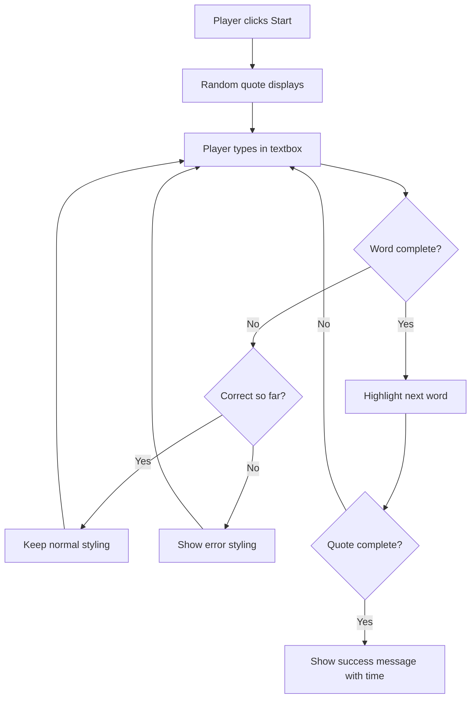
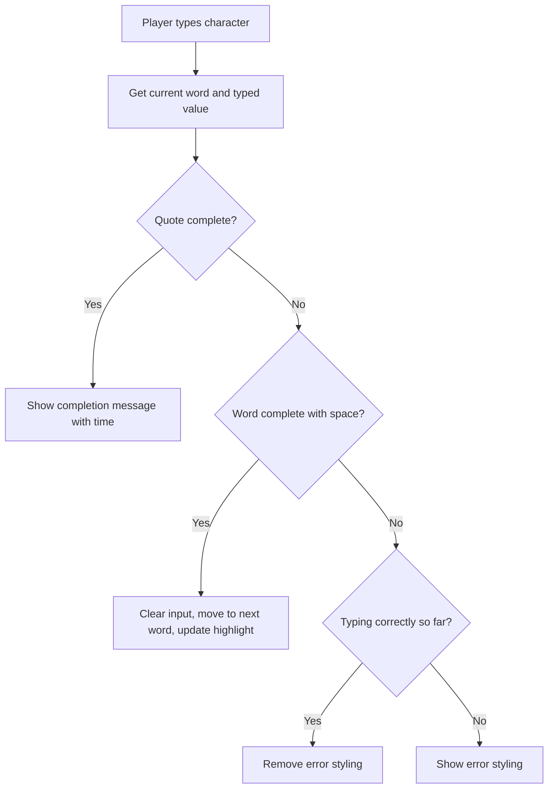
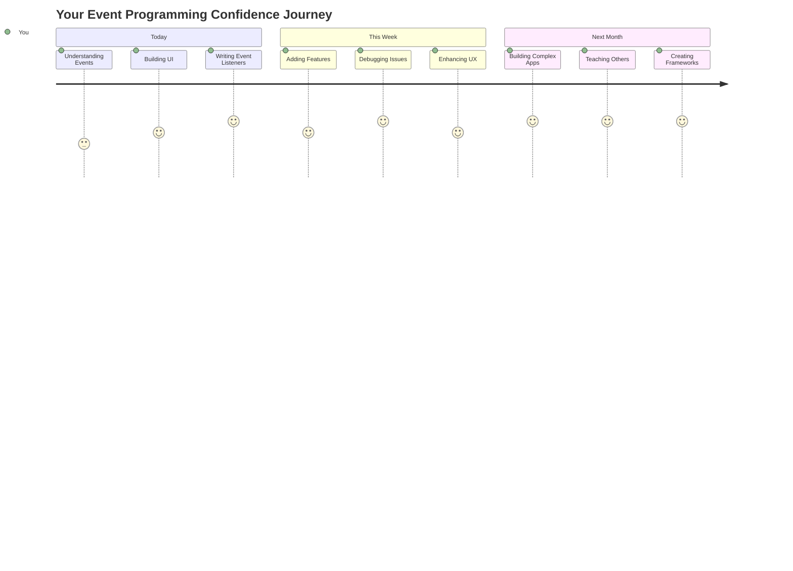

# イベントを使ったゲーム作成

ボタンをクリックしたり、テキストボックスに入力したりすると、ウェブサイトがどうやってそれを認識するのか不思議に思ったことはありませんか？それがイベント駆動型プログラミングの魔法です！この重要なスキルを学ぶために、何か役立つものを作りましょう。例えば、あなたのキー入力に反応するタイピング速度ゲームです。

ウェブブラウザがどのようにしてJavaScriptコードと「会話」するのかを実際に体験できます。クリック、入力、マウス移動のたびに、ブラウザは小さなメッセージ（これをイベントと呼びます）をコードに送信し、あなたがその応答を決めるのです！

この講座が終わる頃には、速度と正確さを追跡する本格的なタイピングゲームを作成できるようになります。そして、これまで使ったすべてのインタラクティブなウェブサイトを支える基本的な概念を理解することができます。それでは始めましょう！

## 講義前のクイズ

[講義前のクイズ](https://ff-quizzes.netlify.app/web/quiz/21)

## イベント駆動型プログラミング

お気に入りのアプリやウェブサイトについて考えてみてください。それが生き生きとしていて反応が良いと感じるのはなぜでしょうか？それは、あなたの行動にどのように反応するかにかかっています！タップ、クリック、スワイプ、キー入力のたびに「イベント」と呼ばれるものが発生し、ウェブ開発の本当の魔法がそこにあります。

ウェブプログラミングが面白い理由はここにあります。誰かがボタンをクリックしたり、テキストボックスに入力を始めたりするタイミングは予測できません。すぐにクリックするかもしれないし、5分待つかもしれないし、全くクリックしないかもしれません！この予測不可能性のため、コードの書き方を異なる視点で考える必要があります。

レシピのように上から下へと実行されるコードを書くのではなく、何かが起こるのをじっと待つコードを書くのです。これは、1800年代の電信オペレーターが機械のそばに座り、ワイヤーを通じてメッセージが届く瞬間に応答する準備をしていたのに似ています。

では、「イベント」とは具体的に何でしょうか？簡単に言えば、それは何かが起こることです！ボタンをクリックすること、それがイベントです。文字を入力すること、それもイベントです。マウスを動かすこと、それもまたイベントです。

イベント駆動型プログラミングでは、コードを設定して待機し、応答することができます。特定のことが起こるのを待つ特別な関数、つまり**イベントリスナー**を作成し、それが起こったときにすぐに動作します。

イベントリスナーをコードのためのドアベルのように考えてください。ドアベルを設定します（`addEventListener()`）、どんな音を聞くべきかを伝えます（例えば「クリック」や「キー入力」）、そして誰かが鳴らしたときに何をすべきかを指定します（あなたのカスタム関数）。

**イベントリスナーの仕組み:**
- **特定のユーザーアクション**（クリック、キー入力、マウス移動など）を待機
- **指定されたイベントが発生したときに**カスタムコードを実行
- **ユーザーの操作に即座に反応**し、シームレスな体験を提供
- **異なるリスナーを使用して**同じ要素で複数のイベントを処理

> **NOTE:** イベントリスナーを作成する方法は多数あります。匿名関数を使用したり、名前付き関数を作成したりできます。また、`click`プロパティを設定したり、`addEventListener()`を使用したりするショートカットもあります。この演習では、`addEventListener()`と匿名関数に焦点を当てます。これはウェブ開発者が最もよく使用する技術であり、最も柔軟性が高い方法です。`addEventListener()`はすべてのイベントに対応し、イベント名をパラメータとして提供できます。

### よく使われるイベント

ウェブブラウザは、リスニング可能なイベントを数十種類提供していますが、ほとんどのインタラクティブなアプリケーションはほんの一握りの基本的なイベントに依存しています。これらの主要なイベントを理解することで、洗練されたユーザーインタラクションを構築する基盤を得ることができます。

アプリケーションを作成する際にリスニング可能な[数十種類のイベント](https://developer.mozilla.org/docs/Web/Events)があります。基本的に、ユーザーがページ上で行うすべての操作がイベントを発生させます。これにより、ユーザーが望む体験を提供するための強力な手段が得られます。幸いにも、通常はほんの一握りのイベントだけで十分です。以下は一般的なイベントの例です（ゲーム作成時に使用する2つを含む）:

| イベント | 説明 | 主な使用例 |
|---------|------|-----------|
| `click` | ユーザーが何かをクリックした | ボタン、リンク、インタラクティブ要素 |
| `contextmenu` | ユーザーが右クリックした | カスタム右クリックメニュー |
| `select` | ユーザーがテキストを選択した | テキスト編集、コピー操作 |
| `input` | ユーザーがテキストを入力した | フォームの検証、リアルタイム検索 |

**これらのイベントタイプを理解する:**
- **特定の要素に対するユーザーの操作時にトリガーされる**
- **イベントオブジェクトを通じてユーザーの操作に関する詳細情報を提供**
- **レスポンシブでインタラクティブなウェブアプリケーションを作成可能**
- **異なるブラウザやデバイス間で一貫して動作**

## ゲーム作成

イベントの仕組みを理解したところで、その知識を実践に活かして何か役立つものを作りましょう。イベント処理を示しながら、重要な開発者スキルを身につけるタイピング速度ゲームを作成します。

JavaScriptのイベントの仕組みを探るためにゲームを作成します。このゲームではプレイヤーのタイピングスキルをテストします。タイピングスキルはすべての開発者にとって非常に重要なスキルです。面白い事実として、現在使用しているQWERTYキーボードレイアウトは1870年代にタイプライター用に設計されました。そして、今日でもプログラマーにとって良いタイピングスキルは非常に価値があります！ゲームの一般的な流れは以下のようになります:



**ゲームの仕組み:**
- **スタートボタンをクリックすると開始**し、ランダムな引用を表示
- **プレイヤーのタイピング進捗をリアルタイムで追跡**
- **現在の単語をハイライトしてプレイヤーの集中を促す**
- **タイピングエラーに即座に視覚的フィードバックを提供**
- **引用が完了したら合計時間を計算して表示**

それではゲームを作成し、イベントについて学びましょう！

### ファイル構成

コードを書く前に、整理しましょう！最初からきれいなファイル構成を持つことで、後々の頭痛を防ぎ、プロジェクトをよりプロフェッショナルにすることができます。😊

今回は、`index.html`（ページ構造用）、`script.js`（ゲームロジック用）、`style.css`（デザイン用）の3つのファイルだけでシンプルに進めます。この3つはウェブの大部分を支える基本的な構成です！

**コンソールまたはターミナルウィンドウを開き、以下のコマンドを実行して新しいフォルダを作成してください:**

```bash
# Linux or macOS
mkdir typing-game && cd typing-game

# Windows
md typing-game && cd typing-game
```

**これらのコマンドの内容:**
- **プロジェクトファイル用の新しいディレクトリ`typing-game`を作成**
- **作成したばかりのディレクトリに自動的に移動**
- **ゲーム開発のためのクリーンな作業スペースを設定**

**Visual Studio Codeを開く:**

```bash
code .
```

**このコマンドの内容:**
- **現在のディレクトリでVisual Studio Codeを起動**
- **プロジェクトフォルダをエディタで開く**
- **必要な開発ツールにアクセス可能にする**

**Visual Studio Codeで以下の名前の3つのファイルをフォルダに追加してください:**
- `index.html` - ゲームの構造とコンテンツを含む
- `script.js` - ゲームロジックとイベントリスナーを処理
- `style.css` - 視覚的な外観とスタイリングを定義

## ユーザーインターフェースの作成

次に、ゲームのアクションがすべて行われるステージを作りましょう！これは宇宙船のコントロールパネルを設計するようなものです。プレイヤーが必要とするすべてが期待通りの場所にあることを確認する必要があります。

ゲームに実際に必要なものを考えてみましょう。タイピングゲームをプレイするとしたら、画面に何が表示されてほしいですか？以下が必要なものです:

| UI要素 | 目的 | HTML要素 |
|--------|------|---------|
| 引用表示 | タイプするテキストを表示 | `<p>` with `id="quote"` |
| メッセージエリア | ステータスや成功メッセージを表示 | `<p>` with `id="message"` |
| テキスト入力 | プレイヤーが引用を入力する場所 | `<input>` with `id="typed-value"` |
| スタートボタン | ゲームを開始 | `<button>` with `id="start"` |

**UI構造の理解:**
- **コンテンツを論理的に上から下へ整理**
- **JavaScriptでターゲットにするためにユニークなIDを割り当て**
- **より良いユーザー体験のための明確な視覚的階層を提供**
- **アクセシビリティのためのセマンティックHTML要素を含む**

これらの要素にはIDが必要ですので、JavaScriptで操作できるようにします。また、作成するCSSとJavaScriptファイルへの参照も追加します。

新しいファイル`index.html`を作成し、以下のHTMLを追加してください:

```html
<!-- inside index.html -->
<html>
<head>
  <title>Typing game</title>
  <link rel="stylesheet" href="style.css">
</head>
<body>
  <h1>Typing game!</h1>
  <p>Practice your typing skills with a quote from Sherlock Holmes. Click **start** to begin!</p>
  <p id="quote"></p> <!-- This will display our quote -->
  <p id="message"></p> <!-- This will display any status messages -->
  <div>
    <input type="text" aria-label="current word" id="typed-value" /> <!-- The textbox for typing -->
    <button type="button" id="start">Start</button> <!-- To start the game -->
  </div>
  <script src="script.js"></script>
</body>
</html>
```

**このHTML構造が達成すること:**
- **CSSスタイルシートを`<head>`でリンクしてスタイリングを適用**
- **ユーザー向けの明確なヘッディングと指示を作成**
- **動的コンテンツ用の特定のIDを持つプレースホルダー段落を設定**
- **アクセシビリティ属性を持つ入力フィールドを含む**
- **ゲームをトリガーするスタートボタンを提供**
- **最適なパフォーマンスのためにJavaScriptファイルを最後にロード**

### アプリケーションの起動

開発中に頻繁にアプリケーションをテストすることで、問題を早期に発見し、進捗をリアルタイムで確認できます。Live Serverは、ファイルを保存するたびにブラウザを自動的に更新する非常に便利なツールで、開発を効率化します。

開発は常に反復的に行い、見た目を確認するのがベストです。アプリケーションを起動しましょう。Visual Studio Codeには素晴らしい拡張機能[Live Server](https://marketplace.visualstudio.com/items?itemName=ritwickdey.LiveServer&WT.mc_id=academic-77807-sagibbon)があります。この拡張機能は、ローカルでアプリケーションをホストし、ファイルを保存するたびにブラウザを更新します。

**リンクをクリックして[Live Server](https://marketplace.visualstudio.com/items?itemName=ritwickdey.LiveServer&WT.mc_id=academic-77807-sagibbon)をインストールしてください:**

**インストール中に起こること:**
- **ブラウザがVisual Studio Codeを開くよう促す**
- **拡張機能のインストールプロセスを案内**
- **Visual Studio Codeの再起動が必要な場合あり**

**インストール後、Visual Studio CodeでCtrl-Shift-P（またはCmd-Shift-P）をクリックしてコマンドパレットを開きます:**

**コマンドパレットの理解:**
- **すべてのVS Codeコマンドへの迅速なアクセスを提供**
- **入力中にコマンドを検索**
- **開発を迅速化するためのキーボードショートカットを提供**

**"Live Server: Open with Live Server"と入力します:**

**Live Serverの機能:**
- **プロジェクト用のローカル開発サーバーを開始**
- **ファイルを保存するたびにブラウザを自動更新**
- **ローカルURL（通常`localhost:5500`）からファイルを提供**

**ブラウザを開き、`https://localhost:5500`に移動します:**

作成したページが表示されるはずです！次に機能を追加しましょう。

## CSSの追加

次に、見た目を良くしましょう！視覚的なフィードバックは、コンピューティングの初期からユーザーインターフェースにとって重要でした。1980年代には、即時の視覚的フィードバックがユーザーのパフォーマンスを劇的に向上させ、エラーを減少させることが研究で明らかになりました。それをまさに作り出します。

ゲームでは何が起こっているのかを明確にする必要があります。プレイヤーはすぐにどの単語を入力すべきかを知るべきであり、間違いを犯した場合はすぐにそれを確認できるべきです。シンプルで効果的なスタイリングを作成しましょう:

新しいファイル`style.css`を作成し、以下の構文を追加してください。

```css
/* inside style.css */
.highlight {
  background-color: yellow;
}

.error {
  background-color: lightcoral;
  border: red;
}
```

**これらのCSSクラスの理解:**
- **現在の単語を黄色の背景でハイライトし、明確な視覚的ガイダンスを提供**
- **タイピングエラーをライトコーラルの背景色で示す**
- **ユーザーのタイピングフローを妨げることなく即時フィードバックを提供**
- **アクセシビリティと明確な視覚的コミュニケーションのためにコントラストのある色を使用**

✅ CSSに関しては、ページを好きなようにレイアウトできます。少し時間をかけてページをより魅力的にしてください:

- 別のフォントを選ぶ
- ヘッダーを色付けする
- アイテムをサイズ変更する

## JavaScript

ここからが面白いところです！🎉 HTML構造とCSSスタイリングは整いましたが、現時点ではゲームはエンジンのない美しい車のようなものです。JavaScriptがそのエンジンとなり、すべてが実際に動作し、プレイヤーの操作に反応するようになります。

ここであなたの作品が命を吹き込まれます。ステップバイステップで進めるので、圧倒されることはありません:

| ステップ | 目的 | 学べること |
|---------|------|----------|
| [定数の作成](../../../../4-typing-game/typing-game) | 引用とDOM参照を設定 | 変数管理とDOM選択 |
| [ゲーム開始のイベントリスナー](../../../../4-typing-game/typing-game) | ゲーム初期化を処理 | イベント処理とUI更新 |
| [タイピングのイベントリスナー](../../../../4-typing-game/typing-game) | ユーザー入力をリアルタイムで処理 | 入力検証と動的フィードバック |

**この構造化されたアプローチは以下を助けます:**
- **コードを論理的で管理しやすいセクションに整理**
- **機能を段階的に構築し、デバッグを容易に**
- **アプリケーションの異なる部分がどのように連携するかを理解**
- **将来のプロジェクトに再利用可能なパターンを作成**

まず、新しいファイル`script.js`を作成してください
| 引用の配列 | ゲームのすべての引用を保存 | `['Quote 1', 'Quote 2', ...]` |
| 単語の配列 | 現在の引用を個々の単語に分割 | `['When', 'you', 'have', ...]` |
| 単語インデックス | プレイヤーが入力している単語を追跡 | `0, 1, 2, 3...` |
| 開始時間 | スコア計算のための経過時間を計算 | `Date.now()` |

**UI要素への参照も必要です:**
| 要素 | ID | 目的 |
|------|----|------|
| テキスト入力 | `typed-value` | プレイヤーが入力する場所 |
| 引用表示 | `quote` | 入力する引用を表示 |
| メッセージエリア | `message` | 状況更新を表示 |

```javascript
// inside script.js
// all of our quotes
const quotes = [
    'When you have eliminated the impossible, whatever remains, however improbable, must be the truth.',
    'There is nothing more deceptive than an obvious fact.',
    'I ought to know by this time that when a fact appears to be opposed to a long train of deductions it invariably proves to be capable of bearing some other interpretation.',
    'I never make exceptions. An exception disproves the rule.',
    'What one man can invent another can discover.',
    'Nothing clears up a case so much as stating it to another person.',
    'Education never ends, Watson. It is a series of lessons, with the greatest for the last.',
];
// store the list of words and the index of the word the player is currently typing
let words = [];
let wordIndex = 0;
// the starting time
let startTime = Date.now();
// page elements
const quoteElement = document.getElementById('quote');
const messageElement = document.getElementById('message');
const typedValueElement = document.getElementById('typed-value');
```

**このセットアップコードが達成することを分解します:**
- **保存**: 引用が変更されないため、`const`を使用してシャーロック・ホームズの引用の配列を保存
- **初期化**: ゲームプレイ中に更新されるため、`let`を使用して追跡変数を初期化
- **取得**: 効率的なアクセスのために`document.getElementById()`を使用してDOM要素への参照を取得
- **セットアップ**: 明確で説明的な変数名を使用してゲーム機能の基盤を構築
- **整理**: 関連するデータと要素を論理的に整理し、コードの保守性を向上

✅ ゲームにさらに引用を追加してみましょう

> 💡 **プロのヒント**: `document.getElementById()`を使用してコード内でいつでも要素を取得できます。これらの要素を頻繁に参照するため、文字列リテラルのタイプミスを避けるために定数を使用します。[Vue.js](https://vuejs.org/)や[React](https://reactjs.org/)のようなフレームワークは、コードの集中管理をより良くするのに役立ちます。
>
**このアプローチが非常に効果的な理由:**
- **防止**: 要素を複数回参照する際のスペルミス
- **改善**: 説明的な定数名によるコードの読みやすさ
- **有効化**: オートコンプリートやエラーチェックによるIDEサポートの向上
- **簡易化**: 後で要素IDが変更された場合のリファクタリング

`const`、`let`、`var`の使用方法に関する動画を見てみましょう

[](https://youtube.com/watch?v=JNIXfGiDWM8 "変数の種類")

> 🎥 上の画像をクリックして変数に関する動画を視聴してください。

### 開始ロジックを追加

ここで全てが動き始めます！🚀 初めての本格的なイベントリスナーを記述する準備が整いました。ボタンをクリックするとコードが反応するのを見るのはとても満足感があります。

考えてみてください: どこかでプレイヤーが「開始」ボタンをクリックし、あなたのコードがその瞬間に対応する必要があります。いつクリックされるかは分かりません - すぐかもしれないし、コーヒーを取ってからかもしれません - でもクリックされたら、ゲームが動き出します。

ユーザーが`start`をクリックすると、引用を選択し、ユーザーインターフェースをセットアップし、現在の単語とタイミングの追跡をセットアップする必要があります。以下は追加する必要があるJavaScriptで、その後スクリプトブロックについて説明します。

```javascript
// at the end of script.js
document.getElementById('start').addEventListener('click', () => {
  // get a quote
  const quoteIndex = Math.floor(Math.random() * quotes.length);
  const quote = quotes[quoteIndex];
  // Put the quote into an array of words
  words = quote.split(' ');
  // reset the word index for tracking
  wordIndex = 0;

  // UI updates
  // Create an array of span elements so we can set a class
  const spanWords = words.map(function(word) { return `<span>${word} </span>`});
  // Convert into string and set as innerHTML on quote display
  quoteElement.innerHTML = spanWords.join('');
  // Highlight the first word
  quoteElement.childNodes[0].className = 'highlight';
  // Clear any prior messages
  messageElement.innerText = '';

  // Setup the textbox
  // Clear the textbox
  typedValueElement.value = '';
  // set focus
  typedValueElement.focus();
  // set the event handler

  // Start the timer
  startTime = new Date().getTime();
});
```

**コードを論理的なセクションに分解してみましょう:**

**📊 単語追跡セットアップ:**
- **選択**: `Math.floor()`と`Math.random()`を使用してランダムな引用を選択
- **変換**: 引用を`split(' ')`で個々の単語の配列に変換
- **リセット**: プレイヤーが最初の単語から始めるため`wordIndex`を0にリセット
- **準備**: 新しいラウンドのゲーム状態を準備

**🎨 UIセットアップと表示:**
- **作成**: `<span>`要素の配列を作成し、各単語を個別にスタイリング
- **結合**: スパン要素を単一の文字列に結合し、効率的なDOM更新を実現
- **ハイライト**: 最初の単語を`highlight`CSSクラスを追加して強調表示
- **クリア**: 前回のゲームメッセージをクリアし、クリーンな状態を提供

**⌨️ テキストボックスの準備:**
- **クリア**: 入力フィールド内の既存のテキストをクリア
- **フォーカス設定**: プレイヤーがすぐに入力を開始できるようにテキストボックスにフォーカスを設定
- **準備**: 新しいゲームセッションの入力エリアを準備

**⏱️ タイマー初期化:**
- **取得**: `new Date().getTime()`を使用して現在のタイムスタンプを取得
- **正確な計算**: タイピング速度と完了時間を正確に計算
- **開始**: ゲームセッションのパフォーマンストラッキングを開始

### タイピングロジックを追加

ここでゲームの核心に取り組みます！最初は少し多く感じるかもしれませんが、すべての部分を一緒に見ていくと、その論理性が理解できるようになります。

ここで構築するのは非常に洗練されたものです: 誰かが文字を入力するたびに、コードが入力内容を確認し、フィードバックを提供し、次に何をすべきかを決定します。これは1970年代のWordStarのような初期のワードプロセッサがタイピストにリアルタイムのフィードバックを提供した方法に似ています。

```javascript
// at the end of script.js
typedValueElement.addEventListener('input', () => {
  // Get the current word
  const currentWord = words[wordIndex];
  // get the current value
  const typedValue = typedValueElement.value;

  if (typedValue === currentWord && wordIndex === words.length - 1) {
    // end of sentence
    // Display success
    const elapsedTime = new Date().getTime() - startTime;
    const message = `CONGRATULATIONS! You finished in ${elapsedTime / 1000} seconds.`;
    messageElement.innerText = message;
  } else if (typedValue.endsWith(' ') && typedValue.trim() === currentWord) {
    // end of word
    // clear the typedValueElement for the new word
    typedValueElement.value = '';
    // move to the next word
    wordIndex++;
    // reset the class name for all elements in quote
    for (const wordElement of quoteElement.childNodes) {
      wordElement.className = '';
    }
    // highlight the new word
    quoteElement.childNodes[wordIndex].className = 'highlight';
  } else if (currentWord.startsWith(typedValue)) {
    // currently correct
    // highlight the next word
    typedValueElement.className = '';
  } else {
    // error state
    typedValueElement.className = 'error';
  }
});
```

**タイピングロジックの流れを理解する:**

この関数はウォーターフォールアプローチを使用し、最も具体的な条件から最も一般的な条件までをチェックします。それぞれのシナリオを分解してみましょう:



**🏁 引用完了 (シナリオ1):**
- **確認**: 入力値が現在の単語と一致し、かつ最後の単語であるかどうか
- **計算**: 開始時間から現在時間を引いて経過時間を計算
- **変換**: ミリ秒を秒に変換するために1,000で割る
- **表示**: 完了時間を含む祝福メッセージを表示

**✅ 単語完了 (シナリオ2):**
- **検出**: 入力がスペースで終わると単語完了を検出
- **検証**: トリムされた入力が現在の単語と完全に一致するか確認
- **クリア**: 次の単語のために入力フィールドをクリア
- **進行**: `wordIndex`をインクリメントして次の単語に進む
- **更新**: すべてのクラスを削除し、新しい単語を強調表示

**📝 タイピング進行中 (シナリオ3):**
- **検証**: 現在の単語が入力された内容で始まるか確認
- **削除**: エラースタイリングを削除して入力が正しいことを示す
- **許可**: 中断なしでタイピングを続行可能

**❌ エラーステート (シナリオ4):**
- **トリガー**: 入力されたテキストが期待される単語の始まりと一致しない場合
- **適用**: 即時の視覚的フィードバックを提供するためにエラーCSSクラスを適用
- **支援**: プレイヤーが迅速に間違いを特定し修正できるようにする

## アプリケーションをテストする

やりましたね！🎉 イベント駆動型プログラミングを使用してゼロから実際に動作するタイピングゲームを構築しました。これがどれほど大変なことか、少し時間を取って実感してください。

次はテストフェーズです！期待通りに動作するでしょうか？何か見落としはないでしょうか？ここで重要なのは、すぐに完璧に動作しない場合でも、それは完全に普通のことです。経験豊富な開発者でもコードにバグを見つけることは日常的です。それが開発プロセスの一部です！

`start`をクリックして、タイピングを始めてみましょう！以前見たアニメーションのように動作するはずです。


**アプリケーションでテストすること:**
- **確認**: 開始をクリックするとランダムな引用が表示されるか
- **検証**: タイピングが現在の単語を正しく強調表示するか
- **チェック**: 間違ったタイピングでエラースタイリングが表示されるか
- **確認**: 単語を完了すると強調表示が正しく進むか
- **テスト**: 引用を完了すると完了メッセージとタイミングが表示されるか

**一般的なデバッグのヒント:**
- **確認**: ブラウザコンソール (F12) でJavaScriptエラーをチェック
- **検証**: すべてのファイル名が正確に一致しているか (大文字小文字を区別)
- **確認**: Live Serverが正しく動作し、更新されているか
- **テスト**: ランダム選択が機能するか確認するために異なる引用を試す

---

## GitHub Copilot Agentチャレンジ 🎮

Agentモードを使用して以下のチャレンジを完了してください:

**説明:** プレイヤーのパフォーマンスに基づいてゲームを調整する難易度システムを実装してタイピングゲームを拡張します。このチャレンジでは、高度なイベント処理、データ分析、動的UI更新を練習できます。

**プロンプト:** タイピングゲームに以下を実装する難易度調整システムを作成してください:
1. プレイヤーのタイピング速度 (1分あたりの単語数) と正確性のパーセンテージを追跡
2. 自動的に3つの難易度レベルに調整: 簡単 (シンプルな引用)、中級 (現在の引用)、難しい (句読点を含む複雑な引用)
3. 現在の難易度レベルとプレイヤーの統計をUIに表示
4. 3回連続で良いパフォーマンスを達成すると難易度を上げるストリークカウンターを実装
5. 難易度の変化を示す視覚的フィードバック (色、アニメーション) を追加

必要なHTML要素、CSSスタイル、JavaScript関数を追加してこの機能を実装してください。適切なエラーハンドリングを含め、ゲームが適切なARIAラベルでアクセシブルであることを確認してください。

[agent mode](https://code.visualstudio.com/blogs/2025/02/24/introducing-copilot-agent-mode)について詳しく学びましょう。

## 🚀 チャレンジ

タイピングゲームを次のレベルに引き上げる準備はできましたか？イベント処理とDOM操作の理解を深めるためにこれらの高度な機能を実装してみてください:

**さらに機能を追加する:**

| 機能 | 説明 | 練習するスキル |
|------|------|---------------|
| **入力制御** | 完了時に`input`イベントリスナーを無効化し、ボタンがクリックされたときに再有効化 | イベント管理と状態制御 |
| **UI状態管理** | プレイヤーが引用を完了したときにテキストボックスを無効化 | DOMプロパティ操作 |
| **モーダルダイアログ** | 成功メッセージを表示するモーダルダイアログボックスを表示 | 高度なUIパターンとアクセシビリティ |
| **ハイスコアシステム** | `localStorage`を使用してハイスコアを保存 | ブラウザストレージAPIとデータ永続性 |

**実装のヒント:**
- **調査**: 永続的なストレージのために`localStorage.setItem()`と`localStorage.getItem()`を調べる
- **練習**: イベントリスナーを動的に追加および削除する
- **探索**: HTMLダイアログ要素またはCSSモーダルパターン
- **考慮**: フォームコントロールを無効化および有効化する際のアクセシビリティ

## 講義後のクイズ

[講義後のクイズ](https://ff-quizzes.netlify.app/web/quiz/22)

---

## 🚀 タイピングゲーム習得タイムライン

### ⚡ **次の5分間でできること**
- [ ] 異なる引用でタイピングゲームをテストしてスムーズに動作するか確認
- [ ] CSSスタイリングを試してみる - ハイライトやエラーの色を変更してみる
- [ ] ブラウザのDevTools (F12) を開いてプレイ中にコンソールを確認
- [ ] 自分自身に挑戦して引用をできるだけ早く完了してみる

### ⏰ **この1時間で達成できること**
- [ ] 配列にさらに引用を追加 (お気に入りの本や映画から引用してみる)
- [ ] チャレンジセクションのlocalStorageハイスコアシステムを実装
- [ ] 各ゲーム後に表示される1分あたりの単語数計算機を作成
- [ ] 正しいタイピング、エラー、完了時の効果音を追加

### 📅 **1週間の冒険**
- [ ] 友達が並んで競争できるマルチプレイヤーバージョンを構築
- [ ] 引用の複雑さが異なる難易度レベルを作成
- [ ] 引用の完了度を示す進行バーを追加
- [ ] 個人統計追跡付きのユーザーアカウントを実装
- [ ] カスタムテーマをデザインし、ユーザーが好みのスタイリングを選択できるようにする

### 🗓️ **1ヶ月間の変革**
- [ ] 適切な指の配置を段階的に教えるレッスン付きのタイピングコースを作成
- [ ] 最もエラーが多い文字や単語を示す分析を構築
- [ ] 異なる言語やキーボードレイアウトをサポート
- [ ] 文学データベースから引用を取得する教育APIと統合
- [ ] 他の人が使用して楽しめるように拡張されたタイピングゲームを公開

### 🎯 **最終的な振り返りチェックイン**

**次に進む前に、少し時間を取って祝福しましょう:**
- このゲームを構築する中で最も満足感を得た瞬間は何でしたか？
- イベント駆動型プログラミングについて、始めたときと比べてどう感じますか？
- このゲームをユニークなものにするために追加したい機能は何ですか？
- イベント処理の概念を他のプロジェクトにどのように適用しますか？



> 🌟 **覚えておいてください**: あなたはインタラクティブなウェブサイトやアプリケーションを動かすコアコンセプトをマスターしました。イベント駆動型プログラミングは、ウェブを生き生きとし、応答性を持たせるものです。ドロップダウンメニュー、入力中に検証するフォーム、クリックに反応するゲームを見るたびに、その背後にある魔法を理解しています。あなたはただコードを学んでいるだけではなく、直感的で魅力的な体験を作り出す方法を学んでいるのです！ 🎉

---

## レビューと自己学習

[利用可能なす

---

**免責事項**:  
この文書はAI翻訳サービス[Co-op Translator](https://github.com/Azure/co-op-translator)を使用して翻訳されています。正確性を追求しておりますが、自動翻訳には誤りや不正確な部分が含まれる可能性があります。元の言語で記載された文書を正式な情報源としてご参照ください。重要な情報については、専門の人間による翻訳を推奨します。この翻訳の使用に起因する誤解や誤認について、当方は一切の責任を負いません。