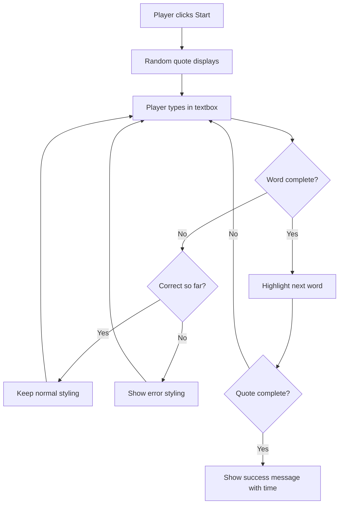
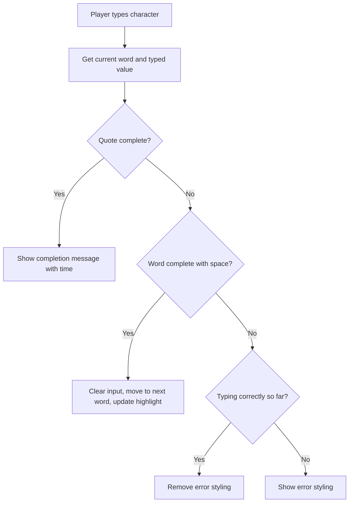

<!--
CO_OP_TRANSLATOR_METADATA:
{
  "original_hash": "e6b75e5b8caae906473a8a09d77b7121",
  "translation_date": "2025-10-24T15:11:58+00:00",
  "source_file": "4-typing-game/typing-game/README.md",
  "language_code": "ja"
}
-->
# イベントを使ったゲーム作成

ウェブサイトがボタンをクリックしたり、テキストボックスに入力したりしたことをどうやって知るのか、不思議に思ったことはありませんか？それがイベント駆動型プログラミングの魔法です！この重要なスキルを学ぶために、何か役立つものを作るのが一番です。今回は、あなたのタイピング速度を測定するゲームを作りながら学びましょう。

ウェブブラウザがどのようにしてJavaScriptコードと「会話」するのかを実際に体験できます。クリック、入力、マウス移動をするたびに、ブラウザは小さなメッセージ（これをイベントと呼びます）をコードに送信し、あなたがその応答を決めるのです！

このレッスンが終わる頃には、速度と正確さを追跡する本格的なタイピングゲームを作成できるようになります。そして、これまで使ったことのあるすべてのインタラクティブなウェブサイトを支える基本的な概念を理解できるようになります。それでは始めましょう！

## 講義前のクイズ

[講義前のクイズ](https://ff-quizzes.netlify.app/web/quiz/21)

## イベント駆動型プログラミング

お気に入りのアプリやウェブサイトについて考えてみてください。それが生き生きとしていて反応が良いと感じるのはなぜでしょうか？それは、あなたの行動にどのように反応するかにかかっています！タップ、クリック、スワイプ、またはキー入力のたびに「イベント」と呼ばれるものが発生し、ウェブ開発の本当の魔法がそこにあります。

ウェブプログラミングが面白い理由はここにあります：誰かがボタンをクリックしたり、テキストボックスに入力を始めたりするタイミングを予測することはできません。すぐにクリックするかもしれないし、5分待つかもしれないし、全くクリックしないかもしれません！この予測不可能性のために、コードを書く方法を少し違った視点で考える必要があります。

レシピのように上から下へと実行されるコードを書く代わりに、何かが起こるのをじっと待つコードを書くのです。これは、1800年代の電信オペレーターが機械のそばに座り、ワイヤーを通じてメッセージが届く瞬間に対応する準備をしていたのに似ています。

では、「イベント」とは具体的に何でしょうか？簡単に言えば、それは何かが「起こる」ことです！ボタンをクリックすること、それがイベントです。文字を入力すること、それもイベントです。マウスを動かすこと、それもまたイベントです。

イベント駆動型プログラミングでは、コードを設定して待機し、応答することができます。特定のことが起こるのを待つ特別な関数、**イベントリスナー**を作成し、それが起こったときにすぐに動作します。

イベントリスナーをコードのためのドアベルのように考えてください。ドアベルを設定する（`addEventListener()`）、どんな音を聞くべきかを伝える（例えば「クリック」や「キー入力」）、そして誰かが鳴らしたときに何をするべきかを指定する（あなたのカスタム関数）。

**イベントリスナーの仕組み:**
- **特定のユーザーアクション**（クリック、キー入力、マウス移動など）を「聞く」
- **指定されたイベントが発生したときに**カスタムコードを実行する
- **ユーザーの操作に即座に応答し**、シームレスな体験を提供する
- **異なるリスナーを使用して**同じ要素で複数のイベントを処理する

> **NOTE:** イベントリスナーを作成する方法はたくさんあります。匿名関数を使用したり、名前付き関数を作成したりできます。また、`click`プロパティを設定したり、`addEventListener()`を使用したりするなど、さまざまなショートカットがあります。この演習では、`addEventListener()`と匿名関数に焦点を当てます。これはおそらくウェブ開発者が最もよく使用する技術であり、最も柔軟です。`addEventListener()`はすべてのイベントに対応し、イベント名をパラメータとして提供できます。

### よく使われるイベント

ウェブブラウザは数十種類のイベントを提供していますが、ほとんどのインタラクティブなアプリケーションは、ほんの一握りの基本的なイベントに依存しています。これらの主要なイベントを理解することで、洗練されたユーザーインタラクションを構築する基盤を得ることができます。

アプリケーションを作成する際にリスニングできる[数十種類のイベント](https://developer.mozilla.org/docs/Web/Events)があります。基本的に、ユーザーがページ上で行うすべての操作がイベントを発生させます。これにより、ユーザーが望む体験を提供するための大きな力を得ることができます。幸いなことに、通常はほんの一握りのイベントだけで十分です。以下は、一般的なイベントのいくつか（ゲーム作成時に使用する2つを含む）です：

| イベント | 説明 | 一般的な使用例 |
|---------|------|----------------|
| `click` | ユーザーが何かをクリックした | ボタン、リンク、インタラクティブ要素 |
| `contextmenu` | ユーザーが右クリックした | カスタム右クリックメニュー |
| `select` | ユーザーがテキストを選択した | テキスト編集、コピー操作 |
| `input` | ユーザーがテキストを入力した | フォーム検証、リアルタイム検索 |

**これらのイベントタイプを理解する:**
- **トリガー**：ユーザーがページ上の特定の要素とインタラクションしたとき
- **提供**：イベントオブジェクトを通じてユーザーの操作に関する詳細情報
- **可能にする**：応答性の高いインタラクティブなウェブアプリケーションの作成
- **一貫性を保つ**：異なるブラウザやデバイス間での動作

## ゲーム作成

イベントの仕組みを理解したところで、その知識を実践に活かして何か役立つものを作りましょう。イベント処理を示しながら、重要な開発スキルを身につけるためのタイピング速度ゲームを作成します。

JavaScriptでイベントがどのように機能するかを探るためにゲームを作成します。このゲームではプレイヤーのタイピングスキルをテストします。タイピングスキルはすべての開発者が持つべき重要なスキルの1つです。豆知識：今日私たちが使っているQWERTYキーボードレイアウトは、実は1870年代にタイプライター用に設計されたものです。そして、タイピングスキルは今日でもプログラマーにとって非常に価値があります！ゲームの一般的な流れは以下のようになります：



**ゲームの仕組み:**
- **開始**：プレイヤーがスタートボタンをクリックするとランダムな引用文が表示される
- **追跡**：プレイヤーのタイピング進行状況をリアルタイムで単語ごとに追跡
- **ハイライト**：現在の単語を強調表示してプレイヤーの集中を促す
- **即時フィードバック**：タイピングエラーに対する視覚的なフィードバックを提供
- **計算と表示**：引用文が完了したら合計時間を表示

それではゲームを作成しながら、イベントについて学びましょう！

### ファイル構成

コードを書く前に、まず整理しましょう！最初からきれいなファイル構成を整えることで、後々の頭痛の種を減らし、プロジェクトをよりプロフェッショナルにすることができます 😊

今回は、`index.html`（ページ構造用）、`script.js`（ゲームロジック用）、`style.css`（見た目を良くするため）という3つのファイルだけを使ってシンプルに進めます。これらはウェブの大部分を支えるクラシックなトリオです！

**コンソールまたはターミナルウィンドウを開き、以下のコマンドを実行して新しいフォルダを作成してください:**

```bash
# Linux or macOS
mkdir typing-game && cd typing-game

# Windows
md typing-game && cd typing-game
```

**これらのコマンドが行うこと:**
- **新しいディレクトリ** `typing-game` を作成し、プロジェクトファイルを格納
- **自動的に**新しく作成したディレクトリに移動
- **クリーンな作業スペース**をゲーム開発のために設定

**Visual Studio Codeを開く:**

```bash
code .
```

**このコマンドが行うこと:**
- **現在のディレクトリで**Visual Studio Codeを起動
- **プロジェクトフォルダを**エディタで開く
- **必要な開発ツール**へのアクセスを提供

**Visual Studio Codeで以下の名前の3つのファイルをフォルダに追加してください:**
- `index.html` - ゲームの構造とコンテンツを含む
- `script.js` - ゲームロジックとイベントリスナーを処理
- `style.css` - 見た目とスタイリングを定義

## ユーザーインターフェースの作成

次に、ゲームのアクションがすべて行われる舞台を作りましょう！これは宇宙船のコントロールパネルを設計するようなものです。プレイヤーが必要とするすべてが期待通りの場所にあることを確認する必要があります。

ゲームに実際に必要なものを考えてみましょう。タイピングゲームをプレイしているとしたら、画面に何が表示されていると嬉しいでしょうか？以下が必要なものです：

| UI要素 | 目的 | HTML要素 |
|--------|------|---------|
| 引用文表示 | タイプするテキストを表示 | `<p>` with `id="quote"` |
| メッセージエリア | ステータスや成功メッセージを表示 | `<p>` with `id="message"` |
| テキスト入力 | プレイヤーが引用文を入力する場所 | `<input>` with `id="typed-value"` |
| スタートボタン | ゲームを開始 | `<button>` with `id="start"` |

**UI構造の理解:**
- **コンテンツを論理的に整理**（上から下へ）
- **JavaScriptでターゲットにするために**ユニークなIDを割り当てる
- **明確な視覚的階層を提供**してユーザー体験を向上
- **アクセシビリティのために**セマンティックHTML要素を含む

これらの要素にはそれぞれIDが必要です。これにより、JavaScriptで操作できるようになります。また、作成するCSSとJavaScriptファイルへの参照も追加します。

新しいファイル`index.html`を作成し、以下のHTMLを追加してください:

```html
<!-- inside index.html -->
<html>
<head>
  <title>Typing game</title>
  <link rel="stylesheet" href="style.css">
</head>
<body>
  <h1>Typing game!</h1>
  <p>Practice your typing skills with a quote from Sherlock Holmes. Click **start** to begin!</p>
  <p id="quote"></p> <!-- This will display our quote -->
  <p id="message"></p> <!-- This will display any status messages -->
  <div>
    <input type="text" aria-label="current word" id="typed-value" /> <!-- The textbox for typing -->
    <button type="button" id="start">Start</button> <!-- To start the game -->
  </div>
  <script src="script.js"></script>
</body>
</html>
```

**このHTML構造が達成すること:**
- **CSSスタイルシートを** `<head>` にリンクしてスタイリングを適用
- **ユーザー向けの明確な見出しと指示を作成**
- **動的コンテンツ用に特定のIDを持つプレースホルダー段落を設定**
- **アクセシビリティ属性を持つ入力フィールドを含む**
- **ゲームを開始するためのスタートボタンを提供**
- **最適なパフォーマンスのために** JavaScriptファイルを最後に読み込む

### アプリケーションの起動

開発中に頻繁にアプリケーションをテストすることで、問題を早期に発見し、進捗をリアルタイムで確認できます。Live Serverは、ファイルを保存するたびにブラウザを自動的に更新してくれる非常に便利なツールです。これにより、開発が効率的になります。

開発中は段階的に進めて、見た目を確認するのがベストです。アプリケーションを起動しましょう。Visual Studio Codeには[Live Server](https://marketplace.visualstudio.com/items?itemName=ritwickdey.LiveServer&WT.mc_id=academic-77807-sagibbon)という素晴らしい拡張機能があります。この拡張機能は、ローカルでアプリケーションをホストし、ファイルを保存するたびにブラウザを更新してくれます。

**[Live Server](https://marketplace.visualstudio.com/items?itemName=ritwickdey.LiveServer&WT.mc_id=academic-77807-sagibbon)をインストールするには、リンクをクリックして「インストール」を選択してください:**

**インストール中に起こること:**
- **ブラウザが** Visual Studio Codeを開くよう促す
- **拡張機能のインストールプロセスを案内**
- **Visual Studio Codeの再起動が必要になる場合あり**

**インストール後、Visual Studio CodeでCtrl-Shift-P（またはCmd-Shift-P）をクリックしてコマンドパレットを開きます:**

**コマンドパレットの理解:**
- **すべてのVS Codeコマンドへの**迅速なアクセスを提供
- **入力中にコマンドを検索**
- **開発を迅速化するための**キーボードショートカットを提供

**「Live Server: Open with Live Server」と入力します:**

**Live Serverの機能:**
- **プロジェクト用のローカル開発サーバーを開始**
- **ファイルを保存するとブラウザを自動更新**
- **ローカルURL（通常は`localhost:5500`）からファイルを提供**

**ブラウザを開き、`https://localhost:5500`に移動します:**

作成したページが表示されるはずです！次に機能を追加していきましょう。

## CSSの追加

次は見た目を良くしましょう！視覚的なフィードバックは、コンピューティングの初期からユーザーインターフェースにとって重要でした。1980年代には、即時の視覚的フィードバックがユーザーのパフォーマンスを劇的に向上させ、エラーを減少させることが研究によって発見されました。これがまさに私たちが作ろうとしているものです。

ゲームでは何が起こっているのかを明確にする必要があります。プレイヤーはすぐにどの単語を入力するべきかを知ることができ、間違いを犯した場合はすぐにそれを確認できるべきです。シンプルで効果的なスタイリングを作成しましょう：

新しいファイル`style.css`を作成し、以下の構文を追加してください。

```css
/* inside style.css */
.highlight {
  background-color: yellow;
}

.error {
  background-color: lightcoral;
  border: red;
}
```

**これらのCSSクラスの理解:**
- **現在の単語を黄色の背景で強調表示し**、明確な視覚的ガイダンスを提供
- **タイピングエラーをライトコーラルの背景色で示し**、エラーを視覚的に通知
- **ユーザーのタイピングフローを妨げることなく即時フィードバックを提供**
- **アクセシビリティと明確な視覚的コミュニケーションのために**コントラストのある色を使用

✅ CSSに関しては、ページを好きなようにレイアウトできます。少し時間をかけてページをより魅力的にしてください：

- 別のフォントを選ぶ
- ヘッダーに色を付ける
- アイテムのサイズを変更する

## JavaScript

ここからが面白いところです！🎉 HTML構造とCSSスタイリングは整いましたが、現時点ではゲームはエンジンのない美しい車のようなものです。JavaScriptがそのエンジンとなり、すべてを実際に動作させ、プレイヤーの操作に応答するようにします。

ここであなたの作品が命を吹き込まれます。ステップバイステップで進めるので、圧倒されることはありません：

| ステップ | 目的 | 学ぶこと |
|---------|------|---------|
| [定数の作成](../../../../4-typing-game/typing-game) | 引用文とDOM参照を設定 | 変数管理とDOM選択 |
| [ゲーム開始のイベントリスナー](#
| 名言の配列 | ゲームで使用するすべての名言を保存 | `['名言1', '名言2', ...]` |
| 単語の配列 | 現在の名言を個々の単語に分割 | `['When', 'you', 'have', ...]` |
| 単語インデックス | プレイヤーが入力している単語を追跡 | `0, 1, 2, 3...` |
| 開始時間 | スコア計算のための経過時間を計算 | `Date.now()` |

**UI要素への参照も必要です:**
| 要素 | ID | 目的 |
|------|----|------|
| テキスト入力 | `typed-value` | プレイヤーが入力する場所 |
| 名言表示 | `quote` | 入力する名言を表示 |
| メッセージエリア | `message` | 状況更新を表示 |

```javascript
// inside script.js
// all of our quotes
const quotes = [
    'When you have eliminated the impossible, whatever remains, however improbable, must be the truth.',
    'There is nothing more deceptive than an obvious fact.',
    'I ought to know by this time that when a fact appears to be opposed to a long train of deductions it invariably proves to be capable of bearing some other interpretation.',
    'I never make exceptions. An exception disproves the rule.',
    'What one man can invent another can discover.',
    'Nothing clears up a case so much as stating it to another person.',
    'Education never ends, Watson. It is a series of lessons, with the greatest for the last.',
];
// store the list of words and the index of the word the player is currently typing
let words = [];
let wordIndex = 0;
// the starting time
let startTime = Date.now();
// page elements
const quoteElement = document.getElementById('quote');
const messageElement = document.getElementById('message');
const typedValueElement = document.getElementById('typed-value');
```

**このセットアップコードが達成することを分解してみましょう:**
- 名言が変更されないため、`const`を使用してシャーロック・ホームズの名言の配列を**保存**
- ゲームプレイ中に値が更新されるため、`let`を使用して追跡変数を**初期化**
- 効率的なアクセスのために`document.getElementById()`を使用してDOM要素への参照を**取得**
- 明確で説明的な変数名を使用して、すべてのゲーム機能の基盤を**設定**
- 関連するデータと要素を論理的に**整理**し、コードの保守性を向上

✅ ゲームにさらに多くの名言を追加してみましょう

> 💡 **プロのヒント**: `document.getElementById()`を使用することで、コード内でいつでも要素を取得できます。これらの要素を頻繁に参照するため、文字列リテラルのタイプミスを避けるために定数を使用します。[Vue.js](https://vuejs.org/)や[React](https://reactjs.org/)のようなフレームワークは、コードの集中管理をより良くするのに役立ちます。
>
**このアプローチが非常に効果的な理由:**
- 要素を複数回参照する際のスペルミスを**防止**
- 説明的な定数名でコードの読みやすさを**向上**
- オートコンプリートやエラーチェックによるIDEサポートを**強化**
- 要素IDが後で変更された場合のリファクタリングを**容易化**

`const`、`let`、`var`の使用方法に関する動画を視聴してみましょう

[](https://youtube.com/watch?v=JNIXfGiDWM8 "変数の種類")

> 🎥 上の画像をクリックして変数に関する動画を視聴してください。

### スタートロジックを追加

ここからすべてが動き始めます！🚀 初めての本格的なイベントリスナーを書く準備が整いました。ボタンをクリックしたときにコードが反応するのを見るのはとても満足感があります。

考えてみてください: どこかでプレイヤーが「スタート」ボタンをクリックする瞬間が来ます。その時、あなたのコードは準備ができていなければなりません。いつクリックされるかはわかりません - すぐかもしれないし、コーヒーを取った後かもしれません - でもクリックされたら、ゲームが動き出します。

ユーザーが`start`をクリックしたとき、名言を選択し、ユーザーインターフェースを設定し、現在の単語とタイミングの追跡を設定する必要があります。以下は追加する必要があるJavaScriptで、その後スクリプトブロックについて説明します。

```javascript
// at the end of script.js
document.getElementById('start').addEventListener('click', () => {
  // get a quote
  const quoteIndex = Math.floor(Math.random() * quotes.length);
  const quote = quotes[quoteIndex];
  // Put the quote into an array of words
  words = quote.split(' ');
  // reset the word index for tracking
  wordIndex = 0;

  // UI updates
  // Create an array of span elements so we can set a class
  const spanWords = words.map(function(word) { return `<span>${word} </span>`});
  // Convert into string and set as innerHTML on quote display
  quoteElement.innerHTML = spanWords.join('');
  // Highlight the first word
  quoteElement.childNodes[0].className = 'highlight';
  // Clear any prior messages
  messageElement.innerText = '';

  // Setup the textbox
  // Clear the textbox
  typedValueElement.value = '';
  // set focus
  typedValueElement.focus();
  // set the event handler

  // Start the timer
  startTime = new Date().getTime();
});
```

**コードを論理的なセクションに分解してみましょう:**

**📊 単語追跡のセットアップ:**
- バリエーションを持たせるために`Math.floor()`と`Math.random()`を使用してランダムな名言を**選択**
- 名言を`split(' ')`を使用して個々の単語の配列に**変換**
- プレイヤーが最初の単語から始めるために`wordIndex`を0に**リセット**
- 新しいラウンドのためにゲーム状態を**準備**

**🎨 UIのセットアップと表示:**
- 各単語を個別にスタイリングするために`<span>`要素の配列を**作成**
- 効率的なDOM更新のためにスパン要素を単一の文字列に**結合**
- `highlight` CSSクラスを追加して最初の単語を**強調表示**
- クリーンな状態を提供するために以前のゲームメッセージを**クリア**

**⌨️ テキストボックスの準備:**
- 入力フィールド内の既存のテキストを**クリア**
- プレイヤーがすぐに入力を開始できるようにテキストボックスに**フォーカスを設定**
- 新しいゲームセッションのために入力エリアを**準備**

**⏱️ タイマーの初期化:**
- `new Date().getTime()`を使用して現在のタイムスタンプを**取得**
- 入力速度と完了時間を正確に計算できるように**設定**
- ゲームセッションのパフォーマンス追跡を**開始**

### 入力ロジックを追加

ここでゲームの核心に取り組みます！最初は少し多く感じるかもしれませんが、すべての部分を一緒に歩いていくので、最終的にはその論理性が理解できるでしょう。

ここで構築するのは非常に洗練されたものです: 誰かが文字を入力するたびに、コードが入力内容を確認し、フィードバックを提供し、次に何をすべきかを決定します。これは1970年代のWordStarのような初期のワードプロセッサがタイピストにリアルタイムのフィードバックを提供した方法に似ています。

```javascript
// at the end of script.js
typedValueElement.addEventListener('input', () => {
  // Get the current word
  const currentWord = words[wordIndex];
  // get the current value
  const typedValue = typedValueElement.value;

  if (typedValue === currentWord && wordIndex === words.length - 1) {
    // end of sentence
    // Display success
    const elapsedTime = new Date().getTime() - startTime;
    const message = `CONGRATULATIONS! You finished in ${elapsedTime / 1000} seconds.`;
    messageElement.innerText = message;
  } else if (typedValue.endsWith(' ') && typedValue.trim() === currentWord) {
    // end of word
    // clear the typedValueElement for the new word
    typedValueElement.value = '';
    // move to the next word
    wordIndex++;
    // reset the class name for all elements in quote
    for (const wordElement of quoteElement.childNodes) {
      wordElement.className = '';
    }
    // highlight the new word
    quoteElement.childNodes[wordIndex].className = 'highlight';
  } else if (currentWord.startsWith(typedValue)) {
    // currently correct
    // highlight the next word
    typedValueElement.className = '';
  } else {
    // error state
    typedValueElement.className = 'error';
  }
});
```

**入力ロジックの流れを理解する:**

この関数はウォーターフォールアプローチを使用し、最も具体的な条件から最も一般的な条件までをチェックします。それぞれのシナリオを分解してみましょう:



**🏁 名言完了 (シナリオ1):**
- 入力値が現在の単語と一致し、かつ最後の単語であるかを**確認**
- 開始時間から現在の時間を引いて経過時間を**計算**
- ミリ秒を秒に変換するために1,000で**割る**
- 完了時間を含む祝福メッセージを**表示**

**✅ 単語完了 (シナリオ2):**
- 入力がスペースで終わるときに単語の完了を**検出**
- トリムされた入力が現在の単語と完全に一致することを**検証**
- 次の単語のために入力フィールドを**クリア**
- `wordIndex`をインクリメントして次の単語に進むように**設定**
- すべてのクラスを削除し、新しい単語を強調表示することで視覚的なハイライトを**更新**

**📝 入力進行中 (シナリオ3):**
- 現在の単語がこれまで入力された内容で始まるかを**確認**
- 入力が正しいことを示すためにエラースタイリングを**削除**
- 中断せずに入力を続けることを**許可**

**❌ エラーステート (シナリオ4):**
- 入力されたテキストが期待される単語の始まりと一致しない場合に**トリガー**
- 即時の視覚的フィードバックを提供するためにエラーCSSクラスを**適用**
- プレイヤーが迅速に間違いを特定し修正できるように**支援**

## アプリケーションをテストする

あなたが達成したことを見てください！🎉 イベント駆動型プログラミングを使用してゼロから実際に動作するタイピングゲームを構築しました。これを少し誇りに思ってください - これは簡単なことではありません！

次はテストフェーズです！期待通りに動作するでしょうか？何か見落としはないでしょうか？ここで重要なのは、すぐに完璧に動作しない場合でも、それは完全に正常なことです。経験豊富な開発者でもコードにバグを見つけることは日常的です。それは開発プロセスの一部です！

`start`をクリックして、タイピングを始めてみてください！以前見たアニメーションのように動作するはずです。


**アプリケーションでテストすること:**
- `Start`をクリックするとランダムな名言が表示されることを**確認**
- タイピングすると現在の単語が正しく強調表示されることを**確認**
- 間違った入力に対してエラースタイリングが表示されることを**確認**
- 単語を完了するとハイライトが正しく進むことを**確認**
- 名言を完了すると完了メッセージとタイミングが表示されることを**確認**

**一般的なデバッグのヒント:**
- JavaScriptエラーについてブラウザコンソール(F12)を**確認**
- すべてのファイル名が正確に一致していることを**確認**(大文字小文字区別あり)
- Live Serverが正しく動作し、リフレッシュされていることを**確認**
- ランダム選択が機能していることを確認するために異なる名言を**テスト**

---

## GitHub Copilot Agent チャレンジ 🎮

Agentモードを使用して以下のチャレンジを完了してください:

**説明:** プレイヤーのパフォーマンスに基づいてゲームを調整する難易度システムを実装してタイピングゲームを拡張します。このチャレンジでは、高度なイベント処理、データ分析、動的UI更新を練習できます。

**プロンプト:** タイピングゲームに以下の機能を追加する難易度調整システムを作成してください:
1. プレイヤーのタイピング速度(1分あたりの単語数)と正確性のパーセンテージを追跡
2. 自動的に3つの難易度レベルに調整: 簡単(シンプルな名言)、中級(現在の名言)、難しい(句読点を含む複雑な名言)
3. 現在の難易度レベルとプレイヤーの統計をUIに表示
4. 3回連続で良いパフォーマンスを達成すると難易度を上げる連続カウンターを実装
5. 難易度の変更を示す視覚的フィードバック(色、アニメーション)を追加

必要なHTML要素、CSSスタイル、およびJavaScript関数を追加してこの機能を実装してください。適切なエラーハンドリングを含め、ゲームが適切なARIAラベルでアクセシブルであることを確認してください。

[agent mode](https://code.visualstudio.com/blogs/2025/02/24/introducing-copilot-agent-mode)について詳しく学びましょう。

## 🚀 チャレンジ

タイピングゲームを次のレベルに進める準備はできましたか？これらの高度な機能を実装して、イベント処理とDOM操作の理解を深めてみましょう:

**さらに機能を追加する:**

| 機能 | 説明 | 練習するスキル |
|------|------|----------------|
| **入力制御** | 完了時に`input`イベントリスナーを無効化し、ボタンがクリックされたときに再有効化 | イベント管理と状態制御 |
| **UI状態管理** | プレイヤーが名言を完了したときにテキストボックスを無効化 | DOMプロパティ操作 |
| **モーダルダイアログ** | 成功メッセージを表示するモーダルダイアログボックスを表示 | 高度なUIパターンとアクセシビリティ |
| **ハイスコアシステム** | `localStorage`を使用してハイスコアを保存 | ブラウザストレージAPIとデータ永続性 |

**実装のヒント:**
- 永続的なストレージのために`localStorage.setItem()`と`localStorage.getItem()`を**調査**
- 動的にイベントリスナーを追加および削除する練習を**する**
- HTMLダイアログ要素やCSSモーダルパターンを**探索**
- フォームコントロールを無効化および有効化する際のアクセシビリティを**考慮**

## 講義後のクイズ

[講義後のクイズ](https://ff-quizzes.netlify.app/web/quiz/22)

## レビューと自己学習

[利用可能なすべてのイベント](https://developer.mozilla.org/docs/Web/Events)について調べ、各イベントを使用するシナリオを考えてみてください。

## 課題

[新しいキーボードゲームを作成する](assignment.md)

---

**免責事項**:  
この文書はAI翻訳サービス[Co-op Translator](https://github.com/Azure/co-op-translator)を使用して翻訳されています。正確性を追求しておりますが、自動翻訳には誤りや不正確な部分が含まれる可能性があります。元の言語で記載された文書を正式な情報源としてご参照ください。重要な情報については、専門の人間による翻訳を推奨します。この翻訳の使用に起因する誤解や誤認について、当方は一切の責任を負いません。