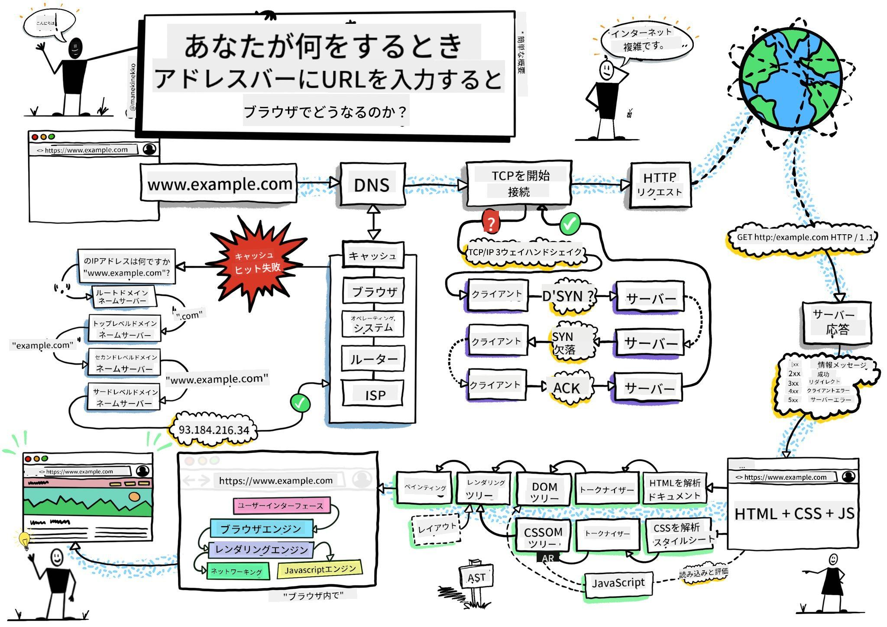
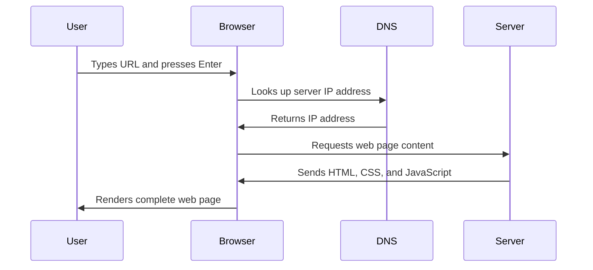
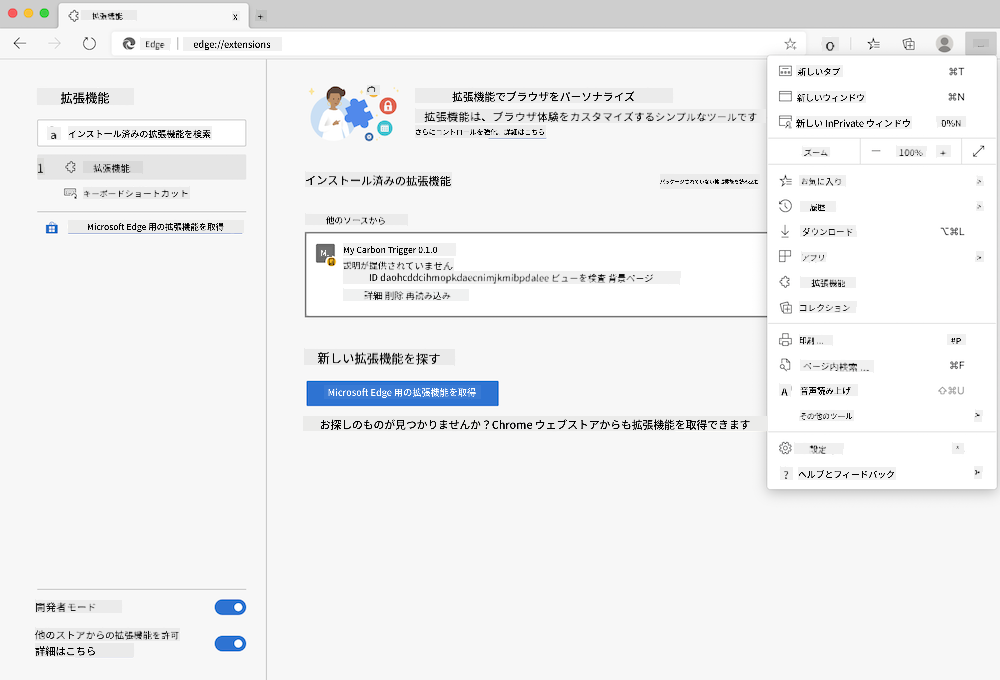
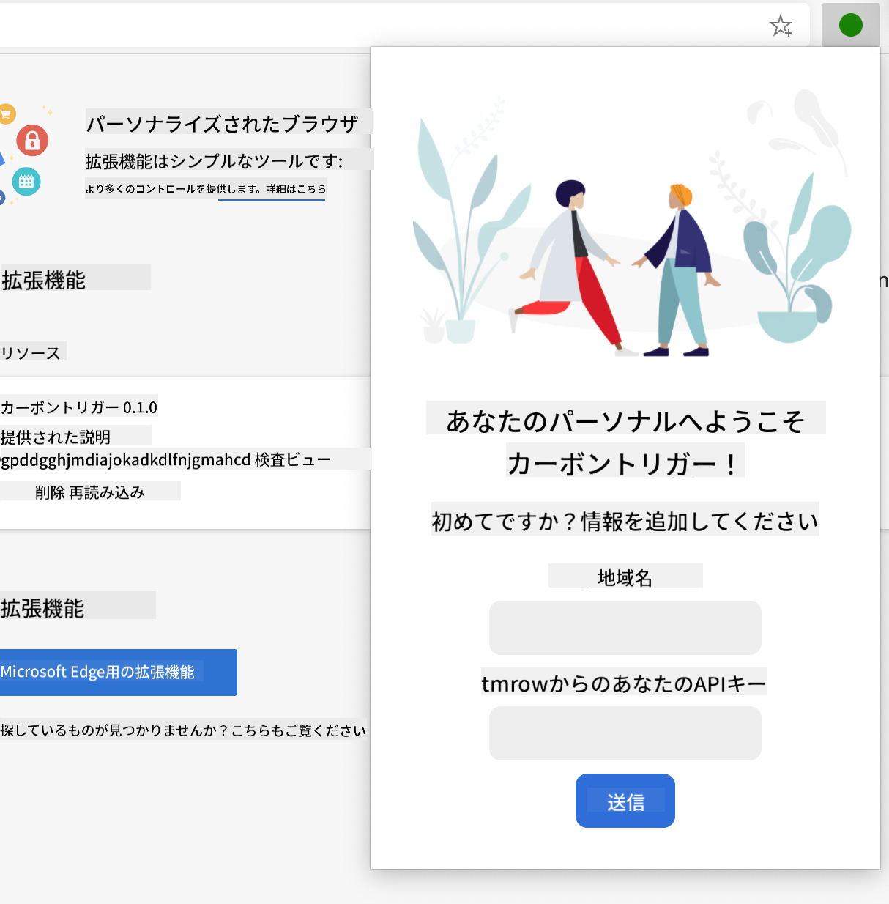

<!--
CO_OP_TRANSLATOR_METADATA:
{
  "original_hash": "33a875c522f237a2026e4653240dfc07",
  "translation_date": "2025-10-24T15:19:37+00:00",
  "source_file": "5-browser-extension/1-about-browsers/README.md",
  "language_code": "ja"
}
-->
# ブラウザ拡張プロジェクト パート1: ブラウザについて


> スケッチノート: [Wassim Chegham](https://dev.to/wassimchegham/ever-wondered-what-happens-when-you-type-in-a-url-in-an-address-bar-in-a-browser-3dob)

## 講義前クイズ

[講義前クイズ](https://ff-quizzes.netlify.app/web/quiz/23)

### はじめに

ブラウザ拡張機能は、ウェブブラウジング体験を向上させるミニアプリケーションです。ティム・バーナーズ＝リーが提唱したインタラクティブなウェブのビジョンのように、拡張機能はブラウザの機能を単なるドキュメント閲覧以上に広げます。パスワードマネージャーでアカウントを安全に保護したり、デザイナーが完璧な色合いを取得するためのカラーピッカーなど、拡張機能は日常のブラウジングの課題を解決します。

最初の拡張機能を作成する前に、ブラウザの仕組みを理解しましょう。アレクサンダー・グラハム・ベルが電話を発明する前に音の伝達を理解する必要があったように、ブラウザの基本を知ることで、既存のブラウザシステムとシームレスに統合する拡張機能を作成する助けになります。

このレッスンの終わりまでに、ブラウザのアーキテクチャを理解し、最初の拡張機能の構築を開始することができます。

## ウェブブラウザの理解

ウェブブラウザは本質的に高度なドキュメント解釈装置です。アドレスバーに「google.com」と入力すると、ブラウザは複雑な一連の操作を実行します。世界中のサーバーからコンテンツを要求し、そのコードを解析してインタラクティブなウェブページとして表示します。

このプロセスは、ティム・バーナーズ＝リーが1990年に設計した最初のウェブブラウザ「WorldWideWeb」が、ハイパーリンクされたドキュメントを誰でもアクセス可能にするために設計された方法を反映しています。

✅ **少し歴史を振り返る**: 最初のブラウザは「WorldWideWeb」と呼ばれ、1990年にティム・バーナーズ＝リー卿によって作成されました。


> 初期のブラウザのいくつか, via [Karen McGrane](https://www.slideshare.net/KMcGrane/week-4-ixd-history-personal-computing)

### ブラウザがウェブコンテンツを処理する方法

URLを入力してウェブページが表示されるまでのプロセスは、数秒以内に行われるいくつかの調整されたステップを含みます:



**このプロセスで達成されること:**
- **翻訳**: DNSルックアップを通じて、人間が読めるURLをサーバーのIPアドレスに変換
- **確立**: HTTPまたはHTTPSプロトコルを使用してウェブサーバーとの安全な接続を確立
- **要求**: サーバーから特定のウェブページコンテンツを要求
- **受信**: サーバーからHTMLマークアップ、CSSスタイリング、JavaScriptコードを受け取る
- **レンダリング**: すべてのコンテンツをインタラクティブなウェブページとして表示

### ブラウザの主要機能

現代のブラウザは、拡張機能開発者が活用できる多くの機能を提供しています:

| 機能 | 目的 | 拡張機能の可能性 |
|---------|---------|------------------------|
| **レンダリングエンジン** | HTML、CSS、JavaScriptを表示 | コンテンツの変更、スタイリングの注入 |
| **JavaScriptエンジン** | JavaScriptコードを実行 | カスタムスクリプト、APIとのやり取り |
| **ローカルストレージ** | データをローカルに保存 | ユーザー設定、キャッシュデータ |
| **ネットワークスタック** | ウェブリクエストを処理 | リクエストの監視、データ分析 |
| **セキュリティモデル** | 悪意のあるコンテンツからユーザーを保護 | コンテンツフィルタリング、セキュリティ強化 |

**これらの機能を理解することで:**
- **特定**: 拡張機能が最も価値を追加できる場所を特定
- **選択**: 拡張機能の機能に適したブラウザAPIを選択
- **設計**: ブラウザシステムと効率的に動作する拡張機能を設計
- **保証**: 拡張機能がブラウザのセキュリティベストプラクティスに従うことを保証

### クロスブラウザ開発の考慮事項

異なるブラウザは、標準をわずかに異なる方法で実装します。これは、異なるプログラミング言語が同じアルゴリズムを異なる方法で処理するのに似ています。Chrome、Firefox、Safariはそれぞれ独自の特徴を持っており、拡張機能の開発中に考慮する必要があります。

> 💡 **プロのヒント**: [caniuse.com](https://www.caniuse.com) を使用して、さまざまなブラウザでサポートされているウェブ技術を確認してください。これは、拡張機能の機能を計画する際に非常に役立ちます！

**拡張機能開発の主な考慮事項:**
- **テスト**: Chrome、Firefox、Edgeブラウザで拡張機能をテスト
- **適応**: 異なるブラウザ拡張APIとマニフェスト形式に適応
- **処理**: 異なるパフォーマンス特性と制限に対応
- **提供**: 利用できない可能性のあるブラウザ固有の機能に対するフォールバックを提供

✅ **分析の洞察**: ウェブ開発プロジェクトに分析パッケージをインストールすることで、ユーザーが好むブラウザを特定できます。このデータは、最初にサポートするブラウザを優先するのに役立ちます。

## ブラウザ拡張機能の理解

ブラウザ拡張機能は、ブラウザインターフェースに直接機能を追加することで、一般的なウェブブラウジングの課題を解決します。別々のアプリケーションや複雑なワークフローを必要とするのではなく、拡張機能はツールや機能への即時アクセスを提供します。

この概念は、ダグラス・エンゲルバートのような初期のコンピュータの先駆者が、人間の能力を技術で拡張することを想像した方法を反映しています。拡張機能はブラウザの基本機能を拡張します。

**人気のある拡張機能のカテゴリとその利点:**
- **生産性ツール**: タスク管理、メモアプリ、タイムトラッカーなど、整理整頓を助けるツール
- **セキュリティ強化**: パスワードマネージャー、広告ブロッカー、プライバシーツールなど、データを保護するツール
- **開発者ツール**: コードフォーマッター、カラーピッカー、デバッグユーティリティなど、開発を効率化するツール
- **コンテンツ強化**: 読書モード、ビデオダウンローダー、スクリーンショットツールなど、ウェブ体験を向上させるツール

✅ **振り返り質問**: あなたのお気に入りのブラウザ拡張機能は何ですか？それらは具体的にどのようなタスクを実行し、どのようにブラウジング体験を向上させていますか？

## 拡張機能のインストールと管理

拡張機能のインストールプロセスを理解することで、人々があなたの拡張機能をインストールする際のユーザー体験を予測する助けになります。インストールプロセスは現代のブラウザで標準化されており、インターフェースデザインに若干の違いがあります。



> **重要**: 開発者モードをオンにし、他のストアからの拡張機能を許可することを忘れずに、自分の拡張機能をテストする際に設定してください。

### 開発中の拡張機能インストールプロセス

自分の拡張機能を開発・テストする際は、以下のワークフローに従ってください:

```bash
# Step 1: Build your extension
npm run build
```

**このコマンドで達成されること:**
- **コンパイル**: ソースコードをブラウザ対応のファイルにコンパイル
- **バンドル**: JavaScriptモジュールを最適化されたパッケージにバンドル
- **生成**: 最終的な拡張機能ファイルを`/dist`フォルダに生成
- **準備**: 拡張機能をインストールとテストのために準備

**ステップ2: ブラウザ拡張管理ページに移動**
1. **ブラウザの拡張管理ページを開く**
2. **右上の「設定とその他」ボタン（`...`アイコン）をクリック**
3. **ドロップダウンメニューから「拡張機能」を選択**

**ステップ3: 拡張機能を読み込む**
- **新規インストールの場合**: `load unpacked`を選択し、`/dist`フォルダを選択
- **更新の場合**: 既にインストールされている拡張機能の横にある`reload`をクリック
- **テストの場合**: 「開発者モード」を有効にして追加のデバッグ機能にアクセス

### 本番環境での拡張機能インストール

> ✅ **注意**: これらの開発手順は、あなた自身が作成した拡張機能専用です。公開された拡張機能をインストールするには、[Microsoft Edge Add-ons store](https://microsoftedge.microsoft.com/addons/Microsoft-Edge-Extensions-Home)などの公式ブラウザ拡張ストアを訪問してください。

**違いを理解する:**
- **開発インストール**は、開発中に未公開の拡張機能をテストすることを可能にします
- **ストアインストール**は、検証済みの公開された拡張機能を自動更新付きで提供します
- **サイドローディング**は、公式ストア外から拡張機能をインストールすることを可能にします（開発者モードが必要）

## カーボンフットプリント拡張機能の構築

地域のエネルギー使用量のカーボンフットプリントを表示するブラウザ拡張機能を作成します。このプロジェクトは、拡張機能開発の基本的な概念を示しながら、環境意識を高める実用的なツールを作成します。

このアプローチは、ジョン・デューイの教育理論以来効果的であることが証明されている「実践を通じた学習」の原則に従っています。技術的スキルと意味のある現実世界の応用を組み合わせます。

### プロジェクト要件

開発を開始する前に、必要なリソースと依存関係を集めましょう:

**必要なAPIアクセス:**
- **[CO2 Signal APIキー](https://www.co2signal.com/)**: メールアドレスを入力して無料のAPIキーを取得
- **[地域コード](http://api.electricitymap.org/v3/zones)**: [Electricity Map](https://www.electricitymap.org/map)を使用して地域コードを確認（例: ボストンは「US-NEISO」を使用）

**開発ツール:**
- **[Node.jsとNPM](https://www.npmjs.com)**: プロジェクト依存関係をインストールするためのパッケージ管理ツール
- **[スターターコード](../../../../5-browser-extension/start)**: 開発を開始するために`start`フォルダをダウンロード

✅ **さらに学ぶ**: この[包括的な学習モジュール](https://docs.microsoft.com/learn/modules/create-nodejs-project-dependencies/?WT.mc_id=academic-77807-sagibbon)でパッケージ管理スキルを向上させましょう

### プロジェクト構造の理解

プロジェクト構造を理解することで、効率的に開発作業を整理できます。アレクサンドリア図書館が知識の検索を容易にするために組織化されたように、よく構造化されたコードベースは開発を効率化します:

```
project-root/
├── dist/                    # Built extension files
│   ├── manifest.json        # Extension configuration
│   ├── index.html           # User interface markup
│   ├── background.js        # Background script functionality
│   └── main.js              # Compiled JavaScript bundle
└── src/                     # Source development files
    └── index.js             # Your main JavaScript code
```

**各ファイルが達成することを分解:**
- **`manifest.json`**: **拡張機能のメタデータ、権限、エントリポイントを定義**
- **`index.html`**: **ユーザーが拡張機能をクリックしたときに表示されるインターフェースを作成**
- **`background.js`**: **バックグラウンドタスクとブラウザイベントリスナーを処理**
- **`main.js`**: **ビルドプロセス後の最終的なバンドルされたJavaScriptを含む**
- **`src/index.js`**: **`main.js`にコンパイルされる主要な開発コードを格納**

> 💡 **整理のヒント**: 開発中に拡張機能の機能をテストするために、APIキーと地域コードを安全なメモに保存してください。これらの値は拡張機能の機能をテストする際に必要です。

✅ **セキュリティ注意**: APIキーや機密情報をコードリポジトリにコミットしないでください。次のステップでこれらを安全に処理する方法を示します。

## 拡張機能インターフェースの作成

次に、ユーザーインターフェースコンポーネントを構築します。この拡張機能は、初期設定用の設定画面とデータ表示用の結果画面の2画面アプローチを使用します。

これは、コンピューティングの初期から使用されているインターフェースデザインの漸進的開示原則に従っています。情報とオプションを論理的な順序で明らかにし、ユーザーを圧倒しないようにします。

### 拡張機能ビューの概要

**設定ビュー** - 初回ユーザー設定:


**結果ビュー** - カーボンフットプリントデータ表示:


### 設定フォームの構築

設定フォームは、初回使用時にユーザー設定データを収集します。一度設定されると、この情報はブラウザストレージに保存され、次回以降のセッションで使用されます。

`/dist/index.html`ファイルに以下のフォーム構造を追加します:

```html
<form class="form-data" autocomplete="on">
    <div>
        <h2>New? Add your Information</h2>
    </div>
    <div>
        <label for="region">Region Name</label>
        <input type="text" id="region" required class="region-name" />
    </div>
    <div>
        <label for="api">Your API Key from tmrow</label>
        <input type="text" id="api" required class="api-key" />
    </div>
    <button class="search-btn">Submit</button>
</form>
```

**このフォームが達成すること:**
- **意味のあるフォーム構造を作成**: 適切なラベルと入力の関連付け
- **ブラウザの自動補完機能を有効化**: ユーザー体験を向上
- **両方のフィールドが送信前に入力されることを要求**: `required`属性を使用
- **入力を説明的なクラス名で整理**: スタイリングやJavaScriptのターゲティングを容易に
- **初回設定を行うユーザーに明確な指示を提供**

### 結果表示の構築

次に、カーボンフット
**説明:** ブラウザー拡張機能を強化し、APIキーや地域コードを入力する際のフォーム検証とユーザーへのフィードバック機能を追加して、ユーザー体験を向上させます。

**プロンプト:** APIキーのフィールドに20文字以上が含まれているか、地域コードが正しい形式（例: 'US-NEISO'）に従っているかを確認するJavaScriptの検証関数を作成してください。入力が有効な場合は緑色、無効な場合は赤色で入力ボーダーの色を変更する視覚的フィードバックを追加してください。また、セキュリティのためにAPIキーを表示/非表示に切り替える機能も追加してください。

[agent mode](https://code.visualstudio.com/blogs/2025/02/24/introducing-copilot-agent-mode)について詳しくはこちらをご覧ください。

## 🚀 チャレンジ

ブラウザー拡張機能ストアを見て、ブラウザーに1つインストールしてみてください。そのファイルをさまざまな方法で調べることができます。何が発見できますか？

## 講義後のクイズ

[講義後のクイズ](https://ff-quizzes.netlify.app/web/quiz/24)

## 復習と自己学習

このレッスンでは、ウェブブラウザーの歴史について少し学びました。この機会に、ワールドワイドウェブの発明者たちがその利用をどのように構想していたかについて、さらに学んでみましょう。役立つサイトには以下が含まれます：

[ウェブブラウザーの歴史](https://www.mozilla.org/firefox/browsers/browser-history/)

[ウェブの歴史](https://webfoundation.org/about/vision/history-of-the-web/)

[ティム・バーナーズ＝リー氏へのインタビュー](https://www.theguardian.com/technology/2019/mar/12/tim-berners-lee-on-30-years-of-the-web-if-we-dream-a-little-we-can-get-the-web-we-want)

## 課題

[拡張機能を再スタイルする](assignment.md)

---

**免責事項**:  
この文書はAI翻訳サービス[Co-op Translator](https://github.com/Azure/co-op-translator)を使用して翻訳されています。正確性を追求しておりますが、自動翻訳には誤りや不正確な部分が含まれる可能性があります。元の言語で記載された文書を正式な情報源としてお考えください。重要な情報については、専門の人間による翻訳を推奨します。この翻訳の使用に起因する誤解や誤認について、当方は責任を負いません。