# ブラウザ拡張プロジェクト パート1: ブラウザについて

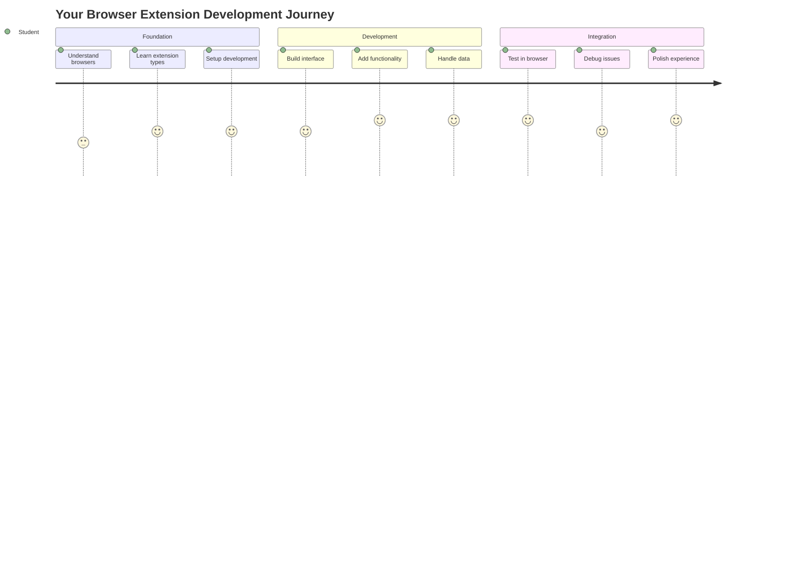

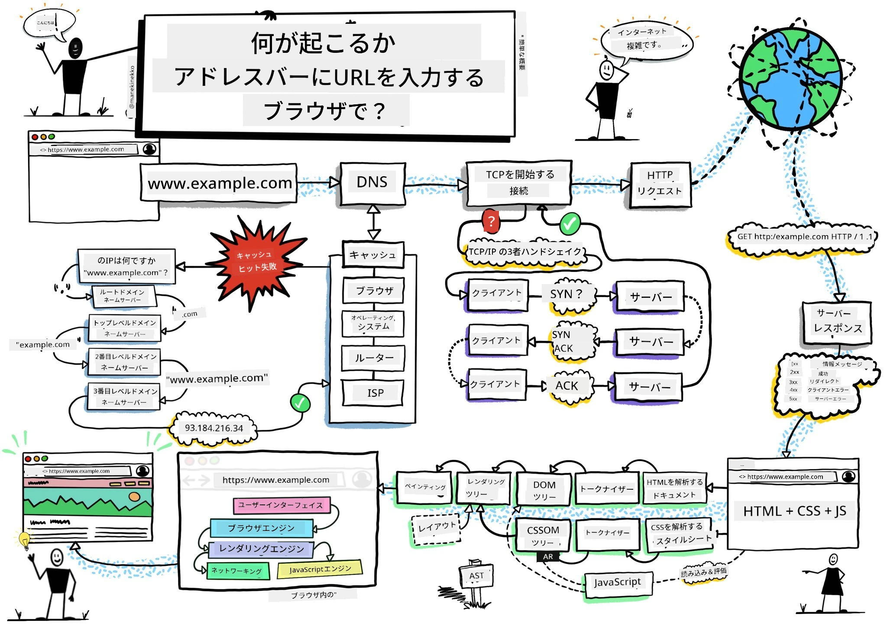
> スケッチノート: [Wassim Chegham](https://dev.to/wassimchegham/ever-wondered-what-happens-when-you-type-in-a-url-in-an-address-bar-in-a-browser-3dob)

## 講義前クイズ

[講義前クイズ](https://ff-quizzes.netlify.app/web/quiz/23)

### はじめに

ブラウザ拡張機能は、ウェブブラウジング体験を向上させるミニアプリケーションです。ティム・バーナーズ＝リーが提唱したインタラクティブなウェブのビジョンのように、拡張機能はブラウザの機能を単なるドキュメント閲覧以上に広げます。パスワードマネージャーでアカウントを安全に保ったり、デザイナーが完璧な色を選ぶのを助けるカラーピッカーなど、拡張機能は日常のブラウジングの課題を解決します。

最初の拡張機能を作成する前に、ブラウザの仕組みを理解しましょう。アレクサンダー・グラハム・ベルが電話を発明する前に音の伝達を理解する必要があったように、ブラウザの基本を知ることで、既存のブラウザシステムとシームレスに統合できる拡張機能を作成する助けになります。

このレッスンの終わりまでに、ブラウザのアーキテクチャを理解し、最初の拡張機能の構築を開始することができます。

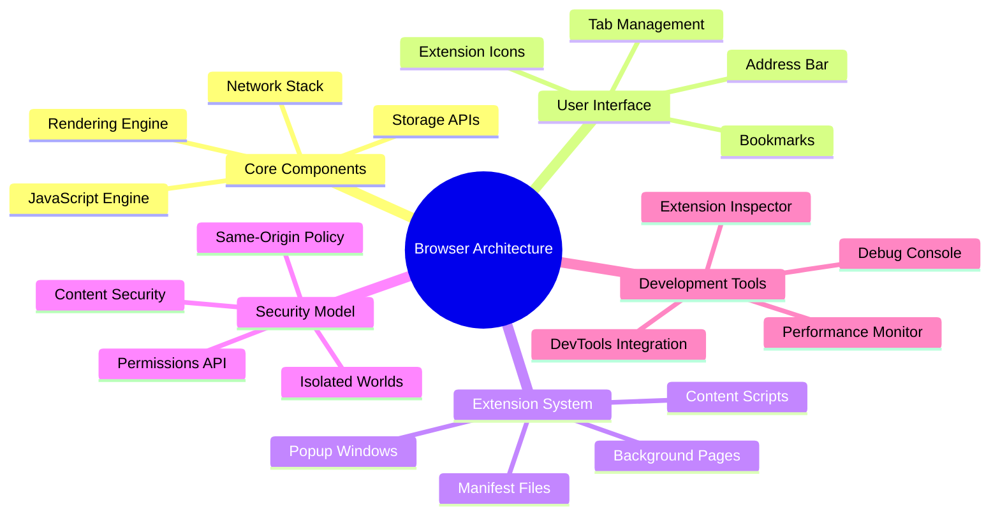

## ウェブブラウザの理解

ウェブブラウザは本質的に高度なドキュメント解釈装置です。アドレスバーに「google.com」と入力すると、ブラウザは複雑な一連の操作を実行します。世界中のサーバーからコンテンツを要求し、そのコードを解析して、インタラクティブなウェブページとして表示します。

このプロセスは、ティム・バーナーズ＝リーが1990年に設計した最初のウェブブラウザ「WorldWideWeb」が、ハイパーリンクされたドキュメントを誰でもアクセス可能にするために設計された方法を反映しています。

✅ **少し歴史を振り返る**: 最初のブラウザは「WorldWideWeb」と呼ばれ、1990年にサー・ティモシー・バーナーズ＝リーによって作成されました。

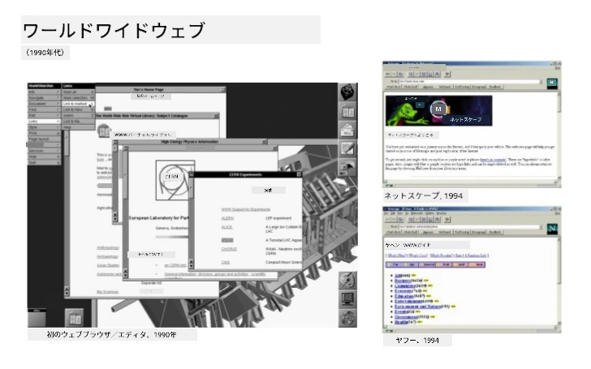
> 初期のブラウザのいくつか, via [Karen McGrane](https://www.slideshare.net/KMcGrane/week-4-ixd-history-personal-computing)

### ブラウザがウェブコンテンツを処理する方法

URLを入力してウェブページが表示されるまでのプロセスは、数秒以内に行われるいくつかの調整されたステップを含みます。

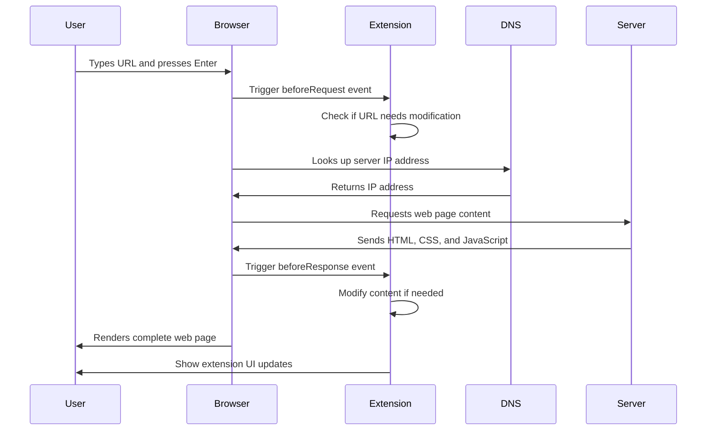

**このプロセスで達成されること:**
- **URLを翻訳**: DNSルックアップを通じて、人間が読めるURLをサーバーのIPアドレスに変換
- **安全な接続を確立**: HTTPまたはHTTPSプロトコルを使用してウェブサーバーと接続
- **特定のウェブページコンテンツを要求**: サーバーからコンテンツを取得
- **HTMLマークアップ、CSSスタイリング、JavaScriptコードを受信**
- **すべてのコンテンツをレンダリング**: インタラクティブなウェブページとして表示

### ブラウザの主要機能

現代のブラウザは、拡張機能の開発者が活用できる多くの機能を提供します。

| 機能 | 目的 | 拡張機能の可能性 |
|---------|---------|------------------------|
| **レンダリングエンジン** | HTML、CSS、JavaScriptを表示 | コンテンツの変更、スタイリングの注入 |
| **JavaScriptエンジン** | JavaScriptコードを実行 | カスタムスクリプト、APIとのやり取り |
| **ローカルストレージ** | データをローカルに保存 | ユーザー設定、キャッシュデータ |
| **ネットワークスタック** | ウェブリクエストを処理 | リクエストの監視、データ分析 |
| **セキュリティモデル** | 悪意のあるコンテンツからユーザーを保護 | コンテンツフィルタリング、セキュリティ強化 |

**これらの機能を理解することで:**
- **拡張機能が最も価値を追加できる場所を特定**
- **拡張機能の機能に適したブラウザAPIを選択**
- **ブラウザシステムと効率的に連携する拡張機能を設計**
- **拡張機能がブラウザのセキュリティベストプラクティスに従うことを保証**

### クロスブラウザ開発の考慮事項

異なるブラウザは、標準をわずかに異なる方法で実装します。これは、異なるプログラミング言語が同じアルゴリズムを異なる方法で処理するのに似ています。Chrome、Firefox、Safariはそれぞれ独自の特性を持ち、拡張機能の開発中に考慮する必要があります。

> 💡 **プロのヒント**: [caniuse.com](https://www.caniuse.com) を使用して、異なるブラウザでサポートされているウェブ技術を確認しましょう。これは拡張機能の機能を計画する際に非常に役立ちます！

**拡張機能開発の主な考慮事項:**
- **Chrome、Firefox、Edgeブラウザで拡張機能をテスト**
- **異なるブラウザ拡張APIとマニフェスト形式に適応**
- **異なるパフォーマンス特性と制限に対応**
- **ブラウザ固有の機能が利用できない場合のフォールバックを提供**

✅ **分析インサイト**: ウェブ開発プロジェクトに分析パッケージをインストールすることで、ユーザーが好むブラウザを特定できます。このデータは、最初にサポートすべきブラウザを優先するのに役立ちます。

## ブラウザ拡張機能の理解

ブラウザ拡張機能は、ブラウザインターフェースに直接機能を追加することで、一般的なウェブブラウジングの課題を解決します。別々のアプリケーションや複雑なワークフローを必要とせず、拡張機能はツールや機能への即時アクセスを提供します。

この概念は、ダグラス・エンゲルバートのような初期のコンピュータの先駆者が、技術で人間の能力を拡張することを想像した方法を反映しています。拡張機能は、ブラウザの基本機能を拡張します。

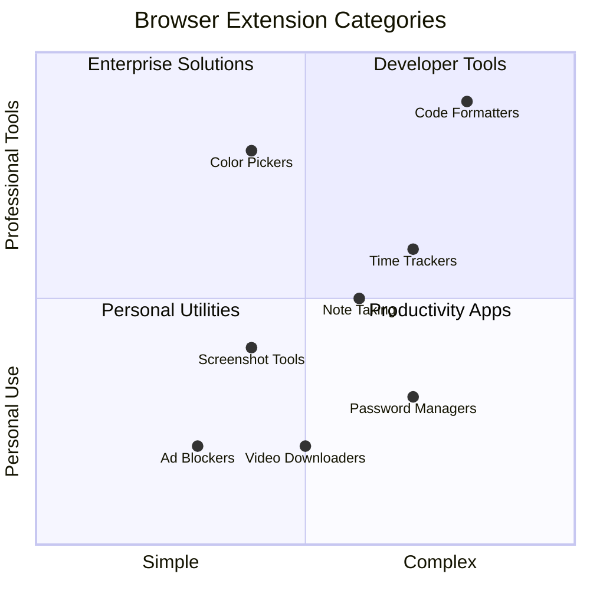

**人気のある拡張機能のカテゴリとその利点:**
- **生産性ツール**: タスク管理、メモアプリ、タイムトラッカーなど、整理整頓を助けるツール
- **セキュリティ強化**: パスワードマネージャー、広告ブロッカー、プライバシーツールなど、データを保護するツール
- **開発者ツール**: コードフォーマッター、カラーピッカー、デバッグユーティリティなど、開発を効率化するツール
- **コンテンツ強化**: 読書モード、ビデオダウンローダー、スクリーンショットツールなど、ウェブ体験を向上させるツール

✅ **振り返りの質問**: あなたのお気に入りのブラウザ拡張機能は何ですか？それらはどのようなタスクを実行し、どのようにブラウジング体験を向上させますか？

### 🔄 **教育的チェックイン**
**ブラウザアーキテクチャの理解**: 拡張機能の開発に進む前に、以下を確認してください:
- ✅ ブラウザがウェブリクエストを処理し、コンテンツをレンダリングする方法を説明できる
- ✅ ブラウザアーキテクチャの主要コンポーネントを特定できる
- ✅ 拡張機能がブラウザ機能とどのように統合されるかを理解できる
- ✅ ユーザーを保護するセキュリティモデルを認識できる

**簡単な自己テスト**: URLを入力してウェブページが表示されるまでの経路を追跡できますか？
1. **DNSルックアップ**がURLをIPアドレスに変換
2. **HTTPリクエスト**がサーバーからコンテンツを取得
3. **解析**がHTML、CSS、JavaScriptを処理
4. **レンダリング**が最終的なウェブページを表示
5. **拡張機能**が複数のステップでコンテンツを変更可能

## 拡張機能のインストールと管理

拡張機能のインストールプロセスを理解することで、ユーザーが拡張機能をインストールする際の体験を予測できます。インストールプロセスは、モダンブラウザ間で標準化されていますが、インターフェースデザインに若干の違いがあります。

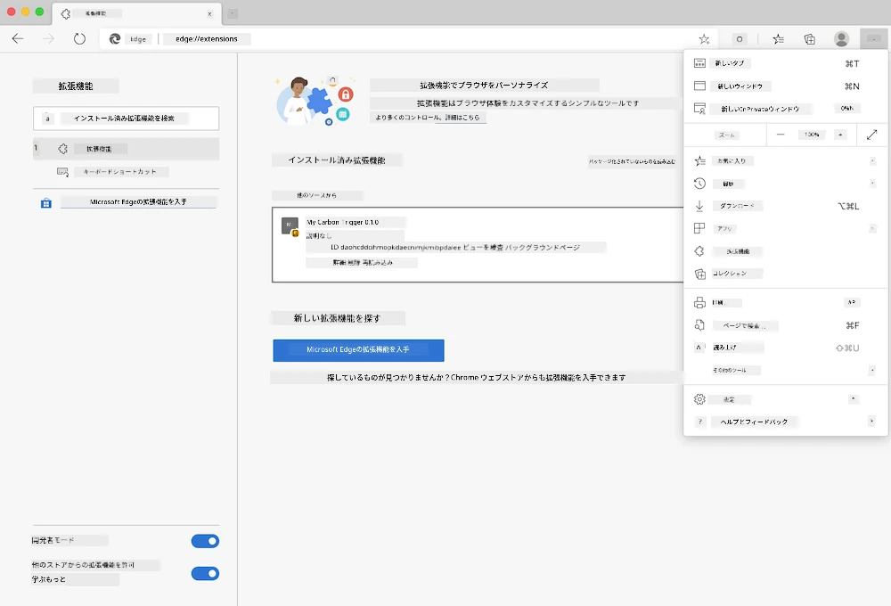

> **重要**: 開発者モードをオンにし、自分の拡張機能をテストする際には他のストアからの拡張機能を許可してください。

### 開発中の拡張機能のインストールプロセス

自分の拡張機能を開発・テストする際は、以下のワークフローに従ってください:

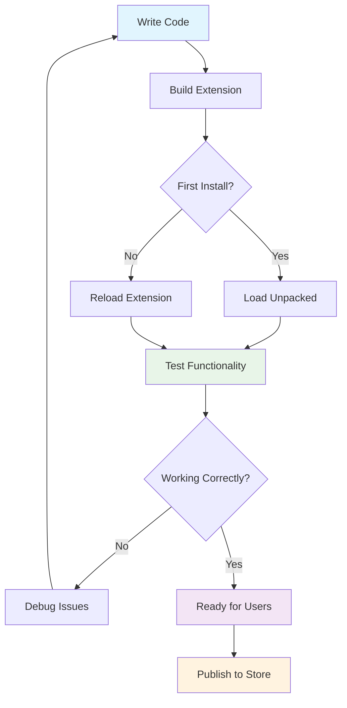

```bash
# Step 1: Build your extension
npm run build
```

**このコマンドで達成されること:**
- **ソースコードをコンパイル**: ブラウザ対応のファイルに変換
- **JavaScriptモジュールをバンドル**: 最適化されたパッケージにまとめる
- **最終的な拡張機能ファイルを生成**: `/dist`フォルダに保存
- **インストールとテストの準備**

**ステップ2: ブラウザ拡張機能ページに移動**
1. **ブラウザの拡張機能管理ページを開く**
2. **右上の「設定とその他」ボタン（`...`アイコン）をクリック**
3. **ドロップダウンメニューから「拡張機能」を選択**

**ステップ3: 拡張機能を読み込む**
- **新規インストールの場合**: `load unpacked`を選択し、`/dist`フォルダを選択
- **更新の場合**: 既にインストールされている拡張機能の横にある`reload`をクリック
- **テストの場合**: 「開発者モード」を有効にして追加のデバッグ機能にアクセス

### 本番環境での拡張機能インストール

> ✅ **注意**: これらの開発手順は、自分で作成した拡張機能専用です。公開された拡張機能をインストールするには、[Microsoft Edge Add-ons store](https://microsoftedge.microsoft.com/addons/Microsoft-Edge-Extensions-Home)のような公式ブラウザ拡張ストアを訪問してください。

**違いを理解する:**
- **開発インストール**: 公開されていない拡張機能を開発中にテスト可能
- **ストアインストール**: 審査済みの公開拡張機能を自動更新付きで提供
- **サイドローディング**: 公式ストア外から拡張機能をインストール（開発者モードが必要）

## カーボンフットプリント拡張機能の構築

地域のエネルギー使用量のカーボンフットプリントを表示するブラウザ拡張機能を作成します。このプロジェクトは、拡張機能開発の基本概念を実演しながら、環境意識を高める実用的なツールを作成します。

このアプローチは、ジョン・デューイの教育理論以来効果的であると証明されている「実践を通じた学習」の原則に従っています。技術スキルと現実世界の応用を組み合わせます。

### プロジェクト要件

開発を始める前に、必要なリソースと依存関係を集めましょう:

**必要なAPIアクセス:**
- **[CO2 Signal APIキー](https://www.co2signal.com/)**: メールアドレスを入力して無料のAPIキーを取得
- **[地域コード](http://api.electricitymap.org/v3/zones)**: [Electricity Map](https://www.electricitymap.org/map)を使用して地域コードを確認（例: ボストンは「US-NEISO」）

**開発ツール:**
- **[Node.jsとNPM](https://www.npmjs.com)**: プロジェクト依存関係をインストールするためのパッケージ管理ツール
- **[スターターコード](../../../../5-browser-extension/start)**: 開発を始めるために`start`フォルダをダウンロード

✅ **さらに学ぶ**: この[包括的なLearnモジュール](https://docs.microsoft.com/learn/modules/create-nodejs-project-dependencies/?WT.mc_id=academic-77807-sagibbon)でパッケージ管理スキルを向上させましょう

### プロジェクト構造の理解

プロジェクト構造を理解することで、開発作業を効率的に整理できます。アレクサンドリア図書館が知識の検索を容易にするために組織化されていたように、よく構造化されたコードベースは開発を効率化します:

```
project-root/
├── dist/                    # Built extension files
│   ├── manifest.json        # Extension configuration
│   ├── index.html           # User interface markup
│   ├── background.js        # Background script functionality
│   └── main.js              # Compiled JavaScript bundle
├── src/                     # Source development files
│   └── index.js             # Your main JavaScript code
├── package.json             # Project dependencies and scripts
└── webpack.config.js        # Build configuration
```

**各ファイルが達成することの内訳:**
- **`manifest.json`**: **拡張機能のメタデータ、権限、エントリポイントを定義**
- **`index.html`**: **ユーザーが拡張機能をクリックしたときに表示されるインターフェースを作成**
- **`background.js`**: **バックグラウンドタスクとブラウザイベントリスナーを処理**
- **`main.js`**: **ビルドプロセス後の最終的なバンドルJavaScriptを含む**
- **`src/index.js`**: **`main.js`にコンパイルされる主要な開発コードを格納**

> 💡 **整理のヒント**: 開発中に参照しやすいように、APIキーと地域コードを安全なメモに保存してください。これらの値は拡張機能の機能をテストする際に必要です。

✅ **セキュリティ注意**: APIキーや機密情報をコードリポジトリにコミットしないでください。これらを安全に処理する方法は次のステップで説明します。

## 拡張機能インターフェースの作成

次に、ユーザーインターフェースコンポーネントを構築します。この拡張機能は、初期設定用の設定画面とデータ表示用の結果画面の2画面アプローチを使用します。

これは、コンピューティングの初期から使用されているインターフェースデザインの漸進的開示の原則に従っています。情報やオプションを論理的な順序で明らかにすることで、ユーザーを圧倒しないようにします。

### 拡張機能ビューの概要

**設定ビュー** - 初回ユーザー設定:
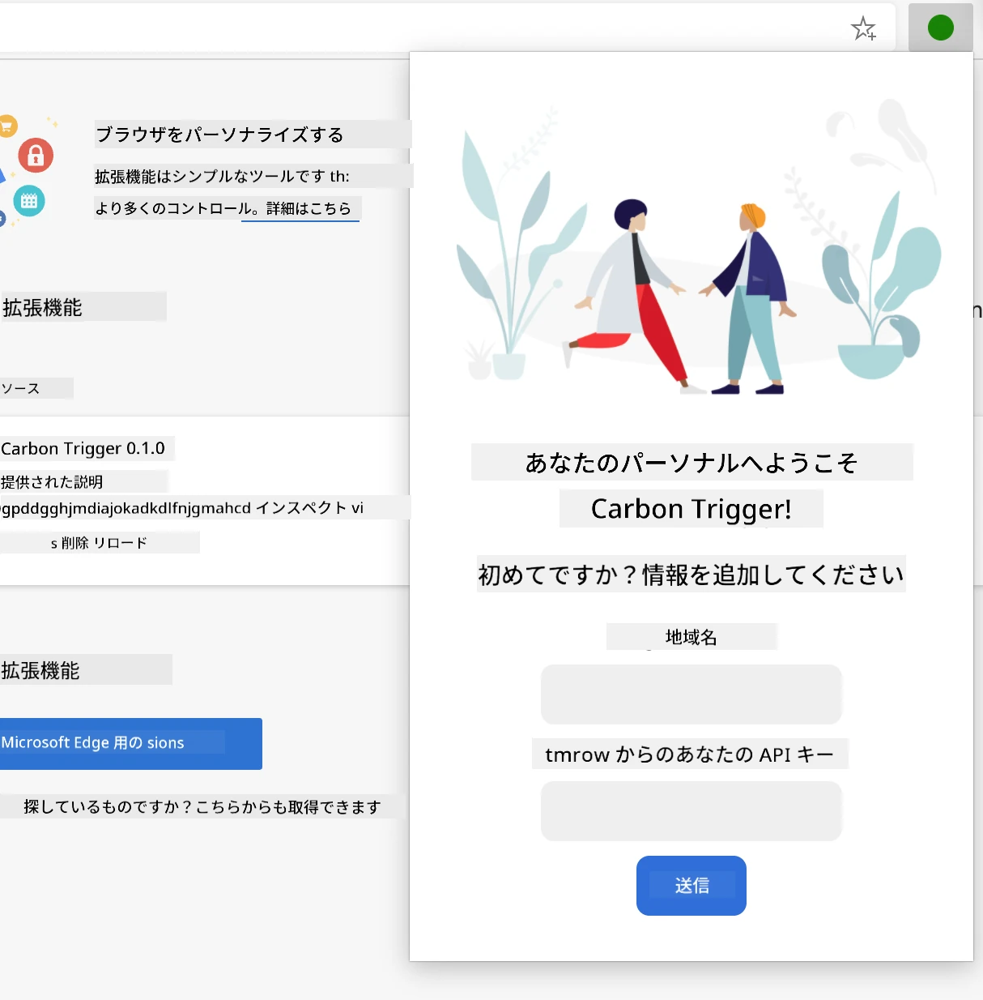

**結果ビュー** - カーボンフットプリントデータの表示:
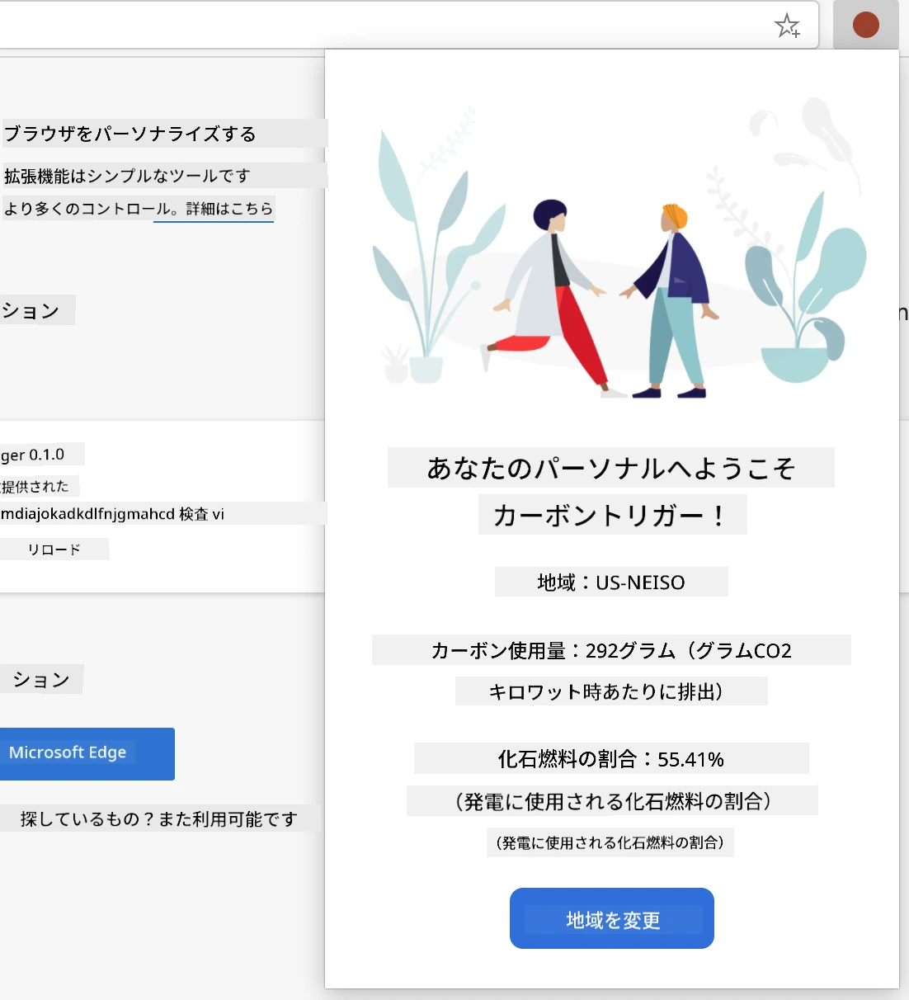

### 設定フォームの構築

設定フォームは、初回使用時にユーザー
1. **ビルドコマンドを実行**してコードをコンパイルする  
2. **拡張機能をブラウザに読み込む**（開発者モードを使用）  
3. **フォームが正しく表示され、プロフェッショナルに見えることを確認**する  
4. **フォームのすべての要素が適切に配置され、機能していることを確認**する  

**達成したこと:**  
- **拡張機能の基本的なHTML構造を構築**した  
- **適切なセマンティックマークアップを使用して、設定画面と結果画面を作成**した  
- **業界標準のツールを使用してモダンな開発ワークフローを設定**した  
- **インタラクティブなJavaScript機能を追加するための基盤を準備**した  

### 🔄 **教育的チェックイン**  
**拡張機能開発の進捗状況**: 続行する前に理解を確認してください:  
- ✅ プロジェクト構造内の各ファイルの目的を説明できますか？  
- ✅ ビルドプロセスがソースコードをどのように変換するか理解していますか？  
- ✅ なぜ設定画面と結果画面を別々のUIセクションに分けるのですか？  
- ✅ フォーム構造が使いやすさとアクセシビリティをどのようにサポートしているか説明できますか？  

**開発ワークフローの理解**: 今後は以下ができるようになります:  
1. **拡張機能のインターフェース用のHTMLとCSSを修正**する  
2. **ビルドコマンドを実行して変更をコンパイル**する  
3. **ブラウザで拡張機能をリロードして更新をテスト**する  
4. **ブラウザの開発者ツールを使用して問題をデバッグ**する  

ブラウザ拡張機能開発の第一段階を完了しました。ライト兄弟が飛行を達成する前に空気力学を理解する必要があったように、これらの基礎概念を理解することで、次のレッスンでより複雑なインタラクティブ機能を構築する準備が整います。

## GitHub Copilot Agent チャレンジ 🚀  

Agentモードを使用して以下のチャレンジを完了してください:  

**説明:** APIキーと地域コードを入力する際のユーザー体験を向上させるため、フォームのバリデーションとユーザーフィードバック機能を追加してください。  

**プロンプト:** APIキーのフィールドが20文字以上であることを確認し、地域コードが正しい形式（例: 'US-NEISO'）であるかをチェックするJavaScriptバリデーション関数を作成してください。入力が有効な場合は緑色のボーダー、無効な場合は赤色のボーダーに変更する視覚的フィードバックを追加してください。また、セキュリティのためにAPIキーを表示/非表示に切り替える機能も追加してください。  

[agent modeについて詳しくはこちら](https://code.visualstudio.com/blogs/2025/02/24/introducing-copilot-agent-mode)

## 🚀 チャレンジ  

ブラウザ拡張機能ストアを見て、ブラウザにインストールしてみてください。そのファイルを興味深い方法で調べることができます。何を発見しましたか？

## 講義後のクイズ  

[講義後のクイズ](https://ff-quizzes.netlify.app/web/quiz/24)

## 復習と自己学習  

このレッスンではウェブブラウザの歴史について少し学びました。この機会に、ワールドワイドウェブの発明者たちがその利用をどのように構想していたかについてさらに学んでみてください。役立つサイトには以下があります:  

[ウェブブラウザの歴史](https://www.mozilla.org/firefox/browsers/browser-history/)  

[ウェブの歴史](https://webfoundation.org/about/vision/history-of-the-web/)  

[ティム・バーナーズ＝リーのインタビュー](https://www.theguardian.com/technology/2019/mar/12/tim-berners-lee-on-30-years-of-the-web-if-we-dream-a-little-we-can-get-the-web-we-want)

### ⚡ **次の5分間でできること**  
- [ ] Chrome/Edgeの拡張機能ページを開く（chrome://extensions）し、インストール済みのものを探索する  
- [ ] ブラウザのDevToolsのネットワークタブを見て、ウェブページを読み込む様子を確認する  
- [ ] ページソースを表示して（Ctrl+U）、HTML構造を確認する  
- [ ] 任意のウェブページ要素を検査し、DevToolsでCSSを変更してみる  

### 🎯 **この1時間で達成できること**  
- [ ] 講義後のクイズを完了し、ブラウザの基本を理解する  
- [ ] ブラウザ拡張機能用の基本的なmanifest.jsonファイルを作成する  
- [ ] ポップアップを表示するシンプルな「Hello World」拡張機能を作成する  
- [ ] 開発者モードで拡張機能を読み込むテストをする  
- [ ] 対象ブラウザの拡張機能ドキュメントを探索する  

### 📅 **1週間の拡張機能開発の旅**  
- [ ] 実用的なブラウザ拡張機能を完成させる  
- [ ] コンテンツスクリプト、バックグラウンドスクリプト、ポップアップの相互作用について学ぶ  
- [ ] storage、tabs、messagingなどのブラウザAPIを習得する  
- [ ] 拡張機能のユーザーフレンドリーなインターフェースを設計する  
- [ ] 様々なウェブサイトやシナリオで拡張機能をテストする  
- [ ] ブラウザの拡張機能ストアに拡張機能を公開する  

### 🌟 **1か月間のブラウザ開発**  
- [ ] 異なるユーザーの問題を解決する複数の拡張機能を構築する  
- [ ] 高度なブラウザAPIとセキュリティのベストプラクティスを学ぶ  
- [ ] オープンソースのブラウザ拡張機能プロジェクトに貢献する  
- [ ] クロスブラウザ互換性とプログレッシブエンハンスメントを習得する  
- [ ] 他の開発者向けの拡張機能開発ツールやテンプレートを作成する  
- [ ] ブラウザ拡張機能の専門家として、他の開発者を支援する  

## 🎯 ブラウザ拡張機能の習得タイムライン  

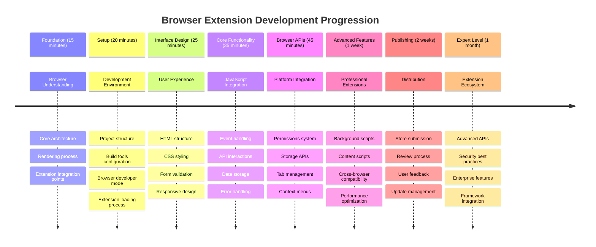
  
### 🛠️ 拡張機能開発ツールキットのまとめ  

このレッスンを完了した後、以下を習得しました:  
- **ブラウザアーキテクチャの知識**: レンダリングエンジン、セキュリティモデル、拡張機能の統合の理解  
- **開発環境**: Webpack、NPM、デバッグ機能を備えたモダンなツールチェーン  
- **UI/UXの基礎**: セマンティックHTML構造と段階的な開示パターン  
- **セキュリティ意識**: ブラウザの権限と安全な開発手法の理解  
- **クロスブラウザの概念**: 互換性の考慮事項とテストアプローチの知識  
- **API統合**: 外部データソースを扱うための基盤  
- **プロフェッショナルなワークフロー**: 業界標準の開発およびテスト手順  

**実世界での応用**: これらのスキルは以下に直接応用できます:  
- **ウェブ開発**: シングルページアプリケーションやプログレッシブウェブアプリ  
- **デスクトップアプリケーション**: Electronやウェブベースのデスクトップソフトウェア  
- **モバイル開発**: ハイブリッドアプリやウェブベースのモバイルソリューション  
- **企業向けツール**: 内部の生産性向上アプリケーションやワークフローの自動化  
- **オープンソース**: ブラウザ拡張機能プロジェクトやウェブ標準への貢献  

**次のステップ**: インタラクティブな機能を追加し、ブラウザAPIを活用し、実際のユーザーの問題を解決する拡張機能を作成する準備が整いました！

## 課題  

[拡張機能を再スタイル](assignment.md)  

---

**免責事項**:  
この文書はAI翻訳サービス[Co-op Translator](https://github.com/Azure/co-op-translator)を使用して翻訳されています。正確性を追求しておりますが、自動翻訳には誤りや不正確な部分が含まれる可能性があります。元の言語で記載された文書を正式な情報源としてご参照ください。重要な情報については、専門の人間による翻訳を推奨します。この翻訳の使用に起因する誤解や誤解釈について、当社は責任を負いません。