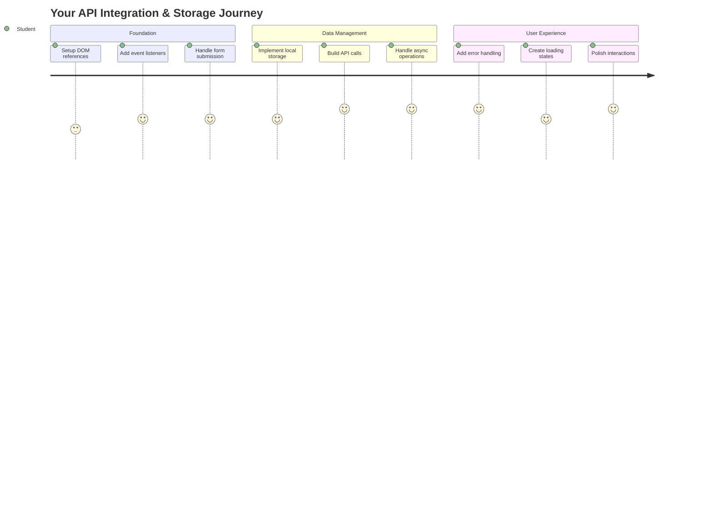
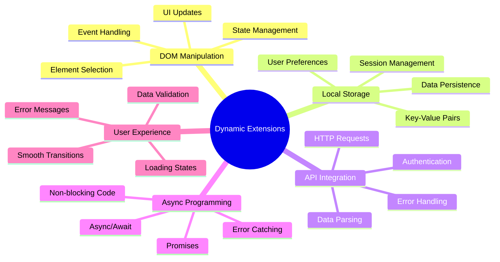
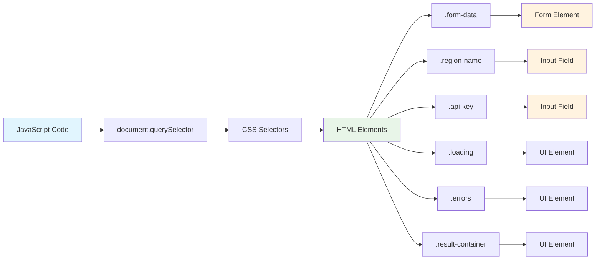
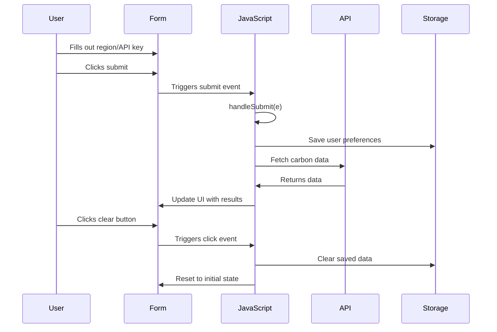
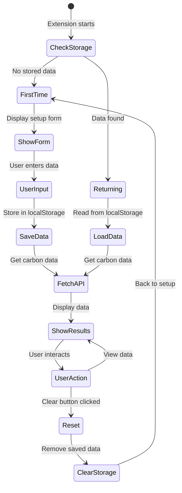
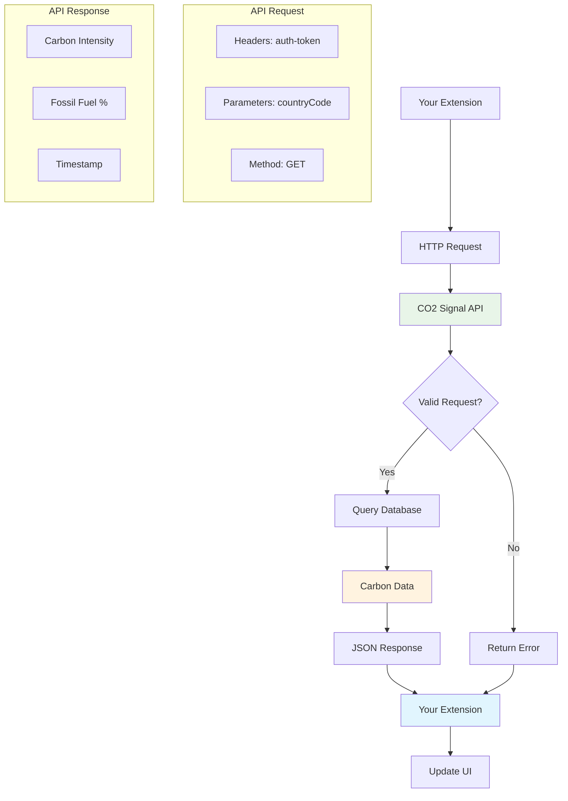
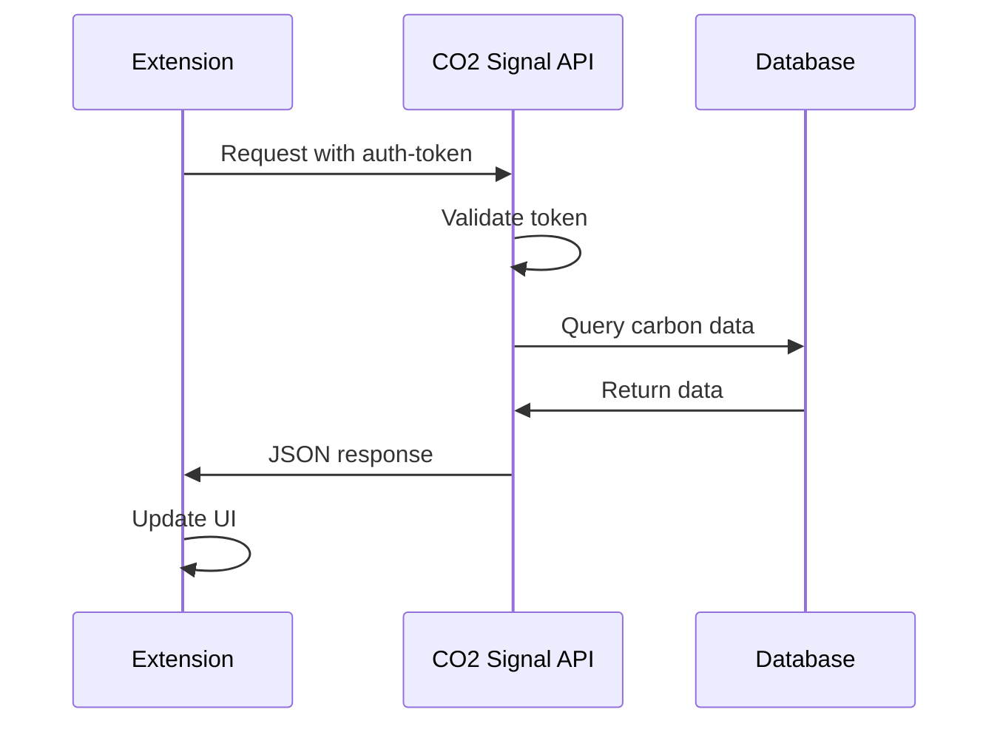
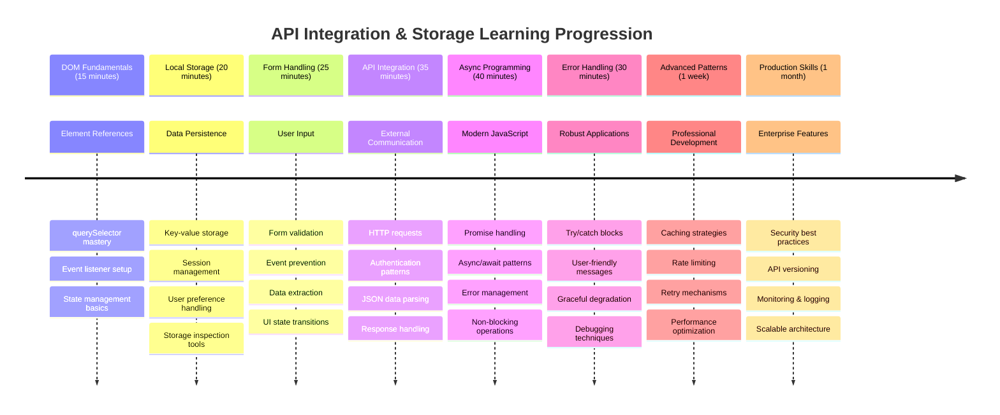

<!--
CO_OP_TRANSLATOR_METADATA:
{
  "original_hash": "2b6203a48c48d8234e0948353b47d84e",
  "translation_date": "2025-11-06T13:08:41+00:00",
  "source_file": "5-browser-extension/2-forms-browsers-local-storage/README.md",
  "language_code": "ja"
}
-->
# ブラウザー拡張プロジェクト パート2: APIを呼び出し、ローカルストレージを使用する



## 講義前クイズ

[講義前クイズ](https://ff-quizzes.netlify.app/web/quiz/25)

## はじめに

以前作成を始めたブラウザー拡張を覚えていますか？現在は見た目の良いフォームができていますが、基本的には静的な状態です。今日はこれを実際のデータに接続し、記憶を持たせることで命を吹き込みます。

アポロ計画のミッションコントロールコンピューターを考えてみてください。固定情報を表示するだけではありませんでした。宇宙船と常に通信し、テレメトリーデータを更新し、重要なミッションパラメーターを記憶していました。今日はそのような動的な動作を構築します。拡張機能がインターネットにアクセスし、実際の環境データを取得し、次回のために設定を記憶します。

API統合は複雑に聞こえるかもしれませんが、コードに他のサービスと通信する方法を教えるだけです。天気データ、ソーシャルメディアフィード、または今日扱う炭素排出量情報を取得する場合でも、デジタル接続を確立することが重要です。また、ブラウザーが情報を保持する方法についても探ります。これは、図書館がカードカタログを使用して本の場所を記憶していた方法に似ています。

このレッスンの終わりまでに、実際のデータを取得し、ユーザーの設定を保存し、スムーズな体験を提供するブラウザー拡張を作成できるようになります。それでは始めましょう！



✅ 適切なファイル内の番号付きセグメントに従ってコードを配置する場所を確認してください

## 拡張機能で操作する要素を設定する

JavaScriptがインターフェースを操作する前に、特定のHTML要素への参照が必要です。これは、望遠鏡が特定の星に向けられる必要があるのと似ています。ガリレオが木星の衛星を研究する前に、まず木星を見つけて焦点を合わせる必要がありました。

`index.js`ファイル内で、重要なフォーム要素への参照をキャプチャする`const`変数を作成します。これは、科学者が機器にラベルを付ける方法に似ています。実験室全体を毎回検索する代わりに、必要なものに直接アクセスできます。



```javascript
// form fields
const form = document.querySelector('.form-data');
const region = document.querySelector('.region-name');
const apiKey = document.querySelector('.api-key');

// results
const errors = document.querySelector('.errors');
const loading = document.querySelector('.loading');
const results = document.querySelector('.result-container');
const usage = document.querySelector('.carbon-usage');
const fossilfuel = document.querySelector('.fossil-fuel');
const myregion = document.querySelector('.my-region');
const clearBtn = document.querySelector('.clear-btn');
```

**このコードが行うこと:**
- **キャプチャ** フォーム要素をCSSクラスセレクターを使用して`document.querySelector()`で取得
- **作成** 地域名とAPIキーの入力フィールドへの参照
- **確立** 炭素使用量データの結果表示要素への接続
- **設定** ローディングインジケーターやエラーメッセージなどのUI要素へのアクセス
- **保存** 各要素参照を`const`変数に格納し、コード全体で簡単に再利用可能にする

## イベントリスナーを追加する

次に、拡張機能がユーザーの操作に応答するようにします。イベントリスナーは、ユーザーの操作を監視するコードの方法です。これは、初期の電話交換機のオペレーターのようなものです。彼らは着信を聞き、誰かが接続を希望したときに適切な回線を接続しました。



```javascript
form.addEventListener('submit', (e) => handleSubmit(e));
clearBtn.addEventListener('click', (e) => reset(e));
init();
```

**これらの概念を理解する:**
- **アタッチ** ユーザーがEnterキーを押すか送信ボタンをクリックしたときにトリガーされるフォームへの送信リスナー
- **接続** フォームをリセットするためのクリアボタンへのクリックリスナー
- **渡す** イベントオブジェクト`(e)`をハンドラ関数に渡して追加の制御を行う
- **呼び出す** `init()`関数を即座に実行して拡張機能の初期状態を設定する

✅ ここで使用されている簡潔なアロー関数構文に注目してください。このモダンなJavaScriptアプローチは従来の関数式よりもクリーンですが、どちらも同様に機能します！

### 🔄 **教育的チェックイン**
**イベント処理の理解**: 初期化に進む前に、以下を確認してください:
- ✅ `addEventListener`がユーザー操作をJavaScript関数に接続する方法を説明できる
- ✅ イベントオブジェクト`(e)`をハンドラ関数に渡す理由を理解する
- ✅ `submit`イベントと`click`イベントの違いを認識する
- ✅ `init()`関数が実行されるタイミングとその理由を説明する

**簡単な自己テスト**: フォーム送信で`e.preventDefault()`を忘れた場合、何が起こるでしょうか？
*答え: ページがリロードされ、すべてのJavaScript状態が失われ、ユーザー体験が中断されます*

## 初期化とリセット関数を構築する

拡張機能の初期化ロジックを作成しましょう。`init()`関数は船のナビゲーションシステムのようなもので、現在の状態を確認し、それに応じてインターフェースを調整します。誰かが以前に拡張機能を使用したかどうかを確認し、以前の設定を読み込みます。

`reset()`関数はユーザーに新しいスタートを提供します。これは、科学者が実験間で機器をリセットしてクリーンなデータを確保する方法に似ています。

```javascript
function init() {
	// Check if user has previously saved API credentials
	const storedApiKey = localStorage.getItem('apiKey');
	const storedRegion = localStorage.getItem('regionName');

	// Set extension icon to generic green (placeholder for future lesson)
	// TODO: Implement icon update in next lesson

	if (storedApiKey === null || storedRegion === null) {
		// First-time user: show the setup form
		form.style.display = 'block';
		results.style.display = 'none';
		loading.style.display = 'none';
		clearBtn.style.display = 'none';
		errors.textContent = '';
	} else {
		// Returning user: load their saved data automatically
		displayCarbonUsage(storedApiKey, storedRegion);
		results.style.display = 'none';
		form.style.display = 'none';
		clearBtn.style.display = 'block';
	}
}

function reset(e) {
	e.preventDefault();
	// Clear stored region to allow user to choose a new location
	localStorage.removeItem('regionName');
	// Restart the initialization process
	init();
}
```

**ここで何が起こるかを分解すると:**
- **取得** ブラウザーのローカルストレージから保存されたAPIキーと地域を取得
- **確認** 初めてのユーザー（保存された資格情報がない）か、リピーターかを確認
- **表示** 新しいユーザー向けにセットアップフォームを表示し、他のインターフェース要素を非表示にする
- **読み込み** 保存されたデータを自動的に読み込み、リセットオプションを表示
- **管理** 利用可能なデータに基づいてユーザーインターフェースの状態を管理

**ローカルストレージに関する重要な概念:**
- **保持** ブラウザーセッション間でデータを保持（セッションストレージとは異なる）
- **保存** `getItem()`と`setItem()`を使用してキーと値のペアとしてデータを保存
- **返す** 指定されたキーにデータが存在しない場合は`null`を返す
- **提供** ユーザーの設定や好みを記憶する簡単な方法

> 💡 **ブラウザーストレージの理解**: [LocalStorage](https://developer.mozilla.org/docs/Web/API/Window/localStorage)は拡張機能に永続的な記憶を与えるようなものです。古代のアレクサンドリア図書館が巻物を保存していたように、情報は学者が去って戻ってきても利用可能でした。
>
> **主な特徴:**
> - **保持** ブラウザーを閉じた後もデータを保持
> - **生き残る** コンピューターの再起動やブラウザーのクラッシュ後もデータを保持
> - **提供** ユーザーの設定に十分なストレージスペース
> - **即時アクセス** ネットワーク遅延なしでデータにアクセス可能

> **重要な注意点**: ブラウザー拡張機能には通常のウェブページとは別の独立したローカルストレージがあります。これによりセキュリティが確保され、他のウェブサイトとの競合を防ぎます。

保存されたデータはブラウザーの開発者ツール（F12）を開き、**Application**タブに移動して**Local Storage**セクションを展開することで確認できます。




> ⚠️ **セキュリティ上の考慮事項**: 実際のアプリケーションでは、LocalStorageにAPIキーを保存することはセキュリティリスクを伴います。JavaScriptがこのデータにアクセスできるためです。学習目的ではこの方法で問題ありませんが、実際のアプリケーションでは機密資格情報を安全なサーバー側ストレージに保存する必要があります。

## フォーム送信を処理する

次に、フォームが送信されたときに何が起こるかを処理します。デフォルトでは、ブラウザーはフォームが送信されるとページをリロードしますが、この動作をインターセプトしてスムーズな体験を作り出します。

このアプローチは、ミッションコントロールが宇宙船との通信を処理する方法に似ています。各送信ごとにシステム全体をリセットするのではなく、新しい情報を処理しながら継続的に運用を維持します。

フォーム送信イベントをキャプチャし、ユーザーの入力を抽出する関数を作成します:

```javascript
function handleSubmit(e) {
	e.preventDefault();
	setUpUser(apiKey.value, region.value);
}
```

**上記で行ったこと:**
- **防止** ページをリフレッシュするデフォルトのフォーム送信動作を防止
- **抽出** APIキーと地域フィールドからユーザー入力値を抽出
- **渡す** フォームデータを`setUpUser()`関数に渡して処理
- **維持** ページリロードを避けることでシングルページアプリケーションの動作を維持

✅ HTMLフォームフィールドには`required`属性が含まれているため、ブラウザーはこの関数が実行される前にユーザーがAPIキーと地域の両方を提供することを自動的に検証します。

## ユーザー設定をセットアップする

`setUpUser`関数は、ユーザーの資格情報を保存し、最初のAPI呼び出しを開始する役割を果たします。これにより、セットアップから結果表示へのスムーズな移行が実現します。

```javascript
function setUpUser(apiKey, regionName) {
	// Save user credentials for future sessions
	localStorage.setItem('apiKey', apiKey);
	localStorage.setItem('regionName', regionName);
	
	// Update UI to show loading state
	loading.style.display = 'block';
	errors.textContent = '';
	clearBtn.style.display = 'block';
	
	// Fetch carbon usage data with user's credentials
	displayCarbonUsage(apiKey, regionName);
}
```

**ステップごとに何が起こるか:**
- **保存** APIキーと地域名をローカルストレージに保存して将来使用できるようにする
- **表示** データが取得されていることをユーザーに知らせるローディングインジケーターを表示
- **クリア** 表示から以前のエラーメッセージを削除
- **表示** 後で設定をリセットするためのクリアボタンを表示
- **開始** 実際の炭素使用量データを取得するためのAPI呼び出しを開始

この関数は、データの永続性とユーザーインターフェースの更新を1つの調整されたアクションで管理することで、シームレスなユーザー体験を提供します。

## 炭素使用量データを表示する

次に、拡張機能をAPIを通じて外部データソースに接続します。これにより、拡張機能がスタンドアロンツールからインターネット全体のリアルタイム情報にアクセスできるものに変わります。

**APIの理解**

[API](https://www.webopedia.com/TERM/A/API.html)は、異なるアプリケーションが互いに通信する方法です。これは、19世紀に遠隔都市を接続した電報システムのようなものです。オペレーターは遠隔地にリクエストを送り、要求された情報を受け取ります。ソーシャルメディアをチェックしたり、音声アシスタントに質問したり、配達アプリを使用したりするたびに、APIがこれらのデータ交換を促進しています。



**REST APIに関する重要な概念:**
- **REST** は「Representational State Transfer」の略
- **使用** 標準的なHTTPメソッド（GET、POST、PUT、DELETE）を使用してデータとやり取り
- **返す** 一般的にJSON形式で予測可能なデータを返す
- **提供** 異なる種類のリクエストに対して一貫したURLベースのエンドポイントを提供

✅ 使用する[CO2 Signal API](https://www.co2signal.com/)は、世界中の電力網からリアルタイムの炭素強度データを提供します。これにより、ユーザーは電力使用の環境への影響を理解することができます！

> 💡 **非同期JavaScriptの理解**: [`async`キーワード](https://developer.mozilla.org/docs/Web/JavaScript/Reference/Statements/async_function)は、コードが複数の操作を同時に処理できるようにします。サーバーからデータを要求する際、拡張機能全体が停止することは望ましくありません。それは、航空管制が1機の応答を待つ間にすべての運用を停止するようなものです。
>
> **主な利点:**
> - **維持** データがロードされる間も拡張機能の応答性を維持
> - **許可** ネットワークリクエスト中に他のコードを実行し続ける
> - **改善** 従来のコールバックパターンと比較してコードの可読性を向上
> - **エラー処理** ネットワーク問題に対する優雅なエラー処理を可能にする

以下は`async`に関する簡単な動画です:

[](https://youtube.com/watch?v=YwmlRkrxvkk "非同期処理とAwaitでプロミスを管理")

> 🎥 上の画像をクリックして`async/await`に関する動画をご覧ください。

### 🔄 **教育的チェックイン**
**非同期プログラミングの理解**: API関数に進む前に以下を確認してください:
- ✅ なぜ拡張機能全体を停止させる代わりに`async/await`を使用するのか
- ✅ `try/catch`ブロックがネットワークエラーを優雅に処理する方法
- ✅ 同期操作と非同期操作の違い
- ✅ API呼び出しが失敗する理由とその失敗を処理する方法

**実世界の例**: 以下は日常の非同期例です:
- **食べ物の注文**: キッチンのそばで待つのではなく、レシートを受け取り他の活動を続ける
- **メール送信**: メールアプリが送信中にフリーズせず、さらにメールを作成できる
- **ウェブページの読み込み**: テキストを読みながら画像が徐々にロードされる

**API認証フロー**:


炭素使用量データを取得して表示する関数を作成します:

```javascript
// Modern fetch API approach (no external dependencies needed)
async function displayCarbonUsage(apiKey, region) {
	try {
		// Fetch carbon intensity data from CO2 Signal API
		const response = await fetch('https://api.co2signal.com/v1/latest', {
			method: 'GET',
			headers: {
				'auth-token': apiKey,
				'Content-Type': 'application/json'
			},
			// Add query parameters for the specific region
			...new URLSearchParams({ countryCode: region }) && {
				url: `https://api.co2signal.com/v1/latest?countryCode=${region}`
			}
		});

		// Check if the API request was successful
		if (!response.ok) {
			throw new Error(`API request failed: ${response.status}`);
		}

		const data = await response.json();
		const carbonData = data.data;

		// Calculate rounded carbon intensity value
		const carbonIntensity = Math.round(carbonData.carbonIntensity);

		// Update the user interface with fetched data
		loading.style.display = 'none';
		form.style.display = 'none';
		myregion.textContent = region.toUpperCase();
		usage.textContent = `${carbonIntensity} grams (grams CO₂ emitted per kilowatt hour)`;
		fossilfuel.textContent = `${carbonData.fossilFuelPercentage.toFixed(2)}% (percentage of fossil fuels used to generate electricity)`;
		results.style.display = 'block';

		// TODO: calculateColor(carbonIntensity) - implement in next lesson

	} catch (error) {
		console.error('Error fetching carbon data:', error);
		
		// Show user-friendly error message
		loading.style.display = 'none';
		results.style.display = 'none';
		errors.textContent = 'Sorry, we couldn\'t fetch data for that region. Please check your API key and region code.';
	}
}
```

**ここで何が起こるかを分解すると:**
- **使用** 外部ライブラリではなくモダンな`fetch()`APIを使用して、クリーンで依存性のないコードを実現
- **実装** `response.ok`を使用してAPIの失敗を早期にキャッチする適切なエラーチェック
- **処理** 非同期操作を`async/await`で処理し、コードフローをより読みやすくする
- **認証** `auth-token`ヘッダーを使用してCO2 Signal APIに認証
- **解析** JSONレスポンスデータを解析し、炭素強度情報を抽出
- **更新** 複数のUI要素をフォーマットされた環境データで更新
- **提供** API呼び出しが失敗した場合のユーザーフレンドリーなエラーメッセージ

**モダンなJavaScriptの重要な概念を示す:**
- **テンプレートリテラル** `${}`構文を使用したクリーンな文字列フォーマット
- **エラー処理** 堅牢なアプリケーションのためのtry/catchブロック
- **非同期/待機** ネットワークリクエストを優雅に処理するパターン
- **オブジェクトの分割代入** APIレスポンスから特定のデータ
**説明:** ブラウザー拡張機能を強化し、エラーハンドリングの改善とユーザー体験の向上を追加してください。この課題では、API、ローカルストレージ、そしてモダンなJavaScriptパターンを使用したDOM操作の練習ができます。

**課題:** displayCarbonUsage関数を改良し、以下を含む機能を追加してください：1) API呼び出しが失敗した場合の指数バックオフを用いた再試行メカニズム、2) API呼び出し前の地域コードの入力検証、3) ローディングアニメーションと進捗インジケーター、4) localStorageにAPIレスポンスをキャッシュし、有効期限を30分に設定、5) 過去のAPI呼び出しデータを表示する機能。また、すべての関数パラメーターと戻り値をドキュメント化するTypeScriptスタイルのJSDocコメントを追加してください。

[agent mode](https://code.visualstudio.com/blogs/2025/02/24/introducing-copilot-agent-mode)について詳しくはこちらをご覧ください。

## 🚀 チャレンジ

APIの理解を深めるために、ウェブ開発で利用可能なブラウザベースのAPIを探索してください。以下のブラウザAPIのいずれかを選び、小さなデモを作成してください：

- [Geolocation API](https://developer.mozilla.org/docs/Web/API/Geolocation_API) - ユーザーの現在地を取得
- [Notification API](https://developer.mozilla.org/docs/Web/API/Notifications_API) - デスクトップ通知を送信
- [HTML Drag and Drop API](https://developer.mozilla.org/docs/Web/API/HTML_Drag_and_Drop_API) - インタラクティブなドラッグインターフェースを作成
- [Web Storage API](https://developer.mozilla.org/docs/Web/API/Web_Storage_API) - 高度なローカルストレージ技術
- [Fetch API](https://developer.mozilla.org/docs/Web/API/Fetch_API) - XMLHttpRequestのモダンな代替

**調査するべき質問:**
- このAPIはどのような現実世界の問題を解決するのか？
- このAPIはエラーやエッジケースをどのように処理するのか？
- このAPIを使用する際のセキュリティ上の考慮点は何か？
- このAPIは異なるブラウザでどれくらい広くサポートされているのか？

調査後、開発者にとって使いやすく信頼性の高いAPIの特徴を特定してください。

## 講義後のクイズ

[講義後のクイズ](https://ff-quizzes.netlify.app/web/quiz/26)

## 復習と自己学習

このレッスンでは、LocalStorageとAPIについて学びました。どちらもプロフェッショナルなウェブ開発者にとって非常に役立つものです。これらがどのように連携するか考えてみてください。APIで使用するアイテムを保存するウェブサイトをどのように設計するか考えてみましょう。

### ⚡ **次の5分間でできること**
- [ ] DevToolsのアプリケーションタブを開き、任意のウェブサイトでlocalStorageを探索
- [ ] 簡単なHTMLフォームを作成し、ブラウザでフォーム検証をテスト
- [ ] localStorageを使用してデータを保存・取得する操作をブラウザコンソールで試す
- [ ] ネットワークタブを使用して送信されるフォームデータを確認

### 🎯 **次の1時間で達成できること**
- [ ] 講義後のクイズを完了し、フォーム処理の概念を理解
- [ ] ユーザーの設定を保存するブラウザー拡張フォームを作成
- [ ] ユーザーに役立つエラーメッセージを含むクライアントサイドのフォーム検証を実装
- [ ] 拡張機能データの永続化のためにchrome.storage APIを使用
- [ ] 保存されたユーザー設定に応じて応答するユーザーインターフェースを作成

### 📅 **1週間で達成する拡張機能の構築**
- [ ] フォーム機能を備えた完全なブラウザー拡張機能を完成
- [ ] ローカル、同期、セッションストレージなどの異なるストレージオプションを習得
- [ ] オートコンプリートや検証などの高度なフォーム機能を実装
- [ ] ユーザーデータのインポート/エクスポート機能を追加
- [ ] 異なるブラウザで拡張機能を徹底的にテスト
- [ ] 拡張機能のユーザー体験とエラーハンドリングを磨き上げる

### 🌟 **1か月で達成するWeb APIの習得**
- [ ] 様々なブラウザストレージAPIを使用して複雑なアプリケーションを構築
- [ ] オフラインファーストの開発パターンを学ぶ
- [ ] データ永続化に関するオープンソースプロジェクトに貢献
- [ ] プライバシー重視の開発とGDPR準拠を習得
- [ ] フォーム処理やデータ管理のための再利用可能なライブラリを作成
- [ ] Web APIや拡張機能開発に関する知識を共有

## 🎯 拡張機能開発習得のタイムライン



### 🛠️ フルスタック開発ツールキットのまとめ

このレッスンを終えた後、以下を習得しました：
- **DOMの習得**: 正確な要素のターゲティングと操作
- **ストレージの専門知識**: localStorageを使用した永続的なデータ管理
- **API統合**: リアルタイムデータの取得と認証
- **非同期プログラミング**: モダンなJavaScriptによる非ブロッキング操作
- **エラーハンドリング**: 失敗を優雅に処理する堅牢なアプリケーション
- **ユーザー体験**: ローディング状態、検証、スムーズなインタラクション
- **モダンなパターン**: fetch API、async/await、ES6+の機能

**習得したプロフェッショナルスキル**: 以下の分野で使用されるパターンを実装しました：
- **ウェブアプリケーション**: 外部データソースを持つシングルページアプリ
- **モバイル開発**: オフライン機能を持つAPI駆動型アプリ
- **デスクトップソフトウェア**: 永続的なストレージを持つElectronアプリ
- **エンタープライズシステム**: 認証、キャッシュ、エラーハンドリング
- **モダンフレームワーク**: React/Vue/Angularのデータ管理パターン

**次のステップ**: キャッシング戦略、リアルタイムWebSocket接続、または複雑な状態管理などの高度なトピックを探索する準備が整いました！

## 課題

[APIを採用する](assignment.md)

---

**免責事項**:  
この文書はAI翻訳サービス[Co-op Translator](https://github.com/Azure/co-op-translator)を使用して翻訳されています。正確性を追求しておりますが、自動翻訳には誤りや不正確な部分が含まれる可能性があります。元の言語で記載された文書を正式な情報源としてご参照ください。重要な情報については、専門の人間による翻訳を推奨します。この翻訳の使用に起因する誤解や誤認について、当方は一切の責任を負いません。