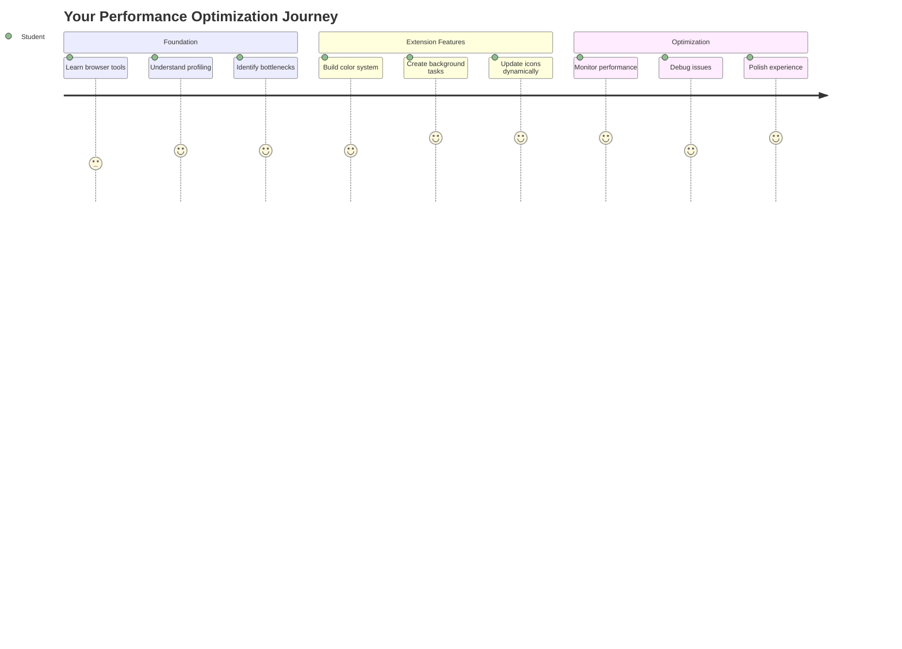
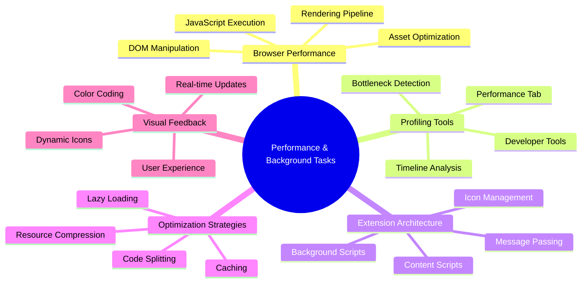
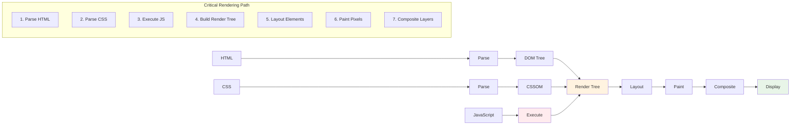
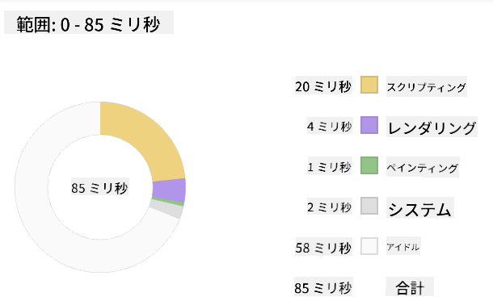
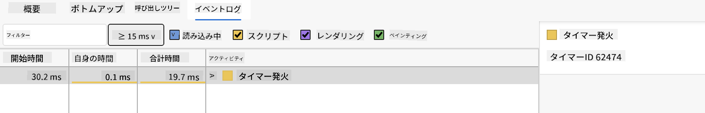
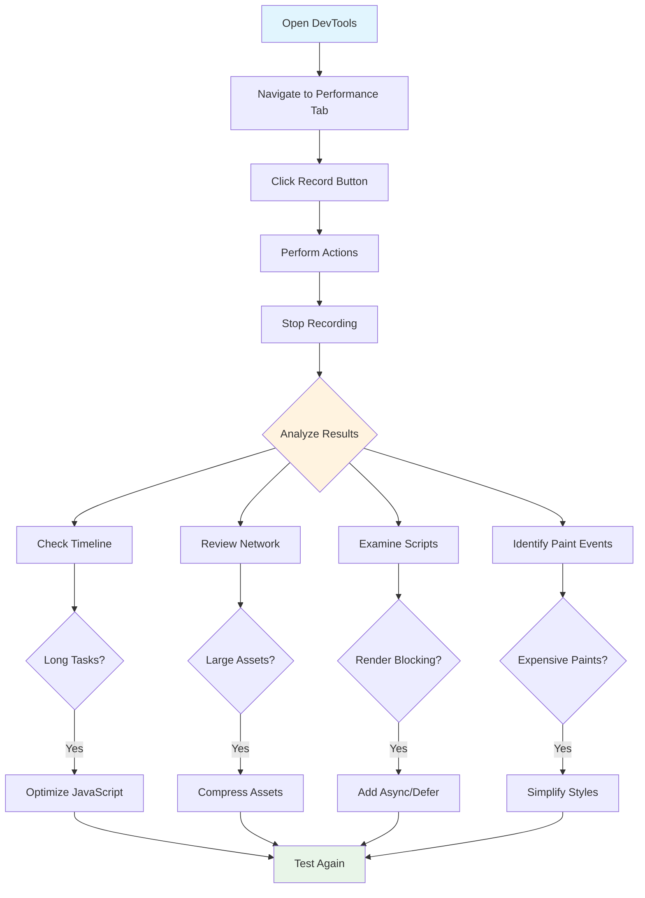
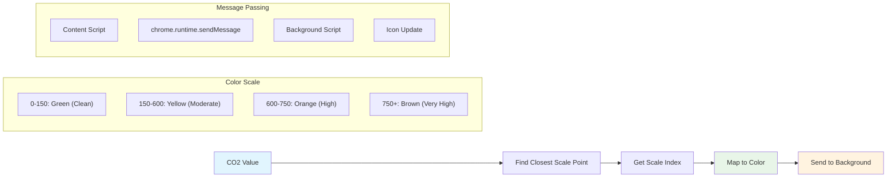
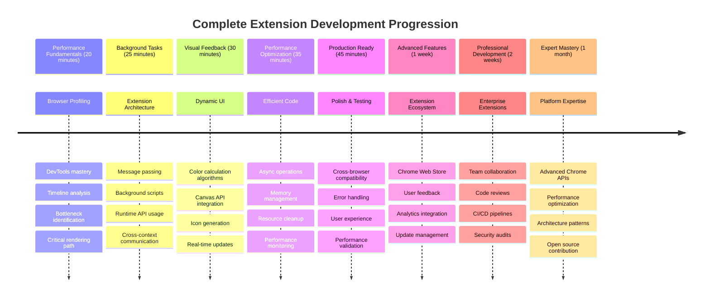

<!--
CO_OP_TRANSLATOR_METADATA:
{
  "original_hash": "b275fed2c6fc90d2b9b6661a3225faa2",
  "translation_date": "2025-11-06T13:07:02+00:00",
  "source_file": "5-browser-extension/3-background-tasks-and-performance/README.md",
  "language_code": "ja"
}
-->
# ブラウザ拡張プロジェクト パート3: バックグラウンドタスクとパフォーマンスについて学ぶ



いくつかのブラウザ拡張が軽快で反応が良いのに対し、他のものが遅く感じる理由を考えたことはありますか？その秘密は、裏で何が起きているかにあります。ユーザーが拡張機能のインターフェースを操作している間、データ取得、アイコンの更新、システムリソースの管理などを静かに行うバックグラウンドプロセスの世界が存在します。

これがブラウザ拡張シリーズの最終レッスンであり、あなたのカーボンフットプリントトラッカーをスムーズに動作させる方法を学びます。動的なアイコン更新を追加し、問題が発生する前にパフォーマンスの問題を見つける方法を学びます。レースカーを調整するようなもので、小さな最適化が全体の動作に大きな違いをもたらします。

このレッスンが終わる頃には、洗練された拡張機能を持ち、優れたウェブアプリと素晴らしいウェブアプリを分けるパフォーマンスの原則を理解できるようになります。ブラウザ最適化の世界に飛び込みましょう。

## レクチャー前のクイズ

[レクチャー前のクイズ](https://ff-quizzes.netlify.app/web/quiz/27)

### はじめに

前回のレッスンでは、フォームを作成し、それをAPIに接続し、非同期データ取得に取り組みました。あなたの拡張機能は順調に形になっています。

次は仕上げです。例えば、拡張機能のアイコンがカーボンデータに基づいて色を変えるようにすることです。これは、NASAがアポロ宇宙船のすべてのシステムを最適化しなければならなかった状況を思い出させます。彼らはサイクルやメモリの無駄を許す余裕がありませんでした。命がパフォーマンスにかかっていたからです。私たちのブラウザ拡張機能はそこまで重要ではありませんが、同じ原則が適用されます。効率的なコードはより良いユーザー体験を生み出します。



## ウェブパフォーマンスの基本

コードが効率的に動作すると、人々はその違いを実際に「感じる」ことができます。ページが瞬時に読み込まれたり、アニメーションがスムーズに流れる瞬間を知っていますか？それが良いパフォーマンスの働きです。

パフォーマンスは単に速度の問題ではありません。自然で快適なウェブ体験を提供することが重要です。コンピューティングの初期には、グレース・ホッパーがナノ秒（約1フィートの長さのワイヤー）を机に置いて、光が1秒の10億分の1の間にどれだけ進むかを示していました。彼女は、コンピューティングにおいて毎マイクロ秒が重要である理由を説明するためにこれを使っていました。何が遅くしているのかを見つけるための探偵ツールを見てみましょう。

> 「ウェブサイトのパフォーマンスは2つのことに関するものです：ページがどれだけ速く読み込まれるか、そしてその上でコードがどれだけ速く動作するか。」 -- [Zack Grossbart](https://www.smashingmagazine.com/2012/06/javascript-profiling-chrome-developer-tools/)

ウェブサイトをあらゆるデバイス、あらゆるユーザー、あらゆる状況で驚くほど速くする方法についての話題は、当然ながら広範です。標準的なウェブプロジェクトやブラウザ拡張を構築する際に覚えておくべきポイントを以下に示します。

サイトを最適化する最初のステップは、実際に裏で何が起きているかを理解することです。幸いなことに、ブラウザには強力な探偵ツールが組み込まれています。



Edgeで開発者ツールを開くには、右上の3つのドットをクリックし、「その他のツール > 開発者ツール」に進みます。または、Windowsでは`Ctrl` + `Shift` + `I`、Macでは`Option` + `Command` + `I`のキーボードショートカットを使用します。そこに到達したら、「パフォーマンス」タブをクリックしてください。ここで調査を行います。

**パフォーマンス探偵ツールキット:**
- **開く** 開発者ツール（開発者としてこれを頻繁に使用します！）
- **移動** パフォーマンスタブへ - ウェブアプリのフィットネストラッカーのようなものです
- **記録** ボタンを押してページの動作を観察
- **結果を分析** 何が遅くしているのかを見つける

これを試してみましょう。ウェブサイト（Microsoft.comが適しています）を開き、「記録」ボタンをクリックします。次にページをリフレッシュして、プロファイラーが何が起きているかをキャプチャする様子を観察します。記録を停止すると、ブラウザがサイトを「スクリプト化」、「レンダリング」、「ペイント」する方法の詳細な内訳が表示されます。これは、ロケット打ち上げ中にミッションコントロールがすべてのシステムを監視する方法を思い出させます。リアルタイムで何が起きているか、いつ起きているかのデータを得ることができます。


✅ [Microsoftのドキュメント](https://docs.microsoft.com/microsoft-edge/devtools-guide/performance/?WT.mc_id=academic-77807-sagibbon)には、さらに詳しい情報がたくさんあります。

> プロのヒント: テストする前にブラウザのキャッシュをクリアして、初めて訪問するユーザーに対するサイトのパフォーマンスを確認してください。リピート訪問とは通常かなり異なります！

プロファイルタイムラインの要素を選択して、ページが読み込まれる間に発生するイベントをズームインして確認します。

プロファイルタイムラインの一部を選択して、概要ペインでページのパフォーマンスのスナップショットを取得します:



イベントログペインを確認して、15ms以上かかったイベントがあるかどうかを確認します:



✅ プロファイラーを使いこなしてください！このサイトで開発者ツールを開き、ボトルネックがあるかどうかを確認してください。最も遅く読み込まれるアセットは何ですか？最も速いものは？



## プロファイリング時に注目すべきポイント

プロファイラーを実行するのは始まりに過ぎません。本当のスキルは、これらのカラフルなチャートが実際に何を伝えているのかを理解することです。心配しないでください、すぐに読み方に慣れるでしょう。経験豊富な開発者は、問題が完全に発生する前に警告サインを見つける方法を学んでいます。

一般的な問題児、つまりウェブプロジェクトに潜り込む傾向のあるパフォーマンスのトラブルメーカーについて話しましょう。マリー・キュリーが実験室で放射線レベルを慎重に監視しなければならなかったように、私たちは問題が発生していることを示す特定のパターンを監視する必要があります。これらを早期にキャッチすることで、あなた（そしてユーザー）の多くのフラストレーションを防ぐことができます。

**アセットサイズ**: ウェブサイトは年々「重く」なってきており、その余分な重量の多くは画像から来ています。まるでデジタルスーツケースにどんどん詰め込んでいるようなものです。

✅ [インターネットアーカイブ](https://httparchive.org/reports/page-weight)をチェックして、ページサイズがどのように増加してきたかを確認してください。非常に興味深いです。

**アセットを最適化する方法:**
- **画像を圧縮**！WebPのような最新フォーマットはファイルサイズを劇的に削減できます
- **デバイスに適した画像サイズを提供** - 大きなデスクトップ画像を携帯電話に送る必要はありません
- **CSSとJavaScriptを最小化** - バイト数が重要です
- **遅延読み込みを使用**して、ユーザーが実際にスクロールしたときにのみ画像をダウンロードする

**DOMトラバーサル**: ブラウザはあなたが書いたコードに基づいてドキュメントオブジェクトモデルを構築する必要があるため、タグを最小限に抑え、ページが必要とするものだけを使用してスタイリングすることが良いページパフォーマンスのために重要です。この点で、ページに関連する余分なCSSは最適化されるべきです。特定のページでのみ使用する必要があるスタイルは、メインスタイルシートに含める必要はありません。

**DOM最適化の主要戦略:**
- **HTML要素とネストレベルを最小化**
- **未使用のCSSルールを削除し、効率的にスタイルシートを統合**
- **各ページに必要なものだけをロードするようにCSSを整理**
- **HTMLをセマンティックに構造化してブラウザの解析を向上**

**JavaScript**: すべてのJavaScript開発者は、DOMをトラバーサルしてブラウザにペイントする前にロードする必要がある「レンダーブロッキング」スクリプトに注意する必要があります。インラインスクリプトで`defer`を使用することを検討してください（Terrariumモジュールで行われているように）。

**最新のJavaScript最適化技術:**
- **`defer`属性を使用**してDOM解析後にスクリプトをロード
- **コード分割を実装**して必要なJavaScriptのみをロード
- **非重要な機能に対して遅延読み込みを適用**
- **可能な限り重いライブラリやフレームワークの使用を最小化**

✅ [サイト速度テストウェブサイト](https://www.webpagetest.org/)でいくつかのサイトを試して、サイトパフォーマンスを判断するために行われる一般的なチェックについて学びましょう。

### 🔄 **教育的チェックイン**
**パフォーマンス理解**: 拡張機能の機能を構築する前に、以下を確認してください:
- ✅ HTMLからピクセルへのクリティカルレンダリングパスを説明できる
- ✅ ウェブアプリケーションの一般的なパフォーマンスボトルネックを特定できる
- ✅ ブラウザ開発者ツールを使用してページパフォーマンスをプロファイルできる
- ✅ アセットサイズとDOMの複雑さが速度に与える影響を理解できる

**簡単な自己テスト**: レンダーブロッキングJavaScriptがあるとどうなるか？
*答え: ブラウザはHTMLの解析とページのレンダリングを続行する前にスクリプトをダウンロードして実行する必要があります*

**実世界のパフォーマンス影響**:
- **100msの遅延**: ユーザーは遅さを感じる
- **1秒の遅延**: ユーザーは集中力を失い始める
- **3秒以上の遅延**: ユーザーの40%がページを放棄する
- **モバイルネットワーク**: パフォーマンスはさらに重要

ブラウザが送信されたアセットをレンダリングする方法についてのアイデアが得られたので、拡張機能を完成させるために必要な最後のいくつかのことを見てみましょう:

### 色を計算する関数を作成する

次に、数値データを意味のある色に変換する関数を作成します。これは信号システムのようなもので、クリーンエネルギーには緑、高炭素強度には赤を示します。

この関数はAPIからのCO2データを取得し、環境への影響を最もよく表す色を決定します。科学者がヒートマップで複雑なデータパターンを視覚化するために色分けを使用する方法に似ています。これを`/src/index.js`に追加しましょう。以前に設定した`const`変数のすぐ後に追加します:



```javascript
function calculateColor(value) {
	// Define CO2 intensity scale (grams per kWh)
	const co2Scale = [0, 150, 600, 750, 800];
	// Corresponding colors from green (clean) to dark brown (high carbon)
	const colors = ['#2AA364', '#F5EB4D', '#9E4229', '#381D02', '#381D02'];

	// Find the closest scale value to our input
	const closestNum = co2Scale.sort((a, b) => {
		return Math.abs(a - value) - Math.abs(b - value);
	})[0];
	
	console.log(`${value} is closest to ${closestNum}`);
	
	// Find the index for color mapping
	const num = (element) => element > closestNum;
	const scaleIndex = co2Scale.findIndex(num);

	const closestColor = colors[scaleIndex];
	console.log(scaleIndex, closestColor);

	// Send color update message to background script
	chrome.runtime.sendMessage({ action: 'updateIcon', value: { color: closestColor } });
}
```

**この巧妙な関数を分解してみましょう:**
- **2つの配列を設定** - 1つはCO2レベル用、もう1つは色用（緑 = クリーン、茶色 = 汚染！）
- **実際のCO2値に最も近い一致を見つける** 配列のソートを使用
- **一致する色を取得** findIndex()メソッドを使用
- **選択した色をChromeのバックグラウンドスクリプトに送信**
- **テンプレートリテラル（バックティック）を使用**して文字列フォーマットを簡潔に
- **すべてを整理** const宣言で

`chrome.runtime` [API](https://developer.chrome.com/extensions/runtime)は拡張機能の神経系のようなもので、すべての裏での通信とタスクを処理します:

> 「chrome.runtime APIを使用してバックグラウンドページを取得し、マニフェストの詳細を返し、アプリまたは拡張機能のライフサイクル内のイベントをリッスンして応答します。また、このAPIを使用してURLの相対パスを完全修飾URLに変換することもできます。」

**Chrome Runtime APIが便利な理由:**
- **拡張機能の異なる部分が互いに通信できる**
- **ユーザーインターフェースをフリーズさせずにバックグラウンド作業を処理**
- **拡張機能のライフサイクルイベントを管理**
- **スクリプト間のメッセージ送信を非常に簡単にする**

✅ Edge用にこのブラウザ拡張機能を開発している場合、Chrome APIを使用していることに驚くかもしれません。新しいEdgeブラウザバージョンはChromiumブラウザエンジン上で動作しているため、これらのツールを活用できます。

```mermaid
architecture-beta
    group browser(logos:chrome)[Browser]
    
    service popup(logos:html5)[Popup UI] in browser
    service content(logos:javascript)[Content Script] in browser
    service background(database)[Background Script] in browser
    service api(logos:api)[External API] in browser
    
    popup:R -- L:content
    content:R -- L:background
    background:T -- B:api
    content:T -- B:api
    
    junction junctionCenter in browser
    popup:R -- L:junctionCenter
    junctionCenter:R -- L:background
```



> **プロのヒント**: ブラウザ拡張機能をプロファイルする場合、拡張機能自体の中から開発者ツールを起動してください。拡張機能は独自のブラウザインスタンスとして動作するため、拡張機能固有のパフォーマンスメトリクスにアクセスできます。

### デフォルトのアイコン色を設定する

実際のデータを取得する前に、拡張機能に初期状態を設定しましょう。誰も空白や壊れたように見えるアイコンを見たいとは思いません。緑色を初期状態として設定し、ユーザーがインストールした瞬間から拡張機能が動作していることを示します。

`init()`関数内で、デフォルトの緑色アイコンを設定しましょう:

```javascript
chrome.runtime.sendMessage({
	action: 'updateIcon',
	value: {
		color: 'green',
	},
});
```

**この初期化が達成すること:**
- **中立的な緑色をデフォルト状態として設定**
- **拡張機能がロードされたときに即座に視覚的フィードバックを提供**
- **バックグラウンドスクリプトとの通信パターンを確立**
- **データがロードされる前にユーザーが機能する拡張機能を確認できるようにする**

### 関数を呼び出し、実行する

次に、新しいCO2データが届いたときにアイコンが自動的に適切な色に更新されるようにすべてを接続します。これは電子デバイスの最終回路を接続する
- ✅ Chrome Runtime APIは、拡張機能のアーキテクチャにおいてどのような役割を果たしますか？
- ✅ 色計算アルゴリズムは、データをどのように視覚的なフィードバックにマッピングしますか？

**パフォーマンスの考慮事項**: あなたの拡張機能は以下を実現しています:
- **効率的なメッセージング**: スクリプトコンテキスト間のスムーズな通信
- **最適化されたレンダリング**: OffscreenCanvasによるUIのブロック防止
- **リアルタイム更新**: ライブデータに基づく動的なアイコン変更
- **メモリ管理**: 適切なクリーンアップとリソース処理

**拡張機能をテストする時間です:**
- **ビルド**: `npm run build`で全てをビルド
- **リロード**: ブラウザで拡張機能をリロード（このステップを忘れないでください）
- **オープン**: 拡張機能を開いてアイコンが色を変える様子を確認
- **チェック**: 世界中のリアルな炭素データに対する反応を確認

これで、洗濯物をするのに良いタイミングか、よりクリーンなエネルギーを待つべきかが一目で分かります。ブラウザのパフォーマンスについて学びながら、本当に役立つものを作り上げました。

## GitHub Copilot Agent Challenge 🚀

Agentモードを使用して以下のチャレンジを完了してください:

**説明:** 拡張機能のパフォーマンス監視機能を強化し、拡張機能の各コンポーネントのロード時間を追跡・表示する機能を追加します。

**プロンプト:** Performance APIを使用してCO2データのAPI取得、色の計算、アイコンの更新にかかる時間を測定・記録するパフォーマンス監視システムを作成してください。`performanceTracker`という関数を追加し、これらの操作を測定し、ブラウザコンソールにタイムスタンプと期間のメトリクスを表示します。

[agent mode](https://code.visualstudio.com/blogs/2025/02/24/introducing-copilot-agent-mode)について詳しくはこちらをご覧ください。

## 🚀 チャレンジ

面白い探偵ミッションです: Wikipedia、GitHub、Stack Overflowなど、長年運営されているオープンソースのウェブサイトをいくつか選び、コミット履歴を調査してください。どこでパフォーマンス改善が行われたか見つけられますか？どんな問題が繰り返し発生していましたか？

**調査アプローチ:**
- **検索**: コミットメッセージで「optimize」「performance」「faster」といった言葉を探す
- **パターンを探す**: 同じ種類の問題を繰り返し修正しているか確認
- **特定**: ウェブサイトを遅くする一般的な原因を見つける
- **共有**: あなたが発見したことを共有することで、他の開発者が実例から学べるようにする

## 講義後のクイズ

[講義後のクイズ](https://ff-quizzes.netlify.app/web/quiz/28)

## レビューと自己学習

[パフォーマンスニュースレター](https://perf.email/)に登録することを検討してください。

ブラウザがウェブパフォーマンスを評価する方法を調査し、ウェブツールのパフォーマンスタブを確認してください。大きな違いが見つかりますか？

### ⚡ **次の5分間でできること**
- [ ] ブラウザのタスクマネージャーを開く（ChromeではShift+Esc）拡張機能のリソース使用状況を確認
- [ ] DevToolsのパフォーマンスタブを使用してウェブページのパフォーマンスを記録・分析
- [ ] ブラウザの拡張機能ページで、どの拡張機能が起動時間に影響を与えているか確認
- [ ] 拡張機能を一時的に無効化してパフォーマンスの違いを確認

### 🎯 **次の1時間で達成できること**
- [ ] 講義後のクイズを完了し、パフォーマンスの概念を理解
- [ ] ブラウザ拡張機能のバックグラウンドスクリプトを実装
- [ ] browser.alarmsを使用して効率的なバックグラウンドタスクを学ぶ
- [ ] コンテンツスクリプトとバックグラウンドスクリプト間のメッセージ送信を練習
- [ ] 拡張機能のリソース使用量を測定・最適化

### 📅 **1週間のパフォーマンス向上の旅**
- [ ] バックグラウンド機能を備えた高性能ブラウザ拡張機能を完成させる
- [ ] サービスワーカーと最新の拡張機能アーキテクチャを習得
- [ ] 効率的なデータ同期とキャッシュ戦略を実装
- [ ] 拡張機能のパフォーマンスを向上させる高度なデバッグ技術を学ぶ
- [ ] 機能性とリソース効率の両方を最適化する拡張機能を作成
- [ ] 拡張機能のパフォーマンスシナリオに対する包括的なテストを作成

### 🌟 **1か月間の最適化マスタリー**
- [ ] 最適なパフォーマンスを備えたエンタープライズグレードのブラウザ拡張機能を構築
- [ ] Web Workers、Service Workers、最新のウェブパフォーマンスについて学ぶ
- [ ] パフォーマンス最適化に焦点を当てたオープンソースプロジェクトに貢献
- [ ] ブラウザ内部構造と高度なデバッグ技術を習得
- [ ] パフォーマンス監視ツールとベストプラクティスガイドを作成
- [ ] ウェブアプリケーションの最適化を支援するパフォーマンスの専門家になる

## 🎯 ブラウザ拡張機能マスタリーのタイムライン



### 🛠️ 完全な拡張機能開発ツールキット

このトリロジーを完了した後、以下を習得しています:
- **ブラウザアーキテクチャ**: 拡張機能がブラウザシステムと統合する仕組みの深い理解
- **パフォーマンスプロファイリング**: 開発者ツールを使用してボトルネックを特定・修正する能力
- **非同期プログラミング**: レスポンシブで非ブロッキングな操作のためのモダンなJavaScriptパターン
- **API統合**: 認証とエラーハンドリングを伴う外部データ取得
- **ビジュアルデザイン**: 動的なUI更新とCanvasベースのグラフィック生成
- **メッセージ送信**: 拡張機能アーキテクチャにおけるスクリプト間通信
- **ユーザーエクスペリエンス**: ローディング状態、エラーハンドリング、直感的なインタラクション
- **プロダクションスキル**: 実世界での展開のためのテスト、デバッグ、最適化

**実世界での応用**: 拡張機能開発スキルは以下に直接適用できます:
- **プログレッシブウェブアプリ**: 同様のアーキテクチャとパフォーマンスパターン
- **Electronデスクトップアプリ**: ウェブ技術を使用したクロスプラットフォームアプリケーション
- **モバイルハイブリッドアプリ**: Cordova/PhoneGapを使用したウェブAPI開発
- **エンタープライズウェブアプリケーション**: 複雑なダッシュボードと生産性ツール
- **Chrome DevTools拡張機能**: 高度な開発者ツールとデバッグ
- **ウェブAPI統合**: 外部サービスと通信するアプリケーション

**プロフェッショナルな影響**: あなたは今以下を行うことができます:
- **構築**: 概念から展開までのプロダクション対応ブラウザ拡張機能
- **最適化**: 業界標準のプロファイリングツールを使用したウェブアプリケーションのパフォーマンス
- **設計**: 適切な関心の分離を備えたスケーラブルなシステム
- **デバッグ**: 複雑な非同期操作とクロスコンテキスト通信
- **貢献**: オープンソース拡張機能プロジェクトとブラウザ標準への貢献

**次のレベルの機会**:
- **Chrome Web Store開発者**: 数百万のユーザー向けに拡張機能を公開
- **ウェブパフォーマンスエンジニア**: 最適化とユーザーエクスペリエンスに特化
- **ブラウザプラットフォーム開発者**: ブラウザエンジン開発に貢献
- **拡張機能フレームワーク作成者**: 他の開発者を支援するツールを構築
- **開発者リレーションズ**: 教育とコンテンツ作成を通じて知識を共有

🌟 **達成解除**: プロフェッショナルな開発手法と最新のウェブ標準を示す完全で機能的なブラウザ拡張機能を構築しました！

## 課題

[サイトのパフォーマンスを分析](assignment.md)

---

**免責事項**:  
この文書はAI翻訳サービス[Co-op Translator](https://github.com/Azure/co-op-translator)を使用して翻訳されています。正確性を追求しておりますが、自動翻訳には誤りや不正確な部分が含まれる可能性があります。元の言語で記載された文書を正式な情報源としてご参照ください。重要な情報については、専門の人間による翻訳を推奨します。この翻訳の使用に起因する誤解や誤解釈について、当社は一切の責任を負いません。