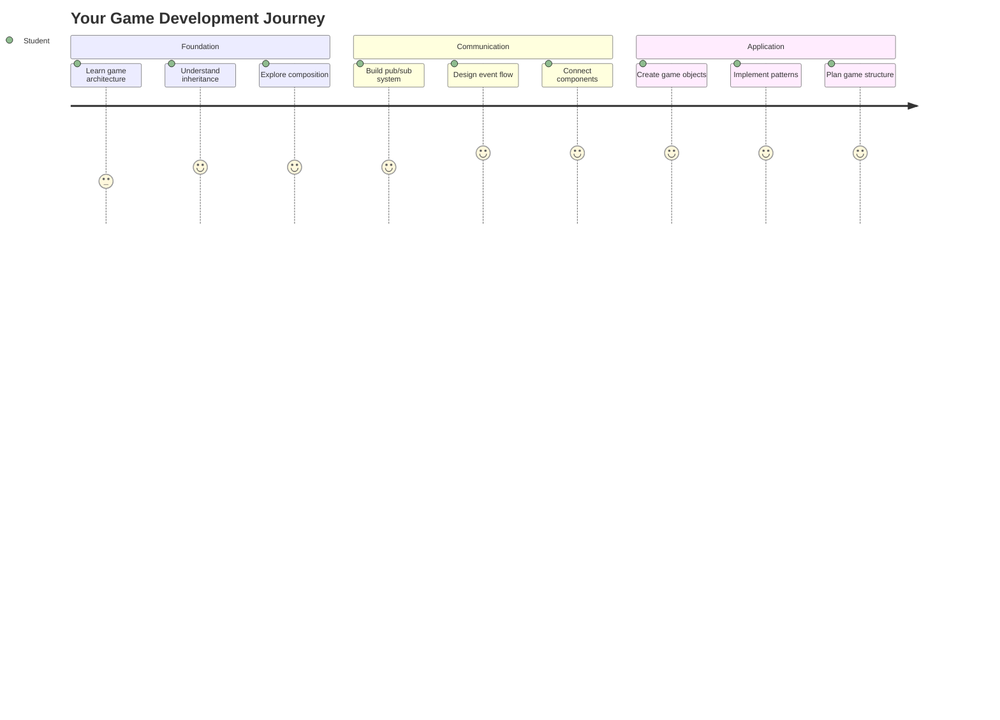
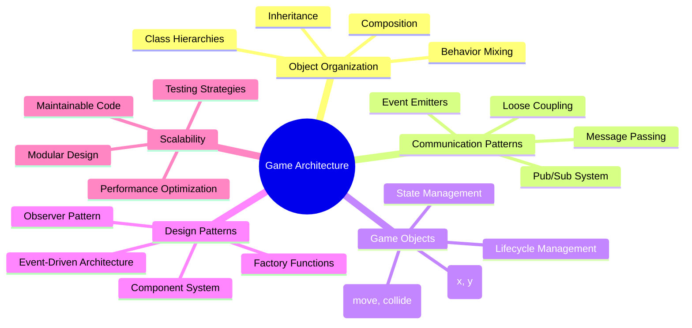
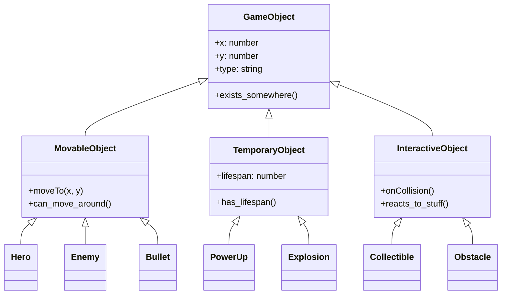
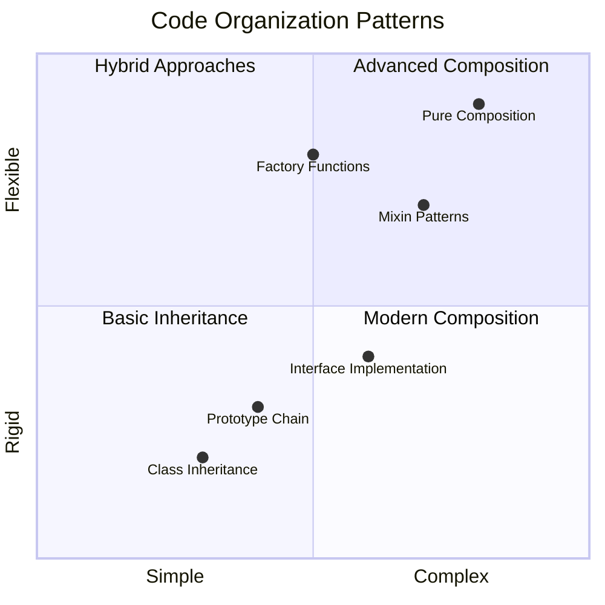
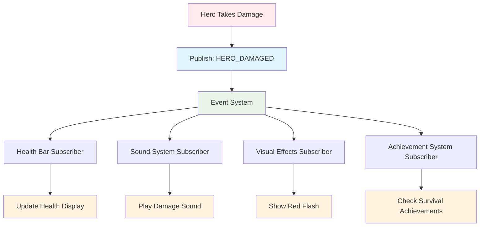
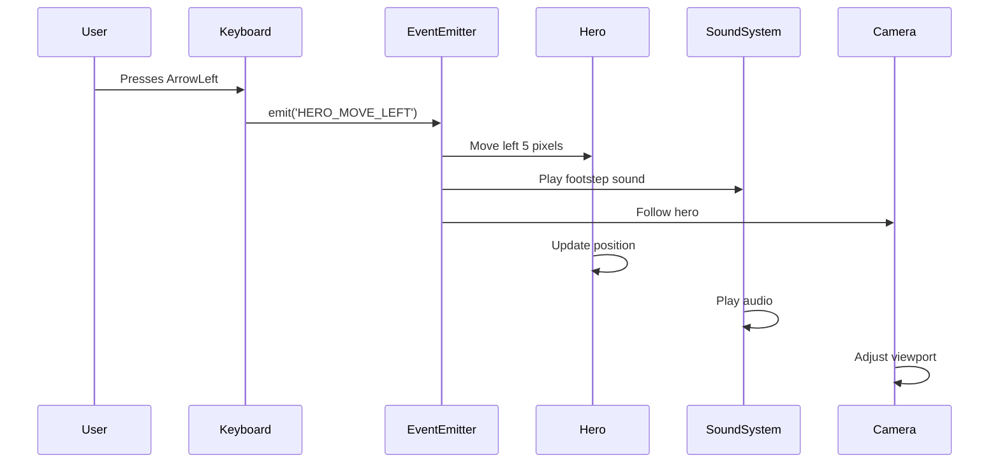
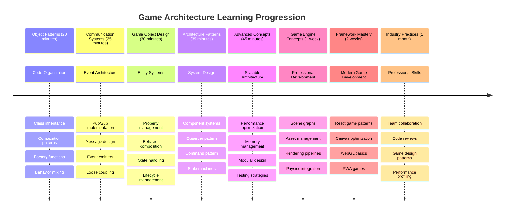

# 宇宙ゲームを作ろう パート1: はじめに




NASAのミッションコントロールが宇宙打ち上げ時に複数のシステムを調整するように、私たちはプログラムの異なる部分がシームレスに連携する方法を示す宇宙ゲームを作ります。実際に遊べるものを作りながら、どんなソフトウェアプロジェクトにも応用できる基本的なプログラミング概念を学びます。

コードを整理するための2つの基本的なアプローチ、継承とコンポジションを探ります。これらは単なる学術的な概念ではなく、ビデオゲームから銀行システムまでを支えるパターンです。また、宇宙船の通信ネットワークのように、依存関係を作らずに情報を共有できるpub/subという通信システムも実装します。

このシリーズの終わりまでに、ゲームやウェブアプリケーション、その他のソフトウェアシステムを開発する際にスケールアップや進化が可能なアプリケーションの作り方を理解できるようになります。



## 講義前クイズ

[講義前クイズ](https://ff-quizzes.netlify.app/web/quiz/29)

## ゲーム開発における継承とコンポジション

プロジェクトが複雑になるにつれて、コードの整理が重要になります。単純なスクリプトとして始まったものが、適切な構造がなければ維持が困難になることがあります。これは、アポロ計画が数千のコンポーネント間の慎重な調整を必要としたのと似ています。

コードを整理するための2つの基本的なアプローチ、継承とコンポジションを探ります。それぞれに独自の利点があり、両方を理解することで、状況に応じて適切なアプローチを選択できるようになります。これらの概念を宇宙ゲームを通じて示します。ヒーロー、敵、パワーアップ、その他のオブジェクトが効率的に相互作用する必要があります。

✅ 最も有名なプログラミング本の1つは[デザインパターン](https://en.wikipedia.org/wiki/Design_Patterns)に関するものです。

どんなゲームでも、`ゲームオブジェクト`があります。これはゲームの世界を構成するインタラクティブな要素です。ヒーロー、敵、パワーアップ、視覚効果などがゲームオブジェクトです。それぞれが座標平面上の点をプロットするように、`x`と`y`の値を使用して特定の画面座標に存在します。

見た目は異なりますが、これらのオブジェクトはしばしば基本的な動作を共有します：

- **どこかに存在する** – すべてのオブジェクトは`x`と`y`の座標を持ち、ゲームが描画する場所を知る
- **多くは移動できる** – ヒーローは走り、敵は追いかけ、弾丸は画面を横切る
- **寿命がある** – 一部は永遠に存在し、他のもの（爆発など）は一時的に現れて消える
- **何かに反応する** – 衝突が起きると、パワーアップが収集され、体力バーが更新される

✅ パックマンのようなゲームを考えてみてください。このゲームで上記の4つのオブジェクトタイプを特定できますか？



### コードで動作を表現する

ゲームオブジェクトが共有する共通の動作を理解したところで、これらの動作をJavaScriptで実装する方法を探りましょう。オブジェクトの動作は、クラスや個々のオブジェクトに付属するメソッドを通じて表現できます。いくつかのアプローチがあります。

**クラスベースのアプローチ**

クラスと継承は、ゲームオブジェクトを整理するための構造化されたアプローチを提供します。カール・リンネによって開発された分類学的分類システムのように、共通のプロパティを含む基本クラスから始め、これらの基本を継承しながら特定の機能を追加する専門化されたクラスを作成します。

✅ 継承は重要な概念です。[MDNの継承に関する記事](https://developer.mozilla.org/docs/Web/JavaScript/Inheritance_and_the_prototype_chain)でさらに学びましょう。

以下は、クラスと継承を使用してゲームオブジェクトを実装する方法です：

```javascript
// Step 1: Create the base GameObject class
class GameObject {
  constructor(x, y, type) {
    this.x = x;
    this.y = y;
    this.type = type;
  }
}
```

**これをステップごとに分解すると：**
- すべてのゲームオブジェクトが使用できる基本テンプレートを作成しています
- コンストラクタはオブジェクトがどこにあるか（`x`、`y`）とどのような種類のものかを保存します
- これがすべてのゲームオブジェクトが基づく基盤になります

```javascript
// Step 2: Add movement capability through inheritance
class Movable extends GameObject {
  constructor(x, y, type) {
    super(x, y, type); // Call parent constructor
  }

  // Add the ability to move to a new position
  moveTo(x, y) {
    this.x = x;
    this.y = y;
  }
}
```

**上記では：**
- GameObjectクラスを**拡張**して移動機能を追加しました
- `super()`を使用して親コンストラクタを**呼び出し**、継承されたプロパティを初期化しました
- オブジェクトの位置を更新する`moveTo()`メソッドを**追加**しました

```javascript
// Step 3: Create specific game object types
class Hero extends Movable {
  constructor(x, y) {
    super(x, y, 'Hero'); // Set type automatically
  }
}

class Tree extends GameObject {
  constructor(x, y) {
    super(x, y, 'Tree'); // Trees don't need movement
  }
}

// Step 4: Use your game objects
const hero = new Hero(0, 0);
hero.moveTo(5, 5); // Hero can move!

const tree = new Tree(10, 15);
// tree.moveTo() would cause an error - trees can't move
```

**これらの概念を理解することで：**
- 適切な動作を継承する専門化されたオブジェクトタイプを**作成**できます
- 継承が選択的な機能の追加を可能にすることを**示します**
- ヒーローは移動できるが木は静止していることを**示します**
- クラス階層が不適切な動作を防ぐことを**説明します**

✅ 数分間、パックマンのヒーロー（例えばインキー、ピンキー、ブリンキー）を再構想し、それがJavaScriptでどのように記述されるか考えてみてください。

**コンポジションアプローチ**

コンポジションはモジュール設計の哲学に従い、エンジニアが交換可能なコンポーネントで宇宙船を設計する方法に似ています。親クラスから継承する代わりに、特定の動作を組み合わせて、必要な機能を正確に備えたオブジェクトを作成します。このアプローチは、堅固な階層的制約なしで柔軟性を提供します。

```javascript
// Step 1: Create base behavior objects
const gameObject = {
  x: 0,
  y: 0,
  type: ''
};

const movable = {
  moveTo(x, y) {
    this.x = x;
    this.y = y;
  }
};
```

**このコードが行うこと：**
- 位置とタイププロパティを持つ基本的な`gameObject`を**定義**します
- 移動機能を持つ別の`movable`動作オブジェクトを**作成**します
- 位置データと移動ロジックを独立して保持することで**関心を分離**します

```javascript
// Step 2: Compose objects by combining behaviors
const movableObject = { ...gameObject, ...movable };

// Step 3: Create factory functions for different object types
function createHero(x, y) {
  return {
    ...movableObject,
    x,
    y,
    type: 'Hero'
  };
}

function createStatic(x, y, type) {
  return {
    ...gameObject,
    x,
    y,
    type
  };
}
```

**上記では：**
- スプレッド構文を使用して基本オブジェクトプロパティと移動動作を**組み合わせ**ました
- カスタマイズされたオブジェクトを返すファクトリ関数を**作成**しました
- 堅固なクラス階層なしで柔軟なオブジェクト作成を**可能に**しました
- 必要な動作だけを持つオブジェクトを**許可**しました

```javascript
// Step 4: Create and use your composed objects
const hero = createHero(10, 10);
hero.moveTo(5, 5); // Works perfectly!

const tree = createStatic(0, 0, 'Tree');
// tree.moveTo() is undefined - no movement behavior was composed
```

**覚えておくべき重要なポイント：**
- 継承するのではなく動作を混ぜ合わせてオブジェクトを**構成**します
- 堅固な継承階層よりも柔軟性を**提供**します
- 必要な機能だけを持つオブジェクトを**許可**します
- クリーンなオブジェクトの組み合わせのために最新のJavaScriptスプレッド構文を**使用**します
```

**Which Pattern Should You Choose?**

**Which Pattern Should You Choose?**



> 💡 **プロのヒント**: 両方のパターンは現代のJavaScript開発で役立ちます。クラスは明確に定義された階層に適しており、コンポジションは最大限の柔軟性が必要な場合に輝きます。
> 
**各アプローチを使用するタイミング：**
- **継承を選択**: 明確な「is-a」関係がある場合（ヒーローは移動可能なオブジェクトである）
- **コンポジションを選択**: 「has-a」関係が必要な場合（ヒーローは移動能力を持つ）
- **チームの好みとプロジェクトの要件を考慮**
- **両方のアプローチを同じアプリケーションで混在させることを忘れない**

### 🔄 **教育的チェックイン**
**オブジェクト整理の理解**: 通信パターンに進む前に、以下を確認してください：
- ✅ 継承とコンポジションの違いを説明できる
- ✅ クラスとファクトリ関数を使用するタイミングを特定できる
- ✅ 継承における`super()`キーワードの動作を理解できる
- ✅ ゲーム開発における各アプローチの利点を認識できる

**簡単な自己テスト**: 移動と飛行が可能な飛行する敵をどのように作成しますか？
- **継承アプローチ**: `class FlyingEnemy extends Movable`
- **コンポジションアプローチ**: `{ ...movable, ...flyable, ...gameObject }`

**実世界の接続**: これらのパターンは至る所で見られます：
- **Reactコンポーネント**: Props（コンポジション）vsクラス継承
- **ゲームエンジン**: エンティティコンポーネントシステムはコンポジションを使用
- **モバイルアプリ**: UIフレームワークはしばしば継承階層を使用

## 通信パターン: Pub/Subシステム

アプリケーションが複雑になるにつれて、コンポーネント間の通信を管理することが課題になります。パブリッシュ-サブスクライブパターン（pub/sub）は、ラジオ放送の原理に似た方法でこの問題を解決します。1つの送信機が誰が聞いているかを知らずに複数の受信機に到達できます。

ヒーローがダメージを受けたときに何が起こるかを考えてみてください：体力バーが更新され、効果音が再生され、視覚的なフィードバックが表示されます。ヒーローオブジェクトをこれらのシステムに直接結びつけるのではなく、pub/subを使用して「ダメージを受けた」というメッセージを送信します。反応する必要があるシステムは、このメッセージタイプを購読し、適切に反応します。

✅ **Pub/Sub**は「パブリッシュ-サブスクライブ」の略です



### Pub/Subアーキテクチャの理解

pub/subパターンは、アプリケーションの異なる部分を緩く結合し、直接依存せずに連携できるようにします。この分離により、コードがより保守可能でテスト可能で変更に柔軟になります。

**pub/subの主要な要素：**
- **メッセージ** – `'PLAYER_SCORED'`のような簡単なテキストラベルで、何が起こったかを説明（追加情報を含む場合も）
- **パブリッシャー** – 「何かが起こった！」と叫ぶオブジェクト
- **サブスクライバー** – 「そのイベントに関心がある」と言い、発生時に反応するオブジェクト
- **イベントシステム** – メッセージが正しいリスナーに届くようにする仲介者

### イベントシステムの構築

これらの概念を示すシンプルで強力なイベントシステムを作りましょう：

```javascript
// Step 1: Create the EventEmitter class
class EventEmitter {
  constructor() {
    this.listeners = {}; // Store all event listeners
  }
  
  // Register a listener for a specific message type
  on(message, listener) {
    if (!this.listeners[message]) {
      this.listeners[message] = [];
    }
    this.listeners[message].push(listener);
  }
  
  // Send a message to all registered listeners
  emit(message, payload = null) {
    if (this.listeners[message]) {
      this.listeners[message].forEach(listener => {
        listener(message, payload);
      });
    }
  }
}
```

**ここで何が起こるかを分解すると：**
- シンプルなクラスを使用して中央のイベント管理システムを**作成**
- メッセージタイプで整理されたオブジェクトにリスナーを**保存**
- `on()`メソッドを使用して新しいリスナーを**登録**
- `emit()`を使用して関心のあるすべてのリスナーにメッセージを**送信**
- 関連情報を渡すためのオプションのデータペイロードを**サポート**

### 実践例: すべてをまとめる

さて、これを実際に見てみましょう！pub/subのクリーンで柔軟な性質を示すシンプルな移動システムを構築します：

```javascript
// Step 1: Define your message types
const Messages = {
  HERO_MOVE_LEFT: 'HERO_MOVE_LEFT',
  HERO_MOVE_RIGHT: 'HERO_MOVE_RIGHT',
  ENEMY_SPOTTED: 'ENEMY_SPOTTED'
};

// Step 2: Create your event system and game objects
const eventEmitter = new EventEmitter();
const hero = createHero(0, 0);
```

**このコードが行うこと：**
- メッセージ名のタイプミスを防ぐために定数オブジェクトを**定義**
- すべての通信を処理するイベントエミッターインスタンスを**作成**
- 初期位置にヒーローオブジェクトを**初期化**

```javascript
// Step 3: Set up event listeners (subscribers)
eventEmitter.on(Messages.HERO_MOVE_LEFT, () => {
  hero.moveTo(hero.x - 5, hero.y);
  console.log(`Hero moved to position: ${hero.x}, ${hero.y}`);
});

eventEmitter.on(Messages.HERO_MOVE_RIGHT, () => {
  hero.moveTo(hero.x + 5, hero.y);
  console.log(`Hero moved to position: ${hero.x}, ${hero.y}`);
});
```

**上記では：**
- 移動メッセージに反応するイベントリスナーを**登録**
- 移動方向に基づいてヒーローの位置を**更新**
- ヒーローの位置変更を追跡するためにコンソールログを**追加**
- 入力処理から移動ロジックを**分離**

```javascript
// Step 4: Connect keyboard input to events (publishers)
window.addEventListener('keydown', (event) => {
  switch(event.key) {
    case 'ArrowLeft':
      eventEmitter.emit(Messages.HERO_MOVE_LEFT);
      break;
    case 'ArrowRight':
      eventEmitter.emit(Messages.HERO_MOVE_RIGHT);
      break;
  }
});
```

**これらの概念を理解することで：**
- キーボード入力をゲームイベントに直接結びつけることなく**接続**
- 入力システムがゲームオブジェクトと間接的に通信できるように**する**
- 同じキーボードイベントに複数のシステムが反応できるように**する**
- キーバインドを変更したり新しい入力方法を追加するのが簡単に**なる**



> 💡 **プロのヒント**: このパターンの美しさは柔軟性にあります！音響効果、画面の揺れ、またはパーティクル効果を簡単に追加できます。既存のキーボードや移動コードを変更する必要はありません。
> 
**このアプローチが好きになる理由：**
- 新しい機能の追加が非常に簡単 – 必要なイベントをリッスンするだけ
- 同じイベントに複数のものが反応しても互いに干渉しない
- 各部分が独立して動作するためテストが非常に簡単
- 何かが壊れたとき、問題の場所がすぐにわかる

### Pub/Subが効果的にスケールする理由

pub/subパターンは、アプリケーションが複雑になるにつれてシンプルさを維持します。多数の敵、動的なUI更新、または音響システムを管理する場合でも、このパターンはアーキテクチャの変更なしで拡張性を提供します。新しい機能は既存のイベントシステムに統合され、既存の機能に影響を与えません。

> ⚠️ **よくある間違い**: 初期段階で特定のメッセージタイプを作りすぎないでください。広いカテゴリから始め、ゲームのニーズが明確になるにつれてそれを洗練してください。
> 
**守るべきベストプラクティス：**
- 関連するメッセージを論理的なカテゴリに**グループ化**
- 何が起こったかを明確に示す説明的な名前を**使用**
- メッセージペイロードをシンプルで焦点を絞ったものに**保つ**
- チームのコラボレーションのためにメッセージタイプを**文書化**

### 🔄 **教育的チェックイン**
**イベント駆動型アーキテクチャの理解**: システム全体の理解を確認してください：
- ✅ pub/subパターンがコンポーネント間の緊密な結合を防ぐ方法
- ✅ イベント駆動型アーキテクチャで新しい機能を追加するのがなぜ簡単なのか
- ✅ EventEmitterが通信フローで
ゲームアーキテクチャを向上させるために、Pub-Subパターンがどのように役立つかを考えましょう。どのコンポーネントがイベントを発行すべきか、システムがどのように応答すべきかを特定してください。ゲームコンセプトを設計し、そのコンポーネント間の通信パターンをマッピングしましょう。

## 講義後のクイズ

[講義後のクイズ](https://ff-quizzes.netlify.app/web/quiz/30)

## 復習と自己学習

Pub/Subについてさらに学ぶには、[こちらを読んでください](https://docs.microsoft.com/azure/architecture/patterns/publisher-subscriber/?WT.mc_id=academic-77807-sagibbon)。

### ⚡ **次の5分間でできること**
- [ ] 任意のHTML5ゲームをオンラインで開き、DevToolsを使ってコードを確認する
- [ ] 簡単なHTML5 Canvas要素を作成し、基本的な形を描画する
- [ ] `setInterval`を使って簡単なアニメーションループを作成してみる
- [ ] Canvas APIのドキュメントを調べて描画メソッドを試してみる

### 🎯 **この1時間で達成できること**
- [ ] 講義後のクイズを完了し、ゲーム開発の概念を理解する
- [ ] HTML、CSS、JavaScriptファイルを使ってゲームプロジェクトの構造を設定する
- [ ] 継続的に更新と描画を行う基本的なゲームループを作成する
- [ ] Canvas上に最初のゲームスプライトを描画する
- [ ] 画像や音声の基本的なアセット読み込みを実装する

### 📅 **1週間でのゲーム作成**
- [ ] 計画したすべての機能を備えた完全なスペースゲームを完成させる
- [ ] 洗練されたグラフィック、効果音、滑らかなアニメーションを追加する
- [ ] ゲームの状態（スタート画面、ゲームプレイ、ゲームオーバー）を実装する
- [ ] スコアリングシステムとプレイヤーの進捗追跡を作成する
- [ ] ゲームをレスポンシブにし、デバイス間でアクセス可能にする
- [ ] ゲームをオンラインで共有し、プレイヤーからフィードバックを得る

### 🌟 **1か月でのゲーム開発**
- [ ] 異なるジャンルやメカニクスを探求する複数のゲームを作成する
- [ ] PhaserやThree.jsのようなゲーム開発フレームワークを学ぶ
- [ ] オープンソースのゲーム開発プロジェクトに貢献する
- [ ] 高度なゲームプログラミングパターンと最適化を習得する
- [ ] ゲーム開発スキルを示すポートフォリオを作成する
- [ ] ゲーム開発やインタラクティブメディアに興味を持つ人々を指導する

## 🎯 ゲーム開発マスタリータイムライン



### 🛠️ ゲームアーキテクチャツールキットのまとめ

このレッスンを完了した後、以下を習得しました：
- **デザインパターンの習得**：継承とコンポジションのトレードオフの理解
- **イベント駆動型アーキテクチャ**：スケーラブルな通信のためのPub/Subの実装
- **オブジェクト指向設計**：クラス階層と振る舞いのコンポジション
- **モダンJavaScript**：ファクトリ関数、スプレッド構文、ES6+パターン
- **スケーラブルなアーキテクチャ**：疎結合とモジュール設計の原則
- **ゲーム開発の基礎**：エンティティシステムとコンポーネントパターン
- **プロフェッショナルパターン**：コード組織の業界標準アプローチ

**実世界での応用**：これらのパターンは以下に直接適用できます：
- **フロントエンドフレームワーク**：React/Vueのコンポーネントアーキテクチャと状態管理
- **バックエンドサービス**：マイクロサービス通信とイベント駆動型システム
- **モバイル開発**：iOS/Androidアプリのアーキテクチャと通知システム
- **ゲームエンジン**：Unity、Unreal、ウェブベースのゲーム開発
- **エンタープライズソフトウェア**：イベントソーシングと分散システム設計
- **API設計**：RESTfulサービスとリアルタイム通信

**習得したプロフェッショナルスキル**：以下が可能になります：
- **設計**：実証済みのパターンを使用してスケーラブルなソフトウェアアーキテクチャを設計する
- **実装**：複雑なインタラクションを処理するイベント駆動型システムを実装する
- **選択**：異なるシナリオに適したコード組織戦略を選択する
- **デバッグ**：疎結合システムを効果的に維持・修正する
- **コミュニケーション**：業界標準の用語を使用して技術的な決定を伝える

**次のステップ**：これらのパターンを実際のゲームに実装し、高度なゲーム開発トピックを探求するか、これらのアーキテクチャ概念をウェブアプリケーションに適用する準備が整いました！

🌟 **達成解除**：シンプルなゲームから複雑なエンタープライズシステムまでを支える基本的なソフトウェアアーキテクチャパターンを習得しました！

## 課題

[ゲームをモックアップする](assignment.md)

---

**免責事項**:  
この文書はAI翻訳サービス[Co-op Translator](https://github.com/Azure/co-op-translator)を使用して翻訳されています。正確性を追求しておりますが、自動翻訳には誤りや不正確な部分が含まれる可能性があります。元の言語で記載された文書を正式な情報源としてご参照ください。重要な情報については、専門の人間による翻訳を推奨します。この翻訳の使用に起因する誤解や誤認について、当方は一切の責任を負いません。