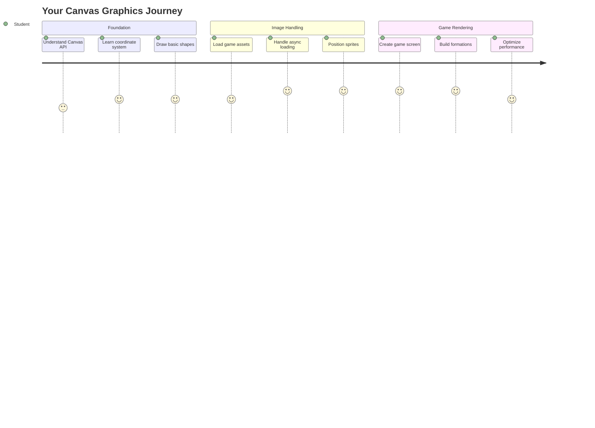
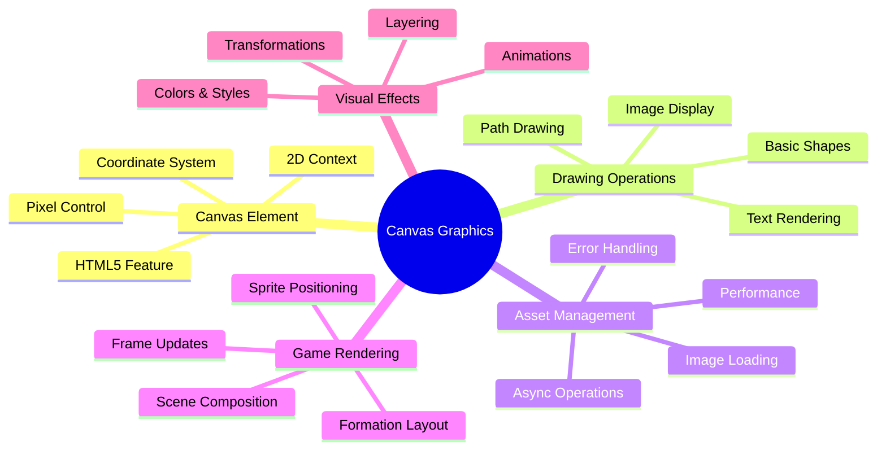
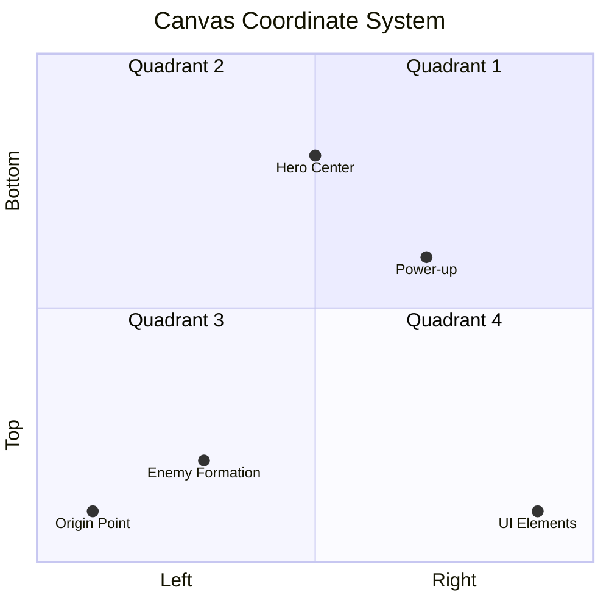
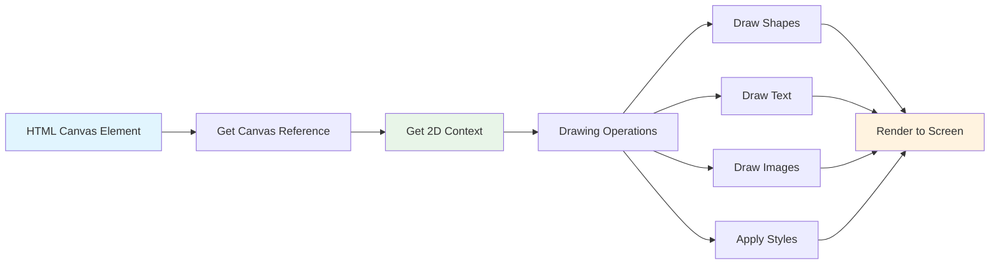
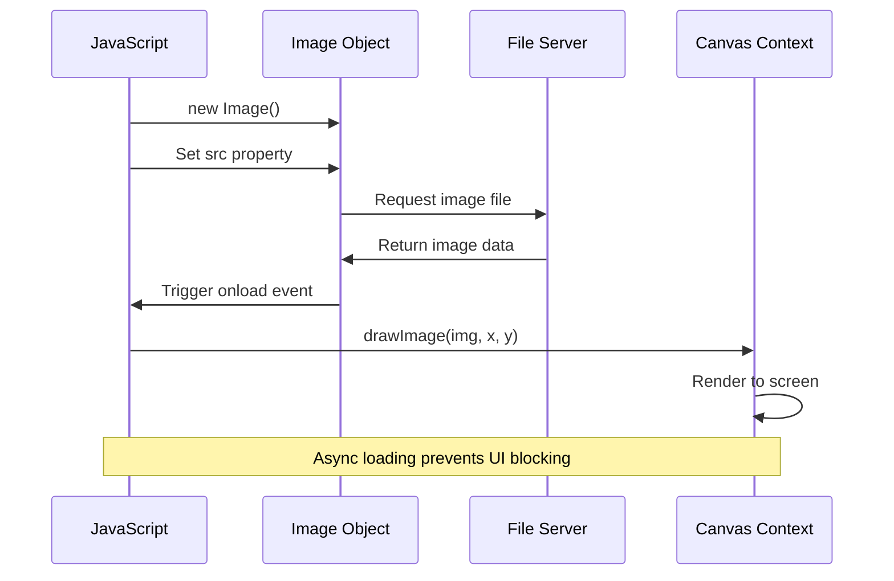
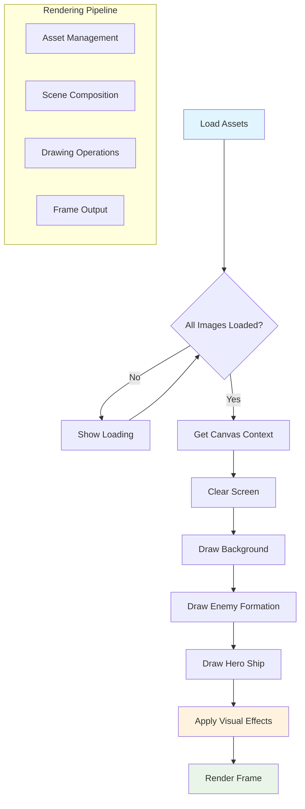
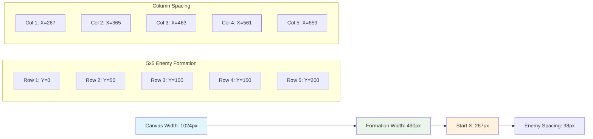
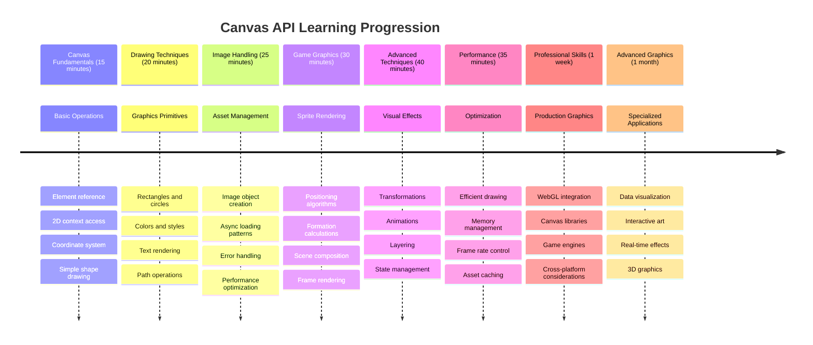

<!--
CO_OP_TRANSLATOR_METADATA:
{
  "original_hash": "7994743c5b21fdcceb36307916ef249a",
  "translation_date": "2025-11-06T13:01:41+00:00",
  "source_file": "6-space-game/2-drawing-to-canvas/README.md",
  "language_code": "ja"
}
-->
# 宇宙ゲームを作ろう パート2: ヒーローとモンスターをキャンバスに描画する



Canvas APIは、ブラウザ内で動的でインタラクティブなグラフィックを作成するためのウェブ開発の最も強力な機能の一つです。このレッスンでは、空白のHTML `<canvas>` 要素をヒーローやモンスターが登場するゲームの世界に変身させます。キャンバスは、コードが視覚的なアートに変わるデジタルなアートボードのようなものです。

前回のレッスンで学んだ内容を基に、今回は視覚的な側面に取り組みます。ゲームスプライトの読み込みと表示、要素の正確な配置、宇宙ゲームの視覚的な基盤を作る方法を学びます。これにより、静的なウェブページと動的でインタラクティブな体験の間のギャップを埋めることができます。

このレッスンの終わりには、ヒーローの船が正しく配置され、敵の編隊が戦闘準備を整えた完全なゲームシーンを作成できるようになります。ブラウザでモダンなゲームがグラフィックをレンダリングする仕組みを理解し、自分自身のインタラクティブな視覚体験を作成するスキルを身につけることができます。キャンバスグラフィックを探求し、宇宙ゲームを実現させましょう！



## レクチャー前のクイズ

[レクチャー前のクイズ](https://ff-quizzes.netlify.app/web/quiz/31)

## キャンバスとは？

では、この `<canvas>` 要素とは一体何でしょうか？これは、HTML5が提供する、ウェブブラウザで動的なグラフィックやアニメーションを作成するための解決策です。静的な画像や動画とは異なり、キャンバスは画面に表示されるすべてのピクセルを制御することができます。これにより、ゲーム、データの可視化、インタラクティブなアートに最適です。JavaScriptが絵筆となるプログラム可能な描画面と考えてください。

デフォルトでは、キャンバス要素はページ上で空白の透明な長方形のように見えます。しかし、そこに可能性が秘められています！JavaScriptを使用して形状を描画したり、画像を読み込んだり、アニメーションを作成したり、ユーザーの操作に応答させたりすることで、その真の力が発揮されます。これは、1960年代のBell Labsで初期のコンピュータグラフィックスの先駆者たちが、最初のデジタルアニメーションを作成するために各ピクセルをプログラムしなければならなかった方法に似ています。

✅ [Canvas APIについてもっと読む](https://developer.mozilla.org/docs/Web/API/Canvas_API) (MDN)

以下は、通常の宣言方法です。ページのbody部分に含まれます。

```html
<canvas id="myCanvas" width="200" height="100"></canvas>
```

**このコードが行うこと:**
- **`id`属性を設定**して、JavaScriptでこの特定のキャンバス要素を参照できるようにします
- **ピクセル単位で幅を定義**してキャンバスの横幅を制御します
- **ピクセル単位で高さを設定**してキャンバスの縦幅を決定します

## 簡単な図形を描画する

キャンバス要素が何であるかを理解したところで、実際に描画してみましょう！キャンバスは、数学の授業で習った座標系に似たものを使用しますが、コンピュータグラフィックス特有の重要な違いがあります。

キャンバスは、x軸（水平）とy軸（垂直）を使用して描画するすべての位置を決定するデカルト座標系を使用します。しかし、重要な違いがあります。数学の座標系とは異なり、原点 `(0,0)` は左上隅から始まり、右に進むとx値が増加し、下に進むとy値が増加します。このアプローチは、電子ビームが上から下へスキャンする初期のコンピュータディスプレイに由来しており、左上が自然な開始点となっています。




> 画像提供: [MDN](https://developer.mozilla.org/docs/Web/API/Canvas_API/Tutorial/Drawing_shapes)

キャンバス要素に描画するには、キャンバスグラフィックの基礎を形成する同じ3ステップのプロセスに従います。このプロセスを数回行うと、自然に身につきます。



1. **DOMからCanvas要素を取得**（他のHTML要素と同じように）
2. **2Dレンダリングコンテキストを取得** – これがすべての描画メソッドを提供します
3. **描画を開始！** コンテキストの組み込みメソッドを使用してグラフィックを作成します

コードでは以下のようになります:

```javascript
// Step 1: Get the canvas element
const canvas = document.getElementById("myCanvas");

// Step 2: Get the 2D rendering context
const ctx = canvas.getContext("2d");

// Step 3: Set fill color and draw a rectangle
ctx.fillStyle = 'red';
ctx.fillRect(0, 0, 200, 200); // x, y, width, height
```

**ステップごとに分解してみましょう:**
- キャンバス要素を**IDで取得**し、変数に格納します
- 2Dレンダリングコンテキストを**取得**します – これが描画メソッドのツールキットです
- `fillStyle`プロパティを使用してキャンバスに赤色を**指定**します
- 左上隅 `(0,0)` から始まる幅200ピクセル、高さ200ピクセルの長方形を**描画**します

✅ Canvas APIは主に2D形状に焦点を当てていますが、ウェブサイトに3D要素を描画することもできます。その場合は[WebGL API](https://developer.mozilla.org/docs/Web/API/WebGL_API)を使用するかもしれません。

Canvas APIを使用すると、以下のようなものを描画できます:

- **幾何学的形状**: 長方形の描画方法をすでに紹介しましたが、他にも多くの形状を描画できます。
- **テキスト**: 任意のフォントや色でテキストを描画できます。
- **画像**: .jpgや.pngなどの画像アセットを基に画像を描画できます。

✅ 試してみましょう！長方形の描画方法を知っているので、ページに円を描画できますか？CodePenで興味深いCanvasの描画をいくつか見てみましょう。こちらは[特に印象的な例](https://codepen.io/dissimulate/pen/KrAwx)です。

### 🔄 **教育的チェックイン**
**キャンバスの基本理解**: 画像の読み込みに進む前に、以下を確認してください:
- ✅ キャンバスの座標系が数学の座標系とどう異なるか説明できる
- ✅ キャンバス描画操作の3ステッププロセスを理解している
- ✅ 2Dレンダリングコンテキストが提供するものを識別できる
- ✅ `fillStyle`と`fillRect`がどのように連携するか説明できる

**簡単な自己テスト**: (100, 50)の位置に半径25の青い円を描くにはどうすればよいですか？
```javascript
ctx.fillStyle = 'blue';
ctx.beginPath();
ctx.arc(100, 50, 25, 0, 2 * Math.PI);
ctx.fill();
```

**現在知っているキャンバス描画メソッド**:
- **fillRect()**: 塗りつぶされた長方形を描画
- **fillStyle**: 色やパターンを設定
- **beginPath()**: 新しい描画パスを開始
- **arc()**: 円や曲線を作成

## 画像アセットを読み込んで描画する

基本的な形状を描画するのは入門として役立ちますが、ほとんどのゲームでは実際の画像が必要です！スプライト、背景、テクスチャはゲームに視覚的な魅力を与えます。キャンバスに画像を読み込んで表示する方法は、幾何学的形状を描画する方法とは異なりますが、プロセスを理解すれば簡単です。

`Image`オブジェクトを作成し、画像ファイルを読み込みます（これは非同期的に、つまり「バックグラウンドで」行われます）。その後、画像が準備できたらキャンバスに描画します。このアプローチにより、画像が正しく表示され、読み込み中にアプリケーションがブロックされることを防ぎます。



### 基本的な画像読み込み

```javascript
const img = new Image();
img.src = 'path/to/my/image.png';
img.onload = () => {
  // Image loaded and ready to be used
  console.log('Image loaded successfully!');
};
```

**このコードで起こっていること:**
- 新しいImageオブジェクトを作成してスプライトやテクスチャを保持
- ソースパスを設定してどの画像ファイルを読み込むか指定
- 画像が使用可能になったタイミングを知るためにloadイベントを監視

### より良い画像読み込み方法

プロの開発者がよく使用する、画像読み込みを処理するより堅牢な方法を紹介します。画像読み込みをPromiseベースの関数でラップします。このアプローチは、ES6でJavaScriptのPromiseが標準化された際に普及し、コードをより整理し、エラーを優雅に処理します。

```javascript
function loadAsset(path) {
  return new Promise((resolve, reject) => {
    const img = new Image();
    img.src = path;
    img.onload = () => {
      resolve(img);
    };
    img.onerror = () => {
      reject(new Error(`Failed to load image: ${path}`));
    };
  });
}

// Modern usage with async/await
async function initializeGame() {
  try {
    const heroImg = await loadAsset('hero.png');
    const monsterImg = await loadAsset('monster.png');
    // Images are now ready to use
  } catch (error) {
    console.error('Failed to load game assets:', error);
  }
}
```

**ここで行ったこと:**
- 画像読み込みロジックをPromiseでラップしてより良い処理を実現
- 問題が発生した際に通知するエラー処理を追加
- 読みやすいモダンなasync/await構文を使用
- try/catchブロックを含めて読み込みの問題を優雅に処理

画像が読み込まれたら、キャンバスに描画するのは実際には非常に簡単です:

```javascript
async function renderGameScreen() {
  try {
    // Load game assets
    const heroImg = await loadAsset('hero.png');
    const monsterImg = await loadAsset('monster.png');

    // Get canvas and context
    const canvas = document.getElementById("myCanvas");
    const ctx = canvas.getContext("2d");

    // Draw images to specific positions
    ctx.drawImage(heroImg, canvas.width / 2, canvas.height / 2);
    ctx.drawImage(monsterImg, 0, 0);
  } catch (error) {
    console.error('Failed to render game screen:', error);
  }
}
```

**ステップごとに説明します:**
- awaitを使用してヒーローとモンスターの画像をバックグラウンドで読み込み
- キャンバス要素を取得し、必要な2Dレンダリングコンテキストを取得
- 簡単な座標計算を使用してヒーロー画像を中央に配置
- 敵編隊を開始するためにモンスター画像を左上隅に配置
- 読み込みやレンダリング中に発生する可能性のあるエラーをキャッチ



## いよいよゲーム作りを始める時です

これまでの内容をすべて組み合わせて、宇宙ゲームの視覚的な基盤を作成します。キャンバスの基本と画像読み込み技術をしっかり理解しているので、この実践的なセクションでは、適切に配置されたスプライトを使用して完全なゲーム画面を作成する方法を案内します。

### 作成するもの

Canvas要素を含むウェブページを作成します。黒い画面 `1024*768` をレンダリングする必要があります。以下の2つの画像を提供しています:

- ヒーローの船

   

- 5×5のモンスター

   

### 開発を始めるための推奨ステップ

`your-work` サブフォルダーに作成されたスターターファイルを見つけてください。プロジェクト構造は以下のようになっています:

```bash
your-work/
├── assets/
│   ├── enemyShip.png
│   └── player.png
├── index.html
├── app.js
└── package.json
```

**あなたが扱うもの:**
- **ゲームスプライト**は`assets/`フォルダーに保存され、すべてが整理されています
- **メインHTMLファイル**はキャンバス要素を設定し、準備を整えます
- **JavaScriptファイル**にはゲームレンダリングの魔法を書く場所があります
- **package.json**はローカルでテストできる開発サーバーを設定します

Visual Studio Codeでこのフォルダーを開き、開発を開始します。Visual Studio Code、NPM、Node.jsがインストールされたローカル開発環境が必要です。コンピュータに`npm`が設定されていない場合は、[インストール方法はこちら](https://www.npmjs.com/get-npm)。

`your-work` フォルダーに移動して開発サーバーを開始します:

```bash
cd your-work
npm start
```

**このコマンドが行うこと:**
- **ローカルサーバーを起動**し、`http://localhost:5000`でゲームをテスト可能
- **すべてのファイルを適切に提供**し、ブラウザが正しく読み込めるようにする
- **ファイルの変更を監視**し、スムーズに開発できるようにする
- **プロフェッショナルな開発環境を提供**してすべてをテスト可能にする

> 💡 **注意**: ブラウザには最初は空白のページが表示されます – これは予想通りです！コードを追加するにつれて、ブラウザをリフレッシュして変更を確認してください。この反復的な開発アプローチは、NASAがアポロ誘導コンピュータを構築した方法に似ています – 各コンポーネントを統合する前にテストする方法です。

### コードを追加

`your-work/app.js` に必要なコードを追加して、以下のタスクを完了してください:

1. **黒い背景のキャンバスを描画する**
   > 💡 **方法**: `/app.js` のTODOを見つけて、たった2行を追加します。`ctx.fillStyle`を黒に設定し、キャンバスの寸法で(0,0)から始まる`ctx.fillRect()`を使用します。簡単です！

2. **ゲームテクスチャを読み込む**
   > 💡 **方法**: `await loadAsset()`を使用してプレイヤーと敵の画像を読み込みます。後で使用できるように変数に保存してください。覚えておいてください – 実際に描画するまで表示されません！

3. **ヒーローの船を中央下部に描画する**
   > 💡 **方法**: `ctx.drawImage()`を使用してヒーローを配置します。x座標には`canvas.width / 2 - 45`を試して中央に配置し、y座標には`canvas.height - canvas.height / 4`を使用して下部エリアに配置します。

4. **敵の船を5×5の編隊で描画する**
   > 💡 **方法**: `createEnemies`関数を見つけてネストされたループを設定します。間隔と位置を計算する必要がありますが、心配しないでください – 正確な方法をお見せします！

まず、適切な敵編隊レイアウトの定数を設定します:

```javascript
const ENEMY_TOTAL = 5;
const ENEMY_SPACING = 98;
const FORMATION_WIDTH = ENEMY_TOTAL * ENEMY_SPACING;
const START_X = (canvas.width - FORMATION_WIDTH) / 2;
const STOP_X = START_X + FORMATION_WIDTH;
```

**これらの定数が行うこと:**
- 1行と1列に**5体の敵を設定**（きれいな5×5グリッド）
- 敵が窮屈に見えないように**間隔を定義**
- 編隊全体の幅を**計算**
- 編隊が中央に見えるように**開始位置と終了位置を計算**



次に、ネストされたループを作成して敵編隊を描画します:

```javascript
for (let x = START_X; x < STOP_X; x += ENEMY_SPACING) {
  for (let y = 0; y < 50 * 5; y += 50) {
    ctx.drawImage(enemyImg, x, y);
  }
}
```

**このネストされたループが行うこと:**
- 外側のループは編隊の左から右へ**移動**
- 内側のループはきれいな行を作成するために**上から下へ移動**
- 計算した正確なx,y座標で各敵スプライトを**描画**
- すべてが**均等に配置**され、プロフェッショナルで整理された見た目に

### 🔄 **教育的チェックイン**
**ゲームレンダリングの習得**: 完全なレンダリングシステムの理解を確認してください:
- ✅ 非同期画像読み込みがゲーム起動中のUIブロックを防ぐ理由
- ✅ 敵編隊の位置を定数で計算する理由（ハードコーディングではなく）
- ✅ 描画操作で2Dレンダリングコンテキストが果たす役割
- ✅ ネストされたループが整理されたスプライト編隊を作成する方法

**パフォーマンスの考慮事項**: あなたのゲームは現在以下を示しています:
- **効率的なアセット読み込み**: Promiseベースの画像管理
- **整理されたレンダリング**: 構造化された描画操作
- **数学的な位置決め**: 計算されたスプライト配置
- **エラー処理**:
- **座標系**: 数学を画面上の位置に変換する
- **スプライト管理**: ゲームグラフィックの読み込みと表示
- **フォーメーションアルゴリズム**: 整然としたレイアウトのための数学的パターン
- **非同期操作**: モダンJavaScriptでスムーズなユーザー体験を実現

## 結果

完成した結果は以下のようになります:


## 解答

まずは自分で解いてみてください。もし行き詰まったら、[解答](../../../../6-space-game/2-drawing-to-canvas/solution/app.js)を参考にしてください。

---

## GitHub Copilot Agent チャレンジ 🚀

Agentモードを使用して以下のチャレンジを完了してください:

**説明:** Canvas APIの技術を活用して、スペースゲームのキャンバスに視覚効果とインタラクティブな要素を追加してください。

**プロンプト:** `enhanced-canvas.html`という新しいファイルを作成し、背景にアニメーションする星を表示し、ヒーロー船の脈動するヘルスバー、そしてゆっくりと下に移動する敵船を描画してください。ランダムな位置と不透明度を使用して星を点滅させるJavaScriptコード、ヘルスレベルに応じて色が変わるヘルスバー（緑 > 黄色 > 赤）、そして異なる速度で画面下に移動する敵船をアニメーションするコードを含めてください。

[Agentモードについてさらに学ぶ](https://code.visualstudio.com/blogs/2025/02/24/introducing-copilot-agent-mode)ことができます。

## 🚀 チャレンジ

2Dに特化したCanvas APIについて学びましたが、[WebGL API](https://developer.mozilla.org/docs/Web/API/WebGL_API)を見て、3Dオブジェクトを描画してみてください。

## 講義後のクイズ

[講義後のクイズ](https://ff-quizzes.netlify.app/web/quiz/32)

## 復習と自己学習

Canvas APIについてさらに学ぶには、[こちらを読む](https://developer.mozilla.org/docs/Web/API/Canvas_API)のがおすすめです。

### ⚡ **次の5分間でできること**
- [ ] ブラウザコンソールを開き、`document.createElement('canvas')`でキャンバス要素を作成する
- [ ] キャンバスコンテキストで`fillRect()`を使用して四角形を描画してみる
- [ ] `fillStyle`プロパティを使って異なる色を試してみる
- [ ] `arc()`メソッドを使って簡単な円を描いてみる

### 🎯 **次の1時間で達成できること**
- [ ] 講義後のクイズを完了し、キャンバスの基本を理解する
- [ ] 複数の形状と色を持つキャンバス描画アプリケーションを作成する
- [ ] ゲーム用の画像読み込みとスプライトレンダリングを実装する
- [ ] キャンバス上でオブジェクトを移動させる簡単なアニメーションを作成する
- [ ] スケーリング、回転、平行移動などのキャンバス変換を練習する

### 📅 **1週間のキャンバス学習計画**
- [ ] 洗練されたグラフィックとスプライトアニメーションを備えたスペースゲームを完成させる
- [ ] グラデーション、パターン、合成などの高度なキャンバス技術を習得する
- [ ] データ表現のためのインタラクティブなビジュアライゼーションを作成する
- [ ] スムーズなパフォーマンスのためのキャンバス最適化技術を学ぶ
- [ ] 様々なツールを備えた描画またはペイントアプリケーションを作成する
- [ ] キャンバスを使った創造的なコーディングパターンや生成アートを探求する

### 🌟 **1ヶ月間のグラフィックス習得計画**
- [ ] Canvas 2DとWebGLを使用して複雑な視覚アプリケーションを構築する
- [ ] グラフィックスプログラミングの概念とシェーダーの基礎を学ぶ
- [ ] オープンソースのグラフィックスライブラリやビジュアライゼーションツールに貢献する
- [ ] グラフィックス集約型アプリケーションのパフォーマンス最適化を習得する
- [ ] キャンバスプログラミングやコンピュータグラフィックスに関する教育コンテンツを作成する
- [ ] 他の人が視覚的な体験を作成できるよう支援するグラフィックスプログラミングの専門家になる

## 🎯 キャンバスグラフィックス習得タイムライン



### 🛠️ キャンバスグラフィックスツールキットのまとめ

このレッスンを完了した後、以下を習得しています:
- **Canvas APIの習得**: 2Dグラフィックスプログラミングの完全な理解
- **座標数学**: 正確な位置決めとレイアウトアルゴリズム
- **アセット管理**: プロフェッショナルな画像読み込みとエラー処理
- **レンダリングパイプライン**: シーン構成への構造化アプローチ
- **ゲームグラフィックス**: スプライトの位置決めとフォーメーション計算
- **非同期プログラミング**: スムーズなパフォーマンスのためのモダンJavaScriptパターン
- **視覚プログラミング**: 数学的概念を画面グラフィックスに変換する技術

**実世界での応用例**: キャンバススキルは以下に直接適用できます:
- **データビジュアライゼーション**: チャート、グラフ、インタラクティブなダッシュボード
- **ゲーム開発**: 2Dゲーム、シミュレーション、インタラクティブな体験
- **デジタルアート**: 創造的なコーディングと生成アートプロジェクト
- **UI/UXデザイン**: カスタムグラフィックスとインタラクティブな要素
- **教育ソフトウェア**: 視覚的な学習ツールとシミュレーション
- **ウェブアプリケーション**: 動的なグラフィックスとリアルタイムビジュアライゼーション

**習得したプロフェッショナルスキル**: 以下が可能になります:
- **構築**: 外部ライブラリを使用せずにカスタムグラフィックスソリューションを作成する
- **最適化**: スムーズなユーザー体験のためのレンダリングパフォーマンスを向上させる
- **デバッグ**: ブラウザ開発ツールを使用して複雑な視覚的問題を解決する
- **設計**: 数学的原則を使用してスケーラブルなグラフィックスシステムを構築する
- **統合**: モダンなウェブアプリケーションフレームワークとキャンバスグラフィックスを統合する

**習得したCanvas APIメソッド**:
- **要素管理**: getElementById, getContext
- **描画操作**: fillRect, drawImage, fillStyle
- **アセット読み込み**: Imageオブジェクト, Promiseパターン
- **数学的な位置決め**: 座標計算, フォーメーションアルゴリズム

**次のステップ**: アニメーション、ユーザーインタラクション、衝突検出を追加するか、WebGLを探求して3Dグラフィックスを学びましょう！

🌟 **達成解除**: 基本的なCanvas API技術を使用して完全なゲームレンダリングシステムを構築しました！

## 課題

[Canvas APIで遊んでみる](assignment.md)

---

**免責事項**:  
この文書はAI翻訳サービス[Co-op Translator](https://github.com/Azure/co-op-translator)を使用して翻訳されています。正確性を追求しておりますが、自動翻訳には誤りや不正確な部分が含まれる可能性があります。元の言語で記載された文書を正式な情報源としてご参照ください。重要な情報については、専門の人間による翻訳を推奨します。この翻訳の使用に起因する誤解や誤解釈について、当社は一切の責任を負いません。