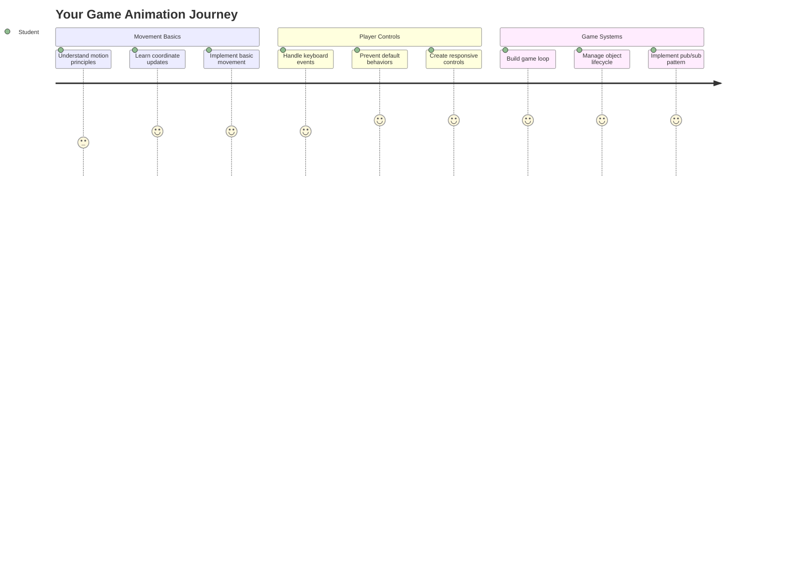
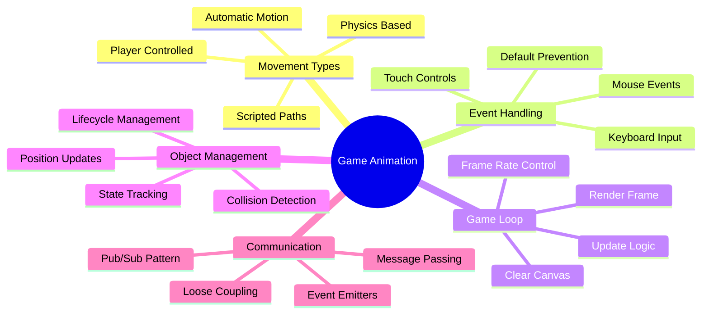
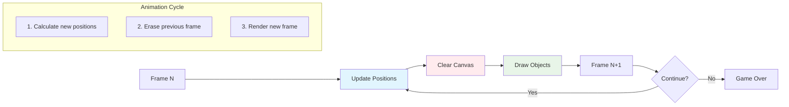
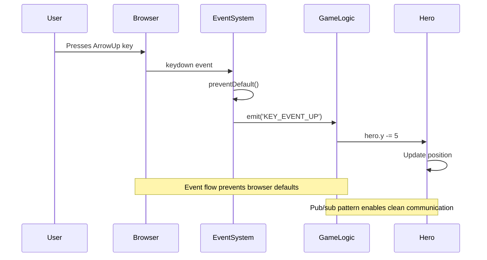
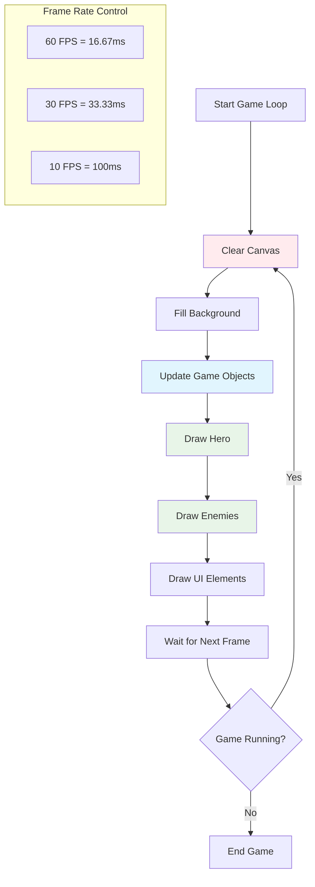
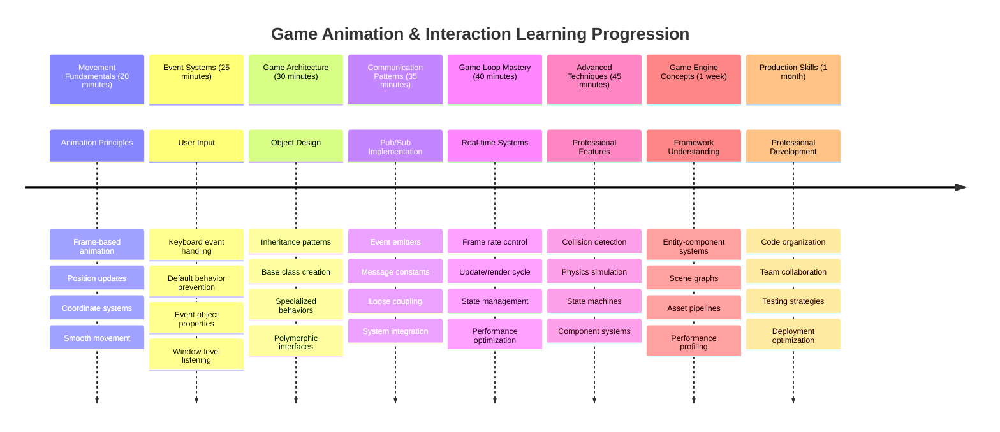

<!--
CO_OP_TRANSLATOR_METADATA:
{
  "original_hash": "8c55a2bd4bc0ebe4c88198fd563a9e09",
  "translation_date": "2025-11-06T13:00:41+00:00",
  "source_file": "6-space-game/3-moving-elements-around/README.md",
  "language_code": "ja"
}
-->
# 宇宙ゲームを作ろう パート3: 動きを追加する



お気に入りのゲームを思い浮かべてみてください。魅力的なのは美しいグラフィックだけではなく、すべてが動き、あなたの操作に反応することです。現在の宇宙ゲームは美しい絵画のようですが、これから動きを加えて命を吹き込みます。

NASAのエンジニアがアポロ計画の誘導コンピュータをプログラムした際、同じような課題に直面しました。宇宙船をパイロットの入力に反応させながら、自動的にコース修正を維持するにはどうすればよいか？今日学ぶ原則は、プレイヤーが操作する動きと自動システムの動作を管理するという点で、これらの概念を反映しています。

このレッスンでは、宇宙船を画面上で滑らかに動かし、プレイヤーの指示に反応し、スムーズな動きのパターンを作る方法を学びます。すべてを自然に積み重ねていけるように、わかりやすく分解して説明します。

レッスンの終わりには、プレイヤーがヒーローの宇宙船を画面上で飛ばし、敵の船が上空を巡回するようになります。さらに重要なのは、ゲームの動きのシステムを支える基本原則を理解することです。



## レクチャー前のクイズ

[レクチャー前のクイズ](https://ff-quizzes.netlify.app/web/quiz/33)

## ゲームの動きを理解する

ゲームが生き生きとするのは、物が動き始めるときです。そして、基本的に動きには2つの方法があります：

- **プレイヤーが操作する動き**: キーを押したりマウスをクリックしたりすると、何かが動きます。これはプレイヤーとゲーム世界を直接つなぐものです。
- **自動的な動き**: ゲーム自体が物を動かす場合です。例えば、敵の船がプレイヤーの操作に関係なく画面を巡回するような動きです。

コンピュータ画面上で物を動かすのは、思ったより簡単です。数学の授業で習ったx座標とy座標を覚えていますか？まさにそれを使います。1610年にガリレオが木星の衛星を追跡したとき、彼は基本的に同じことをしていました。時間をかけて位置をプロットし、動きのパターンを理解していたのです。

画面上で物を動かすのは、フリップブックアニメーションを作るようなものです。以下の3つの簡単なステップを実行します：



1. **位置を更新する** – オブジェクトの位置を変更します（例えば、右に5ピクセル移動）
2. **古いフレームを消す** – 画面をクリアして、残像が見えないようにします
3. **新しいフレームを描画する** – オブジェクトを新しい位置に配置します

これを十分速く行うと、スムーズで自然な動きがプレイヤーに感じられるようになります。

コードでの例は以下の通りです：

```javascript
// Set the hero's location
hero.x += 5;
// Clear the rectangle that hosts the hero
ctx.clearRect(0, 0, canvas.width, canvas.height);
// Redraw the game background and hero
ctx.fillRect(0, 0, canvas.width, canvas.height);
ctx.fillStyle = "black";
ctx.drawImage(heroImg, hero.x, hero.y);
```

**このコードが行うこと:**
- ヒーローのx座標を5ピクセル更新して水平に移動
- キャンバス全体をクリアして前のフレームを削除
- 黒い背景色でキャンバスを塗りつぶす
- ヒーローの画像を新しい位置に再描画

✅ ヒーローを毎秒何フレームも再描画すると、パフォーマンスコストが発生する理由を考えられますか？[このパターンの代替案](https://developer.mozilla.org/en-US/docs/Web/API/Canvas_API/Tutorial/Optimizing_canvas)について読んでみましょう。

## キーボードイベントを処理する

ここでは、プレイヤーの入力をゲームのアクションに結びつけます。スペースバーを押してレーザーを発射したり、矢印キーをタップして小惑星を避けたりするとき、ゲームはその入力を検出して反応する必要があります。

キーボードイベントはウィンドウレベルで発生します。つまり、ブラウザ全体がそのキー入力を監視しています。一方、マウスクリックは特定の要素に結びつけることができます（例えば、ボタンをクリックする場合）。宇宙ゲームでは、クラシックなアーケード感をプレイヤーに提供するためにキーボード操作に焦点を当てます。

これは、1800年代の電信オペレーターがモールス信号の入力を意味のあるメッセージに変換しなければならなかった状況を思い起こさせます。私たちは似たようなことをしています。キー入力をゲームコマンドに変換しているのです。

イベントを処理するには、ウィンドウの`addEventListener()`メソッドを使用し、2つの入力パラメータを提供する必要があります。最初のパラメータはイベント名（例えば`keyup`）、2番目のパラメータはイベントが発生した結果として呼び出されるべき関数です。

以下はその例です：

```javascript
window.addEventListener('keyup', (evt) => {
  // evt.key = string representation of the key
  if (evt.key === 'ArrowUp') {
    // do something
  }
});
```

**ここで何が起こるかを分解すると:**
- ウィンドウ全体でキーボードイベントを監視
- 押されたキーに関する情報を含むイベントオブジェクトをキャプチャ
- 押されたキーが特定のキー（この場合は上矢印）と一致するかを確認
- 条件が満たされた場合にコードを実行

キーイベントでは、押されたキーを確認するためにイベントの2つのプロパティを使用できます：

- `key` - 押されたキーの文字列表現（例: `'ArrowUp'`）
- `keyCode` - 数値表現（例: `37`）、これは`ArrowLeft`に対応

✅ ゲーム開発以外でキーイベント操作が役立つ場面を考えられますか？



### 特殊キー: 注意点！

一部のキーにはブラウザの組み込み動作があり、ゲームに干渉する可能性があります。矢印キーはページをスクロールし、スペースバーはページを下にジャンプさせます。これらは、誰かが宇宙船を操縦しようとしているときには望ましくない動作です。

これらのデフォルト動作を防ぎ、ゲームが入力を処理できるようにします。これは、初期のコンピュータプログラマーがシステム割り込みをオーバーライドしてカスタム動作を作成した方法に似ています。以下のようにします：

```javascript
const onKeyDown = function (e) {
  console.log(e.keyCode);
  switch (e.keyCode) {
    case 37:
    case 39:
    case 38:
    case 40: // Arrow keys
    case 32:
      e.preventDefault();
      break; // Space
    default:
      break; // do not block other keys
  }
};

window.addEventListener('keydown', onKeyDown);
```

**この防止コードの理解:**
- 不要なブラウザ動作を引き起こす可能性のある特定のキーコードを確認
- 矢印キーやスペースバーのデフォルトブラウザ動作を防止
- 他のキーは通常通り機能させる
- `e.preventDefault()`を使用してブラウザの組み込み動作を停止

### 🔄 **教育的チェックイン**
**イベント処理の理解**: 自動的な動きに進む前に、以下を確認してください：
- ✅ `keydown`と`keyup`イベントの違いを説明できる
- ✅ デフォルトのブラウザ動作を防ぐ理由を理解している
- ✅ イベントリスナーがユーザー入力をゲームロジックに結びつける方法を説明できる
- ✅ ゲームコントロールに干渉する可能性のあるキーを特定できる

**簡単な自己テスト**: 矢印キーのデフォルト動作を防がなかった場合、何が起こるでしょうか？
*答え: ブラウザがページをスクロールし、ゲームの動きに干渉します*

**イベントシステムのアーキテクチャ**: 以下を理解しました：
- **ウィンドウレベルの監視**: ブラウザレベルでイベントをキャプチャ
- **イベントオブジェクトのプロパティ**: `key`文字列と`keyCode`数値
- **デフォルト防止**: 不要なブラウザ動作を停止
- **条件付きロジック**: 特定のキーの組み合わせに反応

## ゲームによる動き

次に、プレイヤーの入力なしで動くオブジェクトについて話しましょう。敵の船が画面を横切ったり、弾丸が直線的に飛んだり、背景で雲が漂ったりすることを考えてみてください。この自律的な動きは、誰も操作していないときでもゲームの世界を生き生きとさせます。

JavaScriptの組み込みタイマーを使用して、一定の間隔で位置を更新します。この概念は、振り子時計が動作する仕組みに似ています。一定のメカニズムが一貫したタイミングでアクションを引き起こします。以下のように簡単に実現できます：

```javascript
const id = setInterval(() => {
  // Move the enemy on the y axis
  enemy.y += 10;
}, 100);
```

**この動きのコードが行うこと:**
- 100ミリ秒ごとに動作するタイマーを作成
- 敵のy座標を毎回10ピクセル更新
- 後で停止できるように間隔IDを保存
- 敵を画面上で自動的に下方向に移動

## ゲームループ

すべてを結びつける概念、それがゲームループです。もしゲームが映画だとしたら、ゲームループは映写機のようなもので、フレームを次々と表示してすべてがスムーズに動いているように見せます。

すべてのゲームには、このループが裏で動いています。これは、すべてのゲームオブジェクトを更新し、画面を再描画し、このプロセスを継続的に繰り返す関数です。これにより、ヒーロー、すべての敵、飛び交うレーザーなど、ゲームの状態全体を管理します。

この概念は、初期の映画アニメーター、例えばウォルト・ディズニーがキャラクターをフレームごとに再描画して動きの錯覚を作り出した方法を思い起こさせます。私たちは同じことをしていますが、鉛筆ではなくコードを使っています。

ゲームループがコードでどのように表現されるかは以下の通りです：



```javascript
const gameLoopId = setInterval(() => {
  function gameLoop() {
    ctx.clearRect(0, 0, canvas.width, canvas.height);
    ctx.fillStyle = "black";
    ctx.fillRect(0, 0, canvas.width, canvas.height);
    drawHero();
    drawEnemies();
    drawStaticObjects();
  }
  gameLoop();
}, 200);
```

**ゲームループの構造を理解する:**
- 前のフレームを削除するためにキャンバス全体をクリア
- 背景を単色で塗りつぶす
- 現在の位置にあるすべてのゲームオブジェクトを描画
- スムーズなアニメーションを作るためにこのプロセスを200ミリ秒ごとに繰り返す
- フレームレートを管理するために間隔タイミングを制御

## 宇宙ゲームの続き

これから、以前作成した静的なシーンに動きを加えます。スクリーンショットからインタラクティブな体験へと変化させます。各部分が次の部分に自然に積み重なるように、ステップごとに進めていきます。

前回のレッスンで作成したコードを取得するか、必要であれば[Part II- starter](../../../../6-space-game/3-moving-elements-around/your-work)フォルダのコードから始めてください。

**今日作るもの:**
- **ヒーローの操作**: 矢印キーで宇宙船を画面上で操縦
- **敵の動き**: エイリアンの船が進行を開始

これらの機能を実装していきましょう。

## 推奨ステップ

`your-work`サブフォルダに作成されたファイルを見つけてください。以下が含まれているはずです：

```bash
-| assets
  -| enemyShip.png
  -| player.png
-| index.html
-| app.js
-| package.json
```

プロジェクトを`your-work`フォルダで開始するには、以下を入力します：

```bash
cd your-work
npm start
```

**このコマンドが行うこと:**
- プロジェクトディレクトリに移動
- アドレス`http://localhost:5000`でHTTPサーバーを開始
- ゲームファイルを提供し、ブラウザでテストできるようにする

上記はアドレス`http://localhost:5000`でHTTPサーバーを開始します。ブラウザを開き、そのアドレスを入力してください。現在はヒーローとすべての敵が表示されるはずですが、まだ動いていません！

### コードを追加する

1. **専用オブジェクトを追加**: `hero`、`enemy`、`game object`を作成し、それぞれに`x`と`y`プロパティを持たせます。（[継承または構成](../README.md)の部分を思い出してください）

   *ヒント* `game object`は`x`と`y`を持ち、キャンバスに自分自身を描画する能力を持つべきです。

   > **Tip**: 以下のようにコンストラクタを定義した新しい`GameObject`クラスを追加し、キャンバスに描画を行います：

    ```javascript
    class GameObject {
      constructor(x, y) {
        this.x = x;
        this.y = y;
        this.dead = false;
        this.type = "";
        this.width = 0;
        this.height = 0;
        this.img = undefined;
      }
    
      draw(ctx) {
        ctx.drawImage(this.img, this.x, this.y, this.width, this.height);
      }
    }
    ```

    **この基本クラスの理解:**
    - すべてのゲームオブジェクトが共有する共通プロパティ（位置、サイズ、画像）を定義
    - オブジェクトが削除されるべきかどうかを追跡する`dead`フラグを含む
    - キャンバス上にオブジェクトを描画する`draw()`メソッドを提供
    - 子クラスがオーバーライドできるすべてのプロパティにデフォルト値を設定

    ```mermaid
    classDiagram
        class GameObject {
            +x: number
            +y: number
            +dead: boolean
            +type: string
            +width: number
            +height: number
            +img: Image
            +draw(ctx)
        }
        
        class Hero {
            +speed: number
            +type: "Hero"
            +width: 98
            +height: 75
        }
        
        class Enemy {
            +type: "Enemy"
            +width: 98
            +height: 50
            +setInterval()
        }
        
        GameObject <|-- Hero
        GameObject <|-- Enemy
        
        class EventEmitter {
            +listeners: object
            +on(message, listener)
            +emit(message, payload)
        }
    ```

    次に、この`GameObject`を拡張して`Hero`と`Enemy`を作成します：

    ```javascript
    class Hero extends GameObject {
      constructor(x, y) {
        super(x, y);
        this.width = 98;
        this.height = 75;
        this.type = "Hero";
        this.speed = 5;
      }
    }
    ```

    ```javascript
    class Enemy extends GameObject {
      constructor(x, y) {
        super(x, y);
        this.width = 98;
        this.height = 50;
        this.type = "Enemy";
        const id = setInterval(() => {
          if (this.y < canvas.height - this.height) {
            this.y += 5;
          } else {
            console.log('Stopped at', this.y);
            clearInterval(id);
          }
        }, 300);
      }
    }
    ```

    **これらのクラスの重要な概念:**
    - `extends`キーワードを使用して`GameObject`を継承
    - `super(x, y)`を使用して親コンストラクタを呼び出す
    - 各オブジェクトタイプに特定の寸法とプロパティを設定
    - `setInterval()`を使用して敵の自動移動を実装

2. **キーイベントハンドラーを追加**: キー操作でヒーローを上下左右に移動させる

   *覚えておくべきこと* カルテシアン座標系では、左上が`0,0`です。また、*デフォルト動作*を停止するコードを追加することを忘れないでください。

   > **Tip**: `onKeyDown`関数を作成し、ウィンドウにアタッチします：

   ```javascript
   const onKeyDown = function (e) {
     console.log(e.keyCode);
     // Add the code from the lesson above to stop default behavior
     switch (e.keyCode) {
       case 37:
       case 39:
       case 38:
       case 40: // Arrow keys
       case 32:
         e.preventDefault();
         break; // Space
       default:
         break; // do not block other keys
     }
   };

   window.addEventListener("keydown", onKeyDown);
   ```
    
   **このイベントハンドラーが行うこと:**
   - ウィンドウ全体でkeydownイベントを監視
   - 押されたキーコードをログに記録して、どのキーが押されているかをデバッグ
   - 矢印キーやスペースバーのデフォルトブラウザ動作を防止
   - 他のキーは通常通り機能させる
   
   この時点でブラウザコンソールを確認し、キー入力がログに記録される様子を確認してください。

3. **[Pub subパターン](../README.md)を実装**: 残りの部分を進める際にコードを整理するために役立ちます。

   Publish-Subscribeパターンは、イベント検出とイベント処理を分離することでコードを整理します。これにより、コードがよりモジュール化され、保守が容易になります。

   最後の部分を行うには、以下を実行します：

   1. **ウィンドウにイベントリスナーを追加**:

       ```javascript
       window.addEventListener("keyup", (evt) => {
         if (evt.key === "ArrowUp") {
           eventEmitter.emit(Messages.KEY_EVENT_UP);
         } else if (evt.key === "ArrowDown") {
           eventEmitter.emit(Messages.KEY_EVENT_DOWN);
         } else if (evt.key === "ArrowLeft") {
           eventEmitter.emit(Messages.KEY_EVENT_LEFT);
         } else if (evt.key === "ArrowRight") {
           eventEmitter.emit(Messages.KEY_EVENT_RIGHT);
         }
       });
       ```

   **このイベントシステムが行うこと:**
   - キーボード入力を検出し、カスタムゲームイベントに変換
   - 入力検出をゲームロジックから分離
   - 後でコントロールを変更してもゲームコードに影響を与えないようにする
   - 複数のシステムが同じ入力に反応できるようにする

   ```mermaid
   flowchart TD
       A["Keyboard Input"] --> B["Window Event Listener"]
       B --> C["Event Emitter"]
       C --> D["KEY_EVENT_UP"]
       C --> E["KEY_EVENT_DOWN"]
       C --> F["KEY_EVENT_LEFT"]
       C --> G["KEY_EVENT_RIGHT"]
       
       D --> H["Hero Movement"]
       D --> I["Sound System"]
       D --> J["Visual Effects"]
       
       E --> H
       F --> H
       G --> H
       
       style A fill:#e1f5fe
       style C fill:#e8f5e8
       style H fill:#fff3e0
   ```

   2. **EventEmitterクラスを作成**: メッセ
- **配列を初期化**して、すべてのゲームオブジェクトを保持する

4. **ゲームを初期化する**

       ```javascript
       function initGame() {
         gameObjects = [];
         createEnemies();
         createHero();
       
         eventEmitter.on(Messages.KEY_EVENT_UP, () => {
           hero.y -= 5;
         });
       
         eventEmitter.on(Messages.KEY_EVENT_DOWN, () => {
           hero.y += 5;
         });
       
         eventEmitter.on(Messages.KEY_EVENT_LEFT, () => {
           hero.x -= 5;
         });
       
4. **ゲームループを設定する**

`window.onload`関数をリファクタリングして、ゲームを初期化し、適切な間隔でゲームループを設定します。また、レーザービームを追加します:

    ```javascript
    window.onload = async () => {
      canvas = document.getElementById("canvas");
      ctx = canvas.getContext("2d");
      heroImg = await loadTexture("assets/player.png");
      enemyImg = await loadTexture("assets/enemyShip.png");
      laserImg = await loadTexture("assets/laserRed.png");
    
      initGame();
      const gameLoopId = setInterval(() => {
        ctx.clearRect(0, 0, canvas.width, canvas.height);
        ctx.fillStyle = "black";
        ctx.fillRect(0, 0, canvas.width, canvas.height);
        drawGameObjects(ctx);
      }, 100);
    };
    ```

**ゲームセットアップの理解:**
- ページが完全に読み込まれるのを**待機**してから開始
- キャンバス要素とその2Dレンダリングコンテキストを**取得**
- `await`を使用してすべての画像アセットを非同期で**読み込む**
- 100ms間隔（10FPS）でゲームループを**開始**
- 各フレームで画面全体を**クリア**して再描画

5. **一定間隔で敵を移動させるコードを追加**

`createEnemies()`関数をリファクタリングして、敵を作成し、新しいgameObjectsクラスに追加します:

    ```javascript
    function createEnemies() {
      const MONSTER_TOTAL = 5;
      const MONSTER_WIDTH = MONSTER_TOTAL * 98;
      const START_X = (canvas.width - MONSTER_WIDTH) / 2;
      const STOP_X = START_X + MONSTER_WIDTH;
    
      for (let x = START_X; x < STOP_X; x += 98) {
        for (let y = 0; y < 50 * 5; y += 50) {
          const enemy = new Enemy(x, y);
          enemy.img = enemyImg;
          gameObjects.push(enemy);
        }
      }
    }
    ```

**敵の作成が行うこと:**
- 敵を画面中央に配置するための位置を**計算**
- ネストされたループを使用して敵のグリッドを**作成**
- 各敵オブジェクトに敵の画像を**割り当て**
- 各敵をグローバルなゲームオブジェクト配列に**追加**

そして、ヒーローのために同様のプロセスを行う`createHero()`関数を追加します。

    ```javascript
    function createHero() {
      hero = new Hero(
        canvas.width / 2 - 45,
        canvas.height - canvas.height / 4
      );
      hero.img = heroImg;
      gameObjects.push(hero);
    }
    ```

**ヒーローの作成が行うこと:**
- ヒーローを画面下部中央に**配置**
- ヒーローオブジェクトにヒーロー画像を**割り当て**
- ヒーローを描画のためにゲームオブジェクト配列に**追加**

最後に、描画を開始するための`drawGameObjects()`関数を追加します:

    ```javascript
    function drawGameObjects(ctx) {
      gameObjects.forEach(go => go.draw(ctx));
    }
    ```

**描画関数の理解:**
- 配列内のすべてのゲームオブジェクトを**反復処理**
- 各オブジェクトの`draw()`メソッドを**呼び出し**
- オブジェクトが自分自身を描画できるようにキャンバスコンテキストを**渡す**

### 🔄 **教育的チェックイン**
**ゲームシステムの完全な理解**: アーキテクチャ全体の習得を確認:
- ✅ HeroとEnemyが共通のGameObjectプロパティを共有できるのはなぜか？
- ✅ pub/subパターンがコードの保守性を向上させる理由は？
- ✅ ゲームループがスムーズなアニメーションを作り出す役割は？
- ✅ イベントリスナーがユーザー入力をゲームオブジェクトの動作に接続する方法は？

**システム統合**: あなたのゲームは以下を示しています:
- **オブジェクト指向設計**: 基底クラスと特化した継承
- **イベント駆動型アーキテクチャ**: pub/subパターンによる疎結合
- **アニメーションフレームワーク**: 一貫したフレーム更新を伴うゲームループ
- **入力処理**: キーボードイベントとデフォルトの防止
- **アセット管理**: 画像の読み込みとスプライト描画

**プロフェッショナルなパターン**: 以下を実装しました:
- **関心の分離**: 入力、ロジック、描画の分離
- **ポリモーフィズム**: すべてのゲームオブジェクトが共通の描画インターフェースを共有
- **メッセージパッシング**: コンポーネント間のクリーンな通信
- **リソース管理**: 効率的なスプライトとアニメーション処理

敵がヒーローの宇宙船に向かって進み始めるはずです！
}
}
    ```
    
    and add a `createHero()` function to do a similar process for the hero.
    
    ```javascript
    function createHero() {
      hero = new Hero(
        canvas.width / 2 - 45,
        canvas.height - canvas.height / 4
      );
      hero.img = heroImg;
      gameObjects.push(hero);
    }
    ```

最後に、描画を開始するための`drawGameObjects()`関数を追加します:

    ```javascript
    function drawGameObjects(ctx) {
      gameObjects.forEach(go => go.draw(ctx));
    }
    ```

敵がヒーローの宇宙船に向かって進み始めるはずです！

---

## GitHub Copilot Agent Challenge 🚀

ゲームの完成度を向上させるためのチャレンジです: 境界とスムーズな操作を追加します。現在、ヒーローが画面外に飛び出すことができ、動きがぎこちないかもしれません。

**ミッション:** 宇宙船をよりリアルに感じさせるために、画面内に留まるシステムとスムーズな操作を実装してください。プレイヤーが矢印キーを押し続けると、船が連続的に滑るように動くべきです。画面の境界に到達した際に視覚的なフィードバックを追加することを検討してください。例えば、プレイエリアの端を示す微妙な効果など。

[agent mode](https://code.visualstudio.com/blogs/2025/02/24/introducing-copilot-agent-mode)について詳しくはこちらをご覧ください。

## 🚀 チャレンジ

プロジェクトが成長するにつれて、コードの整理がますます重要になります。関数、変数、クラスが混在してファイルが混雑していることに気づいたかもしれません。これは、アポロミッションのコードを整理したエンジニアたちが、複数のチームが同時に作業できるように明確で保守可能なシステムを作成しなければならなかった状況を思い出させます。

**ミッション:**
ソフトウェアアーキテクトのように考えてください。6か月後にあなた（またはチームメイト）が何が起こっているのか理解できるようにコードをどのように整理しますか？今のところすべてが1つのファイルに収まっているとしても、より良い整理を作成できます:

- **関連する関数をグループ化**し、明確なコメントヘッダーを追加
- **関心の分離** - ゲームロジックと描画を分離
- **一貫した命名規則**を変数や関数に適用
- **モジュール**や名前空間を作成してゲームの異なる側面を整理
- **ドキュメントを追加**して各主要セクションの目的を説明

**反省の質問:**
- 再びコードに戻ったときに最も理解しにくい部分はどこですか？
- 他の人が貢献しやすくするためにコードをどのように整理できますか？
- パワーアップや異なる敵タイプなどの新しい機能を追加したい場合、どうなりますか？

## ポスト講義クイズ

[ポスト講義クイズ](https://ff-quizzes.netlify.app/web/quiz/34)

## レビューと自己学習

ゼロからすべてを構築してきましたが、これは学習には素晴らしいことです。ただし、ここで少し秘密を教えます – JavaScriptの素晴らしいフレームワークがいくつかあり、あなたが取り組んでいる多くの作業を処理できます。これまでに学んだ基本に自信が持てたら、[利用可能なものを探索する](https://github.com/collections/javascript-game-engines)価値があります。

フレームワークは、すべてのツールを手作りするのではなく、よく整備されたツールボックスを持つようなものです。それらは、コード整理の課題を解決するだけでなく、数週間かかる機能を提供します。

**探索する価値のあること:**
- ゲームエンジンがコードを整理する方法 – その巧妙なパターンに驚くでしょう
- キャンバスゲームをスムーズに動作させるためのパフォーマンストリック  
- コードをよりクリーンで保守可能にするモダンなJavaScript機能
- ゲームオブジェクトとその関係を管理するさまざまなアプローチ

## 🎯 ゲームアニメーション習得タイムライン



### 🛠️ ゲーム開発ツールキットのまとめ

このレッスンを完了した後、以下を習得しました:
- **アニメーションの原則**: フレームベースの動きとスムーズな遷移
- **イベント駆動型プログラミング**: 適切なイベント管理によるキーボード入力処理
- **オブジェクト指向設計**: 継承階層とポリモーフィックインターフェース
- **通信パターン**: 保守可能なコードのためのpub/subアーキテクチャ
- **ゲームループアーキテクチャ**: リアルタイム更新と描画サイクル
- **入力システム**: デフォルト動作防止を伴うユーザーコントロールマッピング
- **アセット管理**: スプライトの読み込みと効率的な描画技術

### ⚡ **次の5分間でできること**
- [ ] ブラウザコンソールを開いて`addEventListener('keydown', console.log)`を試してキーボードイベントを確認
- [ ] シンプルなdiv要素を作成し、矢印キーで移動させる
- [ ] `setInterval`を使って連続的な動きを作成
- [ ] `event.preventDefault()`を使ってデフォルト動作を防止する実験

### 🎯 **この1時間で達成できること**
- [ ] ポストレッスンクイズを完了し、イベント駆動型プログラミングを理解
- [ ] フルキーボードコントロールを備えた移動するヒーロー宇宙船を構築
- [ ] スムーズな敵の移動パターンを実装
- [ ] ゲームオブジェクトが画面外に出ないように境界を追加
- [ ] ゲームオブジェクト間の基本的な衝突検出を作成

### 📅 **1週間のアニメーション学習の旅**
- [ ] 洗練された動きとインタラクションを備えた完全な宇宙ゲームを完成
- [ ] 曲線、加速、物理などの高度な移動パターンを追加
- [ ] スムーズな遷移とイージング関数を実装
- [ ] パーティクルエフェクトや視覚的フィードバックシステムを作成
- [ ] スムーズな60fpsゲームプレイのためのゲームパフォーマンスを最適化
- [ ] モバイルタッチコントロールとレスポンシブデザインを追加

### 🌟 **1か月間のインタラクティブ開発**
- [ ] 高度なアニメーションシステムを備えた複雑なインタラクティブアプリケーションを構築
- [ ] GSAPなどのアニメーションライブラリを学ぶか、自分自身のアニメーションエンジンを作成
- [ ] オープンソースのゲーム開発やアニメーションプロジェクトに貢献
- [ ] グラフィックス集約型アプリケーションのパフォーマンス最適化を習得
- [ ] ゲーム開発とアニメーションに関する教育コンテンツを作成
- [ ] 高度なインタラクティブプログラミングスキルを展示するポートフォリオを構築

**実世界での応用**: ゲームアニメーションスキルは以下に直接適用できます:
- **インタラクティブWebアプリケーション**: ダイナミックなダッシュボードやリアルタイムインターフェース
- **データビジュアライゼーション**: アニメーションチャートやインタラクティブグラフィックス
- **教育ソフトウェア**: インタラクティブなシミュレーションや学習ツール
- **モバイル開発**: タッチベースのゲームやジェスチャー処理
- **デスクトップアプリケーション**: スムーズなアニメーションを備えたElectronアプリ
- **Webアニメーション**: CSSやJavaScriptアニメーションライブラリ

**獲得したプロフェッショナルスキル**: 以下が可能になります:
- **イベント駆動型システムを設計**し、複雑さに応じてスケール
- **数学的原則を使用してスムーズなアニメーションを実装**
- **ブラウザ開発ツールを使用して複雑なインタラクションシステムをデバッグ**
- **異なるデバイスやブラウザ向けにゲームパフォーマンスを最適化**
- **実証済みのパターンを使用して保守可能なコード構造を設計**

**習得したゲーム開発の概念**:
- **フレームレート管理**: FPSとタイミング制御の理解
- **入力処理**: クロスプラットフォームのキーボードとイベントシステム
- **オブジェクトライフサイクル**: 作成、更新、破棄のパターン
- **状態同期**: フレーム間でゲーム状態を一貫して保つ
- **イベントアーキテクチャ**: ゲームシステム間の疎結合通信

**次のステップ**: 衝突検出、スコアリングシステム、効果音を追加するか、PhaserやThree.jsのような最新のゲームフレームワークを探索する準備ができました！

🌟 **達成解除**: プロフェッショナルなアーキテクチャパターンを備えた完全なインタラクティブゲームシステムを構築しました！

## 課題

[コードにコメントを追加](assignment.md)

---

**免責事項**:  
この文書はAI翻訳サービス[Co-op Translator](https://github.com/Azure/co-op-translator)を使用して翻訳されています。正確性を追求しておりますが、自動翻訳には誤りや不正確な部分が含まれる可能性があります。元の言語で記載された文書を正式な情報源としてご参照ください。重要な情報については、専門の人間による翻訳を推奨します。この翻訳の使用に起因する誤解や誤認について、当社は一切の責任を負いません。