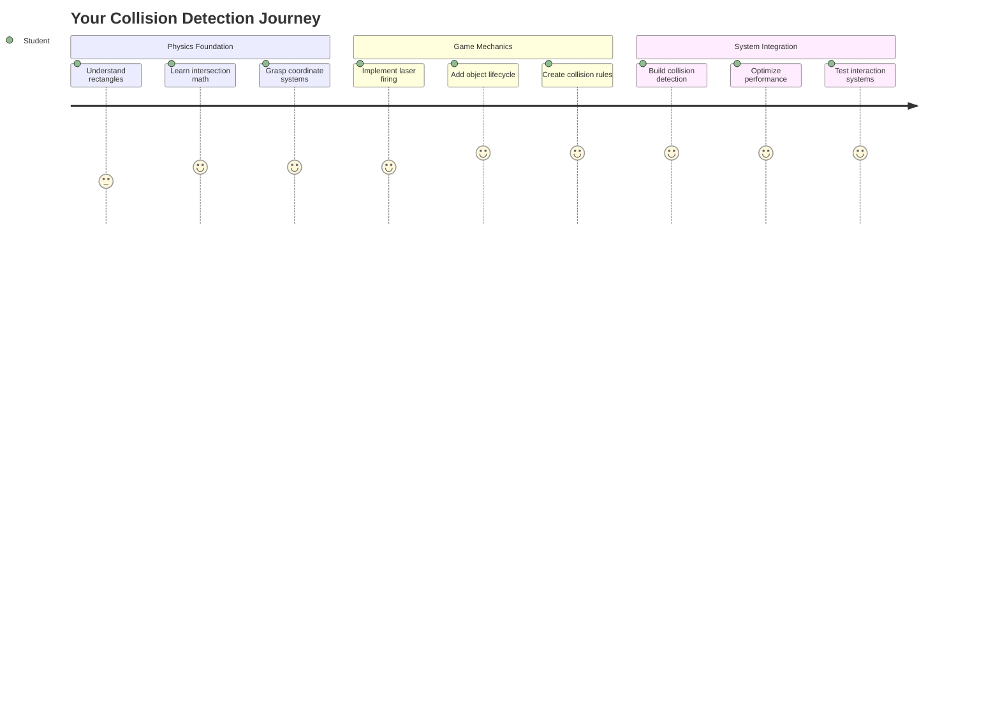
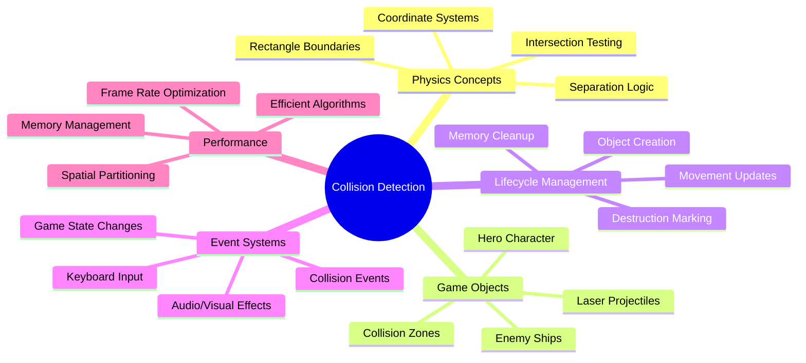
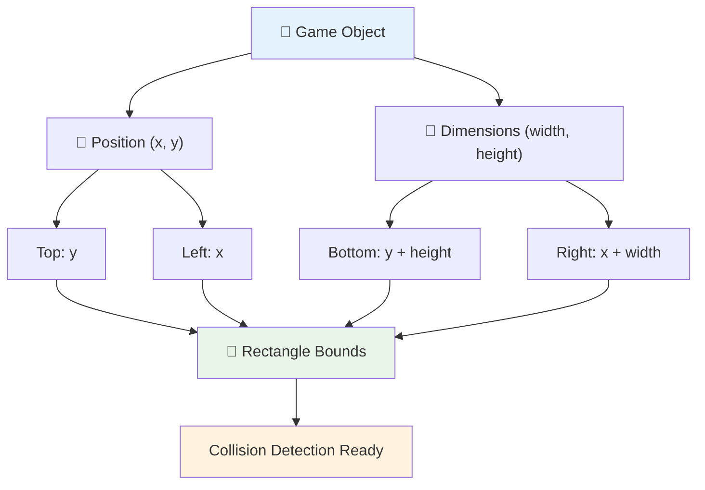
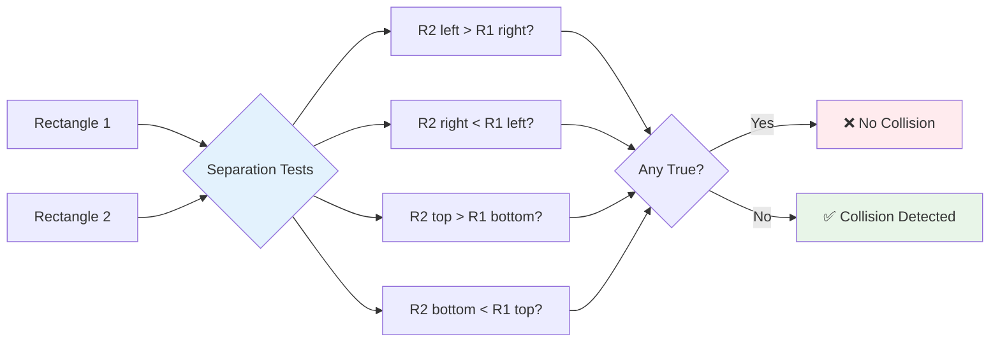
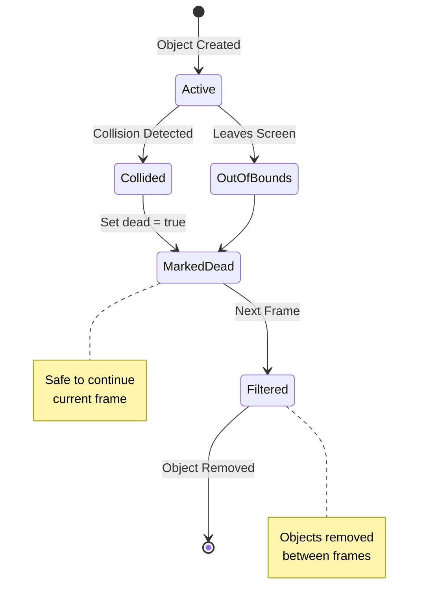
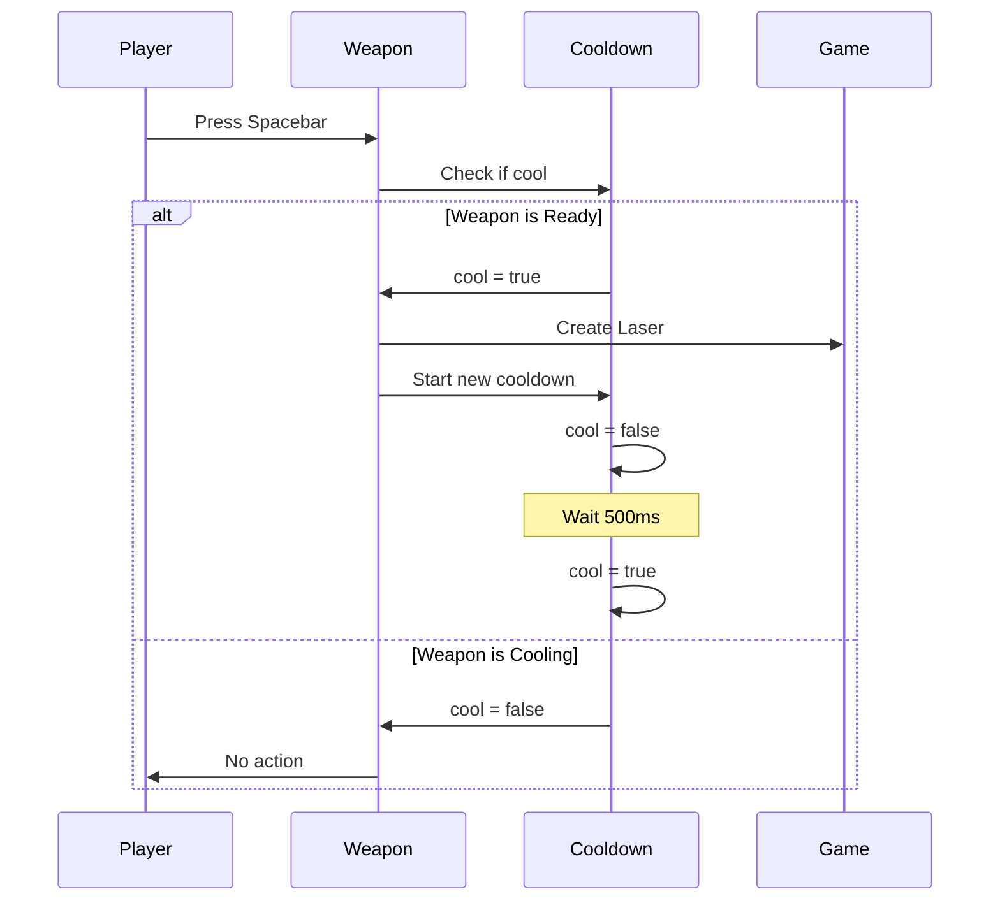
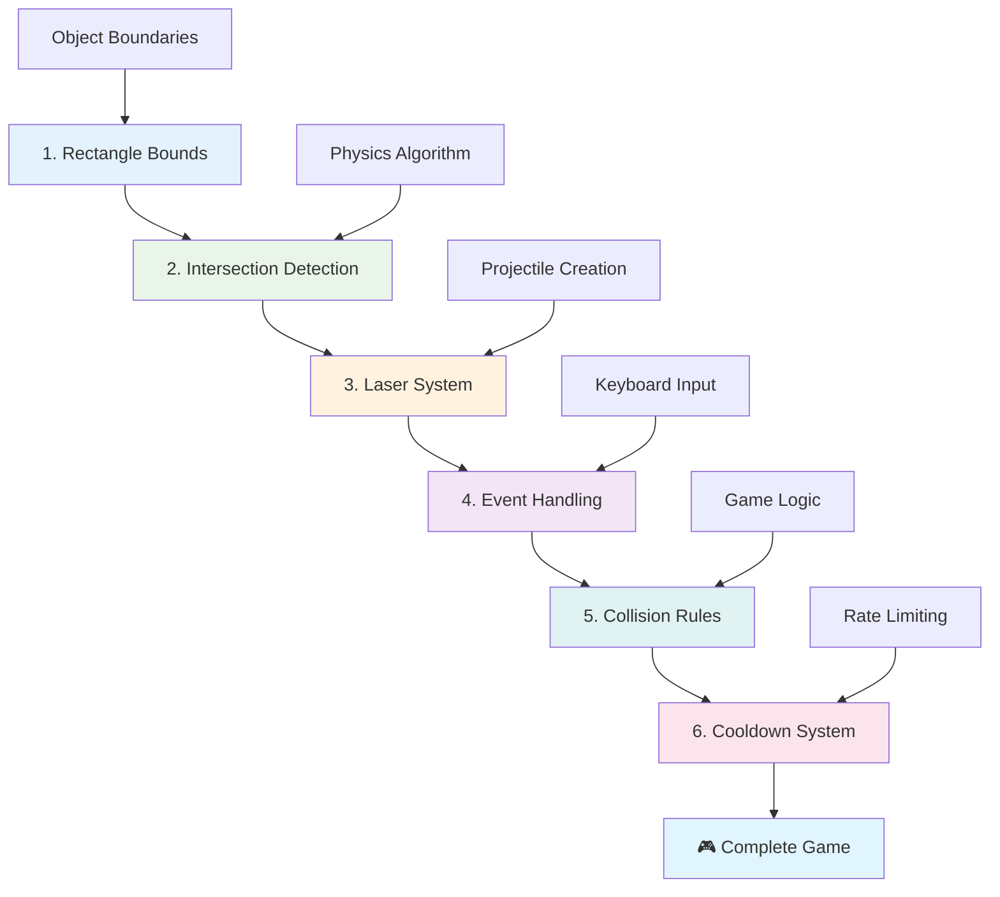
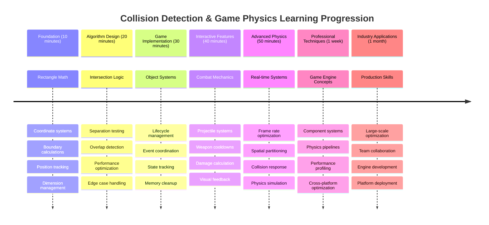

<!--
CO_OP_TRANSLATOR_METADATA:
{
  "original_hash": "039b4d8ce65f5edd82cf48d9c3e6728c",
  "translation_date": "2025-11-06T13:04:03+00:00",
  "source_file": "6-space-game/4-collision-detection/README.md",
  "language_code": "ja"
}
-->
# 宇宙ゲームを作ろう パート4: レーザーの追加と衝突検出



## 講義前クイズ

[講義前クイズ](https://ff-quizzes.netlify.app/web/quiz/35)

スターウォーズでルークのプロトン魚雷がデススターの排気口に命中した瞬間を思い出してください。その正確な衝突検出が銀河の運命を変えました！ゲームでも衝突検出は同じように機能し、オブジェクトがどのように相互作用し、その後何が起こるかを決定します。

このレッスンでは、宇宙ゲームにレーザー兵器を追加し、衝突検出を実装します。NASAのミッションプランナーが宇宙船の軌道を計算してデブリを回避するように、ゲームオブジェクトが交差するタイミングを検出する方法を学びます。これを段階的に分解して、順を追って構築していきます。

最終的には、レーザーが敵を破壊し、衝突がゲームイベントを引き起こす機能的な戦闘システムを手に入れることができます。この衝突の原理は、物理シミュレーションからインタラクティブなウェブインターフェースまで、さまざまな場面で使用されています。



✅ 最初に作られたコンピューターゲームについて少し調べてみましょう。その機能は何でしたか？

## 衝突検出

衝突検出は、アポロ月着陸船の近接センサーのように機能します。常に距離をチェックし、オブジェクトが近づきすぎたときにアラートをトリガーします。ゲームでは、このシステムがオブジェクトの相互作用とその後の動作を決定します。

ここで使用するアプローチは、すべてのゲームオブジェクトを長方形として扱います。これは、航空管制システムが航空機を追跡するために簡略化された幾何学的形状を使用する方法に似ています。この長方形の方法は基本的に見えるかもしれませんが、計算効率が高く、ほとんどのゲームシナリオでうまく機能します。

### 長方形の表現

すべてのゲームオブジェクトには座標境界が必要です。これは、火星探査機パスファインダーが火星表面での位置をマッピングした方法に似ています。以下はこれらの境界座標を定義する方法です：



```javascript
rectFromGameObject() {
  return {
    top: this.y,
    left: this.x,
    bottom: this.y + this.height,
    right: this.x + this.width
  }
}
```

**これを分解してみましょう:**
- **上端**: オブジェクトが垂直方向に開始する位置（y座標）
- **左端**: 水平方向に開始する位置（x座標）
- **下端**: y座標に高さを加えることで終了位置を取得
- **右端**: x座標に幅を加えることで完全な境界を取得

### 交差アルゴリズム

長方形の交差を検出するには、ハッブル宇宙望遠鏡が視野内で天体が重なっているかどうかを判断する方法に似たロジックを使用します。このアルゴリズムは分離をチェックします：



```javascript
function intersectRect(r1, r2) {
  return !(r2.left > r1.right ||
    r2.right < r1.left ||
    r2.top > r1.bottom ||
    r2.bottom < r1.top);
}
```

**分離テストはレーダーシステムのように機能します:**
- 長方形2が完全に長方形1の右側にあるか？
- 長方形2が完全に長方形1の左側にあるか？
- 長方形2が完全に長方形1の下にあるか？
- 長方形2が完全に長方形1の上にあるか？

これらの条件がどれも真でない場合、長方形は重なっているはずです。このアプローチは、レーダーオペレーターが2つの航空機が安全な距離にあるかどうかを判断する方法を反映しています。

## オブジェクトのライフサイクル管理

レーザーが敵に命中した場合、両方のオブジェクトをゲームから削除する必要があります。しかし、ループ中にオブジェクトを削除するとクラッシュを引き起こす可能性があります。これは、アポロ誘導コンピューターのような初期のコンピューターシステムで学んだ教訓です。その代わりに、「削除のためのマーク」アプローチを使用して、フレーム間で安全にオブジェクトを削除します。



以下は削除のためにマークする方法です：

```javascript
// Mark object for removal
enemy.dead = true;
```

**このアプローチが機能する理由:**
- オブジェクトを「死んだ」とマークしますが、すぐには削除しません
- これにより現在のゲームフレームが安全に終了します
- すでに削除されたものを使用しようとしてクラッシュすることを防ぎます！

次のレンダーサイクルの前にマークされたオブジェクトをフィルタリングします：

```javascript
gameObjects = gameObjects.filter(go => !go.dead);
```

**このフィルタリングが行うこと:**
- 「生きている」オブジェクトのみを含む新しいリストを作成
- 死んだとマークされたものを捨てる
- ゲームをスムーズに動作させる
- 破壊されたオブジェクトが蓄積してメモリが膨張するのを防ぐ

## レーザーのメカニクスを実装する

ゲーム内のレーザー弾は、スター・トレックのフォトン魚雷と同じ原理で動作します。それらは直線的に移動し、何かに当たるまで進みます。スペースバーを押すたびに、新しいレーザーオブジェクトが画面上を移動します。

これを実現するためには、いくつかの異なる要素を調整する必要があります：

**実装する主要なコンポーネント:**
- **レーザーオブジェクトを作成**し、ヒーローの位置から生成
- **キーボード入力を処理**してレーザー生成をトリガー
- **レーザーの移動とライフサイクルを管理**
- **レーザー弾の視覚的表現を実装**

## 発射速度制御の実装

無制限の発射速度はゲームエンジンを圧倒し、ゲームプレイを簡単すぎるものにしてしまいます。実際の武器システムも同様の制約に直面します。USSエンタープライズのフェイザーでさえ、発射間に充電時間が必要でした。

スペースバーを連打できないようにするクールダウンシステムを実装し、操作性を維持します：



```javascript
class Cooldown {
  constructor(time) {
    this.cool = false;
    setTimeout(() => {
      this.cool = true;
    }, time);
  }
}

class Weapon {
  constructor() {
    this.cooldown = null;
  }
  
  fire() {
    if (!this.cooldown || this.cooldown.cool) {
      // Create laser projectile
      this.cooldown = new Cooldown(500);
    } else {
      // Weapon is still cooling down
    }
  }
}
```

**クールダウンの仕組み:**
- 作成時、武器は「熱い」（まだ発射できない）状態で開始
- タイムアウト期間後、「冷たい」（発射可能）状態になる
- 発射前に「武器は冷たいか？」を確認
- スペースバーの連打を防ぎつつ、操作性を維持

✅ 宇宙ゲームシリーズのレッスン1を参照して、クールダウンについて思い出してください。

## 衝突システムの構築

既存の宇宙ゲームコードを拡張して衝突検出システムを作成します。国際宇宙ステーションの自動衝突回避システムのように、ゲームはオブジェクトの位置を継続的に監視し、交差に応答します。

前回のレッスンのコードから始めて、オブジェクトの相互作用を管理する特定のルールを追加します。

> 💡 **プロのヒント**: レーザーのスプライトはすでにアセットフォルダに含まれており、コード内で参照されています。実装の準備は整っています。

### 実装する衝突ルール

**追加するゲームメカニクス:**
1. **レーザーが敵に命中**: レーザー弾が敵オブジェクトに当たると敵が破壊される
2. **レーザーが画面の境界に到達**: レーザーが画面上端に到達すると削除される
3. **敵とヒーローの衝突**: 両方のオブジェクトが交差すると破壊される
4. **敵が画面下部に到達**: 敵が画面下部に到達するとゲームオーバー

### 🔄 **教育的チェックイン**
**衝突検出の基礎**: 実装前に以下を理解していることを確認してください：
- ✅ 長方形の境界が衝突ゾーンを定義する方法
- ✅ 分離テストが交差計算より効率的な理由
- ✅ ゲームループでのオブジェクトライフサイクル管理の重要性
- ✅ 衝突応答を調整するイベント駆動型システムの仕組み

**簡単な自己テスト**: オブジェクトをすぐに削除した場合、何が起こるでしょうか？
*答え: ループ中の削除はクラッシュを引き起こしたり、反復中にオブジェクトをスキップする可能性があります*

**物理学の理解**: 以下を理解しました：
- **座標系**: 位置と寸法が境界を作る方法
- **交差ロジック**: 衝突検出の数学的原理
- **パフォーマンス最適化**: リアルタイムシステムで効率的なアルゴリズムが重要な理由
- **メモリ管理**: 安全なオブジェクトライフサイクルパターンによる安定性

## 開発環境のセットアップ

朗報です - ほとんどの基盤はすでに整っています！すべてのゲームアセットと基本構造が`your-work`サブフォルダに用意されており、衝突機能を追加する準備が整っています。

### プロジェクト構造

```bash
-| assets
  -| enemyShip.png
  -| player.png
  -| laserRed.png
-| index.html
-| app.js
-| package.json
```

**ファイル構造の理解:**
- **必要なスプライト画像**がすべて含まれています
- **メインHTMLドキュメントとJavaScriptアプリケーションファイル**が含まれています
- **ローカル開発サーバーのパッケージ構成**が提供されています

### 開発サーバーの起動

プロジェクトフォルダに移動し、ローカルサーバーを起動します：

```bash
cd your-work
npm start
```

**このコマンドシーケンス:**
- **作業プロジェクトフォルダに移動**
- **ローカルHTTPサーバーを`http://localhost:5000`で起動**
- **ゲームファイルをテストと開発のために提供**
- **自動リロードによるライブ開発を可能にする**

ブラウザを開き、`http://localhost:5000`に移動して、ヒーローと敵が画面に描画された現在のゲーム状態を確認してください。

### ステップバイステップの実装

NASAがボイジャー宇宙船をプログラムするために使用した体系的なアプローチのように、衝突検出を段階的に実装し、各コンポーネントを順に構築します。



#### 1. 長方形の衝突境界を追加

まず、ゲームオブジェクトに境界を記述する方法を教えましょう。`GameObject`クラスにこのメソッドを追加します：

```javascript
rectFromGameObject() {
    return {
      top: this.y,
      left: this.x,
      bottom: this.y + this.height,
      right: this.x + this.width,
    };
  }
```

**このメソッドが達成すること:**
- **正確な境界座標を持つ長方形オブジェクトを作成**
- **位置と寸法を使用して下端と右端を計算**
- **衝突検出アルゴリズムに準備されたオブジェクトを返す**
- **すべてのゲームオブジェクトに標準化されたインターフェースを提供**

#### 2. 交差検出を実装

次に、2つの長方形が重なっているかどうかを判断できる衝突検出関数を作成します：

```javascript
function intersectRect(r1, r2) {
  return !(
    r2.left > r1.right ||
    r2.right < r1.left ||
    r2.top > r1.bottom ||
    r2.bottom < r1.top
  );
}
```

**このアルゴリズムが機能する方法:**
- **長方形間の4つの分離条件をテスト**
- **分離条件が真の場合は`false`を返す**
- **分離が存在しない場合は衝突を示す**
- **効率的な交差テストのために否定ロジックを使用**

#### 3. レーザー発射システムを実装

ここからがエキサイティングです！レーザー発射システムを設定しましょう。

##### メッセージ定数

まず、ゲームの異なる部分が互いに通信できるようにメッセージタイプを定義します：

```javascript
KEY_EVENT_SPACE: "KEY_EVENT_SPACE",
COLLISION_ENEMY_LASER: "COLLISION_ENEMY_LASER",
COLLISION_ENEMY_HERO: "COLLISION_ENEMY_HERO",
```

**これらの定数が提供するもの:**
- **アプリケーション全体でイベント名を標準化**
- **ゲームシステム間の一貫した通信を可能にする**
- **イベントハンドラ登録でのタイプミスを防ぐ**

##### キーボード入力処理

キーイベントリスナーにスペースキー検出を追加します：

```javascript
} else if(evt.keyCode === 32) {
  eventEmitter.emit(Messages.KEY_EVENT_SPACE);
}
```

**この入力ハンドラ:**
- **キーコード32を使用してスペースキー押下を検出**
- **標準化されたイベントメッセージを送信**
- **分離された発射ロジックを可能にする**

##### イベントリスナーの設定

`initGame()`関数で発射動作を登録します：

```javascript
eventEmitter.on(Messages.KEY_EVENT_SPACE, () => {
 if (hero.canFire()) {
   hero.fire();
 }
});
```

**このイベントリスナー:**
- **スペースキーイベントに応答**
- **発射クールダウン状態を確認**
- **許可されている場合にレーザー生成をトリガー**

レーザーと敵の相互作用の衝突処理を追加します：

```javascript
eventEmitter.on(Messages.COLLISION_ENEMY_LASER, (_, { first, second }) => {
  first.dead = true;
  second.dead = true;
});
```

**この衝突ハンドラ:**
- **両方のオブジェクトを削除対象としてマーク**
- **衝突後の適切なクリーンアップを保証**

#### 4. レーザークラスを作成

上方向に移動し、自身のライフサイクルを管理するレーザー弾を実装します：

```javascript
class Laser extends GameObject {
  constructor(x, y) {
    super(x, y);
    this.width = 9;
    this.height = 33;
    this.type = 'Laser';
    this.img = laserImg;
    
    let id = setInterval(() => {
      if (this.y > 0) {
        this.y -= 15;
      } else {
        this.dead = true;
        clearInterval(id);
      }
    }, 100);
  }
}
```

**このクラス実装:**
- **基本機能を継承するためにGameObjectを拡張**
- **レーザースプライトに適切な寸法を設定**
- **`setInterval()`を使用して自動的に上方向に移動**
- **画面上端に到達した際に自己破壊を処理**
- **アニメーションタイミングとクリーンアップを管理**

#### 5. 衝突検出システムを実装

包括的な衝突検出関数を作成します：

```javascript
function updateGameObjects() {
  const enemies = gameObjects.filter(go => go.type === 'Enemy');
  const lasers = gameObjects.filter(go => go.type === "Laser");
  
  // Test laser-enemy collisions
  lasers.forEach((laser) => {
    enemies.forEach((enemy) => {
      if (intersectRect(laser.rectFromGameObject(), enemy.rectFromGameObject())) {
        eventEmitter.emit(Messages.COLLISION_ENEMY_LASER, {
          first: laser,
          second: enemy,
        });
      }
    });
  });

  // Remove destroyed objects
  gameObjects = gameObjects.filter(go => !go.dead);
}
```

**この衝突システム:**
- **効率的なテストのためにゲームオブジェクトをタイプ別にフィルタリング**
- **すべてのレーザーとすべての敵を交差テスト**
- **交差が検出された場合に衝突イベントを送信**
- **衝突処理後に破壊されたオブジェクトをクリーンアップ**

> ⚠️ **重要**: 衝突検出を有効にするために、`window.onload`のメインゲームループに`updateGameObjects()`を追加してください。

#### 6. ヒーロークラスにクールダウンシステムを追加

ヒーロークラスを強化して発射メカニクスと発射速度制限を追加します：

```javascript
class Hero extends GameObject {
  constructor(x, y) {
    super(x, y);
    this.width = 99;
    this.height = 75;
    this.type = "Hero";
    this.speed = { x: 0, y: 0 };
    this.cooldown = 0;
  }
  
  fire() {
    gameObjects.push(new Laser(this.x + 45, this.y - 10));
    this.cooldown = 500;

    let id = setInterval(() => {
      if (this.cooldown > 0) {
        this.cooldown -= 100;
      } else {
        clearInterval(id);
      }
    }, 200);
  }
  
  canFire() {
    return this.cooldown === 0;
  }
}
```

**強化されたヒーロークラスの理解:**
- **クールダウンタイマーをゼロで初期化（発射可能状態）**
- **ヒーロー船の上に位置するレーザーオブジェクトを作成**
- **連続発射を防ぐためにクールダウン期間を設定**
- **間隔ベースの更新を使用してクールダウンタイマーを減少**
- **`canFire()`メソッドを通じて発射状態を確認**

### 🔄 **教育的チェックイン**
**完全なシステム理解**: 衝突システムの理解を確認してください：
- ✅ 長方形の境界が効率的な衝突検出を可能にする方法
- ✅ ゲームの安定性におけるオブジェクトライフサイクル管理の重要性
- ✅ クールダウンシステムがパフォ
- [ ] `console.log`ステートメントを追加して、衝突イベントをリアルタイムで追跡する

### 🎯 **この1時間で達成できること**
- [ ] レッスン後のクイズを完了し、衝突検出アルゴリズムを理解する
- [ ] 衝突時に爆発などの視覚効果を追加する
- [ ] 異なる特性を持つ複数の種類の弾丸を実装する
- [ ] 一時的にプレイヤーの能力を強化するパワーアップを作成する
- [ ] 衝突をより満足感のあるものにするための効果音を追加する

### 📅 **1週間の物理プログラミング計画**
- [ ] 衝突システムを磨き上げた完全な宇宙ゲームを完成させる
- [ ] 長方形以外の高度な衝突形状（円形、ポリゴン）を実装する
- [ ] リアルな爆発効果のためのパーティクルシステムを追加する
- [ ] 衝突回避を含む複雑な敵の挙動を作成する
- [ ] 多くのオブジェクトを扱う際の衝突検出を最適化する
- [ ] 運動量やリアルな動きを含む物理シミュレーションを追加する

### 🌟 **1か月間のゲーム物理学習の成果**
- [ ] 高度な物理エンジンとリアルなシミュレーションを使用したゲームを構築する
- [ ] 3D衝突検出と空間分割アルゴリズムを学ぶ
- [ ] オープンソースの物理ライブラリやゲームエンジンに貢献する
- [ ] グラフィックス集約型アプリケーションのパフォーマンス最適化を習得する
- [ ] ゲーム物理学や衝突検出に関する教育コンテンツを作成する
- [ ] 高度な物理プログラミングスキルを示すポートフォリオを構築する

## 🎯 衝突検出の習得タイムライン



### 🛠️ ゲーム物理ツールキットのまとめ

このレッスンを完了した後、以下を習得しました:
- **衝突数学**: 長方形の交差アルゴリズムと座標系
- **パフォーマンス最適化**: リアルタイムアプリケーション向けの効率的な衝突検出
- **オブジェクトライフサイクル管理**: 安全な作成、更新、破棄のパターン
- **イベント駆動型アーキテクチャ**: 衝突応答のための分離されたシステム
- **ゲームループ統合**: フレームベースの物理更新とレンダリングの調整
- **入力システム**: レート制限とフィードバックを備えた応答性の高いコントロール
- **メモリ管理**: 効率的なオブジェクトプールとクリーンアップ戦略

**実世界での応用**: 衝突検出スキルは以下に直接適用できます:
- **インタラクティブシミュレーション**: 科学的モデリングや教育ツール
- **ユーザーインターフェース設計**: ドラッグ＆ドロップ操作やタッチ検出
- **データ可視化**: インタラクティブなチャートやクリック可能な要素
- **モバイル開発**: タッチジェスチャー認識と衝突処理
- **ロボットプログラミング**: 経路計画と障害物回避
- **コンピュータグラフィックス**: レイトレーシングと空間アルゴリズム

**習得したプロフェッショナルスキル**: 以下が可能になります:
- **設計** リアルタイム衝突検出の効率的なアルゴリズム
- **実装** オブジェクトの複雑さに対応する物理システム
- **デバッグ** 数学的原理を使用した複雑なインタラクションシステム
- **最適化** 異なるハードウェアやブラウザの能力に合わせたパフォーマンス
- **アーキテクト** 実績のあるデザインパターンを使用した保守可能なゲームシステム

**習得したゲーム開発の概念**:
- **物理シミュレーション**: リアルタイムの衝突検出と応答
- **パフォーマンスエンジニアリング**: インタラクティブアプリケーション向けの最適化されたアルゴリズム
- **イベントシステム**: ゲームコンポーネント間の分離された通信
- **オブジェクト管理**: 動的コンテンツの効率的なライフサイクルパターン
- **入力処理**: 適切なフィードバックを伴う応答性の高いコントロール

**次のステップ**: Matter.jsのような高度な物理エンジンを探索し、3D衝突検出を実装したり、複雑なパーティクルシステムを構築する準備が整いました！

🌟 **達成感アンロック**: プロフェッショナルレベルの衝突検出を備えた完全な物理ベースのインタラクションシステムを構築しました！

## GitHub Copilot Agent チャレンジ 🚀

Agentモードを使用して以下のチャレンジを完了してください:

**説明:** 衝突検出システムを強化し、ランダムに出現するパワーアップを実装して、ヒーローシップが収集すると一時的な能力を提供するようにします。

**プロンプト:** GameObjectを拡張するPowerUpクラスを作成し、ヒーローとパワーアップ間の衝突検出を実装してください。少なくとも2種類のパワーアップを追加してください: 発射速度を上げる（クールダウンを短縮する）ものと、一時的なシールドを作成するもの。ランダムな間隔と位置でパワーアップを生成するスポーンロジックを含めてください。

---


## 🚀 チャレンジ

爆発を追加してください！[Space Artリポジトリ](../../../../6-space-game/solution/spaceArt/readme.txt)のゲームアセットを確認し、レーザーがエイリアンに当たったときに爆発を追加してみてください。

## レッスン後のクイズ

[レッスン後のクイズ](https://ff-quizzes.netlify.app/web/quiz/36)

## レビューと自己学習

これまでのゲームで間隔を実験してみてください。間隔を変更するとどうなるか確認してください。[JavaScriptのタイミングイベント](https://www.freecodecamp.org/news/javascript-timing-events-settimeout-and-setinterval/)についてさらに読んでみましょう。

## 課題

[衝突を探る](assignment.md)

---

**免責事項**:  
この文書はAI翻訳サービス[Co-op Translator](https://github.com/Azure/co-op-translator)を使用して翻訳されています。正確性を追求しておりますが、自動翻訳には誤りや不正確な部分が含まれる可能性があります。元の言語で記載された文書を正式な情報源としてお考えください。重要な情報については、専門の人間による翻訳を推奨します。この翻訳の使用に起因する誤解や誤認について、当社は責任を負いません。