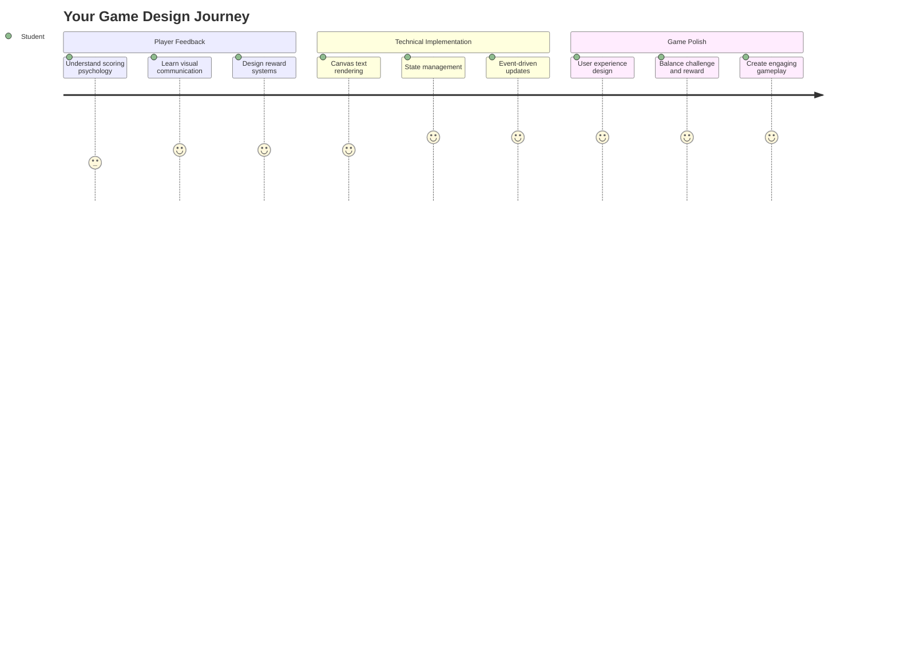
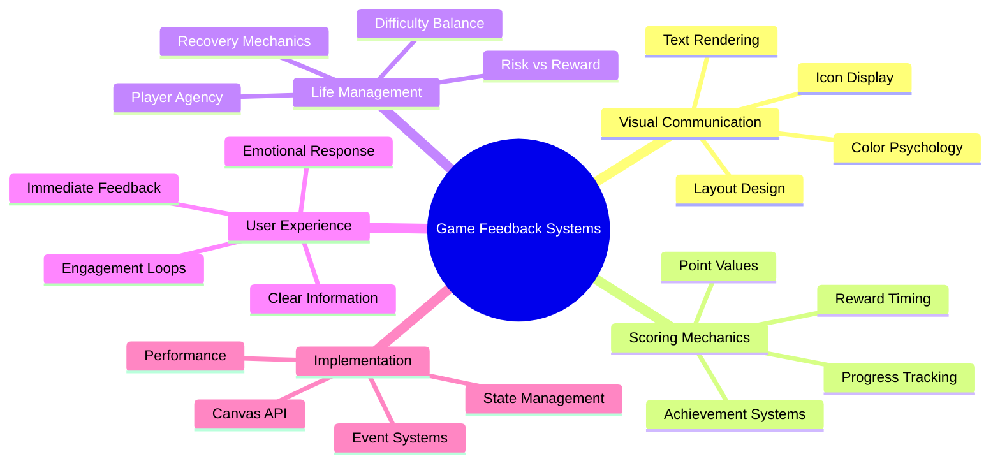
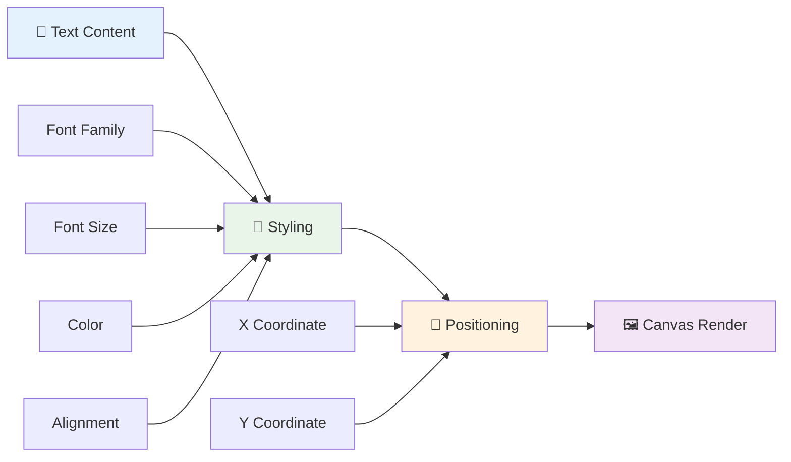
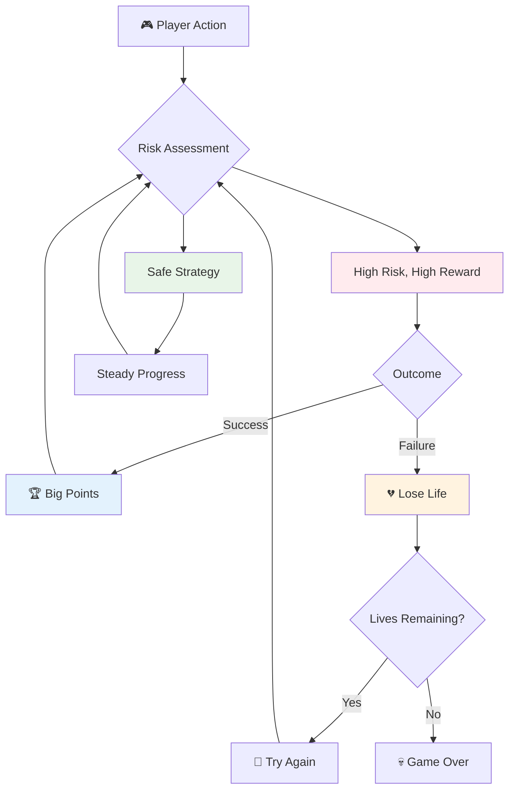
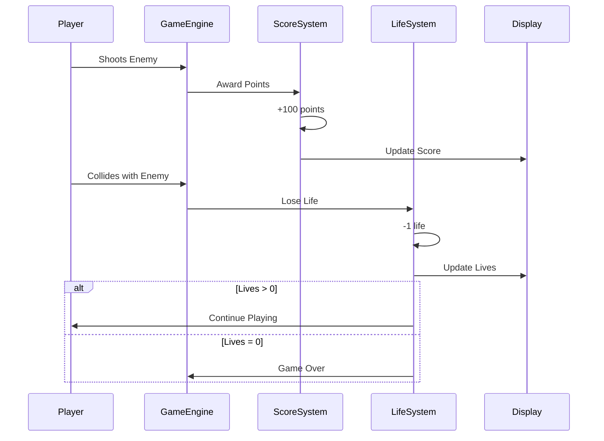
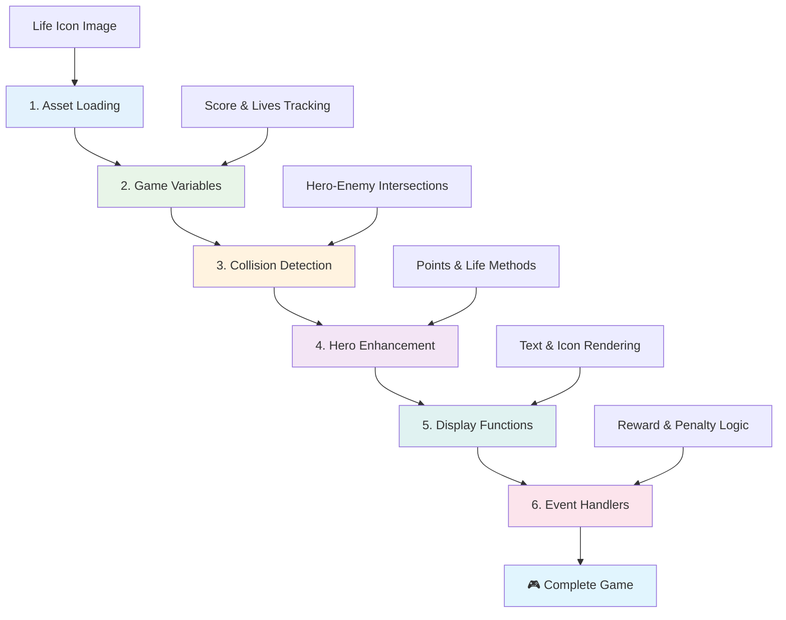
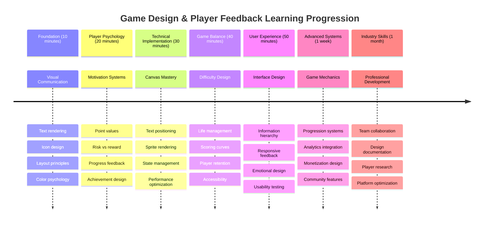

<!--
CO_OP_TRANSLATOR_METADATA:
{
  "original_hash": "2ed9145a16cf576faa2a973dff84d099",
  "translation_date": "2025-11-06T13:05:36+00:00",
  "source_file": "6-space-game/5-keeping-score/README.md",
  "language_code": "ja"
}
-->
# 宇宙ゲームを作ろう パート5: スコアとライフ



## 講義前クイズ

[講義前クイズ](https://ff-quizzes.netlify.app/web/quiz/37)

宇宙ゲームを本格的なゲームのように感じさせる準備はできましたか？スコアポイントとライフ管理を追加しましょう。これらは、初期のアーケードゲーム「スペースインベーダー」などが単なるデモから中毒性のあるエンターテインメントへと変貌した核心的な仕組みです。ここからゲームが本当に遊べるものになります。



## 画面にテキストを描画する - ゲームの声

スコアを表示するには、キャンバス上にテキストを描画する方法を学ぶ必要があります。`fillText()`メソッドがその主なツールです。これは、クラシックなアーケードゲームでスコアやステータス情報を表示するために使用された技術と同じです。



テキストの外観は完全にコントロールできます:

```javascript
ctx.font = "30px Arial";
ctx.fillStyle = "red";
ctx.textAlign = "right";
ctx.fillText("show this on the screen", 0, 0);
```

✅ [キャンバスにテキストを追加する方法](https://developer.mozilla.org/docs/Web/API/Canvas_API/Tutorial/Drawing_text)をさらに深く掘り下げてみましょう。フォントやスタイリングでどれだけクリエイティブになれるか驚くかもしれません！

## ライフ - 単なる数字以上のもの

ゲームデザインにおいて、「ライフ」はプレイヤーのミスの余地を表します。この概念はピンボールマシンにまで遡り、複数のボールでプレイできる仕組みがありました。初期のビデオゲーム「アステロイド」などでは、ライフがプレイヤーにリスクを取る許可を与え、失敗から学ぶ機会を提供しました。



視覚的な表現は非常に重要です。「Lives: 3」と表示する代わりに船のアイコンを表示することで、即座に視覚的な認識を生み出します。これは、初期のアーケードキャビネットが言語の壁を越えてアイコンを使用してコミュニケーションを取った方法に似ています。

## ゲームの報酬システムを構築する

ここでは、プレイヤーを引きつけるコアフィードバックシステムを実装します:



- **スコアリングシステム**: 敵の船を破壊するたびに100ポイントが与えられます（丸い数字はプレイヤーが頭の中で計算しやすいです）。スコアは画面左下に表示されます。
- **ライフカウンター**: ヒーローは3つのライフでスタートします。これは初期のアーケードゲームが挑戦と遊びやすさのバランスを取るために確立した標準です。敵との衝突ごとにライフが1つ減ります。残りのライフは画面右下に船のアイコンで表示されます 。

## 作り始めましょう！

まず、作業環境をセットアップします。`your-work`サブフォルダ内のファイルに移動してください。以下のファイルが見えるはずです:

```bash
-| assets
  -| enemyShip.png
  -| player.png
  -| laserRed.png
-| index.html
-| app.js
-| package.json
```

ゲームをテストするには、`your_work`フォルダから開発サーバーを開始してください:

```bash
cd your-work
npm start
```

これにより、ローカルサーバーが`http://localhost:5000`で実行されます。このアドレスをブラウザで開いてゲームを確認してください。矢印キーで操作をテストし、敵を撃ってすべてが正常に動作するか確認してください。



### コーディング開始！

1. **必要な視覚的なアセットを取得する**。`solution/assets/`フォルダから`life.png`アセットを`your-work`フォルダにコピーします。そして、`lifeImg`を`window.onload`関数に追加します:

    ```javascript
    lifeImg = await loadTexture("assets/life.png");
    ```

1. `lifeImg`をアセットリストに追加するのを忘れないでください:

    ```javascript
    let heroImg,
    ...
    lifeImg,
    ...
    eventEmitter = new EventEmitter();
    ```
  
2. **ゲーム変数を設定する**。合計スコア（0から開始）と残りライフ（3から開始）を追跡するコードを追加します。これらを画面に表示して、プレイヤーが常に自分の状況を把握できるようにします。

3. **衝突検出を実装する**。`updateGameObjects()`関数を拡張して、敵がヒーローと衝突したときに検出できるようにします:

    ```javascript
    enemies.forEach(enemy => {
        const heroRect = hero.rectFromGameObject();
        if (intersectRect(heroRect, enemy.rectFromGameObject())) {
          eventEmitter.emit(Messages.COLLISION_ENEMY_HERO, { enemy });
        }
      })
    ```

4. **ヒーローにライフとポイント追跡を追加する**。 
   1. **カウンターを初期化する**。`Hero`クラスの`this.cooldown = 0`の下にライフとポイントを設定します:

        ```javascript
        this.life = 3;
        this.points = 0;
        ```

   1. **これらの値をプレイヤーに表示する**。画面にこれらの値を描画する関数を作成します:

        ```javascript
        function drawLife() {
          // TODO, 35, 27
          const START_POS = canvas.width - 180;
          for(let i=0; i < hero.life; i++ ) {
            ctx.drawImage(
              lifeImg, 
              START_POS + (45 * (i+1) ), 
              canvas.height - 37);
          }
        }
        
        function drawPoints() {
          ctx.font = "30px Arial";
          ctx.fillStyle = "red";
          ctx.textAlign = "left";
          drawText("Points: " + hero.points, 10, canvas.height-20);
        }
        
        function drawText(message, x, y) {
          ctx.fillText(message, x, y);
        }

        ```

   1. **ゲームループにすべてを接続する**。これらの関数を`updateGameObjects()`の直後に`window.onload`関数に追加します:

        ```javascript
        drawPoints();
        drawLife();
        ```

### 🔄 **教育的チェックイン**
**ゲームデザインの理解**: 結果を実装する前に、以下を理解していることを確認してください:
- ✅ 視覚的フィードバックがプレイヤーにゲームの状態を伝える方法
- ✅ UI要素の一貫した配置が使いやすさを向上させる理由
- ✅ ポイント値とライフ管理の心理学
- ✅ キャンバステキストレンダリングがHTMLテキストと異なる理由

**簡単な自己テスト**: アーケードゲームが通常丸い数字をポイント値に使用する理由は何ですか？
*答え: 丸い数字はプレイヤーが頭の中で計算しやすく、心理的に満足感を与える*

**ユーザーエクスペリエンスの原則**: あなたは今以下を適用しています:
- **視覚的階層**: 重要な情報を目立つ位置に配置
- **即時フィードバック**: プレイヤーのアクションにリアルタイムで更新
- **認知負荷**: シンプルで明確な情報の提示
- **感情的デザイン**: プレイヤーとのつながりを生むアイコンや色

1. **ゲームの結果と報酬を実装する**。プレイヤーのアクションに意味を持たせるフィードバックシステムを追加します:

   1. **衝突でライフを失う**。ヒーローが敵に衝突するたびにライフを失うようにします。
   
      このメソッドを`Hero`クラスに追加してください:

        ```javascript
        decrementLife() {
          this.life--;
          if (this.life === 0) {
            this.dead = true;
          }
        }
        ```

   2. **敵を撃つとポイントを獲得する**。正確に撃つことで即座にポジティブなフィードバックを得られるように、成功したヒットごとに100ポイントを与えます。

      このインクリメントメソッドをHeroクラスに拡張してください:
    
        ```javascript
          incrementPoints() {
            this.points += 100;
          }
        ```

        次にこれらの関数を衝突イベントに接続します:

        ```javascript
        eventEmitter.on(Messages.COLLISION_ENEMY_LASER, (_, { first, second }) => {
           first.dead = true;
           second.dead = true;
           hero.incrementPoints();
        })

        eventEmitter.on(Messages.COLLISION_ENEMY_HERO, (_, { enemy }) => {
           enemy.dead = true;
           hero.decrementLife();
        });
        ```

✅ JavaScriptとCanvasで作られた他のゲームに興味がありますか？探索してみてください。可能性に驚くかもしれません！

これらの機能を実装した後、ゲームをテストして完全なフィードバックシステムを確認してください。画面右下にライフアイコン、左下にスコアが表示され、衝突でライフが減り、成功したショットでスコアが増加する様子を確認できます。

あなたのゲームには、初期のアーケードゲームを非常に魅力的にした基本的な仕組みが備わりました - 明確な目標、即時フィードバック、プレイヤーのアクションに対する意味のある結果。

### 🔄 **教育的チェックイン**
**完全なゲームデザインシステム**: プレイヤーフィードバックシステムの習得を確認してください:
- ✅ スコアリングメカニズムがプレイヤーの動機付けとエンゲージメントを生む方法
- ✅ ユーザーインターフェースデザインにおける視覚的一貫性の重要性
- ✅ ライフシステムが挑戦とプレイヤー維持のバランスを取る方法
- ✅ 即時フィードバックが満足感のあるゲームプレイを生む役割

**システム統合**: あなたのフィードバックシステムは以下を示しています:
- **ユーザーエクスペリエンスデザイン**: 明確な視覚的コミュニケーションと情報階層
- **イベント駆動型アーキテクチャ**: プレイヤーのアクションへの応答的な更新
- **状態管理**: 動的なゲームデータの追跡と表示
- **キャンバスの習熟**: テキストレンダリングとスプライトの配置
- **ゲーム心理学**: プレイヤーの動機付けとエンゲージメントの理解

**プロフェッショナルなパターン**: あなたは以下を実装しました:
- **MVCアーキテクチャ**: ゲームロジック、データ、プレゼンテーションの分離
- **オブザーバーパターン**: ゲーム状態の変更に対するイベント駆動型更新
- **コンポーネントデザイン**: レンダリングとロジックの再利用可能な関数
- **パフォーマンス最適化**: ゲームループでの効率的なレンダリング

### ⚡ **次の5分間でできること**
- [ ] スコア表示のフォントサイズや色を試してみる
- [ ] ポイント値を変更してゲームプレイの感触を確認する
- [ ] ポイントやライフが変化したときに追跡するためのconsole.logステートメントを追加する
- [ ] ライフがなくなる場合や高得点を達成する場合などのエッジケースをテストする

### 🎯 **この1時間で達成できること**
- [ ] レッスン後のクイズを完了し、ゲームデザイン心理学を理解する
- [ ] スコアを獲得したりライフを失ったときの効果音を追加する
- [ ] localStorageを使用してハイスコアシステムを実装する
- [ ] 敵の種類ごとに異なるポイント値を設定する
- [ ] ライフを失ったときの画面揺れなどの視覚効果を追加する

### 📅 **1週間のゲームデザインの旅**
- [ ] 完成した宇宙ゲームをフィードバックシステムで磨き上げる
- [ ] コンボ倍率などの高度なスコアリングメカニズムを実装する
- [ ] 実績やアンロック可能なコンテンツを追加する
- [ ] 難易度の進行とバランスシステムを作成する
- [ ] メニューやゲームオーバー画面のユーザーインターフェースをデザインする
- [ ] 他のゲームを研究してエンゲージメントメカニズムを理解する

### 🌟 **1ヶ月間のゲーム開発習熟**
- [ ] 洗練された進行システムを備えた完全なゲームを構築する
- [ ] ゲーム分析とプレイヤー行動測定を学ぶ
- [ ] オープンソースのゲーム開発プロジェクトに貢献する
- [ ] 高度なゲームデザインパターンと収益化を習得する
- [ ] ゲームデザインとユーザーエクスペリエンスに関する教育コンテンツを作成する
- [ ] ゲームデザインと開発スキルを示すポートフォリオを構築する

## 🎯 ゲームデザイン習熟タイムライン



### 🛠️ ゲームデザインツールキットのまとめ

このレッスンを完了した後、以下を習得しました:
- **プレイヤー心理学**: 動機付け、リスク/報酬、エンゲージメントループの理解
- **視覚的コミュニケーション**: テキスト、アイコン、レイアウトを使用した効果的なUIデザイン
- **フィードバックシステム**: プレイヤーのアクションとゲームイベントへのリアルタイム応答
- **状態管理**: 動的なゲームデータを効率的に追跡し表示する
- **キャンバステキストレンダリング**: スタイリングと配置を備えたプロフェッショナルなテキスト表示
- **イベント統合**: ユーザーアクションを意味のあるゲーム結果に接続する
- **ゲームバランス**: 難易度曲線とプレイヤー進行システムの設計

**実世界での応用**: あなたのゲームデザインスキルは以下に直接適用できます:
- **ユーザーインターフェースデザイン**: 魅力的で直感的なインターフェースの作成
- **製品開発**: ユーザーの動機付けとフィードバックループの理解
- **教育技術**: ゲーミフィケーションと学習エンゲージメントシステム
- **データ可視化**: 複雑な情報をアクセス可能で魅力的にする
- **モバイルアプリ開発**: 維持メカニズムとユーザーエクスペリエンスデザイン
- **マーケティング技術**: ユーザー行動とコンバージョン最適化の理解

**習得したプロフェッショナルスキル**: あなたは以下ができます:
- **デザイン** ユーザーを動機付け、エンゲージさせる体験を作成する
- **実装** ユーザー行動を効果的に導くフィードバックシステムを構築する
- **バランス** インタラクティブシステムで挑戦とアクセス性を調整する
- **作成** 異なるユーザーグループに対応する視覚的コミュニケーションを設計する
- **分析** ユーザー行動を評価し、デザイン改善を繰り返す

**習得したゲーム開発の概念**:
- **プレイヤーの動機付け**: エンゲージメントと維持を促進する要因の理解
- **視覚デザイン**: 明確で魅力的かつ機能的なインターフェースの作成
- **システム統合**: 複数のゲームシステムを統合して一貫性のある体験を提供する
- **パフォーマンス最適化**: 効率的なレンダリングと状態管理
- **アクセシビリティ**: 異なるスキルレベルやプレイヤーのニーズに対応するデザイン

**次のステップ**: 高度なゲームデザインパターンを探求したり、分析システムを実装したり、ゲームの収益化とプレイヤー維持戦略を学ぶ準備が整いました！

🌟 **達成解除**: プロフェッショナルなゲームデザインの原則を備えた完全なプレイヤーフィードバックシステムを構築しました！

---

## GitHub Copilot Agent Challenge 🚀

Agentモードを使用して以下のチャレンジを完了してください:

**説明:** 宇宙ゲームのスコアリングシステムを強化し、ハイスコア機能を永続的なストレージとボーナススコアリングメカニズムで実装します。

**プロンプト:** プレイヤーの最高スコアをlocalStorageに保存するハイスコアシステムを作成してください。敵を連続で倒すことでボーナスポイントを追加し、敵の種類ごとに異なるポイント値を実装します。プレイヤーが新しいハイスコアを達成したときに視覚的なインジケーターを追加し、ゲーム画面に現在のハイスコアを表示してください。


## 🚀 チャレンジ

スコアとライフを備えた機能的なゲームが完成しました。プレイヤー体験を向上させるためにどのような追加機能が考えられるか検討してください。

## 講義後クイズ

[講義後クイズ](https://ff-qu

---

**免責事項**:  
この文書はAI翻訳サービス[Co-op Translator](https://github.com/Azure/co-op-translator)を使用して翻訳されています。正確性を追求しておりますが、自動翻訳には誤りや不正確な部分が含まれる可能性があります。元の言語で記載された文書を正式な情報源としてご参照ください。重要な情報については、専門の人間による翻訳を推奨します。この翻訳の使用に起因する誤解や誤解について、当社は責任を負いません。