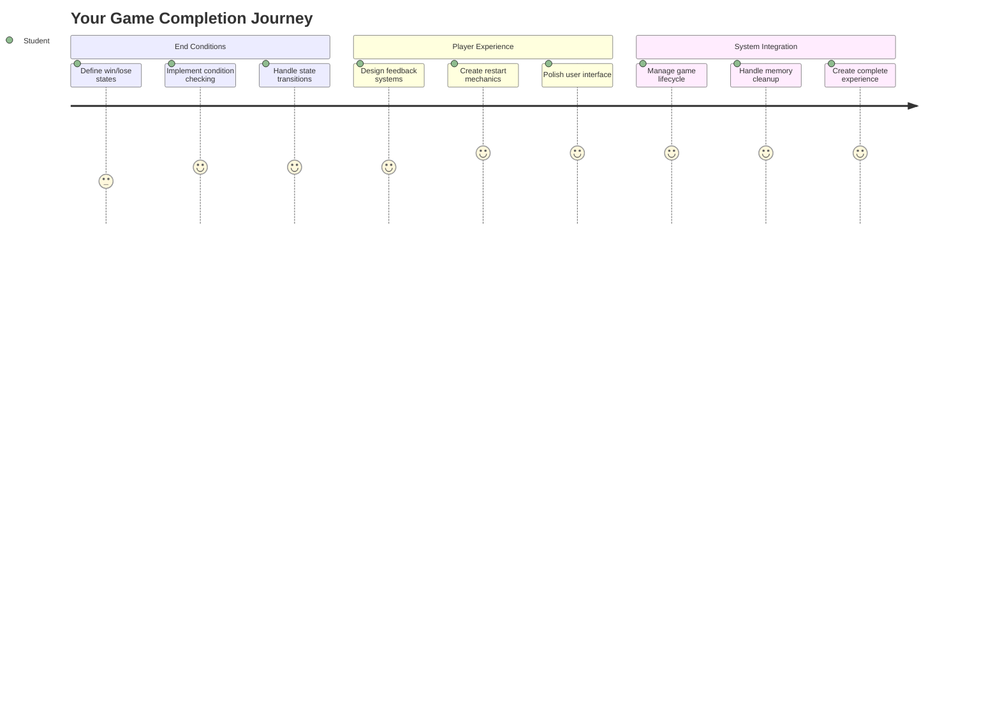
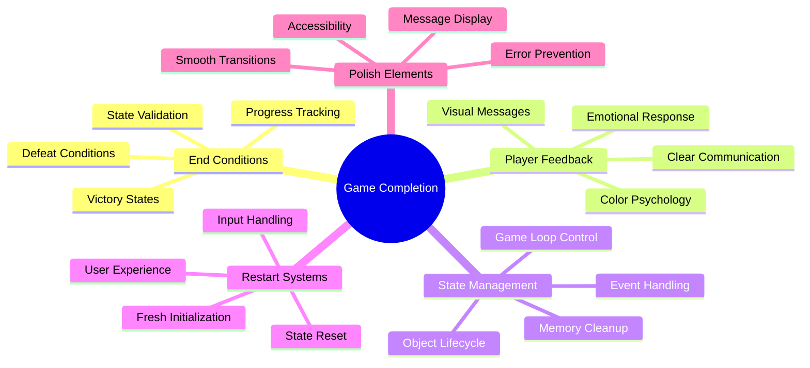
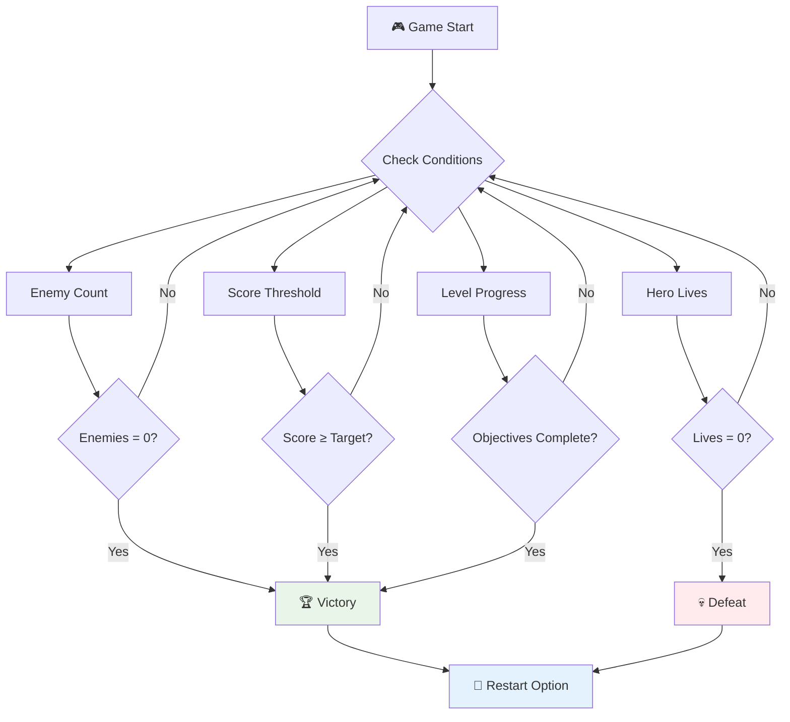
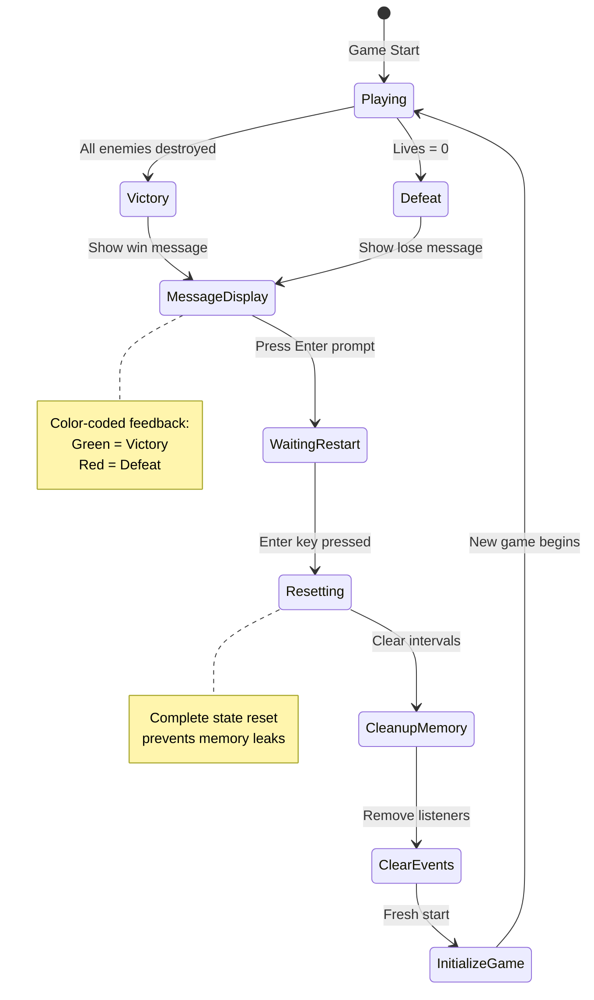
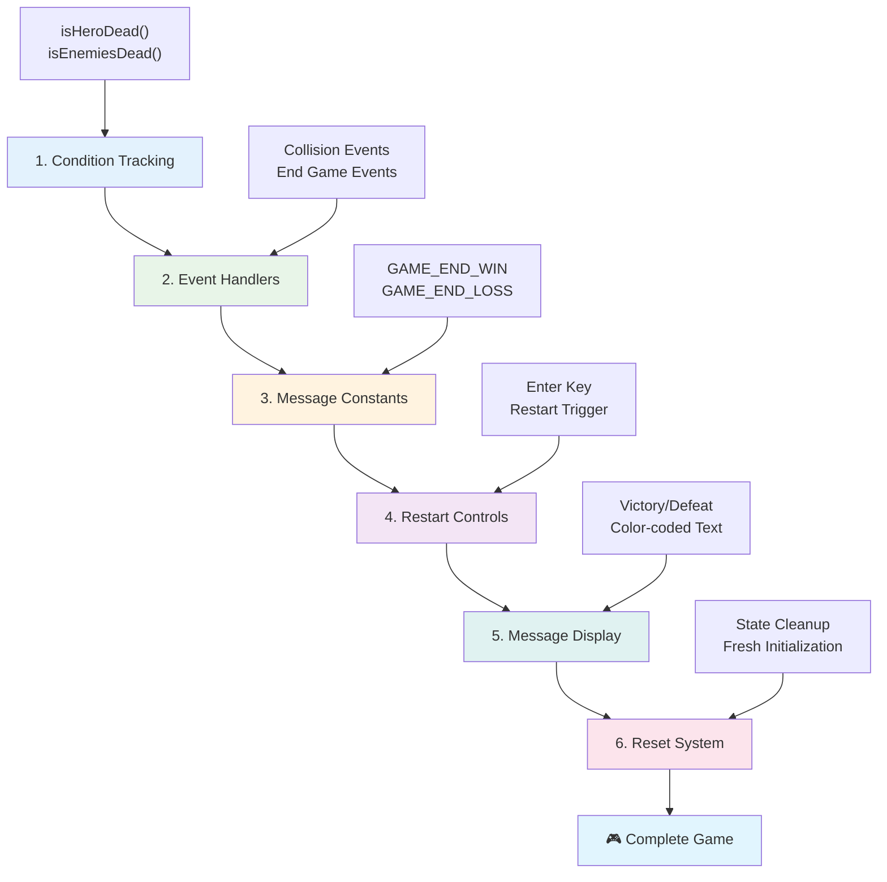
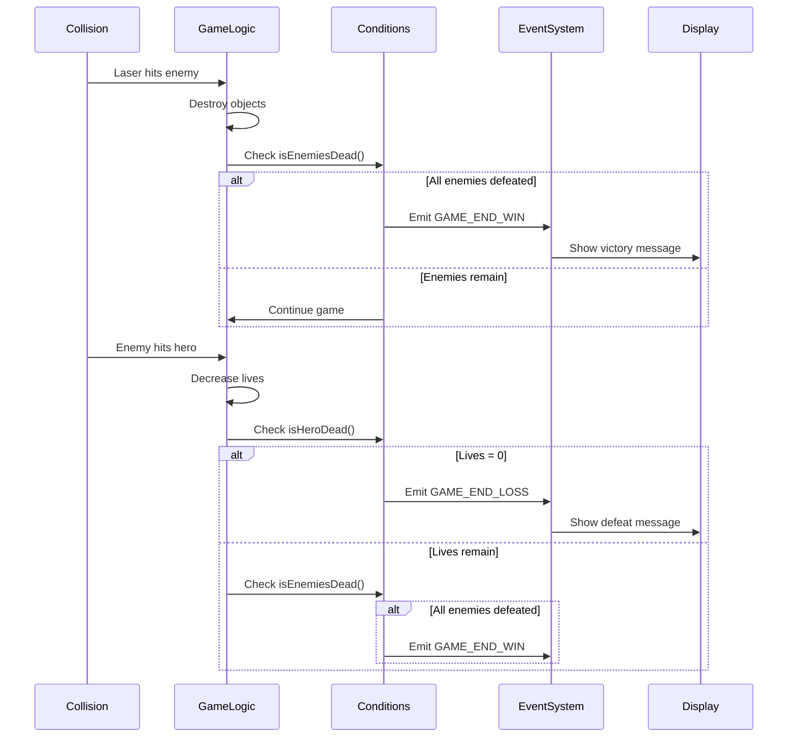
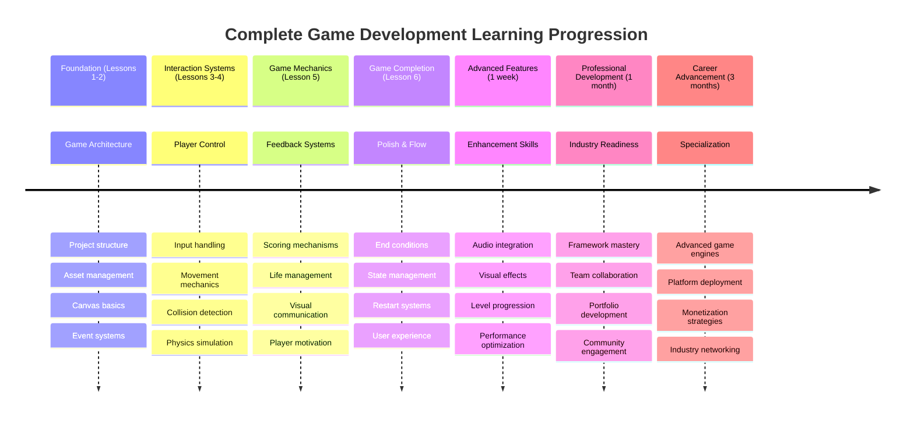

<!--
CO_OP_TRANSLATOR_METADATA:
{
  "original_hash": "a4b78043f4d64bf3ee24e0689b8b391d",
  "translation_date": "2025-11-06T13:02:28+00:00",
  "source_file": "6-space-game/6-end-condition/README.md",
  "language_code": "ja"
}
-->
# 宇宙ゲームを作ろう パート6: 終了と再スタート



素晴らしいゲームには、明確な終了条件とスムーズな再スタートの仕組みが必要です。これまでに移動、戦闘、スコアリングを備えた印象的な宇宙ゲームを作り上げましたが、今回はゲームを完成させるための最後の要素を追加します。

現在のゲームは、1977年にNASAが打ち上げたボイジャー探査機のように、無限に続く仕組みになっています。宇宙探査ではそれで問題ありませんが、ゲームには満足感を得られる明確な終点が必要です。

今日は、適切な勝敗条件と再スタートの仕組みを実装します。このレッスンが終わる頃には、プレイヤーがクリアして再挑戦できる、完成度の高いゲームが出来上がります。これは、アーケードゲームの黄金時代を象徴するようなゲームと同じです。



## 講義前のクイズ

[講義前のクイズ](https://ff-quizzes.netlify.app/web/quiz/39)

## ゲーム終了条件の理解

ゲームはいつ終わるべきでしょうか？この基本的な問いは、初期のアーケード時代からゲームデザインを形作ってきました。例えば、パックマンはゴーストに捕まるか、すべてのドットをクリアすると終了します。一方、スペースインベーダーはエイリアンが画面下部に到達するか、すべてを倒すと終了します。

ゲームクリエイターとして、勝利条件と敗北条件を定義するのはあなたの役目です。私たちの宇宙ゲームでは、以下のようなプレイを盛り上げる方法を採用します：



- **`N`体の敵船を撃破する**: ゲームをレベルに分ける場合、`N`体の敵船を撃破することでレベルをクリアするのが一般的です。
- **自分の船が破壊される**: 自分の船が破壊されるとゲームオーバーになるゲームもあります。もう一つの一般的な方法は「ライフ」の概念を導入することです。船が破壊されるたびにライフが減り、すべてのライフを失うとゲームオーバーになります。
- **`N`ポイントを集める**: ポイントを集めることが終了条件になることもあります。ポイントの獲得方法は自由ですが、敵船を撃破したり、破壊されたアイテムを収集したりすることでポイントを得るのが一般的です。
- **レベルをクリアする**: これには、`X`体の敵船を撃破する、`Y`ポイントを集める、特定のアイテムを収集するなど、複数の条件が含まれる場合があります。

## ゲーム再スタート機能の実装

良いゲームはスムーズな再スタートの仕組みを通じてリプレイ性を高めます。プレイヤーがゲームをクリアしたり敗北したりすると、すぐに再挑戦したいと思うことが多いです。スコアを更新したり、プレイを改善したりするためです。



テトリスはその完璧な例です。ブロックが画面上部に到達すると、複雑なメニューを経ずにすぐ新しいゲームを開始できます。同様の再スタートシステムを構築し、ゲームの状態をきれいにリセットしてプレイヤーをすぐにアクションに戻せるようにします。

✅ **振り返り**: あなたがプレイしたゲームについて考えてみましょう。それらはどのような条件で終了し、どのように再スタートを促されましたか？再スタートの体験がスムーズに感じる場合と、イライラする場合の違いは何でしょうか？

## 作成するもの

プロジェクトを完成したゲーム体験に変えるための最終機能を実装します。これらの要素は、基本的なプロトタイプと完成度の高いゲームを区別するものです。

**今日追加する内容:**

1. **勝利条件**: 敵をすべて撃破して、適切な祝福を受ける（その価値があります！）
2. **敗北条件**: ライフを使い果たして敗北画面を表示
3. **再スタート機能**: Enterキーを押してすぐに再挑戦 - 一度のプレイでは物足りない！
4. **状態管理**: 毎回クリーンな状態で開始 - 前回のゲームの残り物や奇妙なバグはなし

## 準備を始めよう

開発環境を準備しましょう。前回のレッスンで作成した宇宙ゲームのファイルがすべて揃っているはずです。

**プロジェクトは以下のような構成になっているはずです:**

```bash
-| assets
  -| enemyShip.png
  -| player.png
  -| laserRed.png
  -| life.png
-| index.html
-| app.js
-| package.json
```

**開発サーバーを起動:**

```bash
cd your-work
npm start
```

**このコマンドは以下を実行します:**
- `http://localhost:5000`でローカルサーバーを起動
- ファイルを正しく提供
- 変更を加えると自動的にリフレッシュ

ブラウザで`http://localhost:5000`を開き、ゲームが動作していることを確認してください。移動、射撃、敵とのインタラクションができるはずです。確認が終わったら、実装を進めましょう。

> 💡 **プロのヒント**: Visual Studio Codeで警告を避けるために、`gameLoopId`をファイルの先頭で`let gameLoopId;`として宣言してください。`window.onload`関数内で宣言する代わりに、これにより最新のJavaScript変数宣言のベストプラクティスに従うことができます。



## 実装手順

### ステップ1: 終了条件を追跡する関数を作成

ゲームが終了すべきタイミングを監視する関数が必要です。国際宇宙ステーションのセンサーが重要なシステムを常に監視しているように、これらの関数はゲームの状態を継続的にチェックします。

```javascript
function isHeroDead() {
  return hero.life <= 0;
}

function isEnemiesDead() {
  const enemies = gameObjects.filter((go) => go.type === "Enemy" && !go.dead);
  return enemies.length === 0;
}
```

**内部で何が起きているか:**
- **チェック**: ヒーローがライフを使い果たしていないか（痛い！）
- **カウント**: まだ生き残っている敵の数
- **返却**: 戦場が敵からクリアされたら`true`を返す
- **使用**: シンプルなtrue/falseロジックでわかりやすく
- **フィルタリング**: すべてのゲームオブジェクトを通じて生存者を探す

### ステップ2: 終了条件のイベントハンドラーを更新

次に、これらの条件チェックをゲームのイベントシステムに接続します。衝突が発生するたびに、ゲームは終了条件を引き起こすかどうかを評価します。これにより、重要なゲームイベントに即座にフィードバックが得られます。



```javascript
eventEmitter.on(Messages.COLLISION_ENEMY_LASER, (_, { first, second }) => {
    first.dead = true;
    second.dead = true;
    hero.incrementPoints();

    if (isEnemiesDead()) {
      eventEmitter.emit(Messages.GAME_END_WIN);
    }
});

eventEmitter.on(Messages.COLLISION_ENEMY_HERO, (_, { enemy }) => {
    enemy.dead = true;
    hero.decrementLife();
    if (isHeroDead())  {
      eventEmitter.emit(Messages.GAME_END_LOSS);
      return; // loss before victory
    }
    if (isEnemiesDead()) {
      eventEmitter.emit(Messages.GAME_END_WIN);
    }
});

eventEmitter.on(Messages.GAME_END_WIN, () => {
    endGame(true);
});
  
eventEmitter.on(Messages.GAME_END_LOSS, () => {
  endGame(false);
});
```

**ここで何が起きているか:**
- **レーザーが敵に命中**: 両方が消え、ポイントを獲得し、勝利条件をチェック
- **敵が自分に命中**: ライフを失い、生存しているかをチェック
- **スマートな順序付け**: 敗北を最初にチェック（誰も勝利と敗北を同時に経験したくない！）
- **即時反応**: 重要なことが起きた瞬間にゲームがそれを認識

### ステップ3: 新しいメッセージ定数を追加

`Messages`定数オブジェクトに新しいメッセージタイプを追加する必要があります。これらの定数は一貫性を保ち、イベントシステムでのタイプミスを防ぎます。

```javascript
GAME_END_LOSS: "GAME_END_LOSS",
GAME_END_WIN: "GAME_END_WIN",
```

**上記で行ったこと:**
- **追加**: ゲーム終了イベントの定数を追加して一貫性を保つ
- **使用**: イベントの目的を明確に示す説明的な名前
- **従う**: メッセージタイプの既存の命名規則

### ステップ4: 再スタート操作を実装

次に、プレイヤーがゲームを再スタートできるキーボード操作を追加します。Enterキーは、アクションの確認や新しいゲームの開始に一般的に使用されるため、自然な選択です。

**既存のkeydownイベントリスナーにEnterキー検出を追加:**

```javascript
else if(evt.key === "Enter") {
   eventEmitter.emit(Messages.KEY_EVENT_ENTER);
}
```

**新しいメッセージ定数を追加:**

```javascript
KEY_EVENT_ENTER: "KEY_EVENT_ENTER",
```

**知っておくべきこと:**
- **既存のキーボードイベント処理システムを拡張**
- **Enterキーを再スタートトリガーとして使用し、直感的なユーザー体験を提供**
- **カスタムイベントを発行し、ゲームの他の部分がそれをリスン可能**
- **他のキーボード操作と同じパターンを維持**

### ステップ5: メッセージ表示システムを作成

ゲームはプレイヤーに結果を明確に伝える必要があります。勝利と敗北状態を色分けされたテキストで表示するメッセージシステムを作成します。これは、成功を示す緑色やエラーを示す赤色を使用した初期のコンピュータシステムのターミナルインターフェースに似ています。

**`displayMessage()`関数を作成:**

```javascript
function displayMessage(message, color = "red") {
  ctx.font = "30px Arial";
  ctx.fillStyle = color;
  ctx.textAlign = "center";
  ctx.fillText(message, canvas.width / 2, canvas.height / 2);
}
```

**ステップごとの説明:**
- **フォントサイズとフォントファミリーを設定**して、読みやすいテキストを表示
- **色パラメータを適用**し、警告にはデフォルトで「赤」を使用
- **キャンバス上でテキストを水平・垂直に中央配置**
- **柔軟な色オプションのためにモダンなJavaScriptのデフォルトパラメータを使用**
- **キャンバス2Dコンテキストを活用**して直接テキストをレンダリング

**`endGame()`関数を作成:**

```javascript
function endGame(win) {
  clearInterval(gameLoopId);

  // Set a delay to ensure any pending renders complete
  setTimeout(() => {
    ctx.clearRect(0, 0, canvas.width, canvas.height);
    ctx.fillStyle = "black";
    ctx.fillRect(0, 0, canvas.width, canvas.height);
    if (win) {
      displayMessage(
        "Victory!!! Pew Pew... - Press [Enter] to start a new game Captain Pew Pew",
        "green"
      );
    } else {
      displayMessage(
        "You died !!! Press [Enter] to start a new game Captain Pew Pew"
      );
    }
  }, 200)  
}
```

**この関数が行うこと:**
- **すべてを停止** - 船やレーザーの移動はもうなし
- **短いポーズを取る**（200ms） - 最後のフレームが描画されるのを待つ
- **画面を完全に消去し、黒で塗りつぶす** - 劇的な効果
- **勝者と敗者に異なるメッセージを表示**
- **ニュースを色分け** - 良い知らせは緑、悪い知らせは...まあ赤
- **プレイヤーに再挑戦方法を明確に伝える**

### 🔄 **教育的チェックイン**
**ゲーム状態管理**: リセット機能を実装する前に、以下を理解していることを確認してください:
- ✅ 終了条件が明確なゲームプレイ目標を作る方法
- ✅ 視覚的フィードバックがプレイヤーの理解に不可欠な理由
- ✅ 適切なクリーンアップがメモリリークを防ぐ重要性
- ✅ イベント駆動型アーキテクチャがクリーンな状態遷移を可能にする方法

**簡単な自己テスト**: リセット時にイベントリスナーをクリアしなかった場合、何が起きるでしょうか？
*答え: メモリリークや重複したイベントハンドラーが原因で予測不能な動作が発生する*

**ゲームデザインの原則**: 今、以下を実装しています:
- **明確な目標**: プレイヤーが成功と失敗を明確に理解できる
- **即時フィードバック**: ゲーム状態の変化が即座に伝えられる
- **ユーザーコントロール**: プレイヤーが準備ができたら再スタート可能
- **システムの信頼性**: 適切なクリーンアップでバグやパフォーマンス問題を防止

### ステップ6: ゲームリセット機能を実装

リセットシステムは現在のゲーム状態を完全にクリーンアップし、新しいゲームセッションを初期化する必要があります。これにより、前回のゲームの残りデータがない状態でプレイヤーが新しいスタートを切ることができます。

**`resetGame()`関数を作成:**

```javascript
function resetGame() {
  if (gameLoopId) {
    clearInterval(gameLoopId);
    eventEmitter.clear();
    initGame();
    gameLoopId = setInterval(() => {
      ctx.clearRect(0, 0, canvas.width, canvas.height);
      ctx.fillStyle = "black";
      ctx.fillRect(0, 0, canvas.width, canvas.height);
      drawPoints();
      drawLife();
      updateGameObjects();
      drawGameObjects(ctx);
    }, 100);
  }
}
```

**各部分を理解しましょう:**
- **現在ゲームループが実行中かどうかをチェック**してからリセット
- **既存のゲームループをクリア**して現在のゲーム活動を停止
- **すべてのイベントリスナーを削除**してメモリリークを防止
- **新しいオブジェクトと変数でゲーム状態を再初期化**
- **すべての重要なゲーム機能を含む新しいゲームループを開始**
- **一貫したゲームパフォーマンスのために同じ100ms間隔を維持**

**`initGame()`関数にEnterキーイベントハンドラーを追加:**

```javascript
eventEmitter.on(Messages.KEY_EVENT_ENTER, () => {
  resetGame();
});
```

**EventEmitterクラスに`clear()`メソッドを追加:**

```javascript
clear() {
  this.listeners = {};
}
```

**覚えておくべきポイント:**
- **Enterキーの押下をリセット機能に接続**
- **ゲーム初期化中にこのイベントリスナーを登録**
- **ゲーム間でイベントリスナーをクリアするクリーンな方法を提供**
- **メモリリークを防ぐためにゲーム間でハンドラーを削除**
- **リスナーオブジェクトを空の状態にリセットして新しい初期化を可能にする**

## おめでとうございます！ 🎉

👽 💥 🚀 あなたはゼロから完全なゲームを作り上げました。1970年代に最初のビデオゲームを作ったプログラマーたちのように、コードの行をインタラクティブな体験に変え、適切なゲームメカニクスとユーザーフィードバックを備えたゲームを完成させました。 🚀 💥 👽

**達成したこと:**
- **勝利と敗北条件を実装**し、ユーザーフィードバックを提供
- **スムーズな再スタートシステムを作成**し、継続的なゲームプレイを実現
- **ゲーム状態を明確に視覚的に伝達**
- **複雑なゲーム状態の遷移とクリーンアップを管理**
- **すべてのコンポーネントを統合し、プレイ可能なゲームを完成**

### 🔄 **教育的チェックイン**
**完全なゲーム開発システム**: ゲーム開発サイクルの完全な習得を祝おう:
- ✅ 終了条件が満足感のあるプレイヤー体験を作る方法
- ✅ 適切な状態管理がゲームの安定性に不可欠な理由
- ✅ 視覚的フィードバックがプレイヤーの理解を向上させる方法
- ✅ 再スタートシステムがプレイヤーのリテンションに果たす役割

**システムの習得**: 完成したゲームは以下を示しています:
- **フルスタックゲーム開発**: グラフィックから入力、状態管理まで
- **プロフェッショナルなアーキテクチャ**: 適切なクリーンアップを備えたイベント駆動型システム
- **ユーザーエクスペリエンスデザイン**: 明確なフィードバックと直感的な操作
- **パフォーマンス最適化**: 効率的なレンダリングとメモリ管理
- **完成度と完成性**: ゲームを完成させるすべての詳細

**業界対応スキル**: 以下を実装しました:
- **ゲームループアーキテクチャ**: 一貫したパフォーマンスを持つリアルタイムシステム
- **イベント駆動型プログラミング**: 効果的にスケールする分離されたシステム
- **状態管理**: 複雑なデータ処理とライフサイクル管理
- **ユーザーインターフェースデザイン**: 明確なコミュニケーションと応答性のある操作
- **テストとデバッグ**
### 🌟 **1か月間のゲーム開発キャリア**
- [ ] 様々なジャンルやメカニクスを探求しながら複数の完成したゲームを作成する
- [ ] PhaserやThree.jsのような高度なゲーム開発フレームワークを学ぶ
- [ ] オープンソースのゲーム開発プロジェクトに貢献する
- [ ] ゲームデザインの原則やプレイヤー心理を学ぶ
- [ ] ゲーム開発スキルを示すポートフォリオを作成する
- [ ] ゲーム開発コミュニティとつながり、学び続ける

## 🎯 完全なゲーム開発マスタリータイムライン



### 🛠️ 完全なゲーム開発ツールキットのまとめ

このスペースゲームシリーズをすべて完了した後、以下を習得しました:
- **ゲームアーキテクチャ**: イベント駆動型システム、ゲームループ、状態管理
- **グラフィックスプログラミング**: Canvas API、スプライトレンダリング、視覚効果
- **入力システム**: キーボード操作、衝突検出、レスポンシブなコントロール
- **ゲームデザイン**: プレイヤーのフィードバック、進行システム、エンゲージメントメカニクス
- **パフォーマンス最適化**: 効率的なレンダリング、メモリ管理、フレームレート制御
- **ユーザーエクスペリエンス**: 明確なコミュニケーション、直感的な操作、細部の仕上げ
- **プロフェッショナルなパターン**: クリーンなコード、デバッグ技術、プロジェクトの整理

**実世界での応用**: あなたのゲーム開発スキルは以下に直接応用できます:
- **インタラクティブなウェブアプリケーション**: ダイナミックなインターフェースとリアルタイムシステム
- **データビジュアライゼーション**: アニメーションチャートとインタラクティブなグラフィックス
- **教育技術**: ゲーミフィケーションと魅力的な学習体験
- **モバイル開発**: タッチベースの操作とパフォーマンス最適化
- **シミュレーションソフトウェア**: 物理エンジンとリアルタイムモデリング
- **クリエイティブ産業**: インタラクティブアート、エンターテインメント、デジタル体験

**習得したプロフェッショナルスキル**: あなたは以下ができるようになりました:
- **設計** 複雑なインタラクティブシステムをゼロから構築する
- **デバッグ** システム的なアプローチでリアルタイムアプリケーションを修正する
- **最適化** スムーズなユーザー体験のためのパフォーマンスを向上させる
- **デザイン** 魅力的なユーザーインターフェースとインタラクションパターンを作成する
- **協力** 適切なコード整理で技術プロジェクトに効果的に参加する

**習得したゲーム開発の概念**:
- **リアルタイムシステム**: ゲームループ、フレームレート管理、パフォーマンス
- **イベント駆動型アーキテクチャ**: 分離されたシステムとメッセージパッシング
- **状態管理**: 複雑なデータ処理とライフサイクル管理
- **ユーザーインターフェースプログラミング**: Canvasグラフィックスとレスポンシブデザイン
- **ゲームデザイン理論**: プレイヤー心理とエンゲージメントメカニクス

**次のステップ**: 高度なゲームフレームワーク、3Dグラフィックス、マルチプレイヤーシステムを探求するか、プロフェッショナルなゲーム開発の役割に移行する準備が整いました！

🌟 **達成解除**: ゲーム開発の旅を完了し、ゼロからプロフェッショナル品質のインタラクティブ体験を構築しました！

**ゲーム開発コミュニティへようこそ！** 🎮✨

## GitHub Copilot Agent Challenge 🚀

Agentモードを使用して以下のチャレンジを完了してください:

**説明:** レベル進行システムを実装し、難易度とボーナス機能を増加させてスペースゲームを強化する。

**プロンプト:** 各レベルで敵の船が増え、速度と体力が上昇するマルチレベルのスペースゲームシステムを作成してください。レベルが進むごとにスコアの倍率が増加し、敵が破壊されるとランダムに出現するパワーアップ（例: ラピッドファイアやシールド）を実装してください。レベル完了ボーナスを含め、現在のレベルをスコアやライフとともに画面に表示してください。

Agentモードについての詳細は[こちら](https://code.visualstudio.com/blogs/2025/02/24/introducing-copilot-agent-mode)をご覧ください。

## 🚀 オプションの強化チャレンジ

**ゲームに音声を追加する**: サウンドエフェクトを実装してゲームプレイ体験を向上させましょう！以下の音声を追加することを検討してください:

- **レーザーショット** プレイヤーが発射する際
- **敵の破壊** 船が撃たれた際
- **ヒーローのダメージ** プレイヤーがダメージを受けた際
- **勝利の音楽** ゲームに勝利した際
- **敗北の音** ゲームに敗北した際

**音声実装例:**

```javascript
// Create audio objects
const laserSound = new Audio('assets/laser.wav');
const explosionSound = new Audio('assets/explosion.wav');

// Play sounds during game events
function playLaserSound() {
  laserSound.currentTime = 0; // Reset to beginning
  laserSound.play();
}
```

**知っておくべきこと:**
- **作成** 異なるサウンドエフェクト用のAudioオブジェクトを作成する
- **リセット** `currentTime`をリセットして高速連射のサウンドエフェクトを可能にする
- **処理** ブラウザの自動再生ポリシーをユーザー操作からの音声トリガーで対応する
- **管理** 音声のボリュームとタイミングを調整してゲーム体験を向上させる

> 💡 **学習リソース**: JavaScriptゲームで音声を実装する方法については、この[audio sandbox](https://www.w3schools.com/jsref/tryit.asp?filename=tryjsref_audio_play)を探索してください。

## 講義後のクイズ

[講義後のクイズ](https://ff-quizzes.netlify.app/web/quiz/40)

## レビューと自己学習

新しいサンプルゲームを作成する課題がありますので、興味深いゲームをいくつか探索して、どのようなゲームを作るか考えてみてください。

## 課題

[サンプルゲームを作成する](assignment.md)

---

**免責事項**:  
この文書はAI翻訳サービス[Co-op Translator](https://github.com/Azure/co-op-translator)を使用して翻訳されています。正確性を追求しておりますが、自動翻訳には誤りや不正確な部分が含まれる可能性があります。元の言語で記載された文書を正式な情報源としてご参照ください。重要な情報については、専門の人間による翻訳を推奨します。この翻訳の使用に起因する誤解や誤解について、当社は一切の責任を負いません。