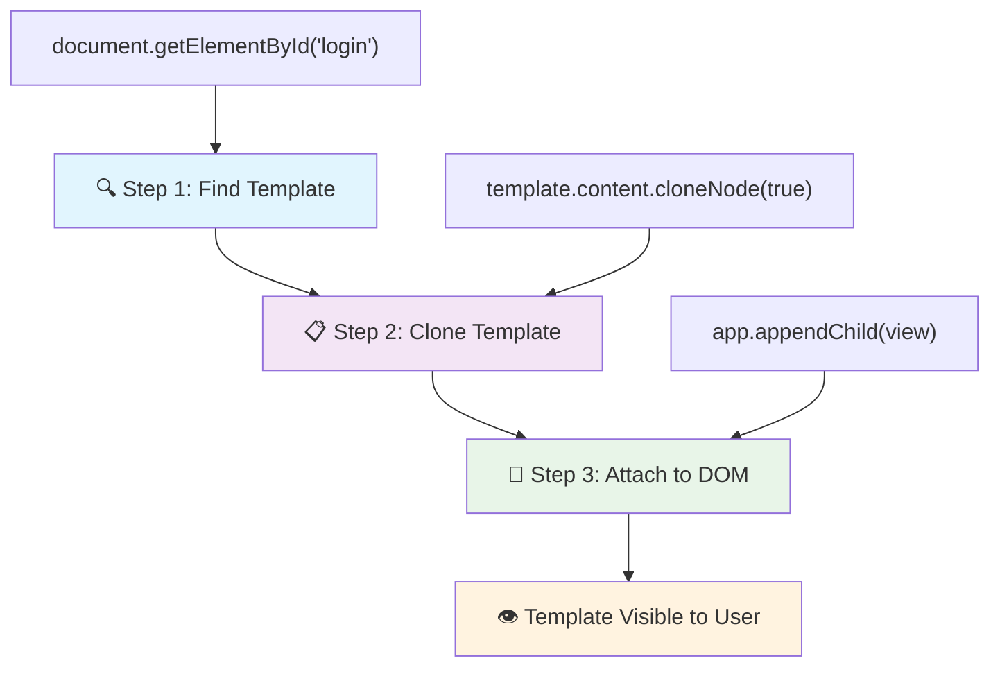
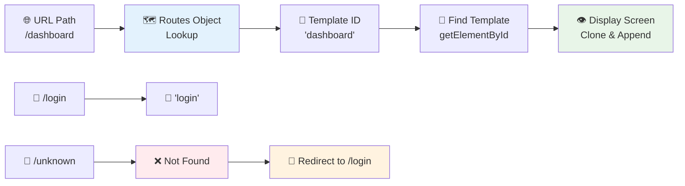
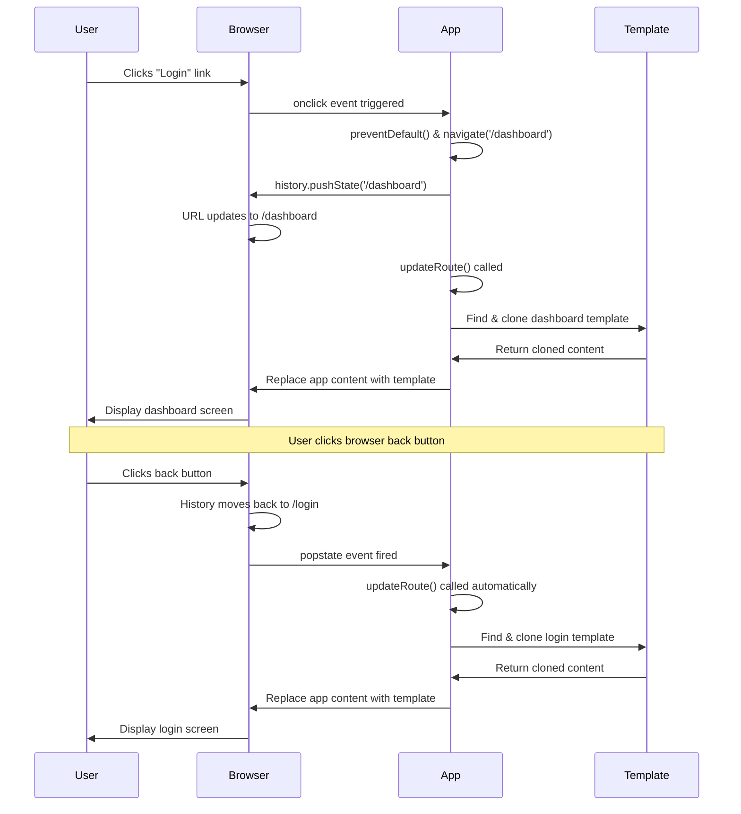
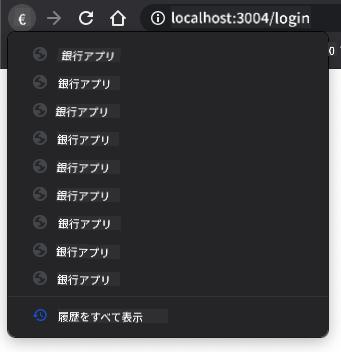

<!--
CO_OP_TRANSLATOR_METADATA:
{
  "original_hash": "5d259f6962464ad91e671083aa0398f4",
  "translation_date": "2025-10-24T15:08:34+00:00",
  "source_file": "7-bank-project/1-template-route/README.md",
  "language_code": "ja"
}
-->
# 銀行アプリを作ろう パート1: WebアプリでのHTMLテンプレートとルート設定

1969年、アポロ11号の誘導コンピュータが月への航行を行った際、システム全体を再起動することなく異なるプログラム間を切り替える必要がありました。現代のWebアプリケーションも同様に動作します。すべてを最初からリロードすることなく、表示内容を変更することで、ユーザーが期待するスムーズで応答性の高い体験を提供します。

従来のウェブサイトが各操作ごとにページ全体をリロードするのに対し、現代のWebアプリは必要な部分だけを更新します。このアプローチは、ミッションコントロールが異なるディスプレイを切り替えながら常に通信を維持する方法に似ており、私たちが期待する流れるような体験を生み出します。

以下がその劇的な違いを示しています：

| 従来のマルチページアプリ | 現代のシングルページアプリ |
|----------------------------|-------------------------|
| **ナビゲーション** | 各画面でページ全体をリロード | コンテンツを瞬時に切り替え |
| **パフォーマンス** | HTML全体のダウンロードで遅い | 部分的な更新で高速 |
| **ユーザー体験** | ページのちらつきが目立つ | スムーズでアプリのような遷移 |
| **データ共有** | ページ間での共有が困難 | 状態管理が容易 |
| **開発** | 複数のHTMLファイルを管理 | 動的テンプレートを持つ単一HTML |

**進化の理解:**
- **従来のアプリ**はナビゲーションごとにサーバーリクエストが必要
- **現代のSPA**は一度ロードし、JavaScriptを使って動的にコンテンツを更新
- **ユーザーの期待**は瞬時でシームレスな操作を好む
- **パフォーマンスの利点**は帯域幅の削減と応答速度の向上

このレッスンでは、複数の画面がシームレスに流れる銀行アプリを構築します。科学者が異なる実験のために再構成可能なモジュール式の機器を使用するように、必要に応じて表示できる再利用可能なコンポーネントとしてHTMLテンプレートを使用します。

HTMLテンプレート（異なる画面の再利用可能な設計図）、JavaScriptルーティング（画面を切り替えるシステム）、ブラウザの履歴API（戻るボタンが期待通りに動作するようにする）を使用します。これらはReact、Vue、Angularなどのフレームワークで使用される基本的な技術と同じです。

最終的には、プロフェッショナルなシングルページアプリケーションの原則を示す銀行アプリが完成します。

## レクチャー前のクイズ

[レクチャー前のクイズ](https://ff-quizzes.netlify.app/web/quiz/41)

### 必要なもの

銀行アプリをテストするためにローカルWebサーバーが必要です。心配しないでください、簡単です！まだセットアップしていない場合は、[Node.js](https://nodejs.org)をインストールし、プロジェクトフォルダで`npx lite-server`を実行してください。この便利なコマンドでローカルサーバーが起動し、ブラウザでアプリが自動的に開きます。

### 準備

コンピュータ上で`bank`という名前のフォルダを作成し、その中に`index.html`という名前のファイルを作成してください。以下のHTML [ボイラープレート](https://en.wikipedia.org/wiki/Boilerplate_code)から始めます：

```html
<!DOCTYPE html>
<html lang="en">
  <head>
    <meta charset="UTF-8">
    <meta name="viewport" content="width=device-width, initial-scale=1.0">
    <title>Bank App</title>
  </head>
  <body>
    <!-- This is where you'll work -->
  </body>
</html>
```

**このボイラープレートが提供するもの:**
- **HTML5ドキュメント構造**を適切なDOCTYPE宣言で確立
- **文字エンコーディング**をUTF-8に設定し、国際的なテキストをサポート
- **レスポンシブデザイン**をモバイル対応のためのviewportメタタグで有効化
- **ブラウザタブに表示される説明的なタイトル**を設定
- **アプリケーションを構築するためのクリーンなボディセクション**を作成

> 📁 **プロジェクト構造のプレビュー**
> 
> **このレッスンの終わりまでに、プロジェクトには以下が含まれます:**
> ```
> bank/
> ├── index.html      <!-- Main HTML with templates -->
> ├── app.js          <!-- Routing and navigation logic -->
> └── style.css       <!-- (Optional for future lessons) -->
> ```
> 
> **ファイルの役割:**
> - **index.html**: すべてのテンプレートを含み、アプリの構造を提供
> - **app.js**: ルーティング、ナビゲーション、テンプレート管理を担当
> - **テンプレート**: ログイン、ダッシュボード、その他の画面のUIを定義

---

## HTMLテンプレート

テンプレートはWeb開発における基本的な問題を解決します。1440年代にグーテンベルクが活版印刷を発明した際、ページ全体を彫るのではなく、再利用可能な文字ブロックを作成し、それを必要に応じて配置することに気づきました。HTMLテンプレートも同じ原理で動作します。各画面のために個別のHTMLファイルを作成する代わりに、再利用可能な構造を定義し、必要に応じて表示します。

テンプレートはアプリの異なる部分の設計図のようなものです。建築家が1つの設計図を作成し、同じ部屋を何度も描き直すのではなくそれを何度も使用するように、テンプレートを一度作成し、必要に応じてインスタンス化します。ブラウザはこれらのテンプレートをJavaScriptがアクティブ化するまで非表示にします。

Webページに複数の画面を作成したい場合、1つの解決策は表示したい画面ごとに1つのHTMLファイルを作成することです。しかし、この方法にはいくつかの不便があります：

- 画面を切り替える際にHTML全体をリロードする必要があり、これが遅くなる原因となります。
- 異なる画面間でデータを共有するのが難しいです。

別のアプローチとして、1つのHTMLファイルだけを使用し、複数の[HTMLテンプレート](https://developer.mozilla.org/docs/Web/HTML/Element/template)を`<template>`要素を使って定義する方法があります。テンプレートは再利用可能なHTMLブロックで、ブラウザによって表示されず、JavaScriptを使用して実行時にインスタンス化する必要があります。

### 作ってみよう

ログインページとダッシュボードの2つの主要な画面を持つ銀行アプリを作成します。まず、HTMLボディにプレースホルダー要素を追加します。ここに異なる画面が表示されます：

```html
<div id="app">Loading...</div>
```

**このプレースホルダーの理解:**
- **ID "app"**を持つコンテナを作成し、すべての画面を表示
- **JavaScriptが最初の画面を初期化するまで**ローディングメッセージを表示
- **動的コンテンツの単一のマウントポイント**を提供
- **`document.getElementById()`を使用してJavaScriptから簡単にターゲット可能**

> 💡 **プロのヒント**: この要素の内容は置き換えられるため、アプリがロード中に表示されるローディングメッセージやインジケーターを入れることができます。

次に、ログインページのHTMLテンプレートを追加します。ここではタイトルとナビゲーション用のリンクを含むセクションを追加します。

```html
<template id="login">
  <h1>Bank App</h1>
  <section>
    <a href="/dashboard">Login</a>
  </section>
</template>
```

**このログインテンプレートの分解:**
- **JavaScriptでターゲットにするための**ユニークな識別子"login"を持つテンプレートを定義
- **アプリのブランドを確立する**メインヘッディングを含む
- **関連するコンテンツをグループ化する**セマンティックな`<section>`要素を含む
- **ユーザーをダッシュボードにルートする**ナビゲーションリンクを提供

次に、ダッシュボードページのHTMLテンプレートを追加します。このページには以下のセクションが含まれます：

- タイトルとログアウトリンクを含むヘッダー
- 銀行口座の現在の残高
- 取引履歴を表示するテーブル

```html
<template id="dashboard">
  <header>
    <h1>Bank App</h1>
    <a href="/login">Logout</a>
  </header>
  <section>
    Balance: 100$
  </section>
  <section>
    <h2>Transactions</h2>
    <table>
      <thead>
        <tr>
          <th>Date</th>
          <th>Object</th>
          <th>Amount</th>
        </tr>
      </thead>
      <tbody></tbody>
    </table>
  </section>
</template>
```

**ダッシュボードの各部分を理解する:**
- **セマンティックな`<header>`要素**でページを構造化し、ナビゲーションを含む
- **画面間で一貫してアプリタイトルを表示**し、ブランドを確立
- **ログアウトリンクを提供**し、ログイン画面に戻るルートを設定
- **専用セクションで現在の口座残高を表示**
- **適切に構造化されたHTMLテーブルを使用して取引データを整理**
- **日付、項目、金額の列のテーブルヘッダーを定義**
- **テーブルボディを空にして動的コンテンツの挿入を後で可能に**

> 💡 **プロのヒント**: HTMLテンプレートを作成する際、見た目を確認したい場合は、`<template>`と`</template>`行を`<!-- -->`で囲んでコメントアウトすることができます。

✅ なぜテンプレートに`id`属性を使用するのでしょうか？クラスなど他のものを使うことはできるでしょうか？

## JavaScriptでテンプレートを動かす

テンプレートを機能させる必要があります。3Dプリンターがデジタル設計図を物理的なオブジェクトに変えるように、JavaScriptは隠されたテンプレートを可視化し、ユーザーが見て操作できるインタラクティブな要素を作成します。

このプロセスは、現代のWeb開発の基礎を形成する3つの一貫したステップに従います。このパターンを理解すれば、多くのフレームワークやライブラリでそれを認識できるようになります。

現在のHTMLファイルをブラウザで試してみると、`Loading...`の表示で止まってしまいます。これは、HTMLテンプレートをインスタンス化して表示するためのJavaScriptコードを追加する必要があるためです。

テンプレートのインスタンス化は通常以下の3ステップで行われます：

1. DOM内のテンプレート要素を取得します。例えば[`document.getElementById`](https://developer.mozilla.org/docs/Web/API/Document/getElementById)を使用します。
2. テンプレート要素を[`cloneNode`](https://developer.mozilla.org/docs/Web/API/Node/cloneNode)を使って複製します。
3. 可視要素の下にDOMにアタッチします。例えば[`appendChild`](https://developer.mozilla.org/docs/Web/API/Node/appendChild)を使用します。



**プロセスの視覚的な分解:**
- **ステップ1**: DOM構造内の隠されたテンプレートを特定
- **ステップ2**: 安全に変更可能な作業コピーを作成
- **ステップ3**: コピーを可視ページエリアに挿入
- **結果**: ユーザーが操作可能な機能的な画面が完成

✅ なぜテンプレートをDOMにアタッチする前に複製する必要があるのでしょうか？このステップを省略した場合、何が起こると思いますか？

### タスク

プロジェクトフォルダに`app.js`という名前の新しいファイルを作成し、そのファイルをHTMLの`<head>`セクションにインポートします：

```html
<script src="app.js" defer></script>
```

**このスクリプトインポートの理解:**
- **JavaScriptファイルをHTMLドキュメントにリンク**
- **`defer`属性を使用してスクリプトがHTML解析後に実行されるようにする**
- **スクリプト実行前にDOM要素が完全にロードされることを保証**
- **スクリプトのロードとパフォーマンスに関する最新のベストプラクティスに従う**

次に`app.js`で新しい関数`updateRoute`を作成します：

```js
function updateRoute(templateId) {
  const template = document.getElementById(templateId);
  const view = template.content.cloneNode(true);
  const app = document.getElementById('app');
  app.innerHTML = '';
  app.appendChild(view);
}
```

**ステップごとの説明:**
- **ユニークなIDを使用してテンプレート要素を特定**
- **`cloneNode(true)`を使用してテンプレートの内容を深くコピー**
- **コンテンツが表示されるアプリコンテナを特定**
- **アプリコンテナから既存のコンテンツをクリア**
- **複製したテンプレートコンテンツを可視DOMに挿入**

次に、この関数をテンプレートの1つで呼び出し、結果を確認してください。

```js
updateRoute('login');
```

**この関数呼び出しが達成すること:**
- **ログインテンプレートをアクティブ化し、そのIDをパラメータとして渡す**
- **異なるアプリ画面間をプログラムで切り替える方法を示す**
- **"Loading..."メッセージの代わりにログイン画面を表示**

✅ このコード`app.innerHTML = '';`の目的は何でしょうか？これがないとどうなるでしょうか？

## ルートの作成

ルーティングはURLを適切なコンテンツに接続することです。初期の電話交換手がスイッチボードを使って通話を接続していたように、WebルーティングはURLリクエストを受け取り、どのコンテンツを表示するかを決定します。

従来は、Webサーバーが異なるURLに対して異なるHTMLファイルを提供することでこれを処理していました。私たちはシングルページアプリを構築しているため、JavaScriptを使ってこのルーティングを自分で処理する必要があります。このアプローチにより、ユーザー体験とパフォーマンスをより細かく制御できます。



**ルーティングフローの理解:**
- **URLの変更**がルート設定の検索をトリガー
- **有効なルート**が特定のテンプレートIDにマッピングされる
- **無効なルート**がフォールバック動作をトリガーし、壊れた状態を防止
- **テンプレートのレンダリング**は前述の3ステッププロセスに従う

Webアプリについて話す際、*ルーティング*とは**URL**を表示すべき特定の画面にマッピングする意図を指します。複数のHTMLファイルを持つウェブサイトでは、ファイルパスがURLに反映されるため、これが自動的に行われます。例えば、プロジェクトフォルダに以下のファイルがある場合：

```
mywebsite/index.html
mywebsite/login.html
mywebsite/admin/index.html
```

`mywebsite`をルートとしてWebサーバーを作成すると、URLマッピングは以下のようになります：

```
https://site.com            --> mywebsite/index.html
https://site.com/login.html --> mywebsite/login.html
https://site.com/admin/     --> mywebsite/admin/index.html
```

しかし、私たちのWebアプリではすべての画面を含む単一のHTMLファイルを使用しているため、このデフォルトの動作は役に立ちません。このマッピングを手動で作成し、JavaScriptを使用して表示されるテンプレートを更新する必要があります。

### タスク

URLパスとテンプレートを[マップ](https://en.wikipedia.org/wiki/Associative_array)するためにシンプルなオブジェクトを使用します。このオブジェクトを`app.js`ファイルの冒頭に追加してください。

```js
const routes = {
  '/login': { templateId: 'login' },
  '/dashboard': { templateId: 'dashboard' },
};
```

**このルート設定の理解:**
- **URLパスとテンプレート識別子の間のマッピングを定義**
- **キーがURLパスで値がテンプレート情報を含むオブジェクト構文を使用**
- **任意のURLに対して表示すべきテンプレートを簡単に検索可能**
- **将来のルート追加に対応可能なスケーラブルな構造を提供**

次に、`updateRoute`関数を少し修正します。`templateId`を直接引数として渡す代わりに、まず現在のURLを確認し、次にマップを使用して対応するテンプレートID値を取得します。ブラウザのURLからパスセクションだけを取得するには[`window.location.pathname`](https://developer.mozilla.org/docs/Web/API/Location/pathname)を使用できます。

```js
function updateRoute() {
  const path = window.location.pathname;
  const route = routes[path];

  const template = document.getElementById(route.templateId);
  const view = template.content.cloneNode(true);
  const app = document.getElementById('app');
  app.innerHTML = '';
  app.appendChild(view);
}
```

**ここで何が
✅ URLに未知のパスを入力するとどうなるでしょうか？どうすれば解決できるでしょうか？

## ナビゲーションの追加

ルーティングが設定されたら、ユーザーがアプリ内を移動する方法を提供する必要があります。従来のウェブサイトではリンクをクリックするとページ全体がリロードされますが、私たちはURLとコンテンツをページをリロードせずに更新したいと考えています。これにより、デスクトップアプリケーションが異なるビュー間を切り替えるようなスムーズな体験が得られます。

これを実現するには、ブラウザのURLを更新してユーザーがページをブックマークしたりリンクを共有できるようにすることと、適切なコンテンツを表示することを調整する必要があります。正しく実装すれば、現代のアプリケーションに期待されるシームレスなナビゲーションが実現します。

> 🏗️ **アーキテクチャの洞察**: ナビゲーションシステムの構成要素
>
> **構築するもの:**
> - **🔄 URL管理**: ページをリロードせずにブラウザのアドレスバーを更新
> - **📋 テンプレートシステム**: 現在のルートに基づいてコンテンツを動的に切り替え  
> - **📚 履歴統合**: ブラウザの戻る/進むボタンの機能を維持
> - **🛡️ エラーハンドリング**: 無効または欠落したルートに対する優雅なフォールバック
>
> **コンポーネントの連携方法:**
> - ナビゲーションイベント（クリックや履歴変更）を**監視**
> - History APIを使用してURLを**更新**
> - 新しいルートに適したテンプレートを**レンダリング**
> - シームレスなユーザー体験を**維持**

次のステップは、URLを手動で変更することなくページ間を移動できるようにすることです。これには以下の2つが含まれます：

1. 現在のURLを更新すること
2. 新しいURLに基づいて表示されるテンプレートを更新すること

2番目の部分はすでに`updateRoute`関数で対応済みなので、現在のURLを更新する方法を考える必要があります。

JavaScript、特に[`history.pushState`](https://developer.mozilla.org/docs/Web/API/History/pushState)を使用する必要があります。このメソッドはHTMLをリロードせずにURLを更新し、ブラウザ履歴に新しいエントリを作成することができます。

> ⚠️ **重要な注意点**: HTMLアンカー要素[`<a href>`](https://developer.mozilla.org/docs/Web/HTML/Element/a)は単独で異なるURLへのハイパーリンクを作成できますが、デフォルトではブラウザがHTMLをリロードしてしまいます。カスタムJavaScriptでルーティングを処理する際には、クリックイベントで`preventDefault()`関数を使用してこの動作を防ぐ必要があります。

### タスク

アプリ内でナビゲートするための新しい関数を作成しましょう：

```js
function navigate(path) {
  window.history.pushState({}, path, path);
  updateRoute();
}
```

**このナビゲーション関数の理解:**
- `history.pushState`を使用してブラウザのURLを新しいパスに**更新**
- 戻る/進むボタンの適切なサポートのためにブラウザの履歴スタックに新しいエントリを**追加**
- 対応するテンプレートを表示するために`updateRoute()`関数を**トリガー**
- ページリロードなしでシングルページアプリケーションの体験を**維持**

このメソッドはまず与えられたパスに基づいて現在のURLを更新し、その後テンプレートを更新します。`window.location.origin`プロパティはURLのルートを返し、与えられたパスから完全なURLを再構築することができます。

この関数ができたので、定義されたルートに一致しないパスがある場合の問題に対処できます。`updateRoute`関数を修正し、一致するルートが見つからない場合に既存のルートの1つにフォールバックするようにします。

```js
function updateRoute() {
  const path = window.location.pathname;
  const route = routes[path];

  if (!route) {
    return navigate('/login');
  }

  const template = document.getElementById(route.templateId);
  const view = template.content.cloneNode(true);
  const app = document.getElementById('app');
  app.innerHTML = '';
  app.appendChild(view);
}
```

**覚えておくべき重要なポイント:**
- 現在のパスに対してルートが存在するかどうかを**確認**
- 無効なルートにアクセスした場合にログインページに**リダイレクト**
- 壊れたナビゲーションを防ぐフォールバックメカニズムを**提供**
- 不正なURLでもユーザーが常に有効な画面を見ることを**保証**

ルートが見つからない場合、`login`ページにリダイレクトするようになります。

次に、リンクがクリックされたときにURLを取得し、ブラウザのデフォルトのリンク動作を防ぐ関数を作成しましょう：

```js
function onLinkClick(event) {
  event.preventDefault();
  navigate(event.target.href);
}
```

**このクリックハンドラーの分解:**
- `preventDefault()`を使用してブラウザのデフォルトのリンク動作を**防止**
- クリックされたリンク要素から目的のURLを**抽出**
- ページをリロードする代わりにカスタムナビゲート関数を**呼び出し**
- スムーズなシングルページアプリケーション体験を**維持**

```html
<a href="/dashboard" onclick="onLinkClick(event)">Login</a>
...
<a href="/login" onclick="onLinkClick(event)">Logout</a>
```

**このonclickバインディングが達成すること:**
- 各リンクをカスタムナビゲーションシステムに**接続**
- クリックイベントを処理するために`onLinkClick`関数に**渡す**
- ページリロードなしでスムーズなナビゲーションを**実現**
- ユーザーがブックマークや共有できる適切なURL構造を**維持**

[`onclick`](https://developer.mozilla.org/docs/Web/API/GlobalEventHandlers/onclick)属性は`click`イベントをJavaScriptコードにバインドします。ここでは`navigate()`関数の呼び出しに使用されています。

これらのリンクをクリックしてみてください。アプリの異なる画面間をナビゲートできるはずです。

✅ `history.pushState`メソッドはHTML5標準の一部であり、[すべての最新ブラウザ](https://caniuse.com/?search=pushState)で実装されています。古いブラウザ向けにウェブアプリを構築する場合、このAPIの代わりに使えるトリックがあります。パスの前に[ハッシュ（`#`）](https://en.wikipedia.org/wiki/URI_fragment)を使用することで、通常のアンカーナビゲーションで動作し、ページをリロードしないルーティングを実装できます。これは元々ページ内リンクを作成する目的で使用されていました。

## 戻るボタンと進むボタンを機能させる

戻るボタンと進むボタンはウェブブラウジングにおいて基本的な機能であり、NASAのミッションコントローラーが以前のシステム状態をレビューするようなものです。ユーザーはこれらのボタンが機能することを期待しており、機能しない場合は期待されるブラウジング体験が壊れてしまいます。

私たちのシングルページアプリはこれをサポートするために追加の設定が必要です。ブラウザは履歴スタックを維持しています（`history.pushState`で追加してきました）が、ユーザーがこの履歴をナビゲートするとき、アプリはそれに応じて表示されるコンテンツを更新する必要があります。



**重要なインタラクションポイント:**
- ユーザーの操作がクリックやブラウザボタンを通じてナビゲーションを**トリガー**
- アプリがリンククリックをインターセプトしてページリロードを**防止**
- History APIがURL変更とブラウザ履歴スタックを**管理**
- テンプレートが各画面のコンテンツ構造を**提供**
- イベントリスナーがすべてのナビゲーションタイプに応答することを**保証**

`history.pushState`を使用するとブラウザのナビゲーション履歴に新しいエントリが作成されます。ブラウザの*戻るボタン*を押し続けると、次のような履歴が表示されるはずです：



戻るボタンを数回クリックしてみると、現在のURLが変更され履歴が更新されますが、同じテンプレートが表示され続けます。

これは、履歴が変更されるたびに`updateRoute()`を呼び出す必要があることをアプリが認識していないためです。[`history.pushState`のドキュメント](https://developer.mozilla.org/docs/Web/API/History/pushState)を見ると、状態が変更された場合（つまり異なるURLに移動した場合）、[`popstate`](https://developer.mozilla.org/docs/Web/API/Window/popstate_event)イベントがトリガーされることがわかります。このイベントを使用して問題を修正します。

### タスク

ブラウザ履歴が変更されたときに表示されるテンプレートが更新されるようにするため、`updateRoute()`を呼び出す新しい関数を`app.js`ファイルの末尾に追加します：

```js
window.onpopstate = () => updateRoute();
updateRoute();
```

**この履歴統合の理解:**
- ユーザーがブラウザボタンでナビゲートするときに発生する`popstate`イベントを**監視**
- 簡潔なイベントハンドラー構文のためにアロー関数を**使用**
- 履歴状態が変更されるたびに自動的に`updateRoute()`を**呼び出し**
- ページが最初に読み込まれたときに`updateRoute()`を**初期化**
- ユーザーがどのようにナビゲートしても正しいテンプレートが表示されることを**保証**

> 💡 **プロのヒント**: ここでは簡潔さのためにアロー関数を使用して`popstate`イベントハンドラーを宣言しましたが、通常の関数でも同じように動作します。

アロー関数に関するリフレッシュ動画はこちら：

[](https://youtube.com/watch?v=OP6eEbOj2sc "アロー関数")

> 🎥 上の画像をクリックしてアロー関数についての動画をご覧ください。

ブラウザの戻るボタンと進むボタンを使用してみて、表示されるルートが正しく更新されることを確認してください。

---

## GitHub Copilot Agent チャレンジ 🚀

Agentモードを使用して以下のチャレンジを完了してください：

**説明:** 無効なルートに移動した際のエラーハンドリングと404ページテンプレートを実装し、ユーザー体験を向上させましょう。

**プロンプト:** スタイリングされたユーザーフレンドリーな404エラーページを表示するHTMLテンプレート（id: "not-found"）を作成してください。その後、JavaScriptのルーティングロジックを修正して、ユーザーが無効なURLに移動した際にこのテンプレートを表示し、「ホームに戻る」ボタンを追加してログインページに戻れるようにしてください。

Agentモードについての詳細は[こちら](https://code.visualstudio.com/blogs/2025/02/24/introducing-copilot-agent-mode)をご覧ください。

## 🚀 チャレンジ

このアプリのクレジットを表示する第3のページ用のテンプレートとルートを追加してください。

**チャレンジ目標:**
- 適切なコンテンツ構造を持つ新しいHTMLテンプレートを**作成**
- ルート構成オブジェクトに新しいルートを**追加**
- クレジットページへのナビゲーションリンクを**含める**
- ブラウザ履歴を使用してすべてのナビゲーションが正しく動作することを**テスト**

## 講義後のクイズ

[講義後のクイズ](https://ff-quizzes.netlify.app/web/quiz/42)

## 復習と自己学習

ルーティングはウェブ開発の中で意外と難しい部分の一つであり、ウェブがページリロードの動作からシングルページアプリケーションの動作に移行するにつれてさらに複雑になります。[Azure Static Web Appサービス](https://docs.microsoft.com/azure/static-web-apps/routes/?WT.mc_id=academic-77807-sagibbon)がルーティングをどのように処理しているかについて少し読んでみてください。このドキュメントで説明されているいくつかの決定がなぜ必要なのか説明できますか？

**追加の学習リソース:**
- React RouterやVue Routerなどの人気フレームワークがクライアントサイドルーティングをどのように実装しているかを**探る**
- ハッシュベースのルーティングとHistory APIルーティングの違いを**調査**
- サーバーサイドレンダリング（SSR）がルーティング戦略にどのように影響するかを**学ぶ**
- プログレッシブウェブアプリ（PWA）がルーティングとナビゲーションをどのように処理しているかを**調査**

## 課題

[ルーティングを改善する](assignment.md)

---

**免責事項**:  
この文書はAI翻訳サービス[Co-op Translator](https://github.com/Azure/co-op-translator)を使用して翻訳されています。正確性を追求しておりますが、自動翻訳には誤りや不正確な部分が含まれる可能性があります。元の言語で記載された文書を正式な情報源としてご参照ください。重要な情報については、専門の人間による翻訳を推奨します。この翻訳の使用に起因する誤解や誤認について、当方は一切の責任を負いません。