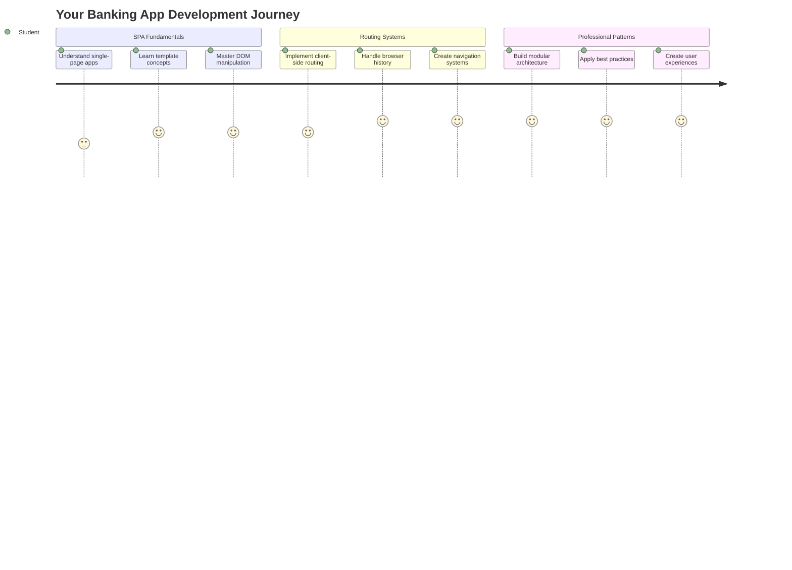
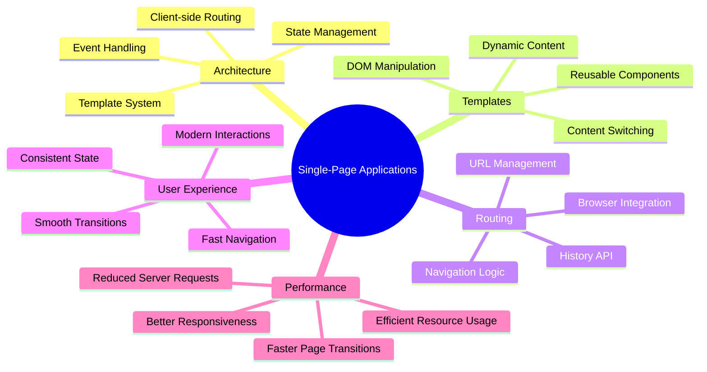
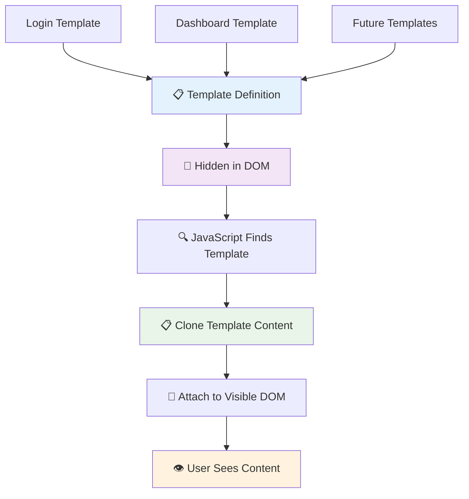
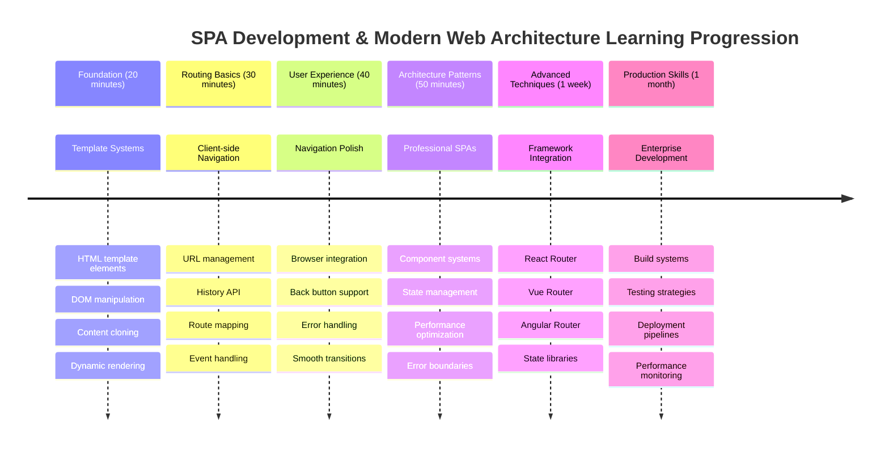

<!--
CO_OP_TRANSLATOR_METADATA:
{
  "original_hash": "351678bece18f07d9daa987a881fb062",
  "translation_date": "2025-11-06T12:55:02+00:00",
  "source_file": "7-bank-project/1-template-route/README.md",
  "language_code": "ja"
}
-->
# 銀行アプリを作成する Part 1: WebアプリでのHTMLテンプレートとルート



1969年、アポロ11号の誘導コンピュータが月への航行を行った際、システム全体を再起動することなく異なるプログラム間を切り替える必要がありました。現代のウェブアプリケーションも同様に動作します。すべてを最初からリロードすることなく、表示内容を変更することで、スムーズで応答性の高いユーザー体験を提供します。

従来のウェブサイトが各操作ごとにページ全体をリロードするのに対し、現代のウェブアプリは必要な部分だけを更新します。このアプローチは、ミッションコントロールが異なるディスプレイを切り替えながら常に通信を維持する方法に似ており、私たちが期待する流れるような体験を生み出します。

以下がその劇的な違いを生むポイントです：

| 従来のマルチページアプリ | 現代のシングルページアプリ |
|----------------------------|-------------------------|
| **ナビゲーション** | 各画面でページ全体をリロード | コンテンツの即時切り替え |
| **パフォーマンス** | HTML全体のダウンロードで遅い | 部分的な更新で高速 |
| **ユーザー体験** | ページのちらつきが目立つ | スムーズでアプリのような遷移 |
| **データ共有** | ページ間での共有が困難 | 状態管理が容易 |
| **開発** | 複数のHTMLファイルを管理 | 動的テンプレートを持つ単一HTML |

**進化の理解:**
- **従来のアプリ**はナビゲーションごとにサーバーリクエストが必要
- **現代のSPA**は一度ロードし、JavaScriptを使って動的にコンテンツを更新
- **ユーザーの期待**は、瞬時でシームレスな操作を好む
- **パフォーマンスの利点**は、帯域幅の削減と応答速度の向上

このレッスンでは、複数の画面がシームレスに連携する銀行アプリを作成します。科学者が異なる実験のために再構成可能なモジュール式の機器を使用するように、必要に応じて表示できる再利用可能なコンポーネントとしてHTMLテンプレートを使用します。

HTMLテンプレート（異なる画面の再利用可能な設計図）、JavaScriptルーティング（画面を切り替えるシステム）、ブラウザの履歴API（戻るボタンが期待通りに動作するようにする）を使用します。これらはReact、Vue、Angularなどのフレームワークで使用される基本的な技術と同じです。

最終的には、プロフェッショナルなシングルページアプリケーションの原則を示す銀行アプリが完成します。



## レクチャー前のクイズ

[レクチャー前のクイズ](https://ff-quizzes.netlify.app/web/quiz/41)

### 必要なもの

銀行アプリをテストするためにローカルウェブサーバーが必要です。心配しないでください、意外と簡単です！まだセットアップしていない場合は、[Node.js](https://nodejs.org)をインストールしてプロジェクトフォルダで`npx lite-server`を実行してください。この便利なコマンドはローカルサーバーを起動し、ブラウザでアプリを自動的に開きます。

### 準備

コンピュータ上で`bank`という名前のフォルダを作成し、その中に`index.html`という名前のファイルを作成します。このHTML [ボイラープレート](https://en.wikipedia.org/wiki/Boilerplate_code)から始めます：

```html
<!DOCTYPE html>
<html lang="en">
  <head>
    <meta charset="UTF-8">
    <meta name="viewport" content="width=device-width, initial-scale=1.0">
    <title>Bank App</title>
  </head>
  <body>
    <!-- This is where you'll work -->
  </body>
</html>
```

**このボイラープレートが提供するもの:**
- **HTML5文書構造**を適切なDOCTYPE宣言で確立
- **文字エンコーディング**をUTF-8に設定し、国際的なテキストをサポート
- **レスポンシブデザイン**をモバイル互換性のためにビューポートメタタグで有効化
- **ブラウザタブに表示される説明的なタイトル**を設定
- **アプリケーションを構築するためのクリーンなボディセクション**を作成

> 📁 **プロジェクト構造のプレビュー**
> 
> **このレッスンの終わりまでに、プロジェクトには以下が含まれます:**
> ```
> bank/
> ├── index.html      <!-- Main HTML with templates -->
> ├── app.js          <!-- Routing and navigation logic -->
> └── style.css       <!-- (Optional for future lessons) -->
> ```
> 
> **ファイルの役割:**
> - **index.html**: すべてのテンプレートを含み、アプリの構造を提供
> - **app.js**: ルーティング、ナビゲーション、テンプレート管理を処理
> - **テンプレート**: ログイン、ダッシュボード、その他の画面のUIを定義

---

## HTMLテンプレート

テンプレートはウェブ開発における基本的な問題を解決します。1440年代にグーテンベルクが活版印刷を発明した際、彼はページ全体を彫る代わりに再利用可能な文字ブロックを作成し、必要に応じて配置できることに気付きました。HTMLテンプレートも同じ原理で動作します。各画面ごとに別々のHTMLファイルを作成する代わりに、再利用可能な構造を定義し、必要に応じて表示します。



テンプレートはアプリの異なる部分の設計図のようなものです。建築家が一つの設計図を作成し、同じ部屋を何度も描き直すのではなくそれを何度も使用するように、テンプレートを一度作成し、必要に応じてインスタンス化します。ブラウザはこれらのテンプレートをJavaScriptがアクティブ化するまで非表示にします。

ウェブページに複数の画面を作成したい場合、一つの解決策は表示したい画面ごとに一つのHTMLファイルを作成することです。しかし、この方法にはいくつかの不便があります：

- 画面を切り替えるたびにHTML全体をリロードする必要があり、これが遅くなる原因となります。
- 異なる画面間でデータを共有するのが難しいです。

別のアプローチとして、一つのHTMLファイルだけを使用し、`<template>`要素を使って複数の[HTMLテンプレート](https://developer.mozilla.org/docs/Web/HTML/Element/template)を定義する方法があります。テンプレートは再利用可能なHTMLブロックであり、ブラウザによって表示されず、JavaScriptを使用して実行時にインスタンス化する必要があります。

### 作成してみましょう

ログインページとダッシュボードの2つの主要な画面を持つ銀行アプリを作成します。まず、HTMLボディにプレースホルダー要素を追加します。ここに異なる画面がすべて表示されます：

```html
<div id="app">Loading...</div>
```

**このプレースホルダーの理解:**
- **ID "app"**を持つコンテナを作成し、すべての画面を表示
- **JavaScriptが最初の画面を初期化するまで**、読み込みメッセージを表示
- **動的コンテンツの単一のマウントポイント**を提供
- **`document.getElementById()`を使用してJavaScriptから簡単にターゲット可能**

> 💡 **プロのヒント**: この要素の内容は置き換えられるため、アプリが読み込まれる間に表示される読み込みメッセージやインジケーターを入れることができます。

次に、ログインページのHTMLテンプレートを追加します。ここではタイトルとナビゲーションを行うリンクを含むセクションを追加します。

```html
<template id="login">
  <h1>Bank App</h1>
  <section>
    <a href="/dashboard">Login</a>
  </section>
</template>
```

**このログインテンプレートの分解:**
- **JavaScriptでターゲットにするためのユニークな識別子 "login"** を持つテンプレートを定義
- **アプリのブランドを確立するメインヘッディング**を含む
- **関連するコンテンツをグループ化するセマンティックな`<section>`要素**を含む
- **ユーザーをダッシュボードにルーティングするナビゲーションリンク**を提供

次に、ダッシュボードページのHTMLテンプレートを追加します。このページには以下のセクションが含まれます：

- タイトルとログアウトリンクを含むヘッダー
- 銀行口座の現在の残高
- 表形式で表示される取引のリスト

```html
<template id="dashboard">
  <header>
    <h1>Bank App</h1>
    <a href="/login">Logout</a>
  </header>
  <section>
    Balance: 100$
  </section>
  <section>
    <h2>Transactions</h2>
    <table>
      <thead>
        <tr>
          <th>Date</th>
          <th>Object</th>
          <th>Amount</th>
        </tr>
      </thead>
      <tbody></tbody>
    </table>
  </section>
</template>
```

**このダッシュボードの各部分を理解する:**
- **ナビゲーションを含むセマンティックな`<header>`要素でページを構造化**
- **画面全体で一貫してアプリタイトルを表示し、ブランドを確立**
- **ログイン画面に戻るログアウトリンクを提供**
- **専用セクションで現在の口座残高を表示**
- **適切に構造化されたHTMLテーブルを使用して取引データを整理**
- **日付、オブジェクト、金額の列のテーブルヘッダーを定義**
- **後で動的コンテンツを挿入するためにテーブルボディを空にしておく**

> 💡 **プロのヒント**: HTMLテンプレートを作成する際、どのように見えるか確認したい場合は、`<template>`と`</template>`行を`<!-- -->`で囲んでコメントアウトすることができます。

### 🔄 **教育的チェックイン**
**テンプレートシステムの理解**: JavaScriptを実装する前に以下を確認してください：
- ✅ テンプレートが通常のHTML要素とどう異なるか
- ✅ テンプレートがJavaScriptによってアクティブ化されるまで非表示である理由
- ✅ テンプレート内のセマンティックHTML構造の重要性
- ✅ テンプレートが再利用可能なUIコンポーネントを可能にする方法

**簡単な自己テスト**: HTMLから`<template>`タグを削除するとどうなるでしょうか？
*答え: コンテンツがすぐに表示され、テンプレート機能を失います*

**アーキテクチャの利点**: テンプレートは以下を提供します：
- **再利用性**: 一度定義すれば複数回使用可能
- **パフォーマンス**: 冗長なHTML解析が不要
- **保守性**: UI構造の集中管理
- **柔軟性**: 動的なコンテンツ切り替え

✅ なぜテンプレートに`id`属性を使用するのでしょうか？クラスなど他のものを使用することは可能でしょうか？

## JavaScriptでテンプレートを動かす

次にテンプレートを機能させる必要があります。3Dプリンターがデジタル設計図を物理的なオブジェクトに変えるように、JavaScriptは非表示のテンプレートを可視化し、ユーザーが見て使用できるインタラクティブな要素を作成します。

このプロセスは現代のウェブ開発の基礎を形成する3つの一貫したステップに従います。このパターンを理解すれば、多くのフレームワークやライブラリでそれを認識できるようになります。

現在のHTMLファイルをブラウザで試してみると、`Loading...`の表示で止まってしまいます。これはHTMLテンプレートをインスタンス化して表示するためのJavaScriptコードを追加する必要があるためです。

テンプレートのインスタンス化は通常以下の3ステップで行われます：

1. DOM内のテンプレート要素を取得します。例えば[`document.getElementById`](https://developer.mozilla.org/docs/Web/API/Document/getElementById)を使用します。
2. テンプレート要素を[`cloneNode`](https://developer.mozilla.org/docs/Web/API/Node/cloneNode)を使って複製します。
3. 可視要素の下にDOMにアタッチします。例えば[`appendChild`](https://developer.mozilla.org/docs/Web/API/Node/appendChild)を使用します。


**プロセスの視覚的な分解:**
- **ステップ1**: DOM構造内の非表示テンプレートを特定
- **ステップ2**: 安全に変更可能な作業コピーを作成
- **ステップ3**: コピーを可視ページ領域に挿入
- **結果**: ユーザーが操作可能な機能的な画面が表示される

✅ なぜテンプレートをDOMにアタッチする前に複製する必要があるのでしょうか？このステップを省略するとどうなると思いますか？

### タスク

プロジェクトフォルダに`app.js`という名前の新しいファイルを作成し、そのファイルをHTMLの`<head>`セクションにインポートします：

```html
<script src="app.js" defer></script>
```

**このスクリプトインポートの理解:**
- **JavaScriptファイルをHTML文書にリンク**
- **`defer`属性を使用してスクリプトがHTML解析後に実行されるようにする**
- **スクリプト実行前にすべてのDOM要素にアクセス可能**
- **スクリプトの読み込みとパフォーマンスに関する最新のベストプラクティスに従う**

次に`app.js`で新しい関数`updateRoute`を作成します：

```js
function updateRoute(templateId) {
  const template = document.getElementById(templateId);
  const view = template.content.cloneNode(true);
  const app = document.getElementById('app');
  app.innerHTML = '';
  app.appendChild(view);
}
```

**ステップごとの説明:**
- **ユニークIDを使用してテンプレート要素を特定**
- **`cloneNode(true)`を使用してテンプレートの内容を深くコピー**
- **コンテンツを表示するアプリコンテナを特定**
- **アプリコンテナ内の既存コンテンツをクリア**
- **複製したテンプレートコンテンツを可視DOMに挿入**

次にこの関数をテンプレートの一つで呼び出し、結果を確認します。

```js
updateRoute('login');
```

**この関数呼び出しが達成すること:**
- **テンプレートIDをパラメータとして渡すことでログインテンプレートをアクティブ化**
- **異なるアプリ画面間をプログラム的に切り替える方法を示す**
- **"Loading..."メッセージの代わりにログイン画面を表示**

✅ このコード`app.innerHTML = '';`の目的は何でしょうか？これがないとどうなるでしょうか？

## ルートの作成

ルーティングはURLを適切なコンテンツに接続することです。初期の電話交換手がスイッチボードを使って通話を接続したように、ウェブルーティングはURLリクエストを受け取り、どのコンテンツを表示するかを決定します。


従来は、ウェブサーバーが異なるURLに対して異なるHTMLファイルを提供することでこれを処理していました。シングルページアプリを構築しているため、JavaScriptを使ってこのルーティングを自分で処理する必要があります。このアプローチにより、ユーザー体験とパフォーマンスをより細かく制御できます。


**ルーティングフローの理解:**
- **URLの変更**がルート構成の検索をトリガー
- **有効なルート**が特定のテンプレートIDにマッピングされてレンダリングされる
- **無効なルート**がフォールバック動作をトリガーし、壊れた状態を防ぐ
- **テンプレートレンダリング**が前述の3ステッププロセスに従う

ウェブアプリについて話す際、*ルーティング*とは**URL**を表示すべき特定の画面にマッピングする意図を指します。複数のHTMLファイルを持つウェブサイトでは、ファイルパスがURLに反映されるためこれが自動的に行われます。例えば、プロジェクトフォルダに以下のファイルがある場合：

```
mywebsite/index.html
mywebsite/login.html
mywebsite/admin/index.html
```

`mywebsite`をルートとしてウェブサーバーを作成すると、URLマッピングは以下のようになります：

```
https://site.com            --> mywebsite/index.html
https://site.com/login.html --> mywebsite/login.html
https://site.com/admin/     --> mywebsite/admin/index.html
```

しかし、私たちのウェブアプリではすべての画面を含む単一のHTMLファイルを使用しているため、このデフォルトの動作は役に立ちません。このマッピングを手
さて、`updateRoute`関数を少し変更しましょう。`templateId`を直接引数として渡すのではなく、まず現在のURLを確認し、そこから対応するテンプレートIDを取得する方法を採用します。`window.location.pathname`を使用すると、URLのパス部分だけを取得できます。

```js
function updateRoute() {
  const path = window.location.pathname;
  const route = routes[path];

  const template = document.getElementById(route.templateId);
  const view = template.content.cloneNode(true);
  const app = document.getElementById('app');
  app.innerHTML = '';
  app.appendChild(view);
}
```

**ここでの処理の流れ:**
- **抽出**: `window.location.pathname`を使ってブラウザのURLから現在のパスを取得
- **検索**: `routes`オブジェクト内で対応するルート設定を探す
- **取得**: ルート設定からテンプレートIDを取得
- **実行**: 以前と同じテンプレートレンダリングプロセスを実行
- **動的システムの構築**: URLの変更に応じて動作するシステムを作成

ここでは、宣言したルートを対応するテンプレートにマッピングしました。ブラウザでURLを手動で変更して、正しく動作するか試してみてください。

✅ 不明なパスをURLに入力した場合、どうなるでしょうか？これをどのように解決できるでしょうか？

## ナビゲーションの追加

ルーティングが確立されたら、ユーザーがアプリ内を移動する方法を提供する必要があります。従来のウェブサイトではリンクをクリックするとページ全体がリロードされますが、URLとコンテンツをページのリロードなしで更新したいと考えています。これにより、デスクトップアプリケーションが異なるビュー間を切り替えるようなスムーズな体験が得られます。

2つのことを調整する必要があります。ユーザーがページをブックマークしたりリンクを共有できるようにブラウザのURLを更新することと、適切なコンテンツを表示することです。これを正しく実装すると、現代のアプリケーションに期待されるシームレスなナビゲーションが実現します。


### 🔄 **学習の確認**
**シングルページアプリケーション(SPA)のアーキテクチャ**: システム全体の理解を確認してください:
- ✅ クライアントサイドルーティングは従来のサーバーサイドルーティングとどう違いますか？
- ✅ SPAナビゲーションにおいてHistory APIが不可欠な理由は何ですか？
- ✅ テンプレートはページのリロードなしで動的コンテンツを可能にする仕組みをどう提供しますか？
- ✅ イベント処理はナビゲーションをどのようにインターセプトしますか？

**システム統合**: あなたのSPAは以下を示しています:
- **テンプレート管理**: 動的コンテンツを持つ再利用可能なUIコンポーネント
- **クライアントサイドルーティング**: サーバーリクエストなしのURL管理
- **イベント駆動型アーキテクチャ**: ナビゲーションとユーザーインタラクションへの対応
- **ブラウザ統合**: 適切な履歴と戻る/進むボタンのサポート
- **パフォーマンス最適化**: 高速な遷移とサーバー負荷の軽減

**プロフェッショナルなパターン**: 以下を実装しました:
- **モデルビュー分離**: テンプレートをアプリケーションロジックから分離
- **状態管理**: URL状態を表示されるコンテンツと同期
- **プログレッシブエンハンスメント**: JavaScriptが基本的なHTML機能を強化
- **ユーザー体験**: ページリロードなしのスムーズなアプリライクなナビゲーション

> 💡 **アーキテクチャの洞察**: ナビゲーションシステムの構成要素
>
> **構築しているもの:**
> - **🔄 URL管理**: ページリロードなしでブラウザのアドレスバーを更新
> - **📋 テンプレートシステム**: 現在のルートに基づいて動的にコンテンツを切り替え  
> - **📚 履歴統合**: ブラウザの戻る/進むボタンの機能を維持
> - **🛡️ エラーハンドリング**: 無効または欠落したルートに対する優雅なフォールバック
>
> **コンポーネントの連携方法:**
> - **ナビゲーションイベント**(クリック、履歴変更)を監視
> - **URLを更新**: History APIを使用
> - **適切なテンプレートをレンダリング**: 新しいルートに応じて
> - **シームレスなユーザー体験を維持**: 全体を通して

次のステップは、URLを手動で変更する必要がないように、ページ間を移動できる機能をアプリに追加することです。これには以下の2つが含まれます:

1. 現在のURLを更新すること
2. 新しいURLに基づいて表示されるテンプレートを更新すること

2番目の部分は`updateRoute`関数で既に対応済みなので、現在のURLを更新する方法を考える必要があります。

JavaScript、特に[`history.pushState`](https://developer.mozilla.org/docs/Web/API/History/pushState)を使用して、HTMLをリロードせずにURLを更新し、ブラウザ履歴に新しいエントリを作成します。

> ⚠️ **重要な注意**: HTMLアンカー要素[`<a href>`](https://developer.mozilla.org/docs/Web/HTML/Element/a)は単独で異なるURLへのハイパーリンクを作成できますが、デフォルトではブラウザがHTMLをリロードしてしまいます。カスタムJavaScriptでルーティングを処理する場合、この動作を防ぐためにクリックイベントで`preventDefault()`関数を使用する必要があります。

### タスク

アプリ内でナビゲートするために使用できる新しい関数を作成しましょう:

```js
function navigate(path) {
  window.history.pushState({}, path, path);
  updateRoute();
}
```

**このナビゲーション関数の理解:**
- **ブラウザのURLを更新**: `history.pushState`を使用して新しいパスに変更
- **ブラウザ履歴スタックに新しいエントリを追加**: 戻る/進むボタンの適切なサポート
- **`updateRoute()`関数をトリガー**: 対応するテンプレートを表示
- **SPA体験を維持**: ページリロードなしで動作

このメソッドはまず与えられたパスに基づいて現在のURLを更新し、その後テンプレートを更新します。`window.location.origin`プロパティはURLのルートを返し、与えられたパスから完全なURLを再構築することができます。

この関数ができたので、定義されたルートに一致しないパスがある場合の問題に対処できます。`updateRoute`関数を変更して、一致するルートが見つからない場合に既存のルートにフォールバックするようにします。

```js
function updateRoute() {
  const path = window.location.pathname;
  const route = routes[path];

  if (!route) {
    return navigate('/login');
  }

  const template = document.getElementById(route.templateId);
  const view = template.content.cloneNode(true);
  const app = document.getElementById('app');
  app.innerHTML = '';
  app.appendChild(view);
}
```

**覚えておくべき重要なポイント:**
- **現在のパスに対してルートが存在するか確認**
- **無効なルートにアクセスした場合はログインページにリダイレクト**
- **壊れたナビゲーションを防ぐフォールバックメカニズムを提供**
- **不正なURLでも常に有効な画面を表示**

ルートが見つからない場合、`login`ページにリダイレクトするようにします。

次にリンクがクリックされたときにURLを取得し、ブラウザのデフォルトのリンク動作を防ぐ関数を作成しましょう:

```js
function onLinkClick(event) {
  event.preventDefault();
  navigate(event.target.href);
}
```

**このクリックハンドラーの分解:**
- **ブラウザのデフォルトのリンク動作を防止**: `preventDefault()`を使用
- **クリックされたリンク要素から目的のURLを抽出**
- **ページをリロードする代わりにカスタムナビゲート関数を呼び出す**
- **スムーズなSPA体験を維持**

```html
<a href="/dashboard" onclick="onLinkClick(event)">Login</a>
...
<a href="/login" onclick="onLinkClick(event)">Logout</a>
```

**この`onclick`バインディングが達成すること:**
- **各リンクをカスタムナビゲーションシステムに接続**
- **クリックイベントを`onLinkClick`関数に渡して処理**
- **ページリロードなしでスムーズなナビゲーションを可能にする**
- **ユーザーがブックマークや共有できる適切なURL構造を維持**

[`onclick`](https://developer.mozilla.org/docs/Web/API/GlobalEventHandlers/onclick)属性は`click`イベントをJavaScriptコードにバインドします。ここでは`navigate()`関数の呼び出しを行っています。

これらのリンクをクリックしてみてください。アプリの異なる画面間を移動できるはずです。

✅ `history.pushState`メソッドはHTML5標準の一部であり、[すべての最新ブラウザ](https://caniuse.com/?search=pushState)で実装されています。古いブラウザ向けのウェブアプリを構築している場合、このAPIの代わりに使えるトリックがあります: パスの前に[ハッシュ(`#`)](https://en.wikipedia.org/wiki/URI_fragment)を使用することで、通常のアンカーナビゲーションで動作し、ページをリロードせずにルーティングを実装できます。

## 戻るボタンと進むボタンを機能させる

戻るボタンと進むボタンはウェブブラウジングにおいて基本的な機能であり、NASAのミッションコントローラーが以前のシステム状態をレビューするのと同じように重要です。ユーザーはこれらのボタンが機能することを期待しており、機能しない場合は期待されるブラウジング体験が壊れてしまいます。

私たちのSPAはこれをサポートするために追加の設定が必要です。ブラウザは履歴スタックを維持しています(これまで`history.pushState`で追加してきました)が、ユーザーがこの履歴をナビゲートするとき、アプリはそれに応じて表示されるコンテンツを更新する必要があります。


**主なインタラクションポイント:**
- **ユーザーの操作**: クリックやブラウザボタンによるナビゲーションをトリガー
- **アプリがリンククリックをインターセプト**: ページリロードを防止
- **History API**: URL変更とブラウザ履歴スタックを管理
- **テンプレート**: 各画面のコンテンツ構造を提供
- **イベントリスナー**: すべてのナビゲーションタイプにアプリが対応することを保証

`history.pushState`を使用するとブラウザのナビゲーション履歴に新しいエントリが作成されます。ブラウザの*戻るボタン*を押し続けると、次のような履歴が表示されるはずです:


戻るボタンを数回クリックしてみると、現在のURLが変更され履歴が更新されますが、同じテンプレートが表示され続けます。

これは、履歴が変更されるたびに`updateRoute()`を呼び出す必要があることをアプリが認識していないためです。[`history.pushState`のドキュメント](https://developer.mozilla.org/docs/Web/API/History/pushState)を見ると、状態が変更された場合(つまり、異なるURLに移動した場合)、[`popstate`](https://developer.mozilla.org/docs/Web/API/Window/popstate_event)イベントがトリガーされることがわかります。このイベントを使用して問題を修正します。

### タスク

ブラウザ履歴が変更されたときに表示されるテンプレートが更新されるようにするため、`updateRoute()`を呼び出す新しい関数をアタッチします。これを`app.js`ファイルの最後に追加します:

```js
window.onpopstate = () => updateRoute();
updateRoute();
```

**この履歴統合の理解:**
- **`popstate`イベントを監視**: ユーザーがブラウザボタンでナビゲートしたときに発生
- **簡潔なイベントハンドラー構文のためにアロー関数を使用**
- **履歴状態が変更されるたびに`updateRoute()`を自動的に呼び出す**
- **ページが最初に読み込まれたときに`updateRoute()`を呼び出してアプリを初期化**
- **ユーザーがどのようにナビゲートしても正しいテンプレートを表示することを保証**

> 💡 **プロのヒント**: ここでは簡潔さのためにアロー関数を使用して`popstate`イベントハンドラーを宣言しましたが、通常の関数でも同じように動作します。

アロー関数に関するリフレッシュ動画はこちら:

[](https://youtube.com/watch?v=OP6eEbOj2sc "アロー関数")

> 🎥 上の画像をクリックするとアロー関数に関する動画が再生されます。

ブラウザの戻るボタンと進むボタンを使用してみて、表示されるルートが正しく更新されることを確認してください。

### ⚡ **次の5分間でできること**
- [ ] ブラウザの戻る/進むボタンを使用して銀行アプリのナビゲーションをテスト
- [ ] アドレスバーに異なるURLを手動で入力してルーティングをテスト
- [ ] ブラウザのDevToolsを開いてテンプレートがDOMにどのようにクローンされるかを確認
- [ ] ルーティングフローを追跡するために`console.log`ステートメントを追加して実験

### 🎯 **この1時間で達成できること**
- [ ] レッスン後のクイズを完了し、SPAアーキテクチャの概念を理解
- [ ] 銀行アプリのテンプレートをプロフェッショナルに見えるようにCSSスタイリングを追加
- [ ] 適切なエラーハンドリングを備えた404エラーページチャレンジを実装
- [ ] 追加のルーティング機能を備えたクレジットページチャレンジを作成
- [ ] テンプレート切り替え間のローディング状態とトランジションを追加

### 📅 **1週間のSPA開発の旅**
- [ ] フォーム、データ管理、永続性を備えた完全な銀行アプリを完成
- [ ] ルートパラメータやネストされたルートなどの高度なルーティング機能を追加
- [ ] ナビゲーションガードや認証ベースのルーティングを実装
- [ ] 再利用可能なテンプレートコンポーネントとコンポーネントライブラリを作成
- [ ] スムーズなユーザー体験のためのアニメーションとトランジションを追加
- [ ] SPAをホスティングプラットフォームにデプロイし、ルーティングを適切に構成

### 🌟 **1か月間のフロントエンドアーキテクチャ習得**
- [ ] React、Vue、Angularなどのモダンフレームワークを使用して複雑なSPAを構築
- [ ] 高度な状態管理パターンとライブラリを学ぶ
- [ ] SPA開発のためのビルドツールと開発ワークフローを習得
- [ ] プログレッシブウェブアプリ機能とオフライン機能を実装
- [ ] 大規模SPAのパフォーマンス最適化技術を研究
- [ ] オープンソースSPAプロジェクトに貢献し、知識を共有

## 🎯 シングルページアプリケーション習得タイムライン



### 🛠️ SPA開発ツールキットのまとめ

このレッスンを完了した後、以下を習得しました:
- **テンプレートアーキテクチャ**: 動的コンテンツレンダリングを備えた再利用可能なHTMLコンポーネント
- **クライアントサイドルーティング**: ページリロードなしのURL管理とナビゲーション
- **ブラウザ統合**: History APIの使用と戻る/進むボタンのサポート
- **イベント駆動型システム**: ナビゲーション処理とユーザーインタラクション管理
- **DOM操作**: テンプレートのクローン作成、コンテンツ切り替え、要素管理
- **エラーハンドリング**: 無効
- **単一ページアプリケーション**を適切な関心の分離で設計する  
- **クライアントサイドのルーティングシステム**をアプリケーションの複雑さに応じて実装する  
- **ブラウザの開発者ツール**を使用して複雑なナビゲーションフローをデバッグする  
- **効率的なテンプレート管理**を通じてアプリケーションのパフォーマンスを最適化する  
- **ネイティブでレスポンシブな**ユーザー体験を設計する  

**習得済みのフロントエンド開発コンセプト**:  
- **コンポーネントアーキテクチャ**: 再利用可能なUIパターンとテンプレートシステム  
- **状態同期**: URL状態管理とブラウザ履歴  
- **イベント駆動型プログラミング**: ユーザーインタラクションの処理とナビゲーション  
- **パフォーマンス最適化**: 効率的なDOM操作とコンテンツロード  
- **ユーザー体験設計**: スムーズなトランジションと直感的なナビゲーション  

**次のステップ**: モダンなフロントエンドフレームワーク、高度な状態管理、または複雑なエンタープライズアプリケーションの構築に挑戦する準備ができています！  

🌟 **達成解除**: モダンなウェブアーキテクチャパターンを使用して、プロフェッショナルな単一ページアプリケーションの基盤を構築しました！  

---

## GitHub Copilot Agent チャレンジ 🚀  

Agentモードを使用して以下のチャレンジを完了してください:  

**説明:** 銀行アプリを改善し、エラーハンドリングと無効なルート用の404ページテンプレートを実装して、存在しないページに移動した際のユーザー体験を向上させます。  

**プロンプト:** id "not-found" を持つ新しいHTMLテンプレートを作成し、ユーザーフレンドリーな404エラーページをスタイリング付きで表示します。その後、JavaScriptのルーティングロジックを修正して、ユーザーが無効なURLに移動した際にこのテンプレートを表示するようにし、「ホームに戻る」ボタンを追加してログインページに戻れるようにします。  

[agent mode](https://code.visualstudio.com/blogs/2025/02/24/introducing-copilot-agent-mode)について詳しくはこちらをご覧ください。  

## 🚀 チャレンジ  

このアプリのクレジットを表示する第3ページ用の新しいテンプレートとルートを追加してください。  

**チャレンジ目標:**  
- **適切なコンテンツ構造**を持つ新しいHTMLテンプレートを作成する  
- **新しいルート**をルート構成オブジェクトに追加する  
- **クレジットページへのナビゲーションリンク**を追加し、戻れるようにする  
- **ブラウザ履歴を使用して**すべてのナビゲーションが正しく動作することをテストする  

## 講義後のクイズ  

[講義後のクイズ](https://ff-quizzes.netlify.app/web/quiz/42)  

## レビューと自己学習  

ルーティングはウェブ開発の中でも意外と難しい部分であり、特にウェブがページリフレッシュの動作から単一ページアプリケーションのページリフレッシュに移行するにつれて複雑になります。[Azure Static Web Appサービス](https://docs.microsoft.com/azure/static-web-apps/routes/?WT.mc_id=academic-77807-sagibbon)がルーティングをどのように処理しているかについて少し読んでみてください。このドキュメントで説明されているいくつかの決定がなぜ必要なのか説明できますか？  

**追加の学習リソース:**  
- React RouterやVue Routerなどの人気フレームワークがクライアントサイドルーティングをどのように実装しているかを**調べる**  
- ハッシュベースのルーティングと履歴APIルーティングの違いを**研究する**  
- サーバーサイドレンダリング（SSR）とそれがルーティング戦略に与える影響について**学ぶ**  
- プログレッシブウェブアプリ（PWA）がルーティングとナビゲーションをどのように処理しているかを**調査する**  

## 課題  

[ルーティングを改善する](assignment.md)  

---

**免責事項**:  
この文書はAI翻訳サービス[Co-op Translator](https://github.com/Azure/co-op-translator)を使用して翻訳されています。正確性を追求していますが、自動翻訳には誤りや不正確な部分が含まれる可能性があります。元の言語で記載された文書を正式な情報源としてご参照ください。重要な情報については、専門の人間による翻訳を推奨します。この翻訳の使用に起因する誤解や誤解について、当社は責任を負いません。