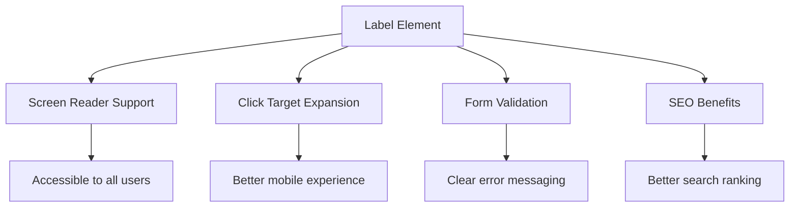
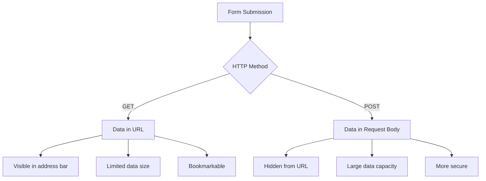
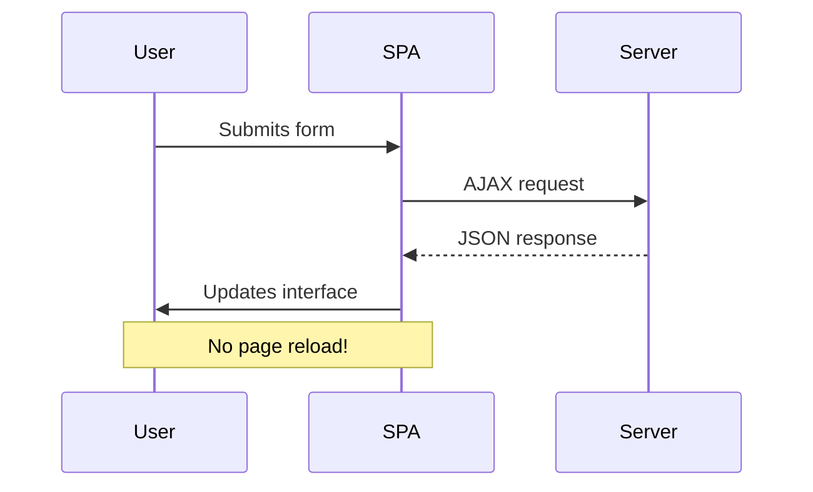
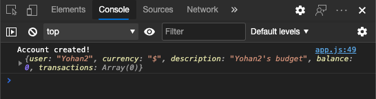
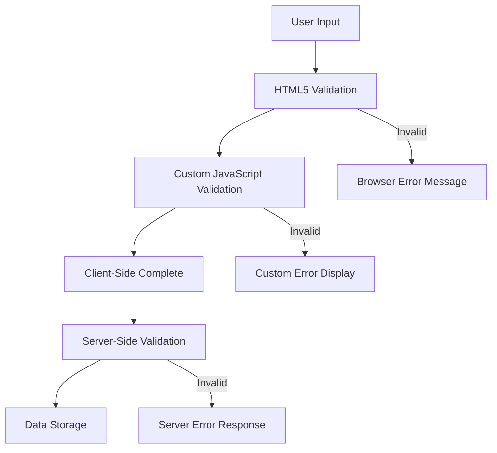
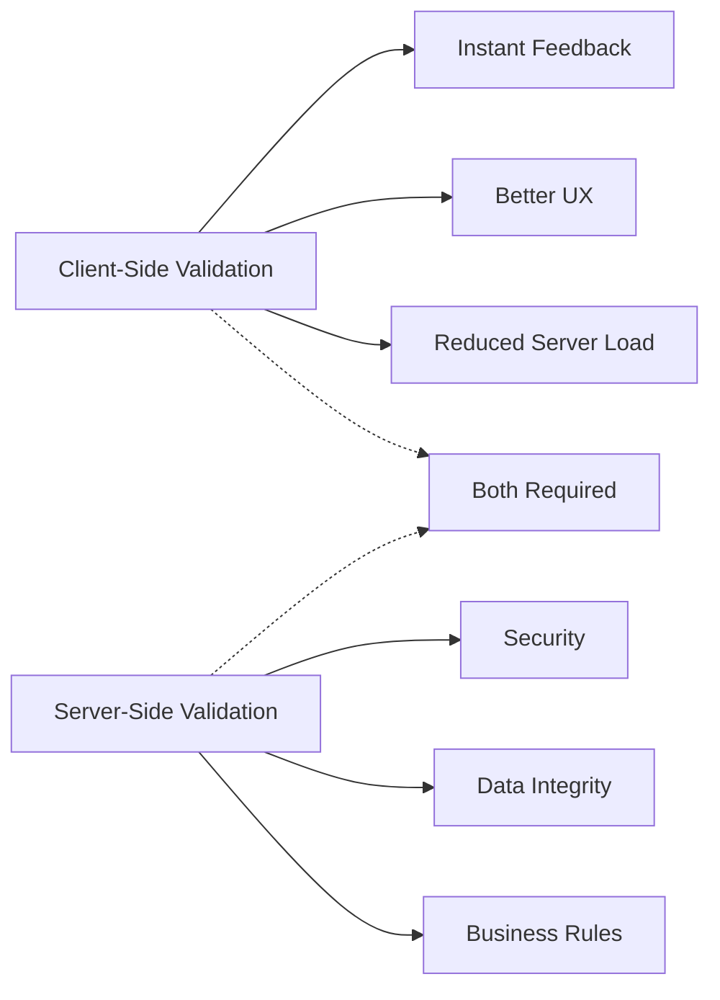

<!--
CO_OP_TRANSLATOR_METADATA:
{
  "original_hash": "b24f28fc46dd473aa9080f174182adde",
  "translation_date": "2025-10-24T15:10:25+00:00",
  "source_file": "7-bank-project/2-forms/README.md",
  "language_code": "ja"
}
-->
# 銀行アプリを作成する Part 2: ログインと登録フォームを作成する

## 講義前クイズ

[講義前クイズ](https://ff-quizzes.netlify.app/web/quiz/43)

オンラインでフォームを記入して、メール形式が間違っていると拒否されたことはありませんか？または、送信ボタンを押したらすべての情報が消えてしまったことは？誰もがこうしたイライラする経験をしたことがあるでしょう。

フォームは、ユーザーとアプリケーションの機能をつなぐ架け橋です。航空管制官が飛行機を安全に目的地へ導くために慎重なプロトコルを使用するように、よく設計されたフォームは明確なフィードバックを提供し、エラーを防ぎます。一方で、悪いフォームは、忙しい空港での誤解のように、ユーザーをすぐに遠ざけてしまう可能性があります。

このレッスンでは、静的な銀行アプリをインタラクティブなアプリケーションに変身させます。ユーザー入力を検証し、サーバーと通信し、役立つフィードバックを提供するフォームの作成方法を学びます。これは、ユーザーがアプリケーションの機能を操作できるコントロールインターフェースを構築するようなものです。

最終的には、ユーザーをイライラさせるのではなく、成功へと導く検証付きの完全なログインと登録システムを構築することができます。

## 前提条件

フォームを作成する前に、すべてが正しく設定されていることを確認しましょう。このレッスンは前回の続きから始まりますので、もし先に進んでしまった場合は、まず基本を動作させるところから始めることをお勧めします。

### 必要なセットアップ

| コンポーネント | ステータス | 説明 |
|-----------|--------|-------------|
| [HTMLテンプレート](../1-template-route/README.md) | ✅ 必須 | 基本的な銀行アプリの構造 |
| [Node.js](https://nodejs.org) | ✅ 必須 | サーバー用のJavaScriptランタイム |
| [銀行APIサーバー](../api/README.md) | ✅ 必須 | データ保存用のバックエンドサービス |

> 💡 **開発のヒント**: フロントエンドの銀行アプリ用サーバーとバックエンドAPI用サーバーの2つを同時に実行します。このセットアップは、フロントエンドとバックエンドサービスが独立して動作する実際の開発環境を模倣しています。

### サーバー構成

**開発環境には以下が含まれます:**
- **フロントエンドサーバー**: 銀行アプリを提供する（通常ポート`3000`）
- **バックエンドAPIサーバー**: データの保存と取得を処理する（ポート`5000`）
- **両方のサーバー**は競合せずに同時に実行可能

**API接続のテスト:**
```bash
curl http://localhost:5000/api
# Expected response: "Bank API v1.0.0"
```

**APIバージョンのレスポンスが表示されたら、準備完了です！**

---

## HTMLフォームとコントロールの理解

HTMLフォームは、ユーザーがウェブアプリケーションと通信する方法です。19世紀に遠隔地をつなぐ電報システムのように、ユーザーの意図とアプリケーションの応答をつなぐ通信プロトコルです。慎重に設計されたフォームはエラーをキャッチし、入力形式をガイドし、役立つ提案を提供します。

現代のフォームは基本的なテキスト入力よりもはるかに洗練されています。HTML5は、メール検証、数値フォーマット、日付選択を自動的に処理する専門的な入力タイプを導入しました。これらの改善は、アクセシビリティとモバイルユーザー体験の両方にメリットをもたらします。

### 必須のフォーム要素

**すべてのフォームに必要な構成要素:**

```html
<!-- Basic form structure -->
<form id="userForm" method="POST">
  <label for="username">Username</label>
  <input id="username" name="username" type="text" required>
  
  <button type="submit">Submit</button>
</form>
```

**このコードが行うこと:**
- **フォームコンテナ**を一意の識別子で作成
- **データ送信のHTTPメソッド**を指定
- **ラベルを入力フィールドに関連付け**てアクセシビリティを向上
- **フォームを処理する送信ボタン**を定義

### モダンな入力タイプと属性

| 入力タイプ | 目的 | 使用例 |
|------------|---------|---------------|
| `text` | 一般的なテキスト入力 | `<input type="text" name="username">` |
| `email` | メール検証 | `<input type="email" name="email">` |
| `password` | 非表示のテキスト入力 | `<input type="password" name="password">` |
| `number` | 数値入力 | `<input type="number" name="balance" min="0">` |
| `tel` | 電話番号 | `<input type="tel" name="phone">` |

> 💡 **モダンHTML5の利点**: 特定の入力タイプを使用することで、追加のJavaScriptなしで自動検証、適切なモバイルキーボード、優れたアクセシビリティサポートを提供します！

### ボタンタイプと動作

```html
<!-- Different button behaviors -->
<button type="submit">Save Data</button>     <!-- Submits the form -->
<button type="reset">Clear Form</button>    <!-- Resets all fields -->
<button type="button">Custom Action</button> <!-- No default behavior -->
```

**各ボタンタイプの動作:**
- **送信ボタン**: フォーム送信をトリガーし、指定されたエンドポイントにデータを送信
- **リセットボタン**: すべてのフォームフィールドを初期状態に戻す
- **通常のボタン**: デフォルトの動作を提供せず、カスタムJavaScriptが必要

> ⚠️ **重要な注意点**: `<input>`要素は自己閉じタグであり、閉じタグは必要ありません。モダンなベストプラクティスでは、スラッシュなしで`<input>`を書くことが推奨されます。

### ログインフォームの作成

モダンなHTMLフォームの実践を示す実用的なログインフォームを作成しましょう。基本構造から始め、アクセシビリティ機能と検証を徐々に強化していきます。

```html
<template id="login">
  <h1>Bank App</h1>
  <section>
    <h2>Login</h2>
    <form id="loginForm" novalidate>
      <div class="form-group">
        <label for="username">Username</label>
        <input id="username" name="user" type="text" required 
               autocomplete="username" placeholder="Enter your username">
      </div>
      <button type="submit">Login</button>
    </form>
  </section>
</template>
```

**ここで行われることの内訳:**
- **セマンティックHTML5要素**でフォームを構築
- **関連する要素を`div`コンテナでグループ化**し、意味のあるクラスを付与
- **ラベルを`for`と`id`属性で入力フィールドに関連付け**
- **`autocomplete`や`placeholder`などのモダンな属性を追加**してUXを向上
- **ブラウザのデフォルト検証を無効化するために`novalidate`を追加**

### 適切なラベルの重要性

**モダンなウェブ開発におけるラベルの重要性:**



**適切なラベルが達成すること:**
- **スクリーンリーダーがフォームフィールドを明確に読み上げることを可能にする**
- **クリック可能なエリアを拡大し、ラベルをクリックすると入力フィールドにフォーカスが移る**
- **モバイルでの使いやすさを向上させる**
- **意味のあるエラーメッセージでフォーム検証をサポート**
- **フォーム要素にセマンティックな意味を提供してSEOを向上**

> 🎯 **アクセシビリティの目標**: すべてのフォーム入力には関連するラベルが必要です。この簡単な実践により、障害を持つユーザーを含むすべてのユーザーがフォームを利用しやすくなり、全体的な体験が向上します。

### 登録フォームの作成

登録フォームは、完全なユーザーアカウントを作成するためにより詳細な情報が必要です。モダンなHTML5機能とアクセシビリティを強化して構築しましょう。

```html
<hr/>
<h2>Register</h2>
<form id="registerForm" novalidate>
  <div class="form-group">
    <label for="user">Username</label>
    <input id="user" name="user" type="text" required 
           autocomplete="username" placeholder="Choose a username">
  </div>
  
  <div class="form-group">
    <label for="currency">Currency</label>
    <input id="currency" name="currency" type="text" value="$" 
           required maxlength="3" placeholder="USD, EUR, etc.">
  </div>
  
  <div class="form-group">
    <label for="description">Account Description</label>
    <input id="description" name="description" type="text" 
           maxlength="100" placeholder="Personal savings, checking, etc.">
  </div>
  
  <div class="form-group">
    <label for="balance">Starting Balance</label>
    <input id="balance" name="balance" type="number" value="0" 
           min="0" step="0.01" placeholder="0.00">
  </div>
  
  <button type="submit">Create Account</button>
</form>
```

**上記で行ったこと:**
- **各フィールドをコンテナ`div`で整理**し、スタイリングとレイアウトを向上
- **ブラウザの自動入力サポートのために適切な`autocomplete`属性を追加**
- **ユーザー入力をガイドするための役立つプレースホルダーを含める**
- **`value`属性を使用して適切なデフォルト値を設定**
- **`required`、`maxlength`、`min`などの検証属性を適用**
- **小数点対応の`type="number"`を使用して残高フィールドを設定**

### 入力タイプと動作の探求

**モダンな入力タイプは機能を強化します:**

| 機能 | 利点 | 使用例 |
|---------|---------|----------|
| `type="number"` | モバイルでの数値キーパッド | 残高入力が簡単 |
| `step="0.01"` | 小数点精度の制御 | 通貨のセントを許可 |
| `autocomplete` | ブラウザの自動入力 | フォーム入力が迅速 |
| `placeholder` | コンテキストヒント | ユーザーの期待をガイド |

> 🎯 **アクセシビリティチャレンジ**: キーボードだけを使ってフォームを操作してみてください！`Tab`でフィールド間を移動し、`Space`でチェックボックスを選択し、`Enter`で送信します。この体験により、スクリーンリーダーを使用するユーザーがフォームをどのように操作するかを理解できます。

## フォーム送信方法の理解

フォームに記入して送信ボタンを押すと、そのデータはどこかに送信されます。通常はデータを保存できるサーバーに送信されます。これがどのように行われるかにはいくつかの方法があり、どれを使用するかを知ることで後々の問題を回避できます。

送信ボタンをクリックしたときに実際に何が起こるのか見てみましょう。

### フォームのデフォルト動作

まず、基本的なフォーム送信で何が起こるかを観察してみましょう:

**現在のフォームをテストする:**
1. フォームの*登録*ボタンをクリック
2. ブラウザのアドレスバーの変化を観察
3. ページがリロードされ、データがURLに表示されることに注目


### HTTPメソッドの比較



**違いを理解する:**

| メソッド | 使用ケース | データの場所 | セキュリティレベル | サイズ制限 |
|--------|----------|---------------|----------------|-------------|
| `GET` | 検索クエリ、フィルタ | URLパラメータ | 低（可視） | 約2000文字 |
| `POST` | ユーザーアカウント、機密データ | リクエストボディ | 高（非表示） | 実質的な制限なし |

**基本的な違いを理解する:**
- **GET**: フォームデータをURLにクエリパラメータとして追加（検索操作に適している）
- **POST**: データをリクエストボディに含める（機密情報に必須）
- **GETの制限**: サイズ制約、データが見える、ブラウザ履歴に残る
- **POSTの利点**: 大容量データ対応、プライバシー保護、ファイルアップロード対応

> 💡 **ベストプラクティス**: 検索フォームやフィルタには`GET`を使用し（データ取得）、ユーザー登録、ログイン、データ作成には`POST`を使用します。

### フォーム送信の設定

登録フォームを設定して、POSTメソッドを使用してバックエンドAPIと適切に通信するようにしましょう:

```html
<form id="registerForm" action="//localhost:5000/api/accounts" 
      method="POST" novalidate>
```

**この設定が行うこと:**
- **フォーム送信をAPIエンドポイントに誘導**
- **POSTメソッドを使用して安全なデータ送信を実現**
- **ブラウザのデフォルト検証を無効化するために`novalidate`を追加**

### フォーム送信のテスト

**フォームをテストする手順:**
1. **登録フォームに情報を入力**
2. **「アカウント作成」ボタンをクリック**
3. **ブラウザでサーバーのレスポンスを確認**


**確認すべきこと:**
- **ブラウザがAPIエンドポイントURLにリダイレクト**
- **JSONレスポンス**に新しく作成されたアカウントデータが含まれている
- **サーバーがアカウントの正常な作成を確認**

> 🧪 **実験タイム**: 同じユーザー名で再度登録を試みてください。どのようなレスポンスが得られるか確認してください。これにより、サーバーが重複データやエラー条件をどのように処理するかを理解できます。

### JSONレスポンスの理解

**サーバーがフォームを正常に処理した場合:**
```json
{
  "user": "john_doe",
  "currency": "$",
  "description": "Personal savings",
  "balance": 100,
  "id": "unique_account_id"
}
```

**このレスポンスが確認すること:**
- **指定されたデータで新しいアカウントを作成**
- **将来の参照用に一意の識別子を割り当て**
- **検証のためにすべてのアカウント情報を返す**
- **データベースへの正常な保存を示す**

## JavaScriptを使ったモダンなフォーム処理

従来のフォーム送信は、宇宙ミッションの初期段階でコース修正のためにシステム全体をリセットする必要があったのと同様に、ページ全体のリロードを引き起こします。この方法はユーザー体験を妨げ、アプリケーションの状態を失います。

JavaScriptフォーム処理は、現代の宇宙船が使用する連続的な誘導システムのように、ナビゲーションコンテキストを失うことなくリアルタイムで調整を行います。フォーム送信をインターセプトし、即時フィードバックを提供し、エラーを優雅に処理し、サーバーレスポンスに基づいてインターフェースを更新しながら、アプリケーション内でユーザーの位置を維持できます。

### ページリロードを避ける理由



**JavaScriptフォーム処理の利点:**
- **アプリケーションの状態とユーザーコンテキストを維持**
- **即時フィードバックとロードインジケーターを提供**
- **動的なエラー処理と検証を可能にする**
- **スムーズでアプリのようなユーザー体験を作成**
- **サーバーレスポンスに基づく条件付きロジックを可能にする**

### 従来のフォームからモダンフォームへの移行

**従来のアプローチの課題:**
- **ユーザーをアプリケーションから離脱させる**
- **現在のアプリケーション状態とコンテキストを失う**
- **単純な操作のためにページ全体をリロードする必要がある**
- **ユーザーフィードバックに対する制御が限られている**

**モダンなJavaScriptアプローチの利点:**
- **ユーザーをアプリケーション内に留める**
- **すべてのアプリケーション状態とデータを維持**
- **リアルタイムの検証とフィードバックを可能にする**
- **漸進的な強化とアクセシビリティをサポート**

### JavaScriptフォーム処理の実装

従来のフォーム送信をモダンなJavaScriptイベント処理に置き換えましょう:

```html
<!-- Remove the action attribute and add event handling -->
<form id="registerForm" method="POST" novalidate>
```

**`app.js`ファイルに登録ロジックを追加:**

```javascript
// Modern event-driven form handling
function register() {
  const registerForm = document.getElementById('registerForm');
  const formData = new FormData(registerForm);
  const data = Object.fromEntries(formData);
  const jsonData = JSON.stringify(data);
  
  console.log('Form data prepared:', data);
}

// Attach event listener when the page loads
document.addEventListener('DOMContentLoaded', () => {
  const registerForm = document.getElementById('registerForm');
  registerForm.addEventListener('submit', (event) => {
    event.preventDefault(); // Prevent default form submission
    register();
  });
});
```

**ここで行われることの内訳:**
- **`event.preventDefault()`を使用してデフォルトのフォーム送信を防止**
- **モダンなDOM選択を使用してフォーム要素を取得**
- **強力な`FormData`APIを使用してフォームデータを抽出**
- **`Object.fromEntries()`を使用してFormDataをプレーンオブジェクトに変換**
- **サーバー通信のためにデータをJSON形式にシリアル
- **詳細なエラーメッセージ**を提供してデバッグを容易にする  
- **成功とエラーケース**において一貫したデータ構造を返す  

### モダンなFetch APIの力

**Fetch APIが従来の方法より優れている点：**

| 機能 | 利点 | 実装例 |
|------|------|--------|
| Promiseベース | クリーンな非同期コード | `await fetch()` |
| リクエストのカスタマイズ | HTTPを完全に制御 | ヘッダー、メソッド、ボディ |
| レスポンス処理 | 柔軟なデータ解析 | `.json()`, `.text()`, `.blob()` |
| エラーハンドリング | 包括的なエラーキャッチ | Try/catchブロック |

> 🎥 **もっと学ぶ**: [Async/Awaitチュートリアル](https://youtube.com/watch?v=YwmlRkrxvkk) - モダンなウェブ開発のための非同期JavaScriptパターンを理解する。

**サーバー通信の重要な概念：**
- **Async関数**はサーバーの応答を待つために実行を一時停止できる  
- **Awaitキーワード**は非同期コードを同期コードのように読みやすくする  
- **Fetch API**はモダンでPromiseベースのHTTPリクエストを提供  
- **エラーハンドリング**はネットワーク問題に対してアプリが優雅に対応することを保証  

### 登録機能の完成

以下は、完全で実用的な登録機能の例です：

```javascript
async function register() {
  const registerForm = document.getElementById('registerForm');
  const submitButton = registerForm.querySelector('button[type="submit"]');
  
  try {
    // Show loading state
    submitButton.disabled = true;
    submitButton.textContent = 'Creating Account...';
    
    // Process form data
    const formData = new FormData(registerForm);
    const jsonData = JSON.stringify(Object.fromEntries(formData));
    
    // Send to server
    const result = await createAccount(jsonData);
    
    if (result.error) {
      console.error('Registration failed:', result.error);
      alert(`Registration failed: ${result.error}`);
      return;
    }
    
    console.log('Account created successfully!', result);
    alert(`Welcome, ${result.user}! Your account has been created.`);
    
    // Reset form after successful registration
    registerForm.reset();
    
  } catch (error) {
    console.error('Unexpected error:', error);
    alert('An unexpected error occurred. Please try again.');
  } finally {
    // Restore button state
    submitButton.disabled = false;
    submitButton.textContent = 'Create Account';
  }
}
```
  
**この強化された実装には以下が含まれます：**
- **フォーム送信中の視覚的フィードバック**を提供  
- **送信ボタンを無効化**して重複送信を防止  
- **予期されたエラーと予期しないエラー**の両方を優雅に処理  
- **ユーザーフレンドリーな成功とエラーメッセージ**を表示  
- **登録成功後にフォームをリセット**  
- **結果に関係なくUI状態を復元**  

### 実装のテスト

**ブラウザの開発者ツールを開いて登録をテストする：**

1. **ブラウザコンソールを開く** (F12 → Consoleタブ)  
2. **登録フォームに入力する**  
3. **「アカウント作成」をクリックする**  
4. **コンソールメッセージとユーザーフィードバックを確認する**  



**確認すべき内容：**
- **送信ボタンにローディング状態**が表示される  
- **コンソールログ**にプロセスの詳細情報が表示される  
- **成功メッセージ**がアカウント作成成功時に表示される  
- **フォームが自動的にリセット**される  

> 🔒 **セキュリティに関する考慮事項**: 現在、データはHTTPを介して送信されており、これは本番環境では安全ではありません。実際のアプリケーションでは、常にHTTPSを使用してデータ送信を暗号化してください。[HTTPSのセキュリティ](https://en.wikipedia.org/wiki/HTTPS)について学び、ユーザーデータを保護する重要性を理解しましょう。

## 包括的なフォームバリデーション

フォームバリデーションは、送信後にエラーを発見するというフラストレーションを防ぎます。国際宇宙ステーションの複数の冗長システムのように、効果的なバリデーションは複数の安全チェック層を採用します。

最適なアプローチは、即時フィードバックを提供するブラウザレベルのバリデーション、ユーザー体験を向上させるJavaScriptバリデーション、そしてセキュリティとデータ整合性を確保するサーバーサイドバリデーションを組み合わせることです。この冗長性により、ユーザー満足度とシステム保護の両方が保証されます。

### バリデーション層の理解


  
**多層バリデーション戦略：**
- **HTML5バリデーション**: 即時のブラウザベースのチェック  
- **JavaScriptバリデーション**: カスタムロジックとユーザー体験  
- **サーバーバリデーション**: 最終的なセキュリティとデータ整合性チェック  
- **プログレッシブエンハンスメント**: JavaScriptが無効でも機能  

### HTML5バリデーション属性

**モダンなバリデーションツール：**

| 属性 | 目的 | 使用例 | ブラウザの挙動 |
|------|------|--------|----------------|
| `required` | 必須フィールド | `<input required>` | 空の送信を防止 |
| `minlength`/`maxlength` | テキストの長さ制限 | `<input maxlength="20">` | 文字数制限を適用 |
| `min`/`max` | 数値範囲 | `<input min="0" max="1000">` | 数値の範囲を検証 |
| `pattern` | カスタム正規表現ルール | `<input pattern="[A-Za-z]+">` | 特定の形式に一致 |
| `type` | データ型のバリデーション | `<input type="email">` | 形式特有の検証 |

### CSSバリデーションスタイリング

**バリデーション状態の視覚的フィードバックを作成：**

```css
/* Valid input styling */
input:valid {
  border-color: #28a745;
  background-color: #f8fff9;
}

/* Invalid input styling */
input:invalid {
  border-color: #dc3545;
  background-color: #fff5f5;
}

/* Focus states for better accessibility */
input:focus:valid {
  box-shadow: 0 0 0 0.2rem rgba(40, 167, 69, 0.25);
}

input:focus:invalid {
  box-shadow: 0 0 0 0.2rem rgba(220, 53, 69, 0.25);
}
```
  
**これらの視覚的な手がかりが達成すること：**
- **緑の枠線**: 成功したバリデーションを示し、ミッションコントロールの緑のライトのように  
- **赤の枠線**: 注意が必要なバリデーションエラーを示す  
- **フォーカスのハイライト**: 現在の入力位置の明確な視覚的コンテキストを提供  
- **一貫したスタイリング**: ユーザーが学習できる予測可能なインターフェースパターンを確立  

> 💡 **プロのヒント**: `:valid`と`:invalid`のCSS疑似クラスを使用して、ユーザーが入力する際に即時の視覚的フィードバックを提供し、応答性の高い役立つインターフェースを作成しましょう。

### 包括的なバリデーションの実装

以下は、優れたユーザー体験とデータ品質を提供する堅牢なバリデーションを備えた登録フォームの例です：

```html
<form id="registerForm" method="POST" novalidate>
  <div class="form-group">
    <label for="user">Username <span class="required">*</span></label>
    <input id="user" name="user" type="text" required 
           minlength="3" maxlength="20" 
           pattern="[a-zA-Z0-9_]+" 
           autocomplete="username"
           title="Username must be 3-20 characters, letters, numbers, and underscores only">
    <small class="form-text">Choose a unique username (3-20 characters)</small>
  </div>
  
  <div class="form-group">
    <label for="currency">Currency <span class="required">*</span></label>
    <input id="currency" name="currency" type="text" required 
           value="$" maxlength="3" 
           pattern="[A-Z$€£¥₹]+" 
           title="Enter a valid currency symbol or code">
    <small class="form-text">Currency symbol (e.g., $, €, £)</small>
  </div>
  
  <div class="form-group">
    <label for="description">Account Description</label>
    <input id="description" name="description" type="text" 
           maxlength="100" 
           placeholder="Personal savings, checking, etc.">
    <small class="form-text">Optional description (up to 100 characters)</small>
  </div>
  
  <div class="form-group">
    <label for="balance">Starting Balance</label>
    <input id="balance" name="balance" type="number" 
           value="0" min="0" step="0.01" 
           title="Enter a positive number for your starting balance">
    <small class="form-text">Initial account balance (minimum $0.00)</small>
  </div>
  
  <button type="submit">Create Account</button>
</form>
```
  
**強化されたバリデーションの理解：**
- **必須フィールドのインジケーター**と役立つ説明を組み合わせる  
- **形式検証のための`pattern`属性**を含む  
- **アクセシビリティとツールチップのための`title`属性**を提供  
- **ユーザー入力をガイドするヘルパーテキスト**を追加  
- **アクセシビリティ向上のためのセマンティックHTML構造**を使用  

### 高度なバリデーションルール

**各バリデーションルールが達成すること：**

| フィールド | バリデーションルール | ユーザーの利点 |
|------------|---------------------|----------------|
| ユーザー名 | `required`, `minlength="3"`, `maxlength="20"`, `pattern="[a-zA-Z0-9_]+"` | 有効でユニークな識別子を保証 |
| 通貨 | `required`, `maxlength="3"`, `pattern="[A-Z$€£¥₹]+"` | 一般的な通貨記号を受け入れる |
| 残高 | `min="0"`, `step="0.01"`, `type="number"` | 負の残高を防止 |
| 説明 | `maxlength="100"` | 適切な長さの制限 |

### バリデーション動作のテスト

**以下のバリデーションシナリオを試してください：**
1. **必須フィールドを空のままフォームを送信**  
2. **3文字未満のユーザー名を入力**  
3. **ユーザー名フィールドに特殊文字を試す**  
4. **負の残高額を入力**  


**観察すべき内容：**
- **ブラウザがネイティブのバリデーションメッセージを表示**  
- **`:valid`と`:invalid`状態に基づくスタイリングの変更**  
- **すべてのバリデーションが通過するまでフォーム送信が防止される**  
- **フォーカスが自動的に最初の無効なフィールドに移動**  

### クライアントサイド vs サーバーサイドバリデーション


  
**両方の層が必要な理由：**
- **クライアントサイドバリデーション**: 即時フィードバックを提供し、ユーザー体験を向上  
- **サーバーサイドバリデーション**: セキュリティを確保し、複雑なビジネスルールを処理  
- **組み合わせたアプローチ**: 堅牢でユーザーフレンドリーかつ安全なアプリケーションを作成  
- **プログレッシブエンハンスメント**: JavaScriptが無効でも機能  

> 🛡️ **セキュリティの注意**: クライアントサイドバリデーションだけを信用しないでください！悪意のあるユーザーはクライアントサイドチェックを回避できるため、セキュリティとデータ整合性のためにサーバーサイドバリデーションが不可欠です。

---

---

## GitHub Copilot Agentチャレンジ 🚀

Agentモードを使用して以下のチャレンジを完了してください：

**説明:** クライアントサイドバリデーションとユーザーフィードバックを備えた包括的な登録フォームを強化します。このチャレンジでは、フォームバリデーション、エラーハンドリング、インタラクティブなフィードバックを使用してユーザー体験を向上させる練習ができます。

**プロンプト:** 登録フォームの完全なバリデーションシステムを作成してください。以下を含む：1) ユーザーが入力するたびにリアルタイムのバリデーションフィードバック、2) 各入力フィールドの下に表示されるカスタムバリデーションメッセージ、3) パスワード確認フィールドと一致するバリデーション、4) 有効なフィールドには緑のチェックマーク、無効なフィールドには赤い警告を表示する視覚的インジケーター、5) すべてのバリデーションが通過した場合のみ有効になる送信ボタン。HTML5バリデーション属性、CSSによるバリデーション状態のスタイリング、JavaScriptによるインタラクティブな動作を使用してください。

[Agentモードについてもっと学ぶ](https://code.visualstudio.com/blogs/2025/02/24/introducing-copilot-agent-mode)。

## 🚀 チャレンジ

HTMLにユーザーが既に存在する場合のエラーメッセージを表示してください。

以下は、少しスタイリングを加えた後の最終的なログインページの例です：


## 講義後のクイズ

[講義後のクイズ](https://ff-quizzes.netlify.app/web/quiz/44)

## 復習と自己学習

開発者はフォーム構築に関して非常に創造的になっており、特にバリデーション戦略に関して工夫を凝らしています。[CodePen](https://codepen.com)を見て、興味深く刺激的なフォームを探してみてください。

## 課題

[銀行アプリをスタイリングする](assignment.md)

---

**免責事項**:  
この文書はAI翻訳サービス[Co-op Translator](https://github.com/Azure/co-op-translator)を使用して翻訳されています。正確性を追求しておりますが、自動翻訳には誤りや不正確な部分が含まれる可能性があります。元の言語で記載された文書を正式な情報源としてご参照ください。重要な情報については、専門の人間による翻訳を推奨します。この翻訳の使用に起因する誤解や誤解釈について、当社は責任を負いません。