# 銀行アプリを作成する Part 2: ログインと登録フォームを作成する

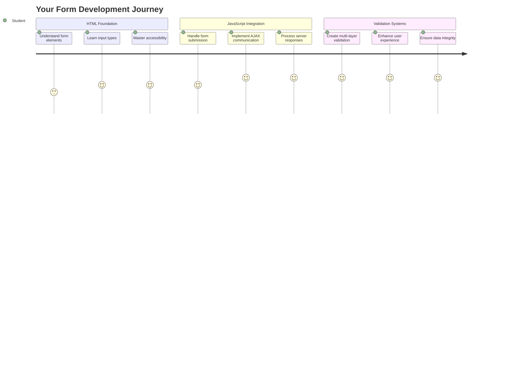

## 講義前クイズ

[講義前クイズ](https://ff-quizzes.netlify.app/web/quiz/43)

オンラインでフォームを記入して、メール形式が間違っていると拒否されたことはありませんか？または、送信をクリックしたときにすべての情報を失ったことはありませんか？誰もがこうしたイライラする経験をしたことがあるでしょう。

フォームは、ユーザーとアプリケーションの機能をつなぐ架け橋です。航空管制官が飛行機を安全に目的地へ導くために慎重なプロトコルを使用するように、よく設計されたフォームは明確なフィードバックを提供し、コストのかかるエラーを防ぎます。一方、悪いフォームは、忙しい空港での誤解よりも早くユーザーを遠ざける可能性があります。

このレッスンでは、静的な銀行アプリをインタラクティブなアプリケーションに変換します。ユーザー入力を検証し、サーバーと通信し、役立つフィードバックを提供するフォームの作成方法を学びます。これは、ユーザーがアプリケーションの機能を操作するためのコントロールインターフェースを構築するようなものです。

このレッスンの終わりまでに、ユーザーをイライラさせるのではなく成功へ導く、検証付きの完全なログインと登録システムを作成することができます。

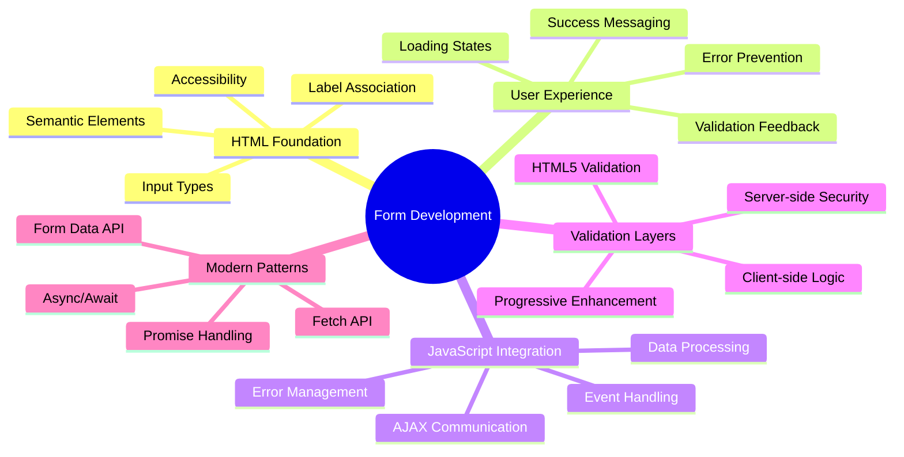

## 前提条件

フォームを作成する前に、すべてが正しく設定されていることを確認しましょう。このレッスンは前回のレッスンの続きから始まるので、先に進んだ場合は基本をまず動作させることをお勧めします。

### 必要なセットアップ

| コンポーネント | ステータス | 説明 |
|---------------|------------|------|
| [HTMLテンプレート](../1-template-route/README.md) | ✅ 必須 | 基本的な銀行アプリの構造 |
| [Node.js](https://nodejs.org) | ✅ 必須 | サーバー用のJavaScriptランタイム |
| [銀行APIサーバー](../api/README.md) | ✅ 必須 | データ保存用のバックエンドサービス |

> 💡 **開発のヒント**: フロントエンドの銀行アプリ用サーバーとバックエンドAPI用サーバーの2つを同時に実行します。このセットアップは、フロントエンドとバックエンドサービスが独立して動作する実際の開発を模倣しています。

### サーバー構成

**開発環境には以下が含まれます:**
- **フロントエンドサーバー**: 銀行アプリを提供 (通常ポート`3000`)
- **バックエンドAPIサーバー**: データ保存と取得を処理 (ポート`5000`)
- **両方のサーバー**は競合せずに同時に実行可能

**API接続のテスト:**
```bash
curl http://localhost:5000/api
# Expected response: "Bank API v1.0.0"
```

**APIバージョンの応答が表示されたら、次に進む準備が整っています！**

---

## HTMLフォームとコントロールの理解

HTMLフォームは、ユーザーがウェブアプリケーションと通信する方法です。19世紀に遠隔地をつないだ電報システムのように、ユーザーの意図とアプリケーションの応答をつなぐ通信プロトコルです。慎重に設計されたフォームはエラーをキャッチし、入力形式をガイドし、役立つ提案を提供します。

現代のフォームは基本的なテキスト入力よりもはるかに洗練されています。HTML5は、メール検証、数値フォーマット、日付選択を自動的に処理する専門的な入力タイプを導入しました。これらの改善は、アクセシビリティとモバイルユーザー体験の両方に利益をもたらします。

### 必須のフォーム要素

**すべてのフォームに必要な構成要素:**

```html
<!-- Basic form structure -->
<form id="userForm" method="POST">
  <label for="username">Username</label>
  <input id="username" name="username" type="text" required>
  
  <button type="submit">Submit</button>
</form>
```

**このコードが行うこと:**
- **フォームコンテナ**をユニークな識別子で作成
- **データ送信のHTTPメソッド**を指定
- **ラベルと入力を関連付け**てアクセシビリティを向上
- **フォームを処理する送信ボタン**を定義

### モダンな入力タイプと属性

| 入力タイプ | 目的 | 使用例 |
|------------|------|--------|
| `text` | 一般的なテキスト入力 | `<input type="text" name="username">` |
| `email` | メール検証 | `<input type="email" name="email">` |
| `password` | 隠されたテキスト入力 | `<input type="password" name="password">` |
| `number` | 数値入力 | `<input type="number" name="balance" min="0">` |
| `tel` | 電話番号 | `<input type="tel" name="phone">` |

> 💡 **モダンHTML5の利点**: 特定の入力タイプを使用することで、追加のJavaScriptなしで自動検証、適切なモバイルキーボード、アクセシビリティサポートを提供します！

### ボタンタイプと動作

```html
<!-- Different button behaviors -->
<button type="submit">Save Data</button>     <!-- Submits the form -->
<button type="reset">Clear Form</button>    <!-- Resets all fields -->
<button type="button">Custom Action</button> <!-- No default behavior -->
```

**各ボタンタイプの動作:**
- **送信ボタン**: フォーム送信をトリガーし、指定されたエンドポイントにデータを送信
- **リセットボタン**: すべてのフォームフィールドを初期状態に戻す
- **通常のボタン**: デフォルトの動作を提供せず、カスタムJavaScriptが必要

> ⚠️ **重要な注意点**: `<input>`要素は自己閉じタグであり、閉じタグは必要ありません。モダンなベストプラクティスでは、スラッシュなしで`<input>`を書くことが推奨されます。

### ログインフォームの作成

次に、モダンなHTMLフォームの実践を示す実用的なログインフォームを作成します。基本構造から始め、アクセシビリティ機能と検証を徐々に強化していきます。

```html
<template id="login">
  <h1>Bank App</h1>
  <section>
    <h2>Login</h2>
    <form id="loginForm" novalidate>
      <div class="form-group">
        <label for="username">Username</label>
        <input id="username" name="user" type="text" required 
               autocomplete="username" placeholder="Enter your username">
      </div>
      <button type="submit">Login</button>
    </form>
  </section>
</template>
```

**ここで何が起こるかの内訳:**
- **セマンティックHTML5要素**でフォームを構築
- **関連する要素を`div`コンテナでグループ化**し、意味のあるクラスを付与
- **ラベルと入力を`for`と`id`属性で関連付け**
- **`autocomplete`や`placeholder`などのモダンな属性を追加**し、UXを向上
- **ブラウザのデフォルト検証ではなくJavaScriptで検証を処理するために`novalidate`を追加**

### 適切なラベルの重要性

**モダンなウェブ開発におけるラベルの重要性:**

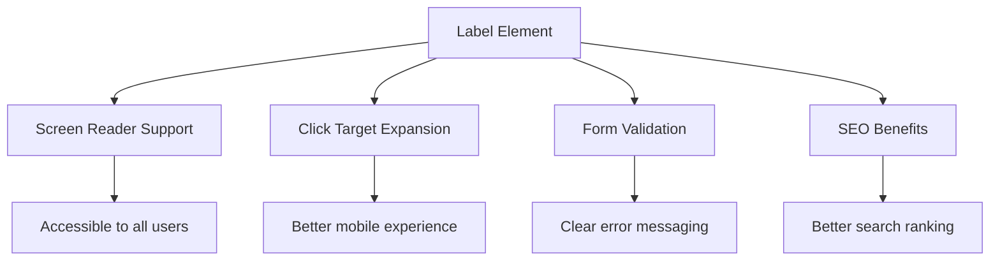

**適切なラベルが達成すること:**
- **スクリーンリーダーがフォームフィールドを明確に読み上げることを可能にする**
- **クリック可能なエリアを拡大** (ラベルをクリックすると入力にフォーカス)
- **モバイルの使いやすさを向上** (タッチターゲットが大きくなる)
- **意味のあるエラーメッセージでフォーム検証をサポート**
- **フォーム要素にセマンティックな意味を提供しSEOを向上**

> 🎯 **アクセシビリティ目標**: すべてのフォーム入力には関連するラベルが必要です。この簡単な実践は、障害を持つユーザーを含むすべてのユーザーにフォームを利用可能にし、全体的なユーザー体験を向上させます。

### 登録フォームの作成

登録フォームは、完全なユーザーアカウントを作成するためにより詳細な情報を必要とします。モダンなHTML5機能とアクセシビリティを強化して構築しましょう。

```html
<hr/>
<h2>Register</h2>
<form id="registerForm" novalidate>
  <div class="form-group">
    <label for="user">Username</label>
    <input id="user" name="user" type="text" required 
           autocomplete="username" placeholder="Choose a username">
  </div>
  
  <div class="form-group">
    <label for="currency">Currency</label>
    <input id="currency" name="currency" type="text" value="$" 
           required maxlength="3" placeholder="USD, EUR, etc.">
  </div>
  
  <div class="form-group">
    <label for="description">Account Description</label>
    <input id="description" name="description" type="text" 
           maxlength="100" placeholder="Personal savings, checking, etc.">
  </div>
  
  <div class="form-group">
    <label for="balance">Starting Balance</label>
    <input id="balance" name="balance" type="number" value="0" 
           min="0" step="0.01" placeholder="0.00">
  </div>
  
  <button type="submit">Create Account</button>
</form>
```

**上記で行ったこと:**
- **各フィールドをコンテナ`div`で整理**し、スタイリングとレイアウトを向上
- **ブラウザの自動入力サポートのために適切な`autocomplete`属性を追加**
- **ユーザー入力をガイドするための役立つプレースホルダーを追加**
- **`value`属性を使用して適切なデフォルトを設定**
- **`required`、`maxlength`、`min`などの検証属性を適用**
- **小数点をサポートする`type="number"`を残高フィールドに使用**

### 入力タイプと動作の探求

**モダンな入力タイプは機能を強化します:**

| 機能 | 利点 | 使用例 |
|------|------|--------|
| `type="number"` | モバイルでの数値キーパッド | 残高入力が簡単 |
| `step="0.01"` | 小数点精度の制御 | 通貨でセントを許可 |
| `autocomplete` | ブラウザの自動入力 | フォーム入力が速くなる |
| `placeholder` | コンテキストヒント | ユーザーの期待をガイド |

> 🎯 **アクセシビリティチャレンジ**: キーボードだけを使ってフォームを操作してみてください！`Tab`でフィールド間を移動し、`Space`でチェックボックスを選択し、`Enter`で送信します。この体験は、スクリーンリーダーを使用するユーザーがフォームをどのように操作するかを理解するのに役立ちます。

### 🔄 **教育的チェックイン**
**フォーム基礎の理解**: JavaScriptを実装する前に以下を理解してください:
- ✅ セマンティックHTMLがアクセシブルなフォーム構造を作る方法
- ✅ 入力タイプがモバイルキーボードと検証に重要な理由
- ✅ ラベルとフォームコントロールの関係
- ✅ フォーム属性がブラウザのデフォルト動作に与える影響

**簡単な自己テスト**: JavaScriptが処理しないフォームを送信するとどうなるか？
*答え: ブラウザはデフォルトの送信を実行し、通常はアクションURLにリダイレクトします*

**HTML5フォームの利点**: モダンなフォームは以下を提供します:
- **組み込み検証**: メールや数値形式の自動チェック
- **モバイル最適化**: 入力タイプに応じた適切なキーボード
- **アクセシビリティ**: スクリーンリーダーサポートとキーボード操作
- **漸進的強化**: JavaScriptが無効でも動作

## フォーム送信方法の理解

フォームに記入して送信ボタンを押すと、そのデータはどこかに送信されます。通常はデータを保存できるサーバーです。これがどのように行われるかにはいくつかの方法があり、どれを使用するかを知ることで後の頭痛を防ぐことができます。

送信ボタンをクリックしたときに実際に何が起こるかを見てみましょう。

### デフォルトのフォーム動作

まず、基本的なフォーム送信で何が起こるかを観察します:

**現在のフォームをテストする:**
1. フォームの*登録*ボタンをクリック
2. ブラウザのアドレスバーの変化を観察
3. ページがリロードされ、データがURLに表示されることに気づく


### HTTPメソッドの比較

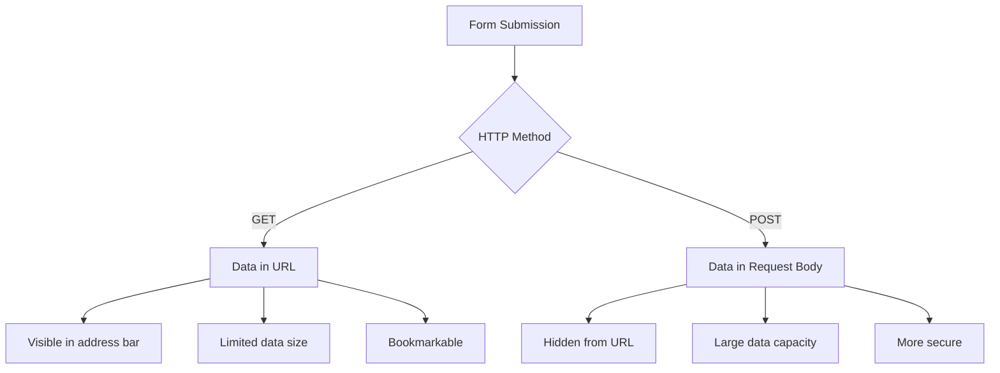

**違いを理解する:**

| メソッド | 使用例 | データの場所 | セキュリティレベル | サイズ制限 |
|----------|--------|--------------|----------------|------------|
| `GET` | 検索クエリ、フィルター | URLパラメータ | 低 (可視) | 約2000文字 |
| `POST` | ユーザーアカウント、機密データ | リクエストボディ | 高 (非表示) | 実質的な制限なし |

**基本的な違いを理解する:**
- **GET**: フォームデータをURLにクエリパラメータとして追加 (検索操作に適している)
- **POST**: データをリクエストボディに含む (機密情報に必須)
- **GETの制限**: サイズ制約、データが見える、ブラウザ履歴に残る
- **POSTの利点**: 大容量データ、プライバシー保護、ファイルアップロード対応

> 💡 **ベストプラクティス**: 検索フォームやフィルターには`GET`を使用し (データ取得)、ユーザー登録、ログイン、データ作成には`POST`を使用します。

### フォーム送信の構成

登録フォームをPOSTメソッドを使用してバックエンドAPIと適切に通信するように構成しましょう:

```html
<form id="registerForm" action="//localhost:5000/api/accounts" 
      method="POST" novalidate>
```

**この構成が行うこと:**
- **フォーム送信をAPIエンドポイントに指示**
- **POSTメソッドを使用して安全なデータ送信を実現**
- **`novalidate`を含めてブラウザのデフォルト検証ではなくJavaScriptで処理**

### フォーム送信のテスト

**フォームをテストする手順:**
1. **登録フォームに情報を記入**
2. **「アカウント作成」ボタンをクリック**
3. **ブラウザでサーバー応答を確認**

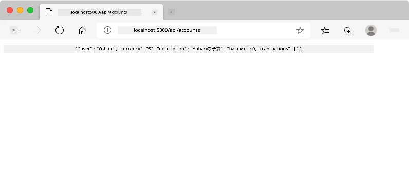

**確認すべきこと:**
- **ブラウザがAPIエンドポイントURLにリダイレクト**
- **新しく作成されたアカウントデータを含むJSON応答**
- **アカウントが正常に作成されたことを示すサーバー確認**

> 🧪 **実験タイム**: 同じユーザー名で再度登録してみてください。どのような応答が得られるか確認してください。これにより、サーバーが重複データやエラー条件をどのように処理するかを理解できます。

### JSON応答の理解

**サーバーがフォームを正常に処理した場合:**
```json
{
  "user": "john_doe",
  "currency": "$",
  "description": "Personal savings",
  "balance": 100,
  "id": "unique_account_id"
}
```

**この応答が確認すること:**
- **指定されたデータで新しいアカウントを作成**
- **将来の参照のためにユニークな識別子を割り当て**
- **検証のためにすべてのアカウント情報を返す**
- **データベースへの保存が成功したことを示す**

## JavaScriptによるモダンなフォーム処理

従来のフォーム送信は、宇宙ミッション初期のようにコース修正のために完全なシステムリセットを必要とするようなもので、ユーザー体験を妨げ、アプリケーションの状態を失います。

JavaScriptフォーム処理は、現代の宇宙船で使用される連続誘導システムのように機能し、ナビゲーションコンテキストを失うことなくリアルタイムで調整を行います。フォーム送信をインターセプトし、即時フィードバックを提供し、エラーを優雅に処理し、サーバー応答に基づいてインターフェースを更新しながら、アプリケーション内でユーザーの位置を維持できます。

### ページリロードを避ける理由

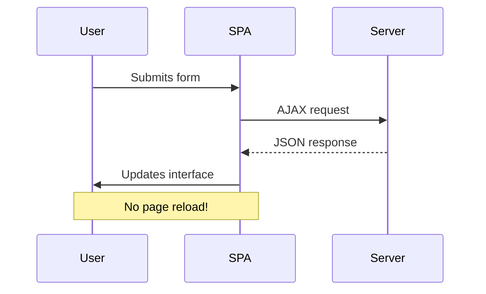

**JavaScriptフォーム処理の利点:**
- **アプリケーションの状態とユーザーコンテキストを維持**
- **即時フィードバックとロードインジケーターを提供**
- **動的なエラー処理と検証を可能にする**
- **スムーズでアプリのようなユーザー体験を作成**
- **サーバー応答に基づく条件付きロジックを許可**

### 従来のフォームからモダンフォームへの移行

**従来のアプローチの課題:**
- **ユーザーをアプリケーションから遠ざける**
- **現在のアプリケーション状態とコンテキストを失う**
- **単純な操作のためにページ全体をリロードする必要がある**
- **ユーザーフィードバックに対する制御が
```javascript
// Example of what FormData captures
const formData = new FormData(registerForm);

// FormData automatically captures:
// {
//   "user": "john_doe",
//   "currency": "$", 
//   "description": "Personal account",
//   "balance": "100"
// }
```

**FormData APIの利点:**
- **包括的な収集**: テキスト、ファイル、複雑な入力を含むすべてのフォーム要素をキャプチャ
- **型認識**: カスタムコーディングなしで異なる入力タイプを自動的に処理
- **効率性**: 単一のAPI呼び出しで手動フィールド収集を排除
- **適応性**: フォーム構造が進化しても機能を維持

### サーバー通信関数の作成

次に、モダンなJavaScriptパターンを使用してAPIサーバーと通信する堅牢な関数を構築しましょう:

```javascript
async function createAccount(account) {
  try {
    const response = await fetch('//localhost:5000/api/accounts', {
      method: 'POST',
      headers: { 
        'Content-Type': 'application/json',
        'Accept': 'application/json'
      },
      body: account
    });
    
    // Check if the response was successful
    if (!response.ok) {
      throw new Error(`HTTP error! status: ${response.status}`);
    }
    
    return await response.json();
  } catch (error) {
    console.error('Account creation failed:', error);
    return { error: error.message || 'Network error occurred' };
  }
}
```

**非同期JavaScriptの理解:**

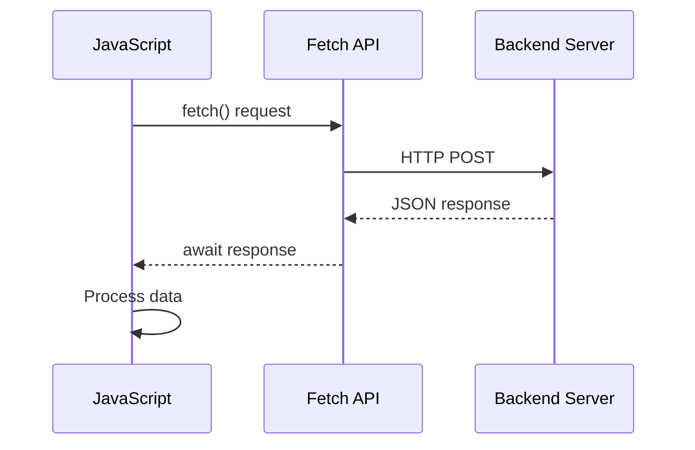

**このモダンな実装が達成すること:**
- **`async/await`を使用**して読みやすい非同期コードを実現
- **適切なエラーハンドリング**をtry/catchブロックで含む
- **レスポンスステータスを確認**してデータを処理する前にチェック
- **JSON通信のための適切なヘッダーを設定**
- **デバッグのための詳細なエラーメッセージを提供**
- **成功とエラーケースのための一貫したデータ構造を返す**

### モダンなFetch APIの力

**Fetch APIが従来の方法より優れている点:**

| 機能 | 利点 | 実装 |
|------|------|------|
| Promiseベース | クリーンな非同期コード | `await fetch()` |
| リクエストのカスタマイズ | HTTPの完全な制御 | ヘッダー、メソッド、ボディ |
| レスポンス処理 | 柔軟なデータ解析 | `.json()`, `.text()`, `.blob()` |
| エラーハンドリング | 包括的なエラーキャッチ | Try/catchブロック |

> 🎥 **さらに学ぶ**: [Async/Awaitチュートリアル](https://youtube.com/watch?v=YwmlRkrxvkk) - モダンなウェブ開発のための非同期JavaScriptパターンを理解する。

**サーバー通信の重要な概念:**
- **非同期関数**はサーバーの応答を待つために実行を一時停止可能
- **Awaitキーワード**は非同期コードを同期コードのように読みやすくする
- **Fetch API**はモダンでPromiseベースのHTTPリクエストを提供
- **エラーハンドリング**はネットワーク問題に対してアプリが優雅に対応することを保証

### 登録機能の完成

すべてを統合して、完全で実用的な登録機能を作成しましょう:

```javascript
async function register() {
  const registerForm = document.getElementById('registerForm');
  const submitButton = registerForm.querySelector('button[type="submit"]');
  
  try {
    // Show loading state
    submitButton.disabled = true;
    submitButton.textContent = 'Creating Account...';
    
    // Process form data
    const formData = new FormData(registerForm);
    const jsonData = JSON.stringify(Object.fromEntries(formData));
    
    // Send to server
    const result = await createAccount(jsonData);
    
    if (result.error) {
      console.error('Registration failed:', result.error);
      alert(`Registration failed: ${result.error}`);
      return;
    }
    
    console.log('Account created successfully!', result);
    alert(`Welcome, ${result.user}! Your account has been created.`);
    
    // Reset form after successful registration
    registerForm.reset();
    
  } catch (error) {
    console.error('Unexpected error:', error);
    alert('An unexpected error occurred. Please try again.');
  } finally {
    // Restore button state
    submitButton.disabled = false;
    submitButton.textContent = 'Create Account';
  }
}
```

**この強化された実装が含むもの:**
- **フォーム送信中の視覚的フィードバックを提供**
- **送信ボタンを無効化**して重複送信を防止
- **予期されたエラーと予期しないエラーの両方を優雅に処理**
- **ユーザーに優しい成功とエラーメッセージを表示**
- **登録成功後にフォームをリセット**
- **結果に関係なくUI状態を復元**

### 実装のテスト

**ブラウザの開発者ツールを開いて登録をテストする:**

1. **ブラウザコンソールを開く** (F12 → Consoleタブ)
2. **登録フォームに記入**
3. **「アカウント作成」をクリック**
4. **コンソールメッセージとユーザーフィードバックを確認**

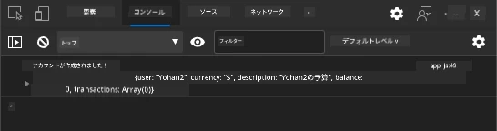

**期待される結果:**
- **送信ボタンにローディング状態**が表示される
- **コンソールログ**にプロセスの詳細情報が表示される
- **成功メッセージ**がアカウント作成成功時に表示される
- **フォームが自動的にリセット**される

> 🔒 **セキュリティに関する注意**: 現在、データはHTTPを介して送信されており、これは本番環境では安全ではありません。実際のアプリケーションでは、常にHTTPSを使用してデータ送信を暗号化してください。[HTTPSのセキュリティ](https://en.wikipedia.org/wiki/HTTPS)について学び、ユーザーデータを保護する重要性を理解しましょう。

### 🔄 **教育的チェックイン**
**モダンJavaScript統合**: 非同期フォーム処理の理解を確認:
- ✅ `event.preventDefault()`がデフォルトのフォーム動作をどのように変更するか
- ✅ FormData APIが手動フィールド収集より効率的な理由
- ✅ async/awaitパターンがコードの読みやすさをどのように向上させるか
- ✅ エラーハンドリングがユーザー体験において果たす役割

**システムアーキテクチャ**: あなたのフォーム処理は以下を示しています:
- **イベント駆動型プログラミング**: ページのリロードなしでユーザーアクションに応答
- **非同期通信**: サーバーリクエストがユーザーインターフェースをブロックしない
- **エラーハンドリング**: ネットワークリクエストが失敗した場合の優雅な劣化
- **状態管理**: サーバー応答を反映したUI更新
- **プログレッシブエンハンスメント**: 基本機能が動作し、JavaScriptがそれを強化

**プロフェッショナルパターン**: 以下を実装しました:
- **単一責任**: 関数が明確で焦点を絞った目的を持つ
- **エラーバウンダリー**: Try/catchブロックがアプリケーションのクラッシュを防止
- **ユーザーフィードバック**: ローディング状態と成功/エラーメッセージ
- **データ変換**: FormDataをJSONに変換してサーバー通信

## 包括的なフォームバリデーション

フォームバリデーションは、送信後にエラーを発見するというフラストレーションを防ぎます。国際宇宙ステーションの複数の冗長システムのように、効果的なバリデーションは複数の安全チェック層を採用します。

最適なアプローチは、即時フィードバックを提供するブラウザレベルのバリデーション、ユーザー体験を向上させるJavaScriptバリデーション、そしてセキュリティとデータ整合性を確保するサーバーサイドバリデーションを組み合わせることです。この冗長性により、ユーザー満足度とシステム保護が保証されます。

### バリデーション層の理解

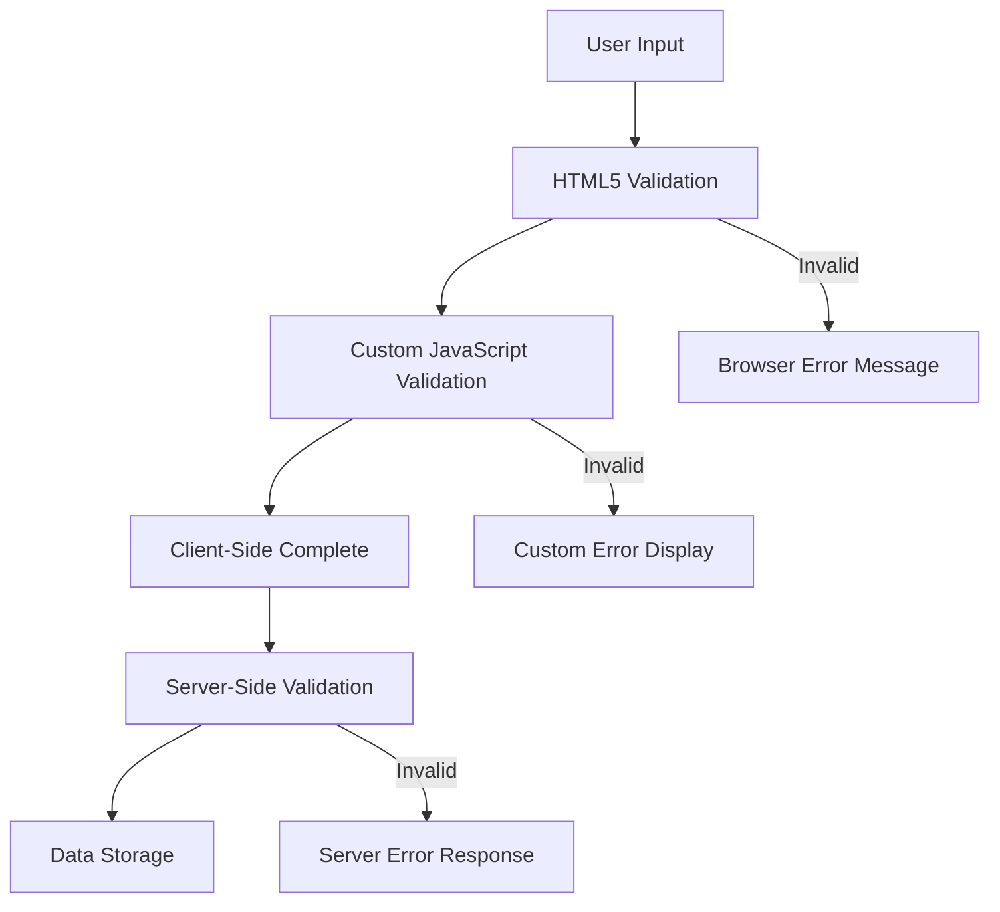

**多層バリデーション戦略:**
- **HTML5バリデーション**: 即時のブラウザベースのチェック
- **JavaScriptバリデーション**: カスタムロジックとユーザー体験
- **サーバーバリデーション**: 最終的なセキュリティとデータ整合性チェック
- **プログレッシブエンハンスメント**: JavaScriptが無効化されても動作

### HTML5バリデーション属性

**利用可能なモダンなバリデーションツール:**

| 属性 | 目的 | 使用例 | ブラウザの動作 |
|------|------|--------|---------------|
| `required` | 必須フィールド | `<input required>` | 空の送信を防止 |
| `minlength`/`maxlength` | テキスト長の制限 | `<input maxlength="20">` | 文字数制限を適用 |
| `min`/`max` | 数値範囲 | `<input min="0" max="1000">` | 数値の範囲を検証 |
| `pattern` | カスタム正規表現ルール | `<input pattern="[A-Za-z]+">` | 特定の形式に一致 |
| `type` | データ型のバリデーション | `<input type="email">` | 形式特有のバリデーション |

### CSSバリデーションスタイリング

**バリデーション状態の視覚的フィードバックを作成:**

```css
/* Valid input styling */
input:valid {
  border-color: #28a745;
  background-color: #f8fff9;
}

/* Invalid input styling */
input:invalid {
  border-color: #dc3545;
  background-color: #fff5f5;
}

/* Focus states for better accessibility */
input:focus:valid {
  box-shadow: 0 0 0 0.2rem rgba(40, 167, 69, 0.25);
}

input:focus:invalid {
  box-shadow: 0 0 0 0.2rem rgba(220, 53, 69, 0.25);
}
```

**これらの視覚的な手がかりが達成すること:**
- **緑の枠線**: 成功したバリデーションを示し、ミッションコントロールの緑のライトのように
- **赤の枠線**: 注意が必要なバリデーションエラーを示す
- **フォーカスハイライト**: 現在の入力位置に明確な視覚的コンテキストを提供
- **一貫したスタイリング**: ユーザーが学習できる予測可能なインターフェースパターンを確立

> 💡 **プロのヒント**: `:valid`と`:invalid`のCSS疑似クラスを使用して、ユーザーが入力する際に即時の視覚的フィードバックを提供し、応答性の高い役立つインターフェースを作成しましょう。

### 包括的なバリデーションの実装

登録フォームを強力なバリデーションで強化し、優れたユーザー体験とデータ品質を提供しましょう:

```html
<form id="registerForm" method="POST" novalidate>
  <div class="form-group">
    <label for="user">Username <span class="required">*</span></label>
    <input id="user" name="user" type="text" required 
           minlength="3" maxlength="20" 
           pattern="[a-zA-Z0-9_]+" 
           autocomplete="username"
           title="Username must be 3-20 characters, letters, numbers, and underscores only">
    <small class="form-text">Choose a unique username (3-20 characters)</small>
  </div>
  
  <div class="form-group">
    <label for="currency">Currency <span class="required">*</span></label>
    <input id="currency" name="currency" type="text" required 
           value="$" maxlength="3" 
           pattern="[A-Z$€£¥₹]+" 
           title="Enter a valid currency symbol or code">
    <small class="form-text">Currency symbol (e.g., $, €, £)</small>
  </div>
  
  <div class="form-group">
    <label for="description">Account Description</label>
    <input id="description" name="description" type="text" 
           maxlength="100" 
           placeholder="Personal savings, checking, etc.">
    <small class="form-text">Optional description (up to 100 characters)</small>
  </div>
  
  <div class="form-group">
    <label for="balance">Starting Balance</label>
    <input id="balance" name="balance" type="number" 
           value="0" min="0" step="0.01" 
           title="Enter a positive number for your starting balance">
    <small class="form-text">Initial account balance (minimum $0.00)</small>
  </div>
  
  <button type="submit">Create Account</button>
</form>
```

**強化されたバリデーションの理解:**
- **必須フィールドインジケーターを有用な説明と組み合わせ**
- **形式バリデーションのための`pattern`属性を含む**
- **アクセシビリティとツールチップのための`title`属性を提供**
- **ユーザー入力をガイドするヘルパーテキストを追加**
- **アクセシビリティ向上のためのセマンティックHTML構造を使用**

### 高度なバリデーションルール

**各バリデーションルールが達成すること:**

| フィールド | バリデーションルール | ユーザーの利点 |
|------------|---------------------|----------------|
| ユーザー名 | `required`, `minlength="3"`, `maxlength="20"`, `pattern="[a-zA-Z0-9_]+"` | 有効でユニークな識別子を保証 |
| 通貨 | `required`, `maxlength="3"`, `pattern="[A-Z$€£¥₹]+"` | 一般的な通貨記号を受け入れる |
| 残高 | `min="0"`, `step="0.01"`, `type="number"` | 負の残高を防止 |
| 説明 | `maxlength="100"` | 適切な長さの制限 |

### バリデーション動作のテスト

**これらのバリデーションシナリオを試してください:**
1. **必須フィールドが空の状態でフォームを送信**
2. **3文字未満のユーザー名を入力**
3. **ユーザー名フィールドに特殊文字を入力**
4. **負の残高額を入力**

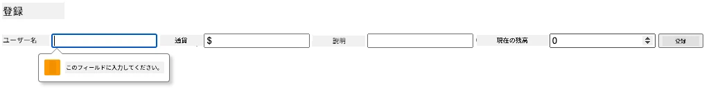

**観察されること:**
- **ブラウザがネイティブのバリデーションメッセージを表示**
- **`:valid`と`:invalid`状態に基づくスタイリングの変更**
- **すべてのバリデーションが通過するまでフォーム送信が防止**
- **フォーカスが自動的に最初の無効なフィールドに移動**

### クライアントサイド vs サーバーサイドバリデーション

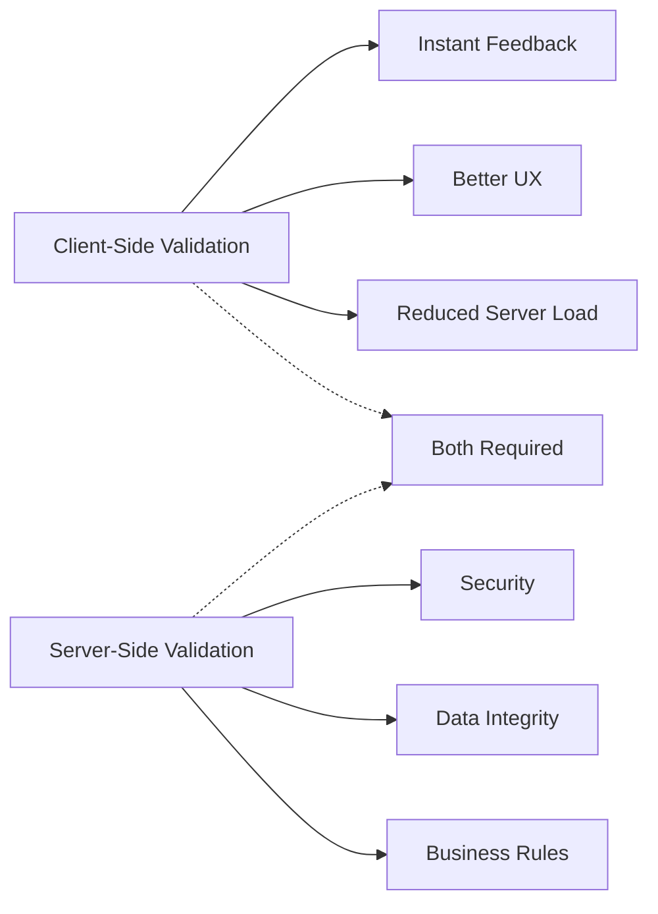

**両方の層が必要な理由:**
- **クライアントサイドバリデーション**: 即時フィードバックを提供し、ユーザー体験を向上
- **サーバーサイドバリデーション**: セキュリティを確保し、複雑なビジネスルールを処理
- **組み合わせたアプローチ**: 堅牢でユーザーフレンドリーかつ安全なアプリケーションを作成
- **プログレッシブエンハンスメント**: JavaScriptが無効化されても動作

> 🛡️ **セキュリティの注意**: クライアントサイドバリデーションだけを信用しないでください！悪意のあるユーザーはクライアントサイドチェックを回避できるため、サーバーサイドバリデーションはセキュリティとデータ整合性のために不可欠です。

### ⚡ **次の5分間でできること**
- [ ] 無効なデータでフォームをテストしてバリデーションメッセージを確認
- [ ] JavaScriptを無効化してHTML5バリデーションを試す
- [ ] ブラウザのDevToolsを開いてサーバーに送信されるフォームデータを確認
- [ ] 異なる入力タイプを試してモバイルキーボードの変化を確認

### 🎯 **この1時間で達成できること**
- [ ] レッスン後のクイズを完了し、フォーム処理の概念を理解
- [ ] リアルタイムフィードバックを伴う包括的なバリデーションチャレンジを実装
- [ ] CSSスタイリングを追加してプロフェッショナルなフォームを作成
- [ ] 重複したユーザー名やサーバーエラーのエラーハンドリングを作成
- [ ] パスワード確認フィールドを追加して一致するバリデーションを実装

### 📅 **1週間のフォームマスタリーの旅**
- [ ] 高度なフォーム機能を備えた完全なバンキングアプリを完成
- [ ] プロフィール写真やドキュメントのアップロード機能を実装
- [ ] 進捗インジケーターと状態管理を備えたマルチステップフォームを追加
- [ ] ユーザー選択に基づいて適応する動的フォームを作成
- [ ] ユーザー体験を向上させるフォームの自動保存と復元を実装
- [ ] メール確認や電話番号フォーマットなどの高度なバリデーションを追加

### 🌟 **1か月間のフロントエンド開発マスタリー**
- [ ] 条件付きロジックとワークフローを備えた複雑なフォームアプリケーションを構築
- [ ] 高速開発のためのフォームライブラリやフレームワークを学ぶ
- [ ] アクセシビリティガイドラインと包括的なデザイン原則を習得
- [ ] グローバルフォームのための国際化とローカライズを実装
- [ ] 再利用可能なフォームコンポーネントライブラリとデザインシステムを作成
- [ ] オープンソースのフォームプロジェクトに貢献し、ベストプラクティスを共有

## 🎯 フォーム開発マスタリータイムライン

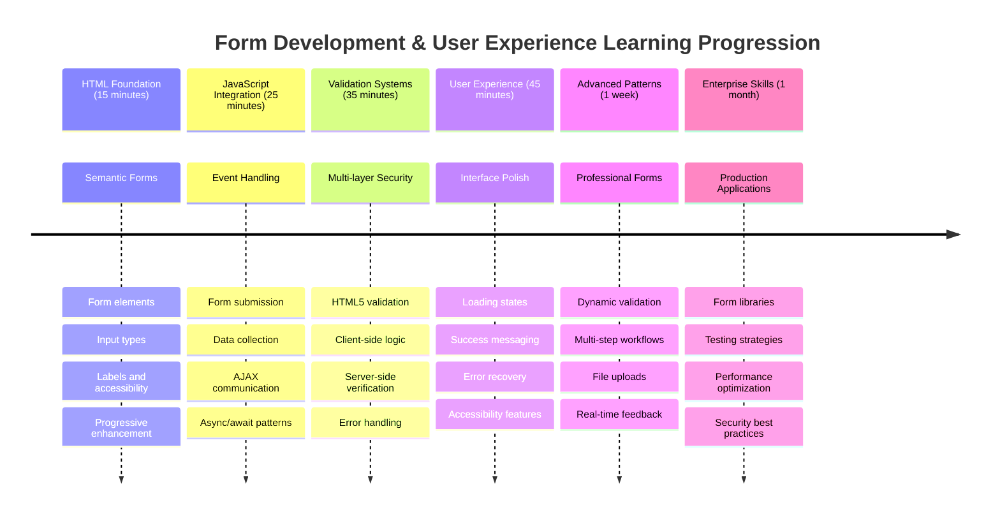

### 🛠️ フォーム開発ツールキットのまとめ

このレッスンを完了した後、以下を習得しました:
- **HTML5フォーム**: セマンティック構造、入力タイプ、アクセシビリティ機能
- **JavaScriptフォーム処理**: イベント管理、データ収集、AJAX通信
- **バリデーションアーキテクチャ**: セキュリティとユーザー体験のための多層バリデーション
- **非同期プログラミング**: モダンなFetch APIとasync/awaitパターン
- **エラーマネジメント**: 包括的なエラーハンドリングとユーザーフィードバックシステム
- **ユーザー体験デザイン**: ローディング状態、成功メッセージ、エラー回復
- **プログレッシブエンハンスメント**: すべてのブラウザと機能で動作するフォーム

**実世界での応用**: フォーム開発スキルは以下に直接適用できます:
- **Eコマースアプリケーション**: チェックアウトプロセス、アカウント登録、支払いフォーム
- **エンタープライズソフトウェア**: データ入力システム、レポートインターフェース、ワークフローアプリケーション
- **コンテンツ管理**: パブリッシングプラットフォーム、ユーザー生成コンテンツ、管理インターフェース
- **金融アプリケーション**: 銀行インターフェース、投資プラットフォーム、取引システム

**プロンプト:** 登録フォームの完全なバリデーションシステムを作成してください。以下を含めること：1) ユーザーが入力するたびにリアルタイムで各フィールドを検証するフィードバック、2) 各入力フィールドの下に表示されるカスタムバリデーションメッセージ、3) パスワード確認フィールドと一致するバリデーション、4) 有効なフィールドには緑のチェックマーク、無効なフィールドには赤い警告などの視覚的なインジケーター、5) すべてのバリデーションが通った場合のみ有効になる送信ボタン。HTML5のバリデーション属性、CSSによるバリデーション状態のスタイリング、JavaScriptによるインタラクティブな動作を使用してください。

[agent mode](https://code.visualstudio.com/blogs/2025/02/24/introducing-copilot-agent-mode)について詳しくはこちらをご覧ください。

## 🚀 チャレンジ

ユーザーが既に存在する場合、HTMLにエラーメッセージを表示してください。

以下は、CSSスタイルを追加した後のログインページの最終的な例です：

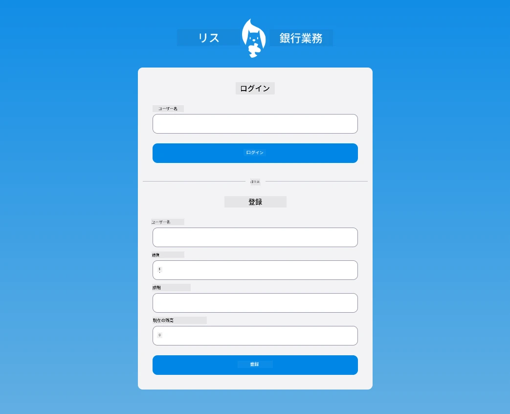

## 講義後のクイズ

[講義後のクイズ](https://ff-quizzes.netlify.app/web/quiz/44)

## レビューと自己学習

開発者はフォーム作成に関して非常に創造的になっており、特にバリデーション戦略に関して工夫を凝らしています。[CodePen](https://codepen.com)を見て、さまざまなフォームフローについて学び、興味深くインスピレーションを与えるフォームを見つけてみてください。

## 課題

[銀行アプリをスタイリングする](assignment.md)

---

**免責事項**:  
この文書はAI翻訳サービス[Co-op Translator](https://github.com/Azure/co-op-translator)を使用して翻訳されています。正確性を追求していますが、自動翻訳には誤りや不正確な部分が含まれる可能性があります。元の言語で記載された文書が正式な情報源とみなされるべきです。重要な情報については、専門の人間による翻訳を推奨します。この翻訳の使用に起因する誤解や誤解について、当社は責任を負いません。