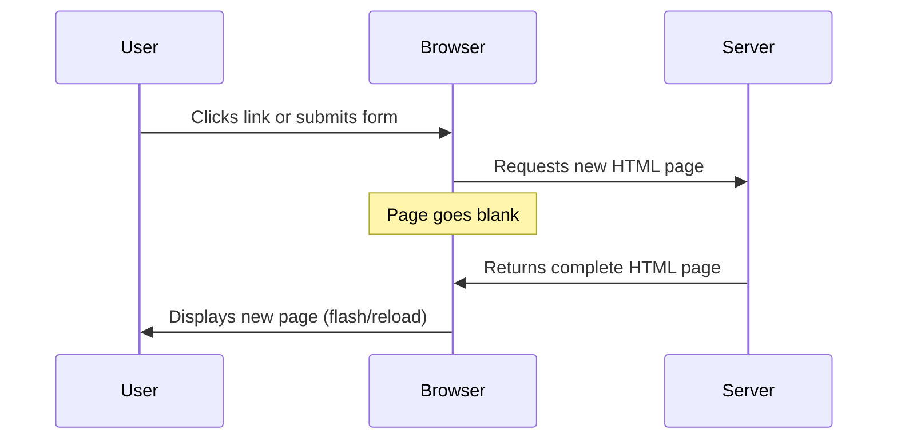
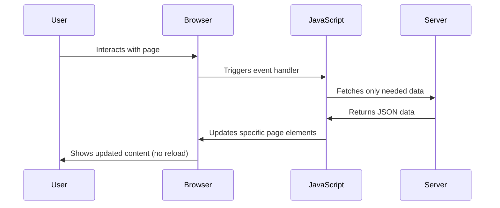
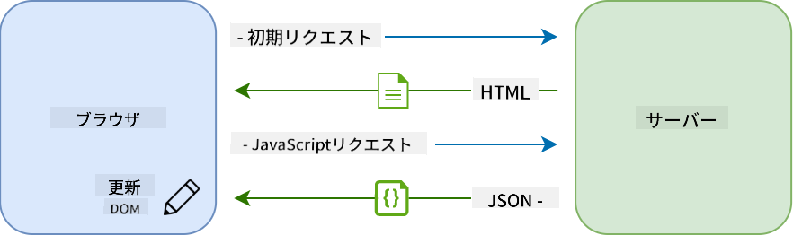
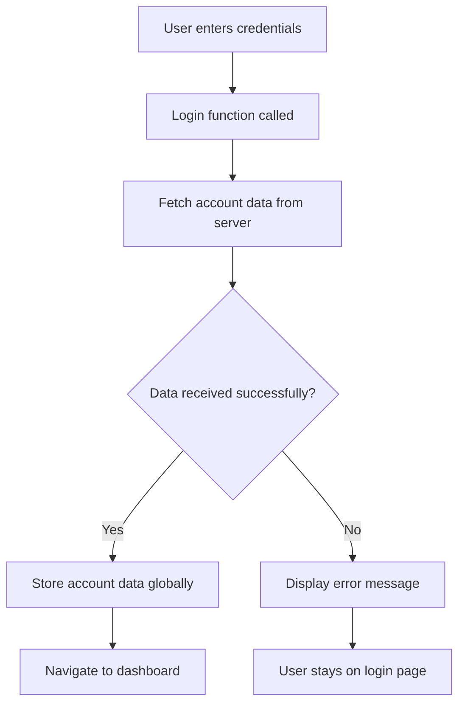
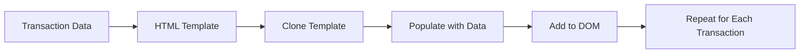

<!--
CO_OP_TRANSLATOR_METADATA:
{
  "original_hash": "2c1164912414820c8efd699b43f64954",
  "translation_date": "2025-10-24T15:07:15+00:00",
  "source_file": "7-bank-project/3-data/README.md",
  "language_code": "ja"
}
-->
# 銀行アプリを作成するパート3：データの取得と利用方法

『スタートレック』のエンタープライズのコンピュータを思い浮かべてください。ピカード艦長が船の状況を尋ねると、インターフェース全体がシャットダウンして再構築されることなく、情報が瞬時に表示されます。このシームレスな情報の流れこそが、動的なデータ取得を通じてここで構築しようとしているものです。

現在、あなたの銀行アプリは印刷された新聞のようなものです。情報はありますが静的です。これをNASAのミッションコントロールのように、データが継続的に流れ、リアルタイムで更新され、ユーザーの作業を中断しないものに変えていきます。

サーバーと非同期で通信し、異なるタイミングで到着するデータを処理し、生の情報をユーザーにとって意味のあるものに変換する方法を学びます。これがデモと本番用ソフトウェアの違いです。

## 講義前のクイズ

[講義前のクイズ](https://ff-quizzes.netlify.app/web/quiz/45)

### 前提条件

データ取得に進む前に、以下のコンポーネントを準備してください：

- **前回のレッスン**：[ログインと登録フォーム](../2-forms/README.md)を完了してください - これを基盤として構築します
- **ローカルサーバー**：[Node.js](https://nodejs.org)をインストールし、[サーバーAPIを実行](../api/README.md)してアカウントデータを提供します
- **API接続**：以下のコマンドでサーバー接続をテストします：

```bash
curl http://localhost:5000/api
# Expected response: "Bank API v1.0.0"
```

この簡単なテストで、すべてのコンポーネントが正しく通信していることを確認します：
- Node.jsがシステム上で正しく動作していることを検証
- APIサーバーがアクティブで応答していることを確認
- アプリがサーバーに到達できることを検証（ミッション前の無線接続確認のようなものです）

---

## 現代のウェブアプリにおけるデータ取得の理解

ウェブアプリケーションがデータを処理する方法は、過去20年間で劇的に進化しました。この進化を理解することで、AJAXやFetch APIのような現代的な技術がなぜ強力で、ウェブ開発者にとって必須のツールとなったのかを理解する助けになります。

従来のウェブサイトがどのように動作していたかと、今日構築する動的で応答性の高いアプリケーションを比較してみましょう。

### 従来のマルチページアプリケーション（MPA）

ウェブの初期では、クリックするたびに古いテレビのチャンネルを変えるようなものでした。画面が真っ暗になり、新しいコンテンツにゆっくりと切り替わる。このような状況が初期のウェブアプリケーションの現実であり、すべての操作がページ全体をゼロから再構築することを意味していました。




**このアプローチがぎこちなく感じられる理由：**
- クリックするたびにページ全体をゼロから再構築する必要がある
- ユーザーが考え中にページの点滅で中断される
- インターネット接続がヘッダーやフッターを何度もダウンロードするために過剰に働く
- アプリがソフトウェアというよりもファイリングキャビネットをクリックしているように感じられる

### 現代のシングルページアプリケーション（SPA）

AJAX（非同期JavaScriptとXML）はこのパラダイムを完全に変えました。国際宇宙ステーションのモジュール設計のように、宇宙飛行士が全体を再構築することなく個々のコンポーネントを交換できるように、AJAXはウェブページの特定の部分を再読み込みせずに更新することを可能にします。名前にXMLが含まれているにもかかわらず、今日では主にJSONを使用しますが、基本的な原則は変わりません：変更が必要な部分だけを更新する。





**SPAがより快適に感じられる理由：**
- 実際に変更された部分だけが更新される（賢いですよね？）
- 突然の中断がなくなる - ユーザーは流れに乗ったまま
- ワイヤを通じて移動するデータが少なくなるため、読み込みが速くなる
- すべてがスナッピーで応答性が高く、スマホのアプリのように感じられる

### 現代のFetch APIへの進化

現代のブラウザは[`Fetch` API](https://developer.mozilla.org/docs/Web/API/Fetch_API)を提供しており、古い[`XMLHttpRequest`](https://developer.mozilla.org/docs/Web/API/XMLHttpRequest/Using_XMLHttpRequest)を置き換えます。電報を操作するのとメールを使う違いのように、Fetch APIはクリーンな非同期コードのためにプロミスを使用し、JSONを自然に処理します。

| 機能 | XMLHttpRequest | Fetch API |
|------|---------------|-----------|
| **構文** | 複雑なコールバックベース | クリーンなプロミスベース |
| **JSON処理** | 手動での解析が必要 | 組み込みの`.json()`メソッド |
| **エラー処理** | 限られたエラー情報 | 包括的なエラー詳細 |
| **現代的なサポート** | レガシー互換性 | ES6+プロミスとasync/await |

> 💡 **ブラウザ互換性**：朗報です - Fetch APIはすべての現代的なブラウザで動作します！特定のバージョンについて興味がある場合は、[caniuse.com](https://caniuse.com/fetch)で完全な互換性情報を確認できます。
> 
**要点：**
- Chrome、Firefox、Safari、Edgeで素晴らしく動作（つまり、ユーザーがいる場所でほぼすべて）
- Internet Explorerだけは追加の対応が必要（正直なところ、IEはそろそろ手放す時です）
- 後で使用するエレガントなasync/awaitパターンに完璧に対応

### ユーザーログインとデータ取得の実装

次に、銀行アプリを静的な表示から機能的なアプリケーションに変えるログインシステムを実装します。安全な軍事施設で使用される認証プロトコルのように、ユーザーの資格情報を確認し、その特定のデータへのアクセスを提供します。

基本的な認証から始め、データ取得機能を追加して段階的に構築していきます。

#### ステップ1：ログイン機能の基盤を作成

`app.js`ファイルを開き、新しい`login`関数を追加します。この関数はユーザー認証プロセスを処理します：

```javascript
async function login() {
  const loginForm = document.getElementById('loginForm');
  const user = loginForm.user.value;
}
```

**これを分解して説明します：**
- `async`キーワードはJavaScriptに「この関数は待機が必要かもしれない」と伝えます
- ページからフォームを取得（特別なことはせず、IDで見つけるだけ）
- 次に、ユーザーが入力したユーザー名を取得
- 便利なトリック：フォーム入力の`name`属性を使ってアクセス可能 - 追加のgetElementById呼び出しは不要！

> 💡 **フォームアクセスパターン**：すべてのフォームコントロールは、HTMLで`name`属性を使用して設定された名前としてフォーム要素のプロパティとしてアクセスできます。これにより、フォームデータを取得するためのクリーンで読みやすい方法が提供されます。

#### ステップ2：アカウントデータ取得関数を作成

次に、サーバーからアカウントデータを取得する専用関数を作成します。これは登録関数と同じパターンに従いますが、データ取得に焦点を当てています：

```javascript
async function getAccount(user) {
  try {
    const response = await fetch('//localhost:5000/api/accounts/' + encodeURIComponent(user));
    return await response.json();
  } catch (error) {
    return { error: error.message || 'Unknown error' };
  }
}
```

**このコードが達成すること：**
- **モダンな**`fetch` APIを使用して非同期でデータをリクエスト
- **GETリクエストURLを**ユーザー名パラメータで構築
- **特殊文字を安全に処理するために**`encodeURIComponent()`を適用
- **レスポンスを**JSON形式に変換して簡単にデータ操作
- **エラーを**クラッシュする代わりにエラーオブジェクトを返すことで優雅に処理

> ⚠️ **セキュリティ注意**：`encodeURIComponent()`関数はURL内の特殊文字を処理します。海軍通信で使用されるエンコードシステムのように、"#"や"&"などの文字が誤解されることなく、意図した通りにメッセージが届くことを保証します。
> 
**これが重要な理由：**
- 特殊文字がURLを壊すのを防ぐ
- URL操作攻撃から保護
- サーバーが意図したデータを受け取ることを保証
- 安全なコーディングプラクティスに従う

#### HTTP GETリクエストの理解

驚くかもしれませんが、`fetch`を追加オプションなしで使用すると、自動的に[`GET`](https://developer.mozilla.org/docs/Web/HTTP/Methods/GET)リクエストを作成します。これは、サーバーに「このユーザーのアカウントデータを見せてもらえますか？」と尋ねるのに最適です。

GETリクエストは、図書館で本を借りるように既存のものを要求することに似ています。POSTリクエスト（登録時に使用したもの）は、新しい本をコレクションに追加するようなものです。

| GETリクエスト | POSTリクエスト |
|--------------|---------------|
| **目的** | 既存データを取得 | 新しいデータをサーバーに送信 |
| **パラメータ** | URLパス/クエリ文字列内 | リクエストボディ内 |
| **キャッシュ** | ブラウザによるキャッシュ可能 | 通常キャッシュされない |
| **セキュリティ** | URL/ログに表示される | リクエストボディ内で非表示 |

#### ステップ3：すべてをまとめる

さて、満足感のある部分です。アカウント取得関数をログインプロセスに接続しましょう。これがすべてがうまく機能する瞬間です：

```javascript
async function login() {
  const loginForm = document.getElementById('loginForm');
  const user = loginForm.user.value;
  const data = await getAccount(user);

  if (data.error) {
    return console.log('loginError', data.error);
  }

  account = data;
  navigate('/dashboard');
}
```

この関数は明確な手順に従います：
- フォーム入力からユーザー名を抽出
- サーバーからユーザーのアカウントデータをリクエスト
- プロセス中に発生するエラーを処理
- アカウントデータを保存し、成功時にダッシュボードに移動

> 🎯 **Async/Awaitパターン**：`getAccount`は非同期関数であるため、`await`キーワードを使用してサーバーが応答するまで実行を一時停止します。これにより、未定義のデータでコードが続行するのを防ぎます。

#### ステップ4：データの保存場所を作成

アカウント情報が読み込まれたら、それを保持する場所がアプリに必要です。これはアプリの短期記憶のようなもので、現在のユーザーのデータを手元に置いておく場所です。`app.js`ファイルの冒頭にこの行を追加してください：

```javascript
// This holds the current user's account data
let account = null;
```

**これが必要な理由：**
- アプリ内のどこからでもアカウントデータにアクセス可能
- `null`で始めることで「まだ誰もログインしていない」ことを示す
- 誰かがログインまたは登録に成功したときに更新される
- 単一の真実の情報源として機能 - 誰がログインしているか混乱しない

#### ステップ5：フォームを接続する

新しいログイン機能をHTMLフォームに接続しましょう。フォームタグを次のように更新します：

```html
<form id="loginForm" action="javascript:login()">
  <!-- Your existing form inputs -->
</form>
```

**この小さな変更がすること：**
- フォームがデフォルトの「ページ全体を再読み込みする」動作を停止
- カスタムJavaScript関数を呼び出す
- すべてをスムーズでシングルページアプリのように保つ
- ユーザーが「ログイン」を押したときに何が起こるかを完全に制御

#### ステップ6：登録機能を強化する

一貫性のために、登録機能を更新してアカウントデータを保存し、ダッシュボードに移動するようにします：

```javascript
// Add these lines at the end of your register function
account = result;
navigate('/dashboard');
```

**この強化が提供するもの：**
- **シームレスな**登録からダッシュボードへの移行
- **一貫した**ログインと登録フロー間のユーザー体験
- **即時の**登録成功後のアカウントデータへのアクセス

#### 実装のテスト



**試してみる時間です：**
1. 新しいアカウントを作成してすべてが機能していることを確認
2. 同じ資格情報でログインしてみる
3. 何か問題がある場合はブラウザのコンソール（F12）を確認
4. 成功したログイン後にダッシュボードに到達することを確認

何かがうまくいかない場合でも、慌てないでください！ほとんどの問題はタイプミスやAPIサーバーの起動忘れなどの簡単な修正です。

#### クロスオリジンの仕組みについての簡単な説明

「異なるポートで動作しているAPIサーバーとウェブアプリがどのように通信しているの？」と思うかもしれません。良い質問です！これはすべてのウェブ開発者が最終的に直面する問題です。

> 🔒 **クロスオリジンセキュリティ**：ブラウザは「同一オリジンポリシー」を強制して、異なるドメイン間の不正な通信を防ぎます。ペンタゴンのチェックポイントシステムのように、データ転送を許可する前に通信が認可されていることを確認します。
> 
**私たちのセットアップでは：**
- ウェブアプリは`localhost:3000`（開発サーバー）で動作
- APIサーバーは`localhost:5000`（バックエンドサーバー）で動作
- APIサーバーは[CORSヘッダー](https://developer.mozilla.org/docs/Web/HTTP/CORS)を含み、ウェブアプリからの通信を明示的に許可

この構成は、フロントエンドとバックエンドアプリケーションが通常別々のサーバーで動作する現実の開発を反映しています。

> 📚 **さらに学ぶ**：APIとデータ取得について詳しく学ぶには、この包括的な[Microsoft Learnモジュール](https://docs.microsoft.com/learn/modules/use-apis-discover-museum-art/?WT.mc_id=academic-77807-sagibbon)をご覧ください。

## HTMLでデータを生き生きと表示する

次に、取得したデータをDOM操作を通じてユーザーに表示します。暗室で写真を現像するプロセスのように、見えないデータをユーザーが見て操作できるものにレンダリングします。

DOM操作は、静的なウェブページをユーザーの操作やサーバーの応答に基づいてコンテンツを更新する動的なアプリケーションに変える技術です。

### 適切なツールを選ぶ

JavaScriptでHTMLを更新する際には、いくつかの選択肢があります。これらはツールボックスの中の異なるツールのようなもので、それぞれ特定の仕事に最適です：

| メソッド | 得意なこと | 使用するタイミング | 安全性 |
|---------|-----------|------------------|-------|
| `textContent` | ユーザーデータを安全に表示 | テキストを表示
より複雑な内容については、[`document.createElement()`](https://developer.mozilla.org/docs/Web/API/Document/createElement) と [`append()`](https://developer.mozilla.org/docs/Web/API/ParentNode/append) メソッドを組み合わせて使用します:

```javascript
// Safe way to create new elements
const transactionItem = document.createElement('div');
transactionItem.className = 'transaction-item';
transactionItem.textContent = `${transaction.date}: ${transaction.description}`;
container.append(transactionItem);
```

**このアプローチの理解:**
- **新しい** DOM 要素をプログラムで作成
- **要素の属性や内容を完全に**コントロール
- **複雑でネストされた**要素構造を作成可能
- **セキュリティを維持**しながら構造と内容を分離

> ⚠️ **セキュリティに関する考慮事項**: [`innerHTML`](https://developer.mozilla.org/docs/Web/API/Element/innerHTML) は多くのチュートリアルで紹介されていますが、埋め込まれたスクリプトを実行する可能性があります。CERNのセキュリティプロトコルが不正なコードの実行を防ぐように、`textContent` や `createElement` を使用することでより安全な代替手段を提供します。
> 
**innerHTMLのリスク:**
- ユーザーデータ内の `<script>` タグを実行する可能性がある
- コードインジェクション攻撃に対して脆弱
- セキュリティ上の脆弱性を生む可能性がある
- 安全な代替手段を使用することで同等の機能を提供

### エラーをユーザーに分かりやすくする

現在、ログインエラーはブラウザのコンソールにのみ表示され、ユーザーには見えません。これは、パイロットの内部診断と乗客向け情報システムの違いのようなもので、重要な情報を適切なチャンネルで伝える必要があります。

エラーメッセージを画面に表示することで、何が問題だったのか、次にどうすればよいかをユーザーに即座にフィードバックできます。

#### ステップ 1: エラーメッセージの表示場所を追加

まず、HTMLにエラーメッセージを表示する場所を作りましょう。ログインボタンのすぐ前に追加すると、ユーザーが自然に目にする位置になります:

```html
<!-- This is where error messages will appear -->
<div id="loginError" role="alert"></div>
<button>Login</button>
```

**ここでのポイント:**
- 必要になるまで非表示の空のコンテナを作成
- ユーザーが「ログイン」をクリックした後に自然に目を向ける位置に配置
- `role="alert"` はスクリーンリーダーに「これは重要だよ！」と伝える便利な属性
- ユニークな `id` により、JavaScript が簡単にターゲット可能

#### ステップ 2: 便利なヘルパー関数を作成

任意の要素のテキストを更新できる小さなユーティリティ関数を作りましょう。これは「一度書いてどこでも使える」関数で、時間を節約できます:

```javascript
function updateElement(id, text) {
  const element = document.getElementById(id);
  element.textContent = text;
}
```

**関数の利点:**
- 要素IDとテキスト内容だけを必要とするシンプルなインターフェース
- DOM要素を安全に検索して更新
- 再利用可能なパターンでコードの重複を削減
- アプリ全体で一貫した更新動作を維持

#### ステップ 3: ユーザーが見える場所にエラーを表示

次に、隠れたコンソールメッセージをユーザーが実際に見えるものに置き換えましょう。ログイン関数を更新します:

```javascript
// Instead of just logging to console, show the user what's wrong
if (data.error) {
  return updateElement('loginError', data.error);
}
```

**この小さな変更が大きな違いを生む:**
- エラーメッセージがユーザーの視線の先に表示される
- 謎の沈黙による失敗がなくなる
- ユーザーに即座に実行可能なフィードバックを提供
- アプリがプロフェッショナルで配慮のある印象を与える

無効なアカウントでテストすると、ページ上に役立つエラーメッセージが表示されるのが確認できます！


#### ステップ 4: アクセシビリティを考慮する

先ほど追加した `role="alert"` の素晴らしい点は、単なる装飾ではないことです。この属性は [Live Region](https://developer.mozilla.org/docs/Web/Accessibility/ARIA/ARIA_Live_Regions) を作成し、スクリーンリーダーに変更を即座に通知します:

```html
<div id="loginError" role="alert"></div>
```

**これが重要な理由:**
- スクリーンリーダーのユーザーはエラーメッセージをすぐに聞くことができる
- どのように操作しても、全員が同じ重要な情報を得られる
- アプリをより多くの人に使いやすくする簡単な方法
- 包摂的な体験を作ることへの配慮を示す

こうした小さな工夫が、良い開発者と優れた開発者を分けるのです！

#### ステップ 5: 登録フォームにも同じパターンを適用

一貫性を保つため、登録フォームにも同じエラー処理を実装します:

1. **登録HTMLに**エラーメッセージ表示要素を追加:
```html
<div id="registerError" role="alert"></div>
```

2. **登録関数を更新して**同じエラーメッセージ表示パターンを使用:
```javascript
if (data.error) {
  return updateElement('registerError', data.error);
}
```

**一貫したエラー処理の利点:**
- **すべてのフォームで**統一されたユーザー体験を提供
- **馴染みのあるパターンを使用して**認知負荷を軽減
- **再利用可能なコードで**メンテナンスを簡素化
- **アプリ全体で**アクセシビリティ基準を満たす

## ダイナミックなダッシュボードの作成

次に、静的なダッシュボードをリアルタイムでアカウントデータを表示する動的なインターフェースに変えます。印刷されたフライトスケジュールと空港のライブ出発ボードの違いのように、静的情報からリアルタイムで応答する表示へと移行します。

学んだDOM操作技術を使って、現在のアカウント情報を自動的に更新するダッシュボードを作成します。

### データを理解する

構築を始める前に、サーバーが返すデータの種類を確認しましょう。ログインが成功すると、以下のような情報が得られます:

```json
{
  "user": "test",
  "currency": "$",
  "description": "Test account",
  "balance": 75,
  "transactions": [
    { "id": "1", "date": "2020-10-01", "object": "Pocket money", "amount": 50 },
    { "id": "2", "date": "2020-10-03", "object": "Book", "amount": -10 },
    { "id": "3", "date": "2020-10-04", "object": "Sandwich", "amount": -5 }
  ]
}
```

**このデータ構造が提供するもの:**
- **`user`**: 個別の体験をパーソナライズするのに最適（「お帰りなさい、Sarahさん！」）
- **`currency`**: 金額を正しく表示するために必要
- **`description`**: アカウントの親しみやすい名前
- **`balance`**: 最も重要な現在の残高
- **`transactions`**: すべての詳細を含む完全な取引履歴

プロフェッショナルな銀行ダッシュボードを構築するために必要なすべてが揃っています！

> 💡 **プロのヒント**: ダッシュボードをすぐに動作させたいですか？ログイン時にユーザー名 `test` を使用してください。サンプルデータが事前にロードされているので、最初に取引を作成する必要なくすべてが動作するのを確認できます。
> 
**テストアカウントが便利な理由:**
- 現実的なサンプルデータがすでにロードされている
- 取引がどのように表示されるかを確認するのに最適
- ダッシュボード機能をテストするのに便利
- ダミーデータを手動で作成する手間を省ける

### ダッシュボード表示要素の作成

まず、アカウント概要情報を作成し、その後、取引リストなどのより複雑な機能に進みます。

#### ステップ 1: HTML構造を更新

まず、静的な「残高」セクションを動的なプレースホルダー要素に置き換え、JavaScriptで値を埋め込めるようにします:

```html
<section>
  Balance: <span id="balance"></span><span id="currency"></span>
</section>
```

次に、アカウントの説明セクションを追加します。これはダッシュボードコンテンツのタイトルとして機能するため、セマンティックHTMLを使用します:

```html
<h2 id="description"></h2>
```

**HTML構造の理解:**
- **個別の制御のために**残高と通貨を別々の `<span>` 要素で使用
- **JavaScriptターゲット用に**各要素にユニークなIDを適用
- **セマンティックHTMLを遵守し** `<h2>` をアカウント説明に使用
- **スクリーンリーダーやSEOのために**論理的な階層を作成

> ✅ **アクセシビリティの洞察**: アカウント説明はダッシュボードコンテンツのタイトルとして機能するため、セマンティックに見出しとしてマークアップされています。[見出し構造](https://www.nomensa.com/blog/2017/how-structure-headings-web-accessibility) がアクセシビリティに与える影響について詳しく学びましょう。ページ上の他の要素で見出しタグが役立つ可能性があるものを特定できますか？

#### ステップ 2: ダッシュボード更新関数を作成

次に、実際のアカウントデータでダッシュボードを埋める関数を作成します:

```javascript
function updateDashboard() {
  if (!account) {
    return navigate('/login');
  }

  updateElement('description', account.description);
  updateElement('balance', account.balance.toFixed(2));
  updateElement('currency', account.currency);
}
```

**この関数が行うことのステップバイステップ:**
- **アカウントデータが存在するかを検証**してから処理を進める
- **認証されていないユーザーをログインページにリダイレクト**
- **再利用可能な `updateElement` 関数を使用して**アカウント説明を更新
- **残高を常に小数点以下2桁で表示するようにフォーマット**
- **適切な通貨記号を表示**

> 💰 **金額のフォーマット**: [`toFixed(2)`](https://developer.mozilla.org/docs/Web/JavaScript/Reference/Global_Objects/Number/toFixed) メソッドは非常に便利です！これにより、残高が常に「75.00」のように実際のお金のように見えるようになります。ユーザーは馴染みのある通貨フォーマットを目にすることを喜ぶでしょう。

#### ステップ 3: ダッシュボードが更新されることを確認

誰かがダッシュボードを訪れるたびに最新のデータで更新されるようにするには、ナビゲーションシステムにフックする必要があります。[レッスン1の課題](../1-template-route/assignment.md) を完了していれば、これに慣れているはずです。そうでない場合も心配ありません - 以下を参考にしてください:

`updateRoute()` 関数の末尾にこれを追加します:

```javascript
if (typeof route.init === 'function') {
  route.init();
}
```

次に、ダッシュボード初期化を含むようにルートを更新します:

```javascript
const routes = {
  '/login': { templateId: 'login' },
  '/dashboard': { templateId: 'dashboard', init: updateDashboard }
};
```

**この巧妙なセットアップが行うこと:**
- ルートに特別な初期化コードがあるかを確認
- ルートが読み込まれると自動的にそのコードを実行
- ダッシュボードが常に最新のデータを表示することを保証
- ルーティングロジックをクリーンで整理された状態に保つ

#### ダッシュボードのテスト

これらの変更を実装した後、ダッシュボードをテストします:

1. **テストアカウントでログイン**
2. **ダッシュボードにリダイレクトされることを確認**
3. **アカウント説明、残高、通貨が正しく表示されるか確認**
4. **ログアウトして再ログインして**データが正しく更新されるか確認

これで、ログインしたユーザーのデータに基づいて動的なアカウント情報を表示するダッシュボードが完成しました！

## テンプレートを使ったスマートな取引リストの作成

各取引のHTMLを手動で作成する代わりに、テンプレートを使用して一貫したフォーマットを自動的に生成します。宇宙船製造で使用される標準化されたコンポーネントのように、テンプレートはすべての取引行が同じ構造と外観を持つことを保証します。

この技術は、数件の取引から数千件の取引まで効率的にスケールし、一貫したパフォーマンスとプレゼンテーションを維持します。



### ステップ 1: 取引テンプレートを作成

まず、HTML `<body>` に取引行の再利用可能なテンプレートを追加します:

```html
<template id="transaction">
  <tr>
    <td></td>
    <td></td>
    <td></td>
  </tr>
</template>
```

**HTMLテンプレートの理解:**
- **単一のテーブル行の構造を定義**
- **JavaScriptでクローンされて操作されるまで**非表示
- **日付、説明、金額の3つのセルを含む**
- **一貫したフォーマットのための再利用可能なパターンを提供**

### ステップ 2: 動的コンテンツ用にテーブルを準備

次に、テーブルボディに `id` を追加して、JavaScriptが簡単にターゲットできるようにします:

```html
<tbody id="transactions"></tbody>
```

**これが達成すること:**
- **取引行を挿入するための明確なターゲットを作成**
- **テーブル構造を動的コンテンツから分離**
- **取引データの簡単なクリアと再挿入を可能にする**

### ステップ 3: 取引行生成関数を作成

次に、取引データをHTML要素に変換する関数を作成します:

```javascript
function createTransactionRow(transaction) {
  const template = document.getElementById('transaction');
  const transactionRow = template.content.cloneNode(true);
  const tr = transactionRow.querySelector('tr');
  tr.children[0].textContent = transaction.date;
  tr.children[1].textContent = transaction.object;
  tr.children[2].textContent = transaction.amount.toFixed(2);
  return transactionRow;
}
```

**この生成関数の分解:**
- **テンプレート要素をIDで取得**
- **安全に操作するためにテンプレートコンテンツをクローン**
- **クローンされたコンテンツ内のテーブル行を選択**
- **各セルに取引データを入力**
- **金額を適切な小数点以下の桁数でフォーマット**
- **挿入準備が整った完成行を返す**

### ステップ 4: 複数の取引行を効率的に生成

`updateDashboard()` 関数に以下のコードを追加して、すべての取引を表示します:

```javascript
const transactionsRows = document.createDocumentFragment();
for (const transaction of account.transactions) {
  const transactionRow = createTransactionRow(transaction);
  transactionsRows.appendChild(transactionRow);
}
updateElement('transactions', transactionsRows);
```

**この効率的なアプローチの理解:**
- **DOM操作をバッチ処理するために**ドキュメントフラグメントを作成
- **アカウントデータ内のすべての取引を反復処理**
- **生成関数を使用して**各取引の行を生成
- **フラグメント内にすべての行を収集してからDOMに追加**
- **複数の個別挿入ではなく**単一のDOM更新を実行

> ⚡ **パフォーマンス最適化**: [`document.createDocumentFragment()`](https://developer.mozilla.org/docs/Web/API/Document/createDocumentFragment) はボーイングの組立プロセスのように機能します - コンポーネントはメインライン外で準備され、完全なユニットとしてインストールされます。このバッチ処理アプローチは、複数の個別操作ではなく単一の挿入を実行することでDOMの再描画を最小限に抑えます。

### ステップ 5: 混合コンテンツに対応する更新関数を強化

現在の `updateElement()` 関数はテキストコンテンツのみを処理します。これをテキストとDOMノードの両方に対応するように更新します:

```javascript
function updateElement(id, textOrNode) {
  const element = document.getElementById(id);
  element.textContent = ''; // Removes all children
  element.append(textOrNode);
}
```

**この更新の主な改善点:**
- **新しいコンテンツを追加する前に既存のコンテンツをクリア**
- **テキスト文字列またはDOMノードのいずれかをパラメータとして受け入れる**
- **柔軟性のために** [`append()`](https://developer.mozilla.org/docs/Web/API/ParentNode/append) メソッドを使用
- **既存のテキストベースの使用法との後方互換性を維持**

### ダッシュボードを試運転する

いよいよ真価を発揮する時
**プロンプト:** 銀行アプリの検索機能を作成してください。以下を含めること：1) 日付範囲（開始日/終了日）、最小/最大金額、取引説明キーワードの入力フィールドを持つ検索フォーム、2) 検索条件に基づいて `account.transactions` 配列をフィルタリングする `filterTransactions()` 関数、3) フィルタリングされた結果を表示するように `updateDashboard()` 関数を更新、4) 表示をリセットする「フィルターをクリア」ボタンを追加。`filter()` などの最新のJavaScript配列メソッドを使用し、検索条件が空の場合の例外処理を行う。

[agent mode](https://code.visualstudio.com/blogs/2025/02/24/introducing-copilot-agent-mode) について詳しくはこちらをご覧ください。

## 🚀 チャレンジ

銀行アプリを次のレベルに引き上げる準備はできていますか？実際に使いたくなるような見た目と使い心地を目指しましょう。以下のアイデアで創造性を刺激してください：

**美しくする**: CSSスタイリングを追加して、機能的なダッシュボードを視覚的に魅力的なものに変えましょう。クリーンなライン、適切なスペース、そして控えめなアニメーションを考えてみてください。

**レスポンシブにする**: [メディアクエリ](https://developer.mozilla.org/docs/Web/CSS/Media_Queries) を使用して、スマートフォン、タブレット、デスクトップで快適に動作する [レスポンシブデザイン](https://developer.mozilla.org/docs/Web/Progressive_web_apps/Responsive/responsive_design_building_blocks) を作成してみてください。ユーザーに感謝されるでしょう！

**少し工夫を加える**: 取引を色分けする（収入は緑、支出は赤）、アイコンを追加する、またはインターフェースをインタラクティブに感じさせるホバー効果を作成することを検討してください。

以下は、洗練されたダッシュボードの例です：


これを完全に再現する必要はありません。インスピレーションとして使用し、自分らしいものを作りましょう！

## 講義後のクイズ

[講義後のクイズ](https://ff-quizzes.netlify.app/web/quiz/46)

## 課題

[コードをリファクタリングしてコメントを追加](assignment.md)

---

**免責事項**:  
この文書はAI翻訳サービス[Co-op Translator](https://github.com/Azure/co-op-translator)を使用して翻訳されています。正確性を追求していますが、自動翻訳には誤りや不正確さが含まれる可能性があります。元の言語で記載された文書が正式な情報源とみなされるべきです。重要な情報については、専門の人間による翻訳を推奨します。この翻訳の使用に起因する誤解や誤解について、当社は責任を負いません。