# 銀行アプリを作る 第3部: データの取得と活用方法

『スタートレック』のエンタープライズ号のコンピュータを思い出してください。ピカード艦長が船の状況を尋ねると、インターフェース全体がシャットダウンして再構築されることなく、情報が瞬時に表示されます。このシームレスな情報の流れこそが、動的なデータ取得を通じてここで構築しようとしているものです。

現在のあなたの銀行アプリは、印刷された新聞のようなものです。情報はありますが静的です。これをNASAのミッションコントロールのように、データが絶えず流れ、リアルタイムで更新され、ユーザーの作業を中断させないものに変えていきます。

サーバーと非同期で通信し、異なるタイミングで到着するデータを処理し、生の情報をユーザーにとって意味のあるものに変換する方法を学びます。これがデモと本番用ソフトウェアの違いです。

## ⚡ 次の5分間でできること

**忙しい開発者向けのクイックスタート**

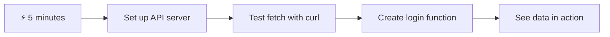

- **1～2分目**: APIサーバーを起動 (`cd api && npm start`) して接続をテスト
- **3分目**: fetchを使って基本的な`getAccount()`関数を作成
- **4分目**: ログインフォームを`action="javascript:login()"`で接続
- **5分目**: ログインをテストし、コンソールにアカウントデータが表示されるのを確認

**クイックテストコマンド**:
```bash
# Verify API is running
curl http://localhost:5000/api

# Test account data fetch
curl http://localhost:5000/api/accounts/test
```

**なぜ重要なのか**: 5分で、現代のウェブアプリケーションを支える非同期データ取得の魔法を体験できます。これがアプリを応答性が高く生き生きとしたものにする基盤です。

## 🗺️ データ駆動型ウェブアプリケーション学習の旅

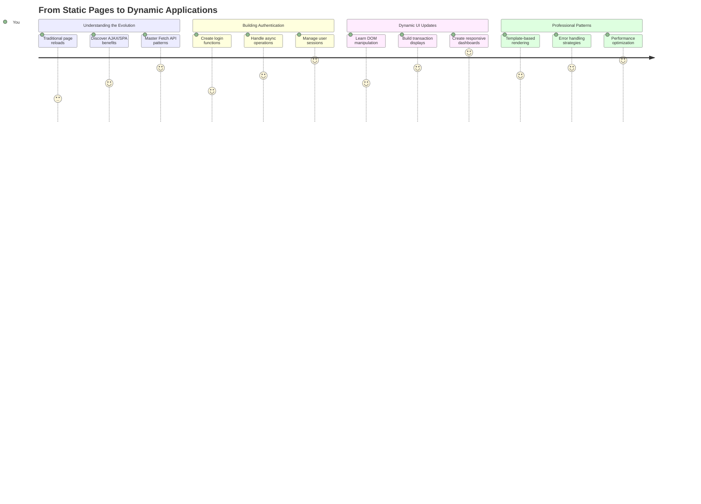

**学習の目的地**: このレッスンの終わりまでに、現代のウェブアプリケーションがデータを動的に取得、処理、表示する方法を理解し、プロフェッショナルなアプリケーションに期待されるシームレスなユーザー体験を作り出す方法を学びます。

## 講義前のクイズ

[講義前のクイズ](https://ff-quizzes.netlify.app/web/quiz/45)

### 前提条件

データ取得に進む前に、以下のコンポーネントを準備してください:

- **前回のレッスン**: [ログインと登録フォーム](../2-forms/README.md)を完了してください - これを基盤として構築します
- **ローカルサーバー**: [Node.js](https://nodejs.org)をインストールし、[サーバーAPIを実行](../api/README.md)してアカウントデータを提供します
- **API接続**: 以下のコマンドでサーバー接続をテストしてください:

```bash
curl http://localhost:5000/api
# Expected response: "Bank API v1.0.0"
```

このクイックテストで、すべてのコンポーネントが正しく通信していることを確認します:
- Node.jsがシステム上で正しく動作していることを検証
- APIサーバーがアクティブで応答していることを確認
- アプリがサーバーに到達できることを検証（ミッション前の無線接続確認のようなものです）

## 🧠 データ管理エコシステムの概要

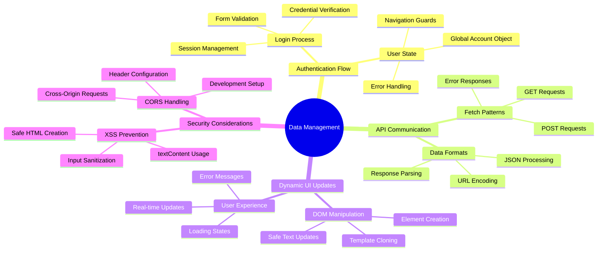

**コア原則**: 現代のウェブアプリケーションはデータオーケストレーションシステムです。ユーザーインターフェース、サーバーAPI、ブラウザのセキュリティモデル間で調整を行い、シームレスで応答性の高い体験を作り出します。

---

## 現代のウェブアプリにおけるデータ取得の理解

ウェブアプリケーションがデータを扱う方法は、過去20年間で劇的に進化しました。この進化を理解することで、AJAXやFetch APIのような現代的な技術がいかに強力で、なぜウェブ開発者にとって必須のツールとなったのかを実感できます。

従来のウェブサイトがどのように動作していたかと、今日構築している動的で応答性の高いアプリケーションを比較してみましょう。

### 従来のマルチページアプリケーション (MPA)

ウェブの初期では、クリックするたびに古いテレビのチャンネルを変えるようなものでした。画面が真っ暗になり、新しいコンテンツにゆっくりと切り替わる。これが初期のウェブアプリケーションの現実であり、すべての操作がページ全体を完全に再構築することを意味していました。

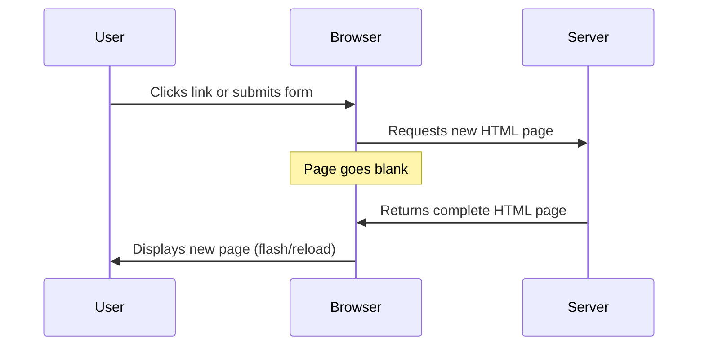

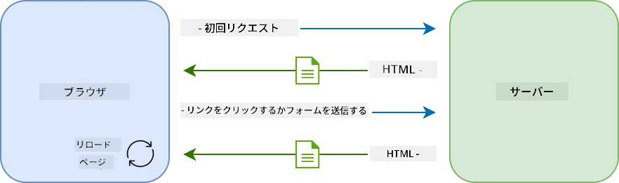

**このアプローチがぎこちなく感じられた理由:**
- クリックするたびにページ全体を再構築する必要があった
- ユーザーは思考の途中で中断され、煩わしいページの点滅に悩まされた
- インターネット接続がヘッダーやフッターを何度もダウンロードするために過剰に働いた
- アプリはソフトウェアを使うというより、ファイルキャビネットをクリックしているように感じられた

### 現代のシングルページアプリケーション (SPA)

AJAX（非同期JavaScriptとXML）はこのパラダイムを完全に変えました。国際宇宙ステーションのモジュール設計のように、宇宙飛行士が全体を再構築することなく個々のコンポーネントを交換できるように、AJAXはウェブページの特定の部分を再読み込みせずに更新することを可能にしました。名前にXMLが含まれているにもかかわらず、今日では主にJSONを使用していますが、基本原則は変わりません: 必要な部分だけを更新する。

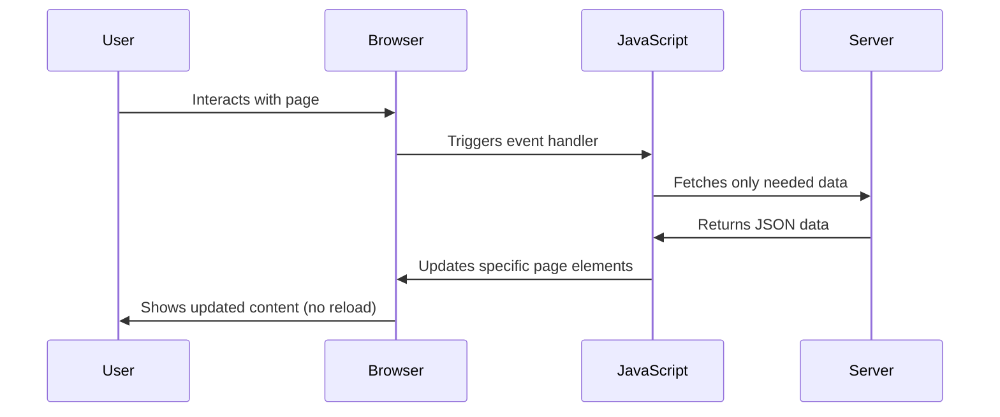

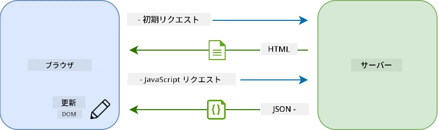

**SPAがより快適に感じられる理由:**
- 実際に変更された部分だけが更新される（賢いですよね？）
- 突然の中断がなくなり、ユーザーは流れに乗り続けられる
- ワイヤを通じて移動するデータが少なくなるため、読み込みが速くなる
- すべてがスマートフォンのアプリのようにスナッピーで応答性が高く感じられる

### 現代のFetch APIへの進化

現代のブラウザは[`Fetch` API](https://developer.mozilla.org/docs/Web/API/Fetch_API)を提供しており、古い[`XMLHttpRequest`](https://developer.mozilla.org/docs/Web/API/XMLHttpRequest/Using_XMLHttpRequest)を置き換えています。電報を操作するのとメールを使う違いのように、Fetch APIはクリーンな非同期コードのためにプロミスを使用し、JSONを自然に処理します。

| 機能 | XMLHttpRequest | Fetch API |
|---------|----------------|----------|
| **構文** | 複雑なコールバックベース | クリーンなプロミスベース |
| **JSON処理** | 手動での解析が必要 | 組み込みの`.json()`メソッド |
| **エラーハンドリング** | 限られたエラー情報 | 包括的なエラー詳細 |
| **モダン対応** | レガシー互換性 | ES6+プロミスとasync/await |

> 💡 **ブラウザ互換性**: 良いニュース - Fetch APIはすべての現代的なブラウザで動作します！特定のバージョンについて興味がある場合は、[caniuse.com](https://caniuse.com/fetch)で完全な互換性情報を確認できます。
> 
**要点:**
- Chrome、Firefox、Safari、Edgeで素晴らしく動作（基本的にユーザーがいる場所すべてで）
- Internet Explorerだけは追加の助けが必要（正直なところ、IEはもう手放す時です）
- 後で使用するエレガントなasync/awaitパターンに完璧に対応

### ユーザーログインとデータ取得の実装

次に、銀行アプリを静的な表示から機能的なアプリケーションに変えるログインシステムを実装します。安全な軍事施設で使用される認証プロトコルのように、ユーザーの資格情報を確認し、その特定のデータへのアクセスを提供します。

基本的な認証から始め、データ取得機能を追加していきます。

#### ステップ1: ログイン関数の基盤を作成

`app.js`ファイルを開き、新しい`login`関数を追加します。この関数はユーザー認証プロセスを処理します:

```javascript
async function login() {
  const loginForm = document.getElementById('loginForm');
  const user = loginForm.user.value;
}
```

**これを分解してみましょう:**
- `async`キーワードはJavaScriptに「この関数は待機が必要かもしれない」と伝えています
- ページからフォームを取得（特別なことはせず、IDで見つけるだけ）
- ユーザーが入力したユーザー名を取得
- 便利なトリック: フォーム入力は`name`属性でアクセス可能 - 追加のgetElementById呼び出しは不要！

> 💡 **フォームアクセスパターン**: HTMLで`name`属性を使用して設定されたすべてのフォームコントロールは、フォーム要素のプロパティとしてアクセス可能です。これにより、フォームデータを取得するためのクリーンで読みやすい方法が提供されます。

#### ステップ2: アカウントデータ取得関数を作成

次に、サーバーからアカウントデータを取得する専用関数を作成します。これは登録関数と同じパターンに従いますが、データ取得に焦点を当てています:

```javascript
async function getAccount(user) {
  try {
    const response = await fetch('//localhost:5000/api/accounts/' + encodeURIComponent(user));
    return await response.json();
  } catch (error) {
    return { error: error.message || 'Unknown error' };
  }
}
```

**このコードが達成すること:**
- **モダンな**`fetch` APIを使用して非同期でデータをリクエスト
- **GETリクエストURL**をユーザー名パラメータで構築
- **`encodeURIComponent()`**を適用してURL内の特殊文字を安全に処理
- **レスポンスをJSON形式に変換**してデータ操作を簡単に
- **エラーを優雅に処理**してクラッシュする代わりにエラーオブジェクトを返す

> ⚠️ **セキュリティ注意点**: `encodeURIComponent()`関数はURL内の特殊文字を処理します。海軍通信で使用されるエンコードシステムのように、"#"や"&"などの文字が誤解されることなく、メッセージが正確に届くことを保証します。
> 
**重要性:**
- 特殊文字がURLを壊すのを防ぐ
- URL操作攻撃から保護
- サーバーが意図したデータを受け取ることを保証
- 安全なコーディングプラクティスに従う

#### HTTP GETリクエストの理解

驚くかもしれませんが、`fetch`を追加オプションなしで使用すると、自動的に[`GET`](https://developer.mozilla.org/docs/Web/HTTP/Methods/GET)リクエストを作成します。これは私たちがしていることに最適です - サーバーに「このユーザーのアカウントデータを見せてもらえますか？」と尋ねることです。

GETリクエストは、図書館で本を借りるように既存のデータを要求するものです。POSTリクエスト（登録時に使用したもの）は、新しい本をコレクションに追加するようなものです。

| GETリクエスト | POSTリクエスト |
|-------------|-------------|
| **目的** | 既存データを取得 | 新しいデータをサーバーに送信 |
| **パラメータ** | URLパス/クエリ文字列内 | リクエストボディ内 |
| **キャッシュ** | ブラウザによるキャッシュ可能 | 通常キャッシュされない |
| **セキュリティ** | URL/ログに表示される | リクエストボディ内で非表示 |

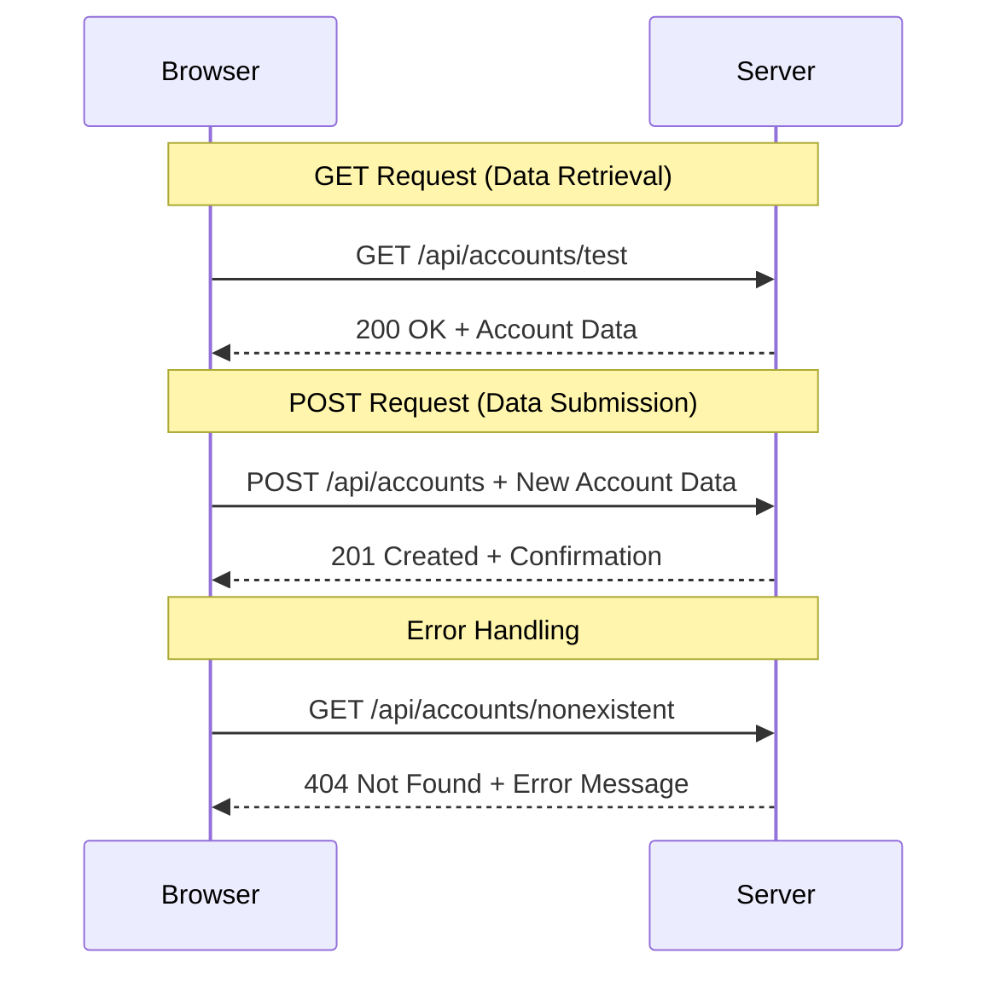

#### ステップ3: すべてをまとめる

満足感のある部分です - アカウント取得関数をログインプロセスに接続しましょう。これがすべてがうまく機能する瞬間です:

```javascript
async function login() {
  const loginForm = document.getElementById('loginForm');
  const user = loginForm.user.value;
  const data = await getAccount(user);

  if (data.error) {
    return console.log('loginError', data.error);
  }

  account = data;
  navigate('/dashboard');
}
```

この関数は明確な手順に従います:
- フォーム入力からユーザー名を抽出
- サーバーからユーザーのアカウントデータをリクエスト
- プロセス中に発生するエラーを処理
- アカウントデータを保存し、成功時にダッシュボードに移動

> 🎯 **Async/Awaitパターン**: `getAccount`は非同期関数であるため、`await`キーワードを使用してサーバーが応答するまで実行を一時停止します。これにより、未定義のデータでコードが進行するのを防ぎます。

#### ステップ4: データのホームを作成

アカウント情報が読み込まれたら、それを記憶する場所がアプリに必要です。これをアプリの短期記憶のように考えてください - 現在のユーザーのデータを手元に置いておく場所です。`app.js`ファイルの冒頭にこの行を追加してください:

```javascript
// This holds the current user's account data
let account = null;
```

**これが必要な理由:**
- アプリ内のどこからでもアカウントデータにアクセス可能
- `null`で始めることで「まだ誰もログインしていない」ことを示す
- 誰かがログインまたは登録に成功したときに更新される
- 単一の真実の情報源として機能 - 誰がログインしているか混乱しない

#### ステップ5: フォームを接続する

新しいログイン関数をHTMLフォームに接続しましょう。フォームタグを次のように更新します:

```html
<form id="loginForm" action="javascript:login()">
  <!-- Your existing form inputs -->
</form>
```

**この小さな変更がすること:**
- フォームがデフォルトの「ページ全体をリロードする」動作を停止
- カスタムJavaScript関数を呼び出す
- すべてをスムーズでシングルページアプリのように保つ
- ユーザーが「ログイン」を押したときに何が起こるかを完全に制御

#### ステップ6: 登録関数を強化する

一貫性のために、`register`関数を更新してアカウントデータを保存し、ダッシュボードに移動するようにします:

```javascript
// Add these lines at the end of your register function
account = result;
navigate('/dashboard');
```

**この強化が提供するもの:**
- **シームレスな**登録からダッシュボードへの移行
- **一貫した**ログインと登録フロー間のユーザー体験
- **即時の**登録成功後のアカウントデータへのアクセス

#### 実装のテスト

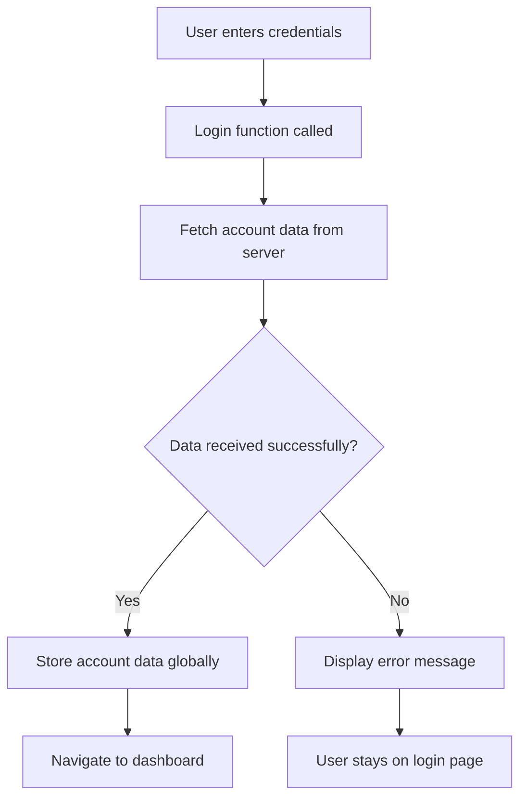

**試してみる時間です:**
1. 新しいアカウントを作成してすべてが機能していることを確認
2. 同じ資格情報でログインしてみる
3. 何か問題がある場合はブラウザのコンソール（F12）を確認
4. 成功したログイン後にダッシュボードに到達することを確認

何かがうまくいかない場合でも、慌てないでください！ほとんどの問題はタイプミスやAPIサーバーの起動忘れなどの簡単な修正です。

#### クロスオリジンの魔法についての一言

「異なるポートで動作しているAPIサーバーとウェブアプリがどのように通信しているの？」と思うかもしれません。良い質問です！これはすべてのウェブ開発者が最終的に直面する問題に触れています。

> 🔒 **クロスオリジンセキュリティ**: ブラウザは「同一オリジンポリシー」を強制して、異なるドメイン間の無許可の通信を防ぎます。ペンタゴンのチェックポイントシステムのように、通信が許可
DOM操作は、静的なウェブページをユーザーの操作やサーバーの応答に基づいてコンテンツを更新する動的なアプリケーションに変える技術です。

### 適切なツールを選ぶ

JavaScriptでHTMLを更新する際には、いくつかの選択肢があります。これらは工具箱の中の異なるツールのようなもので、それぞれ特定の作業に最適です。

| メソッド | 得意なこと | 使用するタイミング | 安全性 |
|--------|---------------------|----------------|--------------|
| `textContent` | ユーザーデータを安全に表示 | テキストを表示する際はいつでも | ✅ 非常に安全 |
| `createElement()` + `append()` | 複雑なレイアウトの構築 | 新しいセクションやリストを作成する際 | ✅ 安全性抜群 |
| `innerHTML` | HTMLコンテンツの設定 | ⚠️ できるだけ避けるべき | ❌ 危険性あり |

#### 安全にテキストを表示する方法: textContent

[`textContent`](https://developer.mozilla.org/docs/Web/API/Node/textContent)プロパティは、ユーザーデータを表示する際の頼れる味方です。ウェブページの「用心棒」のようなもので、有害なものは通しません。

```javascript
// The safe, reliable way to update text
const balanceElement = document.getElementById('balance');
balanceElement.textContent = account.balance;
```

**textContentの利点:**
- すべてをプレーンテキストとして扱う（スクリプトの実行を防ぐ）
- 既存のコンテンツを自動的にクリア
- シンプルなテキスト更新に効率的
- 悪意のあるコンテンツに対するセキュリティを提供

#### 動的なHTML要素の作成

より複雑なコンテンツには、[`document.createElement()`](https://developer.mozilla.org/docs/Web/API/Document/createElement)と[`append()`](https://developer.mozilla.org/docs/Web/API/ParentNode/append)メソッドを組み合わせて使用します。

```javascript
// Safe way to create new elements
const transactionItem = document.createElement('div');
transactionItem.className = 'transaction-item';
transactionItem.textContent = `${transaction.date}: ${transaction.description}`;
container.append(transactionItem);
```

**このアプローチの理解:**
- **プログラム的に**新しいDOM要素を作成
- **要素の属性とコンテンツを**完全に制御
- **複雑でネストされた要素構造を**作成可能
- **構造とコンテンツを分離することで**セキュリティを維持

> ⚠️ **セキュリティに関する注意点**: [`innerHTML`](https://developer.mozilla.org/docs/Web/API/Element/innerHTML)は多くのチュートリアルで登場しますが、埋め込まれたスクリプトを実行する可能性があります。CERNのセキュリティプロトコルが不正なコードの実行を防ぐように、`textContent`や`createElement`を使用することでより安全な代替手段を提供します。
> 
**innerHTMLのリスク:**
- ユーザーデータ内の`<script>`タグを実行する
- コードインジェクション攻撃に対して脆弱
- セキュリティ上の脆弱性を生む可能性がある
- 安全な代替手段を使用することで同等の機能を提供

### エラーをユーザーに分かりやすく伝える

現在、ログインエラーはブラウザのコンソールにのみ表示されており、ユーザーには見えません。パイロットの内部診断と乗客向けの情報システムの違いのように、重要な情報を適切な方法で伝える必要があります。

エラーメッセージを画面上に表示することで、何が問題だったのか、どうすればよいのかをユーザーに即座にフィードバックできます。

#### ステップ1: エラーメッセージの表示場所を追加

まず、HTMLにエラーメッセージを表示する場所を作りましょう。ログインボタンのすぐ前に追加すると、ユーザーが自然に目にすることができます。

```html
<!-- This is where error messages will appear -->
<div id="loginError" role="alert"></div>
<button>Login</button>
```

**ここでのポイント:**
- 必要になるまで非表示の空のコンテナを作成
- 「ログイン」ボタンをクリックした後、ユーザーが自然に目を向ける位置に配置
- `role="alert"`はスクリーンリーダーに「これは重要な情報だ」と伝える便利な属性
- ユニークな`id`でJavaScriptが簡単にターゲットできるようにする

#### ステップ2: 便利なヘルパー関数を作成

任意の要素のテキストを更新できる小さなユーティリティ関数を作りましょう。これは「一度書いてどこでも使える」関数で、時間を節約できます。

```javascript
function updateElement(id, text) {
  const element = document.getElementById(id);
  element.textContent = text;
}
```

**関数の利点:**
- 要素IDとテキストコンテンツだけを必要とするシンプルなインターフェース
- DOM要素を安全に検索して更新
- コードの重複を減らす再利用可能なパターン
- アプリ全体で一貫した更新動作を維持

#### ステップ3: ユーザーが見える場所にエラーを表示

隠れたコンソールメッセージを、ユーザーが実際に見えるものに置き換えましょう。ログイン関数を更新します。

```javascript
// Instead of just logging to console, show the user what's wrong
if (data.error) {
  return updateElement('loginError', data.error);
}
```

**この小さな変更が大きな違いを生む:**
- エラーメッセージがユーザーの目の前に表示される
- 謎の静かな失敗がなくなる
- ユーザーに即座に行動可能なフィードバックを提供
- アプリがプロフェッショナルで配慮のあるものに感じられる

無効なアカウントでテストすると、ページ上に役立つエラーメッセージが表示されるようになります！


#### ステップ4: アクセシビリティを考慮する

先ほど追加した`role="alert"`には、単なる装飾以上の役割があります。この属性は[ライブリージョン](https://developer.mozilla.org/docs/Web/Accessibility/ARIA/ARIA_Live_Regions)を作成し、スクリーンリーダーに変更を即座に通知します。

```html
<div id="loginError" role="alert"></div>
```

**これが重要な理由:**
- スクリーンリーダーのユーザーはエラーメッセージをすぐに聞くことができる
- ナビゲーション方法に関係なく、全員が同じ重要な情報を得られる
- アプリをより多くの人が利用できるようにする簡単な方法
- 包括的な体験を提供する姿勢を示す

このような細かい配慮が、良い開発者と優れた開発者を分けるポイントです！

### 🎯 教育的チェックイン: 認証パターン

**一息ついて振り返りましょう**: あなたは完全な認証フローを実装しました。これはウェブ開発の基礎的なパターンです。

**簡単な自己評価**:
- API呼び出しにasync/awaitを使用する理由を説明できますか？
- `encodeURIComponent()`関数を忘れた場合、何が起こるでしょうか？
- エラー処理がユーザー体験をどのように向上させるか説明できますか？

**実世界とのつながり**: ここで学んだパターン（非同期データ取得、エラー処理、ユーザーフィードバック）は、ソーシャルメディアプラットフォームからeコマースサイトまで、すべての主要なウェブアプリケーションで使用されています。あなたはプロダクションレベルのスキルを構築しています！

**チャレンジ質問**: この認証システムを複数のユーザーロール（顧客、管理者、窓口担当者）に対応するように変更するにはどうすればよいでしょうか？必要なデータ構造やUIの変更について考えてみてください。

#### ステップ5: 登録フォームにも同じパターンを適用

一貫性を保つために、登録フォームにも同じエラー処理を実装しましょう。

1. **登録HTMLに**エラーメッセージ表示要素を追加:
```html
<div id="registerError" role="alert"></div>
```

2. **登録関数を**同じエラー表示パターンを使用するように更新:
```javascript
if (data.error) {
  return updateElement('registerError', data.error);
}
```

**一貫したエラー処理の利点:**
- **すべてのフォームで**統一されたユーザー体験を提供
- **馴染みのあるパターンを使用することで**認知負荷を軽減
- **再利用可能なコードで**保守性を簡素化
- **アプリ全体で**アクセシビリティ基準を満たす

## 動的なダッシュボードの作成

次に、静的なダッシュボードをリアルタイムでアカウントデータを表示する動的なインターフェースに変えます。印刷されたフライトスケジュールと空港のライブ出発ボードの違いのように、静的な情報からリアルタイムで応答する表示へと移行します。

学んだDOM操作技術を使用して、現在のアカウント情報を自動的に更新するダッシュボードを作成します。

### データを理解する

構築を始める前に、サーバーが返すデータの種類を確認しましょう。ログインが成功すると、以下のような情報の宝庫が得られます。

```json
{
  "user": "test",
  "currency": "$",
  "description": "Test account",
  "balance": 75,
  "transactions": [
    { "id": "1", "date": "2020-10-01", "object": "Pocket money", "amount": 50 },
    { "id": "2", "date": "2020-10-03", "object": "Book", "amount": -10 },
    { "id": "3", "date": "2020-10-04", "object": "Sandwich", "amount": -5 }
  ]
}
```

**このデータ構造が提供するもの:**
- **`user`**: 個人化された体験に最適（「お帰りなさい、Sarahさん！」）
- **`currency`**: 金額を正しく表示するために必要
- **`description`**: アカウントの親しみやすい名前
- **`balance`**: 最重要の現在の残高
- **`transactions`**: すべての詳細を含む完全な取引履歴

プロフェッショナルな銀行ダッシュボードを構築するために必要なすべてが揃っています！

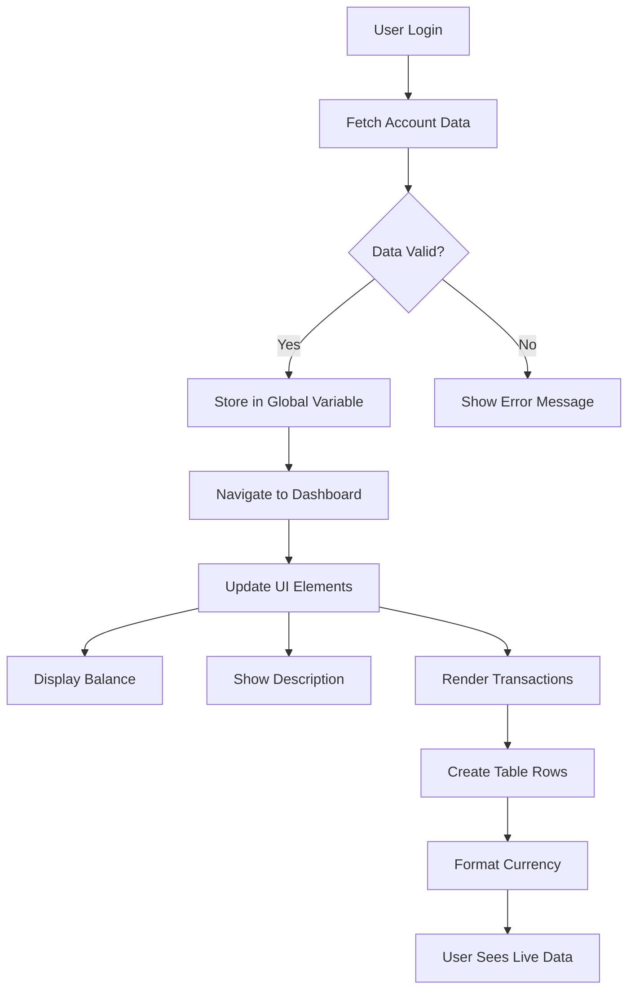

> 💡 **プロのヒント**: ダッシュボードをすぐに動作させたいですか？ログイン時にユーザー名`test`を使用してください。サンプルデータが事前にロードされているので、取引を作成する必要なくすべてが動作しているのを確認できます。
> 
**テストアカウントが便利な理由:**
- 現実的なサンプルデータがすでにロードされている
- 取引がどのように表示されるかを確認するのに最適
- ダッシュボード機能をテストするのに便利
- ダミーデータを手動で作成する手間を省ける

### ダッシュボード表示要素の作成

まず、アカウント概要情報を動的なプレースホルダー要素に置き換え、その後、取引リストなどのより複雑な機能に進みます。

#### ステップ1: HTML構造を更新

まず、静的な「残高」セクションをJavaScriptで更新できる動的なプレースホルダー要素に置き換えます。

```html
<section>
  Balance: <span id="balance"></span><span id="currency"></span>
</section>
```

次に、アカウントの説明セクションを追加します。これはダッシュボードコンテンツのタイトルとして機能するため、セマンティックHTMLを使用します。

```html
<h2 id="description"></h2>
```

**HTML構造の理解:**
- **個別の制御のために**残高と通貨を別々の`<span>`要素で使用
- **JavaScriptターゲットのために**各要素にユニークなIDを適用
- **セマンティックHTMLを遵守し**アカウント説明に`<h2>`を使用
- **スクリーンリーダーやSEOのために**論理的な階層を作成

> ✅ **アクセシビリティの洞察**: アカウント説明はダッシュボードコンテンツのタイトルとして機能するため、セマンティックに見出しとしてマークアップされています。[見出し構造](https://www.nomensa.com/blog/2017/how-structure-headings-web-accessibility)がアクセシビリティに与える影響について詳しく学びましょう。ページ内の他の要素で見出しタグが役立つ可能性があるものを特定できますか？

#### ステップ2: ダッシュボード更新関数を作成

次に、実際のアカウントデータでダッシュボードを更新する関数を作成します。

```javascript
function updateDashboard() {
  if (!account) {
    return navigate('/login');
  }

  updateElement('description', account.description);
  updateElement('balance', account.balance.toFixed(2));
  updateElement('currency', account.currency);
}
```

**この関数が行うことのステップバイステップ:**
- **アカウントデータが存在するかを**検証
- **認証されていないユーザーを**ログインページにリダイレクト
- **再利用可能な`updateElement`関数を使用して**アカウント説明を更新
- **残高を常に小数点以下2桁で表示するように**フォーマット
- **適切な通貨記号を**表示

> 💰 **金額のフォーマット**: [`toFixed(2)`](https://developer.mozilla.org/docs/Web/JavaScript/Reference/Global_Objects/Number/toFixed)メソッドは非常に便利です！残高が常に「75.00」のように見えるようにし、「75」だけではなくします。ユーザーは馴染みのある通貨フォーマットを見て安心します。

#### ステップ3: ダッシュボードが更新されることを確認

ダッシュボードが訪問するたびに最新のデータで更新されるようにするため、ナビゲーションシステムにフックする必要があります。[レッスン1の課題](../1-template-route/assignment.md)を完了していれば、これに馴染みがあるはずです。そうでない場合も心配ありません。以下を参考にしてください。

`updateRoute()`関数の末尾にこれを追加します。

```javascript
if (typeof route.init === 'function') {
  route.init();
}
```

次に、ダッシュボード初期化を含むようにルートを更新します。

```javascript
const routes = {
  '/login': { templateId: 'login' },
  '/dashboard': { templateId: 'dashboard', init: updateDashboard }
};
```

**この巧妙なセットアップが行うこと:**
- 特別な初期化コードがルートにあるかを確認
- ルートがロードされるとそのコードを自動的に実行
- ダッシュボードが常に最新のデータを表示することを保証
- ルーティングロジックをクリーンで整理された状態に保つ

#### ダッシュボードのテスト

これらの変更を実装した後、ダッシュボードをテストします。

1. **テストアカウントでログイン**
2. **ダッシュボードにリダイレクトされることを確認**
3. **アカウント説明、残高、通貨が正しく表示されることを確認**
4. **ログアウトして再ログインし、データが正しく更新されることを確認**

これで、ログインしたユーザーのデータに基づいて動的に更新されるダッシュボードが表示されるようになります！

## テンプレートを使ったスマートな取引リストの構築

各取引のHTMLを手動で作成する代わりに、テンプレートを使用して自動的に一貫したフォーマットを生成します。宇宙船製造で使用される標準化されたコンポーネントのように、テンプレートはすべての取引行が同じ構造と外観を持つことを保証します。

この技術は、数件の取引から数千件まで効率的にスケールし、一貫したパフォーマンスとプレゼンテーションを維持します。

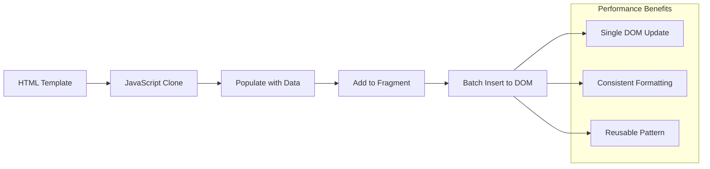

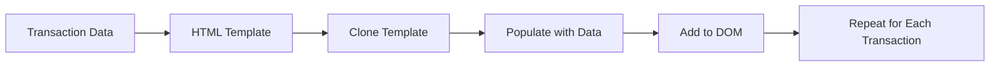

### ステップ1: 取引テンプレートを作成

まず、HTML`<body>`内に取引行の再利用可能なテンプレートを追加します。

```html
<template id="transaction">
  <tr>
    <td></td>
    <td></td>
    <td></td>
  </tr>
</template>
```

**HTMLテンプレートの理解:**
- **単一のテーブル行の構造を定義**
- **JavaScriptでクローンされて操作されるまで**非表示
- **日付、説明、金額の3つのセルを含む**
- **一貫したフォーマットのための再利用可能なパターンを提供**

### ステップ2: 動的コンテンツ用にテーブルを準備

次に、テーブルボディに`id`を追加してJavaScriptが簡単にターゲットできるようにします。

```html
<tbody id="transactions"></tbody>
```

**これが達成すること:**
- **取引行を挿入するための明確なターゲットを作成**
- **テーブル構造を動的コンテンツから分離**
- **
> ⚡ **パフォーマンス最適化**: [`document.createDocumentFragment()`](https://developer.mozilla.org/docs/Web/API/Document/createDocumentFragment) は、ボーイングの組立工程のように機能します。部品はメインライン外で準備され、完全なユニットとして取り付けられます。このバッチ処理アプローチにより、複数の個別操作ではなく、単一の挿入を行うことでDOMの再描画を最小限に抑えます。

### ステップ5: 混合コンテンツに対応する更新関数の強化

現在の`updateElement()`関数はテキストコンテンツのみを処理しています。これをテキストとDOMノードの両方に対応するように更新してください:

```javascript
function updateElement(id, textOrNode) {
  const element = document.getElementById(id);
  element.textContent = ''; // Removes all children
  element.append(textOrNode);
}
```

**この更新の主な改善点:**
- **既存のコンテンツをクリア**してから新しいコンテンツを追加
- **テキスト文字列またはDOMノード**のいずれかをパラメータとして受け入れる
- 柔軟性のために[`append()`](https://developer.mozilla.org/docs/Web/API/ParentNode/append)メソッドを使用
- **既存のテキストベースの使用法との後方互換性を維持**

### ダッシュボードの試運転

いよいよ真価を発揮する時です！動的なダッシュボードを実際に動かしてみましょう:

1. `test`アカウントでログインしてください（サンプルデータが準備されています）
2. ダッシュボードに移動します
3. トランザクション行が適切なフォーマットで表示されることを確認してください
4. 日付、説明、金額がすべて正しく表示されていることを確認してください

すべてが正常に動作していれば、ダッシュボードに完全に機能するトランザクションリストが表示されるはずです！ 🎉

**達成したこと:**
- どんな量のデータにも対応できるダッシュボードを構築
- 一貫したフォーマットのための再利用可能なテンプレートを作成
- 効率的なDOM操作技術を実装
- 実際の銀行アプリケーションに匹敵する機能を開発

静的なウェブページを動的なウェブアプリケーションに変革することに成功しました。

### 🎯 教育的チェックイン: 動的コンテンツ生成

**アーキテクチャの理解**: React、Vue、Angularのようなフレームワークで使用されるパターンを反映した高度なデータからUIへのパイプラインを実装しました。

**習得した重要な概念**:
- **テンプレートベースのレンダリング**: 再利用可能なUIコンポーネントの作成
- **ドキュメントフラグメント**: DOMパフォーマンスの最適化
- **安全なDOM操作**: セキュリティ脆弱性の防止
- **データ変換**: サーバーデータをユーザーインターフェースに変換

**業界との関連性**: これらの技術は、現代のフロントエンドフレームワークの基盤を形成します。Reactの仮想DOM、Vueのテンプレートシステム、Angularのコンポーネントアーキテクチャはすべてこれらの基本概念に基づいています。

**振り返りの質問**: このシステムをリアルタイム更新（新しいトランザクションが自動的に表示されるような機能）に対応させるにはどうすればよいでしょうか？WebSocketやServer-Sent Eventsを検討してください。

---

## 📈 データ管理スキルの習得タイムライン

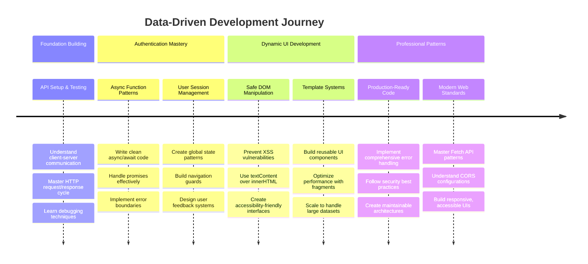

**🎓 卒業マイルストーン**: 現代のJavaScriptパターンを使用して完全なデータ駆動型ウェブアプリケーションを構築することに成功しました。このスキルはReact、Vue、Angularのようなフレームワークで直接活用できます。

**🔄 次のレベルの能力**:
- これらの概念を基に構築されたフロントエンドフレームワークを探索する準備が整いました
- WebSocketを使用したリアルタイム機能の実装が可能
- オフライン機能を備えたプログレッシブウェブアプリの構築が可能
- 高度な状態管理パターンを学ぶための基盤が整いました

## GitHub Copilot Agent Challenge 🚀

Agentモードを使用して以下のチャレンジを完了してください:

**説明:** ユーザーが日付範囲、金額、または説明で特定のトランザクションを検索できるようにする検索およびフィルタ機能を銀行アプリに実装してください。

**プロンプト:** 銀行アプリの検索機能を作成してください。以下を含む必要があります: 1) 日付範囲（開始/終了）、最小/最大金額、トランザクション説明キーワードの入力フィールドを備えた検索フォーム、2) 検索条件に基づいてaccount.transactions配列をフィルタリングする`filterTransactions()`関数、3) フィルタ結果を表示するために`updateDashboard()`関数を更新、4) 表示をリセットする「フィルタをクリア」ボタンを追加。`filter()`のような最新のJavaScript配列メソッドを使用し、検索条件が空の場合のエッジケースを処理してください。

[agent mode](https://code.visualstudio.com/blogs/2025/02/24/introducing-copilot-agent-mode)について詳しくはこちらをご覧ください。

## 🚀 チャレンジ

銀行アプリを次のレベルに引き上げる準備はできましたか？使いたくなるような見た目と使い心地に仕上げましょう。以下のアイデアで創造性を刺激してください:

**美しくする**: CSSスタイリングを追加して、機能的なダッシュボードを視覚的に魅力的なものに変えましょう。クリーンなライン、適切なスペース、そして控えめなアニメーションを考えてみてください。

**レスポンシブにする**: [メディアクエリ](https://developer.mozilla.org/docs/Web/CSS/Media_Queries)を使用して、スマートフォン、タブレット、デスクトップで快適に動作する[レスポンシブデザイン](https://developer.mozilla.org/docs/Web/Progressive_web_apps/Responsive/responsive_design_building_blocks)を作成してみてください。ユーザーに感謝されるでしょう！

**魅力を追加する**: トランザクションを色分け（収入は緑、支出は赤）、アイコンを追加、またはインターフェースをインタラクティブに感じさせるホバー効果を作成することを検討してください。

以下は、スタイリング後のダッシュボードの例のスクリーンショットです:

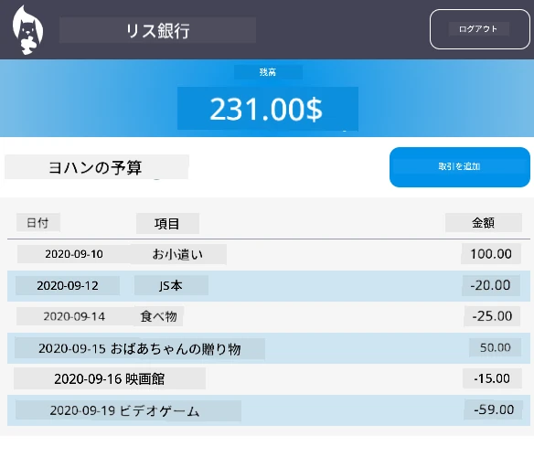

これを完全に再現する必要はありません。インスピレーションとして使用し、自分のスタイルで仕上げてください！

## 講義後のクイズ

[講義後のクイズ](https://ff-quizzes.netlify.app/web/quiz/46)

## 課題

[コードをリファクタリングしてコメントを追加](assignment.md)

---

**免責事項**:  
この文書はAI翻訳サービス[Co-op Translator](https://github.com/Azure/co-op-translator)を使用して翻訳されています。正確性を追求しておりますが、自動翻訳には誤りや不正確な部分が含まれる可能性があります。元の言語で記載された文書を正式な情報源としてご参照ください。重要な情報については、専門の人間による翻訳を推奨します。この翻訳の使用に起因する誤解や誤解について、当方は責任を負いません。