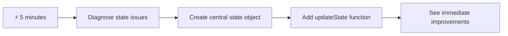
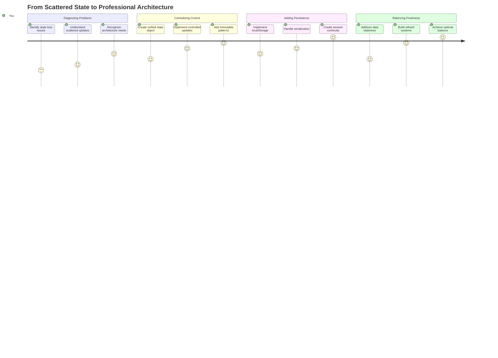
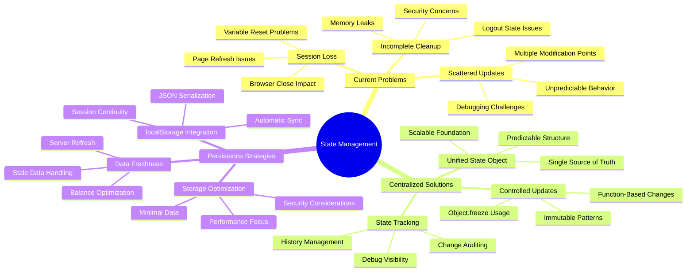
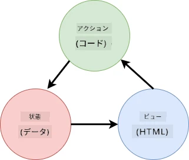
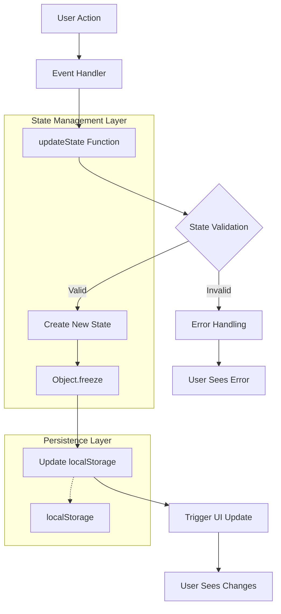
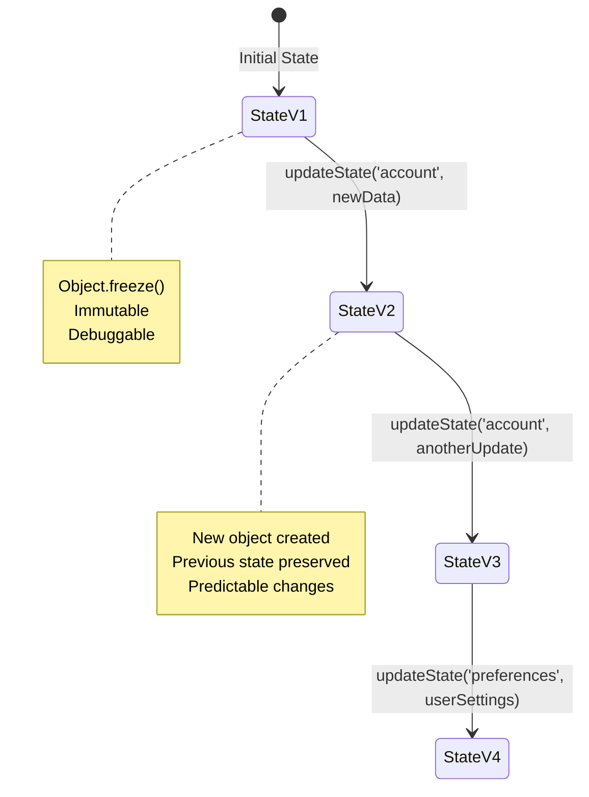
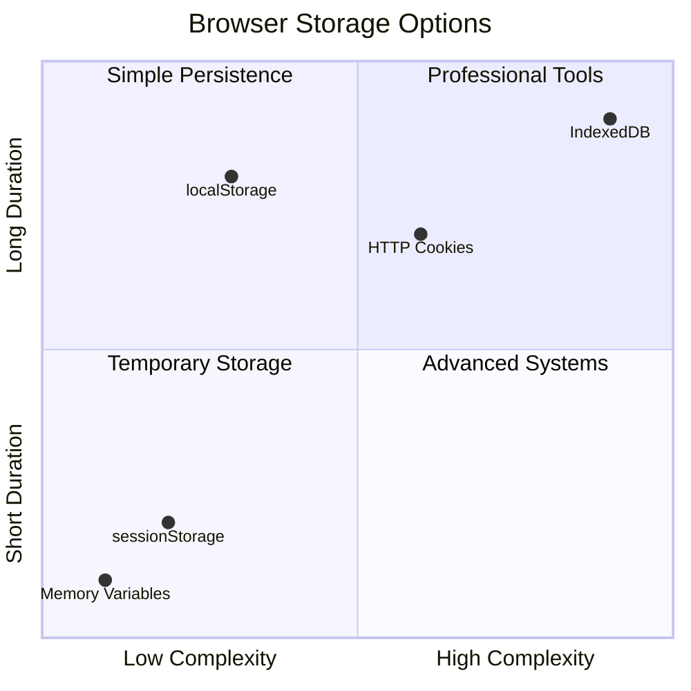
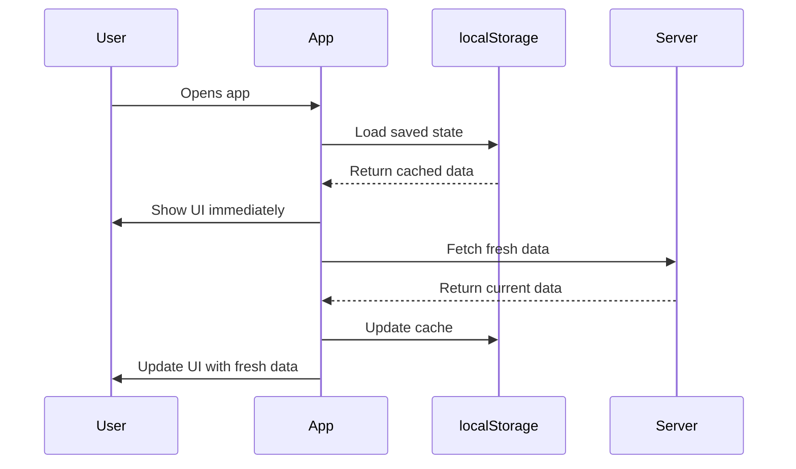
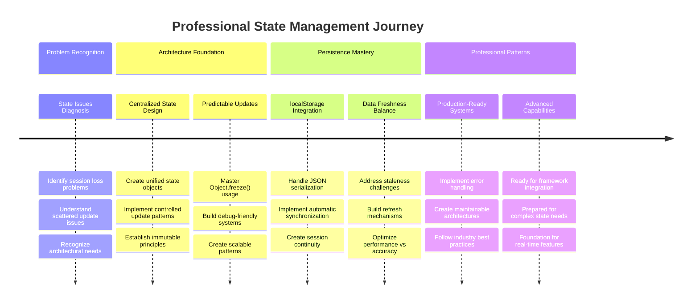

<!--
CO_OP_TRANSLATOR_METADATA:
{
  "original_hash": "b807b09df716dc48a2b750835bf8e933",
  "translation_date": "2025-11-06T12:50:08+00:00",
  "source_file": "7-bank-project/4-state-management/README.md",
  "language_code": "ja"
}
-->
# 銀行アプリを作成する 第4部: 状態管理の概念

## ⚡ 次の5分間でできること

**忙しい開発者向けのクイックスタートガイド**



- **1分目**: 現在の状態問題をテスト - ログイン、ページをリフレッシュ、ログアウトを確認
- **2分目**: `let account = null` を `let state = { account: null }` に置き換える
- **3分目**: 制御された更新のためのシンプルな `updateState()` 関数を作成
- **4分目**: 新しいパターンを使用するように1つの関数を更新
- **5分目**: 改善された予測可能性とデバッグ能力をテスト

**クイック診断テスト**:
```javascript
// Before: Scattered state
let account = null; // Lost on refresh!

// After: Centralized state
let state = Object.freeze({ account: null }); // Controlled and trackable!
```

**なぜ重要なのか**: 5分で、混乱した状態管理から予測可能でデバッグ可能なパターンへの変化を体験できます。これが複雑なアプリケーションを維持可能にする基盤です。

## 🗺️ 状態管理マスタリーへの学習の旅



**学習の目的地**: このレッスンの終わりまでに、永続性、データの新鮮さ、予測可能な更新を処理するプロフェッショナルな状態管理システムを構築します。これは、実際のアプリケーションで使用されるパターンと同じです。

## 講義前のクイズ

[講義前のクイズ](https://ff-quizzes.netlify.app/web/quiz/47)

## はじめに

状態管理は、ボイジャー宇宙船のナビゲーションシステムのようなものです。すべてがスムーズに動作しているときは、ほとんど気づきません。しかし、問題が発生すると、星間空間に到達するか、宇宙の虚空に迷子になるかの違いになります。ウェブ開発において、状態はアプリケーションが覚えておく必要があるすべてを表します: ユーザーのログイン状態、フォームデータ、ナビゲーション履歴、一時的なインターフェース状態など。

あなたの銀行アプリが単純なログインフォームからより洗練されたアプリケーションへと進化するにつれて、いくつかの一般的な課題に直面したことでしょう。ページをリフレッシュすると、ユーザーが予期せずログアウトされます。ブラウザを閉じると、すべての進行状況が消えます。問題をデバッグすると、同じデータを異なる方法で変更する複数の関数を探し回ることになります。

これらは悪いコーディングの兆候ではありません。アプリケーションがある程度の複雑さの閾値に達したときに自然に発生する成長痛です。すべての開発者が、アプリが「概念実証」から「本番準備完了」に移行する際にこれらの課題に直面します。

このレッスンでは、銀行アプリを信頼性の高いプロフェッショナルなアプリケーションに変える集中型の状態管理システムを実装します。データフローを予測可能に管理し、ユーザーセッションを適切に永続化し、現代のウェブアプリケーションが必要とするスムーズなユーザー体験を作成する方法を学びます。

## 前提条件

状態管理の概念に進む前に、開発環境が適切に設定されており、銀行アプリの基盤が整っている必要があります。このレッスンは、このシリーズの以前の部分の概念とコードに直接基づいています。

以下のコンポーネントを準備してから進めてください:

**必要なセットアップ:**
- [データ取得レッスン](../3-data/README.md) を完了する - アプリが正常にアカウントデータを読み込み表示できること
- [Node.js](https://nodejs.org) をシステムにインストールしてバックエンドAPIを実行する
- アカウントデータ操作を処理するために[サーバーAPI](../api/README.md) をローカルで開始する

**環境のテスト:**

ターミナルで以下のコマンドを実行してAPIサーバーが正しく動作していることを確認してください:

```sh
curl http://localhost:5000/api
# -> should return "Bank API v1.0.0" as a result
```

**このコマンドが行うこと:**
- **送信**: ローカルAPIサーバーへのGETリクエスト
- **テスト**: 接続をテストし、サーバーが応答していることを確認
- **返却**: すべてが正常に動作している場合、APIバージョン情報を返す

## 🧠 状態管理アーキテクチャ概要



**コア原則**: プロフェッショナルな状態管理は、予測可能性、永続性、パフォーマンスのバランスを取り、単純なインタラクションから複雑なアプリケーションワークフローまでスケールする信頼性の高いユーザー体験を作り出します。

---

## 現在の状態問題の診断

シャーロック・ホームズが犯罪現場を調査するように、ユーザーセッションが消える謎を解決する前に、現在の実装で何が起きているのかを正確に理解する必要があります。

以下の簡単な実験を行い、状態管理の課題を明らかにしましょう:

**🧪 この診断テストを試してください:**
1. 銀行アプリにログインし、ダッシュボードに移動
2. ブラウザページをリフレッシュ
3. ログイン状態に何が起きるか観察

ログイン画面にリダイレクトされる場合、典型的な状態永続性の問題を発見したことになります。この動作は、現在の実装がページロードごとにリセットされるJavaScript変数にユーザーデータを保存しているために発生します。

**現在の実装の問題点:**

[前回のレッスン](../3-data/README.md) の単純な `account` 変数は、ユーザー体験とコードの保守性に影響を与える3つの重大な問題を引き起こします:

| 問題 | 技術的原因 | ユーザーへの影響 |
|---------|--------|----------------|
| **セッションの喪失** | ページリフレッシュでJavaScript変数がクリアされる | ユーザーは頻繁に再認証が必要 |
| **更新の分散** | 複数の関数が状態を直接変更 | デバッグがますます困難に |
| **不完全なクリーンアップ** | ログアウト時にすべての状態参照がクリアされない | セキュリティとプライバシーの懸念 |

**アーキテクチャの課題:**

タイタニックの区画化設計が複数の区画が同時に浸水したときに堅牢ではないことが判明したように、これらの問題を個別に修正しても、根本的なアーキテクチャの問題は解決されません。包括的な状態管理ソリューションが必要です。

> 💡 **ここで実際に達成しようとしていることは何ですか？**

[状態管理](https://en.wikipedia.org/wiki/State_management) は、2つの基本的なパズルを解決することに関するものです:

1. **データはどこにあるのか？**: どの情報を持っていて、それがどこから来ているのかを追跡する
2. **全員が同じページにいるか？**: ユーザーが見るものが実際に起きていることと一致しているかを確認する

**私たちの計画:**

無駄な努力をする代わりに、**集中型状態管理**システムを作成します。これは、すべての重要なものを整理する1人の非常に組織的な人がいるようなものです:





**このデータフローの理解:**
- **集中化**: すべてのアプリケーション状態を1つの場所に集約
- **ルーティング**: すべての状態変更を制御された関数を通じて行う
- **同期**: UIが現在の状態と一致することを保証
- **提供**: データ管理の明確で予測可能なパターン

> 💡 **プロフェッショナルな洞察**: このレッスンは基本的な概念に焦点を当てています。複雑なアプリケーションでは、[Redux](https://redux.js.org) のようなライブラリがより高度な状態管理機能を提供します。これらの基本原則を理解することで、どの状態管理ライブラリでもマスターすることができます。

> ⚠️ **高度なトピック**: 状態変更によってトリガーされる自動UI更新はカバーしません。これは[リアクティブプログラミング](https://en.wikipedia.org/wiki/Reactive_programming)の概念を含むためです。これを学習の次のステップとして検討してください！

### タスク: 状態構造の集中化

分散した状態管理を集中型システムに変換することから始めましょう。この最初のステップは、後に続くすべての改善の基盤を確立します。

**ステップ1: 中央状態オブジェクトを作成**

単純な `account` 宣言を置き換えます:

```js
let account = null;
```

構造化された状態オブジェクトに変更:

```js
let state = {
  account: null
};
```

**この変更が重要な理由:**
- **集中化**: すべてのアプリケーションデータを1つの場所に集約
- **準備**: 後でさらに状態プロパティを追加するための構造を準備
- **境界の明確化**: 状態と他の変数の間に明確な境界を作成
- **スケーラブルなパターンの確立**: アプリが成長するにつれてスケールするパターンを確立

**ステップ2: 状態アクセスパターンの更新**

関数を新しい状態構造を使用するように更新します:

**`register()` と `login()` 関数で**、以下を置き換えます:
```js
account = ...
```

以下に変更:
```js
state.account = ...
```

**`updateDashboard()` 関数で**、冒頭に以下の行を追加:
```js
const account = state.account;
```

**これらの更新が達成すること:**
- **既存の機能を維持**しながら構造を改善
- **より洗練された状態管理の準備**を整える
- **状態データへのアクセスの一貫したパターンを作成**
- **集中型状態更新の基盤を確立**

> 💡 **注意**: このリファクタリングはすぐに問題を解決するわけではありませんが、強力な改善のための重要な基盤を作ります！

### 🎯 教育的チェックイン: 集中化の原則

**一時停止して振り返る**: あなたは集中型状態管理の基盤を実装しました。これは重要なアーキテクチャの決定です。

**簡単な自己評価**:
- 状態を1つのオブジェクトに集中化することが分散した変数よりも優れている理由を説明できますか？
- `state.account` を使用するように関数を更新し忘れた場合、何が起きるでしょうか？
- このパターンがより高度な機能に向けてコードをどのように準備するか理解していますか？

**実世界の接続**: あなたが学んだ集中化パターンは、Redux、Vuex、React Contextのような現代のフレームワークの基盤です。あなたは主要なアプリケーションで使用される同じアーキテクチャ思考を構築しています。

**チャレンジ質問**: アプリにユーザーの設定（テーマ、言語）を追加する必要がある場合、状態構造のどこに追加しますか？これがどのようにスケールしますか？

## 制御された状態更新の実装

状態を集中化したことで、次のステップはデータ変更の制御されたメカニズムを確立することです。このアプローチは予測可能な状態変更と簡単なデバッグを保証します。

核心原則は航空管制に似ています: 複数の関数が独立して状態を変更するのではなく、すべての変更を単一の制御された関数を通じて行います。このパターンは、データがいつどのように変更されるかを明確に監視します。

**不変状態管理:**

`state` オブジェクトを[*不変*](https://en.wikipedia.org/wiki/Immutable_object)として扱います。つまり、直接変更することはありません。代わりに、各変更は更新されたデータを持つ新しい状態オブジェクトを作成します。

このアプローチは直接変更と比較して最初は非効率に思えるかもしれませんが、デバッグ、テスト、アプリケーションの予測可能性を維持する上で大きな利点を提供します。

**不変状態管理の利点:**

| 利点 | 説明 | 影響 |
|---------|-------------|--------|
| **予測可能性** | 変更は制御された関数を通じてのみ発生 | デバッグとテストが容易 |
| **履歴追跡** | 各状態変更が新しいオブジェクトを作成 | 元に戻す/やり直し機能を可能に |
| **副作用防止** | 偶発的な変更がない | 謎のバグを防止 |
| **パフォーマンス最適化** | 状態が実際に変更されたかどうかを簡単に検出 | 効率的なUI更新を可能に |

**JavaScriptの`Object.freeze()`による不変性:**

JavaScriptは[`Object.freeze()`](https://developer.mozilla.org/docs/Web/JavaScript/Reference/Global_Objects/Object/freeze)を提供してオブジェクトの変更を防ぎます:

```js
const immutableState = Object.freeze({ account: userData });
// Any attempt to modify immutableState will throw an error
```

**ここで何が起きているかの分解:**
- **防止**: 直接のプロパティ割り当てや削除
- **例外をスロー**: 変更試行が行われた場合
- **保証**: 状態変更は制御された関数を通じて行われる必要がある
- **明確な契約を作成**: 状態がどのように更新されるかについて

> 💡 **深掘り**: [MDNドキュメント](https://developer.mozilla.org/docs/Web/JavaScript/Reference/Global_Objects/Object/freeze#What_is_shallow_freeze)で*浅い*不変オブジェクトと*深い*不変オブジェクトの違いを学びましょう。この区別を理解することは複雑な状態構造にとって重要です。



### タスク

新しい `updateState()` 関数を作成しましょう:

```js
function updateState(property, newData) {
  state = Object.freeze({
    ...state,
    [property]: newData
  });
}
```

この関数では、新しい状態オブジェクトを作成し、[スプレッド演算子 (`...`)](https://developer.mozilla.org/docs/Web/JavaScript/Reference/Operators/Spread_syntax#Spread_in_object_literals)を使用して前の状態からデータをコピーします。その後、[ブラケット記法](https://developer.mozilla.org/docs/Web/JavaScript/Guide/Working_with_Objects#Objects_and_properties) `[property]` を使用して状態オブジェクトの特定のプロパティを新しいデータで上書きします。最後に、`Object.freeze()` を使用してオブジェクトをロックし、変更を防ぎます。現在は状態に `account` プロパティのみが保存されていますが、このアプローチを使用すれば必要に応じて状態に多くのプロパティを追加できます。

また、初期状態が凍結されるように状態の初期化を更新します:

```js
let state = Object.freeze({
  account: null
});
```

その後、`register` 関数を更新し、`state.account = result;` の代わりに以下を使用します:

```js
updateState('account', result);
```

同様に、`login` 関数を更新し、`state.account = data;` の代わりに以下を使用します:

```js
updateState('account', data);
```

次に、ユーザーが*ログアウト
| **どのくらいの期間保持すべきか？** | ログイン状態 vs. 一時的なUI設定 | 適切な保存期間を選択 |
| **サーバーが必要とするか？** | 認証トークン vs. UI設定 | 共有要件を判断 |

**ブラウザストレージオプション:**

現代のブラウザは、さまざまなユースケースに対応するための複数のストレージメカニズムを提供しています。

**主要なストレージAPI:**

1. **[`localStorage`](https://developer.mozilla.org/docs/Web/API/Window/localStorage)**: 永続的な[キー/値ストレージ](https://en.wikipedia.org/wiki/Key%E2%80%93value_database)
   - **データを**ブラウザセッション間で無期限に保持
   - **ブラウザの再起動やコンピュータの再起動後も**データが保持される
   - **特定のウェブサイトドメインに**限定される
   - **ユーザー設定やログイン状態に**最適

2. **[`sessionStorage`](https://developer.mozilla.org/docs/Web/API/Window/sessionStorage)**: 一時的なセッションストレージ
   - **localStorageと同様に**アクティブなセッション中に機能
   - **ブラウザタブを閉じると**自動的にクリアされる
   - **一時的なデータに**最適で、保持する必要がない場合に便利

3. **[HTTP Cookies](https://developer.mozilla.org/docs/Web/HTTP/Cookies)**: サーバー共有ストレージ
   - **すべてのサーバーリクエストに**自動的に送信される
   - **認証トークンに**最適
   - **サイズが制限されており**パフォーマンスに影響を与える可能性がある

**データシリアライズの要件:**

`localStorage`と`sessionStorage`は[文字列](https://developer.mozilla.org/docs/Web/JavaScript/Reference/Global_Objects/String)のみを保存します:

```js
// Convert objects to JSON strings for storage
const accountData = { user: 'john', balance: 150 };
localStorage.setItem('account', JSON.stringify(accountData));

// Parse JSON strings back to objects when retrieving
const savedAccount = JSON.parse(localStorage.getItem('account'));
```

**シリアライズの理解:**
- **JavaScriptオブジェクトをJSON文字列に変換**するために[`JSON.stringify()`](https://developer.mozilla.org/docs/Web/JavaScript/Reference/Global_Objects/JSON/stringify)を使用
- **JSONからオブジェクトを再構築**するために[`JSON.parse()`](https://developer.mozilla.org/docs/Web/JavaScript/Reference/Global_Objects/JSON/parse)を使用
- **複雑なネストされたオブジェクトや配列を自動的に処理**
- **関数、未定義値、循環参照では失敗**

> 💡 **高度なオプション**: 大規模なデータセットを扱う複雑なオフラインアプリケーションの場合、[`IndexedDB` API](https://developer.mozilla.org/docs/Web/API/IndexedDB_API)を検討してください。完全なクライアントサイドデータベースを提供しますが、実装がより複雑になります。



### タスク: localStorageの永続化を実装する

ユーザーが明示的にログアウトするまでログイン状態を保持する永続ストレージを実装します。`localStorage`を使用してブラウザセッション間でアカウントデータを保存します。

**ステップ1: ストレージ設定を定義する**

```js
const storageKey = 'savedAccount';
```

**この定数が提供するもの:**
- **保存データの一貫した識別子を作成**
- **ストレージキー参照のタイプミスを防止**
- **ストレージキーを簡単に変更可能にする**
- **保守性の高いコードのベストプラクティスに従う**

**ステップ2: 自動永続化を追加する**

`updateState()`関数の最後にこの行を追加します:

```js
localStorage.setItem(storageKey, JSON.stringify(state.account));
```

**ここで何が起こるかの分解:**
- **アカウントオブジェクトをJSON文字列に変換**して保存
- **一貫したストレージキーを使用してデータを保存**
- **状態変更が発生するたびに自動的に実行**
- **保存されたデータが常に現在の状態と同期されることを保証**

> 💡 **アーキテクチャの利点**: 状態更新をすべて`updateState()`に集中させたため、永続化を追加するのに1行のコードだけで済みました。これは良いアーキテクチャ設計の力を示しています！

**ステップ3: アプリロード時の状態復元**

保存されたデータを復元する初期化関数を作成します:

```js
function init() {
  const savedAccount = localStorage.getItem(storageKey);
  if (savedAccount) {
    updateState('account', JSON.parse(savedAccount));
  }

  // Our previous initialization code
  window.onpopstate = () => updateRoute();
  updateRoute();
}

init();
```

**初期化プロセスの理解:**
- **localStorageから以前に保存されたアカウントデータを取得**
- **JSON文字列をJavaScriptオブジェクトに解析**
- **制御された更新関数を使用して状態を更新**
- **ページロード時にユーザーセッションを自動的に復元**
- **ルート更新前に実行して状態が利用可能であることを保証**

**ステップ4: デフォルトルートの最適化**

永続化を活用するためにデフォルトルートを更新します:

`updateRoute()`内で以下を置き換えます:
```js
// Replace: return navigate('/login');
return navigate('/dashboard');
```

**この変更が意味を持つ理由:**
- **新しい永続化システムを効果的に活用**
- **ダッシュボードが認証チェックを処理できるようにする**
- **保存されたセッションが存在しない場合に自動的にログインにリダイレクト**
- **よりシームレスなユーザー体験を作成**

**実装のテスト:**

1. 銀行アプリにログイン
2. ブラウザページをリフレッシュ
3. ダッシュボードにログインしたままであることを確認
4. ブラウザを閉じて再度開く
5. アプリに戻り、ログイン状態が保持されていることを確認

🎉 **達成感を得る**: 永続的な状態管理を成功裏に実装しました！あなたのアプリはプロフェッショナルなウェブアプリのように動作します。

### 🎯 教育的チェックイン: 永続化アーキテクチャ

**アーキテクチャの理解**: ユーザー体験とデータ管理の複雑さをバランスさせた洗練された永続化レイヤーを実装しました。

**習得した重要な概念**:
- **JSONシリアライズ**: 複雑なオブジェクトを保存可能な文字列に変換
- **自動同期**: 状態変更が永続ストレージをトリガー
- **セッション復元**: 中断後にユーザーコンテキストを復元
- **集中化された永続化**: すべてのストレージを1つの更新関数で処理

**業界との関連性**: この永続化パターンは、プログレッシブウェブアプリ（PWA）、オフラインファーストアプリケーション、現代のモバイルウェブ体験において基本的なものです。あなたはプロダクションレベルの能力を構築しています。

**振り返り質問**: 同じデバイスで複数のユーザーアカウントを処理するには、このシステムをどのように変更しますか？プライバシーとセキュリティの影響を考慮してください。

## 永続性とデータの新鮮さのバランス

私たちの永続化システムはユーザーセッションを維持することに成功しましたが、新たな課題を導入しました: データの古さ。複数のユーザーやアプリケーションが同じサーバーデータを変更すると、ローカルキャッシュ情報が古くなります。

この状況は、保存された星図と現在の天体観測の両方を頼りにしたバイキングの航海士に似ています。星図は一貫性を提供しますが、航海士は変化する条件を考慮するために新しい観測が必要でした。同様に、私たちのアプリケーションは永続的なユーザー状態と最新のサーバーデータの両方を必要とします。

**🧪 データの新鮮さ問題を発見する:**

1. `test`アカウントでダッシュボードにログイン
2. 別のソースからのトランザクションをシミュレートするためにターミナルでこのコマンドを実行:

```sh
curl --request POST \
     --header "Content-Type: application/json" \
     --data "{ \"date\": \"2020-07-24\", \"object\": \"Bought book\", \"amount\": -20 }" \
     http://localhost:5000/api/accounts/test/transactions
```

3. ブラウザでダッシュボードページをリフレッシュ
4. 新しいトランザクションが表示されるかどうかを確認

**このテストが示すもの:**
- **localStorageが自動的に期限切れにならないため、古いデータが表示される**
- **アプリ外でデータ変更が発生する現実的なシナリオをシミュレート**
- **永続性とデータの新鮮さの間の緊張を明らかにする**

**データの古さの課題:**

| 問題 | 原因 | ユーザーへの影響 |
|------|------|------------------|
| **古いデータ** | localStorageが自動的に期限切れにならない | ユーザーが古い情報を見る |
| **サーバー変更** | 他のアプリ/ユーザーが同じデータを変更 | プラットフォーム間でのビューの不一致 |
| **キャッシュ vs. 現実** | ローカルキャッシュがサーバー状態と一致しない | ユーザー体験の低下と混乱 |

**解決策の戦略:**

永続性の利点を維持しながら、データの正確性を確保する「ロード時のリフレッシュ」パターンを実装します。このアプローチはスムーズなユーザー体験を維持しつつ、データの正確性を保証します。



### タスク: データリフレッシュシステムを実装する

永続的な状態管理の利点を維持しながら、サーバーから新しいデータを自動的に取得するシステムを作成します。

**ステップ1: アカウントデータ更新機能を作成**

```js
async function updateAccountData() {
  const account = state.account;
  if (!account) {
    return logout();
  }

  const data = await getAccount(account.user);
  if (data.error) {
    return logout();
  }

  updateState('account', data);
}
```

**この関数のロジックの理解:**
- **現在ログインしているユーザーがいるかどうかを確認**（state.accountが存在するか）
- **有効なセッションが見つからない場合はログアウトにリダイレクト**
- **既存の`getAccount()`関数を使用してサーバーから新しいアカウントデータを取得**
- **無効なセッションをログアウトすることでサーバーエラーを優雅に処理**
- **制御された更新システムを使用して状態を新しいデータで更新**
- **`updateState()`関数を通じて自動的にlocalStorage永続化をトリガー**

**ステップ2: ダッシュボードリフレッシュハンドラーを作成**

```js
async function refresh() {
  await updateAccountData();
  updateDashboard();
}
```

**このリフレッシュ関数が達成すること:**
- **データリフレッシュとUI更新プロセスを調整**
- **新しいデータがロードされるまで待機してから表示を更新**
- **ダッシュボードが最新情報を表示することを保証**
- **データ管理とUI更新の間に明確な分離を維持**

**ステップ3: ルートシステムに統合**

ダッシュボードルートがロードされるたびにリフレッシュを自動的にトリガーするようにルート設定を更新します:

```js
const routes = {
  '/login': { templateId: 'login' },
  '/dashboard': { templateId: 'dashboard', init: refresh }
};
```

**この統合が機能する方法:**
- **ダッシュボードルートがロードされるたびにリフレッシュ関数を実行**
- **ユーザーがダッシュボードに移動する際に常に最新データを表示**
- **既存のルート構造を維持しながらデータの新鮮さを追加**
- **ルート固有の初期化の一貫したパターンを提供**

**データリフレッシュシステムのテスト:**

1. 銀行アプリにログイン
2. 先ほどのcurlコマンドを実行して新しいトランザクションを作成
3. ダッシュボードページをリフレッシュするか、別のページに移動して戻る
4. 新しいトランザクションが即座に表示されることを確認

🎉 **完璧なバランスを達成**: あなたのアプリは永続的な状態のスムーズな体験と正確なサーバーデータの両方を組み合わせました！

## 📈 状態管理の習得タイムライン



**🎓 卒業マイルストーン**: Redux、Vuexなどのプロフェッショナルな状態ライブラリを支える原則を使用して完全な状態管理システムを構築しました。このパターンはシンプルなアプリからエンタープライズアプリケーションまでスケールします。

**🔄 次のレベルの能力**:
- 状態管理フレームワーク（Redux、Zustand、Pinia）の習得準備完了
- WebSocketを使用したリアルタイム機能の実装準備完了
- オフラインファーストのプログレッシブウェブアプリの構築準備完了
- 状態マシンやオブザーバーのような高度なパターンの基盤が整備済み

## GitHub Copilot Agent Challenge 🚀

Agentモードを使用して以下のチャレンジを完了してください:

**説明:** 銀行アプリのための元に戻す/やり直し機能を含む包括的な状態管理システムを実装します。このチャレンジでは、状態履歴の追跡、不変更新、ユーザーインターフェースの同期などの高度な状態管理概念を練習できます。

**プロンプト:** 以下を含む拡張状態管理システムを作成してください: 1) すべての以前の状態を追跡する状態履歴配列、2) 以前の状態に戻る元に戻す/やり直し機能、3) ダッシュボード上の元に戻す/やり直し操作用のUIボタン、4) メモリ問題を防ぐための最大履歴制限10状態、5) ユーザーがログアウトした際の履歴の適切なクリーンアップ。元に戻す/やり直し機能がアカウント残高の変更とブラウザリフレッシュを通じて動作することを確認してください。

[agent mode](https://code.visualstudio.com/blogs/2025/02/24/introducing-copilot-agent-mode)について詳しくはこちらをご覧ください。

## 🚀 チャレンジ: ストレージの最適化

現在の実装はユーザーセッション、データリフレッシュ、状態管理を効果的に処理しています。しかし、現在のアプローチがストレージ効率と機能性のバランスを最適に保っているかどうかを検討してください。

チェスマスターが重要な駒と交換可能なポーンを区別するように、効果的な状態管理には、どのデータを永続化すべきか、どのデータを常にサーバーから取得すべきかを識別する必要があります。

**最適化分析:**

現在のlocalStorage実装を評価し、以下の戦略的質問を検討してください:
- ユーザー認証を維持するために必要な最小限の情報は何か？
- 頻繁に変更されるデータで、ローカルキャッシュがほとんど利益を提供しないものは何か？
- ストレージの最適化がユーザー体験を損なうことなくパフォーマンスを向上させる方法は？

**実装戦略:**
- **永続化が必要な重要なデータを特定**（おそらくユーザー識別情報のみ）
- **localStorage実装を変更して重要なセッションデータのみを保存**
- **ダッシュボード訪問時に常にサーバーから新しいデータをロードすることを保証**
- **最適化されたアプローチが同じユーザー体験を維持することをテスト**

**高度な考慮事項:**
- **完全なアカウントデータを保存することと認証トークンのみを保存することのトレードオフを比較**
- **将来のチームメンバーのために決定と理由を文書化**

このチャレンジは、機能性と効率性の両

---

**免責事項**:  
この文書はAI翻訳サービス[Co-op Translator](https://github.com/Azure/co-op-translator)を使用して翻訳されています。正確性を追求しておりますが、自動翻訳には誤りや不正確な部分が含まれる可能性があります。元の言語で記載された文書を正式な情報源としてお考えください。重要な情報については、専門の人間による翻訳を推奨します。この翻訳の使用に起因する誤解や誤解について、当社は責任を負いません。