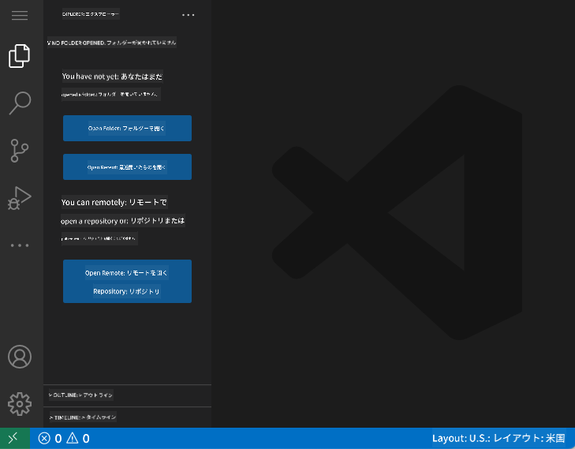
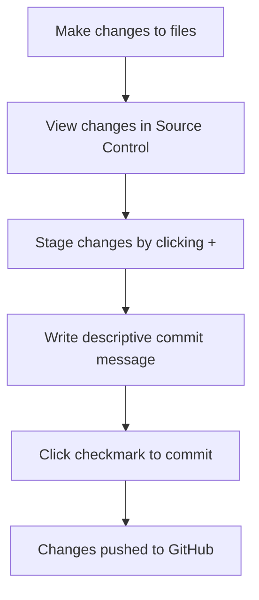
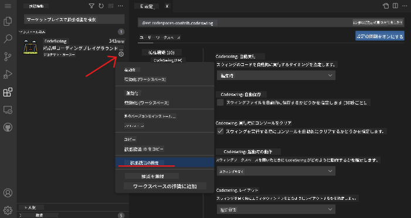

<!--
CO_OP_TRANSLATOR_METADATA:
{
  "original_hash": "cfd4a15974168ca426d50c67682ab9d4",
  "translation_date": "2025-10-24T14:48:00+00:00",
  "source_file": "8-code-editor/1-using-a-code-editor/README.md",
  "language_code": "ja"
}
-->
# コードエディターの使い方: VSCode.devをマスターしよう

映画『マトリックス』でネオが巨大なコンピュータ端末に接続してデジタル世界にアクセスするシーンを覚えていますか？今日のウェブ開発ツールはその逆の話です。どこからでもアクセス可能な驚くほど強力な機能を備えています。VSCode.devはブラウザベースのコードエディターで、インターネット接続があるデバイスならどれでもプロフェッショナルな開発ツールを提供します。

印刷機が修道院の書記だけでなく、誰でも本を手に入れられるようにしたように、VSCode.devはコーディングを民主化します。図書館のコンピュータや学校のラボ、ブラウザにアクセスできる場所ならどこでもプロジェクトに取り組むことができます。インストール不要、特定のセットアップが必要という制限もありません。

このレッスンの終わりまでに、VSCode.devの操作方法、GitHubリポジトリをブラウザで直接開く方法、そしてGitを使ったバージョン管理のスキルを習得できます。これらはプロの開発者が日常的に頼りにしているスキルです。

## 学べること

このレッスンを終えると、以下のことができるようになります：

- VSCode.devを自分の庭のように使いこなす – 必要なものを迷わず見つけられる
- GitHubリポジトリをブラウザで開いてすぐに編集を開始する（これ、かなり魔法みたいです！）
- Gitを使って変更を追跡し、プロのように進捗を保存する
- コーディングをより速く楽しくする拡張機能でエディターを強化する
- プロジェクトファイルを自信を持って作成・整理する

## 必要なもの

必要なものはシンプルです：

- 無料の[GitHubアカウント](https://github.com)（必要なら作成方法を案内します）
- ウェブブラウザの基本的な使い方
- GitHubの基本レッスンが役立ちますが、必須ではありません

> 💡 **GitHub初心者ですか？** アカウント作成は無料で数分で完了します。図書館カードが世界中の本にアクセスできるように、GitHubアカウントはインターネット上のコードリポジトリへの扉を開きます。

## なぜウェブベースのコードエディターが重要なのか

インターネット以前、異なる大学の科学者たちは研究を簡単に共有することができませんでした。その後、1960年代にARPANETが登場し、距離を超えてコンピュータを接続しました。ウェブベースのコードエディターはこの原則を引き継ぎ、物理的な場所やデバイスに関係なく強力なツールを利用可能にします。

コードエディターは開発の作業スペースとして機能し、コードファイルの作成、編集、整理を行います。単なるテキストエディターとは異なり、プロフェッショナルなコードエディターは構文のハイライト、エラー検出、プロジェクト管理機能を提供します。

VSCode.devはこれらの機能をブラウザに持ち込みます：

**ウェブベース編集の利点:**

| 機能 | 説明 | 実用的な利点 |
|---------|-------------|----------|
| **プラットフォーム独立性** | ブラウザがあればどのデバイスでも動作 | 異なるコンピュータ間でシームレスに作業 |
| **インストール不要** | ウェブURLからアクセス | ソフトウェアインストールの制限を回避 |
| **自動更新** | 常に最新バージョンで動作 | 手動更新なしで新機能にアクセス |
| **リポジトリ統合** | GitHubへの直接接続 | ローカルファイル管理なしでコードを編集 |

**実用的な影響:**
- 異なる環境間での作業の継続性
- オペレーティングシステムに関係なく一貫したインターフェース
- 即時のコラボレーション能力
- ローカルストレージの必要性の削減

## VSCode.devを探る

マリー・キュリーの研究室がシンプルな空間に高度な機器を詰め込んでいたように、VSCode.devはプロフェッショナルな開発ツールをブラウザインターフェースに詰め込んでいます。このウェブアプリケーションはデスクトップコードエディターと同じ基本機能を提供します。

まずブラウザで[vscode.dev](https://vscode.dev)にアクセスしてください。ダウンロードやシステムインストールなしでインターフェースが読み込まれます – クラウドコンピューティングの原則を直接応用したものです。

### GitHubアカウントの接続

アレクサンダー・グラハム・ベルの電話が遠隔地を接続したように、GitHubアカウントをリンクすることでVSCode.devとコードリポジトリをつなげます。GitHubでのサインインを求められたら、この接続を受け入れることをお勧めします。

**GitHub統合が提供するもの:**
- エディター内でリポジトリへの直接アクセス
- デバイス間で同期された設定と拡張機能
- GitHubへの保存ワークフローの簡素化
- 個人化された開発環境

### 新しいワークスペースを知る

すべてが読み込まれると、コードに集中できるように設計された美しくクリーンなワークスペースが表示されます！

**ワークスペースのツアー:**
- **アクティビティバー**（左側のストリップ）：エクスプローラー📁、検索🔍、ソース管理🌿、拡張機能🧩、設定⚙️などのメインナビゲーション
- **サイドバー**（その隣のパネル）：選択した内容に基づいて関連情報を表示
- **エディターエリア**（中央の広いスペース）：ここが魔法の起こる場所 – メインのコーディングエリア

**少し探索してみましょう:**
- アクティビティバーのアイコンをクリックして、それぞれが何をするか見てみましょう
- サイドバーが異なる情報を表示する様子に注目してください – なかなか面白いですよね？
- エクスプローラービュー（📁）はおそらく最も多くの時間を過ごす場所なので、慣れておきましょう

## GitHubリポジトリを開く

インターネット以前、研究者は文書にアクセスするために物理的に図書館に行かなければなりませんでした。GitHubリポジトリはそれに似ています – リモートに保存されたコードのコレクションです。VSCode.devはリポジトリをローカルマシンにダウンロードする従来のステップを省き、即座にアクセス可能にします。

この機能により、任意の公開リポジトリに即座にアクセスして閲覧、編集、または貢献することができます。リポジトリを開く方法は2つあります：

### 方法1: ポイント＆クリック方式

VSCode.devで新しく始めるときや特定のリポジトリを開きたいときに最適です。簡単で初心者向けです：

**手順:**

1. [vscode.dev](https://vscode.dev)にアクセスします
2. ウェルカム画面で「Open Remote Repository」ボタンを探してクリックします

   

3. 任意のGitHubリポジトリURLを貼り付けます（例: `https://github.com/microsoft/Web-Dev-For-Beginners`）
4. Enterキーを押して魔法を体験してください！

**プロのヒント - コマンドパレットショートカット:**

コーディングの魔法使いのように感じたいですか？このキーボードショートカットを試してください: Ctrl+Shift+P（MacではCmd+Shift+P）でコマンドパレットを開きます：

**コマンドパレットは、できることすべての検索エンジンのようなものです:**
- 「open remote」と入力するとリポジトリオープナーを見つけられます
- 最近開いたリポジトリを記憶してくれます（とても便利！）
- 慣れると、まるで光速でコーディングしているように感じます
- これはVSCode.dev版の「Hey Siri、でもコーディング用」です

### 方法2: URL変更テクニック

HTTPとHTTPSが異なるプロトコルを使用しながら同じドメイン構造を維持するように、VSCode.devはGitHubのアドレスシステムを反映したURLパターンを使用します。任意のGitHubリポジトリURLを変更してVSCode.devで直接開くことができます。

**URL変換パターン:**

| リポジトリタイプ | GitHub URL | VSCode.dev URL |
|----------------|---------------------|----------------|
| **公開リポジトリ** | `github.com/microsoft/Web-Dev-For-Beginners` | `vscode.dev/github/microsoft/Web-Dev-For-Beginners` |
| **個人プロジェクト** | `github.com/your-username/my-project` | `vscode.dev/github/your-username/my-project` |
| **アクセス可能な任意のリポ** | `github.com/their-username/awesome-repo` | `vscode.dev/github/their-username/awesome-repo` |

**実装方法:**
- `github.com`を`vscode.dev/github`に置き換える
- 他のURLコンポーネントはそのまま維持
- 任意の公開リポジトリで動作
- 即座に編集アクセスを提供

> 💡 **人生を変えるヒント**: お気に入りのリポジトリのVSCode.dev版をブックマークしましょう。「ポートフォリオを編集する」や「ドキュメントを修正する」といったブックマークを作成して、編集モードに直行できます！

**どの方法を使うべきか？**
- **インターフェース方式**: 探索中や正確なリポジトリ名を覚えていない場合に最適
- **URLトリック**: 正確にどこに行くべきか分かっている場合に最適な高速アクセス

## ファイルとプロジェクトの操作

リポジトリを開いたら、いよいよ構築を始めましょう！VSCode.devはコードファイルの作成、編集、整理に必要なすべてを提供します。デジタルワークショップのようなもので、必要なツールがすべて揃っています。

日常的なコーディングワークフローを構成するタスクを見ていきましょう。

### 新しいファイルの作成

建築家のオフィスで設計図を整理するように、VSCode.devでのファイル作成は構造化されたアプローチに従います。このシステムはすべての標準的なウェブ開発ファイルタイプをサポートします。

**ファイル作成手順:**

1. エクスプローラーサイドバーでターゲットフォルダに移動
2. フォルダ名にカーソルを合わせると「新しいファイル」アイコン（📄+）が表示される
3. 適切な拡張子を含むファイル名を入力（例: `style.css`, `script.js`, `index.html`）
4. Enterキーを押してファイルを作成

**命名規則:**
- ファイルの目的を示す説明的な名前を使用
- 適切な構文ハイライトのために拡張子を含める
- プロジェクト全体で一貫した命名パターンを守る
- 小文字とハイフンを使用し、スペースは避ける

### ファイルの編集と保存

ここからが本番です！VSCode.devのエディターは、コーディングをスムーズで直感的に感じさせる便利な機能が満載です。まるで非常に賢い執筆アシスタントがコードのためにいるようなものです。

**編集ワークフロー:**

1. エクスプローラーで任意のファイルをクリックしてメインエリアで開く
2. タイピングを開始すると、VSCode.devが色付け、提案、エラー検出で助けてくれる
3. Ctrl+S（Windows/Linux）またはCmd+S（Mac）で作業を保存 – 自動保存もあります！

**コーディング中に起こる素晴らしいこと:**
- コードが美しく色分けされて読みやすくなる
- タイピング中にVSCode.devが補完を提案（オートコレクトのように、でももっと賢い）
- 保存する前にタイプミスやエラーをキャッチ
- 複数のファイルをタブで開ける、ブラウザのように
- 背景で自動的にすべて保存される

> ⚠️ **クイックヒント**: 自動保存があるとはいえ、Ctrl+SやCmd+Sを押す習慣は良いものです。すぐにすべてを保存し、エラー検出などの追加機能をトリガーします。

### Gitによるバージョン管理

考古学者が発掘層の詳細な記録を作成するように、Gitはコードの変更を時間とともに追跡します。このシステムはプロジェクトの履歴を保存し、必要に応じて以前のバージョンに戻ることを可能にします。VSCode.devには統合されたGit機能が含まれています。

**ソース管理インターフェース:**

1. アクティビティバーの🌿アイコンからソース管理パネルにアクセス
2. 変更されたファイルが「Changes」セクションに表示される
3. 色分けで変更タイプを示す: 緑は追加、赤は削除

**作業を保存する（コミットワークフロー）:**

**ステップバイステップのプロセス:**
- 保存したいファイルの横にある「+」アイコンをクリック（これで「ステージング」される）
- ステージングされた変更に満足しているか確認
- 何をしたかを説明する短いメモを書く（これが「コミットメッセージ」）
- チェックマークボタンをクリックしてすべてをGitHubに保存
- 何かを変更したい場合、元に戻すアイコンで変更を破棄可能

**良いコミットメッセージを書く（意外と簡単です！）:**
- 何をしたかを説明するだけ、例:「コンタクトフォームを追加」や「壊れたナビゲーションを修正」
- 短く簡潔に – ツイートの長さ程度で十分、エッセイではなく
- 「追加」「修正」「更新」「削除」などのアクションワードで始める
- **良い例**:「レスポンシブナビゲーションメニューを追加」「モバイルレイアウトの問題を修正」「アクセシビリティ向上のために色を更新」

> 💡 **クイックナビゲーションヒント**: 左上のハンバーガーメニュー（☰）を使ってGitHubリポジトリに戻り、オンラインでコミットした変更を確認できます。これは編集環境とGitHub上のプロジェクトのホームをつなぐポータルのようなものです！

## 拡張機能で機能を強化

職人の作業場に特定のタスク用の専門ツールがあるように、VSCode.devは特定の機能を追加する拡張機能でカスタマイズ可能です。これらのコミュニティ開発プラグイン
- 各拡張機能には評価、ダウンロード数、実際のユーザーレビューが表示されます
- スクリーンショットや各機能の明確な説明が付いています
- 互換性情報が明確に記載されています
- 類似の拡張機能が提案されるので、オプションを比較できます

### 拡張機能のインストール（とても簡単！）

エディターに新しい機能を追加するのは、ボタンをクリックするだけで済みます。拡張機能は数秒でインストールされ、すぐに動作を開始します。再起動も待ち時間も必要ありません。

**必要な手順は以下の通りです：**

1. 欲しいものを検索する（例: "live server" や "prettier" を検索してみてください）
2. 良さそうなものをクリックして詳細を確認
3. 機能を読み、評価をチェック
4. 青い「インストール」ボタンをクリックすれば完了！

**裏で何が起きているか：**
- 拡張機能が自動的にダウンロードされ、セットアップされます
- 新しい機能がすぐにインターフェースに表示されます
- すぐに動作を開始します（本当に速いです！）
- サインインしている場合、拡張機能はすべてのデバイスに同期されます

**おすすめの拡張機能：**
- **Live Server**: コードを書きながらリアルタイムでウェブサイトの更新を確認できます（これ、魔法みたいです！）
- **Prettier**: コードを自動的にきれいでプロフェッショナルな見た目に整えます
- **Auto Rename Tag**: HTMLタグを変更すると、対応するタグも自動更新されます
- **Bracket Pair Colorizer**: 括弧を色分けして、迷子にならないようにします
- **GitLens**: Git機能を強化し、便利な情報をたくさん提供します

### 拡張機能のカスタマイズ

ほとんどの拡張機能には設定があり、自分の好みに合わせて調整できます。車のシートやミラーを調整するようなものです – みんなそれぞれの好みがあります！

**拡張機能の設定を調整する方法：**

1. 拡張機能パネルでインストール済みの拡張機能を見つける
2. 名前の横にある小さな歯車アイコン（⚙️）をクリック
3. ドロップダウンから「拡張機能の設定」を選択
4. ワークフローに合うように調整

**よく調整される項目：**
- コードのフォーマット方法（タブ vs スペース、行の長さなど）
- キーボードショートカットで異なるアクションをトリガーする方法
- 拡張機能が動作するファイルタイプ
- 特定の機能をオン/オフにして、環境をすっきりさせる

### 拡張機能を整理する

素晴らしい拡張機能をどんどん見つけると、コレクションを整理してスムーズに動作させたいと思うでしょう。VSCode.devではこれがとても簡単に管理できます。

**拡張機能管理オプション：**

| できること | 役立つ場面 | プロのヒント |
|--------|---------|----------|
| **無効化** | 拡張機能が問題を引き起こしているかテストする時 | 後で再利用する可能性がある場合、アンインストールより便利 |
| **アンインストール** | 不要な拡張機能を完全に削除する時 | 環境をすっきりさせて高速化 |
| **更新** | 最新の機能やバグ修正を取得する時 | 通常は自動的に行われますが、確認する価値あり |

**私の拡張機能管理方法：**
- 数か月ごとにインストールしたものを見直し、使っていないものを削除
- 拡張機能を更新して最新の改善やセキュリティ修正を取得
- 何かが遅いと感じたら、一時的に拡張機能を無効化して原因を特定
- 拡張機能が大幅に更新された際には更新ノートを読む – 時々新しい便利な機能が追加されています！

> ⚠️ **パフォーマンスのヒント**: 拡張機能は素晴らしいですが、あまりに多くインストールすると動作が遅くなることがあります。本当に生活を楽にしてくれるものに集中し、使わないものはアンインストールすることを恐れないでください。

## GitHub Copilot Agent チャレンジ 🚀

NASAが宇宙ミッションで採用する構造化されたアプローチのように、このチャレンジではVSCode.devスキルを完全なワークフローシナリオで体系的に適用します。

**目的:** VSCode.devのスキルを活用して包括的なウェブ開発ワークフローを確立すること。

**プロジェクト要件:** Agentモードの支援を利用して、以下のタスクを完了してください：
1. 既存のリポジトリをフォークするか、新しいリポジトリを作成する
2. HTML、CSS、JavaScriptファイルを含む機能的なプロジェクト構造を確立する
3. 開発を向上させるための拡張機能を3つインストールして設定する
4. バージョン管理を練習し、説明的なコミットメッセージを作成する
5. フィーチャーブランチの作成と変更を試す
6. README.mdファイルにプロセスと学びを記録する

この演習は、すべてのVSCode.devの概念を実践的なワークフローに統合し、将来の開発プロジェクトに適用できるようにします。

[agent mode](https://code.visualstudio.com/blogs/2025/02/24/introducing-copilot-agent-mode)について詳しくはこちらをご覧ください。

## 課題

これらのスキルを実際に試してみましょう！これまで学んだことを実践できるハンズオンプロジェクトを用意しました：[VSCode.devを使って履歴書ウェブサイトを作成する](./assignment.md)

この課題では、ブラウザだけでプロフェッショナルな履歴書ウェブサイトを構築する方法を案内します。これまで探求してきたすべてのVSCode.dev機能を使用し、最終的には見栄えの良いウェブサイトと新しいワークフローに対する自信を得ることができます。

## 探求を続け、スキルを向上させよう

あなたは今、しっかりとした基盤を築きましたが、まだまだ発見すべき素晴らしいことがたくさんあります！VSCode.devスキルを次のレベルに引き上げるためのリソースやアイデアをいくつか紹介します：

**ブックマークしておきたい公式ドキュメント：**
- [VSCode Web Documentation](https://code.visualstudio.com/docs/editor/vscode-web?WT.mc_id=academic-0000-alfredodeza) – ブラウザベースの編集に関する完全ガイド
- [GitHub Codespaces](https://docs.github.com/en/codespaces) – クラウドでさらにパワフルな環境を求めるときに

**次に試してみたいクールな機能：**
- **キーボードショートカット**: コーディングの達人のように感じられるキーコンボを学ぶ
- **ワークスペース設定**: プロジェクトの種類に応じた異なる環境を設定
- **マルチルートワークスペース**: 複数のリポジトリを同時に作業（とても便利！）
- **ターミナル統合**: ブラウザ内でコマンドラインツールにアクセス

**練習のアイデア：**
- オープンソースプロジェクトに参加し、VSCode.devを使って貢献 – 社会貢献の素晴らしい方法！
- 様々な拡張機能を試して、自分にぴったりのセットアップを見つける
- よく作るサイトの種類に合わせたプロジェクトテンプレートを作成
- ブランチ作成やマージなどのGitワークフローを練習 – チームプロジェクトで非常に役立つスキルです

---

**ブラウザベースの開発をマスターしました！** 🎉 ポータブルな機器の発明が科学者に遠隔地での研究を可能にしたように、VSCode.devはインターネット接続されたデバイスからプロフェッショナルなコーディングを可能にします。

これらのスキルは現在の業界の実践を反映しています – 多くのプロの開発者が柔軟性とアクセス性のためにクラウドベースの開発環境を使用しています。あなたは個人プロジェクトから大規模なチームコラボレーションまでスケールするワークフローを学びました。

次の開発プロジェクトにこれらのテクニックを活用してください！ 🚀

---

**免責事項**:  
この文書はAI翻訳サービス[Co-op Translator](https://github.com/Azure/co-op-translator)を使用して翻訳されています。正確性を追求しておりますが、自動翻訳には誤りや不正確な部分が含まれる可能性があります。元の言語で記載された文書を正式な情報源としてご参照ください。重要な情報については、専門の人間による翻訳を推奨します。この翻訳の使用に起因する誤解や誤認について、当方は一切の責任を負いません。