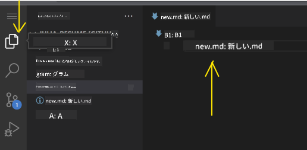

<!--
CO_OP_TRANSLATOR_METADATA:
{
  "original_hash": "f8d4b0284f3fc1de7eb65073d8338cca",
  "translation_date": "2025-10-03T09:03:08+00:00",
  "source_file": "8-code-editor/1-using-a-code-editor/README.md",
  "language_code": "ja"
}
-->
***

# コードエディターの使い方：[VSCode.dev](https://vscode.dev)をマスターしよう

**ようこそ！**  
このレッスンでは、強力なウェブベースのコードエディターである[VSCode.dev](https://vscode.dev)の基本から応用までを学びます。コードの編集、プロジェクト管理、変更の追跡、拡張機能のインストール、そしてプロのようにコラボレーションする方法を、ブラウザだけでインストール不要で習得できます。

***

## 学習目標

このレッスンを終える頃には、以下ができるようになります：

- どんなプロジェクトでも効率的にコードエディターを使いこなす
- 組み込みのバージョン管理機能で作業をスムーズに追跡する
- エディターのカスタマイズや拡張機能で開発ワークフローを向上させる

***

## 前提条件

始めるには、**無料の[GitHub](https://github.com)アカウントに登録**してください。これにより、コードリポジトリを管理し、世界中の人々とコラボレーションできます。まだアカウントを持っていない場合は、[こちらで作成](https://github.com/)してください。

***

## なぜウェブベースのコードエディターを使うのか？

**コードエディター**であるVSCode.devは、コードの作成、編集、管理を行うための指令センターです。直感的なインターフェース、多くの機能、そしてブラウザからすぐにアクセスできるため、以下が可能です：

- どんなデバイスでもプロジェクトを編集
- インストールの手間を回避
- 即座にコラボレーションや貢献

VSCode.devに慣れれば、どこからでも、いつでもコーディングタスクに取り組む準備が整います。

***

## VSCode.devの使い方

**[VSCode.dev](https://vscode.dev)**にアクセスしてください。インストールもダウンロードも不要です。GitHubでサインインすると、設定、拡張機能、リポジトリの同期を含む完全なアクセスが可能になります。プロンプトが表示されたら、GitHubアカウントを接続してください。

読み込みが完了すると、ワークスペースは以下のように表示されます：

ワークスペースは左から右に以下の3つの主要セクションで構成されています：
- **アクティビティバー:** 🔎（検索）、⚙️（設定）、ファイル、ソース管理などのアイコン
- **サイドバー:** アクティビティバーのアイコンに応じてコンテキストが変化（デフォルトは*Explorer*でファイルを表示）
- **エディター/コードエリア:** 右側の最大セクション—ここでコードを編集・表示します

アイコンをクリックして機能を探索してください。ただし、進行を維持するために_Explorer_に戻ることを忘れないでください。

***

## GitHubリポジトリを開く

### 方法1: エディターから

1. [VSCode.dev](https://vscode.dev)にアクセスし、**「Open Remote Repository」**をクリックします。

   

   _コマンドパレット_（Ctrl-Shift-P、またはMacではCmd-Shift-P）を使用することもできます。

   

   - オプションを選択します。
   - GitHubリポジトリのURL（例：`https://github.com/microsoft/Web-Dev-For-Beginners`）を貼り付けてEnterを押します。

成功すると、プロジェクト全体が読み込まれ、編集可能になります！

***

### 方法2: URLを直接使用

GitHubリポジトリのURLを変換して、VSCode.devで直接開くことができます。`github.com`を`vscode.dev/github`に置き換えるだけです。  
例：

- GitHub: `https://github.com/microsoft/Web-Dev-For-Beginners`
- VSCode.dev: `https://vscode.dev/github/microsoft/Web-Dev-For-Beginners`

この機能により、どんなプロジェクトでも迅速にアクセスできます。

***

## プロジェクト内のファイルを編集する

リポジトリを開いたら、以下ができます：

### 1. **新しいファイルを作成**
- *Explorer*サイドバーで目的のフォルダを選択するか、ルートを使用します。
- _「New file ...」_アイコンをクリックします。
- ファイル名を入力して**Enter**を押すと、ファイルが即座に表示されます。

### 2. **ファイルを編集して保存**
- *Explorer*でファイルをクリックしてコードエリアに開きます。
- 必要に応じて変更を加えます。
- VSCode.devは変更を自動保存しますが、手動で保存する場合はCtrl+Sを押してください。

### 3. **バージョン管理で変更を追跡してコミット**
VSCode.devには統合された**Git**バージョン管理機能があります！

- _「Source Control」_アイコンをクリックして、行った変更を確認します。
- `Changes`フォルダ内のファイルは、追加（緑）や削除（赤）を表示します。  
  

  - ファイルの横にある`+`をクリックして、コミットの準備をします。
  - 不要な変更は元に戻すアイコンをクリックして**破棄**します。
  - 明確なコミットメッセージを入力し、チェックマークをクリックしてコミットとプッシュを行います。

GitHubのリポジトリに戻るには、左上のハンバーガーメニューを選択してください。

***

## 拡張機能で機能を強化

拡張機能を使えば、言語、テーマ、デバッガー、生産性ツールをVSCode.devに追加でき、コーディングがより簡単で楽しくなります。

### 拡張機能の閲覧と管理

- アクティビティバーの**拡張機能アイコン**をクリックします。
- _「Search Extensions in Marketplace」_ボックスで拡張機能を検索します。

  

  - **Installed:** 追加済みの拡張機能
  - **Popular:** 業界で人気のもの
  - **Recommended:** ワークフローに合わせたおすすめ

  

### 2. **拡張機能をカスタマイズ**

- インストール済みの拡張機能を見つけます。
- **ギアアイコン**をクリック → _「Extension Settings」_を選択して動作を調整します。

  

### 3. **拡張機能を管理**
以下が可能です：

- **無効化:** 拡張機能を一時的にオフにしてインストール状態を維持
- **アンインストール:** 不要になった場合は完全に削除

  拡張機能を見つけ、ギアアイコンをクリックして「Disable」または「Uninstall」を選択するか、コードエリアの青いボタンを使用します。

***

## 課題

スキルを試してみましょう：[VSCode.devを使って履歴書ウェブサイトを作成する](https://github.com/microsoft/Web-Dev-For-Beginners/blob/main/8-code-editor/1-using-a-code-editor/assignment.md)

***

## さらなる探求と自己学習

- [公式VSCode Web Docs](https://code.visualstudio.com/docs/editor/vscode-web?WT.mc_id=academic-0000-alfredodeza)でさらに深く学びましょう。
- 高度なワークスペース機能、キーボードショートカット、設定を探索してください。

***

**これで、どこからでも、どんなデバイスでも、VSCode.devを使ってコードを書き、作成し、コラボレーションする準備が整いました！**

---

**免責事項**:  
この文書は、AI翻訳サービス[Co-op Translator](https://github.com/Azure/co-op-translator)を使用して翻訳されています。正確性を追求しておりますが、自動翻訳には誤りや不正確な部分が含まれる可能性があります。元の言語で記載された文書を正式な情報源とみなしてください。重要な情報については、専門の人間による翻訳を推奨します。この翻訳の使用に起因する誤解や誤解について、当方は責任を負いません。