# コードエディターの使い方: VSCode.devをマスターしよう

『マトリックス』でネオが巨大なコンピュータ端末に接続してデジタル世界にアクセスする必要があったのを覚えていますか？今日のウェブ開発ツールはその逆の話です。どこからでもアクセス可能な驚くほど強力な機能を提供します。VSCode.devはブラウザベースのコードエディターで、インターネット接続があるデバイスならどこでもプロフェッショナルな開発ツールを提供します。

印刷機が修道院の書記だけでなく、誰でも本を手に入れられるようにしたように、VSCode.devはコーディングを民主化します。図書館のコンピュータや学校のラボ、ブラウザにアクセスできる場所ならどこでもプロジェクトに取り組むことができます。インストール不要で、「特定のセットアップが必要」という制限もありません。

このレッスンの終わりまでに、VSCode.devの操作方法、GitHubリポジトリをブラウザで直接開く方法、そしてGitを使ったバージョン管理のスキルを習得できます。これらはプロの開発者が日常的に頼りにしているスキルです。

## ⚡ 次の5分間でできること

**忙しい開発者向けのクイックスタートガイド**


- **1分目**: [vscode.dev](https://vscode.dev)にアクセス - インストール不要
- **2分目**: GitHubにサインインしてリポジトリを接続
- **3分目**: URLトリックを試す: 任意のリポジトリURLで`github.com`を`vscode.dev/github`に変更
- **4分目**: 新しいファイルを作成し、構文ハイライトが自動的に動作するのを確認
- **5分目**: ソースコントロールパネルを使って変更をコミット

**クイックテストURL**:
```
# Transform this:
github.com/microsoft/Web-Dev-For-Beginners

# Into this:
vscode.dev/github/microsoft/Web-Dev-For-Beginners
```

**なぜ重要なのか**: 5分で、プロフェッショナルなツールを使ってどこでもコーディングできる自由を体験できます。これは開発の未来を象徴しています。アクセス可能で強力、そして即時性を備えています。

## 🗺️ クラウドベース開発の学習旅

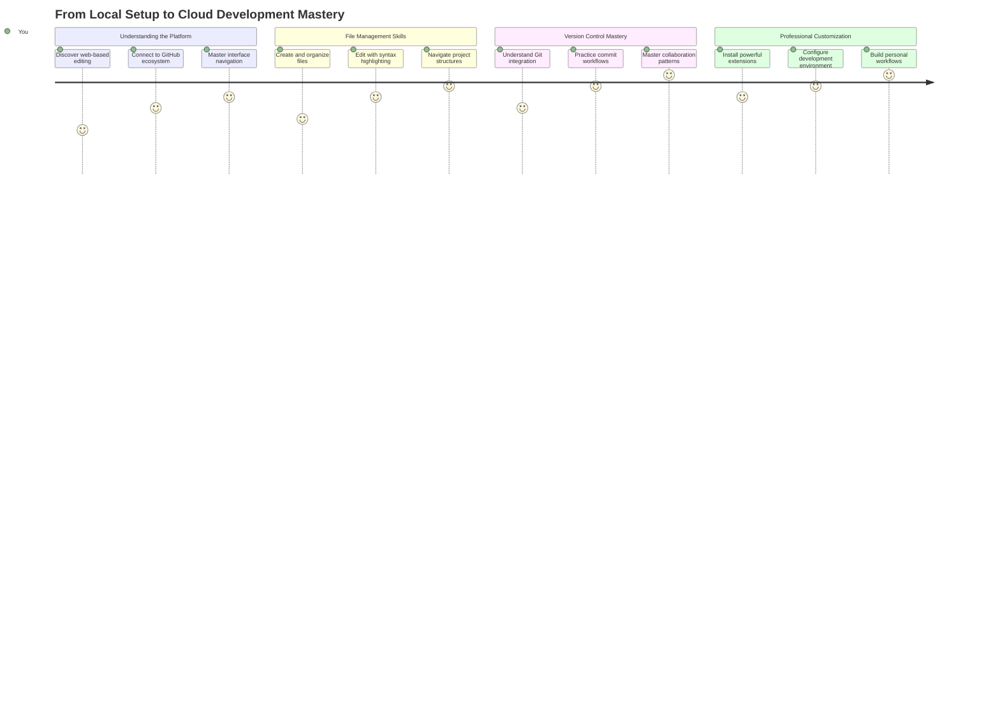

**学習の目的地**: このレッスンの終わりまでに、どのデバイスからでも動作するプロフェッショナルなクラウド開発環境をマスターし、主要なテクノロジー企業の開発者が使用するツールでコーディングできるようになります。

## 学べること

このレッスンを通じて、以下のスキルを習得できます:

- VSCode.devを自分の家のように操作し、必要なものを迷わず見つける
- 任意のGitHubリポジトリをブラウザで開き、すぐに編集を開始する（これはかなり魔法のようです！）
- Gitを使って変更を追跡し、プロのように進捗を保存する
- コーディングをより速く楽しくする拡張機能でエディターを強化する
- プロジェクトファイルを自信を持って作成・整理する

## 必要なもの

必要な条件はシンプルです:

- 無料の[GitHubアカウント](https://github.com)（必要なら作成方法を案内します）
- ウェブブラウザの基本的な操作
- GitHubの基本レッスンが役立ちますが、必須ではありません

> 💡 **GitHub初心者ですか？** アカウント作成は無料で数分で完了します。図書館カードが世界中の本にアクセスできるように、GitHubアカウントはインターネット上のコードリポジトリへの扉を開きます。

## 🧠 クラウド開発エコシステムの概要

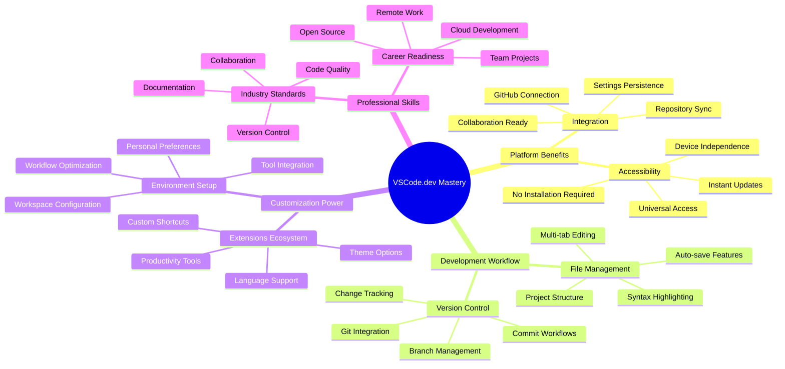

**基本原則**: クラウドベースの開発環境は、アクセス可能で協力的、そしてプラットフォームに依存しないプロフェッショナルなツールを提供することで、コーディングの未来を象徴しています。

## なぜウェブベースのコードエディターが重要なのか

インターネット以前、異なる大学の科学者たちは研究を簡単に共有することができませんでした。その後、1960年代にARPANETが登場し、距離を超えてコンピュータを接続しました。ウェブベースのコードエディターは同じ原則に従い、物理的な場所やデバイスに関係なく強力なツールを提供します。

コードエディターは開発の作業スペースとして機能し、コードファイルの作成、編集、整理を行います。単なるテキストエディターとは異なり、プロフェッショナルなコードエディターは構文ハイライト、エラー検出、プロジェクト管理機能を提供します。

VSCode.devはこれらの機能をブラウザに提供します:

**ウェブベース編集の利点:**

| 機能 | 説明 | 実用的な利点 |
|------|------|-------------|
| **プラットフォーム非依存** | ブラウザがあればどのデバイスでも動作 | 異なるコンピュータ間でシームレスに作業 |
| **インストール不要** | ウェブURLからアクセス | ソフトウェアインストールの制限を回避 |
| **自動更新** | 常に最新バージョンで動作 | 手動更新なしで新機能にアクセス |
| **リポジトリ統合** | GitHubへの直接接続 | ローカルファイル管理なしでコードを編集 |

**実用的な影響:**
- 異なる環境間での作業の継続性
- オペレーティングシステムに関係なく一貫したインターフェース
- 即時のコラボレーション能力
- ローカルストレージの必要性の軽減

## VSCode.devの探索

マリー・キュリーの研究室がシンプルな空間に洗練された機器を備えていたように、VSCode.devはプロフェッショナルな開発ツールをブラウザインターフェースに詰め込んでいます。このウェブアプリケーションはデスクトップコードエディターと同じ基本機能を提供します。

まずブラウザで[vscode.dev](https://vscode.dev)にアクセスしてください。ダウンロードやシステムインストールなしでインターフェースが読み込まれます。これはクラウドコンピューティングの原則を直接適用したものです。

### GitHubアカウントの接続

アレクサンダー・グラハム・ベルの電話が遠隔地をつないだように、GitHubアカウントをリンクすることでVSCode.devとコードリポジトリをつなげます。GitHubでのサインインを求められたら、この接続を受け入れることをお勧めします。

**GitHub統合が提供するもの:**
- エディター内でリポジトリに直接アクセス
- デバイス間で同期された設定と拡張機能
- GitHubへの保存ワークフローの簡素化
- 個別化された開発環境

### 新しいワークスペースを知る

すべてが読み込まれると、コードに集中できるように設計された美しくクリーンなワークスペースが表示されます。

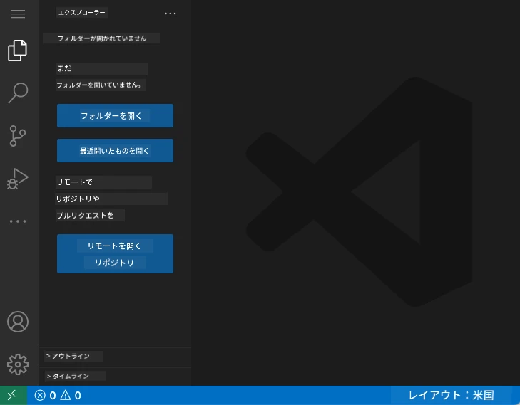

**ワークスペースのツアー:**
- **アクティビティバー**（左側のストリップ）: エクスプローラー📁、検索🔍、ソースコントロール🌿、拡張機能🧩、設定⚙️などのメインナビゲーション
- **サイドバー**（その隣のパネル）: 選択した内容に基づいて関連情報を表示
- **エディターエリア**（中央の広いスペース）: ここがメインのコーディングエリアです

**少し探索してみましょう:**
- アクティビティバーのアイコンをクリックして、それぞれが何をするか確認
- サイドバーが異なる情報を表示する様子を観察 - なかなか便利ですよね？
- エクスプローラービュー（📁）はおそらく最も頻繁に使う場所なので、慣れておきましょう

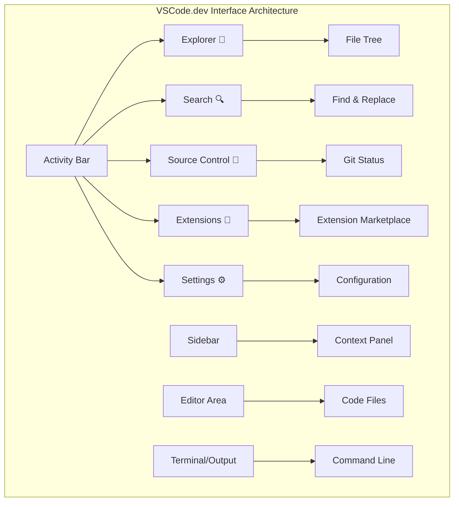

## GitHubリポジトリを開く

インターネット以前、研究者は文書にアクセスするために図書館に物理的に移動する必要がありました。GitHubリポジトリは同様の仕組みで、リモートに保存されたコードのコレクションです。VSCode.devはリポジトリをローカルマシンにダウンロードする従来のステップを排除します。

この機能により、任意の公開リポジトリに即座にアクセスして、閲覧、編集、または貢献することが可能になります。リポジトリを開く方法は2つあります:

### 方法1: ポイント＆クリック方式

VSCode.devで新しく始める場合や特定のリポジトリを開きたい場合に最適です。シンプルで初心者向けです。

**手順:**

1. [vscode.dev](https://vscode.dev)にアクセス（まだアクセスしていない場合）
2. ウェルカム画面で「Open Remote Repository」ボタンを探してクリック

   

3. 任意のGitHubリポジトリURLを貼り付け（例: `https://github.com/microsoft/Web-Dev-For-Beginners`）
4. Enterキーを押して魔法を体験！

**プロのヒント - コマンドパレットショートカット:**

コーディングの魔法使いのように感じたいですか？このキーボードショートカットを試してください: Ctrl+Shift+P（MacではCmd+Shift+P）でコマンドパレットを開く:

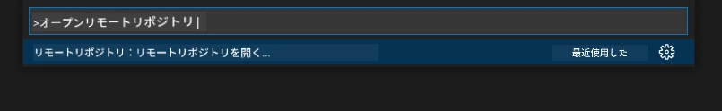

**コマンドパレットは、できることすべての検索エンジンのようなものです:**
- 「open remote」と入力するとリポジトリオープナーを見つけられます
- 最近開いたリポジトリを記憶してくれます（とても便利！）
- 慣れると、まるで光速でコーディングしているように感じます
- VSCode.dev版の「Hey Siri、でもコーディング用」といった感じです

### 方法2: URL変更テクニック

HTTPとHTTPSが異なるプロトコルを使用しながら同じドメイン構造を維持するように、VSCode.devはGitHubのアドレスシステムを反映したURLパターンを使用します。任意のGitHubリポジトリURLを変更してVSCode.devで直接開くことができます。

**URL変換パターン:**

| リポジトリタイプ | GitHub URL | VSCode.dev URL |
|----------------|---------------------|----------------|
| **公開リポジトリ** | `github.com/microsoft/Web-Dev-For-Beginners` | `vscode.dev/github/microsoft/Web-Dev-For-Beginners` |
| **個人プロジェクト** | `github.com/your-username/my-project` | `vscode.dev/github/your-username/my-project` |
| **アクセス可能な任意のリポ** | `github.com/their-username/awesome-repo` | `vscode.dev/github/their-username/awesome-repo` |

**実装方法:**
- `github.com`を`vscode.dev/github`に置き換える
- 他のURLコンポーネントは変更せずに維持
- 任意の公開リポジトリで動作
- 即座に編集アクセスを提供

> 💡 **人生を変えるヒント**: お気に入りのリポジトリのVSCode.dev版をブックマークしましょう。「ポートフォリオを編集」や「ドキュメントを修正」といったブックマークを作成して、編集モードに直行できます！

**どちらの方法を使うべきか？**
- **インターフェース方式**: 探索中や正確なリポジトリ名を覚えていない場合に最適
- **URLトリック**: 正確に行きたい場所が分かっている場合に最適な高速アクセス

### 🎯 教育的チェックイン: クラウド開発アクセス

**一時停止して振り返る**: ブラウザを通じてコードリポジトリにアクセスする2つの方法を学びました。これは開発の仕組みにおける基本的な変化を表しています。

**簡単な自己評価**:
- ウェブベースの編集が従来の「開発環境セットアップ」を排除する理由を説明できますか？
- URL変更テクニックがローカルgitクローンよりも提供する利点は何ですか？
- このアプローチがオープンソースプロジェクトへの貢献方法をどのように変えるか説明できますか？

**実世界の接続**: GitHub、GitLab、Replitなどの主要企業は、これらのクラウドファーストの原則に基づいて開発プラットフォームを構築しています。あなたは世界中のプロフェッショナルな開発チームが使用する同じワークフローを学んでいます。

**挑戦質問**: クラウドベースの開発が学校でのコーディング教育をどのように変える可能性があるか考えてみてください。デバイス要件、ソフトウェア管理、協力の可能性を考慮してください。

## ファイルとプロジェクトの操作

リポジトリを開いたら、いよいよ構築を始めましょう！VSCode.devはコードファイルの作成、編集、整理に必要なすべてを提供します。デジタルワークショップのようなもので、必要なツールがすべて揃っています。

日常的なコーディングワークフローを構成するタスクを見ていきましょう。

### 新しいファイルの作成

建築家のオフィスで設計図を整理するように、VSCode.devでのファイル作成は構造化されたアプローチに従います。このシステムは標準的なウェブ開発ファイルタイプをサポートしています。

**ファイル作成手順:**

1. エクスプローラーサイドバーで対象フォルダに移動
2. フォルダ名の上にカーソルを合わせて「新しいファイル」アイコン（📄+）を表示
3. 適切な拡張子を含むファイル名を入力（例: `style.css`, `script.js`, `index.html`）
4. Enterキーを押してファイルを作成

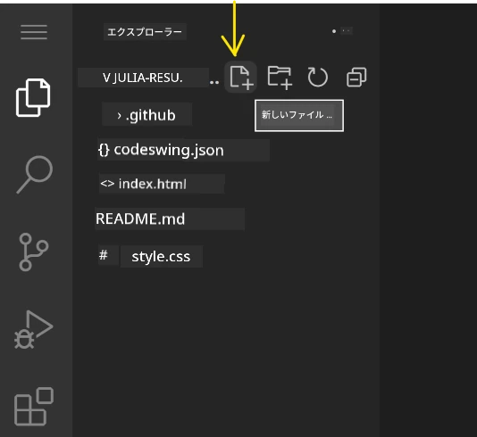

**命名規則:**
- ファイルの目的を示す説明的な名前を使用
- 適切な構文ハイライトのためにファイル拡張子を含める
- プロジェクト全体で一貫した命名パターンを維持
- 小文字とハイフンを使用し、スペースは避ける

### ファイルの編集と保存

ここからが本番です！VSCode.devのエディターは、コーディングをスムーズで直感的に感じさせる便利な機能が満載です。まるで非常に賢い執筆アシスタントがコードのためにいるような感覚です。

**編集ワークフロー:**

1. エクスプローラーで任意のファイルをクリックしてメインエリアで開く
2. タイピングを開始すると、VSCode.devが色付け、提案、エラー検出で助けてくれます
3. Ctrl+S（Windows/Linux）またはCmd+S（Mac）で作業を保存 - 自動保存もあります！

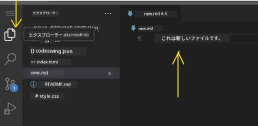

**コーディング中に起こる素晴らしいこと:**
- コードが美しく色分けされ、読みやすくなる
- VSCode.devが入力中に補完を提案（オートコレクトのようですが、もっと賢い）
- 保存する前にタイプミスやエラーを検出
- 複数のファイルをタブ
- ステージングした変更に満足しているか確認してください  
- 何をしたか簡単なメモを書きましょう（これが「コミットメッセージ」です）  
- チェックマークボタンをクリックして、すべてをGitHubに保存します  
- もし何か変更したくなった場合は、元に戻すアイコンで変更を破棄できます  

**良いコミットメッセージを書く方法（意外と簡単！）：**  
- 何をしたかを説明するだけでOK。「コンタクトフォームを追加」や「壊れたナビゲーションを修正」など  
- 短く簡潔に書きましょう。ツイートのような長さで、エッセイのように長くしないこと  
- 「追加」「修正」「更新」「削除」などのアクションワードで始める  
- **良い例**: 「レスポンシブナビゲーションメニューを追加」「モバイルレイアウトの問題を修正」「アクセシビリティ向上のために色を更新」  

> 💡 **ナビゲーションのコツ**: 左上のハンバーガーメニュー（☰）を使ってGitHubリポジトリに戻り、オンラインでコミットした変更を確認できます。編集環境とプロジェクトのホームをつなぐポータルのようなものです！

## 機能拡張での機能向上

職人の作業場に特定のタスク用の専門的な道具があるように、VSCode.devも拡張機能を使って特定の能力を追加できます。これらのコミュニティが開発したプラグインは、コードフォーマット、ライブプレビュー、Git統合の強化など、一般的な開発ニーズに対応します。

拡張機能マーケットプレイスには、世界中の開発者が作成した数千の無料ツールがホストされています。各拡張機能は特定のワークフローの課題を解決し、個々のニーズや好みに合わせた開発環境を構築することができます。

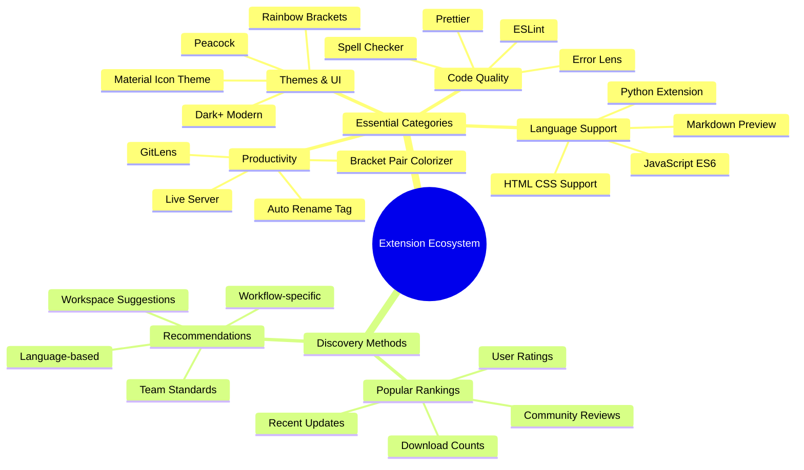
  
### 理想の拡張機能を見つける

拡張機能マーケットプレイスは非常に整理されているので、必要なものを探して迷子になることはありません。特定のツールを見つけたり、知らなかった便利なものを発見するのに役立つよう設計されています。

**マーケットプレイスへのアクセス方法：**

1. アクティビティバーの拡張機能アイコン（🧩）をクリック  
2. 探索するか、特定のものを検索  
3. 興味深いものをクリックして詳細を確認  

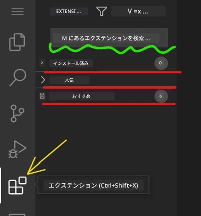

**中にあるもの：**

| セクション | 内容 | なぜ役立つか |
|----------|---------|----------|
| **インストール済み** | すでに追加した拡張機能 | 個人のコーディングツールキット |
| **人気** | 開発者に人気のもの | 多くの開発者が推奨するもの |
| **おすすめ** | プロジェクトに役立つ提案 | VSCode.devの便利なおすすめ |

**ブラウジングが簡単な理由：**  
- 各拡張機能には評価、ダウンロード数、実際のユーザーレビューが表示されます  
- スクリーンショットや各機能の明確な説明が付いています  
- 互換性情報が明確に記載されています  
- 類似の拡張機能が提案されるので比較が簡単です  

### 拡張機能のインストール（とても簡単！）

エディタに新しい機能を追加するのはボタンをクリックするだけです。拡張機能は数秒でインストールされ、すぐに動作を開始します。再起動も待ち時間も必要ありません。

**手順：**

1. 欲しいものを検索（例: "live server" や "prettier"）  
2. 良さそうなものをクリックして詳細を確認  
3. 機能を読み、評価をチェック  
4. 青い「インストール」ボタンをクリックして完了！  


**裏で何が起きているか：**  
- 拡張機能がダウンロードされ、自動的にセットアップされます  
- 新しい機能がすぐにインターフェースに表示されます  
- すべてが即座に動作を開始します（本当に速いです！）  
- サインインしている場合、拡張機能はすべてのデバイスに同期されます  

**おすすめの拡張機能：**  
- **Live Server**: コードを書きながらリアルタイムでウェブサイトを更新（魔法のようです！）  
- **Prettier**: コードを自動的にきれいでプロフェッショナルに見せる  
- **Auto Rename Tag**: HTMLタグを変更するとペアのタグも更新  
- **Bracket Pair Colorizer**: 括弧を色分けして迷子にならないようにする  
- **GitLens**: Git機能を強化し、便利な情報をたくさん提供  

### 拡張機能のカスタマイズ

ほとんどの拡張機能には設定があり、自分の好みに合わせて調整できます。車のシートやミラーを調整するようなものです。誰もが自分の好みがあります！

**拡張機能設定の調整方法：**

1. 拡張機能パネルでインストール済みの拡張機能を見つける  
2. 名前の横にある小さなギアアイコン（⚙️）をクリック  
3. ドロップダウンから「拡張機能設定」を選択  
4. ワークフローに合うように調整  

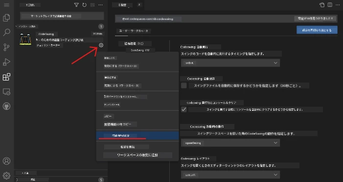

**調整したい一般的な項目：**  
- コードのフォーマット方法（タブ vs スペース、行の長さなど）  
- キーボードショートカットの設定  
- 拡張機能が動作するファイルタイプの指定  
- 特定の機能をオン/オフにして環境を整理  

### 拡張機能の整理

新しい拡張機能を発見するたびに、コレクションを整理してスムーズに動作させたいと思うでしょう。VSCode.devはこれを簡単に管理できます。

**拡張機能管理オプション：**

| できること | 役立つ場面 | プロのコツ |
|--------|---------|----------|
| **無効化** | 拡張機能が問題を引き起こしているかテストする場合 | 再インストールせずに戻せるので便利 |
| **アンインストール** | 不要な拡張機能を完全に削除する場合 | 環境をクリーンで高速に保つ |
| **更新** | 最新の機能やバグ修正を取得する場合 | 通常自動で行われますが、確認する価値あり |

**私の管理方法：**  
- 数か月ごとにインストールしたものを見直し、使っていないものを削除  
- 拡張機能を更新して最新の改善やセキュリティ修正を取得  
- 何かが遅いと感じたら、一時的に拡張機能を無効化して原因を特定  
- 拡張機能が大幅に更新された場合、更新ノートを読んで新機能を確認  

> ⚠️ **パフォーマンスのコツ**: 拡張機能は素晴らしいですが、数が多すぎると動作が遅くなることがあります。本当に役立つものに集中し、使わないものはアンインストールしましょう。

### 🎯 教育的チェックイン: 開発環境のカスタマイズ

**アーキテクチャの理解**: コミュニティが作成した拡張機能を使用してプロフェッショナルな開発環境をカスタマイズする方法を学びました。これは企業の開発チームが標準化されたツールチェーンを構築する方法に似ています。

**習得した重要な概念**:  
- **拡張機能の発見**: 特定の開発課題を解決するツールを見つける  
- **環境設定**: 個人やチームの好みに合わせてツールをカスタマイズする  
- **パフォーマンス最適化**: 機能とシステムパフォーマンスのバランスを取る  
- **コミュニティの協力**: 世界中の開発者コミュニティが作成したツールを活用する  

**業界との関連性**: 拡張機能エコシステムは、VS Code、Chrome DevTools、モダンなIDEなどの主要な開発プラットフォームを支えています。拡張機能を評価、インストール、設定する方法を理解することは、プロフェッショナルな開発ワークフローに不可欠です。

**振り返りの質問**: 10人の開発者チームのために標準化された開発環境を設定するにはどうしますか？一貫性、パフォーマンス、個々の好みを考慮してください。

## 📈 クラウド開発スキルの習得タイムライン

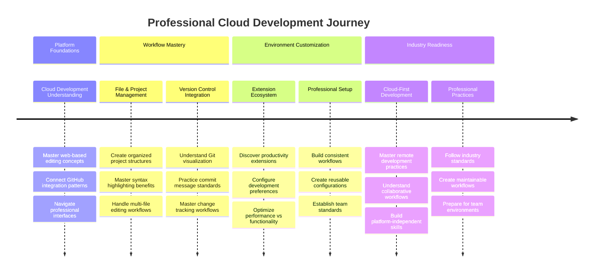
  
**🎓 卒業の節目**: 大手テクノロジー企業のプロフェッショナルな開発者が採用しているのと同じツールとワークフローを使用して、クラウドベースの開発をマスターしました。このスキルはソフトウェア開発の未来を象徴しています。

**🔄 次のレベルの能力**:  
- 高度なクラウド開発プラットフォーム（Codespaces、GitPod）を探索する準備が整いました  
- 分散型開発チームでの作業に対応可能  
- 世界中のオープンソースプロジェクトに貢献する準備が整いました  
- モダンなDevOpsと継続的インテグレーションの基礎が整いました  

## GitHub Copilot Agent チャレンジ 🚀

NASAが宇宙ミッションで体系的なアプローチを採用するように、このチャレンジではVSCode.devのスキルを完全なワークフローシナリオで体系的に適用します。

**目的:** VSCode.devの熟練度を示し、包括的なウェブ開発ワークフローを確立すること。  

**プロジェクト要件:** Agentモードの支援を利用して以下のタスクを完了してください:  
1. 既存のリポジトリをフォークするか、新しいリポジトリを作成する  
2. HTML、CSS、JavaScriptファイルを含む機能的なプロジェクト構造を確立する  
3. 開発を向上させる拡張機能を3つインストールして設定する  
4. 説明的なコミットメッセージを使ってバージョン管理を練習する  
5. フィーチャーブランチの作成と変更を試す  
6. プロセスと学びをREADME.mdファイルに記録する  

この演習は、すべてのVSCode.devの概念を実践的なワークフローに統合し、将来の開発プロジェクトに適用できるようにします。

[Agentモード](https://code.visualstudio.com/blogs/2025/02/24/introducing-copilot-agent-mode)について詳しくはこちら。

## 課題

これらのスキルを実際に試してみましょう！これまで学んだことを練習できる実践的なプロジェクトがあります: [VSCode.devを使って履歴書ウェブサイトを作成する](./assignment.md)

この課題では、ブラウザだけでプロフェッショナルな履歴書ウェブサイトを構築する方法を案内します。これまで探求したすべてのVSCode.dev機能を使用し、最終的には素晴らしいウェブサイトと新しいワークフローへの自信を得ることができます。

## スキルをさらに探求し成長させる

今、しっかりとした基盤を築きましたが、まだまだ発見すべき素晴らしいことがたくさんあります！VSCode.devスキルを次のレベルに引き上げるためのリソースやアイデアをいくつか紹介します:

**ブックマークする価値のある公式ドキュメント:**  
- [VSCode Web Documentation](https://code.visualstudio.com/docs/editor/vscode-web?WT.mc_id=academic-0000-alfredodeza) – ブラウザベースの編集に関する完全ガイド  
- [GitHub Codespaces](https://docs.github.com/en/codespaces) – クラウドでさらに強力な機能を求めるときに  

**次に試してみたいクールな機能:**  
- **キーボードショートカット**: コーディング忍者のように感じるキーコンボを学ぶ  
- **ワークスペース設定**: プロジェクトの種類に応じた異なる環境を設定する  
- **マルチルートワークスペース**: 複数のリポジトリを同時に作業する（非常に便利！）  
- **ターミナル統合**: ブラウザ内でコマンドラインツールにアクセスする  

**練習のアイデア:**  
- オープンソースプロジェクトに参加し、VSCode.devを使って貢献する – 素晴らしい方法で還元できます！  
- 異なる拡張機能を試して理想のセットアップを見つける  
- よく作るサイトの種類に合わせたプロジェクトテンプレートを作成する  
- ブランチやマージなどのGitワークフローを練習する – チームプロジェクトで非常に役立つスキルです  

---

**ブラウザベースの開発をマスターしました！** 🎉 ポータブルな機器の発明が科学者に遠隔地での研究を可能にしたように、VSCode.devはインターネット接続されたデバイスからプロフェッショナルなコーディングを可能にします。

これらのスキルは現在の業界慣行を反映しています – 多くのプロフェッショナルな開発者がその柔軟性とアクセス性のためにクラウドベースの開発環境を使用しています。スケールが個人プロジェクトから大規模なチームコラボレーションまで広がるワークフローを学びました。

次の開発プロジェクトにこれらの技術を適用してください！ 🚀

---

**免責事項**:  
この文書はAI翻訳サービス[Co-op Translator](https://github.com/Azure/co-op-translator)を使用して翻訳されています。正確性を追求しておりますが、自動翻訳には誤りや不正確な部分が含まれる可能性があります。元の言語で記載された文書を正式な情報源としてお考えください。重要な情報については、専門の人間による翻訳を推奨します。この翻訳の使用に起因する誤解や誤解について、当社は責任を負いません。