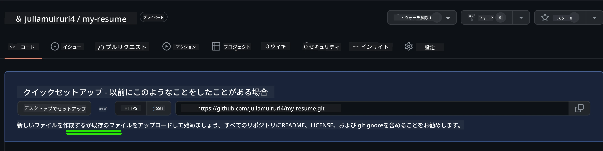
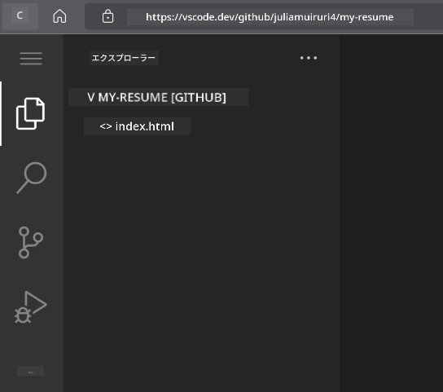
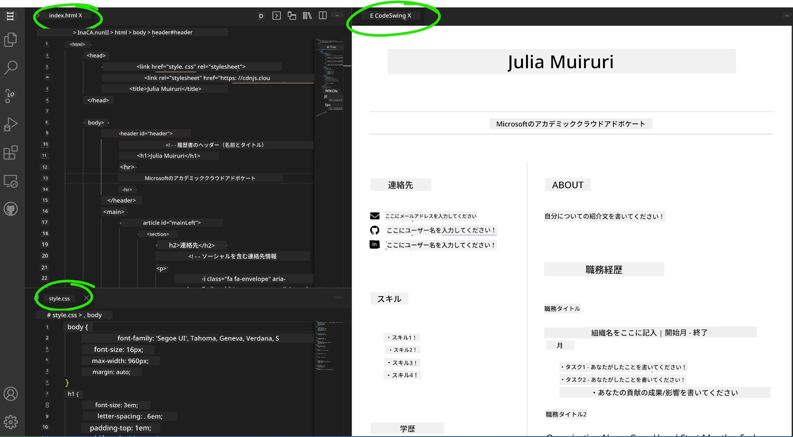

# VSCode.devを使って履歴書ウェブサイトを作成する

インタラクティブでモダンな形式であなたのスキルや経験をアピールするプロフェッショナルな履歴書ウェブサイトを作成し、キャリアの可能性を広げましょう。従来のPDFを送る代わりに、採用担当者にあなたの資格とウェブ開発能力を示す洗練されたレスポンシブなウェブサイトを提供することを想像してみてください。

この実践的な課題では、VSCode.devのスキルを活用しながら、キャリアに役立つものを作成します。ブラウザ内でリポジトリの作成からデプロイまで、完全なウェブ開発ワークフローを体験できます。

このプロジェクトを完了することで、潜在的な雇用主と簡単に共有できるプロフェッショナルなオンラインプレゼンスを持つことができ、スキルの向上に合わせて更新したり、個人ブランドに合わせてカスタマイズしたりすることが可能になります。これは、実際のウェブ開発スキルを示す実践的なプロジェクトです。

## 学習目標

この課題を完了すると、以下のことができるようになります：

- **作成**：VSCode.devを使用して完全なウェブ開発プロジェクトを管理
- **構造化**：セマンティックHTML要素を使用してプロフェッショナルなウェブサイトを構築
- **スタイリング**：モダンなCSS技術を使ったレスポンシブレイアウトのデザイン
- **実装**：基本的なウェブ技術を使用してインタラクティブな機能を追加
- **デプロイ**：共有可能なURLでアクセス可能なライブウェブサイトを公開
- **実証**：開発プロセス全体でバージョン管理のベストプラクティスを実践

## 前提条件

この課題を始める前に、以下を確認してください：

- GitHubアカウント（必要に応じて[github.com](https://github.com/)で作成）
- VSCode.devのインターフェースナビゲーションと基本操作に関するレッスンの完了
- HTML構造とCSSスタイリングの基本的な理解

## プロジェクトのセットアップとリポジトリの作成

プロジェクトの基盤を設定することから始めましょう。このプロセスは、実際の開発ワークフローを反映しており、プロジェクトが適切にリポジトリを初期化し、構造を計画するところから始まります。

### ステップ1: GitHubリポジトリを作成する

専用のリポジトリを設定することで、プロジェクトが最初から適切に整理され、バージョン管理されます。

1. [GitHub.com](https://github.com)に移動し、アカウントにサインイン
2. 緑色の「New」ボタンまたは右上の「+」アイコンをクリック
3. リポジトリ名を`my-resume`（または`john-smith-resume`のような個人名）に設定
4. 簡単な説明を追加：「HTMLとCSSで作成したプロフェッショナルな履歴書ウェブサイト」
5. 「Public」を選択して履歴書を潜在的な雇用主がアクセス可能にする
6. 「Add a README file」をチェックして初期プロジェクト説明を作成
7. 「Create repository」をクリックして設定を完了

> 💡 **リポジトリ名のヒント**: プロジェクトの目的を明確に示す記述的でプロフェッショナルな名前を使用しましょう。これにより、雇用主と共有する際やポートフォリオレビュー時に役立ちます。

### ステップ2: プロジェクト構造を初期化する

VSCode.devではリポジトリを開くために少なくとも1つのファイルが必要なため、GitHubでメインのHTMLファイルを作成してからウェブエディタに切り替えます。

1. 新しいリポジトリ内の「creating a new file」リンクをクリック
2. ファイル名を`index.html`と入力
3. 以下の初期HTML構造を追加：

```html
<!DOCTYPE html>
<html lang="en">
<head>
    <meta charset="UTF-8">
    <meta name="viewport" content="width=device-width, initial-scale=1.0">
    <title>Your Name - Professional Resume</title>
</head>
<body>
    <h1>Your Name</h1>
    <p>Professional Resume Website</p>
</body>
</html>
```

4. コミットメッセージを記入：「初期HTML構造を追加」
5. 「Commit new file」をクリックして変更を保存



**この初期設定で達成されること：**
- **HTML5ドキュメント構造**をセマンティック要素で確立
- **レスポンシブデザイン互換性**のためのviewportメタタグを含む
- **ブラウザタブに表示される説明的なページタイトル**を設定
- **プロフェッショナルなコンテンツ構成の基盤**を作成

## VSCode.devでの作業

リポジトリの基盤が整ったら、VSCode.devに移行して主要な開発作業を行いましょう。このウェブベースのエディタはプロフェッショナルなウェブ開発に必要なすべてのツールを提供します。

### ステップ3: VSCode.devでプロジェクトを開く

1. 新しいブラウザタブで[vscode.dev](https://vscode.dev)に移動
2. ウェルカム画面で「Open Remote Repository」をクリック
3. GitHubからリポジトリURLをコピーして入力フィールドに貼り付け

   フォーマット: `https://github.com/your-username/my-resume`
   
   *`your-username`を実際のGitHubユーザー名に置き換えてください*

4. Enterキーを押してプロジェクトを読み込む

✅ **成功の指標**: Explorerサイドバーにプロジェクトファイルが表示され、メインエディタエリアで`index.html`が編集可能になります。



**インターフェースで見えるもの：**
- **Explorerサイドバー**: リポジトリのファイルとフォルダ構造を表示
- **エディタエリア**: 選択したファイルの内容を編集可能
- **アクティビティバー**: ソース管理や拡張機能へのアクセスを提供
- **ステータスバー**: 接続状況や現在のブランチ情報を表示

### ステップ4: 履歴書コンテンツを構築する

`index.html`のプレースホルダーコンテンツを包括的な履歴書構造に置き換えます。このHTMLが資格をプロフェッショナルに提示する基盤となります。

<details>
<summary><b>完全なHTML履歴書構造</b></summary>

```html
<!DOCTYPE html>
<html lang="en">
<head>
    <meta charset="UTF-8">
    <meta name="viewport" content="width=device-width, initial-scale=1.0">
    <link href="style.css" rel="stylesheet">
    <link rel="stylesheet" href="https://cdnjs.cloudflare.com/ajax/libs/font-awesome/5.15.4/css/all.min.css">
    <title>Your Name - Professional Resume</title>
</head>
<body>
    <header id="header">
        <h1>Your Full Name</h1>
        <hr>
        <p class="role">Your Professional Title</p>
        <hr>
    </header>
    
    <main>
        <article id="mainLeft">
            <section>
                <h2>CONTACT</h2>
                <p>
                    <i class="fa fa-envelope" aria-hidden="true"></i>
                    <a href="mailto:your.email@domain.com">your.email@domain.com</a>
                </p>
                <p>
                    <i class="fab fa-github" aria-hidden="true"></i>
                    <a href="https://github.com/your-username">github.com/your-username</a>
                </p>
                <p>
                    <i class="fab fa-linkedin" aria-hidden="true"></i>
                    <a href="https://linkedin.com/in/your-profile">linkedin.com/in/your-profile</a>
                </p>
            </section>
            
            <section>
                <h2>SKILLS</h2>
                <ul>
                    <li>HTML5 & CSS3</li>
                    <li>JavaScript (ES6+)</li>
                    <li>Responsive Web Design</li>
                    <li>Version Control (Git)</li>
                    <li>Problem Solving</li>
                </ul>
            </section>
            
            <section>
                <h2>EDUCATION</h2>
                <h3>Your Degree or Certification</h3>
                <p>Institution Name</p>
                <p>Start Date - End Date</p>
            </section>
        </article>
        
        <article id="mainRight">
            <section>
                <h2>ABOUT</h2>
                <p>Write a compelling summary that highlights your passion for web development, key achievements, and career goals. This section should give employers insight into your personality and professional approach.</p>
            </section>
            
            <section>
                <h2>WORK EXPERIENCE</h2>
                <div class="job">
                    <h3>Job Title</h3>
                    <p class="company">Company Name | Start Date – End Date</p>
                    <ul>
                        <li>Describe a key accomplishment or responsibility</li>
                        <li>Highlight specific skills or technologies used</li>
                        <li>Quantify impact where possible (e.g., "Improved efficiency by 25%")</li>
                    </ul>
                </div>
                
                <div class="job">
                    <h3>Previous Job Title</h3>
                    <p class="company">Previous Company | Start Date – End Date</p>
                    <ul>
                        <li>Focus on transferable skills and achievements</li>
                        <li>Demonstrate growth and learning progression</li>
                        <li>Include any leadership or collaboration experiences</li>
                    </ul>
                </div>
            </section>
            
            <section>
                <h2>PROJECTS</h2>
                <div class="project">
                    <h3>Project Name</h3>
                    <p>Brief description of what the project accomplishes and technologies used.</p>
                    <a href="#" target="_blank">View Project</a>
                </div>
            </section>
        </article>
    </main>
</body>
</html>
```
</details>

**カスタマイズガイドライン：**
- **プレースホルダーのテキスト**を実際の情報に置き換える
- **経験レベルやキャリアの焦点**に基づいてセクションを調整
- **必要に応じてセクションを追加または削除**（例：資格、ボランティア活動、言語）
- **実際のプロフィールやプロジェクトへのリンク**を含める

### ステップ5: 補助ファイルを作成する

プロフェッショナルなウェブサイトには整理されたファイル構造が必要です。完全なプロジェクトに必要なCSSスタイルシートや設定ファイルを作成します。

1. Explorerサイドバーでプロジェクトフォルダ名にカーソルを合わせる
2. 表示される「新しいファイル」アイコン（📄+）をクリック
3. 以下のファイルを1つずつ作成：
   - `style.css`（スタイリングとレイアウト用）
   - `codeswing.json`（プレビュー拡張機能の設定用）

**CSSファイルの作成（`style.css`）：**

<details>
<summary><b>プロフェッショナルなCSSスタイリング</b></summary>

```css
/* Modern Resume Styling */
body {
    font-family: 'Segoe UI', Tahoma, Geneva, Verdana, sans-serif;
    font-size: 16px;
    line-height: 1.6;
    max-width: 960px;
    margin: 0 auto;
    padding: 20px;
    color: #333;
    background-color: #f9f9f9;
}

/* Header Styling */
header {
    text-align: center;
    margin-bottom: 3em;
    padding: 2em;
    background: linear-gradient(135deg, #667eea 0%, #764ba2 100%);
    color: white;
    border-radius: 10px;
    box-shadow: 0 4px 6px rgba(0, 0, 0, 0.1);
}

h1 {
    font-size: 3em;
    letter-spacing: 0.1em;
    margin-bottom: 0.2em;
    font-weight: 300;
}

.role {
    font-size: 1.3em;
    font-weight: 300;
    margin: 1em 0;
}

/* Main Content Layout */
main {
    display: grid;
    grid-template-columns: 35% 65%;
    gap: 3em;
    margin-top: 3em;
    background: white;
    padding: 2em;
    border-radius: 10px;
    box-shadow: 0 2px 10px rgba(0, 0, 0, 0.1);
}

/* Typography */
h2 {
    font-size: 1.4em;
    font-weight: 600;
    margin-bottom: 1em;
    color: #667eea;
    border-bottom: 2px solid #667eea;
    padding-bottom: 0.3em;
}

h3 {
    font-size: 1.1em;
    font-weight: 600;
    margin-bottom: 0.5em;
    color: #444;
}

/* Section Styling */
section {
    margin-bottom: 2.5em;
}

#mainLeft {
    border-right: 1px solid #e0e0e0;
    padding-right: 2em;
}

/* Contact Links */
section a {
    color: #667eea;
    text-decoration: none;
    transition: color 0.3s ease;
}

section a:hover {
    color: #764ba2;
    text-decoration: underline;
}

/* Icons */
i {
    margin-right: 0.8em;
    width: 20px;
    text-align: center;
    color: #667eea;
}

/* Lists */
ul {
    list-style: none;
    padding-left: 0;
}

li {
    margin: 0.5em 0;
    padding: 0.3em 0;
    position: relative;
}

li:before {
    content: "▸";
    color: #667eea;
    margin-right: 0.5em;
}

/* Work Experience */
.job, .project {
    margin-bottom: 2em;
    padding-bottom: 1.5em;
    border-bottom: 1px solid #f0f0f0;
}

.company {
    font-style: italic;
    color: #666;
    margin-bottom: 0.5em;
}

/* Responsive Design */
@media (max-width: 768px) {
    main {
        grid-template-columns: 1fr;
        gap: 2em;
    }
    
    #mainLeft {
        border-right: none;
        border-bottom: 1px solid #e0e0e0;
        padding-right: 0;
        padding-bottom: 2em;
    }
    
    h1 {
        font-size: 2.2em;
    }
    
    body {
        padding: 10px;
    }
}

/* Print Styles */
@media print {
    body {
        background: white;
        color: black;
        font-size: 12pt;
    }
    
    header {
        background: none;
        color: black;
        box-shadow: none;
    }
    
    main {
        box-shadow: none;
    }
}
```
</details>

**設定ファイルの作成（`codeswing.json`）：**

```json
{
    "scripts": [],
    "styles": []
}
```

**CSSの特徴の理解：**
- **CSS Grid**を使用してレスポンシブでプロフェッショナルなレイアウト構造を実現
- **モダンなカラースキーム**をグラデーションヘッダーで実装
- **ホバーエフェクトとスムーズなトランジション**でインタラクティブ性を追加
- **すべてのデバイスサイズに対応するレスポンシブデザイン**を提供
- **PDF生成用の印刷対応スタイル**を追加

### ステップ6: 拡張機能のインストールと設定

拡張機能は開発体験を向上させ、ライブプレビュー機能やワークフロー改善ツールを提供します。CodeSwing拡張機能はウェブ開発プロジェクトに特に役立ちます。

**CodeSwing拡張機能のインストール：**

1. アクティビティバーの拡張機能アイコン（🧩）をクリック
2. マーケットプレイスの検索ボックスで「CodeSwing」を検索
3. 検索結果からCodeSwing拡張機能を選択
4. 青い「Install」ボタンをクリック


**CodeSwingが提供するもの：**
- **ウェブサイトのライブプレビュー**を編集中に表示
- **手動リフレッシュなしでリアルタイムで変更を反映**
- **HTML、CSS、JavaScriptを含む複数のファイルタイプをサポート**
- **統合された開発環境体験**を提供

**インストール後の即時結果：**
CodeSwingがインストールされると、履歴書ウェブサイトのライブプレビューがエディタに表示されます。これにより、変更を加えるたびにサイトの外観を正確に確認できます。



**強化されたインターフェースの理解：**
- **分割ビュー**: コードとライブプレビューを並べて表示
- **リアルタイム更新**: タイピングするたびに変更を即座に反映
- **インタラクティブプレビュー**: リンクやインタラクションをテスト可能
- **モバイルシミュレーション**: レスポンシブデザインのテスト機能を提供

### ステップ7: バージョン管理と公開

履歴書ウェブサイトが完成したら、Gitを使用して作業を保存し、オンラインで利用可能にします。

**変更をコミットする：**

1. アクティビティバーのソース管理アイコン（🌿）をクリック
2. 「Changes」セクションで作成および変更したすべてのファイルを確認
3. 各ファイルの横にある「+」アイコンをクリックして変更をステージング
4. 説明的なコミットメッセージを記入、例：
   - 「レスポンシブデザインを備えた完全な履歴書ウェブサイトを追加」
   - 「プロフェッショナルなスタイリングとコンテンツ構造を実装」
5. チェックマーク（✓）をクリックしてコミットとプッシュを完了

**効果的なコミットメッセージの例：**
- 「プロフェッショナルな履歴書コンテンツとスタイリングを追加」
- 「モバイル互換性のためのレスポンシブデザインを実装」
- 「連絡先情報とプロジェクトリンクを更新」

> 💡 **プロフェッショナルのヒント**: 良いコミットメッセージはプロジェクトの進化を追跡し、細部への注意を示します。これは雇用主にとって価値のある特性です。

**公開されたサイトへのアクセス：**
コミットが完了したら、左上のハンバーガーメニュー（☰）を使用してGitHubリポジトリに戻ることができます。履歴書ウェブサイトはバージョン管理され、デプロイや共有の準備が整いました。

## 結果と次のステップ

**おめでとうございます！ 🎉** VSCode.devを使用してプロフェッショナルな履歴書ウェブサイトを作成することに成功しました。このプロジェクトは以下を示しています：
**実証された技術スキル：**
- **リポジトリ管理**: 完全なプロジェクト構造を作成および整理
- **ウェブ開発**: モダンなHTML5とCSS3を使用してレスポンシブウェブサイトを構築
- **バージョン管理**: 意味のあるコミットを伴う適切なGitワークフローを実装
- **ツールの熟練度**: VSCode.devのインターフェースと拡張機能システムを効果的に使用

**達成されたプロフェッショナルな成果：**
- **オンラインプレゼンス**: 資格を示す共有可能なURL
- **モダンな形式**: 従来のPDF履歴書に代わるインタラクティブな形式
- **実証可能なスキル**: ウェブ開発能力の具体的な証拠
- **簡単な更新**: 継続的に改善およびカスタマイズ可能な基盤

### デプロイオプション

履歴書を雇用主がアクセスできるようにするため、以下のホスティングオプションを検討してください：

**GitHub Pages（推奨）：**
1. GitHubのリポジトリ設定に移動
2. 「Pages」セクションまでスクロール
3. 「Deploy from a branch」を選択し、「main」を選択
4. サイトは`https://your-username.github.io/my-resume`で利用可能になります

**その他のプラットフォーム：**
- **Netlify**: カスタムドメインを使用した自動デプロイ
- **Vercel**: モダンなホスティング機能を備えた高速デプロイ
- **GitHub Codespaces**: 統合されたプレビューを備えた開発環境

### 改善提案

以下の機能を追加してスキルをさらに向上させましょう：

**技術的な改善：**
- **JavaScriptのインタラクティビティ**: スムーズなスクロールやインタラクティブな要素を追加
- **ダークモード切り替え**: ユーザーの好みに合わせたテーマ切り替えを実装
- **お問い合わせフォーム**: 潜在的な雇用主からの直接の連絡を可能にする
- **SEO最適化**: メタタグや構造化データを追加して検索の可視性を向上

**コンテンツの強化：**
- **プロジェクトポートフォリオ**: GitHubリポジトリやライブデモへのリンクを追加
- **スキルの視覚化**: プログレスバーやスキル評価システムを作成
- **推薦セクション**: 同僚やインストラクターからの推薦を含める
- **ブログ統合**: 学習の旅を紹介するブログセクションを追加

## GitHub Copilot Agentチャレンジ 🚀

Agentモードを使用して以下のチャレンジを完了してください：

**説明:** プロフェッショナルなウェブ開発能力とモダンなデザイン原則を示す高度な機能で履歴書ウェブサイトを強化します。

**プロンプト:** 既存の履歴書ウェブサイトを基に、以下の高度な機能を実装してください：
1. スムーズなトランジションを伴うダーク/ライトテーマ切り替えを追加
2. アニメーション付きプログレスバーを使用したインタラクティブなスキルセクションを作成
3. フォームバリデーション付きのお問い合わせフォームを実装
4. ホバーエフェクトとモーダルポップアップを備えたプロジェクトポートフォリオセクションを追加
5. 学習の旅に関するサンプル投稿を少なくとも3つ含むブログセクションを追加
6. 適切なメタタグ、構造化データ、パフォーマンスを使用してSEOを最適化
7. GitHub PagesまたはNetlifyを使用して強化されたサイトをデプロイ
8. README.mdに新機能をスクリーンショット付きで記録

強化されたウェブサイトは、レスポンシブデザイン、JavaScriptのインタ
- **アクセシビリティ**: 包括的なウェブデザインのためのWCAGガイドラインを学ぶ  
- **パフォーマンス**: Lighthouseのようなツールを使って最適化を探る  
- **SEO**: 検索エンジン最適化の基本を理解する  

**プロフェッショナル開発:**  
- **ポートフォリオ作成**: 多様なスキルを示す追加プロジェクトを作成する  
- **オープンソース**: 既存プロジェクトに貢献し、コラボレーション経験を得る  
- **ネットワーキング**: 開発者コミュニティで履歴書ウェブサイトを共有し、フィードバックを得る  
- **継続的学習**: ウェブ開発のトレンドや技術を常に更新する  

---

**次のステップ:** 履歴書ウェブサイトを友人、家族、またはメンターに共有してフィードバックをもらいましょう。彼らの提案を活用してデザインを改善してください。このプロジェクトは単なる履歴書ではなく、ウェブ開発者としての成長を示すものです！

---

**免責事項**:  
この文書はAI翻訳サービス[Co-op Translator](https://github.com/Azure/co-op-translator)を使用して翻訳されています。正確性を追求しておりますが、自動翻訳には誤りや不正確な部分が含まれる可能性があります。元の言語で記載された文書が正式な情報源とみなされるべきです。重要な情報については、専門の人間による翻訳を推奨します。この翻訳の使用に起因する誤解や誤認について、当方は責任を負いません。