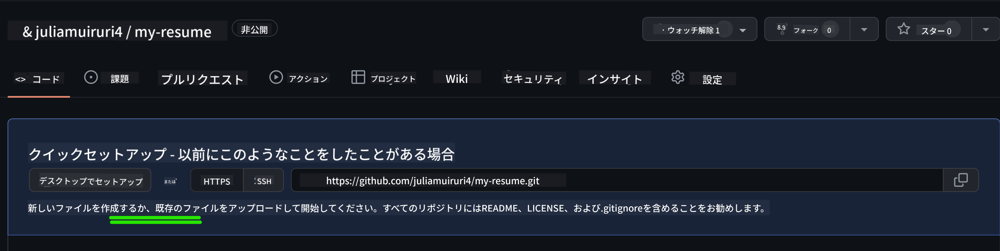
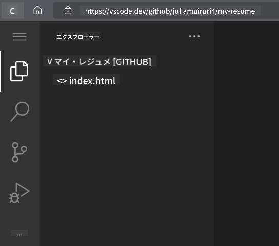

<!--
CO_OP_TRANSLATOR_METADATA:
{
  "original_hash": "bd3aa6d2b879c30ea496c43aec1c49ed",
  "translation_date": "2025-08-28T17:59:29+00:00",
  "source_file": "8-code-editor/1-using-a-code-editor/assignment.md",
  "language_code": "ja"
}
-->
# VSCode.devを使って履歴書ウェブサイトを作成する

_採用担当者が履歴書を求めてきたときに、URLを送るだけで済むなんて素敵じゃないですか？_ 😎

<!----
TODO: オプションの画像を追加

> スケッチノート作成者 [Author name](https://example.com)
---->

<!---
## 講義前クイズ
[講義前クイズ](https://ff-quizzes.netlify.app/web/quiz/3)
---->

## 目標

この課題を終えると、以下のことができるようになります：

- 履歴書を紹介するウェブサイトを作成する

### 前提条件

1. GitHubアカウント。まだ作成していない場合は、[GitHub](https://github.com/)にアクセスしてアカウントを作成してください。

## 手順

**ステップ1:** 新しいGitHubリポジトリを作成し、名前を`my-resume`と付ける

**ステップ2:** リポジトリ内に`index.html`ファイルを作成する。github.com上で少なくとも1つのファイルを追加する必要があります。空のリポジトリはvscode.devで開くことができないためです。

`新しいファイルを作成`リンクをクリックし、名前を`index.html`と入力して`新しいファイルをコミット`ボタンを選択します。



**ステップ3:** [VSCode.dev](https://vscode.dev)を開き、`リモートリポジトリを開く`ボタンを選択します。

履歴書サイト用に作成したリポジトリのURLをコピーし、入力ボックスに貼り付けます：

_`your-username`をあなたのGitHubユーザー名に置き換えてください_

```
https://github.com/your-username/my-resume
```

✅ 成功すると、ブラウザ上のテキストエディタにプロジェクトと`index.html`ファイルが表示されます。



**ステップ4:** `index.html`ファイルを開き、以下のコードをコードエリアに貼り付けて保存します。

<details>
    <summary><b>履歴書ウェブサイトの内容を担当するHTMLコード。</b></summary>
    
        <html>

            <head>
                <link href="style.css" rel="stylesheet">
                <link rel="stylesheet" href="https://cdnjs.cloudflare.com/ajax/libs/font-awesome/5.15.4/css/all.min.css">
                <title>ここにあなたの名前を入力してください！</title>
            </head>
            <body>
                <header id="header">
                    <!-- 履歴書のヘッダー：名前と役職 -->
                    <h1>ここにあなたの名前を入力してください！</h1>
                    <hr>
                    あなたの役職！
                    <hr>
                </header>
                <main>
                    <article id="mainLeft">
                        <section>
                            <h2>連絡先</h2>
                            <!-- 連絡先情報（ソーシャルメディア含む） -->
                            <p>
                                <i class="fa fa-envelope" aria-hidden="true"></i>
                                <a href="mailto:username@domain.top-level domain">ここにあなたのメールアドレスを入力してください</a>
                            </p>
                            <p>
                                <i class="fab fa-github" aria-hidden="true"></i>
                                <a href="github.com/yourGitHubUsername">ここにあなたのGitHubユーザー名を入力してください！</a>
                            </p>
                            <p>
                                <i class="fab fa-linkedin" aria-hidden="true"></i>
                                <a href="linkedin.com/yourLinkedInUsername">ここにあなたのLinkedInユーザー名を入力してください！</a>
                            </p>
                        </section>
                        <section>
                            <h2>スキル</h2>
                            <!-- あなたのスキル -->
                            <ul>
                                <li>スキル1！</li>
                                <li>スキル2！</li>
                                <li>スキル3！</li>
                                <li>スキル4！</li>
                            </ul>
                        </section>
                        <section>
                            <h2>学歴</h2>
                            <!-- あなたの学歴 -->
                            <h3>ここにコース名を入力してください！</h3>
                            <p>
                                ここに学校名を入力してください！
                            </p>
                            <p>
                                開始日 - 終了日
                            </p>
                        </section>            
                    </article>
                    <article id="mainRight">
                        <section>
                            <h2>自己紹介</h2>
                            <!-- あなたについて -->
                            <p>ここに自己紹介文を入力してください！</p>
                        </section>
                        <section>
                            <h2>職務経験</h2>
                            <!-- あなたの職務経験 -->
                            <h3>職務名</h3>
                            <p>
                                ここに組織名を入力してください | 開始月 – 終了月
                            </p>
                            <ul>
                                    <li>タスク1 - 何をしたかを書いてください！</li>
                                    <li>タスク2 - 何をしたかを書いてください！</li>
                                    <li>あなたの貢献の成果や影響を書いてください</li>
                                    
                            </ul>
                            <h3>職務名2</h3>
                            <p>
                                ここに組織名を入力してください | 開始月 – 終了月
                            </p>
                            <ul>
                                    <li>タスク1 - 何をしたかを書いてください！</li>
                                    <li>タスク2 - 何をしたかを書いてください！</li>
                                    <li>あなたの貢献の成果や影響を書いてください</li>
                                    
                            </ul>
                        </section>
                    </article>
                </main>
            </body>
        </html>
</details>

HTMLコードの_プレースホルダーのテキスト_をあなたの履歴書の詳細に置き換えてください。

**ステップ5:** My-Resumeフォルダーにカーソルを合わせ、`新しいファイル...`アイコンをクリックしてプロジェクトに2つの新しいファイルを作成します：`style.css`と`codeswing.json`ファイル

**ステップ6:** `style.css`ファイルを開き、以下のコードを貼り付けて保存します。

<details>
        <summary><b>サイトのレイアウトを整えるCSSコード。</b></summary>
            
            body {
                font-family: 'Segoe UI', Tahoma, Geneva, Verdana, sans-serif;
                font-size: 16px;
                max-width: 960px;
                margin: auto;
            }
            h1 {
                font-size: 3em;
                letter-spacing: .6em;
                padding-top: 1em;
                padding-bottom: 1em;
            }

            h2 {
                font-size: 1.5em;
                padding-bottom: 1em;
            }

            h3 {
                font-size: 1em;
                padding-bottom: 1em;
            }
            main { 
                display: grid;
                grid-template-columns: 40% 60%;
                margin-top: 3em;
            }
            header {
                text-align: center;
                margin: auto 2em;
            }

            section {
                margin: auto 1em 4em 2em;
            }

            i {
                margin-right: .5em;
            }

            p {
                margin: .2em auto
            }

            hr {
                border: none;
                background-color: lightgray;
                height: 1px;
            }

            h1, h2, h3 {
                font-weight: 100;
                margin-bottom: 0;
            }
            #mainLeft {
                border-right: 1px solid lightgray;
            }
            
</details>

**ステップ6:** `codeswing.json`ファイルを開き、以下のコードを貼り付けて保存します。

    {
    "scripts": [],
    "styles": []
    }

**ステップ7:** `Codeswing拡張機能`をインストールして、コードエリアで履歴書ウェブサイトを視覚化します。

アクティビティバーの_`拡張機能`_アイコンをクリックし、Codeswingと入力します。拡張機能を選択して追加情報を読み込むと、コードエリアに表示される_青いインストールボタン_をクリックするか、展開されたアクティビティバーのインストールボタンを使用してインストールします。拡張機能をインストールした直後に、プロジェクトに対する変更をコードエリアで確認できます 😃


拡張機能をインストールした後、画面に以下のような表示がされます。


変更に満足したら、`変更`フォルダーにカーソルを合わせて`+`ボタンをクリックし、変更をステージします。

コミットメッセージ _(プロジェクトに加えた変更の説明)_ を入力し、`チェック`をクリックして変更をコミットします。プロジェクトの作業が完了したら、左上のハンバーガーメニューアイコンを選択してGitHubのリポジトリに戻ります。

おめでとうございます 🎉 数ステップでVSCode.devを使って履歴書ウェブサイトを作成しました。

## 🚀 チャレンジ

変更権限を持つリモートリポジトリを開き、いくつかのファイルを更新してみてください。次に、新しいブランチを作成して変更を加え、プルリクエストを作成してみましょう。

<!----
## 講義後クイズ
[講義後クイズ](https://ff-quizzes.netlify.app/web/quiz/4)
---->

## 復習と自己学習

[VSCode.dev](https://code.visualstudio.com/docs/editor/vscode-web?WT.mc_id=academic-0000-alfredodeza)とそのその他の機能についてさらに学びましょう。

---

**免責事項**:  
この文書はAI翻訳サービス[Co-op Translator](https://github.com/Azure/co-op-translator)を使用して翻訳されています。正確性を追求しておりますが、自動翻訳には誤りや不正確な部分が含まれる可能性があります。元の言語で記載された文書を正式な情報源としてご参照ください。重要な情報については、専門の人間による翻訳を推奨します。この翻訳の利用に起因する誤解や誤った解釈について、当方は一切の責任を負いません。