<!--
CO_OP_TRANSLATOR_METADATA:
{
  "original_hash": "2066c17078e9d18b5e309f31d8e8bc24",
  "translation_date": "2025-11-06T12:43:11+00:00",
  "source_file": "9-chat-project/README.md",
  "language_code": "ja"
}
-->
# AIチャットアシスタントを作成する

1960年代の『スター・トレック』で、乗組員が船のコンピュータと気軽に会話し、複雑な質問をして思慮深い回答を得ていたのを覚えていますか？当時は純粋なSFのように思えたものが、今ではあなたが既に知っているウェブ技術を使って構築できるものになっています。

このレッスンでは、HTML、CSS、JavaScript、そしてバックエンド統合を使用してAIチャットアシスタントを作成します。これまで学んできたスキルが、文脈を理解し、意味のある回答を生成する強力なAIサービスとどのように接続できるかを発見することができます。

AIは、膨大な情報を見つけるだけでなく、それを統合して、あなたの特定の質問に合わせた一貫した回答を提供することができる広大な図書館にアクセスするようなものだと考えてください。何千ものページを検索する代わりに、直接的で文脈に沿った回答を得ることができます。

統合は、馴染みのあるウェブ技術が連携することで実現します。HTMLはチャットインターフェースを作成し、CSSは視覚デザインを担当し、JavaScriptはユーザーとのやり取りを管理し、バックエンドAPIがすべてをAIサービスに接続します。これは、オーケストラの異なるセクションが協力して交響曲を作り上げるのと似ています。

私たちは、人間の自然なコミュニケーションと機械処理の間に橋を架けることを目指しています。AIサービス統合の技術的な実装と、直感的に感じられるインタラクションを実現するデザインパターンの両方を学びます。

このレッスンの終わりには、AI統合が神秘的なプロセスではなく、扱えるもう一つのAPIのように感じられるようになります。ChatGPTやClaudeのようなアプリケーションを支える基礎的なパターンを理解し、これまで学んできたウェブ開発の原則を活用していきます。

## ⚡ 次の5分間でできること

**忙しい開発者向けのクイックスタートガイド**

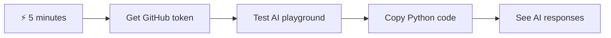

- **1分目**: [GitHub Models Playground](https://github.com/marketplace/models/azure-openai/gpt-4o-mini/playground)にアクセスして、個人用アクセストークンを作成
- **2分目**: PlaygroundインターフェースでAIとのやり取りを直接テスト
- **3分目**: 「Code」タブをクリックしてPythonスニペットをコピー
- **4分目**: トークンを使ってローカルでコードを実行: `GITHUB_TOKEN=your_token python test.py`
- **5分目**: 自分のコードから生成された最初のAI応答を確認

**クイックテストコード**:
```python
import os
from openai import OpenAI

client = OpenAI(
    base_url="https://models.github.ai/inference",
    api_key="your_token_here"
)

response = client.chat.completions.create(
    messages=[{"role": "user", "content": "Hello AI!"}],
    model="openai/gpt-4o-mini"
)

print(response.choices[0].message.content)
```

**なぜ重要なのか**: 5分でプログラムによるAIとのやり取りの魔法を体験できます。これが、あなたが使うすべてのAIアプリケーションを支える基本的な構成要素です。

完成したプロジェクトは以下のようになります:


## 🗺️ AIアプリケーション開発の学習の旅

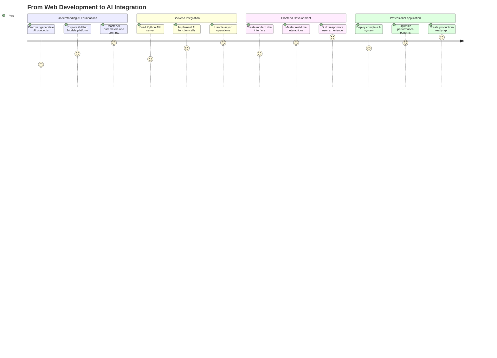

**学習の目的地**: このレッスンの終わりには、ChatGPT、Claude、Google Bardのような現代のAIアシスタントを支える技術とパターンを使用して、完全なAI搭載アプリケーションを構築できるようになります。

## AIの理解: 謎から習得へ

コードに取り掛かる前に、何を扱っているのかを理解しましょう。APIを使ったことがあるなら、基本的なパターンは知っているはずです: リクエストを送信し、レスポンスを受け取る。

AI APIも同様の構造を持っていますが、データベースから事前に保存されたデータを取得する代わりに、膨大なテキストから学習したパターンに基づいて新しい回答を生成します。これは、図書館のカタログシステムと、複数の情報源から情報を統合できる知識豊富な司書との違いのようなものです。

### 「生成AI」とは何か？

ロゼッタストーンが知られている言語と未知の言語の間のパターンを見つけることで学者がエジプトの象形文字を理解できるようになったように、AIモデルも同様に動作します。膨大なテキストの中でパターンを見つけ、言語がどのように機能するかを理解し、新しい質問に対して適切な回答を生成します。

**簡単な比較で説明します:**
- **従来のデータベース**: 出生証明書を求めるようなもの – 毎回同じ文書を取得
- **検索エンジン**: 図書館員に猫に関する本を探してもらうようなもの – 利用可能なものを見せてくれる
- **生成AI**: 知識豊富な友人に猫について尋ねるようなもの – あなたが知りたいことに合わせて独自の言葉で興味深いことを教えてくれる

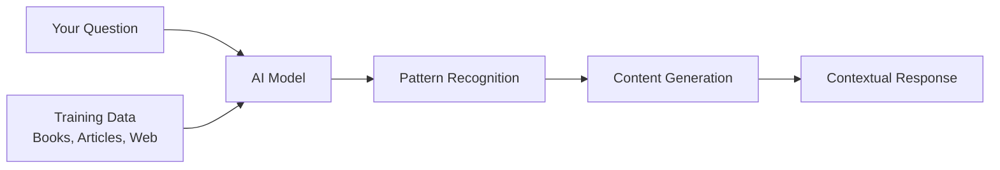

### AIモデルの学習方法 (簡単版)

AIモデルは、書籍、記事、会話を含む膨大なデータセットに触れることで学習します。このプロセスを通じて以下のパターンを特定します:
- 書かれたコミュニケーションで思考がどのように構成されているか
- どの単語が一緒に現れることが多いか
- 会話が通常どのように進行するか
- フォーマルなコミュニケーションとインフォーマルなコミュニケーションの文脈的な違い

**これは考古学者が古代の言語を解読する方法に似ています**: 文法、語彙、文化的文脈を理解するために何千もの例を分析し、学んだパターンを使って新しいテキストを解釈できるようになります。

### なぜGitHub Modelsなのか？

GitHub Modelsを使用する理由は非常に実用的です – 独自のAIインフラを設定する必要なく、エンタープライズレベルのAIにアクセスできるからです (今すぐそれをやりたいとは思わないでしょう！)。これは天気APIを使うのと同じようなもので、世界中に気象観測所を設置して自分で天気を予測する必要はありません。

基本的には「AI-as-a-Service」であり、最良の部分は無料で始められることです。実験しても高額な請求を心配する必要はありません。


GitHub Modelsをバックエンド統合に使用します。これにより、開発者に優しいインターフェースを通じてプロフェッショナルなAI機能にアクセスできます。[GitHub Models Playground](https://github.com/marketplace/models/azure-openai/gpt-4o-mini/playground)は、異なるAIモデルを試し、その能力を理解してコードに実装する前に実験できるテスト環境として機能します。

## 🧠 AIアプリケーション開発エコシステム

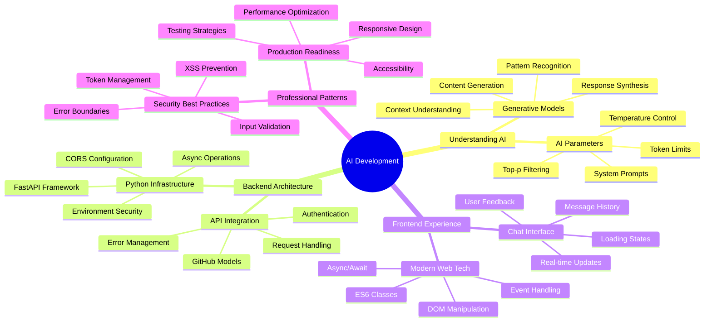

**基本原則**: AIアプリケーション開発は、従来のウェブ開発スキルとAIサービス統合を組み合わせ、自然で応答性の高いインテリジェントなアプリケーションを作成します。


**Playgroundが非常に便利な理由:**
- **試す**: GPT-4o-mini、Claudeなどの異なるAIモデルを無料で試せる
- **テスト**: コードを書く前にアイデアやプロンプトを試せる
- **取得**: 好きなプログラミング言語で使えるコードスニペットを取得
- **調整**: 創造性レベルや応答の長さなどの設定を変更して結果への影響を確認

少し試してみたら、「Code」タブをクリックしてプログラミング言語を選択し、必要な実装コードを取得するだけです。


## Pythonバックエンド統合のセットアップ

次にPythonを使用してAI統合を実装します。Pythonはそのシンプルな構文と強力なライブラリのため、AIアプリケーションに最適です。まず、GitHub Models Playgroundからコードを取得し、それをリファクタリングして再利用可能で本番環境対応の関数にします。

### 基本的な実装の理解

PlaygroundからPythonコードを取得すると、以下のようなものが得られます。最初は多く感じるかもしれませんが、部分ごとに説明していきます:

```python
"""Run this model in Python

> pip install openai
"""
import os
from openai import OpenAI

# To authenticate with the model you will need to generate a personal access token (PAT) in your GitHub settings. 
# Create your PAT token by following instructions here: https://docs.github.com/en/authentication/keeping-your-account-and-data-secure/managing-your-personal-access-tokens
client = OpenAI(
    base_url="https://models.github.ai/inference",
    api_key=os.environ["GITHUB_TOKEN"],
)

response = client.chat.completions.create(
    messages=[
        {
            "role": "system",
            "content": "",
        },
        {
            "role": "user",
            "content": "What is the capital of France?",
        }
    ],
    model="openai/gpt-4o-mini",
    temperature=1,
    max_tokens=4096,
    top_p=1
)

print(response.choices[0].message.content)
```

**このコードで何が行われているか:**
- **必要なツールをインポート**: 環境変数を読み取るための`os`とAIと通信するための`OpenAI`
- **OpenAIクライアントを設定**: OpenAIではなくGitHubのAIサーバーを指すように設定
- **認証**: 特別なGitHubトークンを使用して認証 (これについては後ほど詳しく説明します！)
- **会話を構成**: 異なる「役割」を設定 – 劇のシーンを設定するようなもの
- **リクエストを送信**: 微調整パラメータを使用してAIにリクエストを送信
- **応答テキストを抽出**: 戻ってきたすべてのデータから実際の応答テキストを抽出

### メッセージの役割の理解: AI会話フレームワーク

AI会話は、異なる「役割」を持つ特定の構造を使用します。それぞれが異なる目的を果たします:

```python
messages=[
    {
        "role": "system",
        "content": "You are a helpful assistant who explains things simply."
    },
    {
        "role": "user", 
        "content": "What is machine learning?"
    }
]
```

**劇を演出するようなもの:**
- **システム役割**: 俳優への舞台指示のようなもの – AIにどのように振る舞うか、どんな性格を持つか、どのように応答するかを指示
- **ユーザー役割**: アプリケーションを使用する人からの実際の質問やメッセージ
- **アシスタント役割**: AIの応答 (これを送信することはありませんが、会話履歴に表示されます)

**現実世界の例え**: パーティーで友人を誰かに紹介する場面を想像してください:
- **システムメッセージ**: 「こちらは私の友人サラです。彼女は医療概念を簡単に説明するのが得意な医師です」
- **ユーザーメッセージ**: 「ワクチンの仕組みを教えてもらえますか？」
- **アシスタント応答**: サラはフレンドリーな医師として応答し、弁護士やシェフのようには応答しません

### AIパラメータの理解: 応答の挙動を微調整

AI API呼び出しの数値パラメータは、モデルが応答を生成する方法を制御します。これらの設定により、異なる用途に合わせてAIの挙動を調整できます:

#### Temperature (0.0～2.0): 創造性のダイヤル

**何をするか**: AIの応答がどれだけ創造的または予測可能であるかを制御します。

**ジャズミュージシャンの即興レベルのように考えてください:**
- **Temperature = 0.1**: 毎回同じメロディを演奏 (非常に予測可能)
- **Temperature = 0.7**: 認識可能な範囲でいくつかの変化を加える (バランスの取れた創造性)
- **Temperature = 1.5**: 予測不可能な展開を伴う完全な実験的ジャズ (非常に予測不可能)

```python
# Very predictable responses (good for factual questions)
response = client.chat.completions.create(
    messages=[{"role": "user", "content": "What is 2+2?"}],
    temperature=0.1  # Will almost always say "4"
)

# Creative responses (good for brainstorming)
response = client.chat.completions.create(
    messages=[{"role": "user", "content": "Write a creative story opening"}],
    temperature=1.2  # Will generate unique, unexpected stories
)
```

#### Max Tokens (1～4096+): 応答の長さを制御

**何をするか**: AIの応答の長さに制限を設定します。

**トークンはおおよそ単語に相当します** (英語では約1トークン=0.75単語):
- **max_tokens=50**: 短く簡潔 (テキストメッセージのようなもの)
- **max_tokens=500**: 1～2段落程度
- **max_tokens=2000**: 例を含む詳細な説明

```python
# Short, concise answers
response = client.chat.completions.create(
    messages=[{"role": "user", "content": "Explain JavaScript"}],
    max_tokens=100  # Forces a brief explanation
)

# Detailed, comprehensive answers  
response = client.chat.completions.create(
    messages=[{"role": "user", "content": "Explain JavaScript"}],
    max_tokens=1500  # Allows for detailed explanations with examples
)
```

#### Top_p (0.0～1.0): 集中度パラメータ

**何をするか**: AIが最も可能性の高い応答にどれだけ集中するかを制御します。

**AIが膨大な語彙を持ち、それぞれの単語がどれだけ可能性が高いかでランク付けされている様子を想像してください:**
- **top_p=0.1**: 最も可能性の高い単語の上位10%のみを考慮 (非常に集中)
- **top_p=0.9**: 可能性のある単語の90%を考慮 (より創造的)
- **top_p=1.0**: すべてを考慮 (最大の多様性)

**例えば**: 「空は通常...」と尋ねた場合
- **低top_p**: ほぼ確実に「青」と答える
- **高top_p**: 「青」、「曇り」、「広大」、「変化」、「美しい」などと答える可能性がある

### すべてをまとめる: 異なる用途に合わせたパラメータの組み合わせ

```python
# For factual, consistent answers (like a documentation bot)
factual_params = {
    "temperature": 0.2,
    "max_tokens": 300,
    "top_p": 0.3
}

# For creative writing assistance
creative_params = {
    "temperature": 1.1,
    "max_tokens": 1000,
    "top_p": 0.9
}

# For conversational, helpful responses (balanced)
conversational_params = {
    "temperature": 0.7,
    "max_tokens": 500,
    "top_p": 0.8
}
```

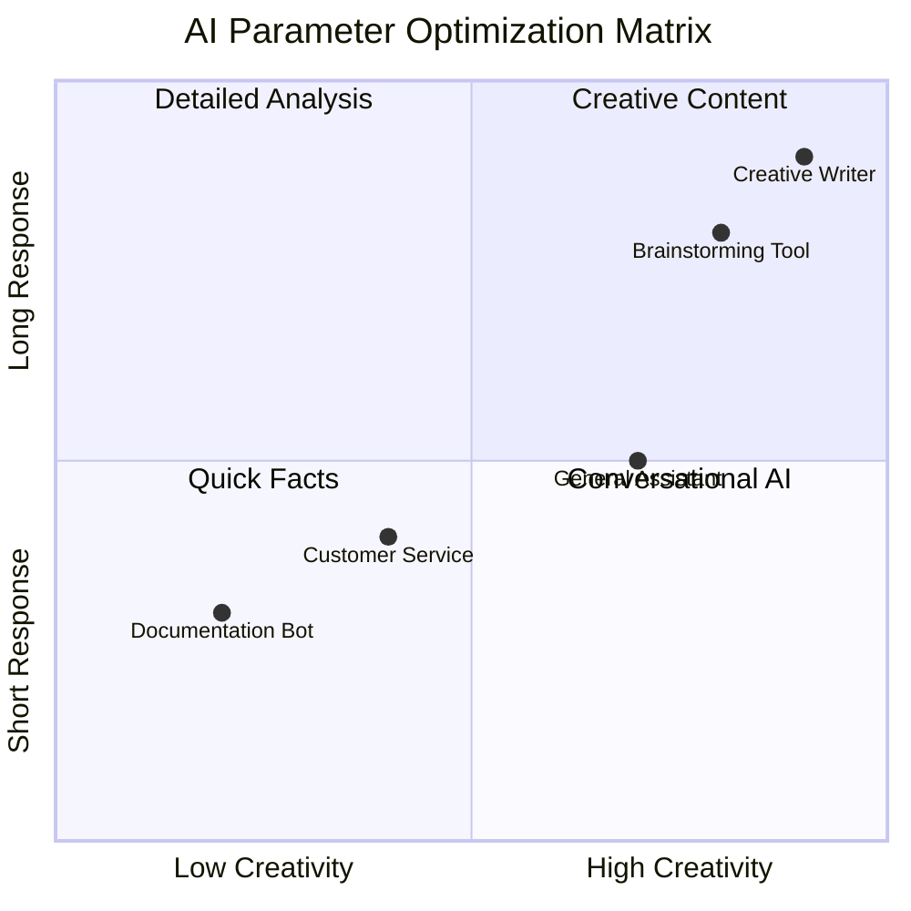

**これらのパラメータが重要な理由を理解する**: 異なるアプリケーションには異なるタイプの応答が必要です。カスタマーサービスボットは一貫性があり事実に基づくべき (低温度) ですが、創造的なライティングアシスタントは想像力豊かで多様であるべき (高温度) です。これらのパラメータを理解することで、AIの性格や応答スタイルを制御できます。
```

**Here's what's happening in this code:**
- **We import** the tools we need: `os` for reading environment variables and `OpenAI` for talking to the AI
- **We set up** the OpenAI client to point to GitHub's AI servers instead of OpenAI directly
- **We authenticate** using a special GitHub token (more on that in a minute!)
- **We structure** our conversation with different "roles" – think of it like setting the scene for a play
- **We send** our request to the AI with some fine-tuning parameters
- **We extract** the actual response text from all the data that comes back

> 🔐 **Security Note**: Never hardcode API keys in your source code! Always use environment variables to store sensitive credentials like your `GITHUB_TOKEN`.

### Creating a Reusable AI Function

Let's refactor this code into a clean, reusable function that we can easily integrate into our web application:

```python
import asyncio
from openai import AsyncOpenAI

# Use AsyncOpenAI for better performance
client = AsyncOpenAI(
    base_url="https://models.github.ai/inference",
    api_key=os.environ["GITHUB_TOKEN"],
)

async def call_llm_async(prompt: str, system_message: str = "You are a helpful assistant."):
    """
    Sends a prompt to the AI model asynchronously and returns the response.
    
    Args:
        prompt: The user's question or message
        system_message: Instructions that define the AI's behavior and personality
    
    Returns:
        str: The AI's response to the prompt
    """
    try:
        response = await client.chat.completions.create(
            messages=[
                {
                    "role": "system",
                    "content": system_message,
                },
                {
                    "role": "user",
                    "content": prompt,
                }
            ],
            model="openai/gpt-4o-mini",
            temperature=1,
            max_tokens=4096,
            top_p=1
        )
        return response.choices[0].message.content
    except Exception as e:
        logger.error(f"AI API error: {str(e)}")
        return "I'm sorry, I'm having trouble processing your request right now."

# Backward compatibility function for synchronous calls
def call_llm(prompt: str, system_message: str = "You are a helpful assistant."):
    """Synchronous wrapper for async AI calls."""
    return asyncio.run(call_llm_async(prompt, system_message))
```

**この改良された関数の理解:**
- **2つのパラメータを受け入れる**: ユーザーのプロンプトとオプションのシステムメッセージ
- **一般的なアシスタントの挙動に適したデフォルトのシステムメッセージを提供**
- **適切なPython型ヒントを使用してコードドキュメントを改善**
- **関数の目的とパラメータを説明する詳細なドックストリングを含む**
- **応答内容のみを返すため、ウェブAPIで簡単に使用可能**
- **一貫したAI挙動を維持するため、同じモデルパラメータを使用**

### システムプロンプトの魔法: AIの性格をプログラムする

パラメータがAIの思考方法を制御するなら、システムプロンプトはAIが自分自身をどう考えるかを制御します。これはAIを扱う上で最も面白い部分の一つです – AIに完全な性格、専門知識レベル、コミュニケーションスタイルを与えることができます。

**システムプロンプトは異なる役割に異なる俳優をキャスティングするようなもの**: 一般的なアシスタントではなく、特定の状況に合わせた専門家を作成できます。忍耐強い教師が必要ですか？創造的なブレインストーミングパートナー？厳格なビジネスアドバイザー？システムプロンプトを変更するだけです！

#### システムプロンプトが強力な理由

ここが面白い部分です: AIモデルは、人々が異なる役割や専門知識レベルを採用する無数の会話
**2. 出力フォーマット**: AIに応答の構造を指示する  
```python
system_prompt = """
You are a technical mentor. Always structure your responses as:
1. Quick Answer (1-2 sentences)
2. Detailed Explanation 
3. Code Example
4. Common Pitfalls to Avoid
5. Next Steps for Learning
"""
```
  
**3. 制約設定**: AIにしてほしくないことを定義する  
```python
system_prompt = """
You are a coding tutor focused on teaching best practices. Never write complete 
solutions for the user - instead, guide them with hints and questions so they 
learn by doing. Always explain the 'why' behind coding decisions.
"""
```
  

#### なぜこれがチャットアシスタントに重要なのか  

システムプロンプトを理解することで、専門的なAIアシスタントを作成する力を得ることができます:  
- **カスタマーサービスボット**: 親切で忍耐強く、ポリシーに精通  
- **学習チューター**: 励ましながら段階的に教え、理解を確認  
- **クリエイティブパートナー**: 想像力豊かでアイデアを広げ、「もしこうだったら？」と問いかける  
- **技術専門家**: 正確で詳細、セキュリティ意識が高い  

**重要な洞察**: 単にAI APIを呼び出すだけではなく、特定の用途に合わせたカスタムAIの人格を作り出しているのです。これが現代のAIアプリケーションを汎用的ではなく、個別化され有用に感じさせる理由です。  

### 🎯 教育的チェックイン: AIの人格プログラミング  

**一時停止して振り返る**: システムプロンプトを通じてAIの人格をプログラムする方法を学びました。これは現代のAIアプリケーション開発における基本的なスキルです。  

**自己評価クイズ**:  
- システムプロンプトが通常のユーザーメッセージとどう違うか説明できますか？  
- temperatureとtop_pパラメータの違いは何ですか？  
- 特定の用途（例えばコーディングチューター）のためのシステムプロンプトをどのように作成しますか？  

**現実世界との関連性**: あなたが学んだシステムプロンプト技術は、GitHub Copilotのコーディング支援からChatGPTの会話インターフェースまで、すべての主要なAIアプリケーションで使用されています。あなたは大手テクノロジー企業のAI製品チームが使用しているのと同じパターンを習得しています。  

**チャレンジ質問**: 初心者と専門家など、異なるユーザータイプに合わせて異なるAIの人格をどのように設計しますか？同じAIモデルがプロンプトエンジニアリングを通じて異なる対象に対応する方法を考えてみてください。  

## FastAPIでWeb APIを構築する: 高性能なAI通信ハブ  

次に、フロントエンドをAIサービスに接続するバックエンドを構築します。FastAPIを使用します。これはAIアプリケーション向けのAPI構築に優れた最新のPythonフレームワークです。  

FastAPIはこのプロジェクトにいくつかの利点を提供します: 非同期サポートによる同時リクエスト処理、APIドキュメントの自動生成、優れたパフォーマンスなどです。FastAPIサーバーはフロントエンドからのリクエストを受け取り、AIサービスと通信し、フォーマットされた応答を返す仲介役として機能します。  

### AIアプリケーションにFastAPIを選ぶ理由  

「フロントエンドのJavaScriptから直接AIを呼び出せないの？」や「FlaskやDjangoではなくFastAPIを選ぶ理由は？」と疑問に思うかもしれません。良い質問です！  

**FastAPIが最適な理由は以下の通りです:**  
- **デフォルトで非同期**: 複数のAIリクエストを同時に処理可能  
- **自動ドキュメント生成**: `/docs`にアクセスすると、美しいインタラクティブなAPIドキュメントページが無料で利用可能  
- **バリデーション内蔵**: 問題を引き起こす前にエラーをキャッチ  
- **非常に高速**: Pythonフレームワークの中でも最速の一つ  
- **最新のPython**: 最新のPython機能を活用  

**バックエンドが必要な理由:**  

**セキュリティ**: AI APIキーはパスワードのようなものです。フロントエンドのJavaScriptにキーを置くと、ウェブサイトのソースコードを閲覧する誰でもそれを盗んでAIクレジットを使用する可能性があります。バックエンドは機密情報を安全に保ちます。  

**リクエスト制限と管理**: バックエンドはユーザーがリクエストを送る頻度を制御し、ユーザー認証を実装し、使用状況を追跡するログを追加できます。  

**データ処理**: 会話を保存したり、不適切なコンテンツをフィルタリングしたり、複数のAIサービスを組み合わせたりすることができます。これらのロジックはバックエンドに存在します。  

**アーキテクチャはクライアントサーバーモデルに似ています:**  
- **フロントエンド**: ユーザーインターフェース層  
- **バックエンドAPI**: リクエスト処理とルーティング層  
- **AIサービス**: 外部計算と応答生成  
- **環境変数**: 安全な設定と資格情報の保存  

### リクエスト-レスポンスフローの理解  

ユーザーがメッセージを送信したときに何が起こるかを追跡してみましょう:  

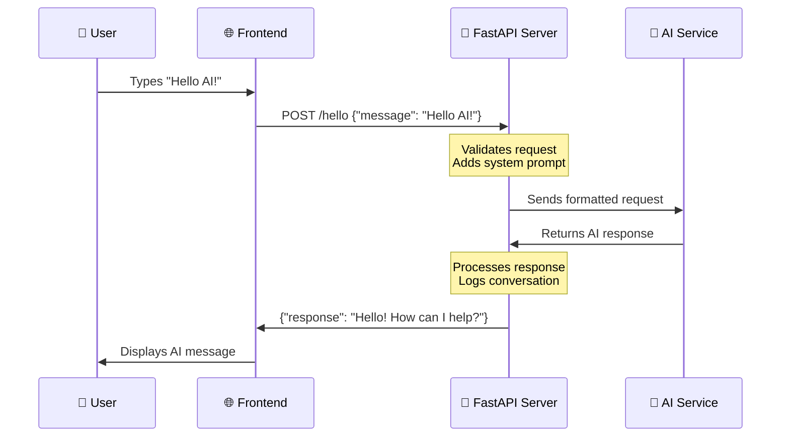
  
**各ステップの理解:**  
1. **ユーザーの操作**: チャットインターフェースに入力  
2. **フロントエンド処理**: JavaScriptが入力をキャプチャし、JSONとしてフォーマット  
3. **APIバリデーション**: FastAPIがPydanticモデルを使用してリクエストを自動的に検証  
4. **AI統合**: バックエンドがコンテキスト（システムプロンプト）を追加し、AIサービスを呼び出す  
5. **応答処理**: APIがAI応答を受け取り、必要に応じて修正  
6. **フロントエンド表示**: JavaScriptがチャットインターフェースに応答を表示  

### APIアーキテクチャの理解  

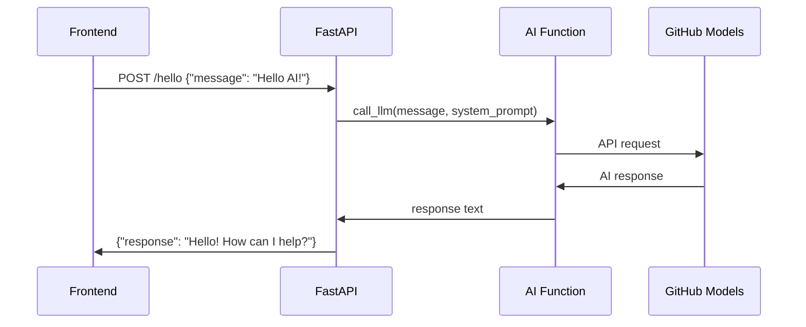
  
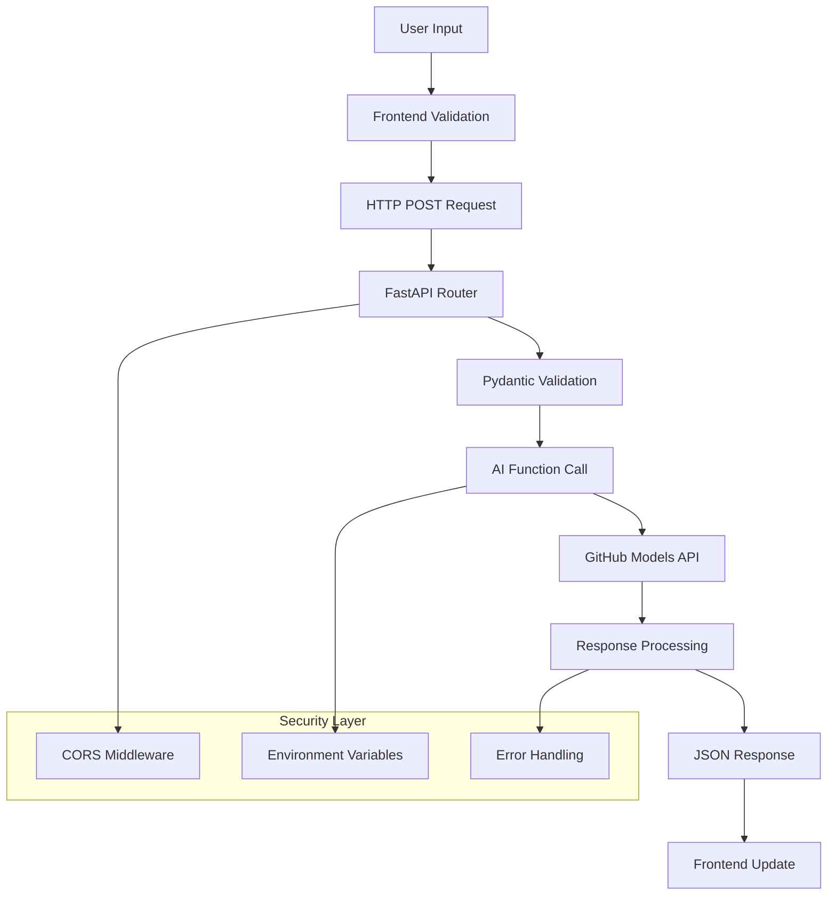
  

### FastAPIアプリケーションの作成  

次にAPIを段階的に構築します。`api.py`というファイルを作成し、以下のFastAPIコードを記述します:  

```python
# api.py
from fastapi import FastAPI, HTTPException
from fastapi.middleware.cors import CORSMiddleware
from pydantic import BaseModel
from llm import call_llm
import logging

# Configure logging
logging.basicConfig(level=logging.INFO)
logger = logging.getLogger(__name__)

# Create FastAPI application
app = FastAPI(
    title="AI Chat API",
    description="A high-performance API for AI-powered chat applications",
    version="1.0.0"
)

# Configure CORS
app.add_middleware(
    CORSMiddleware,
    allow_origins=["*"],  # Configure appropriately for production
    allow_credentials=True,
    allow_methods=["*"],
    allow_headers=["*"],
)

# Pydantic models for request/response validation
class ChatMessage(BaseModel):
    message: str

class ChatResponse(BaseModel):
    response: str

@app.get("/")
async def root():
    """Root endpoint providing API information."""
    return {
        "message": "Welcome to the AI Chat API",
        "docs": "/docs",
        "health": "/health"
    }

@app.get("/health")
async def health_check():
    """Health check endpoint."""
    return {"status": "healthy", "service": "ai-chat-api"}

@app.post("/hello", response_model=ChatResponse)
async def chat_endpoint(chat_message: ChatMessage):
    """Main chat endpoint that processes messages and returns AI responses."""
    try:
        # Extract and validate message
        message = chat_message.message.strip()
        if not message:
            raise HTTPException(status_code=400, detail="Message cannot be empty")
        
        logger.info(f"Processing message: {message[:50]}...")
        
        # Call AI service (note: call_llm should be made async for better performance)
        ai_response = await call_llm_async(message, "You are a helpful and friendly assistant.")
        
        logger.info("AI response generated successfully")
        return ChatResponse(response=ai_response)
        
    except HTTPException:
        raise
    except Exception as e:
        logger.error(f"Error processing chat message: {str(e)}")
        raise HTTPException(status_code=500, detail="Internal server error")

if __name__ == "__main__":
    import uvicorn
    uvicorn.run(app, host="0.0.0.0", port=5000, reload=True)
```
  
**FastAPI実装の理解:**  
- **インポート**: FastAPIの最新のウェブフレームワーク機能とPydanticのデータ検証を使用  
- **自動APIドキュメント生成**: サーバー実行時に`/docs`で利用可能  
- **CORSミドルウェアの有効化**: 異なるオリジンからのフロントエンドリクエストを許可  
- **Pydanticモデルの定義**: 自動リクエスト/レスポンス検証とドキュメント化  
- **非同期エンドポイントの使用**: 同時リクエストでのパフォーマンス向上  
- **適切なHTTPステータスコードとエラー処理の実装**: HTTPExceptionを使用  
- **構造化されたログの追加**: 監視とデバッグのため  
- **ヘルスチェックエンドポイントの提供**: サービス状態の監視  

**FastAPIが従来のフレームワークより優れている点:**  
- **自動バリデーション**: Pydanticモデルが処理前にデータの整合性を保証  
- **インタラクティブなドキュメント**: `/docs`で自動生成され、テスト可能なAPIドキュメントを提供  
- **型安全性**: Pythonの型ヒントがランタイムエラーを防ぎ、コード品質を向上  
- **非同期サポート**: 複数のAIリクエストを同時に処理可能  
- **パフォーマンス**: リアルタイムアプリケーション向けに非常に高速なリクエスト処理  

### CORSの理解: ウェブのセキュリティガード  

CORS（クロスオリジンリソース共有）は、建物のセキュリティガードのようなもので、訪問者が入場を許可されているかどうかを確認します。この重要性とアプリケーションへの影響を理解しましょう。  

#### CORSとは何か、なぜ存在するのか  

**問題**: もしどのウェブサイトでも許可なく銀行のウェブサイトにリクエストを送れるとしたら、それはセキュリティの悪夢です！ブラウザはデフォルトで「同一オリジンポリシー」を通じてこれを防ぎます。  

**同一オリジンポリシー**: ブラウザは、読み込まれたドメイン、ポート、プロトコルと同じオリジンからのリクエストのみを許可します。  

**現実世界の例え**: アパートのセキュリティのようなもので、居住者（同一オリジン）のみがデフォルトで建物にアクセスできます。友人（異なるオリジン）を訪問させたい場合は、セキュリティに明示的に許可を伝える必要があります。  

#### 開発環境でのCORS  

開発中、フロントエンドとバックエンドは異なるポートで動作します:  
- フロントエンド: `http://localhost:3000`（またはHTMLを直接開く場合はfile://）  
- バックエンド: `http://localhost:5000`  

これらは同じコンピュータ上にあっても「異なるオリジン」と見なされます！  

```python
from fastapi.middleware.cors import CORSMiddleware

app = FastAPI(__name__)
CORS(app)   # This tells browsers: "It's okay for other origins to make requests to this API"
```
  
**CORS設定が実際に行うこと:**  
- **特別なHTTPヘッダーを追加**: APIレスポンスに「このクロスオリジンリクエストは許可されている」とブラウザに伝える  
- **「プリフライト」リクエストを処理**: ブラウザが実際のリクエストを送る前に許可を確認する場合がある  
- **ブラウザコンソールでの「CORSポリシーによるブロック」エラーを防止**  

#### CORSセキュリティ: 開発と本番環境の違い  

```python
# 🚨 Development: Allows ALL origins (convenient but insecure)
CORS(app)

# ✅ Production: Only allow your specific frontend domain
CORS(app, origins=["https://yourdomain.com", "https://www.yourdomain.com"])

# 🔒 Advanced: Different origins for different environments
if app.debug:  # Development mode
    CORS(app, origins=["http://localhost:3000", "http://127.0.0.1:3000"])
else:  # Production mode
    CORS(app, origins=["https://yourdomain.com"])
```
  
**重要性**: 開発中の`CORS(app)`は玄関の鍵を開けっぱなしにするようなもので、便利ですが安全ではありません。本番環境では、APIと通信できるウェブサイトを正確に指定する必要があります。  

#### 一般的なCORSシナリオと解決策  

| シナリオ | 問題 | 解決策 |  
|----------|---------|----------|  
| **ローカル開発** | フロントエンドがバックエンドに到達できない | FastAPIにCORSMiddlewareを追加 |  
| **GitHub Pages + Heroku** | デプロイされたフロントエンドがAPIに到達できない | GitHub PagesのURLをCORSオリジンに追加 |  
| **カスタムドメイン** | 本番環境でCORSエラー | CORSオリジンをドメインに合わせて更新 |  
| **モバイルアプリ** | アプリがウェブAPIに到達できない | アプリのドメインを追加するか、慎重に`*`を使用 |  

**プロのヒント**: ブラウザの開発者ツールのネットワークタブでCORSヘッダーを確認できます。レスポンス内の`Access-Control-Allow-Origin`のようなヘッダーを探してください。  

### エラーハンドリングとバリデーション  

APIが適切なエラーハンドリングを含んでいることに注目してください:  

```python
# Validate that we received a message
if not message:
    return jsonify({"error": "Message field is required"}), 400
```
  
**主要なバリデーション原則:**  
- **必須フィールドをチェック**: リクエストを処理する前に  
- **意味のあるエラーメッセージをJSON形式で返す**  
- **適切なHTTPステータスコードを使用**: 不正なリクエストには400  
- **フロントエンド開発者が問題をデバッグしやすいように明確なフィードバックを提供**  

## バックエンドのセットアップと実行  

AI統合とFastAPIサーバーが準備できたので、すべてを実行しましょう。セットアッププロセスにはPython依存関係のインストール、環境変数の設定、開発サーバーの起動が含まれます。  

### Python環境のセットアップ  

Python開発環境をセットアップしましょう。仮想環境はマンハッタン計画の区分化アプローチのようなもので、各プロジェクトが特定のツールと依存関係を持つ独立した空間を得ることで、異なるプロジェクト間の競合を防ぎます。  

```bash
# Navigate to your backend directory
cd backend

# Create a virtual environment (like creating a clean room for your project)
python -m venv venv

# Activate it (Linux/Mac)
source ./venv/bin/activate

# On Windows, use:
# venv\Scripts\activate

# Install the good stuff
pip install openai fastapi uvicorn python-dotenv
```
  
**今行ったこと:**  
- **独自のPythonバブルを作成**: パッケージをインストールしても他のものに影響を与えない  
- **アクティベート**: ターミナルがこの特定の環境を使用するように  
- **必須パッケージをインストール**: OpenAI（AIマジック用）、FastAPI（ウェブAPI用）、Uvicorn（実行用）、python-dotenv（安全な秘密管理用）  

**主要な依存関係の説明:**  
- **FastAPI**: 最新の高速ウェブフレームワークで自動APIドキュメント付き  
- **Uvicorn**: FastAPIアプリケーションを実行する超高速ASGIサーバー  
- **OpenAI**: GitHubモデルとOpenAI API統合用公式ライブラリ  
- **python-dotenv**: `.env`ファイルから安全に環境変数を読み込む  

### 環境設定: 秘密を安全に保つ  

APIを開始する前に、ウェブ開発で最も重要な教訓の一つについて話しましょう: 秘密を本当に秘密に保つ方法。環境変数はアプリケーションだけがアクセスできる安全な金庫のようなものです。  

#### 環境変数とは何か  

**環境変数は安全な貸金庫のようなもの**です。貴重品をそこに入れ、鍵を持っているのは自分（とアプリ）だけです。コードに直接機密情報を書き込む（誰でも見られる）代わりに、それを安全に環境に保存します。  

**違いは以下の通り:**  
- **間違った方法**: パスワードを付箋に書いてモニターに貼る  
- **正しい方法**: パスワードを自分だけがアクセスできる安全なパスワードマネージャーに保管する  

#### 環境変数が重要な理由  

```python
# 🚨 NEVER DO THIS - API key visible to everyone
client = OpenAI(
    api_key="ghp_1234567890abcdef...",  # Anyone can steal this!
    base_url="https://models.github.ai/inference"
)

# ✅ DO THIS - API key stored securely
client = OpenAI(
    api_key=os.environ["GITHUB_TOKEN"],  # Only your app can access this
    base_url="https://models.github.ai/inference"
)
```
  
**秘密をハードコードすると何が起こるか:**  
1. **バージョン管理の露出**: Gitリポジトリにアクセスできる人はAPIキーを見られる  
2. **公開リポジトリ**: GitHubにプッシュすると、キーがインターネット全体に公開される  
3. **チーム共有**: プロジェクトに取り組む他の開発者が個人のAPIキーにアクセスできる  
4. **セキュリティ侵害**: APIキーが盗まれると、AIクレジットを使用される可能性がある  

#### 環境ファイルの設定  

バックエンドディレクトリに`.env`ファイルを作成します。このファイルは秘密をローカルに保存します:  

```bash
# .env file - This should NEVER be committed to Git
GITHUB_TOKEN=your_github_personal_access_token_here
FASTAPI_DEBUG=True
ENVIRONMENT=development
```
  
**.envファイルの理解:**  
- **1行に1つの秘密**: `KEY=value`形式  
- **イコール記号の周りにスペースなし**  
- **通常は値に引用符不要**  
- **コメント**は`#`で始まる  

#### GitHub個人アクセストークンの作成  

GitHubトークンは、アプリケーションにGitHubのAIサービスを使用する許可を与える特別なパスワードのようなものです:  

**トークン作成の手順:**  
1. **GitHub設定に移動** → Developer settings → Personal access tokens → Tokens (classic)  
2. **「Generate new token (classic)」をクリック**  
3. **有効期限を設定**（テスト用に30日、運用用に長
いよいよワクワクする瞬間がやってきました！FastAPI開発サーバーを起動して、AI統合が動き出す様子を確認しましょう。FastAPIはUvicornを使用します。Uvicornは、非同期Pythonアプリケーション向けに特別に設計された超高速ASGIサーバーです。

#### FastAPIサーバーの起動プロセスを理解する

```bash
# Method 1: Direct Python execution (includes auto-reload)
python api.py

# Method 2: Using Uvicorn directly (more control)
uvicorn api:app --host 0.0.0.0 --port 5000 --reload
```

このコマンドを実行すると、以下のような処理が裏で行われます：

**1. PythonがFastAPIアプリケーションをロードする**:
- 必要なライブラリ（FastAPI、Pydantic、OpenAIなど）をインポート
- `.env`ファイルから環境変数をロード
- 自動ドキュメント機能付きのFastAPIアプリケーションインスタンスを作成

**2. UvicornがASGIサーバーを設定する**:
- 非同期リクエスト処理機能を備えたポート5000にバインド
- 自動バリデーション付きのリクエストルーティングを設定
- 開発用のホットリロードを有効化（ファイル変更時に再起動）
- インタラクティブなAPIドキュメントを生成

**3. サーバーがリスニングを開始**:
- ターミナルに次のメッセージが表示されます：`INFO: Uvicorn running on http://0.0.0.0:5000`
- サーバーは複数のAIリクエストを同時に処理可能
- APIは自動ドキュメント付きで`http://localhost:5000/docs`で利用可能

#### すべてが正常に動作した場合に見るべきもの

```bash
$ python api.py
INFO:     Will watch for changes in these directories: ['/your/project/path']
INFO:     Uvicorn running on http://0.0.0.0:5000 (Press CTRL+C to quit)
INFO:     Started reloader process [12345] using WatchFiles
INFO:     Started server process [12346]
INFO:     Waiting for application startup.
INFO:     Application startup complete.
```

**FastAPIの出力を理解する**:
- **Will watch for changes**: 開発用の自動リロードが有効
- **Uvicorn running**: 高性能ASGIサーバーが稼働中
- **Started reloader process**: ファイル変更時の自動再起動を監視
- **Application startup complete**: FastAPIアプリが正常に初期化
- **Interactive docs available**: `/docs`で自動生成されたAPIドキュメントを確認可能

#### FastAPIのテスト方法：強力なアプローチ

FastAPIは、APIをテストするための便利な方法をいくつか提供しています。自動インタラクティブドキュメントもその一つです。

**方法1: インタラクティブAPIドキュメント（推奨）**
1. ブラウザを開き、`http://localhost:5000/docs`にアクセス
2. Swagger UIで全てのエンドポイントがドキュメント化されているのを確認
3. `/hello`をクリック → 「Try it out」 → テストメッセージを入力 → 「Execute」
4. ブラウザで適切にフォーマットされたレスポンスを直接確認

**方法2: 基本的なブラウザテスト**
1. ルートエンドポイントにアクセス：`http://localhost:5000`
2. サーバーの状態を確認：`http://localhost:5000/health`
3. FastAPIサーバーが正常に動作していることを確認

**方法3: コマンドラインテスト（上級者向け）**
```bash
# Test with curl (if available)
curl -X POST http://localhost:5000/hello \
  -H "Content-Type: application/json" \
  -d '{"message": "Hello AI!"}'

# Expected response:
# {"response": "Hello! I'm your AI assistant. How can I help you today?"}
```

**方法4: Pythonテストスクリプト**
```python
# test_api.py - Create this file to test your API
import requests
import json

# Test the API endpoint
url = "http://localhost:5000/hello"
data = {"message": "Tell me a joke about programming"}

response = requests.post(url, json=data)
if response.status_code == 200:
    result = response.json()
    print("AI Response:", result['response'])
else:
    print("Error:", response.status_code, response.text)
```

#### よくある起動時の問題のトラブルシューティング

| エラーメッセージ | 意味 | 修正方法 |
|------------------|------|----------|
| `ModuleNotFoundError: No module named 'fastapi'` | FastAPIがインストールされていない | 仮想環境で`pip install fastapi uvicorn`を実行 |
| `ModuleNotFoundError: No module named 'uvicorn'` | ASGIサーバーがインストールされていない | 仮想環境で`pip install uvicorn`を実行 |
| `KeyError: 'GITHUB_TOKEN'` | 環境変数が見つからない | `.env`ファイルと`load_dotenv()`の呼び出しを確認 |
| `Address already in use` | ポート5000が使用中 | ポート5000を使用している他のプロセスを終了するか、ポートを変更 |
| `ValidationError` | リクエストデータがPydanticモデルと一致しない | リクエスト形式が期待されるスキーマと一致しているか確認 |
| `HTTPException 422` | 処理不能なエンティティ | リクエストのバリデーションが失敗、正しい形式を`/docs`で確認 |
| `OpenAI API error` | AIサービスの認証失敗 | GitHubトークンが正しいか、適切な権限があるか確認 |

#### 開発のベストプラクティス

**ホットリロード**: FastAPIとUvicornは、Pythonファイルを保存すると自動的にリロードされます。これにより、コードを変更してすぐにテストでき、手動で再起動する必要がありません。

```python
# Enable hot reloading explicitly
if __name__ == "__main__":
    app.run(host="0.0.0.0", port=5000, debug=True)  # debug=True enables hot reload
```

**開発用のログ記録**: ログを追加して、何が起きているかを把握する：

```python
import logging

# Set up logging
logging.basicConfig(level=logging.INFO)
logger = logging.getLogger(__name__)

@app.route("/hello", methods=["POST"])
def hello():
    data = request.get_json()
    message = data.get("message", "")
    
    logger.info(f"Received message: {message}")
    
    if not message:
        logger.warning("Empty message received")
        return jsonify({"error": "Message field is required"}), 400
    
    try:
        response = call_llm(message, "You are a helpful and friendly assistant.")
        logger.info(f"AI response generated successfully")
        return jsonify({"response": response})
    except Exception as e:
        logger.error(f"AI API error: {str(e)}")
        return jsonify({"error": "AI service temporarily unavailable"}), 500
```

**ログが役立つ理由**: 開発中に、どのリクエストが来ているか、AIが何を返しているか、エラーがどこで発生しているかを正確に把握できます。これにより、デバッグが非常に迅速になります。

### GitHub Codespacesの設定：クラウド開発を簡単に

GitHub Codespacesは、ブラウザからアクセスできる強力な開発コンピュータのようなものです。Codespacesで作業する場合、バックエンドをフロントエンドに適切に接続するためにいくつかの追加手順が必要です。

#### Codespacesネットワーキングを理解する

ローカル開発環境では、すべてが同じコンピュータ上で動作します：
- バックエンド：`http://localhost:5000`
- フロントエンド：`http://localhost:3000`（またはfile://）

Codespacesでは、開発環境がGitHubのサーバー上で動作するため、「localhost」の意味が異なります。GitHubはサービス用の公開URLを自動的に作成しますが、それを適切に設定する必要があります。

#### Codespaces設定の手順

**1. バックエンドサーバーを起動**:
```bash
cd backend
python api.py
```

おなじみのFastAPI/Uvicornの起動メッセージが表示されますが、Codespace環境内で動作していることに注意してください。

**2. ポートの可視性を設定**:
- VS Codeの下部パネルにある「Ports」タブを探します
- リスト内のポート5000を見つけます
- ポート5000を右クリック
- 「Port Visibility」→「Public」を選択

**なぜ公開する必要があるのか？** デフォルトでは、Codespaceのポートはプライベート（自分だけがアクセス可能）です。公開することで、ブラウザで動作するフロントエンドがバックエンドと通信できるようになります。

**3. 公開URLを取得**:
ポートを公開した後、次のようなURLが表示されます：
```
https://your-codespace-name-5000.app.github.dev
```

**4. フロントエンドの設定を更新**:
```javascript
// In your frontend app.js, update the BASE_URL:
this.BASE_URL = "https://your-codespace-name-5000.app.github.dev";
```

#### Codespace URLを理解する

Codespace URLは予測可能なパターンに従います：
```
https://[codespace-name]-[port].app.github.dev
```

**これを分解すると**:
- `codespace-name`: Codespaceの一意の識別子（通常、ユーザー名を含む）
- `port`: サービスが動作しているポート番号（FastAPIアプリの場合は5000）
- `app.github.dev`: Codespaceアプリケーション用のGitHubドメイン

#### Codespaceセットアップのテスト

**1. バックエンドを直接テスト**:
公開URLを新しいブラウザタブで開きます。次のような画面が表示されるはずです：
```
Welcome to the AI Chat API. Send POST requests to /hello with JSON payload containing 'message' field.
```

**2. ブラウザの開発者ツールでテスト**:
```javascript
// Open browser console and test your API
fetch('https://your-codespace-name-5000.app.github.dev/hello', {
  method: 'POST',
  headers: {'Content-Type': 'application/json'},
  body: JSON.stringify({message: 'Hello from Codespaces!'})
})
.then(response => response.json())
.then(data => console.log(data));
```

#### Codespacesとローカル開発の比較

| 項目 | ローカル開発 | GitHub Codespaces |
|------|-------------|-------------------|
| **セットアップ時間** | 長い（Pythonや依存関係のインストール） | 即時（事前設定済み環境） |
| **URLアクセス** | `http://localhost:5000` | `https://xyz-5000.app.github.dev` |
| **ポート設定** | 自動 | 手動（ポートを公開する必要あり） |
| **ファイルの永続性** | ローカルマシン | GitHubリポジトリ |
| **コラボレーション** | 環境の共有が困難 | Codespaceリンクの共有が簡単 |
| **インターネット依存** | AI API呼び出しのみ | すべてに必要 |

#### Codespace開発のヒント

**Codespacesでの環境変数**:
Codespacesでは`.env`ファイルは同じように機能しますが、環境変数を直接Codespace内で設定することもできます：

```bash
# Set environment variable for the current session
export GITHUB_TOKEN="your_token_here"

# Or add to your .bashrc for persistence
echo 'export GITHUB_TOKEN="your_token_here"' >> ~/.bashrc
```

**ポート管理**:
- Codespacesはアプリケーションがポートでリスニングを開始すると自動的に検出します
- 複数のポートを同時に転送可能（後でデータベースを追加する場合に便利）
- Codespaceが稼働している限りポートはアクセス可能

**開発ワークフロー**:
1. VS Codeでコードを変更
2. FastAPIが自動リロード（Uvicornのリロードモードのおかげ）
3. 公開URLを通じて変更をすぐにテスト
4. 準備が整ったらコミットしてプッシュ

> 💡 **プロのヒント**: 開発中にCodespaceバックエンドURLをブックマークしておきましょう。Codespace名が安定しているため、同じCodespaceを使用している限りURLは変更されません。

## フロントエンドチャットインターフェースの作成：人間とAIの出会い

次に、ユーザーインターフェースを構築します。これは、人々がAIアシスタントとどのようにやり取りするかを決定する部分です。オリジナルのiPhoneインターフェースのデザインのように、複雑な技術を直感的で自然に使えるようにすることに焦点を当てます。

### モダンなフロントエンドアーキテクチャを理解する

私たちのチャットインターフェースは「シングルページアプリケーション（SPA）」と呼ばれるものになります。古い方法では、クリックするたびに新しいページが読み込まれますが、私たちのアプリはスムーズかつ瞬時に更新されます：

**古いウェブサイト**: 紙の本を読むようなもの – 完全に新しいページにめくる
**私たちのチャットアプリ**: スマホを使うようなもの – すべてが流れるように更新される

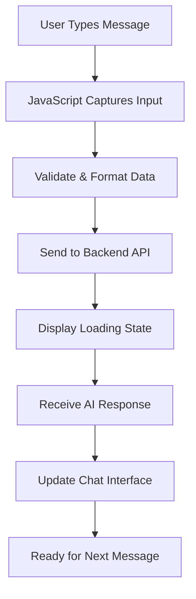

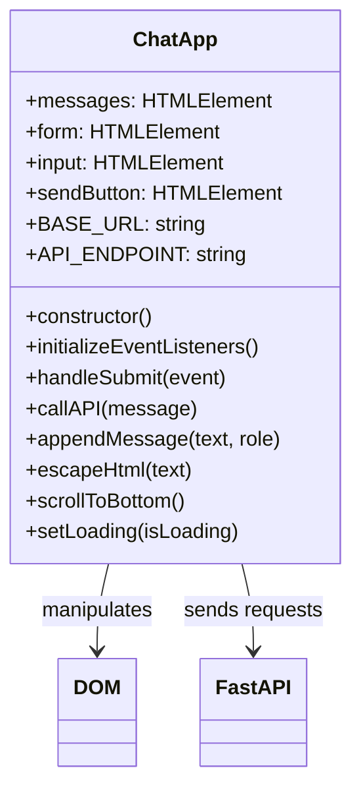

### フロントエンド開発の3つの柱

すべてのフロントエンドアプリケーション（シンプルなウェブサイトからDiscordやSlackのような複雑なアプリまで）は、3つのコア技術に基づいて構築されています。これらは、ウェブ上で見たり操作したりするすべての基盤です：

**HTML（構造）**: これが基盤です
- 存在する要素を決定（ボタン、テキストエリア、コンテナなど）
- コンテンツに意味を与える（これはヘッダー、これはフォームなど）
- すべてが構築される基本構造を作成

**CSS（見た目）**: これがインテリアデザイナーです
- すべてを美しくする（色、フォント、レイアウト）
- 異なる画面サイズに対応（スマホ、ラップトップ、タブレット）
- スムーズなアニメーションや視覚的フィードバックを作成

**JavaScript（動作）**: これが頭脳です
- ユーザーの操作に応答（クリック、入力、スクロール）
- バックエンドと通信してページを更新
- すべてをインタラクティブで動的にする

**建築設計のように考える**:
- **HTML**: 構造設計図（空間と関係を定義）
- **CSS**: 美的および環境デザイン（視覚スタイルとユーザー体験）
- **JavaScript**: 機械システム（機能性とインタラクティブ性）

### モダンなJavaScriptアーキテクチャが重要な理由

私たちのチャットアプリケーションは、プロフェッショナルなアプリケーションで見られるモダンなJavaScriptパターンを使用します。これらの概念を理解することで、開発者として成長するのに役立ちます：

**クラスベースのアーキテクチャ**: コードをクラスに整理します。これはオブジェクトの設計図を作成するようなものです
**Async/Await**: 時間がかかる操作（API呼び出しなど）を処理するモダンな方法
**イベント駆動型プログラミング**: アプリはループ内で動作するのではなく、ユーザーの操作（クリック、キー入力）に応答します
**DOM操作**: ユーザーの操作やAPIレスポンスに基づいてウェブページのコンテンツを動的に更新

### プロジェクト構造のセットアップ

以下のように整理された構造でフロントエンドディレクトリを作成します：

```text
frontend/
├── index.html      # Main HTML structure
├── app.js          # JavaScript functionality
└── styles.css      # Visual styling
```

**アーキテクチャの理解**:
- **構造（HTML）**、**動作（JavaScript）**、**見た目（CSS）**の間で関心を分離
- **簡単にナビゲートおよび変更可能**なシンプルなファイル構造を維持
- **ウェブ開発のベストプラクティス**に従った組織化と保守性

### HTMLの基盤を構築する：アクセシビリティのためのセマンティック構造

まずHTML構造から始めましょう。モダンなウェブ開発では「セマンティックHTML」が重視されます。これは、目的を明確に説明するHTML要素を使用することで、見た目だけでなく意味を持たせることを指します。これにより、アプリケーションがスクリーンリーダー、検索エンジン、その他のツールに対応可能になります。

**セマンティックHTMLが重要な理由**: チャットアプリを電話で誰かに説明すると想像してください。「タイトルがあるヘッダー、会話が表示されるメインエリア、メッセージを入力するためのフォームが下部にある」と言うでしょう。セマンティックHTMLは、この自然な説明に一致する要素を使用します。

`index.html`を作成し、以下のように構造化されたマークアップを記述します：

```html
<!DOCTYPE html>
<html lang="en">
<head>
    <meta charset="UTF-8">
    <meta name="viewport" content="width=device-width, initial-scale=1.0">
    <title>AI Chat Assistant</title>
    <link rel="stylesheet" href="styles.css">
</head>
<body>
    <div class="chat-container">
        <header class="chat-header">
            <h1>AI Chat Assistant</h1>
            <p>Ask me anything!</p>
        </header>
        
        <main class="chat-messages" id="messages" role="log" aria-live="polite">
            <!-- Messages will be dynamically added here -->
        </main>
        
        <form class="chat-form" id="chatForm">
            <div class="input-group">
                <input 
                    type="text" 
                    id="messageInput" 
                    placeholder="Type your message here..." 
                    required
                    aria-label="Chat message input"
                >
                <button type="submit" id="sendBtn" aria-label="Send message">
                    Send
                </button>
            </div>
        </form>
    </div>
    <script src="app.js"></script>
</body>
</html>
```

**各HTML要素とその目的を理解する**:

#### ドキュメント構造
- **`<!DOCTYPE html>`**: ブラウザにこれが最新のHTML5であることを伝える
- **`<html lang="en">`**: ページの言語をスクリーンリーダーや翻訳ツールに指定
- **`<meta charset="UTF-8">`**: 国際的なテキストのための適切な文字エンコーディングを保証
- **`<meta name="viewport"...>`**: ページをモバイル対応にし、ズームやスケールを制御

#### セマンティック要素
- **`<header>`**: タイトルと説明があるトップセクションを明確に識別
- **`<main>`**: 主なコンテンツエリア（会話が表示される場所）を指定
- **`<form>`**: ユーザー入力に適したセマンティックな選択肢で、適切なキーボードナビゲーションを可能に

#### アクセシビリティ機能
- **`role="log"`**: このエリアがメッセージの時系列ログを含むことをスクリーンリーダーに伝える
- **`aria-live="polite"`**: 新しいメッセージをスクリーンリーダーに中断せずに通知
- **`aria-label`**: フォームコントロールの説明的なラベルを提供
では、チャットインターフェースを動かすJavaScriptを構築していきましょう。プロフェッショナルなウェブ開発でよく使われるモダンなJavaScriptパターンを使用します。これには、ES6クラス、async/await、イベント駆動型プログラミングが含まれます。

#### モダンなJavaScriptアーキテクチャの理解

手続き型コード（順番に実行される一連の関数）を書く代わりに、**クラスベースのアーキテクチャ**を作成します。クラスはオブジェクトを作成するための設計図のようなものです。建築家の設計図が複数の家を建てるために使われるのと同じように。

**ウェブアプリケーションでクラスを使用する理由**
- **整理整頓**: 関連する機能がすべて一箇所にまとまる
- **再利用性**: 同じページ上で複数のチャットインスタンスを作成可能
- **保守性**: 特定の機能をデバッグしたり修正したりするのが簡単
- **プロフェッショナルな標準**: React、Vue、Angularなどのフレームワークで使用されるパターン

以下のようなモダンで構造化されたJavaScriptを使って`app.js`を作成します:

```javascript
// app.js - Modern chat application logic

class ChatApp {
    constructor() {
        // Get references to DOM elements we'll need to manipulate
        this.messages = document.getElementById("messages");
        this.form = document.getElementById("chatForm");
        this.input = document.getElementById("messageInput");
        this.sendButton = document.getElementById("sendBtn");
        
        // Configure your backend URL here
        this.BASE_URL = "http://localhost:5000"; // Update this for your environment
        this.API_ENDPOINT = `${this.BASE_URL}/hello`;
        
        // Set up event listeners when the chat app is created
        this.initializeEventListeners();
    }
    
    initializeEventListeners() {
        // Listen for form submission (when user clicks Send or presses Enter)
        this.form.addEventListener("submit", (e) => this.handleSubmit(e));
        
        // Also listen for Enter key in the input field (better UX)
        this.input.addEventListener("keypress", (e) => {
            if (e.key === "Enter" && !e.shiftKey) {
                e.preventDefault();
                this.handleSubmit(e);
            }
        });
    }
    
    async handleSubmit(event) {
        event.preventDefault(); // Prevent form from refreshing the page
        
        const messageText = this.input.value.trim();
        if (!messageText) return; // Don't send empty messages
        
        // Provide user feedback that something is happening
        this.setLoading(true);
        
        // Add user message to chat immediately (optimistic UI)
        this.appendMessage(messageText, "user");
        
        // Clear input field so user can type next message
        this.input.value = '';
        
        try {
            // Call the AI API and wait for response
            const reply = await this.callAPI(messageText);
            
            // Add AI response to chat
            this.appendMessage(reply, "assistant");
        } catch (error) {
            console.error('API Error:', error);
            this.appendMessage("Sorry, I'm having trouble connecting right now. Please try again.", "error");
        } finally {
            // Re-enable the interface regardless of success or failure
            this.setLoading(false);
        }
    }
    
    async callAPI(message) {
        const response = await fetch(this.API_ENDPOINT, {
            method: "POST",
            headers: { 
                "Content-Type": "application/json" 
            },
            body: JSON.stringify({ message })
        });
        
        if (!response.ok) {
            throw new Error(`HTTP error! status: ${response.status}`);
        }
        
        const data = await response.json();
        return data.response;
    }
    
    appendMessage(text, role) {
        const messageElement = document.createElement("div");
        messageElement.className = `message ${role}`;
        messageElement.innerHTML = `
            <div class="message-content">
                <span class="message-text">${this.escapeHtml(text)}</span>
                <span class="message-time">${new Date().toLocaleTimeString()}</span>
            </div>
        `;
        
        this.messages.appendChild(messageElement);
        this.scrollToBottom();
    }
    
    escapeHtml(text) {
        const div = document.createElement('div');
        div.textContent = text;
        return div.innerHTML;
    }
    
    scrollToBottom() {
        this.messages.scrollTop = this.messages.scrollHeight;
    }
    
    setLoading(isLoading) {
        this.sendButton.disabled = isLoading;
        this.input.disabled = isLoading;
        this.sendButton.textContent = isLoading ? "Sending..." : "Send";
    }
}

// Initialize the chat application when the page loads
document.addEventListener("DOMContentLoaded", () => {
    new ChatApp();
});
```

#### 各JavaScriptコンセプトの理解

**ES6クラス構造**:
```javascript
class ChatApp {
    constructor() {
        // This runs when you create a new ChatApp instance
        // It's like the "setup" function for your chat
    }
    
    methodName() {
        // Methods are functions that belong to the class
        // They can access class properties using "this"
    }
}
```

**Async/Awaitパターン**:
```javascript
// Old way (callback hell):
fetch(url)
  .then(response => response.json())
  .then(data => console.log(data))
  .catch(error => console.error(error));

// Modern way (async/await):
try {
    const response = await fetch(url);
    const data = await response.json();
    console.log(data);
} catch (error) {
    console.error(error);
}
```

**イベント駆動型プログラミング**:
何かが起こったかを常に確認する代わりに、イベントを「監視」します:
```javascript
// When form is submitted, run handleSubmit
this.form.addEventListener("submit", (e) => this.handleSubmit(e));

// When Enter key is pressed, also run handleSubmit
this.input.addEventListener("keypress", (e) => { /* ... */ });
```

**DOM操作**:
```javascript
// Create new elements
const messageElement = document.createElement("div");

// Modify their properties
messageElement.className = "message user";
messageElement.innerHTML = "Hello world!";

// Add to the page
this.messages.appendChild(messageElement);
```

#### セキュリティとベストプラクティス

**XSS防止**:
```javascript
escapeHtml(text) {
    const div = document.createElement('div');
    div.textContent = text;  // This automatically escapes HTML
    return div.innerHTML;
}
```

**なぜ重要か**: ユーザーが`<script>alert('hack')</script>`と入力した場合、この関数はコードとして実行されるのではなく、テキストとして表示されるようにします。

**エラーハンドリング**:
```javascript
try {
    const reply = await this.callAPI(messageText);
    this.appendMessage(reply, "assistant");
} catch (error) {
    // Show user-friendly error instead of breaking the app
    this.appendMessage("Sorry, I'm having trouble...", "error");
}
```

**ユーザー体験の考慮**:
- **楽観的UI**: サーバーの応答を待たずに、すぐにユーザーのメッセージを表示
- **ローディング状態**: ボタンを無効化し、「送信中...」を表示
- **自動スクロール**: 最新のメッセージを常に表示
- **入力検証**: 空のメッセージを送信しない
- **キーボードショートカット**: Enterキーでメッセージを送信（実際のチャットアプリのように）

#### アプリケーションフローの理解

1. **ページが読み込まれる** → `DOMContentLoaded`イベントが発生 → `new ChatApp()`が作成される
2. **コンストラクタが実行される** → DOM要素の参照を取得 → イベントリスナーを設定
3. **ユーザーがメッセージを入力** → Enterキーを押すか送信をクリック → `handleSubmit`が実行される
4. **handleSubmit** → 入力を検証 → ローディング状態を表示 → APIを呼び出す
5. **APIが応答** → AIメッセージをチャットに追加 → インターフェースを再有効化
6. **次のメッセージの準備完了** → ユーザーはチャットを続けられる

このアーキテクチャは拡張性が高く、メッセージ編集、ファイルアップロード、複数の会話スレッドなどの機能をコア構造を再構築せずに簡単に追加できます。

### 🎯 教育的チェックイン: モダンなフロントエンドアーキテクチャ

**アーキテクチャの理解**: モダンなJavaScriptパターンを使用して完全なシングルページアプリケーションを実装しました。これはプロフェッショナルレベルのフロントエンド開発を表しています。

**習得した主要な概念**:
- **ES6クラスアーキテクチャ**: 整理された、保守可能なコード構造
- **Async/Awaitパターン**: モダンな非同期プログラミング
- **イベント駆動型プログラミング**: ユーザーインターフェースの応答性設計
- **セキュリティベストプラクティス**: XSS防止と入力検証

**業界との関連性**: 学んだパターン（クラスベースのアーキテクチャ、非同期操作、DOM操作）は、React、Vue、Angularなどのモダンなフレームワークの基盤です。これらは実際のアプリケーションで使用されるアーキテクチャ的思考を反映しています。

**振り返りの質問**: このチャットアプリケーションを拡張して複数の会話やユーザー認証を処理するにはどうすればよいでしょうか？必要なアーキテクチャの変更とクラス構造の進化について考えてみてください。

### チャットインターフェースのスタイリング

次に、CSSを使ってモダンで視覚的に魅力的なチャットインターフェースを作成します。良いスタイリングはアプリケーションをプロフェッショナルに感じさせ、全体的なユーザー体験を向上させます。Flexbox、CSS Grid、カスタムプロパティなどのモダンなCSS機能を使用して、レスポンシブでアクセス可能なデザインを作成します。

以下の包括的なスタイルを使って`styles.css`を作成します:

```css
/* styles.css - Modern chat interface styling */

:root {
    --primary-color: #2563eb;
    --secondary-color: #f1f5f9;
    --user-color: #3b82f6;
    --assistant-color: #6b7280;
    --error-color: #ef4444;
    --text-primary: #1e293b;
    --text-secondary: #64748b;
    --border-radius: 12px;
    --shadow: 0 4px 6px -1px rgba(0, 0, 0, 0.1);
}

* {
    margin: 0;
    padding: 0;
    box-sizing: border-box;
}

body {
    font-family: -apple-system, BlinkMacSystemFont, 'Segoe UI', Roboto, sans-serif;
    background: linear-gradient(135deg, #667eea 0%, #764ba2 100%);
    min-height: 100vh;
    display: flex;
    align-items: center;
    justify-content: center;
    padding: 20px;
}

.chat-container {
    width: 100%;
    max-width: 800px;
    height: 600px;
    background: white;
    border-radius: var(--border-radius);
    box-shadow: var(--shadow);
    display: flex;
    flex-direction: column;
    overflow: hidden;
}

.chat-header {
    background: var(--primary-color);
    color: white;
    padding: 20px;
    text-align: center;
}

.chat-header h1 {
    font-size: 1.5rem;
    margin-bottom: 5px;
}

.chat-header p {
    opacity: 0.9;
    font-size: 0.9rem;
}

.chat-messages {
    flex: 1;
    padding: 20px;
    overflow-y: auto;
    display: flex;
    flex-direction: column;
    gap: 15px;
    background: var(--secondary-color);
}

.message {
    display: flex;
    max-width: 80%;
    animation: slideIn 0.3s ease-out;
}

.message.user {
    align-self: flex-end;
}

.message.user .message-content {
    background: var(--user-color);
    color: white;
    border-radius: var(--border-radius) var(--border-radius) 4px var(--border-radius);
}

.message.assistant {
    align-self: flex-start;
}

.message.assistant .message-content {
    background: white;
    color: var(--text-primary);
    border-radius: var(--border-radius) var(--border-radius) var(--border-radius) 4px;
    border: 1px solid #e2e8f0;
}

.message.error .message-content {
    background: var(--error-color);
    color: white;
    border-radius: var(--border-radius);
}

.message-content {
    padding: 12px 16px;
    box-shadow: var(--shadow);
    position: relative;
}

.message-text {
    display: block;
    line-height: 1.5;
    word-wrap: break-word;
}

.message-time {
    display: block;
    font-size: 0.75rem;
    opacity: 0.7;
    margin-top: 5px;
}

.chat-form {
    padding: 20px;
    border-top: 1px solid #e2e8f0;
    background: white;
}

.input-group {
    display: flex;
    gap: 10px;
    align-items: center;
}

#messageInput {
    flex: 1;
    padding: 12px 16px;
    border: 2px solid #e2e8f0;
    border-radius: var(--border-radius);
    font-size: 1rem;
    outline: none;
    transition: border-color 0.2s ease;
}

#messageInput:focus {
    border-color: var(--primary-color);
}

#messageInput:disabled {
    background: #f8fafc;
    opacity: 0.6;
    cursor: not-allowed;
}

#sendBtn {
    padding: 12px 24px;
    background: var(--primary-color);
    color: white;
    border: none;
    border-radius: var(--border-radius);
    font-size: 1rem;
    font-weight: 600;
    cursor: pointer;
    transition: background-color 0.2s ease;
    min-width: 80px;
}

#sendBtn:hover:not(:disabled) {
    background: #1d4ed8;
}

#sendBtn:disabled {
    background: #94a3b8;
    cursor: not-allowed;
}

@keyframes slideIn {
    from {
        opacity: 0;
        transform: translateY(10px);
    }
    to {
        opacity: 1;
        transform: translateY(0);
    }
}

/* Responsive design for mobile devices */
@media (max-width: 768px) {
    body {
        padding: 10px;
    }
    
    .chat-container {
        height: calc(100vh - 20px);
        border-radius: 8px;
    }
    
    .message {
        max-width: 90%;
    }
    
    .input-group {
        flex-direction: column;
        gap: 10px;
    }
    
    #messageInput {
        width: 100%;
    }
    
    #sendBtn {
        width: 100%;
    }
}

/* Accessibility improvements */
@media (prefers-reduced-motion: reduce) {
    .message {
        animation: none;
    }
    
    * {
        transition: none !important;
    }
}

/* Dark mode support */
@media (prefers-color-scheme: dark) {
    .chat-container {
        background: #1e293b;
        color: #f1f5f9;
    }
    
    .chat-messages {
        background: #0f172a;
    }
    
    .message.assistant .message-content {
        background: #334155;
        color: #f1f5f9;
        border-color: #475569;
    }
    
    .chat-form {
        background: #1e293b;
        border-color: #475569;
    }
    
    #messageInput {
        background: #334155;
        color: #f1f5f9;
        border-color: #475569;
    }
}
```

**CSSアーキテクチャの理解:**
- **CSSカスタムプロパティ（変数）**を使用して一貫したテーマと簡単なメンテナンスを実現
- **Flexboxレイアウト**を実装してレスポンシブデザインと適切な配置を確保
- **スムーズなアニメーション**を含めてメッセージの表示を邪魔にならない形で実現
- **ユーザーメッセージ、AI応答、エラー状態**の視覚的な区別を提供
- **デスクトップとモバイルデバイス**の両方で動作するレスポンシブデザインをサポート
- **アクセシビリティ**を考慮し、動きの少ない設定や適切なコントラスト比を提供
- **ユーザーのシステム設定に基づくダークモード**をサポート

### バックエンドURLの設定

最後のステップは、JavaScript内の`BASE_URL`をバックエンドサーバーに合わせて更新することです:

```javascript
// For local development
this.BASE_URL = "http://localhost:5000";

// For GitHub Codespaces (replace with your actual URL)
this.BASE_URL = "https://your-codespace-name-5000.app.github.dev";
```

**バックエンドURLの決定方法**:
- **ローカル開発**: フロントエンドとバックエンドをローカルで実行している場合は`http://localhost:5000`を使用
- **Codespaces**: ポート5000を公開した後、PortsタブでバックエンドURLを確認
- **本番環境**: ホスティングサービスにデプロイする際は実際のドメインに置き換え

> 💡 **テストのヒント**: ブラウザでルートURLにアクセスしてバックエンドを直接テストできます。FastAPIサーバーからのウェルカムメッセージが表示されるはずです。

## テストとデプロイ

フロントエンドとバックエンドの両方のコンポーネントを構築したので、すべてが正常に動作するかテストし、他の人とチャットアシスタントを共有するためのデプロイオプションを探りましょう。

### ローカルテストワークフロー

以下の手順に従って、完全なアプリケーションをテストします:

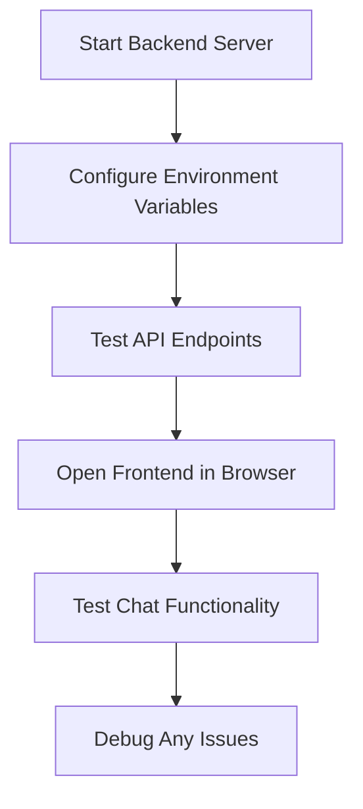

**ステップバイステップのテストプロセス**:

1. **バックエンドサーバーを起動**:
   ```bash
   cd backend
   source venv/bin/activate  # or venv\Scripts\activate on Windows
   python api.py
   ```

2. **APIが動作していることを確認**:
   - ブラウザで`http://localhost:5000`を開く
   - FastAPIサーバーからのウェルカムメッセージが表示されるはずです

3. **フロントエンドを開く**:
   - フロントエンドディレクトリに移動
   - ブラウザで`index.html`を開く
   - または、VS CodeのLive Server拡張機能を使用してより良い開発体験を得る

4. **チャット機能をテスト**:
   - 入力フィールドにメッセージを入力
   - 「送信」をクリックするかEnterキーを押す
   - AIが適切に応答することを確認
   - ブラウザコンソールでJavaScriptエラーがないか確認

### よくある問題のトラブルシューティング

| 問題 | 症状 | 解決策 |
|------|------|------|
| **CORSエラー** | フロントエンドがバックエンドに到達できない | FastAPIのCORSMiddlewareが正しく設定されていることを確認 |
| **APIキーエラー** | 401 Unauthorizedの応答 | `GITHUB_TOKEN`環境変数を確認 |
| **接続拒否** | フロントエンドでネットワークエラー | バックエンドURLとFlaskサーバーが動作していることを確認 |
| **AI応答なし** | 空の応答またはエラー応答 | APIクォータや認証問題についてバックエンドログを確認 |

**一般的なデバッグ手順**:
- **ブラウザの開発者ツールコンソール**でJavaScriptエラーを確認
- **ネットワークタブ**でAPIリクエストと応答が成功していることを確認
- **バックエンドのターミナル出力**でPythonエラーやAPI問題を確認
- **環境変数**が正しく読み込まれ、アクセス可能であることを確認

## 📈 AIアプリケーション開発の習得タイムライン

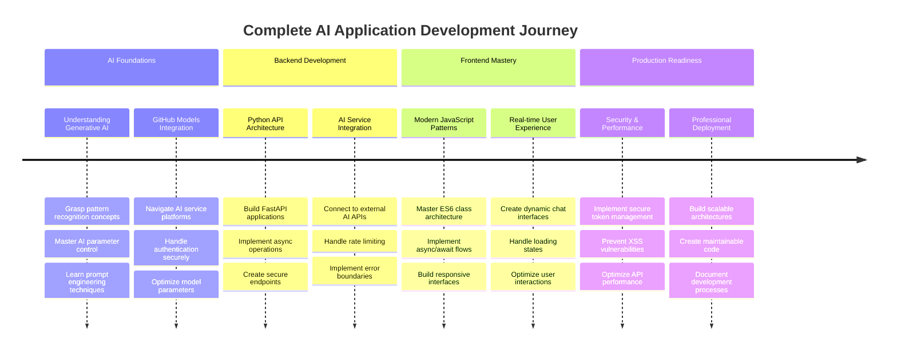

**🎓 卒業マイルストーン**: モダンなAIアシスタントを構築するための技術とアーキテクチャパターンを習得しました。これらのスキルは、従来のウェブ開発と最先端のAI統合の交差点を表しています。

**🔄 次のレベルの能力**:
- 高度なAIフレームワーク（LangChain、LangGraph）を探求する準備が整いました
- マルチモーダルAIアプリケーション（テキスト、画像、音声）を構築する準備が整いました
- ベクトルデータベースと検索システムを実装する能力を備えています
- 機械学習とAIモデルの微調整の基盤が整いました

## GitHub Copilot Agent Challenge 🚀

Agentモードを使用して以下のチャレンジを完了してください:

**説明:** 会話履歴とメッセージの永続性を追加してチャットアシスタントを強化します。このチャレンジでは、チャットアプリケーションでの状態管理とデータ保存の実装方法を理解することができます。

**プロンプト:** チャットアプリケーションを修正して、セッション間で会話履歴が保持されるようにします。チャットメッセージをローカルストレージに保存し、ページが読み込まれたときに会話履歴を表示し、「履歴をクリア」ボタンを追加します。また、タイピングインジケーターやメッセージのタイムスタンプを実装して、よりリアルなチャット体験を提供してください。

[Agentモードについて詳しくはこちら](https://code.visualstudio.com/blogs/2025/02/24/introducing-copilot-agent-mode)。

## 課題: 自分のAIアシスタントを構築する

次に、自分のAIアシスタントを実装します。単にチュートリアルコードを再現するのではなく、学んだ概念を応用して、自分の興味やユースケースを反映したものを作成する機会です。

### プロジェクト要件

以下のように、クリーンで整理された構造でプロジェクトをセットアップしましょう:

```text
my-ai-assistant/
├── backend/
│   ├── api.py          # Your FastAPI server
│   ├── llm.py          # AI integration functions
│   ├── .env            # Your secrets (keep this safe!)
│   └── requirements.txt # Python dependencies
├── frontend/
│   ├── index.html      # Your chat interface
│   ├── app.js          # The JavaScript magic
│   └── styles.css      # Make it look amazing
└── README.md           # Tell the world about your creation
```

### コア実装タスク

**バックエンド開発**:
- **FastAPIコードを取り入れ**、自分のものにする
- **ユニークなAIの個性を作成** – 例えば、役立つ料理アシスタント、創造的なライティングパートナー、または勉強の相棒？
- **堅牢なエラーハンドリングを追加**して、問題が発生してもアプリが壊れないようにする
- **APIの動作を理解するための明確なドキュメントを書く**

**フロントエンド開発**:
- **直感的で親しみやすいチャットインターフェースを構築**
- **他の開発者に誇れるようなクリーンでモダンなJavaScriptを書く**
- **AIの個性を反映したカスタムスタイリングをデザイン** – 楽しくカラフル？クリーンでミニマル？完全にあなた次第！
- **スマホとパソコンの両方で素晴らしく動作することを確認**

**パーソナライズ要件**:
- **ユニークな名前と個性を選択** – あなたの興味や解決したい問題を反映したもの
- **視覚デザインをカスタマイズ**してアシスタントの雰囲気に合わせる
- **人々がチャットを始めたくなるような魅力的なウェルカムメッセージを書く**
- **さまざまな質問でアシスタントをテスト**して、どのように応答するか確認

### 拡張アイデア（オプション）

プロジェクトを次のレベルに引き上げたいですか？以下の楽しいアイデアを探求してみてください:

| 機能 | 説明 | 練習するスキル |
|------|------|------|
| **メッセージ履歴** | ページをリフレッシュしても会話を記憶 | localStorageの操作、JSON処理 |
| **タイピングインジケーター** | AIが応答を待っている間「AIが入力中...」を表示 | CSSアニメーション、非同期プログラミング |
| **メッセージタイムスタンプ** | 各メッセージが送信された時間を表示 | 日付/時間のフォーマット、UXデザイン |
| **チャットのエクスポート** | ユーザーが会話をダウンロードできるようにする | ファイル操作、データエクスポート |
| **テーマ切り替え** | ライト/ダークモードの切り替え | CSS変数、ユーザー設定 |
| **音声入力** | 音声からテキストへの機能を追加 | Web API、アクセシビリティ |

### テストとドキュメント

**品質保証**:
- **さまざまな入力タイプとエッジケースでアプリケーションをテスト**
- **異なる画面サイズでレスポンシブデザインが機能することを確認**
- **キーボードナビゲーションやスクリーンリーダーでアクセシビリティを確認**
- **HTMLとCSSが標準に準拠していることを検証**

**ドキュメント要件**:
- **README.mdを書いてプロジェクトと実行方法を説明**
- **チャットインターフェースが動作しているスクリーンショットを含める**
- **追加したユニークな機能やカスタマイズをドキュメント化**
- **他の開発者向けに明確なセットアップ手順を提供**

### 提出ガイドライン

**プロジェクト成果物**:
1. すべてのソースコードを含む完全なプロジェクトフォルダ
2. プロジェクトの説明とセットアップ手順を記載したREADME.md
3. チャットアシスタントが動作しているスクリーンショット
4. 学んだことや直面した課題についての簡単な振り返り

**評価基準**:
- **機能性**: チャットアシスタントが期待通りに動作するか？
- **コード品質**: コードが整理され、コメントがあり、保守可能か？
- **デザイン**: インターフェースが
- **会話のトピックに基づいた**スマートな提案を実装する  
- **よくある質問に対する**クイック返信ボタンを作成する  

> 🎯 **学習目標**: これらの追加チャレンジは、実際のアプリケーションで使用される高度なウェブ開発パターンやAI統合技術を理解する助けとなります。

## まとめと次のステップ

おめでとうございます！ゼロからAI搭載のチャットアシスタントを完成させました。このプロジェクトを通じて、最新のウェブ開発技術とAI統合の実践的なスキルを習得しました。これらのスキルは、現在の技術業界で非常に価値のあるものです。

### 達成したこと

このレッスンを通じて、以下の重要な技術と概念を習得しました：

**バックエンド開発:**
- **GitHub Models API**を統合してAI機能を実現  
- **Flask**を使用してエラーハンドリングを備えたRESTful APIを構築  
- **環境変数**を使用して安全な認証を実装  
- **CORS**を設定してフロントエンドとバックエンド間のクロスオリジンリクエストを許可  

**フロントエンド開発:**
- **セマンティックHTML**を使用してレスポンシブなチャットインターフェースを作成  
- **async/await**とクラスベースのアーキテクチャを活用したモダンなJavaScriptを実装  
- **CSS Grid**、Flexbox、アニメーションを使用して魅力的なユーザーインターフェースをデザイン  
- **アクセシビリティ機能**とレスポンシブデザインの原則を追加  

**フルスタック統合:**
- **HTTP APIコール**を通じてフロントエンドとバックエンドを接続  
- **リアルタイムのユーザーインタラクション**と非同期データフローを処理  
- **エラーハンドリング**とアプリケーション全体でのユーザーへのフィードバックを実装  
- **ユーザー入力からAI応答までの**アプリケーションワークフローをテスト  

### 主な学習成果

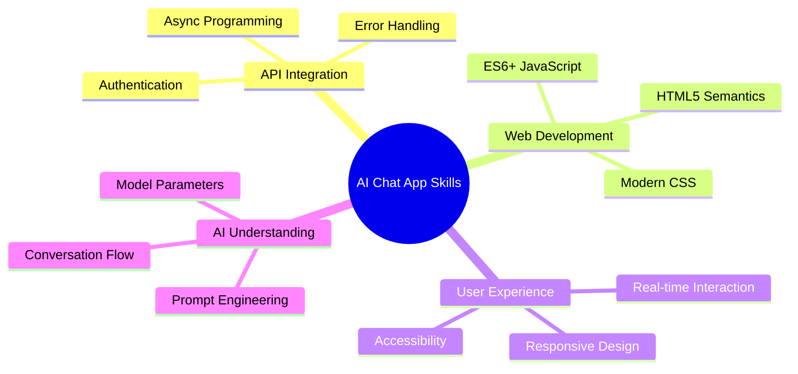
  
このプロジェクトでは、AI搭載アプリケーションの構築の基礎を学びました。これにより、従来のウェブアプリケーションにAI機能を統合し、知的で応答性の高いユーザー体験を作り出す方法を理解しました。

### プロフェッショナルな応用

このレッスンで習得したスキルは、現代のソフトウェア開発キャリアに直接適用できます：

- **モダンなフレームワークとAPIを使用したフルスタックウェブ開発**  
- **ウェブアプリケーションやモバイルアプリへのAI統合**  
- **マイクロサービスアーキテクチャ向けのAPI設計と開発**  
- **アクセシビリティとレスポンシブデザインに重点を置いたユーザーインターフェース開発**  
- **環境設定やデプロイを含むDevOpsの実践**  

### AI開発の旅を続けるために

**次の学習ステップ:**
- **より高度なAIモデルやAPI**（GPT-4、Claude、Gemini）を探求する  
- **プロンプトエンジニアリング技術**を学び、より良いAI応答を得る方法を習得する  
- **会話設計**やチャットボットのユーザー体験の原則を研究する  
- **AIの安全性、倫理、責任あるAI開発**について調査する  
- **会話の記憶やコンテキスト認識を備えた**より複雑なアプリケーションを構築する  

**高度なプロジェクトアイデア:**
- AIによるモデレーションを備えたマルチユーザーチャットルーム  
- AI搭載のカスタマーサービスチャットボット  
- 個別学習を提供する教育用チューターアシスタント  
- 異なるAIキャラクターを持つクリエイティブライティングコラボレーター  
- 開発者向けの技術文書アシスタント  

## GitHub Codespacesで始める

このプロジェクトをクラウド開発環境で試してみたいですか？GitHub Codespacesはブラウザ内で完全な開発セットアップを提供し、ローカルセットアップの必要なくAIアプリケーションを試すのに最適です。

### 開発環境のセットアップ

**ステップ1: テンプレートから作成**
- **[Web Dev For Beginnersリポジトリ](https://github.com/microsoft/Web-Dev-For-Beginners)**に移動  
- **右上の「Use this template」**をクリック（GitHubにログインしていることを確認）  


**ステップ2: Codespacesを起動**
- **新しく作成したリポジトリを開く**  
- **緑色の「Code」ボタンをクリックし、「Codespaces」を選択**  
- **「Create codespace on main」を選択して開発環境を開始**  


**ステップ3: 環境設定**
Codespaceが読み込まれると、以下にアクセスできます：
- **Python、Node.js、必要な開発ツールが事前インストール済み**  
- **ウェブ開発用拡張機能を備えたVS Codeインターフェース**  
- **バックエンドとフロントエンドサーバーを実行するためのターミナルアクセス**  
- **アプリケーションをテストするためのポートフォワーディング**  

**Codespacesが提供するもの:**
- **ローカル環境のセットアップや構成の問題を排除**  
- **異なるデバイス間で一貫した開発環境を提供**  
- **ウェブ開発用の事前構成済みツールと拡張機能を含む**  
- **バージョン管理とコラボレーションのためのGitHubとのシームレスな統合**  

> 🚀 **プロのヒント**: Codespacesは、AIアプリケーションの学習とプロトタイピングに最適です。複雑な環境設定を自動的に処理してくれるため、構成のトラブルシューティングではなく、構築と学習に集中できます。

---

**免責事項**:  
この文書はAI翻訳サービス[Co-op Translator](https://github.com/Azure/co-op-translator)を使用して翻訳されています。正確性を追求しておりますが、自動翻訳には誤りや不正確な部分が含まれる可能性があります。元の言語で記載された文書を正式な情報源としてお考えください。重要な情報については、専門の人間による翻訳を推奨します。この翻訳の使用に起因する誤解や誤解について、当社は責任を負いません。