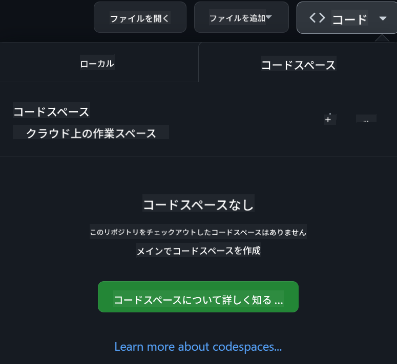

<!--
CO_OP_TRANSLATOR_METADATA:
{
  "original_hash": "3bea83a071750b68d3c8755f1155f805",
  "translation_date": "2025-10-03T09:01:22+00:00",
  "source_file": "README.md",
  "language_code": "ja"
}
-->
[](https://github.com/microsoft/Web-Dev-For-Beginners/blob/master/LICENSE)
[](https://GitHub.com/microsoft/Web-Dev-For-Beginners/graphs/contributors/)
[](https://GitHub.com/microsoft/Web-Dev-For-Beginners/issues/)
[](https://GitHub.com/microsoft/Web-Dev-For-Beginners/pulls/)
[](http://makeapullrequest.com)

[](https://GitHub.com/microsoft/Web-Dev-For-Beginners/watchers/)
[](https://GitHub.com/microsoft/Web-Dev-For-Beginners/network/)
[](https://GitHub.com/microsoft/Web-Dev-For-Beginners/stargazers/)

[](https://discord.gg/zxKYvhSnVp?WT.mc_id=academic-000002-leestott)

[](https://open.vscode.dev/microsoft/Web-Dev-For-Beginners)

[](https://discord.com/invite/ByRwuEEgH4)

以下の手順でこれらのリソースを使い始めましょう：
1. **リポジトリをフォークする**: [](https://GitHub.com/microsoft/Web-Dev-For-Beginners/fork) をクリック
2. **リポジトリをクローンする**: `git clone https://github.com/microsoft/Web-Dev-For-Beginners.git`
3. [**Azure AI Foundry Discordに参加して、専門家や他の開発者と交流する**](https://discord.com/invite/ByRwuEEgH4)

# 初心者向けウェブ開発 - カリキュラム

Microsoft Cloud Advocatesによる12週間の包括的なコースでウェブ開発の基礎を学びましょう。24のレッスンでは、JavaScript、CSS、HTMLを使った実践的なプロジェクト（テラリウム、ブラウザ拡張機能、宇宙ゲームなど）を通じて学びます。クイズ、ディスカッション、実践課題を通じてスキルを向上させ、プロジェクトベースの学習法で知識の定着を最大化します。今日からコーディングの旅を始めましょう！

### 🌐 多言語対応

#### GitHub Actionによるサポート（自動更新＆常に最新）

[フランス語](../fr/README.md) | [スペイン語](../es/README.md) | [ドイツ語](../de/README.md) | [ロシア語](../ru/README.md) | [アラビア語](../ar/README.md) | [ペルシャ語（ファルシ）](../fa/README.md) | [ウルドゥー語](../ur/README.md) | [中国語（簡体字）](../zh/README.md) | [中国語（繁体字、マカオ）](../mo/README.md) | [中国語（繁体字、香港）](../hk/README.md) | [中国語（繁体字、台湾）](../tw/README.md) | [日本語](./README.md) | [韓国語](../ko/README.md) | [ヒンディー語](../hi/README.md) | [ベンガル語](../bn/README.md) | [マラーティー語](../mr/README.md) | [ネパール語](../ne/README.md) | [パンジャブ語（グルムキー）](../pa/README.md) | [ポルトガル語（ポルトガル）](../pt/README.md) | [ポルトガル語（ブラジル）](../br/README.md) | [イタリア語](../it/README.md) | [ポーランド語](../pl/README.md) | [トルコ語](../tr/README.md) | [ギリシャ語](../el/README.md) | [タイ語](../th/README.md) | [スウェーデン語](../sv/README.md) | [デンマーク語](../da/README.md) | [ノルウェー語](../no/README.md) | [フィンランド語](../fi/README.md) | [オランダ語](../nl/README.md) | [ヘブライ語](../he/README.md) | [ベトナム語](../vi/README.md) | [インドネシア語](../id/README.md) | [マレー語](../ms/README.md) | [タガログ語（フィリピン）](../tl/README.md) | [スワヒリ語](../sw/README.md) | [ハンガリー語](../hu/README.md) | [チェコ語](../cs/README.md) | [スロバキア語](../sk/README.md) | [ルーマニア語](../ro/README.md) | [ブルガリア語](../bg/README.md) | [セルビア語（キリル文字）](../sr/README.md) | [クロアチア語](../hr/README.md) | [スロベニア語](../sl/README.md) | [ウクライナ語](../uk/README.md) | [ビルマ語（ミャンマー）](../my/README.md)

**追加の翻訳を希望する場合、サポートされている言語は[こちら](https://github.com/Azure/co-op-translator/blob/main/getting_started/supported-languages.md)に記載されています**

#### 🧑‍🎓 _学生の皆さんへ_

[**Student Hubページ**](https://docs.microsoft.com/learn/student-hub/?WT.mc_id=academic-77807-sagibbon)を訪問してください。初心者向けリソース、学生向けパック、さらには無料の認定証バウチャーを取得する方法が見つかります。このページはブックマークして、毎月内容が更新されるので定期的にチェックしてください。

### 📣 お知らせ - _生成AIを使った新しいプロジェクト_

新しいAIアシスタントプロジェクトが追加されました。詳細は[プロジェクト](./09-chat-project/README.md)をご覧ください。

### 📣 お知らせ - _生成AIに関する新しいカリキュラム_（JavaScript向け）がリリースされました

新しい生成AIカリキュラムをお見逃しなく！

[https://aka.ms/genai-js-course](https://aka.ms/genai-js-course)を訪問して学び始めましょう！


- 基礎からRAGまでを網羅したレッスン
- GenAIとコンパニオンアプリを使って歴史上の人物と対話
- 楽しく魅力的なストーリーでタイムトラベル体験！


各レッスンには以下が含まれます：
- 課題
- 知識チェック
- チャレンジ
- 以下のトピックを学ぶためのガイド：
  - プロンプトとプロンプトエンジニアリング
  - テキストと画像アプリの生成
  - 検索アプリ

[https://aka.ms/genai-js-course](https://aka.ms/genai-js-course)を訪問して学び始めましょう！

## 🌱 学習を始める

> **教師の皆さん**、このカリキュラムの使用方法について[いくつかの提案](for-teachers.md)を含めています。ぜひ[ディスカッションフォーラム](https://github.com/microsoft/Web-Dev-For-Beginners/discussions/categories/teacher-corner)でフィードバックをお寄せください！

**[学習者の皆さん](https://aka.ms/student-page/?WT.mc_id=academic-77807-sagibbon)**、各レッスンでは、事前クイズから始め、講義資料を読み、さまざまな活動を完了し、事後クイズで理解度を確認してください。

学習体験を向上させるために、仲間と一緒にプロジェクトに取り組むことをお勧めします！ディスカッションは[ディスカッションフォーラム](https://github.com/microsoft/Web-Dev-For-Beginners/discussions)で歓迎されており、モデレーターが質問に答えるために待機しています。

さらに学びを深めるために、[Microsoft Learn](https://learn.microsoft.com/users/wirelesslife/collections/p1ddcy5jwy0jkm?WT.mc_id=academic-77807-sagibbon)で追加の学習資料を探索することを強くお勧めします。

### 📋 環境のセットアップ

このカリキュラムにはすぐに使える開発環境が用意されています！始める際には、[Codespace](https://github.com/features/codespaces/)（ブラウザベースでインストール不要の環境）を使用するか、ローカルのコンピュータで[Visual Studio Code](https://code.visualstudio.com/?WT.mc_id=academic-77807-sagibbon)などのテキストエディタを使用して実行することができます。

#### リポジトリを作成する
作業内容を簡単に保存するために、このリポジトリのコピーを作成することをお勧めします。ページ上部の**Use this template**ボタンをクリックすると、カリキュラムのコピーがあなたのGitHubアカウントに新しいリポジトリとして作成されます。

以下の手順に従ってください：
1. **リポジトリをフォークする**: ページ右上の「Fork」ボタンをクリックします。
2. **リポジトリをクローンする**: `git clone https://github.com/microsoft/Web-Dev-For-Beginners.git`

#### Codespaceでカリキュラムを実行する

作成したリポジトリのコピーで、**Code**ボタンをクリックし、**Open with Codespaces**を選択します。これにより、作業用の新しいCodespaceが作成されます。



#### ローカルコンピュータでカリキュラムを実行する

ローカルコンピュータでこのカリキュラムを実行するには、テキストエディタ、ブラウザ、コマンドラインツールが必要です。最初のレッスン[プログラミング言語とツールの紹介](../../1-getting-started-lessons/1-intro-to-programming-languages)では、これらのツールのさまざまなオプションを紹介し、最適なものを選択する方法を説明します。

おすすめは[Visual Studio Code](https://code.visualstudio.com/?WT.mc_id=academic-77807-sagibbon)をエディタとして使用することです。このエディタには[ターミナル](https://code.visualstudio.com/docs/terminal/basics/?WT.mc_id=academic-77807-sagibbon)が組み込まれています。[Visual Studio Code](https://code.visualstudio.com/?WT.mc_id=academic-77807-sagibbon)は[こちら](https://code.visualstudio.com/?WT.mc_id=academic-77807-sagibbon)からダウンロードできます。

1. リポジトリをコンピュータにクローンします。**Code**ボタンをクリックしてURLをコピーします：

    [CodeSpace](./images/createcodespace.png)

    次に、[Visual Studio Code](https://code.visualstudio.com/?WT.mc_id=academic-77807-sagibbon)内の[ターミナル](https://code.visualstudio.com/docs/terminal/basics/?WT.mc_id=academic-77807-sagibbon)を開き、以下のコマンドを実行します。`<your-repository-url>`をコピーしたURLに置き換えてください：

    ```bash 
    git clone <your-repository-url>
    ```

2. Visual Studio Codeでフォルダを開きます。**File** > **Open Folder**をクリックし、クローンしたフォルダを選択します。

> 推奨されるVisual Studio Code拡張機能：
>
> * [Live Server](https://marketplace.visualstudio.com/items?itemName=ritwickdey.LiveServer&WT.mc_id=academic-77807-sagibbon) - Visual Studio Code内でHTMLページをプレビューするための拡張機能
> * [Copilot](https://marketplace.visualstudio.com/items?itemName=GitHub.copilot&WT.mc_id=academic-77807-sagibbon) - コードを書くスピードを向上させるための拡張機能

## 📂 各レッスンには以下が含まれます：

- スケッチノート（オプション）
- 補足動画（オプション）
- レッスン前のウォームアップクイズ
- 書かれたレッスン内容
- プロジェクトベースのレッスンでは、プロジェクトを構築するためのステップバイステップガイド
- 知識チェック
- チャレンジ
- 補足資料
- 課題
- [レッスン後のクイズ](https://ff-quizzes.netlify.app/web/)
> **クイズについての注意**: すべてのクイズはQuiz-appフォルダーに含まれており、3問ずつの合計48個のクイズがあります。クイズは[こちら](https://ff-quizzes.netlify.app/web/)で利用可能です。クイズアプリはローカルで実行することもAzureにデプロイすることもできます。`quiz-app`フォルダー内の指示に従ってください。

## 🗃️ レッスン

|     |                       プロジェクト名                       |                            教えられる概念                             | 学習目標                                                                                                                 |                                                         リンクされたレッスン                                                          |         著者          |
| :-: | :------------------------------------------------------: | :--------------------------------------------------------------------: | ----------------------------------------------------------------------------------------------------------------------------------- | :----------------------------------------------------------------------------------------------------------------------------: | :---------------------: |
| 01  |                     始めに                      |           プログラミングの基本とツールの紹介           | ほとんどのプログラミング言語の基本的な基盤と、プロの開発者が使用するソフトウェアについて学ぶ | [プログラミング言語とツールの紹介](./1-getting-started-lessons/1-intro-to-programming-languages/README.md) |         Jasmine         |
| 02  |                     始めに                      |             GitHubの基本、チームでの作業             | プロジェクトでGitHubを使用する方法、コードベースで他の人と協力する方法                                                    |                            [GitHubの基本](./1-getting-started-lessons/2-github-basics/README.md)                             |          Floor          |
| 03  |                     始めに                      |                             アクセシビリティ                              | Webアクセシビリティの基本を学ぶ                                                                                               |                       [アクセシビリティの基本](./1-getting-started-lessons/3-accessibility/README.md)                       |       Christopher       |
| 04  |                        JSの基本                         |                         JavaScriptのデータ型                          | JavaScriptのデータ型の基本                                                                                                 |                                       [データ型](./2-js-basics/1-data-types/README.md)                                        |         Jasmine         |
| 05  |                        JSの基本                         |                         関数とメソッド                          | アプリケーションのロジックフローを管理するための関数とメソッドについて学ぶ                                                             |                              [関数とメソッド](./2-js-basics/2-functions-methods/README.md)                               | Jasmine and Christopher |
| 06  |                        JSの基本                         |                        JavaScriptでの意思決定                        | 意思決定方法を使用してコード内で条件を作成する方法を学ぶ                                                           |                                 [意思決定](./2-js-basics/3-making-decisions/README.md)                                  |         Jasmine         |
| 07  |                        JSの基本                         |                            配列とループ                            | JavaScriptで配列とループを使用してデータを操作する                                                                                 |                                   [配列とループ](./2-js-basics/4-arrays-loops/README.md)                                    |         Jasmine         |
| 08  |       [テラリウム](./3-terrarium/solution/README.md)       |                            HTMLの実践                            | オンラインテラリウムを作成するためのHTMLを構築し、レイアウトの作成に焦点を当てる                                                         |                                 [HTMLの紹介](./3-terrarium/1-intro-to-html/README.md)                                 |           Jen           |
| 09  |       [テラリウム](./3-terrarium/solution/README.md)       |                            CSSの実践                             | オンラインテラリウムをスタイル付けするためのCSSを構築し、レスポンシブデザインを含むCSSの基本に焦点を当てる                     |                                  [CSSの紹介](./3-terrarium/2-intro-to-css/README.md)                                  |           Jen           |
| 10  |            [テラリウム](./3-terrarium/solution/README.md)            |                 JavaScriptクロージャー、DOM操作                  | テラリウムをドラッグ＆ドロップインターフェースとして機能させるためのJavaScriptを構築し、クロージャーとDOM操作に焦点を当てる             |                  [JavaScriptクロージャー、DOM操作](./3-terrarium/3-intro-to-DOM-and-closures/README.md)                   |           Jen           |
| 11  |          [タイピングゲーム](./4-typing-game/solution/README.md)          |                          タイピングゲームを作成                           | キーボードイベントを使用してJavaScriptアプリのロジックを駆動する方法を学ぶ                                                          |                                [イベント駆動型プログラミング](./4-typing-game/typing-game/README.md)                                |       Christopher       |
| 12  | [グリーンブラウザー拡張機能](./5-browser-extension/solution/README.md) |                         ブラウザーの操作                          | ブラウザーの仕組み、その歴史、ブラウザー拡張機能の最初の要素をスキャフォールドする方法を学ぶ                               |                               [ブラウザーについて](./5-browser-extension/1-about-browsers/README.md)                                |           Jen           |
| 13  | [グリーンブラウザー拡張機能](./5-browser-extension/solution/README.md) | フォームの作成、APIの呼び出し、ローカルストレージに変数を保存する方法 | ローカルストレージに保存された変数を使用してAPIを呼び出すブラウザー拡張機能のJavaScript要素を構築する                      |                [API、フォーム、ローカルストレージ](./5-browser-extension/2-forms-browsers-local-storage/README.md)                 |           Jen           |
| 14  | [グリーンブラウザー拡張機能](./5-browser-extension/solution/README.md) |          ブラウザーのバックグラウンドプロセス、Webパフォーマンス          | ブラウザーのバックグラウンドプロセスを使用して拡張機能のアイコンを管理する方法を学び、Webパフォーマンスと最適化について学ぶ   |             [バックグラウンドタスクとパフォーマンス](./5-browser-extension/3-background-tasks-and-performance/README.md)              |           Jen           |
| 15  |           [スペースゲーム](./6-space-game/solution/README.md)           |             JavaScriptを使用したより高度なゲーム開発             | クラスとコンポジションを使用した継承とPub/Subパターンについて学び、ゲーム構築の準備をする              |                      [高度なゲーム開発の紹介](./6-space-game/1-introduction/README.md)                       |          Chris          |
| 16  |           [スペースゲーム](./6-space-game/solution/README.md)           |                           キャンバスへの描画                            | 画面に要素を描画するために使用されるCanvas APIについて学ぶ                                                                       |                                [キャンバスへの描画](./6-space-game/2-drawing-to-canvas/README.md)                                |          Chris          |
| 17  |           [スペースゲーム](./6-space-game/solution/README.md)           |                   画面上の要素の移動                    | 要素がカートesian座標とCanvas APIを使用して動きを得る方法を発見する                                            |                           [要素の移動](./6-space-game/3-moving-elements-around/README.md)                           |          Chris          |
| 18  |           [スペースゲーム](./6-space-game/solution/README.md)           |                          衝突検出                           | 要素が衝突してお互いに反応する方法を学び、キー入力を使用してゲームのパフォーマンスを確保するためのクールダウン機能を提供する    |                              [衝突検出](./6-space-game/4-collision-detection/README.md)                              |          Chris          |
| 19  |           [スペースゲーム](./6-space-game/solution/README.md)           |                             スコアの保持                              | ゲームの状態とパフォーマンスに基づいて数学的計算を行う                                                                |                                    [スコアの保持](./6-space-game/5-keeping-score/README.md)                                    |          Chris          |
| 20  |           [スペースゲーム](./6-space-game/solution/README.md)           |                     ゲームの終了と再開                     | ゲームの終了と再開について学び、アセットのクリーンアップと変数値のリセットを含む                              |                                [終了条件](./6-space-game/6-end-condition/README.md)                                 |          Chris          |
| 21  |         [バンキングアプリ](./7-bank-project/solution/README.md)          |                 WebアプリでのHTMLテンプレートとルート                 | ルーティングとHTMLテンプレートを使用してマルチページWebサイトのアーキテクチャのスキャフォールドを作成する方法を学ぶ                             |                            [HTMLテンプレートとルート](./7-bank-project/1-template-route/README.md)                             |          Yohan          |
| 22  |         [バンキングアプリ](./7-bank-project/solution/README.md)          |                  ログインと登録フォームの作成                   | フォームの作成とバリデーションルーチンの処理について学ぶ                                                                          |                                           [フォーム](./7-bank-project/2-forms/README.md)                                           |          Yohan          |
| 23  |         [バンキングアプリ](./7-bank-project/solution/README.md)          |                   データの取得と使用方法                   | アプリ内でデータがどのように流れ、取得、保存、廃棄されるかを学ぶ                                                 |                                            [データ](./7-bank-project/3-data/README.md)                                            |          Yohan          |
| 24  |         [バンキングアプリ](./7-bank-project/solution/README.md)          |                      状態管理の概念                      | アプリが状態を保持する方法とそれをプログラム的に管理する方法を学ぶ                                                              |                                [状態管理](./7-bank-project/4-state-management/README.md)                                |          Yohan          |
| 25 | [ブラウザー/VScodeコード](../../8-code-editor) | VScodeの操作 | コードエディターの使用方法を学ぶ | [VScodeコードエディターの使用](./8-code-editor/1-using-a-code-editor/README.md) | Chris |
| 26 | [AIアシスタント](./9-chat-project/README.md) | AIの操作 | 自分のAIアシスタントを構築する方法を学ぶ | [AIアシスタントプロジェクト](./9-chat-project/README.md) | Chris |

## 🏫 教育法

私たちのカリキュラムは、以下の2つの主要な教育原則に基づいて設計されています:
* プロジェクトベースの学習
* 頻繁なクイズ

このプログラムでは、JavaScript、HTML、CSSの基本と、現在のWeb開発者が使用する最新のツールや技術を教えます。学生は、タイピングゲーム、仮想テラリウム、環境に優しいブラウザー拡張機能、スペースインベーダースタイルのゲーム、ビジネス向けバンキングアプリを構築することで、実践的な経験を積むことができます。このシリーズの終わりまでに、学生はWeb開発の確固たる理解を得ることができます。

> 🎓 このカリキュラムの最初のいくつかのレッスンをMicrosoft Learnで[学習パス](https://docs.microsoft.com/learn/paths/web-development-101/?WT.mc_id=academic-77807-sagibbon)として受講することができます！

プロジェクトに合わせてコンテンツを調整することで、学生にとってより魅力的なプロセスとなり、概念の定着が促進されます。また、JavaScriptの基本を紹介するいくつかのスターターレッスンを作成し、"[Beginners Series to: JavaScript](https://channel9.msdn.com/Series/Beginners-Series-to-JavaScript/?WT.mc_id=academic-77807-sagibbon)"というビデオチュートリアルコレクションのビデオとペアリングしました。このコレクションの一部の著者は、このカリキュラムに貢献しています。

さらに、授業前の低リスクなクイズは、学生がトピックを学ぶ意図を設定し、授業後の2回目のクイズはさらに定着を確保します。このカリキュラムは柔軟で楽しいように設計されており、全体または部分的に受講することができます。プロジェクトは小さなものから始まり、12週間のサイクルの終わりまでに徐々に複雑になります。

JavaScriptフレームワークの導入を意図的に避け、フレームワークを採用する前にWeb開発者として必要な基本スキルに集中していますが、このカリキュラムを完了した後の次のステップとして、Node.jsについて学ぶことをお勧めします。これには、別のビデオコレクション"[Beginner Series to: Node.js](https://channel9.msdn.com/Series/Beginners-Series-to-Nodejs/?WT.mc_id=academic-77807-sagibbon)"が役立ちます。

> [行動規範](CODE_OF_CONDUCT.md)と[貢献ガイドライン](CONTRIBUTING.md)をご覧ください。建設的なフィードバックを歓迎します！


## 🧭 オフラインアクセス

このドキュメントをオフラインで実行するには、[Docsify](https://docsify.js.org/#/)を使用してください。このリポジトリをフォークし、ローカルマシンに[Docsifyをインストール](https://docsify.js.org/#/quickstart)し、このリポジトリのルートフォルダーで`docsify serve`と入力してください。Webサイトはローカルホストのポート3000で提供されます: `localhost:3000`。

## 📘 PDF

すべてのレッスンのPDFは[こちら](https://microsoft.github.io/Web-Dev-For-Beginners/pdf/readme.pdf)で見つけることができます。


## 🎒 その他のコース

私たちのチームは他のコースも制作しています！以下をご覧ください:

- [初心者向け生成AI](https://aka.ms/genai-beginners)
- [初心者向け生成AI .NET](https://github.com/microsoft/Generative-AI-for-beginners-dotnet)
- [JavaScriptでの生成AI](https://github.com/microsoft/generative-ai-with-javascript)
- [Javaでの生成AI](https://github.com/microsoft/Generative-AI-for-beginners-java)
- [初心者向けAI](https://aka.ms/ai-beginners)
- [初心者向けデータサイエンス](https://aka.ms/datascience-beginners)
- [初心者向け機械学習](https://aka.ms/ml-beginners)
- [初心者向けサイバーセキュリティ](https://github.com/microsoft/Security-101)
- [初心者向けWeb開発](https://aka.ms/webdev-beginners)
- [初心者向けIoT](https://aka.ms/iot-beginners)
- [初心者向けXR開発](https://github.com/microsoft/xr-development-for-beginners)
- [GitHub Copilotのエージェント的使用法の習得](https://github.com/microsoft/Mastering-GitHub-Copilot-for-Paired-Programming)
- [C#/.NET開発者向けGitHub Copilotの習得](https://github.com/microsoft/mastering-github-copilot-for-dotnet-csharp-developers)
- [自分で選ぶCopilotの冒険](https://github.com/microsoft/CopilotAdventures)

## ヘルプを得る

AIアプリの構築で行き詰まったり質問がある場合は、以下に参加してください：

[](https://aka.ms/foundry/discord)

製品に関するフィードバックや構築中のエラーについては、以下を訪問してください：

[](https://aka.ms/foundry/forum)

## ライセンス

このリポジトリはMITライセンスの下で提供されています。詳細は[LICENSE](../../LICENSE)ファイルをご覧ください。

---

**免責事項**:  
この文書は、AI翻訳サービス[Co-op Translator](https://github.com/Azure/co-op-translator)を使用して翻訳されています。正確性を追求しておりますが、自動翻訳には誤りや不正確な部分が含まれる可能性があることをご承知ください。元の言語で記載された文書が正式な情報源とみなされるべきです。重要な情報については、専門の人間による翻訳を推奨します。この翻訳の使用に起因する誤解や誤解釈について、当方は一切の責任を負いません。