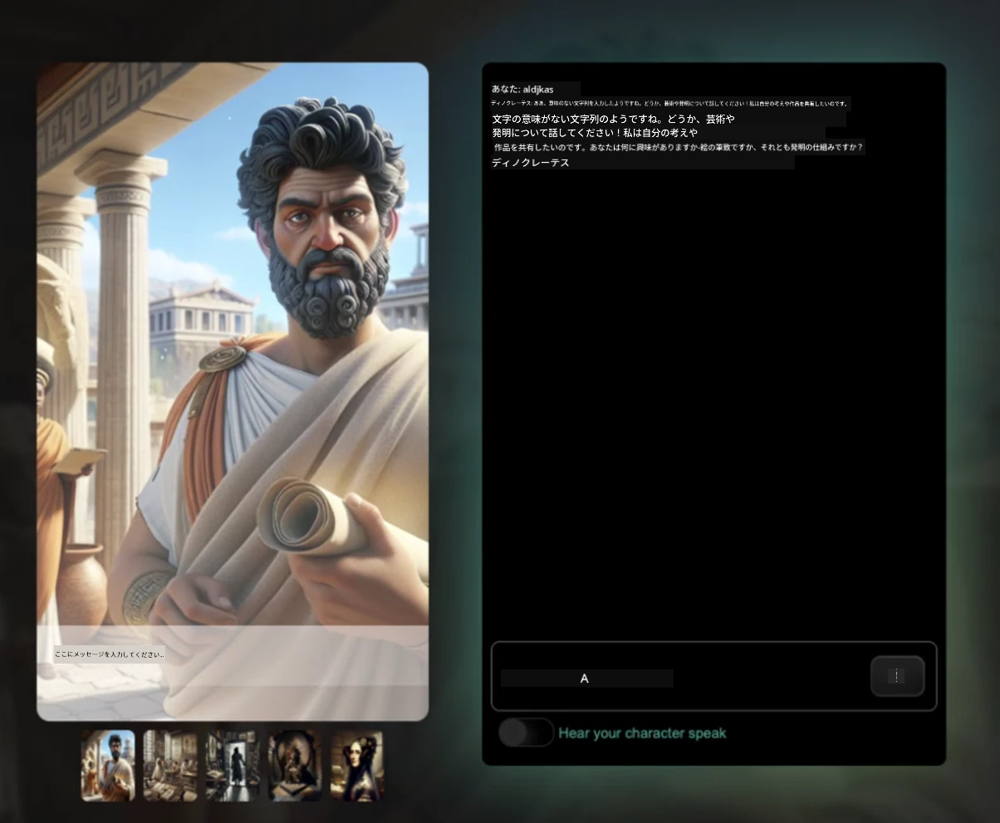
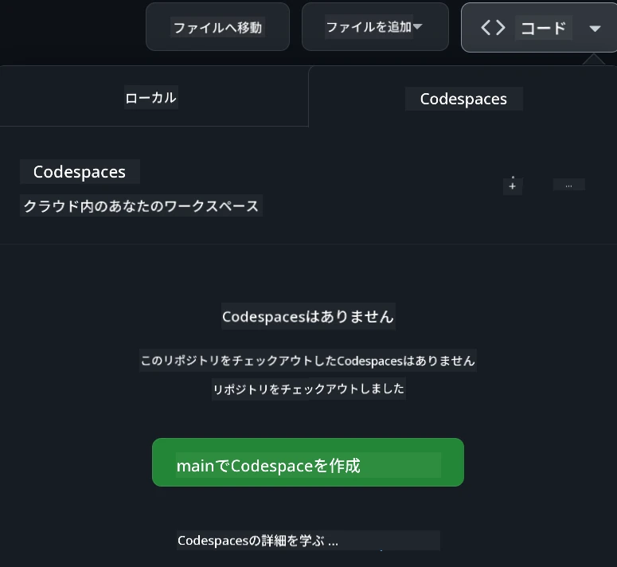

[](https://github.com/microsoft/Web-Dev-For-Beginners/blob/master/LICENSE)
[](https://GitHub.com/microsoft/Web-Dev-For-Beginners/graphs/contributors/)
[](https://GitHub.com/microsoft/Web-Dev-For-Beginners/issues/)
[](https://GitHub.com/microsoft/Web-Dev-For-Beginners/pulls/)
[](http://makeapullrequest.com)

[](https://GitHub.com/microsoft/Web-Dev-For-Beginners/watchers/)
[](https://GitHub.com/microsoft/Web-Dev-For-Beginners/network/)
[](https://GitHub.com/microsoft/Web-Dev-For-Beginners/stargazers/)

[](https://discord.gg/nTYy5BXMWG)

# 初心者のためのWeb開発 - カリキュラム

Microsoft Cloud Advocatesによる12週間の包括的なコースでWeb開発の基本を学びましょう。全24レッスンでは、テラリウム、ブラウザー拡張機能、宇宙ゲームなどの実践的プロジェクトを通してJavaScript、CSS、HTMLを深掘りします。クイズ、ディスカッション、実践課題にも参加可能。効果的なプロジェクトベースの教育法でスキルを高め、知識の定着を最適化しましょう。今日からコーディングを始めましょう！

Azure AI Foundry Discordコミュニティに参加しましょう

[](https://discord.gg/nTYy5BXMWG)

これらのリソースの利用開始手順は以下の通りです：
1. **リポジトリをフォークする**: クリック [](https://GitHub.com/microsoft/Web-Dev-For-Beginners/fork)
2. **リポジトリをクローンする**: `git clone https://github.com/microsoft/Web-Dev-For-Beginners.git`
3. [**Azure AI Foundry Discordに参加して専門家や他の開発者と会いましょう**](https://discord.com/invite/ByRwuEEgH4)

### 🌐 多言語サポート

#### GitHub Actionsでサポート（自動かつ常に最新）

<!-- CO-OP TRANSLATOR LANGUAGES TABLE START -->
[Arabic](../ar/README.md) | [Bengali](../bn/README.md) | [Bulgarian](../bg/README.md) | [Burmese (Myanmar)](../my/README.md) | [Chinese (Simplified)](../zh-CN/README.md) | [Chinese (Traditional, Hong Kong)](../zh-HK/README.md) | [Chinese (Traditional, Macau)](../zh-MO/README.md) | [Chinese (Traditional, Taiwan)](../zh-TW/README.md) | [Croatian](../hr/README.md) | [Czech](../cs/README.md) | [Danish](../da/README.md) | [Dutch](../nl/README.md) | [Estonian](../et/README.md) | [Finnish](../fi/README.md) | [French](../fr/README.md) | [German](../de/README.md) | [Greek](../el/README.md) | [Hebrew](../he/README.md) | [Hindi](../hi/README.md) | [Hungarian](../hu/README.md) | [Indonesian](../id/README.md) | [Italian](../it/README.md) | [Japanese](./README.md) | [Kannada](../kn/README.md) | [Korean](../ko/README.md) | [Lithuanian](../lt/README.md) | [Malay](../ms/README.md) | [Malayalam](../ml/README.md) | [Marathi](../mr/README.md) | [Nepali](../ne/README.md) | [Nigerian Pidgin](../pcm/README.md) | [Norwegian](../no/README.md) | [Persian (Farsi)](../fa/README.md) | [Polish](../pl/README.md) | [Portuguese (Brazil)](../pt-BR/README.md) | [Portuguese (Portugal)](../pt-PT/README.md) | [Punjabi (Gurmukhi)](../pa/README.md) | [Romanian](../ro/README.md) | [Russian](../ru/README.md) | [Serbian (Cyrillic)](../sr/README.md) | [Slovak](../sk/README.md) | [Slovenian](../sl/README.md) | [Spanish](../es/README.md) | [Swahili](../sw/README.md) | [Swedish](../sv/README.md) | [Tagalog (Filipino)](../tl/README.md) | [Tamil](../ta/README.md) | [Telugu](../te/README.md) | [Thai](../th/README.md) | [Turkish](../tr/README.md) | [Ukrainian](../uk/README.md) | [Urdu](../ur/README.md) | [Vietnamese](../vi/README.md)

> **ローカルでクローンすることを好みますか？**

> このリポジトリは50以上の言語翻訳を含んでいるため、ダウンロードサイズが大きくなっています。翻訳なしでクローンするにはスパースチェックアウトを使ってください。  
> ```bash
> git clone --filter=blob:none --sparse https://github.com/microsoft/Web-Dev-For-Beginners.git
> cd Web-Dev-For-Beginners
> git sparse-checkout set --no-cone '/*' '!translations' '!translated_images'
> ```
> これでより速いダウンロードでコースを完了に必要なものがすべて揃います。  
<!-- CO-OP TRANSLATOR LANGUAGES TABLE END -->

**追加の翻訳言語のサポートを希望される場合は[こちら](https://github.com/Azure/co-op-translator/blob/main/getting_started/supported-languages.md)をご覧ください**

[](https://open.vscode.dev/microsoft/Web-Dev-For-Beginners)

#### 🧑‍🎓 _学生ですか？_

初心者向けのリソース、学生パック、無料の証明書バウチャー取得方法などが見つかる [**Student Hubページ**](https://docs.microsoft.com/learn/student-hub/?WT.mc_id=academic-77807-sagibbon) を訪れてみてください。毎月内容を入れ替えますので、定期的にブックマークしてチェックすることをおすすめします。

### 📣 お知らせ - GitHub Copilot Agentモードのチャレンジ追加！

「GitHub Copilot Agent Challenge 🚀」という新しいチャレンジが多くの章に追加されました。これはGitHub CopilotとAgentモードを使って完了する新しいチャレンジです。Agentモードを使ったことがなければ、これはテキスト生成だけでなくファイルの作成・編集、コマンド実行なども可能です。

### 📣 お知らせ - Generative AIを使った新プロジェクト

新しいAIアシスタントプロジェクトが追加されました。こちらの[プロジェクト](./9-chat-project/README.md) をご覧ください。

### 📣 お知らせ - JavaScript向けGenerative AIの新カリキュラム公開

私たちの新しいGenerative AIカリキュラムをお見逃しなく！

開始はこちらから：[https://aka.ms/genai-js-course](https://aka.ms/genai-js-course)


- 基本からRAGまでのレッスン
- Generative AIと専用アプリで歴史上の人物と交流
- 楽しく魅力的なストーリーでタイムトラベル！



各レッスンには課題、知識確認、チャレンジが含まれており、以下のようなトピックの学習をサポートします：  
- プロンプトとプロンプトエンジニアリング  
- テキスト・画像のアプリ生成  
- 検索用アプリ  

開始はこちら：[https://aka.ms/genai-js-course](https://aka.ms/genai-js-course)


## 🌱 始めるにあたって

> **教師の方へ**、このカリキュラムの活用方法についての[提案](for-teachers.md)を含めています。ぜひ[ディスカッションフォーラム](https://github.com/microsoft/Web-Dev-For-Beginners/discussions/categories/teacher-corner)でフィードバックをお寄せください！

**[学習者](https://aka.ms/student-page/?WT.mc_id=academic-77807-sagibbon)** は各レッスン開始前に事前クイズを受け、講義資料を読み、様々なアクティビティを完了し、終了後のクイズで理解度を確認しましょう。

学習効果を高めるために、仲間とつながり一緒にプロジェクトに取り組むことをおすすめします！ディスカッションフォーラム(https://github.com/microsoft/Web-Dev-For-Beginners/discussions)での議論を歓迎しており、モデレーターチームが質問に対応します。

さらに学習を深めたい方は[Microsoft Learn](https://learn.microsoft.com/users/wirelesslife/collections/p1ddcy5jwy0jkm?WT.mc_id=academic-77807-sagibbon)の教材もぜひご活用ください。

### 📋 環境設定

このカリキュラムでは開発環境がすぐに使える状態に整っています！始めるにあたり、[Codespace](https://github.com/features/codespaces/)（ブラウザベースでインストール不要の環境）で実行するか、[Visual Studio Code](https://code.visualstudio.com/?WT.mc_id=academic-77807-sagibbon)などのテキストエディターを使いローカルのPC上で実行することを選べます。

#### リポジトリの作成
作業を簡単に保存するために、このリポジトリのコピーを作成することを推奨します。ページ上部にある **Use this template** ボタンをクリックすると、ご自身のGitHubアカウントにこのカリキュラムのコピーが新しいリポジトリとして作成されます。

手順：
1. **リポジトリをフォークする** : このページ右上の「Fork」ボタンをクリックします。
2. **リポジトリをクローンする** : `git clone https://github.com/microsoft/Web-Dev-For-Beginners.git`

#### Codespaceでカリキュラムを実行

作成したリポジトリのコピーで **Code** ボタンをクリックし、**Open with Codespaces**を選択します。これで作業用の新しいCodespaceが作成されます。



#### ローカルのパソコンでカリキュラムを実行

このカリキュラムをローカルPCで実行するには、テキストエディター、ブラウザ、コマンドラインツールが必要です。最初のレッスン、[プログラミング言語とツールの紹介](../../1-getting-started-lessons/1-intro-to-programming-languages) ではこれらのツールの様々な選択肢を案内します。

推奨は、[Visual Studio Code](https://code.visualstudio.com/?WT.mc_id=academic-77807-sagibbon)というエディターの使用で、内蔵された[ターミナル](https://code.visualstudio.com/docs/terminal/basics/?WT.mc_id=academic-77807-sagibbon)も利用可能です。Visual Studio Codeはこちらからダウンロードできます：[Visual Studio Code](https://code.visualstudio.com/?WT.mc_id=academic-77807-sagibbon)


1. ご自身のリポジトリをPCにクローンします。**Code** ボタンをクリックし、URLをコピーしてください：

    [CodeSpace](./images/createcodespace.png)
    次に、[Visual Studio Code](https://code.visualstudio.com/?WT.mc_id=academic-77807-sagibbon)内の[ターミナル](https://code.visualstudio.com/docs/terminal/basics/?WT.mc_id=academic-77807-sagibbon)を開き、先ほどコピーしたURLで `<your-repository-url>` を置き換えて、次のコマンドを実行します：

    ```bash 
    git clone <your-repository-url>
    ```

2. Visual Studio Codeでフォルダーを開きます。これは、**ファイル** > **フォルダーを開く** をクリックし、クローンしたばかりのフォルダーを選択することで行えます。

>  推奨されるVisual Studio Code拡張機能:
>
> * [Live Server](https://marketplace.visualstudio.com/items?itemName=ritwickdey.LiveServer&WT.mc_id=academic-77807-sagibbon) - Visual Studio Code内でHTMLページをプレビューするため
> * [Copilot](https://marketplace.visualstudio.com/items?itemName=GitHub.copilot&WT.mc_id=academic-77807-sagibbon) - コード作成をより速く支援するため

## 📂 各レッスンには以下が含まれます：

- 任意のスケッチノート
- 任意の補足動画
- 事前ウォームアップクイズ
- 書面によるレッスン
- プロジェクトベースのレッスンの場合、プロジェクトを構築するためのステップバイステップガイド
- 知識チェック
- チャレンジ
- 補足読書
- 課題
- [事後クイズ](https://ff-quizzes.netlify.app/web/)

> **クイズについての注意**：すべてのクイズはQuiz-appフォルダーに収められており、合計48問それぞれ3問のクイズがあります。[こちら](https://ff-quizzes.netlify.app/web/)で利用可能で、クイズアプリはローカルで実行するかAzureにデプロイできます。詳しくは`quiz-app`フォルダー内の指示に従ってください。

## 🗃️ レッスン一覧

|     |                       プロジェクト名                       |                            教えられる概念                             | 学習目標                                                                                                                 |                                                         関連レッスン                                                          |         著者          |
| :-: | :------------------------------------------------------: | :--------------------------------------------------------------------: | ----------------------------------------------------------------------------------------------------------------------------------- | :----------------------------------------------------------------------------------------------------------------------------: | :---------------------: |
| 01  |                     はじめに                      |           プログラミングとツールの基礎           | ほとんどのプログラミング言語の基本的な基盤と、プロの開発者が仕事で使用するソフトウェアについて学ぶ | [プログラミング言語とツールの紹介](./1-getting-started-lessons/1-intro-to-programming-languages/README.md) |         Jasmine         |
| 02  |                     はじめに                      |             GitHubの基本、チームでの作業             | プロジェクトでGitHubを使う方法、コードベースでの共同作業の仕方                                                    |                            [GitHubの紹介](./1-getting-started-lessons/2-github-basics/README.md)                             |          Floor          |
| 03  |                     はじめに                      |                             アクセシビリティ                              | ウェブアクセシビリティの基礎を学ぶ                                                                                               |                       [アクセシビリティの基本](./1-getting-started-lessons/3-accessibility/README.md)                       |       Christopher       |
| 04  |                        JS基礎                         |                         JavaScriptのデータ型                          | JavaScriptのデータ型の基礎                                                                                                 |                                       [データ型](./2-js-basics/1-data-types/README.md)                                        |         Jasmine         |
| 05  |                        JS基礎                         |                         関数とメソッド                          | アプリケーションのロジックフローを管理する関数とメソッドについて学ぶ                                                             |                              [関数とメソッド](./2-js-basics/2-functions-methods/README.md)                               | JasmineとChristopher |
| 06  |                        JS基礎                         |                        JavaScriptでの条件分岐                        | 条件分岐の手法を使ってコードの中で条件を作る方法を学ぶ                                                           |                                 [条件分岐](./2-js-basics/3-making-decisions/README.md)                                  |         Jasmine         |
| 07  |                        JS基礎                         |                            配列とループ                            | JavaScriptで配列やループを使いデータを扱う                                                                                 |                                   [配列とループ](./2-js-basics/4-arrays-loops/README.md)                                    |         Jasmine         |
| 08  |       [テラリウム](./3-terrarium/solution/README.md)       |                            HTML実践                            | オンラインテラリウムを作成するHTMLを構築、レイアウトの構築に注力                                                         |                                 [HTML入門](./3-terrarium/1-intro-to-html/README.md)                                 |           Jen           |
| 09  |       [テラリウム](./3-terrarium/solution/README.md)       |                            CSS実践                             | オンラインテラリウムのスタイルを整えるCSSを構築、レスポンシブ対応含むCSSの基礎に注力                     |                                  [CSS入門](./3-terrarium/2-intro-to-css/README.md)                                  |           Jen           |
| 10  |            [テラリウム](./3-terrarium/solution/README.md)            |                 JavaScriptのクロージャー、DOM操作                  | ドラッグ＆ドロップのインターフェースとしてテラリウムを動作させるJavaScriptを構築、クロージャーとDOM操作に注力             |                  [JavaScriptのクロージャーとDOM操作](./3-terrarium/3-intro-to-DOM-and-closures/README.md)                   |           Jen           |
| 11  |          [タイピングゲーム](./4-typing-game/solution/README.md)          |                          タイピングゲームの構築                           | キーボードイベントを使いJavaScriptアプリのロジックを駆動させる方法を学ぶ                                                          |                                [イベント駆動プログラミング](./4-typing-game/typing-game/README.md)                                |       Christopher       |
| 12  | [グリーンブラウザー拡張](./5-browser-extension/solution/README.md) |                         ブラウザ作業                          | ブラウザの仕組みと歴史、ブラウザー拡張の最初の要素を作る方法を学ぶ                               |                               [ブラウザについて](./5-browser-extension/1-about-browsers/README.md)                                |           Jen           |
| 13  | [グリーンブラウザー拡張](./5-browser-extension/solution/README.md) | フォーム作成、API呼び出し、ローカルストレージへの変数保存 | APIを呼び出すブラウザー拡張のJavaScript構築、ローカルストレージに保存された変数を使う                      |                [API、フォーム、ローカルストレージ](./5-browser-extension/2-forms-browsers-local-storage/README.md)                 |           Jen           |
| 14  | [グリーンブラウザー拡張](./5-browser-extension/solution/README.md) |          ブラウザのバックグラウンド処理、ウェブパフォーマンス          | 拡張機能のアイコン管理にブラウザのバックグラウンド処理を使用、ウェブパフォーマンスと最適化を学ぶ   |             [バックグラウンドタスクとパフォーマンス](./5-browser-extension/3-background-tasks-and-performance/README.md)              |           Jen           |
| 15  |           [スペースゲーム](./6-space-game/solution/README.md)           |             JavaScriptによる高度なゲーム開発             | クラスとコンポジションの継承、Pub/Subパターンについて学び、ゲーム開発に備える              |                      [高度なゲーム開発入門](./6-space-game/1-introduction/README.md)                       |          Chris          |
| 16  |           [スペースゲーム](./6-space-game/solution/README.md)           |                           キャンバスへの描画                            | 画面に要素を描画するためのCanvas APIについて学ぶ                                                                       |                                [キャンバスへの描画](./6-space-game/2-drawing-to-canvas/README.md)                                |          Chris          |
| 17  |           [スペースゲーム](./6-space-game/solution/README.md)           |                   画面上の要素の移動                    | 要素が直交座標やCanvas APIを使って動きを得る方法を発見                                            |                           [要素の移動](./6-space-game/3-moving-elements-around/README.md)                           |          Chris          |
| 18  |           [スペースゲーム](./6-space-game/solution/README.md)           |                          衝突検出                           | 要素が衝突し反応するようにし、クールダウン機能を実装してゲームのパフォーマンスを確保    |                              [衝突検出](./6-space-game/4-collision-detection/README.md)                              |          Chris          |
| 19  |           [スペースゲーム](./6-space-game/solution/README.md)           |                             スコアの保持                              | ゲームの状態とパフォーマンスに基づいて計算を行う                                                                |                                    [スコアの保持](./6-space-game/5-keeping-score/README.md)                                    |          Chris          |
| 20  |           [スペースゲーム](./6-space-game/solution/README.md)           |                     ゲームの終了と再開                     | ゲームの終了と再開、資産のクリーンアップや変数のリセットについて学ぶ                              |                                [終了条件](./6-space-game/6-end-condition/README.md)                                 |          Chris          |
| 21  |         [銀行アプリ](./7-bank-project/solution/README.md)          |                 ウェブアプリのHTMLテンプレートとルーティング                 | ルーティングとHTMLテンプレートを使った複数ページウェブサイトのアーキテクチャの基礎を学ぶ                             |                            [HTMLテンプレートとルート](./7-bank-project/1-template-route/README.md)                             |          Yohan          |
| 22  |         [銀行アプリ](./7-bank-project/solution/README.md)          |                  ログイン・登録フォームの構築                   | フォーム制作とバリデーション処理方法について学ぶ                                                                          |                                           [フォーム](./7-bank-project/2-forms/README.md)                                           |          Yohan          |
| 23  |         [銀行アプリ](./7-bank-project/solution/README.md)          |                   データ取得・利用の方法                   | アプリ内のデータの流れ、取得・保存・破棄の仕方                                                 |                                            [データ](./7-bank-project/3-data/README.md)                                            |          Yohan          |
| 24  |         [銀行アプリ](./7-bank-project/solution/README.md)          |                      状態管理の概念                      | アプリの状態保持とプログラム的管理方法を学ぶ                                                              |                                [状態管理](./7-bank-project/4-state-management/README.md)                                |          Yohan          |
| 25 | [ブラウザ/VScodeコード](../../8-code-editor) | VScodeの使用 | コードエディタの使い方を学ぶ| [VScodeコードエディタの使用](./8-code-editor/1-using-a-code-editor/README.md) | Chris |
| 26 | [AIアシスタント](./9-chat-project/README.md) | AIの活用 | 自分のAIアシスタントの構築方法を学ぶ | [AIアシスタントプロジェクト](./9-chat-project/README.md) | Chris |

## 🏫 教育方法

当カリキュラムは次の2つの重要な教育理念に基づいて設計されています：
* プロジェクトベース学習
* 頻繁なクイズ

このプログラムでは、JavaScript、HTML、およびCSSの基礎と、現代のウェブ開発者が使う最新ツールや技術を教えます。学生はタイピングゲーム、仮想テラリウム、環境に優しいブラウザ拡張、スペースインベーダースタイルのゲーム、ビジネス向けの銀行アプリの構築を通じて実践的な経験を積む機会があります。シリーズの最後には、ウェブ開発の確かな理解を得られます。

> 🎓 これらの最初の数レッスンは、Microsoft Learnの[学習パス](https://docs.microsoft.com/learn/paths/web-development-101/?WT.mc_id=academic-77807-sagibbon)として受講できます！

内容をプロジェクトと連携させることで、学生の興味が高まり、概念の定着が促進されます。また、JavaScript基礎の入門レッスンを数多く用意し、[Beginners Series to: JavaScript](https://channel9.msdn.com/Series/Beginners-Series-to-JavaScript/?WT.mc_id=academic-77807-sagibbon) ビデオチュートリアルのいくつかと併用しました。このシリーズの著者の一部も当カリキュラムに貢献しています。

さらに、授業前の低ストレスなクイズで学習の意図を設置し、授業後の2回目のクイズで理解の定着を図っています。このカリキュラムは柔軟かつ楽しく設計されており、全体を通しても一部だけでも受講可能です。プロジェクトは小規模から始まり、12週間のコース終了時には徐々に複雑になります。

JavaScriptのフレームワークにあえて触れず、ウェブ開発者として必要な基本スキルに集中していますが、このカリキュラムの次のステップとしては、別の動画シリーズ "[Beginner Series to: Node.js](https://channel9.msdn.com/Series/Beginners-Series-to-Nodejs/?WT.mc_id=academic-77807-sagibbon)" でNode.jsについて学ぶことをお勧めします。

> 当プロジェクトの[行動規範](CODE_OF_CONDUCT.md)と[貢献ガイド](CONTRIBUTING.md)をご覧ください。建設的なフィードバックを歓迎します！

## 🧭 オフラインアクセス

[Docsify](https://docsify.js.org/#/) を使用してこのドキュメントをオフラインで実行できます。リポジトリをフォークし、ローカルマシンに [Docsifyをインストール](https://docsify.js.org/#/quickstart) し、このリポジトリのルートフォルダーで `docsify serve` と入力します。ウェブサイトはlocalhostのポート3000、すなわち `localhost:3000` で提供されます。

## 📘 PDF

すべてのレッスンのPDFは[こちら](https://microsoft.github.io/Web-Dev-For-Beginners/pdf/readme.pdf)で入手できます。

## 🎒 その他のコース
私たちのチームは他のコースも制作しています！ぜひご覧ください：

<!-- CO-OP TRANSLATOR OTHER COURSES START -->
### LangChain
[](https://aka.ms/langchain4j-for-beginners)
[](https://aka.ms/langchainjs-for-beginners?WT.mc_id=m365-94501-dwahlin)
[](https://github.com/microsoft/langchain-for-beginners?WT.mc_id=m365-94501-dwahlin)
---

### Azure / Edge / MCP / Agents
[](https://github.com/microsoft/AZD-for-beginners?WT.mc_id=academic-105485-koreyst)
[](https://github.com/microsoft/edgeai-for-beginners?WT.mc_id=academic-105485-koreyst)
[](https://github.com/microsoft/mcp-for-beginners?WT.mc_id=academic-105485-koreyst)
[](https://github.com/microsoft/ai-agents-for-beginners?WT.mc_id=academic-105485-koreyst)

---
 
### 生成AIシリーズ
[](https://github.com/microsoft/generative-ai-for-beginners?WT.mc_id=academic-105485-koreyst)
[-9333EA?style=for-the-badge&labelColor=E5E7EB&color=9333EA)](https://github.com/microsoft/Generative-AI-for-beginners-dotnet?WT.mc_id=academic-105485-koreyst)
[-C084FC?style=for-the-badge&labelColor=E5E7EB&color=C084FC)](https://github.com/microsoft/generative-ai-for-beginners-java?WT.mc_id=academic-105485-koreyst)
[-E879F9?style=for-the-badge&labelColor=E5E7EB&color=E879F9)](https://github.com/microsoft/generative-ai-with-javascript?WT.mc_id=academic-105485-koreyst)

---
 
### コアラーニング
[](https://aka.ms/ml-beginners?WT.mc_id=academic-105485-koreyst)
[](https://aka.ms/datascience-beginners?WT.mc_id=academic-105485-koreyst)
[](https://aka.ms/ai-beginners?WT.mc_id=academic-105485-koreyst)
[](https://github.com/microsoft/Security-101?WT.mc_id=academic-96948-sayoung)
[](https://aka.ms/webdev-beginners?WT.mc_id=academic-105485-koreyst)
[](https://aka.ms/iot-beginners?WT.mc_id=academic-105485-koreyst)
[](https://github.com/microsoft/xr-development-for-beginners?WT.mc_id=academic-105485-koreyst)

---
 
### コパイロットシリーズ
[](https://aka.ms/GitHubCopilotAI?WT.mc_id=academic-105485-koreyst)
[](https://github.com/microsoft/mastering-github-copilot-for-dotnet-csharp-developers?WT.mc_id=academic-105485-koreyst)
[](https://github.com/microsoft/CopilotAdventures?WT.mc_id=academic-105485-koreyst)
<!-- CO-OP TRANSLATOR OTHER COURSES END -->

## ヘルプを得るには

AIアプリの構築で行き詰まったり質問がある場合は、他の学習者や経験豊富な開発者と一緒にMCPに関する議論に参加してください。これは質問が歓迎され、知識が自由に共有される支援的なコミュニティです。

[](https://discord.gg/nTYy5BXMWG)

製品フィードバックや構築中のエラーがある場合は、次の場所をご覧ください：

[](https://aka.ms/foundry/forum)

## ライセンス

このリポジトリはMITライセンスの下で提供されています。詳細は[LICENSE](../../LICENSE)ファイルをご覧ください。

---

<!-- CO-OP TRANSLATOR DISCLAIMER START -->
**免責事項**：  
本書類はAI翻訳サービス「Co-op Translator」（https://github.com/Azure/co-op-translator）を使用して翻訳されています。正確性には努めておりますが、自動翻訳には誤りや不正確な部分が含まれる可能性があることをご了承ください。原文が正式な内容の根拠となります。重要な情報については、専門の翻訳者による翻訳を推奨します。本翻訳の利用により生じた誤解や解釈の相違について、当方は一切責任を負いかねます。
<!-- CO-OP TRANSLATOR DISCLAIMER END -->