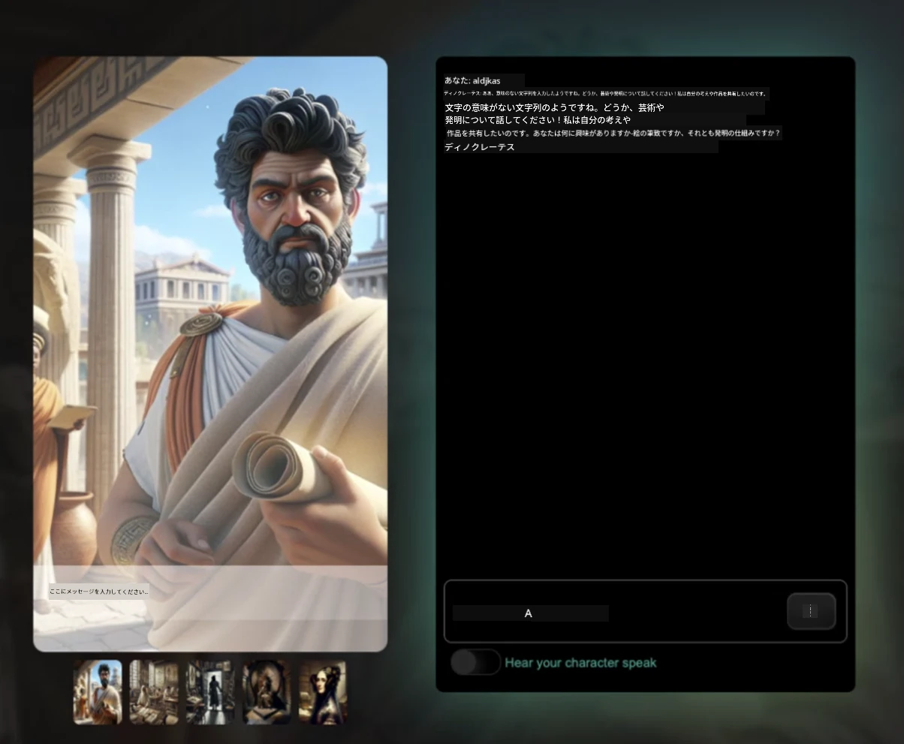
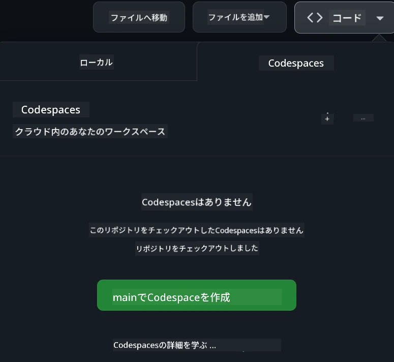

[](https://github.com/microsoft/Web-Dev-For-Beginners/blob/master/LICENSE)
[](https://GitHub.com/microsoft/Web-Dev-For-Beginners/graphs/contributors/)
[](https://GitHub.com/microsoft/Web-Dev-For-Beginners/issues/)
[](https://GitHub.com/microsoft/Web-Dev-For-Beginners/pulls/)
[](http://makeapullrequest.com) 

[](https://GitHub.com/microsoft/Web-Dev-For-Beginners/watchers/)
[](https://GitHub.com/microsoft/Web-Dev-For-Beginners/network/)
[](https://GitHub.com/microsoft/Web-Dev-For-Beginners/stargazers/)

[](https://discord.gg/nTYy5BXMWG)

# はじめてのウェブ開発 - カリキュラム

Microsoft Cloud Advocatesによる全12週間の包括的なコースでウェブ開発の基礎を学びましょう。24の各レッスンは、テラリウムやブラウザ拡張機能、宇宙ゲームといった実践的なプロジェクトを通じてJavaScript、CSS、HTMLを深く掘り下げます。クイズ、ディスカッション、実習課題に取り組みましょう。効果的なプロジェクトベースの教育法でスキルを向上させ、知識の定着を最大化します。今日からコーディングの旅を始めましょう！

Azure AI Foundry Discordコミュニティに参加しよう

[](https://discord.gg/nTYy5BXMWG)

以下の手順でこれらのリソースの利用を始めましょう：
1. **リポジトリをフォークする**：[](https://GitHub.com/microsoft/Web-Dev-For-Beginners/fork)をクリック
2. **リポジトリをクローンする**：`git clone https://github.com/microsoft/Web-Dev-For-Beginners.git`
3. [**Azure AI Foundry Discordに参加し、専門家や開発者仲間と出会う**](https://discord.com/invite/ByRwuEEgH4)

### 🌐 多言語対応

#### GitHub Actionsでサポート（自動化＆常に最新）

<!-- CO-OP TRANSLATOR LANGUAGES TABLE START -->
[Arabic](../ar/README.md) | [Bengali](../bn/README.md) | [Bulgarian](../bg/README.md) | [Burmese (Myanmar)](../my/README.md) | [Chinese (Simplified)](../zh-CN/README.md) | [Chinese (Traditional, Hong Kong)](../zh-HK/README.md) | [Chinese (Traditional, Macau)](../zh-MO/README.md) | [Chinese (Traditional, Taiwan)](../zh-TW/README.md) | [Croatian](../hr/README.md) | [Czech](../cs/README.md) | [Danish](../da/README.md) | [Dutch](../nl/README.md) | [Estonian](../et/README.md) | [Finnish](../fi/README.md) | [French](../fr/README.md) | [German](../de/README.md) | [Greek](../el/README.md) | [Hebrew](../he/README.md) | [Hindi](../hi/README.md) | [Hungarian](../hu/README.md) | [Indonesian](../id/README.md) | [Italian](../it/README.md) | [Japanese](./README.md) | [Kannada](../kn/README.md) | [Korean](../ko/README.md) | [Lithuanian](../lt/README.md) | [Malay](../ms/README.md) | [Malayalam](../ml/README.md) | [Marathi](../mr/README.md) | [Nepali](../ne/README.md) | [Nigerian Pidgin](../pcm/README.md) | [Norwegian](../no/README.md) | [Persian (Farsi)](../fa/README.md) | [Polish](../pl/README.md) | [Portuguese (Brazil)](../pt-BR/README.md) | [Portuguese (Portugal)](../pt-PT/README.md) | [Punjabi (Gurmukhi)](../pa/README.md) | [Romanian](../ro/README.md) | [Russian](../ru/README.md) | [Serbian (Cyrillic)](../sr/README.md) | [Slovak](../sk/README.md) | [Slovenian](../sl/README.md) | [Spanish](../es/README.md) | [Swahili](../sw/README.md) | [Swedish](../sv/README.md) | [Tagalog (Filipino)](../tl/README.md) | [Tamil](../ta/README.md) | [Telugu](../te/README.md) | [Thai](../th/README.md) | [Turkish](../tr/README.md) | [Ukrainian](../uk/README.md) | [Urdu](../ur/README.md) | [Vietnamese](../vi/README.md)

> **ローカルでクローンしたいですか？**
>
> このリポジトリには50以上の言語翻訳が含まれており、ダウンロードサイズが大幅に増加します。翻訳を含めずにクローンするには、スパースチェックアウトを使用してください：
>
> **Bash / macOS / Linux:**
> ```bash
> git clone --filter=blob:none --sparse https://github.com/microsoft/Web-Dev-For-Beginners.git
> cd Web-Dev-For-Beginners
> git sparse-checkout set --no-cone '/*' '!translations' '!translated_images'
> ```
>
> **CMD（Windows）:**
> ```cmd
> git clone --filter=blob:none --sparse https://github.com/microsoft/Web-Dev-For-Beginners.git
> cd Web-Dev-For-Beginners
> git sparse-checkout set --no-cone "/*" "!translations" "!translated_images"
> ```
>
> これにより、コースを完了するために必要なすべてがより高速なダウンロードで得られます。
<!-- CO-OP TRANSLATOR LANGUAGES TABLE END -->

**追加の翻訳言語を希望される場合は、[こちら](https://github.com/Azure/co-op-translator/blob/main/getting_started/supported-languages.md)をご覧ください**

[](https://open.vscode.dev/microsoft/Web-Dev-For-Beginners)

#### 🧑‍🎓 _学生の方ですか？_

[**Student Hubページ**](https://docs.microsoft.com/learn/student-hub/?WT.mc_id=academic-77807-sagibbon)へアクセスすると、初心者向けの教材、学生パック、無料の証明書バウチャー取得方法などが見つかります。このページをブックマークし、毎月コンテンツが更新されるので定期的にチェックしてください。

### 📣 お知らせ - 新しいGitHub Copilot Agentモードチャレンジが追加されました！

多くの章で「GitHub Copilot Agent Challenge 🚀」という新しいチャレンジが追加されています。これはGitHub CopilotとAgentモードを使って完了するチャレンジです。Agentモードを使ったことがない方は、テキスト生成だけでなく、ファイルの作成・編集やコマンドの実行なども可能な機能です。

### 📣 お知らせ - 生成AIを使った新プロジェクト

新しいAIアシスタントプロジェクトが追加されました。こちらの[プロジェクト](./9-chat-project/README.md)をチェックしてください。

### 📣 お知らせ - JavaScriptの生成AIに関する新カリキュラムがリリースされました

生成AIの新カリキュラムをお見逃しなく！

開始はこちら [https://aka.ms/genai-js-course](https://aka.ms/genai-js-course)


- 基礎からRAGまでカバーするレッスン
- GenAIとコンパニオンアプリで歴史上の人物と対話可能
- 楽しく引き込まれるストーリー、タイムトラベル体験！



各レッスンには課題、理解度チェック、チャレンジが用意されています。学習トピック例：
- プロンプトとプロンプトエンジニアリング
- テキストおよび画像アプリの生成
- 検索アプリ

開始はこちら [https://aka.ms/genai-js-course](https://aka.ms/genai-js-course)


## 🌱 はじめに

> **先生方へ**、このカリキュラムの使い方に関する[提案](for-teachers.md)を用意しています。ぜひ[ディスカッションフォーラム](https://github.com/microsoft/Web-Dev-For-Beginners/discussions/categories/teacher-corner)でフィードバックをお寄せください！

**[学習者の皆さん](https://aka.ms/student-page/?WT.mc_id=academic-77807-sagibbon)**、各レッスンは事前クイズから始め、講義資料の読解、様々なアクティビティの実施、終了後の確認用クイズへと進んでください。

学習経験を向上させるため、仲間とつながって一緒にプロジェクトに取り組みましょう！ディスカッションは[ディスカッションフォーラム](https://github.com/microsoft/Web-Dev-For-Beginners/discussions)で推奨しており、モデレーターが質問に対応します。

さらなる学習のために、追加教材がある[Microsoft Learn](https://learn.microsoft.com/users/wirelesslife/collections/p1ddcy5jwy0jkm?WT.mc_id=academic-77807-sagibbon)をぜひご利用ください。

### 📋 開発環境のセットアップ

このカリキュラムはすぐに使える開発環境を用意しています！開始時には[Codespace](https://github.com/features/codespaces/)（ブラウザベースでインストール不要の環境）で実行するか、お使いのコンピューター上で[Visual Studio Code](https://code.visualstudio.com/?WT.mc_id=academic-77807-sagibbon)などのテキストエディターを使って実行するか選べます。

#### リポジトリを作成する
作業を簡単に保存するため、自分のコピーのリポジトリを作成することをお勧めします。ページ上部の**Use this template**ボタンをクリックすると、自分のGitHubアカウントにカリキュラムのコピーが作成されます。

手順はこちら：
1. **リポジトリをフォークする**：ページ右上の「Fork」ボタンをクリックします。
2. **リポジトリをクローンする**：`git clone https://github.com/microsoft/Web-Dev-For-Beginners.git`

#### Codespaceでカリキュラムを実行する

作成したリポジトリのコピーで、**Code**ボタンをクリックし、**Open with Codespaces**を選択します。すると作業用の新しいCodespaceが作成されます。



#### お使いのコンピューターでカリキュラムを実行する

カリキュラムをローカルで実行するには、テキストエディター、ブラウザー、コマンドラインツールが必要です。最初のレッスン[プログラミング言語とツールの紹介](../../1-getting-started-lessons/1-intro-to-programming-languages)で、それぞれのツールの選択肢を説明しています。自分に合ったものを選びましょう。

お勧めは、[Visual Studio Code](https://code.visualstudio.com/?WT.mc_id=academic-77807-sagibbon)のエディター使用で、内蔵の[ターミナル](https://code.visualstudio.com/docs/terminal/basics/?WT.mc_id=academic-77807-sagibbon)が便利です。Visual Studio Codeは[こちら](https://code.visualstudio.com/?WT.mc_id=academic-77807-sagibbon)からダウンロードできます。
1. リポジトリをコンピューターにクローンします。これは **Code** ボタンをクリックしてURLをコピーすることで行えます：

    [CodeSpace](./images/createcodespace.png)

    次に、[Visual Studio Code](https://code.visualstudio.com/?WT.mc_id=academic-77807-sagibbon) 内の [Terminal](https://code.visualstudio.com/docs/terminal/basics/?WT.mc_id=academic-77807-sagibbon) を開き、コピーした `<your-repository-url>` を置き換えて次のコマンドを実行します：

    ```bash 
    git clone <your-repository-url>
    ```

2. Visual Studio Codeでフォルダーを開きます。これには **File** > **Open Folder** をクリックし、先ほどクローンしたフォルダーを選択します。


>  推奨されるVisual Studio Code拡張機能：
>
> * [Live Server](https://marketplace.visualstudio.com/items?itemName=ritwickdey.LiveServer&WT.mc_id=academic-77807-sagibbon) - Visual Studio Code内でHTMLページをプレビューするため
> * [Copilot](https://marketplace.visualstudio.com/items?itemName=GitHub.copilot&WT.mc_id=academic-77807-sagibbon) - コードを書くのを速く手助けするため

## 📂 各レッスンには次が含まれます：

- 任意のスケッチノート
- 任意の補足ビデオ
- 事前レッスンのウォームアップクイズ
- 書かれたレッスン
- プロジェクトベースのレッスンの場合、プロジェクトの作り方の手順付きガイド
- 理解度チェック
- チャレンジ
- 補足読書
- 課題
- [ポストレッスンクイズ](https://ff-quizzes.netlify.app/web/)

> **クイズについての注意**：すべてのクイズはQuiz-appフォルダーに収められており、合計48の3問クイズがあります。これらは[こちら](https://ff-quizzes.netlify.app/web/)から利用可能で、クイズアプリはローカルで実行するかAzureにデプロイできます。`quiz-app`フォルダー内の指示に従ってください。

## 🗃️ レッスン一覧

|     |                       プロジェクト名                       |                            学習内容                             | 学習目標                                                                                                                 |                                                         関連レッスン                                                          |         著者          |
| :-: | :------------------------------------------------------: | :--------------------------------------------------------------------: | ----------------------------------------------------------------------------------------------------------------------------------- | :----------------------------------------------------------------------------------------------------------------------------: | :---------------------: |
| 01  |                     Getting Started                      |           プログラミングの紹介と開発ツールの基礎           | 主要なプログラミング言語の基本的な基礎知識と、プロの開発者が仕事に使うソフトウェアについて学ぶ | [プログラミング言語と開発ツールの紹介](./1-getting-started-lessons/1-intro-to-programming-languages/README.md) |         Jasmine         |
| 02  |                     Getting Started                      |             GitHubの基本、チームでの作業を含む             | プロジェクトでGitHubを利用する方法とコードベースで他者と協力する方法                                                    |                            [GitHubの紹介](./1-getting-started-lessons/2-github-basics/README.md)                             |          Floor          |
| 03  |                     Getting Started                      |                             アクセシビリティ                              | ウェブアクセシビリティの基本を学ぶ                                                                                               |                       [アクセシビリティの基礎](./1-getting-started-lessons/3-accessibility/README.md)                       |       Christopher       |
| 04  |                        JS Basics                         |                         JavaScriptのデータ型                          | JavaScriptのデータ型の基本を学ぶ                                                                                                 |                                       [データ型](./2-js-basics/1-data-types/README.md)                                        |         Jasmine         |
| 05  |                        JS Basics                         |                         関数とメソッド                          | アプリケーションのロジックの流れを管理する関数とメソッドについて学ぶ                                                             |                              [関数とメソッド](./2-js-basics/2-functions-methods/README.md)                               | Jasmine and Christopher |
| 06  |                        JS Basics                         |                        JSでの条件分岐                        | コード内で条件を作る決定手法について学ぶ                                                           |                                 [条件分岐](./2-js-basics/3-making-decisions/README.md)                                  |         Jasmine         |
| 07  |                        JS Basics                         |                            配列とループ                            | JavaScriptで配列やループを使ってデータを操作する方法                                                                                 |                                   [配列とループ](./2-js-basics/4-arrays-loops/README.md)                                    |         Jasmine         |
| 08  |       [Terrarium](./3-terrarium/solution/README.md)       |                            実践的HTML                            | オンラインテラリウムを作成するためのHTMLを構築し、レイアウトを重視                                                         |                                 [HTMLの紹介](./3-terrarium/1-intro-to-html/README.md)                                 |           Jen           |
| 09  |       [Terrarium](./3-terrarium/solution/README.md)       |                            実践的CSS                             | オンラインテラリウムのスタイリング用CSSを構築し、ページのレスポンシブ化などCSSの基本を学ぶ                     |                                  [CSSの紹介](./3-terrarium/2-intro-to-css/README.md)                                  |           Jen           |
| 10  |            [Terrarium](./3-terrarium/solution/README.md)            |                 JavaScriptのクロージャーとDOM操作                  | ドラッグ＆ドロップインターフェースとして機能するテラリウムのJavaScriptを構築し、クロージャーとDOM操作に注力             |                  [クロージャーとDOM操作](./3-terrarium/3-intro-to-DOM-and-closures/README.md)                   |           Jen           |
| 11  |          [Typing Game](./4-typing-game/solution/README.md)          |                          タイピングゲームを作る                           | キーボードイベントを利用してJavaScriptアプリのロジックを操作する方法                                                          |                                [イベント駆動プログラミング](./4-typing-game/typing-game/README.md)                                |       Christopher       |
| 12  | [Green Browser Extension](./5-browser-extension/solution/README.md) |                         ブラウザの仕組み                          | ブラウザの動作や歴史を学び、ブラウザー拡張機能の最初の要素をスキャフォールドする方法                               |                               [ブラウザについて](./5-browser-extension/1-about-browsers/README.md)                                |           Jen           |
| 13  | [Green Browser Extension](./5-browser-extension/solution/README.md) | フォーム構築、API呼び出し、ローカルストレージ変数の利用 | 変数をローカルストレージに保存しAPIを呼び出すブラウザー拡張機能のJavaScript要素を作成                      |                [API、フォーム、ローカルストレージ](./5-browser-extension/2-forms-browsers-local-storage/README.md)                 |           Jen           |
| 14  | [Green Browser Extension](./5-browser-extension/solution/README.md) |          ブラウザのバックグラウンドプロセス、ウェブパフォーマンス          | 拡張機能のアイコン管理にブラウザのバックグラウンドプロセスを使い、ウェブパフォーマンスと最適化手法を学ぶ   |             [バックグラウンドタスクとパフォーマンス](./5-browser-extension/3-background-tasks-and-performance/README.md)              |           Jen           |
| 15  |           [Space Game](./6-space-game/solution/README.md)           |             JavaScriptによる高度なゲーム開発             | クラスとコンポジションの継承およびPub/Subパターンについて学び、ゲーム開発の準備をする              |                      [高度なゲーム開発の紹介](./6-space-game/1-introduction/README.md)                       |          Chris          |
| 16  |           [Space Game](./6-space-game/solution/README.md)           |                           Canvasへの描画                            | 画面に要素を描画するためのCanvas APIについて学ぶ                                                                       |                                [Canvasへの描画](./6-space-game/2-drawing-to-canvas/README.md)                                |          Chris          |
| 17  |           [Space Game](./6-space-game/solution/README.md)           |                   画面上での要素の動かし方                    | 要素に動きを与えるためのデカルト座標系とCanvas APIの使い方を学ぶ                                            |                           [要素の移動](./6-space-game/3-moving-elements-around/README.md)                           |          Chris          |
| 18  |           [Space Game](./6-space-game/solution/README.md)           |                          衝突検知                           | 要素を衝突させ、互いに反応させ、パフォーマンスを維持するためのクールダウン機能を提供する方法    |                              [衝突検知](./6-space-game/4-collision-detection/README.md)                              |          Chris          |
| 19  |           [Space Game](./6-space-game/solution/README.md)           |                             得点管理                              | ゲームの状態とパフォーマンスに基づいた数学的計算を行う                                                                |                                    [得点管理](./6-space-game/5-keeping-score/README.md)                                    |          Chris          |
| 20  |           [Space Game](./6-space-game/solution/README.md)           |                     ゲームの終了と再開                     | アセットのクリーンアップと変数値のリセットを含む、ゲームの終了と再開方法について学ぶ                              |                                [終了条件](./6-space-game/6-end-condition/README.md)                                 |          Chris          |
| 21  |         [Banking App](./7-bank-project/solution/README.md)          |                 ウェブアプリのHTMLテンプレートとルーティング                 | 複数ページのウェブサイト構造のスキャフォールディングをルーティングとHTMLテンプレートを使って学ぶ                             |                            [HTMLテンプレートとルーティング](./7-bank-project/1-template-route/README.md)                             |          Yohan          |
| 22  |         [Banking App](./7-bank-project/solution/README.md)          |                  ログインと登録フォームの構築                   | フォーム作成およびバリデーション処理について学ぶ                                                                          |                                           [フォーム](./7-bank-project/2-forms/README.md)                                           |          Yohan          |
| 23  |         [Banking App](./7-bank-project/solution/README.md)          |                   データ取得と使用の方法                   | アプリ内でのデータの流れ、取得、保存、破棄の方法を学ぶ                                                 |                                            [データ](./7-bank-project/3-data/README.md)                                            |          Yohan          |
| 24  |         [Banking App](./7-bank-project/solution/README.md)          |                      ステート管理の概念                      | アプリがステートを保持し、プログラムで管理する方法を学ぶ                                                              |                                [ステート管理](./7-bank-project/4-state-management/README.md)                                |          Yohan          |
| 25 | [Browser/VScode Code](../../8-code-editor) | VScodeの使い方 | コードエディタの使い方を学ぶ| [VScodeコードエディタの使い方](./8-code-editor/1-using-a-code-editor/README.md) | Chris |
| 26 | [AI Assistants](./9-chat-project/README.md) | AIを使う | オリジナルのAIアシスタントの作り方を学ぶ | [AIアシスタントプロジェクト](./9-chat-project/README.md) | Chris |

## 🏫 教育方針

当カリキュラムは次の2つの主要な教育原則を基に設計されています：
* プロジェクトベースの学習
* 頻繁なクイズ実施

プログラムはJavaScript、HTML、CSSの基本と、今日のウェブ開発者が使う最新のツールや技術を教えます。学習者はタイピングゲーム、バーチャルテラリウム、環境配慮型ブラウザー拡張機能、スペースインベーダースタイルのゲーム、ビジネス向け銀行アプリ構築を通じて実践経験を積むことができます。シリーズの終了時にはウェブ開発の確固たる理解が得られます。

> 🎓 このカリキュラムの最初の数レッスンはMicrosoft Learnの[Learn Path](https://docs.microsoft.com/learn/paths/web-development-101/?WT.mc_id=academic-77807-sagibbon)として受講可能です！

内容をプロジェクトに沿わせることで学習者の興味を引きつけ、概念の定着効果を高めます。また、JavaScriptの基本を紹介するいくつかのスターターレッスンと、“[Beginners Series to: JavaScript](https://channel9.msdn.com/Series/Beginners-Series-to-JavaScript/?WT.mc_id=academic-77807-sagibbon)”の動画シリーズ（本カリキュラムの著者の一部も関わっている）も組み合わせています。

さらに、クラス前の低負荷クイズで学習者の学習意欲を高め、クラス後の2回目のクイズで理解の定着を促します。このカリキュラムは柔軟かつ楽しく受講でき、全体または一部を選んで学ぶことができます。プロジェクトは小さなものから始まり、12週間コースの終わりにかけて徐々に複雑になります。

フレームワーク導入をあえて避けているため、まずはウェブ開発者としての基本スキルを身につけることに集中できます。次のステップとしては別の動画シリーズ「[Beginner Series to: Node.js](https://channel9.msdn.com/Series/Beginners-Series-to-Nodejs/?WT.mc_id=academic-77807-sagibbon)」を通じてNode.jsを学ぶことが推奨されます。

> 当プロジェクトの[行動規範](CODE_OF_CONDUCT.md)と[貢献ガイド](CONTRIBUTING.md)をご覧ください。建設的なフィードバックを歓迎します！

## 🧭 オフラインアクセス

[Docsify](https://docsify.js.org/#/)を使うことで、このドキュメントをオフラインで利用できます。このリポジトリをフォークし、ローカルマシンに[Docsifyをインストール](https://docsify.js.org/#/quickstart)した後、リポジトリのルートフォルダーで `docsify serve` コマンドを実行します。ウェブサイトはローカルホストのポート3000で提供されます: `localhost:3000`。

## 📘 PDF
すべてのレッスンのPDFは、[こちら](https://microsoft.github.io/Web-Dev-For-Beginners/pdf/readme.pdf)で入手できます。


## 🎒 その他のコース

私たちのチームはその他のコースも制作しています！ぜひご覧ください：

<!-- CO-OP TRANSLATOR OTHER COURSES START -->
### LangChain
[](https://aka.ms/langchain4j-for-beginners)
[](https://aka.ms/langchainjs-for-beginners?WT.mc_id=m365-94501-dwahlin)
[](https://github.com/microsoft/langchain-for-beginners?WT.mc_id=m365-94501-dwahlin)
---

### Azure / Edge / MCP / Agents
[](https://github.com/microsoft/AZD-for-beginners?WT.mc_id=academic-105485-koreyst)
[](https://github.com/microsoft/edgeai-for-beginners?WT.mc_id=academic-105485-koreyst)
[](https://github.com/microsoft/mcp-for-beginners?WT.mc_id=academic-105485-koreyst)
[](https://github.com/microsoft/ai-agents-for-beginners?WT.mc_id=academic-105485-koreyst)

---
 
### ジェネレーティブAIシリーズ
[](https://github.com/microsoft/generative-ai-for-beginners?WT.mc_id=academic-105485-koreyst)
[-9333EA?style=for-the-badge&labelColor=E5E7EB&color=9333EA)](https://github.com/microsoft/Generative-AI-for-beginners-dotnet?WT.mc_id=academic-105485-koreyst)
[-C084FC?style=for-the-badge&labelColor=E5E7EB&color=C084FC)](https://github.com/microsoft/generative-ai-for-beginners-java?WT.mc_id=academic-105485-koreyst)
[-E879F9?style=for-the-badge&labelColor=E5E7EB&color=E879F9)](https://github.com/microsoft/generative-ai-with-javascript?WT.mc_id=academic-105485-koreyst)

---
 
### コア学習
[](https://aka.ms/ml-beginners?WT.mc_id=academic-105485-koreyst)
[](https://aka.ms/datascience-beginners?WT.mc_id=academic-105485-koreyst)
[](https://aka.ms/ai-beginners?WT.mc_id=academic-105485-koreyst)
[](https://github.com/microsoft/Security-101?WT.mc_id=academic-96948-sayoung)
[](https://aka.ms/webdev-beginners?WT.mc_id=academic-105485-koreyst)
[](https://aka.ms/iot-beginners?WT.mc_id=academic-105485-koreyst)
[](https://github.com/microsoft/xr-development-for-beginners?WT.mc_id=academic-105485-koreyst)

---
 
### Copilotシリーズ
[](https://aka.ms/GitHubCopilotAI?WT.mc_id=academic-105485-koreyst)
[](https://github.com/microsoft/mastering-github-copilot-for-dotnet-csharp-developers?WT.mc_id=academic-105485-koreyst)
[](https://github.com/microsoft/CopilotAdventures?WT.mc_id=academic-105485-koreyst)
<!-- CO-OP TRANSLATOR OTHER COURSES END -->

## ヘルプを得るには

AIアプリの構築で行き詰まったり質問がある場合は、MCPに関する議論に参加して、仲間の学習者や経験豊富な開発者と交流しましょう。質問歓迎で知識を自由に共有するサポートコミュニティです。

[](https://discord.gg/nTYy5BXMWG)

製品のフィードバックや構築中のエラーについては、こちらをご覧ください：

[](https://aka.ms/foundry/forum)

## ライセンス

このリポジトリはMITライセンスの下でライセンスされています。詳細は[LICENSE](../../LICENSE)ファイルをご覧ください。

---

<!-- CO-OP TRANSLATOR DISCLAIMER START -->
**免責事項**：
本書類はAI翻訳サービス「Co-op Translator」(https://github.com/Azure/co-op-translator) を使用して翻訳されました。正確性の向上に努めておりますが、自動翻訳には誤りや不正確な箇所が含まれる可能性があります。正式な情報源は原文の原語版となります。重要な情報については、専門の翻訳者による人力翻訳を推奨します。本翻訳の利用により発生した誤解や誤訳について、一切の責任を負いかねます。
<!-- CO-OP TRANSLATOR DISCLAIMER END -->