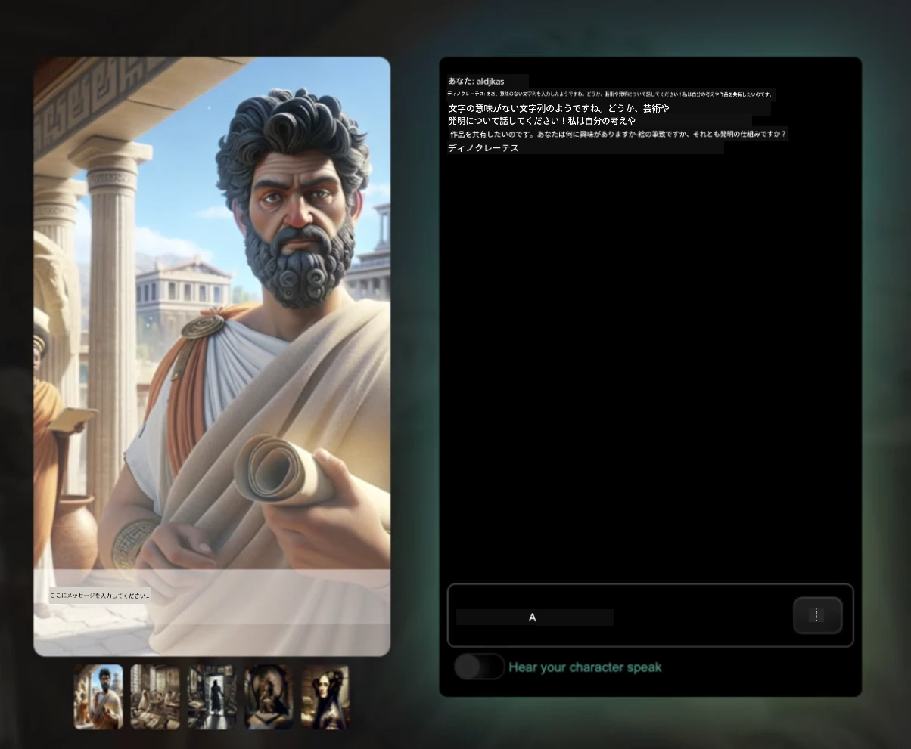
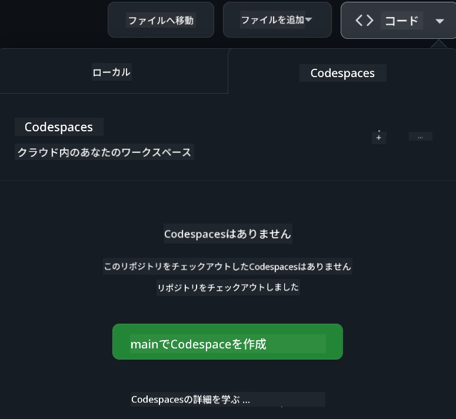

[](https://github.com/microsoft/Web-Dev-For-Beginners/blob/master/LICENSE)
[](https://GitHub.com/microsoft/Web-Dev-For-Beginners/graphs/contributors/)
[](https://GitHub.com/microsoft/Web-Dev-For-Beginners/issues/)
[](https://GitHub.com/microsoft/Web-Dev-For-Beginners/pulls/)
[](http://makeapullrequest.com) 

[](https://GitHub.com/microsoft/Web-Dev-For-Beginners/watchers/)
[](https://GitHub.com/microsoft/Web-Dev-For-Beginners/network/)
[](https://GitHub.com/microsoft/Web-Dev-For-Beginners/stargazers/)

[](https://discord.gg/nTYy5BXMWG)

# Web Development for Beginners - カリキュラム

Microsoft Cloud Advocatesによる12週間の包括的なコースでウェブ開発の基礎を学びましょう。全24レッスンでは、テラリウム、ブラウザー拡張機能、宇宙ゲームなどの実践的なプロジェクトを通してJavaScript、CSS、HTMLを深く掘り下げます。クイズやディスカッション、実践的な課題に参加してスキルを磨き、効果的なプロジェクトベースの教育法で知識の定着を最適化しましょう。今すぐコーディングの旅を始めましょう！

Azure AI Foundry Discordに参加して、専門家や他の開発者と交流しましょう。

[](https://discord.gg/nTYy5BXMWG)

このリソースを使い始めるには、以下の手順を実行してください:
1. <strong>リポジトリをフォーク</strong>: [](https://GitHub.com/microsoft/Web-Dev-For-Beginners/fork)
2. <strong>リポジトリをクローン</strong>:   `git clone https://github.com/microsoft/Web-Dev-For-Beginners.git`
3. [**Azure AI Foundry Discordに参加し、専門家や他の開発者と交流する**](https://discord.com/invite/ByRwuEEgH4)

### 🌐 多言語サポート

#### GitHub Action を使ったサポート（自動かつ常に最新）

<!-- CO-OP TRANSLATOR LANGUAGES TABLE START -->
[Arabic](../ar/README.md) | [Bengali](../bn/README.md) | [Bulgarian](../bg/README.md) | [Burmese (Myanmar)](../my/README.md) | [Chinese (Simplified)](../zh-CN/README.md) | [Chinese (Traditional, Hong Kong)](../zh-HK/README.md) | [Chinese (Traditional, Macau)](../zh-MO/README.md) | [Chinese (Traditional, Taiwan)](../zh-TW/README.md) | [Croatian](../hr/README.md) | [Czech](../cs/README.md) | [Danish](../da/README.md) | [Dutch](../nl/README.md) | [Estonian](../et/README.md) | [Finnish](../fi/README.md) | [French](../fr/README.md) | [German](../de/README.md) | [Greek](../el/README.md) | [Hebrew](../he/README.md) | [Hindi](../hi/README.md) | [Hungarian](../hu/README.md) | [Indonesian](../id/README.md) | [Italian](../it/README.md) | [Japanese](./README.md) | [Kannada](../kn/README.md) | [Khmer](../km/README.md) | [Korean](../ko/README.md) | [Lithuanian](../lt/README.md) | [Malay](../ms/README.md) | [Malayalam](../ml/README.md) | [Marathi](../mr/README.md) | [Nepali](../ne/README.md) | [Nigerian Pidgin](../pcm/README.md) | [Norwegian](../no/README.md) | [Persian (Farsi)](../fa/README.md) | [Polish](../pl/README.md) | [Portuguese (Brazil)](../pt-BR/README.md) | [Portuguese (Portugal)](../pt-PT/README.md) | [Punjabi (Gurmukhi)](../pa/README.md) | [Romanian](../ro/README.md) | [Russian](../ru/README.md) | [Serbian (Cyrillic)](../sr/README.md) | [Slovak](../sk/README.md) | [Slovenian](../sl/README.md) | [Spanish](../es/README.md) | [Swahili](../sw/README.md) | [Swedish](../sv/README.md) | [Tagalog (Filipino)](../tl/README.md) | [Tamil](../ta/README.md) | [Telugu](../te/README.md) | [Thai](../th/README.md) | [Turkish](../tr/README.md) | [Ukrainian](../uk/README.md) | [Urdu](../ur/README.md) | [Vietnamese](../vi/README.md)

> **ローカルでクローンしたいですか？**
>
> このリポジトリには50以上の言語翻訳が含まれており、ダウンロードサイズが大きくなっています。翻訳を除いてクローンするにはスパースチェックアウトを使用してください:
>
> **Bash / macOS / Linux:**
> ```bash
> git clone --filter=blob:none --sparse https://github.com/microsoft/Web-Dev-For-Beginners.git
> cd Web-Dev-For-Beginners
> git sparse-checkout set --no-cone '/*' '!translations' '!translated_images'
> ```
>
> **CMD (Windows):**
> ```cmd
> git clone --filter=blob:none --sparse https://github.com/microsoft/Web-Dev-For-Beginners.git
> cd Web-Dev-For-Beginners
> git sparse-checkout set --no-cone "/*" "!translations" "!translated_images"
> ```
>
> これにより、はるかに高速にコースを完了するために必要なすべてが手に入ります。
<!-- CO-OP TRANSLATOR LANGUAGES TABLE END -->

**追加の翻訳が欲しい場合は、対応言語リストを[こちら](https://github.com/Azure/co-op-translator/blob/main/getting_started/supported-languages.md)でご覧ください。**

[](https://open.vscode.dev/microsoft/Web-Dev-For-Beginners)

#### 🧑‍🎓 _学生ですか？_

[**Student Hub ページ**](https://docs.microsoft.com/learn/student-hub/?WT.mc_id=academic-77807-sagibbon)をご覧ください。初心者向けリソースや学生パック、無料の証明書バウチャー取得方法もあります。毎月内容が入れ替わるので、このページのブックマークと定期チェックをおすすめします。

### 📣 お知らせ - 新しい GitHub Copilot Agent モードのチャレンジをクリアしよう！

新しいチャレンジ「GitHub Copilot Agent Challenge 🚀」がほとんどの章に追加されました。GitHub CopilotとAgentモードを使ってクリアする新しいチャレンジです。Agentモードはテキスト生成だけでなく、ファイル作成・編集やコマンド実行なども可能です。

### 📣 お知らせ - _生成AIを使って作る新しいプロジェクト_

新しいAIアシスタントプロジェクトが追加されました。ぜひご覧ください。[プロジェクト](./9-chat-project/README.md)

### 📣 お知らせ - _JavaScript向け生成AIの新カリキュラムを公開しました_

新しい生成AIカリキュラムをお見逃しなく！

始めるにはこちらをご覧ください: [https://aka.ms/genai-js-course](https://aka.ms/genai-js-course)


- 基礎からRAGまでカバーするレッスン
- GenAIと補助アプリを使った歴史上の人物との対話
- 楽しく魅力的なストーリーでタイムトラベル！



各レッスンには課題、知識チェック、チャレンジがあり、以下のトピックを学びます:
- プロンプトとプロンプトエンジニアリング
- テキストおよび画像アプリの生成
- 検索アプリ

始めるにはこちらを訪れてください: [https://aka.ms/genai-js-course](https://aka.ms/genai-js-course)


## 🌱 はじめに

> <strong>先生方へ</strong>、このカリキュラムの活用方法について[いくつかの提案](for-teachers.md)を含めています。ぜひ[ディスカッションフォーラム](https://github.com/microsoft/Web-Dev-For-Beginners/discussions/categories/teacher-corner)でご意見をお聞かせください！

**[学習者の皆さん](https://aka.ms/student-page/?WT.mc_id=academic-77807-sagibbon)**、各レッスンでは講義前クイズから始め、講義資料を読んでさまざまな活動を行い、最後に講義後クイズで理解度をチェックしましょう。

学習体験を高めるために、仲間と繋がって一緒にプロジェクトに取り組みましょう！ディスカッションは[ディスカッションフォーラム](https://github.com/microsoft/Web-Dev-For-Beginners/discussions)で推奨しており、モデレーターチームが質問に答えます。

さらなる学習のために、追加の教材を提供する[Microsoft Learn](https://learn.microsoft.com/users/wirelesslife/collections/p1ddcy5jwy0jkm?WT.mc_id=academic-77807-sagibbon)をぜひご利用ください。

### 📋 環境構築

このカリキュラムはすぐに使える開発環境が用意されています！開始時に[Codespace](https://github.com/features/codespaces/)（ブラウザー上でインストール不要の環境）を使うか、[Visual Studio Code](https://code.visualstudio.com/?WT.mc_id=academic-77807-sagibbon)などのテキストエディターを使いローカルのパソコンで実行する方法を選べます。

#### リポジトリの作成
作業を簡単に保存できるよう、このリポジトリのコピーを作成することをおすすめします。ページ上部の<strong>Use this template</strong>ボタンをクリックすると、あなたのGitHubアカウントにカリキュラムのコピーが入った新しいリポジトリが作成されます。

手順は以下の通りです:
1. <strong>リポジトリをフォーク</strong>: ページ右上の「Fork」ボタンをクリック。
2. <strong>リポジトリをクローン</strong>:   `git clone https://github.com/microsoft/Web-Dev-For-Beginners.git`

#### Codespaceでカリキュラムを実行

作成したリポジトリのコピーで、<strong>Code</strong>ボタンをクリックし<strong>Open with Codespaces</strong>を選択してください。作業用の新しいCodespaceが作成されます。



#### ローカル環境でカリキュラムを実行

ローカルで実行するにはテキストエディター、ブラウザ、コマンドラインツールが必要です。最初のレッスン、[プログラミング言語とツールの紹介](../../1-getting-started-lessons/1-intro-to-programming-languages)で、それぞれのツールの選択肢を案内します。

おすすめはエディターに[Visual Studio Code](https://code.visualstudio.com/?WT.mc_id=academic-77807-sagibbon)を使うことで、組み込みの[ターミナル](https://code.visualstudio.com/docs/terminal/basics/?WT.mc_id=academic-77807-sagibbon)も備わっています。Visual Studio Codeは[こちら](https://code.visualstudio.com/?WT.mc_id=academic-77807-sagibbon)からダウンロード可能です。
1. リポジトリをコンピューターにクローンします。**Code** ボタンをクリックしてURLをコピーしてください：

    [CodeSpace](./images/createcodespace.png)

    次に、[Visual Studio Code](https://code.visualstudio.com/?WT.mc_id=academic-77807-sagibbon)の[Terminal](https://code.visualstudio.com/docs/terminal/basics/?WT.mc_id=academic-77807-sagibbon)を開き、以下のコマンドを実行します。`<your-repository-url>`はコピーしたURLに置き換えてください：

    ```bash 
    git clone <your-repository-url>
    ```

2. Visual Studio Codeでフォルダーを開きます。**File** > <strong>Open Folder</strong>をクリックし、先ほどクローンしたフォルダーを選択してください。


>  推奨Visual Studio Code拡張機能：
>
> * [Live Server](https://marketplace.visualstudio.com/items?itemName=ritwickdey.LiveServer&WT.mc_id=academic-77807-sagibbon) - Visual Studio Code内でHTMLページをプレビューするため
> * [Copilot](https://marketplace.visualstudio.com/items?itemName=GitHub.copilot&WT.mc_id=academic-77807-sagibbon) - コード作成を効率化するため

## 📂 各レッスンには以下が含まれます：

- オプションのスケッチノート
- オプションの補足ビデオ
- レッスン前のウォームアップクイズ
- テキストレッスン
- プロジェクトベースのレッスンでは、プロジェクトを構築する手順ガイド
- 知識チェック
- チャレンジ
- 補足読書
- 課題
- [レッスン後のクイズ](https://ff-quizzes.netlify.app/web/)

> <strong>クイズについての注意</strong>：全てのクイズはQuiz-appフォルダ内にあります。全48クイズ、それぞれ３問です。クイズは[こちら](https://ff-quizzes.netlify.app/web/)で利用可能で、クイズアプリはローカルで実行するかAzureにデプロイ可能です。`quiz-app`フォルダ内の指示に従ってください。

## 🗃️ レッスンリスト

|     |                       プロジェクト名                        |                            教える概念                             | 学習目標                                                                                                                     |                                                         リンクされたレッスン                                                          |         作成者          |
| :-: | :---------------------------------------------------------: | :----------------------------------------------------------------: | ---------------------------------------------------------------------------------------------------------------------------- | :------------------------------------------------------------------------------------------------------------------------------: | :---------------------: |
| 01  |                     Getting Started                        |           プログラミング入門とツールの基礎                         | 多くのプログラミング言語の基本的な仕組みとプロの開発者が仕事で使うソフトウェアについて学ぶ                                      | [Intro to Programming Languages and Tools of the Trade](./1-getting-started-lessons/1-intro-to-programming-languages/README.md) |         Jasmine         |
| 02  |                     Getting Started                        |             GitHubの基礎、チームでの作業を含む                    | プロジェクトでGitHubを使う方法、コードベースで他者と協働する方法                                                               |                            [Intro to GitHub](./1-getting-started-lessons/2-github-basics/README.md)                             |          Floor          |
| 03  |                     Getting Started                        |                             アクセシビリティ                         | ウェブアクセシビリティの基本を学ぶ                                                                                           |                       [Accessibility Fundamentals](./1-getting-started-lessons/3-accessibility/README.md)                       |       Christopher       |
| 04  |                        JS Basics                           |                         JavaScriptのデータ型                         | JavaScriptのデータ型の基本                                                                                                   |                                       [Data Types](./2-js-basics/1-data-types/README.md)                                        |         Jasmine         |
| 05  |                        JS Basics                           |                      関数とメソッド                                   | アプリケーションのロジックフローを管理するための関数とメソッドについて学ぶ                                                       |                              [Functions and Methods](./2-js-basics/2-functions-methods/README.md)                               | Jasmine and Christopher |
| 06  |                        JS Basics                           |                        JSでの意思決定                                | コード内で条件を作成する意思決定の方法を学ぶ                                                                                   |                                 [Making Decisions](./2-js-basics/3-making-decisions/README.md)                                  |         Jasmine         |
| 07  |                        JS Basics                           |                          配列とループ                                 | JavaScriptで配列とループを使ったデータ処理                                                                                     |                                   [Arrays and Loops](./2-js-basics/4-arrays-loops/README.md)                                    |         Jasmine         |
| 08  |       [Terrarium](./3-terrarium/solution/README.md)       |                            HTML実践                                   | オンラインテラリウム作成のためのHTMLを構築、レイアウト構築に注力                                                              |                                 [Introduction to HTML](./3-terrarium/1-intro-to-html/README.md)                                 |           Jen           |
| 09  |       [Terrarium](./3-terrarium/solution/README.md)       |                            CSS実践                                    | オンラインテラリウムをスタイル設定するCSSを作成、ページをレスポンシブにする基本を含む                                          |                                  [Introduction to CSS](./3-terrarium/2-intro-to-css/README.md)                                  |           Jen           |
| 10  |            [Terrarium](./3-terrarium/solution/README.md)            |                 JavaScriptクロージャー、DOM操作                      | テラリウムをドラッグ＆ドロップインターフェースとして動作させるJavaScriptを構築。クロージャーとDOM操作に注力                    |                  [JavaScript Closures, DOM manipulation](./3-terrarium/3-intro-to-DOM-and-closures/README.md)                   |           Jen           |
| 11  |          [Typing Game](./4-typing-game/solution/README.md)          |                          タイピングゲームの構築                      | キーボードイベントを使ってJavaScriptアプリのロジックを動かす方法を学ぶ                                                          |                                [Event-Driven Programming](./4-typing-game/typing-game/README.md)                                |       Christopher       |
| 12  | [Green Browser Extension](./5-browser-extension/solution/README.md) |                         ブラウザの動作                               | ブラウザの動作、歴史、ブラウザ拡張機能の最初の要素を作成する方法を学ぶ                                                         |                               [About Browsers](./5-browser-extension/1-about-browsers/README.md)                                |           Jen           |
| 13  | [Green Browser Extension](./5-browser-extension/solution/README.md) | フォームの構築、API呼び出し、ローカルストレージへの変数保存          | APIを呼び出すブラウザ拡張機能のJavaScript要素を構築、ローカルストレージに保存した変数を使用                                        |                [APIs, Forms, and Local Storage](./5-browser-extension/2-forms-browsers-local-storage/README.md)                 |           Jen           |
| 14  | [Green Browser Extension](./5-browser-extension/solution/README.md) |     ブラウザのバックグラウンド処理とウェブパフォーマンス             | ブラウザのバックグラウンド処理で拡張のアイコンを管理し、ウェブパフォーマンスと最適化を学ぶ                                     |             [Background Tasks and Performance](./5-browser-extension/3-background-tasks-and-performance/README.md)              |           Jen           |
| 15  |           [Space Game](./6-space-game/solution/README.md)           |     JavaScriptでのより高度なゲーム開発                              | クラスとコンポジションの両方を使った継承とPub/Subパターンについて学び、ゲーム開発に備える                                        |                      [Introduction to Advanced Game Development](./6-space-game/1-introduction/README.md)                       |          Chris          |
| 16  |           [Space Game](./6-space-game/solution/README.md)           |                      Canvasへの描画                                    | スクリーンへの描画に使われるCanvas APIについて学ぶ                                                                              |                                [Drawing to Canvas](./6-space-game/2-drawing-to-canvas/README.md)                                |          Chris          |
| 17  |           [Space Game](./6-space-game/solution/README.md)           |                     画面上の要素の移動                                | カルテシアン座標とCanvas APIを使って要素に動きを付ける方法を学ぶ                                                               |                           [Moving Elements Around](./6-space-game/3-moving-elements-around/README.md)                           |          Chris          |
| 18  |           [Space Game](./6-space-game/solution/README.md)           |                     衝突判定                                         | キー押下を使った要素同士の衝突判定と反応を作り、ゲームのパフォーマンス用のクールダウン機能を提供                                |                              [Collision Detection](./6-space-game/4-collision-detection/README.md)                              |          Chris          |
| 19  |           [Space Game](./6-space-game/solution/README.md)           |                            スコア管理                                | ゲームの状態やパフォーマンスに基づいた数学的計算を行う                                                                           |                                    [Keeping Score](./6-space-game/5-keeping-score/README.md)                                    |          Chris          |
| 20  |           [Space Game](./6-space-game/solution/README.md)           |                      ゲームの終了と再スタート                         | ゲームの終了と再スタートについて学び、アセットのクリーンアップや変数のリセットを含む                                            |                                [The Ending Condition](./6-space-game/6-end-condition/README.md)                                 |          Chris          |
| 21  |         [Banking App](./7-bank-project/solution/README.md)          |          WebアプリのHTMLテンプレートとルート                           | ルーティングとHTMLテンプレートを使い、マルチページWebサイトの骨組みの作成方法を学ぶ                                              |                            [HTML Templates and Routes](./7-bank-project/1-template-route/README.md)                             |          Yohan          |
| 22  |         [Banking App](./7-bank-project/solution/README.md)          |              ログインと登録フォームの構築                            | フォーム構築と検証ルーチンの処理について学ぶ                                                                                     |                                           [Forms](./7-bank-project/2-forms/README.md)                                           |          Yohan          |
| 23  |         [Banking App](./7-bank-project/solution/README.md)          |                   データの取得と使用方法                             | アプリ内でのデータの流れ、取得、格納、破棄方法を学ぶ                                                                             |                                            [Data](./7-bank-project/3-data/README.md)                                            |          Yohan          |
| 24  |         [Banking App](./7-bank-project/solution/README.md)          |                      ステート管理の概念                              | アプリが状態を保持する方法とプログラム的な管理方法を学ぶ                                                                         |                                [State Management](./7-bank-project/4-state-management/README.md)                                |          Yohan          |
| 25 | [Browser/VScode Code](../../8-code-editor) | VScodeの操作 | コードエディタの使い方を学ぶ | [Use VScode Code Editor](./8-code-editor/1-using-a-code-editor/README.md) | Chris |
| 26 | [AI Assistants](./9-chat-project/README.md) | AIを使う | 独自のAIアシスタント作成法を学ぶ | [AI Assistant project](./9-chat-project/README.md) | Chris |

## 🏫 教育方針

当カリキュラムは２つの主要な教育原則を念頭に設計されています：
* プロジェクトベース学習
* 頻繁なクイズ

このプログラムはJavaScript、HTML、CSSの基礎、及び現代のウェブ開発者が使う最新ツールや技法を教えます。学生は実際にタイピングゲーム、バーチャルテラリウム、環境に優しいブラウザ拡張機能、スペースインベーダースタイルのゲーム、ビジネス向け銀行アプリを作成することで実践経験を積むことができます。シリーズ終了時にはウェブ開発の確かな理解を得られます。

> 🎓 このカリキュラムの最初の数レッスンはMicrosoft Learnの[Learn Path](https://docs.microsoft.com/learn/paths/web-development-101/?WT.mc_id=academic-77807-sagibbon)として受講可能です！

内容がプロジェクトと一貫していることで、学生にとってより興味深くなり、概念の定着が促進されます。また、JavaScript基本のスターターレッスンもいくつか用意し、「[Beginners Series to: JavaScript](https://channel9.msdn.com/Series/Beginners-Series-to-JavaScript/?WT.mc_id=academic-77807-sagibbon)」のビデオチュートリアル（本カリキュラム作者の一部も参加）に連動しています。

さらに、低リスクなクラス前クイズが学習目標を設定し、クラス後のクイズが理解の定着を助けます。本カリキュラムは柔軟で楽しく、全体でも一部でも受講できます。プロジェクトは小規模から始まり、12週間のサイクル終盤にはより複雑になります。

JavaScriptフレームワークを意図的に避け、フレームワーク導入前に必要な基本スキルを磨くことに集中しています。カリキュラム修了後の次のステップとして、別のビデオ集「[Beginner Series to: Node.js](https://channel9.msdn.com/Series/Beginners-Series-to-Nodejs/?WT.mc_id=academic-77807-sagibbon)」を学ぶことをお勧めします。

> [Code of Conduct](CODE_OF_CONDUCT.md)と[Contributing](CONTRIBUTING.md)ガイドラインもご覧ください。建設的なフィードバックを歓迎します！


## 🧭 オフラインアクセス

このドキュメントは[Docsify](https://docsify.js.org/#/)を使ってオフラインで実行できます。このリポジトリをフォークし、ローカルに[Docsifyをインストール](https://docsify.js.org/#/quickstart)後、このリポジトリのルートフォルダーで `docsify serve` を実行してください。ウェブサイトはポート3000でローカルホストにて提供されます：`localhost:3000`。

## 📘 PDF
すべてのレッスンのPDFは[こちら](https://microsoft.github.io/Web-Dev-For-Beginners/pdf/readme.pdf)から入手できます。


## 🎒 その他のコース

私たちのチームは他のコースも制作しています！ぜひチェックしてください：

<!-- CO-OP TRANSLATOR OTHER COURSES START -->
### LangChain
[](https://aka.ms/langchain4j-for-beginners)
[](https://aka.ms/langchainjs-for-beginners?WT.mc_id=m365-94501-dwahlin)
[](https://github.com/microsoft/langchain-for-beginners?WT.mc_id=m365-94501-dwahlin)
---

### Azure / Edge / MCP / Agents
[](https://github.com/microsoft/AZD-for-beginners?WT.mc_id=academic-105485-koreyst)
[](https://github.com/microsoft/edgeai-for-beginners?WT.mc_id=academic-105485-koreyst)
[](https://github.com/microsoft/mcp-for-beginners?WT.mc_id=academic-105485-koreyst)
[](https://github.com/microsoft/ai-agents-for-beginners?WT.mc_id=academic-105485-koreyst)

---
 
### 生成AIシリーズ
[](https://github.com/microsoft/generative-ai-for-beginners?WT.mc_id=academic-105485-koreyst)
[-9333EA?style=for-the-badge&labelColor=E5E7EB&color=9333EA)](https://github.com/microsoft/Generative-AI-for-beginners-dotnet?WT.mc_id=academic-105485-koreyst)
[-C084FC?style=for-the-badge&labelColor=E5E7EB&color=C084FC)](https://github.com/microsoft/generative-ai-for-beginners-java?WT.mc_id=academic-105485-koreyst)
[-E879F9?style=for-the-badge&labelColor=E5E7EB&color=E879F9)](https://github.com/microsoft/generative-ai-with-javascript?WT.mc_id=academic-105485-koreyst)

---
 
### コアラーニング
[](https://aka.ms/ml-beginners?WT.mc_id=academic-105485-koreyst)
[](https://aka.ms/datascience-beginners?WT.mc_id=academic-105485-koreyst)
[](https://aka.ms/ai-beginners?WT.mc_id=academic-105485-koreyst)
[](https://github.com/microsoft/Security-101?WT.mc_id=academic-96948-sayoung)
[](https://aka.ms/webdev-beginners?WT.mc_id=academic-105485-koreyst)
[](https://aka.ms/iot-beginners?WT.mc_id=academic-105485-koreyst)
[](https://github.com/microsoft/xr-development-for-beginners?WT.mc_id=academic-105485-koreyst)

---
 
### コパイロットシリーズ
[](https://aka.ms/GitHubCopilotAI?WT.mc_id=academic-105485-koreyst)
[](https://github.com/microsoft/mastering-github-copilot-for-dotnet-csharp-developers?WT.mc_id=academic-105485-koreyst)
[](https://github.com/microsoft/CopilotAdventures?WT.mc_id=academic-105485-koreyst)
<!-- CO-OP TRANSLATOR OTHER COURSES END -->

## ヘルプを得るには

AIアプリの構築で行き詰まったり質問がある場合は、MCPに関するディスカッションに参加しましょう。質問が歓迎され、知識が自由に共有される支援的なコミュニティです。

[](https://discord.gg/nTYy5BXMWG)

製品のフィードバックや構築中のエラーがある場合は、次をご覧ください：

[](https://aka.ms/foundry/forum)

## ライセンス

このリポジトリはMITライセンスの下でライセンスされています。詳細は[LICENSE](../../LICENSE)ファイルをご覧ください。

---

<!-- CO-OP TRANSLATOR DISCLAIMER START -->
**免責事項**:  
本書類は AI 翻訳サービス [Co-op Translator](https://github.com/Azure/co-op-translator) を使用して翻訳されています。正確さを期していますが、自動翻訳には誤りや不正確な箇所が含まれる可能性があることをご承知ください。原文の母国語版が正式な情報源とみなされます。重要な情報については、専門の人間による翻訳を推奨します。本翻訳の使用により生じた誤解や誤訳について、一切の責任を負いかねます。
<!-- CO-OP TRANSLATOR DISCLAIMER END -->