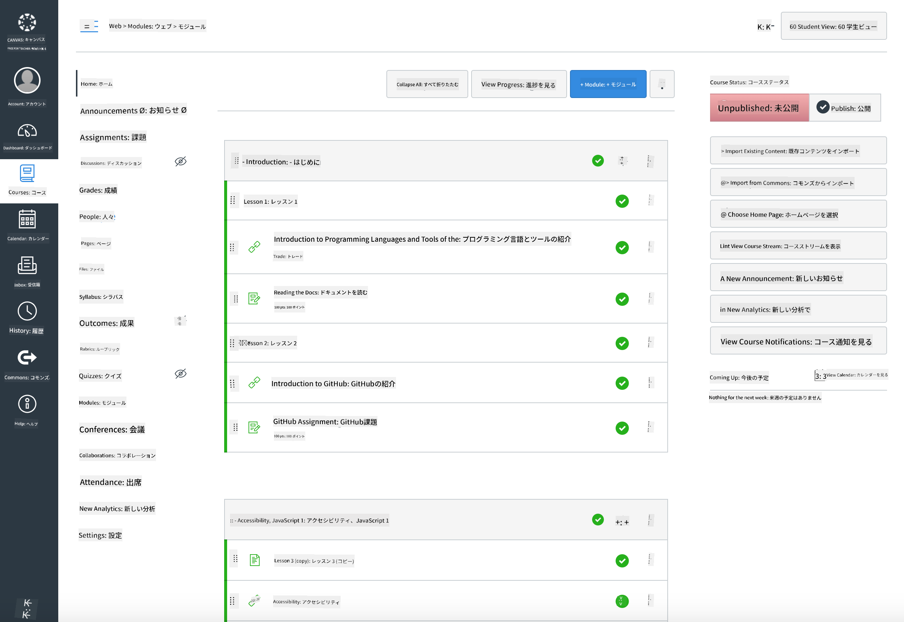

<!--
CO_OP_TRANSLATOR_METADATA:
{
  "original_hash": "71009af209f81cc01a1f2d324200375f",
  "translation_date": "2025-10-03T09:01:05+00:00",
  "source_file": "for-teachers.md",
  "language_code": "ja"
}
-->
### 教育者向け

このカリキュラムは、教室で自由に使用できます。GitHub Classroomや主要なLMSプラットフォームとスムーズに連携し、または単独のリポジトリとして学生と一緒に使用することも可能です。

### GitHub Classroomでの使用

コホートごとにレッスンや課題を管理するには、レッスンごとにリポジトリを作成し、GitHub Classroomが各課題を独立して紐付けられるようにします。

- このリポジトリを組織にフォークします。
- 各レッスンごとに別々のリポジトリを作成し、各レッスンフォルダーをそのリポジトリに分割します。
  - オプションA: 空のリポジトリを作成し（レッスンごとに1つ）、レッスンフォルダーの内容をそれぞれにコピーします。
  - オプションB: Gitの履歴を保持する方法（例: フォルダーを新しいリポジトリに分割）を使用して、履歴を必要とする場合に対応します。
- GitHub Classroomで、レッスンごとに課題を作成し、対応するレッスンリポジトリを指定します。
- 推奨設定:
  - リポジトリの可視性: 学生の作業用にプライベート設定。
  - レッスンリポジトリのデフォルトブランチからスターターコードを使用。
  - クイズや提出物用のIssueおよびPull Requestテンプレートを追加。
  - レッスンに自動採点やテストが含まれる場合は、オプションで設定。
- 効果的な命名規則:
  - リポジトリ名例: lesson-01-intro, lesson-02-htmlなど。
  - ラベル: quiz, assignment, needs-review, late, resubmission。
  - コホートごとのタグ/リリース（例: v2025-term1）。

ヒント: WindowsでGitの競合を防ぐため、同期フォルダー（例: OneDrive/Google Drive）内にリポジトリを保存しないようにしてください。

### Moodle、Canvas、Blackboardでの使用

このカリキュラムには、一般的なLMSワークフローに対応したインポート可能なパッケージが含まれています。

- Moodle: Moodleアップロードファイル [Moodle upload file](../../../../../../../teaching-files/webdev-moodle.mbz) を使用してコース全体を読み込むことができます。
- Common Cartridge: より広範なLMS互換性のために、Common Cartridgeファイル [Common Cartridge file](../../../../../../../teaching-files/webdev-common-cartridge.imscc) を使用してください。
- 注意事項:
  - Moodle CloudはCommon Cartridgeのサポートが限定的です。上記のMoodleファイルを使用することを推奨します。このファイルはCanvasにもアップロード可能です。
  - インポート後、モジュール、締切日、クイズ設定を学期スケジュールに合わせて確認してください。

> Moodle教室でのカリキュラム

> Canvasでのカリキュラム

### リポジトリを直接使用する場合（Classroomを使用しない場合）

GitHub Classroomを使用しない場合、このリポジトリから直接コースを実行することができます。

- 同期型/オンライン形式（Zoom/Teams）:
  - メンター主導の短いウォームアップを実施し、クイズ用にブレイクアウトルームを使用します。
  - クイズの時間枠を発表し、学生はGitHub Issuesとして回答を提出します。
  - 協働課題の場合、学生は公開レッスンリポジトリで作業し、Pull Requestを開きます。
- 非公開/非同期形式:
  - 学生は各レッスンを自分の**プライベート**リポジトリにフォークし、あなたをコラボレーターとして追加します。
  - クイズ（Issues）や課題（Pull Requests）をあなたの教室リポジトリまたは学生のプライベートフォークで提出します。

### ベストプラクティス

- Git/GitHubの基本、Issues、PRsに関するオリエンテーションレッスンを提供します。
- Issues内でチェックリストを使用して、複数ステップのクイズや課題を管理します。
- CONTRIBUTING.mdとCODE_OF_CONDUCT.mdを追加して教室の規範を設定します。
- アクセシビリティに関する注意事項（代替テキスト、キャプション）を追加し、印刷可能なPDFを提供します。
- 学期ごとにコンテンツをバージョン管理し、公開後にレッスンリポジトリを固定します。

### フィードバックとサポート

このカリキュラムがあなたと学生にとって役立つものになることを願っています。バグ、リクエスト、改善点については、このリポジトリで新しいIssueを開くか、Teacher Cornerでディスカッションを開始してください。

---

**免責事項**:  
この文書は、AI翻訳サービス[Co-op Translator](https://github.com/Azure/co-op-translator)を使用して翻訳されています。正確性を追求しておりますが、自動翻訳には誤りや不正確な部分が含まれる可能性があることをご承知ください。元の言語で記載された文書が正式な情報源とみなされるべきです。重要な情報については、専門の人間による翻訳を推奨します。この翻訳の使用に起因する誤解や誤解釈について、当方は責任を負いません。