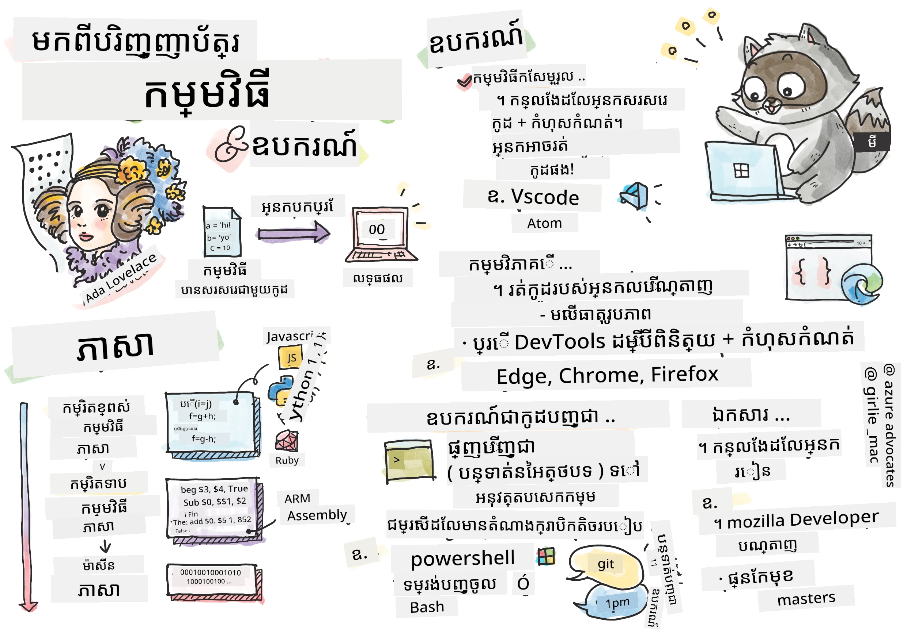
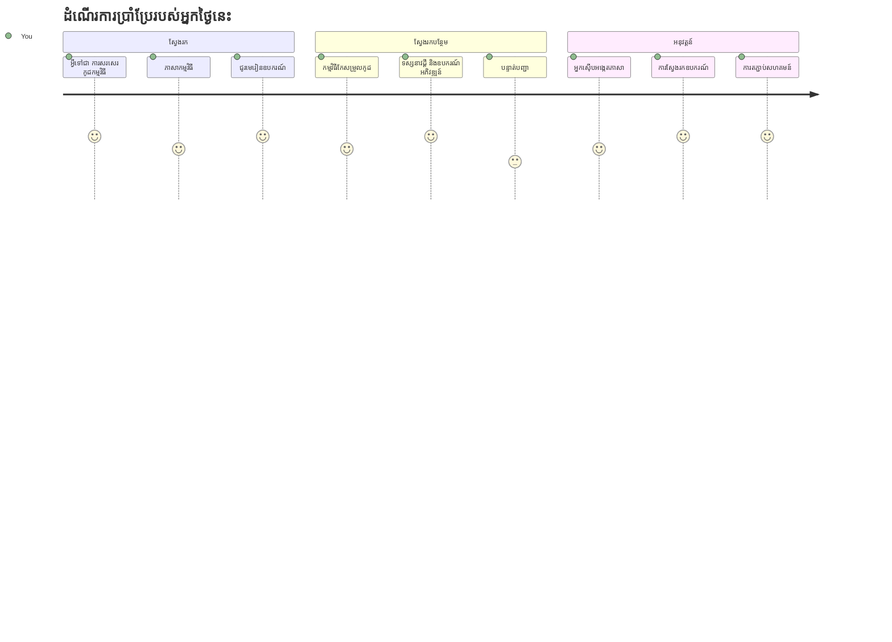
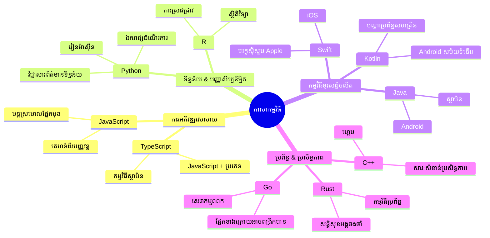
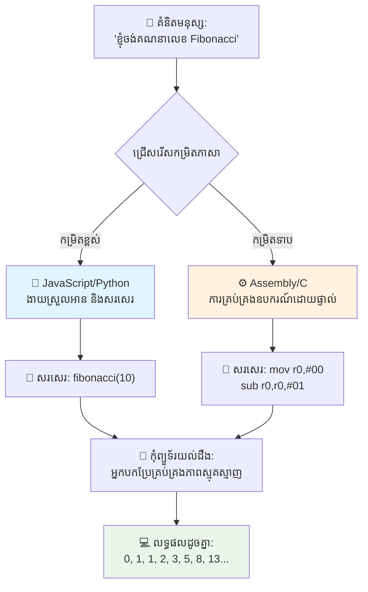
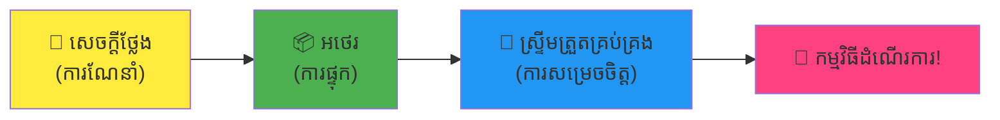
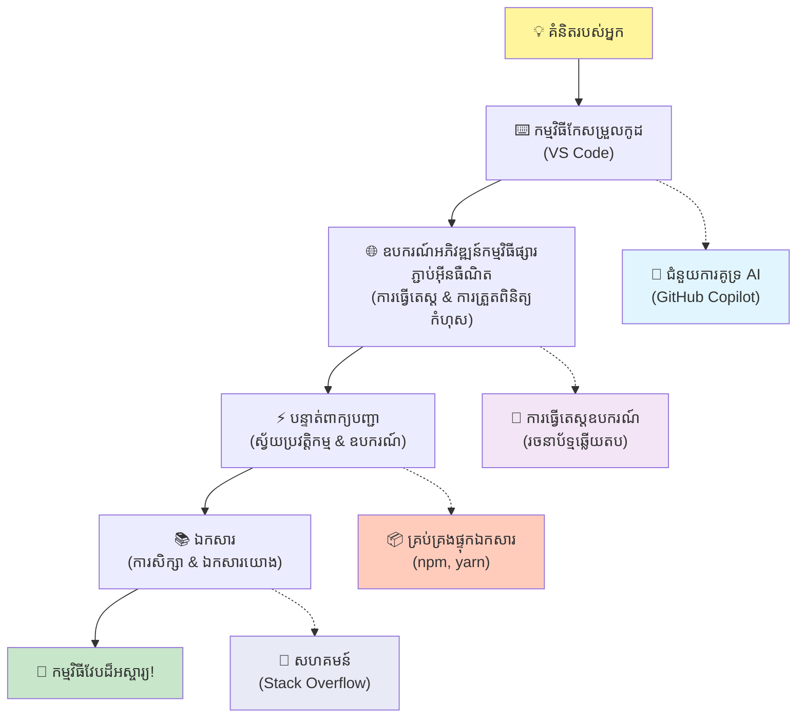
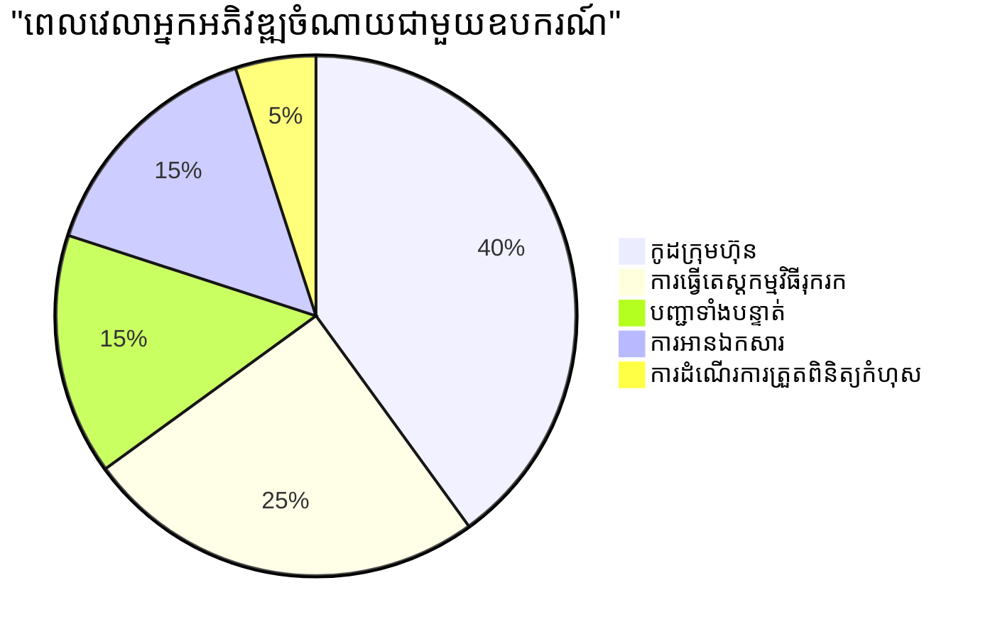
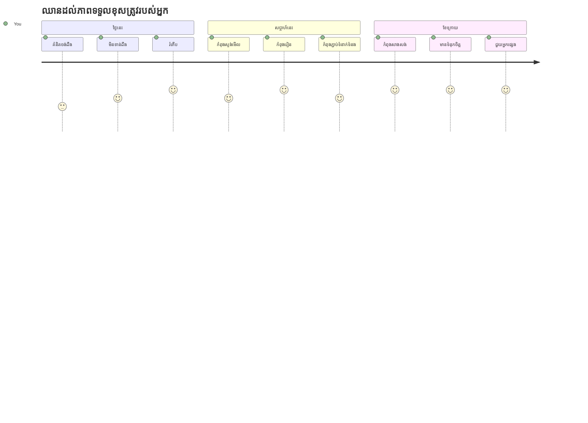

# ការណែនាំអំពីភាសាកម្មវិធី និងឧបករណ៍អ្នកអwickាសពេលបច្ចុប្បន្ន

សួស្តីអ្នកអwickាសនៅអនាគត! 👋 តើខ្ញុំអាចប្រាប់អ្នកអ្វីមួយដែលនៅតែធ្វើអោយខ្ញុំមានអារម្មណ៍រំភើបគ្រប់ថ្ងៃបានទេ? អ្នកកំពុងត្រៀមខ្លួនដើម្បីស្គាល់ថាការកម្មវិធីមិនមែនត្រឹមតែជាកុំព្យូទ័រទេ – តែវា គឺជាការទទួលបានអំណាចពិសេសដើម្បីធ្វើឱ្យគំនិតសំខាន់ៗរបស់អ្នកក្លាយជាជាក់ស្តែង!

អ្នកដឹងថាពេលណាដែលអ្នកកំពុងប្រើកម្មវិធីពេញចិត្តរបស់អ្នក ហើយសព្វគ្រប់យ៉ាងគឺជារឿងល្អឥតខ្ចោះមែនទេ? ពេលអ្នកចុចប៊ូតុងមួយ ហើយមានអ្វីមួយប្រសើរជាប់ចិត្តដែលធ្វើអោយអ្នកនិយាយថា "វ៉ាវ, តើអ្នកបានធ្វើរបៀបណា?" អ្នកណាម្នាក់ដូចជាអ្នក - ប្រហែលជាកំពុងអង្គុយនៅកាហ្វេទាំងមនុស្សនៅម៉ោង ២ ព្រឹកជាមួយកាហ្វេអេសប្រេសសូទីបី - បានសរសេរកូដដែលបង្កើតអ្វីមួយអស្ចារ្យនោះ។ ហើយនេះជារឿងដែលនឹងធ្វើអោយអ្នកភ្ញាក់ផ្អើល៖ នៅចុងบทសិក្សានេះ អ្នកនឹងមិនត្រឹមតែយល់ពីរបៀបដែលពួកគេចែករំលែកតែប៉ុណ្ណោះទេ ប៉ុន្តែអ្នកនឹងមានបំណងចង់សាកល្បងវាផងដែរ!

សូមមើល ខ្ញុំយល់ថា ប្រសិនបើការកម្មវិធីធ្វើអោយអ្នកមានអារម្មណ៍ភ័យក្រែងឥឡូវនេះមែនទេ។ នៅពេលខ្ញុំចាប់ផ្តើម ខ្ញុំពិតជាចាប់អារម្មណ៍ថាអ្នកត្រូវតែជាអ្នកដំណឹងគណិតវិទ្យាឬបានរៀនកូដម្ដង ពីពេលអ្នកមានពាន់ឆ្នាំប្រាំ។ ប៉ុន្តែនេះជារឿងដែលបានផ្លាស់ប្តូរមើលឃើញរបស់ខ្ញុំបាននៅលើសម្បយ: ការកម្មវិធីគឺដូចជាការរៀនធ្វើបន្ទាប់បន្សល់ក្នុងភាសាថ្មីមួយ។ អ្នកចាប់ផ្តើមជាមួយ "ជំរាបសួរ" ហើយ "អរគុណ" បន្ទាប់មករៀនបញ្ជាទិញកាហ្វេ ហើយមុនពេលអ្នកដឹង អ្នកកំពុងមានការពិភាក្សាទូលំទូលាយទូទៅ! លើកលែងតែរឿងនេះ អ្នកកំពុងនិយាយជាមួយកុំព្យូទ័រ ហើយពិតប្រាកដទេ? ពួកវាជាដៃគូនិយាយដែលអត់ថប់សន្លាក់បំផុតដែលអ្នកធ្លាប់មាន – ពួកវាមិនដែល phê phán កំហុសរបស់អ្នក ហើយពួកវាផ្ទាល់ខ្លួនរំខានចង់សាកល្បងម្តងទៀត!

ថ្ងៃនេះ យើងនឹងរំលឹកទៅលើឧបករណ៍អស្ចារ្យដែលធ្វើឱ្យការអwickាសវែបសម័យទំនើបមិនមែនត្រឹមតែអាចធ្វើបានទេ ប៉ុន្តែនៅក្នុងកម្រិតដែលធ្វើឱ្យអ្នកចងចាំ! ខ្ញុំកំពុងនិយាយអំពីក្រុមកម្មវិធីកែសម្រួល, កម្មវិធីរកមើល និងដំណើរការដូចគ្នានឹងដែលអ្នកអwickាសនៅ Netflix, Spotify និងស្ទូឌីយ៉ូកម្មវិធីឯករាជ្យដែលអ្នកចូលចិត្តប្រើរៀងរាល់ថ្ងៃ។ ហើយនេះជាផ្នែកដែលនឹងធ្វើឱ្យអ្នករាំសប្បាយចិត្ត៖ ឧបករណ៍ស្តង់ដារផ្នែកវិស័យភាគច្រើននេះគឺឥតគិតថ្លៃទាំងស្រុង!


> Sketchnote ដោយ [Tomomi Imura](https://twitter.com/girlie_mac)


## ឲ្យមើលថាតើអ្នកបានដឹងអ្វីហើយ!

មុនពេលយើងចូលទៅកាន់រឿងសប្បាយៗ ខ្ញុំចង់ធ្វើការសួរថា – តើអ្នកបានដឹងអ្វីមួយអំពីពិភពកម្មវិធីនេះហើយទេ? ហើយសូមស្តាប់ ខ្ញុំសូម្បីអោយអ្នកបានមើលសំណួរទាំងនេះហើយគិតថា "ខ្ញុំមិនដឹងអ្វីពីរឿងនេះទេ," វាមិនមែនជារឿងខុសទេ វាសាកល្បងថាអ្នកនៅត្រឹមទីតាំងត្រឹមត្រូវ។ សូមគិតថាឆ្នោតប្រឡងនេះគឺដូចជាការប្តូរជាមុននឹងហាត់ប្រាណ – យើងកំពុងកំដៅខួរក្បាល!

[ចូលរួមចំណាយពេលប្រឡងមុនសិក្សា](https://ff-quizzes.netlify.app/web/)


## ធ្វើដំណើរដែលយើងនឹងធ្វើរួមគ្នា

ល្អហើយ ខ្ញុំមាន អារម្មណ៍រំភើបយ៉ាងខ្លាំងអំពីអ្វីដែលយើងនឹងស្វែងរកថ្ងៃនេះ! ពិតប្រាថ្នាខ្ញុំអាចមើលមុខអ្នកពេលដែលមុខងារដែលខ្លះទទួលបានចំណាំ។ នេះគឺជាធម្មតាដំណើរអស្ចារ្យដែលយើងនឹងធ្វើរួមគ្នា៖

- **តើកម្មវិធីជាអ្វីពិត (និងមូលហេតុដែលវាជារឿងដ៏កក់ក្តៅ!)** – យើងនឹងរកឃើញថាកូដគឺជាអាកាសធាតុមិនច្បាស់ដែលបណ្តាលថាមពលអ្វីគ្រប់យ៉ាងនៅជុំវិញអ្នក ពីឧបករណ៍រោទិ៍ដែលដឹងថាព្រឹកថ្ងៃច័ន្ទ រហូតដល់អាល់ហ្គរីធ្ម៍ដែលរៀបចំជាផ្លូវការជួប Netflix របស់អ្នកបានគ្រប់លក្ខណៈ
- **ភាសាកម្មវិធី និងបុគ្គលិកលក្ខណៈដ៏អស្ចារ្យរបស់ពួកវា** – សូមស្រមៃថាអ្នកចូលរួមក្នុងគ្រួសារ ដែលមនុស្សនីមួយៗមានអំណាចពិសេស និងវិធីដោះស្រាយបញ្ហាទាំងមូល។ នេះគឺជាពិភពភាសាកម្មវិធី ហើយអ្នកនឹងស្រឡាញ់ការជួបពួកវា!
- **ឋាននឿយយ៉ាងសំខាន់ដែលធ្វើអោយវេទិកាឌីជីថលកើតឡើង** – សូមគិតថា រឿងទាំងនេះដូចជាបន្ទះ LEGO បង្កើតដ៏អស្ចារ្យបំផុត។ នៅពេលអ្នកយល់ពីរបៀបភ្ជាប់ចំណែកទាំងនេះ អ្នកនឹងដឹងថាអ្នកអាចបង្កើតអ្វីគ្រប់យ៉ាងតាមក្តីស្រមៃរបស់អ្នក
- **ឧបករណ៍វិជ្ជាជីវៈដែលនឹងធ្វើអោយអ្នកមានអារម្មណ៍ដូចជាពួកគេមួយមានដែកឆ្លងពិសេស** – ខ្ញុំមិនខ្លាចនិយាយទេ – ឧបករណ៍ទាំងនេះពិតជានឹងធ្វើអោយអ្នកមានអំណាចពិសេស ហើយផ្នែកល្អបំផុត គឺពួកវាជាឧបករណ៍ដែលអ្នកជំនាញប្រើប្រាស់!

> 💡 **នេះជារឿងមួយ**៖ កុំគិតអំពីការចងចាំអ្វីគ្រប់យ៉ាងថ្ងៃនេះទេ! ឥឡូវនេះ ខ្ញុំគ្រាន់តែនឹងចង់ឲ្យអ្នកមានអារម្មណ៍រំភើបចំពោះអ្វីដែលអាចបង្កើតបាន។ លម្អិតនឹងត្រូវចងចាំដោយស្វ័យប្រវត្តិពេលដែលយើងហាត់រួមគ្នា – នេះជាការសិក្សាពិតប្រាកដ!

> អ្នកអាចយកមេរៀននេះនៅលើ [Microsoft Learn](https://learn.microsoft.com/en-us/learn/modules/web-development-101/introduction-programming/?WT.mc_id=academic-77807-sagibbon)!

## តើកម្មវិធីគឺជាអ្វី?

ល្អហើយ ទស្សនាអំពីសំណួរមានតំលៃម៉ឺនដុល្លារ៖ តើកម្មវិធីគឺជាអ្វីពិតប្រាកដ?

ខ្ញុំនឹងប្រាប់អ្នករឿងមួយដែលបានផ្លាស់ប្តូរយ៉ាងខ្លាំងចំពោះការគិតរបស់ខ្ញុំអំពីរឿងនេះ។ សប្តាហ៍មុន ខ្ញុំកំពុងព្យាយាមពន្យល់ឲ្យម៉ាក់បានដឹងពីរបៀបប្រើឧបករណ៍ត្រួតប័ណ្ណរបស់ធេវីឆ្លាតថ្មីរបស់យើង។ ខ្ញុំបាននិយាយដូចក្ដៅថា "ចុចប៊ូតុងក្រហម ប៉ុន្តែមិនត្រូវចុចប៊ូតុងក្រហមធំទេ ជាប៊ូតុងក្រហមតូចនៅខាងឆ្វេង... មិនមែនខាងឆ្វេងនេះទេ... ល្អហើយ ឥឡូវចុចយករយៈពេលពីរវិនាទី មិនមែនមួយ មិនមែនបី..." តើអ្នកធ្លាប់បានជួបទេ? 😅

នេះហើយហ្នឹងហៅថាកម្មវិធី! វាជាសិល្បៈនៃការផ្តល់ដាក់ទិសដៅលម្អិតប្រកបដោយជំហានច្រើនទៅឱ្យអ្វីមួយមានអំណាចខ្ពស់ប៉ុន្ត្រូវការបញ្ជាក់គ្រប់រឿងត្រឹមត្រូវ។ លើកលែងតែពេលដែលអ្នកពន្យល់ទៅឱ្យម៉ាក់ (ដែលអាចសួរថា "ប៊ូតុងក្រហមមួយណា?") អ្នកកំពុងពន្យល់ទៅកុំព្យូទ័រ (ដែលគ្រាន់តែអនុវត្តតាមអ្វីដែលអ្នកបានប្រាប់ ព្រមទាំងបញ្ហាដែលអ្នកចង់ប្រាប់មិនមែនសម្រាប់អ្វីដែលអ្នកមានជំនឿ)។

នេះជារឿងដែលធ្វើអោយខ្ញុំភ្ញាក់ផ្អើលពេលខ្ញុំបានរៀនដំបូង៖ កុំព្យូទ័រពិតជាប្រហែលថាតូចស្រីតាមសំណុំរបស់ពួកវា។ ពួកវាគ្រាន់តែយល់ពីពីរពាក្យតែប៉ុណ្ណោះ – 1 និង 0 ដែលគឺមានន័យថា "បាទ/ចាស" និង "ទេ" ឬ "បើក" និង "បិទ"។ មានតែក្នុងនេះប៉ុណ្ណោះ! ប៉ុន្តែមកទីនេះចាប់ផ្តើមពន្លឺ – យើងមិនត្រូវនិយាយជាផ្ទាំង ១ និង ០ ដូចជានៅក្នុងភាពយន្ត The Matrix ទេ។ នោះហើយជា **ភាសាកម្មវិធី** ជួយយើងបាន។ ពួកវាគឺដូចជាអ្នកបកប្រែបំផុតល្អបំផុតដែលយកគំនិតជាមនុស្សរបស់អ្នក ហើយបម្លែងវាទៅជាភាសាកុំព្យូទ័រ។

ហើយនេះគឺជារឿងដែលនៅតែធ្វើអោយខ្ញុំមានអារម្មណ៍ដូចជាអារម្មណ៍រំញ័រពិតប្រាកដនៅរៀងរាល់ព្រឹកពេលខ្ញុំនិយាយថា៖ ពីរស្គាល់ *គ្រប់យ៉ាង* ឌីជីថលនៅក្នុងជីវិតអ្នកបានចាប់ផ្តើមជាមួយនរណាម្នាក់ដូចអ្នក កំពុងអង្គុយក្នុងប៉ោម៉៉ាសាហ្វាតទាំងមួយជាមួយកាហ្វេ ហើយសរសេរកូដលើកុំព្យូទ័រយួរដៃរបស់ពួកគេ។ ឧបករណ៍ Instagram ធ្វើឲ្យអ្នកមើលស្រស់ស្អាត? មាននរណាម្នាក់សរសេរកូដនោះ។ កម្មវិធីណែនាំដែលនាំអ្នកទៅកាន់បទចម្រៀងថ្មីដែលអ្នកចូលចិត្ត? អwickាសបានបង្កើតអាល់ហ្គរីធ្ម៍នោះ។ កម្មវិធីជួយអ្នកបែងចែកលុយដល់ម៉ឺនុយនៅម៉ោងអាហារពេលល្ងាចជាមួយមិត្តភក្តិ? មែនហើយ អ្នកណាម្នាក់បានគិតថា "នេះគឺគ្មានអារម្មណ៍ល្អទេ ខ្ញុំអាចជួសជុលបាន" ហើយបន្ទាប់មកពួកគេបានធ្វើទៅហើយ!

ពេលអ្នករៀនកុំប្រតិបត្តិការ អ្នកមិនត្រឹមតែទទួលបានជំនាញថ្មីនោះទេ – អ្នកកំពុងក្លាយជាផ្នែកមួយនៃសហគមន៍បញ្ហាដោះស្រាយដ៏អស្ចារ្យដែលចំណាយពេលរាល់ថ្ងៃនិយាយថា "តើយ៉ាងដូចម្តេចបើខ្ញុំអាចបង្កើតអ្វីមួយដែលធ្វើឲ្យថ្ងៃរបស់នរណាម្នាក់ល្អប្រសើរបន្តិច?" ពិតហើយ តើមានអ្វីល្អបំផុតជាងនេះទេ?

✅ **ការស្វែងរកពត៌មានសប្បាយភ្ញាក់ផ្អើល**៖ នេះជារឿងមួយដ៏អស្ចារ្យសម្រាប់ស្វែងរកពេលមានវេលាចន្លោះ – តើអ្នកគិតថា នរណាជាអwickាសកុំព្យូទ័រដំបូងបំផុតនៅលើពិភពលោក? ខ្ញុំនឹងផ្តល់ស្វ័យតំណរណ៍មួយ៖ វាប្រហែលជាមិនមែនជាអ្នកដែលអ្នករំពឹងទុកទេ! រឿងពីក្រោយមនុស្សនេះគឺគួរឱ្យចាប់អារម្មណ៍ ហើយបង្ហាញថាកម្មវិធីតែងតែជាអំពើបញ្ហាដោះស្រាយដោយច្នៃប្រឌិត និងគិតផុតពីប្រអប់។

### 🧠 **ពេលពិនិត្យ៖ អ្នកមានអារម្មណ៍យ៉ាងដូចម្តេច?**

**សូមចំណាយពេលមួយដើម្បីគិតថា:**
- តើគំនិតនៃ "ផ្តល់សេចក្ដីណែនាំទៅកុំព្យូទ័រ" បានច្បាស់រួចហើយទេ?
- តើអ្នកអាចគិតអំពីភារកិច្ចប្រចាំថ្ងៃណាមួយដែលអ្នកចង់ស្វ័យប្រវត្តិកម្មបានទេ?
- តើមានសំណួរអ្វីខ្លះកំពុងកើតឡើងនៅក្នុងចិត្តរបស់អ្នកអំពីការកម្មវិធីនេះ?

> **ចងចាំ**: វាត្រូវបានគ្រាន់តែក្នុងស្ថានភាពអនុញ្ញាត បើសិនជាភាសាតិចសារសម្រាប់ខ្លះៗត្រូវបានចូលចិត្ត។ ការរៀនកម្មវិធីដូចជាការរៀនភាសាថ្មី – វាត្រូវការពេលវេលាដើម្បីអោយខួរក្បាលរបស់អ្នកបង្កើតផ្លូវប្រសាសន៍ឆ្លងកាត់ខួរក្បាល។ អ្នកកំពុងធ្វើបានល្អណាស់!

## ភាសាកម្មវិធីគឺដូចជារសជាតិដ៏ខុសគ្នារបស់ព្រះបាទមហាវិស័យ

ល្អហើយ នេះឮអដូចជាអ្វីមួយច្របូកច្របល់ ប៉ុន្តែសូមរង់ចាំខ្ញុំ – ភាសាកម្មវិធីគឺស្រដៀងនឹងតន្ត្រីច្រើនប្រភេទ។ សូមគិតថា: អ្នកមានជាស្ទាយ jazz ដែលទន់ភ្លន់និងហួសចិត្ត, rock ដែលខ្លាំងនិងត្រង់, classical ដែលឯកទេសនិងមានសណ្ឋាន, និង hip-hop ដែលច្នៃប្រឌិតនិងបង្ហាញអារម្មណ៍។ រៀងទាំងស្ទាយមានយ៉ាងខ្លួនផ្ទាល់, ក្រុមគាំទ្រគ្រប់គ្នាដែលមានចិត្តស្មោះ, ហើយរៀងរាល់មួយគឺល្អសម្រាប់ជំរើសនិងឱកាសខុសៗគ្នា។

ភាសាកម្មវិធីដំណើរការដូចគ្នា! អ្នកមិននឹងប្រើភាសាដូចគ្នាដើម្បីបង្កើតហ្គេមទូរស័ព្ទដែលគួរឲ្យសប្បាយតែអ្នកនឹងប្រើដើម្បីកាន់ទិន្នន័យអាកាសធាតុនៅកម្រិតខ្ពស់ទេ ដូចដែលអ្នកមិនលេង death metal នៅក្នុងថ្នាក់យូហ្គាឡើយ (យើងប្រហែលជាក៏មែន! 😄)។

ប៉ុន្តែនេះជាអ្វីដែលធ្វើអោយខ្ញុំភ្ញាក់រីករាយគ្រប់ពេលខ្ញុំគិតពីវា៖ ភាសាទាំងនេះដូចជាអ្នកបកប្រែពិតប្រាកដម្នាក់ដែលអង្គុយនៅចំហៀងអ្នក។ អ្នកអាចបញ្ចេញគំនិតរបស់អ្នកដោយរបៀបដែលធម្មតាចំពោះខួរក្បាលមនុស្សរបស់អ្នក ហើយពួកវាត្រូវទទួលខុសត្រូវការងារលំបាកក្នុងការបម្លែងទៅជារបៀប ១ និង ០ ដែលកុំព្យូទ័រនិយាយ។ វាដូចជាមានមិត្តភ័ក្រម្នាក់ដែលមានជំនាញជាភាសាមនុស្ស និងភាសាគណិតវិទ្យារៀងរាល់ពេល – ហើយពួកគេមិនដែលទៅអស់កម្លាំង មិនដែលត្រូវការឈប់ផឹកកាហ្វេ ក៏មិនដែល phê phán អ្នកសម្រាប់សំណួរដូចគ្នាដងពីរទេ!

### ភាសាកម្មវិធីពេញនិយម និងការប្រើប្រាស់របស់ពួកវា


| ភាសា | ល្អបំផុតសម្រាប់ | ហេតុអ្វីបានពេញនិយម |
|----------|----------|------------------|
| **JavaScript** | ការអwickាសវែប, ចំណុចប្រទាក់អ្នកប្រើ | រត់នៅក្នុងកម្មវិធីរកមើល និងគ្រប់គ្រងវែបសាយអន្តរប្រតិបត្តិការ |
| **Python** | វិទ្យាសាស្ត្រទិន្នន័យ, ស្វ័យប្រវត្តិ, AI | ស្រាលក្នុងការអាន និងរៀន មានបណ្ណាល័យដ៏មានអំណាច |
| **Java** | កម្មវិធីសម្រាប់សហគ្រាស, កម្មវិធី Android | ផ្នែកប្លាតផ្លាត់មិនខ្វះខាត និងរឹងមាំសម្រាប់ប្រព័ន្ធធំៗ |
| **C#** | កម្មវិធីវីនដូ, ការ​អwickាសហ្គេម | មានគាំទ្រយ៉ាងខ្លាំងពីប្រព័ន្ធ Microsoft |
| **Go** | សេវាកម្មពពក, ប្រព័ន្ធក្រោយ | លឿន, សាមញ្ញ, រចនាសម្រាប់កុំព្យូទ័រសម័យថ្មី |

### ភាសារថ្មីកម្រិតខ្ពស់ និងភាសារថ្មីកម្រិតទាប

ល្អ, នេះជាឧទាហរណ៍មួយដែលអស់សមត្ថភាពខួរក្បាលខ្ញុំច្រើនពេលខ្ញុំចាប់ផ្តើមរៀន ដូច្នេះខ្ញុំនឹងចែករំលែករឿងងាយយល់ដែលបានធ្វើអោយវាច្បាស់សម្រាប់ខ្ញុំ – ហើយខ្ញុំសង្ឃឹមវានឹងជួយអ្នកផងដែរ!

សូមស្រមៃថាអ្នកកំពុងទៅទស្សនាប្រទេសមួយដែលអ្នកមិនចេះភាសា ហើយអ្នកត្រូវការស្វែងរកបង្គន់ជិតជាងគេតែម៉េច? (យើងរាល់គ្នាត្រូវបានដែរមែនទេ? 😅):

- **ការកម្មវិធីកម្រិតទាប** គឺដូចជា ជ្រាបភាសាតំបន់ដែលអ្នកអាចនិយាយជាមួយពៅតាស់ដាំផ្លែឈើនៅមួកផ្លូវ ប្រើការប្រៀបធៀបវប្បធម៌, ពាក្យសំដីនៅតំបន់, និងរឿងកំប្លែងក្នុងស្រុក ដែលមានតែអ្នកដែលបានធំឡើងនៅទីនោះតែប៉ុណ្ណោះដែលយល់។ គួរអោយកត់សម្គាល់ខ្លាំងហើយមានប្រសិទ្ធភាពខ្ពស់... ប៉ុន្តែវាលំបាកខ្លាំងនៅពេលអ្នកត្រឹមត្រូវស្វែងរកបង្គន់។
- **ការកម្មវិធីកម្រិតខ្ពស់** គឺដូចជាមិត្តភ័ក្រ្តនៅក្នុងស្រុកដែលយល់អ្នក។ អ្នកអាចនិយាយថា "ខ្ញុំត្រូវការស្វែងរកបង្គន់" ជាភាសាអង់គ្លេសធម្មតា ហើយពួកគេនឹងបកប្រែវាបានជាថ្មីជាមួយព័ត៌មានវប្បធម៌ និងផ្តល់ទិសដៅដែលមានសមតុល្យមែនទែនសម្រាប់ខួរក្បាលអ្នកដែលមិនមែនជាកន្លែងជាតិ។

ក្នុងភាសាកម្មវិធី៖
- **ភាសាប្រភេទកម្រិតទាប** (ដូចជា Assembly ឬ C) អនុញ្ញាតឲ្យអ្នកមានការពិភាក្សារយៈពេលលម្អិតជាមួយឧបករណ៍រឹងដែលកុំព្យូទ័រប្រើ ប៉ុន្តែអ្នកត្រូវតែគិតដូចជាម៉ាស៊ីនមួយ ដែល... យើងនិយាយថា វា ជាការផ្លាស់ប្តូរចិត្តយ៉ាងធំមួយ!
- **ភាសាប្រភេទកម្រិតខ្ពស់** (ដូចជា JavaScript, Python, ឬ C#) អនុញ្ញាតឲ្យអ្នកគិតដូចមនុស្ស ខណៈពួកវាកំពុងគ្រប់គ្រងការលំបាកជាច្រើនដែលមាននៅជាប់ក្រោយម៉ាស៊ីន។ លើសពីនេះ ពួកវាមានសហគមន៍មនុស្សទាំងស្រុងដែលចាំបាច់ខ្លួនជាគ្រាប់តូចទាំងមូលផងដែរ ហើយពិតជាចង់ជួយអ្នក!

អ្នកគិតថាអ្នកនឹងចាប់ផ្តើមជាមួយភាសាណា? 😉 ភាសាកម្រិតខ្ពស់គឺដូចជាម៉ាស៊ីនប៉ា្រស៊ែតដែលអ្នកមិនចង់ដកចេញទេ ព្រោះវាធ្វើអោយបទពិសោធន៍ទាំងមូលគួរឲ្យរីករាយជាងមុន!


### ខ្ញុំនឹងបង្ហាញអ្នកថា អេត្បោវភាសាកម្រិតខ្ពស់កាន់តែងាយស្រួល

ល្អហើយ ខ្ញុំនឹងបង្ហាញអ្នកអ្វីដែលបង្ហាញយ៉ាងច្បាស់ថាហេតុអ្វីខ្ញុំស្រឡាញ់ភាសាកម្រិតខ្ពស់ តែសិនខ្ញុំត្រូវការអ្នកសន្យាអ្វីមួយ។ នៅពេលអ្នកឃើញឧទាហរណ៍កូដលើកដំបូង កុំភ័យ! វាត្រូវមានរូបរាងធ្វើអោយភ័យ។ នេះជាគោលបំណងដែលខ្ញុំចង់បញ្ជាក់!

យើងនឹងមើលការងារដូចគ្នាមួយដែលបានសរសេរដោយរបៀបពីរផ្សេងៗគ្នាទាំងស្រុង។ ទាំងពីរបង្កើតអ្វីដែលហៅថាស៊េរី Fibonacci – របៀបគណិតវិទ្យាដ៏ស្រស់ស្អាត ដែលលេខនីមួយៗគឺជាផលបូករបស់លេខពីរមុនៗ៖ 0, 1, 1, 2, 3, 5, 8, 13... (កំណត់សំគាល់: អ្នកនឹងឃើញរបៀបនេះនៅគ្រប់ទីកន្លែងធម្មជាតិ – ព្រលឹងមូលផ្កាផ្សិតទូៗ, រចនាសម្ព័ន្ធប្រចាំត្នោត, រហូតដល់របៀបឆ្នាំកាឡាក់ស៊ីកើតឡើង!)

តើអ្នករួចរាល់ទេដើម្បីមើលភាពខុសគ្នា? ទៅមុខ!

**ភាសាកម្រិតខ្ពស់ (JavaScript) – ងាយស្រួលសម្រាប់មនុស្ស:**

```javascript
// ជំហានទី 1: ការកំណត់ Fibonacci មូលដ្ឋាន
const fibonacciCount = 10;
let current = 0;
let next = 1;

console.log('Fibonacci sequence:');
```

**នេះគឺជាអ្វីដែលកូដនេះធ្វើ:**
- **ប្រកាស** ថាតើចង់បង្កើតលេខ Fibonacci ចំនួនប៉ុន្មាន
- **ចាប់ផ្តើម** ២អថេរ ដើម្បីតាមដានលេខបច្ចុប្បន្ន និងលេខបន្ទាប់
- **កំណត់តម្លៃចាប់ផ្តើម** (0 និង 1) ដែលកំណត់លំនាំ Fibonacci
- **បង្ហាញ** សាររូមក្បាល ដើម្បីសម្គាល់ចេញលទ្ធផលរបស់យើង

```javascript
// ជំហានទី 2: បង្កើតរាយនីយការដោយមានរង្វិល
for (let i = 0; i < fibonacciCount; i++) {
  console.log(`Position ${i + 1}: ${current}`);
  
  // គណនាលេខបន្ទាប់នៅក្នុងរាយនីយការ
  const sum = current + next;
  current = next;
  next = sum;
}
```

**ពន្យល់ពីអ្វីដែលកើតឡើង:**
- **ភ្ជាប់** ជុំសម្រាប់រាល់ទីតាំងក្នុងស៊េរីដោយប្រើ `for`
- **បង្ហាញ** លេខនីមួយៗជាមួយទីតាំងដោយប្រើទ្រង់ទ្រាយអក្សរស្លាក (template literal)
- **គណនា** លេខ Fibonacci បន្ទាប់ ដោយបូកលេខបច្ចុប្បន្ននិងលេខបន្ទាប់
- **បច្ចុប្បន្នភាព** អថេរដើម្បីចូលទីតាំងបន្ទាប់

```javascript
// ជំហានទី ៣: វិធីសាស្ត្រសម័យទំនើប
const generateFibonacci = (count) => {
  const sequence = [0, 1];
  
  for (let i = 2; i < count; i++) {
    sequence[i] = sequence[i - 1] + sequence[i - 2];
  }
  
  return sequence;
};

// ឧទាហរណ៍ការប្រើប្រាស់
const fibSequence = generateFibonacci(10);
console.log(fibSequence);
```

**នៅក្នុងនេះ យើងបាន:**
- **បង្កើត** មុខងារដែលអាចប្រើឡើងវិញ ដោយប្រើរបៀបសរសេរមុខងារបង្ហើប (arrow function)
- **កសាង** អារេដើម្បីទុកស៊េរីពេញលេញ មិនបង្ហាញចេញតែមួយៗទេ
- **ប្រើ** ការកំណត់ទីតាំងអារេដើម្បីគណនាលេខថ្មីៗ ពីតម្លៃមុនៗ
- **ត្រឡប់** ស៊េរីពេញលេញសម្រាប់ប្រើប្រាស់បានច្រើនផ្នែកក្រៅក្នុងកម្មវិធីរបស់យើង

**ភាសាកម្រិតទាប (ARM Assembly) – ងាយស្រួលសម្រាប់កុំព្យូទ័រ:**

```assembly
 area ascen,code,readonly
 entry
 code32
 adr r0,thumb+1
 bx r0
 code16
thumb
 mov r0,#00
 sub r0,r0,#01
 mov r1,#01
 mov r4,#10
 ldr r2,=0x40000000
back add r0,r1
 str r0,[r2]
 add r2,#04
 mov r3,r0
 mov r0,r1
 mov r1,r3
 sub r4,#01
 cmp r4,#00
 bne back
 end
```

សូមសម្គាល់ថា សំឡេង JavaScript កន្លែងនេះអានដូចជាដឹកនាំជាភាសាអង់គ្លេស ខណៈសំឡេង Assembly ប្រើបញ្ជាក្រុមហ៊ុនដែលគ្រប់គ្រងផ្ទាល់ processor របស់កុំព្យូទ័រ។ ទាំងពីរធ្វើការងារដូចគ្នា តែភាសាកម្រិតខ្ពស់ងាយស្រួលសម្រាប់មនុស្សយល់ សរសេរ និងថែរក្សាបំផុត។

**ភាពខុសគ្នាចម្បងដែលអ្នកនឹងមើលឃើញ:**
- **អាចអានបាន**: JavaScript ប្រើឈ្មោះពណ៌នាដូចជា `fibonacciCount` ខណៈពេលដែល Assembly ប្រើស្លាកសញ្ញាដ៏អស្ចារ្យដូចជា `r0`, `r1`
- **មន្ត្រីផ្តល់កត់សម្គាល់**: ភាសាឧត្តមកម្រិតលើកលែងរំលឹកពីមន្ត្រីសំខាន់ៗដែលធ្វើឱ្យកូដអាចធ្វើឱ្យមានឯកសារផ្ទាល់ខ្លួន
- **រចនាសម្ព័ន្ធ**: ជំហានตรេត្រដ្ឋនៃ JavaScript ល្អនិងផ្គូផ្គងនឹងរបៀបដែលមនុស្សគិតអំពីបញ្ហាជាជំហានៗ
- **ការថែទាំ**: ការអាប់ដេតកំណែ JavaScript សម្រាប់តម្រូវការផ្សេងៗកាន់តែងាយស្រួល និងច្បាស់លាស់

✅ **អំពីស៊េរី Fibonacci**: លំនាំលេខដ៏ស្អាតប្លែកនេះ (កំណត់ឥតខ្លាចលេខមួយស្មើនឹងទិន្នផលនៃលេខពីរ​កន្លងមក: 0, 1, 1, 2, 3, 5, 8...) មាននៅជិតគ្រប់ទីកន្លែងក្នុងធម្មជាតិ! អ្នកអាចរកឃើញវានៅក្នុងស្លឹកផ្កាឈូក, លំនាំផ្លែស៉ៃ, របៀបសង្ហារលំនាំសន្លឹក Nautilus ហើយរហូតដល់របៀបជាំបាក់ពន្លឺរបស់ដើមឈើ។ វាបង្ហាញពីវិធីដែលគណិតវិទ្យានិងកូដអាចជួយយើងយល់ដឹងនិងបង្កើតឡើងវិញនូវលំនាំដែលធម្មជាតិប្រើដើម្បីបង្កើតភាពស្រស់ស្អាត!

## គ្រឿងដែកគ្រឿងធ្វើអោយយុទ្ធសាស្ត្ររូបមន្ដកើតឡើង

ចាប់ផ្តើមឥឡូវដែលអ្នកបានឃើញរបៀបដែលភាសាកម្មវិធីមើលទៅក្នុងសកម្មភាព ខ្ញុំចង់បំបែកផ្នែកមូលដ្ឋានដែលបង្កើតកម្មវិធីអ្វីៗគ្រប់សរសេរឡើង។ គិតថាវា​ជា​គ្រឿងផ្សំមូលដ្ឋាន​នៅ​ក្នុង	resipe	ដែលអ្នកចូលចិត្ត - ពេលអ្នកយល់ពីតួនាទីនៃមួយៗ អ្នកនឹងអាចអាននិងសរសេរកូដនៅភាសាគ្រប់មាន!

នេះគឺដូចជាការរៀនវេយ្យាករណ៍របស់កម្មវិធី។ ចាំបានមុនពេលនៅសាលាដែលអ្នករៀនអំពីនាម វិធាន និងរបៀបដាក់ប្រយោគរួម? កម្មវិធីក៏មានរចនាសម្ព័ន្ធវេយ្យាករណ៍ផ្ទាល់ខ្លួន ហើយជាសំណាងមួយ វាល្អប្រសើរជាងវេយ្យាករណ៍ភាសាអង់គ្លេសច្រើន! 😄

### សម្ងាត់៖ คំពុងផ្តល់​ដំណើរការ​​​ជាថ្នាក់ៗ

ចាប់ផ្តើមជាមួយ **សម្ងាត់** – អ្វីនេះគឺដូចជាប្រយោគ​បុគ្គល​មួយ​ក្នុង​ការពិភាក្សាជាមួយកុំព្យូទ័រ។ សម្ងាត់មួយៗសំដៅឱ្យកុំព្យូទ័រធ្វើអ្វីមួយជាក់លាក់ ដូចជាការបញ្ជូនផ្លូវ៖ "បត់ឆ្វេងទីនេះ," "ឈប់នៅច្រកសញ្ញាចរាចរណ៍ក្រហម," "ចតឡាននៅកន្លែងនោះ។"

អ្វីដែលខ្ញុំចូលចិត្តនៅលើសម្ងាត់គឺថាវាអាចអានបានយ៉ាងស្រួល។ សូមពិនិត្យមើលនេះ៖

```javascript
// ប្រកាសមូលដ្ឋានដែលអនុវត្តសកម្មភាពតែមួយ
const userName = "Alex";                    
console.log("Hello, world!");              
const sum = 5 + 3;                         
```

**នេះគឺអ្វីដែលកូដនេះធ្វើ៖**
- **ប្រកាស** អថេរមួយដើម្បីរក្សារឈ្មោះអ្នកប្រើ
- **បង្ហាញ** សារពីពាក្យអរគុណទៅកាន់ការបង្ហាញ console
- **គណនា** និងរក្សាទុកលទ្ធផលនៃប្រតិបត្តិការគណិតវិទ្យា

```javascript
// ពាក្យបញ្ជាដែលអន្តរ្គង់ជាមួយទំព័របណ្តាញ
document.title = "My Awesome Website";      
document.body.style.backgroundColor = "lightblue";
```

**ជាកណ្តាប់ដៃ៖ នេះគឺអ្វីដែលកើតឡើង៖**
- **កែប្រែ** ចំណងជើងគេហទំព័រដែលប្រារព្ធនៅលើផ្ទាំងទូរស័ព្ទ
- **ផ្លាស់ប្ដូរ** ពណ៌ខាងក្រោយរបស់រាងកាយទំព័រទាំងមូល

### អថេរ៖ ប្រព័ន្ធឧស្សាហកម្មចងចាំកម្មវិធីរបស់អ្នក

បានហើយ, **អថេរ** គឺជាគំនិតមួយដែលខ្ញុំ​ចូលចិត្ត​បង្រៀនបំផុតព្រោះវាដូចនឹងអ្វីដែលអ្នកប្រើរាល់ថ្ងៃ!

គិតអំពីបញ្ជីទំនាក់ទំនងទូរស័ព្ទមួយ។ អ្នកមិនបង្រៀនលេខទូរស័ព្ទរបស់គ្រប់គ្នាទេ - អ្នករក្សា "ម៉ាក់," "មិត្តល្អបំផុត," ឬ "ហាងប៊ិចហ្សាដែលដឹករហូតដល់ម៉ោង ២ ព្រឹក" ហើយទូរស័ព្ទនឹងចងចាំលេខពិត។ អថេរមានដូចគ្នាដូចនេះ! វាជាធុងដែលមានស្លាក ដែលកម្មវិធីរបស់អ្នកអាចរក្សាទុកពត៌មាន ហើយយកវិញមកបានដោយឈ្មោះដែលមានន័យ។

នេះគឺគ្រប់គ្រាន់: អថេរអាចផ្លាស់ប្តូរបាននៅពេលកម្មវិធីរបស់អ្នកដំណើរការ (ដូច្នេះហៅថា "អថេរ" – យល់បាន​ទេ?). ដូចដែលអ្នកប្រហែលជាអាប់ដេតទំនាក់ទំនងហាងប៊ិចពេលអ្នកស្វែងរកកន្លែងល្អជាង បន្ទាប់មកអថេរអាចត្រូវបានធ្វើបច្ចុប្បន្នភាពនៅពេលកម្មវិធីរៀនព័ត៌មានថ្មី ឬក៏នៅពេលបរិបទផ្លាស់ប្តូរ!

ខ្ញុំនឹងបង្ហាញអ្នកថាវាធ្វើរបៀបសាមញ្ញយ៉ាងម៉េច៖

```javascript
// ជំហានទី ១: ការបង្កើតអថេរមូលដ្ឋាន
const siteName = "Weather Dashboard";        
let currentWeather = "sunny";               
let temperature = 75;                       
let isRaining = false;                      
```

**ការយល់ដឹងពីគំនិតទាំងនេះ៖**
- **រក្សាទុក** តម្លៃមិនផ្លាស់ប្តូរបានដោយប្រើអថេរ `const` (ដូចជា ឈ្មោះគេហទំព័រ)
- **ប្រើ** `let` សម្រាប់តម្លៃដែលអាចផ្លាស់ប្តូរបានរគ្រប់លំដាប់កូដ
- **ផ្ដល់** ប្រភេទទិន្នន័យខុសៗគ្នា៖ សរសេរ (អក្សរ), លេខ និងប៊ូល (ពិត/មិនពិត)
- **ជ្រើសរើស** ឈ្មោះពណ៌នាដែលពន្យល់ពីអត្ថន័យនៃអថេរ

```javascript
// ជំហានទី 2: ធ្វើការជាមួយអوبيជեկտដើម្បីក្រុមព័ត៌មានដែលពាក់ព័ន្ធ
const weatherData = {                       
  location: "San Francisco",
  humidity: 65,
  windSpeed: 12
};
```

**នៅខាងលើ យើងបាន៖**
- **បង្កើត** វត្ថុមួយដើម្បីរួមបញ្ចូលព័ត៌មានអាកាសធាតុទាំងឡាយ
- **រៀបចំ** ចំណុចពត៌មានជាច្រើននៅក្រោមឈ្មោះអថេរមួយ
- **ប្រើ** គូសោត-តម្លៃក្នុងការស្លាកចំណុចព័ត៌មាននីមួយៗយ៉ាងច្បាស់

```javascript
// ជំហានទី 3៖ ការប្រើប្រាស់ និងធ្វើបច្ចុប្បន្នភាពអថេរ
console.log(`${siteName}: Today is ${currentWeather} and ${temperature}°F`);
console.log(`Wind speed: ${weatherData.windSpeed} mph`);

// ការធ្វើបច្ចុប្បន្នភាពអថេរដែលអាចផ្លាស់ប្តូរ
currentWeather = "cloudy";                  
temperature = 68;                          
```

**យល់ដឹងលម្អិតពីមួយៗ៖**
- **បង្ហាញ** ព័ត៌មានដោយប្រើ template literals ជាមួយ `${}` ស៊ីនតាក់
- **ចូលដំណើរការ** អចលនវត្ថុដោយប្រើ dot notation (`weatherData.windSpeed`)
- **ធ្វើបច្ចុប្បន្នភាព** អថេរដែលបានប្រកាសជាមួយ `let` ដើម្បីបង្ហាញស្ថានភាពផ្លាស់ប្តូរ
- **បញ្ចូលគ្នា** ជាមួយអថេរជាច្រើនដើម្បីបង្កើតសារ​មានអត្ថន័យ

```javascript
// ជំហាន 4: ការបំបែកទំនាក់ដោយទំនើបសម្រាប់កូដស្អាតជាងមុន
const { location, humidity } = weatherData; 
console.log(`${location} humidity: ${humidity}%`);
```

**អ្វីដែលអ្នកត្រូវចេះគឺ៖**
- **ដកស្រង់** លក្ខណៈពិសេសពីវត្ថុដោយប្រើការចំណាត់ថ្នាក់ destructuring assignment
- **បង្កើត** អថេរថ្មីដោយស្វ័យប្រវត្តិជាមួយឈ្មោះដូចគ្នានៅក្នុងវត្ថុ
- **សម្រួល** កូដដោយជៀសវាងការប្រើ dot notation ក្រៀមក្រំឡើងវិញ

### របៀបដំណើរការ ​Control Flow៖ បង្រៀនកម្មវិធីឲ្យគិត

ល្អណាស់ នៅទីនេះកម្មវិធីក្លាយជារឿងចម្លែកមែន! **Control flow** គឺជាការបង្រៀនកម្មវិធីរបស់អ្នកឱ្យធ្វើជម្រើសរបស់ខ្លួនយ៉ាងវៃឆ្លាត ដូចជាអ្នកធ្វើរៀងរាល់ថ្ងៃដោយមិនចេះអើយ។

សូមរៀបរាប់៖ ព្រឹកនេះអ្នកប្រហែលជាមានរឿងជា "បើមានភ្លៀង ខ្ញុំនឹងយកឆ័ត្រ។ បើត្រជាក់ ខ្ញុំនឹងស្លៀកអាវក្រៅ។ បើខ្ញុំពេញលេញខ្ពស់ ខ្ញុំនឹងរំលងអាហារព្រឹកហើយយកកាហ្វេកាន់ទៅ។" សម្ថតិបញ្ញារបស់អ្នកធម្មជាតិតាមដាន បើ-បរិបទ នេះជាច្រើនដងរាល់ថ្ងៃ!

នេះជាឱកាសដែលកម្មវិធីមានផាសុខភាពនិងមានជីវិត ជាជាងតែការតាមដានស្គ្រីបរ៉ូបូតដូចជាកំណត់។ វាអាចពិនិត្យឡើងវិញពីស្ថានភាព ធ្វើការវាយតម្លៃ តាមដាននិងឆ្លើយតបយ៉ាងសមស្រប។ វាដូចជាការផ្តល់ខួរក្បាលដល់កម្មវិធីដែលអាចបត់បែននិងធ្វើជម្រើសបាន!

ចង់ឃើញរបៀបដែលវាដំណើរការយ៉ាងស្រស់ស្អាតទេ? ខ្ញុំនឹងបង្ហាញអ្នក៖

```javascript
// ជំហានទី១៖ לូជិចលលក្ខខណ្ឌមូលដ្ឋាន
const userAge = 17;

if (userAge >= 18) {
  console.log("You can vote!");
} else {
  const yearsToWait = 18 - userAge;
  console.log(`You'll be able to vote in ${yearsToWait} year(s).`);
}
```

**នេះជាអ្វីដែលកូដធ្វើ៖**
- **ពិនិត្យ** អាយុអ្នកប្រើឲ្យបានតម្លៃតំបន់បោះឆ្នោត
- **បញ្ជាព្រិត្តិការទាំងផ្សេងៗជាមួយលក្ខខណ្ឌ
- **គណនា** និងបង្ហាញពេលវេលាចាប់ពីពេលដែលអាចបោះឆ្នោតបាន ប្រសិនបើក្រោម 18 ឆ្នាំ
- **ផ្តល់** មតិយោបល់ជាក់លាក់ និងអាចជួយបានសម្រាប់ស្ថានភាពនីមួយៗ

```javascript
// ជំហាន ២: លក្ខខណ្ឌច្រើនជាមួយអូបូឡង់លោហហ្សិច
const userAge = 17;
const hasPermission = true;

if (userAge >= 18 && hasPermission) {
  console.log("Access granted: You can enter the venue.");
} else if (userAge >= 16) {
  console.log("You need parent permission to enter.");
} else {
  console.log("Sorry, you must be at least 16 years old.");
}
```

**បំបែកអ្វីកើតឡើងនៅទីនេះ៖**
- **បញ្ចូល** លក្ខខណ្ឌជាច្រើនដោយប្រើឧបករណ៍ `&&` (និង)
- **បង្កើត** ជំនាន់លក្ខខណ្ឌដោយប្រើ `else if` សម្រាប់ស្ថានភាពជាច្រើន
- **ដោះស្រាយ** គ្រប់ករណីដោយប្រើសម្ងាត់ `else` ចុងក្រោយ
- **ផ្តល់** មតិយោបល់ច្បាស់លាស់ជាកម្មវិធីសម្រាប់ស្ថានភាពខុសៗគ្នា

```javascript
// ជំហានទី 3: លក្ខខណ្ឌសង្ខេបជាមួយអូប៉េរ៉ាទ័រតឺណារី
const votingStatus = userAge >= 18 ? "Can vote" : "Cannot vote yet";
console.log(`Status: ${votingStatus}`);
```

**អ្វីដែលអ្នកត្រូវចងចាំ៖**
- **ប្រើ** អ្នកបម្រើ ternary (`? :`) សម្រាប់លក្ខខណ្ឌពីរជម្រើសងាយស្រួល
- **សរសេរ** លក្ខខណ្ឌមុន បន្ទាប់ជា `?`, បន្ទាប់ជា លទ្ធផលពិត, បន្ទាប់ជា `:`, បន្ទាប់ជា លទ្ធផលមិនពិត
- **អនុវត្ត** លំនាំនេះពេលអ្នកត្រូវចាត់តម្លៃទៅលើលក្ខខណ្ឌ

```javascript
// ជំហានទី ៤: ដោះស្រាយករណីច្រើនជាក់លាក់
const dayOfWeek = "Tuesday";

switch (dayOfWeek) {
  case "Monday":
  case "Tuesday":
  case "Wednesday":
  case "Thursday":
  case "Friday":
    console.log("It's a weekday - time to work!");
    break;
  case "Saturday":
  case "Sunday":
    console.log("It's the weekend - time to relax!");
    break;
  default:
    console.log("Invalid day of the week");
}
```

**កូដនេះបានសម្រេចរួច៖**
- **ផ្គូផ្គង** តម្លៃអថេរសម្រាប់ករណីជាច្រើនពិសេស
- **ផ្ដុំ** ករណីដែលដូចគ្នា (ថ្ងៃធ្វើការ vs ទីរដូវសៅរ៍-អាទិត្យ)
- **បញ្ជា** សម្ងាត់ស្របតាមការប្រហែលបាន
- **មាន** ករណី `default` ដើម្បីចាប់ករណីមិនរំពឹងទុក
- **ប្រើ** សម្ងាត់ `break` ដើម្បីបញ្ឈប់កូដមិនឲ្យបន្តទៅករណីបន្ទាប់

> 💡 **ការប្រៀបធៀបពីពិភពពិត**៖ គិតថា control flow ដូចជាការមាន GPS ដែលមានភាពអត់ធ្មត់ខ្ពស់បំផុតក្នុងពិភពលោកបញ្ចូនអ្នកផ្លូវ។ វាអាចនិយាយថា "បើមានចរាចរណ៍នៅផ្លូវ Main Street សូមទៅផ្លូវល្បឿនវិញ។ បើមានការសំណង់រារាំងផ្លូវល្បឿន សូមសាកល្បងផ្លូវទេសភាព។" កម្មវិធីប្រើលក្ខខណ្ឌដូចគ្នានេះដើម្បីឆ្លើយតបយ៉ាងឆ្លាតវៃទៅស្ថានភាពខុសៗគ្នា ហើយផ្តល់បទពិសោធន៍ល្អបំផុតជាមនុស្សប្រើ។

### 🎯 **ពិនិត្យគំនិត៖ ជំនាញគ្រឿងគ្រឹះ**

**សូមមើលថាអ្នកដំណើរការយ៉ាងម៉េចជាមួយគ្រឿងគ្រឹះ៖**
- តើអ្នកអាចពន្យល់​មាតិកាផ្សេងគ្នារវាងអថេរនិងសម្ងាត់ដោយប្រើពាក្យរបស់អ្នកឯងទេ?
- គិតពីស្ថានភាពពិតដែលអ្នកនឹងប្រើ if-then ជម្រើស (ដូចជា ឧទាហរណ៍បោះឆ្នោតរបស់យើង)
- តើមានអ្វីមួយពីលក្ខណៈវិធីកម្មវិធីដែលបានធ្វើឲ្យអ្នកភ្ញាក់ផ្អើល?

**កំណត់ពេលខ្លីដើម្បីបន្ថែមទំនុកចិត្ត៖**

✅ **អ្វីដែលនឹងមកជាបន្ទាប់**៖ យើងត្រូវធ្វើការកំសាន្តយ៉ាងខ្លាំងក្នុងការជ្រាបជ្រៅសារមន្ទីរ​នេះខណៈពេលយើងបន្តដំណើរល្អមួយនេះជាមួយគ្នា! សព្វថ្ងៃនេះ គ្រាន់តែលើកទឹកចិត្តអារម្មណ៍របស់អ្នកចំពោះពេលវេលាពិតប្រាកដ។ ជំនាញ និងបច្ចេកទេសជាក់លាក់នឹងឆាប់រឹតតែរឹងនិងសម្រួលដោយធម្មជាតិពេលយើងអនុវត្តជាមួយគ្នា – ខ្ញុំសន្យាថា វានឹងរីករាយជាងដែលអ្នកគិត!

## ឧបករណ៍ធ្វើការងារ

ល្អហើយ, នេះជាកន្លែងដែលខ្ញុំមានអារម្មណ៍រំភើបខ្លាំងដែលមិនអាចទប់បាន! 🚀 យើងកំពុងនិយាយអំពីឧបករណ៍ដ៏អស្ចារ្យដែលនឹងធ្វើឲ្យអ្នកមានអារម្មណ៍ថាអ្នកទទួលបានសោភន្តិភាពនៃចរាចរណ៍យន្តហោះឌីជីថលមួយ។

អ្នកដឹងថា​គ្រូបោកបាចខ្សែដែកមានកាំបិតដែលត្រូវគ្នាយ៉ាងល្អជាមួយដៃរបស់ពួកគេដែរឬទេ? ឬតើអ្នកអ្នកតន្ត្រីមានហ្គីតាប្រភេទមួយដែលផ្តួលសំឡេងពេលពួកគេចាប់វា? អ្នកអwickរការអភិវឌ្ឍន៍មានឧបករណ៍ផ្ទាល់ខ្លួនដូចជាទាំងនោះ ហើយនេះជាអ្វីដែលនឹងបំផ្លាញចិត្តអ្នក – ភាគច្រើនទាំងនេះមានឥតគិតថ្លៃទាំងស្រុង!

ខ្ញុំកំពុងរាំឡើងសម្រាប់ចែករំលែកវាជាមួយអ្នក ព្រោះវាបានបំលែងវិធីដែលយើងសាងសង់កម្មវិធី។ យើងនិយាយអំពីជំនួយការសរសេរកូដដែលចលនាដោយ AI ដែលអាចជួយសរសេរកូដអ្នក (ខ្ញុំមិនបានលេងរឿងទេ!), បរិយាកាសខ្សែបាយដែលអាចបង្កើតកម្មវិធីពេញលេញពីកន្លែងណាមួយតាមឥតខ្សោយ Wi-Fi និងឧបករណ៍ស្វែងរកកំហុសដែលមានភាពចวามហ៊ុមដូចជាមានទស្សនៈវិច្ឆ័យ X-ray សម្រាប់កម្មវិធីរបស់អ្នក។

ហើយនេះជាផ្នែកដែលនៅតែធ្វើឲ្យខ្ញុំមានកន្ធ្រាក់ទឹកក្តៅ៖ ទាំងនេះមិនមែនជា "ឧបករណ៍សម្រាប់អ្នកចាប់ផ្តើម" ដែលអ្នកអាចលះបង់បាននាពេលក្រោយទេ។ ទាំងនេះជាឧបករណ៍កម្រិតវិជ្ជាជីវៈដដែលដែលអ្នកអភិវឌ្ឍនៅ Google, Netflix និងស្ទូឌីយោ app indie ដែលអ្នកចូលចិត្តកំពុងប្រើនៅពេលនេះ។ អ្នកនឹងមានអារម្មណ៍ថាអ្នកជាអ្នកជំនាញយ៉ាងខ្លាំងដោយប្រើវា!


### កម្មវិធីកែសម្រួលកូដ និង IDEs៖ មិត្តភាពឌីជីថលថ្មីរបស់អ្នក

អញ្ចឹងនិយាយអំពីកម្មវិធីកែសម្រួលកូដ – វាចឹងជាកន្លែងដែលអ្នកនឹងស្រឡាញ់ខ្លាំងក្នុងការស្នាក់នៅ! គិតពួកវាដូចជាកន្លែងស្នាក់នៅផ្ទាល់ខ្លួនដែលអ្នកត្រូវចំណាយពេលភាគច្រើនដើម្បីបង្កើតនិងបរិច្ឆេទច្នៃប្រឌិតឌីជីថលរបស់អ្នក។

តែអ្វីដែលដ៏អស្ចារ្យនៅលើកម្មវិធីកែសម្រួលចុងក្រោយគឺ ពួកវាមិនមែនគ្រាន់តែជាកម្មវិធីកែសម្រួលអត្ថបទធម្មតា។ ពួកវាដូចជាមានគ្រូបង្រៀនកូដដ៏ឆ្លាតវៃម្នាក់អង្គុយក្បែរអ្នក24ម៉ោងជារៀងរាល់ថ្ងៃ។ ពួកវាបញ្ចេញកំហុសមុនពេលអ្នកសង្កេតឃើញ វាស្នើសុំកែលំអរដែលធ្វើឱ្យអ្នកមើលទៅឆ្លាត បង្រៀនអំពីអ្វីដែលកូដនីមួយៗធ្វើ ហើយក៏មាននរណាមួយអាចទស្សនាថាអ្នកកំពុងសរសេរអ្វី ហើយផ្តល់ដំណោះស្រាយសម្រាប់បញ្ចប់គំនិតរបស់អ្នក!

ខ្ញុំចាំបានពេលប្រាថ្នាដំបូងរបស់ auto-completion – ខ្ញុំដូចជាកំពុងរស់នៅក្នុងអនាគត។ អ្នកចាប់ផ្តើមសរសេរអ្វីមួយ ហើយកម្មវិធីកែសម្រួលនោះនិយាយថា "សូម្បីតែក្រោមមនុស្សកំពុងគិតអំពីមុខងារ​នេះដែលអាចជួយបានអ្វីដែលអ្នកត្រូវការ?" វាដូចជាមិត្តភក្តិអាចអានចិត្តរបស់អ្នកបាននៅក្នុងពេលសរសេរកូដ!

**តើអ្វីខ្លះធ្វើឱ្យកម្មវិធីកែសម្រួលទាំងនេះអស្ចារ្យ?**

កម្មវិធីកែសម្រួលទំនើបផ្តល់លក្ខណៈពិសេសជាច្រេីនដើម្បីបង្កើនផលិតភាពរបស់អ្នក៖

| លក្ខណៈពិសេស | វាធ្វើអ្វី | ហេតុអ្វីបានជាវាជួយ |
|---------|--------------|--------------|
| **ការផ្ដូរពណ៌នៅក្នុងវេយ្យករណ៍** | ពណ៌ផ្សេងៗសម្រាប់ផ្នែកខុសៗនៃកូដ | ធ្វើឲ្យកូដអាចអានបានងាយនិងរកកំហុសលឿន |
| **បញ្ចូលដោយស្វ័យប្រវត្តិ** | មានការស្នើរកូដពេលអ្នកសរសេរ | ល្បឿនខ្ពស់និងកាត់បន្ថយកំហុសវាយអក្សរ |
| **ឧបករណ៍ស្វែងរកកំហុស** | ជួយរកនិងដោះស្រាយកំហុស | រក្សាពេលវេលាការស្វែងរកកំហុសបានជាច្រើនម៉ោង |
| **ផ្នែកបន្ថែម** | បន្ថែមមុខងារពិសេស | បង្រៀនកម្មវិធីរបស់អ្នកសម្រាប់បច្ចេកវិទ្យាទាំងឡាយ |
| **ជំនួយការជាមួយ AI** | ស្នើលទ្ធផលកូដនិងការពន្យល់ | បង្កើនល្បឿនរៀននិងផលិតភាព |

> 🎥 **វីដេអូសម្រង់ច្បាស់**៖ ចង់មើលឧបករណ៍ទាំងនេះដំណើរការទេ? សូមមើលវីដេអូ [Tools of the Trade video](https://youtube.com/watch?v=69WJeXGBdxg) សម្រាប់ការបង្ហាញយ៉ាងទូលំទូលាយ។

#### កម្មវិធីកែសម្រួលណែនាំសម្រាប់អភិវឌ្ឍន៍បណ្ដាញ

**[Visual Studio Code](https://code.visualstudio.com/?WT.mc_id=academic-77807-sagibbon)** (ឥតគិតថ្លៃ)
- មានភាពពេញនិយមបំផុតចំពោះអ្នកអភិវឌ្ឍបណ្ដាញ
- ប្រព័ន្ធផ្នែកបន្ថែមល្អឥតខ្ចោះ
- ផ្ទៃបញ្ជាលើកំពូលនិងការចូលរួម Git ជាមួយ
- **ផ្នែកបន្ថែមដែលត្រូវមាន**:
  - [GitHub Copilot](https://marketplace.visualstudio.com/items?itemName=GitHub.copilot) - ជំនួយកូដដោយ AI
  - [Live Share](https://marketplace.visualstudio.com/items?itemName=MS-vsliveshare.vsliveshare) - ការសហការពេលវេលាពិត
  - [Prettier](https://marketplace.visualstudio.com/items?itemName=esbenp.prettier-vscode) - ការតំឡើងទ្រង់ទ្រាយគូដដោយស្វ័យប្រវត្តិ
  - [Code Spell Checker](https://marketplace.visualstudio.com/items?itemName=streetsidesoftware.code-spell-checker) - បាញ់កំហុសវាយអក្សរក្នុងកូដ

**[JetBrains WebStorm](https://www.jetbrains.com/webstorm/)** (មានតម្លៃ, ឥតគិតថ្លៃសម្រាប់សិស្ស)
- ឧបករណ៍ស្វែងរកកំហុស និងសាកល្បងកម្រិតខ្ពស់
- ការសរសេរកូដវៃឆ្លាត
- ជំនួយគ្រប់គ្រងកំណែទំរង់ក្នុងខ្លួន

**IDEs បើកមេឃ** (តំលៃផ្សេងៗ)
- [GitHub Codespaces](https://github.com/features/codespaces) - Visual Studio Code ពេញលេញនៅក្នុងប្រាវស័រ
- [Replit](https://replit.com/) - ល្អសម្រាប់រៀននិងចែករំលែកកូដ
- [StackBlitz](https://stackblitz.com/) - ការអភិវឌ្ឍន៍បណ្តាញពេញលេញភ្លាមៗ

> 💡 **មួកចាប់ផ្ដើម**៖ ចាប់ផ្ដើមជាមួយ Visual Studio Code – វាឥតគិតថ្លៃ ប្រើគ្រប់ជ្រុងប្រាជ្ញានៃឧស្សាហកម្ម ហើយមានសហគមន៍ធំទូលាយបង្កើតមេរៀននិងផ្នែកបន្ថែមជួយ។

### កម្មវិធីរុករកបណ្ដាញ៖ ហេដ្ឋារចនាសម្រង់ពិសេសរបស់អ្នក

ល្អហើយ សូមរៀបចំចិត្តឲ្យភ្ញាក់ផ្អើលឡើងទាំងស្រុង! អ្នកដឹងថាអ្នកកំពុងប្រើកម្មវិធីរុករកដើម្បីរុករកបណ្តាញសង្គម និងមើលវីដេអូមែនទេ? ប៉ុន្តែកម្មវិធីនោះបានលាក់សារព័ត៌មាននៃមន្ទីរពិសោធន៍អភិវឌ្ឍន៍ដ៏អស្ចារ្យមួយទាំងមូល ដែលរង់ចាំឲ្យអ្នករកឃើញ!

រាល់ពេលដែលអ្នកចុចមុនបង្អួចវេបសាយហើយជ្រើសរើស "Inspect Element" អ្នកកំពុងបើកពិភពដែលមិនគួរជឿនៃឧបករណ៍អភិវឌ្ឍដែលមានថាមពលខ្លាំងជាងកម្មវិធីថ្លៃថ្លាដែលខ្ញុំធ្លាប់បង់រាប់រយដុល្លារ។ វាដូចជាការរកឃើញថាម៉ាក់ចាស់របស់អ្នកបានលាក់មន្ទីរពិសោធន៍ឆុងផៅមុខជំនាញអ្នកខ​រោចដូចជាផ្ទាំងសម្ងាត់!
ពេលដំបូងដែលនរណាម្នាក់បង្ហាញខ្ញុំអំពី DevTools នៃកម្មវិធីរុករក វាបានចំណាយម៉ោងប្រហែលបីម៉ោងដើម្បីចុចជុំវិញហើយនិយាយថា “រង់ចាំ មើល! វាអាចធ្វើបានដែរ​ឬ?!” អ្នកអាចកែប្រែគេហទំព័រណាមួយបានជាល real-time មើលឃើញច្បាស់ថាអ្វីៗត្រូវបានផ្ទុកលឿនប៉ុណ្ណា ទៀតទៀតអាចសាកល្បងមើលវេបសាយអ្នកនៅលើឧបករណ៍ផ្សេងៗ ហើយក៏អាចដោះស្រាយបញ្ហា JavaScript ដូចជាអ្នក​ជំនាញពេញលេញ។ វាគឺជារឿងដែលធ្វើឲ្យមានការភ្ញាក់ផ្អើលជាបំផុត!

**សូមមើលហេតុผลដែលកម្មវិធីរុករកគឺជាឧបករណ៍សម្ងាត់របស់អ្នក៖**

ពេលដែលអ្នកបង្កើតគេហទំព័រ ឬកម្មវិធីវេប អ្នកត្រូវការមើលថាដូចម្តេចវាមានរាង និងឥរិយាបថក្នុងពិភពពិត។ កម្មវិធីរុករកមិនត្រឹមតែបង្ហាញការងាររបស់អ្នកផ្ទាល់ទេ ប៉ុន្តែផ្តល់មតិយោបល់លម្អិតអំពីប្រសិទ្ធិភាព ការចូលប្រើបាន និងបញ្ហាអាចកើតមាន។

#### ឧបករណ៍ភាគីអ្នកអភិវឌ្ឍកម្មវិធីរុករក (DevTools)

កម្មវិធីរុករកទំនើបរួមបញ្ចូលផ្នែកអភិវឌ្ឍន៍ទូលំទូលាយៈ

| ក្រុមឧបករណ៍ | ការងារដែលវាជួយ | ករណីប្រើប្រាស់ឧទាហរណ៍ |
|---------------|------------------|----------------------------|
| **ការ​ពិនិត្យធាតុ** | មើល និងកែប្រែ HTML/CSS ជាលស real-time | កែសម្រួលស្ទៃក្នុងទ្វារបង្ហាញដើម្បីមើលលទ្ធផលភ្លាមៗ |
| **Console** | មើលសារបញ្ហា និងសាកល្បង JavaScript | ដោះស្រាយបញ្ហា និងសាកល្បងកូដ |
| **នីតិវិធីបណ្តាញ** | តាមដានរបៀបធនធានត្រូវបានផ្ទុក | ធ្វើឲ្យប្រសើរប្រសិទ្ធភាព និងពេលវេលាបន្ថែមចំណាយក្នុងការផ្ទុក |
| **កម្មវិធីពិនិត្យការចូលប្រើបាន** | សាកល្បងការរចនាដែលរួមបញ្ចូល | ធានាថាតំបន់គេហទំព័ររបស់អ្នកអាចប្រើបានសម្រាប់អ្នកប្រើគ្រប់គ្នា |
| **កម្មវិធីសមមូលឧបករណ៍** | មើលជាមុនលើទំហំអេក្រង់ផ្សេងៗ | សាកល្បងការរចនាដែលផ្តល់បទបញ្ចូលដោយគ្មានឧបករណ៍ច្រើន |

#### កម្មវិធីរុករកដែលផ្តល់អនុសាសន៍សម្រាប់អភិវឌ្ឍន៍

- **[Chrome](https://developers.google.com/web/tools/chrome-devtools/)** - DevTools ស្តង់ដារឧស្សាហកម្មជាមួយឯកសារពេញលេញ
- **[Firefox](https://developer.mozilla.org/docs/Tools)** - ឧបករណ៍ CSS Grid និងការចូលប្រើបានល្អឥតខ្ចោះ
- **[Edge](https://docs.microsoft.com/microsoft-edge/devtools-guide-chromium/?WT.mc_id=academic-77807-sagibbon)** - បង្កើតលើ Chromium ជាមួយធនធាន អ្នកអភិវឌ្ឍន្ទ Microsoft

> ⚠️ **កុំភ្លេចសាកល្បង**៖ តែងតែសាកល្បងគេហទំព័ររបស់អ្នកនៅក្នុងកម្មវិធីរុករកច្រើនៗ! អ្វីដែលធ្វើបានល្អក្នុង Chrome អាចមើលខុសគ្នានៅ Safari ឬ Firefox។ អ្នកអភិវឌ្ឍពហុជំនាញពិនិត្យនៅក្នុងកម្មវិធីរុករកធំៗទាំងអស់ដើម្បីធានាបទពិសោធន៍ប្រើប្រាស់សរុបកន្លង។

### ឧបករណ៍បន្ទាត់បញ្ជា៖ ទ្វារចូលរបស់អ្នកក្នុងការជាមនុស្សវីរបុរសអភិវឌ្ឍន៍

មើលទៅ តោះយកពេលក្លាយជាផ្នែកពេញចិត្តស្មោះត្រង់អំពីបន្ទាត់បញ្ជា ព្រោះខ្ញុំចង់ឲ្យអ្នកស្តាប់ពីនរណាម្នាក់ដែលយល់អារម្មណ៍របស់វា ពេលខ្ញុំបានមើលវាលើកដំបូង — របារក្រហមខ្មៅភ្លឺរះក្រហម — ខ្ញុំបានគិតថា "ទេ! មិនចាំបាច់! វាហាក់ដូចជាសុបិន្តភាគទី១៩៨០ និងខ្ញុំមិនមានប្រាជ្ញាគ្រប់គ្រាន់សម្រាប់វានោះទេ!" 😅

តែកន្លែងនេះកាលណាខ្ញុំចង់ឲ្យអ្នកដឹងថាខ្ញុំចង់ប្រាប់អ្នកឥឡូវនេះ៖ បន្ទាត់បញ្ជាគឺមិនភ័យសោះទេ — វាជាផ្លូវដែលមានការទំនាក់ទំនងផ្ទាល់មកកុំព្យូទ័ររបស់អ្នក។ គិតវាដូចជាការត្រូវបញ្ជាទិញម្ហូបតាមកម្មវិធីបង្ហាញរូបភាព និងម៉ឺនុយដែលងាយស្រួល ទល់នឹងការចូលទៅភោជនីយដ្ឋានដែលអ្នកចូលចិត្តដែលបំប៉នចេះច្បាប់ហើយអាចធ្វើម្ហូបល្អដោយឲ្យអ្នកនិយាយ "ជំហានឲ្យខ្ញុំភ្ញាក់ផ្អើលទៅជាមួយអ្វីមួយរីករាយ"។

បន្ទាត់បញ្ជាគឺជាកន្លែងដែលអ្នកអភិវឌ្ឍន៍ត្រូវការដើម្បីមានអារម្មណ៍ដូចជាគណៈកម្មការតន្ត្រីមួយ។ អ្នកវាយពាក្យបញ្ជាដូចរឿងមន្ត (សូមចាំថាវាជាបញ្ជា ប៉ុន្តែគេមានអារម្មណ៍ជាមន្ត!), ចុច enter ហើយស្ទើរតែភ្លាម – អ្នកបានបង្កើតរចនាសម្ព័ន្ធគម្រោង ពីការដំឡើងឧបករណ៍មានអំណាចពីជុំវិញពិភពលោក ឬដាក់កម្មវិធីរបស់អ្នកនៅលើអ៊ីនធឺណិតសម្រាប់មនុស្សរាប់លានឲ្យមើល។ បន្ទាប់ពេលអ្នកទទួលបានរសជាតិដំបូងនៃអំណាចនោះ វាគឺជាការចាប់ផ្តើមដែលគួរឲ្យញញឹមពិតមែន!

**ហេតុអ្វីបានជា បន្ទាត់បញ្ជា នឹងក្លាយជាឧបករណ៍ដែលអ្នកចូលចិត្ត៖**

ក្នុងខណៈដែលផ្ទៃមុខក្រាហ្វិកល្អសម្រាប់ការងារច្រើន បន្ទាត់បញ្ជាមានភាពលេចធ្លោក្នុងការអូតូម៉ាស៊ីន ពិតប្រាកដ និងលឿន។ ឧបករណ៍អភិវឌ្ឍច្រើនគឺប្រើប្រាស់ដោយផ្ទាល់តាមបន្ទាត់បញ្ជា ហើយការរៀនប្រើវាឱ្យមានប្រសិទ្ធភាពអាចបង្កើនផលិតភាពរបស់អ្នកយ៉ាងខ្លាំង។

```bash
# ជំហ៊ានទី ១៖ បង្កើត និងហែកទិសទៅថតគម្រោង
mkdir my-awesome-website
cd my-awesome-website
```

**អ្វីដែលកូដនេះធ្វើ៖**
- **បង្កើត**ថតថ្មីឈ្មោះ "my-awesome-website" សម្រាប់គម្រោងរបស់អ្នក
- **បញ្ចូល**ទៅក្នុងថតថ្មីដែលបង្កើតដើម្បីចាប់ផ្តើមធ្វើការ

```bash
# ជំហានទី 2: បង្កើតគម្រោងជាមួយ package.json
npm init -y

# តំឡើងឧបករណ៍អភិវឌ្ឍន៍ទំនើបៗ
npm install --save-dev vite prettier eslint
npm install --save-dev @eslint/js
```

**ជំហាននិម្មិតនេះកំពុងធ្វើអ្វី៖**
- **ចាប់ផ្តើម**គម្រោង Node.js ថ្មីដោយប្រើការកំណត់លំនាំ `npm init -y`
- **ដំឡើង** Vite ជាឧបករណ៍សាងសង់ទំនើបសម្រាប់អភិវឌ្ឍន៍លឿន និងបង្កើតផលិតផល
- **បន្ថែម** Prettier សម្រាប់បង្ហាញទ្រង់ទ្រាយកូដដោយស្វ័យប្រវត្តិ និង ESLint សម្រាប់ពិនិត្យគុណភាពកូដ
- **ប្រើ**ស្លាក `--save-dev` ដើម្បីសម្គាល់ថាវាជាឧបករណ៍អភិវឌ្ឍន៍ប៉ុណ្ណោះ

```bash
# ជំហានទី 3: បង្កើតរចនាសម្ព័ន្ធគម្រោង និងឯកសារ
mkdir src assets
echo '<!DOCTYPE html><html><head><title>My Site</title></head><body><h1>Hello World</h1></body></html>' > index.html

# ចាប់ផ្តើមម៉ាស៊ីនមេអភិវឌ្ឍនា
npx vite
```

**នៅលើគេមាន៖**
- **រៀបចំ**គម្រោងដោយបង្កើតថតបំបែកសម្រាប់កូដប្រភព និងទ្រព្យសម្បត្តិ
- **បង្កើត**ឯកសារ HTML មូលដ្ឋានដែលមានរចនាសម្ព័ន្ធឯកសារ​ត្រឹមត្រូវ
- **ចាប់ផ្តើម**ម៉ាស៊ីនបម្រើអភិវឌ្ឍន៍ Vite សម្រាប់ការផ្ទុកឡើងឡើងវិញអ៊ីឡិចត្រូនិច និងជំនួសម៉ូឌុលកម្ដៅ

#### ឧបករណ៍បន្ទាត់បញ្ជាសម្រាប់អភិវឌ្ឍន៍វេបសាយ

| ឧបករណ៍ | គោលបំណង | ហេតុអ្វីអ្នកត្រូវការ |
|------|---------|-----------------|
| **[Git](https://git-scm.com/)** | ការត្រួតពិនិត្យជំនាន់ | តាមដានការផ្លាស់ប្តូរ ធ្វើការរួមគ្នា និងបម្រុងទុកការងារ |
| **[Node.js & npm](https://nodejs.org/)** | រត់ JavaScript និងគ្រប់គ្រងកញ្ចប់ | រត់ JavaScript នៅក្រៅកម្មវិធីរុករក ដំឡើងឧបករណ៍អភិវឌ្ឍទំនើប |
| **[Vite](https://vitejs.dev/)** | ឧបករណ៍សាងសង់ និងម៉ាស៊ីនបម្រើអភិវឌ្ឍន៍ | អភិវឌ្ឍន៍លឿនជាពិសេសជាមួយការជំនួសម៉ូឌុលកម្ដៅ |
| **[ESLint](https://eslint.org/)** | គុណភាពកូដ | ស្វ័យប្រវត្តិតាមរក និងកែប្រែបញ្ហាកូដ JavaScript |
| **[Prettier](https://prettier.io/)** | ទ្រង់ទ្រាយកូដ | រក្សារបែបកូដឲ្យជាប់ច្រក និងអាចអានបានងាយ |

#### ជម្រើសជាមូលដ្ឋានតាមវេទិកា

**Windows:**
- **[Windows Terminal](https://docs.microsoft.com/windows/terminal/?WT.mc_id=academic-77807-sagibbon)** - តាមបែបទំនើប និងមានមុខងារច្រើន
- **[PowerShell](https://docs.microsoft.com/powershell/?WT.mc_id=academic-77807-sagibbon)** 💻 -បរិស្ថានស្គ្រីបមានអំណាច
- **[Command Prompt](https://learn.microsoft.com/windows-server/administration/windows-commands/windows-commands)** 💻 - បន្ទាត់បញ្ជាប្រពៃណីWindows

**macOS:**
- **[Terminal](https://support.apple.com/guide/terminal/)** 💻 -កម្មវិធីបន្ទាត់បញ្ជាបញ្ចូលរួច
- **[iTerm2](https://iterm2.com/)** - បន្ទាត់បញ្ជាដែលបានបង្កើតឡើងជាមួយមុខងារវិជ្ជមាន

**Linux:**
- **[Bash](https://www.gnu.org/software/bash/)** 💻 - សែល Linux ស្ដង់ដារ
- **[KDE Konsole](https://docs.kde.org/trunk5/en/konsole/konsole/index.html)** - ឧបករណ៍និម្មិតបន្ទាត់បញ្ជាពេញលេញ

> 💻 = មានតម្លើងរួចក្នុងប្រព័ន្ធប្រតិបត្តិការ

> 🎯 **ផ្លូវរៀន**៖ ចាប់ផ្តើមជាមួយបញ្ជាយដូចជា `cd` (ផ្លាស់ទីថត), `ls` ឬ `dir` (បញ្ជីឯកសារ), និង `mkdir` (បង្កើតថត)។ អនុវត្តជាមួយបញ្ជាសម្រាប់វេហ្បូរកម្មវិធីទំនើបដូចជា `npm install`, `git status`, និង `code .` (បើកថតបច្ចុប្បន្នក្នុង VS Code)។ ពេលដែលអ្នកចេះល្អ អ្នកនឹងយល់ពីបញ្ជាឡើងជម្រៅ និងបច្ចេកទេសរៀបចំស្វ័យប្រវត្តិ។

### ឯកសារណែនាំ៖ មិត្តអ្នករៀនដែលមានស្រាប់របស់អ្នក

យ៉ាងហោចណាស់ ខ្ញុំចង់ចែករំលែកអាថ៌កំបាំងមួយដែលធ្វើឲ្យអ្នកមានអារម្មណ៍ល្អពេញលេញក្នុងការជាអ្នកចាប់ផ្តើម៖ អ្នកអភិវឌ្ឍមានបទពិសោធន៍ភាគច្រើនចំណាយពេលភាគច្រើនក្នុងការអានឯកសារណែនាំ។ ហើយវាមិនមកពីព្រោះពួកគេទាំងអស់មិនដឹងអ្វីទាំងអស់ទេ — វាជាសញ្ញានៃការបញ្ញា!

គិតឯកសារណែនាំដូចជាគ្រូបង្រៀនរដូវក្ដៅ សំណាងល្អនិងមានប្រាជ្ញាដែលអាចស្វាគមន៍អ្នកត круглម៉ោង។ បញ្ហាដែលអ្នក មិនដឹងថ្ងៃ ២ ត្រឹមម៉ោង ២ ព្រឹក? ឯកសារណែនាំនៅទីនោះជាមួយកន្លែងទន់ភ្លន់ និងចម្លើយត្រឹមត្រូវដែលអ្នកត្រូវការ។ ចង់រៀនអំពីមុខងារថ្មីៗដែលមនុស្សទាំងអស់និយាយ? ឯកសារណែនាំមានគំនូរសំណុំ និងប្រើប្រាស់អនឡាញ។ កំពុងព្យាយាមយល់ថាហេតុអ្វីអ្វីមួយដំណើរការដូច្នេះ? អ្នកគួរតែដឹងថា ឯកសារណែនាំរួចរាល់ក្នុងការបង្រៀនអ្នកយល់ប្រកបដោយន័យ!

នេះជារឿងដែលផ្លាស់ប្តូរយោបល់ខ្ញុំសម្រាប់មហិច្ឆតាវេបសាយ៖ ពិភពអភិវឌ្ឍន៍វេបដំណើរយ៉ាងលឿន និងគ្មានមនុស្សណា (ពិតៗគ្មានទេ!) រក្សាទុកអ្វីៗទាំងអស់ក្នុងចម្លងចងចាំ។ ខ្ញុំបានមើលអ្នកអភិវឌ្ឍវ័យជំនាន់ចាស់​ដែលមានបទពិសោធអោយជាង ១៥ ឆ្នាំ មើលសំណុំពាក្យផងដែរ ហើយអ្នកដឹងទេ? វាមិនអាក្រក់ទេ – វាគឺជាអំពើបញ្ញា! វាមិនមែនជារឿងផ្ដេកផ្ដួច ចាំបាច់ចាំបាន ១០០% ទាំងអស់ទេ ប៉ុន្តែជាអំពើដឹងជ្រាបកន្លែងស្វែងរកចម្លើយដែលជាក់ស្តែងបានយ៉ាងលឿន ហើយយល់ពីរបៀបប្រើប្រាស់របស់វា។

**កន្លែងដែលអស្ចារ្យត្រូវកើតឡើង៖**

អ្នកអភិវឌ្ឍវិជ្ជាជីវៈចំណាយពេលយ៉ាងច្រើនក្នុងការអានឯកសារណែនាំ — មិនមែនព្រោះពួកគេទាំងអស់មិនដឹងអ្វីទេ ប៉ុន្តែព្រោះពិភពអភិវឌ្ឍវេបផ្លាស់ប្ដូរយ៉ាងលឿន ដូច្នេះការសិក្សាបន្តគឺទាមទារជានិច្ច។ ឯកសារណែនាំល្អជួយអ្នកយល់បានមិនត្រឹមតែ *របៀប* ប្រើអ្វីមួយទេ ប៉ុន្តែ *ហេតុផល* និង *ពេលវេលា* ត្រូវប្រើវា។

#### ឧបករណ៍ឯកសារណែនាំចម្បងៗ

**[Mozilla Developer Network (MDN)](https://developer.mozilla.org/docs/Web)**
- ស្តង់ដារពិបាកសម្រាប់ឯកសារបច្ចេកទេសវេប
- មគ្គុទេសក៍ពេញលេញសម្រាប់ HTML, CSS និង JavaScript
- រួមបញ្ចូលព័ត៌មានអំពីការចូលរួមកម្មវិធីរុករក
- មានឧទាហរណ៍ជាក់ស្តែង និងការបង្ហាញអន្តរកម្ម

**[Web.dev](https://web.dev)** (ដោយ Google)
- គោលការណ៍អភិវឌ្ឍវេបសម័យទំនើប
- មគ្គុទេសក៍កែលម្អប្រសិទ្ធិភាព
- ស្ថាបត្យកម្មឈានមុខ និងគោលការណ៍រចនាបំណងចូលរួម
- ករណីវិជ្ជមានពីគម្រោងពិត

**[Microsoft Developer Documentation](https://docs.microsoft.com/microsoft-edge/#microsoft-edge-for-developers)**
- ធនធានអភិវឌ្ឍកម្មវិធីកម្មវិធីរុករក Edge
- មគ្គុទេសក៍កម្មវិធីវេបអេបប្រើប្រាស់ច្រើនជាប់
- វិធានការអភិវឌ្ឍតាមវេទិកាផ្សេងៗ

**[Frontend Masters Learning Paths](https://frontendmasters.com/learn/)**
- មេរៀនរៀបចំមានរចនាសម្ព័ន្ធ
- វីឌីអូជាដៃពីអ្នកជំនាញឧស្សាហកម្ម
- ការហាត់ការសរសេរកូដពិតប្រាកដ

> 📚 **យុទ្ធសាស្រ្តសិក្សា**៖ កុំព្យាយាមចងចាំឯកសារណែនាំទាំងមូល — តែត្រូវរៀនរបៀបរៀបចំវា។ គូសបរិច្ឆេទយោងដែលប្រើជាញឹកញាប់ ហើយហាត់ប្រើមុខងារស្វែងរកដើម្បីរកព័ត៌មានជាក់លាក់យ៉ាងរហ័ស។

### 🔧 **ពិសោធន៍ចំពោះឧបករណ៍៖ អ្វីដែលខុសគ្នាជាមួយអ្នក?**

**យកពេលសម្រួលមួយ៖**
- ឧបករណ៍ណាដែលអ្នកអស់ចិត្តទុកដាក់ចង់សាកល្បងជាចម្បង? (គ្មានចម្លើយខុសទេ!)
- បន្ទាត់បញ្ជានៅតែមានអារម្មណ៍ភ័យខ្លាច ឬអ្នកចាប់អារម្មណ៍ចំពោះវា?
- អ្នកអាចនឹកស្រមៃប្រើ DevTools រុករកដើម្បីមើលនៅពីក្រោយមូលដ្ឋានគេហទំព័រដែលអ្នកចូលចិត្តបានទេ?


> **ការជ្រាបជ្រាបសប្បាយ**៖ អ្នកអភិវឌ្ឍច្រើនក្នុងសំណុំបឺកឧបករណ៍កូដរបស់ពួកគេប្រហែល ៤០% ពេលវេលា ប៉ុន្តែចំណាយពេលជាច្រើនក្នុងការសាកល្បង រៀន និងដោះស្រាយបញ្ហា។ ការប្រមូលផ្តុំកូដគឺមិនមែនតែក្នុងការសរសេរកូដទេ — ផ្ទុយទៅវិញ វាជាការអភិវឌ្ឍបទពិសោធន៍!

✅ **អាហារសម្រាប់គិត**៖ នេះជារឿងគួរឱ្យចាប់អារម្មណ៍សម្រាប់គិត — តើយុទ្ធសាស្រ្តសម្រាប់សាងសង់គេហទំព័រ (អភិវឌ្ឍន៍) អាចខុសពីឧបករណ៍សម្រាប់រចនាដូចម្តេច? វាស្រដៀងនឹងការខុសគ្នារវាងស្ថាបត្យករ ដែលរចនាប្រទេសដ៏ស្រស់ស្អាត និងអ្នកតម្កល់ដីដែលបង្កើតវា។ ពួកគេចាំបាច់ ប៉ុន្តែត្រូវការឧបករណ៍ខុសៗគ្នា! វាជារបៀបគិតដែលជួយឲ្យអ្នកមើលឃើញទិដ្ឋភាពធំសម្រាប់របៀបដែលគេហទំព័រមកម្នាក់ទៅជិត។

## ការប្រកួតប្រជែង GitHub Copilot Agent 🚀

ប្រើរបៀប Agent ដើម្បីបញ្ចប់ការប្រកួតខាងក្រោម៖

**ការពិពណ៌នា៖** ស្វែងសម្បទានៃកម្មវិធីកូដរូបភាពទំនើប ឬ IDE ហើយបង្ហាញពីរបៀបវាអាចធ្វើឲ្យការងារអភិវឌ្ឍរបស់អ្នកប្រសើរឡើង។

**ការស្នើសុំ៖** ជ្រើសកម្មវិធីកូដរបស់អ្នក ឬ IDE (ដូចជា Visual Studio Code, WebStorm, ឬ IDE នៅលើពពក)។ រាយបញ្ជីលក្ខណៈពិសេសឬបន្ថែមបីដែលជួយអ្នកសរសេរ ដោះស្រាយបញ្ហា ឬថែរក្សាកូដឲ្យមានប្រសិទ្ធភាពជាងមុន។ សម្រាប់នីមួយៗ ផ្តល់ការពិពណ៌ខ្លីពីរបៀបវាផ្តល់ផលប្រយោជន៍ដល់ការងាររបស់អ្នក។

---

## 🚀 ការប្រកួតប្រជែង

**យល់ហើយ អ្នកត្រូវស្រោចស្រង់សំណួរដំបូងរបស់អ្នកទេ?**

ឥឡូវនេះដែលអ្នកមានមូលដ្ឋានដ៏អស្ចារ្យនេះ ខ្ញុំមានការផ្សងព្រមមួយដែល នឹងជួយអ្នកឲ្យឃើញថាពិភពកម្មវិធីសរសេរកូដពិតជាគួរឲ្យចាប់អារម្មណ៍និងមានការផ្សេងគ្នាដូចម្តេច។ ហើយស្តាប់ — វាមិនមែនជាការសរសេរកូដនៅឡើយទេ ដូច្នេះកុំមានសំពាធណា! គិតថាខ្លួនអ្នកជាអ្នកស៊ើបអង្កេតភាសាកម្មវិធី នៅក្នុងការស៊ើបអង្កេតតំបន់ដំបូងដែលគួរឱ្យរំភើប!

**បេសកកម្មរបស់អ្នក ប្រសិនបើអ្នកព្រមទទួល៖**
1. **ក្លាយជាអ្នកស្វែងរកភាសា**៖ ជ្រើសរើសភាសាកម្មវិធីបីយ៉ាងពី​លក្ខណៈផ្សេងៗ មួយឆ្លើយតបបង្កើតគេហទំព័រ មួយបង្កើតកម្មវិធីចល័ត មួយប្រែប្រួលទិន្នន័យសម្រាប់អ្នកវិទ្យាសាស្ត្រ។ រកឧទាហរណ៍នៃភាសាកម្មវិធីទាំងបីសម្រាប់ការងារងាយៗដូចគ្នាផង។ ខ្ញុំធានាអ្នកនឹងភ្ញាក់ផ្អើលចំពោះភាពខុសគ្នានៃរបៀបបង្ហាញខុសៗគ្នា ទោះបីដំណើរការតែមួយដដែលក៏ដោយ!

2. **រកមើលរឿងប្រែប្រួលរបស់ពួកវា**៖ តើអ្វីដែលធ្វើឲ្យភាសា​នីមួយៗពិសេស? នេះជាការពិតបែបវីរុស — កម្មវិធីភាសាត្រូវបង្កើតឡើង ព្រោះនរណាមួយគិតថា "ដឹងទេ អាចមានគន្លងល្អប្រសើរជាងនេះសម្រាប់ដោះស្រាយបញ្ហាគ្រាន់តែនេះ"។ អ្នកអាចស្វែងយល់ពីបញ្ហានេះទេ? រឿងខ្លះគួរឲ្យចាប់អារម្មណ៍ពិតជាមិនធម្មតា!

3. **ជួបប្រជុំសហគមន៍**៖ មើលថា សហគមន៍នៃភាសាបានស្វាគមន៍ អំណរខ្លាំងទេដូចម្តេច។ មានភាសាដែលមានអ្នកអភិវឌ្ឍរាប់លាន ចែករំលែកចំណេះដឹង និងជួយគ្នា ច្រើនឬតិចប៉ុន្តែមានភាពរឹងមាំនិងគាំទ្រខ្លាំង។ អ្នកនឹងរីករាយនឹងមើលស្ទីលជាញឹកញាប់របស់សហគមន៍នោះ!

4. **តាមចិត្តរបស់អ្នក**៖ ភាសាណាដែលមានអារម្មណ៍ងាយស្រួលសម្រាប់អ្នកឥឡូវនេះ? កុំភ័យក្នុងការជ្រើសរើស “ល្អបំផុត” — តែត្រូវស្តាប់អារម្មណ៍របស់អ្នក! អ្នកមិនមានចម្លើយខុសទេ ហើយអ្នកបានរីករាយក្នុងការស្វែងរកវិញពេលក្រោយ។

**ការស៊ើបអង្កេតបន្ថែម**៖ ព្យាយាមស្វែងរក​ឃើញថាគេហទំព័រឬកម្មវិធីធំៗណាដែលបានបង្កើតជាមួយភាសានីមួយៗ។ ខ្ញុំធានាអ្នកនឹងភ្ញាក់ផ្អើលមើលថា Instagram, Netflix ឬហ្គេមចល័តដែលអ្នកមិនអាចផ្អាកលេងបាន វាអាចត្រូវបានបង្កើតដោយភាសាណាដែរ!

> 💡 **កុំភ្លេច**៖ អ្នកមិនត្រូវក្លាយជាអ្នកជំនាញភាសាណាមួយថ្ងៃនេះទេ។ អ្នកគ្រាន់តែស្វែងយល់បរិស្ថានមុន ដើម្បីសម្រេចចិត្តថាអ្នកចង់ចាប់ផ្តើមនៅណា។ ចំណាយពេលរីករាយជាមួយវា ហើយអោយចិត្តក្មេងរបស់អ្នកដឹកនាំ!

## មករីករាយជាមួយអ្វីដែលអ្នកបានរកឃើញ!

លើកដំបូង អ្នកបានទទួលយកព័ត៌មានអស្ចារ្យច្រើនណាស់ថ្ងៃនេះ! ខ្ញុំមានអារម្មណ៍រីករាយពិតប្រាកដ ហើយរំពឹងថាអ្នកមានតម្លៃចំពោះដំណើរដ៏អស្ចារ្យនេះ។ ហើយចងចាំមិនមែនជាការប្រលងដែលអ្នកត្រូវតែបានត្រឹមត្រូវទាំងស្រុងទេ។ វាមានទំនងជាការប្រារព្ធពិធីអបអរសាទរអំពីអ្វីដែលអ្នកបានរៀនពីពិភពដែលគួរឱ្យចាប់អារម្មណ៍នេះ!

[ចូលប្រឡងបន្ទាប់មេរៀននេះ](https://ff-quizzes.netlify.app/web/)

## ពិនិត្យឡើងវិញ និងសិក្សាឯករាជ្យ

**ចំណាយពេលរីករាយជាមួយការស្វែងយល់!**
អ្នកបានគ្របដណ្តប់ច្រើនណាស់ថ្ងៃនេះ ហើយវាជារឿងដែលគួរអោយ गर्व! ឥឡូវនេះជាផ្នែកដែលគួរឱ្យសប្បាយ – ការស្វែងយល់ពីប្រធានបទដែលបង្កើតការចាប់អារម្មណ៍របស់អ្នក។ ចងចាំថា វា​មិនមែន​ជា​ការងារផ្ទះ​ទេ – វាជាការផ្សងព្រេង!

**ជ្រេ្ជះជ្រែងជាងនេះទៀតនូវអ្វីដែលធ្វើឱ្យអ្នករំភើប៖**

**អនុវត្តន៍ភាសាកម្មវិធី៖**
- ទៅកាន់គេហទំព័រផ្លូវការរបស់ភាសា ២-៣ ដែលទាក់ទាញចិត្តអ្នក។ រាល់ភាសាម្នាក់មានបុគ្គលិកលក្ខណៈ និងរឿងរ៉ាវផ្ទាល់ខ្លួន!
- សាកល្បងលេងកូដតាមអនឡាញដូចជា [CodePen](https://codepen.io/), [JSFiddle](https://jsfiddle.net/), ឬ [Replit](https://replit.com/). កុំខ្លាចសាកល្បង – អ្នកមិនអាចបំបែកអ្វីក៏បានទេ!
- អានអំពីរបៀបដែលភាសាដែលអ្នកចូលចិត្តបានកើតឡើង។ ទីបំផុត រឿងនិទានដើមផងណាស់គឺគួរឲ្យចាប់អារម្មណ៍ និងជួយឲ្យអ្នកយល់ដឹងថាហេតុអ្វីភាសានីមួយៗធ្វើការបែបនេះ។

**ធ្វើឲ្យស្រួលចិត្តជាមួយឧបករណ៍ថ្មី៖**
- ទាញយក Visual Studio Code ប្រសិនបើអ្នកមិនទាន់មានទេ – វាឥតគិតថ្លៃ និងអ្នកនឹងស្រលាញ់វា!
- ចំណាយពេលប៉ុន្មាននាទីស្វែងរក Extensions នៅក្នុង marketplace។ វាដូចជាហាង app សម្រាប់កម្មវិធីកូដរបស់អ្នក!
- បើក Developer Tools របស់ browser របស់អ្នក ហើយចុចលេង។ កុំបារម្ភអំពីការយល់ដឹងគ្រប់យ៉ាង – តែសូមស្គាល់អ្វីដែលមាននៅទីនោះ។

**ចូលរួមជាផ្នែកក្រុមសហគមន៍៖**
- តាមដានសហគមន៍អ្នកអភិវឌ្ឍមួយចំនួននៅ [Dev.to](https://dev.to/), [Stack Overflow](https://stackoverflow.com/), ឬ [GitHub](https://github.com/). សហគមន៍កម្មវិធីកំពុងស្វាគមន៍អ្នកថ្មីដ៏សប្បាយរីករាយ!
- មើលវីដេអូបណ្តុះបណ្តាលកូដសម្រាប់អ្នកចាប់ផ្តើមនៅ YouTube. មានអ្នកបង្កើតល្អៗជាច្រើន ដែលចាំបានពីអារម្មណ៍នៃការចាប់ផ្តើម។
- ពិចារណាចូលរួមជាមួយការជួបជុំក្នុងតំបន់ឬសហគមន៍អនឡាញ។ ជំនាញមិនមែនអត់គ្នា អ្នកអភិវឌ្ឍស្រឡាញ់ការជួយអ្នកថ្មី!

> 🎯 **សូមស្តាប់ ខ្ញុំចង់ឲ្យអ្នកចងចាំ**៖ អ្នកមិនត្រូវរីកចម្រើនជាជំនាញកូដរហ័សទេ! ឥឡូវនេះ អ្នកកំពុងស្គាល់ភពលោកថ្មីដ៏អស្ចារ្យដែលអ្នកនឹងចូលរួម។ សូមចំណាយពេលរបស់អ្នក រីករាយនឹងការផ្សងព្រេង ហើយចងចាំថា – អ្នកអភិវឌ្ឍម្នាក់ៗដែលអ្នកគោរព គឺធ្លាប់អង្គុយនៅត្រង់កន្លែងដែលអ្នកកំពុងនៅពេលនេះ ដើម្បីមានក្តីរំភើប និងខ្លះៗអាចនឹកស្មារតីច្រើន។ នេះជារឿងធម្មតា និងមានន័យថាអ្នកកំពុងធ្វើបានត្រឹមត្រូវ!

## Assignment

[Reading the Docs](assignment.md)

> 💡 **ជំនួយតិចសម្រាប់ការងាររបស់អ្នក**៖ ខ្ញុំចង់ឃើញអ្នកស្វែងរកឧបករណ៍មួយចំនួនដែលយើងមិនទាន់គ្របដណ្តប់ទេ! ដោះលែងកម្មវិធីកែសម្រួល browser និងឧបករណ៍ command line ដែលយើងបានបញ្ចេញរួចហើយ – មានអក្ខរាវិទ្យាមុនការអភិវឌ្ឍដ៏អស្ចារ្យមួយទៀតដែលរង់ចាំការស្វែងរក។ សូមស្វែងរកឧបករណ៍ដែលបានថែរក្សាទាញយក និងមានសហគមន៍រស់រវើក និងជួយគ្នា (ទូទៅមានមេរៀនល្អបំផុត និងមនុស្សគាំទ្រល្អបំផុតទស្សនាថាត្រូវការជំនួយ)។

---

## 🚀 អធិភាពដំណើរការកម្មវិធីរបស់អ្នក

### ⚡ **អ្វីដែលអ្នកអាចធ្វើបានក្នុង ៥ នាទីខាងមុខ**
- [ ] គូសទុកគេហទំព័រភាសាកម្មវិធី ២-៣ ដែលទាក់ទាញអ្នក
- [ ] ទាញយក Visual Studio Code ប្រសិនបើអ្នកមិនទាន់មានទេ
- [ ] បើក Developer Tools របស់ browser (F12) និងចុចលេងគេហទំព័រណាមួយ
- [ ] ចូលរួមជាមួយសហគមន៍កម្មវិធីមួយ (Dev.to, Reddit r/webdev, ឬ Stack Overflow)

### ⏰ **អ្វីដែលអ្នកអាចបំពេញបានក្នុង​មួយម៉ោងនេះ**
- [ ] បញ្ចប់ការប្រលងបន្ទាប់មកកម្មវិធី ហើយពិចារណាពីចម្លើយរបស់អ្នក
- [ ] ដំឡើង VS Code ជាមួយផ្នែកបន្ថែម GitHub Copilot
- [ ] សាកល្បងឧទាហរណ៍ "Hello World" ក្នុងភាសាកម្មវិធី ២ ផ្សេងគ្នាផ្សេងគ្នាផ្សេងគ្នាផ្សេងគ្នាភាសាក្នុងអនឡាញ
- [ ] មើលវីដេអូ "មួយថ្ងៃជាអ្នកបង្កើតកម្មវិធី" នៅ YouTube
- [ ] ចាប់ផ្តើមស្វែងរករឿងរ៉ាវភាសាកម្មវិធីរបស់អ្នក (ពីលំហាត់)

### 📅 **ការផ្សងព្រេងរយៈសប្តាហ៍របស់អ្នក**
- [ ] បញ្ចប់ការងារនិងស្វែងរកឧបករណ៍អភិវឌ្ឍ ៣ ថ្មី
- [ ] តាមដានអ្នកអភិវឌ្ឍ ៥ នាក់ ឬគណនីកម្មវិធីនៅបណ្តាញសង្គម
- [ ] ព្យាយាមបង្កើតអ្វីមួយតូចនៅ CodePen ឬ Replit (សូម្បីតែនិយាយ "Hello, [Your Name]!")
- [ ] អានអត្ថបទប្លុកអ្នកអភិវឌ្ឍម្នាក់ពីគោលដៅកម្មវិធីរបស់គាត់
- [ ] ចូលរួមជួបមិត្តក្នុងការប្រជុំវីដេអូឬមើលការនិយាយកម្មវិធី
- [ ] ចាប់ផ្តើមរៀនភាសាកម្មវិធីដែលអ្នកជ្រើសរើសជាមួយមេរៀនអនឡាញ

### 🗓️ **ការបម្លែងរយៈខែរបស់អ្នក**
- [ ] បង្កើតគម្រោងតូចដំបូងរបស់អ្នក (ច្រើនពេកគេហទំព័រពេញលេញក៏រាប់បញ្ចូល!)
- [ ] ចូលរួមក្នុងគម្រោង open-source (ចាប់ផ្តើមពីការជួសជុលឯកសារ)
- [ ] ក្រូវជាម៉ង់ទ័រអ្នកដែលទើបចាប់ផ្តើមដំណើរការកម្មវិធី
- [ ] បង្កើតគេហទំព័រផ្ទាល់ខ្លួនរបស់អ្នក ជាអ្នកអភិវឌ្ឍ
- [ ] ភ្ជាប់ជាមួយសហគមន៍អ្នកអភិវឌ្ឍក្នុងតំបន់ ឬក្រុមសិក្សា
- [ ] ចាប់ផ្តើមផែនការពហិការអនាគតនៃការរៀនរបស់អ្នក

### 🎯 **ការត្រួតពិនិត្យចុងក្រោយ**

**មុនពេលអ្នកបន្ត សូមចំណាយពេលខ្លីអបអរសាទរ៖**
- តើអ្វីមួយទាក់ទងកម្មវិធីដែលធ្វើឱ្យអ្នករំភើបថ្ងៃនេះ?
- តើឧបករណ៍ ឬគោលន័យណាមួយដែលអ្នកចង់ស្វែងរកជាមុនដំបូង?
- តើអ្នកមានអារម្មណ៍ដូចម្តេចនៅពេលចាប់ផ្តើមដំណើរការកម្មវិធីនេះ?
- តើសំណួរណាមួយដែលអ្នកចង់សួរអ្នកអភិវឌ្ឍឥឡូវនេះ?


> 🌟 **ចងចាំ**៖ អ្នកជំនាញទាំងអស់ធ្លាប់ជាអ្នកចាប់ផ្តើម។ អ្នកអភិវឌ្ឍជាន់ខ្ពស់ទាំងឡាយធ្លាប់មានអារម្មណ៍ដូចអ្នកឥឡូវនេះ – រំភើប អាចមានបន្តិចបន្តួចស្ទើរច្របូកច្របល់ និងចាប់អារម្មណ៍ថាអ្វីទៅទៅបាន។ អ្នកកំពុងនៅក្នុងក្រុមដ៏អស្ចារ្យ ហើយដំណើរនេះនឹងអស្ចារ្យណាស់។ សូមស្វាគមន៍មកភពលោកដ៏អស្ចារ្យនៃកម្មវិធី! 🎉

---

<!-- CO-OP TRANSLATOR DISCLAIMER START -->
**ការសម្គាល់**៖
ឯកសារនេះត្រូវបានបកប្រែដោយប្រើសេវាកម្មបកប្រែ AI [Co-op Translator](https://github.com/Azure/co-op-translator)។ ខណៈពេលយើងខិតខំសម្រាប់ភាពត្រឹមត្រូវ សូមយល់ឲ្យបានថាការបកប្រែដោយស្វ័យប្រវត្តិអាចមានកំហុសឬភាពចម្លងមិនពិតប្រាកដ។ ឯកសារដើមជាភាសាគោលគួរត្រូវបានគេចាត់ទុកជាធនធានច្បាស់លាស់។ សម្រាប់ព័ត៌មានសំខាន់ ការបកប្រែដោយអ្នកជំនាញមនុស្សត្រូវបានកាន់តែផ្តល់អាទិភាព។ យើងមិនទទួលខុសត្រូវចំពោះការយល់ច្រឡំ ឬការប្រែប្រួលមិនត្រឹមត្រូវណាមួយដែលកើតមានពីការប្រើប្រាស់ការបកប្រែនេះឡើយ។
<!-- CO-OP TRANSLATOR DISCLAIMER END -->