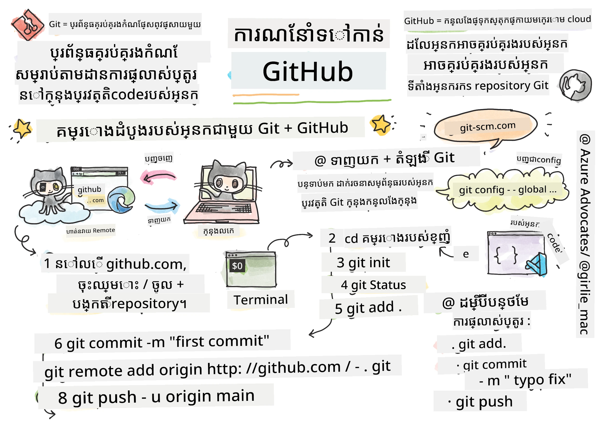
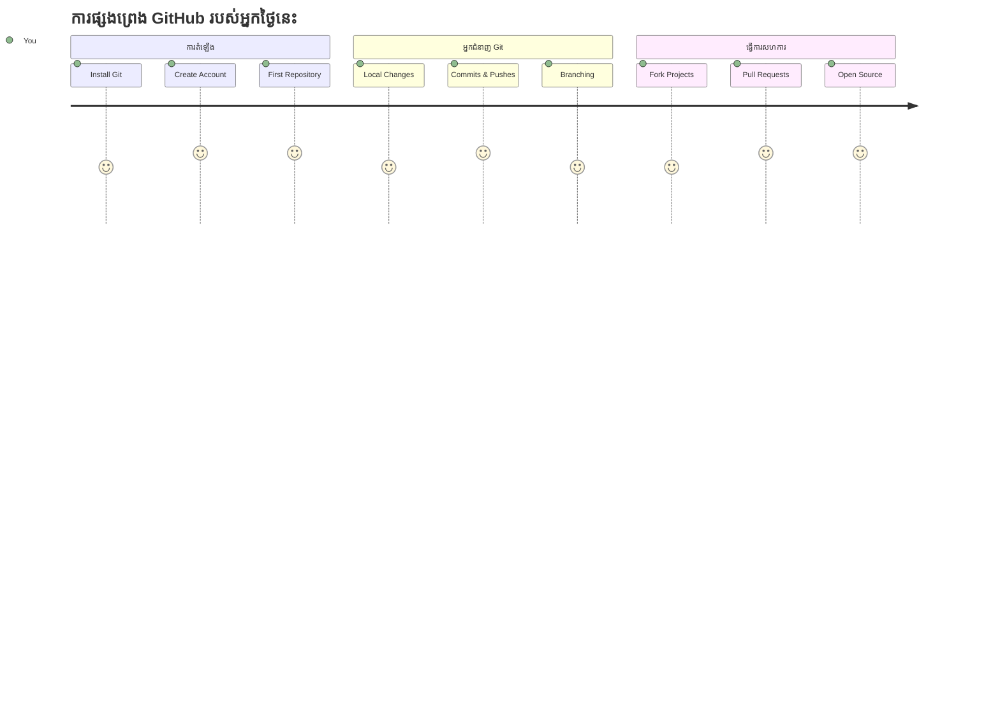
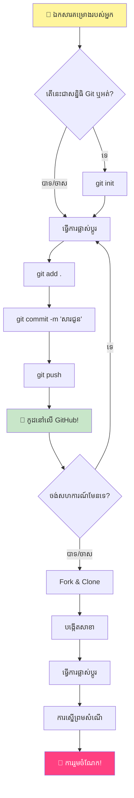
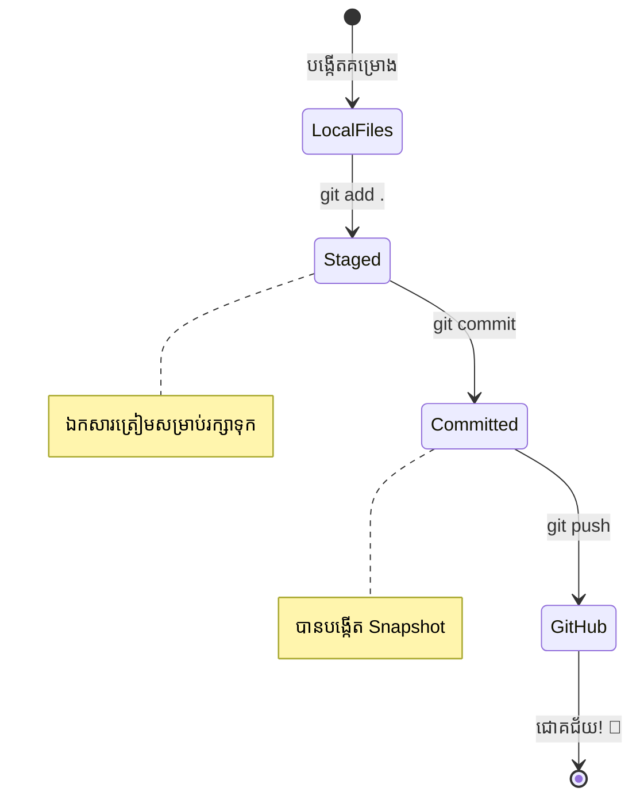
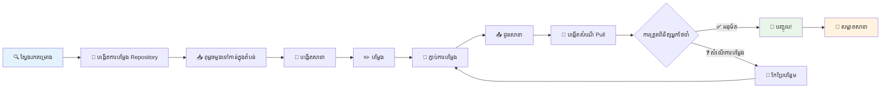
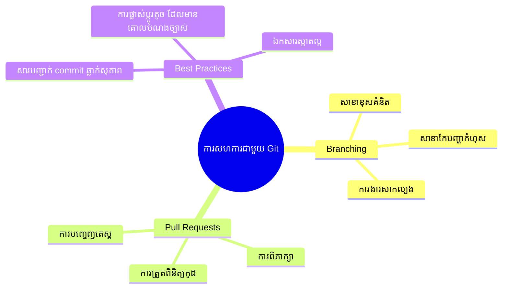
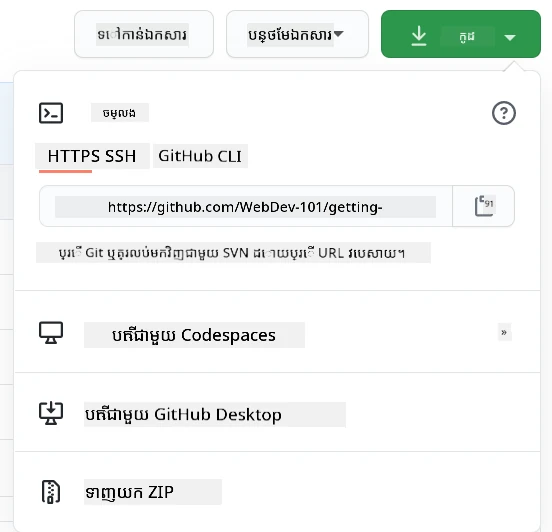
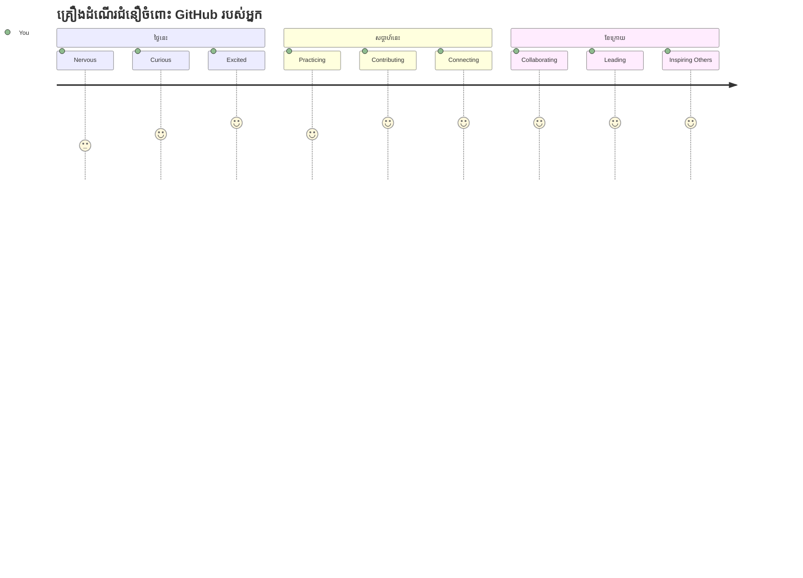

# ការណែនាំអំពី GitHub

សួស្ដី អ្នកអភិវឌ្ឍន៍នាពេលអនាគត! 👋 តើអ្នករៀបចំខ្លួនរួចហើយដើម្បីចូលរួមជាមួយអ្នកសរសេរកូដលើលោករាប់លាននាក់ទេ? ខ្ញុំរីករាយចិត្តណាស់ក្នុងការណែនាំអ្នកទៅកាន់ GitHub – គិតថាវាគឺជាវេទិកាសង្គមសម្រាប់អ្នកកម្មវិធី ដែលជំនួសការចែករំលែករូបថតអាហារពេលត្រង់នេះយើងចែករំលែកកូដ និងសាងសង់របស់អស្ចារ្យៗរួមគ្នា!

អ្វីដែលធ្វើឲ្យខ្ញុំភ្ញាក់ផ្អើលខ្លាំងគឺ៖ ពាក្យសម្រាប់កម្មវិធីទូរស័ព្ទក្នុងហត្ថរបស់អ្នក គេហទំព័រទាំងអស់ដែលអ្នកទស្សនា និងសម្ភារៈភាគច្រើនដែលអ្នកនឹងរៀនប្រើសាងសង់ឡើងដោយក្រុមអ្នកអភិវឌ្ឍន៍ប្រើប្រាស់វេទិកាដូច GitHub។ កម្មវិធីតន្ត្រីដែលអ្នកចូលចិត្ត? មានមនុស្សដូចអ្នកបានចូលរួមក្នុងវា។ ហ្គេមដែលអ្នកមិនអាចដាក់ចេញបាន? ច្បាស់ណាស់ គឺប្រហែលជាបានសាងសង់ជាមួយការសហការរបស់ GitHub។ ហើយឥឡូវនេះ អ្នកនឹងរៀនពីរបៀបចូលរួមជាសមាជិកសហគមន៍ដ៏អស្ចារ្យនោះ!

ខ្ញុំដឹងថាវាអាចមើលទៅស្មុគស្ស្មាញពីដំបូង – ពីព្រោះខ្ញុំចាប់ផ្តើមបានមើលទំព័រ GitHub ដំបូងរបស់ខ្ញុំហើយគិតថា "អ្វីទៅនេះ?" ប៉ុន្តែអ្វីដែលចង់ប្រាប់គឺ អ្នកអភិវឌ្ឍន៍រាល់នាក់បានចាប់ផ្តើមនៅចំណុចដែលអ្នកស្ថិតនៅឥឡូវនេះ។ នៅចុងบทเรียนនេះ អ្នកនឹងមានឃ្លាំង GitHub ផ្ទាល់ឯងមួយ (គិតថាវាជាកន្លែងបង្ហាញគម្រោងផ្ទាល់ខ្លួនលើបណ្ដាញ) ហើយអ្នកនឹងចេះរក្សាទុក កែកូដរបស់អ្នក ចែករំលែកវាជាមួយអ្នកដទៃ និងចូលរួមក្នុងគម្រោងដែលមនុស្សរាប់លានគេប្រើ។

យើងនឹងធ្វើដំណើរនេះរួមគ្នា មួយជំហានក្នុងមួយ។ មិនប្រញាប់មិនខកចិត្តទេ – រស់នៅជាមួយខ្ញុំ និងឧបករណ៍ដ៏អស្ចារ្យដែលនឹងក្លាយជាមិត្តល្អថ្មីរបស់អ្នក!


> Sketchnote ពី [Tomomi Imura](https://twitter.com/girlie_mac)


## សំណួរពីមុនថ្នាក់រៀន
[សំណួរពីមុនថ្នាក់រៀន](https://ff-quizzes.netlify.app)

## ការណែនាំ

មុនពេលយើងចូលទៅក្នុងអ្វីដែលគួរឲ្យរំភើប ពួកយើងត្រូវតែរៀបចំកុំព្យូទ័ររបស់អ្នកសម្រាប់មន្តស្នូល GitHub! នឹកឃើញវាដូចការរៀបចំឧបករណ៍គំនូរ មុនបង្កើតស្នាដៃមួយ – ការមានឧបករណ៍ត្រឹមត្រូវធ្វើឲ្យអ្វីៗរលូន និងសប្បាយចិត្តជាងមុន។

ខ្ញុំនឹងដឹកនាំអ្នកតាមជំហានរាល់ជំហាន ដោយខ្ញុំសន្យាថាវានៅក្រោមកម្រិតភ័យខ្លាចដូចមើលពីដំបូង។ ប្រសិនបើអ្វីមិនចាប់មានន័យភ្លាមៗ នោះគឺធម្មតាទេ! ខ្ញុំនឹកឃើញខ្លួនឯងពេលរៀបចំបរិវេណអភិវឌ្ឍន៍ដំបូងហើយមានអារម្មណ៍ដូចកំពុងអាន hieroglyphics ពីអតីតកាល។ អ្នកអភិវឌ្ឍន៍រាល់នាក់មានអារម្មណ៍ដូចអ្នកឥឡូវនេះ ដោយសង្ស័យថា ពួកគេខំប្រឹងត្រឹមត្រូវឫទេ។ ប្លង់ល្បង់៖ បើអ្នកនៅទីនេះកំពុងរៀន អ្នកមានភាពត្រឹមត្រូវហើយ! 🌟

ក្នុងមេរៀននេះ យើងនឹងគ្របដណ្តប់៖

- ការតាមដានការងារដែលអ្នកធ្វើលើម៉ាស៊ីនរបស់អ្នក
- ការធ្វើការជាមួយគម្រោងជាមួយអ្នកដទៃ
- របៀបចូលរួមនៅក្នុងកម្មវិធីម៉ាស៊ីនកូដឯករាជ្យ

### អ្វីដែលត្រូវមានជាមុន

មកត្រៀមកុំព្យូទ័ររបស់អ្នកសម្រាប់មន្តស្នូល GitHub! កុំបារម្ភ – ការរៀបចំនេះគឺត្រូវធ្វើតែមួយលើក​ប៉ុណ្ណោះ ហើយបន្ទាប់មក អ្នកនឹងរួចរាល់សម្រាប់ដំណើរការសរសេរកូដរបស់អ្នកទាំងមូល។

ឥឡូវនេះ តោះចាប់ផ្តើមពីមូលដ្ឋាន! មុនដំបូង ត្រូវពិនិត្យមើលថា Git មាននៅលើកុំព្យូទ័ររបស់អ្នករួចហើយឬនៅ។ Git គឺដូចជាជំនួយការដ៏វៃឆ្លាតម្នាក់ដែលចងចាំគ្រប់ការផ្លាស់ប្តូររបស់អ្នកផ្នែកកូដ – ល្អជាងចុច Ctrl+S រាល់ពីរវិនាទី (យើងទាំងអស់បានធ្វើហើយ!).

មកមើលថា Git ត្រូវបានដំឡើងរួចដោយវាយពាក្យបញ្ជានេះក្នុង terminal របស់អ្នក៖
`git --version`

បើ Git មិនមាននៅទីនោះទេសូមកុំបារម្ភ! ចូលទៅកាន់ [download Git](https://git-scm.com/downloads) ហើយទាញយកវា។ បន្ទាប់ពីដំឡើងរួច យើងត្រូវណែនាំ Git ដល់អ្នកឲ្យឆ្ងាយថាគឺអ្នកជា៖

> 💡 **ការកំណត់ជាលើកដំបូង**៖ ពាក្យបញ្ជានេះប្រាប់ Git ថាអ្នកជានរណា។ ព័ត៌មាននេះនឹងភ្ជាប់ជាមួយការបញ្ចូលផ្សេងៗ ដែលអ្នកធ្វើ ដូច្នេះជ្រើសរើសឈ្មោះ និងអ៊ីមែលដែលអ្នកធ្វើមិនអូនចិត្តធ្វើការចែករំលែកជាសាធារណៈ។

```bash
git config --global user.name "your-name"
git config --global user.email "your-email"
```

ដើម្បីពិនិត្យមើលថា Git ត្រូវបានកំណត់រួចហើយ អ្នកអាចវាយ៖
```bash
git config --list
```

អ្នកក៏ត្រូវមានគណនី GitHub កម្មវិធីកែសម្រួលកូដ (ដូចជា Visual Studio Code) ហើយត្រូវបើក terminal (ឬ command prompt) របស់អ្នកផងដែរ។

ចូលទៅកាន់ [github.com](https://github.com/) ហើយបង្កើតគណនី ប្រសិនបើអ្នកមិនមានទេ បើមែនទេ សូមចូលគណនី ហើយបំពេញប្រវត្តិរូបរបស់អ្នក។

💡 **គន្លឹះទំនើប**៖ ពិចារណាការកំណត់ [កូនសោ SSH](https://docs.github.com/en/authentication/connecting-to-github-with-ssh) ឬប្រើប្រាស់ [GitHub CLI](https://cli.github.com/) សម្រាប់ការផ្ទៀងផ្ទាត់ងាយស្រួលដោយគ្មានពាក្យសម្ងាត់។

✅ GitHub មិនមែនជាឃ្លាំងកូដតែមួយផ្ទាល់ឯងក្នុងលោកនេះទេ មានផ្សេងទៀត ប៉ុន្តែ GitHub គឺឈ្មោះល្បីជាងគេ។

### ការរៀបចំ

អ្នកនឹងត្រូវការបណ្ណាល័យកូដនៅលើកុំព្យូទ័រផ្ទាល់ខ្លួនមួយ (laptop ឬ PC) និងឃ្លាំងសាធារណៈមួយលើ GitHub ដែលនឹងឲ្យតំរូវការជាឧទាហរណ៍ថាតើរបៀបចូលរួមក្នុងគម្រោងរបស់អ្នកដទៃ។

### ការការពារកូដរបស់អ្នក

យើងនឹងនិយាយអំពីសុវត្ថិភាពខណៈប៉ុន្តែមិនធ្វើឲ្យអ្នកភ័យខ្លាចទេ! គិតថាផែនការណ៍សុវត្ថិភាពទាំងនេះដូចជាការចាក់សោរឡានឬផ្ទះរបស់អ្នក។ វាជាទម្លាប់សាមញ្ញដែលក្លាយជាស្ថាបត្យកម្មទីពីរហើយការពារការងារលំបាករបស់អ្នក។

យើងនឹងបង្ហាញអំពីរបៀបសុវត្ថិភាពទំនើបក្នុងការធ្វើការជាមួយ GitHub ពីដំបូង។ ដូច្នេះ អ្នកនឹងបង្កើតទម្លាប់ល្អដែលនឹងជួយអ្នកក្នុងអាជីពកូដរបស់អ្នក។

ពេលធ្វើការជាមួយ GitHub វាជាការសំខាន់ក្នុងការតាមដានផែនការសុវត្ថិភាពដូចខាងក្រោម៖

| តំបន់សុវត្ថិភាព | ប្រតិបត្តិការល្អបំផុត | មូលហេតុ |
|---------------|---------------|----------------|
| **ការផ្ទៀងផ្ទាត់** | ប្រើកូនសោ SSH ឬ Personal Access Tokens | ពាក្យសម្ងាត់មានសុវត្ថិភាពតិចជាង ហើយត្រូវដកហូតចេញ |
| **ការផ្ទៀងផ្ទាត់ពីរជា** | បើក 2FA លើគណនី GitHub របស់អ្នក | បន្ថែមស្រទាប់ការការពារគណនី |
| **សុវត្ថិភាពឃ្លាំងកូដ** | កុំធ្វើ commit ព័ត៌មានសំងាត់ | កូនសោ API និងពាក្យសម្ងាត់មិនគួរមាននៅក្នុងឃ្លាំងសាធារណៈ |
| **ការគ្រប់គ្រងការពឹងផ្អែក** | បើក Dependabot សម្រាប់ការអាប់ដេត | ប្រើបច្ចេកវិទ្យានេះយកធានាសុវត្ថិភាពនិងជំនាញលើការពឹងផ្អែករបស់អ្នក |

> ⚠️ **ការមិនភ្លេចទុកចិត្តសុវត្ថិភាពសំខាន់**៖ មិនធ្វើ commit កូនសោ API ពាក្យសម្ងាត់ ឬព័ត៌មានសំងាត់ផ្សេងទៀត ទៅក្នុងឃ្លាំងណាមួយទេ។ ប្រើបរិស្ថានអថេរ និងកំណត់ `.gitignore` ដើម្បីការពារទិន្នន័យសំងាត់។

**ការ កំណត់ផ្ទៀងផ្ទាត់សម័យទំនើប៖**

```bash
# បង្កើតកូនសោ SSH (កាលគណិតវិទ្យា ed25519 យុទ្ធសាស្រ្តទំនើប)
ssh-keygen -t ed25519 -C "your_email@example.com"

# កំណត់ Git ដើម្បីប្រើ SSH
git remote set-url origin git@github.com:username/repository.git
```

> 💡 **គន្លឹះវិជ្ជាជីវៈ**៖ កូនសោ SSH លេញបញ្ចេញឲ្យមិនចាំបាច់បញ្ចូលពាក្យសម្ងាត់ជាបន្តបន្ទាប់ ហើយសុវត្ថិភាពជាងវិធីផ្ទៀងផ្ទាត់ធម្មតា។

---

## ការគ្រប់គ្រងកូដរបស់អ្នកដូចជាអ្នកជំនាញ

ដូច្នេះ ទីនេះគឺជាកន្លែងដែលវារីករាយពិតណាស់! 🎉 យើងនឹងរៀនពីរបៀបតាមដាននិងគ្រប់គ្រងកូដរបស់អ្នក ដូចជាអ្នកជំនាញ ហើយវាអាចជារឿងដែលខ្ញុំចូលចិត្តបង្រៀនបំផុត ព្រោះវាត្រូវបានប្រែប្រួលយ៉ាងច្រើនលើវិធីធ្វើការនៅក្រោយ។

សូមគូរនឹកឃើញ៖ អ្នកកំពុងសរសេររឿងមួយអស្ចារ្យ ហើយអ្នកចង់រក្សាទុកគ្រប់ឆាក ទំព័រនិងការកែកែតាមចិត្តដល់ជាច្រើន។ នោះគឺជាអ្វីដែល Git ធ្វើសម្រាប់កូដរបស់អ្នក! វាដូចជាសៀវភៅកំណត់ថ្ងៃដ៏អស្ចារ្យ ដែលចងចាំគ្រប់អ្វីៗបានទាំងអស់ – គ្រប់ការចុចក្តារចុច ការផ្លាស់ប្តូរ គ្រប់ពេល "ops, វាខូចទាំងអស់" ដែលអ្នកអាចបញ្ចប់វិញភ្លាមៗ។

ខ្ញុំនឹងស្មោះថា វាអាចមានអារម្មណ៍ដូចស្ទាក់ស្ទើរពីដំបូង។ នៅពេលខ្ញុំចាប់ផ្តើម ខ្ញុំគិតថា "ហេតុអ្វីខ្ញុំមិនអាចរក្សាទុកឯកសារដូចធម្មតាបាន?" ប៉ុន្តែជឿជាក់លើខ្ញុំ៖ ពេល Git ចាប់អារម្មណ៍ អ្នកនឹងមានពេលដែលគិតថា "តើយ៉ាងដូចម្តេចដែលខ្ញុំបានសរសេរកូដដោយគ្មានវា?" វាដូចជាការរកឃើញអាចហោះបាន ភ្លាមៗបន្ទាប់ពីអ្នកដើរពីជើង!

ឧទាហរណ៍៖ អ្នកមានថតមួយនៅក្នុងកុំព្យូទ័រផ្ទាល់ខ្លួន ជាមួយគម្រោងកូដមួយ និងចង់ចាប់ផ្តើមតាមដានវាប្រើ git - ប្រព័ន្ធ version control មួយ។ មនុស្សខ្លះប្រៀបធៀបការប្រើ git ដូចជាការសរសេរពាក្យស្នេហ៍ទៅអ្នកមួយរយៈនៅអនាគត។ អ្នកអាចអានសារបញ្ចូល commit របស់អ្នកពីរបីថ្ងៃ ឬសប្តាហ៍ ឬខែក្រោយ ដើម្បីចងក្រងមូលហេតុដែលអ្នកបានធ្វើសេចក្ដីសម្រេច មួយឬ "rollback" អ្វីមួយ – នេះគឺនៅពេលដែលអ្នកសរសេរសារបញ្ចូលល្អ។


### ការងារ៖ បង្កើតឃ្លាំងដំបូងរបស់អ្នក!

> 🎯 **បេសកកម្មរបស់អ្នក (ហើយខ្ញុំរីករាយណាស់!)**៖ យើងនឹងបង្កើតឃ្លាំង GitHub ដំបូងរបស់អ្នកដោយរួមគ្នា! នៅពេលដែលយើងបញ្ចប់ អ្នកនឹងមានកន្លែងតូចមួយលើអ៊ិនធឺណិត ជាមួយកូដរបស់អ្នក និងបានធ្វើ commit ដំបូងរបស់អ្នក (ដែលជាពាក្យកម្មវិធីសម្រាប់រក្សាទុកការងាររបស់អ្នកយ៉ាងមានវិជ្ជាជីវៈ)។  
>
> វាជារឿងពិសេសបន្ទាន់ – អ្នកស្ថិតក្នុងដំណើរការចូលរួមជាជសាជាតិនៃអ្នកអភិវឌ្ឍន៍លើពិភពលោក! ខ្ញុំនៅតែចាំអារម្មណ៍រីករាយពេលបង្កើតឃ្លាំងដំបូងរបស់ខ្ញុំ ហើយគិតថា "វានៅតែមិនជឿ!"

មកដើរតាមដំណើរការនេះទាំងអស់ដោយជំហាន។ ចំណាយពេលជាមួយផ្នែកនីមួយៗ – មិនមានរង្វាន់សម្រាប់ការប្រញាប់ប្រៀបទេ ហើយខ្ញុំសន្យាថាជំហាននីមួយៗនឹងមានអត្ថន័យ។ ចាំយ៉ាងហ្មត់ចត់ អ្នកល្បីៗទាំងអស់ដែលអ្នកគោរពបានធ្លាប់អង្គុយនៅចំណុចដែលអ្នកនៅឥឡូវនេះ កំពុងរៀបចំឃ្លាំងដំបូងរបស់ពួកគេ។ វាពិតជាល្អមែនទេ?

> មើលវីដេអូ
> 
> [](https://www.youtube.com/watch?v=9R31OUPpxU4)

**មកធ្វើរួមគ្នា៖**

1. **បង្កើតឃ្លាំងរបស់អ្នកលើ GitHub**។ ទៅកាន់ GitHub.com ហើយស្វែងរកប៊ូតុងបៃតងចាំង **New** (ឬនិមិត្តសញ្ញា **+** នៅជ្រុងខាងលើស្តាំ)។ ចុចវា ហើយជ្រើស **New repository**។

   ការប្រតិបត្តិ ៖
   1. ផ្ដល់ឈ្មោះឃ្លាំងរបស់អ្នក – ជ្រើសតែឈ្មោះមានអត្ថន័យចំពោះអ្នក។
   1. បន្ថែមការពិពណ៌នាបើអ្នកចង់ (នេះជួយអ្នកដទៃយល់ពីគម្រោងរបស់អ្នក)
   1. សម្រេចចិត្តថាតើអ្នកចង់ឲ្យវាសាធារណៈ (គ្រប់គ្នាអាចឃើញ) ឬឯកជន (សម្រាប់អ្នកតែម្ដង)
   1. ខ្ញុំណែនាំឲ្យពិនិត្យប្រអប់បន្ថែមឯកសារ README – វាដូចជាទំព័រមុខគម្រោងរបស់អ្នក
   1. ចុច **Create repository** ហើយសាទរក្នុងការបង្កើត repo ដំបូងរបស់អ្នក! 🎉

2. **រុករកទៅថតគម្រោងរបស់អ្នក**។ ឥឡូវនេះបើក terminal របស់អ្នក (កុំបារម្ភ វាមិនគួរភ័យខ្លាចដូចមើលទេ!)។ យើងត្រូវប្រាប់កុំព្យូទ័រថាតើឯកសារគម្រោងរបស់អ្នកនៅឯណា។ វាយបញ្ជា៖

   ```bash
   cd [name of your folder]
   ```

   **អ្វីដែលយើងកំពុងធ្វើ៖**
   - យើងកំពុងនិយាយថា "សួរ កុំព្យូទ័រ នាំខ្ញុំទៅថតគម្រោង"
   - វាដូចជាការបើកថតមួយលើផ្ទាំងដេស្ខដ៏របស់អ្នក តែយើងកំពុងធ្វើវាយកមួយជាមួយពាក្យបញ្ជា។
   - ជំនួស `[name of your folder]` ជាឈ្មោះពិតនៃថតគម្រោងរបស់អ្នក។

3. **បម្លែងថតរបស់អ្នកទៅជាឃ្លាំង Git**។ នេះជាគន្លងនៃមន្តស្នូល! វាយ៖

   ```bash
   git init
   ```

   **នេះហើយជាអ្វីដែលកើតឡើង (វាជារឿងល្អណាស់!):**
   - Git បានបង្កើតថត `.git` លាក់ក្នុងគម្រោងរបស់អ្នក – អ្នកមិនអាចមើលឃើញវាប៉ុន្តែវានៅទីនោះ!
   - ថតធម្មតារបស់អ្នកឥឡូវជា "repository" ដែលអាចតាមដានការផ្លាស់ប្តូរទាំងអស់បាន។
   - គិតថាវាជាការផ្តល់ថាច់កំលាំងអភិវឌ្ឍទៅថតរបស់អ្នក ដើម្បីចងចាំគ្រប់វាណាមួយ។

4. **ពិនិត្យមើលអ្វីកំពុងកើតឡើង**។ មកមើលថា Git ថាបែបណាក្នុងគម្រោងរបស់អ្នកឥឡូវនេះ៖

   ```bash
   git status
   ```

   **យល់អំពីអ្វីដែល Git ថ្លែង៖**

   អ្នកអាចឃើញអ្វីមួយដូចខាងក្រោម៖

   ```output
   Changes not staged for commit:
   (use "git add <file>..." to update what will be committed)
   (use "git restore <file>..." to discard changes in working directory)

        modified:   file.txt
        modified:   file2.txt
   ```

   **កុំភ័យ! នេះមានហេតុអ្វី៖**
   - ឯកសារត្រូវបានពណ៌ **ក្រហម** មានការផ្លាស់ប្តូរ ប៉ុន្តែមិនមានត្រាទុកទេ
   - ឯកសារត្រូវបានពណ៌ **បៃតង** (បើអ្នកឃើញវា) មានត្រាទុករួចហើយ
   - Git កំពុងជួយប្រាប់អ្នកថាអ្នកអាចធ្វើអ្វីខាងក្រោម។

   > 💡 **វាងាយស្រួលផងដែរ៖** ពាក្យបញ្ជា `git status` គឺជាមិត្តល្អរបស់អ្នក! ប្រើវា​ពេលណាដែលអ្នកចង់ដឹងអំពីស្ថានភាព។ វាដូចជាការសួរ Git ថា "ស្ថានភាពបច្ចុប្បន្នជាអ្វី?"

5. **រៀបចំឯកសាររបស់អ្នកសម្រាប់រក្សាទុក** (ហៅថា "staging")៖

   ```bash
   git add .
   ```

   **អ្វីដែលយើងធ្វើទៅហើយ៖**
   - យើងបានប្រាប់ Git ថា "ខ្ញុំចង់បញ្ចូលឯកសារទាំងអស់ក្នុងការសន្សំខាងមុខ"
   - `.` មានន័យថា "គ្រប់អ្វីក្នុងថតនេះ"
   - ឥឡូវនេះឯកសាររបស់អ្នកត្រូវបាន "staged" ហើយរួចរាល់សម្រាប់ជំហានបន្ទាប់

   **ចង់ជ្រើសរើសវិញមែនទេ?** អ្នកអាចបញ្ចូលឯកសារពិសេសបានផងដែរ៖

   ```bash
   git add [file or folder name]
   ```

   **ហេតុអ្វីអ្នកអាចចង់ធ្វើបែបនេះ៖**
   - ករណីមួយចំនួន អ្នកចង់រក្សាទុកការផ្លាស់ប្តូរដែលទាក់ទងគ្នា
   - វាជួយអ្នករៀបចំការងារជាចំណែកត្រឹមត្រូវ
   - ងាយស្រួលយល់ថាអ្វីបានផ្លាស់ប្តូរនិងពេលណា

   **ផ្លាស់ប្តូរមានការផ្លាស់ប្តូរឫ?** កុំបារម្ភ! អ្នកអាចយកឯកសារចេញពី staging ដូចខាងក្រោម៖

   ```bash
   # ដកធាតុទាំងអស់ចេញពីការតម្រង
   git reset
   
   # ដកធាតុគឺឯកសារតែមួយចេញពីការតម្រង
   git reset [file name]
   ```

   កុំបារម្ភ – វាមិនលុបការងាររបស់អ្នកទេ តែផ្តាច់ឯកសារពីចំណាត់ការអំបោះសម្រាប់រក្សាទុក។

6. **រក្សាទុកការងាររបស់អ្នកជាអចិន្រ្តៃយ៍** (ធ្វើ commit ដំបូងរបស់អ្នក!)៖

   ```bash
   git commit -m "first commit"
   ```

   **🎉 អបអរសាទរ! អ្នកបានធ្វើ commit ដំបូងរបស់អ្នកហើយ!**

   **អ្វីកើតឡើង៖**
   - Git បានយក "រូបភាព​ថត" នៃឯកសារដែលបាន staged នៅពេលនេះ
   - សារបញ្ចូល commit "first commit" បញ្ជាក់ពីពេលកំណត់សន្សំនេះ
   - Git បានផ្ដល់លេខសម្គាល់ពិសេសដល់រូបភាពថតនេះ ដូច្នេះអ្នកអាចស្វែងរកវាបានពេលដែលចង់
   - អ្នកបានចាប់ផ្តើមតាមដានប្រវត្តិកម្មវិធីរបស់គម្រោងរបស់អ្នកឱ្យជាផ្លូវការហើយ!

   > 💡 **សារបញ្ចូល commit នៅពេលក្រោយ**៖ សម្រាប់ commit បន្ទាប់ សូមប្រើពាក្យលម្អិតជាងមុន! ជំនួស "updated stuff" សូមសរសេរ "Add contact form to homepage" ឬ "Fix navigation menu bug"។ អ្នកលើកកម្ពស់របស់អ្នកនឹងអរគុណអ្នក!

7. **ភ្ជាប់គម្រោងផ្ទាល់ខ្លួនរបស់អ្នកទៅ GitHub**។ លុះត្រាតែពេលនេះ គម្រោងរបស់អ្នកមានតែលើកុំព្យូទ័រតែមួយ។ មកភ្ជាប់វាទៅឃ្លាំង GitHub ដើម្បីចែករំលែកវាជាមួយពិភពលោក!

   ជាលើកដំបូង ចូលទំព័រឃ្លាំង GitHub របស់អ្នក ហើយចម្លង URL។ បន្ទាប់មកមកទីនេះ វាយ៖

   ```bash
   git remote add origin https://github.com/username/repository_name.git
   ```
   
   (ជំនួស URL នោះជាមួយ URL  thậtប្រាកដរបស់ឃ្លាំងរបស់អ្នក!)

   **អ្វីដែលយើងធ្វើទៅហើយ៖**
   - យើងបានបង្កើតការតភ្ជាប់រវាងគម្រោងក្នុងម៉ាស៊ីនរបស់អ្នក និងឃ្លាំង GitHub របស់អ្នក
   - "Origin" គឺជាជារាងឈ្មោះរាយសំរាប់ឃ្លាំង GitHub របស់អ្នក – វាដូចជាការបន្ថែមអ្នកទាក់ទងទៅក្នុងទូរស័ព្ទរបស់អ្នក
   - ឥឡូវនេះ Git នៅក្នុងម៉ាស៊ីនរបស់អ្នកដឹងថាត្រូវផ្ញើកូដរបស់អ្នកទៅណា នៅពេលដែលអ្នកបានរៀបចំចែកចាយវា

   💡 **វិធីងាយស្រួល**: ប្រសិនបើអ្នកមាន GitHub CLI បានដំឡើង អ្នកអាចធ្វើនេះដោយពាក្យបញ្ជាមួយតែមួយ៖
   ```bash
   gh repo create my-repo --public --push --source=.
   ```

8. **ផ្ញើកូដរបស់អ្នកទៅ GitHub** (ពេលវេលាសំខាន់!):

   ```bash
   git push -u origin main
   ```

   **🚀 នេះហើយ! អ្នកកំពុងផ្ទុកកូដរបស់អ្នកទៅ GitHub!**
   
   **អ្វីកំពុងកើតឡើង៖**
   - ការប្ដូររបស់អ្នកកំពុងធ្វើដំណើរពីកុំព្យូទ័ររបស់អ្នកទៅ GitHub
   - បញ្ជាក់ `-u` កំណត់ការតភ្ជាប់ជាថ្មីមួយ ដើម្បីឲ្យការផ្ញើនៅពេលក្រោយកាន់តែងាយស្រួល
   - "main" គឺជាឈ្មោះសាខាចម្បងរបស់អ្នក (ដូចថតសំខាន់)
   - បន្ទាប់ពីនេះ អ្នកអាចគ្រាន់តែវាយ `git push` សម្រាប់ការផ្ទុកបន្ទាប់!

   💡 **ចំណាំរហ័ស**: ប្រសិនបើសាខារបស់អ្នកមានឈ្មោះផ្សេង (ដូចជា "master") សូមប្រើឈ្មោះនោះជំនួស។ អ្នកអាចពិនិត្យបានជាមួយ `git branch --show-current`។

9. **របបកូដថ្មីប្រចាំថ្ងៃរបស់អ្នក** (នេះជាកន្លែងដែលវាក្លាយជាវិជ្ជាជីវៈ!):

   ចាប់ពីពេលនេះទៅ តWheneverអ្នកធ្វើការប្រែប្រាស់លើគម្រោងរបស់អ្នក អ្នកមានការតំណើរការរង្វិលបីជំហាននេះងាយៗ៖

   ```bash
   git add .
   git commit -m "describe what you changed"
   git push
   ```

   **នេះក្លាយជាឈាមដាន់កូដរបស់អ្នក៖**
   - បង្កើតការផ្លាស់ប្តូរល្អបំផុតទៅលើកូដរបស់អ្នក✨
   - ដាក់វាទៅក្នុងស្តេចជាមួយ `git add` ("សួរសំណួរពី Git, សូមចាប់អារម្មណ៍សម្រាប់ការផ្លាស់ប្តូរទាំងនេះ!")
   - រក្សាវាជាមួយ `git commit` ហើយបញ្ចូលសារ​ពិពណ៌នា (អ្នកនៅពេលអនាគតនឹងអរគុណអ្នក!)
   - ចែករំលែកវា​ទៅ​សកលលោក​ប្រើ `git push` 🚀
   - ធ្វើឡើងវិញ និង​ធ្វើម្ដងទៀត – ពិតជាវាជាការសាមញ្ញដូចជាការដកដង្ហើម!

   ខ្ញុំចូលចិត្តការដំណើរការនេះ ព្រោះវាដូចជាមានចំនុចរក្សាទុកច្រើនចំពោះហ្គេមវីដេអូមួយ។ ប្តូរអ្វីដែលអ្នកចូលចិត្តហើយ? Commit វា! ចង់សាកល្បងអ្វីមួយគ្រោះថ្នាក់មែនទេ? មិនបញ្ហា – អ្នកអាចត្រឡប់ទៅ commit ចុងក្រោយរបស់អ្នកពេលដែលមានបញ្ហា!

   > 💡 **ធ្វើតាមគន្លឹះ**: អ្នកក៏អាចចង់ទទួលបានឯកសារ `.gitignore` ដើម្បីបិទមិនអោយឯកសារដែលអ្នកមិនចង់តាមដានបង្ហាញនៅលើ GitHub – ដូចឯកសារសំំណេីសដែលអ្នករក្សាទុកនៅក្នុងថតដូចគ្នា តែគ្មានទីតាំងនៅលើឃ្លាំងសាធារណៈ។ អ្នកអាចរកមើលគំរូសម្រាប់ឯកសារ `.gitignore` បាននៅ [។gitignore templates](https://github.com/github/gitignore) ឬបង្កើតមួយដោយប្រើ [gitignore.io](https://www.toptal.com/developers/gitignore)។

### 🧠 **ការត្រួតពិនិត្យ仓ាRepositoryដំបូង៖ តើអ្នកមានអារម្មណ៍យ៉ាងដូចម្តេច?**

**ចំណាយពេលមួយរយៈ ដើម្បីអបអរសាទរ និងចម្រាញ់មតិយោបល់៖**
- តើអ្នកមានអារម្មណ៍យ៉ាងដូចម្តេចពេលឃើញកូដរបស់អ្នកបង្ហាញនៅលើ GitHub ជាលើកដំបូង?
- ជំហានណាដែលអ្នកមានអារម្មណ៍រញាប់រង់, ហើយជំហានណាដែលមានអារម្មណ៍ងាយស្រួលមិនគួរឱ្យទំព័រជាងគេ?
- តើអ្នកអាចពន្យល់ភាពខុសគ្នារវាង `git add`, `git commit`, និង `git push` ដោយប្រើពាក្យរបស់អ្នកឯងបានទេ?


> **ចងចាំ**: អ្នកអwickយ័នដែលមានបទពិសោធន៍ខ្លះៗ ក៏អាចភ្លេចបញ្ជាការយ៉ាងម៉ត់ចត់។ ការធ្វើឲ្យដំណើរការនេះក្លាយជា நினាប់ដល់ចិត្តបេះដូង ត្រូវការប្រយ័ត្នធ្វើអនុវត្ត – អ្នកកំពុងធ្វើបានល្អហើយ!

#### របៀបប្រើ Git ទំនើប

ពិចារណាទទួលយកការអនុវត្តទំនើបទាំងនេះ៖

- **Conventional Commits**: ប្រើទ្រង់ទ្រាយសារប្ដូរដែលមានស្តង់ដារដូចជា `feat:`, `fix:`, `docs:`, ល។ ស្វែងយល់បន្ថែមនៅ [conventionalcommits.org](https://www.conventionalcommits.org/)
- **Atomic commits**: បង្កើត commit ទីមួយមួយដែលតំណាងអោយការផ្លាស់ប្តូរតែមួយគត់
- **Frequent commits**: commit ជាញឹកញាប់ជាមួយសារ​ពិពណ៌នាជិតស្និទ្ធ មិនមែន commit ធំ និងគ្រាអស់កំឡុងពេលវែង

#### សារសម្រាប់ commit

ខ្សែសង្វាក់ចំណងជើង commit Git ល្អ គួរឱ្យបញ្ចប់វាគ្មិនដូចតទៅ៖
បើយោងទៅលើ វា commit នឹង <ប្រធានបទរបស់អ្នកនៅទីនេះ>

សម្រាប់ប្រធានបទ សូមប្រើប្រយោគបញ្ជាដែលមានទិសបច្ចុប្បន្ន៖ "change" មិនមែន "changed" ឬ "changes"។\
ដូចដែលនៅក្នុងប្រធានបទ នៅក្នុងខ្លឹមសារពេញ (ជាជម្រើស) ក៏ប្រើប្រយោគបញ្ជា ទិសបច្ចុប្បន្នផងដែរ។ ខ្លឹមសារគួរឱ្យមានមូលហេតុសម្រាប់ការផ្លាស់ប្តូរនិងផ្ទៀងផ្ទាត់​មើលពីទំលាប់ពីមុន។ អ្នកកំពុងពន្យល់ពី «ហេតុអ្វី» មិនមែន «របៀប»។

✅ ចំណាយពេលប៉ុន្មាននាទី ស្វែងរកនៅលើយើង GitHub។ តើអ្នកអាចរកឃើញសារប្ដូរល្អមួយ? តើអ្នកអាចរកឃើញសារប្ដូរបំផុតតិចមួយ? តើព័ត៌មានណាអ្នកគិតថា មានសារៈសំខាន់ និងមានប្រយោជន៍បំផុតក្នុងការបញ្ជូនទៅក្នុងសារប្ដូរមួយ?

## ធ្វើការជាមួយអ្នកដទៃ (ផ្នែករីករាយ!)

សូមចូលចិត្តកីឡាក្រវាត់របស់អ្នក ព្រោះនេះជាកន្លែងដែល GitHub ក្លាយជាមហិច្ឆតា ពិតប្រាកដ! 🪄 អ្នកបានទទួលជំនាញគ្រប់គ្រងកូដផ្ទាល់ខ្លួនរួចមកហើយ ប៉ុន្តែឥឡូវនេះយើងកំពុងចូលទៅកាន់ផ្នែកដែលខ្ញុំចូលចិត្តបំផុត – ការសហការជាមួយមនុស្សដ៏អស្ចារ្យពីគ្រប់ជ្រុងជ្រោយពិភពលោក។

ស្រមៃឃើញ៖ អ្នកភ្ញាក់ឡើងនៅស្អែក ហើយឃើញថាមនុស្សម្នាក់នៅទូក្យូ បានធ្វើឲ្យកូដរបស់អ្នកកាន់តែប្រសើរទៅរឿងចុងក្រោយពេលអ្នកគេង។ បន្ទាប់មកមនុស្សម្នាក់នៅប៊ែរឡាញ់ បានជួសជុលបញ្ហាដែលអ្នកពិបាក។ វេលាសៀកថ្ងៃត្រង់ អ្នកអភិវឌ្ឍនៅ São Paulo បានបន្ថែមមុខងារមួយដែលអ្នកមិនដែលគិតដល់ទេ។ វានៅមិនមែនគឺវិទ្យាសាស្ត្រសិចទេ – វាគ្រាន់តែជាថ្ងៃអង្គារនៅលើពិភព GitHub!

អ្វីដែលធ្វើឲ្យខ្ញុំរីករាយជាងគេគឺជំនាញសហការដែលអ្នកកំពុងនឹងរៀន? វាគឺជារបៀបដំណើរការពេញលេញដូចគ្នានៅក្នុងក្រុម Google, Microsoft និង Startup ដែលអ្នកចូលចិត្តប្រើរាល់ថ្ងៃ។ អ្នកមិនគ្រាន់តែជ្រាបឧបករណ៍ស្ងប់ស្ងាត់មួយទេ – អ្នកកំពុងរៀនភាសាផលិតកម្មដែលធ្វើឲ្យពិភពកម្មវិធីទាំងមូលសហប្រតិបត្តិការជាមួយគ្នា។

ពិតជាអីចឹង ពេលអ្នកបានស្គាល់អារម្មណ៍ខណៈដែលមានមនុស្សរួមបញ្ចូល pull request ដំបូងរបស់អ្នក អ្នកនឹងយល់ថាហេតុអីអ្នកអភិវឌ្ឍឯកទេសមានចិត្តខ្លាំងចំពោះ open source។ វាដូចជាជាផ្នែកមួយនៃគំរោងក្រុមធំជាងគេបំផុតនិងមានភាពច្នៃប្រឌិតបំផុតនៃពិភពលោក!

> ទស្សនាវីដេអូ
>
> [](https://www.youtube.com/watch?v=bFCM-PC3cu8)

ហេតុផលសំខាន់ក្នុងការដាក់អ្វីៗនៅលើ GitHub គឺដើម្បីអនុញ្ញាតឲ្យមានការសហការជាមួយអ្នកអភិវឌ្ឍផ្សេងទៀត។


នៅក្នុងឃ្លាំងរបស់អ្នក ធ្វើការបើកទៅ `Insights > Community` ដើម្បីមើលថាគម្រោងរបស់អ្នកប្រៀបធៀបបានយ៉ាងដូចម្តេចទៅនឹងស្តង់ដារសហគមន៍ដែលបានផ្តល់អនុសាសន៍។

ចង់ធ្វើឲ្យឃ្លាំងរបស់អ្នកមើលទៅជាម្ចាស់ជំនាញនិងអំណេីបអំអំ? ចូលទៅឃ្លាំងរបស់អ្នក ហើយចុច `Insights > Community`។ មុខងារនេះបង្ហាញអ្នកឃើញថាគម្រោងរបស់អ្នកអាចប្រៀបធៀបយ៉ាងណាទៅនឹងអ្វីដែលសហគមន៍ GitHub គិតថា "អនុវត្តន៍ឃ្លាំងល្អ"។

> 🎯 **ធ្វើឲ្យគម្រោងរបស់អ្នកភ្លឺថ្លា**: ឃ្លាំងដែលបានរៀបចំល្អជាមួយឯកសារពិពណ៌នាល្អដូចជាការមានមុខហាងស្អាត និងមានការស្វាគមន៍។ វាប្រាប់អ្នកផ្សេងទៀតថាអ្នកយកចិត្តទុកដាក់នឹងការងាររបស់អ្នក ហើយធ្វើឲ្យគេចង់ចូលរួមដែរ!

**នេះហើយជាអ្វីដែលធ្វើឲ្យឃ្លាំងមួយល្អឥតខ្ចោះ៖**

| តើត្រូវបន្ថែមអ្វី | ហេតុអ្វីវាស័ក្ដិសម | វាធ្វើអ្វីសម្រាប់អ្នក |
|-------------|-------------------|---------------------|
| **ការពិពណ៌នា** | ការចាប់ផ្តើមវ័យ១ មានសារៈសំខាន់! | មនុស្សឃើញភ្លាមថាគម្រោងរបស់អ្នកធ្វើអ្វី |
| **README** | ទំព័រមុខគម្រោងរបស់អ្នក | ដូចជាមគ្គុទេសក៍ស្វាគមន៍សម្រាប់ភ្ញៀវថ្មី |
| **សេចក្ដីណែនាំការចូលរួម** | បង្ហាញថាអ្នកស្វាគមន៍ជំនួយ | មនុស្សដឹងច្បាស់ថាពួកគេចូលរួមដោយរបៀបណា |
| **កូដអាកប្បកិរិយា** | បង្កើតកន្លែងមេត្រីភាព | អ្នកទាំងអស់គ្នារីករាយចូលរួម |
| **ប័ណ្ណអាជ្ញាប័ណ្ណ** | ភស្តុតាងផ្នែកច្បាប់ | អ្នកផ្សេងទៀតដឹងថាពួកគេអាចប្រើកូដរបស់អ្នកយ៉ាងដូចម្តេច |
| **គោលនយោបាយសុវត្ថិភាព** | បង្ហាញថាអ្នកមានក្តីទុកចិត្ត | បង្ហាញការអនុវត្តវិជ្ជាជីវៈ |

> 💡 **គន្លឹះវិជ្ជាជីវៈ**: GitHub ផ្តល់គំរូសម្រាប់ឯកសារទាំងនេះទាំងអស់។ ពេលបង្កើតឃ្លាំងថ្មី សូមពិនិត្យប្រអប់ទាំងនេះ ដើម្បីបង្កើតឯកសារទាំងនេះដោយស្វ័យប្រវត្តិ។

**មុខងារថ្មីៗនៃ GitHub ដែលត្រូវពិនិត្យសិក្សា៖**

🤖 **ស្វ័យប្រវត្តិ និង CI/CD:**
- **GitHub Actions** សម្រាប់ការតេស្ត និងចាក់បញ្ចូលដោយស្វ័យប្រវត្តិ
- **Dependabot** សម្រាប់ធ្វើបច្ចុប្បន្នភាពឧបករណ៍ជាលក្ខណៈស្វ័យប្រវត្តិ

💬 **សហគមន៍ និងគ្រប់គ្រងគម្រោង:**
- **GitHub Discussions** សម្រាប់ការពិភាក្សាសហគមន៍លើសពីបញ្ហា
- **GitHub Projects** សម្រាប់ការគ្រប់គ្រងគម្រោងរាល់ថ្ងៃជាប្រភេទកំណត់ត្រា​
- **Branch protection rules** ដើម្បីរឹតបន្តឹងស្តង់ដារកូដគុណភាព


ធនធានទាំងនេះនឹងមានប្រយោជន៍ក្នុងការបង្ហាញអ្នកជាមួយក្រុមថ្មីៗ។ លម្អិតเหล่านี้ជារឿយៗជារឿងដែលអ្នកចូលរួមថ្មីៗពិនិត្យមើលមុននឹងមើលកូដរបស់អ្នក ដើម្បីរកមើលថាគម្រោងរបស់អ្នកសមរម្យសម្រាប់ពួកគេចំណាយពេលឬអត់។

✅ ឯកសារ README ទោះបីមានពេលវេលាច្រើនក្នុងការរៀបចំ ក៏ពួកវាមិនត្រូវបានថែរក្សាពីអ្នកត្រូវបម្រើការងារច្រើនជារឿយៗទេ។ តើអ្នកអាចរកឃើញឯកសារមួយដែលមានការពិពណ៌នាអែម៉គ្រប់គ្រាន់ទេ? ចំណាំ៖ មានឧបករណ៍ខ្លះៗដែលជួយបង្កើត README ល្អៗ [tools to help create good READMEs](https://www.makeareadme.com/) ដែលអ្នកអាចចង់សាកល្បង។

### ភារកិច្ច: បញ្ចូលកូដមួយចំនួន

ឯកសាររួមចូលជួយឲ្យមនុស្សចូលរួមក្នុងគម្រោង។ វាពន្យល់ពីប្រភេទនៃការរួមចំណែកដែលអ្នកកំពុងស្វែងរក និងរបៀបដំណើរការនេះដំណើរការ។ អ្នករួមចំណែកត្រូវការធ្វើជាដំណាក់កាលជាបន្តបន្ទាប់ ដើម្បីអាចចូលរួមក្នុងឃ្លាំងរបស់អ្នកនៅលើ GitHub៖


1. **Forking your repo** អ្នកប្រហែលជាចង់ឲ្យមនុស្សចូលចិត្ត _fork_ គម្រោងរបស់អ្នក។ Forking មានន័យថាបង្កើតច្បាប់តំណាងនៃឃ្លាំងរបស់អ្នកនៅលើប្រវត្តិរូប GitHub របស់ពួកគេ។
1. **Clone**។ ពីទីនោះពួកគេនឹង clone គម្រោងទៅម៉ាស៊ីនផ្ទាល់ខ្លួនរបស់ពួកគេ។
1. **បង្កើតសាខា**។ អ្នកចង់ស្នើឲ្យពួកគេបង្កើត _branch_ មួយសម្រាប់ការងាររបស់ពួកគេ។
1. **ផ្ដោតការផ្លាស់ប្តូរបស់ពួកគេលើតំបន់មួយ**។ សូមស្នើឲ្យអ្នករួមចំណែកផ្ដោតការចូលរួមរបស់ពួកគេទៅលើរឿងតែមួយម្តងៗ – ដូច្នេះឱកាសក្នុងការអាច _merge_ ការងាររបស់ពួកគេទៅកាន់គម្រោងរបស់អ្នកនឹងខ្ពស់ឡើង។ សូមស្រមៃថាពួកគេបានសរសេរជួសជុល bug មួយ បន្ថែមមុខងារថ្មីមួយ និងធ្វើបច្ចុប្បន្នភាពតេស្តជាច្រើន – ប្រសិនបើអ្នកចង់ ឬ អាចម៉ាសុំអនុវត្តតែកែប្រែពីរចំណែកក្នុងចំណោមបី ឬតែ១ ចំណែកក្នុងចំណោមបី?

✅ សូមស្រមៃពីสถานการณ์ដែលសាខាមានសារៈសំខាន់ជាងគេក្នុងការសរសេរ និងដឹកជញ្ជូនកូដល្អ។ តើអ្នកអាចគិតឃើញករណីប្រើប្រាស់អ្វីខ្លះ?

> ចំណាំ សូមជាអ្នកប្តូរដែលអ្នកចង់ឃើញក្នុងពិភពលោក ហើយបង្កើតសាខាសម្រាប់ការងារផ្ទាល់ខ្លួនរបស់អ្នកផងដែរ។ commit មួយណាមួយដែលអ្នកធ្វើ នឹងជា commit នៅលើសាខាដែលអ្នកកំពុង "checked out" ។ ប្រើ `git status` ដើម្បីមើលថាសាខាណា។

យើងនឹងរត់តាមរបៀបរួមចំណែកអ្នករួមគ្នា។ សន្និដ្ឋានថាអ្នករួមចំណែកបាន _fork_ និង _clone_ ឃ្លាំងរួចរួមចំណែកហើយ មាន Git repo រួចដើម្បីធ្វើការលើវាបាននៅក្នុងម៉ាស៊ីនផ្ទាល់ខ្លួនរបស់ពួកគេ៖

1. **បង្កើតសាខា**។ ប្រើពាក្យបញ្ជា `git branch` ដើម្បីបង្កើតសាខាមួយដែលនឹងមានការផ្លាស់ប្តូរដែលពួកគេចង់ចូលរួម៖

   ```bash
   git branch [branch-name]
   ```

   > 💡 **វិធីទំនើប**: អ្នកអាចបង្កើត និងប្តូរសាខាថ្មីក្នុងពាក្យបញ្ជាមួយតែមួយ៖
   ```bash
   git switch -c [branch-name]
   ```

1. **ប្តូរសាខាការងារ**។ ប្តូរទៅសាខារបានបញ្ជាក់ហើយធ្វើបច្ចុប្បន្នភាពថតការងារជាមួយ `git switch`៖

   ```bash
   git switch [branch-name]
   ```

   > 💡 **ចំណាំទំនើប**: `git switch` ជំនួសថ្មីសម្រាប់ `git checkout` ពេលប្តូរសាខា។ វាស្រួលយល់ និងមានសុវត្ថិភាពសម្រាប់អ្នកចាប់ផ្ដើម។

1. **ធ្វើការងារ**។ នៅពេលនេះ អ្នកចង់បន្ថែមការផ្លាស់ប្តូររបស់អ្នក។ កុំភ្លេចប្រាប់ Git ជាមួយពាក្យបញ្ជាខាងក្រោម៖

   ```bash
   git add .
   git commit -m "my changes"
   ```

   > ⚠️ **គុណភាពសារបំប្លែង**: ធានាថាអ្នកផ្តល់ឈ្មោះ commit ល្អ មិនត្រឹមតែសម្រាប់ខ្លួនអ្នកទេ និងសម្រាប់អ្នកថែរក្សាឃ្លាំងដែលអ្នកជួយផងដែរ។ សូមច្បាស់លាស់អំពីអ្វីដែលអ្នកបានផ្លាស់ប្តូរ!

1. **បញ្ចូលការងាររបស់អ្នកជាមួយសាខា `main`**។ នៅកម្រិតណាមួយ អ្នកបានបញ្ចប់ការងារហើយចង់បញ្ចូលការងាររបស់អ្នកជាមួយសាខា `main`។ សាខា `main` អាចបានផ្លាស់ប្តូរផងដែរ ដូច្នេះសូមប្រាកដអោយវាបច្ចុប្បន្នបំផុតជាមុនជាមួយពាក្យបញ្ជាខាងក្រោម៖

   ```bash
   git switch main
   git pull
   ```

   នៅពេលនេះ អ្នកចង់ប្រាកដថាមាន _ជម្លោះ_ ទេ ដែលស្ថានការណ៍ដែល Git មិនអាច _បញ្ចូល_ ការផ្លាស់ប្តូរបានយូរឡើងនៅក្នុងសាខាការងាររបស់អ្នក។ ដូច្នេះ រៀបចំពាក្យបញ្ជារខាងក្រោម៖

   ```bash
   git switch [branch_name]
   git merge main
   ```

   ពាក្យបញ្ជា `git merge main` នឹងយកការផ្លាស់ប្តូរ​ទាំងអស់ពី `main` មកនៅក្នុងសាខារបស់អ្នក។ សង្ឃឹមថាអ្នកអាចបន្តធ្វើបាន។ ប្រសិនបើមិនដូច្នោះទេ VS Code នឹងប្រាប់អ្នកថា Git មានភាព _ងងឹត_ នៅទីណា ហើយអ្នកគ្រាន់តែផ្លាស់ប្តូរឯកសារដែលទទួលរងផលប៉ះពាល់ ដើម្បីបញ្ជាក់ថាតើមាតិកាណាដែលត្រឹមត្រូវជាងគេ។

   💡 **ជំរឿនទំនើប**: ពិចារណាប្រើ `git rebase` ដើម្បីបានប្រវត្តិសង្ខេប៖
   ```bash
   git rebase main
   ```
   វាបញ្ចូល commit របស់អ្នកលើកំពូលសាខា main ចុងក្រោយ បង្កើតប្រវត្តិនៃរបៀបសំរាប់ជាត្រឡប់មួយ។

1. **ផ្ញើការងាររបស់អ្នកទៅ GitHub**។ ផ្ញើការងាររបស់អ្នកទៅ GitHub មានទីបំផុតពីរអ្វី។ ផ្ញើសាខារបស់អ្នកទៅឃ្លាំងរបស់អ្នក ហើយបើក PR (Pull Request) ។

   ```bash
   git push --set-upstream origin [branch-name]
   ```

   ពាក្យបញ្ជាខាងលើបង្កើតសាខានៅលើឃ្លាំង fork របស់អ្នក។

### 🤝 **ការត្រួតពិនិត្យជំនាញសហការណ៍: តើអ្នករួចរាល់ធ្វើការជាមួយអ្នកដទៃទេ?**

**មកមើលថាតើអ្នកមានអារម្មណ៍យ៉ាងដូចម្តេចចំពោះការសហការណ៍៖**
- តើគំនិតរបស់ការរបូត និង pull requests ធ្វើអោយអ្នកយល់ដូចម្តេចឥឡូវនេះ?
- តើមានអ្វីមួយពីការធ្វើការជាមួយសាខាដែលអ្នកចង់បង្ហាញកាន់តែច្រើនទៀត?
- តើអ្នកមានអារម្មណ៍ធូរស្បើយប៉ុណ្ណា ចំពោះការចូលរួមក្នុងគម្រោងរបស់អ្នកផ្សេងទៀត?


> **បង្កើនភាពទំនុកចិត្ត**: អ្នកអភិវឌ្ឍជាច្រើនដែលអ្នកគោរពគួរឱ្យគោរព នៅមុននេះបានមានអារម្មណ៍ច្របូកច្របល់ចំពោះ pull request ដំបូងរបស់ពួកគេ។ សហគមន៍ GitHub ស្វាគមន៍យ៉ាងខ្លាំងចំពោះអ្នកថ្មី!

1. **បើក PR**។ បន្ទាប់មក អ្នកចង់បើក PR។ អ្នកធ្វើដូចនេះដោយចូលទៅឃ្លាំង fork នៅលើ GitHub។ អ្នកនឹងឃើញសញ្ញាដែលបង្ហាញនៅលើ GitHub ដែលសួរថា តើអ្នកចង់បង្កើត PR ថ្មីទេ។ អ្នកចុចហើយត្រូវបាននាំទៅអន្តរជាតិមួយ ដែលអាចផ្លាស់ប្តូរសំពាធសារប្ដូរ ចុះសារពិពណ៌នា ឲ្យវាសមរម្យ។ ឥឡូវនេះអ្នកថែរក្សាឃ្លាំងដែលអ្នកបាន fork នឹងឃើញ PR នេះ ហើយ _ជួរដៃឆន្ទៈ_ ពួកគេនឹងគេចាត់ទុក និង _merge_ PR របស់អ្នក។ អ្នកឥឡូវជាអ្នករួមចំណែក, ហោរា :)

   💡 **ចំណាំទំនើប**: អ្នកក៏អាចបង្កើត PRs ដោយប្រើ GitHub CLI ៖
   ```bash
   gh pr create --title "Your PR title" --body "Description of changes"
   ```

   🔧 **ការអនុវត្តល្អបំផុតសម្រាប់ PRs**:
   - តំណភ្ជាប់ទៅកាន់បញ្ហាដែលពាក់ព័ន្ធដោយប្រើពាក្យគន្លឹះដូចជា "Fixes #123"
   - បន្ថែមរូបថតអេក្រង់សម្រាប់ការផ្លាស់ប្តូរ UI
   - ស្នើរសុំអ្នកពិនិត្យជាក់លាក់
   - ប្រើ PR ឯកសារសរសេរសម្រាប់ការងារកំពុងបន្ត
   - ធានាថាការត្រួតពិនិត្យ CI ទាំងអស់ជោគជ័យមុនពេលស្នើរសុំការពិនិត្យ

1. **សម្អាត**។ វាត្រូវបានចាត់ទុកថាជាការអនុវត្តល្អក្នុងការសម្អាតបន្ទាប់ពីអ្នករួមបញ្ចូល PR បានជោគជ័យ។ អ្នកចង់សម្អាតទាំងសាខា​ក្រៅតំបន់របស់អ្នក និងសាខាដែលអ្នកបានបញ្ចូលទៅ GitHub។ ជាដំបូង ដកសាខាក្រៅតំបន់ដោយប្រើពាក្យបញ្ជាដូចខាងក្រោម៖ 

   ```bash
   git branch -d [branch-name]
   ```

   ធានាថាអ្នកទៅកាន់ទំព័រ GitHub សម្រាប់ repo ដែលបានសាខា fork ហើយដកសាខា remote ដែលអ្នកទើបបានបញ្ចូលទៅ។

`Pull request` មើលទៅដូចជាពាក្យសំដៅមិនទាន់ច្បាស់ព្រោះជាក់ស្តែង អ្នកចង់បញ្ចូលការផ្លាស់ប្តូររបស់អ្នកទៅក្នុងគម្រោង។ ប៉ុន្តែម្ចាស់គម្រោង (ម្ចាស់គម្រោង) ឬក្រុមមូលដ្ឋានត្រូវតែពិចារណាការផ្លាស់ប្តូររបស់អ្នកមុនពេលរួមបញ្ចូលវានឹងសាខា "main" របស់គម្រោង ដូច្នេះជាការស្នើរសុំសម្រេចចិត្តពីម្ចាស់គម្រោងម្នាក់។

Pull request គឺជាទីកន្លែងសម្រាប់ប្រៀបធៀប និងពិភាក្សាអំពីភាពខុសគ្នាដែលបានណែនាំនៅលើសាខាមួយជាមួយការពិនិត្យមើល ការ​យោបល់ ការធ្វើតេស្តរួម និងផ្សេងទៀត។ Pull request ល្អត្រូវតែអនុវត្តតាមច្បាប់ប្រហែលដូចជា​សារ commit message។ អ្នកអាចបន្ថែមយោងទៅកាន់បញ្ហាមួយក្នុង​អ្នកតាមដានបញ្ហា នៅពេលដែលការងាររបស់អ្នកដោះសោបញ្ហាមួយ។ នេះធ្វើឡើងដោយប្រើ `#` ផ្ទ followed បន្ទាប់លេខបញ្ហារបស់អ្នក។ ឧទាហរណ៍ `#97`។

🤞សង្ឃឹមថាការត្រួតពិនិត្យទាំងអស់ជោគជ័យ និងម្ចាស់គម្រោងមួយចំនួនរួមបញ្ចូលការផ្លាស់ប្តូររបស់អ្នកទៅក្នុងគម្រោង🤞

បច្ចុប្បន្នភាពសាខាការងារក្រៅតំបន់របស់អ្នកជាមួយការបញ្ចូលថ្មីទាំងអស់ពីសាខា remote អនាគតដែលសមស្រូបនៅលើ GitHub៖

`git pull`

## ចូលរួមក្នុង Open Source (ឱកាសរបស់អ្នកក្នុងការធ្វើឥទ្ធិពល!)

តើអ្នកត្រៀមខ្លួនសម្រាប់អ្វីមួយដែលនឹងធ្វើឱ្យអ្នកភ្ញាក់ផ្អើលមែនទេ? 🤯 មកនិយាយអំពីការចូលរួមក្នុងគម្រោង open source - ហើយខ្ញុំកំពុងមាន goosebumps ព្រោះគិតអំពីការចែករំលែកនេះជាមួយអ្នក!

នេះគឺជាឱកាសរបស់អ្នកក្នុងការចូលរួមជាផ្នែកមួយនៃអ្វីដែលពិតជាអស្ចារ្យណាស់។ សូមស្រមៃថាអ្នកកំពុងធ្វើឱ្យឧបករណ៍ដែលអ្នកអភិវឌ្ឍន៍លើល្វែងប្រើរៀងរាល់ថ្ងៃកាន់តែប្រសើរឡើង ឬកែសម្រួលកំហុសក្នុងកម្មវិធីមួយដែលមិត្តរបស់អ្នកចូលចិត្ត។ នេះមិនមែនជាឈុតសុបិនទេ - នេះជារឿងដែលការចូលរួម open source មានន័យថា!

នេះជាអ្វីដែលធ្វើឲ្យខ្ញុំមានអារម្មណ៍ចង់ញញឹមរាល់ពេលដែលខ្ញុំគេទៅក្នុង៖ ឧបករណ៍ទាំងអស់ដែលអ្នកបានរៀនជាមួយ - កម្មវិធីកែសម្រួលកូដ​របស់អ្នក ស៊ុមប្រភេទដែលយើងនឹងស្រាវជ្រាវ ទាំងម៉ាស៊ីនអានចល័តដែលអ្នកកំពុងអាននេះ - ទាំងអស់គេបានចាប់ផ្តើមពីលំនាំដើមដោយអ្នកស្គាល់ដូចអ្នក កំពុងធ្វើការចូលរួមដំបូងរបស់ពួកគេ។ អ្នកអភិវឌ្ឍន៍ល្អឥតខ្ចោះដែលបានបង្កើតកម្មវិធីបន្ថែម VS Code ដែលអ្នកចូលចិត្តទេ? ពួកគេធ្លាប់ជាអ្នកចាប់ផ្តើមដែលចុច "create pull request" ដោយដៃទន់ទោល ដូចដែលអ្នកកំពុងត្រៀមធ្វើឥឡូវនេះ។

ហើយនេះជាផ្នែកស្រស់ស្អាតបំផុត៖ គ្រួសារសហគមน์ open source គឺដូចជាការលៃតម្រូវធំនៅលើអ៊ីនធឺណិត។ គម្រោងភាគច្រើនកំពុងស្វែងរកអ្នកចូលរួមថ្មីៗហើយមានបញ្ហាដែលបានធ្វើស្លាក "good first issue" ជាពិសេសសម្រាប់មនុស្សដូចអ្នក! អ្នកថែរក្សាផ្ទាល់គិតថាអារម្មណ៍រីករាយនៅពេលដែលពួកគេចាប់ផ្តើមឃើញអ្នកចូលរួមថ្មី ដោយពួកគេចងចាំជំហានដំបូងរបស់ខ្លួនផងដែរ។

```mermaid
flowchart TD
    A[🔍 ស្វែងរក GitHub] --> B[🏷️ រក "បញ្ហាល្អដំបូង"]
    B --> C[📖 អានក្រមណីយកម្មចូលរួម]
    C --> D[🍴 ផFork ឃ្លាំងទិន្នន័យ]
    D --> E[💻 តំឡើងបរិច្ឆេទក្នុងតំបន់]
    E --> F[🌿 បង្កើតសាខាលក្ខណៈ]
    F --> G[✨ ធ្វើការរួមចំណែករបស់អ្នក]
    G --> H[🧪 សាកល្បងការផ្លាស់ប្តូររបស់អ្នក]
    H --> I[📝 សរសេរ Commit ឱ្យច្បាស់]
    I --> J[📤 បញ្ជូន & បង្កើត PR]
    J --> K[💬 ចូលរួមជាមួយមតិយោបល់]
    K --> L[🎉 បានផ្ដោត! អ្នកជាអ្នករួមចំណែក!]
    L --> M[🌟 រកបញ្ហាបន្ទាប់]
    
    style A fill:#e1f5fe
    style L fill:#c8e6c9
    style M fill:#fff59d
```
អ្នកមិនត្រឹមតែចេះកូដនៅទីនេះទេ - អ្នកកំពង់ត្រៀមចូលរួមជាមួយគ្រួសារអភិវឌ្ឍន៍ពិភពលោកដែលភ្ញាក់លើកមួយរាល់ថ្ងៃគិតថា "តើយើងអាចធ្វើឱ្យពិភពឌីជីថលប្រសើរឡើងតិចតួចបានយ៉ាងដូចម្តេច?" សូមស្វាគមន៍ចូលរួមក្លឹបទាំងនេះ! 🌟

ជាមុនសិន យើងស្វែងរកឃ្លាំងព័ត៌មាន (ឬ **repo**) នៅលើ GitHub ដែលអ្នកចាប់អារម្មណ៍ និងអ្នកចង់ចូលរួមផ្លាស់ប្តូរតួអង្គមួយ។ អ្នកនឹងចង់ចម្លងមាតិការបស់វាទៅឧបករណ៍របស់អ្នក។

✅ វិធីល្អសម្រាប់ស្វែងរក repo មិត្តអ្នកចាប់ផ្តើមគឺ [ស្វែងរកដោយស្លាក 'good-first-issue'](https://github.blog/2020-01-22-browse-good-first-issues-to-start-contributing-to-open-source/)។



មានជម្រើសជាច្រើនក្នុងការចម្លងកូដ។ វិធីមួយគឺ "clone" មាតិកា repo ដោយប្រើ HTTPS, SSH, ឬ GitHub CLI (Command Line Interface)។

បើក terminal របស់អ្នក ហើយ clone repo ដូច្នេះ៖
```bash
# កំពុងប្រើ HTTPS
git clone https://github.com/ProjectURL

# កំពុងប្រើ SSH (ត្រូវការតំឡើងកូនសោ SSH)
git clone git@github.com:username/repository.git

# កំពុងប្រើ GitHub CLI
gh repo clone username/repository
```

ដើម្បីធ្វើការលើគម្រោងនេះ, ប្តូរទៅថតដែលត្រឹមត្រូវ៖
`cd ProjectURL`

អ្នកក៏អាចបើកគម្រោងទាំងមូលដោយប្រើ៖
- **[GitHub Codespaces](https://github.com/features/codespaces)** - បរិយាកាសអភិវឌ្ឍន៍ cloud របស់ GitHub ជាមួយ VS Code ក្នុងកម្មវិធីរុករក
- **[GitHub Desktop](https://desktop.github.com/)** - កម្មវិធី GUI សម្រាប់ប្រតិបត្តិការក្នុង Git  
- **[GitHub.dev](https://github.dev)** - ចុចក្តារចុច `.` នៅលើ repo GitHub មួយណា ដើម្បីបើក VS Code ក្នុងកម្មវិធីរុករក
- **VS Code** ជាមួយបទបន្ថែម GitHub Pull Requests

ចុងប៉ុន, អ្នកអាចទាញយកកូដនៅក្នុងថត zipped។

### អ្វីដែលគួរចាប់អារម្មណ៍បន្ថែមអំពី GitHub

អ្នកអាចផ្ដល់ផ្កាយ, តាមដាន និង/ឬ "fork" repo ណាមួយសាធារណៈនៅលើ GitHub។ អ្នកអាចរកឃើញ repo ដែលអ្នកបានផ្ដល់ផ្កាយនៅក្នុងម៉ឺនុយ dropdown ផ្នែកខាងលើ-ស្តាំ។ វាក្លាយជាការតែងសំគាល់សម្រាប់កូដ។

គម្រោងមានអ្នកតាមដានបញ្ហា ភាគច្រើននៅលើ GitHub នៅផ្ទាំង "Issues" លុះតែក្នុងករណីបាតបណ្ដឹងផ្សេងៗ គេនិយាយពីបញ្ហាដែលពាក់ព័ន្ធនឹងគម្រោង។ ផ្ទាំង Pull Requests គឺកន្លែងដែលមនុស្សពិភាក្សា និងពិនិត្យមើលការផ្លាស់ប្តូរកំពុងត្រូវបានធ្វើ។

គម្រោងក៏អាចមានការពិភាក្សាក្នុងវេទិកា បញ្ជីអ៊ីមែល ឬបន្ទប់ជជែកដូចជា Slack, Discord ឬ IRC។

🔧 **មុខងារថ្មីៗរបស់ GitHub**:
- **GitHub Discussions** - វេទិការសម្រាប់ការពិភាក្សាសហគមน์
- **GitHub Sponsors** - គាំទ្រអ្នកថែរក្សាដោយហិរញ្ញវត្ថុ  
- **ផ្ទាំងសន្តិសុខ** - របាយការណ៍ចាប់បានកំហុសសន្តិសុខ និងដំណឹងសន្តិសុខ
- **ផ្ទាំង Actions** - មើលរៀបចំការដំណើរការបែបស្វ័យប្រវត្តិ និង CI/CD
- **ផ្ទាំង Insights** - វិភាគអំពីអ្នកចូលរួម ការបញ្ចូល ការគ្រប់គ្រងគម្រោង
- **ផ្ទាំង Projects** - ឧបករណ៍គ្រប់គ្រងគម្រោងរបស់ GitHub

✅ សូមពិនិត្យ repo GitHub ថ្មីរបស់អ្នក ហើយសាកល្បងធ្វើអ្វីមួយចំនួន ដូចជា កែសម្រួលការកំណត់ បន្ថែមព័ត៌មានទៅ repo របស់អ្នក បង្កើតគម្រោង (ដូចជា​កាតាឡុក Kanban) និងរៀបចំ GitHub Actions សម្រាប់ការស្វ័យប្រវត្តិ។ មានច្រើនសម្រាប់អ្នកអាចធ្វើបាន!

---

## 🚀 សម្ភាសន៍

មែនហើយ វេលានេះគឺពេលវេលាដើម្បីប្រើប្រាស់អំណាច GitHub ថ្មីរបស់អ្នកដើម្បីធ្វើតេស្ត! 🚀 នេះជាការសម្ភាសន៍ដែលនឹងធ្វើអោយគ្រប់យ៉ាងចុះទៅទៅតាមរបៀបសប្បាយចិត្តបំផុត៖

យកមិត្តភក្តិម្នាក់ (ឬអ្នកជំនុំជម្រះក្នុងគ្រួសារដែលតែងសួរថាអ្នកកំពុងធ្វើអ្វីជាមួយ "រឿងកុំព្យូទ័រ" ទាំងនេះ) ហើយចូលរួមក្នុងការសហការជាមួយគ្នានៅក្នុងសម័យអភិវឌ្ឍន៍កូដ! នេះជាកន្លែងដែលមន្ទិលពិតប្រាកដកើតឡើង - បង្កើតគម្រោង ឲ្យពួកគេ fork វា បង្កើតសាខា និងរួមបញ្ចូលការផ្លាស់ប្តូរដូចជាអ្នកជាមួយជំនាញ។

ខ្ញុំមិននិយាយមិនត្រឹមត្រូវ - អ្នកអាចខូចមុខខ្លះៗនៅពេលណាមួយ (ពិសេសពេលដែលអ្នកទាំងពីរព្យាយាមផ្លាស់ប្តូរបន្ទាត់ដូចគ្នា) ប្រហែលជាលំបាកស្កត់ក្បាល ប៉ុន្តែមិនខ្វល់ទេ អ្នកនិងមានពេលវេលាដ៏ចម្លែក "aha!" ដែលធ្វើអោយការសិក្សាពិតជាគួរជាទីកត់សម្គាល់។ លើសពីនេះ មានអ្វីមួយពិសេសនៅក្នុងការចែករំលែកការរួមបញ្ចូលជោគជ័យជាលើកដំបូងជាមួយនរណាម្នាក់ - វាដូចជាការប្រារព្ធខ្នាតតូចមួយនៃការរីកចម្រើនរបស់អ្នក!

មិនមានមិត្តអ្នកអភិវឌ្ឍន៍ទេ? កុំបារម្ភឡើយ! សហគមน์ GitHub មានមនុស្សប្រុងប្រែងល្អៗជាច្រើនដែលចងចាំពីការចាប់ផ្តើមរបស់ពួកគេ។ ស្វែងរកឃ្លាំងដែលមានស្លាក "good first issue" - ពួកគេចង់និយាយថា "ហេប៉ូនថ្មីៗ មករៀនជាមួយពួកយើង!" ម្តេចចេញល្អបែបនេះ?

## សំនួរប្រលងក្រោយមេរៀន
[សំនួរប្រលងក្រោយមេរៀន](https://ff-quizzes.netlify.app/web/en/)

## ការត្រួតពិនិត្យ & អបអរសាទរ

ហេតុអ្វី? 🎉 មើលទៅអ្នក - អ្នកទើបតែយកឈ្នះផ្នែកមូលដ្ឋាន GitHub ដូចជាអ្នកជើងឯកពិតប្រាកដ! ប្រសិនបើខួរក្បាលរបស់អ្នកមានអារម្មណ៍ពេញលេញមួយ chút ឆេះហ្នឹងនេះ ហើយពិតជាសញ្ញាដ៏ល្អ។ អ្នកទើបតែបានរៀនអំពីឧបករណ៍ដែលខ្ញុំបានចំណាយពីរបីសប្តាហ៍ក្នុងការធ្វើអោយមានសុខដុមសុខដូននៅពេលចាប់ផ្តើម។

Git និង GitHub មានអំណាចខ្លាំងណាស់ (វាពិតជាមានអំណាចខ្លាំងណាស់), ហើយអ្នកអភិវឌ្ឍន៍គ្រប់គ្នាដែលខ្ញុំស្គាល់ - រួមទាំងអ្នកដែលមើលទៅដូចជាគ្រប់កាល់យន្តនៅលើសព្វថ្ងៃ - ត្រូវបានហាត់ប្រាណ និងមានការប្រឈមមុខមួយចំនួនមុនពេលបានចេះយ៉ាងពេញលេញ។ ការពិតដែលអ្នកអាចឆ្លងកាត់មេរៀននេះទៅបានរាប់ថាអ្នកបានចាប់ផ្តើមរួចហើយក្នុងការជៀសវាងឧបករណ៍សំខាន់ៗបំផុតក្នុងប្រអប់ឧបករណ៍របស់អ្នកអភិវឌ្ឍន៍។

នេះគឺជាធនធានដ៏អស្ចារ្យមួយចំនួនដើម្បីជួយអ្នកហាត់ប្រាណ និងក្លាយជាអ្នកល្អប្រសើរជាងមុន៖

- [មាគ៌ាចូលរួមក្នុងកម្មវិធី open source](https://opensource.guide/how-to-contribute/#how-to-submit-a-contribution) – ផ្លូវដឹកនាំរបស់អ្នកក្នុងការធ្វើអោយមានភាពខុសគ្នា
- [សន្លឹកគំនូស Git](https://training.github.com/downloads/github-git-cheat-sheet/) – រក្សាទុកនេះសម្រាប់យោងយ៉ាងងាយស្រួល!

ហើយចងចាំ៖ ហាត់ប្រាណបានលទ្ធផល មិនមែនសម្រាប់ភាពល្អឥតខ្ចោះទេ! ប្រើ Git និង GitHub ជាញឹកញាប់ ប៊ិចកាន់តែធម្មជាតិ។ GitHub បានបង្កើតវគ្គសិក្សាដ៏អស្ចារ្យមួយចំនួនដែលអនុញ្ញាតឱ្យអ្នកអនុវត្តក្នុងបរិយាកាសសុវត្ថិភាព៖

- [ការណែនាំទៅកាន់ GitHub](https://github.com/skills/introduction-to-github)
- [ទំនាក់ទំនងដោយប្រើ Markdown](https://github.com/skills/communicate-using-markdown)  
- [GitHub Pages](https://github.com/skills/github-pages)
- [គ្រប់គ្រងករណីបក្សបី](https://github.com/skills/resolve-merge-conflicts)

**មានចិត្តចង់រំដួល? ពិនិត្យមើលឧបករណ៍ទាន់សម័យទាំងនេះ៖**
- [ឯកសារប្រើប្រាស់ GitHub CLI](https://cli.github.com/manual/) – សម្រាប់ពេលដែលអ្នកចង់មានអារម្មណ៍ដូចជារត់ command-line
- [ឯកសារវិធីប្រើ GitHub Codespaces](https://docs.github.com/en/codespaces) – កូដនៅលើពពក!
- [ឯកសារវិធីប្រើ GitHub Actions](https://docs.github.com/en/actions) – ចាក់សោល្វាឃហ្វ្លូទាំងអស់
- [អនុវត្តិល្អបំផុត Git](https://www.atlassian.com/git/tutorials/comparing-workflows) – លើកកម្ពស់ស្ទីលការងាររបស់អ្នក 

## សមួសជាមួយ GitHub Copilot Agent 🚀

ប្រើម៉ូដ Agent ដើម្បីបញ្ចប់សមួសខាងក្រោម៖

**ការពិពណ៌នា:** បង្កើតគម្រោងអភិវឌ្ឍន៍វែបសហការដែលបង្ហាញដំណើរការ GitHub ពេញលេញដែលអ្នកបានរៀនក្នុងមេរៀននេះ។ សមួសនេះនឹងជួយអ្នកហាត់ការបង្កើត repository, មុខងារ​នៃការសហការនិងដំណើរការថ្មីៗ Git នៅក្នុងស្ថានភាពពិត។

**ការស្នើសុំ:** បង្កើត repo GitHub សាធារណៈថ្មីសម្រាប់គម្រោង "ធនធានអភិវឌ្ឍន៍វែប" មួយ។ Repo នេះគួរមានឯកសារ README.md ដែលមានរចនាសម្ព័ន្ធល្អ រាយបញ្ជីឧបករណ៌ និងធនធានអភិវឌ្ឍន៍វែបមានប្រយោជន៍ តម្រៀបតាមប្រភេទ (HTML, CSS, JavaScript, ល។) រៀបចំ repo ជាមួយស្តង់ដារសហគមน์ត្រឹមត្រូវ រួមមានអាជ្ញាប័ណ្ណ, គោលការណ៍ចូលរួម និងក្បួនឯកសារអនុវត្តន៍។ បង្កើតសាខាឆ្នើមយ៉ាងហោចណាស់ពីរជា feature branch: មួយសម្រាប់បន្ថែមធនធាន CSS និងមួយសម្រាប់ធនធាន JavaScript។ ធ្វើការបញ្ជូលការផ្លាស់ប្តូរទៅលើមួយនីមួយសាខាជាមួយសារ commit បញ្ជាក់បរិយាយ ហើយបង្កើត pull requests ដើម្បីរួមបញ្ចូលការផ្លាស់ប្តូរមកវិញ main។ បើកមុខងារ GitHub ដូចជា Issues, Discussions និងរៀបចំល្វាឃហ្វ្លូ GitHub Actions ធ្វើតេស្តស្វ័យប្រវត្តិ។

## ការងារ

បេសកកម្មរបស់អ្នក ប្រសិនបើអ្នកជ្រើសរើសទទួលយកវា៖ បញ្ចប់វគ្គសិក្សា [Introduction to GitHub](https://github.com/skills/introduction-to-github) នៅលើ GitHub Skills។ វគ្គសិក្សាអន្តរកម្មនេះនឹងអនុញ្ញាតឱ្យអ្នកហាត់ត្រូវបានក្នុងបរិយាកាសដែលមានការណែនាំគ្រប់ជំហាន និងមានសុវត្ថិភាព។ បន្ថែមលើនេះ អ្នកនឹងទទួលបានបដាដ៏ត្រជាក់ក្លាដោយពេលសម្រេចប្រាក់សម្រាប់វគ្គនេះ! 🏅

**មានផ្លូវចង់ទទួលការប្រឈមបន្តទៀត?**
- រៀបចំការផ្ទៀងផ្ទាត់ SSH សម្រាប់គណនី GitHub របស់អ្នក (មិនចាំបាច់មានពាក្យសំងាត់ទៀតទេ!)
- សាកល្បងប្រើ GitHub CLI សម្រាប់ប្រតិបត្តិការ Git ប្រចាំថ្ងៃរបស់អ្នក
- បង្កើត repo រួមជាមួយ workflow GitHub Actions
- ស្វែងរក GitHub Codespaces ដោយបើក repo នេះនៅក្នុងកម្មវិធីគ្រប់គ្រងមេឌាននៅលើពពក

---

## 🚀 រតនភាពជំនាញ GitHub របស់អ្នក

### ⚡ **អ្វីដែលអ្នកអាចធ្វើបានក្នុង 5 នាទីក្រោយ**
- [ ] ផ្ដល់ផ្កាយ repo នេះ និងគម្រោងផ្សេងទៀត 3 ដែលអ្នកចាប់អារម្មណ៍
- [ ] នៅតែបើកការផ្ទៀងផ្ទាត់ពីរជាន់លើគណនី GitHub របស់អ្នក
- [ ] បង្កើត README សាមញ្ញសម្រាប់ repo ដំបូងរបស់អ្នក
- [ ] តាមដានអ្នកអភិវឌ្ឍន៍ 5 នាក់ដែលការងាររបស់ពួកគេគួរឲ្យចាប់អារម្មណ៍

### 🎯 **អ្វីដែលអ្នកអាចសម្រេចបានក្នុង​មួយម៉ោងនេះ**
- [ ] បញ្ចប់សំណួរប្រលងក្រោយមេរៀន និងពិចារណា​ពី​ដំណើរការរបស់អ្នកនៅ GitHub
- [ ] រៀបចំកូនសោ SSH សម្រាប់ការផ្ទៀងផ្ទាត់គណនី GitHub ដោយគ្មានពាក្យសម្ងាត់
- [ ] បង្កើត commit មួយដ៏មានអត្ថន័យដំបូង ជាមួយសារ commit ល្អ
- [ ] ស្វែងយល់ផ្ទាំង "Explore" របស់ GitHub ដើម្បីស្វែងរកគម្រោងរំលេច
- [ ] ហាត់ប្រាណ fork repo និងធ្វើការផ្លាស់ប្តូរតូចមួយ

### 📅 **ដំណើរអភិវឌ្ឍ GitHub រយៈពេលមួយសប្តាហ៍**
- [ ] បញ្ចប់វគ្គ GitHub Skills (Introduction to GitHub, Markdown)
- [ ] ធ្វើលើ pull request ដំបូងទៅគម្រោង open source
- [ ] រៀបចំតំបន់ GitHub Pages សម្រាប់បង្ហាញការងារ
- [ ] ចូលរួមក្នុង GitHub Discussions លើគម្រោងដែលអ្នកចាប់អារម្មណ៍
- [ ] បង្កើត repo ជាមួយស្តង់ដារសហគមน์ត្រឹមត្រូវ (README, អាជ្ញាប័ណ្ណលើកនេះ)
- [ ] សាកល្បង GitHub Codespaces សម្រាប់ការអភិវឌ្ឍនៅលើពពក

### 🌟 **បម្លែងរៀងរាល់ខែរបស់អ្នក**
- [ ] ចូលរួមក្នុងគម្រោង open source 3 គម្រោងផ្សេងៗ
- [ ] ជួយណែនាំអ្នកថ្មីក្នុង GitHub (បង់ពន្ធទៅមុខ!)
- [ ] រៀបចំល្វាឃហ្វ្លូស្វ័យប្រវត្តជាមួយ GitHub Actions
- [ ] បង្កើតបណ្ណាល័យបង្ហាញពីការចូលរួម GitHub របស់អ្នក
- [ ] ចូលរួម Hacktoberfest ឬព្រឹត្តិការណ៍សហគមន៍ដូចគ្នា
- [ ] ក្លាយជាអ្នកថែរក្សាគម្រោងរបស់ខ្លួនដែលអ្នកដទៃចូលរួម

### 🎓 **ការត្រួតពិនិត្យជំនាញ GitHub ចុងក្រោយ**

**អបអរសាទរពីជំហានដែលអ្នកបានឈានដល់៖**
- អ្វីទៅជា​អ្វីដែលអ្នកចូលចិត្តបំផុតអំពីការប្រើ GitHub?
- មុខងារសហការណ៍ណាមួយដែលធ្វើឲ្យអ្នករំភើបបំផុត?
- តើអ្នកមានទំនុកចិត្តប៉ុណ្ណានៅក្នុងការចូលរួម open source ឥឡូវនេះ?
- គម្រោងដំបូងដែលអ្នកចង់ចូលរួមជាមួយគឺអ្វី?


> 🌍 **សូមស្វាគមន៍ចូលរឿងសហគមន៍អភិវឌ្ឍន៍ពិភពលោក!** ពេលនេះអ្នកមានឧបករណ៍ក្នុងការសហការជាមួយអ្នកអភិវឌ្ឍន៍រាប់លាននាក់នៅជុំវិញពិភពលោក។ ការចូលរួមដំបូងរបស់អ្នកប្រហែលជាតូចតាចខ្លះ ប៉ុន្តែចងចាំថា - គម្រោងចាំបាច់ open source មួយៗបានចាប់ផ្តើមពីសារដំបូងរបស់នរណាម្នាក់។ សំនួរមិនមែនថាអ្នកនឹងធ្វើឥទ្ធិពលបាននោះទេ ប៉ុន្តែគម្រោងណាដែលបែបបង្អួតពីទស្សនៈរបស់អ្នកជាលើកដំបូងហើយ! 🚀

ចងចាំ៖ អ្នកជំនាញគ្រប់រូបធ្លាប់ជាអ្នកចាប់ផ្តើមម្នាក់។ អ្នកអាចធ្វើបាន! 💪

---

<!-- CO-OP TRANSLATOR DISCLAIMER START -->
**បរិច្ចាគ**៖  
ឯកសារនេះត្រូវបានបកប្រែដោយប្រើសេវាកម្មបកប្រែ AI [Co-op Translator](https://github.com/Azure/co-op-translator)។ នៅពេលដែលយើងព្យាយាមឱ្យមានភាពត្រឹមត្រូវ សូមយកចិត្តទុកដាក់ថាការបកប្រែដោយស្វ័យប្រវត្តិនេះអាចមានកំហុស ឬភាពមិនត្រឹមត្រូវ។ ឯកសារដើមនៅក្នុងភាសាតំណើរដើមគួរត្រូវបានគិតថាជាឆ្នាំកំណត់ដែលមានអំណាច។ សម្រាប់ព័ត៌មានសំខាន់ យើងផ្តល់អនុសាសន៍ឱ្យប្រើការបកប្រែដោយមនុស្សវិជ្ជាជីវៈ។ យើងមិនទទួលខុសត្រូវចំពោះការយល់ច្រឡំ ឬការបកប្រែខុសដែលកើតមានពីការប្រើប្រាស់ការបកប្រែនេះឡើយ។
<!-- CO-OP TRANSLATOR DISCLAIMER END -->