# បង្កើតទំព័របណ្ដាញដែលអាចចូលប្រើបាន

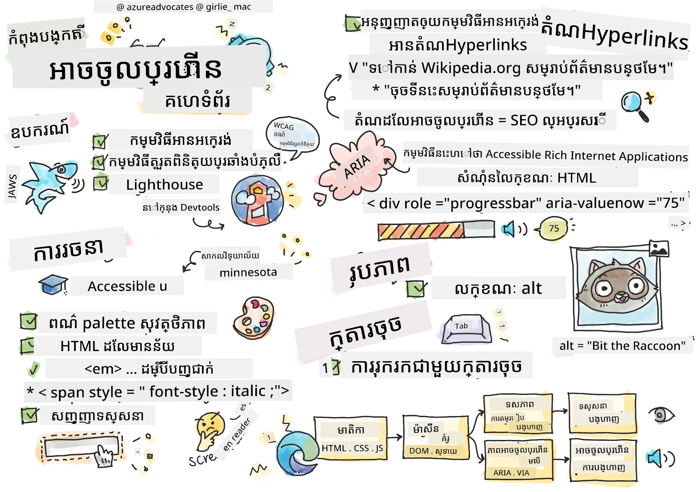
> ស្កេឆ្នតដោយ [Tomomi Imura](https://twitter.com/girlie_mac)

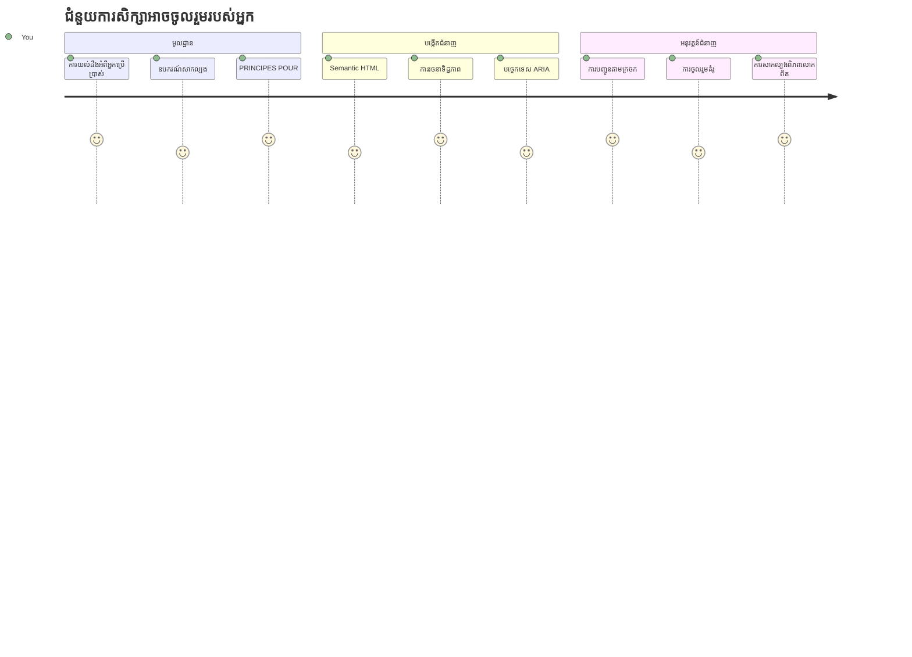
## សំណួរប្រលងមុនមេរៀន
[សំណួរប្រលងមុនមេរៀន](https://ff-quizzes.netlify.app/web/)

> អំណាចនៃបណ្តាញគឺនៅក្នុងភាពទូលំទូលាយរបស់វា ការចូលដំណើរការដោយមនុស្សគ្រប់រូបដោយមិនគិតពីជំងឺពិសេសណាមួយ គឺជាផ្នែកសំខាន់មួយ។
>
> \- លោក Timothy Berners-Lee អតីតនាយក W3C និងជាអ្នកបង្កើតបណ្ដាញអ៊ិនធឺរណែតពិភពលោក

នេះគឺជារឿងមួយដែលប្រហែលជាអាចធ្វើអោយអ្នកភ្ញាក់ផ្អើល៖ នៅពេលអ្នកបង្កើតគេហទំព័រដែលអាចចូលប្រើបាន អ្នកមិនត្រឹមតែជួយមនុស្សដែលមានជំងឺពិសេសទេ ប៉ុន្តែអ្នកកំពុងធ្វើឱ្យបណ្ដាញល្អប្រសើរឡើងសម្រាប់មនុស្សគ្រប់រូប!

ធ្លាប់សังเกតឃើញចំណុចកាត់ផ្លូវភាគច្រើនទេ? វាត្រូវបានរចនាឡើងសម្រាប់រទេះចរក្នុងដំបូង ប៉ុន្តែឥឡូវនេះវាជួយមនុស្សដែលមានទារកក្នុងទូក, ពលករដឹកជញ្ជូនប្រើរទេះដាក់ទំនិញ, អ្នកធ្វើដំណើរដែលមានកាបូបរុញ, និងអ្នកជិះកង់ផងដែរ។ នេះគឺជាការប្រើប្រាស់រចនាប័ទ្មគេហទំព័រដែលអាចចូលប្រើបាន—ដំណោះស្រាយដែលជួយមនុស្សក្រុមមួយ ដោយផ្ទាល់ជា​មួយ​ផ្តល់ប្រយោជន៍​ដល់​អ្នក​គ្រប់គ្នា។ ពាណិជ្ជកម្មមែនទេ?

នៅក្នុងមេរៀននេះ យើងនឹងស្រាវជ្រាវពីរបៀបបង្កើតគេហទំព័រដែលពិតជាដំណើរការសម្រាប់មនុស្សគ្រប់រូប មិនគិតពីរបៀបដែលពួកគេចូលប្រើបណ្ដាញនោះទេ។ អ្នកនឹងបានស្វែងរកបច្ចេកទេសជាក់ស្តែងដែលមានរួចជាស្តង់ដារបណ្ដាញ ចូលរួមដោយសកម្មជាមួយឧបករណ៍តេស្ត និងឃើញរបៀបដែលភាពអាចចូលប្រើបានធ្វើឱ្យគេហទំព័ររបស់អ្នកប្រើប្រាស់ល្អប្រសើរឡើងសម្រាប់អ្នកប្រើប្រាស់គ្រប់រូប។

នៅចុងបញ្ចប់មេរៀននេះ អ្នកនឹងមានទំនុកចិត្តចំពោះការធ្វើឱ្យភាពអាចចូលប្រើបានជាផ្នែកធម្មតានៃដំណើរការអភិវឌ្ឍរបស់អ្នក។ រៀបចំរួចហើយដើម្បីស្វែងរករបៀបដែលការជ្រើសរើសរចនាប្រឹក្សាអាចបើកបង្ហាញបណ្ដាញទៅអ្នកប្រើប្រាស់រាប់លានមេដ្ឋានទេ? ចៀសវាងចូលរួម!

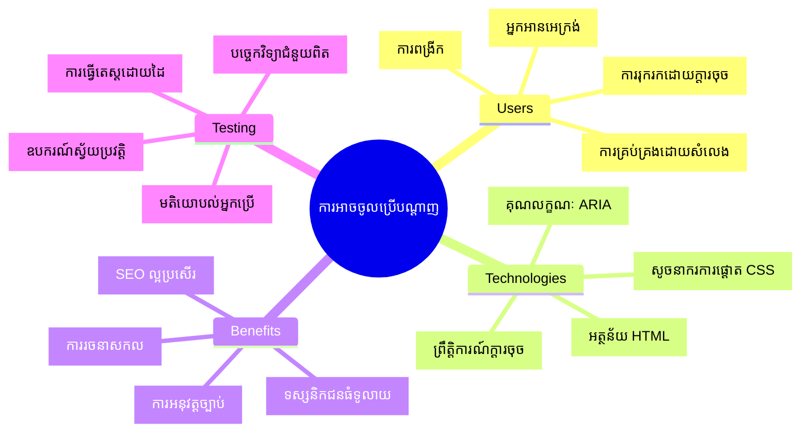
> អ្នកអាចរៀនមេរៀននេះនៅលើ [Microsoft Learn](https://docs.microsoft.com/learn/modules/web-development-101/accessibility/?WT.mc_id=academic-77807-sagibbon)។

## យល់ដឹងពីបច្ចេកវិទ្យាជំនួយ

មុនពេលយើងចាប់ផ្តើមកូដ មកយកពេលខ្លីដើម្បីយល់ពីរបៀបដែលមនុស្សដែលមានសមត្ថភាពខុសៗគ្នាត្រូវប្រឈមមុខនឹងបណ្ដាញ។ នេះមិនមែនគ្រាន់តែជាទ្រឹស្តីទេ—ការយល់ដឹងពីរបៀបក្នុងការរុករកពិភពលោកពិតប្រាកដទាំងនេះ នឹងធ្វើឱ្យអ្នកក្លាយជា អ្នកអភិវឌ្ឍន៍ល្អប្រសើរជាងមុន!

បច្ចេកវិទ្យាជំនួយគឺជាឧបករណ៍អស្ចារ្យដែលជួយមនុស្សដែលមានជំងឺពិសេសក្នុងការប្រើប្រាស់គេហទំព័របែបដែលប្រហែលជាអ្នកអាចភ្ញាក់ផ្អើល។ ប្រសិនបើអ្នកយល់ឃើញរបៀបដែលបច្ចេកវិទ្យានេះដំណើរការ ការបង្កើតបទពិសោធន៍គេហទំព័រដែលអាចចូលប្រើបានក្លាយជារឿងងាយស្រួលពិតប្រាកដ។ ប្រហែលដូចជាកំពុងរៀនឃើញកូដរបស់អ្នកតាមភ្នែករបស់អ្នកដទៃម្នាក់។

### អ្នកអានអេក្រង់

[Screen readers](https://en.wikipedia.org/wiki/Screen_reader) គឺជាឧបករណ៍បច្ចេកវិទ្យាដ៏ស្វាហាប់ដែលបំលែងអត្ថបទឌីជីថលទៅជាសំឡេងនិយាយ ឬលទ្ធផលប្រៀល។ ទោះបីជាយ៉ាងណាមួយ វាត្រូវបានប្រើប្រាស់ដោយអ្នកមានបញ្ហាឧបករណ៍មើល ដូច្នេះវាក៏មានប្រយោជន៍សម្រាប់អ្នកប្រើប្រាស់ដែលមានបញ្ហាគ្រប់ផ្នែករៀនដូចជាឌីសឡិចស៊ី។

ខ្ញុំចូលចិត្តគិតអំពីអ្នកអានអេក្រង់ដូចជាការមានអ្នកណែរតា​ចាស់​ដ៏ប្រាជ្ញាអានសៀវភៅឱ្យអ្នកស្ដាប់។ វាអានមាតិកាដោយលំដាប់ហេតុផល ប្រកាសធាតុអន្តរក្រាដូចជា "ប៊ូតុង" ឬ "តំណភ្ជាប់" និងផ្តល់ជម្រាបរង្វេចក្តារចុចដើម្បីលោតជុំវិញទំព័រ។ ប៉ុន្តែការងារនេះអាចប្រតិបត្តិត្រឹមត្រូវមកដល់ តែបើទំព័របណ្ដាញត្រូវបានបង្កើតតាមរចនាសម្ព័ន្ធ និងមាតិកាដែលមានអត្ថន័យ។ នេះជាកន្លែងដែលអ្នកជាអ្នកអភិវឌ្ឍន៏មកចូលរួម!

**អ្នកអានអេក្រង់ដែលពេញនិយមនៅលើវេទិកាផ្សេងៗ:**
- **Windows**: [NVDA](https://www.nvaccess.org/about-nvda/) (ឥតគិតថ្លៃ និងពេញនិយមបំផុត), [JAWS](https://webaim.org/articles/jaws/), [Narrator](https://support.microsoft.com/windows/complete-guide-to-narrator-e4397a0d-ef4f-b386-d8ae-c172f109bdb1/?WT.mc_id=academic-77807-sagibbon) (ដំណើរការ​រួច)
- **macOS/iOS**: [VoiceOver](https://support.apple.com/guide/voiceover/welcome/10) (ដំណើរការរួច និងមានសមត្ថភាពខ្ពស់)
- **Android**: [TalkBack](https://support.google.com/accessibility/android/answer/6283677) (ដំណើរការរួច)
- **Linux**: [Orca](https://wiki.gnome.org/Projects/Orca) (ឥតគិតថ្លៃ និងប្រភពបើកចំហ)

**របៀបដែលអ្នកអានអេក្រង់រុករកមាតិកាគេហទំព័រ៖**

អ្នកអានអេក្រង់ផ្តល់នូវវិធីសាស្ត្ររុករកច្រើនដែលធ្វើឱ្យការរុករកមានប្រសិទ្ធភាពសម្រាប់អ្នកប្រើប្រាស់ដែលមានបទពិសោធន៍៖
- **អានតាមលំដាប់**: អានមាតិកាដោយចាប់ពីលើទៅក្រោម ដូចជាកំហូរសៀវភៅ
- **រុករកតាម Landmarks**: លោតរវាងផ្នែកផ្សេងៗនៃទំព័រ (header, nav, main, footer)
- **រុករកតាម​លេខ​សម្គាល់សារមន្ទីរ**: លោតរវាងចំណងជើង ដើម្បីយល់ពីរចនាសម្ព័ន្ធទំព័រ
- **បញ្ជីតំណភ្ជាប់**: បង្កើតបញ្ជីទាំងអស់នៃតំណភ្ជាប់សម្រាប់ចូលប្រើរហ័ស
- **គ្រប់គ្រងទម្រង់**: រុករកដោយផ្ទាល់រវាងប្រអប់បញ្ចូល និងប៊ូតុង

> 💡 **នេះជារឿងដែលធ្វើឱ្យខ្ញុំភ្ញាក់ផ្អើល**៖ ៦៨% នៃអ្នកប្រើប្រាស់អ្នកអានអេក្រង់ រុករកសំខាន់ដោយផ្អែកលើចំណងជើង ([WebAIM Survey](https://webaim.org/projects/screenreadersurvey9/#finding))។ នេះមានន័យថារចនាសម្ព័ន្ធចំណងជើងរបស់អ្នកមានសារៈសំខាន់ដូចជាផែនទីសម្រាប់អ្នកប្រើប្រាស់—ពេលដែលអ្នកធ្វើបានត្រឹមត្រូវ អ្នកកំពុងជួយមនុស្សឲ្យរកមើលមាតិការបស់អ្នកឆាប់រហ័សជាងមុន!

### ការបង្កើតដំណើរការតេស្តរបស់អ្នក

មានដំណឹងល្អមួយ៖ ការតេស្តភាពអាចចូលប្រើបានមានប្រសិទ្ធិភាពមិនចាំបាច់ត្រូវបំភាយ! អ្នកនឹងចង់បញ្ចូលឧបករណ៍ស្វ័យប្រវត្តិ (ពួកវាល្អឥតខ្ចោះសម្រាប់រកបញ្ហាអច្បាប់) ជាមួយនឹងការតេស្តដោយដៃ។ នេះជាវិធីសាស្ត្រដែលខ្ញុំរកឃើញអាចចាប់បញ្ហាប្រើប្រាស់ជាច្រើនដោយមិនប៉ះពាល់ដល់ពេលវេលារបស់អ្នក:

**ដំណើរការតេស្តដោយដៃសំខាន់៖**

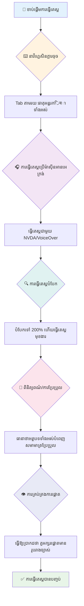
**បញ្ជីតេស្តជាដំណាក់កាល៖**
1. **រុករកតាមក្តារចុច**៖ ប្រើតែ Tab, Shift+Tab, Enter, Space, និងសញ្ញាកាំបិតតុក្កតា
2. **តេស្តអ្នកអានអេក្រង់**៖ បើក NVDA, VoiceOver, ឬ Narrator ហើយរុករកនៅពេលភ្នែកបិទ
3. **តេស្តការបញ្ចូលរូបភាពចំរុះទំហំ**៖ តេស្តនៅកំរិត ២០០% និង ៤០០%
4. **ផ្ទៀងផ្ទាត់ការប្រៀបធៀបពណ៌**៖ ពិនិត្យអត្ថបទ និងរចនាសម្ព័ន្ធអន្តរក្រាលទាំងអស់
5. **តេស្តសញ្ញាសំគាល់ការផ្តោត**៖ ប្រាកដថាធាតុអន្តរក្រាលទាំងអស់មានស្ថានភាពផ្តោតច្បាស់លាស់

✅ **ចាប់ផ្តើមជាមួយ Lighthouse**៖ បើក DevTools របស់អ្នក អនុវត្តការត្រួតពិនិត្យភាពអាចចូលប្រើដោយ Lighthouse ហើយប្រើលទ្ធផលដើម្បីមើលកន្លែងដែលត្រូវផ្តោតសម្រាប់តេស្តដោយដៃ។

### ឧបករណ៍បន្ថែមទេស៍នឹងបន្ធូរទំហំ

អ្នកស្គាល់ហើយថាឥលូវនេះខ្លះមនុស្សប្រើជម្រោះដៃដើម្បីបក្សទំហំអត្ថបទនៅលើទូរស័ព្ទនៅពេលអត្ថបទតូចពេក ឬហើរមើលអេក្រង់កុំព្យូទ័រយួរដៃនៅពេលពន្លឺខ្លាំងមែនទេ? អ្នកប្រើជាច្រើនពេញចិត្តជាមួយឧបករណ៍បន្ថែមទេស៍ដើម្បីធ្វើអោយមាតិកាអាចអានបានជារៀងរាល់ថ្ងៃ។ នេះរួមបញ្ចូលមនុស្សដែលមើលមិនច្បាស់ អ្នកចាស់ៗ និងមនុស្សណាដែលបានព្យាយាមអានគេហទំព័រនៅក្រៅផ្ទះ។

បច្ចេកវិទ្យាបន្ថែមទេស៍ទំនើបបានឈានដល់កម្រិតលើសពីការធ្វើអោយវារីមធំទេ។ ការយល់ដឹងពីរបៀបដែលឧបករណ៍ទាំងនេះដំណើរការ នឹងជួយអ្នកបង្កើតរចនាប័ទ្មឆ្លាតវៃដែលនៅតែដំណើរការល្អ និងគួរឱ្យចាប់អារម្មណ៍នៅកម្រិតបន្ថែមទេស៍ណាមួយ។

**សមត្ថភាពបន្ថែមទេស៍របស់កម្មវិធីរុករកទំនើប:**
- **បន្ថែមទេស៍ទំព័រ**: បង្កើតអត្ថបទទាំងមូលដោយអត្រាពាក់កណ្តាល (អត្ថបទ រូបភាព រចនាសម្ព័ន្ធ) - វាជាវិធីដែលចូលចិត្តប្រើ
- **បន្ថែមទេស៍អត្ថបទតែ១**: ពង្រីកទំហំអក្សរផ្ទាល់ខ្លួនដោយរក្សាទម្រង់ដើម
- **ប៉ិនទឹកដៃ​បន្ថែមទេស៍**: ជំនួយរូបមន្តលើទូរស័ព្ទដៃសម្រាប់បន្ថែមទេស៍បណ្ដោះអាសន្ន
- **ការគាំទ្ររុករក**: រុករកទំនើបទាំងអស់គាំទ្រការបន្ថែមទេស៍រហូតដល់ ៥០០% ដោយមិនបំផ្លាញមុខងារ

**កម្មវិធីបន្ថែមទេស៍ផ្នែកម៉ាស៊ីន:**
- **Windows**: [Magnifier](https://support.microsoft.com/windows/use-magnifier-to-make-things-on-the-screen-easier-to-see-414948ba-8b1c-d3bd-8615-0e5e32204198) (ដំណើរការរួច), [ZoomText](https://www.freedomscientific.com/training/zoomtext/getting-started/)
- **macOS/iOS**: [Zoom](https://www.apple.com/accessibility/mac/vision/) (ដំណើរការរួចជាមួយលក្ខណៈពិសេសខ្ពស់)

> ⚠️ **ការយកចិត្តទុកដាក់រចនា**៖ WCAG ទាមទារថាមាតិកាត្រូវនៅមានមុខងារដោយសារត្រូវបានបន្ថែមទេស៍ទៅ ២០០%។ នៅកម្រិតនេះ ការរុករកបញ្ចេញតឹងតែងតែតិច និងធាតុអន្តរក្រាលទាំងអស់ត្រូវនៅអាចចូលប្រើបាន។

✅ **សាកល្បងរចនាប័ទ្មឆ្លាតវៃរបស់អ្នក**៖ បន្ថែមទេស៍រុករករបស់អ្នកទៅ ២០០% និង ៤០០%។ តើរចនារបស់អ្នកអាចបត់បែនបានជាដំណោះស្រាយល្អដែរឬ? តើអ្នកនៅតែអាចចូលប្រើមុខងារទាំងអស់បានដោយមិនចាំបាច់រុករកពេកទេ?

## ឧបករណ៍តេស្ថភាពអាចចូលប្រើបានទំនើប

ឥឡូវនេះអ្នកយល់ដឹងពីរបៀបដែលមនុស្សរុករកបណ្ដាញជាមួយបច្ចេកវិទ្យាជំនួយហើយ មកមើលឧបករណ៍ដែលជួយអ្នកបង្កើតនិងតេស្តគេហទំព័រដែលអាចចូលប្រើបាន។

គិតវាដូចជា៖ ឧបករណ៍ស្វ័យប្រវត្តិល្អឥតខ្ចោះសម្រាប់ចាប់បញ្ហាផ្ទាល់មុខ (ដូចជាអត្ថបទ alt ខ្វះ) ខណៈពេលដែលការតេស្តដោយដៃជួយអ្នកធានាថាគេហទំព័ររបស់អ្នកមានអារម្មណ៍ល្អក្នុងពិភពពិត។ រួមគ្នា ពួកគេផ្តល់សំណល់ទំនុកចិត្តថាគេហទំព័ររបស់អ្នកដំណើរការសម្រាប់មនុស្សគ្រប់រូប។

### តេស្តការប្រៀបធៀបពណ៌

មានដំណឹងល្អមួយ៖ ការប្រៀបធៀបពណ៌គឺជាបញ្ហាទិដ្ឋភាពអាចចូលប្រើបានធំបំផុតមួយ ប៉ុន្តែវាក៏ជារឿងងាយស្រួលក្នុងការជួសជុលផងដែរ។ ការប្រៀបធៀបល្អយ៉ាងខ្លាំងមានអត្ថប្រយោជន៍សម្រាប់មនុស្សគ្រប់រូប—ចាប់ពីអ្នកមានបញ្ហាអំពីចក្ខុទៅដល់អ្នកព្យាយាមអានទូរស័ព្ទនៅឆ្នេរមាត់សមុទ្រ។

**លក្ខខណ្ឌប្រៀបធៀប WCAG៖**

| មុខងារ​អត្ថបទ | WCAG AA (អប្បបរមា) | WCAG AAA (ពង្រឹង) |
|-----------|-------------------|---------------------|
| **អត្ថបទធម្មតា** (ក្រោម 18pt) | 4.5:1 អត្រាប្រៀបធៀប | 7:1 អត្រាប្រៀបធៀប |
| **អត្ថបទធំ** (18pt+ ឬ 14pt+ ដិត) | 3:1 អត្រាប្រៀបធៀប | 4.5:1 អត្រាប្រៀបធៀប |
| **កម្មវិធី UI** (ប៊ូតុង, រង្វង់បែបផ្សារ) | 3:1 អត្រាប្រៀបធៀប | 3:1 អត្រាប្រៀបធៀប |

**ឧបករណ៍តេស្តសំខាន់៖**
- [Colour Contrast Analyser](https://www.tpgi.com/color-contrast-checker/) - កម្មវិធីកុំព្យូទ័រដាស់តួពណ៌
- [WebAIM Contrast Checker](https://webaim.org/resources/contrastchecker/) - គេហទំព័រដែលផ្តល់មតិកែតម្រូវភ្លាមៗ
- [Stark](https://www.getstark.co/) - ពិសោធន៍ការរចនាក្នុងកម្មវិធី Figma, Sketch, Adobe XD
- [Accessible Colors](https://accessible-colors.com/) - រក​រក​ម៉ូដ​ពណ៌​អាច​ចូល​ប្រើ​បាន

✅ **បង្កើត​ម៉ូដ​ពណ៌​ល្អ​ជាងមុន**៖ ចាប់ផ្តើមជាមួយពណ៌ម៉ាករបស់អ្នក ហើយប្រើឧបករណ៍ត្រួតពិនិត្យការប្រៀបធៀប ដើម្បីបង្កើតប្លង់ពណ៌ដែលអាចចូលប្រើបាន។ សរសេរបានជាឯកសារផ្នែករចនាប័ទ្មរបស់អ្នក។

### ភារកិច្ចតេស្តភាពអាចចូលប្រើបានទូលំទូលាយ

ការតេស្តភាពអាចចូលប្រើបានមានប្រសិទ្ធភាពធំបំផុតគឺរួមបញ្ចូលវិធីសាស្ត្រចម្រុះ។ គ្មានឧបករណ៍ដេកនៅមួយដែលអាចចាប់បានគ្រប់បញ្ហា ដូច្នេះការបង្កើតរបៀបតេស្តជាមួយវិធីសាស្ត្រផ្សេងៗធានាថាមានការគ្របដណ្តប់ពេញលេញ។

**ការតេស្តដែលបោះសារប្រើប្រាស់ DevTools:**
- **Chrome/Edge**: ការត្រួតពិនិត្យភាពអាចចូលប្រើដោយ Lighthouse + ផ្ទាំង Accessibility
- **Firefox**: Accessibility Inspector រួមជាមួយទិដ្ឋភាពចំរុះ
- **Safari**: Audit tab នៅក្នុង Web Inspector ជាមួយបទបង្ហាញ VoiceOver

**ផ្នែកបន្ថែមសម្រាប់ការតេស្តដែលជាអាជីព:**
- [axe DevTools](https://www.deque.com/axe/devtools/) - ការតេស្តស្វ័យប្រវត្តិដែលមានស្តង់ដារឡើងវិញ
- [WAVE](https://wave.webaim.org/extension/) - មតិបញ្ជាក់ជាមួយការបង្ហាញកំហុស
- [Accessibility Insights](https://accessibilityinsights.io/) - កម្មវិធីតេស្តទូលំទូលាយរបស់ Microsoft

**បញ្ជា និងបញ្ចូលក្នុង CI/CD:**
- [axe-core](https://github.com/dequelabs/axe-core) - បណ្ណាល័យ JavaScript សម្រាប់តេស្តស្វ័យប្រវត្តិ
- [Pa11y](https://pa11y.org/) - ឧបករណ៍តេស្តភាពអាចចូលប្រើពីបញ្ជា
- [Lighthouse CI](https://github.com/GoogleChrome/lighthouse-ci) - ពិន្ទុភាពអាចចូលប្រើដោយស្វ័យប្រវត្តិ

> 🎯 **គោលបំណងតេស្ត**៖ មានគោលបំណងទទួលបានពិន្ទុភាពអាចចូលប្រើបាន ៩៥+ ពី Lighthouse ជា​គោលជំនួយរបស់អ្នក។ ចូរចាំថា ឧបករណ៍ស្វ័យប្រវត្តិចាប់បញ្ហាបានប្រហែល ៣០-៤០% នៃបញ្ហា — ការតេស្តដោយដៃនៅតែមានសារៈសំខាន់!

### 🧠 **ការតេស្តជំនាញ៖ រៀបចំរកបញ្ហា?**

**មកមើលថាតើអ្នកមានអារម្មណ៍យ៉ាងដូចម្តេចចំពោះការតេស្តភាពអាចចូលប្រើបាន៖**
- វិធីសាស្ត្រតេស្តណាដែលមើលទៅសមស្របបំផុតសម្រាប់អ្នកពេលនេះ?
- តើអ្នកអាចស្របតាមរុករកតែជាមួយក្តារចុចបានមួយថ្ងៃឬ?
- តើមានឧបសគ្គអ្វីមួយដែលអ្នកមានបទពិសោធន៍ផ្ទាល់លើបណ្ដាញដែលទាក់ទងសិទ្ធិចូលប្រើបាន?

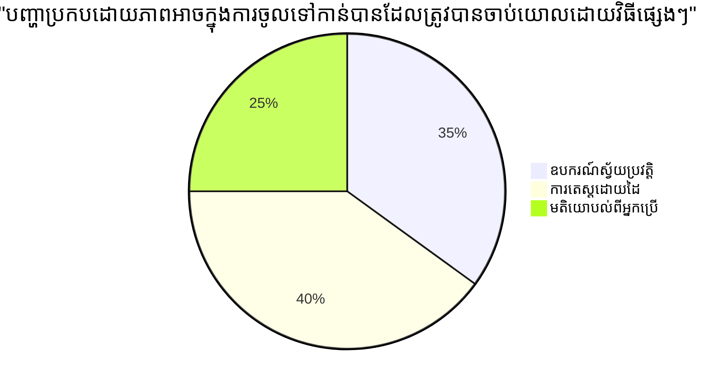
> **កម្លាំងបង្កើនទំនុកចិត្ត**៖ អ្នកតេស្តភាពអាចចូលប្រើជំនាញពីរបៀបនេះជាជំនួយ។ អ្នកកំពុងរៀននូវអនុវត្តស្តង់ដារអាជីព!

## ការបង្កើតភាពអាចចូលប្រើបានពីគ្រឹះដំបូង

គន្លងជោគជ័យក្នុងការធ្វើឱ្យមានភាពអាចចូលប្រើវាជា ការបង្កើតវា អំពីគ្រឹះរបស់អ្នកចាប់ពីថ្ងៃទីមួយ។ ខ្ញុំដឹងថាវាជាការផឹកពិបាកក្នុងការរៀនថា "ខ្ញុំនឹងបន្ថែមភាពអាចចូលប្រើនៅពេលក្រោយ" ប៉ុន្តែវាដូចជាការបន្ថែមជណ្តើរឡើងដូចជារឿងនៃផ្ទះដែលបានសាងសង់រួចមកហើយ។ អាចធ្វើបាន? បាទ។ ងាយស្រួល? មិនមែនទេ។

គិតពីភាពអាចចូលប្រើបានដូចជាការរៀបចំប្លង់ផ្ទះ—វាងាយស្រួលក្នុងការរួមបញ្ចូលការចូលប្រើរទេះចរក្នុងផែនការសង់សួនច្បារដំបូងជាងការត្រូវតែចាក់ជណ្តើរបន្ថែមនៅពេលក្រោយ។

### គោលការណ៍ POUR៖ គ្រឹះភាពអាចចូលប្រើបានរបស់អ្នក

ស្តង់ដារដាក់ទំព័រជួរមាតិកាអាចចូលប្រើបាន (WCAG) បានស្តារឡើងនៅលើគោលការណ៍មូលដ្ឋានបួនដែលហៅថា POUR។ កុំបារម្ភទេ—វាមិនមែនជាគំនិតជជុម្មានសាស្ត្រទេ! វាជាការណែនាំជាក់ស្តែងសម្រាប់បង្កើតមាតិកាដែលដំណើរការសម្រាប់មនុស្សគ្រប់រូប។

ពេលអ្នកយល់វា តិចដល់ការសម្រេចចិត្តភាពអាចចូលប្រើក្លាយទៅជារឿងងាយស្រួល។ វាដូចជាមានបញ្ជីត្រួតពិនិត្យផ្លូវចិត្តដែលណែនាំការជ្រើសរើសរចនាប័ត្រ រួចទៅមកទស្សន៍ជាមួយ៖

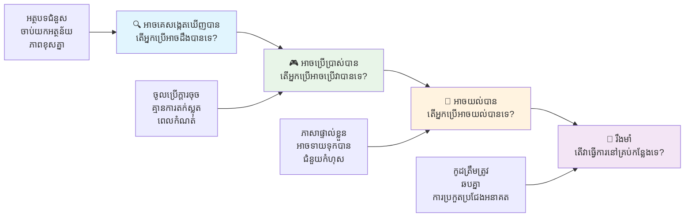
**🔍 ដ៏អាចមើលបាន**៖ ព័ត៌មានត្រូវតែបង្ហាញបាននៅក្នុងរបៀបដែលអ្នកប្រើអាចយល់បានតាមការប្រើសញ្ញាផ្សេងៗរបស់ពួកគេ

- ផ្តល់ជម្រើសអក្សរជំនួសសម្រាប់មាតិកាដែលមិនមែនអត្ថបទ (រូបភាព វីដេអូ សំឡេង)
- ការប្រៀបធៀបពណ៌គ្រប់គ្រាន់សម្រាប់អត្ថបទនិងសមាសភាព UI ទាំងអស់
- ផ្តល់អត្ថបទបង្ហាញ និងអត្ថបទបកប្រែសម្រាប់មាតិកាមេឌៀ
- រចនាមាតិកាឱ្យនៅអាចដំណើរការបានពេលបន្ថែមទេស៍រហូតដល់ ២០០%
- ប្រើលក្ខណៈសញ្ញាច្រើន (មិនត្រឹមតែពណ៌) ដើម្បីបង្ហាញព័ត៌មាន

**🎮 អាចប្រតិបត្តិការ**៖ អនុវត្តរួម UI គ្រប់រូបត្រូវអាចប្រើបានតាមវិធីបញ្ចូលមានស្រាប់

- ធ្វើអោយមុខងារទាំងអស់អាចចូលប្រើបានតាមរយៈរុករកដោយក្តារចុច
- ផ្តល់ពេលគ្រប់គ្រាន់ចំពោះអ្នកប្រើឱ្យអាននិងអន្តរាគមន៍ជាមួយមាតិកា
- ជៀសវាងមាតិកាដែលបណ្តាលឲ្យមានសញ្ញាអស់បែបកាយវិការ ឬរោគវេស្ទីប្យុល
- ជួយអ្នកប្រើទៅរុករកបានយ៉ាងមានប្រសិទ្ធភាព ជាមួយរចនាសម្ព័ន្ធច្បាស់លាស់និងសញ្ញាសំគាល់
- ត្រួតពិនិត្យថាធាតុអន្តរក្រាលមានទំហំគោលដៅគ្រប់គ្រាន់ (ចាប់ពី ៤៤pxឡើង)

**📖 យល់ដឹងបាន**៖ ព័ត៌មាននិងការបញ្ជារ UI ត្រូវតែច្បាស់លាស់និងងាយយល់

- ប្រើភាសាច្បាស់ សាមញ្ញដែលសមរម្យសម្រាប់អ្នកដំណើរការ
- ធ្វើឲ្យមាតិកាបង្ហាញនិងដំណើរការដោយវិធីអាច្យកត្រូវបានទំនង និងថេរ
- ផ្តល់ការណែនាំច្បាស់លាស់ និងសារកំហុសសម្រាប់ការបញ្ចូលអ្នកប្រើ
- ជួយអ្នកប្រើយល់និងកែប្រែកំហុសនៅក្នុងទម្រង់
- រៀបចំមាតិកាឲ្យមានលំដាប់អាន និងហេតុផល

**💪 ត្រាស់ទ្រាំ**៖ មាតិកាត្រូវតែដំណើរការយ៉ាងទុកចិត្តនៅលើបច្ចេកវិទ្យាផ្សេងគ្នានិងឧបករណ៍ជំនួយ
- **ប្រើ HTML ដែលមានតម្លាភាព និងមានអត្ថន័យជាគន្លងដើមរបស់អ្នក**
- **ធានាការចូលគ្នាជាមួយបច្ចេកវិទ្យាជំនួយបច្ចុប្បន្ន និងអនាគត**
- **អនុវត្តតាមស្តង់ដារ និងអនុវត្តការប្រកបដោយល្អសម្រាប់ markup**
- **សាកល្បងឆ្លងកាត់កម្មវិធីរុករក ផ្លាតហ្វតផ្លត និងឧបករណ៍ជំនួយផ្សេងៗ**
- **រៀបចំមាតិកា ដើម្បីឱ្យវាអាចធ្លាក់ចុះយ៉ាងទំនេរចិត្ត ប្រញាប់ពេលមុខងារខ្ពស់មិនគាំទ្រ**

### 🎯 **ត្រួតពិនិត្យ PRINCIPLES POUR៖ ដើម្បីឱ្យវាចំរូង**

**ការកាន់ត្រង់រហ័សលើមូលដ្ឋាន៖**
- តើអ្នកអាចគិតពីមុខងារបណ្តាញដែលបរាជ័យក្នុង PRINCIPLES POUR នីមួយទេ?
- គោលការណ៍ណាដែលមានអារម្មណ៍ធម្មជាតិត្រឹមត្រូវសម្រាប់អ្នកជាអ្នកអភិវឌ្ឍន៍?
- គោលការណ៍ទាំងនេះនឹងធ្វើឲ្យបែបផែនរចនាសម្រាប់គ្រប់គ្នាល្អប្រសើរឡើងដោយវិធីណា មិនមែនសម្រាប់អ្នកពិការ តែសម្រាប់គ្រប់គ្នាទេ?

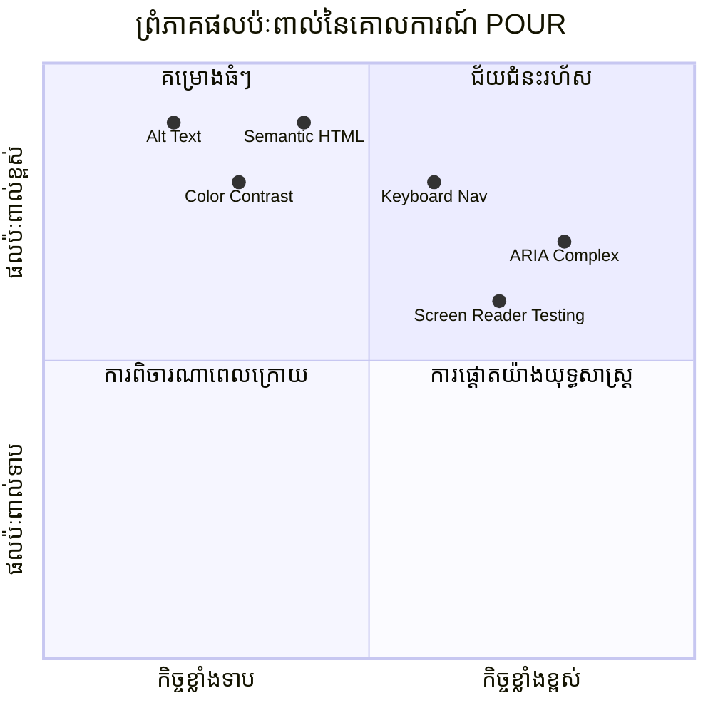
> **ចងចាំ**៖ ចាប់ផ្តើមជាមួយការកែលម្អដែលមានឥទ្ធិពលខ្ពស់និងពិបាកតិច។ Semantic HTML និងអត្ថបទ alt ផ្ដល់ឱ្យអ្នកនូវការកែលម្អ ចូលដល់បានយោគយល់បំផុតក្នុងការអនុវត្តឥតមានការខិតខំ!

## ការបង្កើតរចនាប័ទ្មវិស្វកម្មដែលចូលដល់បាន

ការរចនាវិស្វកម្មល្អ និងការចូលដល់បានដំណើរការចំហន់ទំហឹងគ្នា។ ពេលអ្នករចនាជាមួយការចូលដល់បានក្នុងចិត្ត អ្នកជាច្រើនបានរកឃើញថា ការដាក់បំណុលទាំងនេះនាំឲ្យមានដំណោះស្រាយស្អាត និងទំនើប ដែលមានអត្ថប្រយោជន៍សម្រាប់អ្នកប្រើប្រាស់ទាំងអស់។

មកពិនិត្យពីរបៀបបង្កើតរចនាប័ទ្មមើលទៅស្អាតដែលធ្វើការសម្រាប់គ្រប់គ្នា មិនគិតពីសមត្ថភាពមើលស្រួលរបស់ពួកគេ ឬស្ថានភាពដែលពួកគេចំពោះមុខពេលមើលមាតិការបស់អ្នក។

### រចនាប័ទ្ម ពណ៌ និងវិធីសាស្ត្រចូលដល់បាន

ពណ៌មានអំណាចក្នុងការទំនាក់ទំនង ប៉ុន្តែលើកលែងតែវាជាវិធីតែមួយក្នុងការបញ្ជាក់ព័ត៌មានសំខាន់ៗ។ ការរចនាឆ្លាស់កាត់ពីពណ៌បង្កើតបទពិសោធន៍ដែលមានស្ថិតិច្រើន និងបញ្ចូលគ្នា ដែលអាចដំណើរការនៅស្ថានភាពតែមួយច្រើន។

**រចនាសម្រាប់ភាពខុសគ្នានៃការមើលពណ៌៖**

ប្រហែល 8% នៃបុរស និង 0.5% នៃស្ត្រីមានភាពខុសគ្នាប្រភេទមួយនៃការមើលពណ៌ (ជាងស្ទើរតែហៅថា "ពិរោធពណ៌")។ ប្រភេទធម្មតាទាំងអស់គឺ៖
- **Deuteranopia**៖ មានការលំបាកក្នុងការបំបែកពណ៌ក្រហម និងបៃតង
- **Protanopia**៖ ពណ៌ក្រហមមើលទៅទន់លិចជាងធម្មតា
- **Tritanopia**៖ មានការលំបាកជាមួយពណ៌បៃតង និងលឿង (កើតមានរាល់ពេលក្រហម)

**យុទ្ធសាស្ត្រពណ៌ដែលរួមបញ្ចូលគ្នា៖**

```css
/* ❌ Bad: Using only color to indicate status */
.error { color: red; }
.success { color: green; }

/* ✅ Good: Color plus icons and context */
.error {
  color: #d32f2f;
  border-left: 4px solid #d32f2f;
}
.error::before {
  content: "⚠️";
  margin-right: 8px;
}

.success {
  color: #2e7d32;
  border-left: 4px solid #2e7d32;
}
.success::before {
  content: "✅";
  margin-right: 8px;
}
```

**ឆ្លងកាត់តម្រូវការប្រឆាំងចុងក្រោយ៖**
- សាកល្បងជម្រើសពណ៌របស់អ្នកជាមួយកម្មវិធីសំរាប់ពិរោធពណ៌
- ប្រើលំនាំ ផ្ទៃក្រណាត់ ឬរូបរាងជាមួយប្រើពណ៌កូដ
- រៀបចំអោយស្ថានភាពអន្តរកម្មនៅតែមានភាពងាយសម្គាល់ដោយគ្មានពណ៌
- គិតពីរបៀបដែលរចនារបស់អ្នកមើលទៅនៅក្នុងម៉ូដកម្រិតខ្ពស់នៃព្រីនត

✅ **សាកល្បងចូលដល់បានពណ៌របស់អ្នក**៖ ប្រើឧបករណ៍ដូចជា [Coblis](https://www.color-blindness.com/coblis-color-blindness-simulator/) ដើម្បីមើលពីរបៀបដែលគេយល់ពីវេបសាយរបស់អ្នកដោយអ្នកប្រើប្រាស់ដែលមានភាពខុសគ្នាជាពណ៌ផ្សេងៗ។

### សញ្ញាកំណត់ផ្តោត និងរចនាអន្តរកម្ម

សញ្ញាកំណត់ផ្តោតគឺជាការផ្លាស់ប្ដូរឌីជីថលនៃអ្នកបញ្ជា—ពួកវាបង្ហាញអ្នកប្រើប្រាស់ក្ចណ្ដាលពួកគេចង់ស្ថិតនៅនៅលើទំព័រ។ សញ្ញាគិតប្រាកដល្អជួយធ្វើឲ្យបទពិសោធន៍សម្រាប់គ្រប់គ្នាល្អប្រសើរជាងមុន ដោយបង្កើតអន្តរកម្មឲ្យច្បាស់លាស់ និងអាចទាយទល់បាន។

**ការអនុវត្តសញ្ញាប្រសើរៗសម្រាប់ផ្តោត៖**

```css
/* Enhanced focus styles that work across browsers */
button:focus-visible {
  outline: 2px solid #0066cc;
  outline-offset: 2px;
  box-shadow: 0 0 0 4px rgba(0, 102, 204, 0.25);
}

/* Remove focus outline for mouse users, preserve for keyboard users */
button:focus:not(:focus-visible) {
  outline: none;
}

/* Focus-within for complex components */
.card:focus-within {
  box-shadow: 0 0 0 3px rgba(74, 144, 164, 0.5);
  border-color: #4A90A4;
}

/* Ensure focus indicators meet contrast requirements */
.custom-focus:focus-visible {
  outline: 3px solid #ffffff;
  outline-offset: 2px;
  box-shadow: 0 0 0 6px #000000;
}
```

**តម្រូវការសញ្ញាប្តោត៖**
- **ភាពមើលឃើញ**៖ ត្រូវមានអតិផរណា 3:1 ព្យួរប្រឆាំងជាមួយធាតុជុំវិញ
- **ទទឹង**៖ ត្រង់ 2 ពិច ហើយវិលជុំវិញធាតុទាំងមូល
- **ភាពមានលក្ខណៈជាប់ទ្រាំ**៖ គួរតែបន្តឲ្យមិនលេចធ្លាយរហូតដល់ផ្តោតផ្លាស់ទីទៅកន្លែងផ្សេង
- **ភាពបុគ្គលិកភាព**៖ ត្រូវមានភាពខុសគ្នាច្បាស់ពីសភាព UI ផ្សេងៗ

> 💡 **គំនិតរចនា៖** សញ្ញាប្តោតល្អជាញឹកញាប់ប្រើរួមគ្នានៃរូបរាង, ស្លាបប្រឆាំងប្រអប់, និងការផ្លាស់ប្ដូរពណ៌ ដើម្បីធានាថា វាពិតជាខ្វះខាតនៅលើផ្ទៃខាងក្រោយ និងបរិបទផ្សេងៗ។

✅ **ពិនិត្យវាយតម្លៃសញ្ញាប្តោត**៖ ចូលតាមទំព័រទៅតាម Tab ហើយកត់កំណត់ថាតើធាតុណាដែលមានសញ្ញាដែលច្បាស់លាស់។ តើមានធាតុណាដែលមិនងាយសម្គាល់ ឬខ្វះដោយសេរីទាំងសោះ?

### Semantic HTML៖ មូលដ្ឋាននៃការចូលដល់បាន

Semantic HTML គឺដូចជាការផ្ដល់ប្រព័ន្ធ GPS សម្រាប់បច្ចេកវិទ្យាជំនួយក្នុងគេហទំព័ររបស់អ្នក។ ពេលដែលអ្នកប្រើធាតុ HTML ដែលត្រឹមត្រូវសម្រាប់គោលបំណងរបស់ពួកវា អ្នកកំពុងផ្ដល់ដំណឹងឲ្យកម្មវិធីអានអេក្រង់ ក្ចណ្ដាលក្តារ និងឧបករណ៍ផ្សេងៗជាមួយផែនទីលម្អិតជួយឲ្យអ្នកប្រើប្រាស់រុករកប្រសើរឡើង។

នេះជាសេចក្ដីប្រៀបធៀបទំលាប់សម្រាប់ខ្ញុំ៖ semantic HTML ជាគុណភាពខុសគ្នារវាងបណ្ណាល័យដែលមានការរៀបចំល្អមានចំណាត់ថ្នាក់ច្បាស់លាស់ និងសញ្ញាជំនួយធ្វើឲ្យមនុស្សទៅរកបានយ៉ាងងាយស្រួល ទល់នឹងឃ្លាំងស្ករពូជ ដែលសៀវភៅត្រូវដាក់ចោលគ្មានលំដាប់ណា។ ទាំងពីរតំបន់មានសៀវភៅដូចគ្នា តែអ្នកចង់ព្យាយាមស្វែងរកអ្វីមួយនៅណាមួយ?

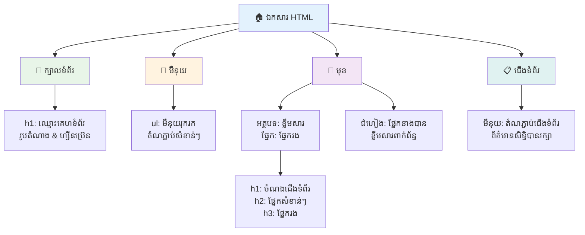
**ប្លុកសំណង់នៃរចនាសម្ព័ន្ធទំព័រចូលដល់បាន៖**

```html
<!-- Landmark elements provide page navigation structure -->
<header>
  <h1>Your Site Name</h1>
  <nav aria-label="Main navigation">
    <ul>
      <li><a href="/home">Home</a></li>
      <li><a href="/about">About</a></li>
      <li><a href="/services">Services</a></li>
    </ul>
  </nav>
</header>

<main>
  <article>
    <header>
      <h1>Article Title</h1>
      <p>Published on <time datetime="2024-10-14">October 14, 2024</time></p>
    </header>
    
    <section>
      <h2>First Section</h2>
      <p>Content that relates to this section...</p>
    </section>
    
    <section>
      <h2>Second Section</h2>
      <p>More related content...</p>
    </section>
  </article>
  
  <aside>
    <h2>Related Links</h2>
    <nav aria-label="Related articles">
      <ul>
        <li><a href="/related-1">First related article</a></li>
        <li><a href="/related-2">Second related article</a></li>
      </ul>
    </nav>
  </aside>
</main>

<footer>
  <p>&copy; 2024 Your Site Name. All rights reserved.</p>
  <nav aria-label="Footer links">
    <ul>
      <li><a href="/privacy">Privacy Policy</a></li>
      <li><a href="/contact">Contact Us</a></li>
    </ul>
  </nav>
</footer>
```

**ហេតុអ្វីបានជា semantic HTML ផ្លាស់ប្ដូរការចូលដល់បាន៖**

| ធាតុ Semantic | គោលបំណង | အားប្រយោជន៍ Screen Reader |
|-----------------|----------|-------------------------|
| `<header>` | ចំណងជើងទំព័រ ឬផ្នែក | "Banner landmark" - ជំនាន់រហ័សទៅផ្នែកលើ |
| `<nav>` | តំណបង្ហាញ | "Navigation landmark" - បញ្ជីផ្នែកផ្លូវវេន |
| `<main>` | មាតិកាធំរបស់ទំព័រ | "Main landmark" - លោតចូលទៅមាតិកាដោយផ្ទាល់ |
| `<article>` | មាតិកាផ្ទាល់ខ្លួន | បង្ហាញដែនកំណត់អត្ថបទ |
| `<section>` | ក្រុមមាតិកាតាមប្រធានបទ | ផ្ដល់រចនាសម្ព័ន្ធមាតិកា |
| `<aside>` | មាតិកាផ្នែកក្បែរពាក់ព័ន្ធ | "Complementary landmark" |
| `<footer>` | ចំណងជើងបន្ទាត់ក្រោមទំព័រ ឬផ្នែក | "Contentinfo landmark" |

**សមត្ថភាព screen reader ជាមួយ semantic HTML:**
- **រោងសញ្ញារុករក (Landmark navigation)**៖ លោតចូលរវាងផ្នែកសំខាន់ៗនៃទំព័រប្រញាប់ៗ
- **រចនាសម្ព័ន្ធក្បាលអត្ថបទ (Heading outlines)**៖ បង្កើតតារាងមាតិកាពីរចនាសម្ព័ន្ធក្បាល
- **បញ្ជីធាតុ (Element lists)**៖ បង្កើតបញ្ជីគ្រប់តំណ, ប៊ូតុង, ឬត្រួតបញ្ជារប្រមូល
- **ការយល់ដឹងបរិបទ (Context awareness)**៖ យល់លក្ខណៈទំនាក់ទំនងរវាងផ្នែកមាតិកា

> 🎯 **សាកល្បងរហ័ស**៖ ព្យាយាមរុករកគេហទំព័របស់អ្នកជាមួយអ្នកអានអេក្រង់ដោយប្រើហ្វង្គ្ស័រណ៍បង្ហាញ landmark (D សម្រាប់ landmark, H សម្រាប់ heading, K សម្រាប់ link នៅក្នុង NVDA/JAWS)។ តើការរុករកនេះមានអត្ថន័យ?

### 🏗️ **ត្រួតពិនិត្យជំនាញ Semantic HTML៖ ការស្ថាបនាមូលដ្ឋានរឹងមាំ**

**មកវាយតម្លៃការយល់ដឹង semantic របស់អ្នក:**
- តើអ្នកអាចកំណត់ landmark នៅលើទំព័រប្រើ HTML តែម្ដងបានទេ?
- តើអ្នកនឹងពន្យល់ភាពខុសគ្នារវាង `<section>` និង `<div>` ដល់មិត្តភក្តិដូចម្តេច?
- អ្វីដែលជារឿងដំបូងដែលអ្នកនឹងពិនិត្យបើអ្នកប្រើឃើញបញ្ហារុករកតាមអ្នកអានអេក្រង់?

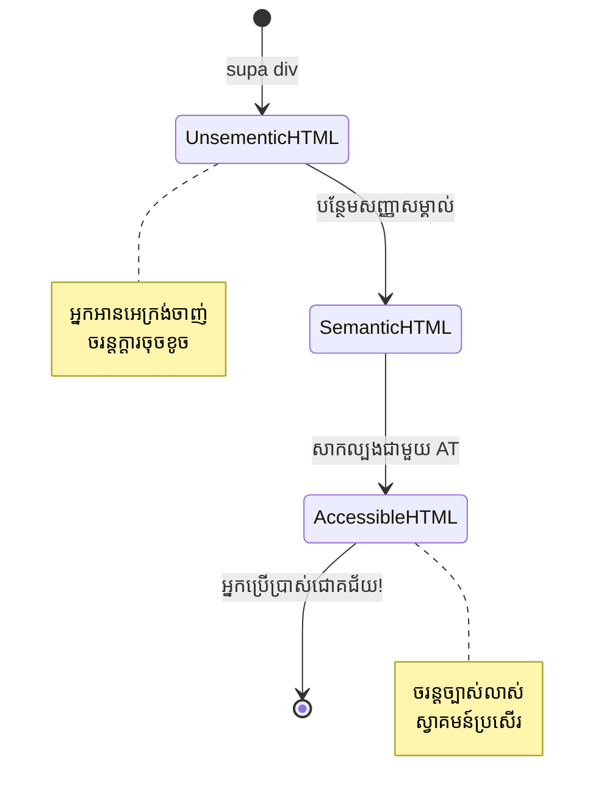
> **ជំនាញដ៏ជ្រៅ**៖ Semantic HTML រួមបញ្ចូលដំណោះស្រាយប្រហែល 70% នៃបញ្ហាចូលដល់បានស្វ័យប្រវត្តិ។ ជំនាញនេះជួយអ្នកបានយ៉ាងច្រើន!

✅ **ធ្វើ audit រចនាសម្ព័ន្ធ semantic**៖ ប្រើផ្ទាំង Accessibility នៅ DevTools ក្នុងកម្មវិធីរុករករបស់អ្នក ដើម្បីមើលដើមឈើ accessibility និងធានាថា markup របស់អ្នកបង្កើតរចនាសម្ព័ន្ធមានតុល្យភាព។

### ផ្នែកក្បាលអត្ថបទ៖ បង្កើតរចនាសម្ព័ន្ធមាតិកាត្រឹមត្រូវ

ក្បាលអត្ថបទមានសារសំខាន់ណាស់សម្រាប់មាតិកាចូលដល់បាន—វាជាឈាមសាច់ដែលកាន់មុខទំាងអស់។ អ្នកអានអេក្រង់ពឹងផ្អែកយ៉ាងខ្លាំងលើក្បាលជួយយល់ និងរុករកមាតិកា។ គិតថាវាជាបង្ហាញតារាងមាតិកាសម្រាប់ទំព័ររបស់អ្នក។

**នេះគឺជាក្រមខាសមាសសម្រាប់ក្បាលៈ**
មិនត្រូវរៀងលំដាប់កម្រិត។ តែងតែបន្តទៀងទាត់ពី `<h1>` ទៅ `<h2>` ទៅ `<h3>`។ ចងចាំការបង្ហាញរចនាសម្ព័ន្ធនៅសាលារៀន? វាដូចគ្នាណាស់—អ្នកមិនអាចលោតពី "I. ចំណុចធំ" ទៅ "C. ក្រោម​ក្រោម" ដោយគ្មាន "A. ក្រោម" នៅចន្លោះបានទេ។

**ឧទាហរណ៍រចនាសម្ព័ន្ធក្បាលពេញលេញ៖**

```html
<!-- ✅ Excellent: Logical, hierarchical progression -->
<main>
  <h1>Complete Guide to Web Accessibility</h1>
  
  <section>
    <h2>Understanding Screen Readers</h2>
    <p>Introduction to screen reader technology...</p>
    
    <h3>Popular Screen Reader Software</h3>
    <p>NVDA, JAWS, and VoiceOver comparison...</p>
    
    <h3>Testing with Screen Readers</h3>
    <p>Step-by-step testing instructions...</p>
  </section>
  
  <section>
    <h2>Color and Contrast Guidelines</h2>
    <p>Designing with sufficient contrast...</p>
    
    <h3>WCAG Contrast Requirements</h3>
    <p>Understanding the different contrast levels...</p>
    
    <h3>Testing Tools and Techniques</h3>
    <p>Tools for verifying contrast ratios...</p>
  </section>
</main>
```

```html
<!-- ❌ Problematic: Skipping levels, inconsistent structure -->
<h1>Page Title</h1>
<h3>Subsection</h3> <!-- Skipped h2 -->
<h2>This should come before h3</h2>
<h1>Another main heading?</h1> <!-- Multiple h1s -->
```

**អនុវត្តល្អសម្រាប់ក្បាលៈ**
- **មួយ `<h1>` ក្នុងមួយទំព័រ**៖ ជាទ្រង់ទ្រាយចំណងជើងទំព័រមេ ឬក្បាលមាតិកាសំខាន់
- **ចាំបាច់តាមលំដាប់**៖ មិនត្រូវរំលងកម្រិត (h1 → h2 → h3 មិនមែន h1 → h3)
- **មាតិកាសង្ខេប**៖ ធ្វើឲ្យក្បាលមានន័យពេលអានក្រៅបរិបទ
- **រចនាមើលជាមួយ CSS**៖ ប្រើ CSS សម្រាប់មើល, កម្រិត HTML សម្រាប់រចនាសម្ព័ន្ធ

**ស្ថិតិរុករកដោយអ្នកអានអេក្រង់៖**
- 68% នៃអ្នកប្រើអានអេក្រង់រុករកតាមក្បាល ([WebAIM Survey](https://webaim.org/projects/screenreadersurvey9/#finding))
- អ្នកប្រើប្រាស់រំពឹងនឹងរកឃើញរចនាសម្ព័ន្ធក្បាលត្រឹមត្រូវ
- ក្បាលមានវិធីលឿនបំផុតក្នុងការយល់រចនាសម្ព័ន្ធទំព័រ

> 💡 **គន្លឹះជំនាញ**៖ ប្រើកម្មវិធីបន្ថែមរុករកដូចជា "HeadingsMap" ដើម្បីមើលរចនាសម្ព័ន្ធក្បាលរបស់អ្នក។ វាគួរតែអានដូចជា ប្រអប់មាតិកាត្រូវរៀបចំល្អ។

✅ **សាកល្បងរចនាសម្ព័ន្ធក្បាលរបស់អ្នក**៖ ប្រើធាតុរុករកក្បាល (H នៅក្នុង NVDA) ដើម្បីលោតតាមក្បាលរបស់អ្នក។ តើលំដាប់នោះប្រាប់រឿងនៃមាតិការបស់អ្នកយ៉ាងត្រឹមត្រូវទេ?

### វិធីសាស្ត្រចូលដល់បានរចនាវិស្វកម្មខ្ពស់

លើសពីមូលដ្ឋាននៃការប្រឆាំង និងពណ៌ មានវិធីសាស្ត្រខ្លាំងៗជួយបង្កើតបទពិសោធន៍ចូលដល់បានល្អបំផុត។ វិធីទាំងនេះធានាថាមាតិការបស់អ្នកដំណើរការបាននៅក្នុងស្ថានភាពមើល និងបច្ចេកវិទ្យាជំនួយផ្សេងៗ។

**យុទ្ធសាស្ត្រទំនាក់ទំនងវិស្វកម្មសំខាន់ ៖**

- **មតិអរិយធម៌ច្រើនទ្រង់ទ្រាយ**៖ រួមបញ្ចូលការមើល ទំនួលខុសត្រូវអត្ថបទ និងសំឡេងខ្លះៗ
- **ការតែងការ​លម្អិតតិចតួច**៖ បង្ហាញព័ត៌មានជាធាតុឲ្យងាយស្រូបយក
- **គំរូអន្តរកម្មដូចគ្នា**៖ ប្រើលំនាំ UI ដែលធ្លាប់បានស្គាល់
- **តុបតែងអក្សរចំរុះ**៖ បើកតុល្យភាពអក្សរឱ្យសមស្របក្នុងភម្ជាស់ខុសៗគ្នា
- **ស្ថានភាពបញ្ចូល និងកំហុស**៖ ផ្ដល់មតិច្បាស់លាស់សម្រាប់សកម្មភាពអ្នកប្រើគ្រប់នៅ

**ប្រយោជន៍ CSS សម្រាប់បង្កើនចូលដល់បាន៖**

```css
/* Screen reader only text - visually hidden but accessible */
.sr-only {
  position: absolute;
  width: 1px;
  height: 1px;
  padding: 0;
  margin: -1px;
  overflow: hidden;
  clip: rect(0, 0, 0, 0);
  white-space: nowrap;
  border: 0;
}

/* Skip link for keyboard navigation */
.skip-link {
  position: absolute;
  top: -40px;
  left: 6px;
  background: #000000;
  color: #ffffff;
  padding: 8px 16px;
  text-decoration: none;
  border-radius: 4px;
  font-weight: bold;
  transition: top 0.3s ease;
  z-index: 1000;
}

.skip-link:focus {
  top: 6px;
}

/* Reduced motion respect */
@media (prefers-reduced-motion: reduce) {
  .skip-link {
    transition: none;
  }
  
  * {
    animation-duration: 0.01ms !important;
    animation-iteration-count: 1 !important;
    transition-duration: 0.01ms !important;
  }
}

/* High contrast mode support */
@media (prefers-contrast: high) {
  .button {
    border: 2px solid;
  }
}
```

> 🎯 **លំនាំចូលដល់បាន**៖ "skip link" គឺមានសារៈសំខាន់សម្រាប់អ្នកប្រើក្តារចុច។ វាគួរតែជាធាតុផ្តោតដើមលើទំព័ររបស់អ្នក ហើយលោតទៅមាតិកាសំខាន់ដោយផ្ទាល់។

✅ **អនុវត្តការលោតរុករក**៖ បន្ថែមតំណលោតទំព័ររបស់អ្នក ហើយពិនិត្យវាដោយចុច Tab ពេលទំព័រផ្ទុករួច។ វាគួរតែបង្ហាញ ហើយអាចលោតទៅមាតិកាសំខាន់បាន។

## ការបង្កើតអត្ថបទតំណមានន័យ

តំណគឺជាផ្លូវធំៗនៃបណ្តាញទិន្នន័យ ប៉ុន្តែអត្ថបទតំណដែលសរសេរមិនបានល្អគឺដូចជាសញ្ញាចរាចរណ៍ដែលមានតែពាក្យថា "កន្លែង" ជំនួស "មជ្ឈមណ្ឌល Chicago"។ មិនមានអត្ថន័យណាស់ទេ?

នេះជារឿងដែលធ្វើឲ្យខ្ញុំភ្ញាក់ផ្អើលនៅពេលកាលពីដំបូង៖ អ្នកអានអេក្រង់អាចយកតំណទាំងអស់ពីទំព័រមួយ ហើយបង្ហាញវាជាបញ្ជីធំធេង។ ស្រដៀងនឹងបើមាននរណាម្នាក់ផ្ដល់ឲ្យអ្នកបញ្ជីតំណទាំងមូលនៅលើទំព័ររបស់អ្នក។ តើតំណនីមួយៗមានអត្ថន័យដោយផ្ទាល់ឬអត់? នេះជាការសាកល្បងដែលអត្ថបទតំណរបស់អ្នកត្រូវឆ្លងកាត់!

### យល់ដឹងពាក់ព័ន្ធនឹងគំរូរុករកតំណ

អ្នកអានអេក្រង់ផ្ដល់មុខងាររុករកតំណជាសក្តានុពលដែលពឹងផ្អែកលើអត្ថបទតំណល្អសរសេរ៖

**វិធីសាស្ត្ររុករកតំណៈ**
- **អានតាមលំដាប់**៖ តំណត្រូវបានអានក្នុងបរិបទជារបស់មាតិកា
- **បង្កើតបញ្ជីតំណ**៖ តំណទាំងអស់បញ្ចូលក្នុងផ្ទាំងស្វែងរក
- **រុករករហ័ស**៖ លោតរវាងតំណដោយប្រើផ្លូវកាត់ពីក្តារចុច (K នៅក្នុង NVDA)
- **មុខងារស្វែងរក**៖ រកតំណជាក់លាក់ដោយវាយពាក្យខ្លះៗ

**ហេតុអ្វីបានជា Context មានសារៈសំខាន់:**
ពេលដែលអ្នកអានអេក្រង់បង្កើតបញ្ជីតំណ ពួកគេចាប់ផ្ដើមឃើញដូចនេះ៖
- "ទាញយករបាយការណ៍"
- "ស្វែងយល់បន្ថែម"
- "ចុចទីនេះ"
- "គោលការណ៍ឯកជនភាព"
- "ចុចទីនេះ"

តែតំណពីរតែប៉ុណ្ណោះផ្ដល់ព័ត៌មានប្រយោជន៍ពេលអានក្នុងបរិបទក្រៅ!

> 📊 **ផលប៉ះពាល់អ្នកប្រើ**៖ អ្នកប្រើអានអេក្រង់ស្កេនបញ្ជីតំណដើម្បីយល់ពីមាតិកាទំព័រយ៉ាងរហ័ស។ អត្ថបទតំណទូទៅប្រៀបដូចជាការធ្វើឲ្យពួកគេត្រូវតែត្រឡប់ទៅបរិបទមួយៗរបស់តំណ ពីព្រោះវាបន្ថយល្បឿនរុករករបស់ពួកគេយ៉ាងខ្លាំង។

### ខុសឆ្គងអត្ថបទតំណដែលគួរជៀសវៀង

ការយល់ដឹងអ្វីដែលមិនដំណើរការជួយអ្នកភ្ជាប់សញ្ញាបញ្ហាចូលដល់បាន និងធ្វើឲ្យរួចរាល់សម្រាប់មាតិកាដែលមានរួច។

**❌ អត្ថបទតំណទូទៅដែលមិនផ្ដល់បរិបទ៖**

```html
<!-- Meaningless when read from a link list -->
<p>Our sustainability efforts are detailed in our recent report. 
   <a href="/sustainability-2024.pdf">Click here</a> to view it.</p>

<!-- Repeated generic text throughout the page -->
<div class="article-card">
  <h3>Web Accessibility Guide</h3>
  <p>Learn the fundamentals...</p>
  <a href="/accessibility-guide">Read more</a>
</div>
<div class="article-card">
  <h3>Color Contrast Tips</h3>
  <p>Improve your design...</p>
  <a href="/color-contrast">Read more</a>
</div>

<!-- URLs as link text (difficult for screen readers to announce) -->
<p>Visit https://www.w3.org/WAI/WCAG21/quickref/ for WCAG guidelines.</p>

<!-- Vague action words -->
<a href="/contact">Go</a> | <a href="/about">See</a> | <a href="/help">View</a>
```

**ហេតុអ្វីដែលទំរង់ទាំងនេះបរាជ័យ៖**
- **"ចុចទីនេះ"** មិនប្រាប់អ្នកប្រើអំពីដំណាក់កាលហៅទៅណា
- **"អានបន្ថែម"** អញ្ញើចឡើងរាប់ដងច្រើនបង្កើតភាពច្របូកច្របល់
- **URL ផ្ទាល់** ពិបាកសម្ដែងដោយអ្នកអានអេក្រង់ច្បាស់លាស់
- **ពាក្យតែមួយ** ដូចជា "ទៅ" ឬ "មើល" គ្មានបរិបទពណ៌នា

### សរសេរអត្ថបទតំណល្អ

អត្ថបទតំណពណ៌នាជាសមត្ថភាពសម្រាប់គ្រប់គ្នា—អ្នកមើលអាចបញ្ចេញតំណបានឆាប់រហ័ស ហើយអ្នកអានអេក្រង់យល់ពីទីកន្លែងភ្លាមៗ។

**✅ ឧទាហរណ៍អត្ថបទតំណច្បាស់លាស់៖**

```html
<!-- Descriptive text that explains the destination -->
<p>Our comprehensive <a href="/sustainability-2024.pdf">2024 sustainability report (PDF, 2.1MB)</a> details our environmental initiatives.</p>

<!-- Specific, unique link text for each card -->
<div class="article-card">
  <h3>Web Accessibility Guide</h3>
  <p>Learn the fundamentals of inclusive design...</p>
  <a href="/accessibility-guide">Read our complete web accessibility guide</a>
</div>
<div class="article-card">
  <h3>Color Contrast Tips</h3>
  <p>Improve your design with better color choices...</p>
  <a href="/color-contrast">Explore color contrast best practices</a>
</div>

<!-- Meaningful text instead of raw URLs -->
<p>The <a href="https://www.w3.org/WAI/WCAG21/quickref/">WCAG 2.1 Quick Reference guide</a> provides comprehensive accessibility guidelines.</p>

<!-- Descriptive action links -->
<a href="/contact">Contact our support team</a> | 
<a href="/about">About our company</a> | 
<a href="/help">Get help with your account</a>
```

**ល្អសម្រាប់អត្ថបទតំណ៖**
- **ជាក់លាក់**៖ "ទាញយករបាយការណ៍ហិរញ្ញវត្ថុកвартាល់" ជំនួស "ទាញយក"
- **បញ្ចូលប្រភេទឯកសារ និងទំហំ**៖ "(PDF, 1.2MB)" សម្រាប់ឯកសារទាញយក
- **ពិពណ៌នាថាតំណបើកបង្ហាញនៅក្រៅ**៖ "(បើកក្នុងវីនដូថ្មី)" ពេលដែលសមរម្យ
- **ប្រើភាសាគ្រប់លោក**៖ "ទាក់ទងមកយើង" ជំនួស "ទំព័រទាក់ទង"
- **ទទេតិចតួច**៖ គោលបំណងប្រើពាក្យ 2-8 ពាក្យពេលអាចធ្វើបាន

### លំនាំចូលដល់បានតំណវៃឆ្លាត

ខ្លះនៃការដាក់រចនាវិស្វកម្មបំភាន់ ឬតម្រូវការបច្ចេកទេសត្រូវការដំណោះស្រាយពិសេស។ វិធីសាស្ត្រពិសេសសម្រាប់ស្ថានភាពបញ្ហាទូទៅមាន៖

**ប្រើ ARIA សម្រាប់បន្ថែមបរិបទ៖**

```html
<!-- When button text must be short but needs more context -->
<a href="/report.pdf" 
   aria-label="Download 2024 annual financial report, PDF format, 2.3MB">
  Download Report
</a>

<!-- When the full context comes from surrounding content -->
<h3 id="sustainability-heading">Sustainability Initiative</h3>
<p>Our efforts to reduce environmental impact...</p>
<a href="/sustainability-details" 
   aria-labelledby="sustainability-heading"
   aria-describedby="sustainability-summary">
  Learn more
</a>
<p id="sustainability-summary">Detailed breakdown of our 2024 environmental goals and achievements</p>
```

**បញ្ជាក់ប្រភេទឯកសារ និងទីកន្លែងក្រៅ៖**

```html
<!-- Method 1: Include information in visible link text -->
<a href="/annual-report.pdf">
  Download our 2024 annual report (PDF, 2.3MB)
</a>

<!-- Method 2: Use screen reader-only text for file details -->
<a href="/annual-report.pdf">
  Download our 2024 annual report
  <span class="sr-only">(PDF format, 2.3MB)</span>
</a>

<!-- Method 3: External link indication -->
<a href="https://example.com" 
   target="_blank" 
   aria-describedby="external-link-warning">
  Visit external resource
</a>
<span id="external-link-warning" class="sr-only">
  (opens in new window)
</span>

<!-- Method 4: Using CSS for visual indicators -->
<a href="https://example.com" class="external-link">
  External resource
</a>
```

```css
/* Visual indicator for external links */
.external-link::after {
  content: " ↗";
  font-size: 0.8em;
  color: #666;
}

/* Screen reader announcement for external links */
.external-link::before {
  content: "External link: ";
  position: absolute;
  left: -10000px;
  width: 1px;
  height: 1px;
  overflow: hidden;
}
```

> ⚠️ **សំខាន់**៖ ពេលប្រើ `target="_blank"` តែងតែប្រាប់អ្នកប្រើថាតំណបើកក្នុងវីនដូ ឬផ្ទាំងថ្មី។ ការប្ដូរទិសទីដែលមិនចង់បានអាចបង្កបញ្ហា។

✅ **សាកល្បងបរិបទតំណរបស់អ្នក**៖ ប្រើឧបករណ៍អ្នកអភិវឌ្ឍន៍របស់កម្មវិធីរុករក ដើម្បីបង្កើតបញ្ជីតំណទាំងអស់នៅលើទំព័ររបស់អ្នក។ តើអ្នកអាចយល់ពីគោលបំណងនៃតំណនីមួយៗដោយគ្មានបរិបទជុំវិញ?

## ARIA៖ ការបង្កើតកំលាំងអំពីសមត្ថភាព HTML ចូលដល់បាន

[Accessible Rich Internet Applications (ARIA)](https://developer.mozilla.org/docs/Web/Accessibility/ARIA) គឺដូចជាមានអ្នកបកប្រែសកលរវាងកម្មវិធីបណ្តាញស្មុគស្មាញរបស់អ្នក និងបច្ចេកវិទ្យាជំនួយ។ នៅពេល HTML មិនអាចបង្ហាញអ្វីៗទាំងអស់នៃធាតុអន្តរកម្ម អ្នកប្រើ ARIA ដើម្បីបំពេញចន្លោះទាំងនោះ។

ខ្ញុំចូលចិត្តគិតថា ARIA ជាការបន្ថែមសម្គាល់ជួយលើ HTML របស់អ្នក—ដូចជាឱ្យការ៉េប្រាសួរតួសម្ព័ន្ធនៅលើវេដិកាហ្គេមជួយឱ្យ តួអង្គយល់ពីតួនាទី និងទំនាក់ទំនងរបស់ពួកគេ។

**ចំណាំច្បាស់លាស់សម្រាប់ ARIA៖** តែងតែប្រើ semantic HTML ជាជម្រើសដំបូង បន្ទាប់មកបន្ថែម ARIA ដើម្បីបង្កើនសមត្ថភាព។ ចូរកត់ចិត្តថា ARIA គឺជាគ្រឿងទេស មិនមែនមុខម្ហូបមួយទេ។ វាគួរតែចំណុះ និងបង្កើនរចនាសម្ព័ន្ធ HTML របស់អ្នក មិនមែនជំនួសឡើយ។ ល្អប្រើមូលដ្ឋាននេះជាមុនគេ!

### ការអនុវត្ត ARIA ដោយយុទ្ធសាស្ត្រ

ARIA មានសក្ដានុពលខ្លាំង ប៉ុន្តែមកជាមួយនឹងកាតព្វកិច្ច។ ការប្រើ ARIA ខុសអាចធ្វើឲ្យចូលដល់បានជាងមិនប្រើទេ។ នេះជាពេល និងរបៀបប្រើវាដោយមានប្រសិទ្ធភាព៖

**✅ ប្រើ ARIA ពេល៖**
- បង្កើតគ្រឿងអន្តរកម្មផ្ទាល់ខ្លួន (accordion, tabs, carousel)
- ប្រែប្រួលមាតិកាដោយមិនចាំបាច់បញ្ចូលទំព័រឡើងវិញ
- ផ្ដល់បរិបទបន្ថែមសម្រាប់ទំនាក់ទំនង UI ស្មុគស្មាញ
- បង្ហាញស្ថានភាពផ្ទុក ឬមajtការផ្លាស់ប្ដូរមាតិកា
- បង្កើតផ្ទាំងកម្មវិធីដែលមានគ្រឿងចង្អៀតផ្ទាល់ខ្លួន

**❌ ជៀសវៀង ARIA ពេល៖**
- ធាតុ HTML ការពារ semantic ត្រូវបានផ្ដល់ហើយ
- អ្នកមិនប្រាកដពីរបៀបអនុវត្តវាត្រឹមត្រូវ
- វាដូចញែកកំណត់ព័ត៍មានដែលបានផ្ដល់រួចហើយដោយ semantic HTML
- អ្នកមិនបានសាកល្បងជាមួយបច្ចេកវិទ្យាជំនួយពិតប្រាកដ


> 🎯 **ច្បាប់មាស ARIA**៖ "កុំផ្លាស់ប្តូរអត្ថន័យច Unless you absolutely have to, ensure keyboard accessibility always, and test with real assistive technology."

**ប្រភេទប្រាំនៃ ARIA៖**

1. **តួនាទី**៖ ធាតុនេះគឺជាអ្វី? (`button`, `tab`, `dialog`)
2. **គុណលក្ខណៈ**៖ វាមានលក្ខណៈអ្វីខ្លះ? (`aria-required`, `aria-haspopup`)
3. **អង្គភាព**៖ មានស្ថានភាពបច្ចុប្បន្នអ្វីខ្លះ? (`aria-expanded`, `aria-checked`)
4. **ទីតាំងសំខាន់**៖ វានៅឯណាក្នុងរចនាសម្ព័ន្ធទំព័រ? (`banner`, `navigation`, `main`)
5. **តំបន់ផ្សាយបន្តផ្ទាល់**៖ ត្រូវប្រកាសការផ្លាស់ប្តូរដូចម្តេច? (`aria-live`, `aria-atomic`)

### គំរូ ARIA សំខាន់សម្រាប់កម្មវិធីបណ្តាញសម័យទំនើប

គំរូទាំងនេះដោះស្រាយបញ្ហាការចូលប្រើគេហទំព័រដែលពេញនិយមបំផុតនៅក្នុងកម្មវិធីបណ្តាញផ្ទាល់ខ្លួន:

**ការកំណត់ឈ្មោះ និងពិពណ៌នាធាតុ៖**

```html
<!-- aria-label: Provides accessible name when visible text isn't sufficient -->
<button aria-label="Close newsletter subscription dialog">×</button>

<!-- aria-labelledby: References existing text as the accessible name -->
<section aria-labelledby="news-heading">
  <h2 id="news-heading">Latest News</h2>
  <!-- news content -->
</section>

<!-- aria-describedby: Links to additional descriptive text -->
<input type="password" 
       aria-describedby="pwd-requirements pwd-strength"
       required>
<div id="pwd-requirements">
  Password must contain at least 8 characters, including uppercase, lowercase, and numbers.
</div>
<div id="pwd-strength" aria-live="polite">
  <!-- Dynamic password strength indicator -->
</div>
```

**តំបន់ផ្សាយបន្តផ្ទាល់សម្រាប់មាតិកាដោយ δυναμικός៖**

```html
<!-- Polite announcements (don't interrupt current speech) -->
<div aria-live="polite" id="status-updates">
  <!-- Status messages appear here -->
</div>

<!-- Assertive announcements (interrupt and announce immediately) -->
<div aria-live="assertive" id="urgent-alerts">
  <!-- Error messages and critical alerts -->
</div>

<!-- Loading states with live regions -->
<button id="submit-btn" aria-describedby="loading-status">
  Submit Application
</button>
<div id="loading-status" aria-live="polite" aria-atomic="true">
  <!-- "Processing your application..." appears here -->
</div>
```

**ឧទាហរណ៍វីឡាតុបន្តអន្តរកម្ម (accordion):**

```html
<div class="accordion">
  <h3>
    <button aria-expanded="false" 
            aria-controls="panel-1" 
            id="accordion-trigger-1"
            class="accordion-trigger">
      Accessibility Guidelines
    </button>
  </h3>
  <div id="panel-1" 
       role="region"
       aria-labelledby="accordion-trigger-1" 
       hidden>
    <p>WCAG 2.1 provides comprehensive guidelines...</p>
  </div>
</div>
```

```javascript
// ជាវាស្ក្រីបដើម្បីគ្រប់គ្រងស្ថានភាពអាកូឌ្យ៉ុង
function toggleAccordion(trigger) {
  const panel = document.getElementById(trigger.getAttribute('aria-controls'));
  const isExpanded = trigger.getAttribute('aria-expanded') === 'true';
  
  // ប្ដូរស្ថានភាព
  trigger.setAttribute('aria-expanded', !isExpanded);
  panel.hidden = isExpanded;
  
  // ប្រកាសការផ្លាស់ប្តូរទៅកាន់អ្នកអានអេក្រង់
  const status = document.getElementById('status-updates');
  status.textContent = isExpanded ? 'Section collapsed' : 'Section expanded';
}
```

### អនុវត្ត ARIA ចុងក្រោយល្អបំផុត

ARIA មានអំណាច ប៉ុន្តែត្រូវការការអនុវត្តយ៉ាងប្រុងប្រយ័ត្ន។ လតាមដានបទបញ្ញត្តិទាំងនេះ ជួយធានាថា ARIA របស់អ្នកធ្វើឲ្យប្រសើរឡើង មិនបំប៉នបង្កបាំងភាពអាចចូលប្រើបាន:

**🛡️ គោលការណ៍មូលដ្ឋាន:**

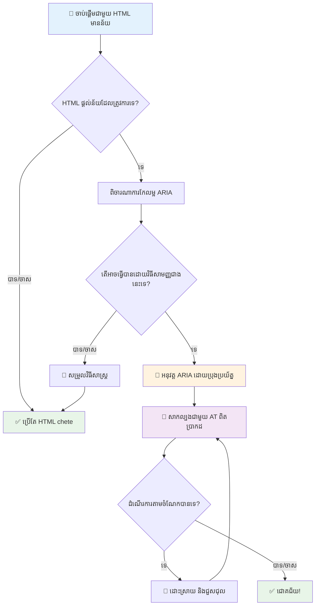
1. **HTML សមត្ថភាពSemantic ជាមុន**៖ ជែងអំពាវនាវ `<button>` ជាង `<div role="button">`
2. **កុំបែកបាក់ semantics**៖ កុំរំលោភអត្ថន័យ HTML មានស្រាប់ (ចៀសវាង `<h1 role="button">`)
3. **រក្សា accessibility ដោយក្តារចុច**៖ ធាតុ ARIA អាចចូលប្រើគ្រប់គ្រាន់ ត្រូវងាយប្រើដោយក្តារចុច
4. **សាកល្បងជាមួយអ្នកប្រើប្រាស់ពិតប្រាកដ**៖ ARIA មានការគាំទ្រដោយឧបករណ៍ជួយផ្សេងៗគ្នាច្រើន
5. **ចាប់ផ្តើមពីអធិប្បាយងាយៗ**៖ ការអនុវត្ត ARIA ស្មុគស្មាញមានឪកាសមានកំហុសច្រើនជាង

**🔍 ដំណើរការសាកល្បង:**

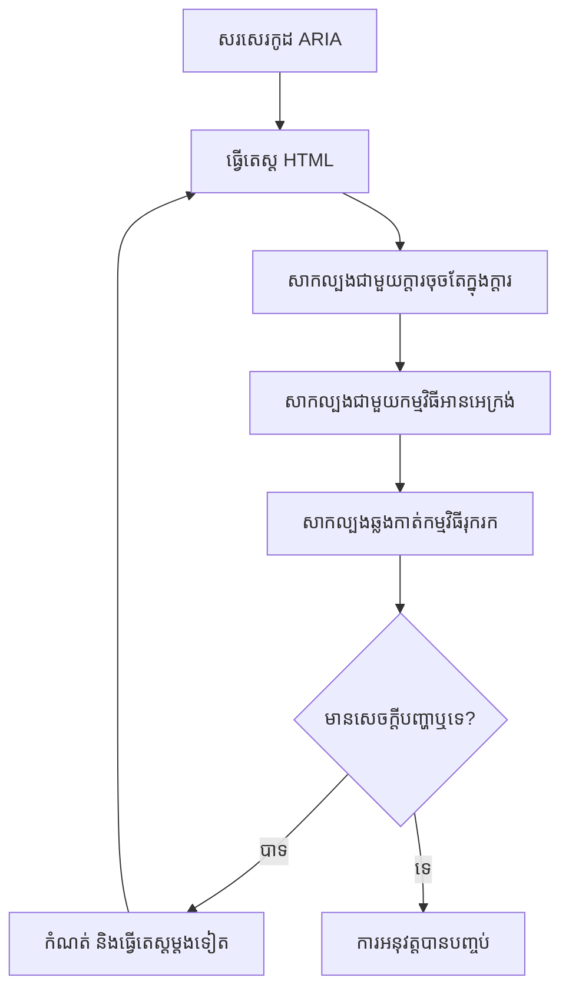
**🚫 កំហុស ARIA មិនគួរធ្វើ៖**

- **ព័ត៌មានផ្ទុយគ្នា**៖ កុំទំ contradicteur semantics HTML
- **គេច្រើនពេក**៖ ARIA ច្រើនពេកធ្វើអោយអ្នកប្រើរំខាន
- **ARIA ស្ទេតិក**៖ មិនធ្វើអាប់ដេតស្ថានភាព ARIA ពេលមាតិកាប្រែ
- **អនុវត្តមិនបានសាកល្បង**៖ ARIA ដែលមានគ្រោងដូចបានដំណើរការ តែបរាជ័យក្នុងការអនុវត្ត
- **គាំទ្រក្តារចុចមិនគ្រប់គ្រាន់**៖ តួនាទី ARIA គ្មានអន្តរកម្មជាមួយក្តារចុច

> 💡 **ធនធាន​សាកល្បង**៖ ប្រើឧបករណ៍ដូចជា [accessibility-checker](https://www.npmjs.com/package/accessibility-checker) សម្រាប់ត្រួតពិនិត្យ ARIA ដោយស្វ័យប្រវត្តិ ប៉ុន្តែតែងតែសាកល្បងជាមួយកម្មវិធីអានអេក្រង់ពិតសម្រាប់បទពិសោធន៍ពេញលេញ។

### 🎭 **ពិនិត្យជំនាញ ARIA៖ ត្រៀមខ្លួនសម្រាប់អន្តរកម្មស្មុគស្មាញ?**

**វាស់ប្រាក់កំពុង ARIA របស់អ្នក:**
- តើអ្នកនឹងជ្រើស ARIA ជំនួស HTML សមត្ថភាពពេលណា? (សេចក្តីរំលឹក៖ ពិតជាអត់មានទេ!)
- តើអ្នកអាចពន្យល់ហេតុផលអ្វីបានជ `<div role="button">` មិនល្អដូច `<button>`?
- តើអ្វីដែលសំខាន់បំផុតដែលត្រូវចងចាំអំពីការសាកល្បង ARIA?

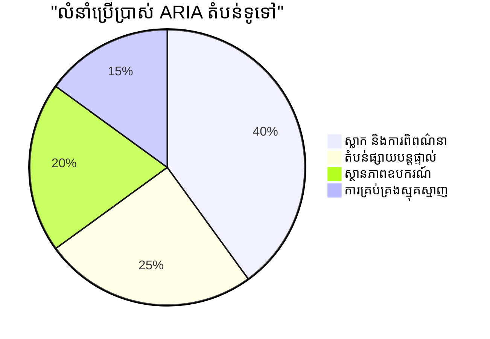
> **ចំណុចចម្បង**៖ ការប្រើប្រាស់ ARIA ភាគច្រើនសម្រាប់បញ្ជាក់ឈ្មោះ និងពិពណ៌នា។ គំរូវីដយ(widget) ស្មុគស្មាញគឺមានករណីតិចជាងដែលអ្នកគិត!

✅ **រៀនពីអ្នកជំនាញ**៖ សិក្សា [ARIA Authoring Practices Guide](https://w3c.github.io/aria-practices/) សម្រាប់គំរូនិងការអនុវត្តឧបករណ៍អន្តរកម្មស្មុគស្មាញ។

## បង្កើតរូបភាព និងមេឌៀអាចចូលដំណើរការបាន

មាតិកាតាមភ្នែក និងឧបករណ៍សំឡេងជាផ្នែកសំខាន់នៃបទពិសោធន៍បណ្តាញសម័យទំនើប ប៉ុន្តែវាអាចបង្កជាព្រំដែនបើមិនបានអនុវត្តយ៉ាងចំណង់ចំណូល។ គោលបំណងគឺធានារ៉ាប់រងថាព័ត៌មាន និងឥទ្ធិពលអារម្មណ៍នៃមេឌៀរបស់អ្នកឈានដល់អ្នកប្រើគ្រប់រូប។ បន្ទាប់ពីអ្នកយល់ដឹង វានឹងក្លាយជាទំនៀមទំលាប់។

ប្រភេទមេឌៀផ្សេងៗត្រូវការរបៀបភ្នាក់ងារចូលដំណើរការផ្សេងគ្នា។ វាដូចជាការចម្អិនម្ហូប—អ្នកមិនបាច់ចម្អិនត្រីហួសស្រួលដូចធ្វើសាច់គោក្នុងរបៀបដូចគ្នាទេ។ ការយល់ដឹងពីភាពខុសគ្នាទាំងនេះជួយអ្នកជ្រើសដំណោះស្រាយត្រឹមត្រូវសម្រាប់ករណីនីមួយៗ។

### យុទ្ធសាស្រ្តអាចចូលដំណើរការរូបភាព

រូបភាពគ្រប់លើគេហទំព័ររបស់អ្នកមានគោលបំណងមួយ។ ការយល់ដឹងពីគោលបំណងនោះជួយអ្នកសរសេរអត្ថបទជំនួសអោយបានល្អ និងបង្កើតបទពិសោធន៍ដ៏រួមបញ្ចូល។

**ប្រភេទរូបភាពបួន និងយុទ្ធសាស្រ្តអត្ថបទជំនួស៖**

**រូបភាពព័ត៌មាន** - ផ្តល់ព័ត៌មានសំខាន់៖
```html

```

**រូបភាពតំណើរការពិសេស** - គ្រាន់តែមើល តែមិនផ្តល់ព័ត៌មាន៖
```html

```

**រូបភាពមុខងារ** - ប្រើជាប៊ូតុង ឬត្រួតពិនិត្យ៖
```html
<button>
  
</button>
```

**រូបភាពស្មុគស្មាញ** - ចំណាំតារាង ប្រព័ន្ធគំនូរ ព័ត៌មានតារាង៖
```html

<div id="chart-description">
  <p>Detailed description: Sales data shows a steady increase across all quarters...</p>
</div>
```

### ការចូលដំណើរការវីដេអូ និងសំលេង

**ការទាមទារ​នៃ​វីដេអូ:**
- **ចំណងជើង**៖ អត្ថបទជំនួសសំលេងនិយាយ និងប្រតិកម្មសំឡេង
- **ការពិពណ៌នាសំឡេង**៖ រាយការណ៍អំពីធាតុមើលសម្រាប់អ្នកភ្នែកខ្វះ
- **ពត៌មានអត្ថបទ**៖ សម្រង់ពេញលេញនៃមាតិកាសំឡេង និងមើល

```html
<video controls>
  <source src="video.mp4" type="video/mp4">
  <track kind="captions" src="captions.vtt" srclang="en" label="English">
  <track kind="descriptions" src="descriptions.vtt" srclang="en" label="Audio descriptions">
</video>
```

**ការទាមទារអូឌីយ៉ូ:**
- **ពត៌មានអត្ថបទ**៖ អត្ថបទសំរាប់មាតិកាសំឡេងទាំងអស់
- **សញ្ញាសម្គាល់ភ្នែក**៖ សម្រាប់មាតិកាចំបងសំលេង គួរផ្តល់សញ្ញាសម្គាល់

### បច្ចេកវិទ្យារូបភាពសម័យទំនើប

**កំណត់រូបភាពតំណើរការជាមួយ CSS:**
```css
.hero-section {
  background-image: url('decorative-hero.jpg');
  /* Decorative images in CSS don't need alt text */
}
```

**រូបភាពប្រតិកម្មសំរាប់ accessibility:**
```html
<picture>
  <source media="(min-width: 800px)" srcset="large-chart.png">
  <source media="(min-width: 400px)" srcset="medium-chart.png">
  
</picture>
```

✅ **សាកល្បងសមត្ថភាពរូបភាព**៖ ប្រើកម្មវិធីអានអេក្រង់ដើម្បីរុករកទំព័រដែលមានរូបភាព។ តើអ្នកទទួលបានព័ត៌មានគ្រប់គ្រាន់ដើម្បីយល់ពីមាតិកា?

## ទីតាំងក្តារចុច និងគ្រប់គ្រងការផ្ដោត

អ្នកប្រើប្រាស់ជាច្រើនរុករកបណ្តាញជាស្រេចដោយប្រើក្តារចុចគត់។ នេះរួមមានមនុស្សដែលមានមិនសូវសមត្ថភាពចលនា អ្នកប្រើបំរើដែលគិតថាក្តារចុចលឿនជាងកណ្តុរ និងនរណាមួយដែលកណ្តុររបស់គេត្រូវបានបង្ហើប។ ទើបប្រាកដថាគេហទំព័ររបស់អ្នកអាចដំណើរការល្អជាមួយការបញ្ចូលដោយក្តារចុច គឺចាំបាច់ហើយជាញឹកញាប់ធ្វើឱ្យគេហទំព័ររបស់អ្នកមានប្រសិទ្ធភាពសម្រាប់គ្រប់គ្នា។

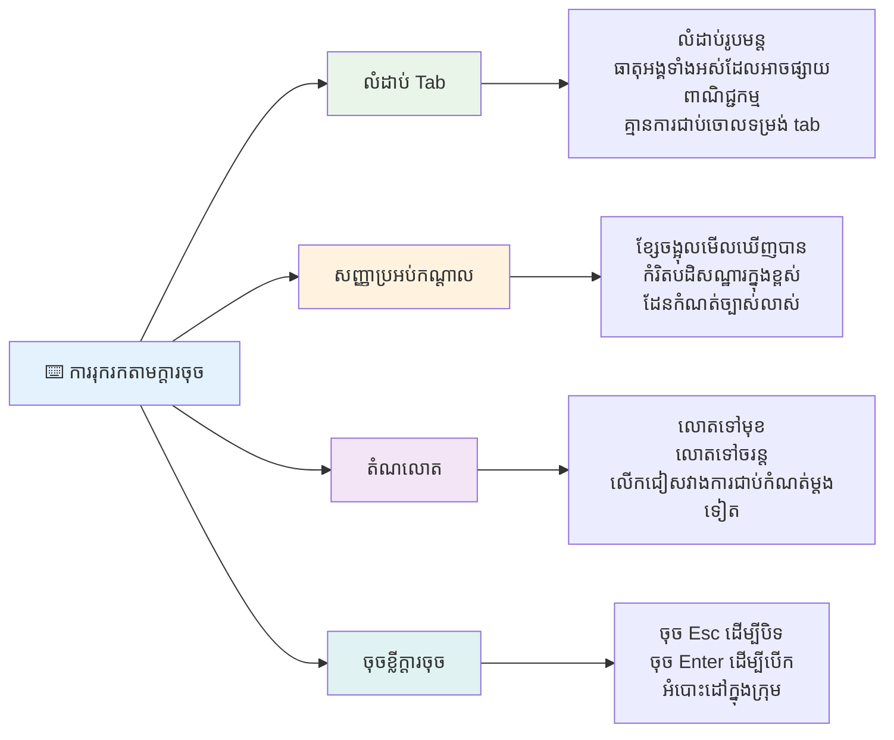
### គំរូទីតាំងក្តារចុចសំខាន់ៗ

**អន្តរប្រតិកម្មក្តារចុចស្តង់ដារ៖**
- **Tab**៖ ផ្ដួចផ្ដើមផ្ដោតទៅមុខតាមធាតុអន្តរកម្ម
- **Shift + Tab**៖ ផ្ដួចផ្ដើមទៅក្រោយ
- **Enter**៖ សកម្មប៊ូតុង និងតំណភ្ជាប់
- **Space**៖ សកម្មប៊ូតុង និងពិនិត្យប្រអប់
- **ក្តារបញ្ចូល**៖ រុករកក្នុងក្រុមធាតុ (ប៊ូតុង radio, មេនុ)
- **Escape**៖ បិទបង្អួចឡើងវិញ, បង្អួចចុះ, ឬបោះបង់ប្រតិបត្តការ

### គោលការណ៍គ្រប់គ្រងការផ្ដោត

**សញ្ញាផ្ដោតដែលអាចឃើញបាន:**
```css
/* Ensure focus is always visible */
button:focus-visible {
  outline: 2px solid #4A90A4;
  outline-offset: 2px;
}

/* Custom focus styles for different components */
.card:focus-within {
  box-shadow: 0 0 0 3px rgba(74, 144, 164, 0.5);
}
```

**តំណរបន្លំសម្រាប់ការរុករកប្រសិទ្ធ:**
```html
<a href="#main-content" class="skip-link">Skip to main content</a>
<a href="#navigation" class="skip-link">Skip to navigation</a>

<nav id="navigation">
  <!-- navigation content -->
</nav>
<main id="main-content">
  <!-- main content -->
</main>
```

**លំដាប់ tab ត្រឹមត្រូវ:**
```html
<!-- Use semantic HTML for natural tab order -->
<form>
  <label for="name">Name:</label>
  <input type="text" id="name" tabindex="0">
  
  <label for="email">Email:</label>
  <input type="email" id="email" tabindex="0">
  
  <button type="submit" tabindex="0">Submit</button>
</form>
```

### ការរុករកចាប់ខ្សែអោយនៅក្នុងម៉ូដាល់

ពេលបើកបង្អួចម៉ូដាល់ ការផ្ដោតគួរត្រូវបានចាប់ខ្សែ នៅក្នុងម៉ូដាល់៖

```javascript
// ការអនុវត្តឡើងវិញនៃការខ្ទប់កំណត់អាប់ដេតសម័យថ្មី
function trapFocus(element) {
  const focusableElements = element.querySelectorAll(
    'button, [href], input, select, textarea, [tabindex]:not([tabindex="-1"])'
  );
  
  const firstElement = focusableElements[0];
  const lastElement = focusableElements[focusableElements.length - 1];

  element.addEventListener('keydown', (e) => {
    if (e.key === 'Tab') {
      if (e.shiftKey && document.activeElement === firstElement) {
        e.preventDefault();
        lastElement.focus();
      } else if (!e.shiftKey && document.activeElement === lastElement) {
        e.preventDefault();
        firstElement.focus();
      }
    }
    
    if (e.key === 'Escape') {
      closeModal();
    }
  });
  
  // ផ្ដោតលើធាតុដំបូងពេលប្រអប់បង្អួចបើកឡើង
  firstElement.focus();
}
```

✅ **សាកល្បងទីតាំងក្តារចុច**៖ ព្យាយាមរុករកគេហទំព័ររបស់អ្នកដោយប្រើប៉ុណ្ណាតែប៊ូតុង Tab តែប៉ុណ្ណោះ។ តើអ្នកអាចដល់ធាតុអន្តរកម្មទាំងអស់ទេ? លំដាប់ផ្ដោតតើមានលក្ខណៈផ្ដល់មូលដ្ឋានទេ? តើសញ្ញាផ្ដោតលេចធ្លោក្នុងភ្នែកទេ?

## ការចូលដំណើរការូបភាព

ទម្រង់គ្រប់គ្រាន់នៃទម្រង់សម្រាប់ការចូលដំណើរការ។

### ការតភ្ជាប់ស្លាកនិងគ្រប់គ្រងបែបបទ

**គ្រប់គ្រងបែបបទត្រូវការស្លាក:**
```html
<!-- Explicit labeling (preferred) -->
<label for="username">Username:</label>
<input type="text" id="username" name="username" required>

<!-- Implicit labeling -->
<label>
  Password:
  <input type="password" name="password" required>
</label>

<!-- Using aria-label when visual label isn't desired -->
<input type="search" aria-label="Search products" placeholder="Search...">
```

### ការគ្រប់គ្រងកំហុស និងការបញ្ជាក់សុពលភាព

**សារកំហុសដែលអាចចូលដំណើរការ:**
```html
<label for="email">Email Address:</label>
<input type="email" id="email" name="email" 
       aria-describedby="email-error" 
       aria-invalid="true" required>
<div id="email-error" role="alert">
  Please enter a valid email address
</div>
```

**គោលការណ៍គ្រប់គ្រងបែបបទល្អបំផុត:**
- ប្រើរាយ `aria-invalid` សម្រាប់វាលមិនត្រឹមត្រូវ
- ផ្ដល់សារកំហុសច្បាស់លាស់ និងជាក់លាក់
- ប្រើ `role="alert"` សម្រាប់ការបញ្ជាក់កំហុសសំខាន់
- បង្ហាញកំហុសភ្លាមៗ និងពេលដាក់ស្នើបែបបទ

### ការបញ្ជូលក្នុង Fieldsets និង ការប្រមូលក្រុម

**ប្រមូលក្រុមគ្រប់គ្រងបែបបទដែលពាក់ព័ន្ធ:**
```html
<fieldset>
  <legend>Shipping Address</legend>
  <label for="street">Street Address:</label>
  <input type="text" id="street" name="street">
  
  <label for="city">City:</label>
  <input type="text" id="city" name="city">
</fieldset>

<fieldset>
  <legend>Preferred Contact Method</legend>
  <input type="radio" id="contact-email" name="contact" value="email">
  <label for="contact-email">Email</label>
  
  <input type="radio" id="contact-phone" name="contact" value="phone">
  <label for="contact-phone">Phone</label>
</fieldset>
```

## ជំហានអភិវឌ្ឍភាពអាចចូលដំណើរការ៖ ចំណុចសំខាន់ៗ

សូមអបអរសាទរ! អ្នកទើបទទួលបានចំណេះដឹងមូលដ្ឋានដើម្បីបង្កើតបទពិសោធន៍គេហទំព័រដែលរួមបញ្ចូលពិតប្រាកដ។ វាជារឿងគួរឱ្យរំភើបណាស់! accessibility តាមបណ្ដាញមិនមែនមានតែការត្រួតពិនិត្យគោលការណ៍ទេ - វាជាការទទួលស្គាល់ វិធីផ្សេងៗរបស់មនុស្សប្រើប្រាស់មាតិកា ឌីជីថល និងរចនាសម្ព័ន្ធសម្រាប់ភាពស្មុគស្មាញដ៏អស្ចារ្យនោះ។

ឥឡូវនេះ អ្នកជាផ្នែកមួយនៃសហគមន៍អ្នកអភិវឌ្ឍន៍កើនឡើងដែលយល់ថារចនាសម្ព័ន្ធវីឌីអូផ្សេងៗគ្នាដូចម្តេច។ សូមស្វាគមន៍មកក្លឹប!

**🎯 ឧបករណ៍កម្រង accessibility របស់អ្នកមាន៖**

| គោលការណ៍មូលដ្ឋាន | ការអនុវត្ត | ផលប៉ះពាល់ |
|----------------|----------------|---------|
| **មូលដ្ឋាន HTML សមត្ថភាពSemantic** | ប្រើធាតុ HTML ត្រឹមត្រូវសម្រាប់គោលបំណង | កម្មវិធីអានអេក្រង់អាចរុករកជាអតិថិជនដ៏ប្រសើរ គ្រប់គ្រងបានដោយក្តារចុចដោយស្វ័យប្រវត្តិ |
| **រចនាបទបង្ហាញបញ្ចូល** | ប្រើការចំរូងមាសគ្រប់គ្រាន់ ប្រើពណ៌មានអត្ថន័យ សញ្ញាផ្ដោតឃើញបាន | ច្បាស់សម្រាប់គ្រប់គ្នានៅក្នុងលក្ខខណ្ឌពន្លឺគ្រប់យ៉ាង |
| **មាតិកាពិពណ៌នា** | អត្ថបទតំណភ្ជាប់មានអត្ថន័យ អត្ថបទជំនួស ស្លាក | អ្នកប្រើប្រាស់យល់ពីមាតិកាដោយគ្មានបរិបទមើលឃើញ |
| **អាចចូលប្រើដោយក្តារចុច** | លំដាប់ tab, ម្ចាស់ផ្លូវក្តារចុច, គ្រប់គ្រងផ្ដោត | អាចចូលទៅក្នុងមុខងារផ្លូវចលនា និងប្រសិទ្ធភាពសម្រាប់Power user |
| **បន្ថែម ARIA** | ប្រើយុទ្ធសាស្រ្តផ្គួបដើម្បីបំពេញចន្លោះអត្ថន័យ | កម្មវិធីស្មុគស្មាញដំណើរការជាមួយឧបករណ៍ជំនួយបានល្អ |
| **សាកល្បងទូលំទូលាយ** | ឧបករណ៍ស្វ័យប្រវត្តិ + ការត្រួតពិនិត្យដោយដៃ + សាកល្បងជាមួយអ្នកប្រើប្រាស់ពិត | ចាប់សំណង់អញ្ញើញមុនពេលប៉ះពាល់អ្នកប្រើ |

**🚀 ជំហានបន្ទាប់របស់អ្នក៖**

1. **បញ្ចូល accessibility ទៅក្នុងដំណើរការងារ**៖ ធ្វើការសាកល្បងជាផ្នែកធម្មតានៃដំណើរការអភិវឌ្ឍរបស់អ្នក
2. **រៀនពីអ្នកប្រើពិតប្រាកដ**៖ ស្វែងរកមតិយោបល់ពីមនុស្សប្រើបច្ចេកវិទ្យាជួយ
3. **រក្សាទុកបច្ចុប្បន្នភាព**៖ បច្ចេកទេស accessibility អភិវឌ្ឍជាមួយបច្ចេកវិទ្យា និងស្តង់ដាថ្មីៗ
4. **ផ្សព្វផ្សាយការរួមបញ្ចូល**៖ ចែកចាយចំណេះដឹងរបស់អ្នក និងធ្វើឲ្យ accessibility ជាអាទិភាពក្រុម

> 💡 **ចងចាំ**៖ កំណត់ការអាចចូលដំណើរការធ្វើឱ្យមានដំណោះស្រាយច្នៃប្រឌិត និងស្អាត ដែលមានអត្ថប្រយោជន៍ចំពោះគ្រប់គ្នា។ វាលចុចបញ្ចូលចំណងជើង និងការបញ្ជារសំឡេង ក៏បានជាសមាគមធម្មតាដែរ។

**ករណីអាជីវកម្មច្បាស់លាស់**៖ គេហទំព័រអាចចូលដំណើរការបានឈានដល់អ្នកប្រើច្រើនជាង ដាក់លំដាប់ល្អជាងក្នុងម៉ាស៊ីនស្វែងរក កាត់បន្ថយថ្លៃថែទាំ និងជៀសវាងហានិភ័យផ្លូវច្បាប់។ ប៉ុន្តែប្រាកដណាស់? ហេតុផលពិតប្រាកដក្នុងការយកចិត្តទុកដាក់អំពី accessibility ជ្រាបចូលជ្រេីសយូរជាងនេះ។ គេហទំព័រដែលអាចចូលដំណើរការបានបង្ហាញតម្លៃល្អបំផុតនៃគេហទំព័រ—ភាពទូលំទូលាយ រួមបញ្ចូល និងគំនិតថាគ្រប់គ្នាដល់នូវការចូលដំណើរការព័ត៌មានស្មើគ្នា។

ឥឡូវនេះ អ្នកមានឧបករណ៍សម្រាប់បង្កើតគេហទំព័រដ៏រួមបញ្ចូលនាពេលអនាគត។ គេហទំព័រអាចចូលដំណើរការនីមួយៗដែលអ្នកបង្កើត ធ្វើឱ្យអ៊ីនធឺណិតកាន់តែងាយស្រួលសម្រាប់គ្រប់គ្នា។ វាជារឿងអស្ចារ្យណាស់ពេលអ្នកគិតពីវា!

## បច្ចុប្បន្នធនធានបន្ថែម

បន្តការស្វែងយល់អំពី accessibility របស់អ្នកជាមួយធនធានសំខាន់ៗទាំងនេះ៖

**📚 ស្តង់ដារផ្លូវការនិងមគ្គុទេសក៍៖**
- [WCAG 2.1 Guidelines](https://www.w3.org/WAI/WCAG21/quickref/) - ស្តង់ដារ accessibility ផ្លូវការជាមួយយោងរហ័ស
- [ARIA Authoring Practices Guide](https://w3c.github.io/aria-practices/) - គំរូទូលំទូលាយសម្រាប់វីកជីតអន្តរកម្ម
- [WebAIM Guidelines](https://webaim.org/) - អ្នកផ្តល់មគ្គុទេស accessibility ជារបរ ប្រកបដោយភាពងាយស្រួល

**🛠️ ឧបករណ៍ និងធនធានសាកល្បង:**
- [axe DevTools](https://www.deque.com/axe/devtools/) - ការសាកល្បង accessibility លំដាប់ឧស្សាហកម្ម
- [A11y Project Checklist](https://www.a11yproject.com/checklist/) - ការត្រួតពិនិត្យ accessibility ជានិច្ច
- [Accessibility Insights](https://accessibilityinsights.io/) - សំណុំបែបបទសាកល្បងដ៏ទូលំទូលាយ Microsoft
- [Color Oracle](https://colororacle.org/) - ប្រព័ន្ធសូចនាករពណ៌ភ្នែកពិការសម្រាប់ពិនិត្យរចនា

**🎓 ការសិក្សានិងសហគមន៍:**
- [WebAIM Screen Reader Survey](https://webaim.org/projects/screenreadersurvey9/) - មតិយោបល់និងទំនួលខុសត្រូវអ្នកប្រើពិត
- [Inclusive Components](https://inclusive-components.design/) - គំរូធាតុចូលរួមសម័យទំនើប
- [A11y Coffee](https://a11y.coffee/) - គន្លឹះនិងចំណេះដឹងទាក់ទង accessibility ប្រញាប់
- [Web Accessibility Initiative (WAI)](https://www.w3.org/WAI/) - ធនធាន accessibility ទូលំទូលាយ W3C

**🎥 ឧបករណ៍សិក្សាផ្ទាល់ខ្លួន៖**
- [Accessibility Developer Guide](https://www.accessibility-developer-guide.com/) - មគ្គុទេសក៍អនុវត្តជាក់ស្តែង
- [Deque University](https://dequeuniversity.com/) - វគ្គបណ្តុះបណ្តាល accessibility ពហុវិជ្ជាជីវៈ

## ការប្រកួតប្រជែង GitHub Copilot Agent 🚀

ប្រើរបៀបប្រតិបត្តិការ Agent ដើម្បីបញ្ចប់បញ្ហានេះ៖

**ការពិពណ៌នា:** បង្កើតវីកចល័តម៉ូដាល់ដែលអាចចូលដំណើរការបាន ដែលបង្ហាញការគ្រប់គ្រងផ្ដោតត្រឹមត្រូវ គុណលក្ខណៈ ARIA និងគំរូទីតាំងក្តារចុច។

**ពន្លឺ:** សង់វីកលមាន HTML, CSS និង JavaScript ដែលមាន៖ ការចាប់ខ្សែផ្ដោតត្រឹមត្រូវ, ចុច ESC ដើម្បីបិទ, ចុចក្រៅដើម្បីបិទ, ធាតុគុណលក្ខណៈ ARIA សម្រាប់កម្មវិធីអានអេក្រង់, និងសញ្ញាផ្ដោតមើលឃើញបាន។ វីកបង្ហាញមានបែបបទសមរម្យ ជាមួយស្លាកត្រឹមត្រូវ និងការគ្រប់គ្រងកំហុស។ ធានាថាវីកត្រូវតាមស្តង់ដារ WCAG 2.1 AA។

## 🚀 ប្រកួតប្រជែង

យក HTML នេះ ហើយសរសេរឡើងវិញឲ្យអាចចូលដំណើរការបានបំផុត ដោយបេីតាមយុទ្ធសាស្រ្តដែលអ្នកបានរៀន។

```html
<!DOCTYPE html>
<html lang="en">
  <head>
    <meta charset="UTF-8">
    <meta name="viewport" content="width=device-width, initial-scale=1.0">
    <title>Turtle Ipsum - The World's Premier Turtle Fan Club</title>
    <link href='../assets/style.css' rel='stylesheet' type='text/css'>
  </head>
  <body>
    <header class="site-header">
      <h1 class="site-title">Turtle Ipsum</h1>
      <p class="site-subtitle">The World's Premier Turtle Fan Club</p>
    </header>
    
    <nav class="main-nav" aria-label="Main navigation">
      <h2 class="nav-header">Resources</h2>
      <ul class="nav-list">
        <li><a href="https://www.youtube.com/watch?v=CMNry4PE93Y">"I like turtles" video</a></li>
        <li><a href="https://en.wikipedia.org/wiki/Turtle">Basic turtle information</a></li>
        <li><a href="https://en.wikipedia.org/wiki/Turtles_(chocolate)">Chocolate turtles candy</a></li>
      </ul>
    </nav>
    
    <main class="main-content">
      <article>
        <h1>Welcome to Turtle Ipsum</h1>
        <p class="intro">
          <a href="/about">Learn more about our turtle community</a> and discover fascinating facts about these amazing creatures.
        </p>
        <p class="article-text">
          Turtle ipsum dolor sit amet, consectetur adipiscing elit, sed do eiusmod tempor incididunt ut labore et dolore magna aliqua. Ut enim ad minim veniam, quis nostrud exercitation ullamco laboris nisi ut aliquip ex ea commodo consequat. Duis aute irure dolor in reprehenderit in voluptate velit esse cillum dolore eu fugiat nulla pariatur. Excepteur sint occaecat cupidatat non proident, sunt in culpa qui officia deserunt mollit anim id est laborum.
        </p>
      </article>
    </main>
    
    <footer class="footer">
      <section class="newsletter-signup">
        <h2>Stay Updated</h2>
        <button type="button" onclick="showNewsletterForm()">Sign up for turtle news</button>
      </section>
      
      <nav class="footer-nav" aria-label="Footer navigation">
        <h2>Site Pages</h2>
        <ul>
          <li><a href="../">Home</a></li>
          <li><a href="../semantic">Semantic HTML example</a></li>
        </ul>
      </nav>
      
      <p class="footer-copyright">&copy; 2024 Instrument. All rights reserved.</p>
    </footer>
  </body>
</html>
```

**ការកែលម្អសំខាន់ៗ​ដែលបានធ្វើ៖**
- បន្ថែមរចនាសម្ព័ន្ធ HTML សមត្ថភាពSemantic ត្រឹមត្រូវ
- បញ្ចូលលំដាប់ការសរសេរក្បាល (h1 តែមួយ, បន្តបន្ដ logically)
- បន្ថែមអត្ថបទតំណភ្ជាប់មានអត្ថន័យ ជំនួស "click here"
- បន្ថែមស្លាក ARIA ត្រឹមត្រូវសម្រាប់ការរុករក
- បន្ថែម lang attribute និង meta tags ត្រឹមត្រូវ
- ប្រើធាតុប៊ូតុងសម្រាប់ឧបករណ៍អន្តរកម្ម
- រៀបចំមាតិកាចុងទំព័រជាមួយទីតាំងសំខាន់

## សំណួរបន្ទាប់សិក្សាសិក្សា
[សំណួរបន្ទាប់សិក្សា](https://ff-quizzes.netlify.app/web/en/)

## សិក្សាត្រួតពិនិត្យដោយខ្លួនឯង

រាជរដ្ឋាភិបាលជាច្រើនមានច្បាប់អំពីការទាមទារចូលដំណើរការ។ សូមអានច្បាប់ accessibility ប្រទេសរបស់អ្នក។ តើមានអ្វីគ្របដណ្តប់ និងមិនគ្របដណ្តប់? ឧទាហរណ៍មួយគឺ [គេហទំព័ររដ្ឋាភិបាលនេះ](https://accessibility.blog.gov.uk/)។

## ការចាត់តាំង

[វិភាគគេហទំព័រមិនអាចចូលដំណើរការ](assignment.md)

អំណរ៖ [Turtle Ipsum](https://github.com/Instrument/semantic-html-sample) ដោយ Instrument

---

## 🚀 របៀបរៀនដៃឯកទេសភាពអាចចូលដំណើរការរបស់អ្នក

### ⚡ **អ្វីដែលអ្នកអាចធ្វើក្នុង ៥ នាទីបន្ទាប់**
- [ ] ដំឡើងបច្ចេកវិទ្យា axe DevTools នៅក្នុងកម្មវិធី浏览器របស់អ្នក
- [ ] បើកការត្រួតពិនិត្យ accessibility នៅក្នុង Lighthouse នៅលើគេហទំព័រដែលអ្នកចូលចិត្ត
- [ ] ជំនួយរុករកគេហទំព័រណាមួយដោយប្រើពត៌មាន Tab តែប៉ុណ្ណោះ
- [ ] សាកល្បងកម្មវិធីអានអេក្រង់ដែលមានស្រាប់នៅក្នុងកម្មវិធី浏览器 (Narrator/VoiceOver)

### 🎯 **អ្វីដែលអ្នកអាចសម្រេចបានក្នុងម៉ោងនេះ**
- [ ] បញ្ចប់សំណួរបន្ទាប់សិក្សា និងចំណែកបញ្ចូលចិត្តអំពី accessibility
- [ ] ប្រាត់អត្ថបទ alt មានន័យសម្រាប់រូបភាព ១០ ប្រភេទ
- [ ] ពិនិត្យស្ថិតិត្រង់ក្បាលគេហទំព័រដោយប្រើកំណត់ប្រើ HeadingsMap
- [ ] ធ្វើការកែលម្អកំហុស accessibility ដែលបានរកឃើញក្នុង ប្រកួតប្រជែង HTML
- [ ] ពិនិត្យភាពផ្ទុយពណ៌លើគម្រោងបច្ចុប្បន្នរបស់អ្នកជាមួយឧបករណ៍ WebAIM

### 📅 **ដំណើរការអ្នករយៈពេលមួយសប្តាហ៍**
- [ ] បញ្ចប់ការងារវិភាគគេហទំព័រដែលមិនអាចចូលដំណើរការ
- [ ] តំឡើងបរិយាកាសអភិវឌ្ឍន៍របស់អ្នកជាមួយឧបករណ៍សាកល្បងការចូលដំណើរការ
- [ ] អនុវត្តការប្រើប្រាស់ក្តារចុចលើគេហទំព័រលំបាក 5 គេហទំព័រ
- [ ] បង្កើតសំណុំបែបបទងាយៗជាមួយស្លាកត្រឹមត្រូវ ការដោះស្រាយកំហុស និង ARIA
- [ ] ចូលរួមសហគមន៍ចូលដំណើរការ (A11y Slack, វេទិកា WebAIM)
- [ ] មើលអ្នកប្រើប្រាស់ពិតប្រាកដដែលមានកម្រិតពិការភាពរុករកគេហទំព័រ (YouTube មានឧទាហរណ៍ល្អៗ)

### 🌟 **ការបម្លែងរយៈពេលមួយខែរបស់អ្នក**
- [ ] បញ្ចូលការសាកល្បងចូលដំណើរការចូលទៅក្នុងដំណើរការអភិវឌ្ឍន៍របស់អ្នក
- [ ] ឧបត្ថម្ភគម្រោងប្រភពបើកដោយសោតកំហុសក្នុងការចូលដំណើរការ
- [ ] ចាត់ចែងការសាកល្បងប្រើប្រាស់ជាមួយនរណាមួយដែលប្រើប្រាស់បច្ចេកវិទ្យាជួយ
- [ ] បង្កើតបណ្ណាល័យអង្គគំរូដែលអាចចូលដំណើរការសម្រាប់ក្រុមរបស់អ្នក
- [ ] យុទ្ធនាការសម្រាប់ចូលដំណើរការនៅកន្លែងធ្វើការឬសហគមន៍របស់អ្នក
- [ ] ដឹកនាំមនុស្សថ្មីក្នុងគំនិតចូលដំណើរការ

### 🏆 **កិច្ចពិនិត្យជាលើកចុងក្រោយសម្រាប់កីឡាករចូលដំណើរការ**

**អបអរសាទរជំហានចូលដំណើរការរបស់អ្នក៖**
- តើអ្វីជារឿងដែលភ្ញាក់ផ្អើលបំផុតដែលអ្នកបានរៀនអំពីរបៀបដែលមនុស្សប្រើប្រាស់គេហទំព័រ?
- តើគន្លងចូលដំណើរការណាមួយដែលមានហូរកំណត់ចិត្តខ្លាំងបំផុតជាមួយរចនាបថអភិវឌ្ឍន៍របស់អ្នក?
- តើការរៀនអំពីចូលដំណើរការបានបម្លែងទស្សនៈរបស់អ្នកទៅលើការរចនាយ៉ាងដូចម្តេច?
- តើការកែលម្អចូលដំណើរការដំបូងណាដែលអ្នកចង់ធ្វើលើគម្រោងពិត?

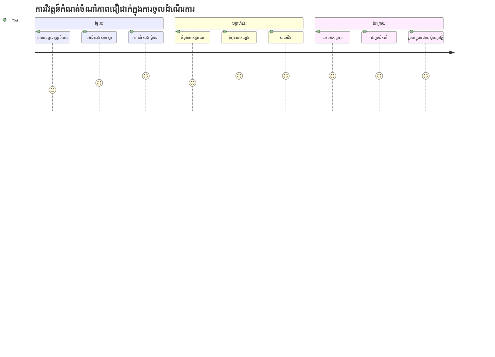
> 🌍 **ឥឡូវនេះអ្នកគឺជាកីឡាករចូលដំណើរការ!** អ្នកយល់ថាបទពិសោធន៍វែបដ៏ល្អបំផុតធ្វើការសម្រាប់មនុស្សគ្រប់រូប មិនថាពួកគេចូលដំណើរការវែបបានយ៉ាងដូចម្តេច។ លក្ខណៈអាចចូលដំណើរការណាមួយដែលអ្នកបង្កើតធ្វើឱ្យអ៊ីនធឺណិតមានភាពរួមចំណែក។ វែបត្រូវការអ្នកអភិវឌ្ឍដែលមើលឃើញចូលដំណើរការមិនមែនជាមហានិធិ តែមួយជាឱកាសក្នុងការបង្កើតបទពិសោធន៍ប្រសើរជាងមុនសម្រាប់អ្នកប្រើប្រាស់ទាំងអស់។ សូមស្វាគមន៍មកកាន់ចលនានេះ! 🎉

---

<!-- CO-OP TRANSLATOR DISCLAIMER START -->
**ការបដិសេធ**៖  
ឯកសារនេះត្រូវបានបកប្រែដោយប្រើសេវាបកប្រែ AI [Co-op Translator](https://github.com/Azure/co-op-translator)។ ខណៈពេលដែលយើងខិតខំប្រឹងប្រែងសម្រាប់ភាពត្រឹមត្រូវ សូមជម្រាបថាការបកប្រែដោយស្វ័យប្រវត្តិអាចមានកំហុស ឬច្រឡំបាន។ ឯកសារដើមក្នុងភាសាមេគួរត្រូវបានគេចាត់ទុកជាប្រភពផ្លូវការជាផ្លូវការ។ សម្រាប់ព័ត៌មានសំខាន់ៗ សូមណែនាំឱ្យប្រើការបកប្រែដោយមនុស្សដែលជាវិជ្ជាជីវៈ។ យើងមិនទទួលខុសត្រូវចំពោះការយល់ច្រឡំ ឬការបកបរបានមិនត្រឹមត្រូវណាមួយដែលកើតមានពីការប្រើប្រាស់ការបកប្រែនេះឡើយ។
<!-- CO-OP TRANSLATOR DISCLAIMER END -->