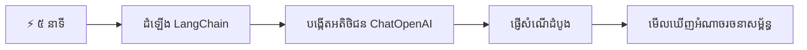
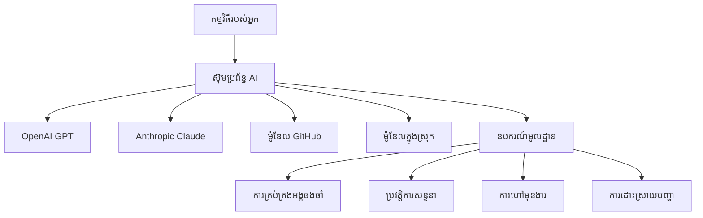
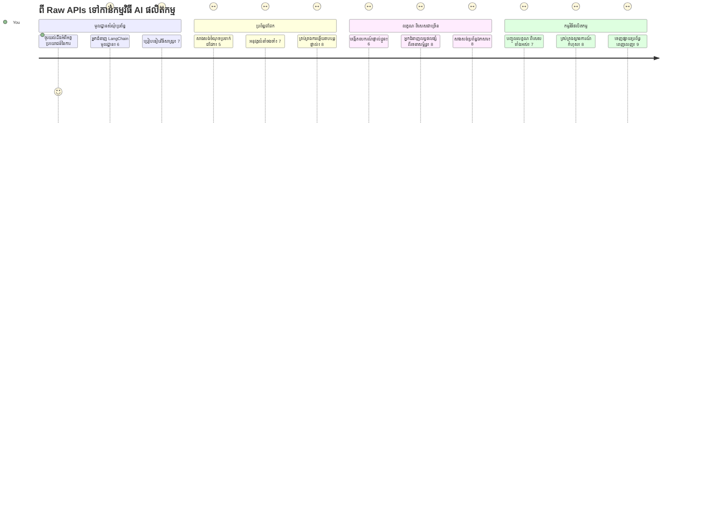
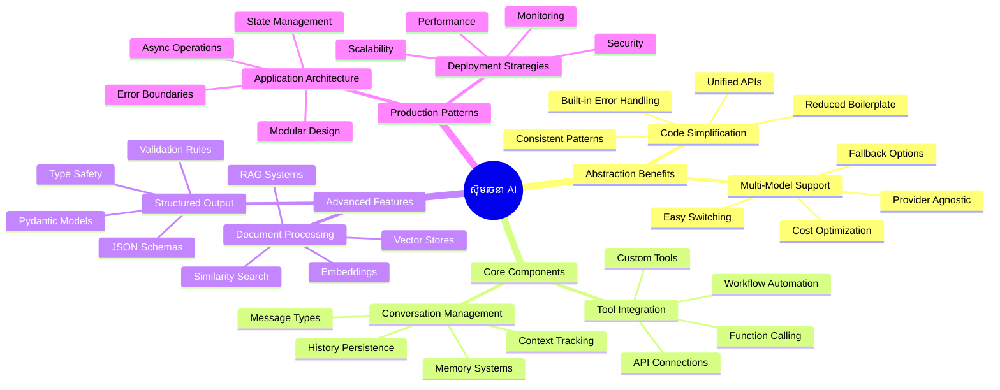
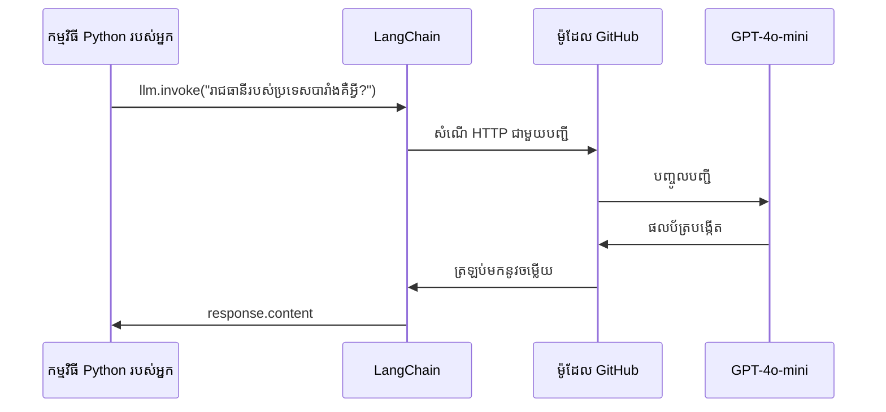
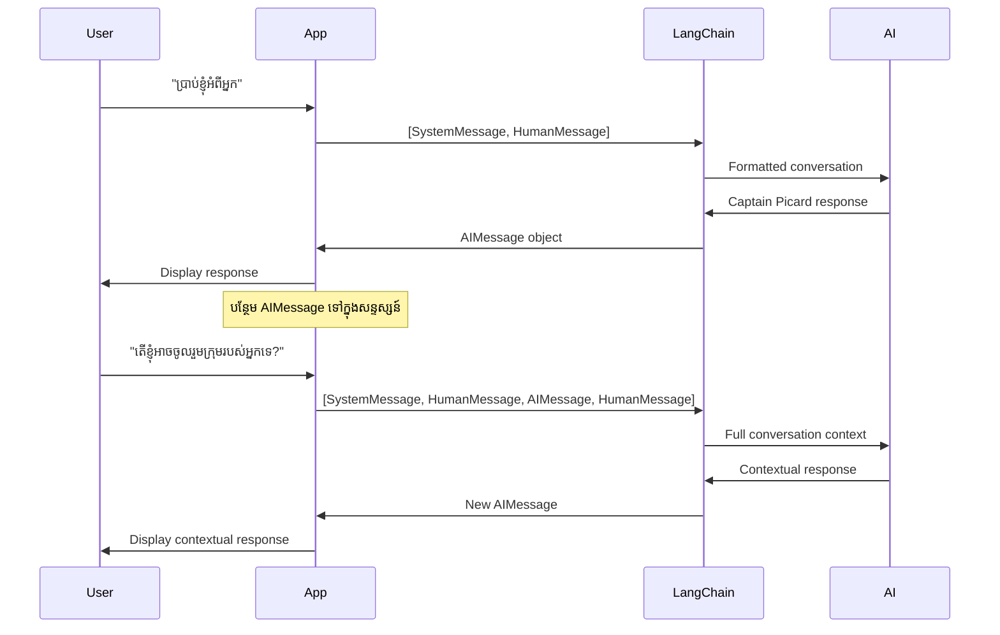
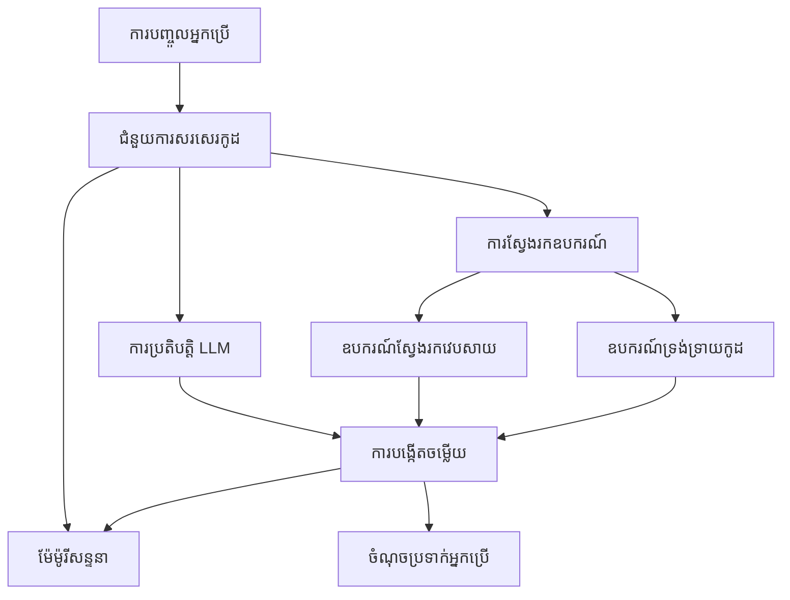
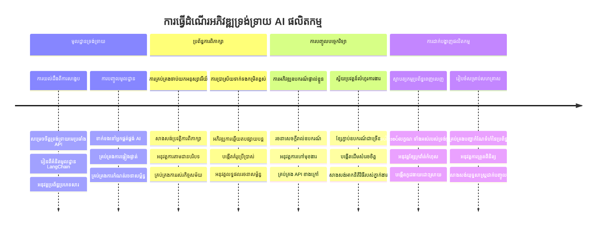
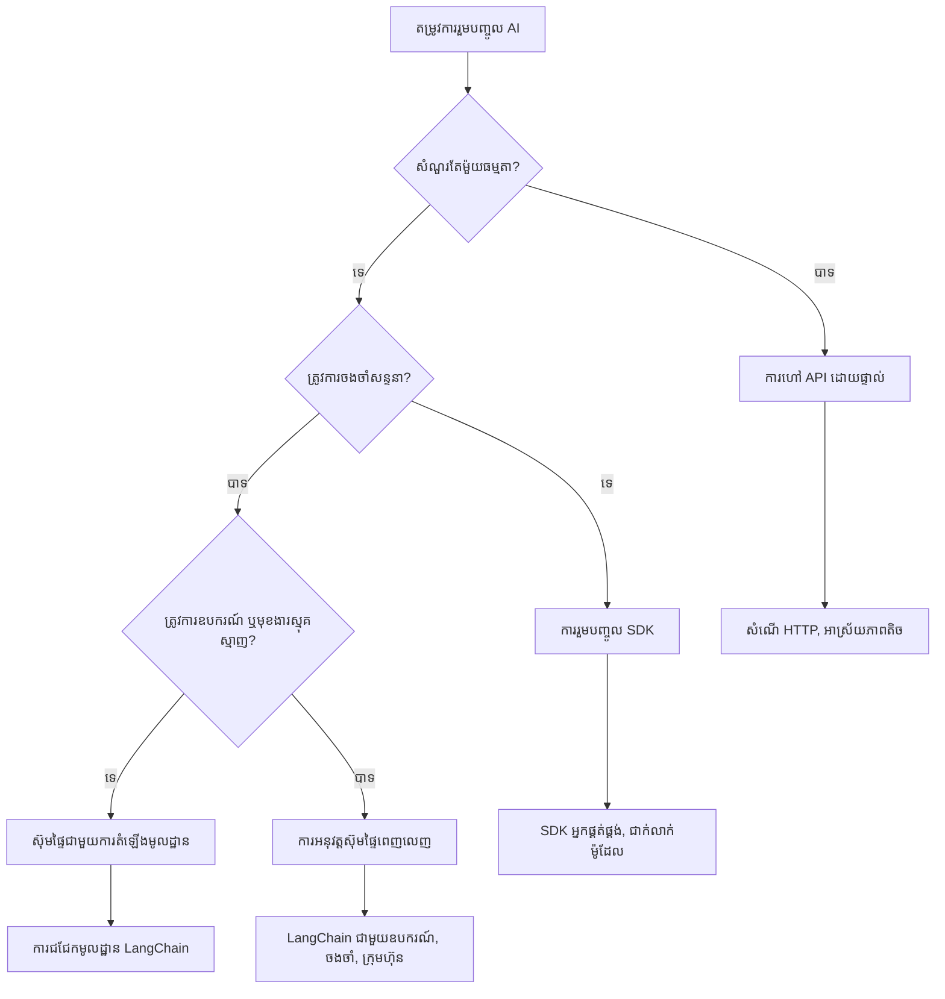

# ស៊ុមប្រព័ន្ធ AI

ដែលធ្លាប់មានអារម្មណ៍ថាខ្លាំងចិត្តពិបាកព្យាយាមបង្កើតកម្មវិធី AI ពីដើមទេ? អ្នកមិនបានឯងបាត់ទេ! ស៊ុមប្រព័ន្ធ AI គឺដូចជាម្ចាស់ដៃច្រើននូវឧបករណ៍ក្នុងការអភិវឌ្ឍ AI - វាជាឧបករណ៍មានថាមពលដែលអាចបម្រុងពេលវេលានិងក្បាលក៏ដូចជាជួយបញ្ចប់ការលំបាកពេលបង្កើតកម្មវិធីមានប្រាជ្ញា។ គិតពីស៊ុមប្រព័ន្ធ AI ដូចជាបណ្ណាល័យដែលបានរៀបចំយ៉ាងល្អ៖ វាបម្រើកម្ប៉ុងដែលបានបង្កើតរួចហើយ, API អនុវត្តស្តង់ដារ និងការសរុបគំនិតឆ្លាតវៃ ដើម្បីឲ្យអ្នកអាចផ្តោតលើការដោះស្រាយបញ្ហាប្រឈមជំនួសការជួបប្រទៈនឹងព័ត៌មានលម្អិតនៃការអនុវត្ត។

នៅក្នុងមេរៀននេះ យើងនឹងស្វែងយល់ពីរបៀបដែលស៊ុមប្រព័ន្ធដូចជា LangChain អាចបំលែងភារកិច្ចបញ្ចូល AI ដែលធ្លាប់មានភាពស្មុគស្មាញទៅជាលក្ខណៈកូដកម្រិតខ្ពស់ដែលអាចអានបានយ៉ាងស្អាត។ អ្នកនឹងស្គាល់ពីរបៀបដោះស្រាយបញ្ហាពិតប្រាកដដូចជា ការតាមដានការសន្ទនា ការអនុវត្តហៅឧបករណ៍ និងការគ្រប់គ្រងម៉ូដែល AI ផ្សេងៗតាមរយៈការផ្តល់ច្រកមួយផ្សេងគ្នា។

នៅពេលដែលយើងបញ្ចប់ អ្នកនឹងដឹងពេលណាដែលត្រូវប្រើស៊ុមប្រព័ន្ធជំនួសការហៅ API ផ្ទាល់ របៀបប្រើប្រាស់កម្រិតសន្ដិសុខរបស់វាដោយមានប្រសិទ្ធភាព និងរបៀបបង្កើតកម្មវិធី AI ដែលត្រៀមល្អសម្រាប់ប្រើប្រាស់ក្នុងពិភពពិត។ មកស្វែងយល់ពីអ្វីដែលស៊ុមប្រព័ន្ធ AI អាចធ្វើបានសម្រាប់គម្រោងរបស់អ្នក។

## ⚡ អ្វីដែលអ្នកអាចធ្វើបានក្នុង ៥នាទីខាងមុខ

**ផ្លូវចាប់ផ្តើមយ៉ាងឆាប់រហ័សសម្រាប់អ្នកអភិវឌ្ឍន៍រវល់**


- **នាទីទី ១**៖ តម្លើង LangChain: `pip install langchain langchain-openai`
- **នាទីទី ២**៖ គ្រប់គ្រង token GitHub របស់អ្នក និងនាំចូល client ChatOpenAI
- **នាទីទី ៣**៖ បង្កើតការសន្ទនាងាយៗជាមួយសារប្រព័ន្ធ និងសារមនុស្ស
- **នាទីទី ៤**៖ បន្ថែមឧបករណ៍មូលដ្ឋានមួយ (ដូចជា add function) និងមើលការហៅឧបករណ៍ AI
- **នាទីទី ៥**៖ មានបទពិសោធន៍នៃភាពខុសគ្នារវាងការហៅ API ផ្ទាល់ និងកម្រិតសន្ដិសុខស៊ុមប្រព័ន្ធ

**កូដសាកល្បងខ្លី**:
```python
from langchain_openai import ChatOpenAI
from langchain_core.messages import SystemMessage, HumanMessage

llm = ChatOpenAI(
    api_key=os.environ["GITHUB_TOKEN"],
    base_url="https://models.github.ai/inference",
    model="openai/gpt-4o-mini"
)

response = llm.invoke([
    SystemMessage(content="You are a helpful coding assistant"),
    HumanMessage(content="Explain Python functions briefly")
])
print(response.content)
```

**មូលហេតុដែលសំខាន់**៖ ក្នុងរយៈពេល៥នាទី អ្នកនឹងទទួលបានបទពិសោធន៍ពីរបៀបដែលស៊ុមប្រព័ន្ធ AI បំលែងការបញ្ចូល AI ដែលស្មុគស្មាញទៅជាការហៅវិធីសាស្ត្រខ្សែស្រឡាយ។ នេះគឺជាផែនដីមូលដ្ឋានសម្រាប់អភិវឌ្ឍកម្មវិធី AI ដែលប្រើក្នុងផលិតកម្ម។

## ហេតុអ្វីបានជាជ្រើសរើសស៊ុមប្រព័ន្ធ?

អ្នកត្រៀមខ្លួនរួចហើយសម្រាប់បង្កើតកម្មវិធី AI - អស្ចារ្យ! ប៉ុន្តែនេះជារឿង៖ អ្នកមានផ្លូវជាច្រើនដែលអាចជ្រើសរើសបាន ហើយរាល់ផ្លូវទាំងនោះមានអត្ថប្រយោជន៍និងគ្រោះថ្នាក់ផ្ទាល់ខ្លួន។ វាដូចជាការជ្រើសរើសរវាងដើរជើង សៀកកង់ ឬបើកឡានទៅកន្លែងណាមួយ - ទាំងអស់ត្រូវនាំអ្នកឱ្យទៅដល់ គឺតែបទពិសោធន៍ (និងកម្លាំងហាត់ប្រាណ) នឹងខុសគ្នាទៅមួយយ៉ាងមួយ។

មកបំបែកបួនរបៀបសំខាន់ដែលអ្នកអាចបញ្ចូល AI ទៅក្នុងគម្រោងរបស់អ្នក៖

| វិធីសាស្រ្ត | អត្ថប្រយោជន៍ | សម្រាប់ | ការពិចារណា |
|------------|---------------|---------|------------|
| **សំណើ HTTP ផ្ទាល់** | គ្រប់គ្រងពេញលេញ, មិនពឹងផ្អែកលើគ្រឿងបន្លាស់ | សំណួរងាយៗ, រៀនមូលដ្ឋាន | កូដវែង, ដោះស្រាយកំហុសដោយដៃ |
| **ការបញ្ចូល SDK** | ថយបន្ថយសំណុំបែបបទ, ប៉ះ​ពាល់ម៉ូដែលបញ្ជាក់ | កម្មវិធីម៉ូដែលតែមួយ | កំណត់ទៅអ្នកផ្គត់ផ្គង់ជាក់លាក់ |
| **ស៊ុមប្រព័ន្ធ AI** | API ស្របគ្នានិងមានកម្រិតសន្ដិសុខនៅក្នុង | កម្មវិធីម៉ូដែលច្រើន, ដំណើរការស្មុគស្មាញ | តម្រូវឱ្យរៀន, អាចពេញចិត្តខ្ពស់ |

### អត្ថប្រយោជន៍ស៊ុមប្រព័ន្ធការអនុវត្ត


**ហេតុអ្វីបានជាស៊ុមប្រព័ន្ធមានសារៈប្រយោជន៍៖**
- **សហភាព** អ្នកផ្គត់ផ្គង់ AI ច្រើននៅក្រោមច្រកតែមួយ
- **គ្រប់គ្រង** អនុស្សាវរីយ៍ការសន្ទនា ដោយស្វ័យប្រវត្តិ
- **ផ្តល់** ឧបករណ៍ស្រាប់សម្រាប់ភារកិច្ចធម្មតាដូចជា embeddings និងហៅមុខងារ
- **គ្រប់គ្រង** ការដោះស្រាយកំហុស និងច្បាប់ព្យាយាមម្តងទៀត
- **បំលែង** ដំណើរការស្មុគស្មាញទៅជាការហៅវិធីសាស្ត្រអានបាន

> 💡 **ជំនួយៈ** ប្រើស៊ុមប្រព័ន្ធពេលប្ដូរវិចិត្រសត្វ AI ផ្សេងៗ ឬបង្កើតមុខងារស្មុគស្មាញដូចជា អ្នកតំណាង អនុស្សាវរីយ៍ ឬការហៅឧបករណ៍។ ចងចាំប្រើ API ផ្ទាល់ពេលរៀនមូលដ្ឋាន ឬបង្កើតកម្មវិធីរឹងមាំសាមញ្ញ។

**ចំណុចសំខាន់**៖ ដូចជាជ្រើសរើសរវាងឧបករណ៍ឯកទេសរបស់អ្នកសិប្បកម្មនិងគ្រឿងវេចខាត់ពេញលេញ វាទាក់ទងនឹងការប្រើឧបករណ៍ឲ្យសមនឹងភារកិច្ច។ ស៊ុមប្រព័ន្ធឯកទេសសម្រាប់កម្មវិធីមានមុខងាររឹងមាំ ខណៈដែល API ផ្ទាល់ល្អសម្រាប់ការប្រើប្រាស់យ៉ាងផ្ទាល់ៗ។

## 🗺️ បដិសណ្ឋារកម្មការសិក្សារបស់អ្នកតាមរយៈជំនាញស៊ុមប្រព័ន្ធ AI


**ចំណុចផ្តាច់មុខនៃការធ្វើដំណើរ**៖ នៅចុងបញ្ចប់មេរៀននេះ អ្នកនឹងមានជំនាញក្នុងការអភិវឌ្ឍស៊ុមប្រព័ន្ធ AI ហើយអាចបង្កើតកម្មវិធី AI ពហុជំនាន់ ដែលមានភាពធន់ទ្រាំសម្រាប់ផលិតកម្មដែលធ្វើប្រកួតប្រជែងជាមួយជំនួយការ AI ពាណិជ្ជកម្ម។

## ជំហានបើកផ្លូវ

នៅក្នុងមេរៀននេះ យើងនឹងរៀន៖

- ប្រើស៊ុមប្រព័ន្ធ AI តែមួយ។
- ដោះស្រាយបញ្ហាទូទៅដូចជាការសន្ទនា, ការប្រើឧបករណ៍, អនុស្សាវរីយ៍ និងបរិបទ។
- ប្រើវានេះដើម្បីបង្កើតកម្មវិធី AI។

## 🧠 បរិស្ថានអភិវឌ្ឍន៍ស៊ុមប្រព័ន្ធ AI


**គោលការណ៍ចម្បង**៖ ស៊ុមប្រព័ន្ធ AI បំបែកភាពស្មុគស្មាញ ខណៈផ្តល់ឱ្យនូវកម្រិតសន្ដិសុខដ៏មានភាពឆ្លាតវៃសម្រាប់ការគ្រប់គ្រងសន្ទនា, បញ្ចូលឧបករណ៍ និងដំណើរការឯកសារ ជួយអភិវឌ្ឍន៍កម្មវិធី AI ស្មុគស្មាញដោយមានកូដស្អាត និងងាយស្រួលថែរក្សា។

## ការជូនដំណឹងដំបូងរបស់អ្នក

តោះចាប់ផ្តើមពីមូលដ្ឋាន ដោយបង្កើតកម្មវិធី AI ដំបូងរបស់អ្នក ដែលផ្ញើសំណួរ ហើយទទួលបានចម្លើយតបត takaisin។ ដូចដែល Archimedes បានរកឃើញ គោលការណ៍នៃការបន្លាយក្នុងបង្គន់របស់គាត់ ខណៈដែលការសង្កេតតូចៗបំផុតម្តងៗ ប្រមូលផ្តុំឡើងទៅជាពិភពប្រាជ្ញាដ៏មានសក្តានុពល - ហើយស៊ុមប្រព័ន្ធធ្វើឲ្យចំណេះដឹងទាំងនេះអាចចូលរួមបាន។

### ការតំឡើង LangChain ជាមួយម៉ូដែល GitHub

យើងនឹងប្រើ LangChain ដើម្បីភ្ជាប់ទៅម៉ូដែល GitHub ដែលសាកសមបានយ៉ាងល្អ ពីព្រោះ វាផ្ដល់ចូលដំណើរការឥតគិតថ្លៃទៅម៉ូដែល AI ប្រែប្រួលជាច្រើន។ ភាគល្អបំផុត? អ្នកត្រូវការ parameters កំណត់តិចតួចប៉ុណ្ណោះដើម្បីចាប់ផ្តើម៖

```python
from langchain_openai import ChatOpenAI
import os

llm = ChatOpenAI(
    api_key=os.environ["GITHUB_TOKEN"],
    base_url="https://models.github.ai/inference",
    model="openai/gpt-4o-mini",
)

# ផ្ញើសេចក្ដីជូនដំណឹងធម្មតា
response = llm.invoke("What's the capital of France?")
print(response.content)
```

**ចំណុចពិចារណា៖**
- **បង្កើត** client LangChain ដោយប្រើ `ChatOpenAI` class - នេះជាតំណតំណនៃការចូលទៅ AI!
- **កំណត់** ការតភ្ជាប់ទៅម៉ូដែល GitHub ជាមួយ token យល់ព្រមរបស់អ្នក
- **បញ្ជាក់** ម៉ូដែល AI ត្រូវប្រើ (`gpt-4o-mini`) - គិតថាវាដូចជាការជ្រើសរើសជំនួយការ AI របស់អ្នក
- **ផ្ញើ** សំណួររបស់អ្នកដោយប្រើវិធីសាស្ត្រ `invoke()` - នេះជាកន្លែងដែលអារម្មណ៍ចម្លែកកើតឡើង
- **ដកសេចក្ដីចម្លើយ** និងបង្ហាញវា - ហើយ voilà អ្នកកំពុងសន្ទនាជាមួយ AI!

> 🔧 **កំណត់សំគាល់**៖ ប្រសិនបើអ្នកប្រើ GitHub Codespaces ជោគជ័យ - `GITHUB_TOKEN` ត្រូវបានកំណត់ស្រាប់ហើយ! ធ្វើការនៅក្នុងដែនកៀក? កុំបារម្ភ អ្នកត្រូវបង្កើត token ផ្ទាល់ខ្លួនជាមួយសិទ្ធិត្រឹមត្រូវ។

**លទ្ធផលដែលរំពឹងទុក៖**
```text
The capital of France is Paris.
```


## បង្កើតកម្មវិធី AI សន្ទនា

ឧទាហរណ៍ដំបូងនេះបង្ហាញពីមូលដ្ឋាន ប៉ុន្តែវាជាប្រាក់បញ្ជីតែមួយ - អ្នកសួរសំណួរ មកពីបានចម្លើយ ហើយវាសម្រេច។ ក្នុងកម្មវិធីពិតប្រាកដ អ្នកចង់ឲ្យ AI របស់អ្នកចាប់អារម្មណ៍អំពីអ្វីដែលអ្នកបានពិភាក្សា ដូចជា Watson និង Holmes បានបង្កើតសន្ទនាស៊ើបអង្កេតរបស់ពួកគេចុះនៅលើពេលវេលា។

ទីនេះ LangChain ជួយបានយ៉ាងច្រើន។ វាផ្តល់ប្រភេទសារផ្សេងៗជួយរៀបចំការសន្ទនា និងអនុញ្ញាតឲ្យអ្នកផ្តល់អត្តសញ្ញាណទៅ AI របស់អ្នក។ អ្នកនឹងបង្កើតបទពិសោធន៍សន្ទនាដែលថែរក្សាបរិបទ និងតួអង្គ។

### ការយល់ដឹងពីប្រភេទសារ

គិតថាប្រភេទសារទាំងនេះដូចជាអាវផ្សេងៗដែលអ្នកចូលរួមត្រូវស្លៀកពេលសន្ទនា។ LangChain ប្រើថ្នាក់សារផ្សេងៗដើម្បីតាមដានអ្នកនិយាយ៖

| ប្រភេទសារ | គោលបំណង | ប្រើប្រាស់ឧទាហរណ៍ |
|------------|-----------|---------------------|
| `SystemMessage` | កំណត់អត្តសញ្ញាណ AI និងអាកប្បកិរិយា | "អ្នកជាជំនួយ coder មានប្រយោជន៍" |
| `HumanMessage` | កំណត់ការបញ្ចូលអ្នកប្រើ | "ពន្យល់ពីរបៀបដំណើរការមុខងារ" |
| `AIMessage` | ស្តុកចម្លើយ AI | ចម្លើយ AI មុនក្នុងការសន្ទនា |

### បង្កើតការសន្ទនារបស់អ្នកដំបូង

តោះបង្កើតការសន្ទនាដោយ AI របស់យើងចូលរួមជាតួបុគ្គលជាក់លាក់។ យើងនឹងអោយវាប្រសិទ្ធភាពជាទាហានឈ្មោះ Captain Picard - តួអង្គដែលមានពរជារបស់ចំណេះដឹងនយោបាយ និងភាពដឹកនាំ៖

```python
messages = [
    SystemMessage(content="You are Captain Picard of the Starship Enterprise"),
    HumanMessage(content="Tell me about you"),
]
```

**បំបែកការរៀបចំការសន្ទនានេះ៖**
- **កំណត់** តួរនិងអត្តសញ្ញាណ AI តាម `SystemMessage`
- **ផ្តល់** សំណួរដំបូងអ្នកប្រើតាម `HumanMessage`
- **បង្កើត** មូលដ្ឋានសម្រាប់ការសន្ទនាច្រើនជ័យ

កូដពេញលេញសម្រាប់ឧទាហរណ៍នេះហើយមានរូបរាងដូចជា៖

```python
from langchain_core.messages import HumanMessage, SystemMessage
from langchain_openai import ChatOpenAI
import os

llm = ChatOpenAI(
    api_key=os.environ["GITHUB_TOKEN"],
    base_url="https://models.github.ai/inference",
    model="openai/gpt-4o-mini",
)

messages = [
    SystemMessage(content="You are Captain Picard of the Starship Enterprise"),
    HumanMessage(content="Tell me about you"),
]


# ធ្វើការ
response  = llm.invoke(messages)
print(response.content)
```

អ្នកគួរតែកម្ចាស់ផលលទ្ធផលពាក់ព័ន្ធដូចខាងក្រោម៖

```text
I am Captain Jean-Luc Picard, the commanding officer of the USS Enterprise (NCC-1701-D), a starship in the United Federation of Planets. My primary mission is to explore new worlds, seek out new life and new civilizations, and boldly go where no one has gone before. 

I believe in the importance of diplomacy, reason, and the pursuit of knowledge. My crew is diverse and skilled, and we often face challenges that test our resolve, ethics, and ingenuity. Throughout my career, I have encountered numerous species, grappled with complex moral dilemmas, and have consistently sought peaceful solutions to conflicts.

I hold the ideals of the Federation close to my heart, believing in the importance of cooperation, understanding, and respect for all sentient beings. My experiences have shaped my leadership style, and I strive to be a thoughtful and just captain. How may I assist you further?
```

ដើម្បីរក្សាការចងចាំសន្ទនា (ជំនួសការកំណត់បរិបទឡើងវិញម្តងម្កាលៗ) អ្នកត្រូវបន្ថែមចម្លើយទៅបញ្ជីសាររបស់អ្នកជានិច្ច។ ដូចជាប្រពៃណីមាត់ដែលរក្សារឿងរ៉ាវអំឡុងពេលជំនាន់ទៀតនោះវិធីនេះបង្កើតអនុស្សាវរីយ៍យូរអង្វែង៖

```python
from langchain_core.messages import HumanMessage, SystemMessage
from langchain_openai import ChatOpenAI
import os

llm = ChatOpenAI(
    api_key=os.environ["GITHUB_TOKEN"],
    base_url="https://models.github.ai/inference",
    model="openai/gpt-4o-mini",
)

messages = [
    SystemMessage(content="You are Captain Picard of the Starship Enterprise"),
    HumanMessage(content="Tell me about you"),
]


# ធ្វើការ
response  = llm.invoke(messages)

print(response.content)

print("---- Next ----")

messages.append(response)
messages.append(HumanMessage(content="Now that I know about you, I'm Chris, can I be in your crew?"))

response  = llm.invoke(messages)

print(response.content)

```

គួរស្អាតមែនទេ? អ្វីកំពុងកើតឡើងនៅទីនេះគឺ យើងហៅ LLM ដាច់ពីរដង - ជាលើកដំបូងជាមួយសារចំនួនពីរដំបូងរបស់យើង ហើយបន្ទាប់មកជាមួយប្រវត្តិការសន្ទនាប្រកបដោយទាំងស្រុង។ វាដូចជាថា AI កំពុងតាមដានការសន្ទនារបស់យើងពិតប្រាកដ!

ពេលអ្នកបើកកូដនេះ អ្នកនឹងទទួលបានចម្លើយទីពីរដែលមានសូរ​ពាក់ព័ន្ធដែរ៖

```text
Welcome aboard, Chris! It's always a pleasure to meet those who share a passion for exploration and discovery. While I cannot formally offer you a position on the Enterprise right now, I encourage you to pursue your aspirations. We are always in need of talented individuals with diverse skills and backgrounds. 

If you are interested in space exploration, consider education and training in the sciences, engineering, or diplomacy. The values of curiosity, resilience, and teamwork are crucial in Starfleet. Should you ever find yourself on a starship, remember to uphold the principles of the Federation: peace, understanding, and respect for all beings. Your journey can lead you to remarkable adventures, whether in the stars or on the ground. Engage!
```


ខ្ញុំនឹងយកវាជាចម្លើយ maybe ;)

## ស្ទ្រីមចម្លើយ

ធ្លាប់គិតទេថា ChatGPT មើលទៅ "វាយអក្សររបស់វា" ជាការពិតបន្តផ្ទាល់រហូតដល់ចប់? នេះគឺស្ទ្រីមក្នុងសកម្មភាព។ ដូចជាការមើលអ្នកសរសេរថ្នាក់ជំនាញ - មើលតួអក្សរបង្ហាញម្តងម្ដង ជាជំហានដូចជាចុន មិនមែនកើតឡើងភ្លាមៗ - ស្ទ្រីមធ្វើឲ្យអារម្មណ៍ពាក់ព័ន្ធធម្មជាតិ មិនឲ្យមានការរង់ចាំយូរនិងផ្តល់ម្ចាស់ប្រើប្រាស់ឲ្យឆាប់ឆ្លើយតប។

### អនុវត្តស្ទ្រីមជាមួយ LangChain

```python
from langchain_openai import ChatOpenAI
import os

llm = ChatOpenAI(
    api_key=os.environ["GITHUB_TOKEN"],
    base_url="https://models.github.ai/inference",
    model="openai/gpt-4o-mini",
    streaming=True
)

# ស្ទ្រីមចម្លើយ
for chunk in llm.stream("Write a short story about a robot learning to code"):
    print(chunk.content, end="", flush=True)
```

**ហេតុអ្វីបានជាស្ទ្រីមអស្ចារ្យ៖**
- **បង្ហាញ** មាតិកានៅពេលវាកំពុងបង្កើត - មិនចាំបាច់រង់ចាំយូរ!
- **ធ្វើឲ្យ** អ្នកប្រើមានអារម្មណ៍ថាមានអ្វីកំពុងកើតឡើងពិត
- **មានអារម្មណ៍** លឿន ទោះបីវាមិនលឿនពិតក៏ដោយ
- **អនុញ្ញាត** អ្នកប្រើចាប់ផ្តើមអាន ខណៈដែល AI កំពុង "គិត"

> 💡 **ជំនួយបទពិសោធន៍អ្នកប្រើ៖** ស្ទ្រីមពិតជាប្រសើរដោយសារអ្នកបានចំណាយពេលជាមួយចម្លើយវែងៗដូចជា ការពន្យល់កូដ ការសរសេរច្នៃប្រឌិត ឬមេរៀនលម្អិត។ អ្នកប្រើប្រាស់របស់អ្នកនឹងស្រឡាញ់មើលការវិវត្តន៍ជំនួសការមើលអេក្រង់ធ្វើរវាក់រវល់!

### 🎯 ការត្រួតពិនិត្យផ្នែកអប់រំ៖ អត្ថប្រយោជន៍របស់កម្រិតសន្ដិសុខស៊ុមប្រព័ន្ធ

**ឈប់ និងពិចារណា**៖ អ្នកទើបប៉ះពាល់ថាមពលរបស់កម្រិតសន្ដិសុខស៊ុមប្រព័ន្ធ AI។ ប្រកួតធៀបទៅនឹងការហៅ API ផ្ទាល់ពីមេរៀនមុន។

**ការវាយតម្លៃខ្លួនឯងយ៉ាងឆាប់រហ័ស៖**
- តើអ្នកអាចពណ៌នាថា LangChain បញ្ចេញភាពងាយស្រួលក្នុងការគ្រប់គ្រងសន្ទនាយ៉ាងដូចម្តេច ប្រៀបធៀបនឹងការតាមដានសារដោយដៃ?
- តើភាពខុសគ្នារវាងវិធីសាស្ត្រ `invoke()` និង `stream()` ជាអ្វី ហើយអ្នកនឹងប្រើពេលណា?
- តើប្រព័ន្ធប្រភេទសាររបស់ស៊ុមប្រព័ន្ធធ្វើឲ្យការរៀបចំកូដកាន់តែប្រសើរបែបណា?

**ការតភ្ជាប់ដល់ពិភពពិត**៖ របៀបបង្ហាញដែលអ្នកបានរៀន (ប្រភេទសារ, ច្រកស្ទ្រីម, អនុស្សាវរីយ៍សន្ទនា) ត្រូវបានប្រើក្នុងកម្មវិធី AI ធំៗគ្រប់អ្វី - ចាប់ពីផ្ទាំងពិធីការដៃ ChatGPT រហូតដល់ជំនួយកូដ GitHub Copilot។ អ្នកកំពុងអភិវឌ្ឍលើទម្រង់ស្ថាបត្យកម្មដូចគ្នា ដែលក្រុមអភិវឌ្ឍ AI វិជ្ជាជីវៈប្រើប្រាស់។

**សំណួរប្រឈម**៖ តើអ្នកនឹងរចនាកម្រិតសន្ដិសុខស៊ុមប្រព័ន្ធដើម្បីគ្រប់គ្រងអ្នកផ្គត់ផ្គង់ម៉ូដែល AI ផ្សេងៗ (OpenAI, Anthropic, Google) ដោយប្រើច្រកតែមួយយ៉ាងដូចម្តេច? ពិចារណាអត្ថប្រយោជន៍ និងការជម្រាច់។

## គំរូសំណួរ

គំរូសំណួរដូចជារាងបែបបទថ្នាក់ពីរ ដែលប្រើក្នុងសេចក្ដីថ្លែងភាសា ផ្នែកផ្ទាល់អំណាច - គិតពីរបៀបដែល Cicero ធ្វើបម្លែងស្ទីលការនិយាយ សម្រាប់សំណាក់គ្រួសារផ្សេងៗ ខណៈដែលរក្សាស៊ុមប្រព័ន្ធដូចគ្នា។ វាអនុញ្ញាតឲ្យអ្នកបង្កើតសំណួរដែលអាចប្រើបន្តិចចុង ហើយអ្នកអាចប្តូរព័ត៌មានខ្លះៗដោយមិនចាំបាច់សរសេរឡើងវិញទាំងស្រុង។ ពេលអ្នកបានកំណត់គំរូរួច អ្នកគ្រាន់តែបញ្ចូលអថេរជាមួយតម្លៃដែលអ្នកចង់បាន។

### បង្កើតសំណួរដែលអាចប្រើឡើងវិញ

```python
from langchain_core.prompts import ChatPromptTemplate

# កំណត់ព័ន្ធការលេខសម្រាប់ការពន្យល់កូដ
template = ChatPromptTemplate.from_messages([
    ("system", "You are an expert programming instructor. Explain concepts clearly with examples."),
    ("human", "Explain {concept} in {language} with a practical example for {skill_level} developers")
])

# ប្រើព័ន្ធនោះជាមួយតម្លៃផ្សេងៗ
questions = [
    {"concept": "functions", "language": "JavaScript", "skill_level": "beginner"},
    {"concept": "classes", "language": "Python", "skill_level": "intermediate"},
    {"concept": "async/await", "language": "JavaScript", "skill_level": "advanced"}
]

for question in questions:
    prompt = template.format_messages(**question)
    response = llm.invoke(prompt)
    print(f"Topic: {question['concept']}\n{response.content}\n---\n")
```

**ហេតុអ្វីបានជាអ្នកនឹងចូលចិត្តប្រើគំរូ៖**
- **រក្សា** សំណួរអ្នកឲ្យមានទ្រង់ទ្រាយត្រឹមត្រូវជាសកលនៅក្នុងកម្មវិធីទាំងមូល
- **បញ្ឈប់** ការផ្គុំខ្សែអក្សរញាប់ៗ - ត្រឹមតែអថេរងាយស្រួល
- **AI របស់អ្នក** ធ្វើឲ្យមានអាកប្បកិរិយាដែលអាចទំនុកចិត្តបាន ព្រោះរចនាសម្ព័ន្ធនៅដដែល
- **ធ្វើការផ្លាស់ប្តូរ** ងាយស្រួល - ផ្លាស់ប្តូរកម្មវិធីមួយ ដោយនោះវានឹងថែទាំទាំងមូល

## លទ្ធផលរៀបចំដាក់

ធ្លាប់មានអារម្មណ៍ហើយថាពិបាកក្នុងការបញ្ចូលចម្លើយ AI ដែលត្រឡប់មកជា អត្ថបទមិនរៀបចំទេ? លទ្ធផលរៀបចំដាក់គឺដូចជាការបង្រៀន AI របស់អ្នកអោយអនុវត្តវិធីសាស្ត្រដែល Linnaeus ប្រើសម្រាប់ចាត់ថ្នាក់ជីវៈវិទ្យា - រៀបចំ, ងាយស្រួលទំនុកចិត្ត និងងាយស្រួលប្រើប្រាស់។ អ្នកអាចស្នើរឲ្យ JSON, រចនាសម្ព័ន្ធទិន្នន័យជាក់លាក់ ឬរចនាប្រភេទណាមួយដែលអ្នកត្រូវការ។

### កំណត់ schema លទ្ធផល

```python
from langchain_core.prompts import ChatPromptTemplate
from langchain_core.output_parsers import JsonOutputParser
from pydantic import BaseModel, Field

class CodeReview(BaseModel):
    score: int = Field(description="Code quality score from 1-10")
    strengths: list[str] = Field(description="List of code strengths")
    improvements: list[str] = Field(description="List of suggested improvements")
    overall_feedback: str = Field(description="Summary feedback")

# កំណត់អ្នកវិភាគ
parser = JsonOutputParser(pydantic_object=CodeReview)

# បង្កើតការជំរុញជាមួយនឹងការណែនាំទំរង់
prompt = ChatPromptTemplate.from_messages([
    ("system", "You are a code reviewer. {format_instructions}"),
    ("human", "Review this code: {code}")
])

# ដាក់ទំរង់ការជំរុញជាមួយនឹងការណែនាំ
chain = prompt | llm | parser

# ទទួលបានចម្លើយដែលមានរចនាសម្ព័ន្ធ
code_sample = """
def calculate_average(numbers):
    return sum(numbers) / len(numbers)
"""

result = chain.invoke({
    "code": code_sample,
    "format_instructions": parser.get_format_instructions()
})

print(f"Score: {result['score']}")
print(f"Strengths: {', '.join(result['strengths'])}")
```

**ហេតុអ្វីបានជាលទ្ធផលរៀបចំជាជម្រើសគាំទ្រ៖**
- **បញ្ចប់** ការប៉ាន់ស្មានថាតើអ្នកនឹងទទួលបានទ្រង់ទ្រាយអ្វី - វាគ្រប់ពេលត្រឹមត្រូវដែរ
- **ភ្ជាប់** ត្រង់ទៅមូលដ្ឋានទិន្នន័យ និង API យ៉ាងងាយ ស្រួល
- **ចាប់យក** ចម្លើយធុញថប់របស់ AI មុនពេលវាបំផ្លាញកម្មវិធីអ្នក
- **ធ្វើឲ្យ** កូដរបស់អ្នកស្អាត ពីព្រោះអ្នកច្បាស់លាស់ពីអ្វីដែលអ្នកកំពុងដំណើរការ

## ការហៅឧបករណ៍

ឥឡូវនេះយើងបានដល់មុខងារដ៏មានថាមពលបំផុតមួយ៖ ឧបករណ៍។ នេះគឺជារបៀបដែលអ្នកផ្តល់សមត្ថភាពបុព្វហេតុទៅ AI របស់អ្នកព្រោះក្រៅការសន្ទនា។ ដូចជាសហគមន៍ក្នុងសម័យអតីតកាលបានបង្កើតឧបករណ៍ឯកទេសឲ្យសមនឹងវិជ្ជាសិប្បកម្មជាក់លាក់ អ្នកអាចប្លែង AI របស់អ្នកជាមួយឧបករណ៍ផ្តោតលើមុខងារ។ អ្នកពិពណ៌នាឱ្យដឹងថាឧបករណ៍អ្វីមានផ្ដល់ និងពេលណាមនុស្សស្នើសុំឧបករណ៍មួយផ្គូរផ្គងគ្នា AI របស់អ្នកអាចអនុវត្តបាន។

### ប្រើប្រាស់ Python

តោះបន្ថែមឧបករណ៍មួយចំនួនដូចខាងក្រោម៖

```python
from typing_extensions import Annotated, TypedDict

class add(TypedDict):
    """Add two integers."""

    # ការម៉ាក់ស្លាកត្រូវតែមានប្រភេទ ហើយអាចរួមបញ្ចូលតម្លៃលំនាំដើម និងការពណ៌នាប្រសិនបើចាប់អារម្មណ៍ (តាមលំដាប់នោះ)។
    a: Annotated[int, ..., "First integer"]
    b: Annotated[int, ..., "Second integer"]

tools = [add]

functions = {
    "add": lambda a, b: a + b
}
```

តើមានអ្វីកើតឡើងទីនេះ? យើងកំពុងបង្កើតគំនូសរូបមន្តសម្រាប់ឧបករណ៍មួយហៅថា `add`។ ដោយទទួលមកពី `TypedDict` និងប្រើប្រភេទ `Annotated` សម្រាប់ `a` និង `b` ភាសាដូចនេះផ្ដល់រូបមន្តច្បាស់លាស់ទៅ LLM អំពីអ្វីដែលឧបករណ៍នេះធ្វើ និងតើវាត្រូវការ​អ្វី។ វចនាការវិធីសាស្ត្រ `functions` ដូចជាបណ្ដុំឧបករណ៍របស់យើង - វាថ្លែងពីការ​អនុវត្តកូដពេលដែល AI សម្រេចចិត្តប្រើឧបករណ៍ជាក់លាក់មួយ។

តោះមើលរបៀបដែលយើងហៅ LLM ជាមួយឧបករណ៍នេះបន្ទាប់៖

```python
llm = ChatOpenAI(
    api_key=os.environ["GITHUB_TOKEN"],
    base_url="https://models.github.ai/inference",
    model="openai/gpt-4o-mini",
)

llm_with_tools = llm.bind_tools(tools)
```

នៅទីនេះ យើងហៅ `bind_tools` ជាមួយអារ៉េ `tools` របស់យើង ហើយ LLM `llm_with_tools` នេះមានចំណេះដឹងអំពីឧបករណ៍នេះរួចហើយ។

ដើម្បីប្រើប្រាស់ LLM ថ្មីនេះ យើងអាចវាយកូដដូចខាងក្រោម៖

```python
query = "What is 3 + 12?"

res = llm_with_tools.invoke(query)
if(res.tool_calls):
    for tool in res.tool_calls:
        print("TOOL CALL: ", functions[tool["name"]](../../../10-ai-framework-project/**tool["args"]))
print("CONTENT: ",res.content)
```

ឥឡូវនេះពេលយើងហៅ `invoke` លើ llm ថ្មីដែលមានឧបករណ៍នេះ ហើយប្រសិនបើមានគុណលក្ខណៈ `tool_calls` បានបំពេញ។ សម្រាប់ឧបករណ៍ណាមួយដែលបានកំណត់ មានលក្ខណៈ `name` និង `args` បញ្ជាក់ថាឧបករណ៍ណាគួរត្រូវបណ្ដើរហៅ និងជាមួយអាគុយម៉ង់។ កូដពេញលេញមានរាងដូចនេះ៖

```python
from langchain_core.messages import HumanMessage, SystemMessage
from langchain_openai import ChatOpenAI
import os
from typing_extensions import Annotated, TypedDict

class add(TypedDict):
    """Add two integers."""

    # ការជូនដំណឹងត្រូវតែមានប្រភេទ និងអាចជ្រើសរើសបន្ថែមតម្លៃលំនាំដើម និងការពិពណ៌នា (នៅលំដាប់នោះ)។
    a: Annotated[int, ..., "First integer"]
    b: Annotated[int, ..., "Second integer"]

tools = [add]

functions = {
    "add": lambda a, b: a + b
}

llm = ChatOpenAI(
    api_key=os.environ["GITHUB_TOKEN"],
    base_url="https://models.github.ai/inference",
    model="openai/gpt-4o-mini",
)

llm_with_tools = llm.bind_tools(tools)

query = "What is 3 + 12?"

res = llm_with_tools.invoke(query)
if(res.tool_calls):
    for tool in res.tool_calls:
        print("TOOL CALL: ", functions[tool["name"]](../../../10-ai-framework-project/**tool["args"]))
print("CONTENT: ",res.content)
```

បើកដំណើរការកូដនេះ អ្នកគួរមើលឃើញលទ្ធផលដូចជា៖

```text
TOOL CALL:  15
CONTENT: 
```

AI បានពិនិត្យ "តើ 3 + 12 ជា​អ្វី" ហើយទទួលស្គាល់ថានេះជាការងារសម្រាប់ឧបករណ៍ `add`។ ដូចជាអ្នកថែសៀវភៅជំនាញណាស់ដែលដឹងត្រូវសួរសំណួរតាមប្រភេទនៃសំណួរ វាបានធ្វើការសម្រេចចិត្តនេះពីឈ្មោះ​ឧបករណ៍, ពណ៌នា, និងលក្ខណៈសម្បត្តិសំណុំវិស័យ។ លទ្ធផល 15 មកពីវិធីសាស្ត្រ `functions` ដំណើរការឧបករណ៍នេះ៖

```python
print("TOOL CALL: ", functions[tool["name"]](../../../10-ai-framework-project/**tool["args"]))
```

### ឧបករណ៍ចំរូងស្មុគស្មាញជាងនេះដែលហៅ API វេបសាយ


ការបូកលេខបង្ហាញពីគំនិត ប៉ុន្តុ.tools ពិតប្រាកដជាធ្វើប្រតិបត្តិការលម្អិតស្មុគស្មាញជាងនេះ ស័ង្កសឹកដូចការហៅ API វេប។ យើងធ្វើឱ្យគំរូរបស់យើងធំទៅទៀត ដើម្បីឱ្យ AI បញ្ចេញមាតិកាពីអ៊ីនធឺណិត — ស្រដៀងនឹងរបៀបប្រតិបត្តិករតែលេក្រាហ្វបានភ្ជាប់កន្លែងឆ្ងាយៗមួយដង៖

```python
class joke(TypedDict):
    """Tell a joke."""

    # ការចំណាំត្រូវតែមានប្រភេទ ហើយអាចរួមបញ្ចូលតម្លៃលំនាំដើម និងការពិពណ៌នា (តាមលំដាប់នោះ)។
    category: Annotated[str, ..., "The joke category"]

def get_joke(category: str) -> str:
    response = requests.get(f"https://api.chucknorris.io/jokes/random?category={category}", headers={"Accept": "application/json"})
    if response.status_code == 200:
        return response.json().get("value", f"Here's a {category} joke!")
    return f"Here's a {category} joke!"

functions = {
    "add": lambda a, b: a + b,
    "joke": lambda category: get_joke(category)
}

query = "Tell me a joke about animals"

# باقي الكود هو نفسه
```

ឥឡូវប្រសិនបើអ្នកបញ្ចូលកូដនេះ អ្នកនឹងទទួលបានចម្លើយដែលមានអត្ថាធិប្បាយថាប្រហែល៖

```text
TOOL CALL:  Chuck Norris once rode a nine foot grizzly bear through an automatic car wash, instead of taking a shower.
CONTENT:  
```

```mermaid
flowchart TD
    A[សំណួររបស់អ្នកប្រើ៖ "ប្រាប់ខ្ញុំមួយកំប្លែងអំពីសត្វ"] --> B[ការវិភាគ LangChain]
    B --> C{មានឧបករណ៍ទេ?}
    C -->|បាទ| D[ជ្រើសរើសឧបករណ៍កំប្លែង]
    C -->|ទេ| E[បង្កើតចម្លើយផ្ទាល់]
    
    D --> F[ដកស្រង់ប៉ារ៉ាម៉ែត្រ]
    F --> G[ហៅកំប្លែង(category="សត្វ")]
    G --> H[សំណើ API ទៅ chucknorris.io]
    H --> I[បង្វិលមាតិកាកំប្លែង]
    I --> J[បង្ហាញទៅអ្នកប្រើ]
    
    E --> K[ចម្លើយបង្កើតដោយ AI]
    K --> J
    
    subgraph "ស្រទាប់កំណត់និយមន័យឧបករណ៍"
        L[ក្រមសំណង់ TypedDict]
        M[អនុវត្តមុខងារ]
        N[ផ្ទៀងផ្ទាត់ប៉ារ៉ាម៉ែត្រ]
    end
    
    D --> L
    F --> N
    G --> M
```
នេះជាកូដពេញលេញ៖

```python
from langchain_openai import ChatOpenAI
import requests
import os
from typing_extensions import Annotated, TypedDict

class add(TypedDict):
    """Add two integers."""

    # ការកត់សំគាល់ត្រូវតែមានប្រភេទ ហើយអាចរួមបញ្ចូលតម្លៃលំនាំដើម និងការពិពណ៌នាជាជម្រើស (ក្នុងលំដាប់នោះ)។
    a: Annotated[int, ..., "First integer"]
    b: Annotated[int, ..., "Second integer"]

class joke(TypedDict):
    """Tell a joke."""

    # ការកត់សំគាល់ត្រូវតែមានប្រភេទ ហើយអាចរួមបញ្ចូលតម្លៃលំនាំដើម និងការពិពណ៌នាជាជម្រើស (ក្នុងលំដាប់នោះ)។
    category: Annotated[str, ..., "The joke category"]

tools = [add, joke]

def get_joke(category: str) -> str:
    response = requests.get(f"https://api.chucknorris.io/jokes/random?category={category}", headers={"Accept": "application/json"})
    if response.status_code == 200:
        return response.json().get("value", f"Here's a {category} joke!")
    return f"Here's a {category} joke!"

functions = {
    "add": lambda a, b: a + b,
    "joke": lambda category: get_joke(category)
}

llm = ChatOpenAI(
    api_key=os.environ["GITHUB_TOKEN"],
    base_url="https://models.github.ai/inference",
    model="openai/gpt-4o-mini",
)

llm_with_tools = llm.bind_tools(tools)

query = "Tell me a joke about animals"

res = llm_with_tools.invoke(query)
if(res.tool_calls):
    for tool in res.tool_calls:
        # print("ការហៅឧបករណ៍: ", tool)
        print("TOOL CALL: ", functions[tool["name"]](../../../10-ai-framework-project/**tool["args"]))
print("CONTENT: ",res.content)
```

## ការបង្កើត embeddings និងការដំឡើងឯកសារ

Embeddings តំណាងឱ្យវិធីដំណោះស្រាយល្អបំផុតមួយនៅក្នុង AI សម័យទំនើប។ សូមនឹកឃើញថាអ្នកអាចយកអត្ថបទណាមួយ ហើយបំលែងវាជាឧតុនិមិត្តលេខដែលបង្ហាញអត្ថន័យរបស់វា។ នេះជាអ្វីដែល embeddings ធ្វើ — វាផ្លាស់ប្តូរអត្ថបទទៅជាចំនុចនៅក្នុងលំហមួយដែលមានវិមាត្រច្រើន ដែលកូណឺស្មើគ្នាចូលរួមជាក្រុមគ្នា។ វាដូចជាមានប្រព័ន្ធរូបភាពសម្រាប់គំនិត ដូចជារបៀប Mendeleev រៀបចំតារាងប៊ាទ្រីដាមិចដោយគ្រឿងសាគុណផ្សេងៗ។

### ការបង្កើត និងប្រើ embeddings

```python
from langchain_openai import OpenAIEmbeddings
from langchain_community.vectorstores import FAISS
from langchain_community.document_loaders import TextLoader
from langchain.text_splitter import CharacterTextSplitter

# ចាប់ផ្តើមបង្កើត embeddings
embeddings = OpenAIEmbeddings(
    api_key=os.environ["GITHUB_TOKEN"],
    base_url="https://models.github.ai/inference",
    model="text-embedding-3-small"
)

# ផ្ទុក និង បំបែកឯកសារ
loader = TextLoader("documentation.txt")
documents = loader.load()

text_splitter = CharacterTextSplitter(chunk_size=1000, chunk_overlap=0)
texts = text_splitter.split_documents(documents)

# បង្កើតហាងវ៉ិចទ័រ
vectorstore = FAISS.from_documents(texts, embeddings)

# ធ្វើការស្វែងរកដោយផ្អែកលើភាពស្រដៀង
query = "How do I handle user authentication?"
similar_docs = vectorstore.similarity_search(query, k=3)

for doc in similar_docs:
    print(f"Relevant content: {doc.page_content[:200]}...")
```

### អ្នកបញ្ចូលឯកសារសម្រាប់ទ្រង់ទ្រាយផ្សេងៗ

```python
from langchain_community.document_loaders import (
    PyPDFLoader,
    CSVLoader,
    JSONLoader,
    WebBaseLoader
)

# បង្ហិចប្រភេទឯកសារផ្សេងៗ
pdf_loader = PyPDFLoader("manual.pdf")
csv_loader = CSVLoader("data.csv")
json_loader = JSONLoader("config.json")
web_loader = WebBaseLoader("https://example.com/docs")

# ដំណើរការ​ឯកសារទាំងអស់
all_documents = []
for loader in [pdf_loader, csv_loader, json_loader, web_loader]:
    docs = loader.load()
    all_documents.extend(docs)
```

**អ្វីដែលអ្នកអាចធ្វើជាមួយ embeddings ៖**
- **បង្កើត** ការស្វែងរកដែលយល់ថាអ្នកចង់បានយ៉ាងច្បាស់ មិនមែនគ្រាន់តែផ្គូផ្គងពាក្យគន្លឹះទេ
- **បង្កើត** AI ដែលអាចឆ្លើយសំនួរអំពីឯកសាររបស់អ្នក
- **ធ្វើ** ប្រព័ន្ធណែនាំដែលផ្តល់អត្ថបទពិតប្រាកដជាសក្ដិសម
- **រៀបចំ** និងចាត់ថ្នាក់មាតិការបស់អ្នកដោយស្វ័យប្រវត្តិ

```mermaid
flowchart LR
    A[ឯកសារ] --> B[ម៉ាស៊ីនបំបែកអត្ថបទ]
    B --> C[បង្កើតរូបមន្ត]
    C --> D[ឃ្លាំងវ៉ិចទ័រ]
    
    E[សំណួរអ្នកប្រើ] --> F[រូបមន្តសំណួរ]
    F --> G[ការស្វែងរកស្រដៀងគ្នា]
    G --> D
    D --> H[ឯកសារដែលពាក់ព័ន្ធ]
    H --> I[ចម្លើយ AI]
    
    subgraph "មូលដ្ឋានវ៉ិចទ័រ"
        J[ឯកសារ A: [0.1, 0.8, 0.3...]]
        K[ឯកសារ B: [0.2, 0.7, 0.4...]]
        L[សំណួរ: [0.15, 0.75, 0.35...]]
    end
    
    C --> J
    C --> K
    F --> L
    G --> J
    G --> K
```
## ការបង្កើតកម្មវិធី AI ត្រឹមត្រូវពេញលេញ

ឥឡូវនេះយើងនឹងបញ្ចូលគ្រប់យ៉ាងដែលអ្នកបានរៀនចូលក្នុងកម្មវិធីមួយដ៏ទូលំទូលាយ — ជាជំនួយការកូដដែលអាចឆ្លើយសំណួរ ប្រើឧបករណ៍ និងរក្សាអនុស្សាវរីយ៍ការសន្ទនា។ ដូចជារបៀបម៉ាស៊ីនអាចបោះពុម្ពបានបញ្ចូលបច្ចេកវិទ្យាមានស្រាប់ (អក្សរសម្បូរ, ថ្នាំបោះពុម្ព, ក្រដាស និងសំពាធ) ចូលជាសារធាតុបំលែងតែម្តង យើងនឹងបញ្ចូលសមាសធាតុ AI របស់យើងទៅជាអ្វីដែលមានប្រយោជន៍ និងអាចប្រើបានច្បាស់។

### ឧទាហរណ៍កម្មវិធីពេញលេញ

```python
from langchain_openai import ChatOpenAI, OpenAIEmbeddings
from langchain_core.prompts import ChatPromptTemplate
from langchain_core.messages import HumanMessage, SystemMessage, AIMessage
from langchain_community.vectorstores import FAISS
from typing_extensions import Annotated, TypedDict
import os
import requests

class CodingAssistant:
    def __init__(self):
        self.llm = ChatOpenAI(
            api_key=os.environ["GITHUB_TOKEN"],
            base_url="https://models.github.ai/inference",
            model="openai/gpt-4o-mini"
        )
        
        self.conversation_history = [
            SystemMessage(content="""You are an expert coding assistant. 
            Help users learn programming concepts, debug code, and write better software.
            Use tools when needed and maintain a helpful, encouraging tone.""")
        ]
        
        # កំណត់ឧបករណ៍
        self.setup_tools()
    
    def setup_tools(self):
        class web_search(TypedDict):
            """Search for programming documentation or examples."""
            query: Annotated[str, "Search query for programming help"]
        
        class code_formatter(TypedDict):
            """Format and validate code snippets."""
            code: Annotated[str, "Code to format"]
            language: Annotated[str, "Programming language"]
        
        self.tools = [web_search, code_formatter]
        self.llm_with_tools = self.llm.bind_tools(self.tools)
    
    def chat(self, user_input: str):
        # បន្ថែមសាររបស់អ្នកប្រើទៅកាន់ការសន្ទនា
        self.conversation_history.append(HumanMessage(content=user_input))
        
        # ទទួលបានការឆ្លើយតបពី AI
        response = self.llm_with_tools.invoke(self.conversation_history)
        
        # ដោះស្រាយការហៅឧបករណ៍ ប្រសិនបើមាន
        if response.tool_calls:
            for tool_call in response.tool_calls:
                tool_result = self.execute_tool(tool_call)
                print(f"🔧 Tool used: {tool_call['name']}")
                print(f"📊 Result: {tool_result}")
        
        # បន្ថែមការឆ្លើយតបពី AI ទៅកាន់ការសន្ទនា
        self.conversation_history.append(response)
        
        return response.content
    
    def execute_tool(self, tool_call):
        tool_name = tool_call['name']
        args = tool_call['args']
        
        if tool_name == 'web_search':
            return f"Found documentation for: {args['query']}"
        elif tool_name == 'code_formatter':
            return f"Formatted {args['language']} code: {args['code'][:50]}..."
        
        return "Tool execution completed"

# ឧទាហរណ៍ការប្រើបា្រស់
assistant = CodingAssistant()

print("🤖 Coding Assistant Ready! Type 'quit' to exit.\n")

while True:
    user_input = input("You: ")
    if user_input.lower() == 'quit':
        break
    
    response = assistant.chat(user_input)
    print(f"🤖 Assistant: {response}\n")
```

**រចនាសម្ព័ន្ធកម្មវិធី៖**


**លក្ខណៈសំខាន់ៗដែលយើងអនុវត្តបាន៖**
- **ចងចាំ** អ្នកនិយាយទាំងការសន្ទនាដើម្បីរក្សាបរិបទ
- **អនុវត្ត** សកម្មភាពតាមរយៈការហៅឧបករណ៍ មិនមែនគ្រាន់តែសន្ទនាទេ
- **អនុវត្ត** លំនាំអន្តរការដែលអាចទាយទោលបាន
- **គ្រប់គ្រង** ការដោះស្រាយកំហុស និងសហគ្រិនកម្មស្មុគស្មាញដោយស្វ័យប្រវត្តិ

### 🎯 ការត្រួតពិនិត្យផ្លូវការលើរចនាសម្ព័ន្ធ AI ផលិតកម្ម

**ការយល់ដឹងអំពីរចនាសម្ព័ន្ធ**៖ អ្នកបានបង្កើតកម្មវិធី AI ពេញលេញដែលបញ្ចូលការគ្រប់គ្រងការសន្ទនា, ការហៅឧបករណ៍ និងសហគ្រិនកម្មរចនាសម្ព័ន្ធ។ នេះតំណាងឱ្យការអភិវឌ្ឍកម្មវិធី AI សម្រាប់ផលិតកម្ម។

**គំនិតសំខាន់ៗដែលបានទទួល៖**
- **រចនាសម្ព័ន្ធផ្អែកលើថ្នាក់**៖ រចនាសម្ព័ន្ធកម្មវិធី AI ដែលរៀបចំបានល្អ និងងាយស្រួលថែរក្សា
- **ការរួមបញ្ចូលឧបករណ៍**៖ មុខងារផ្សេងទៀតដែលលើសពីការសន្ទនា
- **គ្រប់គ្រងអនុស្សាវរីយ៍**៖ បរិបទសន្ទនាបន្ត
- **ការដោះស្រាយកំហុស**៖ អាកប្បកិរិយាកម្មកម្មវិធីដ៏រឹងមាំ

**ការតភ្ជាប់ឧស្រុមជំនាញ**៖ លំនាំរចនាសម្ព័ន្ធដែលអ្នកអនុវត្ត (ថ្នាក់សន្ទនា ប្រព័ន្ធឧបករណ៍ ការគ្រប់គ្រងអនុស្សាវរីយ៍) គឺជាលំនាំដូចគ្នានឹងកម្មវិធី AI អាជីវកម្មដូចជា ជំនួយការរបស់ Slack, GitHub Copilot និង Microsoft Copilot។ អ្នកកំពុងបង្កើតដោយគិតគូររចនាសម្ព័ន្ធថ្នាក់វិជ្ជាជីវៈ។

**សំនួរត្រលប់**៖ តើអ្នកនឹងពង្រីកកម្មវិធីនេះដូចម្តេច ដើម្បីគ្រប់គ្រងអ្នកប្រើប្រាស់ច្រើន ផ្ទុកទិន្នន័យបន្តជាប្រចាំ ឬ រួមបញ្ចូលជាមួយមូលដ្ឋានទិន្នន័យខាងក្រៅ? សូមគិតពីបញ្ហាការបង្ហាញបរិមាណ និងការគ្រប់គ្រងរដ្ឋ។

## ភារកិច្ច៖ បង្កើតជំនួយការសិក្សាជាមួយ AI របស់អ្នកឯង

**គោលបំណង**៖ បង្កើតកម្មវិធី AI ជួយសិស្សរៀនមេរៀនកម្មវិធីដោយផ្តល់ការពន្យល់ ឧទាហរណ៍កូដ និងសំណួរប្រឡងបែបអន្តរកម្ម។

### តម្រូវការ

**លក្ខណៈសំខាន់ (ចាំបាច់):**
1. **ផ្ទៃមុខសន្ទនា**៖ អនុវត្តប្រព័ន្ធសន្ទនា ដែលរក្សាបរិបទសំណួរពហុជួរ
2. **ឧបករណ៍អប់រំ**៖ បង្កើតឧបករណ៍ពីរចំនួនយ៉ាងហោចណាស់ ដើម្បីជួយការសិក្សា៖
   - ឧបករណ៍ពន្យល់កូដ
   - ឧបករណ៍បង្កើតសំណួរប្រឡងពីមេរៀន
3. **ការសិក្សាបុគ្គលិក**៖ ប្រើសារប្រព័ន្ធ ដើម្បីអនុវត្តចម្លើយគោរពតាមកម្រិតជំនាញខុសគ្នា
4. **ការរៀបចំចម្លើយ**៖ អនុវត្តខ្លឹមសារតំរូវរចនាការសម្រាប់សំណួរប្រឡង

### ជំហានអនុវត្ត

**ជំហាន ១៖ រៀបចំបរិយាកាសរបស់អ្នក**
```bash
pip install langchain langchain-openai
```

**ជំហាន ២៖ មុខងារសន្ទនាមូលដ្ឋាន**
- បង្កើតថ្នាក់ `StudyAssistant`
- អនុវត្តអនុស្សាវរីយ៍សន្ទនា
- បន្ថែមការកំណត់បុគ្គលិកលក្ខណៈសម្រាប់គាំទ្រអប់រំ

**ជំហាន ៣៖ បន្ថែមឧបករណ៍អប់រំ**
- **Code Explainer**៖ ពន្យល់កូដជាផ្នែកងាយយល់
- **Quiz Generator**៖ បង្កើតសំណួរអំពីមេរៀនកម្មវិធី
- **Progress Tracker**៖ តាមដានប្រធានបទដែលបានគ្របដណ្តប់

**ជំហាន ៤៖ លក្ខណៈពិសេសសម្លេងចុងក្រោយ (ជាជម្រើស)**
- អនុវត្តការចេញចម្លើយបែបចរន្តសម្រាប់បទពិសោធការរួម
- បន្ថែមការដំឡើងឯកសារ ដើម្បីបញ្ចូលសម្ភារៈមេរៀន
- បង្កើត embeddings សម្រាប់ការស្វែងរកមាតិកាដោយផ្អែកលើស្រដៀងគ្នា

### វិធានវាយតម្លៃ

| លក្ខណៈ | ល្អបំផុត (4) | ល្អ (3) | មធ្យម (2) | តម្រូវការកែលម្អ (1) |
|---------|---------------|----------|------------------|----------------|
| **ចរន្តសន្ទនា** | ចម្លើយធម្មជាតិ មានបរិបទ | រក្សាបរិបទបានល្អ | សន្ទនាមូលដ្ឋាន | គ្មានអនុស្សាវរីយ៍ចន្លោះកិច្ចសន្ទនា |
| **ការរួមបញ្ចូលឧបករណ៍** | ឧបករណ៍ជាច្រើនដំណើរការល្អ | ២+ ឧបករណ៍អនុវត្តបានត្រឹមត្រូវ | ១-២ ឧបករណ៍មូលដ្ឋាន | ឧបករណ៍មិនដំណើរការ |
| **គុណភាពកូដ** | ស្អាត ភាពជារួម បង្គាប់កំហុស | រចនាសម្ព័ន្ធល្អ មានឯកសារសំរាប់ខ្លះ | មុខងារមូលដ្ឋានដំណើរការ | រចនាសម្ព័ន្ធខ្លី គ្មានការដោះស្រាយកំហុស |
| **តម្លៃអប់រំ** | ជួយសិក្សាច្បាស់លាស់ អាចបត់បែនបាន | គាំទ្រការសិក្សាល្អ | ពន្យល់មូលដ្ឋាន | មានការកំណត់អប់រំ |

### រចនាសម្ព័ន្ធកូដឧទាហរណ៍

```python
class StudyAssistant:
    def __init__(self, skill_level="beginner"):
        # ចាប់ផ្តើម LLM ឧបករណ៍ និងចងចាំសន្ទនារ
        pass
    
    def explain_code(self, code, language):
        # ឧបករណ៍៖ បកស្រាយពីរបៀបដំណើរការកូដ
        pass
    
    def generate_quiz(self, topic, difficulty):
        # ឧបករណ៍៖ បង្កើតសំណួរប្រលង
        pass
    
    def chat(self, user_input):
        # មុខងារសន្ទនាចម្បង
        pass

# ឧទាហរណ៍ការប្រើប្រាស់
assistant = StudyAssistant(skill_level="intermediate")
response = assistant.chat("Explain how Python functions work")
```

**បំណងប្រៀបប្រដៅបន្ថែម:**
- បន្ថែមមុខងារបញ្ចូល/ចេញសំលេង
- អនុវត្តផ្ទាំងគេហទំព័រដោយប្រើ Streamlit ឬ Flask
- បង្កើតមូលដ្ឋានចំណេះដឹងពីមេរៀនដោយ embeddings
- បន្ថែមការតាមដានវឌ្ឍនភាព និងផ្លូវការសិក្សាបុគ្គល

## 📈 របៀបអភិវឌ្ឍប្លុក AI របស់អ្នក


**🎓 គោលដៅការសញ្ញាបត្រ**៖ អ្នកបានជោគជ័យក្នុងការដឹកនាំអភិវឌ្ឍប្លុក AI ដោយប្រើឧបករណ៍ និងលំនាំដូចក្នុងកម្មវិធី AI ទំនើបៗ។ ជំនាញទាំងនេះគឺជាបណ្តាញនៃការអភិវឌ្ឍកម្មវិធី AI ដែលមានគុណភាពកំពូល និងរៀបចំអ្នកសម្រាប់បង្កើតប្រព័ន្ធឆ្លាតវៃថ្នាក់អាជីវកម្ម។

**🔄 សមត្ថភាពជាបន្ទាប់​:**
- ត្រៀមខ្លួនស្វែងយល់រចនាសម្ព័ន្ធ AI ឡើងជាន់ខ្ពស់ (ភ្នាក់ងារ ប្រព័ន្ធភ្នាក់ងារច្រើន)
- ត្រៀមបង្កើតប្រព័ន្ធ RAG ជាមួយមូលដ្ឋានទិន្នន័យវ៉ិចទ័រ
- មានសង្ឃឹមបង្កើតកម្មវិធី AI ចម្រុះមេឌៀ
- មូលដ្ឋានសម្រាប់បង្កើត និងអភិវឌ្ឍកម្មវិធី AI ងាយស្រួលកែងតម្រុយ

## សង្ខេប

🎉 អ្នកបានទទួលជំនាញមូលដ្ឋានក្នុងការអភិវឌ្ឍប្លុក AI ហើយរៀនបង្កើតកម្មវិធី AI ស្មុគស្មាញដោយប្រើ LangChain។ ដូចជាបញ្ចប់ការបណ្តុះបណ្តាលពីរៀបចំល្អ អ្នកបានទទួលឧបករណ៍ជាច្រើននៅក្នុងដៃរបស់អ្នក។ យើងមកពិនិត្យអ្វីដែលអ្នកបានសម្រេច។

### អ្វីដែលអ្នកបានរៀន

**គំនិតមូលដ្ឋានប្លុក៖**
- **អត្ថប្រយោជន៍ប្លុក**៖ យល់ពីពេលណាគួរជ្រើសរើសប្លុក ប្រសិនបើធៀបទៅនឹងការហៅ API ត្រង់
- **មូលដ្ឋាន LangChain**៖ ការរៀបចំ និងកំណត់ការតភ្ជាប់ម៉ូឌែល AI
- **ប្រភេទសារ**៖ ប្រើ `SystemMessage`, `HumanMessage`, និង `AIMessage` សម្រាប់ការសន្ទនាសំរច់

**លក្ខណៈពិសេសកម្រិតខ្ពស់៖**
- **ការហៅឧបករណ៍**៖ បង្កើតនិងបញ្ចូលឧបករណ៍បន្ថែមសម្រាប់មុខងារ AI ខ្ពស់
- **អនុស្សាវរីយ៍សន្ទនា**៖ រក្សាបរិបទសន្ទនាច្រើនជួរ
- **ចម្លើយចរន្ត**៖ អនុវត្តការផ្តល់ចម្លើយពេលវេលាពិត
- **គំរូបញ្ជា**៖ បង្កើតពាក្យជំហានដែលអាចប្រើឡើងវិញ
- **ចេញមុខងារតាមរចនាសម្ព័ន្ធ**៖ បង្កើតចម្លើយ AI ដែលអាចវាយតម្លៃបាន
- **Embeddings**៖ បង្កើតស្វែងរកសំបូរបែបអត្ថន័យ និងដំណើរការឯកសារ

**កម្មវិធីជាក់ស្តែង៖**
- **ការសាងសង់កម្មវិធីពេញលេញ**៖ បញ្ចូលមុខងារច្រើនទៅក្នុងកម្មវិធីរួចជាស្រេច
- **ការដោះស្រាយកំហុស**៖ អនុវត្តការគ្រប់គ្រងកំហុសយ៉ាងរឹងមាំ
- **ការរួមបញ្ចូលឧបករណ៍**៖ បង្កើតឧបករណ៍ផ្ទាល់ខ្លួនដែលពង្រីកសមត្ថភាព AI

### ចំណុចសំខាន់

> 🎯 **ចងចាំ**៖ ប្លុក AI ដូចជា LangChain គឺជាមិត្តភក្តិដ៏ល្អសម្រាប់លាក់កម្រិតស្មុគស្មាញ និងផ្តល់មុខងារច្រើន។ វាផ្តល់ល្អផ្តាច់ពេលអ្នកត្រូវបានអនុស្សាវរីយ៍សន្ទនា ការហៅឧបករណ៍ ឬចង់ប្រើម៉ូឌែល AI ច្រើនដោយមិនបាត់បង់ចិត្តស្រឡោច។

**សេចក្តីសម្រេចប្រើប្លុកសម្រាប់រួមបញ្ចូល AI:**


### តើអ្នកទៅនឹងណា​បន្ទាប់ពីនេះ?

**ចាប់ផ្តើមបង្កើតឥឡូវនេះ៖**
- ចាប់យកគំនិតទាំងនេះ ហើយបង្កើតអ្វីដែលធ្វើឱ្យអ្នករំភើប!
- លេងជាមួយម៉ូឌែល AI ផ្សេងៗ តាមរយៈ LangChain — វាដូចជា​កន្លែងលេងម៉ូឌែល AI មួយ
- បង្កើតឧបករណ៍ដោះស្រាយបញ្ហាដែលអ្នកប្រឈមនៅក្នុងការងារ ឬគម្រោងរបស់អ្នក

**រៀបចំសម្រាប់ជាន់ខ្ពស់បន្ទាប់?**
- **ភ្នាក់ងារ AI**៖ បង្កើតប្រព័ន្ធ AI ដែលអាចគ្រប់គ្រងនិងអនុវត្តកិច្ចការស្មុគស្មាញដោយខ្លួនឯង
- **RAG (Retrieval-Augmented Generation)**៖ រួមបញ្ចូល AI ជាមួយមូលដ្ឋានចំណេះដឹងជាក់លាក់សម្រាប់កម្មវិធីមានឥទ្ធិពលខ្លាំង
- **AI ចម្រុះមេឌៀ**៖ ប្រើអត្ថបទ រូបភាព និងសំឡេងរួមគ្នា — វិធីសាស្ត្រជាច្រើន!
- **ជូនដំណឹងផលិតកម្ម**៖ រៀនធ្វើឱ្យកម្មវិធី AI របស់អ្នកលេចធ្លោ និងតាមដានវា នៅពិភពពិត

**ចូលរួមសហគមន៍៖**
- សហគមន៍ LangChain ល្អឥតខ្ចោះ សម្រាប់ទទួលបានព័ត៌មានថ្មីៗ និងរៀនពីគន្លឹះខាងល្អៗ
- GitHub Models ផ្ដល់ឱកាសការពិសោធន៍លើសមត្ថភាព AI ថ្មីៗ — សម្រាប់លេងសើច
- បន្តហាត់ប្រាណជាមួយករណីប្រើប្រាស់ផ្សេងៗ — គម្រោងនីមួយៗនឹងបង្រៀនអ្នកពីអ្វីមួយថ្មីៗ

ឥឡូវនេះអ្នកមានចំណេះដឹងក្នុងការបង្កើតកម្មវិធីសន្ទនាឆ្លាតវៃដែលអាចជួយមនុស្សដោះស្រាយបញ្ហាពិត។ ដូចជាក្រុមហ៊ុនបុរាណដែលរួមបញ្ចូលចក្ខុវិស័យរូបសិល្បៈជាមួយជំនាញបច្ចេកទេស អ្នកអាចសម្រុកសម្រួលសមត្ថភាព AI ជាមួយកម្មវិធីប្រើប្រាស់ជាក់ស្តែង។ សំណួរគឺ៖ តើអ្នកនឹងបង្កើតអ្វី? 🚀

## ការប្រកួត GitHub Copilot Agent 🚀

ប្រើរបៀប Agent ដើម្បីបញ្ចប់បញ្ហាដូចខាងក្រោម៖

**ពណ៌នា៖** បង្កើតជំនួយការត្រួតពិនិត្យកូដ AI ខ្ពស់ ដែលរួមបញ្ចូលមុខងារច្រើនរបស់ LangChain រួមមាន ការហៅឧបករណ៍ ចេញទិន្នន័យតាមរចនាសម្ព័ន្ធ និងអនុស្សាវរីយ៍សន្ទនា ដើម្បីផ្តល់មតិយោបល់យ៉ាងទូលំទូលាយលើការដាក់ស្នើកូដ។

**ពាក្យបញ្ជា៖** បង្កើតថ្នាក់ CodeReviewAssistant ដែលអនុវត្ត៖  
1. ឧបករណ៍សម្រាប់វិភាគស្មុគស្មាញកូដ និងផ្ដល់យោបល់សំរាប់ការកែលម្អ  
2. ឧបករណ៍សម្រាប់ពិនិត្យកូដតាមផ្លូវការជាចម្បង  
3. ចេញទិន្នន័យតាមរចនាសម្ព័ន្ធដោយប្រើម៉ូដែល Pydantic សម្រាប់ទ្រង់ទ្រាយការត្រួតពិនិត្យមិនចម្លែក  
4. អនុស្សាវរីយ៍សន្ទនា ដើម្បីតាមដានការត្រួតពិនិត្យ  
5. ផ្ទៃមុខសន្ទនាជាលេខាធិការ ដែលអាចទទួលការដាក់ស្នើកូដ និងផ្ដល់មតិយោបល់លម្អិត ដើម្បីអនុវត្ត

ជំនួយការនេះត្រូវតែអាចពិនិត្យកូដបានជាច្រើនភាសាកម្មវិធី រក្សាបរិបទច្រើនការដាក់ស្នើក្នុងវគ្គតែមួយ និងផ្ដល់ទាំងពិន្ទុសង្ខេប និងយោបល់លំអិតសម្រាប់ការកែលម្អ។

សូមស្វែងយល់បន្ថែមអំពី [agent mode](https://code.visualstudio.com/blogs/2025/02/24/introducing-copilot-agent-mode) នៅទីនេះ។

---

<!-- CO-OP TRANSLATOR DISCLAIMER START -->
**ការបោះពុម្ពផ្សាយទោស**:
ឯកសារនេះត្រូវបានបកប្រែដោយប្រើសេវាកម្មបកប្រែ AI [Co-op Translator](https://github.com/Azure/co-op-translator)។ ទាញយកយ៉ាងហោចណាស់សម្រាប់ភាពត្រឹមត្រូវ សូមយល់ថាការបកប្រែដោយស្វ័យប្រវត្តិអាចមានកំហុស ឬភាពមិនត្រឹមត្រូវខ្លះ។ ឯកសារដើមជាភាសាមើលច្បាស់គួរត្រូវបានគេចាត់ទុកជាគោលដៅដំណើរការដែលជាភាសាពីដើម។ សម្រាប់ព័ត៌មានសំខាន់ៗ សូមយកការបកប្រែដោយអ្នកជំនាញមនុស្សជាមុន។ យើងមិនទទួលខុសត្រូវចំពោះការយល់ខុស ឬការបកចេញខុសដែលកើតឡើងពីការប្រើប្រាស់ការបកប្រែនេះឡើយ។
<!-- CO-OP TRANSLATOR DISCLAIMER END -->