# មូលដ្ឋាន JavaScript៖ ប្រភេទទិន្នន័យ

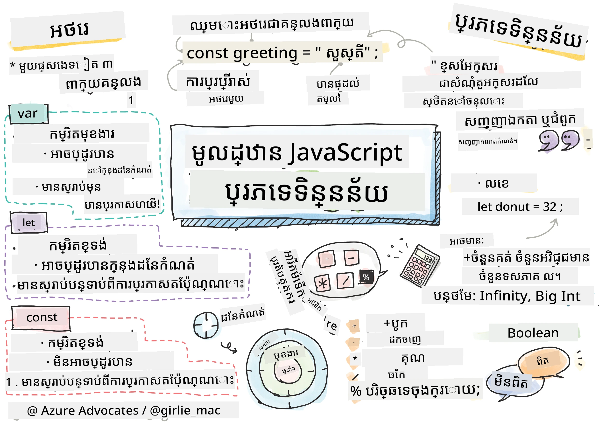
> សំណុំសាច់រឿងដោយ [Tomomi Imura](https://twitter.com/girlie_mac)

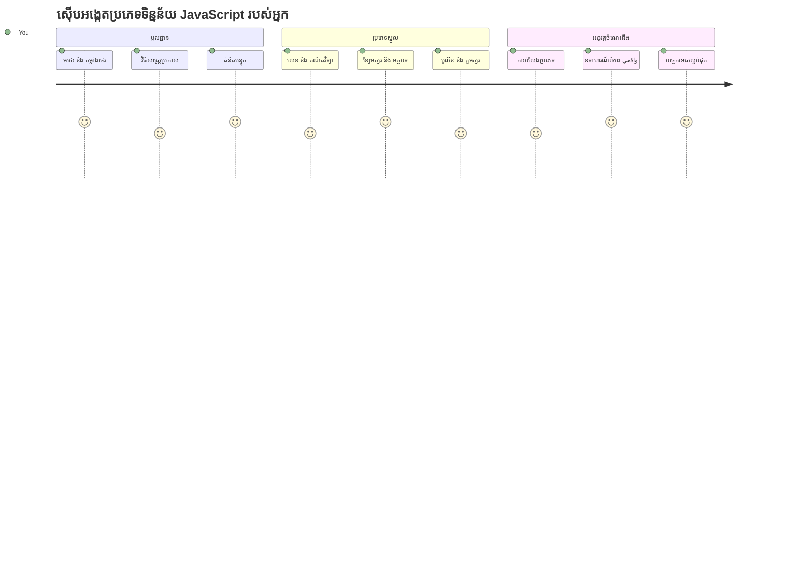
ប្រភេទទិន្នន័យគឺជាគំនិតមូលដ្ឋានមួយក្នុង JavaScript ដែលអ្នកនឹងប្រទៈមុខក្នុងកម្មវិធីរាល់គោលបំណងថត។ គិតប្រៀបប្រភេទទិន្នន័យដូចជា ប្រព័ន្ធរៀបចំបញ្ជីដែលបានប្រើដោយអ្នកថតបញ្ជីចាស់នៅ Alexandria ពួកគេមានកន្លែងជាក់លាក់សម្រាប់សៀវភៅដាក់诗歌 គណិតវិទ្យា និងកំណត់ហេតុប្រវត្តិសាស្ត្រ។ JavaScript រៀបចំព័ត៌មានជា ក្រុមខុសៗគ្នាដើម្បីទុកទិន្នន័យខុសៗគ្នា។

នៅមេរៀននេះ យើងនឹងស្វែងយល់អំពីប្រភេទទិន្នន័យស្នូលដែលធ្វើឱ្យ JavaScript ប្រតិបត្តិ។ អ្នកនឹងរៀនពីរបៀបដោះស្រាយលេខ អត្ថបទ តម្លៃ true/false និងយល់ថាហេតុអ្វីបានជាជ្រើសរើសប្រភេទត្រឹមត្រូវមានសារៈសំខាន់សម្រាប់កម្មវិធីរបស់អ្នក។ គំនិតទាំងនេះប្រហែលជាមើលទៅរាប់បញ្ចប់មិនមែននៅដំបូងទេ ប៉ុន្តែជាមួយការអនុវត្ត អ្នកនឹងអាចយល់ដឹងវាយ៉ាងទូលំទូលាយ។

ការយល់ដឹងពីប្រភេទទិន្នន័យនឹងធ្វើឱ្យអ្វីៗផ្សេងទៀតនៅក្នុង JavaScript លម្អិតបន្ថែម។ ដូចជាបុគ្គលស្ថាបត្យកម្មដែលត្រូវតែយល់ដឹងពីសារធាតុសំណង់ខុសៗគ្នាជាមុន មុនធ្វើការសាងសង់ព្រះវិហារ គោលការណ៍ទាំងនេះនឹងគាំទ្រអ្វីដែលអ្នកសង់នៅខាងមុខ។

## សំណួរជំនួញមុនមេរៀន
[សំណួរជំនួញមុនមេរៀន](https://ff-quizzes.netlify.app/web/)

មេរៀននេះគ្របដណ្តប់មូលដ្ឋាននៃ JavaScript ដែលជาทាសាដែលផ្តល់ឱ្យនូវអន្តរកម្មលើបណ្តាញ។

> អ្នកអាចយកមេរៀននេះនៅលើ [Microsoft Learn](https://docs.microsoft.com/learn/modules/web-development-101-variables/?WT.mc_id=academic-77807-sagibbon)!

[](https://youtube.com/watch?v=JNIXfGiDWM8 "Variables in JavaScript")

[](https://youtube.com/watch?v=AWfA95eLdq8 "Data Types in JavaScript")

> 🎥 ចុចរូបភាពខាងលើសម្រាប់វីដេអូអំពីអថេរ និងប្រភេទទិន្នន័យ

ចាប់ផ្តើមជាមួយអថេរ និងប្រភេទទិន្នន័យដែលជាកម្មវិធីផ្ទុកវា!

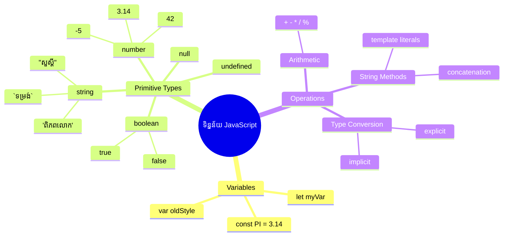
## អថេរ

អថេរជាថ្នាំសំណុំផ្នែកមូលដ្ឋានក្នុងកម្មវិធី។ ដូចជាធុងដែលមានស្លាបណ្ដោះអាសន្នដែលអាឡ្គែនមេដ្យាវែលបានប្រើដើម្បីរក្សាសារធាតុផ្សេងៗ អថេរអនុញ្ញាតឱ្យអ្នករក្សាព័ត៌មាន និងផ្តល់ឈ្មោះពណ៌នា ដូច្នេះអ្នកអាចយោងវិញបាននៅពេលក្រោយ។ ត្រូវការចងចាំអាយុរបស់នរណាម្នាក់? រក្សាវានៅក្នុងអថេរឈ្មោះ `age`។ ចង់តាមដានឈ្មោះអ្នកប្រើ? រក្សាវា​នៅក្នុង​អថេ​រ​ឈ្មោះ `userName`។

យើងនឹងផ្តោតលើវិធីសាស្ត្រជាម៉ូដម៉ែនក្នុងការបង្កើតអថេរ​នៅក្នុង JavaScript។ វិធីសាស្ត្រដែលអ្នកនឹងរៀននៅទីនេះតំណាងឲ្យការអភិវឌ្ឍភាសារយៈពេលជាច្រើនឆ្នាំ និងការអនុវត្តន៍ល្អបំផុតដែលក្រុមហ៊ុនកម្មវិធីបានបង្កើត។

ការបង្កើត និង **ប្រកាស** អថេរមានសមាសធាតុបែបរៀងៗខាងក្រោម **[keyword] [name]**។ វាត្រូវបានរៀបចំពីចំណុចពីរដែល៖

- **ពាក្យគន្លឹះ**។ ប្រើ `let` សម្រាប់អថេរដែលអាចប្ដូរ បើមិនដូច្នោះប្រើ `const` សម្រាប់តម្លៃដែលនៅដដែល។
- **ឈ្មោះអថេរ** ជាឈ្មោះពណ៌នាដែលអ្នកជ្រើសរើសអ្នកផ្ទាល់។

✅ ពាក្យគន្លឹះ `let` ត្រូវបានណែនាំក្នុង ES6 ហើយផ្តល់អថេររបស់អ្នកមកនូវ _block scope_ ដែលហៅថា។ វាត្រូវបានណែនាំឱ្យប្រើ `let` ឬ `const` ជំនួស `var` ដែលចាស់។ យើងនឹងពិភាក្សាអំពី block scopes ជាមួយភាពជ្រាលជ្រៅនៅផ្នែកក្រោយ។

### ការងារ - ប្រើប្រាស់អថេរ

1. **ប្រកាសអថេរ**។ ចាប់ផ្តើមដោយបង្កើតអថេរដំបូងរបស់យើង៖

    ```javascript
    let myVariable;
    ```

   **អ្វីដែលធ្វើបានដោយនេះ៖**
   - នេះបង្ហាញទៅ JavaScript ឱ្យបង្កើតទីតាំងផ្ទុកដែលហៅថា `myVariable`
   - JavaScript ផ្ដល់កន្លែងក្នុងអង្គចងចាំសម្រាប់អថេរនេះ
   - អថេរបច្ចុប្បន្នមិនមានតម្លៃណាមួយទេ (undefined)

2. **ផ្តល់តម្លៃវា**។ ឥឡូវLet's put something in our variable:

    ```javascript
    myVariable = 123;
    ```

   **របៀបផ្តល់តម្លៃ៖**
   - អ្នកប្តូរតម្លៃ 123 ដោយប្រើអុីផារ `=` ទៅអថេររបស់យើង
   - អថេរឥឡូវកាន់តម្លៃនេះប្ដូរពី undefined
   - អ្នកអាចយោងតម្លៃនេះជាមធ្យោបាយ `myVariable` នៅក្នុងកូដរបស់អ្នក

   > ទំរង់ៈ ការប្រើ `=` នៅក្នុងមេរៀននេះមានន័យថាអ្នកប្រើ "អុីផារ​តំណាង", ដែលសម្រាប់កំណត់តម្លៃទៅអថេរ។ វាមិនមែនជាសមាមាត្រ​ទេ។

3. **ធ្វើវាតាមវិធីឆ្លាត**។ ពិតប្រាកដយើងចែករួមពីរបៀបនោះជា​មួយគ្នា៖

    ```javascript
    let myVariable = 123;
    ```

    **វិធីនេះមានប្រសិទ្ធភាពច្រើន៖**
    - អ្នកប្រកាសអថេរហើយផ្តល់តម្លៃនៅក្នុងការបញ្ជាក់មួយ
    - វាជាវិធីសាស្ត្រមានស្តង់ដារចំពោះអ្នកអភិវឌ្ឍការ
    - វាធ្វើឲ្យកូដកាត់បន្ថយប្រវែង ប៉ុន្តែលុបបំបាត់ភាពច្របូកច្របល់

4. **ផ្លាស់ប្តូរយោបល់**។ តើត្រូវធ្វើដូចម្តេចបើចង់រក្សាទុកលេខផ្សេងទៀត?

   ```javascript
   myVariable = 321;
   ```

   **យល់ពីការផ្លាស់ប្តូរតម្លៃ מחדש៖**
   - អថេរឥឡូវកាន់តម្លៃ 321 ជំនួស 123
   - តម្លៃមុនបានជំនួស – អថេររក្សាតម្លៃតែមួយក្នុងមួយពេល
   - ភាពអាចប្ដូរនេះគឺជា លក្ខណៈសំខាន់នៃអថេរដែលត្រូវបានប្រកាសជាមួយ `let`

   ✅ ព្យាយាមវា! អ្នកអាចសរសេរ JavaScript ត្រង់លើកម្មវិធីរុករករបស់អ្នក។ បើកបណ្តាញកម្មវិធីរុករក និងចូលទៅកាន់ប្រអប់ Developer Tools។ នៅក្នុងទំព័របញ្ជារ (console), អ្នកនឹងឃើញដំណោះស្រាយ; សរសេរ `let myVariable = 123`, ចុច Enter, បន្ទាប់មកសរសេរ `myVariable`។ តើមានអ្វីកើតឡើង? ចំណាំ អ្នកនឹងរៀនបន្ថែមអំពីគំនិតទាំងនេះនៅក្នុងមេរៀនបន្ទាប់ៗ។

### 🧠 **ត្រួតពិនិត្យជំនាញអថេរ៖ ការដឹងចិត្ត**

**មើលថាតើអ្នកមានអារម្មណ៍យ៉ាងណាអំពីអថេរ៖**
- តើអាចពន្យល់ភាពខុសគ្នារវាងប្រកាស និងផ្តល់តម្លៃអថេរបានទេ?
- តើមានអ្វីកើតឡើង ប្រសិនបើអ្នកព្យាយាមប្រើអថេរមុនពេលប្រកាសវា?
- តើហេតុអ្វីអ្នកគួរជ្រើស `let` ជំនួស `const` សម្រាប់អថេរ?

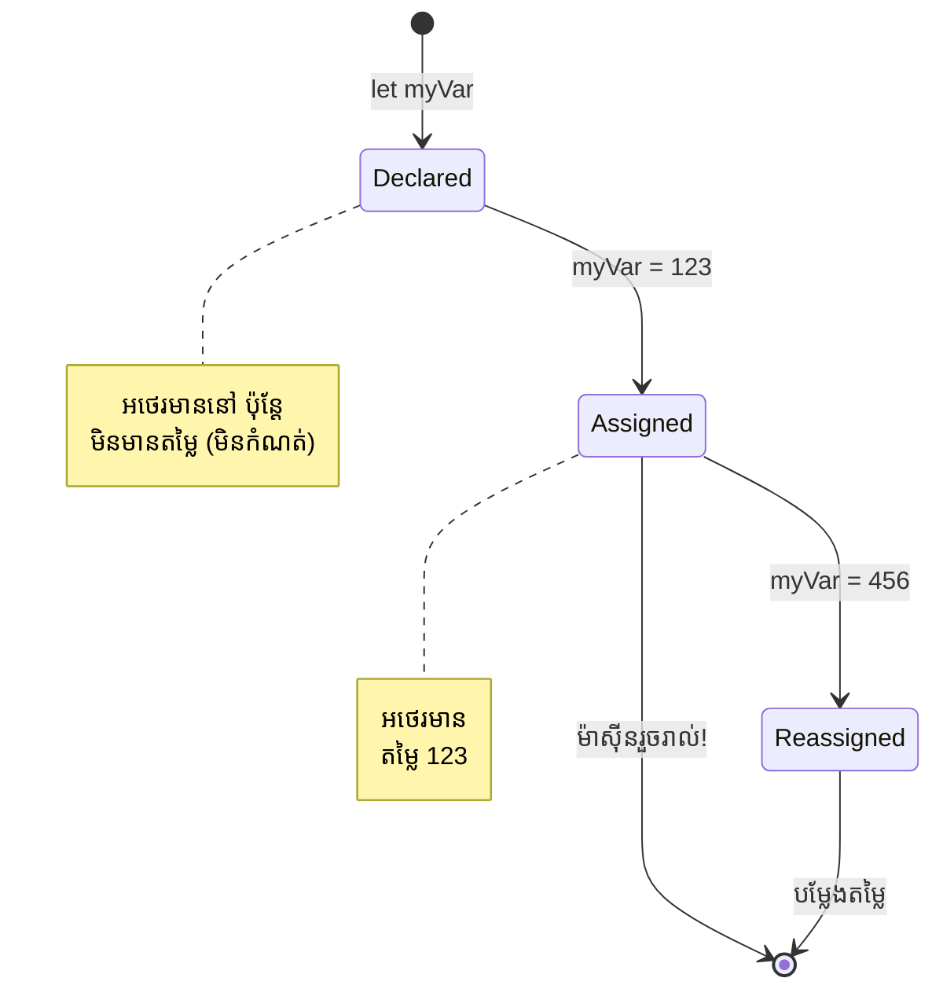
> **ក្បាលឆាប់**: គិតអំពីអថេរជាអង្កប់ផ្ទុកដែលមានស្លាក។ អ្នកបង្កើតអង្កប់ (`let`), ដាក់អ្វីមួយក្នុងវា (`=`), ហើយអាចប្ដូរដាច់ខ្លួននៅពេលក្រោយប្រសិនបើចាំបាច់។

## អថេរតម្លៃថេរ

ពេលខ្លះអ្នកត្រូវការរក្សារទិន្នន័យមួយដែលមិនគួរប្ដូរនៅពេលកម្មវិធីដំណើរការ។ គិតអថេរតម្លៃថេរដូចជាគោលការណ៍គណិតវិទ្យាដែល Euclid បានបង្កើតនៅក្រិចបុរាណ – បន្ទាប់ពីស្ថិតនៅកន្លែង និងបានចងក្រងហើយ វានៅមិនផ្លាស់ប្ដូរឡើយសម្រាប់ការយោងបន្ដបន្ទាប់។

អថេរតម្លៃថេរធ្វើការដូចអថេរ ប៉ុន្តែមានកំណត់ជាក់លាក់៖ បន្ទាប់ពីអ្នកផ្តល់តម្លៃរបស់ពួកគេ វាមិនអាចផ្លាស់ប្ដូរបានទេ។ ភាពមិនអាចផ្លាស់ប្ដូរនេះជួយកាត់បន្ថយករណីកំហុសដោយចៃដន្យចំពោះតម្លៃសំខាន់ៗក្នុងកម្មវិធីរបស់អ្នក។

ការប្រើប្រាស់ និងការបរិច្ឆេទអថេរតម្លៃថេរតាមគំនិតដូចគ្នានឹងអថេរ ដោយផ្តល់តែពាក្យគន្លឹះ `const`។ បើធម្មតាជាអថេរតម្លៃថេរត្រូវបានប្រកាសជាមួយអក្សរធំទាំងអស់។

```javascript
const MY_VARIABLE = 123;
```

**នេះជាអ្វីដែលកូដនេះធ្វើ៖**
- **បង្កើត** អថេរថេរឈ្មោះ `MY_VARIABLE` មានតម្លៃ 123
- **ប្រើ** សំពាធការនៃឈ្មោះអថេរថេរដោយអក្សរធំ
- **ចៀសវិញ** ការផ្លាស់ប្ដូរពេលក្រោយនៃតម្លៃនេះ

អថេរតម្លៃថេរមានច្បាប់សំខាន់ពីរដែល៖

- **អ្នកត្រូវផ្តល់តម្លៃឱ្យវា​ដើម្បី​ទៅមុខ** – មិនអនុញ្ញាតឱ្យមានអថេរថេរថ្មានតម្លៃទេ!
- **អ្នកមិនអាចផ្លាស់ប្ដូរតម្លៃនោះបានទេ** – JavaScript នឹងបង្ហាញកំហុស ប្រសិនបើអ្នកព្យាយាម។ មកមើលថាអ្វីកើតឡើង៖

   **តម្លៃសាមញ្ញ** - ខាងក្រោមនេះមិនអនុញ្ញាត៖
   
      ```javascript
      const PI = 3;
      PI = 4; // មិនអនុញ្ញាត
      ```

   **អ្វីដែលអ្នកត្រូវចងចាំ៖**
   - **ព្យាយាម** នៅក្នុងការប្ដូរតម្លៃថេរនឹងបង្កើតកំហុស
   - **ការពារ** តម្លៃសំខាន់ៗពីការផ្លាស់ប្ដូរចៃដន្យ
   - **ធានា** ថាតម្លៃនៅតែប្រែប្រួលទៅតាមកម្មវិធីរបស់អ្នក

   **ការយោងអត្ថៈត្រូវបានការពារ** - ខាងក្រោមមិនអនុញ្ញាត៖
   
      ```javascript
      const obj = { a: 3 };
      obj = { b: 5 } // មិនអនុញ្ញាត
      ```

   **យល់អំពីគំនិតទាំងនេះ៖**
   - **ការពារ** ការជំនួសអ្វីមួយទាំងមូលជាមួយវត្ថុថ្មី
   - **ការពារ** ការយោងទៅវត្ថុដើម
   - **រក្សា** អត្តសញ្ញាណវត្ថុក្នុងអង្គចងចាំ

    **តម្លៃវត្ថុមិនត្រូវបានការពារ** - ខាងក្រោមនេះអនុញ្ញាត៖
    
      ```javascript
      const obj = { a: 3 };
      obj.a = 5;  // អនុញ្ញាត
      ```

      **បំបែកអ្វីដែលកើតឡើង៖**
      - **កែប្រែ** តម្លៃគុណលក្ខណៈនៅក្នុងវត្ថុ
      - **រក្សា** ការយោងវត្ថុដដែល
      - **បង្ហាញ** ថាតម្លៃក្នុងវត្ថុខុសប្លែកក្នុងខណៈដែលការយោងនៅតែថេរ

   > ចំណាំ `const` មានន័យថាការយោងត្រូវបានការពារ ពីការលៃតម្រូវឡើងវិញ។ តែតម្លៃខ្លួនវាមិនមែន _មិនអាចប្ដូរបាន_ ទេ ហើយមានឱកាសប្ដូរ បាន ជាពិសេសបើវាជារចនាសម្ព័នស្មុគស្មាញដូចជា វត្ថុ។

## ប្រភេទទិន្នន័យ

JavaScript រៀបចំព័ត៌មានជាក្រុមប្រភេទឈ្មោះថាប្រភេទទិន្នន័យ។ គំនិតនេះស្រដៀងនឹងវិធីសាស្ត្រដែលអ្នកប្រើប្រាស់ចំណេះដឹងនៅក្នុងអស្ចារ្យកាលពីបុរាណ – អារីស្តូទែលបានបែងចែកចំណេះដឹងចេញជាប្រភេទនានា ដើម្បីយល់ថាគោលការណ៍តុល្យភាពមិនអាចប្រើបានស្មើគ្នានឹងកាលៈទេសៈជាកវីត្យា គណិតវិទ្យា និងទស្សនវិជ្ជាបរិស្ថាន។

ប្រភេទទិន្នន័យមានសារៈសំខាន់ដោយសារតែប្រតិបត្តិការផ្សេងៗត្រូវការប្រភេទព័ត៌មានខុសៗគ្នា។ ដូចជាអ្នកមិនអាចធ្វើកំណត់លេខលើឈ្មោះរបស់មនុស្ស ឬចាក់សរសេរតាមលំដាប់អក្សរនៃសមីការគណិតវិទ្យា ទេ JavaScript រួមបញ្ចូលគ្នានូវប្រភេទទិន្នន័យត្រឹមត្រូវសម្រាប់ប្រតិបត្តិការ។ ការយល់ដឹងនេះធានាថាគ្មានកំហុស និងធ្វើឱ្យកូដរបស់អ្នកមានភាពទុកចិត្តបាន។

អថេរអាចរក្សាប្រភេទតម្លៃខុសៗគ្នាច្រើន ដូចជាលេខ និងអត្ថបទ។ ប្រភេទតម្លៃទាំងនោះត្រូវបានគេស្គាល់ថា **ប្រភេទទិន្នន័យ**។ ប្រភេទទិន្នន័យជាផ្នែកសំខាន់នៃការអភិវឌ្ឍន៍កម្មវិធី ព្រោះវាជួយអ្នកអភិវឌ្ឍកំណត់របៀបសរសេរកូដ និងរបៀបកម្មវិធីរត់។ លើសពីនេះ ប្រភេទទិន្នន័យខ្លះមានលក្ខណៈពិសេសដើម្បីជួយបម្លែង ឬស្រាវជ្រាវបន្ថែមលើតម្លៃ។

✅ ប្រភេទទិន្នន័យគេស្គាល់ថាជា JavaScript data primitives ព្រោះវាជាប្រភេទទិន្នន័យទាបបំផុតដែលភាសានេះផ្តល់។ មានប្រភេទ data primitives ចំនួន 7៖ string, number, bigint, boolean, undefined, null និង symbol។ ចំណាយពេលយ៉ាងតិចមួយនាទីក្នុងការស្វែងយល់ថា​ណា​ជា​អ្វីនៃ primitive ទាំងនេះ។ តើ `zebra` មានន័យដូចម្តេច? តើ `0` ដូចម្តេច? តើ `true` វានៅដូចម្តេច?

### លេខ

លេខជាប្រភេទទិន្នន័យមួយងាយបំផុតនៅក្នុង JavaScript។ មិនថាអ្នកកំពុងកាន់តែនៅតែលេខគត់ដូចជា 42, លេខទសភាគដូចជា 3.14 ឬលេខអវិជ្ជមានដូចជា -5, JavaScript គ្រប់គ្រងវាជាមួយគ្នា។

ចងចាំអថេររបស់យើងពីមុនទេ? លេខ 123 ដែលយើងបានរក្សាទុកគឺជាប្រភេទទិន្នន័យលេខ:

```javascript
let myVariable = 123;
```

**លក្ខណៈសំខាន់៖**
- JavaScript ដឹងស្រាប់ពីតម្លៃជាលេខ
- អ្នកអាចធ្វើប្រតិបត្តិការគណិតលើអថេរទាំងនេះ
- មិនត្រូវប្រកាសប្រភេទយ៉ាងច្បាស់ជារឿយៗ

អថេរអាចរក្សាប្រភេទលេខទាំងឡាយ រួមបញ្ចូលទាំងលេខទសភាគ និងលេខអវិជ្ជមាន។ លេខអាចប្រើជាមួយត្រៀមគណិតបាន នៅក្នុងផ្នែក [operator គណិតវិទ្យា](#អុីផារ​គណិតវិទ្យា)។

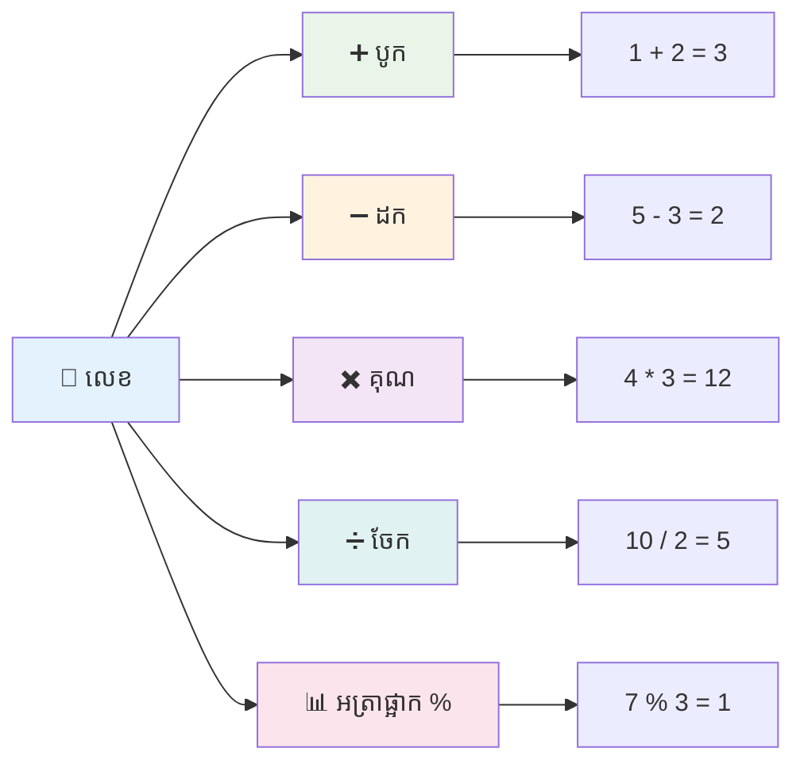
### អុីផារ​គណិតវិទ្យា

អុីផារ​គណិតវិទ្យាអនុញ្ញាតឲ្យអ្នកធ្វើគណនា​គណិតវិទ្យានៅក្នុង JavaScript។ អុីផារនេះព្រមទាំងគោលការណ៍ដូចជារូបសញ្ញាដែលបានប្រើប្រាស់ជាយូរមកហើយ ដូចជា Al-Khwarizmi ដែលបានបង្កើតសម្គាល់ជីវិតមាត្រដ្ឋាន។

អុីផារធ្វើការដូចអ្នករំពឹងពីគណិតវិទ្យាបែបបុរាណ៖ បូកសម្រាប់បូក, ដកសម្រាប់ដក និងដូច្នោះ។

មានប្រភេទអុីផារមួយចំនួនដើម្បីប្រើការប្រតិបត្តិការ គ្រោងក្នុងតារាងខាងក្រោម៖

| សញ្ញា  | ការពិពណ៌នា                                                         | ឧទាហរណ៍                            |
| ------ | ------------------------------------------------------------------ | ----------------------------------- |
| `+`    | **បូក**៖ គណនាចំនួនបូកពីរពី                                | `1 + 2 //ចម្លើយដែលរំពឹងទុកគឺ 3`  |
| `-`    | **ដក**៖ គណនាចំនួនដកពីរពី                                 | `1 - 2 //ចម្លើយដែលរំពឹងទុកគឺ -1` |
| `*`    | **គុណ**៖ គណនាចំនួនគុណពីរពី                              | `1 * 2 //ចម្លើយដែលរំពឹងទុកគឺ 2`  |
| `/`    | **ចែក**៖ គណនាចំនួនចែកពីរពី                               | `1 / 2 //ចម្លើយដែលរំពឹងទុកគឺ 0.5`|
| `%`    | **បំណុល**៖ គណនាបំណុលពីការចែកពីរពី                        | `1 % 2 //ចម្លើយដែលរំពឹងទុកគឺ 1`  |

✅ ព្យាយាមមើល! សាកល្បងប្រតិបត្តិកាអុីផារគណិតវិទ្យា នៅទំព័របញ្ជាររបស់កម្មវិធីរុករករបស់អ្នក។ តើលទ្ធផលធ្វើឲ្យអ្នកភ្ញាក់ផ្អើលទេ?

### 🧮 **ត្រួតពិនិត្យជំនាញគណិតវិទ្យា៖ គណនាជាថ្មី**

**សាកល្បងភាពយល់ពីអុីផារគណិតវិទ្យារបស់អ្នក៖**
- តើខុសគ្នាអ្វីរវាង `/` (ចែក) និង `%` (បំណុល)?
- តើអ្នកអាចទាយថា `10 % 3` មានតម្លៃប៉ុន្មាន? (ការជួយ៖ វាមិនមែន 3.33...)
- ហេតុអ្វីបានជា អុីផារបំណុលមានប្រយោជន៍នៅក្នុងកម្មវិធី?

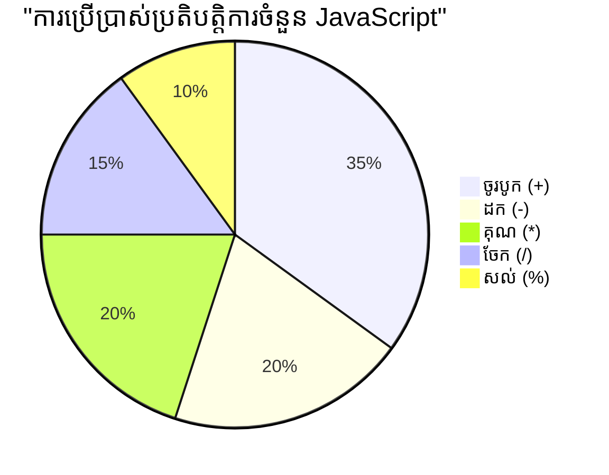
> **ពត៌មានជាក់ស្តែង**៖ អុីផារបំណុល (%) មានប្រយោជន៍ខ្លាំងសម្រាប់ពិនិត្យថាលេខជាអង្កុំគូ/ព្រីង បង្កើតចំណងជើង ឬជំហានតាមម៉ាស៊ីនអារេ!

### សរសេរ

នៅក្នុង JavaScript ទិន្នន័យអត្ថបទត្រូវបានបង្ហាញជាសរសេរ។ ពាក្យ "string" មកពីគំនិតអក្សរតោនបន្ទាត់គ្នា ដូចជាវិធីសាស្ត្រដែលអ្នកសរសេរបុរាណភាគច្រើនបានភ្ជាប់អក្សរច្រើនគ្នា ដើម្បីបង្កើតពាក្យ និងប្រយោគនៅក្នុងសៀវភៅពុម្ពអក្សររបស់ពួកគេ។

សរសេរជាគន្លងមួយសំខាន់សម្រាប់ការអភិវឌ្ឍបណ្តាញ។ រាល់អត្ថបទបង្ហាញនៅលើគេហទំព័រ – ឈ្មោះអ្នកប្រើប្រាស់, ស្លាកប៊ូតុង, សារកំហុស, មាតិកា – គឺត្រូវបានប្រើជាទិន្នន័យសរសេរ។ ការយល់ដឹងពី string គឺសំខាន់សម្រាប់បង្កើតផ្ទាំងប្រើប្រាស់។

សរសេរជាសំណុំតួអក្សរដែលស្ថិតនៅចន្លោះសញ្ញាដកស្រង់ម្ដងឬពីរដង។

```javascript
'This is a string'
"This is also a string"
let myString = 'This is a string value stored in a variable';
```

**យល់ពីគំនិតទាំងនេះ៖**
- **ប្រើ** ឬសម្រាប់សញ្ញាដកស្រង់ `'` ឬសញ្ញាដកស្រង់ពីរ `"` ដើម្បីកំណត់ string
- **រក្សា** ទិន្នន័យអត្ថបទដែលអាចមានអក្សរ លេខ និងនិមិត្តសញ្ញា
- **ផ្ដល់** តម្លៃ string ទៅអថេរដើម្បីប្រើនៅក្រោយ
- **ទាមទារ** អក្សាសញ្ញាដកស្រង់ ដើម្បីបន្សល់នូវអត្ថបទពីឈ្មោះអថេរ

ចងចាំប្រើអក្សាសញ្ញាដកស្រង់នៅពេលសរសេរសរសេរ មិនដូច្នោះ JavaScript នឹងគិតថាវាជាឈ្មោះអថេរ។

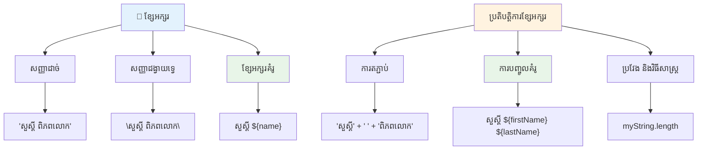
### ការតម្រៀបសរសេរ

ការគ្រប់គ្រង string អនុញ្ញាតឲ្យអ្នកភ្ជាប់ធាតុអត្ថបទផ្សេងៗ រួមបញ្ចូលអថេរ និងបង្កើតមាតិកាដោយឥតខ្ជិល ដែលឆ្លើយតបនឹងស្ថានភាពកម្មវិធី។ វិធីនេះអាចជួយអ្នកបង្កើតអត្ថបទដោយប្រើកម្មវិធី។

ពេលជាច្រើន អ្នកត្រូវភ្ជាប់ string ច្រើននៅជាមួយគ្នា – ការប្រតិបត្តិប្រភេទនេះហៅថា concatenation។

ដើម្បី **ភ្ជាប់** string ពីពីរឬច្រើន ឬភ្ជាប់វាជាមួយគ្នា ប្រើអុីផារ `+`។

```javascript
let myString1 = "Hello";
let myString2 = "World";

myString1 + myString2 + "!"; //សួស្ដី​ពិភពលោក!
myString1 + " " + myString2 + "!"; //សួស្ដី ពិភពលោក!
myString1 + ", " + myString2 + "!"; //សួស្ដី, ពិភពលោក!
```

**ជំហ៊ានដោយជំហ៊ាន អ្វីដែលកំពុងកើតឡើងមានដូចខាងក្រោម៖**
- **បញ្ចូល** ខ្សែអក្សរច្រើនជាមួយនឹងថេរ `+`
- **ភ្ជាប់** ខ្សែអក្សរដោយផ្ទាល់គ្នាដោយគ្មានចន្លោះនៅក្នុងឧទាហរណ៍ដំបូង
- **បន្ថែម** តួអក្សរចន្លោះ `" "` នៅចន្លោះខ្សែអក្សរដើម្បីធ្វើឱ្យអានងាយ
- **បញ្ចូល** អក្សរពិសេសដូចជា​សញ្ញាក្បៀស​(comma) ដើម្បីបង្កើតទ្រង់ទ្រាយត្រឹមត្រូវ

✅ មូលហេតុមិនល្មមថា `1 + 1 = 2` នៅក្នុង JavaScript មិនដូច `'1' + '1' = 11`? គិតពីវា។ តើម៉េចទៅ `'1' + 1`?

**អក្សរទម្លាប់** គឺជាវិធីផ្សេងសម្រាប់បង្កើតខ្សែអក្សរ លុះត្រាតែផ្ទេរកូដមិនប្រើសញ្ញាសម្ងាត់ទេ ត្រូវប្រើសញ្ញាគ្រាប់ត្រចៀក backtick ។ អ្វីក៏ដោយដែលមិនមែនជាអក្សរប្រកបការ ត្រូវតែដាក់ក្នុងកន្លែងចាក់បញ្ចូល `${ }` ។ វាផ្តល់នូវអថេរណាមួយដែលអាចជាខ្សែអក្សរបាន។

```javascript
let myString1 = "Hello";
let myString2 = "World";

`${myString1} ${myString2}!` //សួស្តី ពិភពលោក!
`${myString1}, ${myString2}!` //សួស្តី ពិភពលោក!
```

**ឱ្យយើងយល់ពីផ្នែកនីមួយៗ៖**
- **ប្រើ** សញ្ញាគ្រាប់ត្រចៀក `` ` `` ជំនួសសញ្ញាសម្ងាត់ធម្មតា ដើម្បីបង្កើតអក្សរទម្លាប់
- **បញ្ចូល** អថេរដោយផ្ទាល់ប្រើ `${}` រចនាសម្ព័ន្ធកន្លែងចាក់បញ្ចូល
- **រក្សា** ចន្លោះ និងទ្រង់ទ្រាយដូចដែលបានសរសេរតែម្តង
- **ផ្តល់** វិធីសាស្រ្តដ៏ស្អាតសម្រាប់បង្កើតខ្សែអក្សរលំបាកជាមួយអថេរបានយ៉ាងងាយស្រួល

អ្នកអាចសម្រេចបានគោលបំណងទ្រង់ទាយរបស់អ្នកជាមួយវិធីណាមួយក៏បាន ប៉ុន្តែអក្សរទម្លាប់នឹងគោរពចន្លោះ និងបំបែកបន្ទាត់។

✅ តើពេលណាអ្នកនឹងប្រើអក្សរទម្លាប់បើប្រៀបធៀបនឹងខ្សែអក្សរធម្មតា?

### 🔤 **ពិនិត្យជំនាញខ្សែអក្សរ៖ ភាពទំនុកចិត្តចំពោះការកែប្រែអត្ថបទ**

**វាយតម្លៃជំនាញខ្សែអក្សររបស់អ្នក៖**
- តើអ្នកអាចបញ្ជាក់ថាហេតុអ្វី `'1' + '1'` ធំស្មើ `'11'` មិនមែនជា `2`?
- វិធីសាស្រ្តខ្សែអក្សរណាមួយដែលអ្នកគិតថាអាចអានយ៉ាងស្រួល៖ ការភ្ជាប់ឬអក្សរទម្លាប់?
- តើពីរប់អ្វីកើតឡើង ប្រសិនបើអ្នកភ្លេចសញ្ញាសម្ងាត់នៅជុំវិញខ្សែអក្សរ?

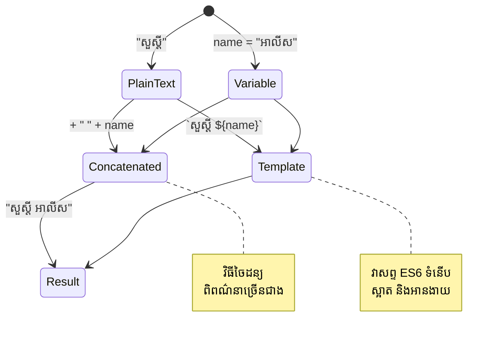
> **យោបល់ជំនួយ**៖ អក្សរទម្លាប់ត្រូវបានចាប់អារម្មណ៍ច្រើនសម្រាប់ការបង្កើតខ្សែអក្សរលំបាក ដោយពួកវាអាចអានបានស្រួល ហើយគ្រប់គ្រងខ្សែអក្សរជាបន្ទាត់ច្រើនបានយ៉ាងល្អណាស់!

### តម្លៃប៊ូល

តម្លៃប៊ូលតំណាងឱ្យទ្រង់ទ្រង់ទំហំធម្មតាសម្រាប់ទិន្នន័យ៖ វាអាចផ្ទុកតែតម្លៃពីរតែមួយគឺ `true` ឬ `false` ។ ប្រព័ន្ធតុល្យកម្មទ្រង់ទ្រាយនេះគឺស្រមៃមកពីកិច្ចការរបស់ George Boole អ្នកគណិតវិទ្យាឆ្នាំ 19 ដែលបានអភិវឌ្ឍលីហ្សធម្មតាប៊ូល។

ទោះបីវាងាយស្រួលក៏ដោយ តម្លៃប៊ូលគឺសំខាន់សម្រាប់តុល្យកម្មកម្មវិធី។ វាអាចឲ្យកូដរបស់អ្នកបង្កើតសេចក្តីសម្រេចដោយផ្អែកលើលក្ខខណ្ឌ - ឬរបៀបមិនថាអ្នកប្រើបានចូលប្រើ រឺប៊ូតុងត្រូវបានចុច ឬលក្ខណៈពិសេសណាមួយត្រូវបានបំពេញ។

តម្លៃប៊ូលអាចមានតែពីរតម្លៃគត់គឺ `true` ឬ `false` ។ វាអាចជួយបង្កើតសេចក្តីសម្រេចថាត្រង់បន្ទាត់ខ្សែអក្សរណាមួយគួរត្រូវបានបើកបរ័ណពេលលក្ខខណ្ឌជាក់លាក់បានបំពេញ។ នៅក្នុងករណីជាច្រើន, [operators](#អុីផារ​គណិតវិទ្យា) ជួយកំណត់តម្លៃប៊ូល ហើយអ្នកភាគច្រើននឹងបានទទួល និងសរសេរអថេរទាំងនេះគឺត្រូវបានចាប់ផ្តើម ឬតម្លៃរបស់វាត្រូវបានបួនបញ្ចូលជាមួយ operator។

```javascript
let myTrueBool = true;
let myFalseBool = false;
```

**នៅលើនេះយើងបាន៖**
- **បង្កើត** អថេរមួយដែលផ្ទុកតម្លៃប៊ូល `true`
- **បង្ហាញ** របៀបផ្ទុកតម្លៃប៊ូល `false`
- **ប្រើ** ពាក្យគន្លឹះតូចត្រឹមត្រូវ `true` និង `false` (មិនមានសញ្ញាសម្ងាត់ទេ)
- **រៀបចំ** អថេរទាំងនេះសម្រាប់ប្រើក្នុងពាក្យបញ្ជារជាលក្ខខណ្ឌ

✅ អថេរមួយអាចត្រូវបានរាប់ចុះថា 'ម៉ោងត្រឹមត្រូវ' ប្រសិនបើវាបញ្ចេញតម្លៃប៊ូល `true` ។ គួរឲ្យចាប់អារម្មណ៍ នៅក្នុង JavaScript, [តម្លៃទាំងអស់គឺ ម៉ោងត្រឹមត្រូវ លើកលែងតែបានកំណត់ឲ្យជាតម្លៃមិនត្រឹមត្រូវ](https://developer.mozilla.org/docs/Glossary/Truthy) ។

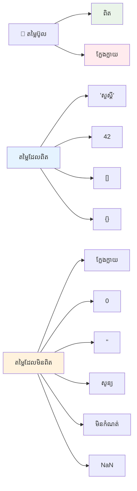
### 🎯 **ពិនិត្យតុល្យកម្មប៊ូល៖ ជំនាញក្នុងការសម្រេចចិត្ត**

**សាកល្បងការយល់ដឹងរបស់អ្នកអំពីប៊ូល៖**
- ហេតុអ្វីតើយើងគិតថា JavaScript មានតម្លៃ "ម៉ោងត្រឹមត្រូវ" និង "មិនត្រឹមត្រូវ" ពីលើតម្លៃ `true` និង `false` បាន?
- តើអ្នកអាចទាយថាតម្លៃណាមួយពីខាងក្រោមគឺមិនត្រឹមត្រូវ៖ `0`, `"0"`, `[]`, `"false"`?
- តម្លៃប៊ូលតើអាចមានប្រយោជន៍យ៉ាងដូចម្តេចក្នុងការគ្រប់គ្រងចរន្តកម្មវិធី?

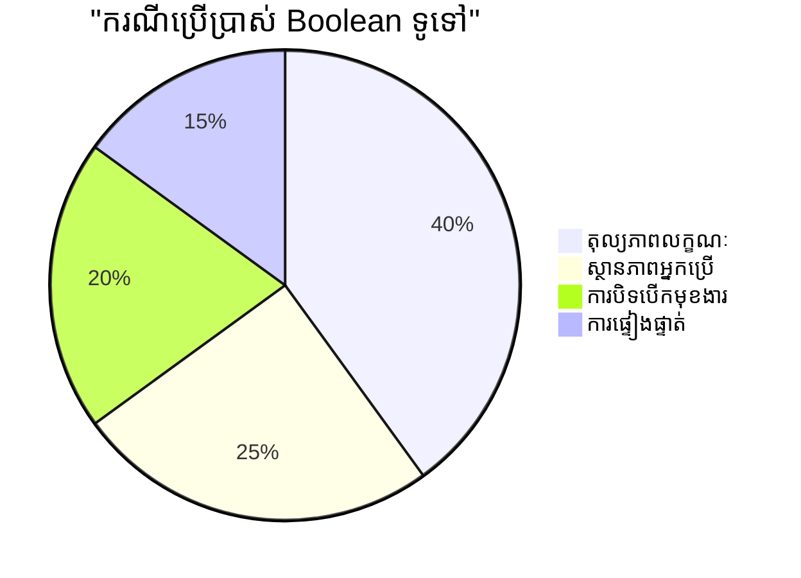
> **ចងចាំ**៖ នៅក្នុង JavaScript មានតម្លៃមិនត្រឹមត្រូវតែ 6 តែប៉ុណ្ណោះ៖ `false`, `0`, `""`, `null`, `undefined`, និង `NaN` ។ តម្លៃផ្សេងទៀតទាំងអស់គឺម៉ោងត្រឹមត្រូវ!

---

## 📊 **សង្ខេបឧបករណ៍ប្រើប្រាស់ប្រភេទទិន្នន័យរបស់អ្នក**

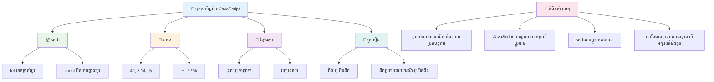
## ប្រយុទ្ធ GitHub Copilot Agent 🚀

ប្រើម៉ូដ Agent ដើម្បីបញ្ចប់បញ្ហាដូចខាងក្រោម៖

**ពិពណ៌នា៖** បង្កើតកម្មវិធីគ្រប់គ្រងព័ត៌មានផ្ទាល់ខ្លួនដែលបង្ហាញប្រភេទទិន្នន័យ JavaScript ទាំងអស់ដែលអ្នកបានរៀនក្នុងមេរៀននេះ ពេលដោះស្រាយស្ថានភាពទិន្នន័យពិតប្រាកដ។

**ចំណាំ៖** បង្កើតកម្មវិធី JavaScript ដែលបង្កើតវត្ថុប្រវត្តិរូបអ្នកប្រើមួយ រួមមាន៖ ឈ្មោះមនុស្ស (ខ្សែអក្សរ), អាយុ (លេខ), ស្ថានភាពជាសិស្ស (ប៊ូល), ពណ៌ដែលចូលចិត្តជាអារ៉េ, និងអាសយដ្ឋានជាវត្ថុមានផ្លូវ ទីក្រុង និងលេខសំបុត្រ។ រួមបញ្ចូលមុខងារសម្រាប់បង្ហាញព័ត៌មានប្រវត្តិរូប និងធ្វើបច្ចុប្បន្នភាពវាលឯកទេស ខណ:បង្ហាញពីការភ្ជាប់ខ្សែអក្សរ, អក្សរទម្លាប់, ប្រតិបត្ដិការសម្រឹមជាមួយអាយុ និងតុល្យកម្មប៊ូលសម្រាប់ស្ថានភាពជាសិស្ស។

សូមស្វែងយល់បន្ថែមអំពី [ម៉ូដ agent](https://code.visualstudio.com/blogs/2025/02/24/introducing-copilot-agent-mode) ទីនេះ។

## 🚀 ប្រយុទ្ធ

JavaScript មានអាកប្បកិរិយាខ្លះៗដែលអាចបណ្តាលឲ្យអ្នកអភិវឌ្ឍមានការភាន់ច្រឡំ។ នេះគឺជាឧទាហរណ៍បុរាណមួយសម្រាប់ស្វែងយល់៖ សាកល្បងវាយបញ្ចូលនៅក្នុងកុងសុលរុករករបស់អ្នក៖ `let age = 1; let Age = 2; age == Age` ហើយការពិនិត្យលទ្ធផល។ វាបង្ហាញ `false` – តើអាចកំណត់ហេតុអ្វីបាន?

នេះជាការបង្ហាញពីអាកប្បកិរិយាជាច្រើននៃ JavaScript ដែលគួរតែយល់ដឹង។ ការមានភាពស្គាល់ល្អនឹងចំណុចប្លែកៗទាំងនេះ បង្កើតឱ្យអ្នកសរសេរកូដបានទុកចិត្តចំពោះការអភិវឌ្ឍ និងងាយស្រួលដោះស្រាយបញ្ហា។

## សំណួរប្រឡងបន្ទាប់មេរៀន
[សំណួរប្រឡងបន្ទាប់មេរៀន](https://ff-quizzes.netlify.app)

## បរិច្ឆេទ និងរៀនផ្ទាល់ខ្លួន

មើលតារាង [អ្នកហាត់ប្រើប្រាស់ JavaScript នេះ](https://css-tricks.com/snippets/javascript/) ហើយសាកល្បងមួយ។ តើអ្នកបានរៀនអ្វីខ្លះ?

## មុខវិជ្ជា

[ហាត់ប្រើប្រាស់ប្រភេទទិន្នន័យ](assignment.md)

## 🚀 រយៈពេលអ្នកជំនាញប្រភេទទិន្នន័យ JavaScript របស់អ្នក

### ⚡ **អ្វីដែលអ្នកអាចធ្វើបានក្នុង 5 នាទីបន្ទាប់**
- [ ] បើកកុងសុលរុករករបស់អ្នក និងបង្កើតអថេរចំនួន 3 ដែលមានប្រភេទទិន្នន័យខុសគ្នា
- [ ] សាកល្បងពិចារណាបញ្ហា៖ `let age = 1; let Age = 2; age == Age` ហើយស្វែងរកហេតុផលមកថាតើម៉ាកម្មវិធីបង្ហាញ false
- [ ] ហាត់ភ្ជាប់ខ្សែអក្សរជាមួយឈ្មោះ និងលេខដែលអ្នកចូលចិត្ត
- [ ] សាកល្បងអ្វីកើតឡើងពេលអ្នកបន្ថែមលេខទៅខ្សែអក្សរ

### 🎯 **អ្វីដែលអ្នកអាចសម្រេចបានក្នុងម៉ោងនេះ**
- [ ] បញ្ចប់សំណួរប្រឡងបន្ទាប់មេរៀន និងពិនិត្យមើលគំនិតពិបាកៗ
- [ ] បង្កើតម៉ាស៊ីនគណនាតូចមួយសម្រាប់បូក លុប គុណ និង bahagi លេខពីរ
- [ ] បង្កើតកម្មវិធីរៀបចំឈ្មោះសាមញ្ញដោយប្រើអក្សរទម្លាប់
- [ ] ស្វែងយល់ផ្សេងគ្នារវាងរបៀបប្រៀបធៀប `==` និង `===`
- [ ] ហាត់បម្លែងរវាងប្រភេទទិន្នន័យផ្សេងៗ

### 📅 **មូលដ្ឋាន JavaScript របស់អ្នករយៈពេលមួយសប្តាហ៍**
- [ ] បញ្ចប់មុខវិជ្ជាលើកត្រូវភាពទំនុកចិត្ត និងភាពច្នៃប្រឌិត
- [ ] បង្កើតវត្ថុប្រវត្តិរូបផ្ទាល់ខ្លួនប្រើប្រភេទទិន្នន័យទាំងអស់បានរៀន
- [ ] ហាត់ប្រាណជាមួយ [ហាត់JavaScript ពី CSS-Tricks](https://css-tricks.com/snippets/javascript/)
- [ ] បង្កើតកម្មវិធីត្រួតពិនិត្យទម្រង់សាមញ្ញប្រើតុល្យកម្មប៊ូល
- [ ] សាកល្បងប្រភេទទិន្នន័យអារ៉េ និងវត្ថុនានា (ជាpreviewមេរៀននៅថ្ងៃក្រោយ)
- [ ] ចូលរួមសហគមន៍ JavaScript ហើយសួរពីប្រភេទទិន្នន័យ

### 🌟 **ការ​ធ្វើបំលែងរយៈពេលមួយខែ​របស់អ្នក**
- [ ] សមាសធាតុចំណេះដឹងប្រភេទទិន្នន័យទៅក្នុងគម្រោងកម្មវិធីធំនានា
- [ ] យល់ដឹងពេលណា និងហេតុអ្វីត្រូវប្រើប្រភេទទិន្នន័យនិមួយៗក្នុងកម្មវិធីពិតប្រាកដ
- [ ] ជួយអ្នកចាប់ផ្ដើមអ្នកដទៃយល់ដឹងអំពីមូលដ្ឋាន JavaScript
- [ ] បង្កើតកម្មវិធីតូចមួយដែលគ្រប់គ្រងទិន្នន័យប្រភេទនានារបស់អ្នកប្រើ
- [ ] ស្វែងយល់អំពីមូលដ្ឋានប្រភេទទិន្នន័យកម្រិតខ្ពស់ដូចជា coercion ប្រភេទ និង equality ច្បាស់លាស់
- [ ] ឧបត្ថម្ភគម្រោង JavaScript ប្រភពបើកដោយការកែលម្អឯកសារ

### 🧠 **ការត្រួតពិនិត្យជំនាញប្រភេទទិន្នន័យជាការបញ្ចប់**

**អបអរសាទរសាលាកម្មវិធី JavaScript របស់អ្នក៖**
- ប្រភេទទិន្នន័យណាដែលធ្វើឲ្យអ្នកភ្ញាក់ផ្អើលបំផុតតាមអាកប្បកិរិយារបស់វា?
- តើអ្នកមានភាពសុខមាលអ្វីខ្លះក្នុងការពន្យល់អថេរនិងថេរ ដល់មិត្តម្នាក់?
- អ្វីជាផ្នែកគួរអោយចាប់អារម្មណ៍បំផុតដែលអ្នកបានរកឃើញអំពីប្រភេទទិន្នន័យ JavaScript?
- តើកម្មវិធីជាក់លាក់ណាដែលអ្នកអាចគូរតាមដានជាមួយមូលដ្ឋានទាំងនេះ?

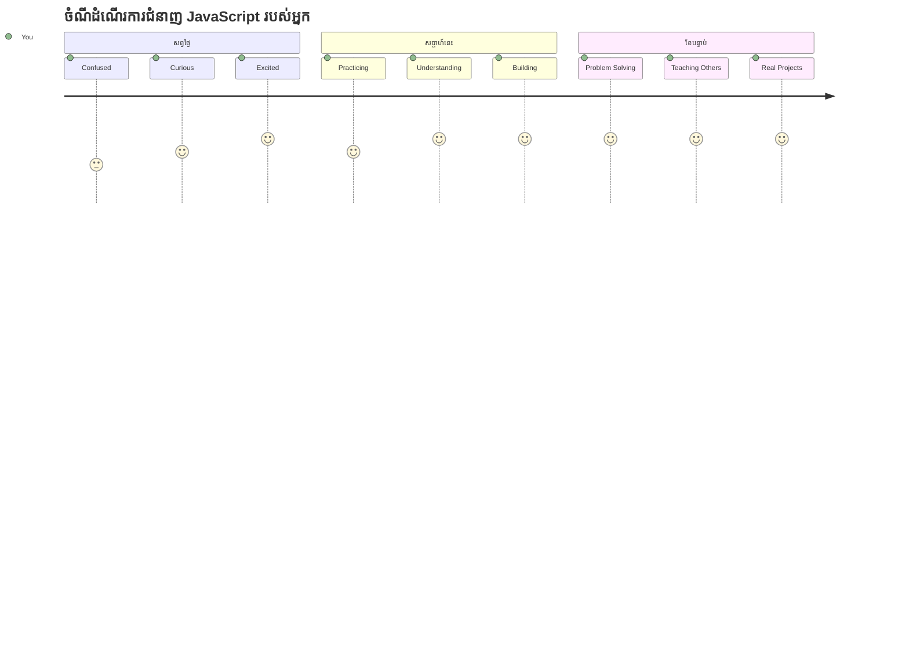
> 💡 **អ្នកបានសង់មូលដ្ឋានរួច!** ការយល់ដឹងអំពីប្រភេទទិន្នន័យគ្មានខុសគឺដូចជាការស្គាល់អក្សរ មុនពេលសរសេររឿង។ កម្មវិធី JavaScript គ្រប់មួយដែលអ្នកនឹងសរសេរនៅថ្ងៃក្រោយ នឹងប្រើមូលដ្ឋានគំនិតទាំងនេះ។ ឥឡូវអ្នកមានដុំអាគារសម្រាប់បង្កើតគេហទំព័រផ្ទាល់ខ្លួន កម្មវិធីរចនាផ្ទាល់ខ្លួន និងដោះស្រាយបញ្ហាពិតប្រាកដជាមួយកូដ។ សូមស្វាគមន៍មកកាន់ពិភព JavaScript ដ៏អស្ចារ្យ! 🎉

---

<!-- CO-OP TRANSLATOR DISCLAIMER START -->
**ការបដិសេធ**:  
ឯកសារនេះបានបកប្រែដោយប្រើសេវាកម្មបកប្រែ AI [Co-op Translator](https://github.com/Azure/co-op-translator)។ ខណៈពេលយើងខិតខំប្រឹងប្រែងសម្រាប់ភាពត្រឹមត្រូវ សូមជ្រាបថាការបកប្រែដោយស្វ័យប្រវត្តិអាចមានកំហុស ឬភាពមិនត្រឹមត្រូវ។ ឯកសារដើមក្នុងភាសាទំនើបរបស់វាគួរត្រូវបានគេកាន់ថាជាឧទ្ទម្ភមូលដ្ឋានដែលត្រឹមត្រូវ។ សម្រាប់ព័ត៌មានដែលមានសារៈសំខាន់ ការបកប្រែដោយមនុស្សជំនាញត្រូវបានផ្តល់អនុសាសន៍។ យើងមិនទទួលខុសត្រូវចំពោះការយល់ច្រឡំ ឬការយល់បំភ្លេចណាមួយដែលកើតមានពីការប្រើប្រាស់ការបកប្រែនេះឡើយ។
<!-- CO-OP TRANSLATOR DISCLAIMER END -->