# មូលដ្ឋាន JavaScript៖ វិធីសាស្រ្ត និង פונקציות

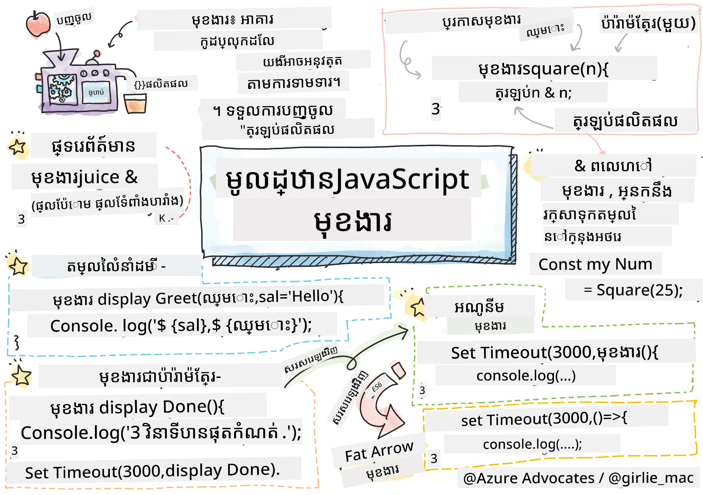
> សេចក្ដីសង្ខេបដោយ [Tomomi Imura](https://twitter.com/girlie_mac)

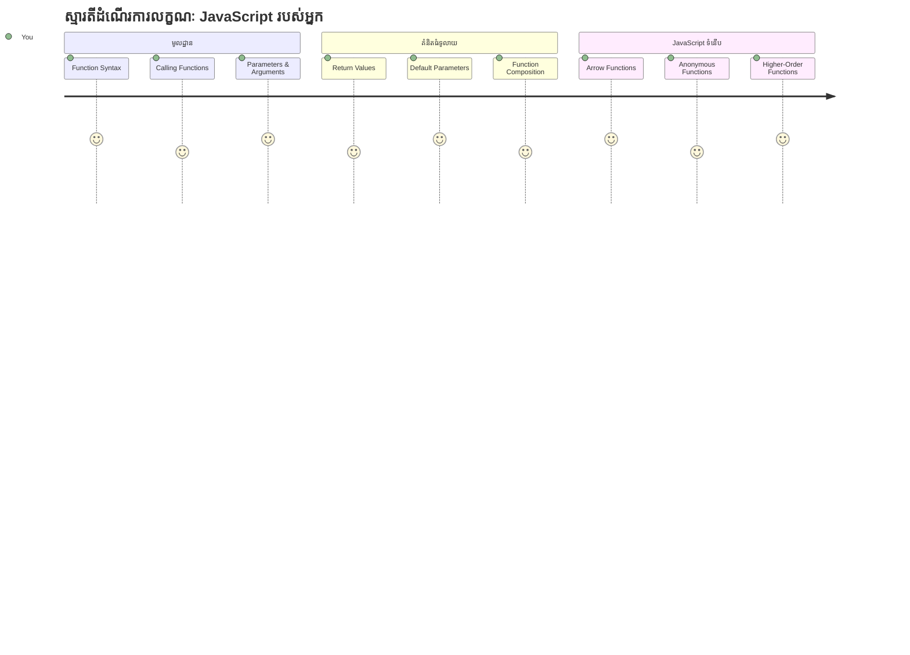
## សំណួរប្រឡងមុនវគ្គសិក្សា
[សំណួរប្រឡងមុនវគ្គសិក្សា](https://ff-quizzes.netlify.app)

ការសរសេរកូដដដែលៗជូនគ្នាជាច្រើនជាផ្នែកមួយនៃការសង្ស័យដែលកើតមានជានិច្ចក្នុងកម្មវិធីកម្មវិធី។ פונקציות ធ្វើអោយបញ្ហានេះជាស្រេចដោយអនុញ្ញាតឱ្យអ្នកកញ្ចប់កូដទៅជាដុំដែលអាចប្រើឡើងវិញ។ គិតពី פונקציותដូចជា ផ្នែកត្រៀមរួចដែលធ្វើឱ្យបន្ទាត់ប្រមូលផ្តុំរបស់ Henry Ford ក្លាយទៅជាគន្លងប្លែក – ពេលដែលអ្នកបង្កើតធាតុប្រតិបត្តិការដែលទុកចិត្តបាន អ្នកអាចប្រើវាក្នុងកន្លែងណាមួយដែលត្រូវការ ដោយមិនចាំបាច់សង់ឡើងវិញពីដើម។

פונקציות អនុញ្ញាតឱ្យអ្នកកញ្ចប់ផ្នែកនៃកូដ ដើម្បីអ្នកអាចប្រើឡើងវិញនៅក្នុងកម្មវិធីរបស់អ្នក។ ជំនួសការចម្លងនិងភ្ជាប់លក្ខណៈដូចគ្នាតាមគ្រប់កន្លែង អ្នកអាចបង្កើត פונקציה មួយដងហើយហៅវាតាមពេលត្រូវការ។ វិធីនេះរក្សាកូដរបស់អ្នកឲ្យមានភាពស្វាក់ស្វាញ និងធ្វើឲ្យការអាប់ដេតកូដកាន់តែងាយស្រួល។

នៅក្នុងមេរៀននេះ អ្នកនឹងរៀនពីរបៀបបង្កើត פונקציות រួមបញ្ចូលការផ្ញើព័ត៌មានទៅកាន់ពួកវា ហើយទទួលបានលទ្ធផលដែលមានប្រយោជន៍ត្រឡប់មកវិញ។ អ្នកនឹងរកឃើញភាពខុសគ្នារវាង פונקציות និងវិធីសាស្រ្ត។ អ្នកនឹងរៀនពីស្ទីលនៃសំណុំសន្ទស្សន៍ទំនើប និងមើលវិធីដែល פונקציות អាចធ្វើការជាមួយ פונקציותផ្សេងទៀត។ យើងនឹងបង្កើតគំនិតទាំងនេះជាជំហានៗ។

[](https://youtube.com/watch?v=XgKsD6Zwvlc "វិធីសាស្រ្ត និង פונקציות")

> 🎥 ចុចរូបភាពខាងលើសម្រាប់វីដេអូអំពីវិធីសាស្រ្ត និង פונקציות។

> អ្នកអាចយកមេរៀននេះនៅលើ [Microsoft Learn](https://docs.microsoft.com/learn/modules/web-development-101-functions/?WT.mc_id=academic-77807-sagibbon)!

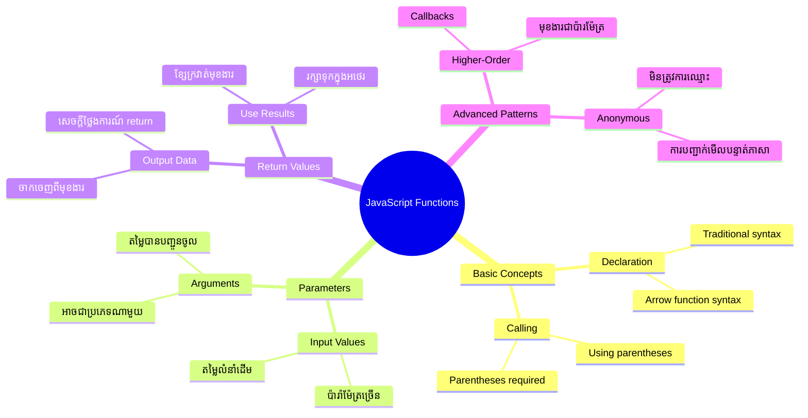
## פונקציות

פונקציה គឺជាដុំកូដដែលមានមុខងារផ្សេងៗដោយខ្លួនឯង។ វាអាចផ្លាស់ប្តូរលក្ខណៈដែលអ្នកអាចរត់កំណត់ពេលណាមួយបាន។

ជំនួសការសរសេរកូដដូចគ្នាជារយៈពេលជាច្រើន នៅក្នុងកម្មវិធីរបស់អ្នក អ្នកអាចកញ្ចប់វាទៅក្នុង פונקציה ហើយហៅ פונקציהនោះនៅពេលដែលអ្នកត្រូវការ វិធីនេះរក្សាកូដរបស់អ្នកឲ្យស្អាត និងធ្វើឲ្យការអាប់ដេតកូដកាន់តែងាយស្រួល។ គិតពីបញ្ហាការជួសជុល ប្រសិនបើអ្នកត្រូវប្ដូរឡូវយ៉ាងដែលត្រូវបាក់បែកនៅលើទីតាំងផ្សេងៗ ២០ កន្លែងក្នុងបណ្ណាល័យកូដរបស់អ្នក។

ការផ្ដល់ឈ្មោះមួយដ៏ច្បាស់លាស់ដល់ פונקציות របស់អ្នកគឺចាំបាច់ណាស់។ פונקציה ដែលមានឈ្មោះល្អនឹងធ្វើឱ្យអ្នកយល់ពីគោលបំណងរបស់វាប្រកបដោយច្បាស់លាស់ – ពេលដែលអ្នកឃើញ `cancelTimer()` អ្នកភ្លាមៗយល់ថាវាធ្វើអ្វី ដូចដើមដែលប៊ូតុងដែលមានស្លាកច្បាស់លាស់ប្រាប់អ្នកយ៉ាងច្បាស់ពីអ្វីដែលនឹងកើតឡើងពេលអ្នកចុចវា។

## ការបង្កើត និងហៅ פונקציה

មកមើលរបៀបបង្កើត פונקציה។ វាកាត់តាមលំនាំដូចគ្នា៖

```javascript
function nameOfFunction() { // ការកំណត់ហៅ​មុខងារ
 // ការកំណត់/រាងកាយមុខងារ
}
```

ចែកចាយរឿងនេះ៖
- ពាក្យគន្លឹះ `function` ប្រាប់ JavaScript ថា "សួស្ដី, ខ្ញុំកំពុងបង្កើត פונקציה!"
- `nameOfFunction` គឺជាទីតាំងដែលអ្នកផ្ដល់ឈ្មោះបរិយាយសម្រាប់ פונקציה របស់អ្នក
- បុគ្គលិក `()` ជាទីតាំងដែលអ្នកអាចបញ្ចូលប៉ារ៉ាម៉ែត្រ (យើងនឹងអស់ពេលចាប់ផ្ដើមលើនេះ)
- គូក `{}` មានកូដពិតប្រាកដដែលរត់ពេលដែលអ្នកហៅ פונקציה

មកបង្កើត פונקציהស្វាគមន៍សាមញ្ញមួយដើម្បីឲ្យមើលសកម្មភាពនេះ៖

```javascript
function displayGreeting() {
  console.log('Hello, world!');
}
```

פונקציהនេះបោះពុម្ព "Hello, world!" ទៅកាន់កុងសូល។ ពេលអ្នកបានកំណត់វា អ្នកអាចប្រើវាច្រើនដងតាមតម្រូវការ។

ដើម្បីអនុវត្ត (ឬ "ហៅ") פונקציה របស់អ្នក សរសេរឈ្មោះរបស់វាតាមបន្ទាប់ដោយបុគ្គលិក។ JavaScript អាចអនុញ្ញាតឱ្យអ្នកកំណត់ פונקציה មុន ឬក្រោយពេលហៅវា – ឧបករណ៍ JavaScript នឹងដោះស្រាយបញ្ហាលំដាប់អនុវត្តន៍។

```javascript
// កំពុងហៅមុខងាររបស់យើង
displayGreeting();
```

ពេលអ្នករត់បន្ទាត់នេះ វានឹងអនុវត្តកូដទាំងអស់នៅក្នុង פונקציה `displayGreeting` របស់អ្នក បង្ហាញ "Hello, world!" នៅក្នុងកុងសូលរបស់កម្មវិធីរុករករបស់អ្នក។ អ្នកអាចហៅ פונकציהនេះម្តងហើយម្តងទៀត។

### 🧠 **ត្រួតពិនិត្យមូលធន פונקציה៖ កែលម្អ פונקציהដំបូងរបស់អ្នក**

**ឲ្យយើងមើលថាតើអ្នកមានអារម្មណ៍យ៉ាងដូចម្តេចចំពោះ פונקציהមូលដ្ឋាន៖**
- អ្នកអាចពន្យល់ថាហេតុអ្វីយើងប្រើគូក `{}` នៅក្នុងការកំណត់ פונקציה?
- តើអ្វីកើតឡើងប្រសិនបើអ្នកសរសេរ `displayGreeting` ដោយគ្មានគូក?
- ហេតុអ្វីបានជា អ្នកចង់ហៅ פונקציהដដែលជាច្រើនដង?

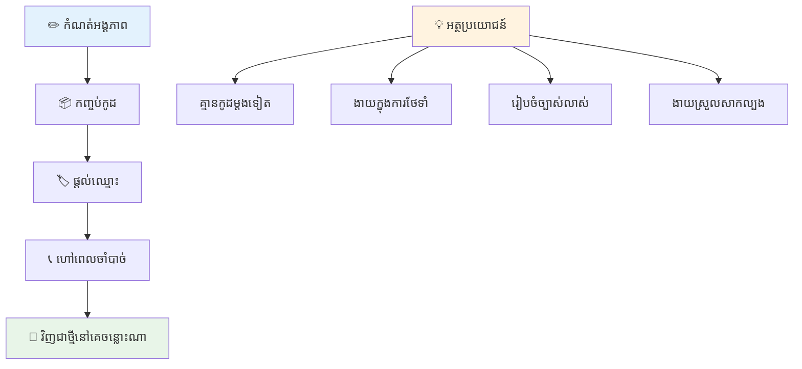
> **หมายเหตุ:** អ្នកបានប្រើ **វិធីសាស្រ្ត** នៅក្នុងមេរៀនទាំងនេះ។ `console.log()` គឺជាវិធីសាស្រ្ត – ជា פונקציהមួយសម្រាប់អង្គធាតុ `console`។ ភាពខុសគ្នាសំខាន់គឺ វិធីសាស្រ្តភ្ជាប់ទៅអង្គធាតុ ខណៈដែល פונקציות ឈរពេលខ្លួនឯង។ អ្នកអភិវឌ្ឍជាច្រើនប្រើពាក្យទាំងនេះបង្វិលក្នុងការជជែករឺអាការៈធម្មតា។

### នីតិវិធីល្អសម្រាប់ פונקציות

នេះជាគន្លឹះពីរបៀបជួយអ្នកសរសេរ פונקציותល្អ៖

- ផ្ដល់ឈ្មោះច្បាស់លាស់និងអធិប្បាយចំពោះ פונקציות – អ្នកនៅពេលអនាគតនឹងអរគុណអ្នក!
- ប្រើ **camelCasing** សម្រាប់ឈ្មោះពាក្យច្រើន (ដូចជា `calculateTotal` ជំនួស `calculate_total`)
- រក្សា פונקציה នីតិវិធីមួយផ្ដោតលើរឿងមួយឲ្យយ៉ាងល្អ

## ផ្ញើព័ត៌មានទៅ פונקציה

פונקציה `displayGreeting` របស់យើងមានកំណត់ – វាអាចបង្ហាញបានត្រឹមតែ "Hello, world!" សម្រាប់គ្រប់គ្នា។ ប៉ារ៉ាម៉ែត្រ អនុញ្ញាតិឱ្យយើងធ្វើឲ្យ פונקציות មានភាពបត់បែននិងមានប្រយោជន៍។

**ប៉ារ៉ាម៉ែត្រ** ដូចជាតំណាងកន្លែងដែលអ្នកអាចបញ្ចូលតម្លៃផ្សេងៗគ្នា រៀងរាល់ពេលដែលអ្នកប្រើ פונקציה។ ម៉្យាងវិញ, פונקציהដដែល អាចធ្វើការជាមួយព័ត៌មានផ្សេងៗគ្នា ក្នុងម្តងហៅម្តង។

អ្នករាយប៉ារ៉ាម៉ែត្រ ក្នុងបុគ្គលិកនៅពេលដែលអ្នកកំណត់ פונקציה របស់អ្នក ដោយបំបែកប៉ារ៉ាម៉ែត្រច្រើនជាក្បៀស:

```javascript
function name(param, param2, param3) {

}
```

ប៉ារ៉ាម៉ែត្រ​​​មួយៗដូចជាតំណាងកន្លែង – ពេលដែលនរណាម្នាក់ហៅ פונקציה របស់អ្នក ពួកគេនឹងផ្តល់តម្លៃពិតដែលដាក់ចូលក្រៅកន្លែងទាំងនេះ។

មកផ្លាស់ប្តូរប פונקציהស្វាគមន៍ របស់យើង ដោយទទួលឈ្មោះរបស់អ្នកណាម្នាក់៖

```javascript
function displayGreeting(name) {
  const message = `Hello, ${name}!`;
  console.log(message);
}
```

ហើយសូមសង្កេតថាយើងកំពុងប្រើ backticks (`` ` ``) និង `${}` ដើម្បីបញ្ចូលឈ្មោះចូលទៅក្នុងសារ ព្រមទាំងច្រើនគឺហៅថា template literal និងវាជាវិធីពិតជាសម្បូរបែបក្នុងការបង្កើតខ្សែអក្សរដោយមានអថេរចំរូងក្នុង។

ឥឡូវនេះ ពេលហៅ פונקציה អ្នកអាចផ្ញើឈ្មោះណាមួយ:

```javascript
displayGreeting('Christopher');
// បង្ហាញ "សួស្ដី Christopher!" ពេលរត់
```

JavaScript ទទួល string `'Christopher'` កំណត់ទៅប៉ារ៉ាម៉ែត្រ `name` ហើយបង្កើតសារផ្ទាល់ខ្លួនថា "Hello, Christopher!"

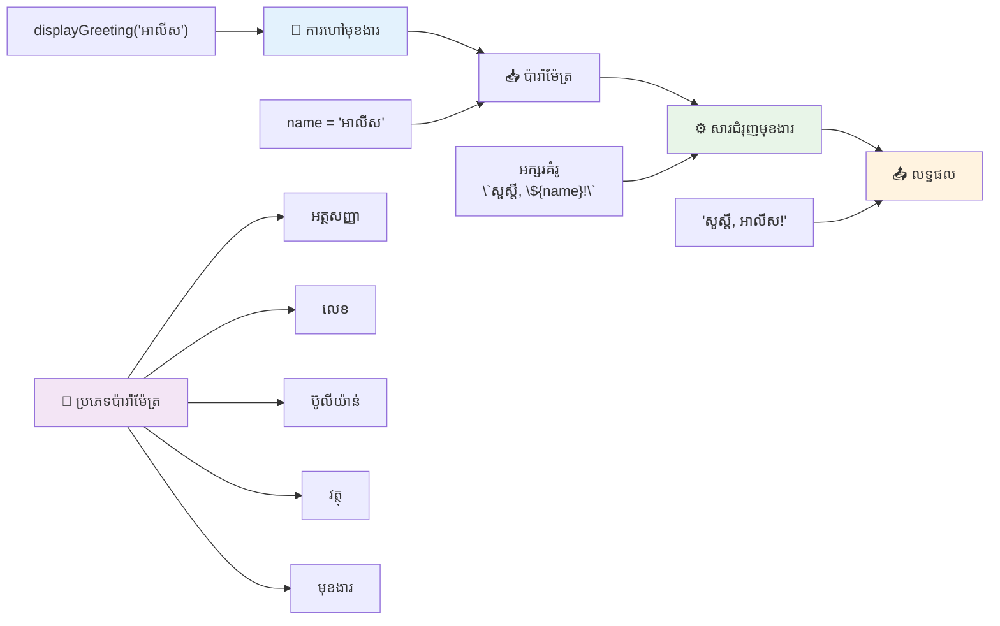
## តម្លៃផ្ទាល់ខ្លួនដើម

តើយើងចង់អោយប៉ារ៉ាម៉ែត្រមួយចំនួនជាជម្រើសផងដែរ? នោះគឺជាពេលតម្លៃផ្ទាល់ខ្លួនដើមចូលមកចលនា។

假设 យើងចង់អោយមនុស្សអាចប្តូរពាក្យស្វាគមន៍បាន ប៉ុន្តែប្រសិនបើពួកគេចង់មិនបញ្ជាក់យ៉ាងណា យើងនឹងប្រើអក្ខរកម្ម "Hello" ជាការទម្លាប់។ អ្នកអាចកំណត់តម្លៃផ្ទាល់ខ្លួនដើមដោយប្រើសញ្ញាស្មើ `=` ដូចជាការកំណត់អថេរ។

```javascript
function displayGreeting(name, salutation='Hello') {
  console.log(`${salutation}, ${name}`);
}
```

នៅទីនេះ `name` ត្រូវការចាំបាច់ ប៉ុន្តែ `salutation` មានតម្លៃផ្ទាល់ខ្លួនជា `'Hello'` ប្រសិនបើគ្មានអ្នកណាបញ្ជាក់សំណួរដទៃទៀត។

ឥឡូវ អ្នកអាចហៅ פונקציהនេះប្រើពីរបែបផ្សេងគ្នា៖

```javascript
displayGreeting('Christopher');
// បង្ហាញ "Hello, Christopher"

displayGreeting('Christopher', 'Hi');
// បង្ហាញ "Hi, Christopher"
```

ក្នុងការហៅដំបូង JavaScript ប្រើ "Hello" ជាលំនាំដើម ពីព្រោះយើងមិនបានបញ្ជាក់ពាក្យស្វាគមន៍ណាមួយទេ។ លើកទី២ វាប្រើ "Hi" ដែលយើងកំណត់ផ្ទាល់ខ្លួនវិញ។ ភាពបត់បែននេះធ្វើឲ្យ פונקציות មានភាពអាចបត់បែនទៅតាមស្ថានភាពផ្សេងៗ។

### 🎛️ **ត្រួតពិនិត្យជំនាញប៉ារ៉ាម៉ែត្រ៖ ធ្វើឲ្យ פונקציות មានភាពបត់បែន**

**សាកល្បងការយល់ដឹងរបស់អ្នកអំពីប៉ារ៉ាម៉ែត្រ៖**
- តើប៉ារ៉ាម៉ែត្រ និងអាគុយម៉ង់ខុសគ្នាដូចម្តេច?
- ហេតុអ្វីបានជា តម្លៃផ្ទាល់ខ្លួនដើមមានប្រយោជន៍ក្នុងកម្មវិធីពិតប្រាកដ?
- អ្នកអាចទស្សនាបានទេថាអ្វីកើតឡើង ប្រសិនបើអ្នកផ្ញើអាគុយម៉ង់ច្រើនជាងប៉ារ៉ាម៉ែត្រមួយ?

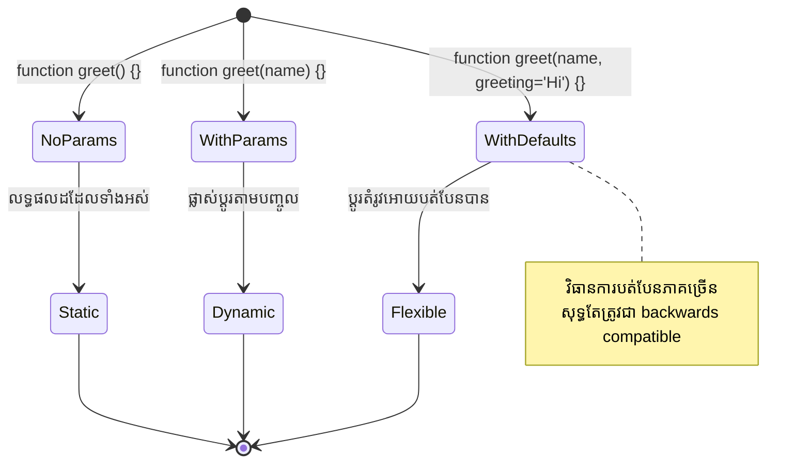
> **គន្លឹះល្អ**: ប៉ារ៉ាម៉ែត្រដើមធ្វើឲ្យ פונקציות របស់អ្នកងាយស្រួលក្នុងការប្រើប្រាស់។ អ្នកប្រើអាចចាប់ផ្តើមបានឆាប់រហ័សជាមួយតម្លៃលំនាំដើមដែលហានិភ័យបាន ប៉ុន្តែក៏អាចកែប្រែបានពេលត្រូវការ!

## តម្លៃត្រឡប់

פונקציות របស់យើងមកនេះបានគ្រាន់តែបោះពុម្ពសារ ទៅកាន់កុងសូល ប៉ុន្តែក៏បើអ្នកចង់បាន פונקציה មួយ គណនា អ្វីមួយ ហើយផ្ដល់លទ្ធផលត្រឡប់មកវិញ?

នេះជាកន្លែងដែល **តម្លៃត្រឡប់** ចូលមក។ ជំនួសការបង្ហាញអ្វីមួយ פונקציה អាចផ្ដល់តម្លៃមួយដែលអ្នកអាចរក្សាទុកក្នុងអថេរឬប្រើនៅផ្នែកផ្សេងក្នុងកូដរបស់អ្នក។

ដើម្បីផ្ញើតម្លៃត្រឡប់ អ្នកប្រើពាក្យគន្លឹះ `return` ដោយបន្ទាប់មកគឺតម្លៃដែលអ្នកចង់ត្រឡប់:

```javascript
return myVariable;
```

មានរឿងដ៏សំខាន់មួយ៖ ពេល פונקציה ឈ្លោះឃួបប្រយោល `return` វានឹងបញ្ឈប់រត់ភ្លាមៗ ហើយផ្ញើតម្លៃនោះទៅអ្នកហៅ។

មកកែប្រែ פונקציה ស្វាគមន៍ របស់យើងឲ្យត្រឡប់សារវិញ គឺមិនបោះពុម្ពវាឡើយ៖

```javascript
function createGreetingMessage(name) {
  const message = `Hello, ${name}`;
  return message;
}
```

ឥឡូវនេះ ផ្ទុយពីបោះពុម្ពសារ פונקציהនេះបង្កើតសារ ហើយផ្ញើវាទៅយើងវិញ។

ដើម្បីប្រើតម្លៃត្រឡប់ អ្នកអាចរក្សាទុកវាទៅក្នុងអថេរដូចជាតម្លៃមួយទៀត៖

```javascript
const greetingMessage = createGreetingMessage('Christopher');
```

ឥឡូវ `greetingMessage` មាន "Hello, Christopher" ហើយអ្នកអាចប្រើវាណាមួយក្នុងកូដរបស់អ្នក – ដើម្បីបង្ហាញវាលើគេហទំព័រ រួមបញ្ចូលវាទៅក្នុងអ៊ីមែល ឬផ្ញើវាទៅកាន់ פונקציהផ្សេងទៀត។

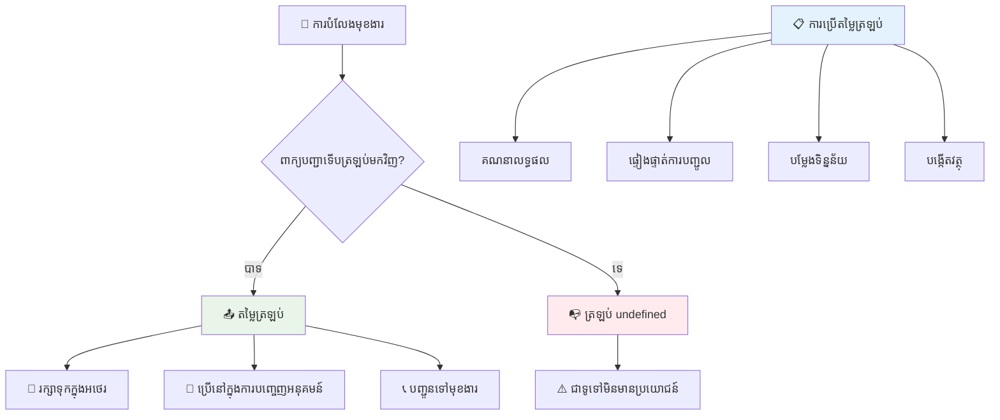
### 🔄 **ត្រួតពិនិត្យតម្លៃត្រឡប់៖ ទទួលលទ្ធផលវិញ**

**វាយតម្លៃការយល់ដឹងរបស់អ្នកអំពីតម្លៃត្រឡប់៖**
- តើកូដដែលនៅក្រោយពាក្យ `return` ចូលចិត្តកើតអ្វី?
- ហេតុអ្វីបានជា តម្លៃចេញល្អជាងគ្រាន់តែបោះពុម្ពទៅកាន់Console?
- פונקציה មួយអាចត្រឡប់តម្លៃប្រភេទផ្សេងៗ យ៉ាងដូចម្តេច (ខ្សែអក្សរ លេខ ប៊ុលលែន)?

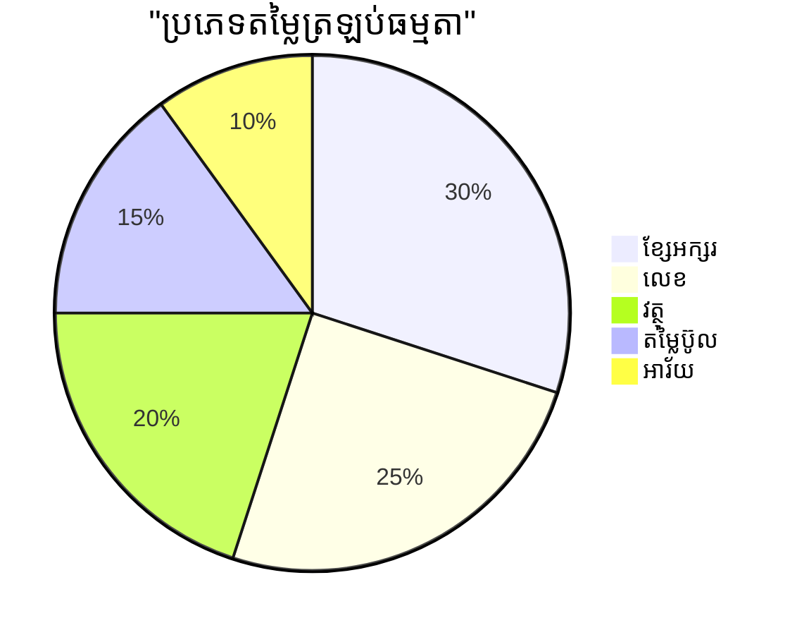
> **ចំណុចសំខាន់**: פונקציות ដែលត្រឡប់តម្លៃមានភាពបត់បែនពីព្រោះអ្នកហៅជ្រើសរើសអ្វីដែលចង់ធ្វើជាមួយលទ្ធផលនេះ។ វាធ្វើឱ្យកូដរបស់អ្នកមានភាពប្រសើរនិងអាចប្រើឡើងវិញបាន!

## פונקציות ឲ្យជា ប៉ារ៉ាម៉ែត្រសម្រាប់ פונקציותផ្សេងទៀត

פונקציות អាចផ្ញើទៅជា ប៉ារ៉ាម៉ែត្រសម្រាប់ פונקציותផ្សេងៗបាន។ ទស្សនៈនេះអាចលំបាកដំបូងប៉ុន្តែវាជាលក្ខណៈអនុញ្ញាតឱ្យមានលំនាំកម្មវិធីដែលបត់បែន។

លំនាំនេះគឺពេញនិយមច្រើនពេលដែលអ្នកចង់ប្រាប់ "ពេលមានអ្វីកើតឡើង សូមធ្វើរឿងនេះ។" ឧទាហរណ៍ "ពេលម៉ោងបញ្ចប់ ដំណើរការវា" ឬ "ពេលអ្នកប្រើចុចប៊ូតុង ហៅ פונקציהនេះ។"

មកមើល `setTimeout` ដែលជាហើយ פונקציה ដែលរងចាំរយៈពេលមួយ ហើយបន្ទាប់មករត់កូដមួយ។ យើងត្រូវប្រាប់វាអ្វីដែលត្រូវរត់ – គន្លងល្អសម្រាប់ផ្ញើ פונקציה!

សូមសាកល្បងកូដនេះ – បន្ទាប់ពី 3 វិនាទី អ្នកនឹងមើលឃើញសារ៖

```javascript
function displayDone() {
  console.log('3 seconds has elapsed');
}
// តម្លៃម៉ោងកំណត់គឺជាមីល្លីវិនាទី
setTimeout(displayDone, 3000);
```

សូមចំណាំថាយើងផ្ញើ `displayDone` (គ្មានបុគ្គលិក) ទៅ `setTimeout`។ យើងមិនហៅ פונקציהដោយផ្ទាល់ – យើងផ្ទេរវាទៅ `setTimeout` ហើយប្រាប់ថា "ហៅវាក្នុង 3 វិនាទី។"

### פונקציות អនុគ្រោះនាម

ពេលខ្លះ អ្នកត្រូវការ פונקציה សម្រាប់រឿងមួយតែម្ដង ហើយមិនចង់ផ្ដល់ឈ្មោះសម្រាប់វា។ សូមគិតថា – ប្រសិនបើអ្នកប្រើ פונקציהតែម្តងហើយ ហេតុអ្វីបានចំលើយកូដរបស់អ្នកជាមួយឈ្មោះបន្ថែម?

JavaScript អនុញ្ញាតឱ្យអ្នកបង្កើត **פונקציות អនុគ្រោះនាម** – פונקציותគ្មានឈ្មោះ ដែលអ្នកអាចកំណត់ត្រឹមស្រមោលកន្លែងដែលអ្នកចង់ប្រើវា។

នេះជារបៀបដែលយើងអាចកែប្រែឧទាហរណ៍ម៉ោងរបស់យើងដោយប្រើ פונקציה អនុគ្រោះនាម៖

```javascript
setTimeout(function() {
  console.log('3 seconds has elapsed');
}, 3000);
```

វានាំឲ្យទទួលបានលទ្ធផលដូចគ្នា ប៉ុន្តែ פונקציה ត្រូវបានកំណត់ដោយផ្ទាល់នៅក្នុង ការហៅ `setTimeout` ហើយមិនទាមទារការបញ្ជាក់ פונקציה ផ្សេងទៀតនោះទេ។

### פונקציות សម្រួលពាណិជ្ជកម្ម

JavaScript នាទីថ្មី មានវិធីសាមញ្ញមួយក្នុងការសរសេរ פונקציות ហៅថា **פונקציות សម្រួលពាណិជ្ជកម្ម**។ អ្នកប្រើ `=>` (ដែលមើលទៅដូចព្រួញ – យល់ទេ?) ហើយពេញនិយមជាមួយអ្នកអភិវឌ្ឍ។

פונקציות សម្រួលពាណិជ្ជកម្ម អាចអោយអ្នករំកិលពាក្យគន្លឹះ `function` ហើយសរសេរកូដអោយច្រើនសង្ខេប។

នេះជាឧទាហរណ៍ម៉ោងរបស់យើងប្រើ פונקציה សម្រួលពាណិជ្ជកម្ម៖

```javascript
setTimeout(() => {
  console.log('3 seconds has elapsed');
}, 3000);
```

`()` គឺជាទីតាំងដែលប៉ារ៉ាម៉ែត្រនឹងនៅ (ទទេក្នុងករណីនេះ) បន្ទាប់មកមានព្រួញ `=>` ហើយសរុបបន្ទាត់ខាងក្នុងនៅក្នុងគូក។ វាបង្កើតមុខងារតែមួយ ដោយសង្ខេបជាង។

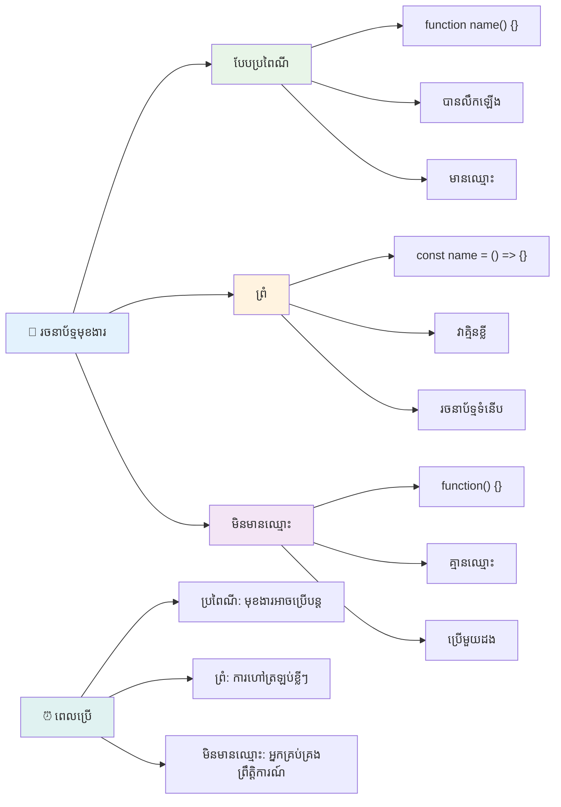
### ពេលណាដែលគួរប្រើវិធីសាស្រ្តនីមួយៗ

ពេលណាដែលអ្នកគួរប្រើវិធីសាស្រ្តនីមួយៗ? គន្លឹះប្រតិបត្តិ៖ ប្រសិនបើអ្នកចង់ប្រើ פונקציה ម្តងច្រើន សូមផ្ដល់ឈ្មោះ និងកំណត់វាផ្សេងៗ។ ប្រសិនបើគឺសម្រាប់រឿងដែលមួយ ហៅ פונקציה អនុគ្រោះនាម។ ទាំង פונקציות សម្រួលពាណិជ្ជកម្ម និងហេតុបុព្វបទបុរាណជាជម្រើសត្រឹមត្រូវ ប៉ុន្តែ פונקציות សម្រួលពាណិជ្ជកម្មពេញនិយមនៅក្នុងកូដ JavaScript សព្វថ្ងៃ។

### 🎨 **ត្រួតពិនិត្យស្ទីល פונקציה៖ ជ្រើសរើសសន្ទស្សន៍ត្រឹមត្រូវ**

**សាកល្បងការយល់ដឹង របស់អ្នកអំពីសន្ទស្សន៍៖**
- ពេលណាអ្នកអាចចង់ប្រើ פונקציות សម្រួលពាណិជ្ជកម្ម ជាងសន្ទស្សន៍ פונקציה ទំនើប?
- អត្ថប្រយោជន៍សំខាន់របស់ פונקציות អនុគ្រោះនាមគឺអ្វី?
- អ្នកអាចនិយាយពីស្ថានភាពណាមួយដែល פונקציה មានឈ្មោះមានអត្ថប្រយោជន៍ជាង פונקציה អនុគ្រោះនាម?

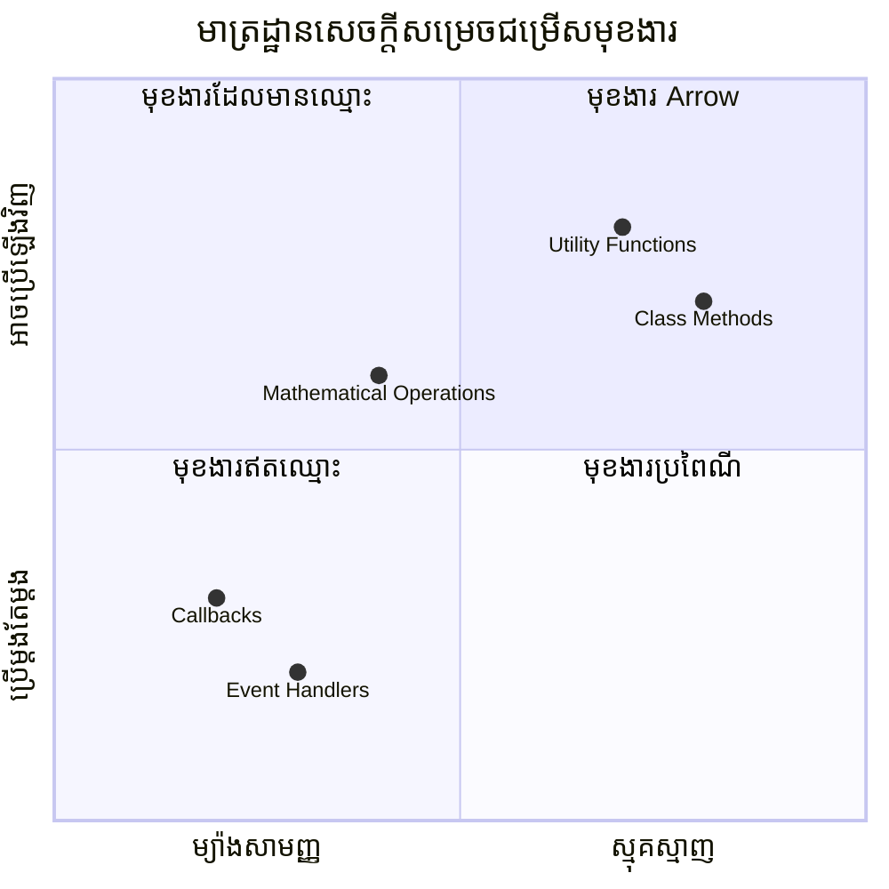
> **និន្នាការបច្ចុប្បន្ន**: פונקציות สម្រួលពាណិជ្ជកម្មកំពុងក្លាយទៅជាជម្រើសលំនាំដើមសម្រាប់អ្នកអភិវឌ្ឍជាច្រើនដោយសារសន្ទស្សន៍របស់ពួកវា ប៉ុន្តែ פונקציות បុរាណនៅតែមានកន្លែងខ្លួន!

---


## 🚀 ការប្រកួតប្រជែង

តើអ្នកអាចប្រាប់បានក្នុងតួអក្សរមួយពីភាពខុសគ្នារវាង פונקציות និងវីធីសាស្រ្តទេ? សាកល្បងមើល!

## ការប្រកួតប្រជែង GitHub Copilot Agent 🚀

ប្រើរបៀបទំនាក់ទំនង Agent ដើម្បីបញ្ចប់ឧបាស្រ័យខាងក្រោម៖

**ការពិពណ៌នា:** បង្កើតបណ្ណាល័យឧបករណ៍។ פונקציות គណិតវិទ្យា ដែលបង្ហាញមុខងារផ្សេងៗនៃ פונקציה ក្នុងមេរៀននេះ រួមទាំងប៉ារ៉ាម៉ែត្រ, តម្លៃផ្ទាល់ខ្លួន, តម្លៃត្រឡប់ និង פונקציות សម្រួលពាណិជ្ជកម្ម។

**ការបញ្ជូន:** បង្កើតឯកសារ JavaScript ឈ្មោះ `mathUtils.js` ដែលមាន פונקציותដូចខាងក្រោម៖
1. פונקציה `add` ដែលទទួលប៉ារ៉ាម៉ែត្រ ២ និងត្រឡប់គំនូសរបស់ពួកវា
2. פונקציה `multiply` មានតម្លៃប៉ារ៉ាម៉ែត្រដើម (ប៉ារ៉ាម៉ែត្រទី២មានតម្លៃត្រូវនៅ 1)
3. פונקציה សម្រួលពាណិជ្ជកម្ម `square` ដែលទទួលលេខមួយ និងត្រឡប់ការការ៉េរបស់វា
4. פונקציה `calculate` ដែលទទួល פונקציהផ្សេងទៀតជា ប៉ារ៉ាម៉ែត្រ និងលេខ ២ ហើយអនុវត្ត פונקציהទៅលើលេខទាំងពីរ
5. បង្ហាញពីការហៅ פונקציהនីមួយៗជាមួយករណីសាកល្បងសមរម្យ

ស្វែងយល់បន្ថែមអំពី [agent mode](https://code.visualstudio.com/blogs/2025/02/24/introducing-copilot-agent-mode) នៅទីនេះ។

## សំណួរប្រឡងបន្ទាប់វគ្គសិក្សា
[សំណួរប្រឡងបន្ទាប់វគ្គសិក្សា](https://ff-quizzes.netlify.app)

## ការត្រួតពិនិត្យ និងរៀនដោយខ្លួនឯង

គួរពិនិត្យអានបន្តពី [פונקציות សម្រួលពាណិជ្ជកម្ម](https://developer.mozilla.org/docs/Web/JavaScript/Reference/Functions/Arrow_functions) ដែលពួកវាកាន់តែប្រើប្រាស់សូម្បីនៅក្នុងបណ្ណាល័យកូដ។ អនុវត្តសរសេរ פונקציה ហើយបន្ទាប់មកកែសម្រួលវាជាមួយសន្ទស្សន៍នេះ។

## បេសកកម្ម

[សប្បាយរីករាយជាមួយ פונקציות](assignment.md)

---

## 🧰 **សេចក្ដីសង្ខេបឧបករណ៍ פונקציות JavaScript របស់អ្នក**

```mermaid
graph TD
    A["🎯 អនុគមន៍ JavaScript"] --> B["📋 ការបញ្ចადგენ פונקציה"]
    A --> C["📥 ប៉ារ៉ាឡែម៉ែត្រ"]
    A --> D["📤 តម្លៃត្រឡប់"]
    A --> E["🎨 វិធីសាស្រ្តទំនើប"]
    
    B --> B1["function name() {}"]
    B --> B2["ការដាក់ឈ្មោះពិពណ៌នា"]
    B --> B3["ប្លុកកូដអាចប្រើឡើងវិញ"]
    
    C --> C1["ទិន្នន័យបញ្ចូល"]
    C --> C2["តម្លៃលំនាំដើម"]
    C --> C3["ប៉ារ៉ាម៉ែត្រច្រើន"]
    
    D --> D1["ប្រកាស return"]
    D --> D2["ចេញពីអនុគមន៍"]
    D --> D3["បញ្ជូនទិន្នន័យត្រឡប់"]
    
    E --> E1["អនុគមន៍ arrow: () =>"]
    E --> E2["អនុគមន៍អនាមិក"]
    E --> E3["អនុគមន៍ជាលំដាប់ខ្ពស់"]
    
    F["⚡ អត្ថប្រយោជន៍សំខាន់"] --> F1["ការប្រើកូដឡើងវិញ"]
    F --> F2["ការរៀបចំ غوره"]
    F --> F3["ការធ្វើតេស្តងាយស្រួល"]
    F --> F4["ការរចនាម៉ូឌុល"]
    
    style A fill:#e3f2fd
    style B fill:#e8f5e8
    style C fill:#fff3e0
    style D fill:#f3e5f5
    style E fill:#e0f2f1
    style F fill:#fce4ec
```
---

## 🚀 រាបរាល់ពេលវេលានៃជំនាញ פונקציות JavaScript របស់អ្នក

### ⚡ **អ្វីដែលអ្នកអាចធ្វើបានក្នុង 5 នាទីបន្ទាប់**
- [ ] សរសេរ function ងាយៗមួយដែលត្រឡប់លេខដែលអ្នកចូលចិត្ត
- [ ] បង្កើត function មួយដែលមានប៉ារ៉ាម៉ែត្រ​ពីរ ដែលបូកពួកវារួមគ្នា
- [ ] ប្រាប់សម្រាប់បំលែង function ប្រពៃណីទៅជាសមាសធាតុ arrow function
- [ ] អនុវត្តការប្រលង៖ ពណ៌នាភាពខុសគ្នារវាង functions និង methods

### 🎯 **អ្វីដែលអ្នកអាចសម្រេចបានក្នុងម៉ោងនេះ**
- [ ] បញ្ចប់ការប្រលងបន្ទាប់ពីមេរៀន និងសិក្សាថ្នាក់គំនិតណាដែលធ្វើឱ្យច្របូកច្របល់
- [ ] បង្កើតបណ្ណាល័យ math utilities ពីការប្រកួត GitHub Copilot
- [ ] បង្កើត function ដែលប្រើប្រាស់ functionមួយផ្សេងទៀតជាប៉ារ៉ាម៉ែត្រ
- [ ] អនុវត្តការសរសេរ functions ជាមួយប៉ារ៉ាម៉ែត្រដើម
- [ ] សាកល្បង template literals នៅក្នុងតម្លៃត្រឡប់របស់ function

### 📅 **ការគ្រប់គ្រងFunction រយៈពេលមួយសប្តាហ៍របស់អ្នក**
- [ ] បញ្ចប់ការងារ "រីករាយជាមួយ Functions" ជាមួយនឹងភាពច្នៃប្រឌិត
- [ ] កែសម្រួលកូដកើតឡើងជាផ្នែកស្រដៀងៗដែលអ្នកបានសរសេរឲ្យទៅជាការបន្តប្រើបាន
- [ ] បង្កើតគណនាប្រាក់តូចមួយដោយប្រើ function តែប៉ុណ្ណោះ (មិនប្រើប្រាស់អថេរសាកល)
- [ ] អនុវត្ត arrow functions ជាមួយមធ្យោបាយអារេដូចជា `map()` និង `filter()`
- [ ] បង្កើតប្រមូលផ្តុំ function គាំទ្រសម្រាប់ការងារពេញនិយម
- [ ] សិក្សាអំពី higher-order functions និងគំនិតកម្មវិធីមូលដ្ឋានជំនួយ

### 🌟 **បម្លែងរយៈពេលមួយខែរបស់អ្នក**
- [ ] ជំនាញជ្រាបច្រើនជាងមុនអំពី function ដូចជា closures និង scope
- [ ] បង្កើតគម្រោងដែលប្រើប្រាស់ composition function ថ្លៃថ្នូរ
- [ ] អះអាងចូលរួម open source ដោយបង្កើនឯកសារបានស្តីពី functions
- [ ] បង្រៀនអ្នកដទៃអំពី functions និងរចនាសម្ព័ន្ធមានភាពខុសគ្នា
- [ ] រុករក paradigm កម្មវិធីមូលដ្ឋានជំនួយក្នុង JavaScript
- [ ] បង្កើតបណ្ណាល័យ function ផ្ទាល់ខ្លួនសម្រាប់គម្រោងអនាគត

### 🏆 **ការត្រួតពិនិត្យជ័យលាភី Functions ចុងក្រោយ**

**អបអរសាទរជំនាញ function របស់អ្នក៖**
- តើ function ដែលមានប្រយោជន៍បំផុតដែលអ្នកបានបង្កើតមានអ្វីខ្លះ?
- តើការស្គាល់គំនិត functions ប៉ះពាល់យ៉ាងដូចម្តេចចំពោះវិធីដែលអ្នករៀបចំនូវកូដ?
- តើអ្នកចូលចិត្តរចនាសម្ព័ន្ធ function ណាមួយ ហើយមូលហេតុផលជាអ្វី?
- តើបញ្ហាជាក់ស្តែងមួយណាដែលអ្នកនឹងដោះស្រាយតាមការសរសេរ function?

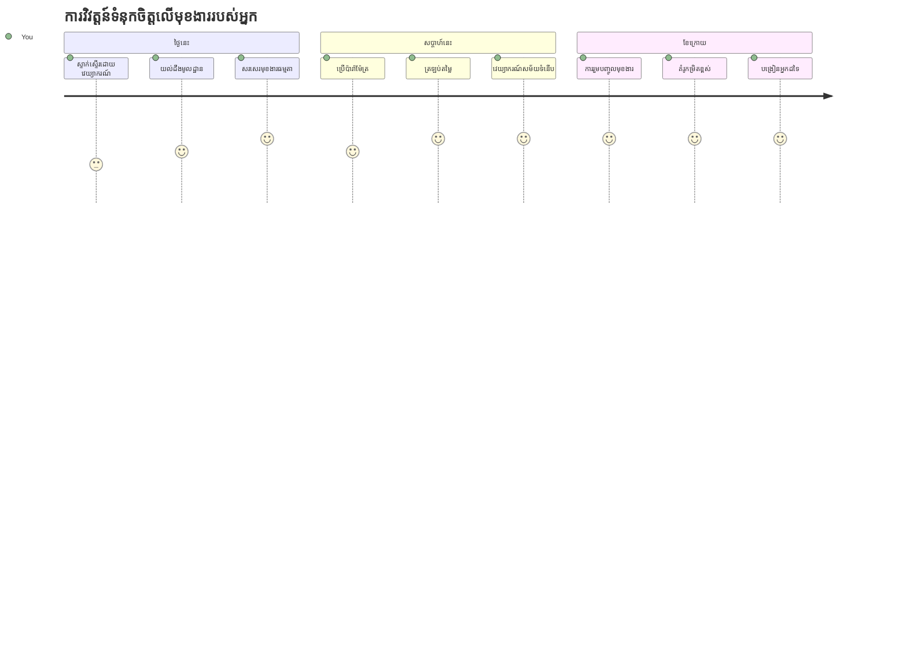
> 🎉 **អ្នកបានទទួលជំនាញមួយក្នុងចំណោមគំនិតដែលមានអំណាចបំផុតនៅក្នុងកម្មវិធី។** Functions គឺជាឧបករណ៍គ្រឹះនៃកម្មវិធីធំៗ។ កម្មវិធីមួយណាដែលអ្នកនឹងបង្កើត តែងតែប្រើ function ដើម្បីរៀបចំ ការប្រើប្រាស់ឡើងវិញ និងរៀបរយកូដ។ ឥឡូវនេះ អ្នកយល់ពីវិធីដាក់តំបន់ហូររបស់ទ្រព្យសម្បត្តិទៅក្នុងចំណុចដែលអាចប្រើប្រាស់ឡើងវិញ ធ្វើឱ្យអ្នកជាអ្នកអភិវឌ្ឍន៍មានប្រសិទ្ធភាពនិងអាចសម្រួល ការងារអ្នក។ សូមស្វាគមន៍មកកាន់ពិភពកម្មវិធីតាមម៉ូឌុល! 🚀

---

<!-- CO-OP TRANSLATOR DISCLAIMER START -->
**ការបញ្ជាក់**៖
ឯកសារនេះត្រូវបានបកប្រែដោយប្រើសេវាបកប្រែ AI [Co-op Translator](https://github.com/Azure/co-op-translator)។ ខណៈពេលដែលយើងខំប្រឹងផ្ដល់ភាពត្រឹមត្រូវ សូមយល់ថាការបកប្រែដោយស្វ័យប្រវត្តិសម្បូរទៅដោយកំហុសឬភាពមិនត្រឹមត្រូវក៏អាចមាន។ ឯកសារដើមដែលមានភាសាដើមគួរត្រូវបាននិយាយថាជាដើមកំណត់ តម្លៃសម្របសម្រួល។ សម្រាប់ព័ត៌មានដ៏សំខាន់ សូមប្រើប្រាស់ការបកប្រែដោយមនុស្សជំនាញ។ យើងមិនទទួលខុសត្រូវចំពោះការយល់ច្រឡំឬការរួមភាសាដែលកើតចេញពីការប្រើប្រាស់ការបកប្រែនេះឡើយ។
<!-- CO-OP TRANSLATOR DISCLAIMER END -->