# JavaScript មូលដ្ឋាន៖ ការធ្វើសេចក្តីសម្រេច

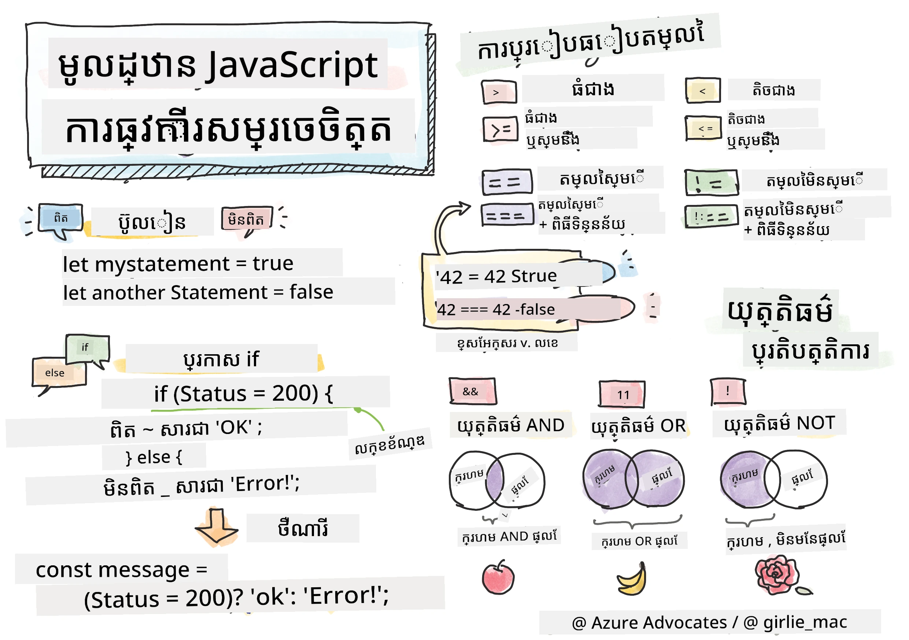

> សេចក្តីសង្ខេបដោយ [Tomomi Imura](https://twitter.com/girlie_mac)

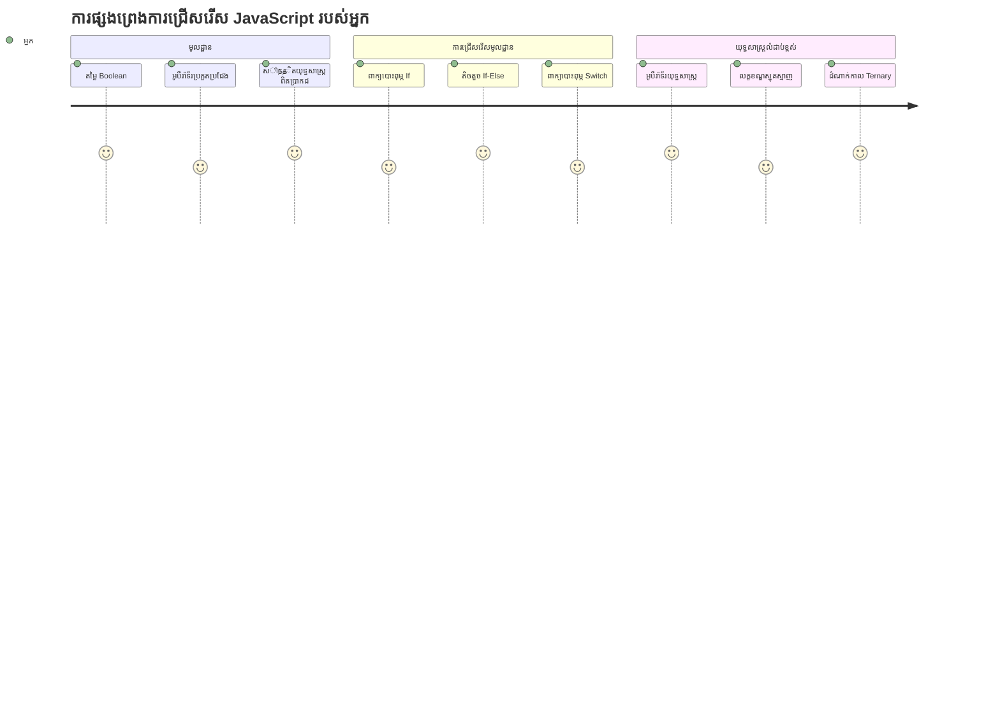
តើអ្នកធ្លាប់ចាប់អារម្មណ៍ថាអ្នកប្រើកម្មវិធីធ្វើសេចក្តីសម្រេចយ៉ាងច្បាស់យ៉ាងដូចម្តេចទេ? ដូចជា របៀបដែលប្រព័ន្ធណាវីហ្គេសិនជ្រើសរើសផ្លូវដែលលឿនបំផុត ឬរបៀបដែលធម្មតាស្ថិតិគណនាតម្លៃការបើកឬបិទកំដៅ? នេះជាគំនិតមូលដ្ឋាននៃការធ្វើសេចក្តីសម្រេចក្នុងកម្មវិធី។

ដូចដែលម៉ាស៊ីនវិភាគលំអិតរបស់ Charles Babbage ត្រូវបានរចនាឡើងដើម្បីដើរការប្រតិបត្តិលំដាប់ផ្សេងៗតាមលក្ខខណ្ឌ កម្មវិធី JavaScript សម័យទំនើបត្រូវការធ្វើជម្រើសដោយផ្អែកលើស្ថានភាពនិងលក្ខខណ្ឌអាចផ្លាស់ប្តូរបាន។ សមត្ថភាពក្នុងការបំបែកផ្លូវ និងធ្វើសេចក្តីសម្រេចនេះគឺជាអ្វីដែលបំលែងកូដជាស្ថិតសាស្ត្រជាកម្មវិធីឆ្លាតវៃឆ្លើយតប។

នៅក្នុងមេរៀននេះ អ្នកនឹងរៀនរបៀបដើម្បីអនុវត្តន៍បច្ចេកទេសលក្ខខណ្ឌនៅក្នុងកម្មវិធីរបស់អ្នក។ យើងនឹងស្វែងយល់អំពីពាក្យសន្សំពាក្យមានលក្ខខណ្ឌ អ្នកបញ្ជាការប្រៀបធៀប និងពាក្យសម្តីយល់ស្មារតីដែលអាចអនុញ្ញាតឱ្យកូដរបស់អ្នកវាយតម្លៃលក្ខខណ្ឌហើយឆ្លើយតបត្រឹមត្រូវ។

## សំណួរប្រឡងមុនមេរៀន

[សំណួរប្រឡងមុនមេរៀន](https://ff-quizzes.netlify.app/web/quiz/11)

សមត្ថភាពក្នុងការធ្វើសេចក្តីសម្រេច និងគ្រប់គ្រងការចរន្តកម្មវិធីគឺជាផ្នែកមូលដ្ឋាននៃកម្មវិធី។ ផ្នែកនេះគ្របដណ្ដប់ពីរបៀបគ្រប់គ្រងផ្លូវអនុវត្តន៍កម្មវិធី JavaScript របស់អ្នកដោយប្រើតម្លៃ Boolean និងបច្ចេកទេសលក្ខខណ្ឌ។

[](https://youtube.com/watch?v=SxTp8j-fMMY "Making Decisions")

> 🎥 ចុចរូបភាពខាងលើសម្រាប់វីដេអូអំពីការធ្វើសេចក្តីសម្រេច។

> អ្នកអាចយកមេរៀននេះនៅលើ [Microsoft Learn](https://docs.microsoft.com/learn/modules/web-development-101-if-else/?WT.mc_id=academic-77807-sagibbon) បានផងដែរ!

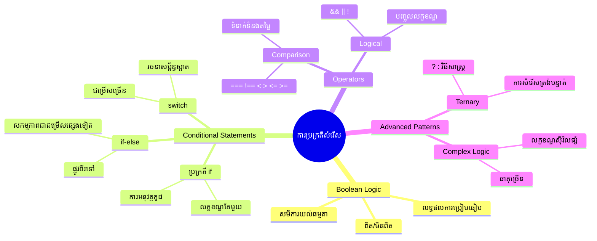
## ការត្រួតពិនិត្យវិញរហ័សអំពី Boolean

មុននឹងស្វែងយល់អំពីការធ្វើសេចក្តីសម្រេច មកត្រួតពិនិត្យតម្លៃ Boolean ដែលយើងបានរៀននៅមេរៀនមុនវិញ។ តម្លៃទាំងនេះមានឈ្មោះបន្ទាប់ពីអ្នកគណិតវិទ្យា George Boole ដែលតំណាងឱ្យស្ថានភាពពីរប្រភេទពីរប្រភេទ — ឬជា `true` ឬជា `false`។ គ្មានភាពអន្មត់មួយណាទេ ពុំមានចំណុចកណ្តាលទេ។

តម្លៃពីរប្រភេទនេះគឺជាមូលដ្ឋាននៃកំណត់ត្រាអាល់ហ្គូរីធម៍គណនា។ សេចក្តីសម្រេចគ្រប់យ៉ាងដែលកម្មវិធីរបស់អ្នកធ្វើការ វាជាការវាយតម្លៃ Boolean។

ការបង្កើតអថេរ Boolean គឺសាមញ្ញ៖

```javascript
let myTrueBool = true;
let myFalseBool = false;
```

នេះបង្កើតអថេរស្នាដៃពីរដែលមានតម្លៃ Boolean ប្រាក់ប្រាស់។

✅ Boolean មានឈ្មោះបន្ទាប់ពីអ្នកគណិតវិទ្យា និងទស្សនវិជ្ជាជន និងអ្នកវិភាគតំណាងថាមនុស្សលោក George Boole (1815–1864)។

## អ្នកបញ្ជាការប្រៀបធៀប និង Boolean

នៅក្នុងការអនុវត្ត អ្នកធ្លាប់តិចតួចប្រើតម្លៃ Boolean ដោយដៃ។ ផ្ទុយទៅវិញ អ្នកនឹងបង្កើតវាដោយការវាយតម្លៃលក្ខខណ្ឌ៖ "លេខនេះធំជាងលេខនោះទេ?" ឬ "តម្លៃទាំងនេះស្មើគ្នាទេ?"

អ្នកបញ្ជាការប្រៀបធៀបអនុញ្ញាតឱ្យធ្វើការវាយតម្លៃទាំងនេះ។ ពួកវាប្រៀបធៀបទម្លៃ និងបញ្ចេញតម្លៃ Boolean មួយស្រាប់លើទំនាក់ទំនងរវាងអូប៉េរ៉ង់។

| រូបសញ្ញា | សង្ខេបមាតិការពិពណ៍នា                                                                                                                                | ឧទាហរណ៍               |
| -------- | ----------------------------------------------------------------------------------------------------------------------------------------------------- | --------------------- |
| `<`      | **តិចជាង**៖ ប្រៀបធៀបទាំពីរតម្លៃ ហើយបញ្ចេញតម្លៃ Boolean `true` ប្រសិនបើតម្លៃនៅជាគ្រងខាងឆ្វេងតិចជាងតម្លៃខាងស្ដាំ                                                | `5 < 6 // true`       |
| `<=`     | **តិចជាងឬស្មើ**៖ ប្រៀបធៀបទាំពីរតម្លៃ ហើយបញ្ចេញតម្លៃ Boolean `true` ប្រសិនបើតម្លៃនៅជាគ្រងខាងឆ្វេងតិចឬស្មើតម្លៃខាងស្ដាំ                                              | `5 <= 6 // true`      |
| `>`      | **ធំជាង**៖ ប្រៀបធៀបទាំពីរតម្លៃ ហើយបញ្ចេញតម្លៃ Boolean `true` ប្រសិនបើតម្លៃនៅជាគ្រងខាងឆ្វេងធំជាងតម្លៃខាងស្ដាំ                                                | `5 > 6 // false`      |
| `>=`     | **ធំជាងឬស្មើ**៖ ប្រៀបធៀបទាំពីរតម្លៃ ហើយបញ្ចេញតម្លៃ Boolean `true` ប្រសិនបើតម្លៃនៅជាគ្រងខាងឆ្វេងធំជាងឬស្មើតម្លៃខាងស្ដាំ                                              | `5 >= 6 // false`     |
| `===`    | **ស្មើខ្លាំង**៖ ប្រៀបធៀបទាំពីរតម្លៃ ហើយបញ្ចេញតម្លៃ Boolean `true` ប្រសិនបើតម្លៃនៅជាគ្រងឆ្វេង និងស្ដាំស្មើគ្នា ព្រមទាំងជាប្រភេទទិន្នន័យដូចគ្នា                                            | `5 === 6 // false`    |
| `!==`    | **មិនស្មើគ្នា**៖ ប្រៀបធៀបទាំពីរតម្លៃ ហើយបញ្ចេញតម្លៃ Boolean ផ្ទុយពីស្មើខ្លាំង                                                                        | `5 !== 6 // true`     |

✅ ពិនិត្យជំនាញរបស់អ្នកដោយការសរសេរប្រៀបធៀបមួយចំនួននៅក្នុងកុងសូលរបស់អ្នក។ តើមានទិន្នន័យដែលត្រូវតាមដែលធ្វើឲ្យអ្នកភ្ញាក់ផ្អើលទេ?

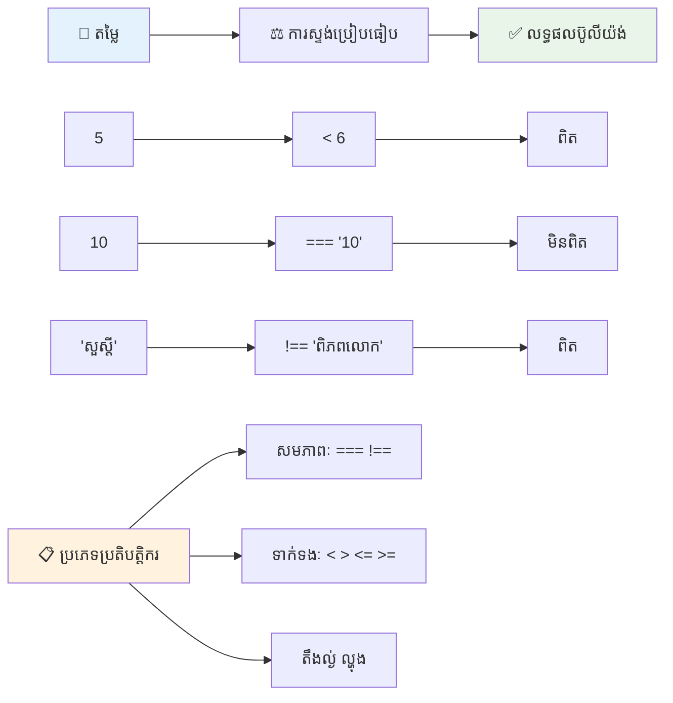
### 🧠 **ការត្រួតពិនិត្យជំនាញប្រៀបធៀប៖ យល់ដឹងអំពីលក្ខខណ្ឌ Boolean**

**សាកល្បងយល់ដឹងរបស់អ្នកអំពីការប្រៀបធៀប៖**
- ហេតុអ្វីបានជា `===` (ស្មើខ្លាំង) ត្រូវបានចំណូលចិត្តជាចម្បងជាង `==` (ស្មើយឺត)?
- តើអ្នកអាចទិត្យមើលថា `5 === '5'` នឹងផ្ដល់អ្វី? តើ `5 == '5'` បែបណា?
- តើខុសគ្នារវាង `!==` និង `!=` គឺជាអ្វី?

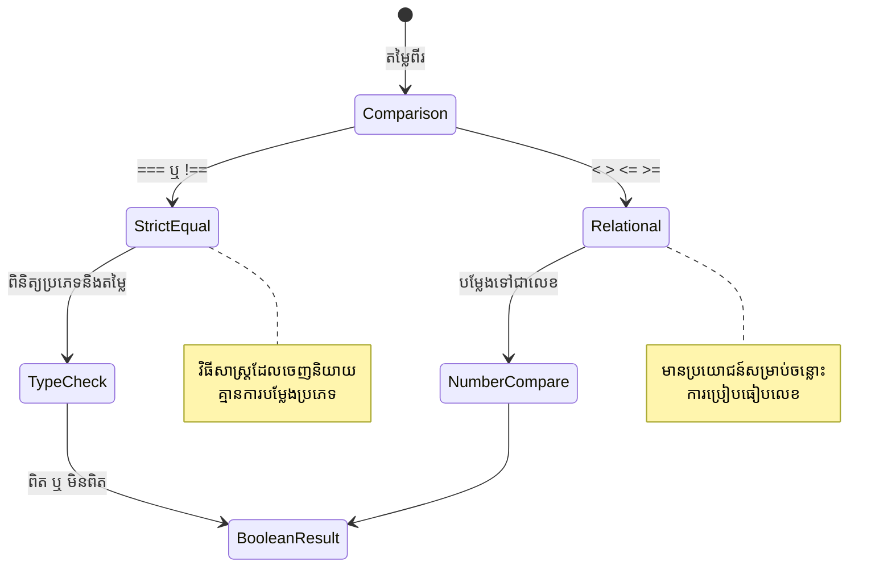
> **គំនួញជំនាញ**: ប្រើ `===` និង `!==` សម្រាប់ការត្រួតពិនិត្យស្មើភាព លុះត្រាតែអ្នកត្រូវការបម្លែងប្រភេទខុសឆ្គង។ វាជាជំរើសប្រសើរដើម្បីជៀសវាងឥរិយាបថមិនចង់បាន!

## ពាក្យបញ្ជា If

ពាក្យបញ្ជា `if` គឺដូចជាការសួរពីសំណួរមួយជាភាសាកូដរបស់អ្នក។ "បើលក្ខខណ្ឌនេះជាពិត សូមធ្វើរឿងនេះ។" វាគឺជាឧបករណ៍សំខាន់បំផុតដែលអ្នកនឹងប្រើសម្រាប់ការធ្វើសេចក្តីសម្រេចនៅក្នុង JavaScript។

នេះជារបៀបដំណើរការ៖

```javascript
if (condition) {
  // គោលលក្ខខ័ណ្ឌពិត។ កូដនៅក្នុងប្លុកនេះនឹងរត់។
}
```

លក្ខខណ្ឌស្ថិតនៅក្នុងសញ្ញាកោសិកា ហើយបើវាជា `true` JavaScript នឹងដំណើរការកូដក្នុងសញ្ញាចែដាស់បន្ទាប់។ ប្រសិនបើវាជា `false` JavaScript នឹងរំលងប្លុកនោះទាំងមូល។

អ្នកជាញឹកញាប់នឹងប្រើអ្នកបញ្ជាការប្រៀបធៀបដើម្បីបង្កើតលក្ខខណ្ឌទាំងនេះ។ មកមើលឧទាហរណ៍ប្រតិបត្តិ៖

```javascript
let currentMoney = 1000;
let laptopPrice = 800;

if (currentMoney >= laptopPrice) {
  // លក្ខខណ្ឌត្រូវ។ កូដនៅក្នុងប្លុកនេះនឹងដំណើរការ។
  console.log("Getting a new laptop!");
}
```

ដោយសារតែ `1000 >= 800` វាយតម្លៃទៅជា `true` កូដក្នុងប្លុកនោះត្រូវបានដំណើរការ បង្ហាញ "កំពុងទិញកុំព្យូទ័រយួរដៃថ្មី!" នៅក្នុងកុងសូល។

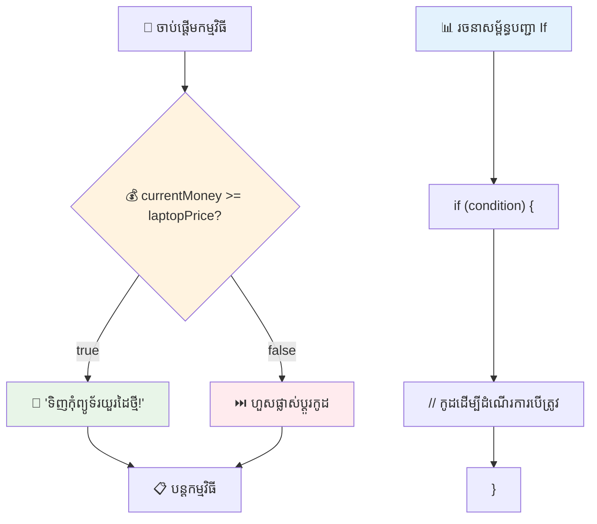
## ពាក្យបញ្ជា If..Else

ប៉ុន្តែបើអ្នកចង់ឲ្យកម្មវិធីរបស់អ្នកធ្វើរឿងខុសពីនេះនៅពេលលក្ខខណ្ឌគឺ false? នោះជាទីតាំងដែល `else` បង្ហាញ — វាដូចជាមានផែនការទុកចិត្ដ។

ពាក្យបញ្ជា `else` ផ្តល់មុខងារអនុញ្ញាតឱ្យអ្នកនិយាយថា "បើលក្ខខណ្ឌនេះមិនត្រូវ ទើបធ្វើរឿងផ្សេងជំនួស"។

```javascript
let currentMoney = 500;
let laptopPrice = 800;

if (currentMoney >= laptopPrice) {
  // លក្ខខណ្ឌគឺពិត។ កូដនៅក្នុងប្លុកនេះនឹងរត់។
  console.log("Getting a new laptop!");
} else {
  // លក្ខខណ្ឌគឺមិនពិត។ កូដនៅក្នុងប្លុកនេះនឹងរត់។
  console.log("Can't afford a new laptop, yet!");
}
```

ឥពើយ `500 >= 800` ជា `false` កម្មវិធី JavaScript ភ្លេចប្លុកដំបូង ហើយដំណើរការប្លុក `else` ជំនួស។ អ្នកនឹងឃើញ "ពុំអាចទិញកុំព្យូទ័រយួរដៃថ្មីបានទេ!" នៅក្នុងកុងសូល។

✅ សាកល្បងយល់ដឹងរបស់អ្នកអំពីកូដនេះ និងកូដក្រោយដោយដំណើរការវានៅក្នុងកុងសូលប្រ៉ៅសឺរ។ ប្ដូរតម្លៃអថេរ currentMoney និង laptopPrice ដើម្បីផ្លាស់ប្តូរអ្វីដែលត្រូវបង្ហាញតាម `console.log()`។

### 🎯 **ការត្រួតពិនិត្យទ្រឹស្តី If-Else៖ ផ្លូវសាហាវ**

**វាយតម្លៃយល់ដឹងរបស់អ្នកអំពីលក្ខខណ្ឌ៖**
- តើមានអ្វីកើតឡើងបើ `currentMoney` ស្មើ `laptopPrice`?
- តើអ្នកអាចគិតឧទាហរណ៍ពិតណាមួយដែលពួកឧបករណ៍ if-else គឺមានប្រយោជន៍ដែរឬទេ?
- តើអ្នកអាចបន្ថែមវាដើម្បីគ្រប់គ្រងតម្លៃជាច្រើនបែបណាបាន?

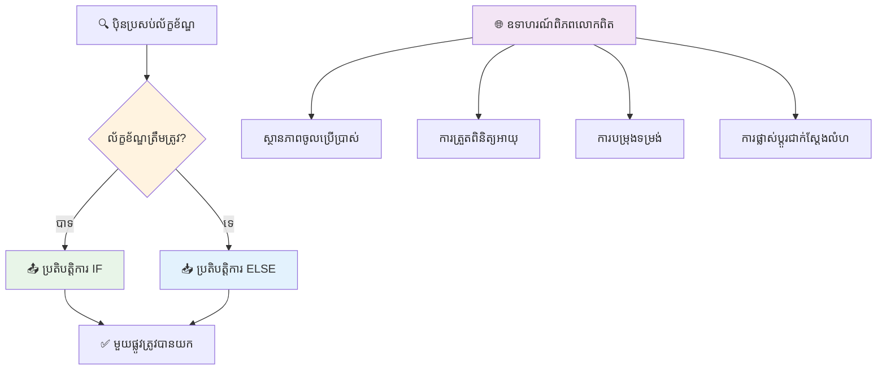
> **ចំណុចសំខាន់**៖ If-else ធានាថាប្លុកមួយតែប៉ុណ្ណោះត្រូវបានជ្រើសរើស។ វាផ្តល់ការប្រាកដថាកម្មវិធីរបស់អ្នកមានការឆ្លើយតបច្បាស់ក្នុងស្ថានភាពណាមួយ។

## ពាក្យបញ្ជា Switch

ខណៈពេលដែលអ្នកត្រូវប្រៀបធៀបតម្លៃមួយជាមួយជម្រើសជាច្រើន។ ខណៈដែលអ្នកអាចចាក់ជួរពាក្យបញ្ជា `if..else` ជាច្រើន ការប្រកបនេះអាចធ្វើឲ្យវាស្មុគស្មាញ។ ពាក្យបញ្ជា `switch` ផ្តល់រចនាសម្ព័ន្ធស្អាតសម្រាប់គ្រប់គ្រងតម្លៃផ្សេងៗជាច្រើន។

គំនិតនេះដូចជាការប្តូរតុល្យភាពគ្រឿងចង្កឹះតាមរយៈប្រព័ន្ធទូរស័ព្ទដ៏ចាស់មួយ — តម្លៃបញ្ចូលគត់កំណត់មុខងារដែលបន្ទាត់អនុវត្តត្រូវបន្ត។

```javascript
switch (expression) {
  case x:
    // ប្លុកកូដ
    break;
  case y:
    // ប្លុកកូដ
    break;
  default:
    // ប្លុកកូដ
}
```

នេះជារបៀបរចនាដូចខាងក្រោម៖
- JavaScript វាយតម្លៃពាក្យបញ្ជាដងតែមួយ
- វាស្វែងរក `case` រាល់មុខដើម្បីស្វែងរកការប្រកួត
- ពេលវាមានការប្រកួត វានឹងដំណើរការប្លុកកូដនោះ
- `break` ប្រាប់ JavaScript ឱ្យឈប់ និងចេញពី switch
- ប្រសិនបើគ្មាន case ណាមួយប្រកួត វានឹងដំណើរការប្លុក `default` (បើអ្នកមាន)

```javascript
// កម្មវិធីប្រើប្តូរប្រកាសសម្រាប់ថ្ងៃនៃសប្តាហ៍
let dayNumber = 2;
let dayName;

switch (dayNumber) {
  case 1:
    dayName = "Monday";
    break;
  case 2:
    dayName = "Tuesday";
    break;
  case 3:
    dayName = "Wednesday";
    break;
  default:
    dayName = "Unknown day";
    break;
}
console.log(`Today is ${dayName}`);
```

ក្នុងឧទាហរណ៍នេះ JavaScript មើលឃើញថា `dayNumber` មានតម្លៃ `2` រក `case 2` ដែលត្រូវគ្នា កំណត់ `dayName` ទៅជា "Tuesday" បន្ទាប់មកផុតចេញពី switch។ លទ្ធផលវិញគឺ "Today is Tuesday" ត្រូវបានបង្ហាញនៅក្នុងកុងសូល។

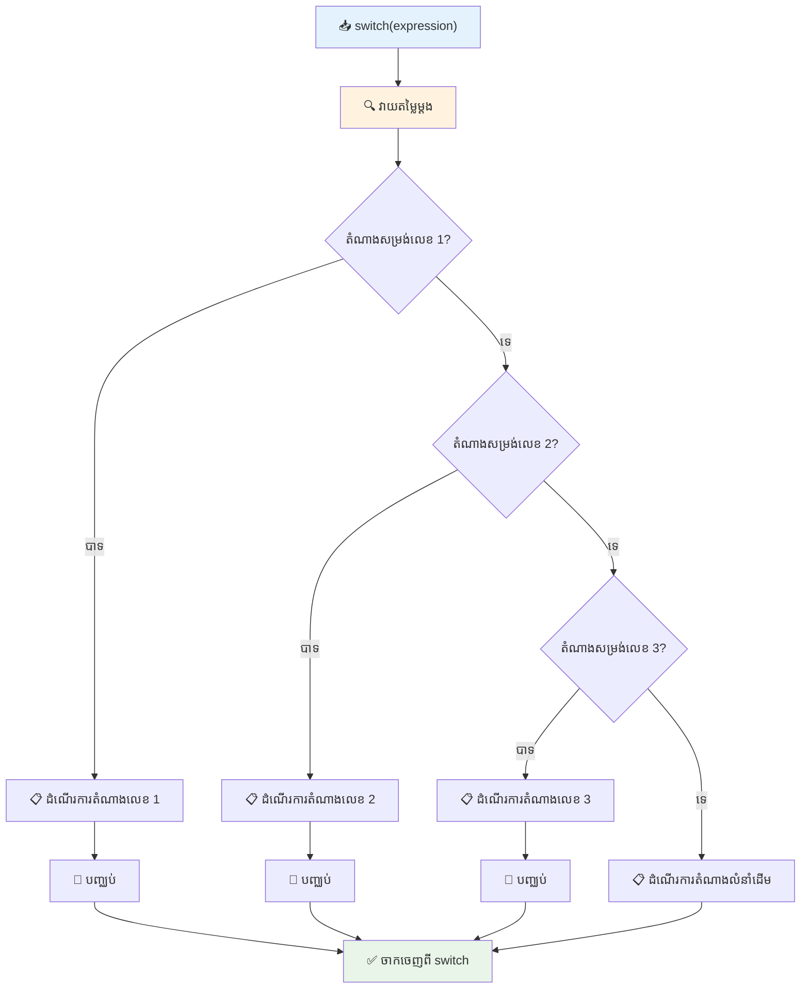
✅ សាកល្បងយល់ដឹងរបស់អ្នកអំពីកូដនេះ និងកូដក្រោយដោយដំណើរការវានៅក្នុងកុងសូលប្រ៉ៅសឺរ។ ប្ដូរតម្លៃអថេរ a ដើម្បីផ្លាស់ប្តូរអ្វីដែលត្រូវបង្ហាញតាម `console.log()`។

### 🔄 **ការត្រួតពិនិត្យជំនាញ Switch៖ ជម្រើសជាច្រើន**

**សាកល្បងយល់ដឹងរបស់អ្នកអំពី switch៖**
- តើមានអ្វីកើតឡើងបើអ្នកភ្លេចប្រើ `break`?
- តើ​អ្នកចង់ប្រើ `switch` នៅពេលណាមុន `if-else` ច្រើនដង?
- ហេតុអ្វីបានជា `default` មានប្រយោជន៍ ទោះបីអ្នកគិតថាអ្នកគ្របដណ្តប់គ្រប់សក្តានុពលទាំងអស់ហើយ?

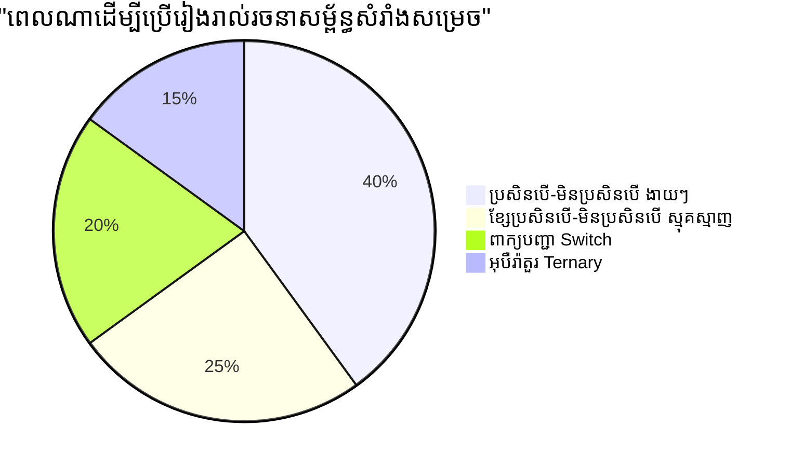
> **អនុវត្តន៍ល្អបំផុត**៖ ប្រើ `switch` នៅពេលប្រៀបធៀបអថេរច្រើនជាមួយតម្លៃជាក់លាក់។ ប្រើ `if-else` សម្រាប់ត្រួតពិនិត្យជួរឬលក្ខខណ្ឌស្មុគស្មាញ!

## អ្នកបញ្ជាការយល់ស្មារតី និង Boolean

ការធ្វើសេចក្តីសម្រេចស្មុគស្មាញភាគច្រើនទាមទារការវាយតម្លៃលក្ខខណ្ឌច្រើននៅពេលតែមួយ។ ដូចដែលពណ៌នាគណិតវិទ្យាភាពសម្បូរបែប Boolean អនុញ្ញាតឱ្យអ្នកគណិតិយកលក្ខខណ្ឌយល់ស្មារតីចំរូងគ្នា ការសរសេរកម្មវិធីផ្តល់អ្នកបញ្ជាការយល់ស្មារតីដើម្បីភ្ជាប់លក្ខខណ្ឌ Boolean ច្រើន។

អ្នកបញ្ជាការនេះអនុញ្ញាតឱ្យអ្នកបង្កើតលក្ខខណ្ឌស្មុគស្មាញដោយការបញ្ចូលការវាយតម្លៃ true/false ងាយៗ។

| រូបសញ្ញា | សង្ខេបមាតិការពិពណ៍នា                                                                                                                             | ឧទាហរណ៍                                                                                             |
| -------- | ------------------------------------------------------------------------------------------------------------------------------------------------- | ------------------------------------------------------------------------------------------------- |
| `&&`     | **AND និយមន័យយល់ស្មារតី**៖ ប្រៀបធៀបពាក្យរកសមមូល Boolean ពីរពាក្យ។ បញ្ចេញ true **តែ** បើទាំងពីរផ្នែកពិត។                               | `(5 > 3) && (5 < 10) // ទាំងពីរផ្នែកពិត។ បញ្ចេញ true`                                |
| `\|\|`   | **OR និយមន័យយល់ស្មារតី**៖ ប្រៀបធៀបពាក្យរកសមមូល Boolean ពីរពាក្យ។ បញ្ចេញ true ប្រសិនបើមានយ៉ាងហោចណាស់មួយផ្នែកពិត។                    | `(5 > 10) \|\| (5 < 10) // មួយផ្នែកមិនពិត ភាគតែម្ខាងពិត។ បញ្ចេញ true`              |
| `!`      | **NOT និយមន័យយល់ស្មារតី**៖ បញ្ចេញតម្លៃផ្ទុយពីពាក្យBoolean                                                                             | `!(5 > 10) // 5 មិនធំជាង 10 ទេ ដូច្នេះ "!" ធ្វើឱ្យវាជា true`                         |

អ្នកបញ្ជាការនេះអនុញ្ញាតឱ្យអ្នកភ្ជាប់លក្ខខណ្ឌជាដំណាក់កាលបាន៖
- AND (`&&`) មានន័យថាលក្ខខណ្ឌទាំងពីរត្រូវតែពិត
- OR (`||`) មានន័យថាយ៉ាងហោចណាស់មួយលក្ខខណ្ឌត្រូវតែពិត  
- NOT (`!`) បម្លែង true ទៅ false (និងព្រមទាំង trái lại)

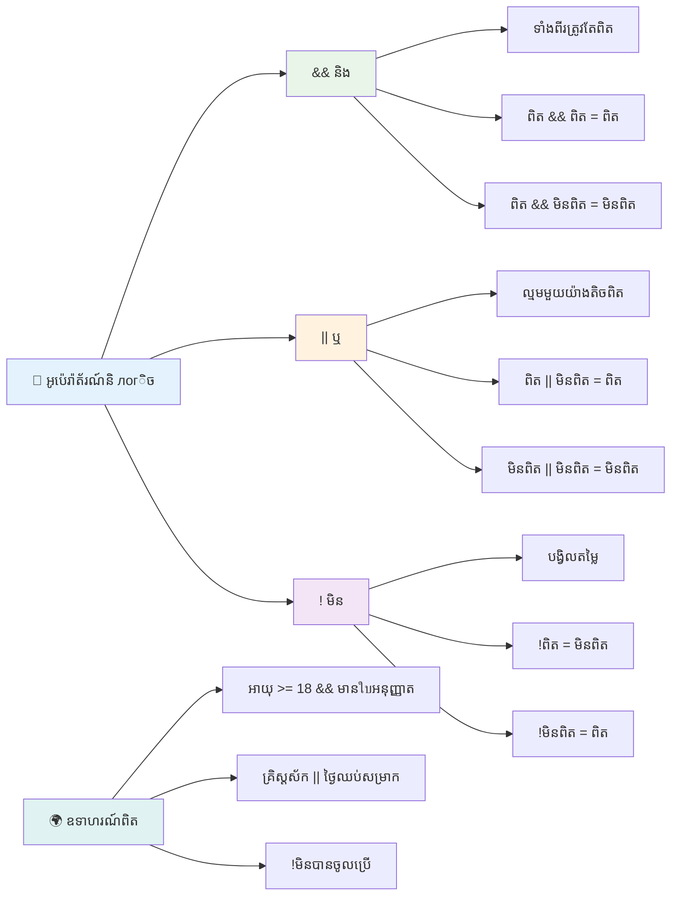
## លក្ខខណ្ឌ និងសេចក្តីសម្រេចជាមួយអ្នកបញ្ជា

មកមើលអ្នកបញ្ជាការយល់ស្មារតីទាំងនេះនៅក្នុងឧទាហរណ៍ជាក់ស្តែងមួយ៖

```javascript
let currentMoney = 600;
let laptopPrice = 800;
let laptopDiscountPrice = laptopPrice - (laptopPrice * 0.2); // តម្លៃកុំព្យូទ័រយួរដៃបញ្ចុះតម្លៃ ២០ ភាគរយ

if (currentMoney >= laptopPrice || currentMoney >= laptopDiscountPrice) {
  // លក្ខខណ្ឌត្រឹមត្រូវ។ កូដក្នុងប្លុកនេះនឹងរត់។
  console.log("Getting a new laptop!");
} else {
  // លក្ខខណ្ឌមិនត្រឹមត្រូវ។ កូដក្នុងប្លុកនេះនឹងរត់។
  console.log("Can't afford a new laptop, yet!");
}
```

ក្នុងឧទាហរណ៍នេះ៖ យើងគណនាតម្លៃបញ្ចុះពាន់ ២០% (640) បន្ទាប់មកវាយតម្លៃថាតើហិរញ្ញវត្ថុដែលមានគ្របដណ្តប់តម្លៃទាំងអស់ ឬតម្លៃបញ្ចុះនេះ។ ដោយសារតែ 600 មិនបរិមាណលើផលបញ្ចុះ 640 ទេ គឺលក្ខខណ្ឌវាយតម្លៃទៅជា true។

### 🧮 **ការត្រួតពិនិត្យអ្នកបញ្ជាការយល់ស្មារតី៖ ការភ្ជាប់លក្ខខណ្ឌ**

**សាកល្បងយល់ដឹងរបស់អ្នកអំពីអ្នកបញ្ជាការយល់ស្មារតី៖**
- ក្នុងពាក្យបញ្ជា `A && B` តើមានអ្វីកើតឡើងបើ A ជា false? តើ B បានបាយតម្លៃទេ?
- តើអ្នកអាចគិតឧទាហរណ៍ណាដែលអ្នកត្រូវការអ្នកបញ្ជា ៣ ដង (&&, ||, !) ព្រមគ្នា?
- ផ្សេងគ្នារវាង `!user.isActive` និង `user.isActive !== true` គឺជាអ្វី?

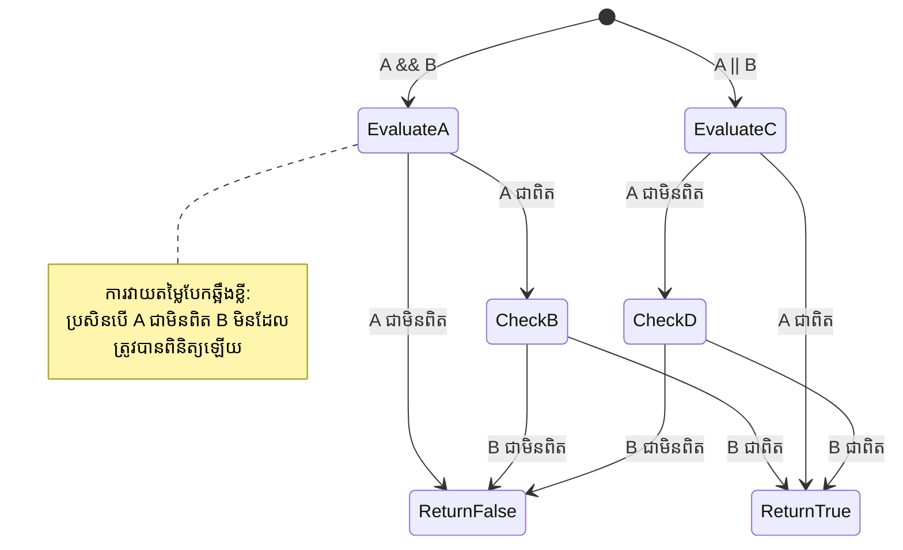
> **គំនួញបង្កើនប្រសិទ្ធភាព**៖ JavaScript ប្រើការវាយតម្លៃ "short-circuit" - ក្នុង `A && B` ប្រសិនបើ A ជា false, B មិនត្រូវបានវាយតម្លៃទេ។ ប្រើអត្ថប្រយោជន៍នេះដើម្បីធ្វើឱ្យកូដមានប្រសិទ្ធភាព!

### អ្នកបញ្ជាផ្ទុយ

ខ្លះៗ ពេលវេលាល្អជាងក្នុងការគិតពេលអ្វីមិនមែនជា true។ ដូចជាការសួរថា "តើអ្នកប្រើបានចូលបញ្ចូលហើយទេ?" អ្នកអាចចង់សួរថា "តើអ្នកប្រើមិនទាន់ចូលបញ្ចូលទេ?" អ្នកបញ្ជាផ្ទុយ (`!`) បម្លែងលក្ខខណ្ឌនេះ។

```javascript
if (!condition) {
  // ប្រតិបត្តិ ប្រសិនបើលក្ខខណ្ឌមិនត្រឹមត្រូវ
} else {
  // ប្រតិបត្តិ ប្រសិនបើលក្ខខណ្ឌត្រឹមត្រូវ
}
```

អ្នកបញ្ជា `!` គឺដូចជាការនិយាយថា "វាផ្ទុយពី..." — ប្រសិនបើអ្វីមួយជា `true` អ្នកបញ្ជា `!` ធ្វើឲ្យវាជា `false` ហើយវា័ត្រឡប់វិញ។

### ពាក្យសម្តីតែរីនារី

សម្រាប់ការបែងចែកលក្ខខណ្ឌសាមញ្ញ JavaScript ផ្តល់អ្នកបញ្ជាផ្ទុយតែរីនារី។ វាជាភាសាសរសេរជួរเดียว ដែលជួយអ្នកសរសេរពាក្យសម្តីលក្ខខណ្ឌពីរជាមួយគ្នា។

```javascript
let variable = condition ? returnThisIfTrue : returnThisIfFalse;
```

វាអានដូចសំនួរ៖ "តើលក្ខខណ្ឌនេះជាពិតទេ? ប្រសិនបើមែន ប្រើតម្លៃនេះ។ ប្រសិនបើមិនមែន ប្រើតម្លៃនោះ។"

ឧទាហរណ៍ពិតប្រាកដនៅខាងក្រោម៖

```javascript
let firstNumber = 20;
let secondNumber = 10;
let biggestNumber = firstNumber > secondNumber ? firstNumber : secondNumber;
```

✅ ចំណាយពេលមួយនាទីអានកូដនេះច្រើនដង។ តើអ្នកយល់ថាអ្នកបញ្ជាការជាថ្មីៗទាំងនេះដំណើរការយ៉ាងដូចម្តេច?

នេះជាអ្វីដែលបន្ទាត់នេះនិយាយ៖ "តើ `firstNumber` ធំជាង `secondNumber` ទេ? ប្រសិនបើមែន ទទួលយកនៅក្នុង `biggestNumber`។ ប្រសិនបើមិនមែន ទទួលយក `secondNumber` នៅក្នុង `biggestNumber`។"

អ្នកបញ្ជាថែរីនារីគ្រាន់តែជារបៀបខ្លីដើម្បីសរសេរ `if..else` ធម្មតា៖

```javascript
let biggestNumber;
if (firstNumber > secondNumber) {
  biggestNumber = firstNumber;
} else {
  biggestNumber = secondNumber;
}
```

ទោលធ្វើឲ្យទាំងពីរបង្ហាញលទ្ធផលដូចគ្នា។ អ្នកបញ្ជាថែរីនារីផ្តល់នូវភាពខ្លី ស្រួលបកស្រាយ ផ្ទុយពីរចនាសម្ព័ន្ធ if-else ដែលអាចអានបានល្អសម្រាប់លក្ខខណ្ឌស្មុគស្មាញ។

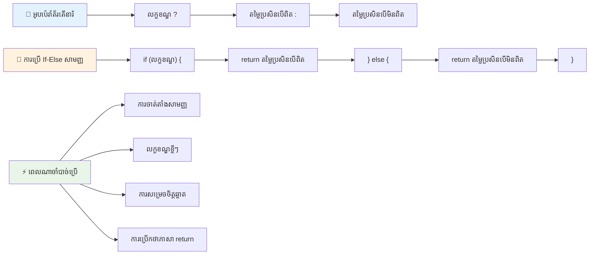
---


## 🚀 챌린지

បង្កើតកម្មវិធីមួយដែលសរសេរជាលើកដំបូងដោយមានអ្នកបញ្ជារយល់ស្មារតី ហើយបន្ទាប់មកសរសេរឡើងវិញដោយប្រើពាក្យសម្តីតែរីនារី។ តើយើងចូលចិត្តរចនាសម្ព័ន្ធណា?

---

## GitHub Copilot Agent Challenge 🚀

ប្រើម៉ូដ Agent ដើម្បីបញ្ចប់ចំណាត់តំណាងខាងក្រោម៖

**សេចក្តីពិពណ៌នា:** បង្កើតកម្មវិធីគណនាគុណភាពដែលបង្ហាញពីគំនិតជាច្រើននៃការធ្វើសេចក្តីសម្រេចពីមេរៀននេះ រួមមានពាក្យបញ្ជា if-else, switch, អ្នកបញ្ជារយល់ស្មារតី និងពាក្យសម្តីតែរីនារី។

**ដំណើរការ:** សរសេរកម្មវិធី JavaScript មួយ ដែលទទួលបានពិន្ទុគណនា (0-100) នៃសិស្ស ហើយកំណត់ថាគុណភាពលិខិតរបស់គាត់ដោយគោលការណ៍ដូចខាងក្រោម៖
- A: 90-100
- B: 80-89  
- C: 70-79
- D: 60-69
- F: ក្រោម 60

តម្រូវការ:
1. ប្រើប្រយោគ if-else ដើម្បីកំណត់ពិន្ទុជាតួអក្សរ
2. ប្រើប្រតិបត្តិការ​ត្រឹមត្រូវ​ទាំងស្រុង​ដើម្បី​ត្រួតពិនិត្យថានិស្សិតជាប់​​​​​​​​ (ពិន្ទុ >= 60) និងមានកិត្តិយស (ពិន្ទុ >= 90)
3. ប្រើប្រយោគ switch ដើម្បីផ្តល់មតិកម្រិតលម្អិតសម្រាប់ពិន្ទុតួអក្សរ​នីមួយៗ
4. ប្រើប្រតិបត្តិការ ternary ដើម្បីកំណត់ថានិស្សិតមានសិទ្ធិចូលរៀនវគ្គបន្ទាប់ទេឬអត់ (ពិន្ទុ >= 70)
5. រួមបញ្ចូលការត្រួតពិនិត្យបញ្ចូលទិន្នន័យដើម្បីធានាថា​ពិន្ទុស្ថិតនៅចន្លោះ 0 ទៅ 100

សាកល្បងកម្មវិធីរបស់អ្នកជាមួយពិន្ទុផ្សេងៗ រួមទាំងករណីជិតខាងដូចជា 59, 60, 89, 90, និងបញ្ចូលទិន្នន័យមិនត្រឹមត្រូវ។

ស្វែងយល់បន្ថែមអំពី [agent mode](https://code.visualstudio.com/blogs/2025/02/24/introducing-copilot-agent-mode) នៅទីនេះ។

## Post-Lecture Quiz

[Post-lecture quiz](https://ff-quizzes.netlify.app/web/quiz/12)

## Review & Self Study

អានបន្ថែមអំពីប្រាតិបត្តិការជាច្រើន​ដែលមានស្រាប់សម្រាប់អ្នកប្រើ [លើ MDN](https://developer.mozilla.org/docs/Web/JavaScript/Reference/Operators)។

ពិពណ៌នាឆ្លៀតមើលការស្វែងរកប្រតិបត្តិការ​ដោយ Josh Comeau អសកម្មនេះ [operator lookup](https://joshwcomeau.com/operator-lookup/)!

## Assignment

[Operators](assignment.md)

---

## 🧠 **សង្ខេបឧបករណ៍សម្រេចចិត្តរបស់អ្នក**

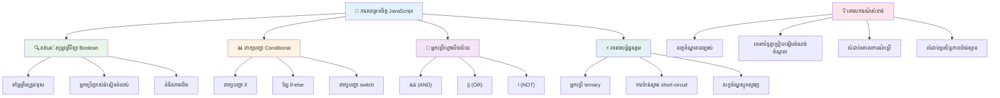
---

## 🚀 បញ្ជីព្រឹត្តិការណ៍ចំណេះដឹងក្នុងការសម្រេចចិត្ត JavaScript របស់អ្នក

### ⚡ **អ្វីដែលអ្នកអាចធ្វើបានក្នុង 5 នាទីក្រោយ**
- [ ] អនុវត្តប្រតិបត្តិការ​ប្រស់ភាគនៅក្នុងកុងសូលរុករករបស់អ្នក
- [ ] សរសេរប្រយោគ if-else សាមញ្ញដើម្បីភាសិតអាយុរបស់អ្នក
- [ ] សាកល្បងបញ្ហាចម្រុះ៖ សរសេរឡើងវិញ if-else ដោយប្រើប្រតិបត្តិការ ternary
- [ ] សាកល្បងវ៉ាន់តម្លៃ "truthy" និង "falsy" ផ្សេងៗគ្នា

### 🎯 **អ្វីដែលអ្នកអាចសម្រេចបានក្នុងមួយម៉ោងនេះ**
- [ ] បញ្ចប់កម្រងប្រលងបន្ទាប់ម៉ោងសិក្សា និងពិនិត្យវិធីសាស្ត្រដែលមិនច្បាស់
- [ ] សង់កម្មវិធីគណនាពិន្ទុស្មុគស្មាញពីបញ្ហា GitHub Copilot
- [ ] បង្កើតដើមឈើសម្រេចចិត្តសាមញ្ញសម្រាប់ស្ថានการณ์ពិត (ដូចជា ជ្រើសរើសអ្វីពាក់)
- [ ] អនុវត្តការរួមបញ្ចូលលក្ខខ័ណ្ឌជាច្រើនជាមួយប្រតិបត្តិការ​ត្រឹមត្រូវ​ទាំងស្រុង
- [ ] សាកល្បងប្រយោគ switch សម្រាប់ករណីប្រើប្រាស់ផ្សេងៗ

### 📅 **ការរីកចម្រើនជំនាញផ្នែកណែនាំតំណាលរយ:សប្តាហ៏**
- [ ] បញ្ចប់កិរិយាសព្ទក្នុងកិច្ចការជាមួយឧទាហរណ៍ច្នៃប្រឌិត
- [ ] សង់កម្មវិធីប្រលងតូចដោយប្រើរចនាសម្ព័ន្ធលក្ខខ័ណ្ឌផ្សេងៗ
- [ ] បង្កើតកម្មវិធីផ្ទៀងផ្ទាត់បែបបទដែលបានត្រួតពិនិត្យលក្ខខ័ណ្ឌច្រើន
- [ ] អនុវត្តលំហាត់ Josh Comeau [operator lookup](https://joshwcomeau.com/operator-lookup/)
- [ ] បញ្ចេញកូដដែលមានស្រាប់ទៅប្រើរចនាសម្ព័ន្ធលក្ខខណ្ឌដែលសមរម្យជាងនេះ
- [ ] អះអាងការវាយតម្លៃ short-circuit និងផលប៉ះពាល់លើកម្រិតប្រសិទ្ធភាព

### 🌟 **ការបម្លែងជំនាញក្នុងរយៈពេលមួយខែ**
- [ ] ជំនាញលក្ខខណ្ឌស្មុគស្មាញដែលស្ថិតនៅក្នុងគ្នា និងរក្សាការអានបានខាងក្នុងកូដ
- [ ] សង់កម្មវិធីដោយប្រើតារាងសម្រេចចិត្តដ៏ប្រសើរណាស់
- [ ] មានការរួមចំណែកលើប្រភពបើកប្រើដោយកែលម្អលក្ខខណ្ឌសម្រេចចិត្តនៅក្នុងគម្រោងស្រាប់
- [ ] បង្រៀនអ្នកដទៃអំពីរចនាសម្ព័ន្ធលក្ខខណ្ឌគ្រប់ប្រភេទ និងពេលវេលាដែលត្រូវប្រើប្រាស់
- [ ] ស្វែងយល់ពីវិធីសាស្ត្រកម្មវិធីមុខងារសម្រាប់លក្ខខណ្ឌសម្រេចចិត្ត
- [ ] បង្កើតមគ្គុទេសក៍ផ្ទាល់ខ្លួនសម្រាប់លក្ខខណ្ឌល្អបំផុត

### 🏆 **ការត្រួតពិនិត្យជើងឯកផ្នែកសម្រេចចិត្តចុងក្រោយ**

**អបអរសាទរជំនាញគិតផ្លូវយុតិ្តសាស្ត្រ​របស់អ្នក៖**
- តើលក្ខខណ្ឌសម្រេចចិត្តដ៏ស្មុគស្មាញបំផុតដែលអ្នកបានអនុវត្តជោគជ័យគឺអ្វី?
- តើរចនាសម្ព័ន្ធលក្ខខណ្ឌណាដែលអ្នកមានអារម្មណ៍ថាធម្មតាជាងគេហើយហេតុអ្វី?
- តើការស្វែងយល់អំពីប្រតិបត្តិការ​ត្រឹមត្រូវ​ទាំងស្រុងបានផ្លាស់ប្តូរយុទ្ធសាស្ត្រដោះស្រាយបញ្ហារបស់អ្នកយ៉ាងដូចម្តេច?
- តើកម្មវិធីពិតប្រាកដណាដែលនឹងទទួលបានអត្ថប្រយោជន៍ពីលក្ខខណ្ឌសម្រេចចិត្តលំអិត?

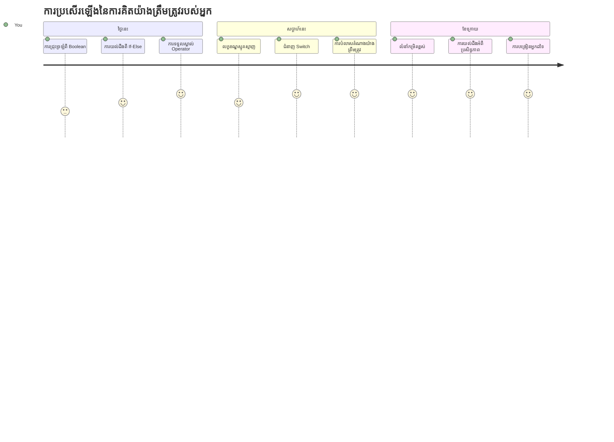
> 🧠 **អ្នកបានសម្រេចជំនាញស្នាដៃនៃការសម្រេចចិត្តឌីជីថលរួចរាល់!** កម្មវិធីអន្តរកម្មគ្រប់ប្រភេទពឹងផ្អែកលើលក្ខខណ្ឌសម្រេចចិត្តដើម្បីឆ្លើយតបយ៉ាងមាន ចំណេះដឹងចំពោះសកម្មភាពអ្នកប្រើ និងលក្ខខណ្ឌផ្លាស់ប្តូរ។ ឥឡូវនេះ អ្នកយល់ពីរបៀបធ្វើឲ្យកម្មវិធីរបស់អ្នកគិត អះអាង និងជ្រើសរើសចម្លើយសមរម្យ។ មូលដ្ឋានយុទ្ធសាស្ត្រនេះ នឹងជាជំនួយដល់កម្មវិធីផ្លាស់ប្តូរបានគ្រប់ប្រភេទដែលអ្នកបង្កើត! 🎉

---

<!-- CO-OP TRANSLATOR DISCLAIMER START -->
**ការរក្សាសិទ្ធិមិនទទួលខុសត្រូវ**៖  
ឯកសារនេះត្រូវបានបកប្រែដោយប្រើសេវាកម្មបកប្រែ AI [Co-op Translator](https://github.com/Azure/co-op-translator)។ ខណៈពេលដែលយើងខំប្រឹងប្រែងសំរាប់ភាពត្រឹមត្រូវ សូមយល់ថាការបកប្រែដោយស្វ័យប្រវត្តិនេះអាចមានកំហុសឬភាពមិនត្រឹមត្រូវបាន។ ឯកសារដើមក្នុងភាសាពុម្ពដើមគួរត្រូវបានគេពិចារណាថាជាផ្លូវការផ្ទាល់។ សម្រាប់ព័ត៌មានសំខាន់ៗ ការបកប្រែដោយមនុស្សជំនាញត្រូវបានផ្តល់អនុសាសន៍។ យើងមិនទទួលខុសត្រូវចំពោះការយល់ច្រឡំនោះ ឬការបកប្រែខុសក្នុងការប្រើប្រាស់បកប្រែនេះឡើយ។
<!-- CO-OP TRANSLATOR DISCLAIMER END -->