# មូលដ្ឋាន JavaScript៖ អារេ និង លូប

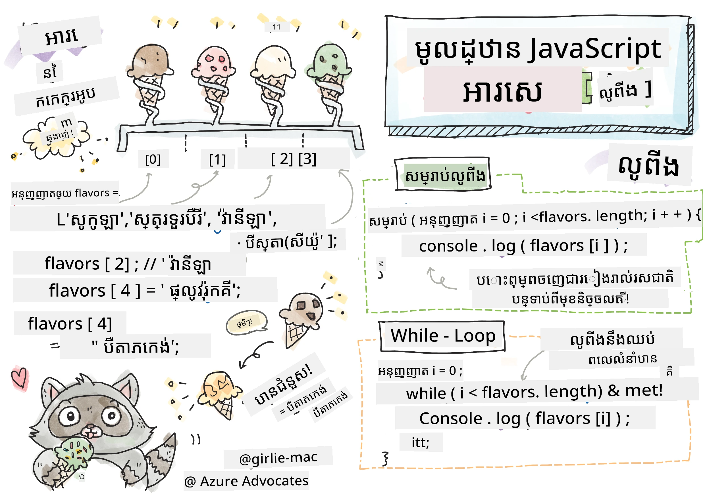
> Sketchnote ដោយ [Tomomi Imura](https://twitter.com/girlie_mac)

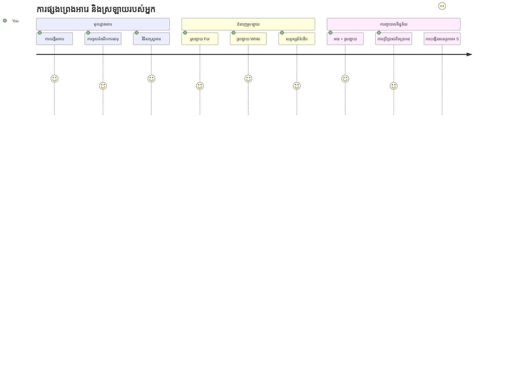
## ប្រឡងមុនមេរៀន
[ប្រឡងមុនមេរៀន](https://ff-quizzes.netlify.app/web/quiz/13)

ធ្លាប់សួរថាតើវេបសាយទទួលរងការតាមដានឥវ៉ាន់ក្នុងរទេះទិញ ផើយបង្ហាញបញ្ជីមិត្តរបស់អ្នកយ៉ាងដូចម្តេច? នេះជាកន្លែងដែលអារេ និងលូបចូលរួម។ អារេដូចជា​កុងតឺន័រឌីជីថល​ដែលរក្សាព័ត៌មានច្រើនជាផ្នែកក្នុងការផ្ទុក ខណៈដែលលូបអនុញ្ញាតឱ្យអ្នកដំណើរការព័ត៌មានទាំងនោះបានយ៉ាងមានប្រសិទ្ធិភាពដោយមិនចាំបាច់ប្រើកូដដែលស្ទ repetitiously។

ម្នាក់ និងម្នាក់ ការយល់ដឹងទាំងពីរនេះបង្កើតមូលដ្ឋានសម្រាប់ដំណើរការព័ត៌មាននៅក្នុងកម្មវិធីរបស់អ្នក។ អ្នកនឹងរៀនពីការបញ្ជាក់ឲ្យមានជំហានដោយដៃជាក្នុងមួយទៅបង្កើតកូដដ៏ឆ្លាត វាងាយស្រួលដែលអាចដំណើរការឥវ៉ាន់រាប់រយ ឬរងរយរាប់ពាន់យ៉ាងលឿន។

នៅចុងបញ្ចប់មេរៀននេះ អ្នកនឹងយល់ពីរបៀបធ្វើការងារដំណើរការព័ត៌មានស្មុគស្មាញជាមួយអ្នកគឺតែប៉ុន្មានបន្ទាត់កូដក៏បាន។ ចូររុករកមើលគំនិតសំខាន់ៗនៃកម្មវិធីនេះ។

[](https://youtube.com/watch?v=1U4qTyq02Xw "Arrays")

[](https://www.youtube.com/watch?v=Eeh7pxtTZ3k "Loops")

> 🎥 ចុចរូបភាពខាងលើសម្រាប់វីដេអូអំពីអារេ និងលូប។

> អ្នកអាចយកមេរៀននេះនៅលើ [Microsoft Learn](https://docs.microsoft.com/learn/modules/web-development-101-arrays/?WT.mc_id=academic-77807-sagibbon)!

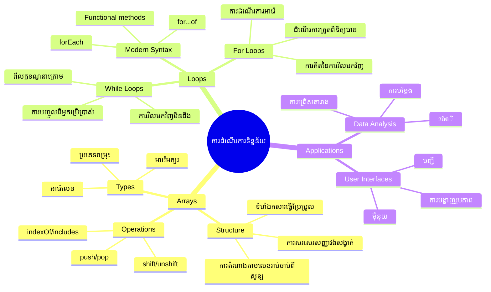
## អារេ

គិតថាអារេដូចជាកាប៊ីណែតលំដាប់ឯកសារ​ - មិនមែនផ្ទុកឯកសារតែមួយក្នុងលាភីមួយទេ ប៉ុន្តែអ្នកអាចរៀបចំអំពីវត្ថុជាច្រើនដែលទាក់ទងគ្នានៅក្នុងកុងតឺន័រតែមួយមានរចនាសម្ព័ន្ធ។ ក្នុងភាសាកម្មវិធី អារេចាំបាច់ឱ្យអ្នករក្សាព័ត៌មានជាច្រើននៅក្នុងកញ្ចប់មួយដែលបានរៀបចំ។

មិនថាអ្នកកំពុងបង្កើតវិទ្យាល័យរូបថត ជាមួយគ្រប់គ្រងបញ្ជីត្រូវធ្វើ ឬតាមដានពិន្ទុខ្ពស់នៅក្នុងហ្គេម អារេផ្តល់មូលដ្ឋានសម្រាប់ការរៀបចំព័ត៌មាន។ មកមើលរបៀបដែលវាដំណើរការរួមគ្នា។

✅ អារេមាននៅជុំវិញយើងទាំងអស់! តើអ្នកអាចគិតឧទាហរណ៍ជាក់ស្តែងនៃអារេក្នុងជីវិតពិត ដូចជា អារេផ្ទាល់បូស្ម័នពន្លឺដោយថ្ងៃទេ?

### ការបង្កើតអារេ

ការបង្កើតអារេគឺមិនស្មុគស្មាញទេ - គ្រាន់តែប្រើក្រឡាចត្រង្គស្នើរសុីតោះ!

```javascript
// អារ៉េទទេ - ដូចជារទេះទិញទំនិញទទេដែលកំពុងរង់ចាំធាតុ
const myArray = [];
```

**កើតអ្វីកាន់តែមាននៅទីនេះ?**
អ្នកទើបបង្កើតធុងទទេមួយដោយប្រើក្រឡាចត្រង្គស្នើរសុីត `[]`។ គិតថាវាដូចជាលីបារីទទេមួយ - វាបានត្រៀមខ្លួនទុកសម្រាប់ផ្ទុកសៀវភៅណាមួយដែលអ្នកចង់រៀបចំ។

អ្នកក៏អាចបញ្ចូលតម្លៃដើមទៅក្នុងអារេរបស់អ្នកតាំងពីដើមចាប់ផ្ដើមផងដែរ:

```javascript
// មឺនុយរសជាតិកាតឃ្លីមរបស់ហាងអ្នក
const iceCreamFlavors = ["Chocolate", "Strawberry", "Vanilla", "Pistachio", "Rocky Road"];

// ព័ត៌មានប្រវត្តិរូបអ្នកប្រើ (លាយបញ្ចូលប្រភេទទិន្នន័យខុសៗគ្នា)
const userData = ["John", 25, true, "developer"];

// ពិន្ទុការប្រលងសម្រាប់ថ្នាក់ដែលអ្នកចូលចិត្តបំផុត
const scores = [95, 87, 92, 78, 85];
```

**រឿងគួរអោយចាប់អារម្មណ៍:**
- អ្នកអាចរក្សាទុកអត្ថបទ លេខ ឬតម្លៃពិត/មិនពិតក្នុងអារេដូចគ្នា
- គ្រាន់តែបំបែកមួយមុខជាមួយក្បៀស - ងាយស្រួល!
- អារេល្អឥតខ្ចោះសម្រាប់រក្សាព័ត៌មានដែលទាក់ទងគ្នារួមគ្នា

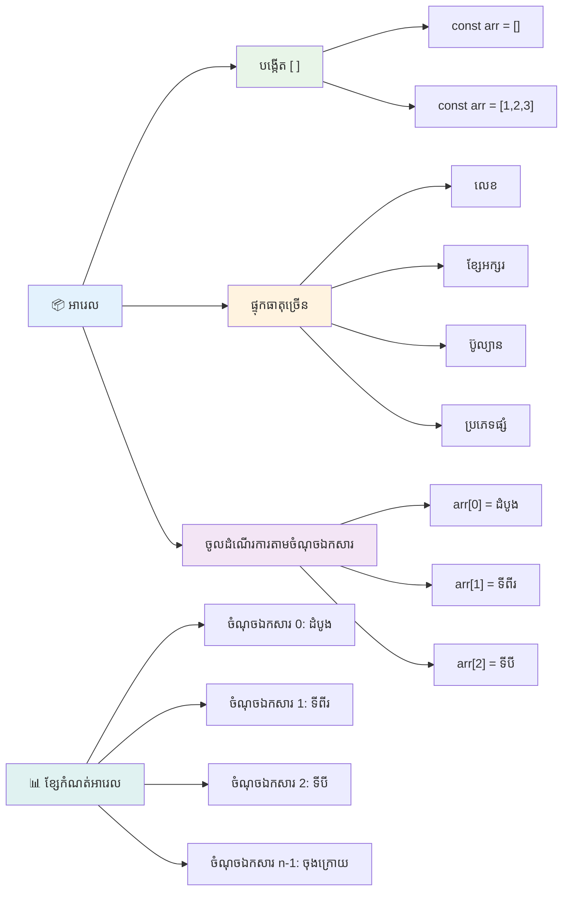
### ការចុះបញ្ជីអារេ (Array Indexing)

មានរឿងមួយដែលអាចមើលទៅអស្ចារ្យនៅដំបូង៖ អារេលេខកំណត់វត្ថុរបស់ខ្លួនចាប់ពីលេខ 0 មិនមែន 1ទេ។ ការចុះបញ្ជីពីសូន្យនេះមានដើមណែនាំមកពីរបៀបដោយស្មារតីសម្ភារៈកុំព្យូទ័រ ដូច្នេះវាជាប្រព័ន្ធមួយក្នុងភាសាកម្មវិធីចាស់ដូចជា C។ ទីតាំងនីមួយៗនៅក្នុងអារែមានលេខលំដាប់ហៅថា **index**។

| លេខសន្ទស្សន៍ | តម្លៃ | ការពិពណ៌នា |
|-------|-------|-------------|
| 0 | "Chocolate" | ធាតុទីមួយ |
| 1 | "Strawberry" | ធាតុទីពីរ |
| 2 | "Vanilla" | ធាតុទីបី |
| 3 | "Pistachio" | ធាតុទីបួន |
| 4 | "Rocky Road" | ធាតុទីប្រាំ |

✅ តើវាអោយការភ្ញាក់ផ្អើលផងដែរទេថាអារេចាប់ផ្តើមពីលេខសន្ទស្សន៍សូន្យ? ក្នុងភាសាកម្មវិធីខ្លះៗ លេខសន្ទស្សន៍ចាប់ផ្តើមពី 1។ មានប្រវត្តិសាស្ត្រដែលគួរឱ្យចាប់អារម្មណ៍លើរឿងនេះ ដែលអ្នកអាច[អាននៅ Wikipedia](https://en.wikipedia.org/wiki/Zero-based_numbering)។

**ការចូលប្រើធាតុអារេ៖**

```javascript
const iceCreamFlavors = ["Chocolate", "Strawberry", "Vanilla", "Pistachio", "Rocky Road"];

// ទទួលបានធាតុមួយៗដោយប្រើកន្សោមបន្ទទែន
console.log(iceCreamFlavors[0]); // "Chocolate" - ធាតុទីមួយ
console.log(iceCreamFlavors[2]); // "Vanilla" - ធាតុទីបី
console.log(iceCreamFlavors[4]); // "Rocky Road" - ធាតុចុងក្រោយ
```

**បំបែកអ្វីកើតឡើងទីនេះ៖**
- **ប្រើ**ក្រឡាចត្រង្គស្នើរសុីតជាមួយលេខសន្ទស្សន៍ដើម្បីចូលប្រើធាតុ
- **ត្រឡប់**តម្លៃដែលបានរក្សាទុកនៅទីតាំងជាក់លាក់នោះ
- **ចាប់ផ្តើម**រាប់ពី 0 ធ្វើឱ្យធាតុទីមួយគឺលេខសន្ទស្សន៍ 0

**កែប្រែធាតុអារេ៖**

```javascript
// ប្ដូរតម្លៃដែលមានស្រាប់
iceCreamFlavors[4] = "Butter Pecan";
console.log(iceCreamFlavors[4]); // "ប៊ឺទឺពេកិន"

// បន្ថែមធាតុថ្មីនៅចុងបញ្ចប់
iceCreamFlavors[5] = "Cookie Dough";
console.log(iceCreamFlavors[5]); // "ម៉ាននំប័ុង"
```

**នៅលើនេះ យើងបាន៖**
- **កែប្រែ**ធាតុទី ៤ ពី "Rocky Road" ទៅជា "Butter Pecan"
- **បន្ថែម**ធាតុថ្មី "Cookie Dough" នៅលេខសន្ទស្សន៍ ៥
- **ពង្រីក**ប្រវែងអារេដោយស្វ័យប្រវត្តិពេលបន្ថែមឥវ៉ាន់លើសដែនកំណត់បច្ចុប្បន្ន

### ប្រវែងអារេ និងវិធីសាស្រ្តទូទៅ

អារេមានគុណលក្ខណៈ និងវិធីសាស្រ្តក្នុងស្រោចស្រង់ដែលធ្វើឱ្យការងារជាមួយទិន្នន័យកាន់តែងាយស្រួល។

**រកប្រវែងអារេ៖**

```javascript
const iceCreamFlavors = ["Chocolate", "Strawberry", "Vanilla", "Pistachio", "Rocky Road"];
console.log(iceCreamFlavors.length); // 5

// ប្រវែងអាប់ដេតដោយស្វ័យប្រវត្តិពេលម៉ាស៊ីនធាតុតំបន់មានការផ្លាស់ប្តូរ
iceCreamFlavors.push("Mint Chip");
console.log(iceCreamFlavors.length); // 6
```

**ចំណុចសំខាន់ត្រូវចងចាំ៖**
- **ត្រឡប់**ចំនួនធាតុសរុបដែលមានក្នុងអារេ
- **ធ្វើបច្ចុប្បន្នភាព**ដោយស្វ័យប្រវត្តិពេលបន្ថែម ឬដកធាតុចេញ
- **ផ្តល់**ការរាប់មានភាពដំណើរការសម្រាប់លូប ហើយក៏ដើម្បីធ្វើត្រួតពិនិត្យក៏បាន

**វិធីសាស្ត្រអារេសំខាន់ៗ៖**

```javascript
const fruits = ["apple", "banana", "orange"];

// បន្ថែមធាតុ
fruits.push("grape");           // បន្ថែមទៅចុងក្រោយៈ ["apple", "banana", "orange", "grape"]
fruits.unshift("strawberry");   // បន្ថែមទៅដើមៈ ["strawberry", "apple", "banana", "orange", "grape"]

// លុបធាតុ
const lastFruit = fruits.pop();        // លុប និងត្រឡប់ "grape"
const firstFruit = fruits.shift();     // លុប និងត្រឡប់ "strawberry"

// ស្វែងរកធាតុ
const index = fruits.indexOf("banana"); // ត្រឡប់ 1 (ទីតាំងនៃ "banana")
const hasApple = fruits.includes("apple"); // ត្រឡប់ true
```

**យល់ដឹងពីវិធីសាស្ត្រទាំងនេះ៖**
- **បន្ថែម**ធាតុជាមួយ `push()` (ចុង) និង `unshift()` (ដើម)
- **ដក**ធាតុជាមួយ `pop()` (ចុង) និង `shift()` (ដើម)
- **ស្វែងរក**ធាតុជាមួយ `indexOf()` និងពិនិត្យវត្តមានជាមួយ `includes()`
- **ត្រឡប់**តម្លៃដែលមានប្រយោជន៍ដូចជាធាតុដែលបានដកចេញ ឬលេខសន្ទស្សន៍

✅ អ្នកអាចសាកល្បងដោយខ្លួនឯង! ប្រើ console របស់កម្មវិធីbrowser របស់អ្នកដើម្បីបង្កើត និងដំណើរការអារេដែលបានបង្កើតដោយអ្នក។

### 🧠 **ការត្រួតពិនិត្យមូលដ្ឋានអារេ៖ រៀបចំទិន្នន័យរបស់អ្នក**

**សាកល្បងសម្គាល់ការយល់ដឹងអារេរបស់អ្នក៖**
- ហេតុអ្វីបានជា​អារេចាប់ផ្តើមរាប់ពី 0 មិនមែន 1?
- តើមានអ្វីកើតឡើង ប្រសិនបើអ្នកព្យាយាមចូលទៅកាន់លេខសន្ទស្សន៍ដែលមិនមាន (ដូចជា `arr[100]` ក្នុងអារេមាន 5 ធាតុ)?
- តើអ្នកអាចគិតឧទាហរណ៍ជីវិតពិត ៣ករណី ដែលអារេអាចមានប្រយោជន៍?

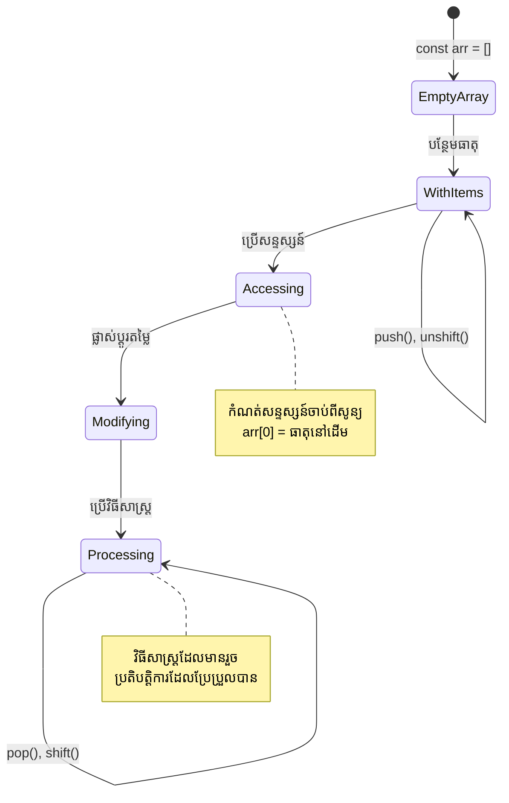
> **ព័ត៌មានជីវិតពិត**៖ អារេមាននៅគ្រប់កន្លែងក្នុងកម្មវិធី! បណ្ដាញសង្គម រទេះទិញ រូបថត វិនិយោគបទចំរៀង - ទាំងអស់គឺជាអារេសម្រាប់សំរាប់ខាងក្រោយ។

## លូប

គិតថាការផ្តាកាសកម្មទណ្ឌ្យគឺពីរឿង Charles Dickens ដែលសិស្សានុសិស្សត្រូវសរសេររៀងរាល់លំនាំតែម្តង លូបគឺដូចជាមនុស្សជំនួយរហ័សតែមិនធុញទ្រាន់ដែលអាចធ្វើការលើសកម្មភាពមិនល្អ ។ មិនថាអ្នកត្រូវពិនិត្យមើលរាល់វត្ថុក្នុងរទេះទិញ ឬបង្ហាញរូបថតទាំងអស់នៅក្នុងអាល់ប៊ុម លូបអាចដំណើរការការស្ទ 반복បានយ៉ាងមានប្រសិទ្ធិភាព។

JavaScript ផ្តល់លូបមួយចំនួនដែលអ្នកអាចជ្រើសបាន។ មកពិនិត្យមើលមួយៗ ហើយយល់ពីពេលណាអាចប្រើពួកវា។

```mermaid
flowchart TD
    A["🔄 ប្រភេទ Loop"] --> B["For Loop"]
    A --> C["While Loop"]
    A --> D["For...of Loop"]
    A --> E["វិធីសាស្រ្ត forEach"]
    
    B --> B1["កំណត់ចំនួន iteration"]
    B --> B2["អាស្រ័យលើរោទ៍រាប់"]
    B --> B3["for(init; condition; increment)"]
    
    C --> C1["ចំនួន iteration មិនដឹង"]
    C --> C2["អាស្រ័យលើលក្ខខណ្ឌ"]
    C --> C3["while(condition)"]
    
    D --> D1["ES6+ ទាន់សម័យ"]
    D --> D2[" iteration តារាង array"]
    D --> D3["for(item of array)"]
    
    E --> E1["រចនាប័ទ្មអនុគមន៍"]
    E --> E2["វិធីសាស្រ្តតារាង"]
    E --> E3["array.forEach(callback)"]
    
    F["⏰ ពេលណាប្រើ"] --> F1["For: រាប់, ធាតុ index"]
    F --> F2["While: បញ្ចូលអ្នកប្រើ, ស្វែងរក"]
    F --> F3["For...of: iteration សាមញ្ញ"]
    F --> F4["forEach: ការសរសេរកម្មវិធីមុខងារ"]
    
    style A fill:#e3f2fd
    style B fill:#e8f5e8
    style C fill:#fff3e0
    style D fill:#f3e5f5
    style E fill:#e0f2f1
    style F fill:#fce4ec
```
### លូប For

លូប `for` ដូចជាកំណត់ម៉ោង - អ្នកដឹងច្បាស់ពីចំនួនដងដែលអ្នកចង់អោយវាធ្វើ។ វាឈរជួរពិបាក និងអាចទុកចិត្តបាន ដែលធ្វើឲ្យវាល្អសម្រាប់អារេ ឬការរាប់របស់អ្នក។

**រចនាសម្ព័ន្ធលូប For៖**

| សមាសធាតុ | គោលបំណង | ឧទាហរណ៍ |
|-----------|---------|----------|
| **ការចាប់ផ្ដើម** | កំណត់ចំណុចចាប់ផ្ដើម | `let i = 0` |
| **លក្ខខណ្ឌ** | ពេលណាគេចន់ប្រកបដោយការបន្ត | `i < 10` |
| **ការកើនឡើង** | របៀបធ្វើបច្ចុប្បន្នភាព | `i++` |

```javascript
// ការរាប់ពី 0 ដល់ 9
for (let i = 0; i < 10; i++) {
  console.log(`Count: ${i}`);
}

// ឧទាហរណ៍ប្រសើរជាងនេះ: ការប្រតិបត្ដិការពិន្ទុ
const testScores = [85, 92, 78, 96, 88];
for (let i = 0; i < testScores.length; i++) {
  console.log(`Student ${i + 1}: ${testScores[i]}%`);
}
```

**ជំហាននីមួយៗកើតឡើងដូចខាងក្រោម៖**
- **ចាប់ផ្ដើម**ប៉ារ៉ាម៉ែត្រ `i` ទៅ 0 នៅដើម
- **ត្រួតពិនិត្យ**លក្ខខណ្ឌ `i < 10` មុនរាល់វដ្ត
- **អនុវត្ត**ប្លុកកូដនៅពេលលក្ខខណ្ឌត្រូវ
- **បន្ថែម** `i` អោយមាន +1 បន្ទាប់រាល់វដ្ត
- **បញ្ឈប់**ចំពោះពេលលក្ខខណ្ឌក្លាយទៅមិនត្រូវ (ពេល `i` ទៅដល់ 10)

✅ រត់កូដនេះក្នុង console តំណើរកម្មbrowser របស់អ្នក។ តើមានអ្វីកើតឡើងពេលអ្នកធ្វើការផ្លាស់ប្តូរតិចតួចលើកូដប្រដាប់រាប់ ភាពលក្ខខណ្ឌ ឬការបញ្ចូលវដ្ត? តើអ្នកអាចដាក់វាឡើងវិញចុះក្រោមដើម្បីបង្កើតការរាប់ចុះមួយទេ?

### 🗓️ **ការត្រួតពិនិត្យជំនាញលូប For៖ ការធ្វើម្តងជាលំដាប់**

**ប៉ាថ្មើរអ្នកយល់ដឹងលូប For៖**
- តើមានបីផ្នែកណាខ្លះក្នុងលូប for ហើយវាកំពុងធ្វើអ្វី?
- តើធ្វើដូចម្តេចដើម្បីលូបក្រឡាឡើងវិញលើអារេ?
- តើមានអ្វីកើតឡើង ប្រសិនបើអ្នកភ្លេចផ្នែកការកើនឡើង (`i++`)?

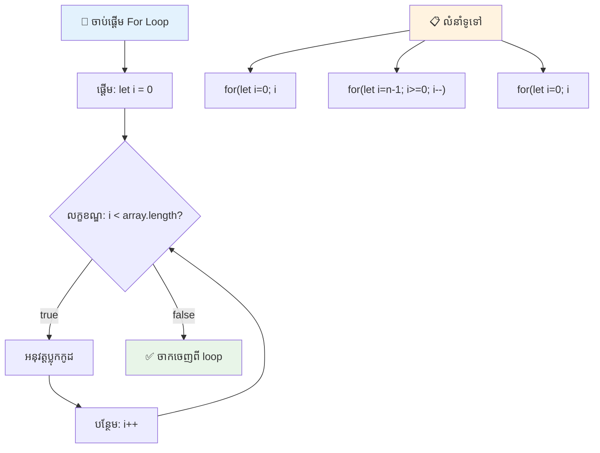
> **ប្រាជ្ញាលូប**៖ លូប for គឺល្អបំផុតនៅពេលដែលអ្នកដឹងច្បាស់ពីចំនួនដងដែលត្រូវធ្វើការ។
ពួកវាជាជម្រើសធម្មតាសម្រាប់ដំណើរការអារែ!

### លូប While

លូប `while` ដូចជាការបង្ហាញថា "បន្តធ្វើរហូត..." - អ្នកប្រហែលមិនដឹងច្បាស់ចំនួនដងដែលវានឹងដំណើរការ ប៉ុន្តែអ្នកដឹងពីពេលណាចប់។ វាល្អសម្រាប់ការស្នើសុំអតិថិជនដើម្បីបញ្ចូល ត្រូវបានជម្រះការស្វែងរកទិន្នន័យរហូតដល់អ្នករកឃើញអ្វីដែលត្រូវការ។

**លក្ខណៈលូប While៖**
- **បន្ត**អនុវត្តនៅពេលលក្ខខណ្ឌត្រូវ
- **ត្រូវការជាមួយ**ការគ្រប់គ្រងដៃលើអថេរ
- **ត្រួតពិនិត្យ**លក្ខខណ្ឌមុនរាល់វដ្ត
- **ចំណាំ**អាចបង្កការលូបគ្មានទីបញ្ចប់ ប្រសិនបើលក្ខខណ្ឌមិនធ្លាប់មិនត្រូវ

```javascript
// ឧទាហរណ៍រាប់មូលដ្ឋាន
let i = 0;
while (i < 10) {
  console.log(`While count: ${i}`);
  i++; // កុំភ្លេចបន្ថែម!
}

// ឧទាហរណ៍ជាក់ស្តែងបន្ថែម៖ ការប្រែប្រួលនៃការបញ្ចូលរបស់អ្នកប្រើ
let userInput = "";
let attempts = 0;
const maxAttempts = 3;

while (userInput !== "quit" && attempts < maxAttempts) {
  userInput = prompt(`Enter 'quit' to exit (attempt ${attempts + 1}):`);
  attempts++;
}

if (attempts >= maxAttempts) {
  console.log("Maximum attempts reached!");
}
```

**យល់ដឹងពីឧទាហរណ៍ទាំងនេះ៖**
- **គ្រប់គ្រង**អថេរ `i` ដោយដៃនៅក្នុងខ្លួនលូប
- **បន្ថែម**អថេរ ដើម្បីបញ្ឈប់លូបគ្មានទីបញ្ចប់
- **បង្ហាញ**ករណីប្រើប្រាស់ជាក់ស្តែងជាមួយបញ្ចូល និងកំណត់ការព្យាយាម
- **រួមមាន**មធ្យោបាយសុវត្ថិភាពដើម្បីរារាំងកម្មវិធីដំណើរការអស់អ្នក

### ♾️ **ការត្រួតពិនិត្យប្រាជ្ញាលូប While៖ ការធ្វើស្ទ 반복ដោយលក្ខខណ្ឌ**

**សាកល្បងយល់ដឹងលូប while របស់អ្នក៖**
- តើគ្រោះថ្នាក់សំខាន់ៗនៅពេលប្រើលូប while មួយមានអ្វីខ្លះ?
- ពេលណាអ្នកជ្រើសរើសលូប while ទៅលើលូប for?
- តើអ្នកធ្វើដូចម្តេចដើម្បីទប់ស្កាត់លូបគ្មានទីបញ្ចប់?

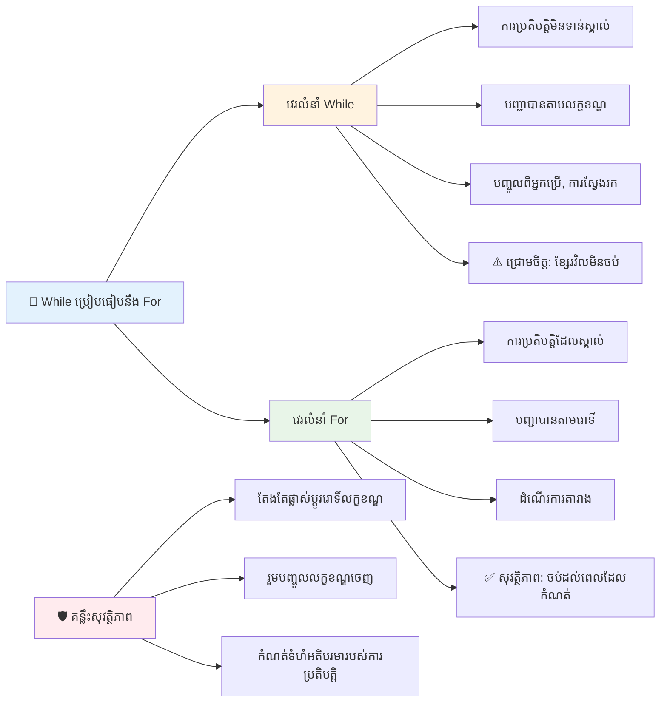
> **សុវត្ថិភាពជាមុនទាំងអស់**៖ លូប while មានកំលាំងតែត្រូវការគ្រប់គ្រងលក្ខខណ្ឌយ៉ាងប្រុងប្រយ័ត្ន។ តែងតែប្រាកដថាលក្ខខណ្ឌលូបនឹងក្លាយទៅមិនត្រឹមត្រូវជាវិញ!

### ជម្រើសលូបទំនើប

JavaScript ផ្ដល់សំណុំសមាសធាតុលូបទំនើបដែលលើកកម្ពស់ភាពងាយស្រួលអានកូដ និងកាត់បន្ថយកំហុស។

**លូប For...of (ES6+):**

```javascript
const colors = ["red", "green", "blue", "yellow"];

// វិធីសាស្ត្រ ఆధുനিক - ឆើតឆាយ និងមានសុវត្ថិភាព
for (const color of colors) {
  console.log(`Color: ${color}`);
}

// ប្រៀបធៀបជាមួយលូប for ប្រពៃណី
for (let i = 0; i < colors.length; i++) {
  console.log(`Color: ${colors[i]}`);
}
```

**អត្ថប្រយោជន៍សំខាន់នៃ for...of៖**
- **ដកចេញ**ការគ្រប់គ្រងលេខសន្ទស្សន៍ និងកំហុស off-by-one
- **ផ្តល់**ការចូលប្រើជាផ្ទាល់ទៅធាតុអារេ
- **ធ្វើឲ្យ**កូដអាចអានបានយ៉ាងច្បាស់ និងកាត់បន្ថយសមាសធាតុ

**វិធីសាស្ត្រ forEach៖**

```javascript
const prices = [9.99, 15.50, 22.75, 8.25];

// ការប្រើ forEach សម្រាប់រចនាសម្ព័ន្ធកម្មវិធីមុខងារ
prices.forEach((price, index) => {
  console.log(`Item ${index + 1}: $${price.toFixed(2)}`);
});

// forEach ជាមួយមុខងារ arrow សម្រាប់ប្រតិបត្តិការងារងាយៗ
prices.forEach(price => console.log(`Price: $${price}`));
```

**អ្វីដែលអ្នកត្រូវដឹងអំពី forEach ៖**
- **អនុវត្ត**មុខងារសម្រាប់ធាតុអារេលាក់មួយៗ
- **ផ្តល់**ទាំងតម្លៃធាតុ និងលេខសន្ទស្សន៍ជាប៉ារ៉ាម៉ែត្រ
- **មិនអាច**ដោះស្រាយឲ្យបញ្ឈប់មុនពេលកំណត់ (ខុសពីលូបបុរាណ)
- **ត្រឡប់** undefined (មិនបង្កើតអារេថ្មី)

✅ ហេតុអ្វីបានជា​អ្នកជ្រើសរើសលូប for សំរាប់លូប while? មានអ្នកទស្សនាជិត 17,000នាក់បានសួរចំលើយដែលត្រូវនៅហ្វុរុម StackOverflow ហើយខ្លះនៃមតិរបស់ពួកគេច្រើន [អាចជារឿងចាប់អារម្មណ៍សម្រាប់អ្នក](https://stackoverflow.com/questions/39969145/while-loops-vs-for-loops-in-javascript)។

### 🎨 **ការត្រួតពិនិត្យវប្បធម៍លូបទំនើប៖ ការទទួលស្គាល់ ES6+**

**វាយតម្លៃការយល់ដឹងរបស់អ្នកអំពី JavaScript ទំនើប៖**
- អត្ថប្រយោជន៍នៃ `for...of` និងលូប For​ បុរាណខុសគ្នា​យ៉ាងដូចម្តេច?
- ពេលណាអ្នកនៅតែចូលចិត្តលូប For បុរាណ?
- ភាពខុសគ្នារវាង `forEach` និង `map`?

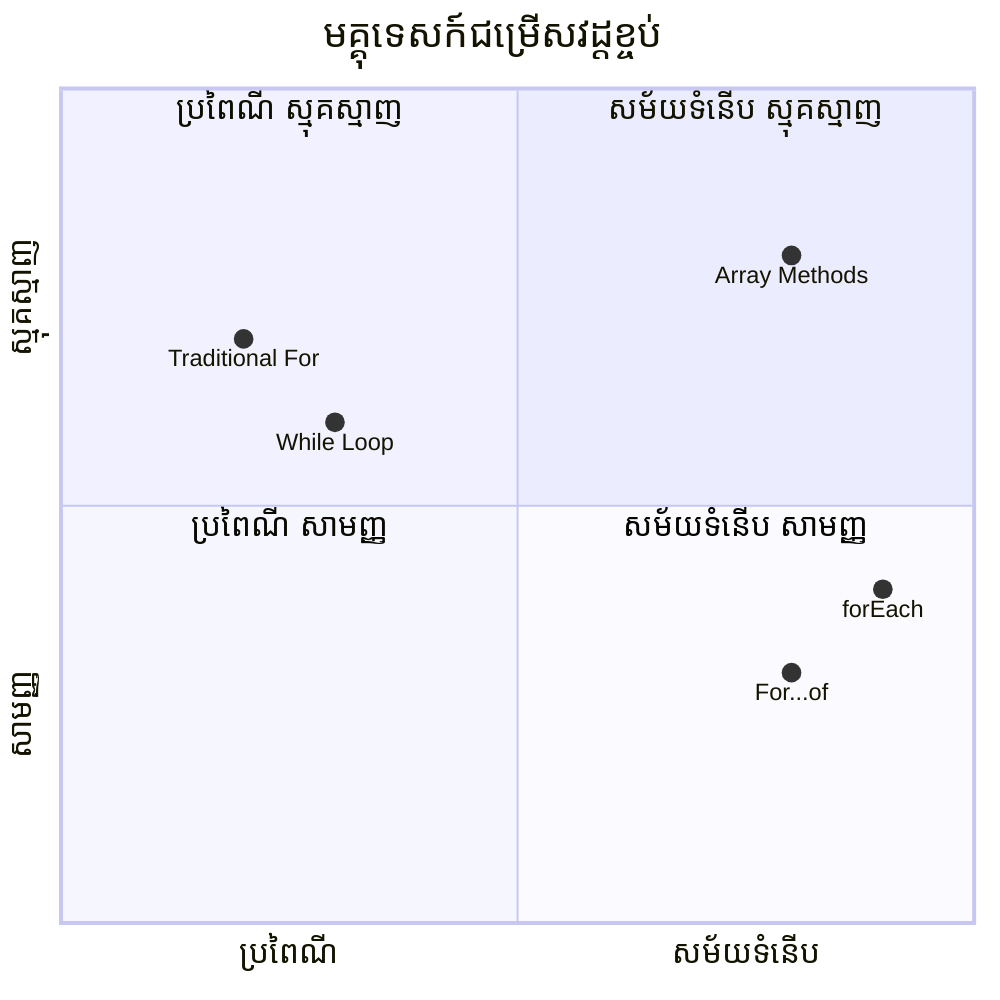
> **និន្នាការ​ទំនើប**៖ វិធីសាស្ត្រ ES6+ ដូចជា `for...of` និង `forEach` កំពុងក្លាយជាជម្រើសល្អបំផុតសម្រាប់ការធ្វើបង្រៀនអារេ ដោយសារត្រូវបានធ្វើឲ្យស្អាត និងកាត់បន្ថយកំហុស!

## លូប និង អារេ

ការចងក្រងអារេជាមួយឡូបបង្កើតសមត្ថភាពដំណើរការទិន្នន័យដ៏ឥតអូស។ ការចំណាយនេះជាសំបុត្រសម្រាប់មុខងារកម្មវិធីជាច្រើន ចាប់ពីបង្ហាញបញ្ជីទៅគណនស្ថិតិ។

**ការដំណើរការអារេប្រពៃណី៖**

```javascript
const iceCreamFlavors = ["Chocolate", "Strawberry", "Vanilla", "Pistachio", "Rocky Road"];

// វិធីសម្រាប់រំពេចប្រពៃណី
for (let i = 0; i < iceCreamFlavors.length; i++) {
  console.log(`Flavor ${i + 1}: ${iceCreamFlavors[i]}`);
}

// វិធីសម្រាប់...of សម្រាប់សម័យទំនើប
for (const flavor of iceCreamFlavors) {
  console.log(`Available flavor: ${flavor}`);
}
```

**យើងត្រូវយល់ពីមធ្យោបាយនីមួយៗ៖**
- **ប្រើ**គុណលក្ខណៈប្រវែងអារេដើម្បីកំណត់ដែនកំណត់លូប
- **ចូលទៅកាន់**ធាតុតាមលេខសន្ទស្សន៍នៅក្នុងលូប for តាមបែបប្រពៃណី
- **ផ្តល់**ការចូលប្រើធាតុដោយផ្ទាល់ ក្នុងលូប for...of
- **ដំណើរការ**ធាតុអារេខ្លួនគ្រប់យ៉ាងតែម្តង

**ឧទាហរណ៍ការដំណើរការទិន្នន័យប្រើប្រាស់៖**

```javascript
const studentGrades = [85, 92, 78, 96, 88, 73, 89];
let total = 0;
let highestGrade = studentGrades[0];
let lowestGrade = studentGrades[0];

// ដំណើរការពីរាល់ថ្នាក់ជាមួយរង្វិលតែមួយ
for (let i = 0; i < studentGrades.length; i++) {
  const grade = studentGrades[i];
  total += grade;
  
  if (grade > highestGrade) {
    highestGrade = grade;
  }
  
  if (grade < lowestGrade) {
    lowestGrade = grade;
  }
}

const average = total / studentGrades.length;
console.log(`Average: ${average.toFixed(1)}`);
console.log(`Highest: ${highestGrade}`);
console.log(`Lowest: ${lowestGrade}`);
```

**របៀបកូដនេះដំណើរការ៖**
- **ចាប់ផ្ដើម**អថេរតាមដានសម្រាប់ចំនួនសរុប និងតម្លៃខ្ពស់ទាប
- **ដំណើរការ**រៀងរាល់ពិន្ទុជាមួយលូបមានប្រសិទ្ធិភាព
- **បូកសរុប**សម្រាប់គណនាមធ្យមពិន្ទុ
- **តាមដាន**តម្លៃខ្ពស់ និងទាបក្នុងការរុករក
- **គណនា**ស្ថិតិចុងក្រោយបន្ទាប់ពីចប់វដ្តលូប

✅ សាកល្បងដោយខ្លួនឯង ដំណើរការលូបលើអារែដែលអ្នកបង្កើតនៅក្នុង console browser របស់អ្នក។

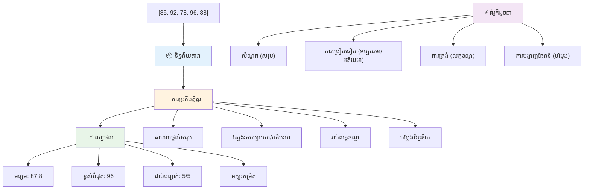
---

## ការប្រកួតប្រជែង​នៃ GitHub Copilot Agent 🚀

ប្រើម៉ូត Agent ដើម្បីបញ្ចប់បញ្ហារបស់ខាងក្រោម៖

**ការពិពណ៌នា៖** បង្កើតមុខងារអនុវត្តការដំណើរការទិន្នន័យយ៉ាងទូលំទូលាយ ដែលចងក្រងអារេ និងលូប ដើម្បីវិភាគទិន្នន័យនិងបង្កើតមតិយោបល់មានន័យ។

**បញ្ជាក់៖** បង្កើតមុខងារមួយឈ្មោះ `analyzeGrades` ដែលទទួលអារែវត្ថុពិន្ទុសិស្ស (មានគ្រប់គ្រងកំណត់ឈ្មោះ និងពិន្ទុ) ហើយត្រឡប់វត្ថុមានស្ថិតិសម្រួល រួមមាន ពិន្ទុខ្ពស់បំផុត ពិន្ទុទាបបំផុត ពិន្ទុមធ្យម ចំនួនសិស្សដែលបានឆ្លង (ពិន្ទុ >= 70) និងអារែឈ្មោះសិស្សដែលពិន្ទុខ្ពស់ជាងមធ្យម។ ត្រូវប្រើលូបបែបខុសគ្នា យ៉ាងហោចណាស់ពីរក្នុងដំណោះស្រាយរបស់អ្នក។

សូមស្វែងយល់បន្ថែមអំពី [agent mode](https://code.visualstudio.com/blogs/2025/02/24/introducing-copilot-agent-mode) នៅទីនេះ។

## 🚀 ប្រកួតប្រជែង
JavaScript ផ្តល់ជូននូវវិធីសាស្រ្តស៊ីរីថ្មីជាច្រើនសម្រាប់អារ៉េដែលអាចជំនួសសម្រាប់ល៊ូបបុរាណសម្រាប់ភារកិច្ចជាក់លាក់។ សូមស្វែងយល់ពី [forEach](https://developer.mozilla.org/docs/Web/JavaScript/Reference/Global_Objects/Array/forEach), [for-of](https://developer.mozilla.org/docs/Web/JavaScript/Reference/Statements/for...of), [map](https://developer.mozilla.org/docs/Web/JavaScript/Reference/Global_Objects/Array/map), [filter](https://developer.mozilla.org/docs/Web/JavaScript/Reference/Global_Objects/Array/filter), និង [reduce](https://developer.mozilla.org/docs/Web/JavaScript/Reference/Global_Objects/Array/reduce)។ 

**ការប្រលងរបស់អ្នក៖** ធ្វើការកែប្រែឧទាហរណ៍ពិន្ទុនិស្សិតដោយប្រើយ៉ាងហោចណាស់វិធីសាស្រ្តអារ៉េបីប្រភេទផ្សេងគ្នា។ សម្គាល់មើលថាចូរលេខកូដមានភាពស្អាត និងអាចអានបានកាន់តែច្បាស់ជាមួយវេយ្យាករណ៍ JavaScript សម័យថ្មីយ៉ាងដូចម្តេច។

## ការប្រលងបន្ទប់សិក្សាបន្ទាប់
[Post-lecture quiz](https://ff-quizzes.netlify.app/web/quiz/14)


## ការពិនិត្យឡើងវិញ និងការសិក្សាគ្រាប់ខ្លួនឯង

អារ៉េនៅក្នុង JavaScript មានវិធីសាស្រ្តជាច្រើនភ្ជាប់ទៅមួួយដែលមានប្រយោជន៍ខ្លាំងសម្រាប់ការបំលែងទិន្នន័យ។ [អានអំពីវិធីសាស្រ្តទាំងនេះ](https://developer.mozilla.org/docs/Web/JavaScript/Reference/Global_Objects/Array) ហើយសាកល្បងខ្លះៗពីវាតាមករណីអារ៉េដែលអ្នកបង្កើត។

## ការងារ

[Loop an Array](assignment.md)

---

## 📊 **សង្ខេបឧបករណ៍អារ៉េ និងល៊ូបរបស់អ្នក**

```mermaid
graph TD
    A["🎯 ការជំនាញលើអារេ និងលីប"] --> B["📦 មូលដ្ឋានអារេ"]
    A --> C["🔄 ប្រភេទលីប"]
    A --> D["🔗 ការដំណើរការទិន្នន័យ"]
    A --> E["🎨 បច្ចេកទេសសម័យថ្មី"]
    
    B --> B1["បង្កើត: [ ]"]
    B --> B2["ការជ្រើសតំណាង: arr[0]"]
    B --> B3["វិធីសាស្ត្រ: push, pop"]
    B --> B4["គុណលក្ខណៈ: length"]
    
    C --> C1["For: ចំនួនលាមកាលបានកំណត់"]
    C --> C2["While: ដោយលក្ខខណ្ឌ"]
    C --> C3["For...of: ចូលដំណើរការត្រង់"]
    C --> C4["forEach: រាងមុខកម្មវិធី"]
    
    D --> D1["ការគណនាស្ថិតិ"]
    D --> D2["ការបម្លែងទិន្នន័យ"]
    D --> D3["ការត្រង់ និងស្វែងរក"]
    D --> D4["ការដំណើរការពេលជាក់ស្តែង"]
    
    E --> E1["មុខងារត្រង"]
    E --> E2["ការចងខ្សែវិធីសាស្ត្រ"]
    E --> E3["ការបំបែកសមាសធាតុ"]
    E --> E4["អក្សរគំរូ"]
    
    F["💡 អត្ថប្រយោជន៍សំខាន់"] --> F1["ការដំណើរការទិន្នន័យមានប្រសិទ្ធភាព"]
    F --> F2["កូដធ្វើឡើងថ្មីតិច"]
    F --> F3["ដំណោះស្រាយអាចពង្រីកបាន"]
    F --> F4["វេយ្យាករណ៍ស្អាត"]
    
    style A fill:#e3f2fd
    style B fill:#e8f5e8
    style C fill:#fff3e0
    style D fill:#f3e5f5
    style E fill:#e0f2f1
    style F fill:#fce4ec
```
---

## 🚀 រយៈពេលជំនាញអារ៉េ និងល៊ូបរបស់អ្នក

### ⚡ **អ្វីដែលអ្នកអាចធ្វើបានក្នុង ៥ នាទីក្រោយ**
- [ ] បង្កើតអារ៉េរបស់ភាពយន្តដែលអ្នកចូលចិត្ត និងចូលដល់ធាតុកដែលជាក់លាក់
- [ ] សរសេរល៊ូប for ដែលរាប់ពី 1 ដល់ 10
- [ ] សាកល្បងការប្រលងវិធីសាស្រ្តអារ៉េស៊ីរីសម័យថ្មីពីមេរៀន
- [ ] អនុវត្តលេខាំងអារ៉េក្នុងកម្មវិធីកុងសូលក្រវាត់អ្នករុករក

### 🎯 **អ្វីដែលអ្នកអាចសម្រេចបានក្នុងម៉ោងនេះ**
- [ ] បញ្ចប់ការប្រលងបន្ទាប់មកពីមេរៀន និងពិនិត្យឡើងវិញគំនិតដែលមានបញ្ហា
- [ ] បង្កើតកម្មវិធីវិភាគពិន្ទុសិក្សាដ៏ទូលំទូលាយពីការប្រលង GitHub Copilot
- [ ] បង្កើតរទេះទិញទំនិញធម្មតាមួយដែលបន្ថែមនិងដកធាតុ
- [ ] អនុវត្តការបម្លែងរវាងប្រភេទល៊ូបផ្សេងៗ
- [ ] សាកល្បងវិធីសាស្រ្តអារ៉េដូចជា `push`, `pop`, `slice`, និង `splice`

### 📅 **ដំណើរប្រតិបត្តិការដល់ទិន្នន័យរយៈសប្ដាហ៍របស់អ្នក**
- [ ] បញ្ចប់ភារកិច្ច "Loop an Array" ជាមួយការកែលម្អដើម្បីច្នៃប្រឌិត
- [ ] បង្កើតកម្មវិធីបញ្ជីកិច្ចការប្រើប្រាស់អារ៉េ និងល៊ូប
- [ ] បង្កើតកម្មវិធីគណនាតារាងសម្រាប់ទិន្នន័យចំនួន
- [ ] អនុវត្តជាមួយ [វិធីសាស្រ្តអារ៉េ MDN](https://developer.mozilla.org/docs/Web/JavaScript/Reference/Global_Objects/Array)
- [ ] បង្កើតផ្ទាំងរូបថតឬបញ្ជីចម្រៀង
- [ ] ស្វែងយល់កម្មវិធីសម្រាប់អនុគមន៍ `map`, `filter`, និង `reduce`

### 🌟 **ការបម្លែងរយៈខែរបស់អ្នក**
- [ ] ជំនាញលំអិតនៃប្រតិបត្តិការអារ៉េនិងការបង្កើនប្រសិទ្ធភាព
- [ ] បង្កើតផ្ទាំងបង្ហាញទិន្នន័យសរុប
- [ ] ចូលរួមគម្រោងកូដបើកដែលពាក់ព័ន្ធនឹងការប្រតិបត្តិការទិន្នន័យ
- [ ] បង្រៀនអ្នកផ្សេងទៀតអំពីអារ៉េ និងល៊ូបជាមួយឧទាហរណ៍ផ្សេងៗ
- [ ] បង្កើតបណ្ណាល័យផ្ទាល់ខ្លួននៃអនុគមន៍ប្រតិបត្តិការទិន្នន័យដែលអាចប្រើប្រាស់ឡើងវិញ
- [ ] ស្វែងយល់អាល់ហ្គរីធម៍ និងរចនាសម្ព័ន្ធទិន្នន័យដែលស្ថិតលើអារ៉េ

### 🏆 **ការត្រួតពិនិត្យជ័យលាភីប្រតិបត្តិការទិន្នន័យចុងក្រោយ**

**អបអរសាទរជំនាញអារ៉េ និងល៊ូបរបស់អ្នក៖**
- តើប្រតិបត្តិការអារ៉េណាមួយដែលមានប្រយោជន៍ខ្លាំងបំផុតដែលអ្នកបានរៀនសម្រាប់កម្មវិធីពិភពលោកពិតគឺអ្វី?
- តើប្រភេទល៊ូបណាមួយដែលអ្នកមានអារម្មណ៍ថាជាប្រភេទធម្មតាដែលមានគន្លងច្បាស់ និងហេតុអ្វី?
- តើការយល់ដឹងអំពីអារ៉េ និងល៊ូបបានផ្លាស់ប្តូរបទដ្ឋានរបស់អ្នកចំពោះការរៀបចំទិន្នន័យយ៉ាងដូចម្តេច?
- តើភារកិច្ចប្រតិបត្តិការទិន្នន័យស្មុគស្មាញណាមួយដែលអ្នកចង់អនុវត្តបន្ទាប់?

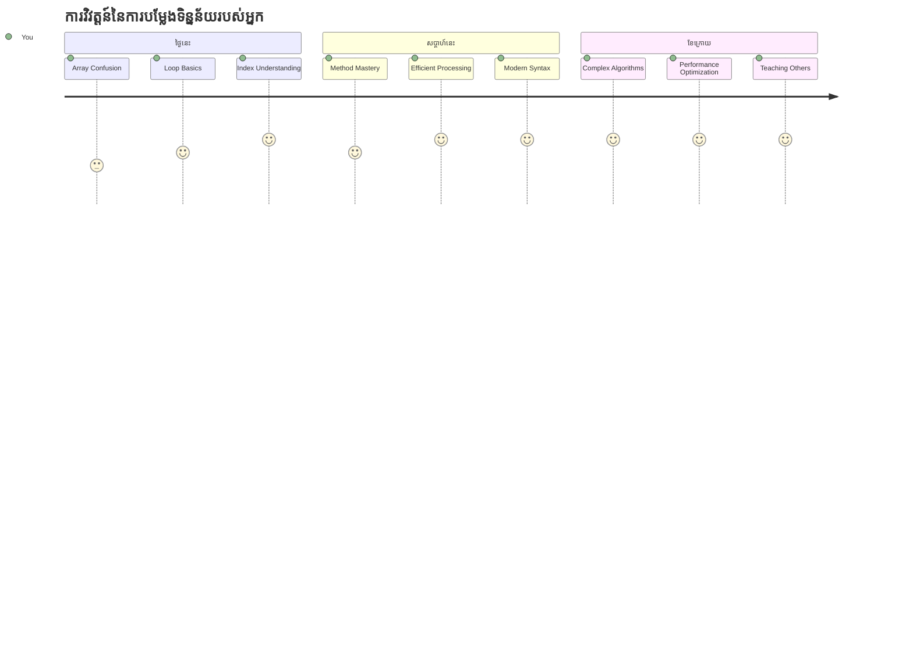
> 📦 **អ្នកបានដោះសោអំណាចនៃការរៀបចំ និងប្រតិបត្តិការទិន្នន័យ!** អារ៉េ និងល៊ូបគឺជាគ្រឹះនៃកម្មវិធីភាគច្រើនដែលអ្នកនឹងបង្កើតនៅពេលណាមួយ។ ចាប់ពីបញ្ជីសាមញ្ញទៅដល់ការវិភាគទិន្នន័យស្មុគស្មាញ អ្នកឥឡូវមានឧបករណ៍ដើម្បីដោះស្រាយព័ត៌មានដោយមានប្រសិទ្ធភាព និងអសកម្មភាព។ គេហទំព័រតក់សតពហុមុខងារ កម្មវិធីទូរស័ព្ទ និងកម្មវិធីដែលផ្អែកលើទិន្នន័យ គឺទាំងអស់ពឹងផ្អែកលើគំនិតមូលដ្ឋានទាំងនេះ។ ស្វាគមន៍ចូលកាន់ពិភពនៃការប្រតិបត្តិការទិន្នន័យដែលអាចពង្រីកបាន! 🎉

---

<!-- CO-OP TRANSLATOR DISCLAIMER START -->
**ការព្រមាន**៖  
ឯកសារនេះត្រូវបានបកប្រែដោយប្រើសេវាកម្មបកប្រែ AI [Co-op Translator](https://github.com/Azure/co-op-translator)។ ខណៈពេលដែលយើងខិតខំរកភាពត្រឹមត្រូវ សូមយល់ដឹងថាការបកប្រែដោយស្វ័យប្រវត្តិក្នុងខ្លះអាចមានកំហុសឬភាពមិនត្រឹមត្រូវ។ ឯកសារដើមដែលមានភាសារបស់វាគួរត្រូវបានគ្រប់គ្រងជាផ្លូវការជាទិន្នន័យគ្រឹះ។ សម្រាប់ព័ត៌មានសំខាន់ៗ ការបកប្រែដោយអ្នកជំនាញដែលជាមនុស្សត្រូវបានណែនាំ។ យើងមិនទទួលខុសត្រូវចំពោះការយល់ច្រឡំបញ្ចេញឆ្លងឆ្លើយ ឬការបកប្រែខុសដែលកើតឡើងពីការប្រើប្រាស់ការបកប្រែនេះទេ។
<!-- CO-OP TRANSLATOR DISCLAIMER END -->