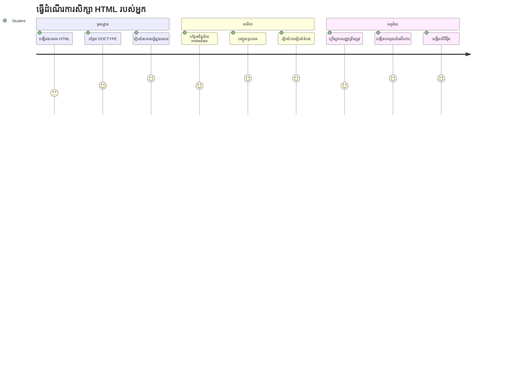
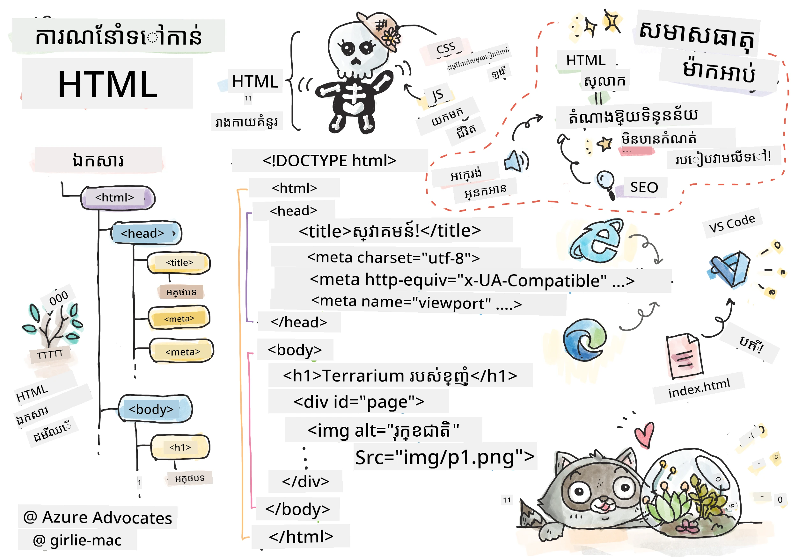
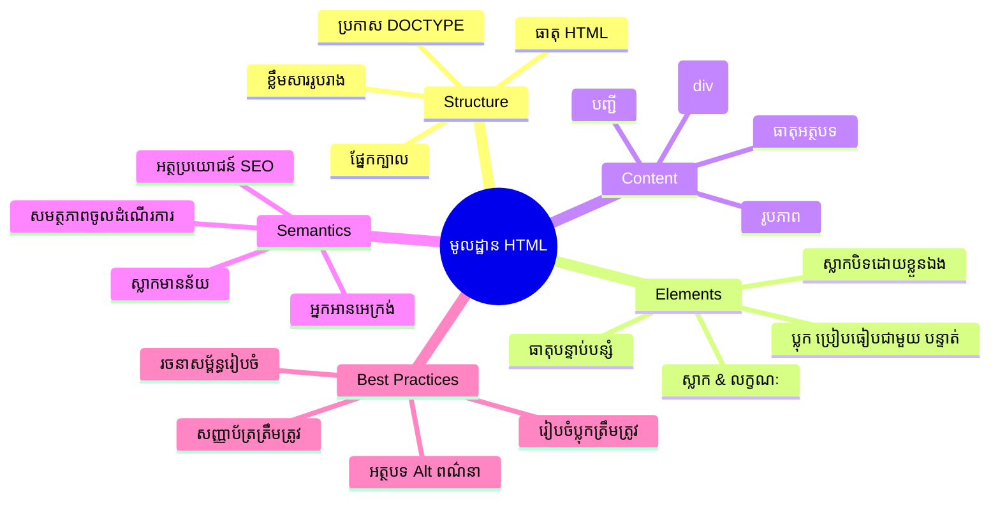
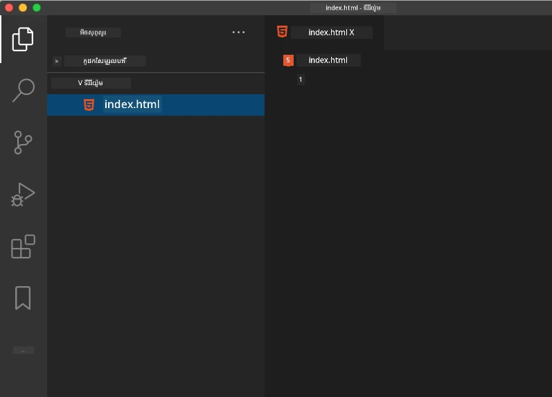
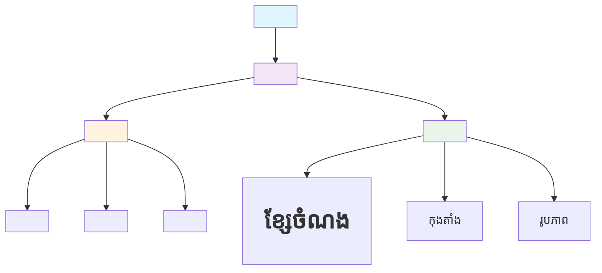
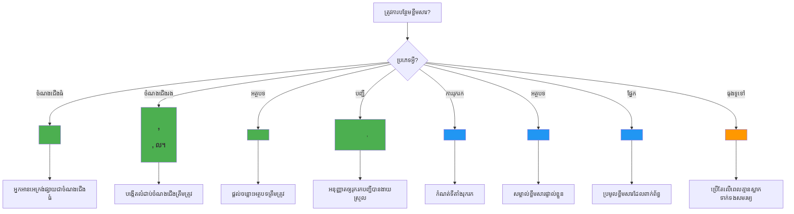
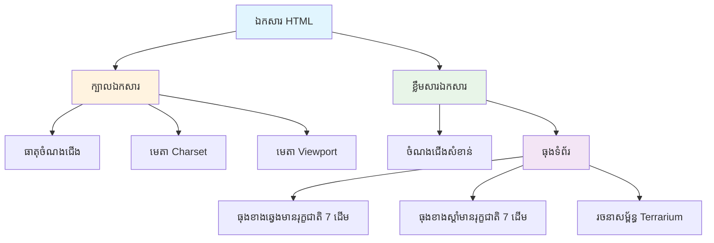

# គម្រោង Terrarium ផ្នែក ១៖ ការណែនាំអំពី HTML



> កំណត់ត្រាដោយ [Tomomi Imura](https://twitter.com/girlie_mac)

HTML ឬ HyperText Markup Language គឺជាគ្រឹះសម្រាប់គេហទំព័រទាំងអស់ដែលអ្នកធ្លាប់បានចូលស្វែងរក។ គិតពួកវា HTML ដូចជាខ្នងឆ្អឹងដែលផ្តល់រចនាសម្ព័ន្ធដល់ទំព័របណ្ដាញ – វាកំណត់កន្លែងដែលមាតិកាដាក់, របៀបដែលវាត្រូវបានរៀបចំ និងអ្វីដែលមួយៗតំណាងឲ្យ។ ខណៈដែល CSS នឹង "ពាក់លើ" HTML របស់អ្នកជាមួយពណ៌និងរៀបចំទាំងអស់ ហើយ JavaScript នឹងធ្វើឲ្យវាមានជីវិតជាមួយអន្តរកម្ម HTML ផ្តល់រចនាសម្ព័ន្ធមូលដ្ឋានដែលធ្វើឲ្យអ្វីគ្រប់យ៉ាងអាចធ្វើទៅបានបាន។

ក្នុងមេរៀននេះ អ្នកនឹងបង្កើតរចនាសម្ព័ន្ធ HTML សម្រាប់ផ្ទាំង terrarium ពិតប្រាកដមួយ។ គម្រោងអប់រំបន្តនេះ នឹងបង្វឹកអ្នកអំពីគំនិត HTML មូលដ្ឋាន ហើយក៏បង្កើតអ្វីមួយមានទិដ្ឋភាពទាក់ទាញផងដែរ។ អ្នកនឹងរៀនរបៀបរៀបចំមាតិកាក្នុងការប្រើធាតុភាសាសញ្ញា ធ្វើការជាមួយរូបថត និងបង្កើតគ្រឹះសម្រាប់កម្មវិធីបណ្ដាញអន្តរកម្ម។

ចុងបញ្ចប់មេរៀននេះ អ្នកនឹងមានទំព័រ HTML ដំណើរការដែលបង្ហាញរូបភាពរុក្ខជាតិក្នុងជួរឈររៀបចំរួចរាល់ សម្រាប់ការតុបតែងក្នុងមេរៀនបន្ទាប់។ សុំកុំបារម្ភបើវាលួចមើលគ្រាន់តែធម្មតា នេះគឺជារបស់ HTML គួរធ្វើមុន CSS បន្ថែមរចនាប័ទ្មរូបភាព។


## សំនួរពីមុនមេរៀន

[សំនួរពីមុនមេរៀន](https://ff-quizzes.netlify.app/web/quiz/15)

> 📺 **មើលហើយរៀន**: សូមពិនិត្យមើលវីដេអូសង្ខេបមានប្រយោជន៍នេះ
> 
> [](https://www.youtube.com/watch?v=1TvxJKBzhyQ)

## ការតំឡើងគម្រោងរបស់អ្នក

មុនពេលចូលទៅរកកូដ HTML តោះរៀបចំកន្លែងការងារយ៉ាងត្រឹមត្រូវសម្រាប់គម្រោង terrarium របស់អ្នក។ ការបង្កើតរចនាសម្ព័ន្ធឯកសារយ៉ាងមានរបៀបពីដើម គឺជាព្រឹត្តិការណ៍សំខាន់ដែលនឹងជួយអ្នកយ៉ាងល្អពេលបន្តការអភិវឌ្ឍគេហទំព័ររបស់អ្នក។

### ភារកិច្ច៖ បង្កើតរចនាសម្ព័ន្ធគម្រោងរបស់អ្នក

អ្នកនឹងបង្កើតថតឯកសារពិសេសសម្រាប់គម្រោង terrarium របស់អ្នក និងបន្ថែមឯកសារ HTML ដំបូងរបស់អ្នក។ នេះជាវិធីពីរដែលអ្នកអាចប្រើបាន៖

**ជម្រើស ១៖ ប្រើ Visual Studio Code**
1. បើក Visual Studio Code
2. ចុច "File" → "Open Folder" ឬប្រើ `Ctrl+K, Ctrl+O` (Windows/Linux) ឬ `Cmd+K, Cmd+O` (Mac)
3. បង្កើតថតឈ្មោះ `terrarium` ហើយជ្រើសវា
4. នៅផ្នែក Explorer ចុចរូបតំណាង "New File"
5. ឈ្មោះឯកសាររបស់អ្នក `index.html`



**ជម្រើស ២៖ ប្រើពាក្យបញ្ជា Terminal**
```bash
mkdir terrarium
cd terrarium
touch index.html
code index.html
```

**នេះជារឿងដែលពាក្យបញ្ជាខាងលើធ្វើបាន៖**
- **បង្កើត**ថតថ្មីឈ្មោះ `terrarium` សម្រាប់គម្រោងរបស់អ្នក
- **ចូលទៅក្នុង**ថត terrarium
- **បង្កើត**ឯកសារ `index.html` ទទេ
- **បើក**ឯកសារនេះក្នុង Visual Studio Code សម្រាប់កែសម្រួល

> 💡 **គន្លឹះPro**: ឈ្មោះឯកសារ `index.html` មានសារៈសំខាន់ក្នុងការអភិវឌ្ឍគេហទំព័រ។ នៅពេលនរណាម្នាក់ចូលទៅគេហទំព័រ អ្នករកមើលក្រៅស្វ័យប្រវត្តិប្រារព្ធស្វែងរកឯកសារ `index.html` ជាតំបន់លំនាំដើមសម្រាប់បង្ហាញ។ នេះមានន័យថា URL ដូចជា `https://mysite.com/projects/` នឹងបង្ហាញ `index.html` ពីថត `projects` ដោយស្វ័យប្រវត្តិ ដោយមិនចាំបាច់បញ្ជាក់ឈ្មោះឯកសារនៅក្នុង URL។

## ការយល់ដឹងស្តីពីរចនាសម្ព័ន្ធឯកសារ HTML

ឯកសារ HTML រាល់មួយត្រូវបន្តដោយរចនាសម្ព័ន្ធជាក់លាក់ដែលកម្មវិធីច្រករុករកត្រូវការយល់ដឹង និងបង្ហាញបានត្រឹមត្រូវ។ គិតរចនាសម្ព័ន្ធនេះដូចជាការសរសេរលិខិតផ្លូវការ – វាត្រូវធាតុទាំងបង់ក្នុងលំដាប់ជាក់លាក់ដែលជួយអ្នកទទួល (គឺកម្មវិធីច្រករុករក) ដំណើរការមាតិកាឲ្យបានត្រឹមត្រូវ។


ចាប់ផ្តើមដោយបន្ថែមគ្រឹះមូលដ្ឋានសំខាន់ដែលឯកសារ HTML ទាំងអស់ត្រូវការ។

### ការស្នើសុំណែនាំ DOCTYPE និងធាតុដើម

បន្ទាត់ដំបូងសម្រាប់ឯកសារ HTML ដែលណាមួយ មានតួនាទី​ជា "ការណែនាំ" ឯកសារនៅកាន់កម្មវិធីច្រករុករក៖

```html
<!DOCTYPE html>
<html></html>
```

**យល់ដឹងអំពីអ្វីដែលកូដនេះធ្វើ:**
- **ស្នើសុំណែនាំ**ប្រភេទឯកសារជា HTML5 ជាមួយនឹង `<!DOCTYPE html>`
- **បង្កើត**ធាតុដើម `<html>` ដែលនឹងរួមបញ្ចូលមាតិកាទំព័រទាំងអស់
- **ស្ថាបនា**នីតិវិធីវេបសាយទំនើបសម្រាប់ការបង្ហាញត្រឹមត្រូវក្នុងកម្មវិធីច្រករុករក
- **ធានា**ការបង្ហាញជាស្ថាពរជាច្រើនកម្មវិធីច្រករុករក និងឧបករណ៏ផ្សេងៗ

> 💡 **គន្លឹះ VS Code**: បង្វិលលើស្លាក HTML មួយណាមួយក្នុង VS Code ដើម្បីឃើញព័ត៌មានជួយផ្សេងៗពី MDN Web Docs រួមទាំងឧទាហរណ៍ប្រើប្រាស់ និងលំដាប់ការចូលប្រើកម្មវិធីច្រករុករក។

> 📚 **រៀនបន្ថែម**: ការស្នើសុំណែនាំ DOCTYPE ទប់ស្កាត់កម្មវិធីច្រករុករកចូលទៅក្នុង "របៀប quirks," ដែលធ្លាប់ត្រូវបានប្រើសម្រាប់គេហទំព័រចាស់មួយចំនួន។ ការអភិវឌ្ឍវេបសាយទំនើបប្រើការស្នើសុំណែនាំ `<!DOCTYPE html>` របស់ប្រព័ន្ធ [ស្តង់ដារគោរពតាម](https://developer.mozilla.org/docs/Web/HTML/Quirks_Mode_and_Standards_Mode)។

### 🔄 **ពិនិត្យឥឡូវ**
**ផ្អែកនិងចុះរំលឹក**: មុនបន្ត សូមផ្ទៀងផ្ទាត់ថាអ្នកយល់ថា៖
- ✅ ហេតុអាពីព្រោះឯកសារ HTML រាល់មួយត្រូវការស្នើសុំណែនាំ DOCTYPE
- ✅ អ្វីដែលធាតុដើម `<html>` រួមមាន
- ✅ រចនាសម្ព័ន្ធនេះជួយកម្មវិធីច្រករុករកបង្ហាញទំព័រយ៉ាងត្រឹមត្រូវដូចម្តេច

**សាកល្បងរហ័ស**៖ តើអ្នកអាចផ្ដល់ការពន្យល់ដោយពាក្យរបស់អ្នកដោយផ្សព្វផ្សាយន័យ "ការ​បង្ហាញតាមស្តង់ដារ" បានទេ?

## ការបន្ថែមផ្នែក Metadata សំខាន់ឯកសារ

ផ្នែក `<head>` នៃឯកសារ HTML មានព័ត៌មានសំខាន់ៗដែលកម្មវិធីច្រករុករក និងម៉ាស៊ីនស្វែងរកត្រូវការ ប៉ុន្តែអ្នកចូលមើលមិនមើលឃើញផ្នែកនេះដោយផ្ទាល់នៅលើទំព័រ។ គិតថាវាជាព័ត៌មាន "ក្រោយស្វែង" ដែលជួយឲ្យគេហទំព័ររបស់អ្នកដំណើរការត្រឹមត្រូវ និងបង្ហាញបានត្រឹមត្រូវលើឧបករណ៍ និងវេទិកាផ្សេងៗ។

Metadata នេះប្រាប់កម្មវិធីច្រករុករកពីរបៀបបង្ហាញទំព័ររបស់អ្នក តួអក្សរដែលត្រូវកំណត់ និងរបៀបគ្រប់គ្រងទំហំអេក្រង់ផ្សេងៗ – របស់ទាំងនេះមានសារៈសំខាន់សម្រាប់បង្កើតទំព័រ​បណ្ដាញដែលមានគុណភាព និងអាចចូលដំណើរការបាន។

### ភារកិច្ច៖ បន្ថែមផ្នែក Head នៅក្នុងឯកសារ

បញ្ចូលផ្នែក `<head>` នេះបណ្ដែកជាមួយស្លាកបើក និងបិទ `<html>` របស់អ្នក:

```html
<head>
	<title>Welcome to my Virtual Terrarium</title>
	<meta charset="utf-8" />
	<meta http-equiv="X-UA-Compatible" content="IE=edge" />
	<meta name="viewport" content="width=device-width, initial-scale=1" />
</head>
```

**បែងចែកអ្វីដែលធាតុ​នីមួយៗធ្វើបាន៖**
- **កំណត់** ចំណងជើងទំព័រដែលបង្ហាញនៅលើបដាខ្មៅកម្មវិធីច្រករុករកនិងលទ្ធផលស្វែងរក
- **កំណត់** អ្នកអញ្ចេត UTF-8 សម្រាប់បង្ហាញអក្សរត្រឹមត្រូវលើពិភពលោក
- **ធានា** ការចុះឈ្មោះជាមួយប្រភេទកម្មវិធីច្រករុករក Internet Explorer ទំនើប
- **កំណត់** រចនាប័ទ្មប្រតិបត្តិការឆ្លើយតបដោយកំណត់បង្អួចវីវហ្វតឲ្យសមនឹងទទឹងឧបករណ៍
- **គ្រប់គ្រង** កម្រិតហ៊ុមដំបូងសម្រាប់បង្ហាញមាតិកាជាប្រវែងធម្មជាតិ

> 🤔 **គិតតាមរឿងនេះ**: តើអ្វីនឹងកើតឡើងបើអ្នកកំណត់ម្ដុំ meta viewport ដូចនេះ `<meta name="viewport" content="width=600">`? វានឹងកំណត់ទំព័រឲ្យមានទទឹង ៦០០ ពិចសែលជានិស្ស័យ បំបែករចនាប័ទ្មចម្លើយ! សូមរៀនបន្ថែមអំពី [ការកំណត់ viewport ត្រឹមត្រូវ](https://developer.mozilla.org/docs/Web/HTML/Viewport_meta_tag)។

## ការបង្កើតផ្នែក Body នៃឯកសារ

ធាតុ `<body>` រួមបញ្ចូលអត្ថបទដែលអាចមើលឃើញបានទាំងអស់របស់ទំព័រគេហទំព័រ – អ្វីគ្រប់យ៉ាងដែលអ្នកប្រើនឹងមើលឃើញ និងអន្តរកម្មជាមួយវា។ ខណៈដែលផ្នែក `<head>` ផ្តល់សេចក្តីណែនាំដល់កម្មវិធីច្រករុករក ផ្នែក `<body>` មានមាតិកាពិតប្រាកដ៖ អត្ថបទ រូបភាព ប៊ូតុង និងធាតុផ្សេងៗដែលបង្កើតផ្ទាំងអ្នកប្រើរបស់អ្នក។

ចូរបន្ថែមរចនាសម្ព័ន្ធ body ហើយយល់ដឹងពីរបៀបដែលស្លាក HTML ប្រើសហការជាមួយគ្នាសម្រាប់បង្កើតមាតិការសំខាន់។

### យល់ដឹងពីរចនាសម្ព័ន្ធស្លាក HTML

HTML ប្រើស្លាកលូតលាស់ដើម្បីកំណត់ធាតុ។ ស្លាកភាគច្រើន មានស្លាកបើកដូចជា `<p>` ហើយស្លាកបិទដូចជា `</p>`, ជាមួយមាតិកាក្នងទី: `<p>Hello, world!</p>`។ នេះបង្កើតធាតុអត្ថបទដែលមានអត្ថបទ "Hello, world!"។

### ភារកិច្ច៖ បន្ថែមធាតុ Body

ធ្វើបច្ចុប្បន្នភាពឯកសារ HTML របស់អ្នក ដើម្បីបញ្ចូលធាតុ `<body>`៖

```html
<!DOCTYPE html>
<html>
	<head>
		<title>Welcome to my Virtual Terrarium</title>
		<meta charset="utf-8" />
		<meta http-equiv="X-UA-Compatible" content="IE=edge" />
		<meta name="viewport" content="width=device-width, initial-scale=1" />
	</head>
	<body></body>
</html>
```

**នេះជារឿងដែលរចនាសម្ព័ន្ធពេញលេញនេះផ្ដល់សុពលភាព៖**
- **បង្កើត** ស៊ុមឯកសារ HTML5 មូលដ្ឋាន
- **រួមបញ្ចូល** Metadata សំខាន់សម្រាប់ការបង្ហាញត្រឹមត្រូវ
- **បង្កើត** ផ្នែក `<body>` ទទេ សម្រាប់មាតិកាអ្នកអាចមើលឃើញ
- **អនុវត្ត** វិធីល្អបំផុតនៃការអភិវឌ្ឍវេបសាយទំនើប

ឥឡូវនេះអ្នកបានរួចរាល់ក្នុងការបញ្ជូលធាតុអាចមើលឃើញនៃ terrarium ។ យើងនឹងប្រើធាតុ `<div>` ជាកន្ត្រក ដើម្បីរៀបចំផ្នែកផ្សេងៗនៃមាតិកា និងធាតុ `` ដើម្បីបង្ហាញរូបភាពរុក្ខជាតិ។

### ធ្វើការជាមួយរូបភាព និងធាតុផ្ទុករៀបចំរចនាសម្ព័ន្ធ

រូបភាពជាផ្នែកពិសេសក្នុង HTML ពីព្រោះវាប្រើស្លាក "បិទខ្លួនឯង"។ មិនដូចធាតុ `<p></p>` ដែលបង្រួមមាតិកាទេ ស្លាក `` មានព័ត៌មានទាំងអស់នៅក្នុងស្លាកដោយប្រើលក្ខណៈពិសេសដូចជា `src` សម្រាប់បញ្ជាក់ទីតាំងឯកសាររូបភាព និង `alt` សម្រាប់អាចចូលប្រើបាន។

មុនសិនបន្ថែមរូបភាពទៅ HTML របស់អ្នក អ្នកត្រូវរៀបចំឯកសារគម្រោងបានត្រឹមត្រូវ ដោយបង្កើតថត images ហើយបញ្ចូលរូបភាពរុក្ខជាតិ។

**ជំហានដំបូង សូមរៀបចំរូបភាពអ្នក៖**
1. បង្កើតថតឈ្មោះ `images` នៅក្នុងថតគម្រោង terrarium របស់អ្នក
2. ទាញយករូបភាពរុក្ខជាតិពី [solution folder](../../../../3-terrarium/solution/images) (រូបភាពរុក្ខជាតិ ១៤ រូប)
3. ចម្លងរូបភាពរុក្ខជាតិទាំងអស់ទៅក្នុងថត `images` ថ្មីរបស់អ្នក

### ភារកិច្ច៖ បង្កើតរចនាសម្ព័ន្ធបង្ហាញរុក្ខជាតិ

ឥឡូវនេះបន្ថែមរូបភាពរុក្ខជាតិត្រូវបានរៀបចំជា ២ ជួរមេធ្វើនៅចន្លោះស្លាក `<body></body>` របស់អ្នក៖

```html
<div id="page">
	<div id="left-container" class="container">
		<div class="plant-holder">
			
		</div>
		<div class="plant-holder">
			
		</div>
		<div class="plant-holder">
			
		</div>
		<div class="plant-holder">
			
		</div>
		<div class="plant-holder">
			
		</div>
		<div class="plant-holder">
			
		</div>
		<div class="plant-holder">
			
		</div>
	</div>
	<div id="right-container" class="container">
		<div class="plant-holder">
			
		</div>
		<div class="plant-holder">
			
		</div>
		<div class="plant-holder">
			
		</div>
		<div class="plant-holder">
			
		</div>
		<div class="plant-holder">
			
		</div>
		<div class="plant-holder">
			
		</div>
		<div class="plant-holder">
			
		</div>
	</div>
</div>
```

**ជំហានក្នុងកូដនេះមានអ្វីកើតឡើង៖**
- **បង្កើត** រក្នុងទំព័រមេ container ជាមួយ `id="page"` ដើម្បីផ្ទុកមាតិកាទាំងអស់
- **បង្កើត** កន្ត្រកជួរស្ដាំ និងឆ្វេង៖ `left-container` និង `right-container`
- **រៀបចំ** រុក្ខជាតិ ៧ មុខនៅជួរឆ្វេង និង ៧ មុខនៅជួរស្ដាំ
- **បង្រួម** រូបភាពរុក្ខជាតិមួយៗនៅក្នុង `div plant-holder` សម្រាប់តំណត់ទីតាំង​ផ្ទាល់ខ្លួន
- **អនុវត្ត** ឈ្មោះថ្នាក់សំរាប់ CSS តាមមេរៀនបន្ទាប់
- **ផ្ដល់** ID យូរអង្វែងសំរាប់រូបភាពរុក្ខជាតិ សំរាប់អន្តរកម្ម JavaScript បន្តក្រោយ
- **បញ្ចូល** ផ្លូវឯកសារមានភាពត្រឹមត្រូវទៅថត images

> 🤔 **ពិចារណាគឺចឹង**: សូមចត់សំពាធថារូបភាពទាំងអស់មានអត្ថបទ alt ដូចគ្នា "plant"។ វាមិនល្អសម្រាប់ការអាចចូលប្រើបានទេ។ អ្នកប្រើ screen reader នឹងស្តាប់ "plant" ជាថ្មី ១៤ ដង ដោយគ្មានការយល់ដឹងពីរុក្ខជាតិណាដែលត្រូវបានបង្ហាញ។ តើអ្នកអាចគិតពីអត្ថបទ alt ដ៍ល្អ និងពិពណ៌នាបានច្រើនជាងនេះសម្រាប់រូបភាពនីមួយៗទេ?

> 📝 **ប្រភេទធាតុ HTML**: ធាតុ `<div>` ជា "block-level" ដែលទទួលទទឹងពេញលំហូរ ខណៈដែល `<span>` ជា "inline" ដែលទទួលទទឹងតាមតម្រូវការ។ តើតើអ្នកគិតថាអ្វីនឹងកើតឡើង ប្រសិនបើអ្នកបម្លែងស្លាក `<div>` ទាំងអស់ទៅជា `<span>`?

### 🔄 **ពិនិត្យឥឡូវ**
**យល់ដឹងពីរចនាសម្ព័ន្ធ**៖ ចំណាយពេលមួយពិនិត្យរចនាសម្ព័ន្ធ HTML របស់អ្នក៖
- ✅ តើអ្នកអាចកំណត់ container សំខាន់ៗក្នុងរចនាសម្ព័ន្ធទិន្ន័យរបស់អ្នកទេ?
- ✅ តើអ្នកយល់ដឹងហេតុអ្វីរូបភាពនីមួយៗមាន ID វិសេស?
- ✅ តើអ្នកនិយាយពីគោលបំណងនៃ `plant-holder` div បានដូចម្តេច?

**ពិនិត្យមើលទិដ្ឋភាព**៖ បើកឯកសារ HTML របស់អ្នកក្នុងកម្មវិធីច្រករុករក។ អ្នកគួរតែឃើញ៖
- បញ្ជីរូបភាពរុក្ខជាតាមូលដ្ឋាន
- រូបភាពរៀបចំជា ២ ជួរ
- រចនាសម្ព័ន្ធសាមញ្ញ មិនទាន់តុបតែង

**ចងចាំ**៖ ទិដ្ឋភាពសាមញ្ញនេះគឺជារូបរាងដែល HTML គួរតែបង្ហាញ មុនពេល CSS នឹងបន្ថែមការតុបតែង!

ដោយមាន markup នេះ, រុក្ខជាតិទាំងអស់នឹងបង្ហាញលើអេក្រង់ ប៉ុន្តែវានឹងមិនស្អាតនៅឡើយ — នេះជាការតុបតែង CSS សម្រាប់មេរៀនបន្ទាប់។ បច្ចុប្បន្ននេះអ្នកមានគ្រឹះ HTML ការពារយ៉ាងច្បាស់ ដើម្បីរៀបចំមាតិកា និងអនុវត្តន៍គន្លឹះ accessibility ល្អបំផុត។

## ប្រើប្រាស់ Semantic HTML សម្រាប់ការចូលប្រើបាន

Semantic HTML មានន័យថាប្រើធាតុ HTML ដោយផ្អែកលើអត្ថន័យ និងគោលបំណងរបស់វា មិនមែនតែមើលលក្ខណៈរូបរាងទេ។ នៅពេលដែលអ្នកប្រើ markup តាមពាក្យសម្រួលនេះ អ្នកកំពុងប្រាប់រចនាសម្ព័ន្ធ និងមាតិការបស់អ្នកទៅកម្មវិធីច្រករុករក ម៉ាស៊ីនស្វែងរក និងបច្ចេកវិទ្យាជំនួយដូចជា screen readers ។


វិធីនេះធ្វើឲ្យគេហទំព័ររបស់អ្នកចូលប្រើបានងាយស្រួលសម្រាប់អ្នកប្រើប្រាស់មានជំនួញ និងជួយម៉ាស៊ីនស្វែងរកយល់ពីមាតិការបស់អ្នកល្អប្រសើរជាងមុន។ វាជាគោលការណ៍មូលដ្ឋាននៃការអភិវឌ្ឍវេបសាយទំនើប ដែលបង្កើតបទពិសោធន៍ល្អបំផុតសម្រាប់គ្រប់គ្នា។

### បន្ថែមចំណងជើង Semantic ទំព័រ

ចូរបន្ថែមចំណងជើងត្រឹមត្រូវសម្រាប់ទំព័រ terrarium របស់អ្នក។ បញ្ចូលបន្ទាត់នេះក្រោមស្លាកបើក `<body>` របស់អ្នក ៖

```html
<h1>My Terrarium</h1>
```

**ហេតុអ្វី markup semantic សំខាន់ ៖**
- **ជួយ** អ្នកប្រើ screen reader អាចរកមើល និងយល់រចនាសម្ព័ន្ធទំព័រ
- **ធ្វើឲ្យប្រសើរ** SEO ដោយបន្ថែមចំណាត់ថ្នាក់មាតិការ
- **បង្កើត** Accessibility សម្រាប់អ្នកប្រើមានបញ្ហាតាមភ្នែក ឬ ភាពខុសគ្នាក្នុងការស្គាល់
- **ផ្ដល់**បទពិសោធន៍ប្រើប្រាស់ល្អលើទូរស័ព្ទនិងវេទិកាទាំងអស់
- **គោរព** តាមស្តង់ដារវេប និងវិធីអភិវឌ្ឍល្អបំផុត

**ឧទាហរណ៍ជម្រើស semantic vs non-semantic៖**

| គោលបំណង | ✅ ជម្រើស semantic | ❌ ជម្រើស non-semantic |
|---------|-------------------|------------------------|
| ចំណងជើងចម្បង | `<h1>ចំណងជើង</h1>` | `<div class="big-text">ចំណងជើង</div>` |
| ទ្រង់ទ្រាយមើលទំព័រ | `<nav><ul><li></li></ul></nav>` | `<div class="menu"><div></div></div>` |
| ប៊ូតុង | `<button>ចុចខ្ញុំ</button>` | `<span onclick="...">ចុចខ្ញុំ</span>` |
| មាតិកាអត្ថបទ | `<article><p></p></article>` | `<div class="content"><div></div></div>` |

> 🎥 **មើលវាដំណើរការ**៖ ពិនិត្យមើល [របៀបដែល screen reader អន្តរកម្មជាមួយគេហទំព័រ](https://www.youtube.com/watch?v=OUDV1gqs9GA) ដើម្បីយល់ថាតើហេតុអ្វី markup semantic គឺសំខាន់សម្រាប់ accessibility។ ស្គាល់ថារចនាសម្ព័ន្ធ HTML ត្រឹមត្រូវជួយអ្នកប្រើប្រាស់រុះរើបានយ៉ាងមានប្រសិទ្ធភាព។

## បង្កើតកន្ត្រក Terrarium

ឥឡូវនេះ តោះបន្ថែមរចនាសម្ព័ន្ធ HTML សម្រាប់ terrarium ផ្ទាល់ – គឺជាកន្ត្រកកញ្ចក់ដែលរុក្ខជាតិនឹងត្រូវបានដាក់នៅពេលក្រោយ។ ផ្នែកនេះបង្ហាញមូលដ្ឋានផ្នែកមួយ ៖ HTML ផ្ដល់រចនាសម្ព័ន្ធ ប៉ុន្តែគ្មានការតុបតែង CSS ធាតុទាំងនេះមិនត្រូវមើលឃើញនៅឡើយទេ។

markup terrarium ប្រើឈ្មោះថ្នាក់ដែលពិពណ៌នាមួយៗ ដែលនឹងធ្វើឲ្យ CSS តុបតែងយកបានយ៉ាងងាយស្រួល និងងាយទៅរកនៅមេរៀនបន្ទាប់។

### ភារកិច្ច៖ បន្ថែមរចនាសម្ព័ន្ធ Terrarium

បញ្ចូលmarkupនេះ ក្រោយស្លាក `</div>` ចុងក្រោយ (មុនស្លាកបិទ container ទំព័រ)៖

```html
<div id="terrarium">
	<div class="jar-top"></div>
	<div class="jar-walls">
		<div class="jar-glossy-long"></div>
		<div class="jar-glossy-short"></div>
	</div>
	<div class="dirt"></div>
	<div class="jar-bottom"></div>
</div>
```

**យល់ដឹងអំពីរចនាសម្ព័ន្ធ terrarium នេះ៖**
- **បង្កើត** ធុងធ្យូងទឹកចម្បងជាមួយអត្តសញ្ញាណផ្ទាល់ខ្លួនសម្រាប់ការតុបតែងរចនាទិដ្ឋភាព  
- **កំណត់** ធាតុបំបែកសម្រាប់មុខងារសំខាន់នីមួយៗ (ខាងលើ, ជញ្ជាំង, ដី, ខាងក្រោម)  
- **រួមបញ្ចូល** ធាតុរងសម្រាប់ប្រសិទ្ធភាពភាពចំរូងធញ្ញជញ្ជាំង (ធាតុភ្លឺ)  
- **ប្រើប្រាស់** ឈ្មោះថ្នាក់ដែលមានការពិពណ៌នាច្បាស់លាស់ បញ្ជាក់មុខងាររបស់ធាតុគ្រប់យ៉ាង  
- **រៀបចំ** រចនាសម្ព័ន្ធសម្រាប់ CSS ដើម្បីបង្កើតរូបរាងធ្យូងធញ្ញជញ្ជាំង  

> 🤔 **មើលឃើញអ្វីមែនទេ?**៖ ទោះបីជាអ្នកបានបញ្ចូល markup នេះ ក៏អ្នកមិនឃើញអ្វីថ្មីនៅលើទំព័រទេ! នេះបង្ហាញយ៉ាងពេញលេញពីរបៀបដែល HTML ផ្ដល់សម្ភារៈគ្រប់គ្រង ខណៈដែល CSS ផ្ដល់រូបរាង។ ធាតុ `<div>` ទាំងនេះមាន ប៉ុន្តែមិនទាន់មានការតុបតែងណាឡើយ – វានឹងមកក្នុងមេរៀនបន្ទាប់!  


### 🔄 **ការត្រួតពិនិត្យផ្នែកផ្នត់គំនិត**  
**ជំនាញរចនាសម្ព័ន្ធ HTML**៖ មុនពេលបន្តទៅមុខ សូមប្រាកដថាអ្នកអាច៖  
- ✅ ពន្យល់ពីភាពខុសគ្នារវាងរចនាសម្ព័ន្ធ HTML និងរូបរាង  
- ✅ កំណត់ធាតុ HTML ផ្នែកមនោសញ្ចេតនា និងមិនមនោសញ្ចេតនា  
- ✅ ពណ៌នាថាតើ markup ត្រឹមត្រូវយ៉ាងដូចម្តេចបានអត្ថប្រយោជន៍សម្រាប់ភាពអាចចូលដល់  
- ✅ ស្គាល់រចនាសម្ព័ន្ធដើមឯកសារបញ្ចប់  

**សាកល្បងដឹងចំណេះដឹងរបស់អ្នក**៖ សូមព្យាយាមបើកឯកសារ HTML របស់អ្នកក្នុងកម្មវិធីរុករកដែលបានបិទ JavaScript និងលុប CSS ត្រូវ។ នេះបង្ហាញអ្នកឲ្យឃើញរចនាសម្ព័ន្ធមនោសញ្ចេតនាដែលអ្នកបានបង្កើត!  

---  

## ប្រយុទ្ធជាមួយ GitHub Copilot Agent  

ប្រើរបៀប Agent ដើម្បីបញ្ចប់បញ្ហាដូចតទៅ៖  

**ការពិពណ៌នា៖** បង្កើតរចនាសម្ព័ន្ធ HTML ផ្នែកមនោសញ្ចេតនាសម្រាប់ផ្នែកណែនាំថែទាំរុក្ខជាតិដែលអាចបញ្ចូលទៅក្នុងគម្រោងធ្យូងធញ្ញបាន។  

**ស្នើឲ្យ៖** បង្កើតផ្នែក HTML មនោសញ្ចេតនាដែលមានចំណងជើងចម្បង "Plant Care Guide", មានបីផ្នែករងដែលមានចំណងជើង "Watering", "Light Requirements", និង "Soil Care", ក្នុងមួយផ្នែករងមានប្រយោគពិពណ៌នាអំពីការថែររុក្ខជាតិ។ ប្រើស្លាក HTML មនោសញ្ចេតនាដូចជា `<section>`, `<h2>`, `<h3>`, និង `<p>` ដើម្បីរៀបចំមាតិកាជារបៀបត្រឹមត្រូវ។  

សូមសិក្សាពី[របៀបបើកកម្មវិធី agent](https://code.visualstudio.com/blogs/2025/02/24/introducing-copilot-agent-mode) នេះ។  

## ប្រយុទ្ធសិក្សាប្រវត្តិ HTML  

**ការសិក្សាអំពីការវិវត្តន៍បណ្ដាញ**  

HTML បានវិវត្តយ៉ាងខ្លាំងចាប់តាំងពី Tim Berners-Lee បង្កើតកម្មវិធីរុករកបណ្ដាញដំបូងនៅ CERN ក្នុងឆ្នាំ ១៩៩០។ ធាតុចាស់ៗមួយចំនួនដូចជា `<marquee>` ខណៈនេះត្រូវបានលុបចេញពីការប្រើប្រាស់ ហេតុអ្វីបានជា​វាមិនសមនឹងលទ្ធផលប្រើប្រាស់ដើម្បីភាពអាចចូលដល់ និងគោលការណ៍រចនារូបរាងឆ្លើយតបមួយទេ។  

**សាកល្បងតាមការប្រលងនេះ៖**  
1. ស្រោចបិទចំណងជើង `<h1>` របស់អ្នកក្នុងស្លាក `<marquee>`៖ `<marquee><h1>My Terrarium</h1></marquee>`  
2. បើកទំព័ររបស់អ្នកក្នុងកម្មវិធីរុករក ហើយមើលអត្ថិភាពរុករាល  
3. គិតពីហេតុផលនៃការលុបចោលស្លាកនេះ (ដំណឹង៖ ការប្រើប្រាស់អ្នកប្រើ និងភាពអាចចូលដល់)  
4. យកស្លាក `<marquee>` ចេញ ហើយត្រលប់ទៅប្រើ markup មនោសញ្ចេតនា  

**សំណួរពិចារណា៖**  
- តើចំណងជើងរុករាលអាចប៉ះពាល់ដល់អ្នកប្រើដែលមានបញ្ហាស្រមោលភ្នែកឬការពិបាកចលនា​ដូចម្ដេច?  
- តើបច្ចេកទេស CSS សំរាប់ដំណើរការនេះអាចធ្វើឱ្យមានរូបរាងដូចគ្នាបានយ៉ាងដូចម្តេច?  
- ហេតុអ្វីដែលសំខាន់ក្នុងការប្រើប្រាស់ស្តង់ដារបណ្ដាញបច្ចុប្បន្នជំនួសធាតុដែលបាត់បង់?  

សូមស្វែងយល់បន្ថែមអំពី [ធាតុ HTML ដែលបានបាត់បង់ និងលុបចោល](https://developer.mozilla.org/docs/Web/HTML/Element#Obsolete_and_deprecated_elements) ដើម្បីយល់ពីរបៀបដែលស្តង់ដារបណ្ដាញកែលម្អសម្រាប់បទពិសោធន៍អ្នកប្រើ។  

## ប្រឡងបន្ទាប់មកពីមេរៀន  

[ប្រឡងបន្ទាប់មកពីមេរៀន](https://ff-quizzes.netlify.app/web/quiz/16)  

## សិក្សាទៅមុខ និង បង្រៀនខ្លួនឯង  

**ពង្រឹងចំណេះដឹង HTML របស់អ្នក**  

HTML ត្រូវបានប្រើជាផ្នែកមូលដ្ឋាននៃបណ្ដាញចាប់តាំងពីជាង ៣០ ឆ្នាំមកហើយ, វាគឺបានវិវត្តពីភាសាឯកសារទ្រង់ទ្រាយសាមញ្ញទៅជាវេទិការកម្រិតខ្ពស់សម្រាប់ការបង្កើតកម្មវិធីប្រតិបត្ដិការដែលអាចធ្វើប្រតិបត្តិការ​បាន។ ការយល់ដឹងពីការវិវត្តន៍នេះជួយអ្នកទទួលយកមូលដ្ឋានស្តង់ដារបណ្ដាញទំនើប និងធ្វើឲ្យមានការសម្រេចចិត្តអភិវឌ្ឍល្អ។  

**ផ្លូវការសិក្សាដែលបានណែនាំ៖**  

1. **ប្រវត្តិ និង បរិវេណ HTML**  
   - ស្រាវជ្រាវពេលវេលាចាប់ពី HTML 1.0 ដល់ HTML5  
   - ស្វែងយល់ហេតុផលដែលធាតុខ្លះត្រូវបានលុបចេញ (ភាពអាចចូលដល់, ភាពងាយស្រួលលើទូរស័ព្ទ, អាចថែរក្សាបាន)  
   - ស្រាវជ្រាវពីលក្ខណៈពិសេស HTML ថ្មី និងការផ្តល់អនុសាសន៍  

2. **រំលឹកជាមួយ HTML មនោសញ្ចេតនា**  
   - សិក្សារបំលាស់បំរើបញ្ជីពិភពពេញលេញនៃ [ធាតុ HTML5 មនោសញ្ចេតនា](https://developer.mozilla.org/docs/Web/HTML/Element)  
   - អនុវត្តការកំណត់ពេលដែលត្រូវប្រើ `<article>`, `<section>`, `<aside>`, និង `<main>`  
   - រៀនអំពី ARIA សម្រាប់ការកែលម្អភាពអាចចូលដល់  

3. **អភិវឌ្ឍបណ្ដាញទំនើប**  
   - ស្វែងយល់អំពី [ការបង្កើតវេបសាយឆ្លាតវៃ](https://docs.microsoft.com/learn/modules/build-simple-website/?WT.mc_id=academic-77807-sagibbon) នៅ Microsoft Learn  
   - យល់ពីរបៀបដែល HTML បញ្ចូលជាមួយ CSS និង JavaScript  
   - រៀនអំពីការល្បឿនបណ្ដាញ និងអនុវត្ត SEO ល្អបំផុត  

**សំណួរពិចារណា៖**  
- តើធាតុ HTML ដែលបានលុបចោលណាអ្នកបានរកឃើញ ហើយហេតុអ្វីបានលុបចេញ?  
- តើលក្ខណៈពិសេស HTML ថ្មីណាដែលកំពុងត្រូវបាននាំមុខសម្រាប់ជំនាន់ក្រោយ?  
- តើ HTML មនោសញ្ចេតនាជួយដល់ភាពអាចចូលដល់ និង SEO ដូចម្តេច?  

### ⚡ **អ្វីដែលអ្នកអាចធ្វើបានក្នុង ៥ នាទីក្រោយនេះ**  
- [ ] បើក DevTools (F12) ហើយពិនិត្យរចនាសម្ព័ន្ធ HTML នៃគេហទំព័រសំណព្វចិត្ត  
- [ ] បង្កើតឯកសារ HTML សាមញ្ញមានស្លាកមូលដ្ឋាន: `<h1>`, `<p>`, និង ``  
- [ ] ត្រួតពិនិត្យភាពត្រឹមត្រូវ HTML របស់អ្នកដោយប្រើការផ្ទៀងផ្ទាត់ HTML W3C នៅអីនធឺរណិត  
- [ ] សាកល្បងបន្ថែមមតិទៅក្នុង HTML របស់អ្នកដោយប្រើ `<!-- comment -->`  

### 🎯 **អ្វីដែលអ្នកអាចទទួលបានក្នុងម៉ោងនេះ**  
- [ ] បញ្ចប់ប្រឡងបន្ទាប់មកពីមគ្រឹះ និងពិនិត្យមើលមូលដ្ឋាន HTML មនោសញ្ចេតនា  
- [ ] បង្កើតគេហទំព័រសាមញ្ញអំពីខ្លួនឯងជាមួយរចនាសម្ព័ន្ធ HTML ត្រឹមត្រូវ  
- [ ] សាកល្បងកម្រិតចំណងជើង និងស្លាកធ្វើអក្សរផ្សេងៗ  
- [ ] បន្ថែមរូបភាព និងតំណភាគសម្រាប់អនុវត្តមេឌៀចម្រុះ  
- [ ] ស្រាវជ្រាវលក្ខណៈពិសេស HTML5 ដែលអ្នកមិនទាន់បានសាកល្បងទេ  

### 📅 **ដំណើរការសិក្សា HTML រយៈពេលមួយសប្តាហ៍**  
- [ ] បំពេញបេសកកម្មគម្រោងធ្យូងធញ្ញជាមួយ markup មនោសញ្ចេតនា  
- [ ] បង្កើតគេហទំព័រអាចចូលដល់ដោយប្រើស្លាក និងតួនាទី ARIA  
- [ ] អនុវត្តបែបបទជាមួយប្រភេទបញ្ចូលផ្សេងៗ  
- [ ] សិក្សា HTML5 API ដូចជា localStorage ឬ geolocation  
- [ ] រៀនគំរូ HTML ឆ្លើយតប និងរចនាបញ្ជាក់ជាមូលដ្ឋានសម្រាប់ទូរស័ព្ទ  
- [ ] ពិនិត្យកូដ HTML របស់អ្នកអភិវឌ្ឍរូបមនុស្សផ្សេងទៀតសម្រាប់ការអនុវត្តល្អៗ  

### 🌟 **មូលដ្ឋានបណ្ដាញរបស់អ្នករយៈពេលមួយខែ**  
- [ ] បង្កើតគេហទំព័របង្ហាញជំនាញ HTML របស់អ្នក  
- [ ] រៀនការបង្កើតស្លាក HTML ជាមួយគម្រោងដូចជា Handlebars  
- [ ] ធ្វើការរួមចំណែកក្នុងគម្រោងឯកសារពាណិជ្ជកម្មដោយកែលម្អឯកសារ HTML  
- [ ] ជំនាញខ្ពស់ HTML ដូចជា ធាតុផ្ទាល់ខ្លួន  
- [ ] បញ្ចូល HTML ជាមួយ CSS Framework និងបណ្ណាល័យ JavaScript  
- [ ] ជំនួយអ្នកផ្សេងដែលកំពុងរៀនមូលដ្ឋាន HTML  

## 🎯 រយៈពេលជំនាញ HTML របស់អ្នក  

```mermaid
timeline
    title ដំណើរការសិក្សា HTML
    
    section គ្រឹះ(5 នាទី)
        រចនាសម្ព័ន្ធឯកសារ: ការប្រកាស DOCTYPE
                         : ធាតុដើម HTML
                         : ការយល់ដឹងពី ក្បាល និង រាងកាយ
        
    section មេតាដាតា (10 នាទី)
        ស្លាកមេតាដាច់ខាត់: ការអ៊ិនគូដតួអក្សរ
                           : ការកំណត់ viewport
                           : សម្របសម្រួលកម្មវិធីអ៊ិនធើណេត
        
    section ការបង្កើតមាតិកា (15 នាទី)
        ការបញ្ចូលរូបភាព: ផ្លូវឯកសារត្រឹមត្រូវ
                         : សារ Alt មានសារៈសំខាន់
                         : ស្លាកបិទខ្លួនឯង
        
    section រៀបចំផ្ទាំង (20 នាទី)
        យុទ្ធសាស្រ្ត Container: ធាតុ Div សម្រាប់រចនាសម្ព័ន្ធ
                          : ពាក្យបញ្ចូល Class និង ID
                          : មួកដាក់ធាតុនៅក្នុង
        
    section ជំនាញអត្ថន័យ (30 នាទី)
        ស្លាកមានអត្ថន័យ: អត្រាថ្នាក់ក្បាល
                         : ស្វែងរកអានកម្រងអេក្រង់
                         : វិធីសាស្រ្តភាពមិនឃើញ
        
    section គំនិតខ្ពស់ (1 ម៉ោង)
        លក្ខណៈ HTML5: ធាតុអត្ថន័យទំនើប
                      : លក្ខណៈ ARIA
                      : ការពិចារណាអំពីប្រសិទ្ធភាព
        
    section ជំនាញវិជ្ជាជីវៈ (1 សប្តាហ៍)
        រៀបចំកូដ:លំនាំរចនាសម្ព័ន្ធឯកសារ
                         : ស្លាករៀបចំបានងាយស្រួលថែទាំ
                         : ការសហការជាមួយក្រុម
        
    section ជំនាញជំនាញខ្ពស់ (1 ខែ)
        គោលការណ៍គេហទំព័រទំនើប: ការកែលម្អប្រព័ន្ធដំណើរការ
                            : សមរភាពក្រាស់កម្មវិធីអ៊ិនធើណេត
                            : បច្ចុប្បន្នភាពលក្ខណៈ HTML
```  
### 🛠️ សង្ខេបឧបករណ៍ HTML របស់អ្នក  

បន្ទាប់ពីបញ្ចប់មេរៀននេះ អ្នកមាន៖  
- **រចនាសម្ព័ន្ធឯកសារ**៖ មូលដ្ឋាន HTML5 ពេញលេញជាមួយ DOCTYPE ត្រឹមត្រូវ  
- **Markup មនោសញ្ចេតនា**៖ ស្លាកមានអត្ថន័យដែលកែលម្អភាពអាចចូលដល់ និង SEO  
- **បញ្ចូលរូបភាព**៖ ការរៀបចំឯកសារដោយត្រឹមត្រូវ និងការអនុវត្តអត្ថបទ alt  
- **ធុងដាក់រចនាសម្ព័ន្ធ**៖ ប្រើ div ជាមុនស្រាលជាមួយឈ្មោះថ្នាក់ពិពណ៌នា  
- **ដឹងពីភាពអាចចូលដល់**៖ យល់ដឹងពីការបំលែងទៅអ្នកអានអេក្រង់  
- **ស្តង់ដារបច្ចុប្បន្ន**៖ ការអនុវត្ត HTML5 ថ្មី និងការយល់ដឹងអំពីធាតុលុបចោល  
- **មូលដ្ឋានគម្រោង**៖ មូលដ្ឋានរឹងមាំសម្រាប់ CSS និង JavaScript អន្តរាគមន៍  

**ជំហានបន្ទាប់**៖ រចនាសម្ព័ន្ធ HTML របស់អ្នកភ្រំប្រាប់សម្រាប់ CSS! មូលដ្ឋានមនោសញ្ចេតនាដែលអ្នកបានបង្កើត នឹងធ្វើឱ្យមេរៀនបន្ទាប់យល់បានស្រួលជាងមុន។  

## បេសកកម្ម  

[អនុវត្ត HTML របស់អ្នក៖ បង្កើតម៉ូឃាប់ប្លុក](assignment.md)

---

<!-- CO-OP TRANSLATOR DISCLAIMER START -->
**ការមិនទទួលខុសត្រូវ**:  
ឯកសារនេះត្រូវបានបញ្ចូនបម្លែងដោយប្រើសេវាកម្មបកប្រែ AI [Co-op Translator](https://github.com/Azure/co-op-translator)។ ទោះបីយើងខិតខំធ្វើឲ្យមានភាពត្រឹមត្រូវក៏ដោយ សូមយល់ដឹងថាការបកប្រែដោយស្វ័យប្រវត្តិអាចមានកំហុសឬការមិនត្រឹមត្រូវ។ ឯកសារដើមជាភាសារបស់ខ្លួនគឺត្រូវបានចាត់ទុកជាប្រភពដែលមានអំណាចបំផុត។ សម្រាប់ព័ត៌មានសំខាន់ៗ សូមណែនាំឲ្យប្រើការបកប្រែដោយមនុស្សដែលមានជំនាញ។ យើងមិនទទួលខុសត្រូវចំពោះការយល់ច្រឡំ ឬការបកស្រាយខុសដែលកើតឡើងពីការប្រើប្រាស់ការបកប្រែនេះឡើយ។
<!-- CO-OP TRANSLATOR DISCLAIMER END -->