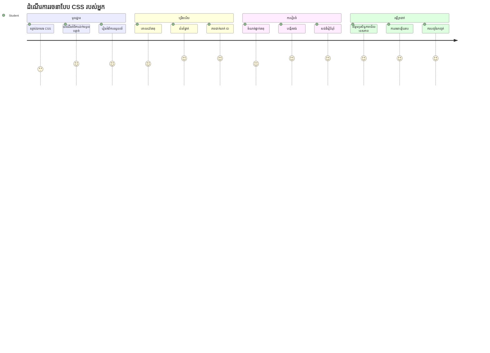
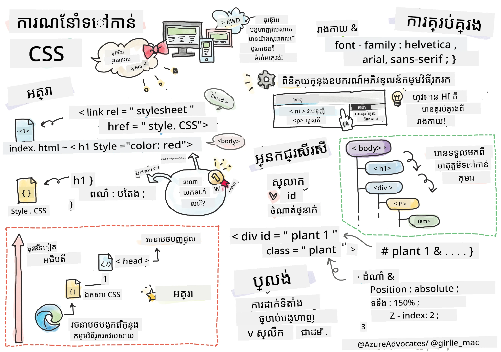
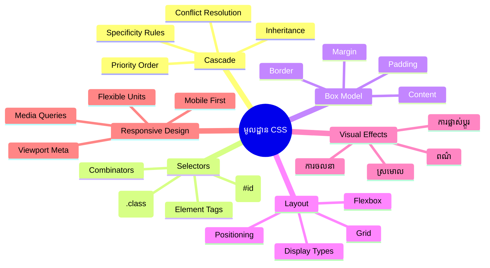
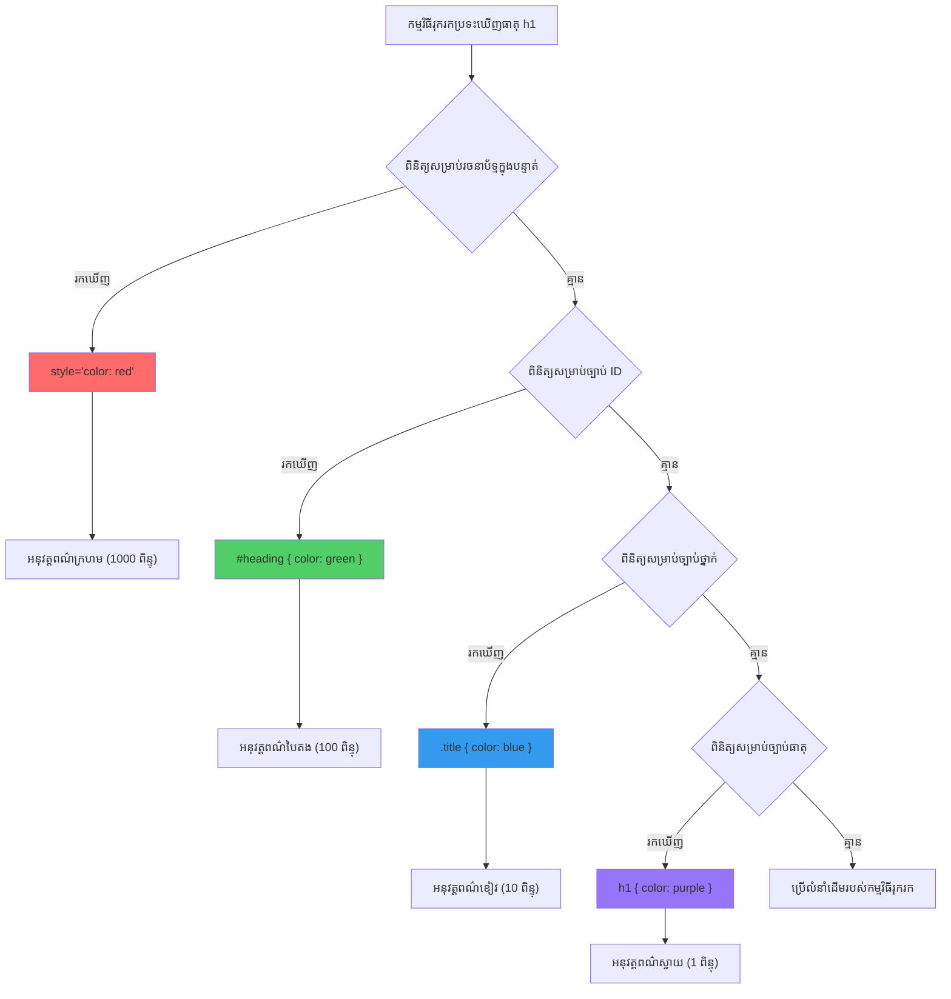
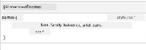
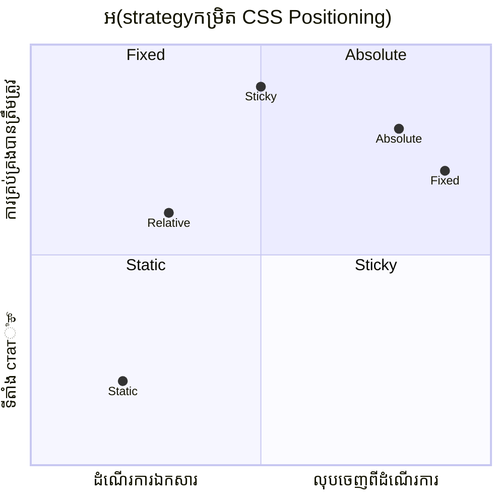
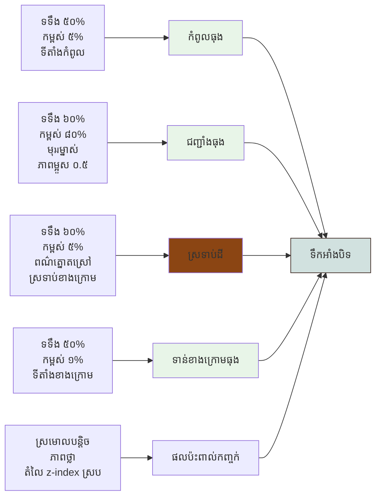
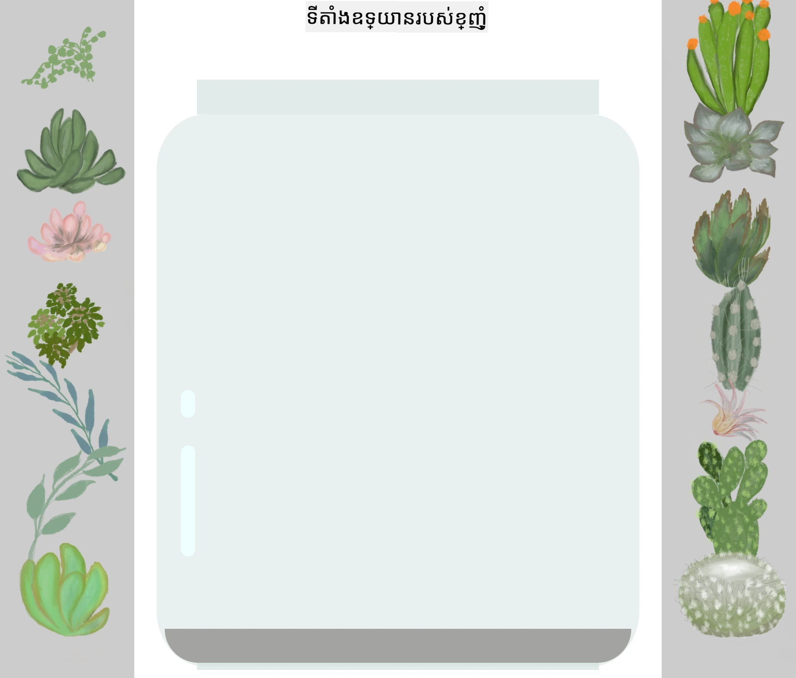
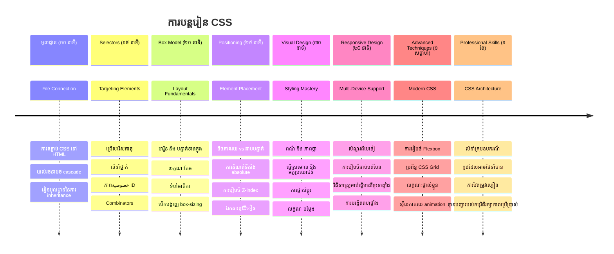

# គម្រោង Terrarium ផ្នែកទី 2៖ ការណែនាំអំពី CSS



> សៀវភៅគំនូរដៃដោយ [Tomomi Imura](https://twitter.com/girlie_mac)

ចងចាំថា terrarium HTML របស់អ្នកមើលទៅមានរចនាសម្ព័ន្ធសាមញ្ញមែនទេ? CSS គឺជាកន្លែងដែលយើងបម្លែងរចនាសម្ព័ន្ធធម្មតានោះទៅជារូបរាងដែលគួរឲ្យទាក់ទាញ។

បើ HTML ដូចជាការបង្កើតស៊ុមផ្ទះ មក CSS គឺជារឿងរាល់យ៉ាងដែលធ្វើឲ្យវាហាក់ដូចជាផ្ទះ - ពណ៌លាប ពន្លឺ ទីតាំងគ្រឿងសង្ហារឹម និងរបៀបបន្ទប់ផ្សំគ្នា។ គិតអំពីរបៀបដែលអគារព្រះរាជវាំង Versailles បានចាប់ផ្តើមជាបន្ទប់ស្ទង់វាយសត្វ ពិតប្រាកដប៉ុន្តែលក្ខណៈពិសេសនៃការតុបតែង និងការរៀបចំបានបម្លែងវាជាអគារដ៏អស្ចារ្យមួយនៅលើពិភពលោក។

ថ្ងៃនេះ យើងនឹងបម្លែង terrarium របស់អ្នកពីការប្រើប្រាស់ជា​តំណាង​ឆ្នាំ​ទៅកាន់រចនាបទស្អាត។ អ្នកនឹងរៀនរបៀបដាក់តំណាងត្រឹមត្រូវ បង្កើតរចនាសម្ព័ន្ធឲ្យឆ្លើយតបទៅនឹងទំហំអេក្រង់ផ្សេងៗ និងបង្កើតរូបរាងដែលធ្វើឲ្យវេបសាយគួរត្រូវចាប់អារម្មណ៍។

នៅចុងបញ្ចប់មេរៀននេះ អ្នកនឹងឃើញថារបៀបដាក់រចនាសម្ព័ន្ធ CSS ដោយយុទ្ធសាស្រ្តអាចធ្វើឲ្យគម្រោងរបស់អ្នកមានការកែប្រែយ៉ាងខ្លាំង។ ចូរចាប់ផ្តើមបន្ថែមរចនាបទទៅ terrarium របស់អ្នក។


## សំណួរទិញមុនមេរៀន

[សំណួរទិញមុនមេរៀន](https://ff-quizzes.netlify.app/web/quiz/17)

## ការចាប់ផ្តើមជាមួយ CSS

ជាញឹកញាប់ CSS ត្រូវបានគេចាត់ទុកថាគឺជាការធ្វើឲ្យរឿងស្អាត តែវាពិតជាមានគោលបំណងធំជាងនេះ។ CSS គឺដូចជាអ្នកដឹកនាំរឿងភាពយន្ត - អ្នកគ្រប់គ្រងមិនតែនឹងរូបរាងនៃរាល់អ្វីទាំងអស់ទេ តែបង្រួមរបៀបចលនា ឆ្លើយតបនឹងអន្តរកម្ម និងឆ្លើយតបទៅនឹងស្ថានភាពផ្សេងៗ។

CSS មែនទែនមានសមត្ថភាពខ្ពស់ក្នុងសម័យទំនើប។ អ្នកអាចសរសេរកូដដែលបត់បែនរចនាសម្ព័ន្ធស្វ័យប្រវត្តិសម្រាប់ទូរស័ព្ទ ថេប្លេត និងកុំព្យូទ័រប្រភេទដេកតូប។ អ្នកអាចបង្កើតចលនារលូនដែលណែនាំការយកចិត្តទុកដាក់របស់អ្នកប្រើនៅកន្លែងដែលត្រូវការ។ លទ្ធផលអាចមានភាពអស្ចារ្យពេលគ្រប់យ៉ាងសម្របសម្រួលគ្នា។

> 💡 **ចំណេះដឹងពិសេស**: CSS កំពុងរីកចម្រើនជាយូរជាងមុនជាមួយមុខងារ និងសមត្ថភាពថ្មីៗ។ តែងតែពិនិត្យ [CanIUse.com](https://caniuse.com) ដើម្បីផ្ទៀងផ្ទាត់ការគាំទ្ររបស់កម្មវិធីរុករកទៅលើមុខងារ CSS ថ្មីមុននឹងប្រើប្រាស់វាក្នុងគម្រោងផលិតកម្ម។

**នេះគឺជាអ្វីដែលយើងនឹងសម្រេចបាននៅក្នុងមេរៀននេះ៖**
- **បង្កើត** រចនាបទទាំងមូលសម្រាប់ terrarium របស់អ្នកដោយប្រើបច្ចេកវិទ្យា CSS ទំនើប
- **ស្វែងយល់** មូលដ្ឋានគ្រឹះដូចជា cascade, inheritance និង CSS selectors
- **អនុវត្ត** យុទ្ធសាស្រ្តដាក់ទីតាំងឆ្លើយតប និងរចនាសម្ព័ន្ធ
- **សាងសង់** ទ្រឹស្តី terrarium ដោយប្រើរាង និងរចនាសម្ព័ន្ធ CSS

### លក្ខខណ្ឌមុន

អ្នកគួរតែបានបញ្ចប់រចនាសម្ព័ន្ធ HTML សម្រាប់ terrarium របស់អ្នកពីមេរៀនមុន និងមានវាគ្រាន់សម្រាប់បន្ថែមរចនាបទ។

> 📺 **ធនធានវីដេអូ**: សូមមើលវីដេអូជំនួយនេះ
>
> [](https://www.youtube.com/watch?v=6yIdOIV9p1I)

### ការកំណត់ឯកសារ CSS របស់អ្នក

មុនពេលអ្នកចាប់ផ្តើមបន្ថែមរចនាបទ យើងត្រូវភ្ជាប់ CSS ទៅ HTML របស់យើង។ ការភ្ជាប់នេះប្រាប់កម្មវិធីរុករកមករកឃើញវិធីសាស្រ្តរៀបចំរចនាបទសម្រាប់ terrarium របស់យើង។

ក្នុងថត terrarium របស់អ្នក បង្កើតឯកសារថ្មីមួយឈ្មោះ `style.css` ហើយភ្ជាប់វាចូលទៅក្នុងផ្នែក `<head>` នៃឯកសារ HTML៖

```html
<link rel="stylesheet" href="./style.css" />
```

**អ្វីដែលកូដនេះធ្វើ៖**
- **បង្កើត** ការតភ្ជាប់ចន្លោះឯកសារ HTML និង CSS របស់អ្នក
- **ប្រាប់**កម្មវិធីរុករកទាញយក និងអនុវត្តរចនាបទពី `style.css`
- **ប្រើ** attributes `rel="stylesheet"` ដើម្បីបញ្ជាក់ថាវាជាឯកសារ CSS
- **យោងទៅ**ផ្លូវឯកសារជាមួយ `href="./style.css"`

## ការយល់ដឹងអំពី CSS Cascade

អ្នកធ្លាប់ហួសចិត្តមកទេថាហេតុអ្វីបានហៅ CSS ថា "Cascading" Style Sheets? រចនាបទឆ្លងចុះដូចជារលកទឹក ហើយពេលខ្លះវាប្រឈមមុខនឹងការប្រឆាំងគ្នា។

គិតពីរបៀបដែលរចនាសម្ព័ន្ធបញ្ជារបស់យោធា - ពាក្យបញ្ជាសកលទូទៅប្រហែលជា "ក្រុមយោធារទាំងអស់ពាក់ពណ៌បៃតង" ប៉ុន្តែច្បាប់ពិសេសសម្រាប់ក្រុមរបស់អ្នកប្រហែលជា "ពាក់សម្លៀកបំពាក់ខៀវសម្រាប់ពិធី"។ ការបញ្ជាពិសេសមានអាទិភាពជាង។ CSS បើកលក្ខណៈដូចគ្នា ហើយការយល់ដឹងពីលំដាប់នេះធ្វើឲ្យមានភាពងាយស្រួលក្នុងការដោះស្រាយកំហុស។

### សាកល្បងលំដាប់អាទិភាព Cascade

យើងមើលកំហុសរចនាបទដោយបង្កើតការប្រឆាំងរចនាបទមួយ។ ជំហានដំបូង បន្ថែមរចនាបទ inline នៅ `<h1>` របស់អ្នក៖

```html
<h1 style="color: red">My Terrarium</h1>
```

**អ្វីដែលកូដនេះធ្វើ៖**
- **អនុវត្ត**ពណ៌ក្រហមផ្ទាល់ទៅ `<h1>` ដោយប្រើ inline style
- **ប្រើ** attributes `style` ដើម្បីបញ្ចូល CSS ត្រឹម HTML
- **បង្កើត**ច្បាប់រចនាបទមានអាទិភាពខ្ពស់បំផុតសម្រាប់ធាតុនេះ

បន្ទាប់មក បន្ថែមច្បាប់នេះទៅក្នុងឯកសារ `style.css` របស់អ្នក៖

```css
h1 {
  color: blue;
}
```

**នៅលើនេះ យើងបាន:**
- **កំណត់**ច្បាប់ CSS ដែលគោលដៅទៅធាតុ `<h1>` ទាំងអស់
- **កំណត់**ពណ៌អក្សរជាស្វយ័តដោយផ្សេងពីរចនាបទ inline
- **បង្កើត**ច្បាប់មានអាទិភាពទាបជាង inline style

✅ **តេស្តចំណេះដឹង**: តើពណ៌ណាមួយត្រូវបង្ហាញនៅក្នុងកម្មវិធីវេបរបស់អ្នក? ហេតុអ្វីពណ៌នោះជាសំខាន់? តើអ្នកគិតរឿងណាដែលអ្នកចង់លុបបំបាត់រចនាបទទេ?


> 💡 **លំដាប់អាទិភាព CSS (ពីខ្ពស់ទៅទាប):**
> 1. **inline styles** (style attribute)
> 2. **IDs** (#myId)
> 3. **Classes** (.myClass) និង attributes ផ្សេងៗ
> 4. **Element selectors** (h1, div, p)
> 5. **Browser defaults**

## CSS Inheritance ក្នុងការអនុវត្ត

CSS inheritance ដូចជា genetics -ធាតុទទួលពហុលទ្ធផលពីឪពុកម្ដាយរបស់វា។ ប្រសិនបើអ្នកកំណត់ fontfamily នៅលើធាតុ body អក្សរមាននៅខាងក្នុងទាំងអស់នឹងប្រើ font នោះផ្ទាល់។ វាដូចជារបៀបដែលសម្រួលក្បាលរបស់គ្រួសារ Habsburg បានបញ្ចប់នៅពហុជំនាន់ដោយមិនចាំបាច់កំណត់ជាមួយរាល់មនុស្សម្នាក់ៗ។

ប៉ុន្តែ មិនមែនអ្វីគ្រប់យ៉ាងទទួល inheritance ទេ។ ស្ទីលអក្សរដូចជាfonts និងពណ៌ទទួល inheritance ប៉ុន្តែមុខងាររចនាសម្ព័ន្ធដូចជា margins និង borders មិនទទួល inheritance ទេ។ ដូចជា កូនៗចាត់ទុកលក្ខណៈរាងកាយប៉ុន្តែមិនទទួលជំនាញនៃតុបតែងពីឪពុកម្ដាយ។

### ការសង្កេត inheritance របស់ font

យើងមើល inheritance ដោយកំណត់ fontfamily សម្រាប់ធាតុ `<body>`៖

```css
body {
  font-family: 'Segoe UI', Tahoma, Geneva, Verdana, sans-serif;
}
```

**បំបែកអ្វីដែលកើតឡើងនៅទីនេះ៖**
- **កំណត់** fontfamily សម្រាប់ទំព័រទាំងមូលដោយគោលដៅទៅ `<body>`
- **ប្រើ** font stack មានជម្រើស fallback សម្រាប់ការគាំទ្រល្អបំផុតពីកម្មវិធីរុករក
- **អនុវត្ត** font ដែលមានសម័យទំនើបដែលមើលទៅល្អលើប្រព័ន្ធប្រតិបត្តិការផ្សេងៗ
- **ធានា** ថា ធាតុចិញ្ចឹមទាំងអស់ទទួល font នេះ លើកលែងតែមានការរំលិលដោយពិសេស

បើកឧបករណ៍អ្នកអwickdeck HTML (F12) ចូលទៅក្នុងផ្ទាំង Elements ហើយពិនិត្យ `<h1>` របស់អ្នក។ អ្នកនឹងឃើញថាវាទទួល font family ពី body:



✅ **ពេលសាកល្បង**: ចូរព្យាយាមកំណត់លក្ខណៈផ្សេងទៀតដែលអាចទទួល inheritance នៅលើ `<body>` ដូចជា `color`, `line-height`, ឬ `text-align`។ តើមានអ្វីកើតឡើងទៅលើចំណងជើង និងធាតុផ្សេងៗ?

> 📝 **លក្ខណៈដែលអាចទទួល inheritance រួមមាន**: `color`, `font-family`, `font-size`, `line-height`, `text-align`, `visibility`
>
> **លក្ខណៈដែលមិនទទួល inheritance រួមមាន**: `margin`, `padding`, `border`, `width`, `height`, `position`

### 🔄 **ការត្រួតពិនិត្យស្តង់ដារ**
**ការយល់ដឹងមូលដ្ឋាន CSS** : មុនពេលបន្តទៅ selectors សូមធ្វើឲ្យប្រាកដថា អ្នកអាច៖
- ✅ អធិប្បាយភាពខុសគ្នារវាង cascade និង inheritance
- ✅ ទាយទោលថារចនាបទណានឹងឈ្នះនៅក្នុងការប្រឆាំងច្បាប់ specificity
- ✅ រកឃើញលក្ខណៈណាដែលទទួល inheritance ពីមាតាធាតុ
- ✅ ភ្ជាប់ឯកសារ CSS ទៅ HTML បានយ៉ាងត្រឹមត្រូវ

**តេស្តរហ័ស**: ប្រសិនបើអ្នកមានរចនាបទទាំងនេះ តើពណ៌អ្វីដែល `<h1>` ក្នុង `<div class="special">` នឹងមាន?
```css
div { color: blue; }
.special { color: green; }
h1 { color: red; }
```
*ចម្លើយ៖ ក្រហម (element selector បង្ហាញទៅ h1 បន្ទាន់)*

## ការជំនាញ CSS Selectors

CSS selectors ជាវិធីសាស្រ្តដើម្បីគោលដៅធាតុជាក់លាក់សម្រាប់រចនាបទ។ វាដូចជាការបញ្ជាទិសត្រឹមត្រូវ - មិនមែននិយាយថា "ផ្ទះ" ទេ តែថា "ផ្ទះពណ៌ខៀវដែលមានទំពារ​ក្រហម​នៅផ្លូវ Maple"។

CSS ផ្តល់ជម្រើសផ្សេងៗបំផុតសម្រាប់ការជាក់លាក់ ហើយការជ្រើសរើស selector ត្រឹមត្រូវដូចជាការជ្រើសឧបករណ៍អាចមួយសម្រាប់អង្គភាព។ ពេលខ្លះអ្នកត្រូវរចនាបទទៅលើទ្វារទាំងអស់ក្នុងតំបន់ ហើយពេលមួយគ្រាន់តែទ្វារមួយជាក់លាក់។

### Element Selectors (ស្លាក)

Element selectors គោលដៅទៅធាតុ HTML ដោយឈ្មោះស្លាករបស់វា។ វាជាជម្រើសល្អសម្រាប់កំណត់រចនាបទមូលដ្ឋានដែលប្រើប្រាស់ទូទាំងទំព័រ៖

```css
body {
  font-family: 'Segoe UI', Tahoma, Geneva, Verdana, sans-serif;
  margin: 0;
  padding: 0;
}

h1 {
  color: #3a241d;
  text-align: center;
  font-size: 2.5rem;
  margin-bottom: 1rem;
}
```

**យល់ដឹងអំពីរចនាបទទាំងនេះ៖**
- **កំណត់** typography សរុបនៅទំព័រទាំងមូលដោយ selector `body`
- **ដកចេញ** margins និង padding ដើមរបស់កម្មវិធីរុករកសម្រាប់ការត្រួតផ្នែកត្រឹមត្រូវ
- **រចនា** អក្សរពហុចំណងជើងដោយ color, alignment និងspacing
- **ប្រើ** `rem` ជាឯកតាដើម្បីមើលថាហួស‌កំណត់ដល់ទំហំអក្សរជាប្រកបដោយអាចចូលដំណើរការ

បើទោះ Element selectors ចំណាស់ល្អសម្រាប់រចនាបទទូទៅ អ្នកត្រូវការជ្រើសរើស selectors ផ្សេងៗសម្រាប់រចនារឿងផ្សេងៗដូចជារុក្ខជាតិនៅក្នុង terrarium របស់អ្នក។

### ID Selectors សម្រាប់ធាតុឯកទេស

ID selectors ប្រើសញ្ញា `#` ហើយគោលដៅទៅធាតុដែលមាន attributes `id` ជាក់លាក់។ ពីព្រោះ ID ត្រូវតែមានតែមួយក្នុងទំព័រ វាជាជម្រើសល្អសម្រាប់រចនាបទធាតុឯកខ្លួនដូចជា containers រុក្ខជាតិខាងឆ្វេង និងខាងស្តាំរបស់ terrarium ។

ចូរបង្កើតរចនាបទសម្រាប់ containers ភាគខាងដៃនៃ terrarium ដែលរុក្ខជាតិរស់នៅ៖

```css
#left-container {
  background-color: #f5f5f5;
  width: 15%;
  left: 0;
  top: 0;
  position: absolute;
  height: 100vh;
  padding: 1rem;
  box-sizing: border-box;
}

#right-container {
  background-color: #f5f5f5;
  width: 15%;
  right: 0;
  top: 0;
  position: absolute;
  height: 100vh;
  padding: 1rem;
  box-sizing: border-box;
}
```

**អ្វីដែលកូដនេះសម្រេច៖**
- **ដាក់ទីតាំង** containers នៅគ្រាប់ឆ្វេងចុងក្រោយ និងស្តាំអេក្រង់ដោយ `absolute` positioning
- **ប្រើ** `vh` ឯកតាបរិមាណកម្ពស់ដើម្បីឆ្លើយតបទៅនឹងទំហំអេក្រង់
- **អនុវត្ត** `box-sizing: border-box` ដើម្បីបញ្ចូល padding ទៅក្នុងទទឹងសរុប
- **ដកចេញ** ឯកតា `px` មិនចាំបាច់ពីតម្លៃសូន្យសម្រាប់កូដស្អាត
- **កំណត់**ពណ៌ផ្ទៃខាងក្រោយស្រាលដែលងាយស្រួលមើលជាងពណ៌ប្រផេះខាងចចារ

✅ **កិច្ចការបញ្ញាតិចំពោះគុណភាពកូដ**: ចូរបញ្ជាក់ថា CSS នេះបន្សល់នៅលើក្បាលបញ្ជារបស់ DRY (កុំធ្វើម្តងទៀត)។ តើអ្នកអាចធ្វើការកែប្រែវា ដោយប្រើទាំង ID និង class ទេ?

**វិធីសាស្រ្តបានធ្វើឱ្យប្រសើរ:**
```html
<div id="left-container" class="container"></div>
<div id="right-container" class="container"></div>
```

```css
.container {
  background-color: #f5f5f5;
  width: 15%;
  top: 0;
  position: absolute;
  height: 100vh;
  padding: 1rem;
  box-sizing: border-box;
}

#left-container {
  left: 0;
}

#right-container {
  right: 0;
}
```

### Class Selectors សម្រាប់រចនាបទអាចប្រើឡើងវិញ

Class selectors ប្រើសញ្ញា `.` ហើយល្អសម្រាប់ការអនុវត្តរចនាបទដូចគ្នាចំពោះធាតុជាច្រើន។ ខុសពី IDs, classes អាចប្រើឡើងវិញបាននៅទូទាំង HTML របស់អ្នក ដែលធ្វើឲ្យវាល្អសម្រាប់មូឌែលរចនាបទថេរ។

នៅក្នុង terrarium របស់យើង រុក្ខជាតិមួយៗត្រូវការរចនាបទដូចគ្នា ប៉ុន្តែក៏ត្រូវការ ទីតាំងផ្សេងៗផ្ទាល់ខ្លួន។ យើងនឹងប្រើការរួមបញ្ចូលគ្នារវាង classes សម្រាប់រចនាបទសំរបសំរួល និង IDs សម្រាប់ទីតាំងតែមួយៗ។

**នេះគឺជារចនាសម្ព័ន្ធ HTML សម្រាប់រុក្ខជាតិមួយៗ:**
```html
<div class="plant-holder">
  
</div>
```

**ធាតុសំខាន់ៗបានពណ៌នា៖**
- **ប្រើ** `class="plant-holder"` សម្រាប់រចនាគ្រឿងទ្រង់ទ្រាយដូចគ្នាទៅលើរុក្ខជាតិទាំងអស់
- **អនុវត្ត** `class="plant"` សម្រាប់រចនារូបភាព និងស្វ័យប្រវត្តិការព្រិត្តិការណ៍
- **រួមបញ្ចូល** `id="plant1"` ឯកជនសម្រាប់ការដាក់ទីតាំង និងអន្តរកម្មជាមួយ JavaScript
- **ផ្តល់** អត្ថបទ alt ដែលពិពណ៌នាសម្រាប់ជំនួយអ្នកប្រើអានអេក្រង់

ឥឡូវបន្ថែមរចនាបទទាំងនេះទៅក្នុងឯកសារ `style.css` របស់អ្នក៖

```css
.plant-holder {
  position: relative;
  height: 13%;
  left: -0.6rem;
}

.plant {
  position: absolute;
  max-width: 150%;
  max-height: 150%;
  z-index: 2;
  transition: transform 0.3s ease;
}

.plant:hover {
  transform: scale(1.05);
}
```

**បំបែករចនាបទទាំងនេះ៖**
- **បង្កើត** ទីតាំង relative សម្រាប់ container រុក្ខជាតិដើម្បីបង្កើត context ទីតាំង
- **កំណត់** ទំហំជម្ពស់ 13% សម្រាប់រាល់ container ដើម្បីធានារុក្ខជាតិទាំងអស់ស្ថិតខាងលើតួរអេក្រង់ដោយគ្មានការផ្លាស់ទី
- **ផ្លាស់ទី** container ថ្មីៗឲ្យផ្នែកខាងឆ្វេងបន្តិច សម្រាប់មធ្យមកណ្ដាលល្អជាង
- **អនុញ្ញាត** រុក្ខជាតិធ្វើបរិមាត្រស្វ័យប្រវត្តិដោយប្រើគុណលក្ខណៈ `max-width` និង `max-height`
- **ប្រើ** `z-index` ដើម្បីដាក់រុក្ខជាតិឲ្យនៅផ្នែកលើធាតុផ្សេងៗនៅក្នុង terrarium
- **បន្ថែម** ផលប៉ះពាល់ hover ស្រាលជាមួយ transition CSS សម្រាប់អន្តរកម្មល្អប្រសើរ

✅ **គិតយ៉ាងយកចិត្តទុកដាក់**: ហេតុអ្វីក្រុមប្រើផ្នែកទាំងពីរ `.plant-holder` និង `.plant`? តើអ្វីដែលកើតឡើងប្រសិនបើយើងប្រើមួយគត់?

> 💡 **គំរូរចនា**: container (`.plant-holder`) គ្រប់គ្រងទីតាំង និងប្លង់ ខណៈដែលមាតិកា (`.plant`) គ្រប់គ្រងរូបរាង និងការវាស់។ ការបំបែកនេះធ្វើឲ្យកូដងាយថែរក្សា និងបត់បែនបានល្អ។

## ការយល់ដឹងអំពីទីតាំង CSS

ទីតាំង CSS ដូចជាអ្នកដឹកនាំឆាកមួយ - អ្នកបញ្ជាថាតេទីតាំងនិងចលនារបស់សមាជិកគ្រប់គ្នាទៅនៅចន្លោះឆាក។ មានអ្នកត ស្គាល់តាមរចនាសម្ព័ន្ធផ្លូវបុរាណ ខណៈអ្នកផ្សេងទៀតត្រូវការទីតាំងជាក់លាក់សម្រាប់ប្រយោជន៍លើសកម្មភាព។

ពេលអ្នកយល់ពីទីតាំង សំណួររចនាសម្ព័ន្ធជាច្រើនក្លាយជាអាចគ្រប់គ្រងបាន។ តើអ្នកចង់មានបណ្តាញ navigation រិះរិះនៅលើខ្លួនម៉ឺនណាស់នៅពេលអ្នករុករកទេ? ទីតាំងគ្រប់គ្រងយ៉ាងហោចណាស់។ តើអ្នកចង់មាន tooltip បង្ហាញនៅទីតាំងជាក់លាក់? នោះក៏ជាទីតាំងផងដែរ។

### មូលដ្ឋានទាំងប្រាំរបស់ទីតាំង


| តម្លៃទីតាំង | អាកប្បកិរិយា | ករណីប្រើប្រាស់ |
|----------------|--------------|----------------|
| `static` | រលកទុតិយភាពដើម មិនគិត top/left/right/bottom | រចនាសម្ព័ន្ធឯកសារធម្មតា |
| `relative` | ទីតាំងក្នុងការចុះថ្មីតាមទីតាំងធម្មតា | ការកំណត់តែបន្តិច, បង្កើត context ទីតាំង |
| `absolute` | ទីតាំងភ្ជាប់ទៅបុត្រដែលមានទីតាំងដែលបានកំណត់ជិតស្និទ | ទីតាំងត្រឹមត្រូវ, យ៉ាងក្រាល |
| `fixed` | ទីតាំងភ្ជាប់ទៅអេក្រង់កម្មវិធីរុករក | បណ្តាញ navigation, ធាតុហោះហើរ |
| `sticky` | ប្តូររវាង relative និង fixed ដោយផ្អែកលើស្ក្រុល | ក្បាល​ដែលនៅជាក់លាក់ពេលរុករក |

### ទីតាំងក្នុង Terrarium របស់យើង

Terrarium របស់យើងប្រើការបញ្ចូលសមាសធាតុទីតាំងយ៉ាងយុទ្ធសាស្រ្ត ដើម្បីបង្កើតរចនាសម្ព័ន្ធដែលចង់បាន៖

```css
/* Container positioning */
.container {
  position: absolute; /* Removes from normal flow */
  /* ... other styles ... */
}

/* Plant holder positioning */
.plant-holder {
  position: relative; /* Creates positioning context */
  /* ... other styles ... */
}

/* Plant positioning */
.plant {
  position: absolute; /* Allows precise placement within holder */
  /* ... other styles ... */
}
```

**យល់ដឹងពីយុទ្ធសាស្រ្តទីតាំង៖**
- **Containers absolute** ត្រូវបានដកចេញពីរលកស្គាល់ឯកសាររបស់ពិភពលោក ហើយត្រូវបានត្រួតត្រាចូលទន្លេអេក្រង់
- **Plant holders relative** បង្កើត context ទីតាំងខណៈនៅក្នុងរលកស្គាល់ឯកសារ
- **រុក្ខជាតិ absolute** អាចដាក់ទីតាំងបានយ៉ាងត្រឹមត្រូវក្នុង container relative របស់ពួកវា
- **ការរួមបញ្ចូលនេះ** អនុញ្ញាតឲ្យរុក្ខជាតិត្រូវដាក់ជួរទៅនឹងទិសដៅដេក លើសពីនេះអាចបំពានតាមទីតាំងផ្ទាល់ខ្លួនបាន

> 🎯 **ហេតុអ្វីវាសំខាន់**: ធាតុ `plant` ត្រូវការទីតាំង absolute ដើម្បីធ្វើឲ្យវាអាចទាញចុចបាននៅក្នុងមេរៀនបន្ទាប់។ ទីតាំង absolute នេះដកវាចេញពីរចនាសម្ព័ន្ធឯកសារ រួមជាមួយការអន្តរកម្មទាញ-បោះ។

✅ **ពេលសាកល្បង**: សូមផ្លាស់ប្ដូរទីតាំង និងកំណត់មើលលទ្ធផល៖
- តើមានអ្វីកើតឡើងបើអ្នកប្ដូរ `.container` ពី `absolute` ទៅ `relative`?
- តើរចនាប័ទ្មមានការផ្លាស់ប្តូរយ៉ាងដូចម្តេច ប្រសិនបើ `.plant-holder` ប្រើ `absolute` ជំនួស `relative`?
- តើមានអ្វីកើតឡើងពេលអ្នកប្ដូរ `.plant` ទៅ `relative` positioning?

### 🔄 **ការត្រួតពិនិត្យផ្នែកសិក្សា**
**ភាពជួសជុលក្នុងការចាត់តាំង CSS**៖ រំលឹកដើម្បីផ្ទៀងផ្ទាត់ការយល់ដឹងរបស់អ្នក៖
- ✅ តើអ្នកអាចពណ៌នាហេតុផលដែលរុក្ខជាតិត្រូវការជួសជុលតាំង `absolute` សម្រាប់ការទាញនិងដាក់ទុកបានទេ?
- ✅ តើអ្នកយល់ដឹងយ៉ាងដូចម្តេចពីរបៀប Containers `relative` បង្កើតបរិបទចាត់តាំង?
- ✅ ហេតុអ្វីបានជាកុងតឺន័រខｓចំហៀងប្រើជួសជុលតាំង `absolute`?
- ✅ តើមានអ្វីកើតឡើង ប្រសិនបើអ្នកយកការបញ្ជាក់់ជួសជុលតាំងចេញទាំងស្រុង?

**ការតភ្ជាប់ជាមួយពិភពជាក់ស្ដែង**៖ គិតអំពីរបៀបដែលការចាត់តាំង CSS ស្រដៀងទៅនឹងរចនាប័ទ្មក្នុងពិភពជាក់ស្ដែង៖
- **Static**៖ សៀវភៅនៅលើធ្នេញ (លំដាប់ធម្មជាតិ)
- **Relative**៖ ផ្លាស់ទីសៀវភៅបន្តិច ប៉ុន្តែមិនបាត់ទីតាំងវា
- **Absolute**៖ ដាក់ស្លាកសៀវភៅនៅលើគេហទំព័រ 
- **Fixed**៖ សន្លឹកតំណាកដែលនៅតែឃើញនៅពេលអ្នកបត់ទំព័រ

## ការសង់ Terrarium ជាមួយ CSS

ឥឡូវនេះ យើងនឹងសង់ដបន្ទប់កញ្ចក់ដោយប្រើតែ CSS ប៉ុណ្ណោះ - មិនចាំបាច់រូបភាព ឬកម្មវិធីគំនូរ។

ការបង្កើតកញ្ចក់ដែលមើលទៅពិតជាមួយស្រមោល និងផលប៉ះពាល់ជ្រៅដោយប្រើការចាត់តាំងនិងភាពត្រជាក់បង្ហាញពីសមត្ថភាពទស្សនិក​ជនរបស់ CSS។ បច្ចេកទេសនេះស្រដៀងនឹងរបៀបដែលស្ថាបតិករ​នៅចលនាបោហៅហ្ស​បាន​ប្រើរូបរាងជាគោលចំបងដើម្បីបង្កើតអាគារស្អាតស្មុគស្មាញ។ ពេលអ្នកយល់រឿងទាំងនេះ អ្នកនឹងទទួលស្គាល់បច្ចេកវិទ្យា CSS នៅក្រោយរចនាប័ទ្មបណ្ដាញជាច្រើន។


### ការបង្កើតគ្រឿងបន្លាស់ធុងកញ្ចក់

ឲ្យយើងសង់ធុង Terrarium រៀងរាល់ផ្នែកមួយៗ។ ផ្នែកនីមួយៗប្រើជួសជុលតាំង `absolute` និងទំហំពាណលើភាគរយសម្រាប់រចនាប័ទ្មឆ្វេងឆ្វាញ៖

```css
.jar-walls {
  height: 80%;
  width: 60%;
  background: #d1e1df;
  border-radius: 1rem;
  position: absolute;
  bottom: 0.5%;
  left: 20%;
  opacity: 0.5;
  z-index: 1;
  box-shadow: inset 0 0 2rem rgba(0, 0, 0, 0.1);
}

.jar-top {
  width: 50%;
  height: 5%;
  background: #d1e1df;
  position: absolute;
  bottom: 80.5%;
  left: 25%;
  opacity: 0.7;
  z-index: 1;
  border-radius: 0.5rem 0.5rem 0 0;
}

.jar-bottom {
  width: 50%;
  height: 1%;
  background: #d1e1df;
  position: absolute;
  bottom: 0;
  left: 25%;
  opacity: 0.7;
  border-radius: 0 0 0.5rem 0.5rem;
}

.dirt {
  width: 60%;
  height: 5%;
  background: #3a241d;
  position: absolute;
  border-radius: 0 0 1rem 1rem;
  bottom: 1%;
  left: 20%;
  opacity: 0.7;
  z-index: -1;
}
```

**ការយល់ដឹងពីការសាងសង់ terrarium៖**
- **ប្រើ** ទំហំផ្អែកលើភាគរយសម្រាប់ការកំណត់ទំហំឆ្វេងឆ្វាញគ្រប់ទំហំអេក្រង់
- **តាំងទីតាំង** ធាតុដោយជួសជុលតាំង absolut ដើម្បីធ្វើឱ្យដាក់ទៅលើនិងស្របគ្នាយ៉ាងច្បាស់
- **អនុវត្ត** តម្លៃភាពច្បាស់ផ្សេងៗដើម្បីបង្កើតផលប៉ះពាល់ត្រជាក់កញ្ចក់
- **ប្រើ** `z-index` ដើម្បីដាក់រុក្ខជាតិក្នុងធុង
- **បន្ថែម** ប្លុកស្រមោល និងព្រំដែនបត់សម្រាប់មើលទៅពិតជាងមុន

### រចនាប័ទ្មឆ្វេងឆ្វាញជាមួយភាគរយ

មើលឃើញបានដូច្នេះទាំងអស់ទំហំប្រើភាគរយ មិនមែនម៉ាស៊ីនជាន់ pixel ទេ៖

**ហេតុអ្វីបានជាវាមានសារៈសំខាន់៖**
- **ធានា** ថា terrarium មានការកើនទំហំនឹងអេក្រង់គ្រប់ទំហំប្រកួតគ្នា
- **ថែរក្សា** ទំនាក់ទំនងរវាងផ្នែកនានារបស់ធុង
- **ផ្តល់** បទពិសោធន៍មានលក្ខណៈទីតាំងរួមពីទូរស័ព្ទដល់កុំព្យូទ័រធំៗ
- **អនុញ្ញាត** រចនាប័ទ្មឲ្យផ្លាស់ប្ដូរដោយគ្មានការបាក់បែកក្នុងរចនាប័ទ្មទស្សនា

### អង្គធាតុ CSS កំពុងដំណើរការ

យើងប្រើអង្គធាតុ `rem` សម្រាប់ border-radius ដែលធៀបមកពីទំហំណូតផ្ទាល់អក្សរដើម។ វាបង្កើតរចនាប័ទ្មមានភាពងាយស្រួល និងគោរពចំពោះចំណូលចិត្តអក្សររបស់អ្នកប្រើ។ សូមស្វែងយល់បន្ថែមពី [អង្គធាតុចាំបាច់ CSS](https://www.w3.org/TR/css-values-3/#font-relative-lengths) នៅក្នុងការពិពណ៌នា​ផ្លូវការជាថ្មី។

✅ **ការប្រឡងរូប​ភាព**៖ សាកល្បងកែប្រែតម្លៃទាំងនេះ ហើយមើលផលប៉ះពាល់៖
- កែប្រែភាពត្រជាក់របស់ធុងពី 0.5 ទៅ 0.8 – តើវាធ្វើអោយកញ្ចក់មើលទៅយ៉ាងដូចម្តេច?
- កែទឹកពណ៌ដីពី `#3a241d` ទៅ `#8B4513` – មានផលប៉ះពាល់ភ្នែកយ៉ាងដូចម្តេច?
- ប្ដូរ `z-index` របស់ដីទៅ 2 – តើការដាក់ជាន់មានអ្វីបម្លែង?

### 🔄 **ការត្រួតពិនិត្យផ្នែកសិក្សា**
**ការយល់ដឹងរចនាតុបតែង CSS**៖ ប្រាកដថាអ្នកយល់ពី CSS ទស្សនិកភាព៖
- ✅ តើការប្រើទំហំជាភាគរយធ្វើឲ្យរចនាប័ទ្មឆ្វេងឆ្វាញដូចម្តេច?
- ✅ ហេតុអ្វីបានជា opacity បង្កើតលក្ខណៈត្រជាក់កញ្ចក់?
- ✅ តើតួនាទីរបស់ z-index នៅក្នុងការដាក់ទង់ធាតុមានអ្វីខ្លះ?
- ✅ តើតម្លៃ border-radius បង្កើតរូបរាងធុងយ៉ាងដូចម្តេច?

**គោលការណ៍រចនា**៖ សង្កេតឃើញថាយើងកំពុងបង្កើតរូបភាពស្មុគស្មាញពីរូបរាងសាមញ្ញ៖
1. **ប្រអប់មូល** → **ប្រអប់មូលបត់គម្រប់** → **ផ្នែកធុង**
2. **ពណ៌ទត់** → **ភាពច្បាស់** → **ផលប៉ះពាល់កញ្ចក់**
3. **ធាតុបុគ្គល** → **ការ​ប្រឡងតំឡើង** → **ការមើលជា 3D**

---

## ត្រូវប្រើ GitHub Copilot Agent Challenge 🚀

ប្រើរបៀប Agent ដើម្បីបញ្ចប់បច្ចេកទេសដូចខាងក្រោម៖

**ពណ៌នា:** បង្កើតAnimation CSS ដែលធ្វើអោយរុក្ខជាតិ terrarium រុំរៀបឯកោ ប្រើបែបទ្រនាប់ខ្យល់ធម្មជាតិ។ វាជួយ​ឱ្យ​អ្នក​សម្រួលកាន់តែច្បាស់ អំពី​CSS animations, transforms និង keyframes ខណៈពេលបង្កើតទស្សនៈមានភាពគួរឱ្យទាក់ទាញ។

**សេចក្តីជូនដំណឹង:** បន្ថែមAnimation keyframe CSS ដើម្បីធ្វើឲ្យរុក្ខជាតិនៅក្នុងធុងរុំរៀបឆ្វេង-ស្ដាំយឺតៗ។ បង្កើតអនុការ swaying ដែលបង្វិលរុក្ខជាតិស្ទួន ២-៣ ដឺក្រេ ខាងឆ្វេងនិងស្ដាំក្នុងរយៈពេល ៣-៤ វិនាទី ហើយអនុវត្តទៅក្លាស `.plant`។ ធានាថាអនុការនេះវដ្តពុំមានលប់ និងមានមុខងារសម្រាលសម្រាប់ចលនាធម្មជាតិ។

ស្វែងយល់បន្ថែមអំពី [របៀប agent](https://code.visualstudio.com/blogs/2025/02/24/introducing-copilot-agent-mode) ទីនេះ។

## 🚀 បញ្ហា៖ ការបន្ថែមការបញ្ចាំងកញ្ចក់

រៀបចំបន្ថែមភាពត្រជាក់របស់ terrarium ជាមួយបញ្ចាំងកញ្ចក់ពិតប្រាកដ។ បច្ចេកទេសនេះនឹងបន្ថែមជ្រៅ និងភាពពិតប្រាកដទៅក្នុងការរចនា។

អ្នកនឹងបង្កើតចំណុចពន្លឺស្លោះៗ ដែលធ្វើឲ្យវាស្រដៀងទៅនឹងការបញ្ចាំងពន្លឺនៅលើផ្ទៃកញ្ចក់។ វាជាជំហានដូចជាគំនូរល្បី Jan van Eyck បានប្រើពន្លឺ និងការបញ្ចាំង​​ដើម្បីធ្វើឲ្យកញ្ចក់គំនូរមើលទៅជា 3D។ នេះជាគោលដៅថា៖



**បញ្ហារបស់អ្នក៖**
- **បង្កើត** រូបរាងវង់ពណ៌ស ឬពណ៌ស្រាលសម្រាប់បញ្ចាំងកញ្ចក់
- **តាំងទីតាំង** នៅខាងឆ្វេងនៃធុង
- **ប្រើ** opacity និង blur សម្រាប់បញ្ចាំងពន្លឺពិតប្រាកដ
- **ប្រើ** `border-radius` ដើម្បីបង្កើតរាងហ៊ុនសំរាប់ក្រែមចាត
- **សាកល្បង** ជាមួយ gradients ឬ box-shadows សម្រាប់ភាពពិតប្រាកដជាងមុន

## ប្រឡងក្រោយមេរៀន

[ប្រឡងក្រោយមេរៀន](https://ff-quizzes.netlify.app/web/quiz/18)

## ពង្រីកចំណេះដឹង CSS របស់អ្នក

CSS អាចមានភាពស្មុគស្មាញនៅដើម ប៉ុន្តែការយល់ដឹងពីគំនិតមូលដ្ឋានទាំងនេះផ្ដល់មូលដ្ឋានរឹងមាំសម្រាប់បច្ចេកវិទ្យាទំនើបជាងនេះ។

**ដែនការសិក្សា CSS បន្ទាប់របស់អ្នក៖**
- **Flexbox** - ធ្វើឲ្យការតំទីនិងចែកចាយធាតុមានភាពងាយស្រួល
- **CSS Grid** - ផ្ដល់ឧបករណ៍សម្រាប់បង្កើតរចនាប័ទ្មស្មុគស្មាញ
- **អថេរ CSS** - កាត់បន្ថយការបញ្ជូនពាក្យ និងធ្វើឲ្យងាយជួសជុល
- **រចនាប័ទ្មឆ្វេងឆ្វាញ** - ធានាថាគេហទំព័រផ្ទុះល្អនៅលើអេក្រង់នានា

### ប្រភពសិក្សាដែលអាចចូលរួមបាន

ហាត់ប្រាណគំនិតទាំងនេះដោយហ្គេមដែលមានការចូលរួមខ្ពស់៖
- 🐸 [Flexbox Froggy](https://flexboxfroggy.com/) - រៀន Flexbox តាមការប្រកួតកម្សាន្ត
- 🌱 [Grid Garden](https://codepip.com/games/grid-garden/) - រៀន CSS Grid ដោយដាំកាំបិតវីរុស
- 🎯 [CSS Battle](https://cssbattle.dev/) - សាកល្បងជំនាញ CSS ជាមួយបញ្ហាកូដ

### ការសិក្សាបន្ថែម

សម្រាប់មូលដ្ឋាន CSS ពេញលេញ បញ្ជប់មេរៀន Microsoft Learn នេះ៖ [Style your HTML app with CSS](https://docs.microsoft.com/learn/modules/build-simple-website/4-css-basics/?WT.mc_id=academic-77807-sagibbon)

### ⚡ **អ្វីដែលអ្នកអាចធ្វើក្នុង ៥ នាទីបន្ទាប់**
- [ ] បើក DevTools និងពិនិត្យរចនាប័ទ្ម CSS នៅលើគេហទំព័រណាមួយជាមួយផ្ទាំង Elements
- [ ] បង្កើតឯកសារ CSS សាមញ្ញ និងភ្ជាប់វាទៅកាន់ទំព័រ HTML
- [ ] សាកល្បងប្ដូរពណ៌ដោយវិធីជាប្រភេទផ្សេងៗ៖ hex, RGB, និងពណ៌ឈ្មោះ
- [ ] ហាត់ធ្វើ box model ដោយបន្ថែមpadding និង margin ទៅ div

### 🎯 **អ្វីដែលអ្នកអាចសម្រេចបានក្នុងមួយម៉ោងនេះ**
- [ ] បញ្ចប់ប្រឡងក្រោយមេរៀន និងពិនិត្យមើលគោលការណ៍ CSS មូលដ្ឋាន
- [ ] តុបតែងទំព័រ HTML របស់អ្នកជាមួយអក្សរ ពណ៌ និងចន្លោះ
- [ ] បង្កើតរចនាប័ទ្មសាមញ្ញដោយប្រើ flexbox ឬ grid
- [ ] សាកល្បង CSS transitions សម្រាប់ផលប៉ះពាល់រលោង
- [ ] ហាត់វិនិយោគរចនាប័ទ្មឆ្វេងឆ្វាញជាមួយ media queries

### 📅 **ការផ្សងព្រេងCSS រយៈពេលមួយសប្តាហ៍របស់អ្នក**
- [ ] បញ្ចប់ភារកិច្ចរចនាប័ទ្ម terrarium ជាមួយភាពច្នៃប្រឌិត
- [ ] ដោះស្រាយ CSS Grid ដើម្បីបង្កើតរាងកាងមួយសម្រាប់រូបថត
- [ ] រៀន CSS animations ដើម្បីនាំមកជីវភាពរចនា
- [ ] ស្វែងយល់ preprocessors CSS ដូចជា Sass ឬ Less
- [ ] សិក្សាគោលការណ៍រចនា និងអនុវត្តវាទៅ CSS របស់អ្នក
- [ ] វិភាគ និងបង្កើតរចនាប័ទ្មគួរឱ្យចាប់អារម្មណ៍ដែលអ្នកត្រូវបានឃើញលើបណ្ដាញ

### 🌟 **ភាពជំនាញរចនាប័ទ្មរយៈពេលមួយខែរបស់អ្នក**
- [ ] សង់ប្រព័ន្ធវែបសាយឆ្វេងឆ្វាញពេញលេញ
- [ ] រៀន CSS-in-JS ឬ frameworks ផ្អែកលើ utility ជាដូចជា Tailwind
- [ ] ចូលរួមគម្រោងបើកចំហ ដោយធ្វើការ উন্ন센ן CSS
- [ ] ជំនាញ CSS កម្រិតខ្ពស់ ដូចជា custom properties និង containment
- [ ] បង្កើតបណ្ណាល័យឧបករណ៍ដែលអាចប្រើបានច្រើនជាមួយ CSS ម៉ូឌុលា
- [ ] ជំនួយអ្នករៀន CSS ផ្សេងទៀត និងចែករំលែកចំណេះដឹងរចនា

## 🎯 ពេលវេលាកំណត់ភាពជំនាញ CSS របស់អ្នក


### 🛠️ សង្ខេបឧបករណ៍ CSS របស់អ្នក

បន្ទាប់ពីបញ្ចប់មេរៀននេះ អ្នកមាន៖
- **ការយល់ដឹងប្រលោម**៖ របៀបលំអៀងនិងលុបបំបាត់ស្ទាយ
- **ជំនាញជ្រើសរើស**៖ គោលដៅច្បាស់លាស់ជាមួយធាតុ ក្លาส និង ID
- **ជំនាញជួសជុលតាំង**៖ ការដាក់ធាតុផ្ដោតនិងការកំណត់ជាន់
- **ការរចនាទស្សនិក**៖ បង្កើតផលប៉ះពាល់កញ្ចក់ ស្រមោល និងភាពត្រជាក់
- **បច្ចេកទេសឆ្វេងឆ្វាញ**៖ រចនារូបភាពដោយភាគរយដែលអាចផ្លាស់ប្តូរបានក្នុងគ្រប់ទំហំអេក្រង់
- **ការរៀបចំកូដ**៖ រចនាប័ទ្ម CSS ស្អាតងាយស្រួលថែទាំ
- **ការប្រពៃណីទំនើប**៖ ប្រើអង្គធាតុស្របបាត និងរចនាប័ទ្មងាយចូលរួម

**ជំហានបន្ទាប់**៖ terrarium របស់អ្នកឥឡូវមានសរុបរចនាសម្ព័ន្ធ (HTML) និងស្ទាយ (CSS)។ មេរៀនចុងក្រោយនឹងបន្ថែមការបញ្ចូលអន្តរកម្មជាមួយ JavaScript!

## ភារកិច្ច

[CSS Refactoring](assignment.md)

---

<!-- CO-OP TRANSLATOR DISCLAIMER START -->
**ការព្រមាន**៖  
ឯកសារនេះត្រូវបានបកប្រែដោយប្រើសេវាកម្មបកប្រែ AI [Co-op Translator](https://github.com/Azure/co-op-translator)។ ខណៈដែលយើងខិតខំក្នុងការផ្តល់ភាពត្រឹមត្រូវ សូមយល់អំពីថាការបកប្រែដោយស្វ័យប្រវត្តិអាចមានកំហុស ឬភាពមិនត្រឹមត្រូវ។ ឯកសារដើមដែលមាននៅក្នុងភាសាម៉ាស៊ីនគួរត្រូវបានចាត់ទុកជាឯកសារដើមដែលមានអំណាច។ សម្រាប់ព័ត៌មានសំខាន់ៗ សូមបញ្ជាក់អោយមានការបកប្រែដោយមនុស្សជំនាញ។ យើងមិនទទួលខុសត្រូវចំពោះការយល់ខុស ឬការបកស្រាយខុសដែលអាចកើតមានពីការប្រើប្រាស់ការបកប្រែនេះនោះទេ។
<!-- CO-OP TRANSLATOR DISCLAIMER END -->