# គម្រោង Terrarium ផ្នែក 3៖ ការគ្រប់គ្រង DOM និង JavaScript Closures

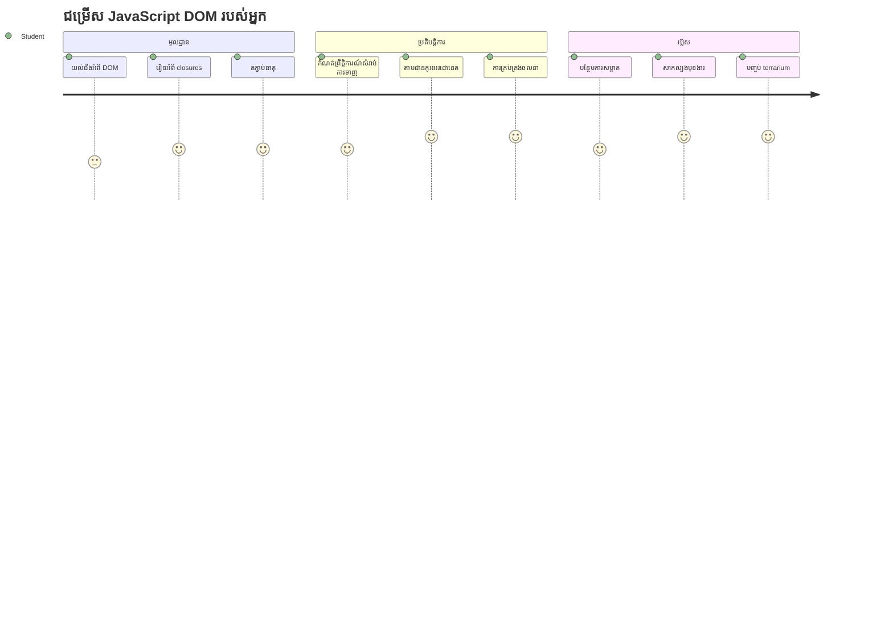
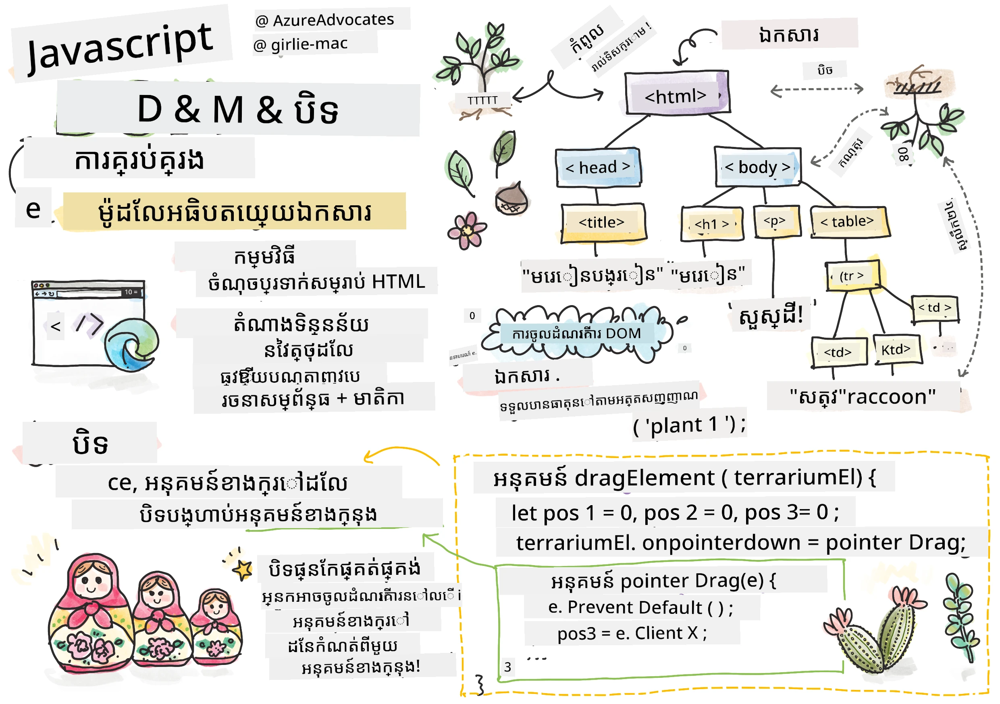
> Sketchnote ដោយ [Tomomi Imura](https://twitter.com/girlie_mac)

សូមស្វាគមន៍មកកាន់មុខងារ​ដ៏ទាក់ទាញបំផុតមួយនៃការអភិវឌ្ឍ ន់​បណ្ដាញ - ការបង្កើតអ្វីៗឲ្យមានអន្តរកម្ម! Document Object Model (DOM) គឺដូចជាស្ពានរវាង HTML និង JavaScript របស់អ្នក ហើយថ្ងៃនេះយើងនឹងប្រើវាដើម្បីនាំឲ្យ terrarium របស់អ្នកមានជីវិត។ នៅពេលដែល Tim Berners-Lee បង្កើតកម្មវិធីរុករកបណ្ដាញជាលើកដំបូង គាត់បានស្រមៃឃើញបណ្ដាញដែលឯកសារអាចមានលក្ខណៈសកម្ម និងអន្តរកម្មបាន - DOM ធ្វើឲ្យចក្ខុវិស័យនោះក្លាយជាការពិត។

យើងនឹងសិក្សាផងដែរ​ពី JavaScript closures ដែលប្រហែលជាស្តាប់ហើយអាចធ្វើឲ្យខ្លាចបន្តិចផ្ទាល់ខ្លួន។ គិតថា closures គឺដូចជាការបង្កើត “កិរិយាបទចងចាំ” ដែលមុខងាររបស់អ្នកអាចចាំព័ត៌មានសំខាន់ៗបាន។ វាដូចជាព प्रत्येकរុក្ខជាតិក្នុង terrarium របស់អ្នកមានកំណត់ត្រាទិន្នន័យផ្ទាល់ខ្លួនដើម្បី​កត់ត្រាតំបន់ទីតាំង។ នៅចុងបញ្ចប់មេរៀននេះ អ្នកនឹងយល់ថាវាជារឿងធម្មជាតិ និងមានប្រយោជន៍ប៉ុណ្ណា។

នេះគឺជាអ្វីដែលយើងកំពុងបង្កើត៖ terrarium ដែលអ្នកប្រើអាចចម្លង ហើយទម្លាក់រុក្ខជាតិបានគ្រប់ទីកន្លែងយ៉ាងងាយស្រួល។ អ្នកនឹងរៀនបច្ចេកទេស DOM manipulation ដែលផ្ដល់ថាមពលដល់អ្វីៗទាំងអស់ពីការផ្ទុកឯកសារដែលអាចទាញ និងទម្លាក់ ដល់ហ្គេមអន្ទរកម្ម។ មកធ្វើឲ្យ terrarium របស់អ្នកមានជីវិត។

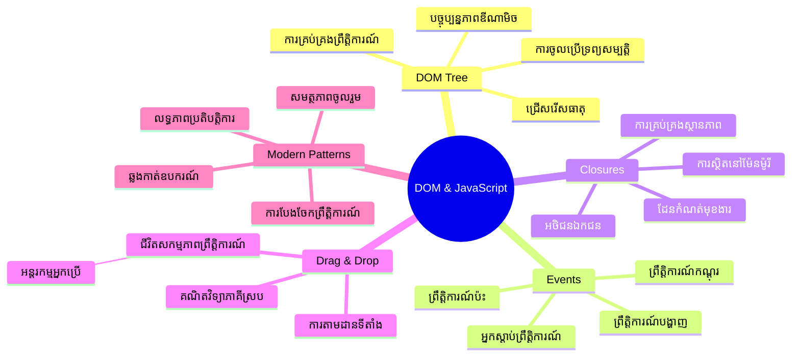
## សំនួរពិចារណាមុនមេរៀន

[សំនួរពិចារណាមុនមេរៀន](https://ff-quizzes.netlify.app/web/quiz/19)

## ការយល់ដឹងអំពី DOM៖ ទ្វារចូលរបស់អ្នកទៅក្នងទំព័របណ្ដាញអន្ទរកម្ម

Document Object Model (DOM) គឺជាវិធីដែល JavaScript សម្ភាសន៍ជាមួយធាតុ HTML របស់អ្នក។ នៅពេលកម្មវិធីរុករករបស់អ្នកបង្ហាញទំព័រ HTML វាបង្កើតតំណាងរាងច្បាស់លាស់សម្រាប់ទំព័រនោះក្នុងអនុស្សា - នេះគឺជា DOM។ គិតថាវាដូចជា​រុក្ខជាតួរសាស្រ្តនៅក្នុង គ្រួសារដែលធាតុ HTML មួយចំណាត់ថ្នាក់ជាសមាជិកគ្រួសារ ដែល JavaScript អាចចូលដំណើរការ កែប្រែ ឬរៀបចំឡើងវិញបាន។

ការគ្រប់គ្រង DOM បម្លែងទំព័រជាស្ថិរជាពីតោងទៅជាគេហទំព័រអន្ទរកម្ម។ រាល់ពេលដែលអ្នកឃើញប៊ូតុងប្ដូរពណ៌នៅពេលរុញ ឬមាតិកាអាប់ដេតដោយមិនត្រូវ刷新ទំព័រ ឬធាតុដែលអ្នកអាចទាញ និងដាក់ កំពុងធ្វើការ​នោះគឺជាការគ្រប់គ្រង DOM។

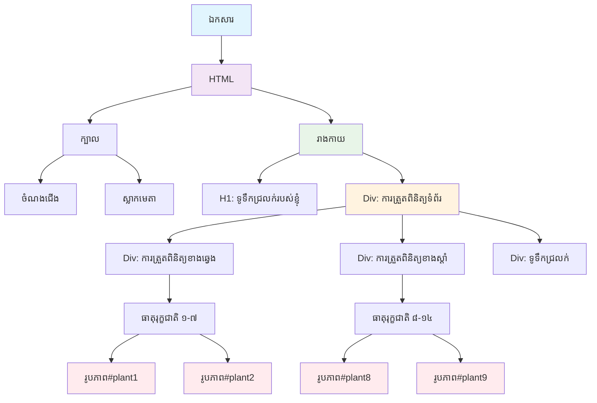
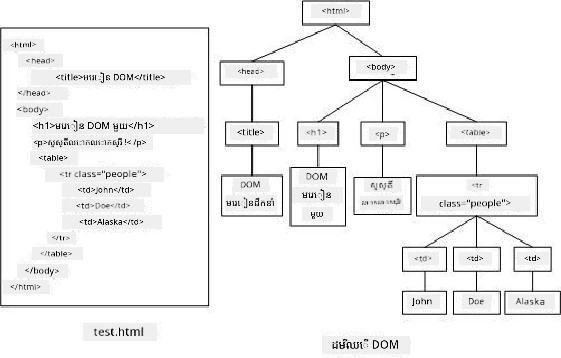

> តំណាងរបស់ DOM និង HTML markup ដែលយោងវា។ ពី [Olfa Nasraoui](https://www.researchgate.net/publication/221417012_Profile-Based_Focused_Crawler_for_Social_Media-Sharing_Websites)

**នេះគឺជាអ្វីដែលធ្វើឲ្យ DOM មានថាមពល៖**
- **ផ្តល់** វិធីសាស្ត្រច្បាស់លាស់ក្នុងការចូលដល់ធាតុណាមួយនៅលើទំព័ររបស់អ្នក
- **អនុញ្ញាត** អាប់ដេតមាតិកាសកម្មដោយមិនចាំ刷新ទំព័រ
- **អនុញ្ញាត** ភាពឆ្លើយតបពេលជាក់លាក់ចំពោះអន្តរកម្មអ្នកប្រើដូចជាការចុច និងការទាញ
- **បង្កើត** មូលដ្ឋានសម្រាប់កម្មវិធីវេបសាយអន្តរកម្មទាន់សម័យ

## JavaScript Closures៖ បង្កើតកូដបានត្រឹមត្រូវ ហើយមានថាមពល

[JavaScript closure](https://developer.mozilla.org/docs/Web/JavaScript/Closures) គឺដូចជាការផ្តល់ផ្ទាំងការងារផ្ទាល់ខ្លួនមុខងារមួយដែលមានអនុស្សាវរីយ៏ដ៏ធន់នូវអនុស្សា។ សូមគិតពីពីរុក្ខជាតិ Darwin ក្នុងកោះ Galápagos ដែលរាល់មិនមានមុនពួកវាបានអភិវឌ្ឍចំហាយបង្គោលជាក់លាក់ទៅតាមបរិយាកាសផ្ទាល់ខ្លួន — closures ក៏ដូចគ្នា ផ្ទុកមុខងារពិសេសដែល“ចាំ”បរិបទផ្ទាល់ខ្លួន របស់ពួកវា ទោះបីមុខងារបាដំបូងបានបញ្ចប់រួចហើយក៏ដោយ។

នៅក្នុង terrarium របស់យើង closures ជួយឲ្យរុក្ខជាតិមួយៗចាំទីតាំងផ្ទាល់ខ្លួនដោយឯករាជ្យ។ បែបបទនេះបង្ហាញឲ្យឃើញក្នុងការអភិវឌ្ឍ JavaScript មុខម៉ាស៊ីនវិជ្ជាជីវៈ ផ្តល់ឱ្យវាជាគំនិតដ៏មានតម្លៃក្នុងការយល់ដឹង។

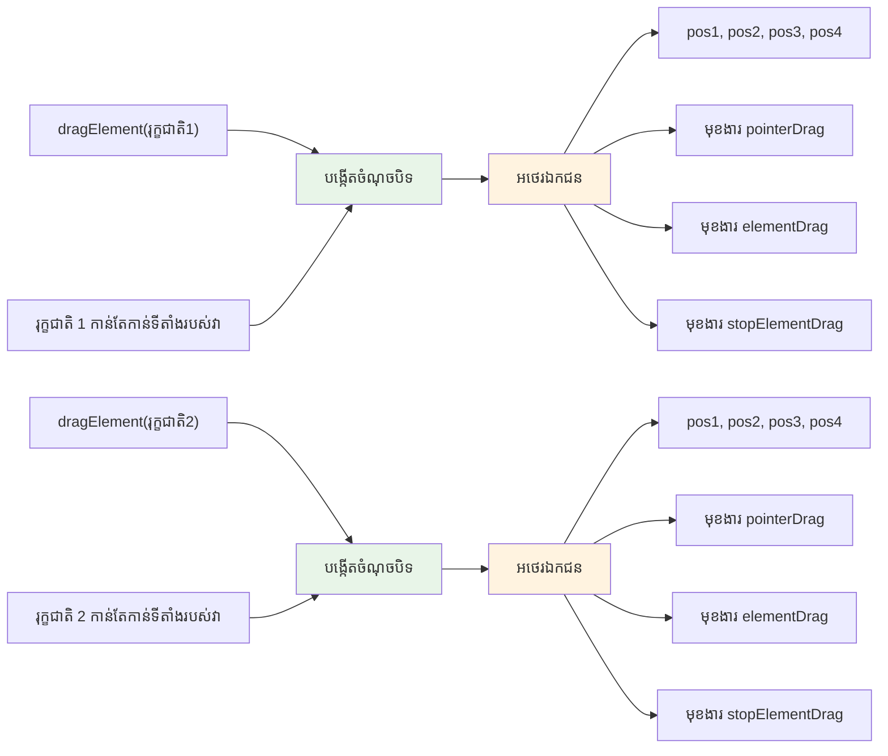
> 💡 **ការយល់ដឹងអំពី Closures**៖ Closures គឺជាបញ្ហាសំខាន់មួយក្នុង JavaScript ហើយអ្នកអភិវឌ្ឍជាច្រើនប្រើពួកវាជាយូរមកហើយមុនពួកគេយល់ពេញលេញពីទ្រឹស្ដីទាំងអស់។ ថ្ងៃនេះយើងផ្ដោតលើការដាក់ពាក្យជាក់ស្តែង - អ្នកនឹងឃើញ closures ប្រែប្រួលធម្មជាតិកើតឡើងពេលយើងបង្កើតមុខងារអន្តរកម្ម។ ការយល់ដឹងនឹងរីកចម្រើននៅពេលអ្នកឃើញពួកវាផ្តល់ដំណោះស្រាយបញ្ហាជាក់ស្តែង។


> តំណាងរបស់ DOM និង HTML markup ដែលយោងវា។ ពី [Olfa Nasraoui](https://www.researchgate.net/publication/221417012_Profile-Based_Focused_Crawler_for_Social_Media-Sharing_Websites)

ក្នុងមេរៀននេះ យើងនឹងបញ្ចប់គម្រោង terrarium អន្តរកម្មដោយបង្កើត JavaScript ដែលនឹងអនុញ្ញាតឲ្យអ្នកប្រើបង្កើតការគ្រប់គ្រងរុក្ខជាតិនៅលើទំព័រ។

## មុននឹងចាប់ផ្តើម៖ រៀបចំឱ្យជោគជ័យ

អ្នកនឹងត្រូវការឯកសារ HTML និង CSS ពីមេរៀន terrarium មុនៗ - យើងនឹងធ្វើឲ្យរចនាសម្ព័ន្ធស្ថិតឆ្នាសក្លាយជាអន្តរកម្ម។ ប្រសិនបើអ្នកចូលរួមជាលើកដំបូង ការសិក្សាទាំងមុននឹងផ្តល់បរិបទសំខាន់។

អ្វីដែលយើងនឹងបង្កើត៖
- **ការទាញ និងដាក់យ៉ាងទื่นចិត្ត** សម្រាប់រុក្ខជាតិទាំងអស់ក្នុង terrarium
- **ការតាមដានសមាសភាព** ដើម្បីឲ្យរុក្ខជាតិចាំទីតាំងបាន
- **ចំណុចប្រទាក់ពេញលេញ** ដោយប្រើ vanilla JavaScript
- **កូដស្អាត ទៀងទាត់** ដោយប្រើគំរូ closure

## រៀបចំឯកសារ JavaScript របស់អ្នក

មកបង្កើតឯកសារ JavaScript ដែលនឹងធ្វើឲ្យ terrarium របស់អ្នកមានអន្តរកម្ម។

**ជំហានទី 1៖ បង្កើតឯកសារស្ក្រីប**

នៅក្នុងថត terrarium របស់អ្នក បង្កើតឯកសារថ្មីឈ្មោះ `script.js`។

**ជំហានទី 2៖ ត​ភ្ជាប់ JavaScript ជាមួយ HTML របស់អ្នក**

បន្ថែម tag script នេះទៅផ្នែក `<head>` នៃឯកសារ `index.html` របស់អ្នក៖

```html
<script src="./script.js" defer></script>
```

**ហេតុអ្វី `defer` មានសារៈសំខាន់៖**
- **ធានា** ការ JavaScript របស់អ្នករង់ចាំរហូតដល់ HTML ទាំងអស់បានបញ្ចូល
- **ជៀសវាង** កំហុសដែល JavaScript ស្វែងរកធាតុដែលមិនទាន់មាន
- **ធានា** ឲ្យរុក្ខជាតិទាំងអស់មានស្រាប់សម្រាប់អន្តរកម្ម
- **ផ្តល់** ប្រសិទ្ធភាពល្អជាងការដាក់ script នៅចុងទំព័រ

> ⚠️ **កំណត់ចំណាំសំខាន់**៖ attribute `defer` ជៀសវាងបញ្ហាពេលវេលាទូទៅ។ បើគ្មានវា JavaScript អាចព្យាយាមចូលដល់ធាតុ HTML មុនពេលយកឡើងបង្ករសេចក្តីខុសប្លែក។

---

## ភ្ជាប់ JavaScript ជាមួយធាតុ HTML របស់អ្នក

មុនពេលយើងអាចធ្វើឲ្យធាតុអាចទាញបាន JavaScript ត្រូវការស្វែងរកពួកវាក្នុង DOM។ គិតថាវាដូចជាប្រព័ន្ធសៀវភៅបណ្ដាញ - ពេលអ្នកមានលេខប្រព័ន្ធ អ្នកអាចស្វែងរកសៀវភៅដែលត្រូវការ និងចូលដល់មាតិកាទាំងមូល។

យើងនឹងប្រើវិធីសាស្រ្ត `document.getElementById()` ដើម្បីធ្វើការតភ្ជាប់ទាំងនេះ។ វាដូចជាប្រព័ន្ធដាក់ទ្រង់ទ្រាយច្បាស់លាស់ - អ្នកផ្តល់ ID ហើយវាស្វែងរកធាតុដែលអ្នកត្រូវការ។

### បើកប្រើមុខងារទាញរបស់ធាតុទាំងអស់

បន្ថែមកូដនេះទៅឯកសារ `script.js` របស់អ្នក៖

```javascript
// បើកមុខងារទាញសម្រាប់រុក្ខជាតិទាំង 14
dragElement(document.getElementById('plant1'));
dragElement(document.getElementById('plant2'));
dragElement(document.getElementById('plant3'));
dragElement(document.getElementById('plant4'));
dragElement(document.getElementById('plant5'));
dragElement(document.getElementById('plant6'));
dragElement(document.getElementById('plant7'));
dragElement(document.getElementById('plant8'));
dragElement(document.getElementById('plant9'));
dragElement(document.getElementById('plant10'));
dragElement(document.getElementById('plant11'));
dragElement(document.getElementById('plant12'));
dragElement(document.getElementById('plant13'));
dragElement(document.getElementById('plant14'));
```

**អ្វីដែលកូដនេះបានធ្វើ៖**
- **ស្វែងរក** អ្នកតំណាងរុក្ខជាតិមួយចំនួននៅក្នុង DOM ដោយប្រើ ID ផ្ទាល់ខ្លួន
- **យក** យោង JavaScript ទៅធាតុ HTML មួយៗ
- **ផ្ញើ** រាល់ធាតុទៅមុខងារ `dragElement` (ដែលយើងនឹងបង្កើតបន្ទាប់)
- **រៀបចំ** ឲ្យរុក្ខជាតិគ្រប់គ្រងជាមួយការទាញ និងដាក់
- **ភ្ជាប់** រចនាកម្ម HTML របស់អ្នកទៅមុខងារ JavaScript

> 🎯 **ហេតុអ្វីប្រើ IDs ជំនួស Classes?** IDs​ផ្ដល់សម្គាល់អត្តសញ្ញាណតែមួយសម្រាប់ធាតុជាក់លាក់ ខណៈ Classes CSS គឺសម្រាប់រចនាទ្រង់ទ្រាយក្រុមធាតុ។ នៅពេល JavaScript ត្រូវការ​កែប្រែធាតុបុគ្គល ជ្រើសរើស IDs ផ្ដល់ភាពត្រឹមត្រូវ និងប្រសិទិ្ធភាព។

> 💡 **កញ្ចើមជំនាញ**៖ មើលថា​យើង​កំពុងហៅ `dragElement()` ចំពោះរុក្ខជាតិមួយៗជាបុគ្គល។ វាធានាថា រុក្ខជាតិមួយៗមានឥរិយាបថទាញដោយឯករាជ្យដែលទន់ភ្លន់ សំខាន់សម្រាប់អន្តរកម្មអ្នកប្រើ។

### 🔄 **ពិនិត្យមើលផ្នែកបង្រៀន**
**ការយល់ដឹងការភ្ជាប់ DOM**៖ មុនពេលផ្លាស់ទៅមុខងារទាញ អ្នកអាច៖
- ✅ ពន្យល់បាន `document.getElementById()` រកយកធាតុ HTML យ៉ាងដូចម្តេច
- ✅ យល់ហេតុផលដែលយើងប្រើ IDs ផ្ទាល់ខ្លួនសម្រាប់រុក្ខជាតិមួយៗ
- ✅ ពិពណ៌នាពីគោលបំណងនៃ attribute `defer` នៅក្នុង script tags
- ✅ ស្គាល់ថា JavaScript និង HTML ភ្ជាប់គ្នាតាម DOM ដោយរបៀបណា

**សំណួរឆ្លើយខ្លី**៖ តើវាអ្វីដែលកើតឡើងបើធាតុពីរ មាន ID ដូចគ្នា? ហេតុអ្វី `getElementById()` ត្រឡប់តែធាតុមួយតែប៉ុណ្ណោះ?
*ចម្លើយ៖ IDs ត្រូវតែតែមួយ; ប្រសិនបើចម្លង មួយតែធាតុដំបូងត្រូវបានត្រឡប់*

---

## បង្កើត Closure សម្រាប់ធាតុទាញ

ឥឡូវនេះ យើងនឹងបង្កើតបេះដូងនៃមុខងារទាញ៖ closure ដែលគ្រប់គ្រងអាកប្បកិរិយាទាញពីរុក្ខជាតិមួយៗ។ Closure នឹងមានមុខងារច្រើននៅខាងក្នុង ដែលសហការជាទ្រង់ទ្រាយដើម្បីតាមដានចលនាសាំញ៉ាំ និងអាប់ដេតទីតាំងធាតុ។

Closures សាកសមសម្រាប់ការងារនេះ ព្រោះពួកវាឱ្យយើងបង្កើតអថេរផ្ទាល់ខ្លួន ដែលបន្តមានអានុភាពរវាងការហៅមុខងារ ហើយផ្តល់ឲ្យរុក្ខជាតិមួយៗមានប្រព័ន្ធតាមដានទីតាំងឯករាជ្យ។

### យល់ដឹងអំពី Closures ជាមួយឧទាហរណ៍សាមញ្ញ

អនុញ្ញាតឲ្យខ្ញុំបង្ហាញតែ closures ជាមួយឧទាហរណ៍សាមញ្ញដែលបង្ហាញពីគំនិត៖

```javascript
function createCounter() {
    let count = 0; // នេះគឺដូចជាអថេរឯកជន
    
    function increment() {
        count++; // ហត្ថលេខារងចាំអថេរខាងក្រៅ
        return count;
    }
    
    return increment; // យើង​កំពុងផ្តល់​ត្រឡប់មកហត្ថលេខារង
}

const myCounter = createCounter();
console.log(myCounter()); // 1
console.log(myCounter()); // 2
```

**អ្វីកំពុងកើតឡើងក្នុងគំរូ closure នេះ៖**
- **បង្កើត** អថេរ `count` ផ្ទាល់ខ្លួន មិនមាននៅក្រៅ closure នេះឡើយ
- **មុខងារខាងក្នុង** អាចចូលដល់ និងកែប្រែអថេរខាងក្រៅ (តាមដាន closure)
- **ពេលយើងត្រឡប់** មុខងារខាងក្នុង វាអាចរក្សាទំនាក់ទំនងទៅទិន្នន័យផ្ទាល់ខ្លួននោះ
- **បើទោះបី** `createCounter()` បានបញ្ចប់ ក៏អថេរ `count` នៅតែមាន និងចាំតម្លៃ

### ហេតុអ្វី Closures សមរម្យសម្រាប់មុខងារទាញ

សម្រាប់ terrarium របស់យើង រុក្ខជាតិមួយៗត្រូវការចាំពីតំណាងទីតាំងបច្ចុប្បន្ន។ Closures ផ្តល់ដំណោះស្រាយល្អបំផុត៖

**អត្ថប្រយោជន៍សំខាន់សម្រាប់គម្រោងរបស់យើង៖**
- **រក្សា** អថេរទីតាំងផ្ទាល់ខ្លួនសម្រាប់រុក្ខជាតិម្ដងមួយដោយឯករាជ្យ
- **រក្សាទុក** ទិន្នន័យសមាសភាពរវាងព្រឹត្តិការណ៍ទាញ
- **ជៀសវាង** ការប្រហែលអថេររវាងធាតុទាញ​ផ្សេងៗ
- **បង្កើត** រចនាសម្ព័ន្ធកូដស្អាត ទៀងទាត់

> 🎯 **គោលបំណងរៀន**៖ អ្នកមិនចាំបាច់ជាន់ខ្ពស់ទាំងអស់ពី closures ឥឡូវនេះទេ។ ផ្ដោតសំខាន់លើការមើលថាពួកវាជួយរៀបចំ កូដ និងរក្សាស្ថានភាពនៃមុខងារទាញរបស់យើង។

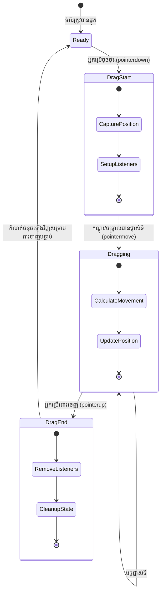
### បង្កើតមុខងារ dragElement

ឥឡូវនេះ មកផលិតមុខងារសំខាន់ដែលនឹងគ្រប់គ្រងយុទ្ធសាស្រ្តទាញទាំងមូល។ បន្ថែមមុខងារនេះក្រោម ប្រកាសធាតុរុក្ខជាតិរបស់អ្នក៖

```javascript
function dragElement(terrariumElement) {
    // ម៉េចដើម្បីតាមដានទីតាំង
    let pos1 = 0,  // ទីតាំងមូលដ្ឋាន X នៃ mouse មុន
        pos2 = 0,  // ទីតាំងមូលដ្ឋាន Y នៃ mouse មុន
        pos3 = 0,  // ទីតាំងបច្ចុប្បន្ន X នៃ mouse
        pos4 = 0;  // ទីតាំងបច្ចុប្បន្ន Y នៃ mouse
    
    // កំណត់សកម្មភាពស្ដាប់ព្រឹត្តិការណ៍ចាប់ផ្តើមDrag
    terrariumElement.onpointerdown = pointerDrag;
}
```

**យល់ដឹងពីប្រព័ន្ធតាមដានទីតាំង៖**
- **`pos1` និង `pos2`**៖ រក្សាការប្រវែងចន្លោះរវាងទីតាំងមក និងចេញនៃសំញ៉ាំកណ្តាល
- **`pos3` និង `pos4`**៖ តាមដានសហវត្សមកបច្ចុប្បន្ន
- **`terrariumElement`**៖ រុក្ខជាតិជាក់លាក់ដែលយើងចង់អោយអាចទាញបាន
- **`onpointerdown`**៖ ព្រឹត្តិការណ៍ដែលកើតឡើងពេលអ្នកប្រើចាប់ផ្តើមទាញ

**គំរូ closure ធ្វើការដូចជា៖**
- **បង្កើត** អថេរទីតាំងផ្ទាល់ខ្លួនសម្រាប់រុក្ខជាតិមួយៗ
- **រក្សា** អថេរទាំងនេះរវាងរបាយការណ៍ទាញ
- **ធានា** រុក្ខជាតិមួយៗតាមដានទីតាំងដោយឯករាជ្យ
- **ផ្តល់** ចំណុចប្រទាក់ស្អាតតាមរយៈមុខងារ `dragElement`

### ហេតុអ្វីប្រើ pointer events?

អ្នកអាចសួរថាហេតុអ្វីយើងប្រើ `onpointerdown` ជំនួស `onclick` ដែលអាចស្គាល់ល្អជាង។ សូមមើលហេតុផល៖

| ប្រភេទព្រឹត្តិការណ៍ | សាកសមសម្រាប់ | ខ្សែសង្វាក់ |
|-------------|--------------|-----------------|
| `onclick` | ចុចប៊ូតុងសាមញ្ញ | មិនត្រួតពិនិត្យការទាញ (គ្រាន់តែចុច និងដោះចុច) |
| `onpointerdown` | ទាំងម៉ៅស៍ និងចុចប៉ុង | ថ្មី ប៉ុន្តែគាំទ្រល្អសព្វថ្ងៃ |
| `onmousedown` | ម៉ៅស៍លើកុំព្យូទ័រតែមួយ | មិនគ្របដណ្តប់អ្នកប្រើម៉ូបាយ |

**ហេតុអ្វី pointer events សមរម្យសម្រាប់អ្វីយើងកំពុងបង្កើត៖**
- **ដំណើរការល្អ** មិនថាអ្នកប្រើម៉ៅស៍ ឬនឹងដៃ ឬជាប៊ិចសរសេរ
- **មានអារម្មណ៍ដូចគ្នា** លើកុំព្យូទ័រ តុប្លេត ឬទូរស័ព្ទ
- **គ្រប់គ្រង** ចលនាទាញពិត (មិនត្រឹមតែចុចអីចុចទេ)
- **ផ្តល់** បទពិសោធពីរមុខងារមានភាពរលូនដែលអ្នកប្រើរង់ចាំពីកម្មវិធីទំនើប

> 💡 **ការពារអនាគត**៖ Pointer events ជាវិធីទំនើបសម្រាប់គ្រប់គ្រងអន្តរកម្ម។ មិនចាំបាច់សរសេរកូដផ្សេងគ្នាសម្រាប់ម៉ៅស៍ និងទស្សនកិច្ចទេ ទទួលបានទាំងពីរបញ្ជ្រាប។

### 🔄 **ពិនិត្យមើលផ្នែកបង្រៀន**
**ការយល់ដឹងពីការគ្រប់គ្រងព្រឹត្តិការណ៍**៖ ឈប់ផ្លាស់ផ្តួចផ្លាស់ផ្តើមដើម្បីបញ្ជាក់ភាពយល់ដឹង៖
- ✅ ហេតុអ្វីយើងប្រើ pointer events ផ្ទាល់ម្ដងទៀត មិនប្រើ mouse events?
- ✅ អថេរ closure រក្សាទុករវាងហៅមុខងារបែបណា?
- ✅ តើយ៉ាងដូចម្តេច `preventDefault()` ជួយឲ្យទាញរលូន?
- ✅ ហេតុអ្វីយើងភ្ជាប់ event listeners ទៅឯកសារម៉្យាង មិនមែនធាតុឯកាក់ៗ?

**ភ្ជាប់ជាមួយពិភពពិត**៖ សូមគិតពីផ្ទាំងទាញ និងដាក់ដែលអ្នកប្រើជាប្រចាំ៖
- **ផ្ទុកឯកសារ**៖ ទាញឯកសារចូលក្នុងកម្មវិធីរុករក
- **ក្រឡាចត្រង្គ Kanban**៖ ផ្លាស់ប្តូរគំនិតរវាងជួរផ្សេងៗ
- **ភាពយន្តពិព័រណ៍**៖ រៀបចំលំដាប់រូបថត
- **ចំណុចប្រទាក់ម៉ូបាយ**៖ កន្រ្តក់ និងទាញលើអេក្រង់ប៉ះ

---

## មុខងារ pointerDrag៖ ចាប់ផ្តើមការទាញ

ពេលអ្នកប្រើចុចលើរុក្ខជាតិ (ជាមួយម៉ៅស៍ ឬដៃប៉ះ) មុខងារ `pointerDrag` ត្រូវបញ្ចាប់ចលនា។ មុខងារនេះយកទីតាំងដើមទាញ និងរៀបចំប្រព័ន្ធទាញ។

បន្ថែមមុខងារនេះនៅក្នុង closure `dragElement` របស់អ្នក បន្ទាប់ពីបន្ទាត់ `terrariumElement.onpointerdown = pointerDrag;`៖

```javascript
function pointerDrag(e) {
    // បម្រាមអាកប្បកិរិយាមូលដ្ឋានរបស់កម្មវិធីរុករក (ដូចជាការជ្រើសអត្ថបទ)
    e.preventDefault();
    
    // ចាប់អាសយដ្ឋានកំណត់កណ្តាលកណ្តាប់ мышឬប៉ះ
    pos3 = e.clientX;  // អ័ក្ស X កន្លែងចាប់ផ្តើមការជ្រុះ
    pos4 = e.clientY;  // អ័ក្ស Y កន្លែងចាប់ផ្តើមការជ្រុះ
    
    // កំណត់អ្នកស្តាប់ព្រឹត្តិការណ៍សម្រាប់ដំណើរការជ្រុះ
    document.onpointermove = elementDrag;
    document.onpointerup = stopElementDrag;
}
```

**ជាដំណាក់កាលៗ វាធ្វើអ្វីខ្លះ៖**
- **បញ្ឈប់** អាកប្បកិរិយាមូលដ្ឋានរបស់កម្មវិធីរុករកដែលអាចរំខានការទាញ
- **កត់ត្រា** ទីតាំងចាប់ផ្តើមនៃ​រូបមនុស្សអ្នកប្រើ
- **បង្កើត** អ្នកស្ដាប់ព្រឹត្តិការណ៍ចលនាទាញបន្ត
- **រៀបចំ** ប្រព័ន្ធតាមដានចលនាមៅស៍/ដៃទាំងមូលឯកសារ

### យល់ដឹងអំពីការទប់ស្កាត់ព្រឹត្តិការណ៍

បន្ទាត់ `e.preventDefault()` ខ្លាំងណាស់សម្រាប់ការទាញរលូន៖

**បើមិនទប់ស្កាត់ ព្រឹត្តិការណ៍រុករកអាច៖**
- **ជ្រើសរើស** ខ្សែអក្សរពេលដង្ហើមគេច្រើនទំព័រ
- **បង្ហាញ** មឺនុយបរិបទពេលចុចស្ដាំ
- **ចុះបរាជ័យ** បុគ្គលិកលេខខាងការទាញផ្ទាល់ខ្លួន
- **បង្ហាញ** បញ្ហាទម្រង់ពេលប្រតិបត្តិការទាញ

> 🔍 **សាកល្បង**៖ បន្ទាប់ពីបញ្ចប់មេរៀននេះ សូមព្យាយាមដោះបញ្ចេញ `e.preventDefault()` ហើយមើលថាវាធ្វើឲ្យបទពិសោធន៍ទាញរបស់អ្នកផ្លាស់ប្ដូរយ៉ាងដូចម្តេច។ អ្នកនឹងយល់បានយ៉ាងឆាប់រហ័សហេតុផលនៃបន្ទាត់នេះ។

### ប្រព័ន្ធតាមដានសមាសភាព

គូផ្សំ `e.clientX` និង `e.clientY` ផ្តល់សមាសភាពម៉ៅស៍/ប៉ះនៃទីតាំងច្បាស់លាស់៖

| សម្បត្តិ | អ្វីដែលវាវាស់ | ករណីប្រើប្រាស់ |
|----------|-----------------|-----------------|
| `clientX` | ទីតាំងផ្លូវដែកទទឹងទាក់ទិនរហែមើល | តាមដានចលនាបង្វិលឆ្វេង-ស្តាំ |
| `clientY` | ទីតាំងផ្លូវដែកកម្ពស់ទាក់ទិនរហែមើល | តាមដានចលនាឡើង-ចុះ |
- **ផ្តល់** ព័ត៌មានកំណត់ទីតាំងពិចខែលបានយ៉ាងច្បាស់លាស់
- **ធ្វើបច្ចុប្បន្នភាព** នៅពេលពេលវេលាពិតទាំងអស់ជាមួយការរីកចម្រើនរបស់អ្នកប្រើ
- **នៅតែម្យ៉ាងត្រួតត្រា** នៅលើទំហំអេក្រង់នានា និងកម្រិតសម្រុងជាបន្តបន្ទាប់
- **អនុញ្ញាត** ការចលនាប្រតិកម្មរលូន និងឆ្លើយតបបានយ៉ាងលឿន

### ការតំឡើងអ្នកស្ដាប់ព្រឹត្តិការណ៍នៅកម្រិតឯកសារ

ចំណាំពីរបៀបយើងភ្ជាប់ព្រឹត្តិការណ៍ចលនានិងបញ្ឈប់ទៅឯកសារទាំងមូល `document` មិនមែនតែធាតុរុក្ខជាតិទេ៖

```javascript
document.onpointermove = elementDrag;
document.onpointerup = stopElementDrag;
```

**ហេតុអ្វីបានភ្ជាប់ទៅឯកសារ:**
- **បន្ត** តាមដានទោះបីជា មាន់កណ្តាប់ដៃខ្លាចចេញពីធាតុរុក្ខជាតិ
- **បង្ការបញ្ហា** ការបំបែកចលនាពីពេលអ្នកប្រើផ្លាស់ទីយ៉ាងលឿន
- **ផ្តល់** ចលនារលូនសង្វាក់នៅលើអេក្រង់ទាំងមូល
- **ដោះស្រាយ** ប្រការព្រួយបារម្ភនៅពេលកណ្តាប់ដៃចុះក្រៅប្រអប់កម្មវិធីរកមើលវេបសាយ

> ⚡ **កំណត់សម្គាល់មុខងារ**: យើងនឹងសម្អាតអ្នកស្ដាប់ព្រឹត្តិការណ៍កម្រិតឯកសារទាំងនេះនៅពេលចលនាបញ្ឈប់ ដើម្បីជៀសវាងការចំណាយអង្គចងចាំ និងបញ្ហាមុខងារ។

## បញ្ចប់ប្រព័ន្ធចាប់ទម្លាក់៖ ចលនា និងការសម្អាត

ឥឡូវនេះយើងនឹងបន្ថែមមុខងារចុងក្រោយទាំងពីរដែលដំណើរការចលនាចាប់ទម្លាក់ពិតៗ និងសម្អាតពេលចាប់ទម្លាក់បញ្ឈប់។ មុខងារទាំងនេះរួមគ្នាបង្កើតចលនារលូន និងឆ្លើយតបទាន់ពេលវេលា នៃរុក្ខជាតិរបស់អ្នកនៅលើទេរេរីរម៉ិន។

### មុខងារ elementDrag: តាមដានចលនា

បន្ថែមមុខងារ `elementDrag` បន្ទាប់ពីសញ្ញាខ្ចីធាត់បិទរបស់ `pointerDrag`៖

```javascript
function elementDrag(e) {
    // គណនាចម្ងាយដែលបានផ្លាស់ទីចាប់តាំងពីព្រឹត្តិការណ៍ចុងក្រោយ
    pos1 = pos3 - e.clientX;  // ចម្ងាយផ្លូវដេកដែលបានផ្លាស់ទី
    pos2 = pos4 - e.clientY;  // ចម្ងាយផ្លូវបញ្ឈរដែលបានផ្លាស់ទី
    
    // កែប្រែតាមដានទីតាំងបច្ចុប្បន្ន
    pos3 = e.clientX;  // ទីតាំង X បច្ចុប្បន្នថ្មី
    pos4 = e.clientY;  // ទីតាំង Y បច្ចុប្បន្នថ្មី
    
    // អនុវត្តចល័តទៅកាន់ទីតាំងធាតុ
    terrariumElement.style.top = (terrariumElement.offsetTop - pos2) + 'px';
    terrariumElement.style.left = (terrariumElement.offsetLeft - pos1) + 'px';
}
```

**ការយល់ដឹងអំពីគណិតវិទ្យាកូអរដោនេ:**
- **`pos1` និង `pos2`**៖ គណនាពីចម្ងាយដែលកណ្តាប់ដៃបានផ្លាស់ទីចាប់តាំងពីបច្ចុប្បន្នភាពចុងក្រោយ
- **`pos3` និង `pos4`**៖ ទុកទីតាំងកណ្តាប់ដៃបច្ចុប្បន្នសម្រាប់គណនាថ្មី
- **`offsetTop` និង `offsetLeft`**៖ ទទួលទីតាំងបច្ចុប្បន្ននៃធាតុនៅលើទំព័រ
- **តុល្យភាពដកស្រង់**៖ ផ្លាស់ទីធាតុដោយចំនួនដូចនឹងកំណត់ចលនាកណ្តាប់ដៃ

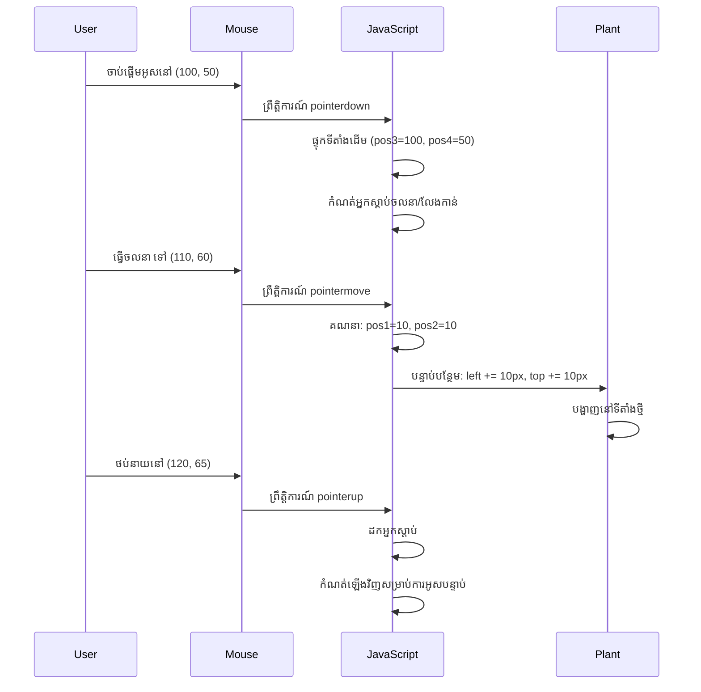
**នេះជាការបំបែកគណនាចលនា៖**
1. **វាស់** បម្រែបម្រួលរវាងទីតាំងកណ្តាប់ដៃចាស់និងថ្មី
2. **គណនា** ចំនួនផ្លាស់ទីរបស់ធាតុដោយផ្អែកលើចលនាកណ្តាប់ដៃ
3. **ធ្វើបច្ចុប្បន្នភាព** គុណលក្ខណ៍ CSS នៃទីតាំងធាតុនៅពេលពិត
4. **រក្សាទុក** ទីតាំងថ្មីជាការចាប់ផ្តើមសម្រាប់ការគណនាចលនាថ្មី

### ការបង្ហាញផ្ទាំងវិចិត្រសិល្បៈនៃគណិតវិទ្យា

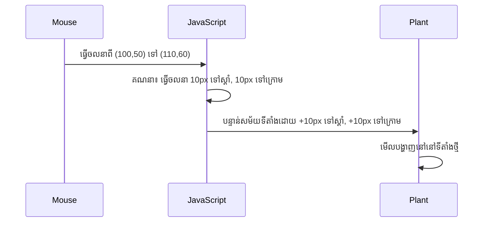
### មុខងារ stopElementDrag: ការសម្អាត

បន្ថែមមុខងារសម្អាតបន្ទាប់ពីសញ្ញាខ្ចីធាត់បិទរបស់ `elementDrag`៖

```javascript
function stopElementDrag() {
    // ទំនួញអ្នកស្ដាប់ព្រឹត្តិប័ត្រថ្នាក់ឯកសារ
    document.onpointerup = null;
    document.onpointermove = null;
}
```

**ហេតុអ្វីសម្អាតគឺសំខាន់:**
- **បញ្ឈប់** ការជម្រាបអង្គចងចាំពីអ្នកស្ដាប់ព្រឹត្តិការណ៍នៅក្រោយ
- **បញ្ឈប់** អាកប្បកិរិយាចាប់ទម្លាក់ទៅពេលអ្នកប្រើដោះវា
- **អនុញ្ញាត** ឲ្យធាតុផ្សេងទៀតអាចចាប់ទម្លាក់ដោយឡែក
- **កំណត់ស្ថានភាព** សម្រាប់ប្រតិបត្តិការចាប់ទម្លាក់លើកក្រោយ

**អ្វីដែលកើតជាមួយបញ្ហាបំផុតក្រោយគ្មានការសម្អាត:**
- អ្នកស្ដាប់ព្រឹត្តិការណ៍បន្តដំណើរការទោះបីចាប់ទម្លាក់ទៅហើយ
- មុខងារព្រួយបារម្ភត្រូវកើតឡើងព្រោះអ្នកស្តាប់មិនបានដក
- អាកប្បកិរិយាមិនបានរំពឹងទុកនៅពេលរៀបចំការបន្តផ្សេងទៀត
- ការចំណាយធនធានកម្មវិធីរកមើលវេបសាយមានច្រើនលើការគ្រប់គ្រងព្រឹត្តិការណ៍មិនចាំបាច់

### ការយល់ដឹងអំពីគុណលក្ខណ៍ CSS ទីតាំង

ប្រព័ន្ធចាប់ទម្លាក់របស់យើងគ្រប់គ្រងគុណលក្ខណ៍ CSS សំខាន់ពីរមាន៖

| គុណលក្ខណ៍ | អ្វីដែលវាគ្រប់គ្រង | របៀបប្រើប្រាស់ |
|----------|------------------|---------------|
| `top` | ចម្ងាយពីមូលដ្ឋានខាងលើ | កំណត់ទីតាំងឈរ ក្នុងអំឡុងចាប់ទម្លាក់ |
| `left` | ចម្ងាយពីមូលដ្ឋានខាងឆ្វេង | កំណត់ទីតាំង ឈរ តាមទិសទ្រង់ទ្រាយ |

**ចំណុចសំខាន់អំពីគុណលក្ខណ៍ offset:**
- **`offsetTop`**៖ ចម្ងាយបច្ចុប្បន្នពីខាងលើនៃធាតុឪពុកដែលបានកំណត់
- **`offsetLeft`**៖ ចម្ងាយបច្ចុប្បន្នពីខាងឆ្វេងនៃធាតុឪពុកដែលបានកំណត់
- **បរិបទកំណត់ទីតាំង**៖ តម្លៃទាំងនេះគឺជាទំនាក់ទំនងទៅថ្មើរជាប់ឪពុកដែលមានទីតាំងកំណត់ជិតបំផុត
- **ការធ្វើបច្ចុប្បន្នភាពពេលពិត**៖ ប្ដូរឡើងវិញភ្លាមពេលយើងផ្លាស់ប្តូរកុំនលក្ខណ៍ CSS

> 🎯 **ទស្សនវិជ្ជានៃការរចនា**: ប្រព័ន្ធចាប់ទម្លាក់នេះត្រូវបានរចនាឡើងយ៉ាងបត់បែន—គ្មាន "តំបន់ទម្លាក់" ឬការកំណត់។ អ្នកប្រើអាចដាក់រុក្ខជាតិទៅកន្លែងណាមួយដោយមានការគ្រប់គ្រងគំនិតប្លែកៗលើការរចនាទេរេរីរម៉ិន។

## រួមបញ្ចូលគ្នា៖ ប្រព័ន្ធចាប់ទម្លាក់របស់អ្នកពេញលេញ

អបអរសាទរ! អ្នកទើបតែបង្កើតប្រព័ន្ធចាប់ទម្លាក់ដែលមានភាពស្មុគស្មាញមួយដោយប្រើ vanilla JavaScript។ មុខងារ `dragElement` របស់អ្នកឥឡូវមានបិទបញ្ជូនមួយរាប់អានមុខងារដែលគ្រប់គ្រង៖

**អ្វីដែលបិទបញ្ជូនរបស់អ្នកធ្វើបាន៖**
- **រក្សា** អថេរកន្លែងឯកជនសម្រាប់រាល់រុក្ខជាតិយ៉ាងឯករាជ្យ
- **គ្រប់គ្រង** សុវត្ថិភាពចាប់ទម្លាក់ចាប់ពីចំណុចចាប់ផ្តើមដល់ចប់
- **ផ្តល់** ចលនារលូន និងឆ្លើយតបលឿននៅលើអេក្រង់ទាំងមូល
- **សម្អាត** ធនធានយ៉ាងត្រឹមត្រូវ ដើម្បីជៀសវាងការចំណាយអង្គចងចាំ
- **បង្កើត** មុខងារយោគយល់ងាយស្រួល និងនិម្មិតសម្រាប់ការរចនាទេរេរីរម៉ិន

### សាកល្បងទេរេរីរម៉ិនបង្កើតដោយអ្នក

ឥឡូវនេះសាកល្បងទេរេរីរម៉ិនបង្កើតដោយអ្នក! បើកឯកសារ `index.html` នៅក្នុងកម្មវិធីរកមើលវេបសាយ ហើយសាកល្បងមុខងារ៖

1. **ចុចហើយកាន់** រុក្ខជាតិណាមួយដើម្បីចាប់ផ្តើមចាប់ទម្លាក់
2. **ផ្លាស់ទីកណ្តាប់ដៃឬម្រាមដៃ** ហើយមើលរុក្ខជាតិអនុវត្តយ៉ាងរលូន
3. **បោះចោល** ដើម្បីទម្លាក់រុក្ខជាតិទៅទីតាំងថ្មី
4. **សាកល្បង** ជាមួយការរៀបចំផ្សេងៗដើម្បីស្វែងយល់ពីផ្ទាំងផ្ទាល់ខ្លួន

🥇 **សមិទ្ធផល**: អ្នកបានបង្កើតកម្មវិធីវេបអ៊ីនធើរ៉ាក់ទីវមួយដោយប្រើគំនិតស្នូលដែលអ្នកអភិវឌ្ឍជំនាញប្រើរៀងរាល់ថ្ងៃ។ មុខងារចាប់ទម្លាក់ទាក់ទងទៅនឹងគោលការណ៍ដូចគ្នានៃការផ្ទុកឯកសារ ការគ្រប់គ្រងទិន្នន័យ Kanban Board និងផ្ទាំងអ៊ីនធើរ៉ាក់ទីវផ្សេងៗទៀត។

### 🔄 **ការត្រួតពិនិត្យវិជ្ជាសាស្ត្រ**
**ការយល់ដឹងប្រព័ន្ធពេញលេញ**៖ បញ្ជាក់ពីការប្រើប្រាស់មុខងារបិទបញ្ជូនដ៏ពេញលេញរបស់អ្នក៖
- ✅ តើបិទបញ្ជូនរក្សាទុកស្ថានភាពឯករាជ្យសម្រាប់រាល់រុក្ខជាតិតូចម៉េច?
- ✅ ហេតុអ្វីគណនាគូរដោនេត្រូវការសំរាប់ចលនារលូន?
- ✅ តើអ្វីជាការកើតមានបើយើងភ្លេចសម្អាតអ្នកស្ដាប់ព្រឹត្តិការណ៍?
- ✅ តើគំរូនេះអាចពង្រីកទៅប្រតិកម្មស្មុគស្មាញជាងនេះដូចម្តេច?

**ការប្រើប្រាស់គុណភាពកូដ**៖ ពិនិត្យដំណោះស្រាយពេញលេញរបស់អ្នក៖
- **រចនាម៉ូឌុល**៖ រាល់រុក្ខជាតិទទួលបានបិទបញ្ជូនផ្ទាល់ខ្លួន
- **ប្រសិទ្ធភាពព្រឹត្តិការណ៍**៖ ការតំឡើង និងសម្អាតអ្នកស្ដាប់សមរម្យ
- **គាំទ្រឧបករណ៍ចម្រុះ**៖ ធ្វើការ លើវិបកុំព្យូទ័រនិងទូរស័ព្ទ
- **ចំណាយមុខងារ**៖ គ្មានការបាត់បង់អង្គចងចាំ ឬការ​គណនា​ចម្រូង​ចម្រាស់

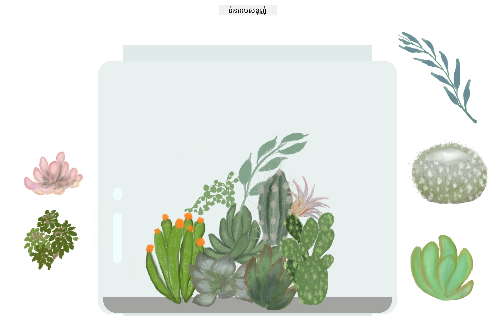

---

## ការប្រកួតប្រជែង GitHub Copilot Agent 🚀

ប្រើរបៀបAgent ដើម្បីបំពេញការប្រកួតប្រជែងដូចខាងក្រោម៖

**ការពិពណ៌នា**៖ ពង្រីកគម្រោងទេរេរីរម៉ិនដោយបន្ថែមមុខងារកំណត់ឡើងវិញដែលនាំឲ្យរុក្ខជាតិទាំងអស់ត្រឡប់ទៅទីតាំងដើមដោយមានចលនារលូន។

**បម្រុង**៖ បង្កើតប៊ូតុងកំណត់ឡើងវិញដែលនៅពេលចុច នឹងធ្វើអង់មេស្យុងឲ្យរុក្ខជាតិទាំងអស់ត្រឡប់ទៅទីតាំងផ្នែកបន្ទាត់ជាមួយការផ្លាស់ប្តូរលម្អៀង CSS។ មុខងារនេះគួរតែរក្សាទុកទីតាំងដើមនៅពេលទំព័រត្រូវបានផ្ទុក ហើយបំលែងរុក្ខជាតិវិញទៅទីតាំងនោះយ៉ាងរលូនរំកិលក្នុងរយៈពេល ១ វិនាទីពេលបានចុចប៊ូតុងកំណត់ឡើងវិញ។

សូមស្វែងយល់បន្ថែមអំពី [របៀបAgent](https://code.visualstudio.com/blogs/2025/02/24/introducing-copilot-agent-mode) នៅទីនេះ។

## 🚀 ការប្រកួតអប្សរៈបន្ថែម៖ ពង្រីកជំនាញរបស់អ្នក

ត្រៀមខ្លួនត្រៀមទទួលទេរេរីរម៉ិនរបស់អ្នកទៅកម្រិតបន្ទាប់? សាកល្បងដំណើរការកែលម្អទាំងនេះ៖

**ការពង្រីកបែបបញ្ចូលគ្នា:**
- **ចុចពីរជាន់ឡើងលើ** រុក្ខជាតិ ដើម្បីនាំវាទៅមុខ (ការគ្រប់គ្រង z-index)
- **បន្ថែមមតិយោបល់ភ្នែក** ដូចជាភ្លឺយាយមួយបន្តិចនៅពេលបង្ហាញលើរុក្ខជាតិ
- **អនុវត្តការបង្កប់ដែនកំណត់** ដើម្បីមិនឲ្យរុក្ខជាតិចាប់ទម្លាក់ទៅក្រៅទេរេរីរម៉ិន
- **បង្កើតមុខងាររក្សាទុក** ដែលចងចាំទីតាំងរុក្ខជាតិដោយផ្អែកលើ localStorage
- **បន្ថែមសម្លេង** សម្រាប់ការលើក និងដាក់រុក្ខជាតិ

> 💡 **ឱកាសរៀន**: ការប្រកួតប្រជែងទាំងនេះនឹងបង្រៀនអ្នកពីចំណុចថ្មីៗនៃការកែលម្អ DOM ការគ្រប់គ្រងព្រឹត្តិការណ៍ និងការរចនាបទពិសោធន៍អ្នកប្រើ។

## សំនួរប្រលងខាងក្រោយថ្នាក់

[សំនួរប្រលងបន្ទាប់ថ្នាក់](https://ff-quizzes.netlify.app/web/quiz/20)

## ពិនិត្យមើល និងរៀនដោយខ្លួនឯង៖ ការផ្លាស់ប្តូរជ្រាលជ្រៅក្នុងការយល់ដឹងរបស់អ្នក

អ្នកបានចេះដឹងមូលដ្ឋានរបស់ DOM manipulation និង closures តែមានតែងតែមានអ្វីខ្លះសម្រាប់ស្វែងយល់បន្ថែម! ខាងក្រោមជាចំណុចណែនាំសម្រាប់ពង្រីកចំណេះដឹង និងជំនាញរបស់អ្នក។

### វិធីសាស្ត្រចាប់ទម្លាក់ទម្លាក់ជាជម្រើសផ្សេងៗ

យើងបានប្រើ pointer events ដើម្បីមានភាពបត់បែនខ្ពស់បំផុត ប៉ុន្តែមូលដ្ឋានបណ្តាញមានជម្រើសជាច្រើន៖

| វិធីសាស្ត្រ | សមស្របសម្រាប់ | តម្លៃរៀនសូត្រ |
|----------|----------|----------------|
| [HTML Drag and Drop API](https://developer.mozilla.org/docs/Web/API/HTML_Drag_and_Drop_API) | ផ្ទុកឯកសារ និងតំបន់ចាប់ទម្លាក់ផ្លូវការហ្នឹង | ការយល់ដឹងសមត្ថភាពម៉ាស៊ីនរកមើលវេបសាយដើម |
| [Touch Events](https://developer.mozilla.org/docs/Web/API/Touch_events) | ប្រតិកម្មជាក់លាក់លើទូរស័ព្ទចល័ត | គំរូអភិវឌ្ឍន៍ផ្អែកលើទូរស័ព្ទជាដំបូង |
| គុណលក្ខណ៍ CSS `transform` | អាំងមេស្យុងរលូន | បច្ចេកទេសបង្កើនប្រសិទ្ធភាព |

### ប្រធានបទកម្រិតខ្ពស់នៃ DOM Manipulation

**ជំហានបន្ទាប់ក្នុងដំណើររបស់អ្នក៖**
- **ការបញ្ជូនព្រឹត្តិការណ៍**: គ្រប់គ្រងព្រឹត្តិការណ៍ឲ្យមានប្រសិទ្ធភាពសម្រាប់ធាតុជាច្រើន
- **Intersection Observer**: សម្គាល់ពេលធាតុចូល/ចេញពីកន្លែងបង្ហាញ
- **Mutation Observer**: មើលការផ្លាស់ប្ដូរនៅទំរង់ DOM
- **គ្រឿងបន្លាស់វេប**: បង្កើត UI ប្រើឡើងវិញដែលមានបិទបញ្ជូន
- **គំនិត Virtual DOM**: យល់ពីលទ្ធកម្មដែល frameworks ប្រើសម្រាប់បន្ទាន់សម័យ DOM

### ឯកសារសំខាន់សម្រាប់បន្តរៀន

**ឯកសារបច្ចេកទេស:**
- [MDN Pointer Events Guide](https://developer.mozilla.org/docs/Web/API/Pointer_events) - ឯកសារយោងព្រឹត្តិការណ៍ pointer
- [W3C Pointer Events Specification](https://www.w3.org/TR/pointerevents1/) - ឯកសារតំរូវការផ្លូវការ
- [JavaScript Closures Deep Dive](https://developer.mozilla.org/docs/Web/JavaScript/Closures) - គំរូកម្រិតខ្ពស់នៅលើ closures

**ការគាំទ្រព្រមទាំងកម្មវិធីរកមើល:**
- [CanIUse.com](https://caniuse.com/) - ប្រៀបធៀបទៅនឹងគ្រប់កម្មវិធីរកមើល
- [MDN Browser Compatibility Data](https://github.com/mdn/browser-compat-data) - ពត៌មានលម្អិតរួម

**ឱកាសហាត់ប្រាណ:**
- **បង្កើត** ល្បែង puzzle ដោយប្រើចលនាចាប់ទម្លាក់
- **បង្កើត** បញ្ជីការងារ Kanban ជាមួយការគ្រប់គ្រងតាមការចាប់ទម្លាក់
- **រចនា** ផ្ទះរូបភាពជាមួយការរៀបចំរូបភាពដែលអាចចាប់ទម្លាក់បាន
- **សាកល្បង** ការចលនាពីស្នាដៃពាក់កណ្តាប់ដៃសម្រាប់ផ្ទាំងទូរស័ព្ទចល័ត

> 🎯 **យុទ្ធសាស្ត្ររៀន**: វិធីល្អបំផុតក្នុងការចងក្រងចំណេះដឹងទាំងនេះគឺតាមរយៈការអនុវត្ត។ សាកល្បងបង្កើតរូបមន្តរូបភាពចាប់ទម្លាក់នានា – រាល់គំរោងនឹងបង្រៀនអ្នកអំពីប្រតិកម្មអ្នកប្រើ និង DOM manipulation។

### ⚡ **អ្វីដែលអ្នកអាចធ្វើបានក្នុង ៥ នាទីបន្ទាប់**
- [ ] បើក DevTools កម្មវិធីរកមើល ហើយវាយ `document.querySelector('body')` ក្នុង console
- [ ] ព្យាយាមផ្លាស់ប្ដូរអត្ថបទក្នុងគេហទំព័រដោយប្រើ `innerHTML` ឬ `textContent`
- [ ] បន្ថែមអ្នកស្ដាប់ព្រឹត្តិការណ៍ចុចទៅកាន់ប៊ូតុងឬតំណភ្ជាប់ណាមួយលើគេហទំព័រ
- [ ] ពិនិត្យរចនាសម្ព័ន្ធ DOM tree ដោយប្រើផ្ទាំង Elements

### 🎯 **អ្វីដែលអ្នកអាចបំពេញបានក្នុង​មួយ​ម៉ោងនេះ**
- [ ] បញ្ចប់សំនួរប្រលងបន្ទាប់ថ្នាក់ និងពិនិត្យមើលគំនិត DOM manipulation
- [ ] បង្កើតគេហទំព័រអ៊ីនធើរ៉ាក់ទីវដែលឆ្លើយតបចំពោះការចុចអ្នកប្រើ
- [ ] ហាត់ការគ្រប់គ្រងព្រឹត្តិការណ៍ជាមួយវ៉ារ្យប៊ុលព្រឹត្តិការណ៍ផ្សេងៗ (ចុច, រុំលើ, ចុចក្តារចុច)
- [ ] បង្កើតបញ្ជីធ្វើការ ឬម៉ាស៊ីនរាប់កំណត់ដោយប្រើ DOM manipulation
- [ ] ស្វែងយល់ទំនាក់ទំនងរវាងធាតុ HTML និងអ объект Javascript

### 📅 **ដំណើរការជាមួយ JavaScript រយៈពេលមួយសប្ដាហ៍**
- [ ] បំពេញគម្រោងទេរេរីរម៉ិនអ៊ីនធើរ៉ាក់ទីវជាមួយមុខងារចាប់ទម្លាក់
- [ ] ចេះឱ្យបានជំនាញការបញ្ជូនព្រឹត្តិការណ៍ផ្នែកមានប្រសិទ្ធភាព
- [ ] រៀនអំពី event loop និង JavaScript មិនសូវជ្រាបដល់
- [ ] ហាត់ការបិទបញ្ជូនដោយបង្កើតម៉ូឌុលដែលមានស្ថានភាពឯកជន
- [ ] ស្វែងយល់ពី API DOM របស់សម័យថ្មីៗដូចជា Intersection Observer
- [ ] បង្កើតធាតុអ៊ីនធើរ៉ាក់ទីវដោយគ្មាន frameworks

### 🌟 **ជំនាញ JavaScript រយៈពេលមួយខែរបស់អ្នក**
- [ ] បង្កើតកម្មវិធីទំព័រតែមួយស្មុគស្មាញដោយប្រើ vanilla JavaScript
- [ ] រៀន frameworks សម័យថ្មី (React, Vue, ឬ Angular) ហើយប្រៀបធៀបជាមួយ DOM vanilla
- [ ] ចូលរួមគម្រោង open source JavaScript
- [ ] ចេះគំនិតកម្រិតខ្ពស់ដូចជា web components និង custom elements
- [ ] បង្កើតកម្មវិធីវេបមានប្រសិទ្ធភាពដោយគំរូ DOM អុបទិម
- [ ] បង្រៀនអ្នកផ្សេងទៀតអំពី DOM manipulation និងគំនិតមូលដ្ឋាន JavaScript

## 🎯 រយៈពេលសម្រាំងជំហានជំនាញ DOM JavaScript របស់អ្នក

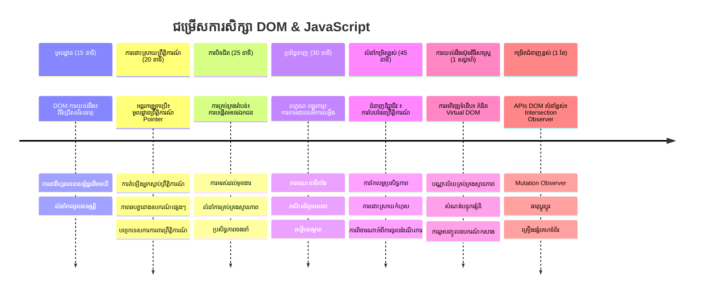
### 🛠️ សង្ខេបឧបករណ៍ JavaScript របស់អ្នក

បន្ទាប់ពីបញ្ចប់មេរៀននេះ អ្នកមាន៖
- **ជំនាញ DOM**: ជ្រើសរើសធាតុ ការគ្រប់គ្រងគុណលក្ខណ៍ និងការបើកប្រាក់ដើមទន់
- **ជំនាញព្រឹត្តិការណ៍**: ការគ្រប់គ្រងអន្តរកម្មឆ្លើយតបចម្រុះឧបករណ៍ជាមួយ pointer events
- **ការយល់ដឹងពី closures**: ការគ្រប់គ្រងស្ថានភាពឯកជន និងការបន្តនៅក្នុងមុខងារ
- **ប្រព័ន្ធអ៊ីនធើរ៉ាក់ទីវ**: ការអនុវត្តចាប់ទម្លាក់ទម្លាក់ពីគន្លងក្នុង
- **ប្រសិទ្ធភាព**: ការសម្អាតព្រឹត្តិការណ៍ និងគ្រប់គ្រងអង្គចងចាំត្រឹមត្រូវ
- **គំរូសម័យថ្មី**: គន្លងកូដដែលបានប្រើនៅក្នុងការអភិវឌ្ឍជំនាញវិជ្ជាជីវៈ
- **បទពិសោធន៍អ្នកប្រើ**: បង្កើតផ្ទាំងមានប្រតិកម្មងាយប្រើ និងឆ្លើយតបរលូន

**ជំនាញវិជ្ជាជីវៈដែលទទួលបាន**: អ្នកបានបង្កើតមុខងារដូចគ្នានឹង
- **បន្ទះ Trello/Kanban**: ចាប់ទម្លាក់កាតជារៀងរាល់ស៊ីស្តម
- **ប្រព័ន្ធផ្ទុកឯកសារ**: គ្រប់គ្រងចាប់ទម្លាក់ទម្លាក់ឯកសារ
- **ផ្ទះរូបភាព**: ផ្ទាំងរៀបចំរូបភាពបានខ្ពស់
- **កម្មវិធីទូរស័ព្ទ**: គំរូអន្តរកម្មប៉ះ

**ជំហានបន្ទាប់**: អ្នកមានត្រៀមខ្លួនសម្រាប់ចូលរៀនស្គាល់ frameworks សម័យថ្មីដូចជា React, Vue, ឬ Angular ដែលបន្ថែមមុខងារចូលពីគំនិត DOM manipulation មូលដ្ឋានផងដែរ!

## ការងារ

[ធ្វើការជាមួយ DOM បន្ថែម](assignment.md)

---

<!-- CO-OP TRANSLATOR DISCLAIMER START -->
**ការបដិសេធ**៖
ឯកសារនេះត្រូវបានបកប្រែដោយប្រើសេវាកម្មបកប្រែ AI [Co-op Translator](https://github.com/Azure/co-op-translator)។ ខណៈពេលយើងខិតខំរកភាពត្រឹមត្រូវ សូមចងចាំថាការបកប្រែដោយស្វ័យប្រវត្តិអាចមានកំហុស ឬភាពមិនត្រឹមត្រូវ។ ឯកសារដើមក្នុងភាសាម្ដងនឹងត្រូវបានគេចាត់ទុកជាផ្នែកទិន្នន័យផ្លូវការជាមូលដ្ឋាន។ สำหรับThông tin quan trọng, khuyến nghị nên sử dụng dịch vụ dịch thuật chuyên nghiệp do con người thực hiện។ យើងមិនទទួលខុសត្រូវចំពោះការយល់ច្រឡំ ឬការបកប្រែខុស ទាំងស្រុងដែលកើតមានពីការប្រើប្រាស់ការបកប្រែនេះឡើយ។
<!-- CO-OP TRANSLATOR DISCLAIMER END -->