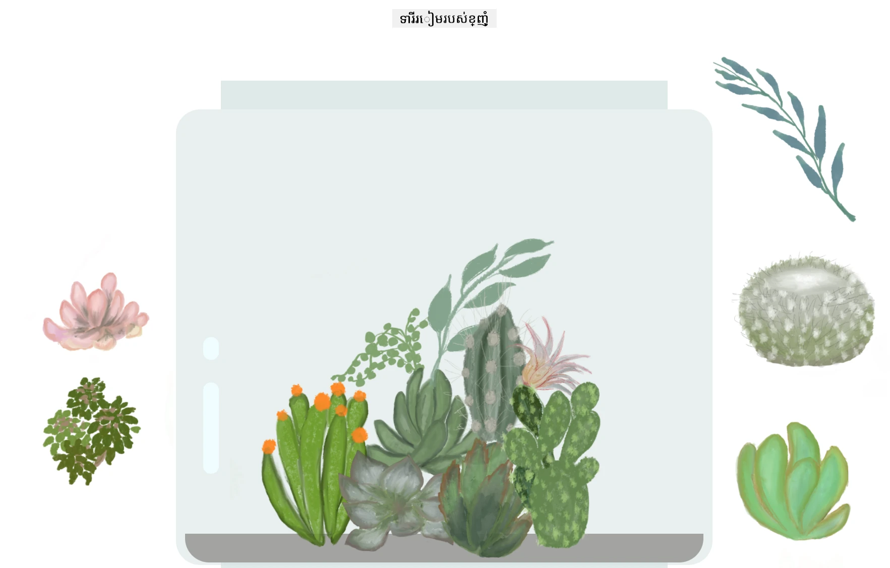

# កន្លែងដាំរុក្ខជាតិរបស់ខ្ញុំ៖ គម្រោងសម្រាប់ការសិក្សាអំពី HTML, CSS និងការគ្រប់គ្រង DOM ដោយប្រើ JavaScript 🌵🌱

ការប្រមូលកូដតូចៗដោយទាញ និងទម្លាក់។ ជាមួយនឹង HTML, JS និង CSS ទំហំតូច អ្នកអាចបង្កើតការផ្ទាំងវ៉ែប ស្ទីលវា និងបន្ថែមអន្តរកម្ម។

## ការសរសើរ

បានសរសេរជាមួយ ♥️ ដោយ [Jen Looper](https://www.twitter.com/jenlooper)

កន្លែងដាំរុក្ខជាតិដែលបង្កើតឡើងតាមរយៈ CSS ត្រូវបានចូលបំផុតពីកូដកន្ត្រកកំផ្លេណ៍របស់ Jakub Mandra [codepen](https://codepen.io/Rotarepmi/pen/rjpNZY)។

ស្នាដៃវិចិត្រសិល្បៈត្រូវបានគូរដោយដៃ ដោយ [Jen Looper](http://jenlooper.com) ប្រើប្រាស់កម្មវិធី Procreate។

## បញ្ចូនកន្លែងដាំរុក្ខជាតិរបស់អ្នក

អ្នកអាចបញ្ចូន ឬផ្សព្វផ្សាយកន្លែងដាំរុក្ខជាតិរបស់អ្នកទៅលើវ៉ែបដោយប្រើ Azure Static Web Apps។

1. Fork ដាក់កូដនេះ

2. ចុចប៊ូតុងនេះ

3. ដើរតាមកម្មវិធីមនុស្សដឹកនាំបង្កើតកម្មវិធីរបស់អ្នក។ ត្រូវប្រាកដថាអ្នកបានកំណត់ root app ទៅជា `/solution` ឬ root នៃកូដប៊េសរបស់អ្នក។ គ្មាន API នៅក្នុងកម្មវិធីនេះ ដូច្នេះកុំបារម្ភអំពីការបន្ថែមវា។ ថត .github នឹងត្រូវបានបង្កើតនៅក្នុង repo ដែលបាន fork នេះ ដែលនឹងជួយសេវាកម្មកសាងរបស់ Azure Static Web Apps ក្នុងការសាងសង់ និងផ្សព្វផ្សាយកម្មវិធីរបស់អ្នកទៅ URL ថ្មីមួយ។

---

<!-- CO-OP TRANSLATOR DISCLAIMER START -->
**ការបដិសេធ**៖  
ឯកសារនេះត្រូវបានបកប្រែដោយប្រើសេវាកម្មបកប្រែ AI [Co-op Translator](https://github.com/Azure/co-op-translator)។ ខណៈពេលយើងខិតខំសម្រាប់ភាពត្រឹមត្រូវ សូមយល់ព្រមថាការបកប្រែដោយស្វ័យប្រវត្ដិអាចមានកំហុស ឬមិនត្រឹមត្រូវ។ ឯកសារដើមជាភាសាមូលដ្ឋានគួរត្រូវបានគេយកទៅជាប្រភពដែលមានអំណាច។ សម្រាប់ព័ត៌មានសំខាន់ៗ សូមណែនាំឱ្យប្រើការបកប្រែដោយអ្នកជំនាញមនុស្ស។ យើងមិនទទួលខុសត្រូវចំពោះការយល់ច្រឡំ ឬការ អត្រាខុសផ្សេងៗដែលកើតឡើងពីការប្រើប្រាស់ការបកប្រែនេះទេ។
<!-- CO-OP TRANSLATOR DISCLAIMER END -->