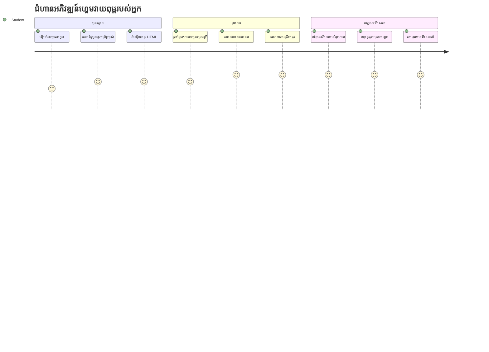
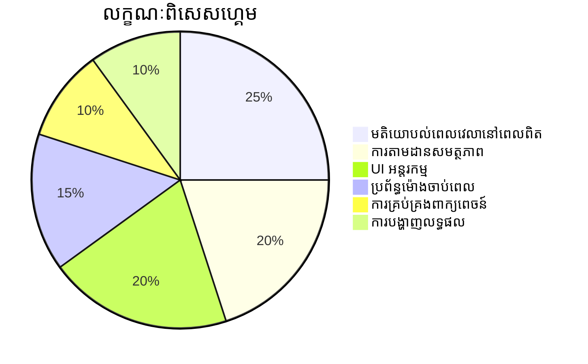
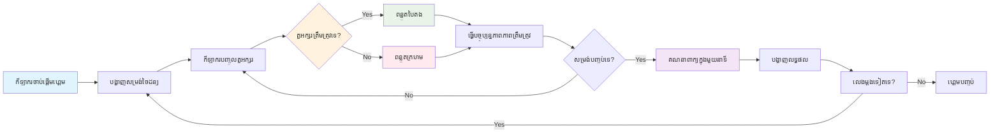
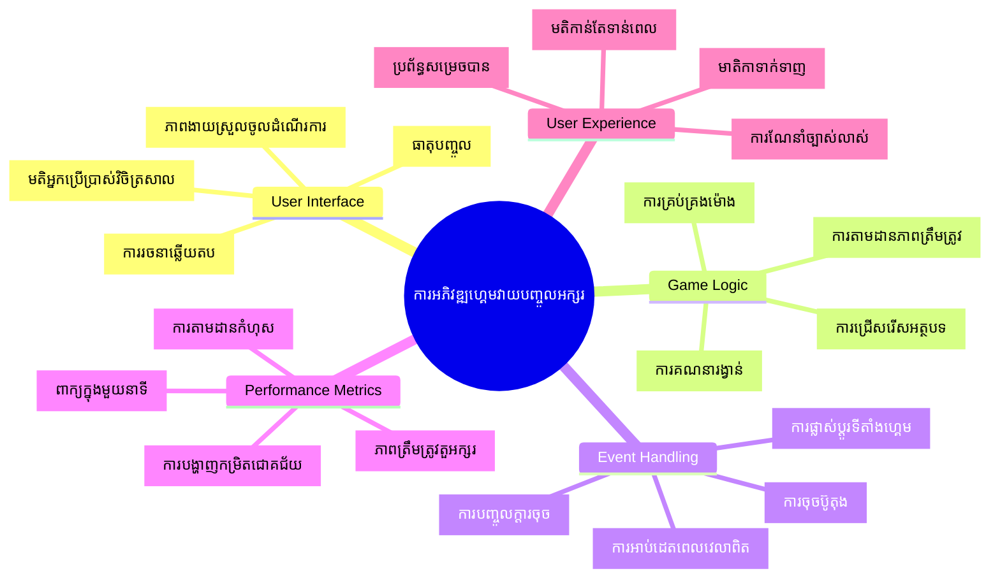
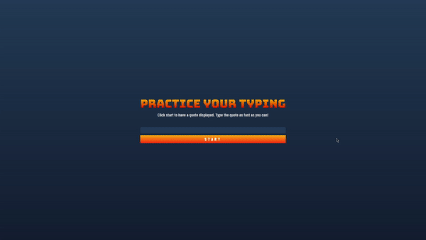
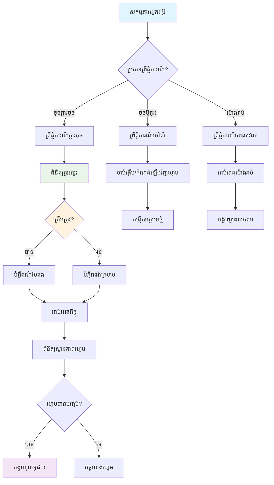
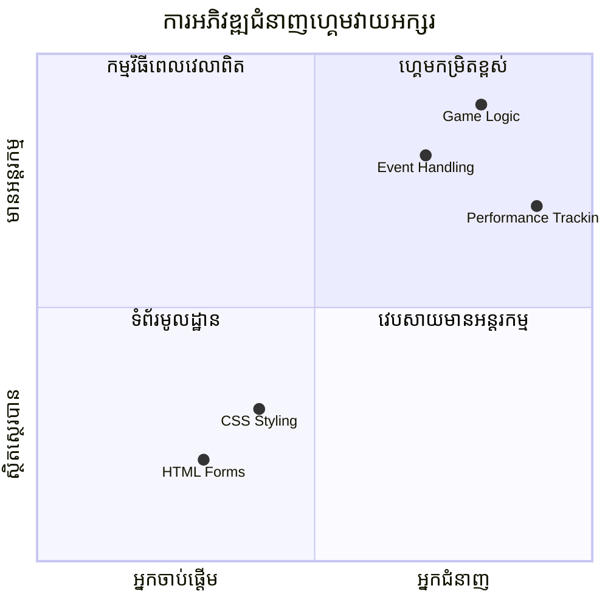
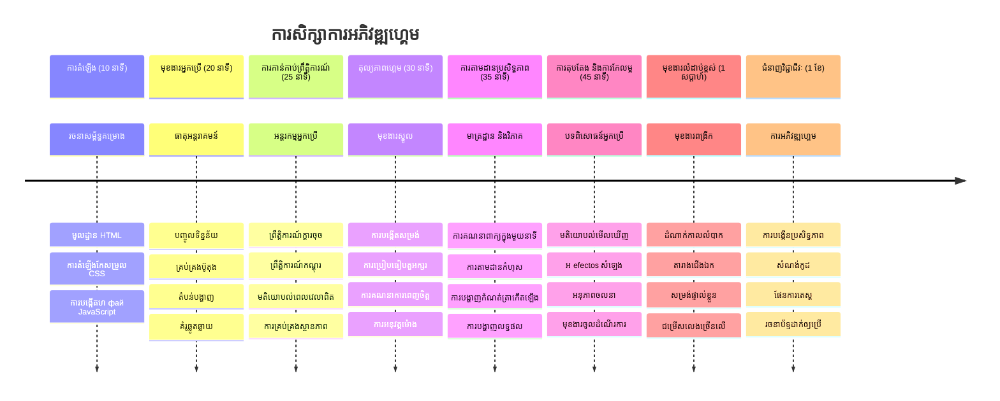

# កម្មវិធីប្លែកខ្លួនដោយព្រឹត្តិការណ៍ - សាងសង់ហ្គេមវាយអក្សរ

## ការណែនាំ

នេះជារឿងដែលអ្នកអភិវឌ្ឍន៍គ្រប់រូបដឹង ប៉ុន្តែមិនដែលនិយាយច្រើនទេ៖ វាយអក្សរលឿនគឺជាពលរដ្ឋពិសេសមួយ! 🚀 សូមចងចាំថា - លឿនប៉ុណ្ណាដែលអ្នកអាចយកគំនិតពីខួរក្បាលទៅកាន់កម្មវិធីកូដបានត្រង់ណា ការច្នៃប្រឌិតរបស់អ្នកនឹងហូរច្រើនប៉ុណ្ណា។ វាដូចជាម៉ាស៊ីនផ្លូវផ្ទាល់ខាងតាំងពីគំនិតរបស់អ្នកមកកាន់អេក្រង់។

ចង់ដឹងពីវិធីល្អបំផុតមួយសម្រាប់ធ្វើឲ្យជំនាញនេះប្រសើរឡើងទេ? អ្នកត្រូវសន្មត់ហើយ - យើងនឹងសាងសង់ហ្គេមមួយ!

> មកបង្កើតហ្គេមវាយអក្សរដ៏អស្ចារ្យរួមគ្នា!

តើអ្នកបានត្រៀមខ្លួនសម្រាប់ដាក់ជំនាញ JavaScript, HTML និង CSS ដែលអ្នកបានរៀនមកហើយចូលប្រើប្រាស់ទេ? យើងនឹងសង់ហ្គេមវាយអក្សរមួយដែលនឹងបញ្ចេញការប្រកួតប្រជែងជាមួយអត្ថបទចម្លែកៗពីអ្នកស៊ើបអង្កេតដ៏ល្បី [Sherlock Holmes](https://en.wikipedia.org/wiki/Sherlock_Holmes)។ ហ្គេមនេះនឹងតាមដានថាអ្នកអាចវាយលឿននិងត្រឹមត្រូវប៉ុណ្ណា - ហើយជឿល្អថា វាធ្វើឲ្យអ្នកចូលចិត្តជាងដែលអ្នកគិត!

## អ្វីដែលអ្នកត្រូវដឹង

មុនពេលចាប់ផ្តើម សូមធ្វើអោយប្រាកដថាអ្នកស្គាល់យ៉ាងដឹងដល់ពីគំនិតទាំងនេះ (កុំបារម្ភបើអ្នកត្រូវការចងចាំម្តងទៀត - ពួកយើងគ្រប់រូបធ្លាប់មានទីនេះ!)៖

- ការបង្កើតប្រអប់បញ្ចូលអក្សរ និងប៊ូតុង
- CSS និងការកំណត់រចនាបថតាមតាថ្នាក់  
- មូលដ្ឋាន JavaScript
  - បង្កើតអារេ
  - បង្កើតលេខចៃដន្យ
  - ទទួលពេលវេលាបច្ចុប្បន្ន

បើមានអ្វីណាមួយមើលទៅមិនពិសេសទេ វា​ត្រូវ​ឲ្យ​ចេះ​សុខសប្បាយ! ពេលខ្លះវិធីល្អបំផុតសម្រាប់មាំមួនជំនាញគឺចូលទៅក្នុងគម្រោងមួយហើយស្វែងរកដំណោះស្រាយដូចដែលអ្នកធ្វើ។

### 🔄 **ការត្រួតពិនិត្យគន្លងរៀន**
**ការវាយតម្លៃមូលដ្ឋាន**៖ មុនចាប់ផ្តើមការអភិវឌ្ឍ ត្រូវប្រាកដថាអ្នកយល់ដឹងពី៖
- ✅ របៀប HTML form និងធាតុ input ដំណើរការ
- ✅ ថ្នាក់ CSS និងការរៀបរយរចនាបថ dynamique
- ✅ អ្នកស្ដាប់ព្រឹត្តិការណ៍ JavaScript និងអ្នកគ្រប់គ្រង
- ✅ ការកែច្នៃអារេ និងជ្រើសយកចៃដន្យ
- ✅ ការវាស់វេលា និងគណនា

**ការប្រលងខ្លីផ្ទាល់ខ្លួន**៖ តើអ្នកអាចពន្យល់ថាគំនិតទាំងនេះធ្វើការ ដោយសហគ្រិនក្នុងហ្គេមប្រតិបត្តិការថែមទៀតដូចម្តេច?
- **ព្រឹត្តិការណ៍** បញ្ចេញពេលអ្នកប្រើប្រាស់អង្គធាតុ
- **អ្នកគ្រប់គ្រង** ដំណើរការព្រឹត្តិការណ៍និងធ្វើបច្ចុប្បន្នភាពស្ថានភាពហ្គេម
- **CSS** ផ្តល់មតិយោបល់សម្រាប់សកម្មភាពអ្នកប្រើប្រាស់
- **ពេលវេលា** អនុញ្ញាតឲ្យវាស់វែងការប្រតិបត្តិ និងដំណើរការហ្គេម

## មកសាងសង់រឿងនេះ!

[ការបង្កើតហ្គេមវាយអក្សរដោយប្រើកម្មវិធីប្លែកខ្លួនដោយព្រឹត្តិការណ៍](./typing-game/README.md)

### ⚡ **អ្វីដែលអ្នកអាចធ្វើបានក្នុងរយៈពេល 5 នាទីក្រោយនេះ**
- [ ] បើកផ្ទាំង console របស់អ្នក និងសាកល្បងស្តាប់ព្រឹត្តិការណ៍ក្តារចុចជាមួយ `addEventListener`
- [ ] បង្កើតទំព័រ HTML សាមញ្ញមួយជាមួយប្រអប់បញ្ចូល និងសាកល្បងរកដំណឹងវាយអក្សរ
- [ ] ប្រើប្រាស់ការបំលែងខ្សែអក្សរដោយប្រៀបធៀបអក្សរវាយនិងអក្សរគោលដៅ
- [ ] សាកល្បង `setTimeout` ដើម្បីយល់ពីមុខងារពេលវេលា

### 🎯 **អ្វីដែលអ្នកអាចសម្រេចបានក្នុង​មួយម៉ោងនេះ**
- [ ] បញ្ចប់ការប្រលងក្រោយមេរៀនហើយយល់ដឹងពីកម្មវិធីប្លែកខ្លួនដោយព្រឹត្តិការណ៍
- [ ] សាងសង់ជំនាន់មូលដ្ឋាននៃហ្គេមវាយអក្សរជាមួយការត្រួតពិនិត្យពាក្យ
- [ ] បន្ថែមមតិយោបល់វិជ្ជមានសម្រាប់ការវាយត្រឹមត្រូវនិងមិនត្រឹមត្រូវ
- [ ] អនុវត្តប្រព័ន្ធពិន្ទុសាមញ្ញដោយផ្អែកលើល្បឿននិងការត្រឹមត្រូវ
- [ ] បំពាក់រចនាបថហ្គេមរបស់អ្នកជាមួយ CSS ដើម្បីធ្វើឲ្យវាស្រស់ស្អាត

### 📅 **ការអភិវឌ្ឍហ្គេមរយៈពេលមួយសប្តាហ៍របស់អ្នក**
- [ ] បញ្ចប់ហ្គេមវាយអក្សរពេញលេញជាមួយមុខងារទាំងអស់ និងការសម្រួល
- [ ] បន្ថែមកម្រិតភាពតឹងរឹងជាមួយភាពស្មុគស្មាញនៃពាក្យផ្សេងៗគ្នា
- [ ] អនុវត្តការតាមដានស្ថិតិអ្នកប្រើប្រាស់ (WPM, ការត្រឹមត្រូវក្រោមពេលវេលា)
- [ ] បង្កើតផលប៉ះពាល់សម្លេងនិងសកម្មភាពសម្រាប់បទពិសោធន៍ប្រើប្រាស់ល្អប្រសើរ
- [ ] ធ្វើឲ្យហ្គេមរបស់អ្នកឆបគ្នាជាមួយទូរស័ព្ទដៃសំរាប់ការប៉ះប៉ោះ
- [ ] ចែករំលែកហ្គេមរបស់អ្នកតាមអ៊ីនធឺណិត ហើយប្រមូលមតិយោបល់ពីអ្នកប្រើប្រាស់

### 🌟 **ការអភិវឌ្ឍរបស់អ្នករយៈពេលមួយខែ**
- [ ] សាងសង់ហ្គេមច្រើនៗស្វែងរក​គន្លងអន្តរកម្មផ្សេងៗគ្នា
- [ ] រៀនអំពីរលកហ្គេម, ការគ្រប់គ្រងស្ថានភាព, និងការបង្កើនប្រសិទ្ធភាព
- [ ] ចូលរួមខែក្នុងគម្រោងអភិវឌ្ឍហ្គេម Open source
- [ ] ជំនាញខ្ពស់ក្នុងគន្លងពេលវេលា និងសកម្មភាពរលូន
- [ ] បង្កើតពូត្វហ្វូលីយ៉ូបង្ហាញកម្មវិធីអន្តរកម្មច្រើន
- [ ] ជាមេធាវីអូបង្គំអ្នកដទៃចាប់អារម្មណ៍ការអភិវឌ្ឍហ្គេម និងអន្តរកម្មអ្នកប្រើ

## 🎯 ពេលវេលាសម្រាប់មានជំនាញល្បឿនវាយអក្សររបស់អ្នក

### 🛠️ សង្ខេបឧបករណ៍អភិវឌ្ឍហ្គេមរបស់អ្នក

បន្ទាប់ពីបញ្ចប់គម្រោងនេះ អ្នកនឹងមានជំនាញលើ៖
- **កម្មវិធីប្លែកខ្លួនដោយព្រឹត្តិការណ៍**: ចំណុចប្រទាក់ប្រតិកម្មដែលឆ្លើយតបទៅនឹងការបញ្ចូល
- **មតិយោបល់ពេលវេលាចាំបាច់**: ការអាប់ដេតភ្លាមៗទាំងត្រឹមត្រូវនិងការបង្ហាញ
- **ការវាស់វែងប្រសិទ្ធភាព**: ការវាស់វេលានិងប្រព័ន្ធពិន្ទុត្រឹមត្រូវ
- **ការគ្រប់គ្រងស្ថានភាពហ្គេម**: គ្រប់គ្រងដំណើរការនិងបទពិសោធន៍អ្នកប្រើ
- **រចនាបទអន្តរកម្ម**: បង្កើតបទពិសោធន៍ដែលគួរឲ្យចាប់អារម្មណ៍ និងបង្វិលរូប
- **Web APIs សម័យថ្មី**: ប្រើប្រាស់សមត្ថភាពប្រេរស័ព្ទសម្រាប់អន្តរកម្មសម្បូរ
- **លំនាំគាំទ្រអ្នកចូលដំណើរការ**: រចនាដើម្បីចូលរួមសំរាប់អ្នកប្រើគ្រប់រូប

**កម្មវិធីដាក់ឲ្យប្រើបានជាក់ស្តែង**៖ ជំនាញទាំងនេះអាចប្រើប្រាស់ថ្ងៃនេះដូចជា៖
- **កម្មវិធីវែប**: ចំណុចប្រទាក់អន្តរកម្មឬផ្ទាំងតំណាងណាមួយ
- **កម្មវិធីសិក្សា**: វេទិកាអប់រំ និងឧបករណ៍វាយតម្លៃជំនាញ
- **ឧបករណ៍ផលិតកម្ម**: កម្មវិធីកែសម្រួលអត្ថបទ IDE និងកម្មវិធីសហការណ៍
- **ឧស្សាហកម្មហ្គេម**: ហ្គេមប្រេរស័ព្ទ និងកម្សាន្តអន្តរកម្ម
- **អភិវឌ្ឍន៍លើទូរស័ព្ទដៃ**: ចំណុចប្រទាក់ប៉ះប៉ះ និងការរងចាំចលនា

**កម្រិតបន្ទាប់**: អ្នកបានត្រៀមខ្លួនសម្រាប់ជ្រាបចូលក្នុងផ្នែកហ្គេមកម្រិតខ្ពស់ ប្រព័ន្ធពហុអ្នកលេងពេលវេលាពិត ឬកម្មវិធីអន្តរកម្មស្មុគស្មាញ!

## ខ្លឹមសារ​ប្រគល់កិត្តិយស

បានសរសេរជាមួយ ♥️ ដោយ [Christopher Harrison](http://www.twitter.com/geektrainer)

---

<!-- CO-OP TRANSLATOR DISCLAIMER START -->
**ការបដិសេធ**៖  
ឯកសារនេះបានបកប្រែដោយប្រើសេវាកម្មបកប្រែ AI [Co-op Translator](https://github.com/Azure/co-op-translator)។ ខណៈពេលដែលយើងខំប្រឹងរកភាពត្រឹមត្រូវ សូមយល់ដឹងថាការបកប្រែដោយស្វ័យប្រវត្តិអាចមានកំហុស ឬភាពមិនត្រឹមត្រូវ។ ឯកសារដើមនៅភាសាម្ចាស់គួรถูกទុកចិត្តឲ្យជាឯកសារដែលមានអំណាច។ សម្រាប់ព័ត៌មានសំខាន់ ការប្រែដោយអ្នកជំនាញមនុស្សគឺត្រូវបានអញ្ជើញណែនាំ។ យើងមិនទទួលខុសត្រូវចំពោះការយល់ច្រឡំ ឬការបកប្រែខុសពីការប្រើប្រាស់ការបកប្រែនេះឡើយ។
<!-- CO-OP TRANSLATOR DISCLAIMER END -->