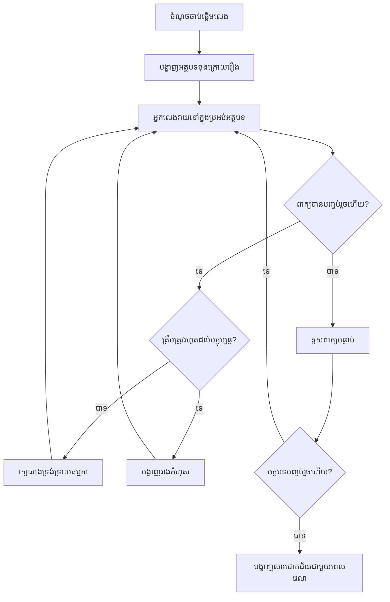
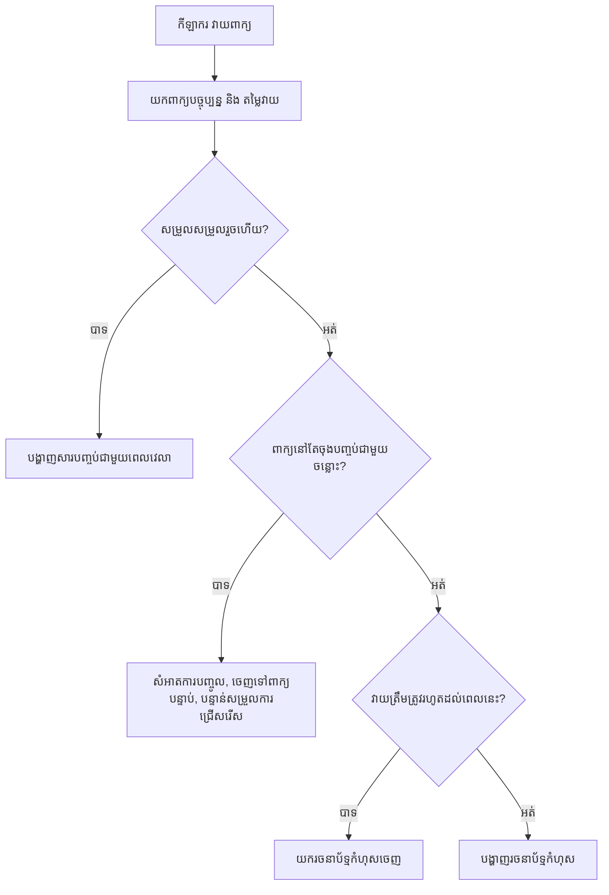
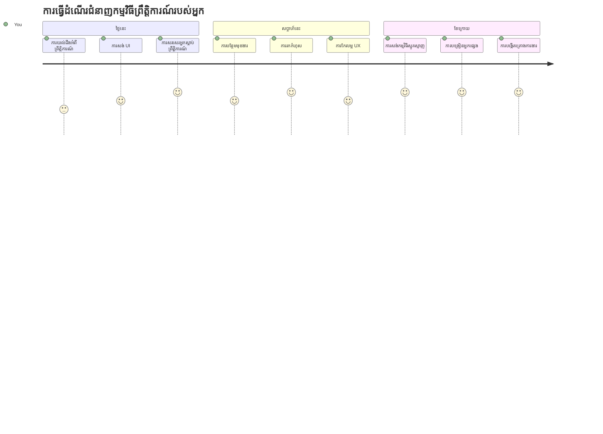

# ការបង្កើតហ្គេមដោយប្រើព្រឹត្តិការណ៍

តើអ្នកធ្លាប់ចាប់អារម្មណ៍ទេថា តើគេហទំព័រមានវិធីដឹងពីពេលដែលអ្នកចុចប៊ូតុង ឬវាយអក្សរចូលទៅក្នុងប្រអប់ខ្សែអត្ថបទដូចម្តេច? នេះជាគំន្យមន្តរបស់កម្មវិធីដែលគ្រប់គ្រងដោយព្រឹត្តិការណ៍! វិធីណាមួយល្អបំផុតក្នុងការរៀនជំនាញសំខាន់នេះ គឺដោយកសាងអ្វីមួយមានប្រយោជន៍ — ហ្គេមវាយល្បឿនដែលឆ្លើយតបនឹងរាល់ការចុចក្តារចុចដែលអ្នកធ្វើ។

អ្នកនឹងឃើញដោយផ្ទាល់វិធីដែលកម្មវិធីរុករកបណ្តាញ "និយាយ" ទៅកូដ JavaScript របស់អ្នក។ រាល់ពេលដែលអ្នកចុច វាយ ឬផ្លាស់ទីកណ្ដុរ កម្មវិធីរុករកកំពុងផ្ញើសារតូចៗ (យើងហៅថា ព្រឹត្តិការណ៍) ទៅកូដរបស់អ្នក ហើយអ្នកមានសិទ្ធិតัดสินចម្លើយថាតើបើករបៀបណា!

នៅពេលដែលយើងបញ្ចប់នៅទីនេះ អ្នកនឹងបានបង្កើតហ្គេមវាយពិតប្រាកដមួយដែលតាមដានល្បឿននិងភាពត្រឹមត្រូវ។ ច្រើនសំខាន់ជាងនេះ អ្នកនឹងយល់ដឹងពីគំនិតមូលដ្ឋានដែលជំរុញគេហទំព័រជាមួយនឹងអន្តរកម្មទាំងអស់ដែលអ្នកធ្លាប់ប្រើ។ ចាប់ផ្តើមទៅ!

## សំណួរពិនិត្យមុនវគ្គសិក្សា

[សំណួរពិនិត្យមុនវគ្គសិក្សា](https://ff-quizzes.netlify.app/web/quiz/21)

## កម្មវិធីដែលគ្រប់គ្រងដោយព្រឹត្តិការណ៍

គិតពីកម្មវិធីឬគេហទំព័រដែលអ្នកចូលចិត្ត — អ្វីធ្វើឲ្យវាហាក់ដូចជាផ្ទេចផ្លាក និងឆ្លើយតប? វាគឺពឹងផ្អែកលើរបៀបវាសកម្មចំពោះអ្វីដែលអ្នកធ្វើ! រាល់ការចុច ការចុចក្តារចុច ការប្រមូល ផ្លាស់ទីឬដើរយកក្នុងកំណត់ព្រឹត្តិការណ៍នេះ បង្កើតអ្វីដែលយើងហៅថា "ព្រឹត្តិការណ៍" ហើយវាជាគន្លងពិសេសនៃការអភិវឌ្ឍគេហទំព័រប្រកបដោយសមត្ថភាព។

នេះគឺជាវត្ថុដែលធ្វើឲ្យកម្មវិធីសម្រាប់បណ្តាញគឺគួរឱ្យចាប់អារម្មណ៍: យើងមិនដឹងទេថា ពេលណាអ្នកណាអាចចុចប៊ូតុងនោះ ឬចាប់ផ្តើមវាយនៅប្រអប់អត្ថបទឡើយ។ គេអាចនឹងចុចភ្លាមៗ រង់ចាំប្រាំនាទី រឺមិនចុចទេ! ការមិនអាចទាយបាននេះមានន័យថា យើងត្រូវគិតខុសពីរបៀបការសរសេរកូដរបស់យើង។

មិនមែនសរសេរកូដដែលរត់ពីលើក្រោមដូចមុខម្ហូបញ៉ាំនោះទេ យើងសរសេរកូដដែលរង់ចាំយ៉ាងអំពេនសម្រាប់អ្វីមួយកើតឡើង។ វាស្រដៀងនឹងអ្នកប្រើតេលេក្រาฟនៅលើសតវត្សទី ១៨០០​ដែលអង្គុយដោយម៉ាស៊ីនរបស់ពួកគេ ពីរជាចាំបាច់ឆ្លើយតបភ្លាមៗពេលដែលមានសារ។ 

តើព្រឹត្តិការណ៍ជាអ្វី? បែបសាមញ្ញ វាជាអ្វីដែលកើតឡើង! ពេលអ្នកចុចប៊ូតុង — នោះជាព្រឹត្តិការណ៍។ ពេលអ្នកវាយតួអក្សរ — នោះជាព្រឹត្តិការណ៍។ ពេលអ្នកផ្លាស់ទីកណ្ដុរ — នោះជាព្រឹត្តិការណ៍មួយទៀត។

កម្មវិធីដែលត្រូវគ្រប់គ្រងដោយព្រឹត្តិការណ៍អនុញ្ញាតឲ្យយើងដាក់កូដរបស់យើងឲ្យស្តាប់និងឆ្លើយតប។ យើងបង្កើតមុខងារពិសេសហៅថា **ស្ដាប់ព្រឹត្តិការណ៍** ដែលរង់ចាំយ៉ាងអំពេនសម្រាប់អ្វីមួយច្បាស់លាស់កើតឡើង ហើយបន្ទាប់មកឆក់ចរន្តចូលសកម្មភាពពេលវាកើត។

គិតពីស្ដាប់ព្រឹត្តិការណ៍ដូចជាមានទូរស័ព្ទច្រកសម្រាប់កូដរបស់អ្នក។ អ្នកដាក់ជាមួយទូរស័ព្ទច្រក (`addEventListener()`), ផ្ដល់សំឡេងដែលត្រូវស្តាប់ (ដូចជា ‘click’ រឺ ‘keypress’), ហើយបញ្ជាក់ថាតើអ្វីគួរត្រូវកើតឡើងពេលដែលមាននរណាម្នាក់ចុចនោះ (មុខងាររបស់អ្នក)។

**នេះជាវិធីស្ដាប់ព្រឹត្តិការណ៍ដំណើរការ:**
- **ស្ដាប់** សម្រាប់សកម្មភាពអ្នកប្រើជាក់លាក់ដូចជាចុច ចុចក្តារចុច ឬផ្លាស់ទីកណ្ដុរ
- **អនុវត្ត** កូដផ្ទាល់ខ្លួនរបស់អ្នកពេលព្រឹត្តិការណ៍បានកើតឡើង
- **ឆ្លើយតប** បន្ទាន់ចំពោះអន្តរកម្មអ្នកប្រើ បង្កើតបទពិសោធន៍រលូនមិនមានឈរ
- **ដោះស្រាយ** ព្រឹត្តិការណ៍ជាច្រើនលើធាតុដូចគ្នា ដោយប្រើស្ដារព្រឹត្តិការណ៍ផ្សេងៗគ្នា

> **[!NOTE]** វាសមរម្យសម្គាល់ថាមានវិធីជាច្រើនដើម្បីបង្កើតស្ដារព្រឹត្តិការណ៍។ អ្នកអាចប្រើមុខងារដែលមិនមានឈ្មោះ ឬបង្កើតមុខងារដែលមានឈ្មោះ។ អ្នកអាចប្រើក្វីកខាត់ផ្សេងៗ ដូចជាការកំណត់គុណលក្ខណៈ `click` ឬប្រើ `addEventListener()`។ ក្នុងលំហាត់របស់យើង យើងនឹងផ្តោតលើ `addEventListener()` និងមុខងារមិនមានឈ្មោះ ព្រោះវាជាវិធីដែលអ្នកអភិវឌ្ឍន៍បណ្តាញភាគច្រើនប្រើ។ វាក៏មានភាពបត់បែនខ្ពស់ផង ដូចដែល `addEventListener()` ធ្វើការសម្រាប់ព្រឹត្តិការណ៍​ទាំងអស់ និងអាចផ្ដល់ឈ្មោះព្រឹត្តិការណ៍ជាប៉ារ៉ាម៉ែត្រ។

### ព្រឹត្តិការណ៍រួម

បើទោះបីកម្មវិធីរុករកបណ្តាញផ្ដល់លេខព្រឹត្តិការណ៍ជាច្រើនដែលអ្នកអាចស្ដាប់បាន កម្មវិធីសកម្មភាពច្រើនទើបយូនិយោបល់ច្រើនលើព្រឹត្តិការណ៍សំខាន់ៗមួយចំនួនប៉ុណ្ណោះ។ ការយល់ដឹងពីព្រឹត្តិការណ៍មូលដ្ឋានទាំងនេះ នឹងផ្ដល់គ្រឹះដើម្បីបង្កើតអន្តរកម្មអ្នកប្រើមានសមត្ថភាព។

មាន [ព្រឹត្តិការណ៍ជាច្រើន](https://developer.mozilla.org/docs/Web/Events) សម្រាប់អ្នកស្តាប់នៅពេលបង្កើតកម្មវិធីណាមួយ។ គ្រប់អ្វីដែលអ្នកប្រើធ្វើនៅលើទំព័រមួយបន្ទះបង្កើតព្រឹត្តិការណ៍។ វាផ្ដល់អំណាចច្រើនដើម្បីធានាថាអ្នកប្រើទទួលបានបទពិសោធន៍ដែលអ្នកចង់បាន។ សំណាងល្អ ជាទូទៅ អ្នកត្រូវការព្រឹត្តិការណ៍តិចតួចប៉ុណ្ណោះ។ តោះមកមើលពីព្រឹត្តិការណ៍ទូទៅខ្លះៗ (រួមទាំងពីរព្រឹត្តិការណ៍ដែលយើងនឹងប្រើនៅពេលបង្កើតហ្គេម):

| ព្រឹត្តិការណ៍ | ពិពណ៌នា | ករណីប្រើរួមបញ្ចូល |
|-------------|-----------|-----------------------|
| `click` | អ្នកប្រើបានចុចលើអ្វីមួយ | ប៊ូតុង តំណ​ភ្ជាប់ ធាតុមានអន្តរកម្ម |
| `contextmenu` | អ្នកប្រើបានចុចប៊ូតុងកណ្តុរខាងស្តាំ | មេនឺចុចប៊ូតុងស្តាំសម្រាប់ផ្ទាល់ខ្លួន |
| `select` | អ្នកប្រើបានដាក់ពណ៌លើអត្ថបទខ្លះ | ការកែសម្រួលអត្ថបទ ការចម្លង |
| `input` | អ្នកប្រើបានវាយអត្ថបទមួយ | ការត្រួតពិនិត្យបែបបទ ស្វែងរកពេលជាក់លាក់ |

**ការយល់ដឹងពីប្រភេទព្រឹត្តិការណ៍ទាំងនេះ:**
- **បើកសកម្មភាព** ពេលអ្នកប្រើប្រាស់ធ្វើអន្តរកម្មលើធាតុជាក់លាក់នៅលើទំព័ររបស់អ្នក
- **ផ្ដល់** ព័ត៌មានលម្អិតអំពីសកម្មភាពអ្នកប្រើតាមរយៈវត្ថុព្រឹត្តិការណ៍
- **អនុញ្ញាត** អ្នកបង្កើតកម្មវិធីបណ្តាញដែលឆ្លើយតប និងមានអន្តរកម្ម
- **ដំណើរការ** ដោយមានគោលការណ៍ដូចគ្នាបានលើកម្មវិធីរុករកនិងឧបករណ៍ផ្សេងៗ

## ការបង្កើតហ្គេម

ឥឡូវនេះអ្នកយល់ដឹងពីរបៀបព្រឹត្តិការណ៍ដំណើរការ តោះយកចំណេះដឹងនោះទៅអនុវត្តដោយបង្កើតអ្វីមួយមានប្រយោជន៍។ យើងនឹងបង្កើតហ្គេមវាយល្បឿនមួយដែលបង្ហាញការជួយគ្រប់គ្រងព្រឹត្តិការណ៍ខណៈកំពុងជួយអ្នកបង្កើតជំនាញសំខាន់មួយចំពោះអ្នកអភិវឌ្ឍន៍។

យើងនឹងបង្កើតហ្គេមមួយ ដើម្បីស្វែងយល់ពីរបៀបព្រឹត្តិការណ៍ដំណើរការ​នៅក្នុង JavaScript។ ហ្គេមរបស់យើងនឹងសាកល្បងជំនាញវាយរបស់អ្នកលេង មួយក្នុងចំណោមជំនាញតិចតួចដែលមានតម្លៃសម្រាប់អ្នកអភិវឌ្ឍន៍ទាំងអស់។ ព័ត៌មានស្ដើងៗ: បន្ទាត់ក្តារចុច QWERTY ដែលយើងប្រើនៅថ្ងៃនេះ ត្រូវបានរចនាឡើងនៅចលនាសតវត្សទី ១៨៧០ សម្រាប់ម៉ាស៊ីនវាយអក្សរ — និងជំនាញវាយល្អនៅតែមើលថ្លៃសម្រាប់អ្នកគូដនៅថ្ងៃនេះ! របៀបលំហូរទូទៅរបស់ហ្គេមមានដូចជា៖


**នេះជាវិធីដែលហ្គេមរបស់យើងនឹងដំណើរការ:**
- **ចាប់ផ្តើម** នៅពេលអ្នកលេងចុចប៊ូតុងចាប់ផ្តើម ហើយបង្ហាញអត្ថបទយ៉ាងចៃដន្យមួយ
- **តាមដាន** ការវាយវាយចាប់ពីមួយពាក្យទៅមួយពាក្យនៅពេលវិត
- **បង្ហាញខ្លឹមសារពាក្យបច្ចុប្បន្នដើម្បីផ្តោតបំណងអ្នកលេង**
- **ផ្ដល់** មតិយោបល់មើលឃើញភ្លាមៗសម្រាប់កំហុសវាយ
- **គណនានិងបង្ហាញ** ពេលវេលាសរុបនៅពេលសម្រេចការសរសេរអត្ថបទ

ចាំបាច់បង្កើតហ្គេមរបស់យើង ហើយរៀនអំពីព្រឹត្តិការណ៍!

### រចនាសម្ព័ន្ធឯកសារ

មុនចាប់ផ្តើមសរសេរកូដ ហ្នឹងត្រូវរៀបចំឡើង! ការមានរចនាសម្ព័ន្ធឯកសារស្អាតពីដំបូងនឹងជួយអ្នកបញ្ជាក់ក្បាលក្រោយ និងធ្វើឲ្យគម្រោងរបស់អ្នកមើលមានជំនាញជាងមុន។ 😊

យើងនឹងរក្សាថ្មីតែមួយដែលមានបីឯកសារ៖ `index.html` សម្រាប់រចនាសម្ព័ន្ធទំព័រ, `script.js` សម្រាប់គ្រប់គ្រងហ្គេមទាំងមូល, និង `style.css` ដើម្បីធ្វើឲ្យទាំងអស់មើលស្អាត។ នេះជាក្រុមបីគ្រឿងទួតដែលគ្រប់គ្រងបណ្តាញភាគច្រើន!

**បង្កើតថតថ្មីសម្រាប់ការងាររបស់អ្នក ដោយបើកផ្ទាំងបញ្ជា ឬទំព័របញ្ជា និងបញ្ជាក់បញ្ចូលបញ្ជាខាងក្រោម៖**

```bash
# Linux ឬ macOS
mkdir typing-game && cd typing-game

# Windows
md typing-game && cd typing-game
```

**នេះជាអ្វីដែលបញ្ជាខាងលើធ្វើ៖**
- **បង្កើត** ថតថ្មីឈ្មោះ `typing-game` សម្រាប់ឯកសារគម្រោងរបស់អ្នក
- **ចូលទៅក្នុង** ថតដែលបានបង្កើតថ្មីដោយស្វ័យប្រវត្តិ
- **រៀបចំ** កន្លែងធ្វើការស្អាតសម្រាប់ការអភិវឌ្ឍហ្គេមរបស់អ្នក

**បើក Visual Studio Code៖**

```bash
code .
```

**បញ្ជានេះ:**
- **បើក** Visual Studio Code នៅក្នុងថតបច្ចុប្បន្ន
- **បើក** ថតគម្រោងរបស់អ្នកនៅក្នុងកម្មវិធីកែសម្រួល
- **ផ្ដល់** ការចូលដំណើរការទៅកម្មវិធីអភិវឌ្ឍន៍ទាំងអស់ដែលអ្នកត្រូវការ

**បន្ថែមបីឯកសារចូលក្នុងថតនៅ Visual Studio Code ជាមួយឈ្មោះដូចខាងក្រោម៖**
- `index.html` - មានរចនាសម្ព័ន្ធនិងមាតិកាហ្គេមរបស់អ្នក
- `script.js` - គ្រប់គ្រងតុល្យភាពហ្គេមនិងស្ដារព្រឹត្តិការណ៍
- `style.css` - កំណត់រូបរាងនិងរាងកាយបណ្ដាញ

## បង្កើតចំណុចប្រជុំបណ្ដាញអ្នកប្រើ

ឥឡូវនេះតោះបង្កើតឆាកដែលនឹងធ្វើដំណើរការកម្មវិធីហ្គេមរបស់យើង! គិតថាវាដូចការរចនាផ្ទាំងគ្រប់គ្រងសម្រាប់យន្តហោះចរាចរណ៍ — ពួកយើងត្រូវធានាថា អ្វីៗដែលអ្នកលេងត្រូវការស្ថិតនៅកន្លែងដែលពួកគេទន្ទេញ។

យើងត្រូវកំណត់គ្រាន់តែអ្វីដែលហ្គេមយើងត្រូវការ។ ប្រសិនបើអ្នកកំពុងលេងហ្គេមវាយ តើអ្នកចង់ឃើញអ្វីនៅលើអេក្រង់? នេះជាអ្វីដែលយើងត្រូវការ៖

| ធាតុ UI | គោលបំណង | ធាតុ HTML |
|----------|-----------|------------|
| បង្ហាញពាក្យ | បង្ហាញអត្ថបទដែលត្រូវវាយ | `<p>` មាន `id="quote"` |
| តំបន់សារ | បង្ហាញស្ថានភាពនិងសារ​ជោគជ័យ | `<p>` មាន `id="message"` |
| ប្រអប់វាយ | កន្លែងដែលអ្នកលេងវាយពាក្យ | `<input>` មាន `id="typed-value"` |
| ប៊ូតុងចាប់ផ្តើម | ចាប់ផ្តើមហ្គេម | `<button>` មាន `id="start"` |

**យល់អំពីរចនាសម្ព័ន្ធ UI៖**
- **រៀបចំ** មាតិកាឡូហ្គិកចាប់ពីលើទៅក្រោម
- **ផ្ដល់** អត្តសញ្ញាណដាក់ទៅលើធាតុសម្រាប់ការគោលដៅ JavaScript
- **ផ្ដល់** ដំណោះស្រាយទេសភាពច្បាស់លាស់សម្រាប់បទពិសោធន៍អ្នកប្រើល្អប្រសើរ
- **រួមបញ្ចូល** ធាតុ HTML មានអត្ថន័យសម្រាប់ការចូលប្រើភាពងាយស្រួល

រាល់ធាតុនោះត្រូវការអត្តសញ្ញាណ ដើម្បីឲ្យយើងអាចដំណើរការជាមួយពួកវាក្នុង JavaScript របស់យើង។ យើងនឹងបន្ថែមយោងទៅកាន់ឯកសារ CSS និង JavaScript ដែលយើងនឹងបង្កើត។

បង្កើតឯកសារថ្មីឈ្មោះ `index.html`។ បន្ថែម HTML ខាងក្រោម៖

```html
<!-- inside index.html -->
<html>
<head>
  <title>Typing game</title>
  <link rel="stylesheet" href="style.css">
</head>
<body>
  <h1>Typing game!</h1>
  <p>Practice your typing skills with a quote from Sherlock Holmes. Click **start** to begin!</p>
  <p id="quote"></p> <!-- This will display our quote -->
  <p id="message"></p> <!-- This will display any status messages -->
  <div>
    <input type="text" aria-label="current word" id="typed-value" /> <!-- The textbox for typing -->
    <button type="button" id="start">Start</button> <!-- To start the game -->
  </div>
  <script src="script.js"></script>
</body>
</html>
```

**បំបែកមើលថា រចនាសម្ព័ន្ធ HTML នេះបង្កើតអ្វី៖**
- **ភ្ជាប់** សន្លឹកបុព្វបទ CSS នៅ `<head>` សម្រាប់បុព្វបទ
- **បង្កើត** ក្បួនចំណងជើង និងសេចក្ដីណែនាំសម្រាប់អ្នកប្រើ
- **បង្កើត** កថាខណ្ឌទំនេរដែលមានអត្តសញ្ញាណជាក់លាក់សម្រាប់មាតិកាប្តូរប្រែ
- **រួមបញ្ចូល** ប្រអប់បញ្ចូលដែលមានលក្ខណៈសកម្មភាព
- **ផ្ដល់** ប៊ូតុងចាប់ផ្តើមសម្រាប់ចាប់ផ្តើមហ្គេម
- **ផ្ទុក** ឯកសារ JavaScript នៅចុងក្រោយសម្រាប់ប្រសិទ្ធិភាពអតិបរមា

### ចាប់ផ្តើមកម្មវិធី

ការសាកល្បងកម្មវិធីរបស់អ្នកជាប្រចាំពេលកំពុងអភិវឌ្ឍ ជួយអ្នករកឃើញបញ្ហារហ័ស និងមើលឃើញការរីកចម្រើនរបស់អ្នកក្នុងពេលវេលាពិត។ Live Server ជាឧបករណ៍ដែលមានតម្លៃដែលធ្វើការកែលម្អកម្មវិធីដោយស្វ័យប្រវត្តិនៅពេលអ្នករក្សាទុក ធ្វើឲ្យការអភិវឌ្ឍមានប្រសិទ្ធភាពខ្ពស់។

វាជាការល្អបំផុតក្នុងការអភិវឌ្ឍជាកម្រិត ដើម្បីមើលរបៀបដែលវាមើលទៅ។ តោះចាប់ផ្តើមកម្មវិធីរបស់យើង។ មានផ្នែកបន្ថែមដ៏អស្ចារ្យសម្រាប់ Visual Studio Code ឈ្មោះ [Live Server](https://marketplace.visualstudio.com/items?itemName=ritwickdey.LiveServer&WT.mc_id=academic-77807-sagibbon) ដែលនឹងផ្ដល់សេវាតម្លើងកម្មវិធីនៅក្នុងម៉ាស៊ីនរបស់អ្នក និងបំលែងកម្មវិធីមើលនៅកម្ពុជា​ពេលអ្នករក្សាទុក។

**ដំឡើង [Live Server](https://marketplace.visualstudio.com/items?itemName=ritwickdey.LiveServer&WT.mc_id=academic-77807-sagibbon) ដោយអនុវត្តតាមតំណភ្ជាប់ ហើយចុចដំឡើង៖**

**បង្ហាញពីអ្វីកើតឡើងពេលដំឡើង៖**
- **ទាក់ទាញ** កម្មវិធីរុករករបស់អ្នកដើម្បីបើក Visual Studio Code
- **ណែនាំ** អ្នកក្នុងដំណើរការដំឡើងផ្នែកបន្ថែម
- **ប្រហែលជាត្រូវ** ធ្វើការចាប់ផ្តើម Visual Studio Code ម្ដងទៀតជាបន្ទាន់

**បន្ទាប់មក ក្នុង Visual Studio Code ចុច Ctrl-Shift-P (ឬ Cmd-Shift-P) ដើម្បីបើកប៉ារ៉ាម៉ែត្រ​បញ្ជា៖**

**យល់ពីប៉ារ៉ាម៉ែត្របញ្ជា៖**
- **ផ្ដល់** ការចូលដំណើរការយ៉ាងរហ័សទៅរបៀបបញ្ជាទាំងអស់ VS Code
- **ស្វែងរក** បញ្ជា ពេលអ្នកវាយអក្សរ
- **ផ្ដល់** ជម្រើសផ្លូវកាត់គ្រាប់ចុចសម្រាប់អភិវឌ្ឍលឿន

**វាយ "Live Server: Open with Live Server":**

**អ្វីដែល Live Server ធ្វើ:**
- **ចាប់ផ្តើម** សេវាកម្មអភិវឌ្ឍន៍ក្នុងម៉ាស៊ីនសម្រាប់គម្រោងរបស់អ្នក
- **បំលែង** ម៉ាស៊ីនរុករកដោយស្វ័យប្រវត្តិពេលអ្នករក្សាទុកឯកសារ
- **ផ្ដល់សេវា** ឯកសារដែលមាន URL ផ្ទាល់ក្នុងម៉ាស៊ីន (សំរាប់ភាគច្រើន `localhost:5500`)

**បើកកម្មវិធីរុករកមួយ ហើយបើកទៅកាន់ `https://localhost:5500`:**

ឥឡូវនេះអ្នកគួរតែ​ឃើញទំព័រដែលបានបង្កើត! តោះបន្ថែមមុខងារមួយចំនួន។

## បន្ថែម CSS

ឥឡូវនេះធ្វើឲ្យវាមើលស្រស់ស្អាត! មតិយោបល់មើលឃើញមានតំលៃខ្ពស់ចំពោះចំណុចប្រជុំបណ្ដាញអ្នកប្រើតាំងពីដើមដំណើរការគណនា។ នៅទសវត្ស ១៩៨០ អ្នកស្រាវជ្រាវបានរកឃើញថា មតិយោបល់មើលឃើញភ្លាមៗធ្វើឲ្យប្រសិទ្ធភាពអ្នកប្រើកើតឡើងយ៉ាងច្រើន និងកាត់បន្ថយកំហុស។ នេះជារឿងដែលយើងនឹងបង្កើត។

ហ្គេមរបស់យើងត្រូវមានភាពច្បាស់លាស់នៃអ្វីកំពុងកើតឡើង។ អ្នកលេងគួរតែច្បាស់ថាពាក្យណាមួយដែលត្រូវវាយ ហើយប្រសិនបើពួកគេធ្វើកំហុស គួរតែឃើញភ្លាមៗ។ តោះបង្កើតរចនាបថសាមញ្ញប៉ុន្តែមានប្រសិទ្ធភាព៖

បង្កើតឯកសារថ្មីឈ្មោះ `style.css` ហើយបន្ថែមវាលើកូដខាងក្រោម៖

```css
/* inside style.css */
.highlight {
  background-color: yellow;
}

.error {
  background-color: lightcoral;
  border: red;
}
```

**យល់ដឹងពីថ្នាក់ CSS ទាំងនេះ ៖**
- **បំភ្លឺ** ពាក្យបច្ចុប្បន្នជាមួយផ្ទៃខាងក្រោយពណ៌លឿងសម្រាប់មើលឲ្យមែន​ប្រាកដ
- **សញ្ញាភាពខុស** ការវាយជាមួយផ្ទៃខាងក្រោយពណ៌កូរ៉ាល់ស្រាល
- **ផ្ដល់** មតិយោបល់ភ្លាមៗដោយមិនរំខានរាវពេលវាយ
- **ប្រើ** ពណ៌ផ្សេងគ្នាសម្រាប់ភាពងាយស្រួល និងការទំនាក់ទំនងភ្លឺ

✅ ពេលក្រោម CSS អ្នកអាចបង្កើតទំព័រជាមុខមាត់តាមចិត្តចង់បាន។ ចំណាយពេលតិចៗ និងធ្វើឲ្យទំព័រមើលមានផាសុខភាព៖

- ជ្រើសរើសហ្វុងខ្សែខុស
- ពណ៌រូបកសិក្នុងចំណងជើង
- កំណត់ទំហំធាតុ

## JavaScript

នេះជាទីដែលរឿងរ៉ាវចាប់ផ្តើមកើតឡើង! 🎉 យើងមានរចនាសម្ព័ន្ធ HTML និងបុព្វបទ CSS របស់យើងហើយ ប៉ុន្តែពេលនេះហ្គេមយើងដូចរថយន្តស្រស់ស្អាតមួយដែលគ្មានម៉ាស៊ីន។ JavaScript គឺជាម៉ាស៊ីននោះ — វាគ្រប់គ្រងអ្វីៗឲ្យដំណើរការនិងឆ្លើយតបទៅនឹងអ្វីដែលអ្នកលេងធ្វើ។

នេះជាកន្លែងដែលអ្នកនឹងឃើញការបង្កើតរបស់អ្នកផ្លាស់ប្តូរជីវិត។ យើងនឹងដំណើរការជាជំហ៊ាន ដូច្នេះអ្វីមួយនឹងមិនធ្វើឲ្យធុញទ្រាន់ឡើយ៖

| ជំហ៊ាន | គោលបំណង | អ្វីដែលអ្នកនឹងរៀន |
|---------|-----------|---------------------|
| [បន្ថែមអថេរ](#បន្ថែមអថេរ) | កំណត់អត្ថបទនិងយោង DOM | ការគ្រប់គ្រងអថេរនិងជ្រើស DOM |
| [ស្ដារព្រឹត្តិការណ៍ចាប់ផ្តើមហ្គេម](#បន្ថែមមូលដ្ឋានយុទ្ធសាស្ត្រចាប់ផ្តើម) | គ្រប់គ្រងការចាប់ផ្តើមហ្គេម | ការគ្រប់គ្រងព្រឹត្តិការណ៍ និងការអាប់ដេត UI |
| [ស្ដារព្រឹត្តិការណ៍វាយ](#បន្ថែមផ្សងព្រេងវាយអក្សរ) | ដំណើរការបញ្ចូលអ្នកប្រើនៅពេលវិត | ការត្រួតពិនិត្យបញ្ចូលនិងមតិយោបល់ដំណើរការ |

**របៀបមួយនេះជួយអ្នក:**
- **រៀបចំ** កូដក្នុងផ្នែកសរុបនឹងអាចគ្រប់គ្រងបានមូលដ្ឋានល្អ
- **សាងសង់** មុខងារជាប់ៗគ្នា ដើម្បីងាយសម្រាប់ស្វែងរកកំហុស
- **យល់ដឹង** ថាតើផ្នែកផ្សេងទៀតនៃកម្មវិធីរបស់អ្នកដំណើរការយ៉ាងដូចម្តេច
- **បង្កើត** លំនាំដែលអាចប្រើឡើងវិញសម្រាប់គម្រោងអនាគត

តែជាពិធីផ្តើម បង្កើតឯកសារថ្មីឈ្មោះ `script.js`។

### បន្ថែមអថេរ

មុននឹងចូលទៅក្នុងសកម្មភាព លេងសម្រាប់ដាក់បញ្ចូលធនធានទាំងអស់របស់យើង! ដូចទៅគ្មានរ៉ុងហ្វ្លុលគម្រោងចាប់ផ្តើម NASA ដាក់ជាថ្មីឧបករណ៍ត្រួតពិនិត្យមុនចេញហោះ វាងាយស្រួលជាងពេលមានរួចហើយហើយជៀវជ័យកំហុស។

នេះគឺជាអ្វីដែលយើងត្រូវត្រូវបង្កើតមុន៖

| ប្រភេទទិន្នន័យ | គោលបំណង | ឧទាហរណ៍ |
| អារាយនៃសម្តី | រក្សាទុកសម្តីទាំងអស់ដែលអាចមានសម្រាប់ហ្គេម | `['Quote 1', 'Quote 2', ...]` |
| អារាយពាក្យ | បំបែកសម្តីបច្ចុប្បន្នទៅជាកាល្យពាក្យដោយលំដាប់ | `['When', 'you', 'have', ...]` |
| អ៊ិនដិចពាក្យ | តាមដានពាក្យដែលអ្នកលេងកំពុងវាយ | `0, 1, 2, 3...` |
| ពេលវេលាបើកចាប់ផ្តើម | គណនាពេលវេលាដែលបានកន្លងផុតសម្រាប់ការគណនា ពិន្ទុ | `Date.now()` |

**យើងក៏ចាំបាច់មានយោងទៅកាន់ធាតុ UI របស់យើងផងដែរ៖**
| ធាតុ | ID | គោលបំណង |
|---------|----|---------|
| បញ្ចូលអក្សរ | `typed-value` | កន្លែងដែលអ្នកលេងវាយអក្សរ |
| បង្ហាញសម្តី | `quote` | បង្ហាញសម្តីដែលត្រូវវាយ |
| តំបន់សារជូនដំណឹង | `message` | បង្ហាញការអាប់ដេតស្ថានភាព |

```javascript
// នៅក្នុង script.js
// ចន្ទ់ទាំងអស់របស់យើង
const quotes = [
    'When you have eliminated the impossible, whatever remains, however improbable, must be the truth.',
    'There is nothing more deceptive than an obvious fact.',
    'I ought to know by this time that when a fact appears to be opposed to a long train of deductions it invariably proves to be capable of bearing some other interpretation.',
    'I never make exceptions. An exception disproves the rule.',
    'What one man can invent another can discover.',
    'Nothing clears up a case so much as stating it to another person.',
    'Education never ends, Watson. It is a series of lessons, with the greatest for the last.',
];
// រក្សាទុកបញ្ជីពាក្យ និងអថេរលេខសន្ទស្សរបស់ពាក្យដែលអ្នកលេងកំពុងវាយអប្បបរមាន
let words = [];
let wordIndex = 0;
// ពេលវេលាចាប់ផ្តើម
let startTime = Date.now();
// ធាតុទំព័រ
const quoteElement = document.getElementById('quote');
const messageElement = document.getElementById('message');
const typedValueElement = document.getElementById('typed-value');
```

**ការបំបែកអ្វីដែលកូដកំណត់នេះបានសម្រួល៖**
- **រក្សាទុក** អារាយនៃសម្តី Sherlock Holmes ដោយប្រើ `const` ពីព្រោះសម្តីនឹងមិនផ្លាស់ប្តូរ
- **ចាប់ផ្តើម** តម្លៃតាមដានដោយ `let` ពីព្រោះតម្លៃទាំងនេះនឹងត្រូវបន្ថែមកំណែពេលលេងហ្គេម
- **ចាប់យោង** ទៅកាន់ធាតុ DOM ដោយប្រើ `document.getElementById()` សម្រាប់ចូលប្រើយ៉ាងមានប្រសិទ្ធភាព
- **រៀបចំ** មូលដ្ឋានសម្រាប់មុខងារប្រកួតលេង គ្រប់គ្រងជាមួយឈ្មោះអថេរដែលច្បាស់លាស់និងពណ៌នាអំពីមុខងារ
- **រៀបចំ** ទិន្នន័យ និងធាតុដែលពាក់ព័ន្ធដោយមានតំណាងឲ្យការដំណើរការកូដងាយស្រួល

✅ ទៅមុខនិងបន្ថែមសម្តីច្រើនទៀតទៅហ្គេមរបស់អ្នក

> 💡 **គន្លឹះវិជ្ជាជីវៈ**៖ យើងអាចយកធាតុទាំងនេះអោយបានពេលណាមួយនៅក្នុងកូដដោយប្រើ `document.getElementById()`។ ដោយសារតែយើងត្រូវយោងទៅធាតុទាំងនេះជាប្រចាំ យើងនឹងគេចព្រមទទ្រោមខុសដោយប្រើអថេរមានតម្លៃថេរ។ ស៊ុមកូដដូចជា [Vue.js](https://vuejs.org/) ឬ [React](https://reactjs.org/) អាចជួយអ្នកគ្រប់គ្រងកូដកណ្ដាលបានល្អជាង។
>
**អ្វីដែលវិធីនេះធ្វើបានល្អ៖**
- **បញ្ឆ័ត** កំហុសសរសេរពេលយោងធាតុជាច្រើនដង
- **កែលម្អ**ការអានកូដដោយឈ្មោះអថេរដែលពណ៌នាច្បាស់
- **ផ្តល់** ការគាំទ្រល្អក្នុង IDE ជាមួយ autocomplete និងពិនិត្យកំហុស
- **ធ្វើឲ្យ** ការផ្លាស់ប្តូរកូដកាន់តែងាយស្រួលប្រសិនបើ ID ធាតុំផ្លាស់ប្តូរចុងក្រោយ

ចំណាយពេលមួយនាទីមើលវីដេអូអំពីការប្រើ `const`, `let` និង `var`

[](https://youtube.com/watch?v=JNIXfGiDWM8 "ប្រភេទអថេរ")

> 🎥 ចុចរូបភាពខាងលើសម្រាប់មើលវីដេអូអំពីអថេរ។

### បន្ថែមមូលដ្ឋានយុទ្ធសាស្ត្រចាប់ផ្តើម

នេះគឺជាកន្លែងដែលគ្រប់អ្វីគ្នាចូលគ្នាដោយផ្ទាល់! 🚀 អ្នកកំពុងត្រៀមវាយListener ព្រឹត្តិការណ៍ជាដំបូងរបស់អ្នក ហើយមានអារម្មណ៍ថាខ្លះគឺពោរពេញដោយភាពរីករាយពេលឃើញកូដឆ្លើយតបទៅនឹងការចុចប៊ូតុង។

គិតពីវា៖ នៅកន្លែងណាមួយ មានអ្នកលេងនឹងចុចប៊ូតុង "Start" ហើយកូដរបស់អ្នកត្រូវតែត្រៀមខ្លួនសម្រាប់ពួកគេ។ យើងមិនដឹងថាពួកគេនឹងចុចពេលណា ទំនងជាចុចភ្លាមភ្លៃ មែនទែនអាចជាក្រោយពួកគេចាប់កាហ្វេហើយ ក៏ដោយ - ប៉ុន្តែពេលពួកគេចុចហើយ ការប្រកួតរបស់អ្នកនឹងចាប់ផ្តើម។

ពេលដែលអ្នកប្រើចុច `start` អ្នកត្រូវការជ្រើសរើសសម្តី ធ្វើការតម្លើង UI ប្រើប្រាស់ ហើយតាមដានពាក្យបច្ចុប្បន្ន និងពេលវេលា។ ខាងក្រោមគឺកូដ JavaScript ដែលអ្នកត្រូវបន្ថែម; យើងនឹងពិភាក្សាពីវាបង្អស់បន្ទាប់ពីប្លុកស្គ្រីប។

```javascript
// នៅចុង script.js
document.getElementById('start').addEventListener('click', () => {
  // ទូទាត់សម្រង់
  const quoteIndex = Math.floor(Math.random() * quotes.length);
  const quote = quotes[quoteIndex];
  // ដាក់សម្រង់ទៅក្នុងអារែរពាក្យ
  words = quote.split(' ');
  // ផ្តើម្បីសូចចិត្តបញ្ច្រាសពាក្យសម្រាប់តាមដាន
  wordIndex = 0;

  // ការអាប់ដេត UI
  // បង្កើតអារែរអធិព័ត៌មានspan ដើម្បីអាចកំណត់ថ្នាក់មួយ
  const spanWords = words.map(function(word) { return `<span>${word} </span>`});
  // បម្លែងទៅជាខ្សែអក្សរ ហើយកំណត់ជា innerHTML លើការបង្ហាញសម្រង់
  quoteElement.innerHTML = spanWords.join('');
  // លំអកពាក្យដំបូង
  quoteElement.childNodes[0].className = 'highlight';
  // លុបសារណាមួយដែលមានពីមុន
  messageElement.innerText = '';

  // តំឡើងប្រអប់ប្រភាយអក្សរ
  // លុបប្រអប់ប្រភាយអក្សរ
  typedValueElement.value = '';
  // កំណត់កំណត់ពឹងផ្អែក
  typedValueElement.focus();
  // កំណត់អ្នកដំណើរការកម្មវិធីព្រឹត្តិការណ៍

  // ចាប់ផ្តើមម៉ោងត្រួតពិនិត្យ
  startTime = new Date().getTime();
});
```

**មករៀបចែកូដនេះជាផ្នែកមានលក្ខណៈត្រឹមត្រូវ៖**

**📊 ការតាមដានពាក្យ៖**
- **ជ្រើសរើស** សម្តីចៃដន្យដោយប្រើ `Math.floor()` និង `Math.random()` សម្រាប់ការតម្លើងមានភាពចម្រុះ
- **បម្លែង** សម្តីទៅជា​អារ៉ៃ គឺអារាយពាក្យដោយប្រើ `split(' ')`
- **កំណត់ឡើងវិញ** `wordIndex` ទៅ 0 ព្រោះអ្នកលេងចាប់ផ្តើមពីពាក្យដំបូង
- **រៀបចំ** ស្ថានភាពហ្គេមសម្រាប់ជុំស៊ុមថ្មី

**🎨 ការតំឡើង UI និងបង្ហាញ៖**
- **បង្កើត** អារាយ `<span>` ដើម្បីប្ដូរពាក្យនិមួយៗជាផ្នែកមានស្ទីលផ្ទាល់ខ្លួន
- **ភ្ជាប់** ធាតុ span ទាំងអស់ជាមួយគ្នាទៅជាស្រង់ string សម្រាប់វិចិត្រសិល្ប៍ DOM ដែលប្រសិនភាព
- **លម្អិត** ពាក្យដំបូងដោយបន្ថែមថ្នាក់ CSS `highlight`
- **សម្អាត** សារហ្គេមចាស់ៗ ដើម្បីផ្តល់អោយមានកន្លែងច្បាស់ស្អាត

**⌨️ ការត្រៀមប្រអប់អក្សរ៖**
- **សម្អាត**អត្ថបទនិងតំបន់បញ្ចូលថ្មី
- **ផ្តោតកម្រិត**ទៅកាន់ប្រអប់អក្សរ ដូច្នេះអ្នកលេងអាចចាប់ផ្តើមវាយភ្លាម
- **រៀបចំ** កន្លែងបញ្ចូលសម្រាប់លេងហ្គេមថ្មី

**⏱️ ការចាប់ផ្តើមម៉ោង៖**
- **ចាប់យក** ពេលវេលាបច្ចុប្បន្ន ដោយប្រើ `new Date().getTime()`
- **អនុញ្ញាតឲ្យ** គណនាឪ្យបានត្រឹមត្រូវល្បឿនវាយនិងពេលបញ្ចប់
- **ចាប់ផ្តើម** ការតាមដានការសម្តែងសម្រាប់លេងហ្គេម

### បន្ថែមផ្សងព្រេងវាយអក្សរ

នេះគឺជាកន្លែងដែលយើងនឹងដោះស្រាយចិត្តរបស់ហ្គេមយើង! កុំបារម្ភបើវាហាក់ដូចជាយឺតដំបូង - យើងនឹងដើរតាមមួយៗ និងនៅចុងក្រោយ អ្នកនឹងមើលឃើញថាវាត្រឹមត្រូវប៉ុណ្ណា។

អ្វីដែលយើងកំពុងបង្កើតនៅទីនេះគឺមានភាពស្មុគស្មាញខ្ពស់៖ រៀងរាល់ពេលនរណាម្នាក់វាយតួអក្សរ កូដនឹងត្រួតពិនិត្យអ្វីដែលគេបានវាយ ផ្ដល់មតិយោបល់ទៅពួកគេ ហើយសម្រេចចិត្តថាអ្វីគួរធ្វើបន្ទាប់។ វាស្រដៀងនឹងកម្មវិធីកែសម្រួលពាក្យដូចជា WordStar នៅឆ្នាំ1970 ដែលផ្ដល់មតិយោបល់ពេលជាក់ស្តែងទៅអ្នកវាយ។

```javascript
// នៅចុង script.js
typedValueElement.addEventListener('input', () => {
  // ទទួលយកពាក្យបច្ចុប្បន្ន
  const currentWord = words[wordIndex];
  // ទទួលយកតម្លៃបច្ចុប្បន្ន
  const typedValue = typedValueElement.value;

  if (typedValue === currentWord && wordIndex === words.length - 1) {
    // ចប់ប្រយោគ
    // បង្ហាញភាពជោគជ័យ
    const elapsedTime = new Date().getTime() - startTime;
    const message = `CONGRATULATIONS! You finished in ${elapsedTime / 1000} seconds.`;
    messageElement.innerText = message;
  } else if (typedValue.endsWith(' ') && typedValue.trim() === currentWord) {
    // ចប់ពាក្យ
    // ទទេធាតុ typedValueElement សម្រាប់ពាក្យថ្មី
    typedValueElement.value = '';
    // ផ្លាស់ទៅពាក្យបន្ទាប់
    wordIndex++;
    // កំណត់ឈ្មោះថ្នាក់ឡើងវិញសម្រាប់ធាតុទាំងអស់នៅក្នុងឃ្លា
    for (const wordElement of quoteElement.childNodes) {
      wordElement.className = '';
    }
    // សរសេរពាក្យថ្មីឲ្យភ្លឺ
    quoteElement.childNodes[wordIndex].className = 'highlight';
  } else if (currentWord.startsWith(typedValue)) {
    // ត្រឹមត្រូវបច្ចុប្បន្ន
    // សរសេរពាក្យបន្ទាប់ឲ្យភ្លឺ
    typedValueElement.className = '';
  } else {
    // ជាស្ថានភាពកំហុស
    typedValueElement.className = 'error';
  }
});
```

**ការយល់ដឹងអំពីចរន្តហ្វុងសិនវាយអក្សរៈ**

ហ្វុងសិននេះប្រើវិធី waterfall ដើម្បីពិនិត្យលក្ខខណ្ឌចាប់ផ្តើមពីចំណុចពិសេសទៅទូទៅ។ មកបំបែកតួករណីនីមួយៗ៖


**🏁 ការសម្រេចសម្តី (ករណី 1):**
- **ពិនិត្យ** ថាតម្លៃបានវាយផ្គូផ្គងពាក្យបច្ចុប្បន្ន និងយើងនៅពាក្យចុងក្រោយ
- **គណនា** ពេលវេលាកន្លងផុតដោយដកពេលចាប់ផ្តើមពីពេលបច្ចុប្បន្ន
- **បម្លែង** មីលីវិនាទីទៅវិនាទី ដោយចែក 1,000
- **បង្ហាញ** សារគួរសរសើរជាមួយពេលវេលាបញ្ចប់

**✅ ពាក្យបានបញ្ចប់ (ករណី 2):**
- **រកឃើញ** ការសម្រេចពាក្យពេលបញ្ចូលបញ្ចប់ជាមួយខ្ទង់ទំនេរ
- **ផ្ទៀងផ្ទាត់** ថាតម្លៃកាត់ខ្ទង់ទំនេរផ្គូផ្គងពាក្យបច្ចុប្បន្ន
- **សម្អាត** ប្រអប់បញ្ចូលសម្រាប់ពាក្យបន្ទាប់
- **បន្ត** ទៅពាក្យបន្ទាប់ ដោយបន្ថែម `wordIndex`
- **ធ្វើបច្ចុប្បន្នភាព** ការផ្ដោតជាលក្ខណៈមើលឃើញ ដោយដកថ្នាក់ទាំងអស់ហើយបន្ថែមចំណាកស្ទីលថ្មី

**📝 កំពុងវាយអក្សរ (ករណី 3):**
- **ផ្ទៀងផ្ទាត់** ថាពាក្យបច្ចុប្បន្នចាប់ផ្តើមដោយអ្វីដែលបានវាយ
- **យកចេញ** រចនាសម្ព័ន្ធកំហុស ដើម្បីបង្ហាញថាបញ្ចូលត្រឹមត្រូវ
- **អនុញ្ញាត** អោយបន្តវាយដោយគ្មានរំខាន

**❌ ស្ថានភាពកំហុស (ករណី 4):**
- **បង្កើត** ពេលអត្ថបទបានវាយមិនផ្គូផ្គងចាប់ផ្តើមពាក្យដែលរំពើ
- **ប្រើ** ថ្នាក់ CSS កំហុស ដើម្បីផ្ដល់មតិយោបល់លឿន
- **ជួយ** អ្នកលេងរៀបចំកំហុសបានយ៉ាងលឿន

## សាកល្បងកម្មវិធីរបស់អ្នក

មើលអ្វីដែលអ្នកបានសម្រេច! 🎉 អ្នកទើបតែបង្កើតហ្គេមវាយអក្សរជាការងារពិតពីដើម ដោយប្រើកម្មវិធីដឹកនាំព្រឹត្តិការណ៍។ ចំណាយពេលមួយផឹកដេកនូវការសម្តែងនេះ - រឿងនេះមិនមែនរឿងធំនោះទេ!

ឥឡូវនេះមកដល់ដំណាក់កាលសាកល្បងហើយ! វានឹងដំណើរការត្រឹមត្រូវរឺ? យើងខកខានអ្វីមួយឬ? ទីនេះគឺ - បើអ្វីមួយមិនដំណើរការត្រឹមត្រូវភ្លាមភ្លៃ គឺមានភាពធម្មតា។ អ្នកអwickសិក្សាជំនាញក៏អាចជួបកំហុសក្នុងកូដជាប្រចាំ។ វាគឺជាផ្នែកមួយនៃដំណើរការអភិវឌ្ឍ។

ចុច `start` ហើយចាប់ផ្តើមវាយ! វានឹងហាក់ដូចជាការបញ្ចាំងភាពចល័តដែលយើងបានឃើញមុន។


**អ្វីដែលត្រូវសាកល្បងក្នុងកម្មវិធីរបស់អ្នក៖**
- **ផ្ទៀងផ្ទាត់** ថាចុច Start បង្ហាញសម្តីចៃដន្យ
- **បញ្ជាក់** ថាការវាយធ្វើឲ្យពាក្យបច្ចុប្បន្នត្រូវបានណែនាំត្រឹមត្រូវ
- **ពិនិត្យ** ថារចនាសម្ព័ន្ធកំហុសបង្ហាញពេលវាយខុស
- **ធានា** ថាការបញ្ចប់ពាក្យធ្វើឲ្យការផ្ដោតបន្តបានត្រឹមត្រូវ
- **តេស្ត** ថាការបញ្ចប់សម្តីបង្ហាញសារបញ្ចប់ជាមួយពេលវេលា

**គន្លឹះកែខូចកូដទូទៅ៖**
- **ពិនិត្យ** កុងសូលរុករក(F12) សម្រាប់កំហុស JavaScript
- **ធានា** ថាឈ្មោះឯកសារទាំងអស់ផ្គូផ្គងត្រឹមត្រូវ (មានការចំអិនករណី)
- **ធានា** Live Server កំពុងដំណើរការនិងបើកបង្ហាញឡើងវិញយ៉ាងត្រឹមត្រូវ
- **សាកល្បង** សម្តីផ្សេងៗដើម្បីផ្ទៀងផ្ទាត់ជ្រើសរើសចៃដន្យដំណើរការល្អ

---

## ការប្រកួតប្រជែង GitHub Copilot Agent 🎮

ប្រើម៉ូដ Agent ដើម្បីបញ្ចប់ការប្រកួតខាងក្រោម៖

**ព័ត៌មាន៖** ពង្រីកហ្គេមវាយអក្សរដោយអនុវត្តប្រព័ន្ធកម្រិតភាពរឹងដែលកែប្រែហ្គេមដោយផ្អែកលើការសម្តែងអ្នកលេង។ ការប្រកួតនេះនឹងជួយអ្នកហាត់នៅក្នុងការគ្រប់គ្រងព្រឹត្តិការណ៍ជាន់ខ្ពស់ ការវិភាគទិន្នន័យ និងការបង្ហាញ UI ធ្វើបែប δυναμικό។

**ការបង្ហាញ៖** បង្កើតប្រព័ន្ធកំណត់កម្រិតភាពរឹងសម្រាប់ហ្គេមវាយអក្សរ ដែល៖
1. តាមដានល្បឿនវាយនិងភាគរយភាពត្រឹមត្រូវរបស់អ្នកលេង (ពាក្យក្នុងមួយនាទី និងភាគរយត្រឹមត្រូវ)
2. កែប្រែដោយស្វ័យប្រវត្តិទៅកាន់កម្រិតចេញពី Easy (សម្តីងាយ), Medium (សម្តីបច្ចុប្បន្ន), Hard (សម្តីស្មុគស្មាញជាមួយសញ្ញាវត្ថុ)
3. បង្ហាញកម្រិតរឹងនិងស្ថិតិអ្នកលេងនៅលើ UI
4. អនុវត្តឧបករណ៍រាប់ជាប់ជាប់ដែលបង្កើនកម្រិតរឹងបន្ទាប់ពីការសម្តែងល្អបីដងជាប់ៗគ្នា
5. បន្ថែមមតិយោបល់ក្រៅ (ពណ៌, វិចិត្រសិល្ប៍) ដើម្បីបង្ហាញការផ្លាស់ប្តូរកម្រិតរឹង

បន្ថែមធាតុ HTML, ស្ទីល CSS និងមុខងារ JavaScript នាំមកដើម្បីអនុវត្តមុខងារនេះ។ រួមបញ្ចូលការគ្រប់គ្រងកំហុសត្រឹមត្រូវ និងធានាថា ហ្គេមនៅតែអាចប្រើបានសម្រាប់គ្រប់គ្នាមួយនិងមានស្លាក ARIA ជាពិសេស។

សូមស្វែងយល់បន្ថែមអំពី [ម៉ូដ agent](https://code.visualstudio.com/blogs/2025/02/24/introducing-copilot-agent-mode) នៅទីនេះ។

## 🚀 ការប្រកួត

តើអ្នកត្រៀមខ្លួនបន្តឈានទៅកម្រិតបន្ទាប់នៃហ្គេមវាយអក្សររបស់អ្នករួចហើយឬ? ព្យាយាមអនុវត្តមុខងារខ្ពស់ទាំងនេះដើម្បីជ្រាបច្បាស់ពីការគ្រប់គ្រងព្រឹត្តិការណ៍ និងការបង្កើត DOM៖

**បន្ថែមមុខងារពិសេស៖**

| មុខងារ | ពណ៌នា | ជំនាញដែលអ្នកនឹងហាត់ |
|---------|-------------|------------------------|
| **ការគ្រប់គ្រងការបញ្ចូល** | អំណត់អោយបិទគេហទំព័រ `input` នៅពេលបញ្ចប់ ហើយបើកឡើងវិញពេលចុចប៊ូតុង | ការគ្រប់គ្រងព្រឹត្តិការណ៍ និងស្ថានភាព |
| **ការគ្រប់គ្រងស្ថានភាព UI** | បិទប្រអប់ទៀតពេលអ្នកលេងបញ្ចប់សម្តី | ការប្រើលៗកល DOM |
| **ប្រអប់ផ្ទាំងបង្ហាញ (Modal Dialog)** | បង្ហាញប្រអប់ផ្ទាំងជាមួយសារជោគជ័យ | លំនាំ UI ខ្ពស់ និងអាចប្រើបាន |
| **ប្រព័ន្ធពិន្ទុលើស** | រក្សាទុកពិន្ទុលើសដោយប្រើ `localStorage` | API រក្សាទុកក្នុងកម្មវិប្បកម្ម និងការរក្សាទិន្នន័យ |

**គន្លឹះអនុវត្តៈ**
- **ស្វែងយល់** មុខងារ `localStorage.setItem()` និង `localStorage.getItem()` សម្រាប់រក្សាទិន្នន័យជាយូរអង្វែង
- **ហាត់** ការបន្ថែម និងលុបតListener ព្រឹត្តិការណ៍ដោយ δυναμικό
- **ស្វែងយល់** ធាតុ dialog HTML ឬលំនាំ modal CSS
- **គិត** អំពីការអាចប្រើបាននៅពេលបិទ និងបើកតំណរ
 
## សំនួរ Post-Lecture

[សំនួរបន្ទាប់ភាព](https://ff-quizzes.netlify.app/web/quiz/22)

---

## 🚀 ខ្សែពេលនៃជំនាញហ្គេមវាយអក្សររបស់អ្នក

### ⚡ **អ្វីដែលអ្នកអាចធ្វើបានក្នុង 5 នាទីបន្ទាប់**
- [ ] សាកល្បងហ្គេមវាយអក្សរជាមួយសម្តីផ្សេងៗដើម្បីធានាលេចធ្លោល្អ
- [ ] សាកល្បងស្ទីល CSS - ធ្វើការបម្លែងពណ៌ផ្ដោត និងកំហុស
- [ ] បើក DevTools នៅក្នុងកម្មវិប្បកម្ម (F12) ហើយមើល Console ពេលលេង
- [ ] ប្រលែងខ្លួនឯងឲ្យបញ្ចប់សម្តីឆាប់រហ័សបំផុត

### ⏰ **អ្វីដែលអ្នកអាចសម្រេចបានក្នុងម៉ោងនេះ**
- [ ] បន្ថែមសម្តីច្រើនទៅក្នុងអារាយ (ប្រហែលពីសៀវភៅរឺភាពយន្តដែលអ្នកចូលចិត្ត)
- [ ] អនុវត្តប្រព័ន្ធពិន្ទុលើស localStorage ពីផ្នែកការប្រកួត
- [ ] បង្កើតគណនាល្បឿនពាក្យក្នុងមួយនាទី បង្ហាញបន្ទាប់ពីហ្គេមរាល់ដង
- [ ] បន្ថែមផលប៉ះពាល់សំឡេងសម្រាប់ការវាយត្រឹមត្រូវ កំហុស និងបញ្ចប់

### 📅 **ការវិស្សោធន៍រយៈពេលមួយសប្តាហ៍របស់អ្នក**
- [ ] បង្កើតកំណែក្រុមហ្វូងដែលមិត្តភក្តិអាចប្រកួតជាមួយគ្នា
- [ ] បង្កើតកម្រិតរឹងផ្សេងៗជាមួយសម្តីមានភាពស្មុគស្មាញខុសគ្នា
- [ ] បន្ថែមរបារជម្លើរបង្ហាញពីអ្វីដែលបានបញ្ចប់ពីសម្តី
- [ ] អនុវត្តគណនីអ្នកប្រើ ជាមួយការតាមដានស្ថិតិផ្ទាល់ខ្លួន
- [ ] រចនាគំរូផ្ទាល់ខ្លួន ហើយអោយអ្នកប្រើជ្រើសរើសបែបផែនចូលចិត្ត

### 🗓️ **ការបំលែងរយៈពេលមួយខែរបស់អ្នក**
- [ ] បង្កើតវគ្គវាយអក្សរជាមួយមេរៀនដែលបង្ហាត់ជាន់ខ្ពស់ពីដំបូងដល់ចុងក្រោយ
- [ ] សង់វិភាគដែលបង្ហាញថា តួអក្សរឬពាក្យណាដែលបង្កកំហុសច្រើនជាងគេ
- [ ] បន្ថែមគាំទ្រភាសាផ្សេង និងប្លង់ក្តារចុចផ្សេងៗ
- [ ] បញ្ចូល API អប់រំនាំយកសម្តីពីមូលដ្ឋានឯកសារពិចារណា
- [ ] បោះពុម្ពហ្គេមវាយអក្សរដែលបានចំហ១នេះឲ្យអ្នកដទៃប្រើ និងរីករាយ

### 🎯 **ការត្រួតពិនិត្យការឆ្លើយតបចុងក្រោយ**

**មុននឹងបន្ត សូមចំណាយពេលអបអរសាទរ៖**
- តើពេលណាដែលមានអារម្មណ៍ពេញចិត្តបំផុតពេលបង្កើតហ្គេមនេះ?
- តើអ្នកមានអារម្មណ៍ជាមួយកម្មវិធី event-driven យ៉ាងដូចម្តេចបន្ទាប់ពីចាប់ផ្តើម?
- តើមុខងារណាមួយដែលអ្នករំពឹងថានឹងបន្ថែមដើម្បីធ្វើឲ្យហ្គេមនេះមានលក្ខណៈពិសេស?
- តើអ្នកអាចប្រើបច្ចេកទេស event handling ដើម្បីអភិវឌ្ឍគម្រោងផ្សេងទៀតយ៉ាងដូចម្តេច?


> 🌟 **ចងចាំ**៖ អ្នកទើបតែដឹងពីមូលដ្ឋានមួយនៃគន្លងចម្បងដែលដឹកនាំគេហទំព័រ និងកម្មវិធីអនឡាញទាំងអស់។ កម្មវិធីបើកហ្វ្រឹកព្រឹត្តិការណ៍គឺជាអ្វីដែលធ្វើឲ្យគេហទំព័រមានជីវិត និងឆ្លើយតបយ៉ាងរហ័ស។ រាល់ពេលដែលអ្នកឃើញម៉ឺនុយ dropdown, បែបបទដែលផ្ទៀងផ្ទាត់ពេលអ្នកវាយ, ឬហ្គេមដែលឆ្លើយតបនឹងការចុច បច្ចុប្បន្ន អ្នកយល់អំពីមន្តស្នេហ៍ពីខាងក្រោយហើយ។ អ្នកមិនត្រឹមតែរៀនកូដទេ - អ្នកកំពុងរៀនបង្កើតបទពិសោធន៍ដែលមានអារម្មណ៍ត្រឹមត្រូវ និងទាក់ទាញ! 🎉

---

## ការពិនិត្យនិងរៀនដោយខ្លួនឯង

អានអំពី [ព្រឹត្តិការណ៍ទាំងអស់ដែលអាចប្រើបាន](https://developer.mozilla.org/docs/Web/Events) លើកម្មវិប្បកម្ម និងពិចារណានូវឈុតករណីដែលអ្នកនឹងប្រើនៅក្នុងមួយមុខងារ។

## បេសកកម្ម

[បង្កើតហ្គេមក្តារចុចថ្មី](assignment.md)

---

<!-- CO-OP TRANSLATOR DISCLAIMER START -->
**ការបោះបញ្ជាក់**៖  
ឯកសារនេះត្រូវបានបកប្រែដោយប្រើសេវាកម្មបកប្រែ AI [Co-op Translator](https://github.com/Azure/co-op-translator)។ បើយោងតាមយើងខ្ញុំខំប្រឹងប្រែងសម្រាប់ភាពត្រឹមត្រូវ សូមជ្រាបថា ការបកប្រែដោយស្វ័យប្រវត្តិអាចមានកំហុសឬភាពមិនត្រឹមត្រូវ។ ឯកសារដើមក្នុងភាសារបស់ខ្លួនគួរត្រូវបានចាត់ទុកថាជា ប្រភពដែលមានសុពលភាព។ សម្រាប់ព័ត៌មានសំខាន់ សូមផ្តល់អនុសាសន៍ឱ្យប្រើការបកប្រែដោយមនុស្សដែលមានជំនាញវិជ្ជាជីវៈ។ យើងមិនទទួលខុសត្រូវចំពោះការយល់ច្រឡំ ឬការបកស្រាយខុសក្នុងការប្រើប្រាស់ការបកប្រែនេះទេ។
<!-- CO-OP TRANSLATOR DISCLAIMER END -->