# គម្រោងផ្នែកបន្ថែមកម្មវិធីរុករកវែប ផ្នែក ១៖ ​អំពីកម្មវិធីរុករកវែបទាំងអស់

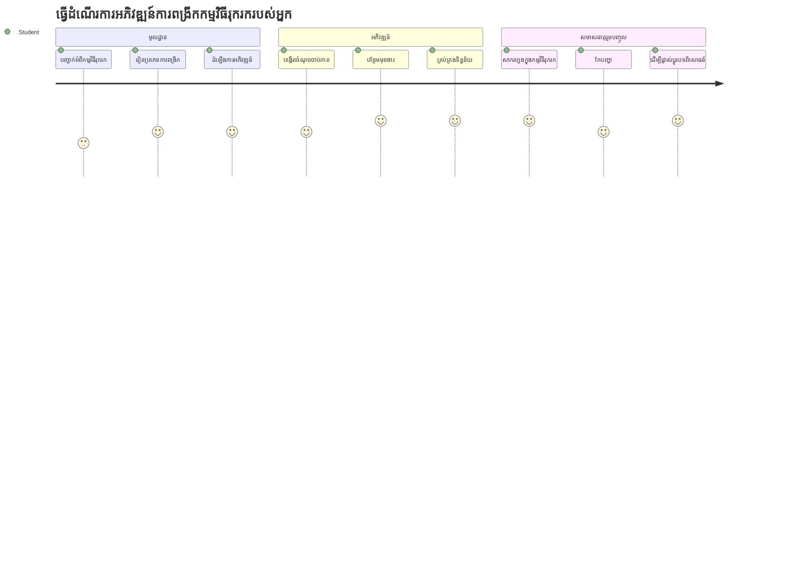
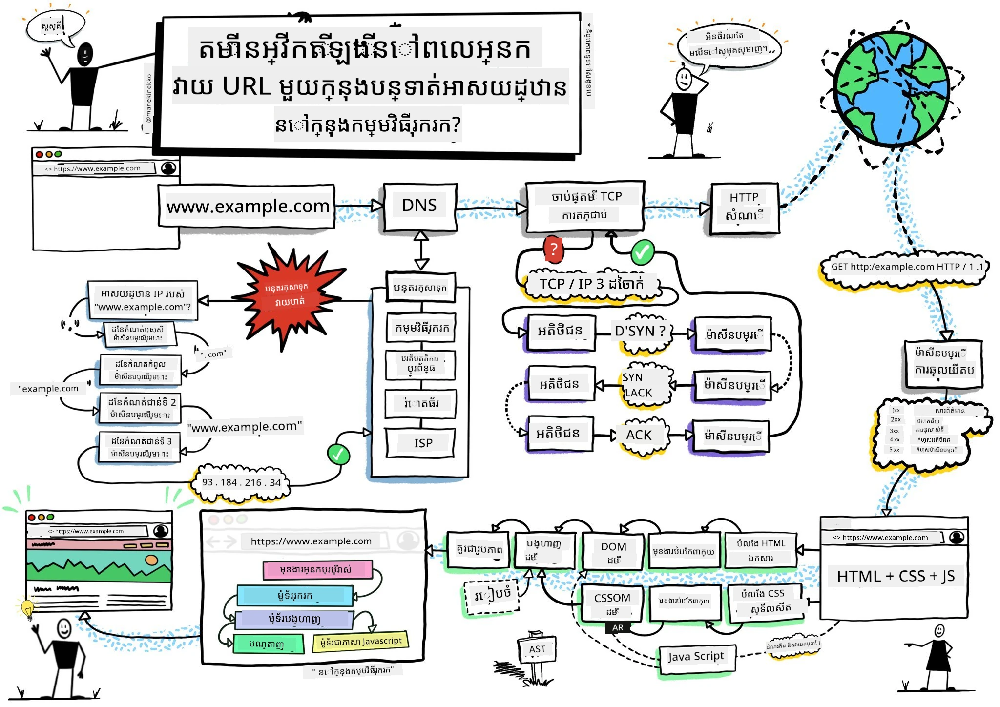
> សេចក្ដីសង្ខេបដោយ [Wassim Chegham](https://dev.to/wassimchegham/ever-wondered-what-happens-when-you-type-in-a-url-in-an-address-bar-in-a-browser-3dob)

## សំណួរជំនាញមុនមេរៀន

[សំណួរជំនាញមុនមេរៀន](https://ff-quizzes.netlify.app/web/quiz/23)

### គំនិតទាំងមូល

ផ្នែកបន្ថែមកម្មវិធីរុករកវែបគឺជាកម្មវិធីតូចៗដែលបន្ថែមបទពិសោធន៍រុករកវែបរបស់អ្នក។ ដូចដែលចក្ខុវិស័យដើមរបស់ Tim Berners-Lee ពីវែបអន្តរកម្ម ផ្នែកបន្ថែមពង្រីកសមត្ថភាពរបស់កម្មវិធីរុករកវែបឲ្យលើសការមើលឯកសារដូចធម្មតា។ ចាប់ពីកម្មវិធីគ្រប់គ្រងពាក្យសម្ងាត់ដែលរក្សាបរិយាបញ្ហាប្រាក់គណនីរបស់អ្នកឲ្យមានសុវត្ថិភាព ទៅដល់កម្មវិធីជ្រើសពណ៌ដែលជួយឲ្យអ្នករចនារកពណ៌ល្អឥតខ្ចោះ ផ្នែកបន្ថែមដោះស្រាយបញ្ហារុករកប្រចាំថ្ងៃ។

មុនពេលយើងបង្កើតផ្នែកបន្ថែមដំបូងរបស់អ្នក មកយល់ដឹងពីរបៀបទំនាក់ទំនងរបស់កម្មវិធីរុករកវែប។ ដូចដែល Alexander Graham Bell ត្រូវការយល់ដឹងពីការផ្ញើសំឡេងមុនបង្កើតទូរស័ព្ទ ការយល់ដឹងពីមូលដ្ឋានកម្មវិធីរុករកវែបនឹងជួយអ្នកបង្កើតផ្នែកបន្ថែមឲ្យរួមបញ្ចូលបានយ៉ាងរលូនជាមួយប្រព័ន្ធកម្មវិធីរុករកផ្សេងៗ។

នៅចុងបញ្ចប់មេរៀននេះ អ្នកនឹងយល់ពីសំណុំរចនាសម្ព័ន្ធកម្មវិធីរុករក និងបានចាប់ផ្តើមបង្កើតផ្នែកបន្ថែមដំបូងរបស់អ្នក។

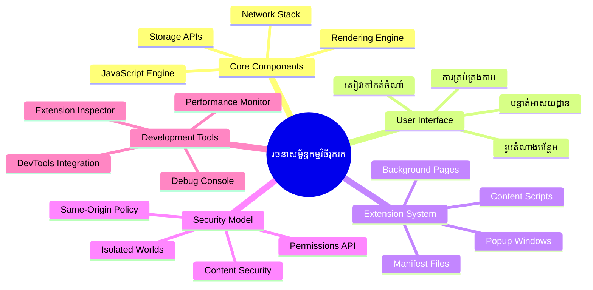
## យល់ដឹងអំពីកម្មវិធីរុករកវែប

កម្មវិធីរុករកវែបគឺជាឧបករណ៍បកប្រែឯកសារដ៏ស្មុគស្មាញមួយ។ ពេលអ្នកវាយ "google.com" ទៅក្នុងរបារអាសយដ្ឋាន កម្មវិធីរុករកនោះនឹងអនុវត្តន៍វិធីសាស្រ្តស្មុគស្មាញមួយចំនួន - ស្នើសុំទទួលបានមាតិកាពីម៉ាស៊ីនបម្រើទូទាំងពិភពលោក រួចបកប្រែ និងបង្ហាញកូដនោះទៅជាទំព័រវែបអន្តរកម្មដែលអ្នកឃើញ។

ដំណើរការនេះស្រដៀងនឹងរបៀបដែលកម្មវិធីរុករកវែបដំបូង WorldWideWeb ត្រូវបាន Tim Berners-Lee រចនាឡើងឆ្នាំ 1990 ដើម្បីធ្វើឲ្យឯកសារដែលមានតំណភ្ជាប់អាចចូលប្រើបានសម្រាប់មនុស្សគ្រប់រូប។

✅ **ប្រវត្តិសាស្ត្រខ្លះៗ**៖ កម្មវិធីរុករកដំបូងមានឈ្មោះថា 'WorldWideWeb' និងត្រូវបាន Sir Timothy Berners-Lee បង្កើតឡើងនៅឆ្នាំ 1990។

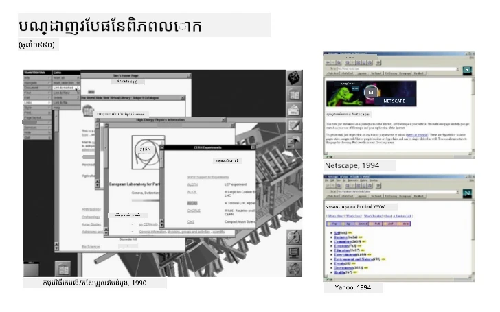
> កម្មវិធីរុករកដំបូងខ្លះៗ តាមរយៈ [Karen McGrane](https://www.slideshare.net/KMcGrane/week-4-ixd-history-personal-computing)

### របៀបទំលៃកម្មវិធីរុករកដោះស្រាយមាតិកាវែប

ដំណើរការរវាងការវាយ URL និងការមើលទំព័រវែបមានជំហ៊ានត្រូវបានសម្របសម្រួលជាច្រើនសកម្មភាពដែលកើតមានជាទីបំផុតក្នុងរយៈពេលខ្លី៖

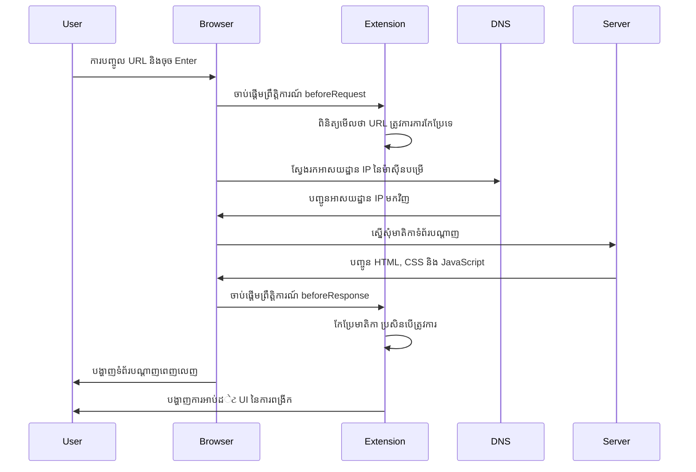
**អ្វីដែលដំណើរការនេះបានធ្វើ៖** 
- **បកប្រែ** URL ដែលមនុស្សអាចអានបានទៅជាអាសយដ្ឋាន IP របស់ម៉ាស៊ីនបម្រើតាមរយៈការស្វែងរក DNS  
- **បង្កើត**ការតភ្ជាប់សុវត្ថិភាពជាមួយម៉ាស៊ីនបម្រើវែបដោយប្រើប្រព័ន្ធ HTTP ឬ HTTPS  
- **ស្នើសុំ**មាតិកាទំព័រវែបជាក់លាក់ពីម៉ាស៊ីនបម្រើ  
- **ទទួលបាន**អត្ថបទ HTML, ទម្រង់ CSS និងកូដ JavaScript ពីម៉ាស៊ីនបម្រើ  
- **បង្ហាញ**មាតិការបស់ទំព័រវែបអន្តរកម្មដែលអ្នកបានគិតឃើញ

### លក្ខណៈសម្បត្តិមូលដ្ឋាននៃកម្មវិធីរុករក

កម្មវិធីរុករកសម័យទំនើបផ្តល់ជូនលក្ខណៈសម្បត្តិជាច្រើនដែលអ្នកបង្កើតផ្នែកបន្ថែមអាចប្រើប្រាស់បាន៖

| លក្ខណៈសម្បត្តិ | គោលបំណង | ឱកាសរបស់ផ្នែកបន្ថែម |
|---------|---------|------------------------|
| **ម៉ាស៊ីនបង្ហាញ** | បង្ហាញ HTML, CSS និង JavaScript | ផ្លាស់ប្ដូរមាតិកា បញ្ចូលស្ទីល |
| **ម៉ាស៊ីន JavaScript** | ប្រតិបត្តិការ JavaScript | កូដផ្ទាល់ខ្លួន ការបន្តផ្តល់ API |
| **ផ្ទុកទិន្នន័យក្នុងមូលដ្ឋានមូលដ្ឋាន** | រក្សាទិន្នន័យក្នុងកុំព្យូទ័រ | ចំណូលចិត្តអ្នកប្រើ ទិន្នន័យដែលកែច្នៃរួច |
| **ប្រព័ន្ធបណ្ដាញ** | គ្រប់គ្រងសំណើវែប | តាមដានសំណើ វិភាគទិន្នន័យ |
| **ម៉ូឌែលសុវត្ថិភាព** |ការពារអ្នកប្រើពីមាតិកាអាក្រក់ | ការត្រង់មាតិកា ការកែលម្អសុវត្ថិភាព |

**ការយល់ដឹងលក្ខណៈសម្បត្តិទាំងនេះជួយអ្នក៖**  
- **កំណត់**កន្លែងដែលផ្នែកបន្ថែមអាចបន្ថែមតម្លៃបានច្រើនបំផុត  
- **ជ្រើសរើស** API កម្មវិធីរុករកដែលត្រូវនឹងមុខងារផ្នែកបន្ថែមរបស់អ្នក  
- **រចនា**ផ្នែកបន្ថែមដែលដំណើរការយ៉ាងមានប្រសិទ្ធភាពជាមួយប្រព័ន្ធកម្មវិធីរុករក  
- **ធានា**ផ្នែកបន្ថែមរបស់អ្នកអនុវត្តការពារសុវត្ថិភាពល្អបំផុត

### ការពិចារណាក្នុងការអភិវឌ្ឍផ្នែកបន្ថែមសម្រាប់កម្មវិធីរុករកជាច្រើន

កម្មវិធីរុករកផ្សេងគ្នាជា​ផ្នែកមូលដ្ឋានអនុវត្តស្ដង់ដារខុសគ្នាក្នុងរបៀបតិចតួច ដូចជាប្រភេទភាសាប្រតិបត្តិការ ផ្តោតដល់ការដោះស្រាយអាល់ហ្គូរិធម៍ដូចគ្នា ខណៈដែល Chrome, Firefox និង Safari មានលក្ខណៈពិសេសខុសគ្នាដែលអ្នកអភិវឌ្ឍត្រូវយកចិត្តទុកដាក់ក្នុងដំណើរការអភិវឌ្ឍផ្នែកបន្ថែម។

> 💡 **គន្លឹះជំនួយ។** ប្រើ [caniuse.com](https://www.caniuse.com) ដើម្បីពិនិត្យថាតើបច្ចេកវិទ្យាវែបណាមួយត្រូវបានគាំទ្រនៅលើកម្មវិធីរុករកផ្សេងៗឬទេ។ វាមានប្រយោជន៍ខ្លាំងនៅពេលគ្រប់គ្រងលក្ខណៈសម្បត្តិផ្នែកបន្ថែមរបស់អ្នក!

**ចំណុចគន្លឹះសម្រាប់ការអភិវឌ្ឍផ្នែកបន្ថែម៖**  
- **សាកល្បង**ផ្នែកបន្ថែមរបស់អ្នក ថ្នាក់លើក Chrome, Firefox និង Edge  
- **ប្ដូរការប្រើប្រាស់** API ផ្នែកបន្ថែម និងទម្រង់ manifest ផ្សេងគ្នានៅកម្មវិធីរុករកផ្សេងៗ  
- **ដោះស្រាយ**លក្ខណៈការអនុវត្តន៍ និងកំណត់ចំណាំបែងចែក  
- **ផ្តល់**មធ្យោបាយជំនួយសម្រាប់លក្ខណៈពិសេសជាក់លាក់របស់កម្មវិធីរុករកដែលប្រហែលជាមានកំណត់

✅ **ព័ត៌មានវិភាគប្រាក់ចំណេញ**៖ អ្នកអាចកំណត់កម្មវិធីរុករកដែលអ្នកប្រើពេញចិត្តតាមរយៈការដំឡើងកម្មវិធីវិភាគក្នុងគម្រោងអភិវឌ្ឍន៍វែបរបស់អ្នក។ ទិន្នន័យនេះជួយអ្នកអាទិភាពកម្មវិធីរុករកដែលគួរគាំទ្រជាលើកដំបូង។

## យល់ដឹងពីផ្នែកបន្ថែមកម្មវិធីរុករក

ផ្នែកបន្ថែមកម្មវិធីរុករកដោះស្រាយបញ្ហាធម្មតាក្នុងការរុករកវែបដោយបន្ថែមមុខងារដោយផ្ទាល់ទៅចំណុចអ្នកប្រើកម្មវិធីរុករក។ វាមិនចាំបាច់ប្រើកម្មវិធីផ្សេងទៀតឬវីធីសាស្រ្តស្មុគស្មាញ នោះទេ ផ្នែកបន្ថែមផ្តល់នូវការចូលដំណើរការឧបករណ៍ និងមុខងារបានភ្លាមៗ។

គំនិតនេះស្រដៀងនឹងវិស័យការរៀនរបស់អ្នកបង្កើតកុំព្យូទ័រដំបូងៗដូចជា Douglas Engelbart ដែលបានចងក្រងការពង្រីកសមត្ថភាពមនុស្សជាមួយបច្ចេកវិទ្យា - ផ្នែកបន្ថែមពង្រីកមុខងារមូលដ្ឋានរបស់កម្មវិធីរុករករបស់អ្នក។

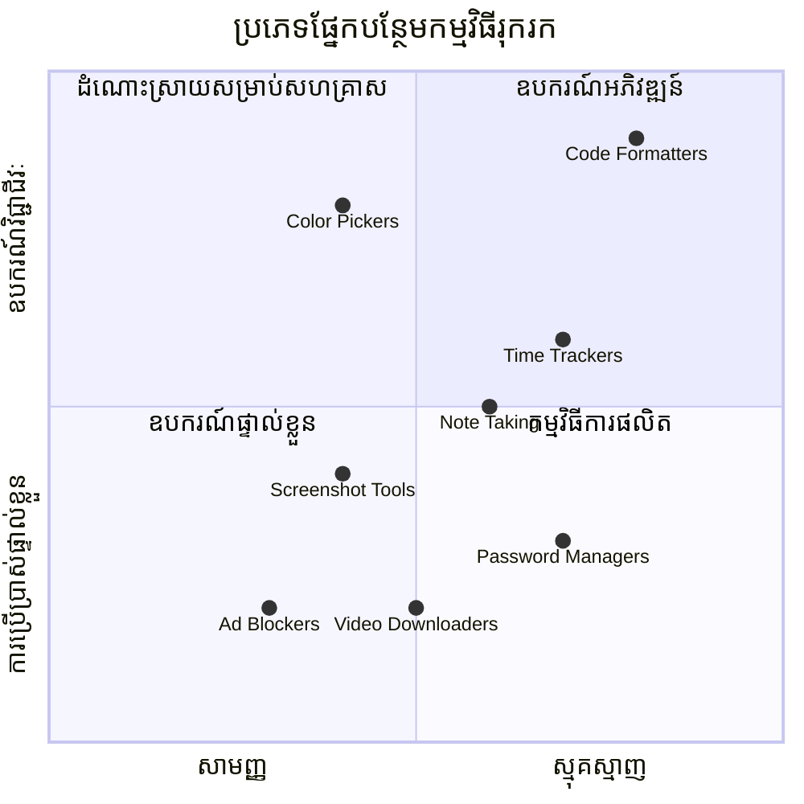
**ប្រភេទផ្នែកបន្ថែមដែលពេញនិយម និងអត្ថប្រយោជន៍របស់ពួកវា៖**  
- **ឧបករណ៍ផលិតភាព**៖ គ្រប់គ្រងការងារ កម្មវិធីកំណត់កំណត់សម្គាល់ និងឧបករណ៍តាមដានពេលវេលាដែលជួយអ្នកមានការរៀបចំ  
- **ការកែលម្អសុវត្ថិភាព**៖ ប្រព័ន្ធគ្រប់គ្រងពាក្យសម្ងាត់ ប្រព័ន្ធរាំងខ្ទប់ប្រកាស និងឧបករណ៍ឯកជនភាពដែលការពារទិន្នន័យរបស់អ្នក  
- **ឧបករណ៍អ្នកអភិវឌ្ឍន៍**៖ កម្មវិធីរៀបចំកូដ ឧបករណ៍ជ្រើសពណ៌ និងឧបករណ៍គូរប្រសិទ្ធភាពដែលជួយសម្រួលការអភិវឌ្ឍ  
- **ការកែលម្អមាតិកា**៖ របៀបអាន ទាញយកវីដេអូ និងឧបករណ៍ប្រើថតរូបសំរាប់លើកមកបទពិសោធន៍រុករកវែបកាន់តែប្រសើរ

✅ **សំនួរត្រលប់មកវិញ**៖ តើផ្នែកបន្ថែមកម្មវិធីរុករកដែលអ្នកចូលចិត្តមានអ្វីខ្លះ? ពួកវាជួបប្រទៈតាមភារកិច្ចដូចម្តេច ហើយពួកវាបង្កើនបទពិសោធន៍រុករករបស់អ្នកយ៉ាងដូចម្តេច?

### 🔄 **ការត្រួតពិនិត្យការរៀន**  
**ការយល់ដឹងសំណុំរចនាសម្ព័ន្ធកម្មវិធីរុករក**៖ មុនពេលផ្លាស់ទៅកាន់ការអភិវឌ្ឍផ្នែកបន្ថែម សូមប្រាកដថាអ្នកអាច៖  
- ✅ ពន្យល់ពីរបៀបកម្មវិធីរុករកអនុវត្តសំណើវែប និងបង្ហាញមាតិកា  
- ✅ កំណត់ធាតុសំខាន់នៃសំណុំរចនាសម្ព័ន្ធកម្មវិធីរុករក  
- ✅ យល់ពីរបៀបផ្នែកបន្ថែមរួមបញ្ចូលជាមួយមុខងាររបស់កម្មវិធីរុករក  
- ✅ ស្គាល់ម៉ូឌែលសុវត្ថិភាពដែលការពារអ្នកប្រើ

**ការប្រលងខ្លីដោយខ្លួនឯង**៖ តើអ្នកអាចតាមដានផ្លូវពីការវាយ URL ទៅការមើលទំព័រវែបបានទេ?  
1. **ការស្វែងរក DNS** បម្លែង URL ទៅអាសយដ្ឋាន IP  
2. **សំណើ HTTP** ទាញយកមាតិកាពីម៉ាស៊ីនបម្រើ  
3. **ការបកប្រែ** ដំណើរការ HTML, CSS និង JavaScript  
4. **ការបង្ហាញ** បង្ហាញទំព័រវែបចុងក្រោយ  
5. **ផ្នែកបន្ថែម** អាចផ្លាស់ប្ដូរមាតិកានៅជំហានជាច្រើន

## ដំឡើង និងគ្រប់គ្រងផ្នែកបន្ថែម

ការយល់ដឹងពីដំណើរការដំឡើងផ្នែកបន្ថែមជួយអ្នកទស្សនាថាបទពិសោធន៍អ្នកប្រើនឹងធ្វើដូចម្តេចនៅពេលមនុស្សដំឡើងផ្នែកបន្ថែមរបស់អ្នក។ ដំណើរការដំឡើងត្រូវបានកំណត់តាមបទស្លាប់នៅគ្រប់កម្មវិធីរុករកសម័យទំនើប ដោយមានភាពខុសគ្នាតិចតួចនៅក្នុងការរចនាផ្ទៃមុខ។

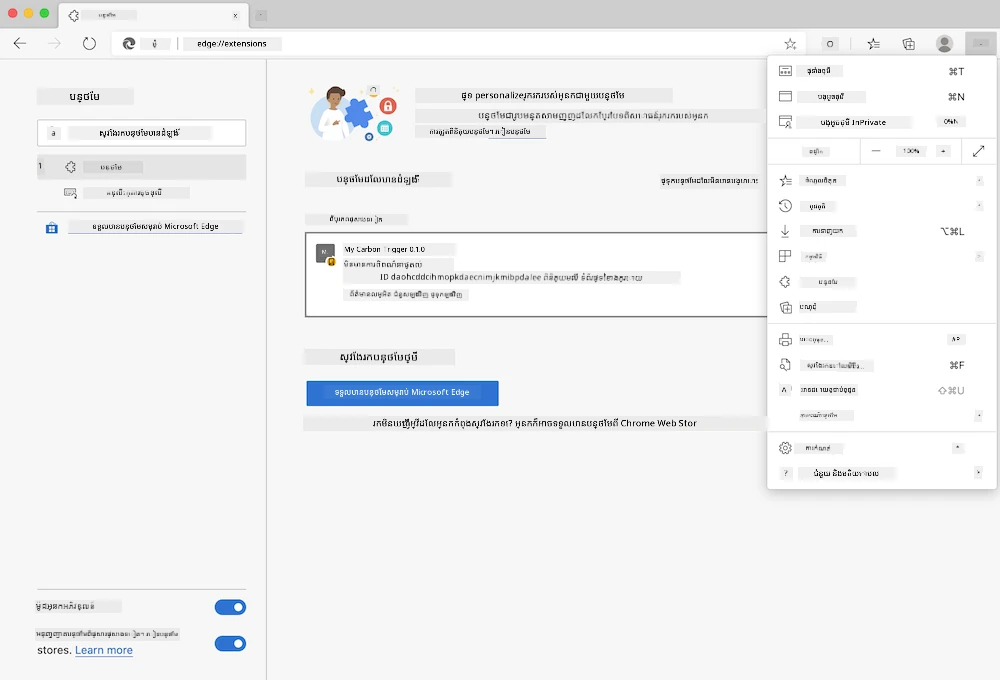

> **សំខាន់**៖ សូមប្រាកដថាបើកមូដអ្នកអភិវឌ្ឍន៍ និងអនុញ្ញាតផ្នែកបន្ថែមពីឃ្លាំងផ្សេងៗនៅពេលសាកល្បងផ្នែកបន្ថែមរបស់អ្នក។

### ដំណើរការដំឡើងផ្នែកបន្ថែមសំរាប់អភិវឌ្ឍន៍

ពេលអ្នកកំពុងអភិវឌ្ឍ និងសាកល្បងផ្នែកបន្ថែមរបស់អ្នក សូមអនុវត្តវិធីសាស្រ្តនេះ៖

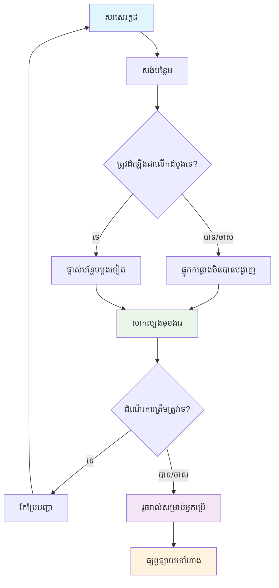
```bash
# ជំហាន 1: សង់កម្មវិធីបន្ថែមរបស់អ្នក
npm run build
```

**អ្វីដែលពាក្យបញ្ជានេះបានធ្វើ៖**  
- **សម្រួល**កូដប្រភពរបស់អ្នកទៅជាសំណុំផ្នែកបន្ថែមដែលរួចរាល់សម្រាប់កម្មវិធីរុករក  
- **បញ្ចូល**ម៉ូឌុល JavaScript ទៅជា​បណ្ដុំ​ឯកសារ​ដែលបានបំលែង  
- **បង្កើត**ឯកសារផ្នែកបន្ថែមចុងក្រោយក្នុងថត `/dist`  
- **រៀបចំ**ផ្នែកបន្ថែមរបស់អ្នកសម្រាប់ការដំឡើង និងសាកល្បង

**ជំហាន ២: ទៅកាន់ផ្នែកគ្រប់គ្រងផ្នែកបន្ថែម**  
1. **បើក**ទំព័រការគ្រប់គ្រងផ្នែកបន្ថែមរបស់កម្មវិធីរុករក  
2. **ចុច**ប៊ូតុង "ការកំណត់ និងផ្សេងៗ" (`...` ស្លាក) នៅជ្រុងខាងស្តាំខាងលើ  
3. **ជ្រើសរើស** "ផ្នែកបន្ថែម" ពីមិន៊ូធ្លាក់ចុះ

**ជំហាន ៣: ផ្ទុកផ្នែកបន្ថែមរបស់អ្នក**  
- **សម្រាប់ការដំឡើងថ្មី**: ជ្រើស `load unpacked` ហើយជ្រើសថត `/dist` របស់អ្នក  
- **សម្រាប់ការអាប់ដេត**: ចុច `reload` ប្រសិនបើផ្នែកបន្ថែមបានដំឡើងរួចហើយ  
- **សម្រាប់ការសាកល្បង**: បើក "Developer mode" ដើម្បីចូលប្រើមុខងារបន្ថែមសម្រាប់កែប្រែកូដ

### ដំឡើងផ្នែកបន្ថែមសម្រាប់ផលិតកម្ម

> ✅ **កត់សម្គាល់**៖ ណែនាំអភិវឌ្ឍនេះសម្រាប់ផ្នែកបន្ថែមដែលអ្នកបង្កើតផ្ទាល់។ ដើម្បីដំឡើងផ្នែកបន្ថែមដែលបានផ្សព្វផ្សាយ សូមទៅកាន់ហាងផ្នែកបន្ថែមរបស់កម្មវិធីរុករកផ្លូវការដូចជា [Microsoft Edge Add-ons store](https://microsoftedge.microsoft.com/addons/Microsoft-Edge-Extensions-Home)។

**យល់ដឹងពីភាពខុសគ្នា៖**  
- **ការដំឡើងអភិវឌ្ឍន៍** អនុញ្ញាតឲ្យអ្នកសាកល្បងផ្នែកបន្ថែមមិនទាន់ផ្សព្វផ្សាយពេលកំពុងអភិវឌ្ឍន៍  
- **ការដំឡើងពីហាង** ផ្តល់ផ្នែកបន្ថែមដែលបានបញ្ជាក់ និងមានការអាប់ដេតស្វ័យប្រវត្តិ  
- **ការចូលផ្លូវក្រៅហាង** អនុញ្ញាតឲ្យដំឡើងផ្នែកបន្ថែមពីក្រៅហាងផ្លូវការប៉ុន្តែត្រូវការមូដអភិវឌ្ឍន៍

## កសាងផ្នែកបន្ថែមព្រីនជាតិកាបូនរបស់អ្នក

យើងនឹងបង្កើតផ្នែកបន្ថែមកម្មវិធីរុករក វិចិត្រសើរព្រីនជាតិការប្រើថាមពលរបស់តំបន់អ្នក។ គម្រោងនេះបង្ហាញពីមូលដ្ឋានការអភិវឌ្ឍផ្នែកបន្ថែមសំខាន់ៗ ខណៈដែលសំដៅធ្វើឲ្យមានឧបករណ៍ប្រើប្រាស់សកម្មភាពជាក់ស្តែងក្នុងការយល់ដឹងបរិស្ថាន។

វិធីសាស្រ្តនេះ ធ្វើតាមគោលការណ៍ "រៀនដោយការធ្វើ" ដែលមានប្រសិទ្ធភាពតាំងពីទស្សនវិជ្ជាអប់រំរបស់ John Dewey - ការរួមបញ្ចូលជំនាញបច្ចេកទេស និងការប្រើប្រាស់ជាក់ស្តែងក្នុងពិភពលោកពិត។

### តម្រូវការគម្រោង

មុនចាប់ផ្តើមអភិវឌ្ឍ សូមប្រមូលអំពីធនធាន និងអាស្រ័យភាពដែលចាំបាច់៖

**ការចូលដំណើរការជាមួយ API:**  
- **[កូនសោ API CO2 Signal](https://www.co2signal.com/)**៖ បញ្ចូលអាសយដ្ឋានអ៊ីមែលរបស់អ្នកដើម្បីទទួលបានកូនសោ API ឥតគិតថ្លៃ  
- **[កូដតំបន់](http://api.electricitymap.org/v3/zones)**៖ ស្វែងរកកូដតំបន់របស់អ្នកតាមរយៈ [Electricity Map](https://www.electricitymap.org/map) (ឧទាហរណ៍ ប៉ុន្តែ Boston ប្រើ 'US-NEISO')

**ឧបករណ៍អភិវឌ្ឍន៍:**  
- **[Node.js និង NPM](https://www.npmjs.com)**៖ ឧបករណ៍គ្រប់គ្រងកញ្ចប់សម្រាប់ដំឡើងអាស្រ័យភាពគម្រោង  
- **[កូដចាប់ផ្តើម](../../../../5-browser-extension/start)**៖ ទាញយកថត `start` ដើម្បីចាប់ផ្តើមអភិវឌ្ឍន៍

✅ **សូមស្វែងយល់បន្ថែម**៖ ប្រuckerលើជំនាញគ្រប់គ្រងកញ្ចប់របស់អ្នកជាមួយ [មេរៀនសិក្សា] ដែលបំពេញដោយម៉ូឌុលរៀននេះ (https://docs.microsoft.com/learn/modules/create-nodejs-project-dependencies/?WT.mc_id=academic-77807-sagibbon)

### យល់ដឹងពីរចនាសម្ព័ន្ធគម្រោង

ការយល់ដឹងអំពីរចនាសម្ព័ន្ធគម្រោងជួយរៀបចំការងារអភិវឌ្ឍបានយ៉ាងមានប្រសិទ្ធភាព។ ដូចដែលបណ្ណាល័យ Alexandria ត្រូវបានរៀបចំសម្រាប់យកចំណេះដឹងបានងាយស្រួល គេកូដដែ​រចនាសម្ព័ន្ធល្អលើកស្ទួយការអភិវឌ្ឍន៍បានប្រសើរជាងមុន៖

```
project-root/
├── dist/                    # Built extension files
│   ├── manifest.json        # Extension configuration
│   ├── index.html           # User interface markup
│   ├── background.js        # Background script functionality
│   └── main.js              # Compiled JavaScript bundle
├── src/                     # Source development files
│   └── index.js             # Your main JavaScript code
├── package.json             # Project dependencies and scripts
└── webpack.config.js        # Build configuration
```

**ការបែងចែកអ្វីដែលឯកសារពីរចនាសម្ព័ន្ធធ្វើ៖**  
- **`manifest.json`**៖ **កំណត់** ព័ត៌មានមាតិកា ផាកពិនិត្យ និងចំណុចចូល  
- **`index.html`**៖ **បង្កើត** មុខងារជាផ្ទៃមុខដែលបង្ហាញពេលអ្នកប្រើចុចផ្នែកបន្ថែមរបស់អ្នក  
- **`background.js`**៖ **គ្រប់គ្រង** ដំណើរការផ្នែកក្រោយ និងអ្នកស្ដាប់ព្រឹត្តិការណ៍កម្មវិធីរុករក  
- **`main.js`**៖ **ផ្ទុក** JavaScript ចុងក្រោយបន្ទាប់ពីដំណើរការសាងសង់  
- **`src/index.js`**៖ **ផ្ទុក** កូដអភិវឌ្ឍន៍ដើមដែលចំរូងទៅជា `main.js`

> 💡 **គន្លឹះរៀបចំ**៖ រក្សាទុកកូនសោ API និងកូដតំបន់របស់អ្នកក្នុងកំណត់ចំណាំសុវត្ថិភាពសម្រាប់យោងឲ្យងាយពេលអភិវឌ្ឍ។ អ្នកនឹងត្រូវការផ្នែកទាំងនេះសម្រាប់សាកល្បងមុខងារផ្នែកបន្ថែមរបស់អ្នក។

✅ **សម្គាល់សុវត្ថិភាព**៖ កុំធ្វើជាការផ្សព្វផ្សាយកូនសោ API ឬព័ត៌មានដែលមានទំនួលខុសត្រូវក្នុងប្រភពកូដរបស់អ្នក។ យើងនឹងបង្ហាញអ្នកពីរបៀបគ្រប់គ្រងយ៉ាងមានសុវត្ថិភាពនៅជំហានក្រោយ។

## បង្កើតផ្ទាំងផ្នែកបន្ថែម

ឥឡូវនេះយើងនឹងបង្កើតមុខងារផ្ទាំងអ្នកប្រើផ្នែកបន្ថែម។ ផ្នែកបន្ថែមនេះប្រើវិធីសាស្ត្រពីរប្រែវថា៖ ផ្ទាំងកំណត់រចនាសម្ព័ន្ធដំបូង និងផ្ទាំងបង្ហាញលទ្ធផលសម្រាប់បង្ហាញទិន្នន័យ។

វិធីសាស្ត្រនេះអនុវត្តតាមគោលការណ៍បង្ហាញពេញលេញដែលបានប្រើក្នុងរចនាបទផ្ទាំងចាប់តាំងពីដើមកុំព្យូទ័រ - បង្ហាញព័ត៌មាន និង​ជម្រើស​តាមលំដាប់ត្រឹមត្រូវដើម្បីមិនឲ្យអ្នកប្រើរអាក់រអួល។

### មើលទិដ្ឋភាពផ្នែកបន្ថែម

**ទិដ្ឋភាពកំណត់រចនាសម្ព័ន្ធ** - ការកំណត់អ្នកប្រើដំបូង៖  
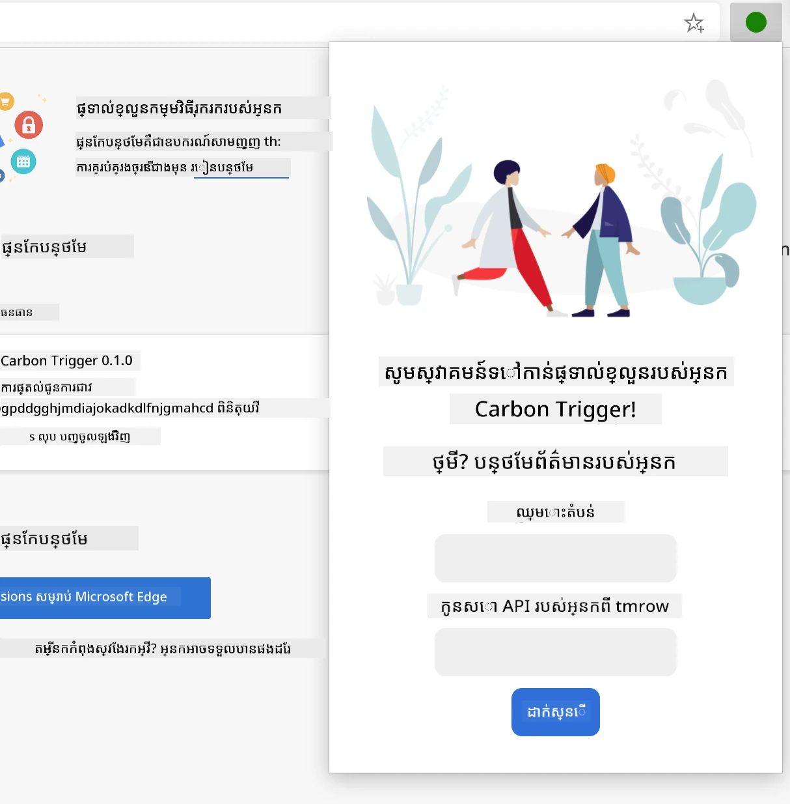

**ទិដ្ឋភាពលទ្ធផល** - បង្ហាញទិន្នន័យព្រះនា្ដិកាបូន៖  
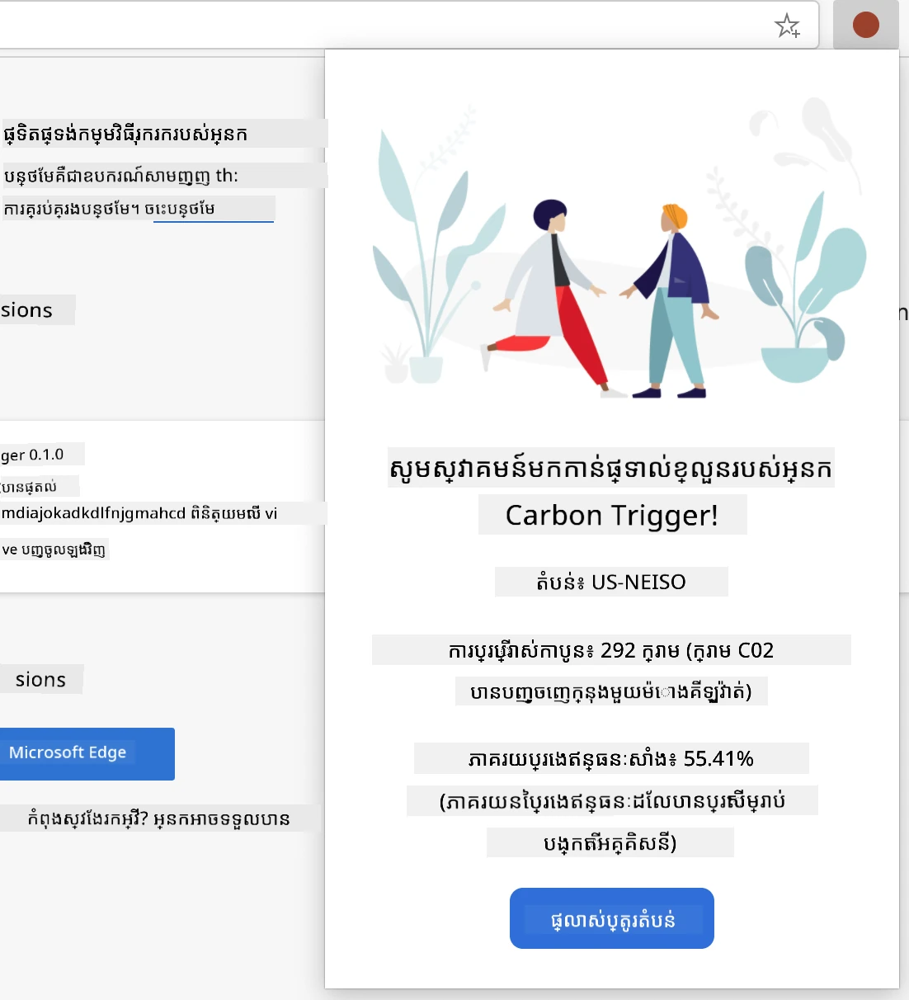

### បង្កើតកម្រងសំណុំបែបបទកំណត់រចនាសម្ព័ន្ធ

បែបបទកំណត់រចនាសម្ព័ន្ធប្រមូលទិន្នន័យកំណត់រចនាសម្ព័ន្ធអ្នកប្រើនៅពេលដំបូងប្រើ។ ពេលបានកំណត់រួច ข้อมูลនេះនឹងរក្សាទុកក្នុងផ្ទុកបណ្តាញរបស់កម្មវិធីរុករកសម្រាប់ការប្រើប្រាស់បន្ត។

នៅឯកសារ `/dist/index.html` សូមបន្ថែមសំណុំបែបបទនេះ៖

```html
<form class="form-data" autocomplete="on">
    <div>
        <h2>New? Add your Information</h2>
    </div>
    <div>
        <label for="region">Region Name</label>
        <input type="text" id="region" required class="region-name" />
    </div>
    <div>
        <label for="api">Your API Key from tmrow</label>
        <input type="text" id="api" required class="api-key" />
    </div>
    <button class="search-btn">Submit</button>
</form>
```

**អ្វីដែលបែបបទនេះបានធ្វើ៖**  
- **បង្កើត** រចនាសម្ព័ន្ធបែបបទដែលមានសារៈសំខាន់ជាមួយស្លាក និងការចូលបញ្ចូលមុខងារយ៉ាងត្រឹមត្រូវ  
- **បើក** មុខងារ autocomplete របស់កម្មវិធីរុករកសម្រាប់បទពិសោធន៍ប្រសើរឡើង  
- **ទាមទារ** បំពេញទាំងពីរផ្នែកមុនការដាក់ស្នើដោយប្រើលក្ខណៈ `required`  
- **រៀបចំ** ការបញ្ចូលតាមឈ្មោះថ្នាក់ដើម្បីងាយស្រួលបន្ថែមស្ទីល និងកូដ JavaScript  
- **ផ្តល់** ប្រសាសន៍ច្បាស់លាស់សម្រាប់អ្នកប្រើដែលកំពុងកំណត់បន្ថែម

### បង្កើតផ្ទាំងបង្ហាញលទ្ធផល

បន្ទាប់មក បង្កើតតំបន់បង្ហាញលទ្ធផលដែលបង្ហាញទិន្នន័យព័ណ្ឋនាកាបូន។ សូមបន្ថែម HTML ខាងក្រោមបែបបទ៖

```html
<div class="result">
    <div class="loading">loading...</div>
    <div class="errors"></div>
    <div class="data"></div>
    <div class="result-container">
        <p><strong>Region: </strong><span class="my-region"></span></p>
        <p><strong>Carbon Usage: </strong><span class="carbon-usage"></span></p>
        <p><strong>Fossil Fuel Percentage: </strong><span class="fossil-fuel"></span></p>
    </div>
    <button class="clear-btn">Change region</button>
</div>
```

**អ្វីដែលរចនាសម្ព័ន្ធនេះផ្តល់៖**  
- **`loading`**៖ **បង្ហាញ** សារកំពុងផ្ទុកមេដាតា ពេលទិន្នន័យពី API ត្រូវបានទាញ  
- **`errors`**៖ **បង្ហាញ** សារបញ្ហា ករណី API មិនទទួលបានទិន្នន័យ ឬទិន្នន័យមិនត្រឹមត្រូវ  
- **`data`**៖ **ផ្ទុក** ទិន្នន័យដើមសម្រាប់ការពិនិត្យកូដជាការអភិវឌ្ឍ  
- **`result-container`**៖ **បង្ហាញ** ព័ត៌មានព្រះនាទិកាបូនដែលបានរៀបចំ  
- **`clear-btn`**៖ **អនុញ្ញាត** អ្នកប្រើឲ្យផ្លាស់ប្តូរតំបន់និងកំណត់រចនាសម្ព័ន្ធឡើងវិញ

### រៀបចំដំណើរការសាងសង់

ឥឡូវនេះមកដំឡើងអាស្រ័យភាពគម្រោង និងសាកល្បងដំណើរការសាងសង់៖

```bash
npm install
```

**អ្វីដែលដំណើរការដំឡើងនេះបានធ្វើ៖**  
- **ទាញយក** Webpack និងអាស្រ័យភាពអភិវឌ្ឍផ្សេងៗដែលបានបញ្ជាក់ក្នុង `package.json`  
- **កំណត់** ឧបករណ៍សាងសង់សម្រាប់បំបែក និងបំលែងកូដ JavaScript ទំនើបៗ  
- **រៀបចំ** នូវបរិយាកាសអភិវឌ្ឍសម្រាប់ការសាងសង់និងសាកល្បងផ្នែកបន្ថែម  
- **អនុញ្ញាត** ការបកស្រាយកូដ ការបង្កើតបន្តុល និងការចូលលំដាប់ជាមួយកម្មវិធីរុករកများ

> 💡 **ចំណេះដឹងដំណើរការសាងសង់**៖ Webpack បញ្ចូលកូដប្រភពអ្នកពី `/src/index.js` ទៅជា `/dist/main.js`។ ដំណើរការនេះអុបទុយម៉ង់កូដសម្រាប់ផលិតកម្ម និងធានាបាននូវការចូលប្រើបានគ្រប់កម្មវិធីរុករក។

### សាកល្បងការរីកចម្រើនរបស់អ្នក

នៅពេលនេះ អ្នកអាចសាកល្បងផ្នែកបន្ថែមរបស់អ្នកបាន៖
1. **រត់** ពាក្យបញ្ជា build ដើម្បីបង្កប់កូដរបស់អ្នក  
2. **ផ្ទុក** ផ្នែកបន្ថែមទៅក្នុងកម្មវិធីរុករករបស់អ្នកដោយប្រើរបៀបរបស់អ្នកអwickអ្នកអwickអ្នកអwick  
3. **ផ្ទៀងផ្ទាត់** ថា បែបបទបង្ហាញបានត្រឹមត្រូវ និងមានរូបរាងវិជ្ជាជីវៈ  
4. **ត្រួតពិនិត្យ** ថា ធាតុទាំងអស់នៃបែបបទបានដាក់ជាបន្ទាត់សមរម្យ និងដំណើរការបាន  

**អ្វីដែលអ្នកបានសម្រេច៖**  
- **បានបង្កើត** រចនាសម្ព័ន្ធ HTML ផ្លូវដើមសម្រាប់ផ្នែកបន្ថែមរបស់អ្នក  
- **បានបង្កើត** ទាំងចំណុចផ្ទៀងផ្ទាត់និងលទ្ធផលជាមួយនឹងសញ្ញាសំដៅដែលត្រឹមត្រូវ  
- **បានដាក់** វិធីសាស្រ្តអភិវឌ្ឍសម័យទំនើបដោយប្រើឧបករណ៍ស្តង់ដារក្នុងឧស្សាហកម្ម  
- **បានរៀបចំ** មូលដ្ឋានសម្រាប់បន្ថែមមុខងារ JavaScript អន្តរកម្ម  

### 🔄 **ការត្រួតពិនិត្យផ្លូវការអប់រំ**  
**ដំណើរការអភិវឌ្ឍផ្នែកបន្ថែម**៖ ផ្ទៀងផ្ទាត់ការយល់ដឹងរបស់អ្នកមុនបន្ត៖  
- ✅ តើអ្នកអាចពន្យល់ពីគោលបំណងនៃមួយឯកសារនៅក្នុងរចនាសម្ព័ន្ធគម្រោងបានទេ?  
- ✅ តើអ្នកយល់ពីរបៀបដំណើរការបង្កប់កូដប្រភពរបស់អ្នកដោយ build process ឬទេ?  
- ✅ ហេតុអ្វីបានជា​យើងចែករំលែកចំណុចផ្ទៀងផ្ទាត់និងលទ្ធផលទៅជា​ផ្នែក UI ផ្សេងៗ?  
- ✅ តើរចនាសម្ព័ន្ធបែបបទគាំទ្របង្កើនភាពងាយប្រើ និងដោយភាពអាចចូលដំណើរការបានយ៉ាងដូចម្តេច?  

**ការយល់ដឹងអំពីដំណើរការអភិវឌ្ឍ**៖ បច្ចុប្បន្នអ្នកគួរតែអាច៖  
1. **កែប្រែ** HTML និង CSS សម្រាប់ផ្ទាំងផ្នែកបន្ថែមរបស់អ្នក  
2. **រត់** ពាក្យបញ្ជា build ដើម្បីបង្កប់ការផ្លាស់ប្តូររបស់អ្នក  
3. **ផ្ទុកឡើងវិញ** ផ្នែកបន្ថែមនៅក្នុងកម្មវិធីរុករករបស់អ្នកដើម្បីសាកល្បងការអាប់ដេត  
4. **ពិនិត្យកំហុស** ដោយប្រើឧបករណ៍អ្នកអwickអ្នកអwickអ្នកអwickរបស់កម្មវិធីរុករក  

អ្នកបានបញ្ចប់ជំហានដំបូងនៃការអភិវឌ្ឍផ្នែកបន្ថែមកម្មវិធីរុករក។ ដូចជា ប្អូនបងប្អូន Wright ត្រូវតែយល់ពីអេរ៉ូឌីណាមិច្យមុនពេលហោះជើងបាន ការយល់ដឹងពីគំនិតមូលដ្ឋានទាំងនេះនាំឱ្យអ្នករួចរាល់ក្នុងការបង្កើតមុខងារ JavaScript អន្តរកម្មស្មុគស្មាញនៅមេរៀនបន្ទាប់។  

## GitHub Copilot Agent Challenge 🚀  

ប្រើរបៀប Agent ដើម្បីបញ្ចប់ការប្រកួតនេះ៖  

**ការពិពណ៌នា:** បង្កើនផ្នែកបន្ថែមកម្មវិធីរុករកដោយបន្ថែមមុខងារត្រួតពិនិត្យបែបបទ និងមុខងារឆ្លើយតបអ្នកប្រើដើម្បីបង្កើនបទពិសោធន៍អ្នកប្រើ​ ពេលបញ្ចូលសោ API និងកូដតំបន់។  

**សារណា:** បង្កើតមុខងារត្រួតពិនិត្យ JavaScript ដែលពិនិត្យប្រសិនបើវាលសោ API មានតួអក្សរយ៉ាងហោចណាស់ ២០ តួ និងប្រសិនបើកូដតំបន់អនុវត្តតាមទ្រង់ទ្រាយត្រឹមត្រូវ (ដូចជា 'US-NEISO')។ បន្ថែមមុខងារឆ្លើយតបដោយផ្លាស់ប្ដូរពណ៌សែងវាលបញ្ចូលទៅពណ៌បៃតងសម្រាប់ទិន្នន័យត្រឹមត្រូវ និងពណ៌ក្រហមសម្រាប់មិនត្រឹមត្រូវ។ បន្ថែមមុខងារប្ដូរពិភាក្សាដើម្បីបង្ហាញ/លាក់សោ API សម្រាប់សុវត្ថិភាពផងដែរ។  

សូមរៀនបន្ថែមអំពី [agent mode](https://code.visualstudio.com/blogs/2025/02/24/introducing-copilot-agent-mode) នៅទីនេះ។  

## 🚀 ប្រកួត  

មើលទៅក្នុងឃ្លាំងផ្នែកបន្ថែមកម្មវិធីរុករកហើយដំឡើងមួយទៅកម្មវិធីរុករករបស់អ្នក។ អ្នកអាចពិនិត្យឯកសាររបស់វានៅរបៀបគួរឱ្យចាប់អារម្មណ៍។ តើអ្នកបានរកឃើញអ្វី?  

## ការប្រឡងបន្ទាប់មកពីមេរៀន  

[ការប្រឡងបន្ទាប់ពីមេរៀន](https://ff-quizzes.netlify.app/web/quiz/24)  

## ពិនិត្យឡើងវិញ និងរៀនផ្ទាល់ខ្លួន  

ក្នុងមេរៀននេះ អ្នកបានរៀនពីប្រវត្តិនៃកម្មវិធីរុករកវែបួយៗ១រយៈពេល ត្រូវចំណាយពេលនេះសម្រាប់ស្វែងរកពីការច្នៃប្រឌិតនៃលោកអ្នកបង្កើត World Wide Web ដោយអានបន្ថែមអំពីប្រវត្តិរបស់វា។ មួយចំនួនវែបសាយមានប្រយោជន៍រួមមាន៖  

[ប្រវត្តិនៃកម្មវិធីរុករកវែប](https://www.mozilla.org/firefox/browsers/browser-history/)  

[ប្រវត្តិនៃវែប](https://webfoundation.org/about/vision/history-of-the-web/)  

[សម្ភាសន៍ជាមួយ Tim Berners-Lee](https://www.theguardian.com/technology/2019/mar/12/tim-berners-lee-on-30-years-of-the-web-if-we-dream-a-little-we-can-get-the-web-we-want)  

### ⚡ **អ្វីដែលអ្នកអាចធ្វើក្នុង ៥ នាទីក្រោយនេះ**  
- [ ] បើកទំព័រ Chrome/Edge extensions (chrome://extensions) ហើយស្វែងរកអ្វីដែលអ្នកបានដំឡើង  
- [ ] មើលផ្ទាំងបណ្ដាញ DevTools Network នៅពេលផ្ទុកគេហទំព័រ  
- [ ] ព្យាយាមមើលប្រភពទំព័រ (Ctrl+U) ដើម្បីមើលរចនាសម្ព័ន្ធ HTML  
- [ ] ពិនិត្យធាតុទំព័រណាមួយហើយកែ CSS របស់វាក្នុង DevTools  

### 🎯 **អ្វីដែលអ្នកអាចសម្រេចបានក្នុងមួយម៉ោងនេះ**  
- [ ] បញ្ចប់ការប្រឡងបន្ទាប់មកពីមេរៀន ហើយយល់ដឹងពីគ្រឹះនៃកម្មវិធីរុករក  
- [ ] បង្កើតឯកសារ manifest.json មូលដ្ឋានសម្រាប់ផ្នែកបន្ថែមកម្មវិធីរុករក  
- [ ] បង្កើតផ្នែកបន្ថែម "Hello World" សាមញ្ញដែលបង្ហាញផុបអាប់  
- [ ] សាកល្បងផ្ទុកផ្នែកបន្ថែមរបស់អ្នកនៅក្នុងរបៀបអ្នកអwickអ្នកអwick  
- [ ] ស្វែងរកឯកសារអំពីផ្នែកបន្ថែមកម្មវិធីរុករកសម្រាប់កម្មវិធីរុករកដែលអ្នកកំពុងផ្តោត  

### 📅 **ដំណើរផ្នែកបន្ថែមរយៈពេលមួយសប្តាហ៍របស់អ្នក**  
- [ ] បញ្ចប់ផ្នែកបន្ថែមកម្មវិធីរុករកមួយដែលមានប្រយោជន៍ពិតប្រាកដ  
- [ ] រៀនអំពីស្គ្រីបខ្លឹមសារ, ស្គ្រីបផ្ទាំងខាងក្រោយ, និងអន្តរកម្មផុបអាប់  
- [ ] ជំនាញក្នុង API គ្រប់គ្រងផ្ទុក, តាប, និងការផ្ញើសារ  
- [ ] រចនាម៉ូដែលប្រើប្រាស់មនុស្សបានងាយស្រួលសម្រាប់ផ្នែកបន្ថែមរបស់អ្នក  
- [ ] សាកល្បងផ្នែកបន្ថែមរបស់អ្នកនៅក្នុងគេហទំព័រផ្សេងៗ និងស្ថានភាពផ្សេងៗ  
- [ ] ចេញផ្សាយផ្នែកបន្ថែមរបស់អ្នកទៅឃ្លាំងផ្នែកបន្ថែមកម្មវិធីរុករក  

### 🌟 **ការអភិវឌ្ឍកម្មវិធីរុករករយៈពេលមួយខែរបស់អ្នក**  
- [ ] បង្កើតផ្នែកបន្ថែមជាច្រើនដោះស្រាយបញ្ហាអ្នកប្រើផ្សេងៗ  
- [ ] រៀនអំពី API រុករកកម្រិតខ្ពស់ និងពិសោធន៍សុវត្ថិភាព  
- [ ] ចូលរួមក្នុងគម្រោងផ្នែកបន្ថែមកម្មវិធីរុករកប្រភពបើក  
- [ ] ជំនាញក្នុងការប្រើប្រាស់ជាច្រើនកម្មវិធីរុករក និងការលូតលាស់ជាបន្តបន្ទាប់  
- [ ] បង្កើតឧបករណ៍ និងគំរូអភិវឌ្ឍសម្រាប់ផ្នែកបន្ថែម  
- [ ] ក្លាយជាអ្នកជំនាញផ្នែកបន្ថែមកម្មវិធីរុករកដែលជួយអ្នកអwickអ្នកអwickអ្នកអwickដទៃទៀត  

## 🎯 ពេលវេលាអភិវឌ្ឍផ្នែកបន្ថែមកម្មវិធីរុករករបស់អ្នក  

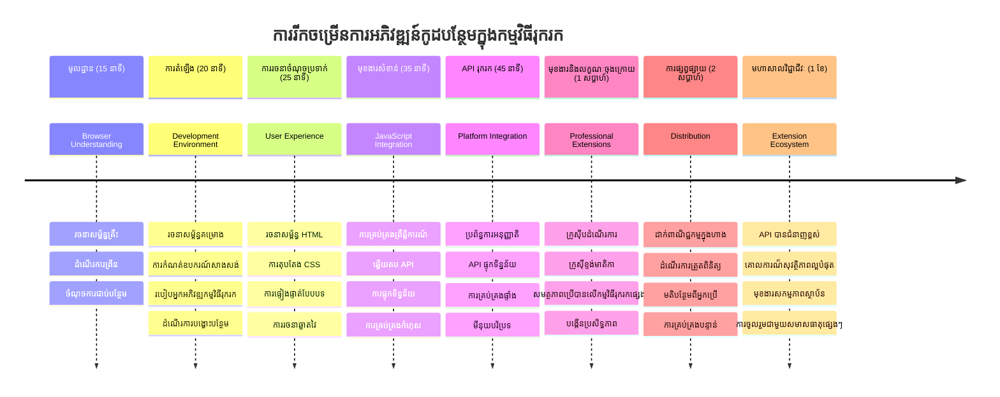
### 🛠️ សង្ខេបឧបករណ៍អភិវឌ្ឍផ្នែកបន្ថែមរបស់អ្នក  

ក្រោយបញ្ចប់មេរៀននេះ អ្នកមាន៖  
- **ចំណេះដឹងស្ថាបត្យកម្មកម្មវិធីរុករក**៖ ការយល់ពីម៉ាស៊ីនបំលែងកូដ, គំរកសុវត្ថិភាព, និងការតភ្ជាប់ផ្នែកបន្ថែម  
- **បរិបទអភិវឌ្ឍ**៖ ឧបករណ៍ទំនើប Webpack, NPM និងជំនួយពិនិត្យកំហុស  
- **គ្រឹះ UI/UX**៖ រចនាសម្ព័ន្ធ HTML មានសេន្មាន្ទិក និងមូលដ្ឋានលក្ខណៈបង្ហាញមិនរាកចេញ  
- **ការយល់ដឹងសុវត្ថិភាព**៖ បទពិសោធន៍អំពីការអនុញ្ញាតកម្មវិធីរុករក និងវិធីសាស្រ្តអភិវឌ្ឍដែលមានសុវត្ថិភាព  
- **គំនិតជារួមឆ្លងរាជកម្មវិធីរុករក**៖ ចំណេះដឹងអំពីការតភ្ជាប់ និងការសាកល្បង  
- **ការរួមបញ្ចូល API**៖ មូលដ្ឋានសម្រាប់បើកដំណើរការជាមួយប្រភពទិន្នន័យខាងក្រៅ  
- **ដំណើរការអាជីព**៖ វិធីសាស្រ្តអភិវឌ្ឍ និងសាកល្បងស្តង់ដារឧស្សាហកម្ម  

**ការអនុវត្តក្នុងពិភពពិត**៖ ជំនាញទាំងនេះអាចប្រើប្រាស់ដោយផ្ទាល់ទៅលើ៖  
- **ការអភិវឌ្ឍវែបសាយ**៖ កម្មវិធីផ្ទាំងតែមួយ និងកម្មវិធីវែបជាកម្រិតលៃតម្រូវ  
- **កម្មវិធីកុំព្យូទ័រប្រភេទ Desktop**៖ Electron និងកម្មវិធីដែលមានមូលដ្ឋានវែបក្នុងកុំព្យូទ័រ  
- **ការអភិវឌ្ឍលើទូរស័ព្ទ**៖ កម្មវិធីថ្មើរជើងនិងកម្មវិធីវែបលើទូរស័ព្ទ  
- **ឧបករណ៍សហគ្រាស**៖ កម្មវិធីផលិតភាពផ្ទៃក្នុង និងស្វ័យប្រវត្តិកម្ម  
- **ប្រភពបើក**៖ ចូលរួមគម្រោងផ្នែកបន្ថែមនៃកម្មវិធីរុករកនិងវិមាត្រវែប  

**កម្រិតបន្ទាប់**៖ អ្នករួចរាល់ក្នុងការបន្ថែមមុខងារអន្តរកម្ម, ប្រើ API រុករក, និងបង្កើតផ្នែកបន្ថែមដោះស្រាយបញ្ហាអ្នកប្រើពិតប្រាកដ!  

## កិច្ចការណ៍  

[Restyle your extension](assignment.md)

---

<!-- CO-OP TRANSLATOR DISCLAIMER START -->
**ការបដិសេធ**៖  
ឯកសារនេះត្រូវបានបកប្រែដោយប្រើសេវាបកប្រែ AI [Co-op Translator](https://github.com/Azure/co-op-translator)។ ខណៈពេលដែលយើងខិតខំប្រឹងប្រែងសំរាប់ភាពត្រឹមត្រូវ សូមយល់ដឹងថាការបកប្រែដោយស្វ័យប្រវត្តិអាចមានកំហុស ឬភាពមិនត្រឹមត្រូវ។ ឯកសារដើមក្នុងភាសាមូលដ្ឋានគួរត្រូវបានគោរពជាផ្នែកដែលមានអំណាច។ សម្រាប់ព័ត៌មានសំខាន់ៗ សូមណែនាំឱ្យប្រើប្រាស់ការបកប្រែដោយមនុស្សដែលមានជំនាញ។ យើងមិនទទួលខុសត្រូវចំពោះការយល់ខុស ឬការបកស្រាយខុសណាមួយដែលកើតមានពីការប្រើប្រាស់ការបកប្រែនេះទេ។
<!-- CO-OP TRANSLATOR DISCLAIMER END -->