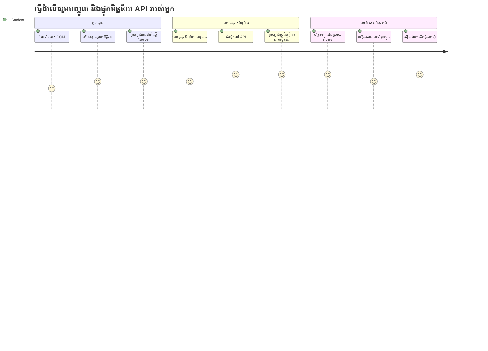
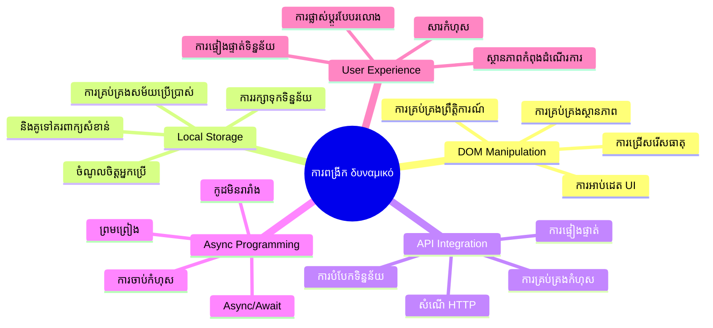
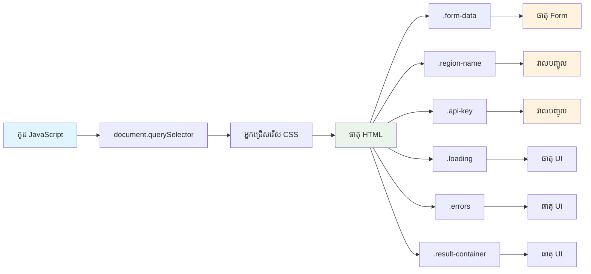
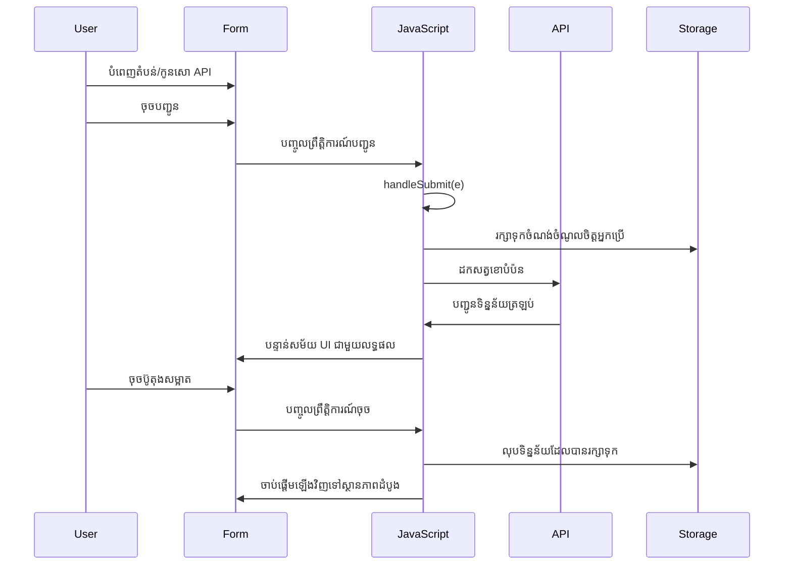
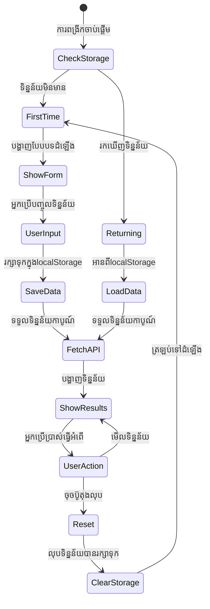
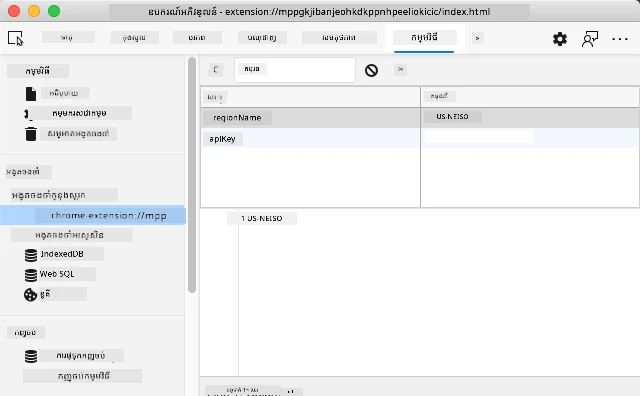
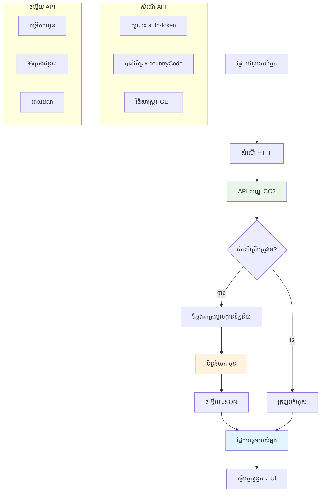
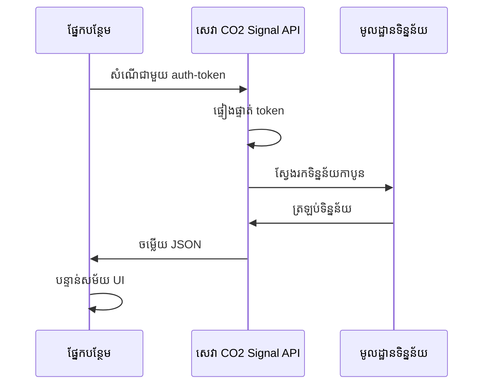
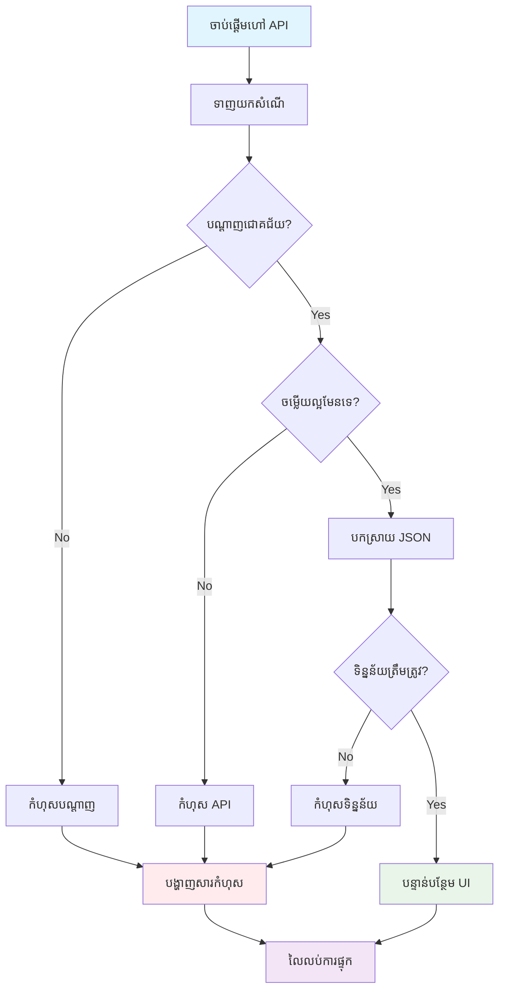
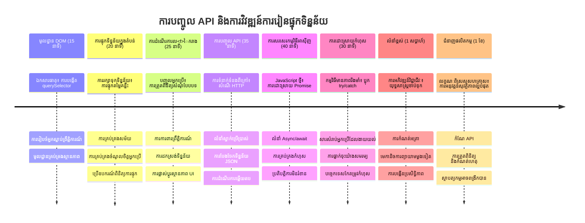

# គម្រោងផ្នែកបន្ថែមស្វែងរកកម្មវិធីកម្មវិធីអ្នកលេង Browser ផ្នែក 2: ហៅ API អ្នកប្រើប្រាស់ស្ទុកក្នុងតំបន់


## វិក្កយបត្រ មុនការប្រកាស

[វិក្កយបត្រមុនការប្រកាស](https://ff-quizzes.netlify.app/web/quiz/25)

## ការណែនាំ

ចាំថាការបន្ថែមកម្មវិធីនៅលើ browser ដែលអ្នកបានចាប់ផ្តើមសំរាប់សាងសង់? ពេលនេះអ្នកមានសំណុំបែបបទដែលមើលទៅស្អាតមួយ ប៉ុន្តែវាពិតប្រាកដហើយថាជា static។ ថ្ងៃនេះយើងនឹងធ្វើឲ្យវាមានជីវិតដោយភ្ជាប់វាទៅនឹងទិន្នន័យពិតប្រាកដ និងផ្តល់ជាការចងចាំ។

គិតអំពីកុំព្យូទ័រគ្រប់គ្រងបេសកកម្ម Apollo - ពួកវាមិនត្រឹមតែបង្ហាញព័ត៌មានថេរទេ។ ពួកវាធ្វើការទំនាក់ទំនងជាបន្តជាមួយយានអាកាស ធ្វើបច្ចុប្បន្នភាពទិន្នន័យ telemetry និងចងចាំប៉ារ៉ាម៉ែត្របេសកកម្មសំខាន់ៗ។ នេះជាប្រភេទអាកប្បកិរិយាសកម្មដែលយើងកំពុងបង្កើតនៅថ្ងៃនេះ។ ការបន្ថែមរបស់អ្នកនឹងចូលទៅរកអ៊ីនធឺណិត យកទិន្នន័យបរិស្ថានពិតប្រាកដ និងចងចាំការកំណត់របស់អ្នកសម្រាប់ពេលក្រោយ។

ការរួមបញ្ចូល API ប្រហែលជាស្វែងយល់ពិបាក ប៉ុន្តែវាលែងត្រឹមជាបង្រៀនកូដរបស់អ្នកធ្វើការទំនាក់ទំនងជាមួយសេវាកម្មផ្សេងទៀត។ មិនថាអ្នកកំពុងយកទិន្នន័យអាកាសធាតុ ផ្ដល់ញាតិ បណ្ដុំនិយមសង្គម ឬព័ត៌មានប្រតិកម្មកាបូនដូចដែលយើងនឹងធ្វើក្នុងថ្ងៃនេះ វាអំពីការបង្កើតការតភ្ជាប់ឌីជីថលទាំងនេះ។ យើងនឹងស្វែងយល់ពីរបៀបដែល browser អាចរក្សាទុកព័ត៌មានផងដែរ - ដូចជាមធ្យមសាស្រ្តដែលបណ្ណាល័យបានប្រើកាតកាតាលក់ដើម្បីចងចាំទីតាំងសៀវភៅ។

នៅចុងបញ្ចប់មេរៀននេះ អ្នកនឹងមានការបន្ថែម browser វេចខ្ចប់ដែលយកទិន្នន័យពិតប្រាកដ រក្សាទុកចំណង់ចំណូលចិត្តអ្នកប្រើ និងផ្តល់បទពិសោធន៍ល្អឥតខ្ចោះ។ តោះចាប់ផ្តើម!


✅ ធ្វើតាមផ្នែកមានលេខនៅក្នុងឯកសារដែលត្រូវ ដើម្បីដឹងកន្លែងដាក់កូដរបស់អ្នក

## កំណត់ធាតុដែលត្រូវបញ្ជាពីការបន្ថែម

មុនពេល JavaScript របស់អ្នកអាចធ្វើបច្ចុប្បន្នភាពម៉ឺនុយប្រើប្រាស់ វាត្រូវការយោងទៅធាតុ HTML ជាក់លាក់។ គិតឲ្យដូចជាដំណាប់ទូរទស្សន៍ត្រូវបញ្ចេញភ្នែកទៅផ្កាយជាក់លាក់មួយ - មុនពេល Galileo អាចសិក្សាភពចន្ទនៃ Jupiter បាន គាត់ត្រូវរកនិងផ្ដោតទៅលើ Jupiter ដំបូង។

នៅក្នុងឯកសារ `index.js` របស់អ្នក យើងនឹងបង្កើតអថេរ `const` ដែលចាប់យោងទៅធាតុំ្នែខ្សែសំខាន់ៗនៃសំណុំបែបបទ។ វាគឺដូចជារបៀបដែលវិទូសាស្ត្របានស្លាកឧបករណ៍របស់ពួកគេ - មិនត្រូវស្វែងរកលើមន្ទីរពិសោធន៍ទាំងមូល រៀងរាល់ពេលទេ ពួកគេច្បាស់តែអាចចូលដំណើរការយ៉ាងផ្ទាល់។


```javascript
// ពត៌មានទម្រង់
const form = document.querySelector('.form-data');
const region = document.querySelector('.region-name');
const apiKey = document.querySelector('.api-key');

// លទ្ធផល
const errors = document.querySelector('.errors');
const loading = document.querySelector('.loading');
const results = document.querySelector('.result-container');
const usage = document.querySelector('.carbon-usage');
const fossilfuel = document.querySelector('.fossil-fuel');
const myregion = document.querySelector('.my-region');
const clearBtn = document.querySelector('.clear-btn');
```

**នេះជារឿងដែលកូដនេះធ្វើ៖**
- **ចាប់យក** ធាតុសំណុំបែបបទដោយប្រើ `document.querySelector()` ជាមួយជម្រើស CSS class
- **បង្កើត** យោងទៅអង្គចូលសម្រាប់ឈ្មោះតំបន់ និង API key
- **បង្កើត** ទំនាក់ទំនងជាមួយធាតុបង្ហាញលទ្ធផលទិន្នន័យប្រើប្រាស់កាបូន
- **កំណត់** ដំណើរការទៅធាតុ UI ដូចជាការបង្ហាញកំពុងផ្ទុក និងសារកំហុស
- **រក្សាទុក** អ្នកយោងនិមួយៗនៅក្នុងអថេរ `const` ដើម្បីប្រើប្រាស់ងាយស្រួលទាំងអស់កូដ

## បន្ថែមអ្នកស្ដាប់ព្រឹត្តិការណ៍

ឥឡូវនេះយើងនឹងធ្វើឲ្យការបន្ថែមរបស់អ្នកឆ្លើយតបទៅនឹងសកម្មភាពអ្នកប្រើប្រាស់។ អ្នកស្ដាប់ព្រឹត្តិការណ៍គឺជារបៀបដែលកូដរបស់អ្នកតាមដានអន្តរកម្មរបស់អ្នកប្រើ។ គិតថាវាដូចជាអ្នកប្រើប្រាស់ទូរស័ព្ទកាលពីដើម - ពួកគេស្តាប់ការហៅចូល និងភ្ជាប់ស៊ីគឺត់ត្រូវតាមពេលដែលមានអ្នកចង់ធ្វើការតភ្ជាប់។


```javascript
form.addEventListener('submit', (e) => handleSubmit(e));
clearBtn.addEventListener('click', (e) => reset(e));
init();
```

**យល់ដឹងអំពីគំនិតទាំងនេះ៖**
- **ភ្ជាប់** អ្នកស្ដាប់ការបញ្ជូនទៅសំណុំបែបបទ ដែលដំណើរការពេលអ្នកប្រើចុច Enter ឬចុចបញ្ជូន
- **ភ្ជាប់** អ្នកស្ដាប់ការចុចទៅប៊ូតុងបញ្ចេញសម្រាប់កំណត់ឡើងសំណុំបែបបទម្ដងទៀត
- **ផ្ញើ** វត្ថុព្រឹត្តិការណ៍ `(e)` ទៅមុខងារគ្រប់គ្រងសម្រាប់ការគ្រប់គ្រងបន្ថែម
- **ហៅ** មុខងារ `init()` ដោយភ្លាមភ្លោះដើម្បីកំណត់ស្ថានភាពពីដើមនៃការបន្ថែមរបស់អ្នក

✅ ចាំបាច់ចំណាំថា រចនាសម្ព័ន្ធមុខងារ arrow syntax ដែលប្រើនៅទីនេះ ជារបៀប JavaScript នៅសម័យថ្មី ដែលបានស្អាតជាងការប្រើ function ដั้งចាស់ ប៉ុន្តែទាំងពីរនេះដំណើរការល្អដូចគ្នា!

### 🔄 **ការត្រួតពិនិត្យផ្នែកផ្ទៀងផ្ទាត់**
**ការយល់ដឹងអំពីការគ្រប់គ្រងព្រឹត្តិការណ៍**៖ មុនការបន្តទៅការចាប់ផ្តើម សូមប្រាកដថាអ្នកអាច៖
- ✅ ពន្យល់ពីរបៀបដែល `addEventListener` ភ្ជាប់សកម្មភាពអ្នកប្រើទៅមុខងារ JavaScript
- ✅ យល់ទៅហេតុផលដែលយើងផ្ញើវិធានការព្រឹត្តិការណ៍ `(e)` ទៅមុខងារគ្រប់គ្រង
- ✅ កំណត់ភាពខុសគ្នារវាង ព្រឹត្តិការណ៍ `submit` និង `click`
- ✅ ពិពណ៌នាពេលដែលមុខងារ `init()` ដំណើរការ និងហេតុផល

**សាកល្បងយ៉ាងរហ័ស**: តើមានអ្វីកើតឡើង ប្រសិនបើអ្នកភ្លេច `e.preventDefault()` នៅពេលបញ្ជូនសំណុំបែបបទ?
*ចម្លើយ៖ ទំព័រនឹងបញ្ចូលឡើងវិញ បាត់បង់ស្ថានភាព JavaScript ទាំងអស់ និងរំខានបទពិសោធន៍អ្នកប្រើ*

## បង្កើតមុខងារចាប់ផ្តើម និងកំណត់ឡើងវិញ

យើងចាប់ផ្តើមធ្វើសកម្មភាពចាប់ផ្តើមសម្រាប់ការបន្ថែមរបស់អ្នក។ មុខងារ `init()` គឺដូចជារបៀបរៀបចំគ្រឿងចំហៀងនាវាចរណ៍ - វាសម្រេចអំពីស្ថានភាពបច្ចុប្បន្ន ហើយកែសម្រួល UI តាមស្ថានភាពនោះ។ វាវាយតម្លៃថា តើមានអ្នកប្រើដែលបានប្រើការបន្ថែមរបស់អ្នកមុននេះ ហើយទាញយកការកំណត់របស់ពួកគេសម្រាប់ពេលក្រោយ។

មុខងារ `reset()` ផ្តល់ជូនអ្នកប្រើនូវការចាប់ផ្តើមថ្មី - ដូចជាអ្នកសាស្រ្តកំណត់ឡើងវិញឧបករណ៍របស់ពួកគេនៅចន្លោះការសាកល្បង ដើម្បីធានាថាទិន្នន័យស្អាត។

```javascript
function init() {
	// ពិនិត្យមើលថាតើអ្នកប្រើបានផ្ទុកព័ត៌មាន API ទុកពីមុនជាមុនទេ
	const storedApiKey = localStorage.getItem('apiKey');
	const storedRegion = localStorage.getItem('regionName');

	// កំណត់រូបតំណាងបន្ថែមទៅពណ៌បៃតងទូទៅ (ជាជំនួសសម្រាប់មេរៀនកំពុងអនាគត)
	// TODO: អនុវត្តការអាប់ដេតរូបតំណាងនៅមេរៀនក្រោយ

	if (storedApiKey === null || storedRegion === null) {
		// អ្នកប្រើប្រាស់ដំបូង: បង្ហាញទម្រង់តំឡើង
		form.style.display = 'block';
		results.style.display = 'none';
		loading.style.display = 'none';
		clearBtn.style.display = 'none';
		errors.textContent = '';
	} else {
		// អ្នកប្រើប្រាស់មកវិញ: រៀបចំទិន្នន័យដែលបានរក្សាទុកដោយស្វ័យប្រវត្តិ
		displayCarbonUsage(storedApiKey, storedRegion);
		results.style.display = 'none';
		form.style.display = 'none';
		clearBtn.style.display = 'block';
	}
}

function reset(e) {
	e.preventDefault();
	// លាងចេញតំបន់ដាក់រក្សាទុកដើម្បីអោយអ្នកប្រើជ្រើសទីតាំងថ្មី
	localStorage.removeItem('regionName');
	// ផ្តើមឡើងវិញដំណើរការបង្កើតឡើងវិញ
	init();
}
```

**បំបែកអ្វីកើតឡើងនៅទីនេះ៖**
- **យក** API key និងតំបន់ដែលបានរក្សាទុកពី local storage របស់ browser
- **ពិនិត្យ** ថាតើគឺជាអ្នកប្រើប្រាស់លើកដំបូង (មិនមានគណនេយ្យរក្សាទុកទេ) ឬអ្នកប្រើដែលមានវិលត្រឡប់មកហើយ
- **បង្ហាញ** សំណុំបែបបទរៀបចំសម្រាប់អ្នកប្រើថ្មី និងលាក់ UI ផ្សេងៗ
- **ទាញយក** ទិន្នន័យដែលបានរក្សាទុកស្វ័យប្រវត្តិសម្រាប់អ្នកប្រើវិលត្រឡប់ ហើយបង្ហាញជម្រើសកំណត់ឡើងវិញ
- **គ្រប់គ្រង** ស្ថានភាព UI យោងទៅលើទិន្នន័យដែលមាន

**គំនិតសំខាន់អំពី Local Storage:**
- **រក្សាទុក** ទិន្នន័យរវាងសម័យ browser (ផ្សេងពី session storage)
- **រក្សាទុក** ទិន្នន័យជាគូសោ និងតម្លៃដោយប្រើ `getItem()` និង `setItem()`
- **ត្រឡប់** មក `null` ប្រសិនបើមិនមានទិន្នន័យសម្រាប់សោចំណំទេ
- **ផ្តល់** វិធីស្រាលសម្រាប់ចងចាំចំណង់ចំណូលចិត្ត និងការកំណត់របស់អ្នកប្រើ

> 💡 **យល់ដឹងអំពីឡូខ្យុរីកម្ម Browser**: [LocalStorage](https://developer.mozilla.org/docs/Web/API/Window/localStorage) គឺដូចជាការផ្តល់ចងចាំតាំងសម្រាប់ការបន្ថែមរបស់អ្នក។ សូមគិតពីរបៀបដែលបណ្ណាល័យអាឡិចសង់ដ្រិយ៉ា​ចាស់រក្សាទុកសន្លឹក - ព័ត៌មាននៅតែអាចរកបាន ទោះបីអ្នកសិក្សាចាកចេញហើយត្រឡប់មកវិញក៏ដោយ។
>
> **លក្ខណៈសំខាន់ៗ:**
> - **រក្សាទុក** ទិន្នន័យទោះបូចប់ browser ទៅហើយ
> - **រស់រានមានផាសុខភាព** ក្រោយពី restart កុំព្យូទ័រ និង browser បិទ
> - **ផ្តល់** ទំហំផ្ទុកធំសម្រាប់ចំណង់ចំណូលចិត្តអ្នកប្រើ
> - **ផ្តល់** ការចូលដំណើរការយ៉ាងរហ័ស ដោយគ្មានភាពយឺតជាច្រើន

> **សំគាល់សំខាន់**: ការបន្ថែមរបស់អ្នកនៅលើ browser មានផ្ទាំងផ្ទុកក្នុងតំបន់ផ្ទាល់ការផ្តាច់ ខុសពីគេហទំព័រធម្មតា។ វាបង្កើតសុវត្ថិភាព និងចៀសវាងការប្រឆាំងជាមួយគេហទំព័រផ្សេងៗ។

អ្នកអាចមើលទិន្នន័យដែលបានរក្សាទុក ដោយបើក​អ្នកអភិវឌ្ឍន៍Browser Tools (F12) និងបើកថ្នាក់ **Application** ហើយបញ្ជីចុះក្នុងផ្នែក **Local Storage**។




> ⚠️ **ការពិចារណាសុវត្ថិភាព**: ក្នុងកម្មវិធីផលិតផល ការរក្សាទុក API key នៅក្នុង LocalStorage អាចបង្កការគ្រោះថ្នាក់សុវត្ថិភាព ព្រោះ JavaScript អាចចូលដំណើរការទិន្នន័យនេះ។ សម្រាប់បំណងរៀន វិធីនេះអាចសមរម្យ ប៉ុន្តែកម្មវិធីពិតប្រាកដគួរប្រើប្រាស់ផ្ទាំងផ្ទុកអាគុយ ~ច​ច~ រ៉ុស្កររបស់ម៉ាស៊ីនបម្រើកាន់តែសុវត្ថិភាពសម្រាប់គណនេយ្យសំខាន់។

## គ្រប់គ្រងការបញ្ជូនសំណុំបែបបទ

ឥឡូវនេះយើងនឹងគ្រប់គ្រងអ្វីកើតឡើងពេលមាននរណាម្នាក់បញ្ជូនសំណុំបែបបទរបស់អ្នក។ ដោយលំនាំ browser នឹងបំពេញទំព័រឡើងវិញ ពេលសំណុំបែបបទត្រូវ ប៉ុន្តែយើងនឹងចាប់សកម្មភាពនេះដើម្បីបង្កើតបទពិសោធន្តិសុទ្ធល្អឥតខ្ចោះ។

របៀបនេះស្រដៀងនឹងការគ្រប់គ្រងបេសកកម្មដែលធ្វើការទំនាក់ទំនងជាមួយយានអាកាស - មិនត្រូវកំណត់ឡើងវិញប្រព័ន្ធទាំងមូលសម្រាប់ការផ្ទេរព័ត៌មានមួយៗទេ ពួកគេចាំបាច់រក្សាការបន្តប្រតិបត្តិការបន្តខណៈពេលបញ្ចូលព័ត៌មានថ្មី។

បង្កើតមុខងារដែលចាប់យកព្រឹត្តិការណ៍បញ្ជូនសំណុំបែបបទ និងយកទិន្នន័យអ្នកប្រើ:

```javascript
function handleSubmit(e) {
	e.preventDefault();
	setUpUser(apiKey.value, region.value);
}
```

**នៅលើនេះ អ្នកបាន៖**
- **ទប់ស្កាត់** លំនាំបញ្ជូនសំណុំបែបបទដែលនឹងបញ្ចូលទំព័រឡើងវិញ
- **យក** តម្លៃសម្រាប់ចូលពី API key និងតំបន់
- **ផ្ញើ** ទិន្នន័យសំណុំបែបបទទៅមុខងារ `setUpUser()` សម្រាប់ដំណើរការ
- **រក្សា** អាកប្បកិរិយា single-page application ដើម្បីជៀសវាងពិបាកទំព័រឡើងវិញ

✅ ចាំបាច់ចំណាំថា បរិស្ថានសំណុំបែបបទ HTML របស់អ្នកមាន attribute `required` ដូច្នេះ browser បញ្ជាក់ស្វ័យប្រវត្តិថា អ្នកប្រើត្រូវបញ្ចូលទាំង API key និងតំបន់ មុនមុខងារនេះដំណើរការ។

## កំណត់ចំណង់ចំណូលចិត្តអ្នកប្រើ

មុខងារ `setUpUser` មានភារកិច្ចរក្សាទុកគណនេយ្យអ្នកប្រើ និងបើកការហៅ API ដំបូង។ វាបង្កើតបទពិសោធន៍ផ្លាស់ប្តូរមួយពីការរៀបចំទៅការបង្ហាញលទ្ធផល។

```javascript
function setUpUser(apiKey, regionName) {
	// រក្សាទុកព័ត៌មានសម្គាល់អ្នកប្រើសម្រាប់ពេលខាងមុខ
	localStorage.setItem('apiKey', apiKey);
	localStorage.setItem('regionName', regionName);
	
	// បន្ទាន់សម័យ UI ដើម្បីបង្ហាញស្ថានភាពកំពុងផ្ទុក
	loading.style.display = 'block';
	errors.textContent = '';
	clearBtn.style.display = 'block';
	
	// ទាញយកទិន្នន័យការប្រើប្រាស់កាបូនជាមួយព័ត៌មានសម្គាល់អ្នកប្រើ
	displayCarbonUsage(apiKey, regionName);
}
```

**ជំហានមួយៗ ដែលកើតឡើងមាន៖**
- **រក្សា** API key និងឈ្មោះតំបន់ទៅ local storage សម្រាប់ការប្រើប្រាស់ពេលក្រោយ
- **បង្ហាញ** អិណ្ឌីកាតរអំពីការផ្ទុក ទាក់ទងឲ្យអ្នកប្រើដឹងថាកំពុងយកទិន្នន័យ
- **សម្អាត** សារខុសឆ្គងកាលពីមុនចេញពីការបង្ហាញ
- **បង្ហាញ** ប៊ូតុងបញ្ចេញ ដល់អ្នកប្រើសម្រាប់កំណត់ឡើងវិញ
- **ចាប់ផ្តើម** ហៅ API ដើម្បីយកទិន្នន័យប្រើប្រាស់កាបូនពិតប្រាកដ

មុខងារនេះបង្កើតបទពិសោធជាមួយអ្នកប្រើយ៉ាងរលូន ដោយគ្រប់គ្រងការរក្សាទុកទិន្នន័យ និងកែប្រែ UI ក្នុងសកម្មភាពតែមួយ។

## បង្ហាញទិន្នន័យប្រើប្រាស់កាបូន

ឥឡូវនេះយើងនឹងភ្ជាប់ការបន្ថែមរបស់អ្នកទៅទិន្នន័យខាងក្រៅតាមរយៈ API។ នេះបម្លែងការបន្ថែមរបស់អ្នកពីឧបករណ៍ឯកកុំព្យូទ័រតែមួយទៅទៅឲ្យអាចចូលដំណើរការព័ត៌មានពេលវេលាពិតប្រាកដពីអ៊ីនធឺណិតទូទាំងពិភពលោក។

**យល់ដឹងអំពី API**

[API](https://www.webopedia.com/TERM/A/API.html) គឺជារបៀបដែលកម្មវិធីផ្សេងៗទំាងឡាយទំនាក់ទំនងគ្នា។ គិតឲ្យដូចជា ប្រព័ន្ធទូរសារដែកដែលភ្ជាប់ទីក្រុងឆ្ងាយក្នុងសតវត្សរ៍ទី 19 - អ្នកប្រើប្រាស់នឹងផ្ញើសំណើទៅស្ថានីយ៏ឆ្ងាយ ហើយទទួលបានចម្លើយជាមួយព័ត៌មានដែលបានស្នើ។ រៀងរាល់ពេលអ្នកពិនិត្យបណ្ដាញសង្គម សុំជំនួយក៏ហៅអ្នកជំនួយសំលេង ឬប្រើកម្មវិធីដឹកជញ្ជូន API គឺជារឿងជួយបំពេញការផ្លាស់ប្តូរទិន្នន័យទាំងនេះ។


**គន្លឹះសំខាន់អំពី REST API:**
- **REST** មានន័យថា 'Representational State Transfer'
- **ប្រើ** វិធី HTTP ផ្លូវការដូចជា GET, POST, PUT, DELETE សម្រាប់ទំនាក់ទំនងទិន្នន័យ
- **ត្រឡប់** ទិន្នន័យក្នុងបែបបទទាន់សម័យ ធម្មតាជា JSON
- **ផ្តល់** ចំណុចចូលប្រព័ន្ធ URL យោងទៅតាមប្រភេទនៃសំណើ

✅ [CO2 Signal API](https://www.co2signal.com/) ដែលយើងប្រើផ្ដល់ទិន្នន័យកម្រិតកាបូនពេលវេលាពិតពីបណ្ដាញអគ្គីសនីជុំវិញពិភពលោក។ វាជួយឲ្យអ្នកប្រើយល់ពីឥទ្ធិពលបរិស្ថាននៃការប្រើប្រាស់អគ្គិសនីរបស់ពួកគេ!

> 💡 **យល់ដឹងអំពី JavaScript អស៊ីនខ្រោង**: ពាក្យគន្លឹះ [`async`](https://developer.mozilla.org/docs/Web/JavaScript/Reference/Statements/async_function) អនុញ្ញាតិឲ្យកូដរបស់អ្នករៀបចំមុខងារច្រើនក្នុងពេលតែមួយ។ ពេលអ្នកស្នើសុំទិន្នន័យពីម៉ាស៊ីនបម្រើ អ្នកមិនចង់ឲ្យការបន្ថែមឈប់ស្ទាត់ទេ - វាត្រូវដូចប្រតិបត្តិការត្រួតព្រួតការព្រួលដំណើរការផ្លូវអាកាស ទាំងអស់ត្រូវបន្ត ដដែលនៅពេលរង់ចាំយន្តហោះមួយឆ្លើយតប។
>
> **អត្ថប្រយោជន៍សំខាន់ៗ៖**
> - **រក្សា** ប្រតិបត្តិការបន្ថែមដោយមិនឲ្យកើតការលម្រាមពេលទិន្នន័យកំពុងផ្ទុក
> - **អនុញ្ញាត** កូដផ្សេងៗបន្តធ្វើការប្រតិបត្តិការ ខណៈពេលស្នើសុំបណ្តាញ
> - **ធ្វើឲ្យ** កូដអានងាយជាងការប្រើប៉ាគ​ខាល់បែបចាស់ៗ
> - **អនុញ្ញាត** ការគ្រប់គ្រងកំហុសដោយប្រកបដោយភាពទាន់សម័យសម្រាប់បញ្ហាបណ្តាញ

នេះជាវីដេអូខ្លីអំពី `async`៖

[](https://youtube.com/watch?v=YwmlRkrxvkk "Async and Await for managing promises")

> 🎥 ចុចរូបភាពខាងលើសម្រាប់មើលវីដេអូមួយអំពី async/await។

### 🔄 **ការត្រួតពិនិត្យផ្នែកផ្ទៀងផ្ទាត់**
**យល់ដឹងការសរសេរโปรแกรม async**: មុនវាយចូលមុខងារ API, សូមពិនិត្យថាអ្នកយល់ពី៖
- ✅ ហេតុអ្វីយើងប្រើ `async/await` ជំនួសមិនឲ្យបន្ទុកស្ទាត់ពេញលេញនៃការបន្ថែម
- ✅ របៀបដែល `try/catch` គ្រប់គ្រងកំហុសបណ្តាញយ៉ាងទូលំទូលាយ
- ✅ ភាពខុសគ្នារវាងប្រតិបត្តិការសនិទ្ធ និងអស៊ីនខ្រោង
- ✅ ហេតុអ្វីហៅ API អាចខូចខាត និងរបៀបដោះស្រាយបញ្ហានោះ

**ភ្ជាប់ជាមួយពិភពពិត**: ពិចារណាឧទាហរណ៍ async មួយចំនួនថ្ងៃប្រចាំ
- **បញ្ជាទិញម្ហូប**: អ្នកមិនរង់ចាំនៅម៉ាស៊ីនផ្ទះបាយទេ - អ្នកទទួលបានបង្កាន់ដៃ និងបន្តសកម្មភាពផ្សេងៗ
- **ផ្ញើអ៊ីមែល**: អនុប្រមាញ់អ៊ីមែលមិនទទួលបន្ទុកពេលផ្ញើ - អ្នកអាចបង្កើតអ៊ីមែលថ្មី
- **ផ្ទុកគេហទំព័រ**: រូបភាពផ្ទុកមួយៗក្នុងពេលដែលអតិថិជនអាចអានអត្ថបទបានជាមុន

**ដំណើរការផ្ទៀងផ្ទាត់ API**:

បង្កើតមុខងារដើម្បីយកនិងបង្ហាញទិន្នន័យប្រើប្រាស់កាបូន:

```javascript
// វិធីថ្មីសម្រាប់ការទាញយក API (មិនចាំបាច់មានការពឹងផ្អែកខាងក្រៅ)
async function displayCarbonUsage(apiKey, region) {
	try {
		// ទាញយកទិន្នន័យកម្រិតកាបូនពី CO2 Signal API
		const response = await fetch('https://api.co2signal.com/v1/latest', {
			method: 'GET',
			headers: {
				'auth-token': apiKey,
				'Content-Type': 'application/json'
			},
			// បូកបញ្ចូលប៉ារាម៉ែត្រសម្រាប់តំបន់ជាក់លាក់
			...new URLSearchParams({ countryCode: region }) && {
				url: `https://api.co2signal.com/v1/latest?countryCode=${region}`
			}
		});

		// ពិនិត្យមើលថាការស្នើសុំ API បានជោគជ័យឬទេ
		if (!response.ok) {
			throw new Error(`API request failed: ${response.status}`);
		}

		const data = await response.json();
		const carbonData = data.data;

		// គណនាតម្លៃកម្រិតកាបូនដែលបានធ្វើមូលដ្ឋាន
		const carbonIntensity = Math.round(carbonData.carbonIntensity);

		// អាប់ដេតចំណុចប្រទាក់អ្នកប្រើជាមួយទិន្នន័យដែលបានទាញយក
		loading.style.display = 'none';
		form.style.display = 'none';
		myregion.textContent = region.toUpperCase();
		usage.textContent = `${carbonIntensity} grams (grams CO₂ emitted per kilowatt hour)`;
		fossilfuel.textContent = `${carbonData.fossilFuelPercentage.toFixed(2)}% (percentage of fossil fuels used to generate electricity)`;
		results.style.display = 'block';

		// TODO: calculateColor(carbonIntensity) - អនុវត្តនៅមេរៀនបន្ទាប់

	} catch (error) {
		console.error('Error fetching carbon data:', error);
		
		// បង្ហាញសារត្រូវការជួយជ្រាបផ្សេងៗសម្រាប់អ្នកប្រើ
		loading.style.display = 'none';
		results.style.display = 'none';
		errors.textContent = 'Sorry, we couldn\'t fetch data for that region. Please check your API key and region code.';
	}
}
```

**បំបែកអ្វីកើតឡើងនៅទីនេះ៖**
- **ប្រើ** API `fetch()` សម័យថ្មី ជំនួសបណ្ណាល័យខាងក្រៅដូចជា Axios សម្រាប់កូដស្អាត មិនពឹងផ្អែកខ្លាំង
- **អនុវត្ត** ការត្រួតពិនិត្យកំហុសត្រឹមត្រូវ ជាមួយ `response.ok` ដើម្បីចាប់កំហុស API ជាមុន
- **គ្រប់គ្រង** ប្រតិបត្តិការ async ជាមួយ `async/await` ឲ្យមានលំហូរស្រាលអានបាន
- **ផ្ទៀងផ្ទាត់** ជាមួយ CO2 Signal API ដោយប្រើក្បាច់ `auth-token` ក្នុង header
- **បកស្រាយ** ទិន្នន័យ JSON និងយកព័ត៌មានកម្រិតកាបូន
- **ធ្វើបច្ចុប្បន្នភាព** ធាតុ UI ជាច្រើន ដោយទិន្នន័យបរិស្ថានជាក់លាក់
- **ផ្តល់** សារកំហុសមិត្តភាពពេល API មានបញ្ហា

**គំនិត JavaScript សម័យថ្មីដែលបង្ហាញនៅទីនេះ៖**
- **តួអក្សរទម្រង់គំរូ (template literals)** ជាមួយ `${}` សម្រាប់បង្កើតខ្សែអត្ថបទបានសំលាប់
- **គ្រប់គ្រងកំហុស** ជាមួយ try/catch សម្រាប់កម្មវិធីមានភាពប្រសើរ
- **រចនាបថ async/await** ដើម្បីគ្រប់គ្រងសំណើបណ្តាញយ៉ាងល្អ
- **លាក់ទិន្នន័យ (Object destructuring)** ដើម្បីយកទិន្នន័យជាក់លាក់ពីចម្លើយ API
- **ចងខ្សែវិធីសាស្រ្ត (method chaining)** សម្រាប់ចាត់ការពហុ DOM ក្នុងបន្ទាត់តែមួយ

✅ មុខងារនេះបង្ហាញចំនួនមូលដ្ឋានអភិវឌ្ឍន៍បណ្តាញ - ទំនាក់ទំនងជាមួយម៉ាស៊ីនបម្រើ ខ្ទង់បញ្ចូល តម្លើង UI និងគ្រប់គ្រងកំហុស។ នេះគឺជាជំនាញមូលដ្ឋានដែលអ្នកអភិវឌ្ឍន៍វិជ្ជាជីវៈប្រើប្រាស់ជាប្រចាំ។


### 🔄 **ការត្រួតពិនិត្យផ្នែកផ្ទៀងផ្ទាត់**
**យល់ដឹងប្រព័ន្ធពេញលេញ**: សូមបញ្ជាក់ពីជំនាញរបស់អ្នកលើទិន្នន័យទាំងមូល:
- ✅ របៀបដែលយោង DOM អនុញ្ញាតឲ្យ JavaScript គ្រប់គ្រង UI
- ✅ ហេតុអ្វី local storage បង្កើតចងចាំចន្លោះសម័យ browser
- ✅ របៀប async/await ធ្វើឲ្យហៅ API ដោយមិនធ្វើឲ្យ extension ឈប់
- ✅ អ្វីកើតឡើងពេលហៅ API ខូច និងរបៀបគ្រប់គ្រងកំហុស
- ✅ ហេតុអ្វីបទពិសោធ៍អ្នកប្រើបង្កើតមានស្ថានភាពផ្ទុក និងសារកំហុស

🎉 **អ្វីដែលអ្នកបានសម្រេច**៖ អ្នកបានបង្កើត browser extension ដែល៖
- **ភ្ជាប់** ទៅអ៊ីនធឺណិត និងយកទិន្នន័យបរិស្ថានពេលវេលាចម្បង
- **រក្សា** ការកំណត់អ្នកប្រើរវាង session
- **គ្រប់គ្រង** កំហុសយ៉ាងទូលំទូលាយ ជៀសវាងការបង្ហោះកំហុស
- **ផ្តល់** បទពិសោធន៍ប្រើប្រាស់ល្អ និងមានប្រសិទ្ធភាពវិជ្ជាជីវៈ

សាកល្បងការងាររបស់អ្នកដោយរត់ `npm run build` ហើយធ្វើការបន្តនូវការបន្ថែមនៅក្នុង browser។ អ្នកបានមានកម្មវិធីតាមដានបម្រែបម្រួលបរិស្ថានកាបូនហើយ។ មេរៀនបន្ទាប់នឹងបន្ថែមមុខងាររូបតំណាងឌីណាមិចដើម្បីបញ្ចប់ការបន្ថែម។

---

## ចលនាជំនួញ GitHub Copilot 🚀

ប្រើម៉ូត Agent ដើម្បីបញ្ចប់បញ្ហាដូចខាងក្រោម៖

**ការពិពណ៍នា:** ពង្រឹងការបន្ថែម browser ដោយបន្ថែមការកែប្រែគ្រប់គ្រងកំហុស និងមុខងារបទពិសោធអ្នកប្រើ។ ការប្រកួតនេះនឹងជួយអ្នកហ្វឹកហាត់ការប្រើ API, local storage និងការគ្រប់គ្រង DOM ដោយប្រើរចនាបថ JavaScript សម័យថ្មី។
**Prompt:** បង្កើតកំណែដោយការកែលម្អមុខងារ displayCarbonUsage ដែលរួមមាន៖ 1) មេកានីស្សមួយសម្រាប់ការបញ្ចាប់ម្តងទៀតនៃការហៅ API ដែលបរាជ័យជាមួយការបន្ថយតម្លៃផ្សេងៗជាបណ្ដោយ, 2) ការ_VALIDATE_INPUT សម្រាប់កូដតំបន់មុនពេលធ្វើការហៅ API, 3) អកម្មវិធីបង្ហាញកំពុងផ្ទុកជាមួយអ្នកបង្ហាញវឌ្ឍនភាព, 4) ការផ្ទុកផលប័ត្រមានរបស់ API ក្នុង localStorage ជាមួយរយៈពេលផុតកំណត់ (ផ្ទុកសម្រាប់ ៣០ នាទី), និង 5) មុខងារបង្ហាញទិន្នន័យបុរាណពីការហៅ API មុនៗ។ ក៏ដូចជាការបន្ថែមការអត្រាបញ្ចូល JSDoc ស្ទីល TypeScript សម្រាប់ឯកសារឧត្តមគុណនៃប៉ារ៉ាម៉ែត្រ និងប្រភេទត្រឡប់។

ស្វែងយល់បន្ថែមអំពី [agent mode](https://code.visualstudio.com/blogs/2025/02/24/introducing-copilot-agent-mode) នៅទីនេះ។

## 🚀 បញ្ហាប្រកួត

ពង្រីកការយល់ដឹងរបស់អ្នកអំពី API ដោយស្វែងរកអំពី API ជាច្រើននៅលើកម្មវិធីរុករកសម្រាប់ការអភិវឌ្ឍវេប។ ជ្រើសរើសមួយ API នៅក្នុងចំណោមទាំងនេះហើយបង្កើតការបង្ហាញតូចមួយ៖

- [Geolocation API](https://developer.mozilla.org/docs/Web/API/Geolocation_API) - ទទួលបានទីតាំងបច្ចុប្បន្នរបស់អ្នកប្រើ  
- [Notification API](https://developer.mozilla.org/docs/Web/API/Notifications_API) - ផ្ញើការជូនដំណឹងតាមផ្ទាំងបង្ហាញ  
- [HTML Drag and Drop API](https://developer.mozilla.org/docs/Web/API/HTML_Drag_and_Drop_API) - បង្កើតចំណុចទាញដាក់ទន្សាយអន្តរកម្ម  
- [Web Storage API](https://developer.mozilla.org/docs/Web/API/Web_Storage_API) - ការបច្ចេកទេសផ្ទុកក្នុងមូលដ្ឋានបន្ថែម  
- [Fetch API](https://developer.mozilla.org/docs/Web/API/Fetch_API) - ជំនួសសម័យទំនើបសម្រាប់ XMLHttpRequest  

**សំណួរស្រាវជ្រាវដែលអាចពិចារណា៖**  
- តើបញ្ហាពិភពជាក់ស្តែងណាដែល API នេះដោះស្រាយបាន?  
- តើ API ដោះស្រាយកំហុស និងករណីភាគីក្រៅយ៉ាងដូចម្តេច?  
- តើមានការពិចារណាអ្វីខ្លះក្នុងការសុវត្ថិភាពពេលប្រើ API នេះ?  
- តើ API នេះគាំទ្រយ៉ាងទូលំទូលាយនៅលើកម្មវិធីរុករកផ្សេងៗទេ?  

បន្ទាប់ពីការស្រាវជ្រាវរបស់អ្នក ស្វែងយល់មើលលក្ខណៈដែលធ្វើឲ្យ API មួយស្រួលសម្រាប់អ្នកអភិវឌ្ឍន៍ និងទុកចិត្តបាន។

## ការសំរេចចិត្តបន្ទាប់ក្រោយមេរៀន

[Post-lecture quiz](https://ff-quizzes.netlify.app/web/quiz/26)

## ការត្រួតពិនិត្យ និងសិក្សាឯកជន

អ្នកបានរៀនអំពី LocalStorage និង API ក្នុងមេរៀននេះ ដែលទាំងពីរនេះមានប្រយោជន៍សម្រាប់អ្នកអភិវឌ្ឍន៍វេបវិជ្ជាជីវះសាស្រ្ត។ អ្នកអាចគិតអំពីវិធីដែលទាំងពីរនេះធ្វើការជាមួយគ្នាបានទេ? សូមសម្គាល់ពីរបៀបដែលអ្នកនឹងរៀបចំគេហទំព័រមួយដើម្បីផ្ទុកធាតុណាមួយសម្រាប់ប្រើប្រាស់ដោយ API។

### ⚡ **អ្វីដែលអ្នកអាចធ្វើបានក្នុង ៥ នាទីក្រោយ**  
- [ ] បើក DevTools តំណ Application និងស្វែងរក localStorage នៅលើគេហទំព័រណាមួយ  
- [ ] បង្កើតបែបបទ HTML សាមញ្ញមួយ និងសាកល្បងការត្រួតពិនិត្យបែបបទក្នុងកម្មវិធីរុករក  
- [ ] ព្យាយាមផ្ទុក និងយកទិន្នន័យប្រើ localStorage នៅក្នុងកុងសូលកម្មវិធីរុករក  
- [ ] ពិនិត្យទិន្នន័យបែបបទដែលត្រូវបានដាក់បញ្ជូនប្រើផ្នែក Network  

### 🎯 **អ្វីដែលអ្នកអាចសម្រេចបានក្នុងម៉ោងនេះ**  
- [ ] បញ្ចប់សំណួរបន្ទាប់មេរៀន និងយល់ពីមូលដ្ឋានកំណត់ទ្រង់ទ្រាយបែបបទ  
- [ ] បង្កើតវេចខ្ចប់ម៉ាស៊ីនរោទិ៍វេបដែលរក្សាទុកចំណូលចិត្តអ្នកប្រើ  
- [ ] អនុវត្តការត្រួតពិនិត្យបែបបទផ្នែកមុខជាមួយសារ​កំហុសដែលមានប្រយោជន៍  
- [ ] ហាត់ប្រាណប្រើ chrome.storage API សម្រាប់ការចងចាំទិន្នន័យវេចខ្ចប់  
- [ ] បង្កើតចំណុចប្រទាក់អ្នកប្រើដែលឆ្លើយតបនឹងការកំណត់ដែលបានរក្សាទុក  

### 📅 **ការអនុវត្តរយៈពេល1សប្តាហ៍របស់អ្នក**  
- [ ] បញ្ចប់វេចខ្ចប់ម៉ាស៊ីនរោទិ៍វេបពេញលេញជាមួយមុខងារបែបបទ  
- [ ] ជំនាញបញ្ចាំងបញ្ជីមូលដ្ឋានៈ local, sync, និង session storage  
- [ ] អនុវត្តមុខងារបែបបទកម្រិតខ្ពស់ដូចជា autocomplete និង validation  
- [ ] បន្ថែមមុខងារនាំចូល/នាំចេញសម្រាប់ទិន្នន័យអ្នកប្រើ  
- [ ] សាកល្បងវេចខ្ចប់របស់អ្នកយ៉ាងល្អលើកម្មវិធីរុករកនានា  
- [ ] បំពេញភាពរួមគ្នារបស់វេចខ្ចប់ និងការដោះស្រាយកំហុសសម្រាប់អ្នកប្រើ  

### 🌟 **ការរីកចម្រើន API វេបរយៈពេលមួយខែរបស់អ្នក**  
- [ ] បង្កើតកម្មវិធីស្មុគស្មាញប្រើប្រាស់ API រក្សាទុកនៅលើកម្មវិធីរុករកជាច្រើន  
- [ ] សិក្សាទាំងការអភិវឌ្ឍផ្លូវ offline និងការsync ទិន្នន័យ  
- [ ] ចូលរួមលើគំរោងកូដបើកចំហសម្រាប់ការចងចាំទិន្នន័យ  
- [ ] ជំនាញអភិវឌ្ឍន៍ដែលផ្តោតលើភាពឯកជន និងការអនុវត្តគោលការណ៍ GDPR  
- [ ] បង្កើតបណ្ណាល័យដែលអាចប្រើឡើងវិញសម្រាប់ការគ្រប់គ្រងបែបបទ និងទិន្នន័យ  
- [ ] ចែករំលែកចំណេះដឹងអំពី API និងការអភិវឌ្ឍវេចខ្ចប់ម៉ាស៊ីនរោទិ៍វេប  

## 🎯 សៀវភៅម៉ាស្ទ័រអភិវឌ្ឍវេចខ្ចប់របស់អ្នក


### 🛠️ សេចក្តីសង្ខេបឧបករណ៍អភិវឌ្ឍន៍ពេញមូលរបស់អ្នក

បន្ទាប់ពីបញ្ចប់មេរៀននេះ អ្នកមាន៖  
- **ការជំនាញ DOM**: ការបញ្ជាក់ត្រឹមត្រូវនិងការបម្លែងធាតុ  
- **ជំនាញផ្ទុកទិន្នន័យ**: ការគ្រប់គ្រងទិន្នន័យជារៀងរាល់លំដាប់ដោយប្រើ localStorage  
- **ការរួមបញ្ចូល API**: ការទាញទិន្នន័យពេលវេលាពិត និងការផ្ទៀងផ្ទាត់身份  
- **កម្មវិធីសរសេរមិនរាំងខ្ទប់**: ប្រតិបត្តិការពេលពេលមាន async/await និង JavaScript សម័យថ្មី  
- **ការដោះស្រាយកំហុស**: កម្មវិធីរឹងមាំដែលដោះស្រាយបរាជ័យយ៉ាងស្ទាត់ជំនាញ  
- **បទពិសោធន៍អ្នកប្រើ**: រដ្ឋភាពផ្ទុក ការត្រួតពិនិត្យ និងអន្តរកម្មរលូន  
- **គំរូសម័យថ្មី**: fetch API, async/await, និងមុខងារ ES6+  

**ជំនាញវិជ្ជាជីវះស្រាល**: អ្នកបានអនុវត្តបែបបទសម្រាប់៖  
- **កម្មវិធីវេប**: កម្មវិធីទំព័រតែមួយជាមួយបណ្តាញទិន្នន័យខាងក្រៅ  
- **អភិវឌ្ឍកម្មវិធីចល័ត**: កម្មវិធីដឹកនាំ API ជាមួយមុខងារបើកភ្ជាប់អ៊ិនធើណិត  
- **កម្មវិធីផ្ទៃតុ**: កម្មវិធី Electron ជាមួយការចងចាំថតទុក  
- **ប្រព័ន្ធសហគ្រាស**: ការផ្ទៀងផ្ទាត់身份 ការផ្ទុក និងការដោះស្រាយកំហុស  
- **ប្រព័ន្ធសម័យថ្មី**: ការគ្រប់គ្រងទិន្នន័យ React/Vue/Angular  

**ជំហានបន្ទាប់**: អ្នកត្រៀមខ្លួនរួចហើយសម្រាប់សិក្សាបន្ថែមអំពីគោលនយោបាយកែមិត្តភាព, ការតភ្ជាប់ WebSocket ពេលជាក់ស្តែង, ឬការគ្រប់គ្រងស្ថានភាពស្មុគស្មាញ!

## ការងារ

[Adopt an API](assignment.md)

---

<!-- CO-OP TRANSLATOR DISCLAIMER START -->
**ការញែកចេញ**:  
ឯកសារនេះត្រូវបានបកប្រែដោយប្រើសេវាកម្មបកប្រែ AI [Co-op Translator](https://github.com/Azure/co-op-translator)។ យើងខិតខំសម្រាប់ភាពត្រឹមត្រូវ ប៉ុន្តែសូមជ្រាបថាការបកប្រែដោយស្វ័យប្រវត្តិអាចមានកំហុស ឬភាពមិនត្រឹមត្រូវបាន។ ឯកសារដើមនៅភាសាតំណើបរបស់វាគួរត្រូវបានពិចារណា ជាទម្រង់ដើម បញ្ហាដែលសំខាន់ គួរត្រូវបានបកប្រែដោយអ្នកជំនាញមនុស្ស។ យើងមិនទទួលខុសត្រូវចំពោះការយល់ច្រឡំឬការបកប្រែខុសពីការប្រើប្រាស់ការបកប្រែនេះឡើយ។
<!-- CO-OP TRANSLATOR DISCLAIMER END -->