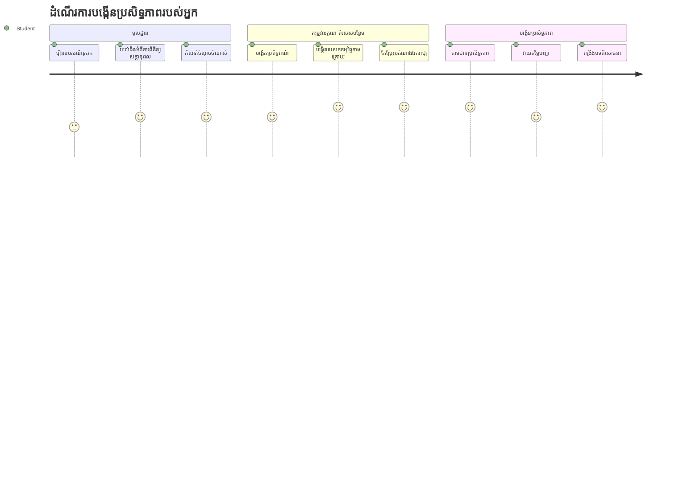
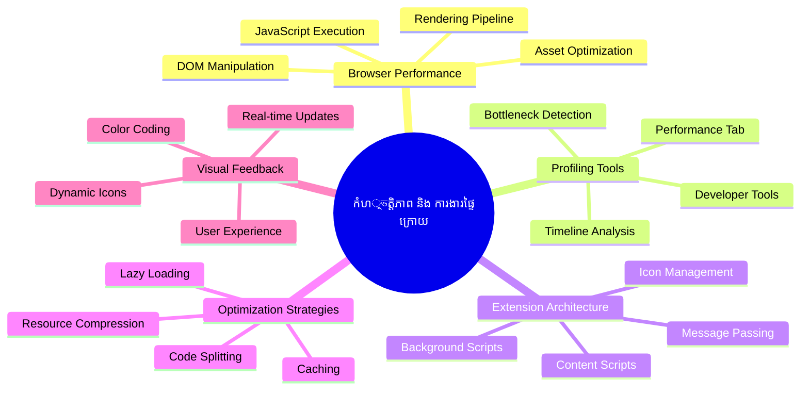
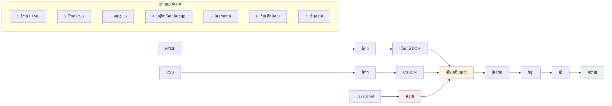
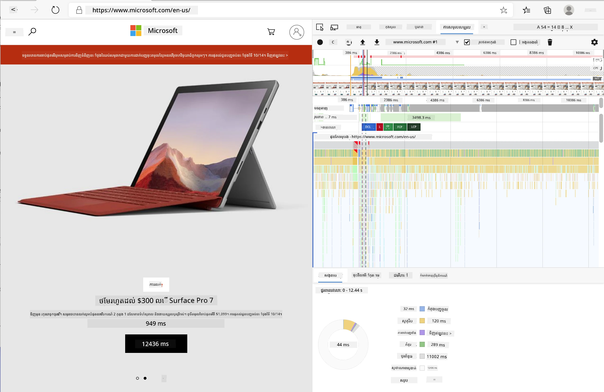
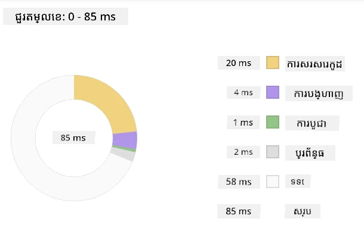
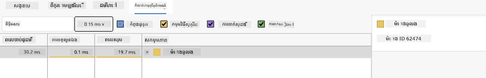
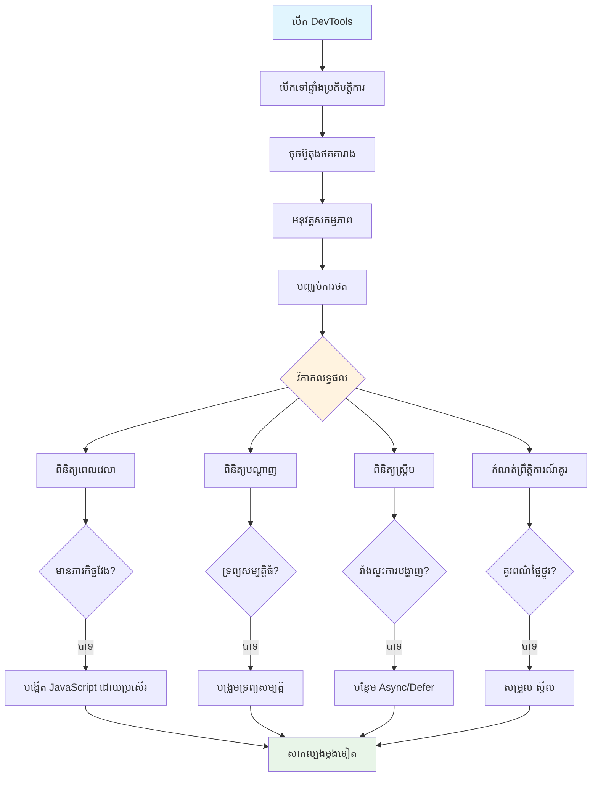
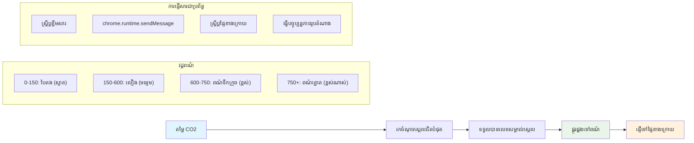
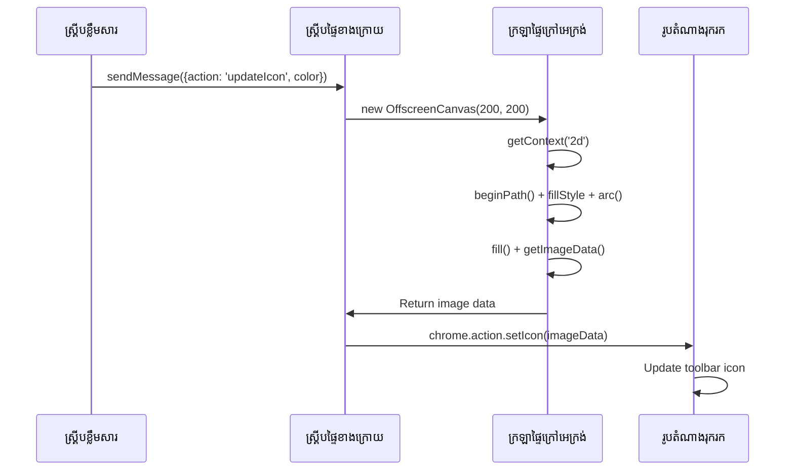
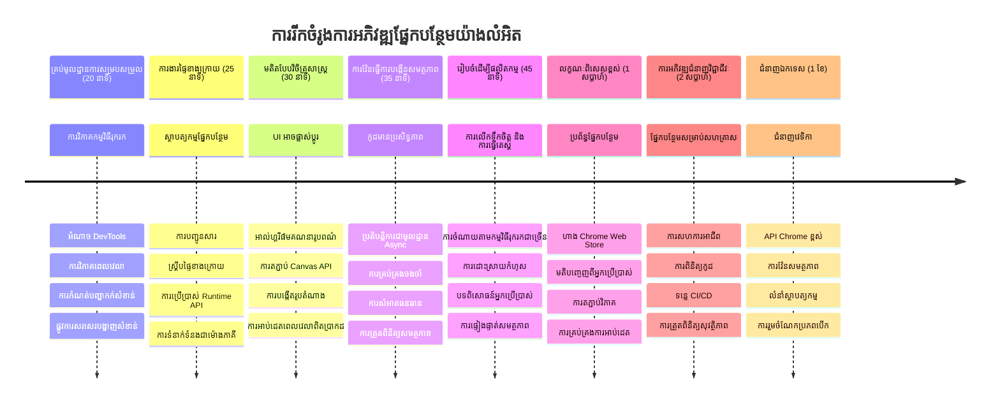

# គម្រោងផ្នែកបន្ថែមកម្មវិធីអ៊ិនធឺរណែត ផ្នែកទី 3៖ រៀនអំពីភារកិច្ចផ្ទៃក្រោយ និងប្រសិទ្ធភាព


ធ្លាប់សួរថា​អ្វីជាហេតុផលដែលធ្វើឲ្យកម្មវិធីបន្ថែមក្នុងកម្មវិធីរុករកបន្ទាប់មកមានអារម្មណ៍រហ័សនិងឆាប់តបទៅកាន់អ្នកប្រើ ខណៈដែលផ្សារមួយចំនួនដូចជាកម្មវិធីបន្ថែមមួយចំនួនផ្សេងទៀតហាក់ដូចធ្វើបានយឺត? អត្ថន័យសំខាន់គឺនៅក្នុងអ្វីដែលកំពុងកើតឡើងនៅពីក្រោយពិដាន។ ខណៈពេលអ្នកប្រើចុចជុំវិញចង្កេះរបស់កម្មវិធីបន្ថែមរបស់អ្នក មានពិភពលោកមួយតូចមួយកំពុងគ្រប់គ្រងដូចជា ការទាញយកទិន្នន័យ ការអាប់ដេតរូបតំណាង និងធនធានប្រព័ន្ធពេញលេញ។

នេះគឺជម្រើសចុងក្រោយរបស់យើងក្នុងលំហាត់បណ្ដុំកម្មវិធីបន្ថែមរុករក ហើយយើងនឹងធ្វើឲ្យកម្មវិធីតាមដានស្នាមកាបូនរបស់អ្នកដំណើរការយ៉ាងរលូន។ អ្នកនឹងបន្ថែមការអាប់ដេតរូបតំណាងឲ្យផ្លាស់ប្តូរនិងរៀនពីរបៀបដើម្បីរកឃើញបញ្ហាប្រសិទ្ធភាពមុនពេលពួកវាក្លាយទៅជាបញ្ហាធំបំផុត។ វាដូចជាការតម្លើងរថយន្តប្រណាំងមួយ - ការប្រសើរជាងតិចតួចអាចបង្កើតភាពខុសគ្នាយ៉ាងច្រើនក្នុងរបៀបដំណើរការរបស់គ្រប់យ៉ាង។

ពេលដែលយើងបញ្ចប់ អ្នកនឹងមានកម្មវិធីបន្ថែមដែលត្រូវបានដាក់ស្នូលស្អាត និងយល់ដឹងពីគោលការណ៍ប្រសិទ្ធភាពដែលបំបែកកម្មវិធីវេបល្អពីកម្មវិធីវេបដ៏អស្ចារ្យ។ មកធ្វើដំណើរចូលទៅក្នុងពិភពការបង្កើតកម្មវិធីល្បឿនលឿនរបស់កម្មវិធីរុករក។

## ផ្ទៀងផ្ទាត់មុនហ្វឹកហាត់

[ផ្ទៀងផ្ទាត់មុនហ្វឹកហាត់](https://ff-quizzes.netlify.app/web/quiz/27)

### ចំណាំង​មុខ

ក្នុងមេរៀនមុនៗនេះ អ្នកបានបង្កើតបែបបទមួយ ក្នុងការតភ្ជាប់វាជាមួយ API ហើយបានដោះស្រាយការទាញយកទិន្នន័យដោយអាស៊ីងក្រោន។ កម្មវិធីបន្ថែមរបស់អ្នកកំពុងមានរូបរាងល្អ។

ឥឡូវនេះយើងត្រូវបន្ថែមការផុសម៉ុខចុងក្រោយ - ដូចជាធ្វើឲ្យរូបតំណាងកម្មវិធីបន្ថែមផ្លាស់ប្ដូរពណ៌ទៅតាមទិន្នន័យកាបូន។ នេះបង្វិលខ្ញុំឲ្យគិតពីរបៀបដែល NASA ត្រូវបានលំអងគ្រប់ប្រព័ន្ធនៅលើយានអាកាស Apollo។ ពួកគេមិនអាចបាត់បង់សម្ភារៈដូចប៉ះស្មើឬម៉ោម៉ារបស់ឆ្នាំងបានទេ ព្រោះជីវិតពឹងផ្អែកលើប្រសិទ្ធភាព។ ខណៈដែលកម្មវិធីបន្ថែមរុករករបស់យើងមិនដែលសំខាន់ដូច្នេះទេ គោលការណ៍ដដែលត្រូវបានអនុវត្ត - កូដដំណើរការយ៉ាងមានប្រសិទ្ធភាពបង្កើតបទពិសោធន៍អ្នកប្រើល្អជាង។


## មូលដ្ឋានប្រសិទ្ធភាពវេប

ពេលដែលកូដរបស់អ្នកដំណើរការយ៉ាងមានប្រសិទ្ធភាព មនុស្សអាចប្រាកដថា *មានអារម្មណ៍* មើលឃើញភាពខុសគ្នា។ អ្នកស្គាល់ពេលដែលទំព័រត្រូវបានផ្ទុកភ្លាមៗ ឬតួអនុភាពរីករាយដោយរលូនមែនទេ? នេះគឺជាប្រសិទ្ធភាពល្អនៅពេលធ្វើការងារ។

ប្រសិទ្ធភាពមិនត្រឹមតែជាអំពីល្បឿនទេ - វាអំពីការធ្វើឲ្យបទពិសោធន៍វេបមានអារម្មណ៍ធម្មជាតិនៅវិញ និង មិនរញ្ជួយ ឬធ្វើឲ្យចំរូងចំរាស។ នៅក្នុងថ្ងៃដើមនៃការគណនា Grace Hopper បានរក្សារូបភាពនៃ nanosecond (ខ្សែប្លង់ប្រហែលមុខជើងមួយផ្ទាល់) នៅលើតុរបស់នាងដើម្បីបង្ហាញពីចម្ងាយចេញចូលរបស់ពន្លឺក្នុង១សិន្តីភាគពីរមួយពាន់លានៃវិនាទី។ វាជារបៀបរបស់នាងក្នុងការពន្យល់ថាផ្ទាល់រាល់មីលីវិនាទីមានសារៈសំខាន់ក្នុងការគណនា។ មកស្វែងយល់ពីឧបករណ៍កាន់តំណាងដែលជួយអ្នករកឃើញថាអ្វីជារឿងធ្វើឲ្យយឺត។

> "ប្រសិទ្ធភាពគេហទំព័រអំពីរប្រធានបទ៖ តើទំព័រផ្ទុករហ័សប៉ុណ្ណា និងតើកូដនៅលើវាដំណើរការប្រសិទ្ធប៉ុណ្ណា។" -- [Zack Grossbart](https://www.smashingmagazine.com/2012/06/javascript-profiling-chrome-developer-tools/)

ប្រធានបទអំពីរបៀបទៅធ្វើឲ្យគេហទំព័ររបស់អ្នកលឿនខ្លាំងនៅលើឧបករណ៍គ្រប់ប្រភេទ សម្រាប់អ្នកប្រើគ្រប់ប្រភេទ គ្រប់ស្ថានភាព គឺធំ និងពេញលេញប្រហែល។ មុនពេលបង្កើតគម្រោងវេបស្តង់ដារ ឬកម្មវិធីបន្ថែមរុករក សូមចងចាំចំណុចខាងក្រោម។

ជំហានដំបូងក្នុងការចុះសម្រួលគេហទំព័ររបស់អ្នកគឺយល់ដឹងអំពីអ្វីកំពុងកើតឡើងក្នុងផ្ទៃក្រោយ។ សំណាងល្អ គេហទំព័ររបស់អ្នកមានឧបករណ៍កាន់តំណាងដ៏មានអំណាចជាផ្នែកមួយក្នុងខ្លួនវា។


ដើម្បីបើកឧបករណ៍អ្នកអភិវឌ្ឍនៅ Edge ចុចលើចំណុចបីនៅជុំខាងលើភាគផ្ដើមខាងស្ដាំ បន្ទាប់មកចូលទៅ More Tools > Developer Tools។ ឬប្រើផ្លូវកាត់ក្តារចុច `Ctrl` + `Shift` + `I` នៅ Windows ឬ `Option` + `Command` + `I` នៅ Mac។ ពេលអ្នកឈានដល់ទីនោះ សូមចុចលើផ្ទាំង Performance - នេះជាទីតាំងដែលអ្នកនឹងធ្វើស៊ើបអង្កេត។

**នេះជាឧបករណ៍កាន់តំណាងប្រសិទ្ធភាពរបស់អ្នក៖**
- **បើក** Developer Tools (អ្នកនឹងប្រើវានៅជាទៀងទាត់ឲ្យក្លាយជាអ្នកអភិវឌ្ឍ!)
- **ចូល** ទៅផ្ទាំង Performance - គិតថាវាជាត្រីក្រោកកាយសម្បទារបស់កម្មវិធីវេបរបស់អ្នក
- **ចុច** ប៊ូតុង Record ហើយមើលទំព័ររបស់អ្នកដំណើរការ
- **សិក្សា** លទ្ធផលដើម្បីរកឃើញអ្វីជារឿងធ្វើឲ្យយឺត

យើងមកសាកល្បង៖ បើកគេហទំព័រមួយ (Microsoft.com ធ្វើបានល្អសម្រាប់នេះ) ហើយចុចប៊ូតុង 'Record'។ ឥឡូវរុញទំព័រឡើងវិញ ហើយមើលអ្នកបញ្ជាបូវរូបភាពកែច្នៃអ្វីៗកើតឡើង។ ពេលអ្នកឈប់ថត អ្នកនឹងឃើញការបង្ហាញលម្អិតនៃរបៀបដែលកម្មវិធីរុករក 'ស្គ្រីប', 'បង្ហាញ' និង 'គំនូរ' ទំព័រ។ វាប្រហែលដូចជាជំនួយការផ្ដល់ដំណឹងពេលផ្ដួលផ្កាយផ្ទាល់ - អ្នកទទួលបានទិន្នន័យពេលវេលាពិតប្រាកដនៃអ្វីកំពុងកើតឡើង និងពេលវេលា។



✅ [ឯកសារ Microsoft](https://docs.microsoft.com/microsoft-edge/devtools-guide/performance/?WT.mc_id=academic-77807-sagibbon) មានព័ត៌មានលម្អិតច្រើនបើអ្នកចង់ស្វែងយល់ជម្រៅ។

> យ៉ាងណាក្តី៖ សូមសំអាតឃ្លាំងប្រវត្តិរក្សារបស់អ្នកមុនសាកល្បង ដើម្បីមើលថាតើគេហទំព័ររបស់អ្នកដំណើរការយ៉ាងដូចម្តេចសម្រាប់ភ្ញៀវថ្មី - វាធម្មតាប្រែប្រួលខុសគ្នាពីការមកម្តងទីពីរ!

ជ្រើសរើសធាតុមួយនៃរបារពេលវេលាសម្រាប់ពង្រីកមើលព្រឹត្តិការណ៍កើតឡើងពេលទំព័ររបស់អ្នកផ្ទុក។

ទទួលបានរូបថតសង្ខេបនៃប្រសិទ្ធភាពទំព័ររបស់អ្នកដោយជ្រើសរើសផ្នែកមួយក្នុងរបារពេលវេលា ហើយមើលផ្ទាំងសង្ខេប៖



ពិនិត្យផ្ទាំងកំណត់ហេតុព្រឹត្តិការណ៍ (Event Log) ដែលមើលថាតើមានព្រឹត្តិការណ៍ណាមួយ​ដែលប្រើពេលលើស ១៥ មីលិវិនាទីទេ៖



✅ សូមស្គាល់អ្នកបញ្ជាបូវរូបភាពរបស់អ្នក! បើកឧបករណ៍អ្នកអភិវឌ្ឍនៅលើវេបសាយនេះ ហើយមើលថាតើមានបញ្ហាទីណាលឿយឬទេ។ តើវត្ថុដែលផ្ទុកយឺតបំផុតគឺអ្វី? លឿនបំផុត?


## តើត្រូវមើលអ្វីពេលប្រើប្រាស់ profiler

ការបង្កើត profiler គ្រាន់តែជាចំណុចចាប់ផ្តើមប៉ុណ្ណោះ - ជំនាញពិតប្រាកដគឺការយល់ថាតារាងពណ៌ចម្រុះទាំងនោះនិយាយអ្វី។ កុំបារម្ភ អ្នកនឹងចេះបកអានវា។ អ្នកអភិវឌ្ឍជាញឹកញាប់បានរៀនគេចចេញពីសញ្ញាព្រមានមុនពេលវាក្លាយជាបញ្ហាធំ។

យើងនឹងនិយាយពីមេដៃបញ្ហាប្រសិទ្ធភាពនៅលើគេហទំព័រ ដែលជាទម្លាប់សំខាន់ៗក្នុងគម្រោងវេប។ ដូចជា Marie Curie ត្រូវតែតាមដានកម្រិតកាំរស្មីយ៉ាងប្រុងប្រយ័ត្នក្នុងបន្ទប់ប្រើប្រាស់របស់នាង យើងត្រូវតែតាមដានបំពានមួយចំនួនដែលបង្ហាញថាបញ្ហាកំពុងកើត។ ការចាប់បញ្ហាទាំងនេះមុនគឺជាជំនួយធំសម្រាប់អ្នក និងអ្នកប្រើរបស់អ្នក។

**ទំហំទ្រព្យសម្បត្តិ**៖ គេហទំព័របានធ្លាប់ក្លាយងាប់ធ្ងន់ជាងមុនរយៈពេលប៉ុន្មានឆ្នាំ ហើយទំងន់បន្ថែមច្រើនគឺមកពីរូបភាព។ វាត្រូវបានប្រៀបដូចជាការផ្ទុកវត្ថុបន្ថែមច្រើនសម្រាប់កាបូបឌីជីថលរបស់យើង។

✅ ចូលទៅកាន់ [Internet Archive](https://httparchive.org/reports/page-weight) ដើម្បីមើលនូវការកើនឡើងទំហំទំព័រជាចន្លោះពេល​វេលា - វាលម្អិតនិងចេះចាំ។

**នេះជាវិធីរក្សាទ្រព្យសម្បត្តិរបស់អ្នកឲ្យមានប្រសិទ្ធភាព៖**
- **បង្រួមបង្ហាប់** រូបភាពទាំងនេះ! រូបមន្តទំនើបដូចជា WebP អាចកាត់បន្ថយទំហំឯកសារបានយ៉ាងខ្លាំង
- **ផ្តល់** ទំហំរូបភាពត្រូវសម្រាប់ឧបករណ៍នីមួយៗ - មិនចាំបាច់ផ្ញើរូបភាពក្រៅតុធំៗទៅទូរស័ព្ទ
- **រក្សា** កូដ CSS និង JavaScript ឲ្យតូចបំផុត - រាល់បៃមានតម្លៃ
- **ប្រើ** ល្បឿនយឺត (lazy loading) ដើម្បីរូបភាពទាញយកតែពេលអ្នកប្រើដេញចុចរកប៉ុណ្ណោះ

**ការឆ្លងកាត់ DOM**៖ កម្មវិធីរុករកត្រូវតែបង្កើតម៉ូដែលឯកសារដែលមានលំដាប់ទៅតាមកូដដែលអ្នកសរសេរ ដូច្នេះវាល្អណាស់ក្នុងការរក្សាទំនាក់ទំនងណែនាំគេហទំព័រក្នុងកម្រិតតិចបំផុតដោយប្រើតែវត្ថុដែលចាំបាច់ និងបូកបន្ថែមរចនាប័ទ្មត្រឹមត្រូវតែសម្រាប់ទំព័រមួយច្បាស់លាស់។

**យុទ្ធសាស្ត្រចម្បងសម្រាប់ជំរុញ DOM៖**
- **កាត់បន្ថយ** ចំនួនធាតុ HTML និងកម្រិតបញ្ចូលគ្នា
- **យកចេញ** បទបញ្ជា CSS មិនប្រើ និងបញ្ចូលស្ទាយជាសាំងៗប្រកបដោយប្រសិទ្ធភាព
- **រៀបចំ** CSS ដើម្បីផ្ទុកតែអ្វីដែលត្រូវការពេលទំព័រនីមួយៗ
- **រចនាសម្ព័ន្ធ** HTML ជាផ្លូវការសម្រាប់ការវិភាគរបស់កម្មវិធីរុករកល្អប្រសើរ

**JavaScript**៖ អ្នកអភិវឌ្ឍជាច្រើនគួរតែប្រយ័ត្ន scripts ដែលបង្ហាញរាំងខ្ទប់ (« render-blocking ») ដែលត្រូវតែផ្ទុកមុនពេល DOM អាចត្រូវបានតភ្ជាប់និងគូរអោយមាននៅលើកម្មវិធីរុករក។ សូមពិចារណាប្រើ `defer` ជាមួយតួអក្សរ inline scripts (ដូចជា module Terrarium)។

**​និរន្តរភាពកូដ JavaScript បែបប្រើប្រាស់សម័យថ្មី៖**
- **ប្រើ** អត្ថបទ `defer` ដើម្បីផ្ទុក scripts បន្ទាប់ពី DOM ច្រាសត្រូវបានបញ្ចប់
- **អនុវត្ត** ការចែកកូដ (code splitting) ដើម្បីផ្ទុក JavaScript ត្រឹមត្រូវតែប៉ុណ្ណោះ
- **អនុវត្ត** ល្បឿនយឺតសម្រាប់មុខងារមិនសំខាន់
- **កាត់បន្ថយ** ការប្រើប្រាស់បណ្ណាល័យ និងស៊ុមខ្លីក្រែនធ្វើបណ្តាញដល់តិចបំផុត

✅ សាកល្បងគេហទំព័រខ្លះៗជាមួយ [គេហទំព័រប្រឡងល្បឿនតំណ](https://www.webpagetest.org/) ដើម្បីរៀនពីការត្រួតពិនិត្យទូទៅដែលធ្វើឡើងដើម្បីវាយតម្លៃប្រសិទ្ធភាពគេហទំព័រ។

### 🔄 **ពិនិត្យជាមួយគ្រូបង្រៀន**
**យល់ដឹងអំពីប្រសិទ្ធភាព**៖ មុនពេលសង់មុខងារកម្មវិធីបន្ថែម សូមប្រាកដថាអ្នកអាច៖
- ✅ ពន្យល់ពីផ្លូវកំណត់បង្ហាញពី HTML ទៅ pixels
- ✅ សម្គាល់បញ្ហាប្រសិទ្ធភាពទូទៅនៅក្នុងកម្មវិធីវេប
- ✅ ប្រើឧបករណ៍អភិវឌ្ឍកម្មវិធីរុករកក្នុងការវាយតម្លៃប្រសិទ្ធភាពទំព័រ
- ✅ យល់ពីរបៀបដែលទំហំទ្រព្យសម្បត្តិ និងភាពស្មុគស្មាញ DOM នាំឲ្យល្បឿនរំលស់

**តេស្ដមុខឯងឆាប់ៗ**៖ តើមានអ្វីកើតឡើងពេលដែលមាន JavaScript ដែលរាំងខ្ទប់ការបង្ហាញ?
*ចម្លើយ៖ កម្មវិធីរុករកត្រូវតែទាញយក និងដំណើរការតួស្គ្រីបមុនវាចាប់ផ្តើមច្រាស HTML និងបង្ហាញទំព័រ*

**ឥទ្ធិពលប្រសិទ្ធភាពពិតប្រាកដ៖**
- **ពន្ធនាទី ១០០ មីលិវិនាទី**៖ អ្នកប្រើគ្មានចិត្តលំហូរ
- **ពន្ធនាទី ១ វិនាទី**៖ អ្នកប្រើចាប់ផ្តើមខ្វះកម្ពស់
- **៣ វិនាទីឡើងលើ**៖ ៤០% អ្នកប្រើចាកចេញពីទំព័រ
- **បណ្ដាញទូរស័ព្ទ**៖ ប្រសិទ្ធភាពមានសារៈសំខាន់ជាងមុនសម្រាប់ស្ថិតិទូរស័ព្ទ

ឥឡូវនេះដែលអ្នកមានគំនិតពីរបៀបដែលកម្មវិធីរុករកបង្ហាញទ្រព្យសម្បត្តិដែលអ្នកផ្ញើរឲ្យវា មកមើលរឿងចុងក្រោយពីរយៈពេលត្រូវធ្វើដើម្បីបញ្ចប់កម្មវិធីបន្ថែមរបស់អ្នក៖

### បង្កើតមុខងារគណនាពណ៌

ឥឡូវនេះយើងនឹងបង្កើតមុខងារមួយដែលបម្លែងទិន្នន័យចំនួនទៅជាពណ៌មានន័យ។ គិតដូចជាប្រព័ន្ធសញ្ញាអំពីចរាចរណ៍ - ពណ៌បៃតងសម្រាប់ថាមពលស្អាត ពណ៌ក្រហមសម្រាប់កាបូនធ្ងន់។

មុខងារនេះនឹងទទួលទិន្នន័យ CO2 ពី API របស់យើង ហើយកំណត់ថាពណ៌ណាដែលបង្ហាញផលប៉ៈពាល់បរិស្ថានល្អបំផុត។ វាគឺដូចជាទីបញ្ជូនពណ៌ដែលអ្នកវិទ្យាសាស្ត្រប្រើប្រាស់នៅផែនទីកម្តៅដើម្បីបង្ហាញលំនាំទិន្នន័យស្មុគស្មាញ - ចាប់ពីសីតុណ្ហភាពសមុទ្រ រហូតដល់ការបង្កើតផ្កាយ។ អ្នកបូកបន្ថែមវានៅ /src/index.js ទីហើយបន្ទាប់ពីបញ្ជាក់តួអក្សរ const ដែលបានរៀបចំរួច:


```javascript
function calculateColor(value) {
	// កំណត់លំដាប់ភាពខ្លាំង CO2 (ក្រាមក្នុងមួយគីឡូវអត់ម៉ោម៉៉ោម៉៉ោម៉ោម៉ោម៉ោម៉ោម៉ោម៉ោម៉ោម៉ោម៉ោម៉ោម៉ោម៉ោម៉ោម៉ោម៉ោម៉ោម៉ោម៉ោម៉ោម៉ោម៉ោម៉ោម៉ោម៉ោម៉ោម៉ោម៉ោម៉ោម៉ោម៉ោម៉ោម៉ោម៉ោម៉ោម៉ោម៉ោម៉ោម៉ោម៉ោម៉ោម៉ោម៉ោម៉ោម៉ោម៉ោម៉ោម៉ោម៉ោម៉ោម៉ោម៉ោម៉ោម៉ោម៉ោម៉ោម៉ោម៉ោម៉ោម៉ោម៉ោម៉ោម៉ោម៉ោម៉ោម៉ោម៉ោម៉ោម៉ោម៉ោម៉ោម៉ោម៉ោម៉ោម៉ោម៉ោម៉ោម៉ោម៉ោម៉ោម៉ោម៉ោម៉ោម៉ោម៉ោម៉ោម៉ោម៉ោម៉ោម៉ោម៉ោម៉ោម៉ោម៉ោម៉ោម៉ោម៉ោម៉ោម៉ោម៉ោម៉ោម៉ោម៉ោម៉ោម៉ោម៉ោម៉ោម៉ោម៉ោម៉ោម៉ោម៉ោម៉ោម៉ោម៉ោម៉ោម៉ោម៉ោម៉ោម៉ោម៉ោម៉ោម៉ោម៉ោម៉ោម៉ោម៉ោម៉ោម៉ោម៉ោម៉ោម៉ោម៉ោម៉ោម៉ោម៉ោម៉ោម៉ោម៉ោម៉ោម៉ោម៉ោម៉ោម៉ោម៉ោម៉ោម៉ោម៉ោម៉ោម៉ោម៉ោម៉ោម៉ោម៉ោម៉ោម៉ោម៉ោម៉ោម៉ោម៉ោម៉ោម៉ោម៉ោម៉ោម៉ោម៉ោម៉ោម៉ោម៉ោម៉ោម៉ោម៉ោម៉ោម៉ោម៉ោម៉ោម៉ោម៉ោម៉ោម៉ោម៉ោម៉ោម៉ោម៉ោម៉ោម៉ោម៉ោម៉ោម៉ោម៉ោម៉ោម៉ោម៉ោម៉ោម៉ោម៉ោម៉ោម៉ោម៉ោម៉ោម៉ោម៉ោម៉ោម៉ោម៉ោម៉ោម៉ោម៉ោម៉ោម៉ោម៉ោម៉ោម៉ោម៉ោម៉ោម៉ោម៉ោម៉ោម៉ោម៉ោម៉ោម៉ោម៉ោម៉ោម៉ោម៉ោម៉ោម៉ោម៉ោម៉ោម៉ោម៉ោម៉ោម៉ោម៉ោម៉ោម៉ោម៉ោម៉ោម៉ោម៉ោម៉ោម៉ោម៉ោម៉ោម៉ោម៉ោម៉ោម៉ោម៉ោម៉ោម៉ោម៉ោម៉ោម៉ោម៉ោម៉ោម៉ោម៉ោម៉ោម៉ោម៉ោម៉ោម៉ោម៉ោម៉ោម៉ោម៉ោម៉ោម៉ោម៉ោម៉ោម៉ោម៉ោម៉ោម៉ោម៉ោម៉ោម៉ោម៉ោម៉ោម៉ោម៉ោម៉ោម៉ោម៉ោម៉ោម៉ោម៉ោម៉ោម៉ោម៉ោម៉ោម៉ោម៉ោម៉ោម៉ោម៉ោម៉ោម៉ោម៉ោម៉ោម៉ោម៉ោម៉ោម៉ោម៉ោម៉ោម៉ោម៉ោម៉ោម៉ោម៉ោម៉ោម៉ោម៉ោម៉ោម៉ោម៉ោម៉ោម៉ោម៉ោម៉ោម៉ោម៉ោម៉ោម៉ោម៉ោម៉ោម៉ោម៉ោម៉ោម៉ោម៉ោម៉ោម៉ោម៉ោម៉ោម៉ោម៉ោម៉ោម៉ោម៉ោម៉ោម៉ោម៉ោម៉ោម៉ោម៉ោម៉ោម៉ោម៉ោម៉ោម៉ោម៉ោម៉ោម៉ោម៉ោម៉ោម៉ោម៉ោម៉ោម៉ោម៉ោម៉ោម៉ោម៉ោម៉ោម៉ោម៉ោម៉ោម៉ោម៉ោម៉៉
	const co2Scale = [0, 150, 600, 750, 800];
	// Corresponding colors from green (clean) to dark brown (high carbon)
	const colors = ['#2AA364', '#F5EB4D', '#9E4229', '#381D02', '#381D02'];

	// Find the closest scale value to our input
	const closestNum = co2Scale.sort((a, b) => {
		return Math.abs(a - value) - Math.abs(b - value);
	})[0];
	
	console.log(`${value} is closest to ${closestNum}`);
	
	// Find the index for color mapping
	const num = (element) => element > closestNum;
	const scaleIndex = co2Scale.findIndex(num);

	const closestColor = colors[scaleIndex];
	console.log(scaleIndex, closestColor);

	// Send color update message to background script
	chrome.runtime.sendMessage({ action: 'updateIcon', value: { color: closestColor } });
}
```

**ចែកវាឲ្យយល់ល្អពីមុខងារល្អនេះ៖**
- **កំណត់** អារេពីរដុំ - មួយសម្រាប់កម្រិត CO2 មួយសម្រាប់ពណ៌ (បៃតង = ស្អាត, ស្វាយ = ប្រេង!)
- **ស្វែងរក** ការផ្គូផ្គងសៀរីដូចជាតម្លៃ CO2 ពិតប្រាកដដោយប្រើការតម្រៀបអារេព្រមទាំង
- **ទទួលយក** ពណ៌ផ្គូផ្គងដោយប្រើមុខងារ findIndex()
- **ផ្ញើ** សារទៅកាន់ script ផ្ទៃក្រោយរបស់ Chrome ជាមួយពណ៌ដែលបានជ្រើសរើស
- **ប្រើប្រាស់** template literals (សញ្ញាក្នុងតួសញ្ញាទាំងពីរពីលើ) សម្រាប់រៀបចំខ្សែអក្សរបានស្អាត
- **រក្សា** រៀបចំទាំងអស់ដោយ const

`chrome.runtime` [API](https://developer.chrome.com/extensions/runtime) គឺដូចប្រព័ន្ធប្រសាសន៍នៃកម្មវិធីបន្ថែមរបស់អ្នក - វាគ្រប់គ្រងការទំនាក់ទំនងនៅពីក្រោយ និងភារកិច្ចទាំងអស់៖

> "ប្រើ chrome.runtime API ដើម្បីទាញយកទំព័រផ្ទៃក្រោយ យកព័ត៌មានពី manifest ហើយស្តាប់និងឆ្លើយតបដល់ព្រឹត្តិការណ៍ក្នុងជីវចលកម្មកម្មវិធីឬកម្មវិធីបន្ថែម។ អ្នកអាចប្រើ API នេះដើម្បីបម្លែងផ្លូវរួមគ្នា URLs ទៅជា URLs ពេញលេញបានផង។"

**ហេតុអ្វីបានជា Chrome Runtime API មានប្រយោជន៍:**
- **អនុញ្ញាតឲ្យ** ផ្នែកផ្សេងៗនៃកម្មវិធីបន្ថែមនិយាយគ្នា
- **គ្រប់គ្រង** ការងារផ្ទៃក្រោយដោយគ្មានបញ្ហាកិច្ចការពាក់ព័ន្ធ UI
- **គ្រប់គ្រង** ព្រឹត្តិការណ៍ជីវចលកម្មកម្មវិធីបន្ថែម
- **ធ្វើឲ្យ** ការផ្ញើសាររវាង script งាយស្រួលណាស់

✅ ប្រសិនបើអ្នកកំពុងអភិវឌ្ឍកម្មវិធីបន្ថែមរុករកសម្រាប់ Edge អាចធ្វើអោយអ្នកភ្ញាក់ផ្អើលថាអ្នកកំពុងប្រើ chrome API។ កម្មវិធីរុករក Edge ជំនាន់ថ្មីរត់លើម៉ាស៊ីន Chromium ដូច្នេះអ្នកអាចប្រើឧបករណ៍ទាំងនេះបាន។


> **ជំរើសពិសេស**៖ ប្រសិនបើអ្នកចង់ប្រើ profiler សម្រាប់កម្មវិធីបន្ថែមរុករក សូមបើក dev tools ពីក្នុងកម្មវិធីបន្ថែមដោយផ្ទាល់ទៅមក មុនពេលដំណើរការប្រៀបដូចជាកម្មវិធីរុករកឯករាជ្យ។ វាជួយឲ្យអ្នកបង្កើតសន្ទស្សន៍ប្រសិទ្ធភាពក្នុងកម្មវិធីបន្ថែម។

### កំណត់ពណ៌រូបតំណាងលំនាំដើម

មុនពេលយើងចាប់ផ្តើមទាញយកទិន្នន័យពិតប្រាកដ អ្នកណាម្នាក់មិនចូលចិត្តមើលរូបតំណាងទទេ ឬមានមុខមាត់ខូចខាតឡើយ។ យើងនឹងចាប់ផ្តើមជាមួយពណ៌បៃតង ដើម្បីឲ្យអ្នកប្រើដឹងថាកម្មវិធីបន្ថែមកំពុងដំណើរការ ពីពេលខាងកាន់ពួកគេដំឡើងវា។

ក្នុងមុខងារ `init()` របស់អ្នក សូមកំណត់រូបតំណាងពណ៌បៃតងលំនាំដើម៖

```javascript
chrome.runtime.sendMessage({
	action: 'updateIcon',
	value: {
		color: 'green',
	},
});
```

**អ្វីដែលការចាប់ផ្តើមនេះបានធ្វើ:**
- **កំណត់** ពណ៌បៃតងធម្មតាជាស្ថានភាពលំនាំដើម
- **ផ្ដល់** ការផ្តល់មតិភ្នែកភ្លាមពេលកម្មវិធីបន្ថែមផ្ទុក
- **បង្កើត** លំនាំទំនាក់ទំនងជាមួយ script ផ្ទៃក្រោយ
- **ធានា** អ្នកប្រើឃើញកម្មវិធីបន្ថែមដំណើរការមុនការទាញយកទិន្នន័យ

### ហៅមុខងារ ដំណើរការហៅ

ឥឡូវពីរភ្ជាប់គ្នាពីរប្រភេទ ដូច្នេះពេលដែលទិន្នន័យ CO2 ថ្មីមក អ្នកតំណាងរបស់អ្នកនឹងត្រូវអាប់ដេតដោយស្វ័យប្រវត្តិក្នុងពណ៌ត្រឹមត្រូវ។ វាដូចជាការតភ្ជាប់សៀគ្វីចុងក្រោយនៅក្នុងឧបករណ៍អេឡិចត្រូនិច - ក្រោយមកផ្នែកផ្សេងៗទាំងមូលដំណើរការជាប្រព័ន្ធតែមួយ។

បន្ថែមបន្ទាត់នេះបន្ទាប់ពីអ្នកទទួលបានទិន្ននៃ CO2 ពី API៖

```javascript
// បន្ទាប់ពីទាញយកទិន្នន័យ CO2 ពី API
// អនុញ្ញាត CO2 = data.data[0].intensity.actual;
calculateColor(CO2);
```

**ការតភ្ជាប់នេះបានធ្វើ៖**
- **ភ្ជាប់** ដំណើរការទិន្នន័យ API ជាមួយប្រព័ន្ធសញ្ញាភ្នែក
- **បញ្ចូលពន្លឿន** ការអាប់ដេតរូបតំណាងដោយស្វ័យប្រវត្តិពេលទិន្នន័យថ្មីមក
- **ធានា** ការផ្តល់មតិបង្ហាញភ្នែកពេលពិតប្រាកដ អាស្រ័យលើកាបូនបច្ចុប្បន្ន
- **រក្សា** ការបំបែកចេញពីភារកិច្ចទាញយកទិន្នន័យនិងការបង្ហាញ

ចុងក្រោយ នៅក្នុង /dist/background.js បន្ថែមកម្មវិធីស្តាប់សម្រាប់ការហៅសកម្មភាពផ្ទៃក្រោយទាំងនេះ៖

```javascript
// ស្ដាប់សារពីស្គ្រីបខ្លឹមសារ
chrome.runtime.onMessage.addListener(function (msg, sender, sendResponse) {
	if (msg.action === 'updateIcon') {
		chrome.action.setIcon({ imageData: drawIcon(msg.value) });
	}
});

// គូររូបតំណាងឌីណាមិចដោយប្រើ Canvas API
// ខ្ចីពីផ្នែកបន្ថែម energy lollipop - លក្ខណៈពិសេសល្អ!
function drawIcon(value) {
	// បង្កើតកំណាត់កង់ក្រៅអេក្រង់សម្រាប់ការអនុវត្តល្អប្រសើរ
	const canvas = new OffscreenCanvas(200, 200);
	const context = canvas.getContext('2d');

	// គូរពណ័ផ្កង់ដែលបង្ហាញពីភាពខ្លាំងកាបូន
	context.beginPath();
	context.fillStyle = value.color;
	context.arc(100, 100, 50, 0, 2 * Math.PI);
	context.fill();

	// ត្រឡប់មកវិញទិន្នន័យរូបភាពសម្រាប់រូបតំណាងម៉ាស៊ីនរកមើលវេប
	return context.getImageData(50, 50, 100, 100);
}
```

**នេះជាអ្វីដែល script ផ្ទៃក្រោយនេះធ្វើ៖**
- **ស្តាប់** សារពី script មេរបស់អ្នក (ដូចជាមន្រ្តីទទួលទូរស័ព្ទ)
- **ដំណើរការ** សំណើ 'updateIcon' ដើម្បីប្ដូររូបតំណាងផ្ទាំងឧបករណ៍រុករក
- **បង្កើត** រូបតំណាងថ្មីៗប្រើប្រាស់ Canvas API
- **គូរ** វង់ពណ៌សាមញ្ញបង្ហាញកម្រិតកាបូនបច្ចុប្បន្ន
- **អាប់ដេត** រូបតំណាងនៅលើផ្ទាំងឧបករណ៍រុករករបស់អ្នក
- **ប្រើ** OffscreenCanvas សម្រាប់ប្រសិទ្ធភាពល្អ (គ្មានការរាំងស្ទាក់ UI)

✅ អ្នកនឹងរៀនបន្ថែមអំពី Canvas API នៅក្នុង [មេរៀនហ្គេមអាកាស](../../6-space-game/2-drawing-to-canvas/README.md)។


### 🔄 **ពិនិត្យជាមួយគ្រូបង្រៀន**
**យល់ដឹងកម្រិតលំដាប់សរុប នៃកម្មវិធីបន្ថែម**៖ សូមបញ្ជាក់ពីជំនាញបំពេញប្រព័ន្ធទាំងមូល៖
- ✅ តើការផ្ញើសារ (message passing) ធ្វើការយ៉ាងដូចម្តេចក្នុងចន្លោះស្គ្រីបផ្នែកបន្ថែមផ្សេងៗ?
- ✅ ហេតុអ្វីយើងប្រើ OffscreenCanvas ជំនួស Canvas ទូទៅសម្រាប់អត្រាទិចថាមពល?
- ✅ តើ API របស់ Chrome Runtime មានតួនាទីអ្វីក្នុងសំណុំសំណង់ផ្នែកបន្ថែម?
- ✅ តើ algorithm គណនាពណ៌ផ្គូផ្គងទិន្នន័យទៅភាពឃើញបែបណា?

**កាលៈទេសៈនៃការអនុវត្ត**: ផ្នែកបន្ថែមរបស់អ្នកឥឡូវបង្ហាញពី៖
- **ការបញ្ជូនសារយ៉ាងប្រសើរ**: ការប្រាស្រ័យទាក់ទងបរិស្ថានស្គ្រីបទាន់សម័យ
- **ការសម្រួលផ្នែកគំនូរ**: OffscreenCanvas ជៀសវាងការរអាក់ UI
- **អាប់ដេតពេលវេលាពិតប្រាកដ**: ការប្រែប្រួលរូបតំណាងដោយផ្អែកលើទិន្នន័យផ្ទាល់
- **ការគ្រប់គ្រងអង្គចងចាំ**: ការសម្អាត និងដឹកជញ្ជូនធនធានត្រឹមត្រូវ

**ពេលវេលាចាប់ផ្តើមសាកល្បងផ្នែកបន្ថែមរបស់អ្នក៖**
- **បង្កើត** ឯកសារទាំងអស់ជាមួយ `npm run build`
- **បញ្ចូលម្ដងទៀត** ផ្នែកបន្ថែមនៅក្នុងកម្មវិធីរុករក (កុំភ្លេចជំហាននេះ)
- **បើក** ផ្នែកបន្ថែមរបស់អ្នក ហើយសង្កេតឃើញការផ្លាស់ប្ដូរពណ៌រូបតំណាង
- **ពិនិត្យ** វាឆ្លើយតបយ៉ាងដូចម្តេចចំពោះទិន្នន័យកាបូនពិតៗពីទូទាំងពិភពលោក

ឥឡូវនេះ អ្នកនឹងដឹងភ្លាមៗថាតើពេលនេះល្អសម្រាប់បោកបញ្ចក់ឬតើតម្រូវរង់ចាំថាមពលបរិសុទ្ធ។ អ្នកទើបតែបង្កើតអ្វីដែលមានប្រយោជន៍ពិតប្រាកដ ហើយបានរៀនអំពីការសម្របសម្រួលកម្មវិធីរុករកជាមួយនឹងដំណើរការផ្សេងៗ។

## ជម្រុះ GitHub Copilot Agent 🚀

ប្រើមូដប្រាជ្ញាធិបតីដើម្បីបញ្ចប់ភារកិច្ចដូចខាងក្រោម៖

**ពិពណ៌នា:** បង្កើតសមត្ថភាពត្រួតពិនិត្យប្រតិបត្តិការនៃផ្នែកបន្ថែមកម្មវិធីរុករក ដោយបន្ថែមមុខងារតាមដាននិងបង្ហាញពេលវេលាដំណើរការសម្រាប់ឧបករណ៍ផ្សេងៗនៃផ្នែកបន្ថែម។

**ពាក្យបញ្ជា:** បង្កើតប្រព័ន្ធត្រួតពិនិត្យប្រតិបត្តិការសម្រាប់ផ្នែកបន្ថែមកម្មវិធីរុករក ដែលវាស់និងកត់ត្រាពេលវេលាស៊ើបអង្កេតទិន្នន័យ CO2 ពី API កំណត់ពណ៌ និងធ្វើអាប់ដេតរូបតំណាង។ បន្ថែមមុខងារប្រាប់ឈ្មោះ `performanceTracker` ដែលប្រើ Performance API ដើម្បីវាស់ការចំណាយពេលវេលានិងបង្ហាញលទ្ធផលនៅក្នុង Console របស់កម្មវិធីរុករកជាមួយពេលវេលានិងកម្រិតរយៈពេល។

សូមស្វែងយល់បន្ថែមអំពី [mode agent](https://code.visualstudio.com/blogs/2025/02/24/introducing-copilot-agent-mode) នៅទីនេះ។

## 🚀 ភារកិច្ច

នេះជាបេសកកម្មពិនិត្យស្រាវជ្រាវគួរឱ្យចាប់អារម្មណ៍៖ ជ្រើសរើសគេហទំព័រមួយចំនួនដែលជា open source និងមានវត្តមានរយៈពេលវែង (គិតផ្ទៃដូចជា Wikipedia, GitHub, ឬ Stack Overflow) ហើយស្វែងរកប្រវត្តិការបញ្ជូន commit របស់ពួកវា។ តើអ្នកអាចរកឃើញកន្លែងដែលពួកគេបានធ្វើការកែលម្អប្រសិទ្ធភាព? តើមានបញ្ហាអ្វីខ្លះដែលកើតឡើងជាថ្មី?

**វិធីសាស្ត្រស្រាវជ្រាវរបស់អ្នក៖**
- **ស្វែងរក** សារបញ្ជូន commit សម្រាប់ពាក្យដូចជា "optimize," "performance," ឬ "faster"
- **សង្កេត** សំណុំបែបបទ - តើពួកគេតែងតែជួសជុលបញ្ហាបែបណា?
- **កំណត់** អ្នកបង្ក​បញ្ហារអាប់ឡូវដែលធ្វើឲ្យគេហទំព័រពិបាករហ័ស
- **ចែករំលែក** អ្វីដែលអ្នករកឃើញ - អ្នកអភិវឌ្ឍន៍ផ្សេងទៀតអាចរៀនពីឧទាហរណ៍ពិត

## ប្រលងក្រោយមេរៀន

[ប្រលងក្រោយមេរៀន](https://ff-quizzes.netlify.app/web/quiz/28)

## ការពិនិត្យឡើងវិញ និងរៀនផ្ទាល់ខ្លួន

ពិចារណាចុះឈ្មោះសារព័ត៌មាន [performance newsletter](https://perf.email/)

ស្វែងយល់ពីវិធីដែលកម្មវិធីរុករកវាស់ប្រតិបត្តិការបណ្តាញដោយមើលតាម​រយៈ​ភាគ Performance ក្នុងឧបករណ៍អភិវឌ្ឍន៍របស់ពួកវា។ តើអ្នកឃើញភាពខុសគ្នាធំៗណាមួយទេ?

### ⚡ **អ្វីដែលអ្នកអាចធ្វើក្នុង ៥ នាទីបន្ទាប់**
- [ ] បើកកម្មវិធី Task Manager របស់កម្មវិធីរុករក (Shift+Esc នៅក្នុង Chrome) ដើម្បីមើលការប្រើធនធានរបស់ផ្នែកបន្ថែម
- [ ] ប្រើ DevTools ផ្នែក Performance ដើម្បីថតនិងវិភាគប្រតិបត្តិការទំព័រស្ក្រីត
- [ ] ពិនិត្យទំព័រ Extensions នៃកម្មវិធីរុករកដើម្បីឃើញផ្នែកបន្ថែមដែលប៉ះពាល់ដល់ពេលចាប់ផ្តើម
- [ ] សាកល្បងផិទៅមុខផ្នែកបន្ថែមបណ្តោះអាសន្ន ដើម្បីមើលភាពខុសគ្នានៃផលិតភាព

### 🎯 **អ្វីដែលអ្នកអាចសម្រេចបានក្នុងម៉ោងនេះ**
- [ ] បញ្ចប់ប្រលងក្រោយមេរៀន និងយល់ដឹងពីគំនិតផលិតភាព
- [ ] អនុវត្តស្គ្រីបផ្នែកខាងក្រោយសម្រាប់ផ្នែកបន្ថែមកម្មវិធីរុករករបស់អ្នក
- [ ] រៀនប្រើ browser.alarms សម្រាប់បេសកកម្មផ្នែកខាងក្រោយប្រសើរ
- [ ] អនុវត្តការផ្ញើសារពីស្គ្រីបមាតិកាទៅស្គ្រីបផ្នែកខាងក្រោយ
- [ ] វាស់និងធ្វើអប្បបរមាអង្គធនធានរបស់ផ្នែកបន្ថែមរបស់អ្នក

### 📅 **ការធ្វើដំណើរផ្នែកផលិតភាពរបស់អ្នករយៈពេលមួយសប្ដាហ៍**
- [ ] បញ្ចប់ផ្នែកបន្ថែមកម្មវិធីរុករកដែលមានប្រសិទ្ធភាពខ្ពស់ និងមុខងារផ្នែកខាងក្រោយ
- [ ] ជំនាញនៃសេវាកម្មធ្វើការ (service workers) និងសំណុំសំណង់បន្ថែមទំនើប
- [ ] អនុវត្តយុទ្ធសាស្ត្រសម្របសម្រួលទិន្នន័យ និង caching
- [ ] រៀនវិធី Debug ចម្បងសម្រាប់ផលិតភាពផ្នែកបន្ថែម
- [ ] បញ្ចេញមុខងារអាចប្រើបានយ៉ាងប្រសើរ និងធនធានប្រសិទ្ធភាព
- [ ] បង្កើតតេស្តពេញលេញសម្រាប់សេចក្តីលក្ខណៈផលិតភាពផ្នែកបន្ថែម

### 🌟 **ភាពឯកទេសក្នុងការសម្របសម្រួលប្រសិទ្ធភាពរយៈពេលមួយខែ**
- [ ] បង្កើតផ្នែកបន្ថែមកម្មវិធីរុករកកម្រិតសហរដ្ឋដែលមានប្រសិទ្ធភាពខ្ពស់
- [ ] រៀនអំពី Web Workers, Service Workers និងផលិតភាពវែបភ្នំពេញទំនើប
- [ ] ធ្វើចំណែកទៅគម្រោង open source មួយចំនួនដែលផ្តោតលើការសម្របសម្រួលផលិតភាព
- [ ] ជំនាញចំណេះដឹងជ្រៅអំពីរចនាសម្ព័ន្ធកម្មវិធីរុករក និងវិធី debug រឹងមាំ
- [ ] បង្កើតឧបករណ៍ត្រួតពិនិត្យផលិតភាព និងមគ្គុទេសក៏ល្អបំផុត
- [ ] ក្លាយជាអ្នកជំនាញរបស់ផលិតភាព ដែលជួយសម្រួលកម្មវិធីវែប

## 🎯 រៀនបន្ថែមពីផ្នែកបន្ថែមកម្មវិធីរុករករបស់អ្នក


### 🛠️ គ្រឿងបន្លាស់អភិវឌ្ឍន៍ផ្នែកបន្ថែមរបស់អ្នកពេញលេញ

បន្ទាប់ពីបញ្ចប់ត្រីភាគនេះ អ្នកកាន់តែស្ទាត់ជំនាញ៖
- **រចនាសម្ព័ន្ធកម្មវិធីរុករក**: យល់ដឹងជ្រៅពីរបៀបផ្សំផ្នែកបន្ថែមជាមួយប្រព័ន្ធរុករក
- **បណ្ដេញការបង្ហាញបញ្ហាផលិតភាព**: សមត្ថភាពកំណត់និងជួសជុលបញ្ហាការអាប់ឡូវដោយប្រើឧបករណ៍អភិវឌ្ឍន៍
- **កម្មវិធីអាសិច**: រចនាបទ JavaScript ទំនើបសម្រាប់ប្រតិបត្តិការ non-blocking ផ្សេងៗ
- **ចូលរួមជាមួយ API**: ស្វែងយល់និងចាប់យកទិន្នន័យក្រៅក្នុងការផ្គត់ផ្គង់សុវត្ថិភាព និងការពារកំហុស
- **រចនាផ្ទៃមុខ**: បង្កើត UI មានសកម្មភាព និងគំនូរជាមួយ Canvas
- **បញ្ជូនសារ**: ការប្រាស្រ័យទាក់ទងក្នុងស្ក្រីបផ្នែកបន្ថែម
- **បទពិសោធន៍អ្នកប្រើ**: ការបង្ហាញស្ថានភាពផ្ទុក ការដោះស្រាយកំហុស និងការប្រើប្រាស់ងាយស្រួល
- **ជំនាញផលិតកម្ម**: ការធ្វើតេស្ត ការពិនិត្យកំហុស និងការសម្រួលប្រសិទ្ធភាព សម្រាប់ការផលិត

**កម្មវិធីពិភពពិត**៖ ជំនាញអភិវឌ្ឍនេះអាចអនុវត្តបានដោយផ្ទាល់ទៅ៖
- **កម្មវិធី Web ដែលមានលំនាំអភិវឌ្ឍន៍**: រចនាសម្ព័ន្ធនិងរបៀបប្រតិបត្តិប្រហែលគ្នា
- **កម្មវិធី Desktop Electron**: កម្មវិធីគូលុំប្រើបច្ចេកវិទ្យាវែប
- **កម្មវិធី Mobile Hybrid**: ការអភិវឌ្ឍ Cordova/PhoneGap ប្រើ API វែប
- **កម្មវិធី Web សម្រាប់សហគ្រាស**: ផ្ទាំងគ្រប់គ្រង និងឧបករណ៍ផលិតភាពស្មុគស្មាញ
- **វិភាគភាគកម្មវិធី Chrome DevTools**: ឧបករណ៍អភិវឌ្ឍជំនាន់ខ្ពស់ និងការពិនិត្យកំហុស
- **ការចូលរួមជាមួយ API វែប**: កម្មវិធីណាមួយដែលទំនាក់ទំនងជាមួយសេវាកម្មក្រៅ

**ផលប៉ះពាល់វិជ្ជាជីវៈ**៖ អ្នកអាច៖
- **បង្កើត** ផ្នែកបន្ថែមកម្មវិធីរុករកសម្រាប់ផលិតកម្មពីគំនិតដល់ការផ្សាយ
- **អនុវត្ត** ការសម្រួលភាពរហ័សរបស់កម្មវិធីវែបជាមួយឧបករណ៍ profiling គ្រប់គ្រាន់
- **រចនា** ប្រព័ន្ធមានប្រវែងភាពដែលបែងចែកមុខងារត្រឹមត្រូវ
- **ដោះស្រាយ** ប្រតិបត្តិការលំបាក asynchronous និងការប្រាស្រ័យទាក់ទងមុខងារផ្សេងគ្នា
- **ចូលរួម** គម្រោងផ្នែកបន្ថែម open source និងវិញ្ញាបនបត្ររបស់កម្មវិធីរុករក

**ឱកាសកម្រិតបន្ទាប់**:
- **អ្នកអភិវឌ្ឍ Chrome Web Store**: ចេញផ្សាយផ្នែកបន្ថែមសម្រាប់អ្នកប្រើលានភាគរយលានរាប់លាន
- **វិស្វករផលិតភាព Web**: ជំនាញសម្រួលប្រសិទ្ធភាព និងបទពិសោធន៍អ្នកប្រើ
- **អ្នកអភិវឌ្ឍវេទិកាកម្មវិធីរុករក**: ចូលរួមអភិវឌ្ឍម៉ូទ័ររុករក
- **អ្នកបង្កើតស៊ុមផ្នែកបន្ថែម**: បង្កើតឧបករណ៍ជួយអ្នកអភិវឌ្ឍផ្សេងៗ
- **ទំនាក់ទំនងអ្នកអភិវឌ្ឍ**: ចែករំលែកចំណេះដឹងតាមការបង្រៀននិងការបង្កើតមាតិកា

🌟 **សមិទ្ធផលបានទទួល**: អ្នកបានបង្កើតផ្នែកបន្ថែមកម្មវិធីរុករកពេញលេញដែលបង្ហាញពីអនុវត្តន៍វិជ្ជាជីវៈ និងស្តង់ដារវែបទំនើប!

## ការចាត់តាំង

[វិភាគគេហទំព័រសម្រាប់ផលិតភាព](assignment.md)

---

<!-- CO-OP TRANSLATOR DISCLAIMER START -->
**ការរក្សាសិទ្ធិ**៖  
ឯកសារនេះត្រូវបានបកប្រែដោយប្រើសេវាបកប្រែ AI [Co-op Translator](https://github.com/Azure/co-op-translator)។ នៅពេលយើងខំប្រឹងប្រសើរឡើងនូវភាពត្រឹមត្រូវ សូមជ្រាបថាបកប្រែដោយស្វ័យប្រវត្តិនេះអាចមានកំហុសឬមិនត្រឹមត្រូវខ្លះ។ ឯកសារដើមក្នុងភាសាមូលដ្ឋានត្រូវតែត្រូវបានយកចិត្តទុកដាក់ជាគោលដៅសិទ្ធិ។ សម្រាប់ពត៌មានសំខាន់ៗ គួរឲ្យប្រើការបកប្រែដោយមនុស្សជំនាញ។ យើងមិនទទួលខុសត្រូវចំពោះការយោលយល់ខុស ឬការបកប្រែមិនត្រឹមត្រូវដែលកើតមានពីការប្រើប្រាស់បកប្រែនេះឡើយ។
<!-- CO-OP TRANSLATOR DISCLAIMER END -->