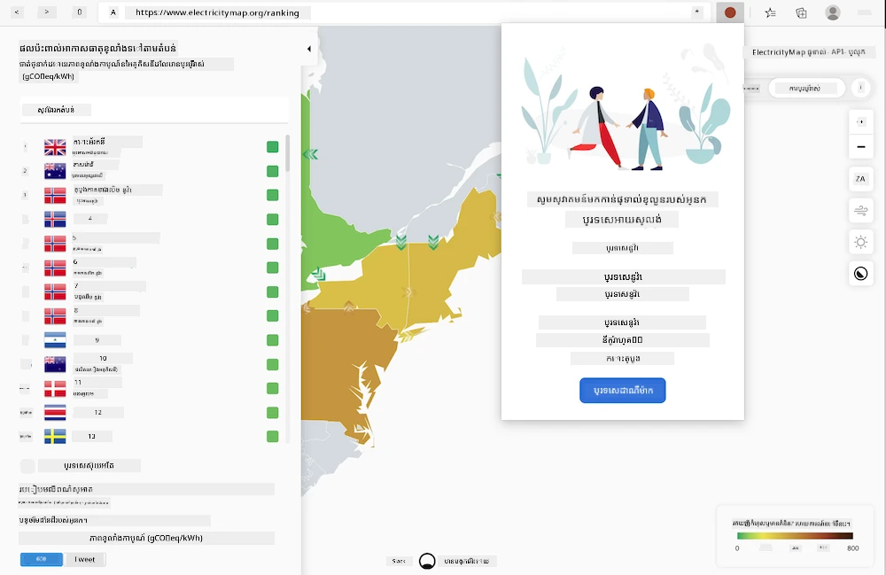
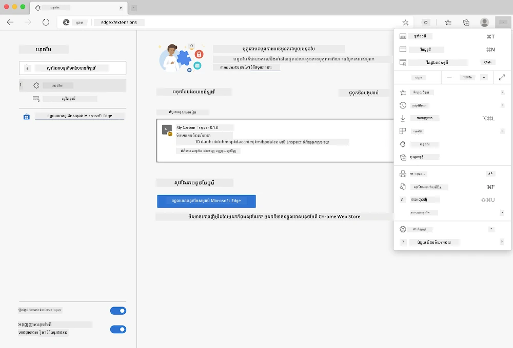

# កាបូនត្រិហ្គឺរ ប្រូស្សឺររីង បន្ថែម៖ កូដបានបញ្ចប់

ប្រើ API CO2 Signal របស់ tmrow ដើម្បីតាមដានការប្រើប្រាស់ភ្លើង បង្កើតបន្ថែមក្នុងប្រោស៊ឺរមួយ ដើម្បីផ្ដល់ការជូនដំណឹងដល់អ្នកថា ការប្រើប្រាស់ថាមពលភ្លើងនៅតំបន់របស់អ្នកមានភាពធ្ងន់ធ្ងរប៉ុណ្នា។ ការប្រើប្រាស់បន្ថែមនេះ នឹងជួយអ្នកធ្វើការសម្រេចចិត្តលើសកម្មភាពរបស់អ្នក ដោយផ្អែកលើព័ត៌មាននេះ។



## ចាប់ផ្តើម

អ្នកត្រូវតែដំឡើង [npm](https://npmjs.com)។ បញ្ចូលកូដនេះចម្លងមួយទៅក្នុងថតនៅលើកុំព្យូទ័រផ្ទាល់ខ្លួន។

ដំឡើងឧបករណ៍ទាំងអស់ដែលចាំបាច់៖

```
npm install
```

បង្កើតបន្ថែមជាមួយ webpack

```
npm run build
```

ដើម្បីតំឡើងលើ Edge ប្រើមនុវត្ត 'បីចុច' ក្នុងមឺនុយខាងលើស្តាំនៃប្រោស៊ឺរដើម្បីស្វែងរកផ្ទាំងបន្ថែម។ ពីទីនោះជ្រើសរើស 'load unpacked' ដើម្បីផ្ទុកបន្ថែមថ្មី។ នៅក្នុងការដាក់បញ្ចូល បើកថត 'dist' ហើយបន្ថែមនឹងត្រូវផ្ទុក។ ដើម្បីប្រើការបន្ថែម អ្នកត្រូវការខ្នEu API សំរាប់ CO2 Signal ([ទទួលបានខ្នEu API តាមអ៊ីមែលនៅទីនេះ](https://www.co2snal.com/) - បញ្ចូលអ៊ីមែលរបស់អ្នកក្នុងប្រអប់លើទំព័រនេះ) និង [កូដសំរាប់តំបន់របស់អ្នក](http://api.electricitymap.org/v3/zones) នៃ [ElectricityMap](https://www.electricitymap.org/map) (ឧទាហរណ៍ នៅប៉ូស្ទុន ខ្ញុំប្រើ 'US-NEISO').



បន្ទាប់ពីបញ្ចូលខ្នEu API និងតំបន់ចូលទៅក្នុងចំណុចបន្ថែម វាកំណត់ហេតុភ្នាក់ងាររបស់ប្រោស៊ឺរត្រូវបង្ហាញចំណុចពណ៌ ដែលបង្ហាញពីការប្រើប្រាស់ថាមពលនៅតំបន់របស់អ្នក ហើយផ្ដល់សញ្ញាបង្ហាញថា សកម្មភាពណាដែលច្រើនថាមពលគួរអោយចាប់អារម្មណ៍ចំពោះសមត្ថភាពរបស់អ្នក។ គំនិតនៅពីក្រោយប្រព័ន្ធ 'ចំណុច' នេះ ប្រើមកពី [Energy Lollipop Extension](https://energylollipop.com/) សម្រាប់ការបញ្ចេញឧស្ម័នក្នុងរដ្ឋ​កាលីហ្វ័រញា។

---

<!-- CO-OP TRANSLATOR DISCLAIMER START -->
**ការអះអាង**៖  
ឯកសារនេះបានបកប្រែដោយប្រើសេវាកម្មបកប្រែ AI [Co-op Translator](https://github.com/Azure/co-op-translator)។ ខណៈពេលយើងខិតខំប្រឹងប្រែងដើម្បីភាពត្រឹមត្រូវ សូមយកចិត្តទុកដាក់ថា បកប្រែដោយស្វ័យប្រវត្តិអាចមានកំហុស ឬការខកខានខ្លះៗ។ ឯកសារដើមក្នុងភាសាមុនគួរត្រូវបានគេយកជាអង្គភាពដែលមានសិទ្ធិផ្លូវការជាចម្បង។ សម្រាប់ព័ត៌មានសំខាន់ៗ អនុសាសន៍អោយបកប្រែម្តងទៀតដោយអ្នកជំនាញមនុស្ស។ យើងមិនទទួលខុសត្រូវចំពោះការយល់ច្រឡំ ឬការបកស្រាយខុសពីការប្រើប្រាស់បកប្រែនេះទេ។
<!-- CO-OP TRANSLATOR DISCLAIMER END -->