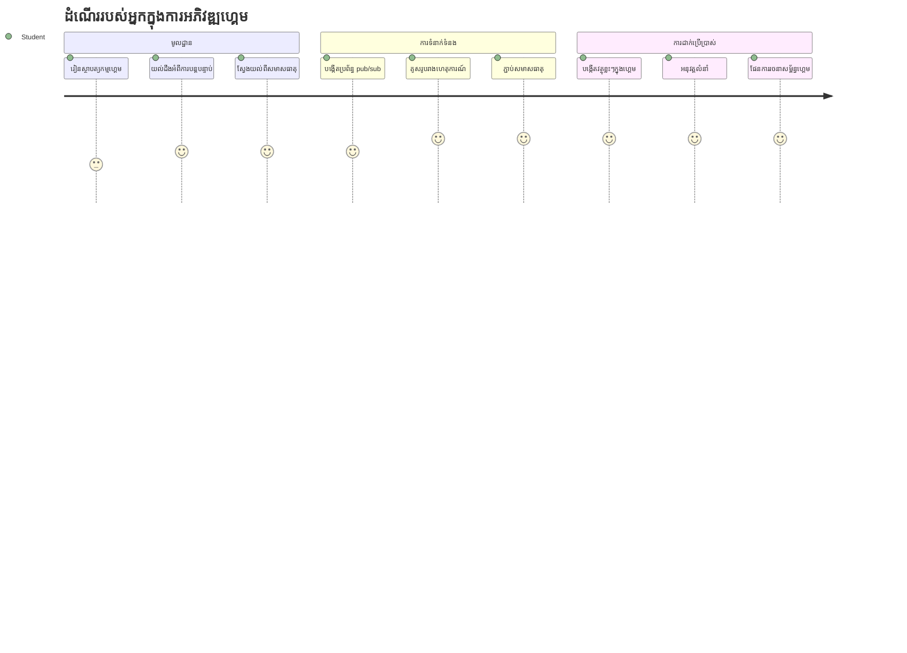
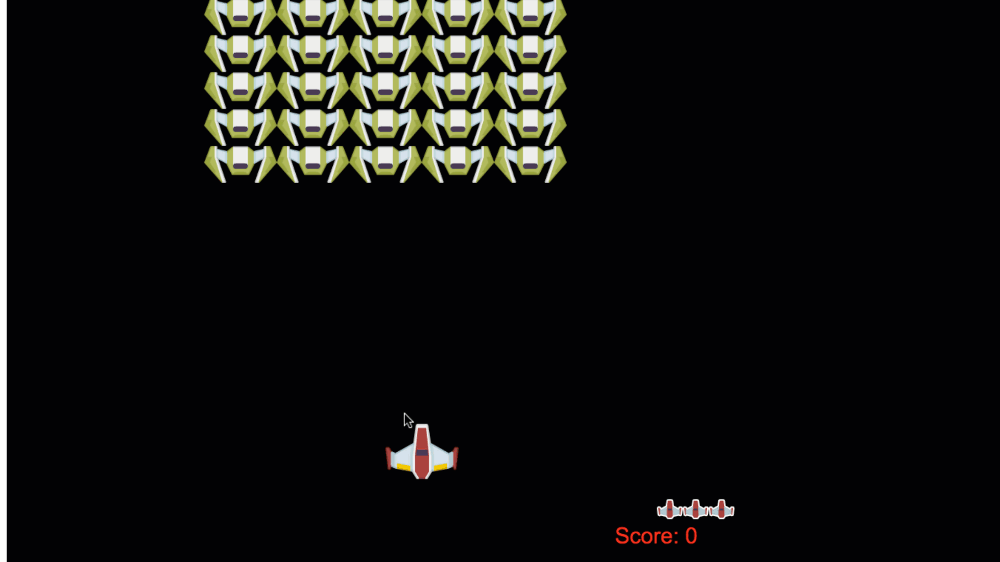
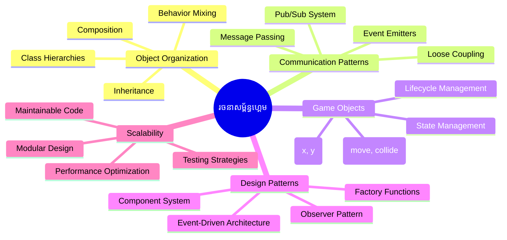
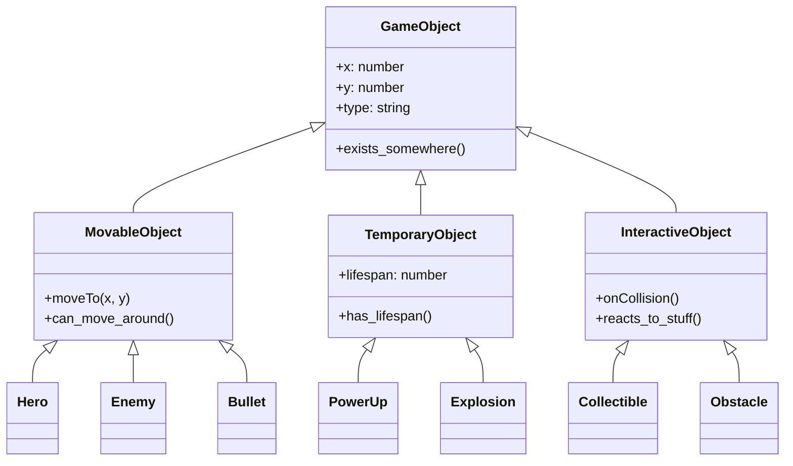
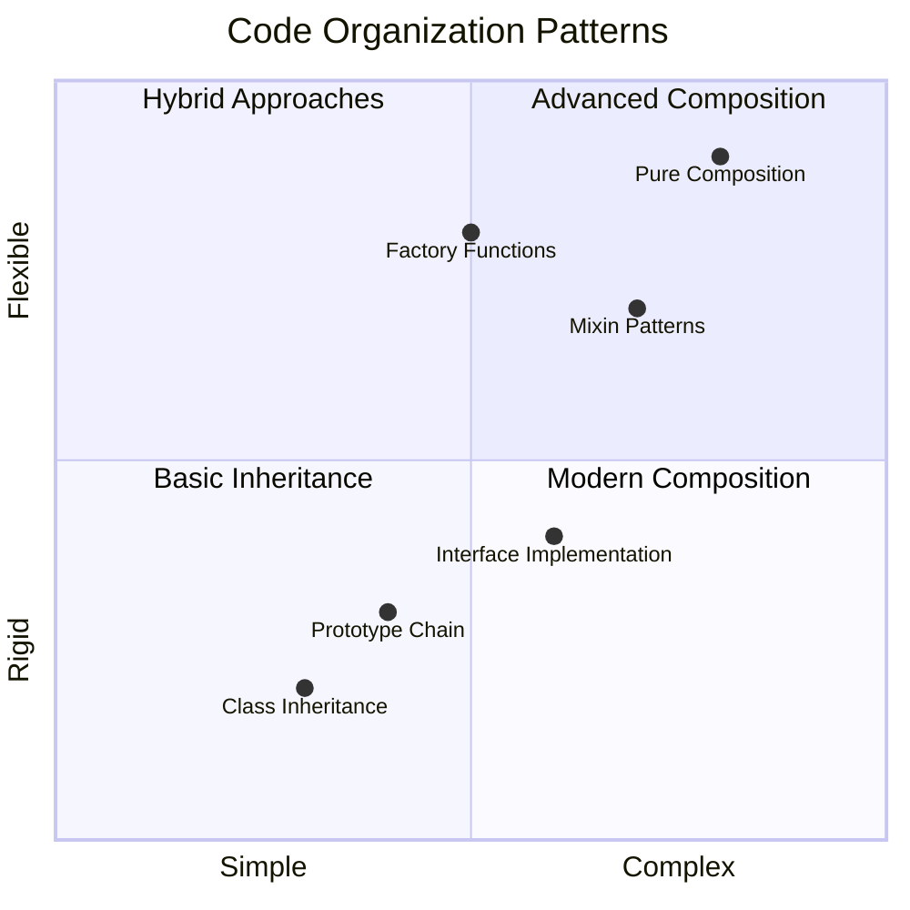
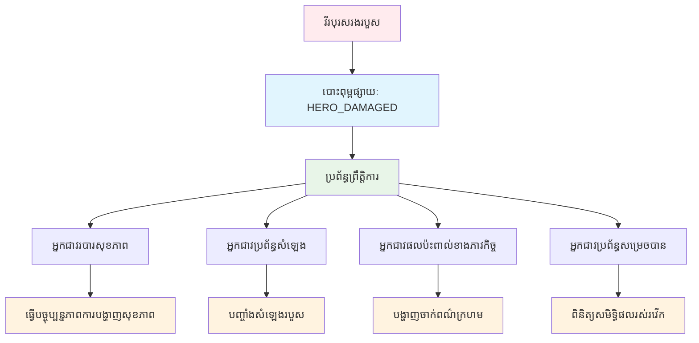
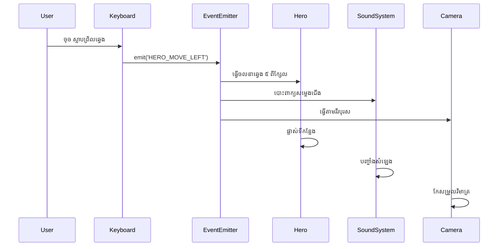
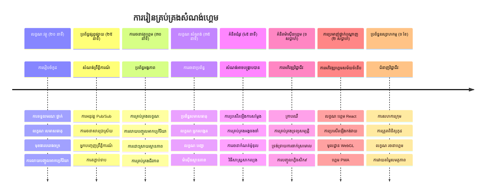

# បង្កើតហ្គេមអន្ដរជាតិតំបន់ផ្នែកទី 1៖ ការណែនាំ




ដូចជាការគ្រប់គ្រងបេសកកម្ម NASA ដែលសម្របសម្រួលប្រព័ន្ធជាច្រើនក្នុងពេលដើរចេញពីគោលដៅអាកាសយាន្ត យើងនឹងបង្កើតហ្គេមអន្ដរជាតិមួយដែលបង្ហាញពីរបៀបដែលផ្នែកផ្សេងៗនៃកម្មវិធីអាចធ្វើការជាមួយគ្នាបានយ៉ាងរលូន។ ខណៈដែលបង្កើតអ្វីមួយដែលអ្នកអាចលេងបានពិតប្រាកដ អ្នកនឹងរៀនពីគំនិតកម្មវិធីសំខាន់ៗដែលអាចអនុវត្តទៅលើគម្រោងកម្មវិធីណាមួយ។

យើងនឹងស្វែងរកវិធីសាស្រ្តមូលដ្ឋានពីរយ៉ាងសម្រាប់រៀបចំកូដ៖ ការទទួលមរណភាព និងការរៀបចំផ្សំ។ វាមិនមែនជាគំនិតវិទ្យាសាស្ត្រផ្ទាល់ទេ - វាជារចនាប័ទ្មដដែលដែលគ្រប់គ្រងចាប់ពីហ្គេមវីដេអូទៅប្រព័ន្ធធនាគារ។ យើងនឹងអនុវត្តប្រព័ន្ធចែកចាយព័ត៌មានដែលហៅថា pub/sub ដែលដំណើរការដូចបណ្តាញទំនាក់ទំនងរបស់យានអាកាស ដែលអនុញាតិឱ្យគ្រឿងផ្សំផ្សេងៗចែករំលែកព័ត៌មានដោយមិនបង្កើតការពឹងផ្អែក។

នៅចុងបញ្ជីនេះ អ្នកនឹងយល់ពីរបៀបបង្កើតកម្មវិធីដែលអាចពង្រីកនិងបន្តអភិវឌ្ឍបាន – មិនថាអ្នកកំពុងអភិវឌ្ឍហ្គេម កម្មវិប័ណ្ឌ វេបសាយ ឬប្រព័ន្ធកម្មវិធីណាមួយ។


## សំណួរប្រឡងមុនវគ្គ

[សំណួរប្រឡងមុនវគ្គ](https://ff-quizzes.netlify.app/web/quiz/29)

## ការទទួលមរណភាព និងការរៀបចំផ្សំក្នុងការអភិវឌ្ឍហ្គេម

នៅពេលគម្រោងកើនឡើងពីកម្រិតស្មុគស្មាញ ការរៀបចំកូដក្លាយជារឿងទាក់ទាញ។ អ្វី​ដែលចាប់ផ្តើមជាស្ព្រីបតូចមួយអាចក្លាយទៅជាការលំបាកក្នុងការថែទាំដោយគ្មានរចនាសម្ព័ន្ធត្រឹមត្រូវ - ដូចជាការបេសកកម្ម Apollo ដែលមានការសម្របសម្រួលយ៉ាងច្របូកច្របល់រវាងបណ្តារជាច្រើននៃគ្រឿងផ្សំ។

យើងនឹងស្វែងរកវិធីសាស្រ្តមូលដ្ឋានពីរសម្រាប់រៀបចំកូដ៖ ការទទួលមរណភាព និងការរៀបចំផ្សំ។ ពីរវិធីនេះមានអត្ថប្រយោជន៍ជាក់លាក់ ហើយការយល់ដឹងទាំងពីរជួយអ្នកជ្រើសរើសវិធីសមរម្យសម្រាប់ស្ថានភាពផ្សេងៗ។ យើងនឹងបង្ហាញគំនិតទាំងនេះតាមរយៈហ្គេមអន្ដរជាតិនេះ ដែលតួអង្គវីរបុរស សត្រូវ ផលិតផលថាមពល និងវត្ថុផ្សេងទៀតត្រូវប្រតិបត្តិការជាមួយគ្នាដោយមានប្រសិទ្ធភាព។

✅ សៀវភៅកម្មវិធីដែលល្បីល្បាញបំផុតមួយមានបន្ទុកចំពោះ [លំនាំរចនា](https://en.wikipedia.org/wiki/Design_Patterns)។

ក្នុងហ្គេមណាមួយ អ្នកមាន `វត្ថុហ្គេម` – ធាតុអន្តរាគមន៍ដែលបង្កប់ក្នុងពិភពហ្គេមរបស់អ្នក។ វីរបុរស សត្រូវ ផលិតផលថាមពល និងប្រសិទ្ធិការមើលទាំងអស់គឺជាវត្ថុហ្គេម។ រាល់វត្ថុមានទីតាំងជាក់លាក់លើអេក្រង់ដោយប្រើតម្លៃ `x` និង `y` ដូចជាការគូសចំណុចលើលំហបន្ទាត់ជាប់លេខរៀង។

ខណៈដែលមានការផ្សេងគ្នាផ្នែករូបរាង វត្ថុទាំងនេះជាញឹកញាប់ចែករំលែកទម្លាប់មូលដ្ឋាន៖

- **វាគឺមានទីតាំងនៅកន្លែងណាមួយ** – រាល់វត្ថុមានតម្លៃ x និង y ដើម្បីហ្គេមដឹងពីទីតាំងដើម្បីគូសវា
- **ជាច្រើនអាចផ្លាស់ទី** – វីរបុរសរត់ សត្រូវតាមក្រោម ពន្លត់បាញ់ឆ្ពោះទៅមុខ
- **វាមានអាយុកាល** – មានខ្លះនៅរយៈពេលវែង ក៏មានខ្លះ (ដូចការផ្ទុះ) ធ្លាប់ជាបណ្តោះអាសន្នហើយបាត់ខ្លួន
- **វាចម្លើយចំពោះអ្វីៗមួយ** – ពេលវត្ថុទំនិញ បណ្តាលការប៉ះ ប្រមូលផលិតផលថាមពល អាប់ដេតសុខភាព

✅ សូមគិតពីហ្គេមដូចជា Pac-Man។ តើអ្នកអាចស្គាល់ប្រភេទវត្ថុបួនដែលបានរាយការណ៍ខាងលើក្នុងហ្គេមនេះទេ?


### ការបង្ហាញទម្លាប់តាមរយៈកូដ

ឥឡូវនេះអ្នកយល់ពីទម្លាប់រួមរបស់វត្ថុហ្គេមហើយ តោះស្វែងរករបៀបអនុវត្តទម្លាប់ទាំងនេះនៅក្នុង JavaScript។ អ្នកអាចបង្ហាញទម្លាប់វត្ថុតាមវិធីដែលភ្ជាប់ជាមួយថ្នាក់ ឬវត្ថុមួយៗ ហើយមានវិធីជាច្រើនក្នុងការជ្រើសរើស។

**វិធីសាស្រ្តផ្អែកលើថ្នាក់**

ថ្នាក់និងការទទួលមរណភាពផ្តល់នូវវិធីសាស្រ្តរៀបចំវត្ថុហ្គេមយ៉ាងមានរចនាសម្ព័ន្ធ។ ដូចជាបទសម្គាល់ចំណាត់ថ្នាក់តាមវិទ្យាសាស្ត្រដែលបង្កើតដោយ Carl Linnaeus អ្នកចាប់ផ្តើមជាមួយថ្នាក់មូលដ្ឋានដែលមានគុណលក្ខណៈរួម បន្ទាប់មកបង្កើតថ្នាក់ជំនាញដែលទទួលមរណភាពគុណលក្ខណៈទាំងនេះ ហើយបន្ថែមសមត្ថភាពជាក់លាក់។

✅ ការទទួលមរណភាពជាគំនិតសំខាន់មួយដែលត្រូវយល់។ សូមរៀនបន្ថែមនៅលើ [អត្ថបទ MDN អំពី inheritance](https://developer.mozilla.org/docs/Web/JavaScript/Inheritance_and_the_prototype_chain)។

នេះជារបៀបដែលអ្នកអាចអនុវត្តវត្ថុហ្គេមដោយប្រើថ្នាក់ និងការទទួលមរណភាព៖

```javascript
// ជំហាន ១៖ បង្កើតថ្នាក់ GameObject មូលដ្ឋាន
class GameObject {
  constructor(x, y, type) {
    this.x = x;
    this.y = y;
    this.type = type;
  }
}
```

**មកបំបែកវាជាជំហាន៖**
- យើងកំពុងបង្កើតម៉ូដែលមូលដ្ឋានដែលរាល់វត្ថុហ្គេមអាចប្រើបាន
- កម្មវិធីកុងស្ត្រុកទុកទីតាំងរបស់វត្ថុ (`x`, `y`) និងប្រភេទវត្ថុ
- នេះក្លាយជាគ្រឹះមូលដ្ឋានដែលរាល់វត្ថុហ្គេមរបស់អ្នកនឹងអភិវឌ្ឍលើវា

```javascript
// ជំហានទី 2៖ បន្ថែមសមត្ថភាពចលនា​តាមរយៈការទទួលម្ដេច
class Movable extends GameObject {
  constructor(x, y, type) {
    super(x, y, type); // ហៅកុងស្ត្រាក់ទ័រ​ម្ដេច
  }

  // បន្ថែមសមត្ថភាពចល័ត​ទៅទីតាំងថ្មី
  moveTo(x, y) {
    this.x = x;
    this.y = y;
  }
}
```

**នៅលើនេះយើងបាន៖**
- **ពង្រីក** ថ្នាក់ GameObject ដើម្បីបន្ថែមមុខងារផ្លាស់ទី
- **ហៅ** កុងស្ត្រុកឪពុកម្តាយដោយប្រើ `super()` ដើម្បីចាប់ផ្តើមគុណលក្ខណៈទទួលមរណភាព
- **បន្ថែម** វិធីសាស្រ្ត `moveTo()` ដែលអាប់ដេតទីតាំងវត្ថុ

```javascript
// ជំហាន ៣៖ បង្កើតប្រភេទវត្ថុនៃហ្គេមជាក់លាក់
class Hero extends Movable {
  constructor(x, y) {
    super(x, y, 'Hero'); // កំណត់ប្រភេទដោយស្វ័យប្រវត្តិ
  }
}

class Tree extends GameObject {
  constructor(x, y) {
    super(x, y, 'Tree'); // មិនចាំបាច់ចល័តសម្រាប់ដើមឈើទេ
  }
}

// ជំហាន ៤៖ ប្រើវត្ថុនៃហ្គេមរបស់អ្នក
const hero = new Hero(0, 0);
hero.moveTo(5, 5); // វីរបុរសអាចចល័តបាន!

const tree = new Tree(10, 15);
// tree.moveTo() នឹងបង្ករបញ្ហា - ដើមឈើមិនអាចចល័តបាន
```

**យល់ពីគំនិតទាំងនេះ៖**
- **បង្កើត** ប្រភេទវត្ថុជំនាញដែលទទួលមរណភាពវិន័យសមរម្យ
- **បង្ហាញ** ថាការទទួលមរណភាពអនុញ្ញាតឲ្យរើសមុខងារប្រកបដោយជ្រើសរើស
- **បង្ហាញថា** វីរបុរសអាចផ្លាស់ទី ខណៈដែលដើមឈើនៅទីតាំងច្បាស់លាស់
- **បង្ហាញ** របៀបដែលរចនាសម្ព័ន្ធថ្នាក់បញ្ជាការផ្ទុយការសកម្មភាពមិនសមរម្យ

✅ ចំណាយពេលមួយភ្លែតដើម្បីយល់ពីវិធីដែលវីរបុរស Pac-Man (Inky, Pinky ឬ Blinky, ជាដើម) ត្រូវបានសរសេរជា JavaScript។

**វិធីសាស្រ្តរៀបចំផ្សំ**

ការរៀបចំផ្សំតាមទស្សនវិជ្ជារចនាដែលមានមូលដ្ឋានផ្នែក ប្រហែលដូចវិស្វកររចនាយានអាកាសដែលមានគ្រឿងផ្សំអាចប្តូរបាន។ ជំនួសការទទួលមរណភាពពីថ្នាក់មួយ អ្នកបញ្ចូលទម្លាប់ជាក់លាក់ដើម្បីបង្កើតវត្ថុដែលមានមុខងារត្រឹមត្រូវតែប៉ុណ្ណោះ។ វិធីសាស្រ្តនេះផ្តល់ភាពបត់បែនដោយគ្មានការរារាំងរឹងប៉ឹងក្នុងរបៀបតំបន់។

```javascript
// ជំហានទី 1៖ បង្កើតវត្ថុអាកប្បកិរិយាគំរូ
const gameObject = {
  x: 0,
  y: 0,
  type: ''
};

const movable = {
  moveTo(x, y) {
    this.x = x;
    this.y = y;
  }
};
```

**កូដនេះធ្វើអ្វី៖**
- **កំណត់** វត្ថុមូលដ្ឋាន `gameObject` មានទីតាំង និងគុណលក្ខណៈប្រភេទ
- **បង្កើត** វត្ថុទម្លាប់ `movable` ដែលមានមុខងារផ្លាស់ទី
- **បំបែក** ការរំពឹងទុកដោយរក្សាទិន្នន័យទីតាំង និងការប្រតិបត្តិផ្លាស់ទីឯករាជ្យ

```javascript
// ជំហ៊ានទី ២៖ បង្កើតវត្ថុដោយផ្សំលំនាំអាកប្បកិរិយា
const movableObject = { ...gameObject, ...movable };

// ជំហ៊ានទី ៣៖ បង្កើតមុខងារផលិតសម្រាប់ប្រភេទវត្ថុផ្សេងៗ
function createHero(x, y) {
  return {
    ...movableObject,
    x,
    y,
    type: 'Hero'
  };
}

function createStatic(x, y, type) {
  return {
    ...gameObject,
    x,
    y,
    type
  };
}
```

**នៅលើនេះយើងបាន៖**
- **រួមបញ្ចូល** គុណលក្ខណៈវត្ថុមូលដ្ឋាន ជាមួយទម្លាប់ផ្លាស់ទីដោយប្រើសំរួល spread
- **បង្កើត** មុខងារប្រាក់រោងចក្រ ដែលត្រឡប់វត្ថុប្ដូរតាមតម្រូវការ
- **អនុញ្ញាត** ការបង្កើតវត្ថុបត់បែនដោយគ្មានតំបន់ថ្នាក់រឹង
- **អនុញ្ញាត** វត្ថុមានទម្លាប់ត្រឹមត្រូវតាមដែលខ្លួនត្រូវការ

```javascript
// ជំហាន 4: បង្កើត និងប្រើវត្ថុដែលអ្នកបានសម្រួល
const hero = createHero(10, 10);
hero.moveTo(5, 5); // ធ្វើការ​បានល្អឥតខ្ចោះ!

const tree = createStatic(0, 0, 'Tree');
// tree.moveTo() មិនបានកំណត់ - មិនមានអាកប្បកិរិយាចលនាដែលត្រូវបានសម្រួលទេ
```

**ចំណុចសំខាន់ៗដើម្បីចាំបាច់៖**
- **រៀបចំ** វត្ថុដោយការលាយទម្លាប់ជាជំនួសការទទួលមរណភាព
- **ផ្តល់** ភាពបត់បែនច្រើនជាងសំណុំរចនាសម្ព័ន្ធថ្នាក់រឹង
- **អាចអនុញ្ញាត** វត្ថុមានមុខងារត្រឹមត្រូវតាមតម្រូវការ
- **ប្រើ** សំរួល spread របស់ JavaScript ទំនើបដើម្បីបញ្ចូលវត្ថុខ្ពស់ស្អាត
```

**Which Pattern Should You Choose?**

**Which Pattern Should You Choose?**



> 💡 **អនុសាសន៍ជំនាញ**៖ ទាំងពីររចនាប័ទ្មមានទីតាំងនែនាផ្លូវចំណាត់ថ្នាក់ JavaScript ពេលថ្មីៗ។ ថ្នាក់សាកសមសម្រាប់ជាប្រភេទដែលកំណត់ច្បាស់ តែការរៀបចំផ្សំមានភាពលេចធ្លោក្នុងពេលដែលអ្នកត្រូវការភាពបត់បែនខ្ពស់បំផុត។
> 
**នេះជាពេលដែលត្រូវប្រើវីធីសាស្រ្តណាមួយ៖**
- **ជ្រើសរើស** ការទទួលមរណភាពពេលមានទំនាក់ទំនង "គឺជា" ច្បាស់លាស់ (Hero *គឺជា* វត្ថុ Movable)
- **ជ្រើសរើស** ការរៀបចំផ្សំពេលអ្នកត្រូវការទំនាក់ទំនង "មាន" (Hero *មាន* សមត្ថភាពផ្លាស់ទី)
- **គិតពី** ចំណូលចិត្តក្រុម និងតម្រូវការគម្រោងរបស់អ្នក
- **ចងចាំ** អ្នកអាចលាយពីរបៀបទាំងពីរនៅក្នុងកម្មវិធីតែមួយ

### 🔄 **ពិនិត្យការបង្រៀន**
**ការយល់ដឹងអំពីការរៀបចំវត្ថុ**៖ មុនចូលទៅរបៀបទំនាក់ទំនង សូមផ្ទៀងផ្ទាត់ថាអ្នកអាច៖
- ✅ ពណ៌នាពន្យល់ភាពខុសគ្នារវាងការទទួលមរណភាព និងការរៀបចំផ្សំ
- ✅ ស្គាល់ពេលណាត្រូវប្រើថ្នាក់ ឬមុខងារប្រក.Factory
- ✅ យល់ពីរបៀបដែលពាក្យគន្លឹះ `super()` ធ្វើការជាមួយការទទួលមរណភាព
- ✅ ទទួលស្គាល់អត្ថប្រយោជន៍នៃវិធីសាស្រ្តទាំងពីរសម្រាប់ការអភិវឌ្ឍហ្គេម

**សំណួរផ្ទាល់ខ្លួនរហ័ស**៖ តើធ្វើដូចម្តេចដើម្បីបង្កើតសត្រូវបង្វិលមួយដែលអាចផ្លាស់ទីនិងហោះហើរបាន?
- **វិធីសាស្រ្តទទួលមរណភាព**៖ `class FlyingEnemy extends Movable`
- **វិធីសាស្រ្តរៀបចំផ្សំ**៖ `{ ...movable, ...flyable, ...gameObject }`

**ការតភ្ជាប់ពីពិភពពិត**៖ រចនាប័ទ្មទាំងនេះបង្ហាញនៅគ្រប់ទីកន្លែង:
- **គ្រឿងផ្សំ React**៖ Props (composition) ជាមួយការទទួលមរណភាពថ្នាក់
- **ម៉ាស៊ីនហ្គេម**៖ ប្រព័ន្ធ entity-component ប្រើរៀបចំផ្សំ
- **កម្មវិធីទូរស័ព្ទចល័ត**៖ ស៊ុម UI ជាញឹកញាប់ប្រើរៀបចំផ្សំ

## រចនាប័ទ្មទំនាក់ទំនង៖ ប្រព័ន្ធ Pub/Sub

ពេលកម្មវិធីកាន់តែស្មុគស្មាញ ការត្រួតពិនិត្យទំនាក់ទំនងរវាងគ្រឿងផ្សំក្លាយទៅជាការលំបាក។ រចនាប័ទ្មផ្សព្វផ្សាយ-ជាវិភាគ់ (pub/sub) ដោះស្រាយបញ្ហានេះដោយប្រើ اصول ដូចជា វិទ្យុផ្សាយសំឡេង - អ្នកផ្សព្វផ្សាយតែមួយអាចទាក់ទងទៅអ្នកទទួលជាច្រើនដោយមិនចេះថាអ្នកកំពុងស្តាប់កំពុងជាអ្នកណា។

គិតពីពេលដែលវីរបុរសទទួលការខូចខាត៖ កញ្ចប់សុខភាពអាប់ដេត បទភ្លេងលេង អារម្មណ៍វិជ្ជមានបង្ហាញ។ ជំនួសការតភ្ជាប់វត្ថុវីរបុរសដោយផ្ទាល់ទៅប្រព័ន្ធទាំងនេះ តំបន់ pub/sub អនុញ្ញាតឲ្យវីរបុរសផ្សាយសារ "បានទទួលការខូចខាត"។ ប្រព័ន្ធណាមួយដែលត្រូវការឆ្លើយតបអាចជាវវិធីសាស្រ្តដើម្បីទទួលសារនេះហើយប្រតិបត្តិការតាមបែបតែម្តង។

✅ **Pub/Sub** មានន័យថា 'ផ្សព្វផ្សាយ-ជាវិភាគ់'


### ការយល់ដឹងអំពីស្ថាបត្យកម្ម Pub/Sub

រចនាប័ទ្ម pub/sub រក្សាផ្នែកផ្សេងៗនៅក្នុងកម្មវិធីរបស់អ្នកឲ្យស្រាលៗគ្នា មានន័យថាពួកវាអាចធ្វើការជាមួយគ្នាបានដោយមិនពឹងផ្អែកផ្ទាល់គ្នា។ ការបំបែកនេះធ្វើឲ្យកូដរបស់អ្នកងាយស្រួលថែទាំ តេស្ត និងបត់បែនចំពោះការផ្លាស់ប្តូរ។

**តួអង្គសំខាន់ក្នុង pub/sub៖**
- **សារ** – ស្លាកអក្សរងាយស្រួល ដូចជា `'PLAYER_SCORED'` ដែលពិពណ៌នាព្រឹត្តិការណ៍ (រួមទាំងព័ត៌មានបន្ថែម)
- **អ្នកផ្សព្វផ្សាយ** – វត្ថុដែល ប្រកាស "មានអ្វីមួយកើតឡើង!" ទៅអ្នកស្ដាប់ទាំងអស់
- **អ្នកជាវ** – វត្ថុដែលនិយាយថា "ខ្ញុំចាប់អារម្មណ៍ចំពោះព្រឹត្តិការណ៍នេះ" ហើយបំពាននៅពេលវាកើតឡើង
- **ប្រព័ន្ធព្រឹត្តិការណ៍** – មនុស្សកណ្តាលដែលធ្វើឲ្យប្រាកដថាសារទៅដល់អ្នកស្ដាប់ត្រឹមត្រូវ

### បង្កើតប្រព័ន្ធព្រឹត្តិការណ៍

មកបង្កើតប្រព័ន្ធព្រឹត្តិការណ៍សាមញ្ញមួយដែលបង្ហាញគំនិតទាំងនេះ៖

```javascript
// ជំហានទី ១: បង្កើតថ្នាក់ EventEmitter
class EventEmitter {
  constructor() {
    this.listeners = {}; // ទុកអ្នកស្តាប់ព្រឹត្តិការណ៍ទាំងអស់
  }
  
  // ចុះឈ្មោះអ្នកស្តាប់សម្រាប់ប្រភេទសារ নির্দিষ্ট
  on(message, listener) {
    if (!this.listeners[message]) {
      this.listeners[message] = [];
    }
    this.listeners[message].push(listener);
  }
  
  // ទើបសារទៅអ្នកស្តាប់ដែលចុះឈ្មោះទាំងអស់
  emit(message, payload = null) {
    if (this.listeners[message]) {
      this.listeners[message].forEach(listener => {
        listener(message, payload);
      });
    }
  }
}
```

**បំបែកអ្វីកើតឡើងនៅទីនេះ៖**
- **បង្កើត** ប្រព័ន្ធគ្រប់គ្រងព្រឹត្តិការណ៍មួយដោយប្រើថ្នាក់សាមញ្ញ
- **រក្សាទុក** អ្នកស្ដាប់ក្នុងវត្ថុការរៀបចំតាមប្រភេទសារ
- **ចុះឈ្មោះ** អ្នកស្ដាប់ថ្មីដោយប្រើវិធីសាស្រ្ត `on()`
- **ផ្សព្វផ្សាយ** សារទៅអ្នកស្ដាប់ទាំងអស់ដោយប្រើ `emit()`
- **គាំទ្រ** ទិន្នន័យបន្ថែម បញ្ជូនព័ត៌មានសំខាន់

### ផ្ដុំគ្នាទំរង់៖ ឧទាហរណ៍ជាក់ស្តែង

មកមើលវាយទេ! យើងនឹងបង្កើតប្រព័ន្ធផ្លាស់ទីសាមញ្ញមួយដែលបង្ហាញពីភាពស្អាតចុះបត់បែននៃ pub/sub៖

```javascript
// ជំហានទី ១៖ កំណត់ប្រភេទសាររបស់អ្នក
const Messages = {
  HERO_MOVE_LEFT: 'HERO_MOVE_LEFT',
  HERO_MOVE_RIGHT: 'HERO_MOVE_RIGHT',
  ENEMY_SPOTTED: 'ENEMY_SPOTTED'
};

// ជំហានទី ២៖ បង្កើតប្រព័ន្ធព្រឹត្តិការណ៍ និងវត្ថុហ្គេមរបស់អ្នក
const eventEmitter = new EventEmitter();
const hero = createHero(0, 0);
```

**កូដនឹងធ្វើអ្វី៖**
- **កំណត់** វត្ថុខ(constants) មួយដើម្បីទប់ស្កាត់កំហុសនៅឈ្មោះសារ
- **បង្កើត** អ្នកផ្សព្វផ្សាយព្រឹត្តិការណ៍មួយសម្រាប់គ្រប់ទំនាក់ទំនង
- **ចាប់ផ្តើម** វត្ថុវីរបុរសនៅទីតាំងចាប់ផ្តើម

```javascript
// ជំហ៊ានទី ៣៖ តំឡើងអ្នកស្ដាប់ព្រឹត្តិការណ៍ (អ្នកជាវ)
eventEmitter.on(Messages.HERO_MOVE_LEFT, () => {
  hero.moveTo(hero.x - 5, hero.y);
  console.log(`Hero moved to position: ${hero.x}, ${hero.y}`);
});

eventEmitter.on(Messages.HERO_MOVE_RIGHT, () => {
  hero.moveTo(hero.x + 5, hero.y);
  console.log(`Hero moved to position: ${hero.x}, ${hero.y}`);
});
```

**នៅលើនេះយើងបាន៖**
- **ចុះឈ្មោះ** អ្នកស្ដាប់ព្រឹត្តិការណ៍ដែលបញ្ជូនប្រែប្រួលការផ្លាស់ទី
- **ធ្វើឲ្យ** ទីតាំងវីរបុរសកែប្រែទៅតាមទិសផ្លាស់ទី
- **បន្ថែម** ការចុះកំណត់ក្នុងកុងសូលដើម្បីតាមដានទីតាំងវីរបុរស
- **បំបែក** វិធីសាស្រ្តផ្លាស់ទីពីការគ្រប់គ្រងបញ្ចូល

```javascript
// ជំហាន ៤៖ភ្ជាប់ការបញ្ចូលក្តារចុចទៅនឹងព្រឹត្តិការណ៍ (អ្នកផ្សព្វផ្សាយ)
window.addEventListener('keydown', (event) => {
  switch(event.key) {
    case 'ArrowLeft':
      eventEmitter.emit(Messages.HERO_MOVE_LEFT);
      break;
    case 'ArrowRight':
      eventEmitter.emit(Messages.HERO_MOVE_RIGHT);
      break;
  }
});
```

**យល់ពីគំនិតទាំងនេះ៖**
- **ភ្ជាប់** ការបញ្ចូលក្តារចុចទៅព្រឹត្តិការណ៍ហ្គេមដោយគ្មានការភ្ជាប់ជាប់រឹង
- **អនុញ្ញាត** ប្រព័ន្ធបញ្ចូលធ្វើការទំនាក់ទំនងជាមួយវត្ថុហ្គេមដោយផ្លូវមិនផ្ទាល់
- **អនុញ្ញាត** ប្រព័ន្ធជាច្រើនឆ្លើយតបទៅព្រឹត្តិការណ៍ក្តារចុចដូចគ្នា
- **ធ្វើឲ្យ** វាយកម្ចាស់ក្តារចុច ឬបន្ថែមវិធីថ្មីបានយ៉ាងងាយស្រួល


> 💡 **អនុសាសន៍ជំនាញ**៖ រូបមន្តល្អនៃរចនាប័ទ្មនេះគឺភាពបត់បែន! អ្នកអាចបន្ថែមសំឡេងផ្លូវ ប្រព័ន្ធការញញឹមអេក្រង់ ឬផលបរិច្ឆេទបានដោយបន្ថែមអ្នកស្ដាប់ព្រឹត្តិការណ៍បន្ថែម – មិនចាំបាច់កែសម្រួលកូដក្តារចុច ឬផ្លាស់ទីដែលមានរួចទេ។
> 
**ហេតុអ្វីបានជាអ្នកនឹងស្រលាញ់វិធីសាស្រ្តនេះ៖**
- ការបន្ថែមមុខងារថ្មីក្លាយទៅជាងាយស្រួល – គ្រាន់តែស្តាប់ព្រឹត្តិការណ៍ដែលអ្នកចាប់អារម្មណ៍
- មានរឿងជាច្រើនអាចឆ្លើយតបទៅព្រឹត្តិការណ៍ដូចគ្នាបានដោយមិនប៉ះទង្គិចគ្នា
- ការតេស្តក្លាយជាប្រសើរជាងមុនព្រោះគ្រឿងផ្សំគ្រប់គ្នាដំណើរការឯករាជ្យ
- ពេលមានបញ្ហា អ្នកដឹងបានច្បាស់កន្លែងត្រូវមើល

### ហេតុអ្វី pub/sub ពង្រីកបានយ៉ាងមានប្រសិទ្ធភាព

រចនាប័ទ្ម pub/sub រក្សាប្រសិទ្ធភាពនៅពេលកម្មវិធីកើនឡើងពីកម្រិតស្មុគស្មាញ។ មិនថាការគ្រប់គ្រងសត្រូវរាប់ទសភាគ ចុះអាប់ដេត UI دينامیکی ឬប្រព័ន្ធសំឡេង រចនាប័ទ្មនេះគ្រប់គ្រងកម្រិតសកម្មភាពដោយមិនបូកបញ្ចូលចរន្តរចនាសម្ព័ន្ធ។ មុខងារថ្មីអាចបញ្ចូលក្នុងប្រព័ន្ធព្រឹត្តិការណ៍ជាក់ស្តែងដោយមិនប៉ះពាល់លើមុខងារដែលបានកំណត់រួច។

> ⚠️ **កំហុសទូទៅ**៖ កុំនមានការបង្កើតប្រភេទសារជាក់លាក់ច្រើនពេកនៅដើម។ ចាប់ផ្តើមជាមួយប្រភេទទូលំទូលាយ ហើយពិនិត្យកែលម្អវា នៅពេលដែលតម្រូវការហ្គេមច្បាស់លាស់ឡើង។
> 
**អនុវត្តការស្វែងរកល្អ៖**
- **ក្រុម** សារទាក់ទងជា់វគ្គចំណាត់ថ្នាក់សមរម្យ
- **ប្រើ** ឈ្មោះពិពណ៌នាច្បាស់លាស់បង្ហាញអ្វីកើតឡើង
- **រក្សា** ទម្រង់សារេីយៗឲ្យសាមញ្ញ និងម្កុដ
- **ចុះថ្នាក់** ប្រភេទសាររបស់អ្នកសម្រាប់ការសហការក្រុម

### 🔄 **ពិនិត្យការបង្រៀន**
**ការយល់ដឹងអំពីស្ថាបត្យកម្មដែលផ្អែកលើព្រឹត្តិការណ៍**៖ ផ្ទៀងផ្ទាត់ការយល់ដឹងរបស់អ្នក៖
- ✅ រចនាប័ទ្ម pub/sub ធ្វើឲ្យមានការពារការភ្ជាប់រឹងរបស់វត្ថុផ្សេងៗដោយរបៀបណា?
- ✅ ហេតុអ្វីវាអាចធ្វើឲ្យការបន្ថែមមុខងារថ្មីកាន់តែងាយស្រួលនៅក្នុងស្ថាបត្យកម្មដែលផ្អែកលើព្រឹត្តិការណ៍?
- ✅ តួអង្គ EventEmitter សម្តែងតួនាទីដូចម្តេចក្នុងចរន្តនៃការទំនាក់ទំនង?
- ✅ តើកាលពីការបម្រុងទុកសារជាការដឹងទិដ្ឋភាព បង្កើតកំហុសនិងធ្វើឲ្យមានការថែទាំល្អប្រសើរបែបណា?

**បញ្ហារចនាប័ទ្​ម**៖ តើអ្នកនឹងដោះស្រាយស្ថានការណ៍ហ្គេមខាងក្រោមដោយប្រើ pub/sub ដូចម្តេច?
1. **សត្រូវស្លាប់**៖ បន្ថែមពិន្ទុ លេងសំឡេង បង្កើតផលិតផលថាមពល ដកចេញពីអេក្រង់
2. **ជំនាន់រួចរាល់**៖ បញ្ឈប់តន្ត្រី បង្ហាញ UI រក្សាទុក ដំណើរការបន្ទាប់
3. **ផលិតផលថាមពលបានប្រមូល**៖ កែលម្អសមត្ថភាព អាប់ដេត UI លេងផលប៉ៈពាល់ ចាប់ផ្តើមម៉ោងរាប់

**ការតភ្ជាប់ពីវិស័យជំនាញ**៖ រចនាប័ទ្មនេះបង្ហាញនៅក្នុង៖
- **លំនាំ UI មុខមាត់មុខ**៖ ប្រព័ន្ធព្រឹត្តិការណ៍ React/Vue
- **សេវាកម្មផ្នែកខាងក្រោយ**៖ ទំនាក់ទំនងសេវាខ្នាតតូច
- **ម៉ាស៊ីនហ្គេម**៖ ប្រព័ន្ធព្រឹត្តិការណ៍ Unity
- **ការអភិវឌ្ឍទូរស័ព្ទចល័ត**៖ ប្រព័ន្ធផ្សព្វផ្សាយ iOS/Android

---

## ប្រភពប្រាសិទ្ធិ GitHub Copilot Agent 🚀

ប្រើរបៀប Agent ដើម្បីបញ្ចប់បញ្ហាខាងក្រោម៖

**ពណ៌នា៖** បង្កើតប្រព័ន្ធវត្ថុហ្គេមសាមញ្ញមួយដោយប្រើទាំងការទទួលមរណភាពនិងរចនាប័ទ្ម pub/sub។ អ្នកនឹងអនុវត្តហ្គេមមូលដ្ឋានមួយ ដែលវត្ថុផ្សេងៗអាចទំនាក់ទំនងតាមព្រឹត្តិការណ៍ដោយគ្មានការជ្រាបពិតពីគ្នា។

**បំបាត់បំណង៖** បង្កើតប្រព័ន្ធហ្គេម JavaScript មានតម្រូវការ៖ 1) បង្កើតថ្នាក់មូលដ្ឋាន GameObject ជាមួយប្រវែងទីតាំង x, y និងគុណលក្ខណៈប្រភេទ។ 2) បង្កើតថ្នាក់ Hero ដែលពង្រីកពី GameObject និងអាចផ្លាស់ទីបាន។ 3) បង្កើតថ្នាក់ Enemy ដែលពង្រីកពី GameObject និងអាចតាមទ្រង់ទ្រាយ hero។ 4) អនុវត្តថ្នាក់ EventEmitter សម្រាប់រចនាបទ pub/sub។ 5) កំណត់អ្នកស្ដាប់ព្រឹត្តិការណ៍ ដើម្បីភ្លៅនៅពេល hero ផ្លាស់ទី សត្រូវជិតខាងទទួលសារតំណាង 'HERO_MOVED' ហើយធ្វើការអាប់ដេតទីតាំងរបស់ពួកវាដើម្បីចុះទៅជិត hero។ បញ្ចូលការចុះកំណត់ console.log ដើម្បីបង្ហាញការទំនាក់ទំនងរវាងវត្ថុ។

សូមស្វែងយល់បន្ថែមអំពី [របៀប agent](https://code.visualstudio.com/blogs/2025/02/24/introducing-copilot-agent-mode) នៅទីនេះ។

## 🚀 បញ្ហា


Consider how the pub-sub pattern can enhance game architecture. Identify which components should emit events and how the system should respond. Design a game concept and map out the communication patterns between its components.

## Post-Lecture Quiz

[Post-lecture quiz](https://ff-quizzes.netlify.app/web/quiz/30)

## Review & Self Study

Learn more about Pub/Sub by [reading about it](https://docs.microsoft.com/azure/architecture/patterns/publisher-subscriber/?WT.mc_id=academic-77807-sagibbon).

### ⚡ **អ្វីដែលអ្នកអាចធ្វើបានក្នុង 5 នាទីបន្ទាប់**
- [ ] បើកហ្គេម HTML5 ស្វ័យប្រវត្តិនៅលើអ៊ីនធឺណិត ហើយពិនិត្យកូដរបស់វា ដោយប្រើ DevTools
- [ ] បង្កើតធាតុ Canvas HTML5 ទីមួយ និងគូររូបរាងមូលដ្ឋានមួយ
- [ ] ព្យាយាមប្រើ `setInterval` ដើម្បីបង្កើតរង្វិលអានីម៉េស្យុងមួយដែលសាមញ្ញ
- [ ] ស្វែងយល់ពីឯកសារ Canvas API ហើយសាកល្បងវិធីគូរ

### 🎯 **អ្វីដែលអ្នកអាចសម្រេចបានក្នុងម៉ោងនេះ**
- [ ] បញ្ចប់វគ្គសំណួរបន្ទាប់ពេលសិក្សា ហើយយល់ពីគោលការណ៍អភិវឌ្ឍហ្គេម
- [ ] តំឡើងរចនាសម្ព័ន្ធគំរូគម្រោងហ្គេមរបស់អ្នកជាមួយឯកសារ HTML, CSS និង JavaScript
- [ ] បង្កើតរង្វិលហ្គេមមូលដ្ឋានដែលធ្វើបច្ចុប្បន្នភាពនិងបង្ហាញជាបន្តបន្ទាប់
- [ ] គូរផ្ទាំង sprite គម្រោងហ្គេមដំបូងរបស់អ្នកលើ canvas
- [ ] អនុវត្តការផ្ទុកទ្រព្យសម្បត្តិមូលដ្ឋានសម្រាប់រូបភាពនិងសំឡេង

### 📅 **ការបង្កើតហ្គេមរយៈគ្រួសារអ្នកក្នុងមួយសប្តាហ៍**
- [ ] បញ្ចប់ហ្គេមអាកាសពេញលេញទាំងអស់ជាមួយមុខងារដែលបានគ្រោងទុក
- [ ] បន្ថែមការរចនាហ្នឹងសំឡេងត្រឺមត្រូវ និងអានីម៉េស្យុងរលូន
- [ ] អនុវត្តស្ថានភាពហ្គេម (អេក្រង់ចាប់ផ្តើម, លំហ, បញ្ចប់ហ្គេម)
- [ ] បង្កើតប្រព័ន្ធពិន្ទុ និងតាមដានការរីកចម្រើនអ្នកលេង
- [ ] បង្កើតហ្គេមឲ្យឆ្លើយតប និងងាយស្រួលប្រើប្រាស់លើឧបករណ៍គ្រប់ប្រភេទ
- [ ] ចែករំលែកហ្គេមរបស់អ្នកនៅលើអ៊ីនធឺណិត និងទទួលមតិយោបល់ពីអ្នកលេង

### 🌟 **ការអភិវឌ្ឍហ្គេមរយៈខែរបស់អ្នក**
- [ ] បង្កើតហ្គេមច្រើនប្រភេទផ្សេងៗ និងស្វែងយល់ពីក្បាច់និងគ្រឹះមេកានិចខុសៗគ្នា
- [ ] រៀនគ្រប់គ្រងប្រាក់លើបណ្ដាញហ្គេមមួយដូចជា Phaser ឬ Three.js
- [ ] ចូលរួមអភិវឌ្ឍហ្គេមប្រភពបើក
- [ ] ជំនាញច្បាស់លាស់ចំពោះលំនាំកម្មវិធីហ្គេមកម្រិតខ្ពស់ និងការបង្កើតអូបទីម៉ីស្យុងល្អ
- [ ] បង្កើតកញ្ចប់បង្ហាញជំនាញអភិវឌ្ឍហ្គេមរបស់អ្នក
- [ ] ជួយណែនាំអ្នកដទៃដែលចាប់អារម្មណ៍លើការអភិវឌ្ឍហ្គេម និងមេឌੀਆអន្តរកម្ម

## 🎯 តារាងពេលវេលាការអភិវឌ្ឍហ្គេមរបស់អ្នក


### 🛠️ សេចក្តីសង្ខេបឧបករណ៍រចនាសម្ព័ន្ធហ្គេមរបស់អ្នក

បន្ទាប់ពីបញ្ចប់មេរៀននេះ អ្នកមាន:
- **ជំនាញលំនាំរចនាសម្ព័ន្ធ**: យល់ដឹងអំពីការប្រៀបធៀបរវាងការទទួលកូនក្រោម និងការភ្ជាប់រួម
- **រចនាសម្ព័ន្ធបើកហេតុការណ៍**: ការអនុវត្ត pub/sub សម្រាប់ការគរពិព្យាយាមដែលអាចពង្រីកបាន
- **រចនាសម្ព័ន្ធមុខវិជ្ជាដែលផ្អែកលើវត្ថុ**: ប្រលោមគ្នានិងការភ្ជាប់ឥរិយាបថ
- **JavaScript ទំនើប**: មុខងារ factory, រូបមន្តបម្រើ spread និងលំនាំ ES6+
- **រចនាសម្ព័ន្ធដែលអាចពង្រីកបាន**: ការភ្ជាប់ល្អប្រសើរនិងគោលការណ៍រចនាផ្នែក
- **មូលដ្ឋានអភិវឌ្ឍហ្គេម**: ប្រព័ន្ធអង្គភាពនិងលំនាំសមាសភាព
- **លំនាំវិជ្ជាជីវៈ**: វិធីសាស្ត្រប្រកបដោយទោលំឡើងសម្រាប់រៀបចំកូដ

**កម្មវិធីពិភពលោកពិតប្រាកដ**: លំនាំទាំងនេះអាចយកទៅប្រើប្រាស់ដោយတိုរួច:
- **ស្ទ្រីមមុខ**: រចនាសម្ព័ន្ធមុខ React/Vue និងការគ្រប់គ្រងរដ្ឋ
- **សេវាកម្មខាងក្រោយ**: ការប្រាស្រ័យទាក់ទងរវាងមីក្រូសេវាវិធីសាស្ត្រនិងប្រព័ន្ធបើកហេតុការណ៍
- **អភិវឌ្ឍន៍ចល័ត**: រចនាសម្ព័ន្ធកម្មវិធី iOS/Android និងប្រព័ន្ធផ្សព្វផ្សាយការជូនដំណឹង
- **ម៉ាស៊ីនហ្គេម**: Unity, Unreal និងការអភិវឌ្ឍហ្គេមលើវេបសាយ
- **កម្មវិធីសហគ្រាស**: ការសង្កត់ឆ្នោតហេតុការណ៍ និងការរចនាប្រព័ន្ធចែកចាយ
- **រចនាសម្ព័ន្ធ API**: សេវាកម្ម RESTful និងការប្រាស្រ័យទាក់ទងពេលវេលាពីព្រោះ

**ជំនាញវិជ្ជាជីវៈដែលអ្នកទទួលបាន**: អ្នកឥឡូវនេះអាច:
- **រចនា** រចនាសម្ព័ន្ធកម្មវិធីដែលអាចពង្រីកបានដោយប្រើលំនាំដ៏ទៀងទាត់
- **អនុវត្ត** ប្រព័ន្ធបើកហេតុការណ៍ដែលគ្រប់គ្រងអន្តរកម្មស្មុគស្មាញ
- **ជ្រើសរើស** វិធីសាស្ត្ររៀបចំកូដឆាប់និងថ្មីសម្រាប់ស្ថានការណ៍ផ្សេងៗគ្នា
- **ដោះស្រាយកំហុស** និងថែទាំប្រព័ន្ធដែលភ្ជាប់ខ្សោយបានយ៉ាងមានប្រសិទ្ធភាព
- **ប្រាស្រ័យទាក់ទង** សេចក្តីសម្រេចបច្ចេកទេសដោយប្រើពាក្យសំដីតាមវិស័យ

**កម្រិតបន្ទាប់**: អ្នកបានត្រៀមខ្លួនរួចសព្វលទ្ធផលលំនាំទាំងនេះក្នុងហ្គេមពិតប្រាកដ ស្វែងយល់មុខវិជ្ជានៃការអភិវឌ្ឍហ្គេមកម្រិតខ្ពស់ ឬអនុវត្តគំនិតរចនាសម្ព័ន្ធទាំងនេះទៅកម្មវិធីវេបសាយ!

🌟 **សោភ័ណភាពឈ្នះ**: អ្នកបានកាន់កាប់លំនាំស្ថាបត្យកម្មកម្មវិធីមូលដ្ឋានដែលជាកម្លាំងចម្បងសំរាប់ហ្គេមសាមញ្ញដល់ប្រព័ន្ធសហគ្រាសដ៏ស្មុគស្មាញ!

## Assignment

[Mock up a game](assignment.md)

---

<!-- CO-OP TRANSLATOR DISCLAIMER START -->
**ការព្រមាន**:  
ឯកសារនេះត្រូវបានបកប្រែដោយប្រើសេវាកម្មបកប្រែ AI [Co-op Translator](https://github.com/Azure/co-op-translator)។ ខណៈពេលយើងខិតខំប្រឹងប្រែងឱ្យមានភាពត្រឹមត្រូវ សូមអោយដឹងថាការបកប្រែដោយស្វ័យប្រវត្តិបង្គាប់អាចមានកំហុស ឬ ភាពមិនត្រឹមត្រូវខ្លះៗ។ ឯកសារដើមនៅភាសាប្រពៃណីគួរត្រូវបានគិតថាជា ប្រភពត្រឹមត្រូវ និងទុកចិត្តលើវា។ សម្រាប់ព័ត៌មានសំខាន់ៗ គេផ្ដល់អនុសាសន៍ឱ្យប្រើប្រាស់ការបកប្រែដោយអ្នកជំនាញមនុស្ស។ យើងមិនទទួលខុសត្រូវចំពោះការយល់ច្រឡំ ឬការបកស្រាយមិនត្រឹមត្រូវណាមួយដែលកើតមានពីការប្រើប្រាស់ការបកប្រែនេះឡើយ។
<!-- CO-OP TRANSLATOR DISCLAIMER END -->