# បង្កើតហ្គេមអាកាសចក្រ ផ្នែកទី 2៖ គូសវីរបុរស និងឧត្មានទៅលើកង់បត់

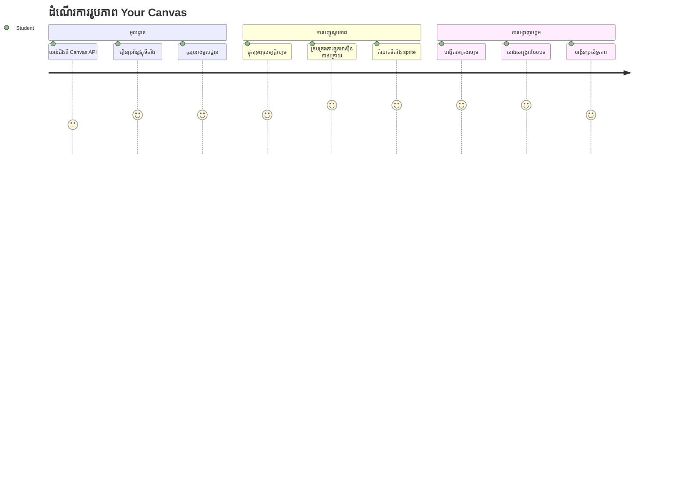
API Canvas គឺជាលក្ខណៈដ៏មានផាសុខភាពបំផុតមួយនៃការអភិវឌ្ឍវេបសម្រាប់បង្កើតក្រាហ្វិកអាក់ទិប និងអន្តរកម្មនៅក្នុងកម្មវិធីរុករករបស់អ្នក។ នៅមេរៀននេះ យើងនឹងបម្លែងធាតុ HTML `<canvas>` ទំនេរនោះទៅជាពិភពហ្គេមដែលពោរពេញដោយវីរបុរស និងឧត្មាន។ ជិតៗនឹងគ្រប់គ្រាន់ថា canvas គឺជាផ្ទៃពណ៌ឌីជីថលរបស់អ្នកដែលកូដក្លាយជាទិដ្ឋភាពមើលឃើញ។

យើងកំពុងបន្តពីអ្វីដែលអ្នកបានរៀននៅមេរៀនមុន ហើយឥឡូវនេះយើងនឹងរំខានទៅលើដំណាក់កាលវិស្វកម្ម។ អ្នកនឹងរៀនពីរបៀបផ្ទុក និងបង្ហាញ sprites ហ្គេម ដាក់តំណាងឲ្យធាតុក្នុងកន្លែងបានយ៉ាងត្រឹមត្រូវ ហើយបង្កើតគ្រឹះនៃទិដ្ឋភាពសម្រាប់ហ្គេមអាកាសចក្រ​របស់អ្នក។ នេះជាព្រួញភ្ជាប់ចន្លោះទំព័រវេបស្ថិតស្ថាបនានិងបទពិសោធន៍អាក់ទិប និងអន្តរកម្ម។

ចុងបញ្ចប់មេរៀននេះ អ្នកនឹងមានទិដ្ឋភាពហ្គេមពេញលេញដែលមានកប៉ាល់វីរបុរសឈរជាក់លើទីតាំងត្រឹមត្រូវ និងរោងចក្រ​សត្រូវ​ត្រៀមសម្រាប់ប្រយុទ្ធ។ អ្នកនឹងយល់ពីរបៀបដែលហ្គេមសម័យទំនើបបង្ហាញក្រាហ្វិកនៅក្នុងកម្មវិធីរុករក និងទទួលបានជំនាញក្នុងការបង្កើតបទពិសោធន៍វីជ្ជមានអន្តរកម្មរបស់អ្នក។ យើងចូលដំណើរការក្រាហ្វិក canvas ហើយនាំហ្គេមអាកាសចក្ររបស់អ្នកទៅជារស់អារម្មណ៍!

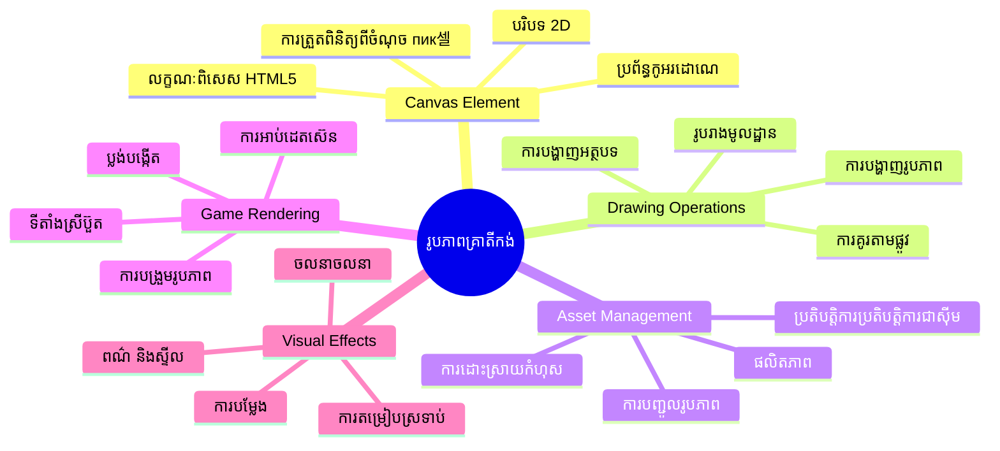
## ប្រលងមុនមេរៀន

[ប្រលងមុនមេរៀន](https://ff-quizzes.netlify.app/web/quiz/31)

## កង់បត់

ហេតុអ្វី `<canvas>` នេះកើតជាអ្វី? វាជាការដោះស្រាយបែប HTML5 សម្រាប់បង្កើតក្រាហ្វិកអាក់ទិប និង animation នៅកម្មវិធីរុករកវេប។ ខុសពីរូបភាព ឬ វីដេអូដែលកំពុងស្ថិតក្នុងលំនាំអចលនា កង់បត់ផ្តល់អ្នកឲ្យគ្រប់គ្រងស្ដុបពិចចតទៅលើអ្វីគ្រប់យ៉ាងដែលបង្ហាញនៅលើអេក្រង់។ នេះធ្វើឲ្យវាសមរម្យសម្រាប់ហ្គេម ការបង្ហាញទិន្នន័យ និងសិល្បៈអន្តរកម្ម។ គិតថាវាជាផ្ទៃគូសដែលអាចកម្មវិធីបាន ដែល JavaScript ក្លាយជាប៊ិចពណ៌របស់អ្នក។

តាមលំនាំវេប ធាតុ canvas មើលទៅជា និងស្រស់ស្រងាត់នៅលើទំព័ររបស់អ្នក។ ប៉ុន្តែភាពអាចធ្វើបានរបស់វាស្ថិតនៅទីនោះ! ឥទ្ធិពលពិតប្រាកដនៃវាបានលេចឡើងពេលអ្នកប្រើ JavaScript គូសរាងកាយ ផ្ទុករូបភាព បង្កើត animation និងធ្វើឲ្យវាគោរពទៅនឹងសកម្មភាពរបស់អ្នកប្រើ។ វាគឺដូចជាប្រព័ន្ធគូសដាច់ដោយឡែកនៅឆ្នាំ 1960 ដែលបុរីបំបែរតម្រៀងក្រាហ្វិកកុំព្យូទ័រដំបូងនៅ Bell Labs បានកម្មវិធីគូសគ្រប់ pixel សម្រាប់បង្កើត animation ដิจីថលដំបូង។

✅ អាន [ព័ត៌មានបន្ថែមអំពី Canvas API](https://developer.mozilla.org/docs/Web/API/Canvas_API) នៅ MDN។

នេះគឺជារបៀបប្រើប្រាស់ធម្មតា ដូចជាផ្នែកមួយក្នុងខ្លឹមសារទំព័រ:

```html
<canvas id="myCanvas" width="200" height="100"></canvas>
```
  
**នេះជាអ្វីដែលកូដនេះបច្ចុប្បន្ន:**
- **កំណត់** attribute `id` ដើម្បីអ្នកអាចយោងទៅកាន់ធាតុ canvas នេះក្នុង JavaScript
- **កំណត់** `width` សម្រាប់គ្រប់គ្រងទំហំផ្ដេករបស់ canvas
- **កំណត់** `height` សម្រាប់កំណត់ទំហំបញ្ឈរ

## គូរសំណុំរូបភាពមូលដ្ឋាន

ឥឡូវនេះ អ្នកយល់ថាធាតុ canvas ជាអ្វី ហើយចាំមើលយ៉ាងច្បាស់ដល់ការគូសលើវា! Canvas ប្រើប្រព័ន្ធសមាសធាតុតំណាង​ទីតាំង ដែលថ្លែងនៅថ្នាក់គណិតវិទ្យា ប៉ុន្តែមានការប្រែប្រួលសំខាន់មួយសម្រាប់ក្រាហ្វិកកុំព្យូទ័រ។

Canvas ប្រើកាត់មានភាគ Cartesian ជាមួយអ័ក្ស x(ផ្ដេក) និងអ័ក្ស y(បញ្ឈរ) ដើម្បីកំណត់ទីតាំងសម្រាប់គ្រប់អ្វីដែលអ្នកគូស។ ប៉ុន្តែចំណុចសំខាន់គឺថា ទីតាំងដើម `(0,0)` ចាប់ផ្តើមពីចំណុចខាងលើឆ្វេង ដោយលំដាប់ x ខ្ពស់ឡើងតាមទិសស្ដាំ និង y ខ្ពស់ឡើងតាមទិសចុះ។ វិធីនេះប្រែពីប្រព័ន្ធគណិតវិទ្យា ដោយសារតែម៉ូនីទ័រកុំព្យូទ័រដំបូងបានធ្វើការស្កេនបំពង់អេឡិចត្រុងពីលើទៅក្រោម ហើយចំណុចខាងលើឆ្វេងគឺចំណុចចាប់ផ្តើមធម្មជាតិ។

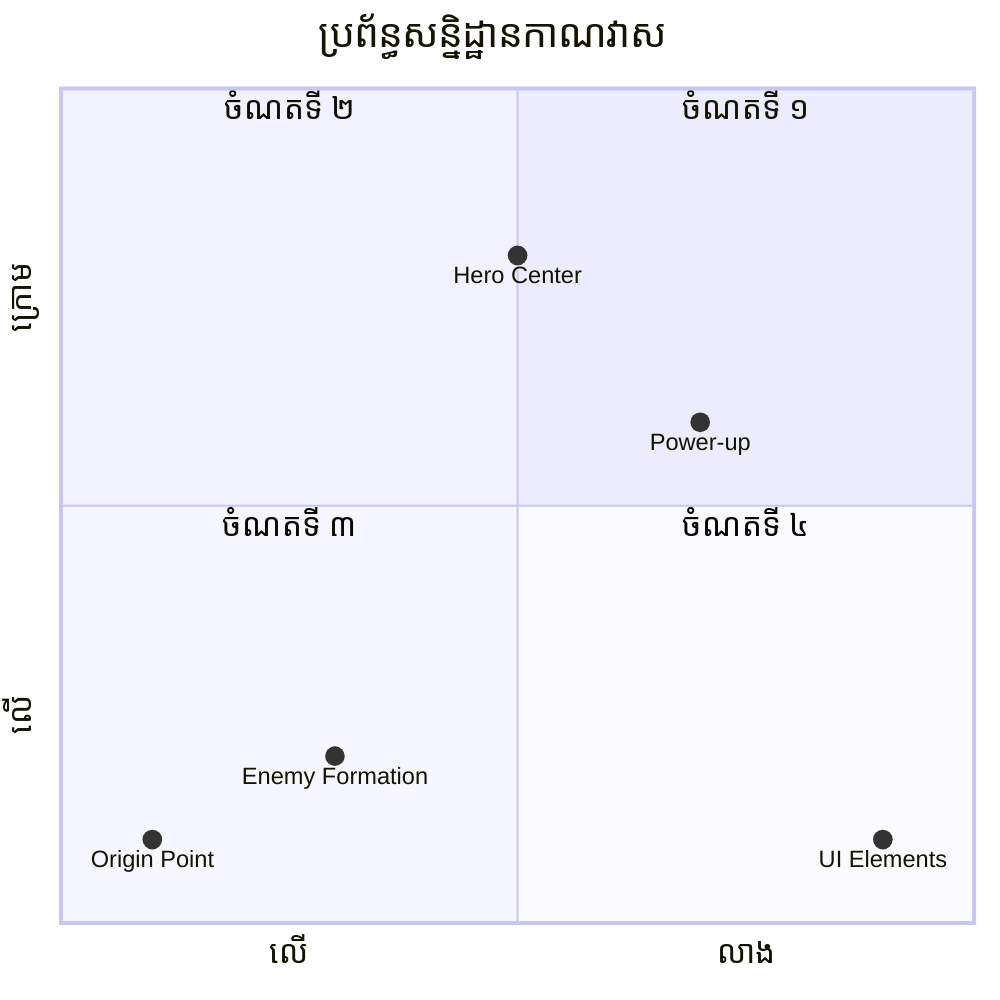
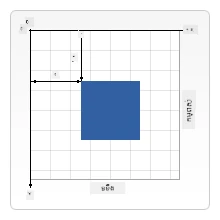  
> រូបភាពពី [MDN](https://developer.mozilla.org/docs/Web/API/Canvas_API/Tutorial/Drawing_shapes)

ដើម្បីគូសលើធាតុ canvas អ្នកនឹងអនុវត្តន៍ដំណើរការបីជំហានដែលជាគ្រឹះនៃក្រាហ្វិក canvas ទាំងមូល។ ម្តងពីអ្នកធ្វើដំណើរនេះជាច្រើនដង វានឹងក្លាយជាការស្រួលនិងធម្មជាតិកន្លងផ្លូវ៖

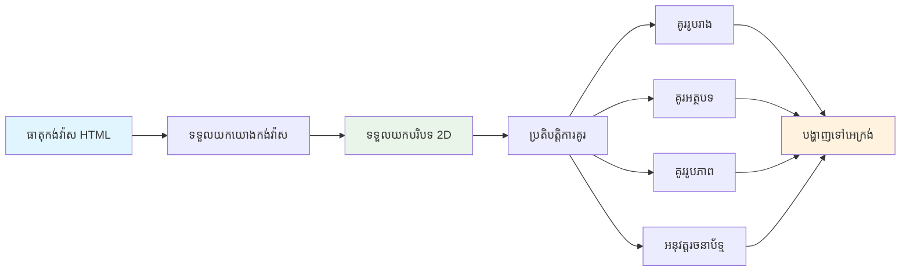
1. **យកយោង** ទៅធាតុ Canvas ពី DOM (ដូចជាធាតុ HTML ផ្សេងទៀត)  
2. **យក context 2D** – នេះផ្តល់មធ្យោបាយគូសទាំងអស់  
3. **ចាប់ផ្តើមគូស!** ប្រើវិធីសាស្រ្ត context ដែលមានរួចសម្រាប់បង្កើតក្រាហ្វិក

នេះជារបៀបដែលវាមើលទៅក្នុងកូដ៖

```javascript
// ជំហាន់ទី ១: ទទួលបានធាតុកង់វាស
const canvas = document.getElementById("myCanvas");

// ជំហាន់ទី ២: ទទួលបានបរិបទគំនូរសៀល ២D
const ctx = canvas.getContext("2d");

// ជំហាន់ទី ៣: កំណត់ពណ៌បំពេញ និងគូរការប្រឡងមួយ
ctx.fillStyle = 'red';
ctx.fillRect(0, 0, 200, 200); // x, y, ទទឹង,高度
```
  
**យើងបំបែកវាជាជំហាន៖**  
- យើង **យក** ធាតុ canvas ជាមួយ ID របស់វា ហើយរក្សាទុកក្នុងអថេរ  
- យើង **យក** context 2D – នេះជាឧបករណ៍គូសរបស់យើង  
- យើង **ប្រាប់** canvas ថាអ្នកចង់បំពេញពណ៌ក្រហមជាមួយ `fillStyle`  
- យើង **គូស** ប្រអប់ចាប់ផ្ដើមពីចំណុចខាងលើឆ្វេង (0,0) ដែលទទឹង និងកម្ពស់ 200 ពិច្សែល

✅ Canvas API ផ្តោតសំខាន់លើរាង 2D ជាទូទៅ ប៉ុន្តែអ្នកអាចគូសធាតុ 3D លើវេបសាយបានដែរ ដោយប្រើ [WebGL API](https://developer.mozilla.org/docs/Web/API/WebGL_API)។

អ្នកអាចគូសអ្វីៗជាច្រើនជាមួយ Canvas API ដូចជា៖

- **រាងគោលមូលអេទិក** ខណៈពេលដែលយើងបានបង្ហាញរបៀបគូសប្រអប់ស្រប ប៉ុន្តែមានអ្វីជាច្រើនទៀតដែលអ្នកអាចគូសបាន។  
- **អត្ថបទ** អ្នកអាចគូសអត្ថបទជាមួយពុម្ពអក្សរ និងពណ៌ដែលអ្នកចង់បាន។  
- **រូបភាព** អ្នកអាចគូសរូបភាពផ្អែកលើទ្រព្យសម្បត្តរូបភាពដូចជា .jpg ឬ .png។

✅ សាកល្បងមើល! អ្នកបានស្គាល់របៀបគូសប្រអប់ សូមព្យាយាមគូសរង្វង់មួយលើទំព័រ។ មើលការគូស Canvas ពិសេសៗនៅ CodePen។ នេះជាឧទាហរណ៍ [ដែលគួរឱ្យទាក់ទាញ](https://codepen.io/dissimulate/pen/KrAwx) មួយ។

### 🔄 **ការត្រួតពិនិត្យបណ្ដុះបណ្ដាល**  
**ការយល់ដឹងនៃមូលដ្ឋាន Canvas**៖ មុនចូលទៅការផ្ទុករូបភាព សូមធានាថាអ្នកអាច៖  
- ✅ ពន្យល់ពីរបៀបប្រព័ន្ធកម្រិតទិដ្ឋភាព canvas ផ្សេងពីប្រព័ន្ធគណិតវិទ្យា  
- ✅ យល់ពីដំណើរការបីជំហាននៃការគូសលើ canvas  
- ✅ ស្គាល់អ្វីដែល context 2D ផ្តល់ជូន  
- ✅ សន្និដ្ឋានពីរបៀបដែល fillStyle និង fillRect បំពេញផ្ទាំងគ្នា

**សាកល្បងខ្លួនឯងលឿន**៖ តើអ្នកធ្វើដូចម្តែងដើម្បីគូសរង្វង់ពណ៌ខៀវ នៅទីតាំង (100, 50) ជាមួយកាំម្រាស់ 25?  
```javascript
ctx.fillStyle = 'blue';
ctx.beginPath();
ctx.arc(100, 50, 25, 0, 2 * Math.PI);
ctx.fill();
```
  
**វិធីសាស្រ្តគូស Canvas ដែលអ្នកបានស្គាល់**៖  
- **fillRect()** ៖ គូសប្រអប់បំពេញពណ៌  
- **fillStyle** ៖ កំណត់ពណ៌ និងលំនាំ  
- **beginPath()** ៖ ចាប់ផ្តើមផ្លូវគូសថ្មី  
- **arc()** ៖ បង្កើតរង្វង់ និងឆ្លង

## ផ្ទុក និងគូសទ្រព្យសម្បត្តរូបភាព

ការគូសរាងកាយមូលដ្ឋានមានប្រយោជន៍សម្រាប់ការចាប់ផ្តើម ប៉ុន្តែហ្គេមភាគច្រើនត្រូវការរូបភាពពិតប្រាកដ! Sprites ផ្ទៃខាងក្រោយ និងបែបផែនគឺជាអ្វីដែលផ្តល់ភាពទាក់ទាញចំពោះហ្គេម។ ការផ្ទុក និងបង្ហាញរូបភាពលើ canvas ផ្ទុយពីការគូសរាងកាយមូលដ្ឋាន ប៉ុន្តែវាងាយស្រួលពេលអ្នកយល់ពីដំណើរការ។

យើងត្រូវបង្កើតធាតុ `Image` មួយ ផ្ទុកឯកសាររូបភាពរបស់យើង (កើតឡើងមិនស្ទាក់ស្ទើរ ដោយមានន័យថា "នៅក្រោយបែបអាស៊ីន") ហើយបន្ទាប់មកគូសវាទៅលើ canvas ពេលវាស្រាក្រោយពីបានទទួលដំណឹង។ វិធីសាស្រ្តនេះធានាថាអ្នកនឹងមើលឃើញរូបភាពបានត្រឹមត្រូវដោយមិនបំរាមកម្មវិធីរបស់អ្នកនៅពេលរូបភាពកំពុងផ្ទុក។

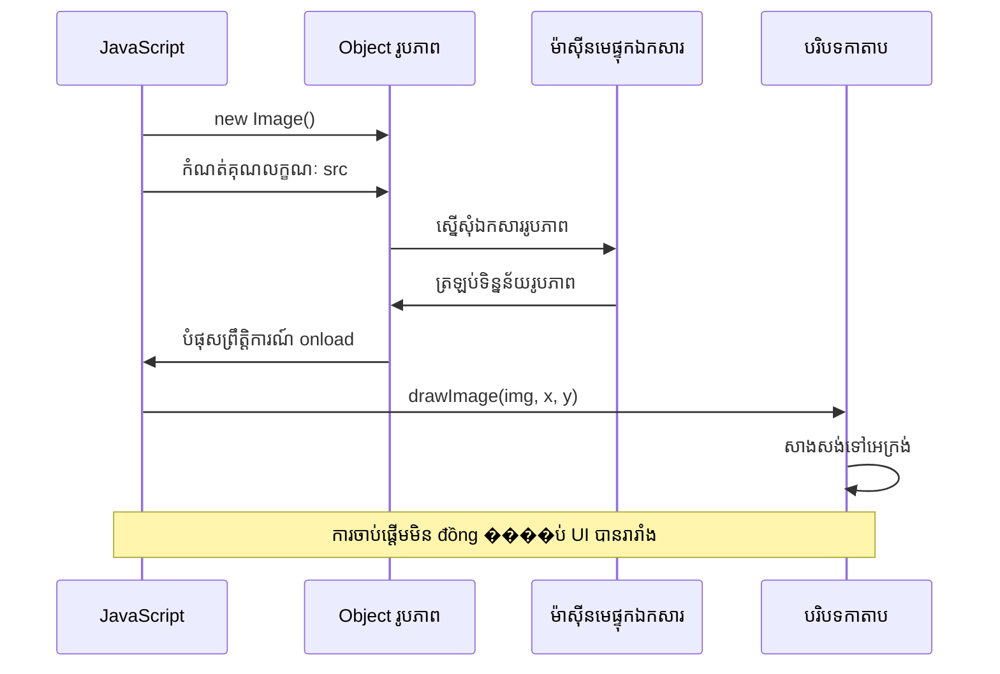
### ការផ្ទុករូបភាពមូលដ្ឋាន

```javascript
const img = new Image();
img.src = 'path/to/my/image.png';
img.onload = () => {
  // រូបភាពបានផ្ទុករួចហើយ និងត្រៀមខ្លួនសម្រាប់ប្រើប្រាស់
  console.log('Image loaded successfully!');
};
```
  
**នេះជាអ្វីកំពុងកើតឡើងក្នុងកូដនេះ៖**  
- យើង **បង្កើត** អត្ថបទ Image ថ្មីមួយដើម្បីរក្សា sprite ឬបែបផែនរបស់យើង  
- យើង **ប្រាប់** វាអំពីផ្លូវឯកសាររូបភាពដែលត្រូវផ្ទុក  
- យើង **ស្តាប់** ព្រឹត្តិការណ៍ផ្ទុក ដើម្បីដឹងពេលរូបភាពមានស្រេចសម្រាប់ប្រើប្រាស់

### វិធីល្អជាងសម្រាប់ផ្ទុករូបភាព

នេះជារបៀបរឹងមាំជាងសម្រាប់ដោះស្រាយការផ្ទុករូបភាពដែលអ្នកអភិវឌ្ឍមួយចំនួនប្រើប្រាស់ជាញឹកញាប់។ យើងនឹងបិទការផ្ទុករូបភាពនៅក្នុងមុខងារ Promise – វិធីនេះបានលេចឡើងពេល JavaScript Promises ក្លាយជារបស់ស្តង់ដារ ES6 ហើយធ្វើឲ្យកូដរបស់អ្នកមានរបៀបរប្រែ ហើយដោះស្រាយករណីបញ្ហាទំនងនានា៖

```javascript
function loadAsset(path) {
  return new Promise((resolve, reject) => {
    const img = new Image();
    img.src = path;
    img.onload = () => {
      resolve(img);
    };
    img.onerror = () => {
      reject(new Error(`Failed to load image: ${path}`));
    };
  });
}

// ការប្រើប្រាស់សម័យទំនើបជាមួយ async/await
async function initializeGame() {
  try {
    const heroImg = await loadAsset('hero.png');
    const monsterImg = await loadAsset('monster.png');
    // រូបភាពឥឡូវនេះរួចរាល់ដើម្បីប្រើប្រាស់
  } catch (error) {
    console.error('Failed to load game assets:', error);
  }
}
```
  
**អ្វីដែលយើងបានធ្វើនៅទីនេះ៖**  
- **បិទ** ការផ្ទុករូបភាពទាំងមូលក្នុង Promise ដើម្បីដោះស្រាយល្អប្រសើរជាងមុន  
- **បន្ថែម** ការដោះស្រាយកំហុសដែលប្រាប់ពេលមានបញ្ហារួច  
- **ប្រើ** សំរាប់ async/await ដែលទាក់ទាញ និងអាចអានបានស្រួល  
- **រាប់បញ្ចូល** try/catch ដើម្បីគ្រប់គ្រងករណីបញ្ហានៅពេលផ្ទុក

បន្ទាប់ពីរូបភាពរបស់អ្នកផ្ទុករួច ការគូសវាទៅលើ canvas គឺថែមទាំងងាយស្រួល៖

```javascript
async function renderGameScreen() {
  try {
    // ផ្ទុកទ្រព្យសម្បត្តិហ្គេម
    const heroImg = await loadAsset('hero.png');
    const monsterImg = await loadAsset('monster.png');

    // ទទួលយកកង់វាស និងបរិបទ
    const canvas = document.getElementById("myCanvas");
    const ctx = canvas.getContext("2d");

    // គូររូបភាពទៅទីតាំងជាក់លាក់
    ctx.drawImage(heroImg, canvas.width / 2, canvas.height / 2);
    ctx.drawImage(monsterImg, 0, 0);
  } catch (error) {
    console.error('Failed to render game screen:', error);
  }
}
```
  
**ដំណើរការបញ្ជាក់ជាជំហាន៖**  
- យើង **ផ្ទុក** រូបភាពវីរបុរស និងឧត្មាននៅខាងក្រោមដោយប្រើ await  
- យើង **យក** អក្សរ canvas និង context 2D ដែលយើងត្រូវការ  
- យើង **ដាក់ទីតាំង** រូបភាពវីរបុរស នៅចន្លោះកណ្តាល ខាងក្រោមដោយប្រើគណិតវិទ្យាឧបករណ៍សម្រួល  
- យើង **ដាក់** រូបភាពឧត្មាន នៅចំណុចខាងលើឆ្វេង ដើម្បីចាប់ផ្តើមរៀបចំក្រុមសត្រូវ  
- យើង **ចាប់** កំហុសដែលអាចកើតឡើងនៅពេលផ្ទុក ឬ គូសការ�ร์

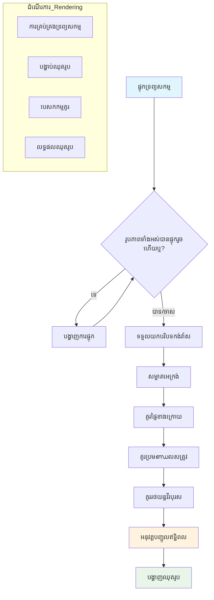
## ឥឡូវនេះគឺពេលវេលាចាប់ផ្តើមបង្កើតហ្គេមរបស់អ្នក

ឥឡូវនេះយើងនឹងដាក់គ្រប់អ្វីគ្នាចូលគ្នាដើម្បីបង្កើតគ្រឹះទិដ្ឋភាពសម្រាប់ហ្គេមអាកាសចក្រ។ អ្នកមានការយល់ដឹងជាក់លាក់ទាន់សម័យពីមូលដ្ឋាន canvas និងបច្ចេកទេសផ្ទុករូបភាព ដូច្នេះផ្នែកអនុវត្តនេះនឹងនាំអ្នកកាន់ផ្លូវក្នុងការបង្កើតផ្ទាំងហ្គេមពេញលេញដែលមានតំណាងត្រឹមត្រូវ។

### អ្វីដែលត្រូវបង្កើត

អ្នកនឹងបង្កើតគេហទំព័រមួយដែលមានធាតុ Canvas មួយ។ វាគួរត្រូវបង្ហាញអេក្រង់ខ្មៅទំហំ `1024*768`។ យើងបានផ្តល់រូបភាពពីរ៖

- កប៉ាល់វីរបុរស

   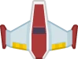

- ៥*៥ ឧត្មាន

   

### ជំហានណែនាំដើម្បីចាប់ផ្តើមអភិវឌ្ឍន៍

ស្គាល់ឯកសារចាប់ផ្តើមដែលបានបង្កើតសំរាប់អ្នកក្នុងថត `your-work`។ រចនាសម្ព័ន្ធគម្រោងរបស់អ្នកគួរត្រូវមាន៖

```bash
your-work/
├── assets/
│   ├── enemyShip.png
│   └── player.png
├── index.html
├── app.js
└── package.json
```
  
**នេះជាអ្វីដែលអ្នកកំពុងធ្វើការ៉:**
- **Sprites ហ្គេម** ស្នាក់នៅក្នុងថត `assets/` ដើម្បីរក្សាប្រកបដោយរបៀប  
- **ឯកសារ HTML សំខាន់** រៀបចំបង្កើតធាតុ canvas និងរៀបចំទាំងអស់  
- **ឯកសារ JavaScript មួយ** ដែលអ្នកនឹងសរសេរជូតកម្មវិធីគូសហ្គេមរបស់អ្នក  
- **package.json** ដែលរៀបចំម៉ាស៊ីនបម្រើដើម្បីអ្នកអាចសាកល្បងនៅក្នុងកុំព្យូទ័រជាផ្ទាល់

បើកថតនេះក្នុង Visual Studio Code ដើម្បីចាប់ផ្តើមអភិវឌ្ឍចូរប្រេកង់។ អ្នកនឹងត្រូវមានបរិយាកាសអភិវឌ្ឍក្នុងកុំព្យូទ័រជាមួយ Visual Studio Code, NPM និង Node.js បានដំឡើងរួចហើយ។ ប្រសិនបើអ្នកមិនទាន់មាន `npm` នៅលើកុំព្យូទ័រអ្នកដូចម្តេច [នេះជាវិធីដំឡើងវា](https://www.npmjs.com/get-npm)។

ចាប់ផ្តើមម៉ាស៊ីនបម្រើអភិវឌ្ឍកម្មដោយទៅកាន់ថត `your-work`៖

```bash
cd your-work
npm start
```
  
**ពាក្យបញ្ជានេះធ្វើអ្វីខ្លះ៖**
- **ចាប់ផ្តើម** ម៉ាស៊ីនបម្រើមូលដ្ឋាននៅ `http://localhost:5000` ដើម្បីសាកល្បងហ្គេមនេះ  
- **បម្រុះ** ឯកសាររបស់អ្នកទាំងអស់ ដើម្បីកម្មវិធីរុករករុស្ស៊ីស៍អាចផ្ទុកវាយ៉ាងត្រឹមត្រូវ  
- **តាមដាន** ឯកសាររបស់អ្នកសម្រាប់ការផ្លាស់ប្តូរ ដើម្បីអ្នកអាចអភិវឌ្ឍបានរលូន  
- **ផ្តល់** បរិយាកាសអភិវឌ្ឍរូបមន្តដ៏ទំនើបដើម្បីសាកល្បងគ្រប់អ្វីគ្រប់យ៉ាង

> 💡 **សម្គាល់**៖ រុករករបស់អ្នកនឹងបង្ហាញទំព័រទំនេរបឋមមួយ — វាជារឿងធម្មតា! ពេលអ្នកបន្ថែមកូដ សូមបញ្ចេញទៅម៉ាស៊ីនរុករកដើម្បីមើលការផ្លាស់ប្តូររបស់អ្នក។ វិធីអភិវឌ្ឍបែបបន្តបន្ទាប់នេះស្រដៀងទៅនឹងរបៀប NASA បង្កើតកុំព្យូទ័រជំនួយ Apollo — សាកល្បងមុខងារក្រោមមូលដ្ឋានមុនចូលរួមជាមួយប្រព័ន្ធធំធេង។

### បន្ថែមកូដ

បញ្ចូលកូដតាមការទាមទារ នៅ `your-work/app.js` ដើម្បីបញ្ចប់ភារកិច្ចដូចខាងក្រោម៖

1. **គូសកង់បត់ជាមួយផ្ទៃខ្មៅ**  
   > 💡 **របៀបធ្វើ**៖ រក TODO នៅក្នុង `/app.js` ហើយបន្ថែមតែបន្ទាត់ពីរ។ កំណត់ `ctx.fillStyle` ជាពណ៌ខ្មៅ បន្ទាប់មកប្រើ `ctx.fillRect()` ចាប់ផ្ដើមពី (0,0) ជាមួយវិមាត្រគង់បត់របស់អ្នក។ ងាយស្រួល!

2. **ផ្ទុកបែបផែនហ្គេម**  
   > 💡 **របៀបធ្វើ**៖ ប្រើ `await loadAsset()` ដើម្បីផ្ទុករូបភាពអ្នកលេង និងសត្រូវ។ រក្សាទុកក្នុងអថេរដើម្បីប្រើក្រោយ។ ចាំថាវានឹងមិនបង្ហាញរហូតដល់ពេលអ្នកគូសវា!

3. **គូសកប៉ាល់វីរបុរសនៅចន្លោះខាងក្រោម**  
   > 💡 **របៀបធ្វើ**៖ ប្រើ `ctx.drawImage()` ដាក់កប៉ាល់វីរបុរស។ សម្រាប់អ័ក្ស x សាកល្បង `canvas.width / 2 - 45` ដើម្បីកណ្តាលវា ហើយសម្រាប់អ័ក្ស y ប្រើ `canvas.height - canvas.height / 4` ដើម្បីដាក់វាក្នុងតំបន់ខាងក្រោម។

4. **គូសរៀបចំទ្រង់ទ្រាយឧត្មាន 5×5**  
   > 💡 **របៀបធ្វើ**៖ រកមុខងារ `createEnemies` ហើយបង្កើតរង្វិលរង្វល់មួយចំនួន។ អ្នកត្រូវមានគណនាគំនិតបន្ថែមសម្រាប់ចន្លោះ និងទីតាំង ប៉ុន្តែអត់បារម្ភ—ខ្ញុំនឹងបង្ហាញអ្នកយ៉ាងច្បាស់!

សិនមុន អ្នកកំណត់ថេរដើម្បីរៀបចំកំណត់រចនាសម្ព័ន្ធត្រឹមត្រូវសម្រាប់ទ្រង់ទ្រាយសត្រូវ៖

```javascript
const ENEMY_TOTAL = 5;
const ENEMY_SPACING = 98;
const FORMATION_WIDTH = ENEMY_TOTAL * ENEMY_SPACING;
const START_X = (canvas.width - FORMATION_WIDTH) / 2;
const STOP_X = START_X + FORMATION_WIDTH;
```
  
**យើងបំបែកអ្វីដែលថេរទាំងនេះធ្វើយ៉ាងដូចម្តេច៖**  
- យើង **កំណត់** 5 សត្រូវក្នុងមួយជួរ និងមួយជួរឈរ (បណ្តុំបែប 5×5 ស្រស់ស្អាត)  
- យើង **កំណត់** ចន្លោះដែលបង្កើតចន្លោះពីរវាងសត្រូវ ដូច្នេះវាមិនរំខានគ្នា  
- យើង **គណនា** ទទឹងសរុបនៃរោងចក្រ  
- យើង **កំណត់** ចំណុចចាប់ផ្តើម និងបញ្ចប់ ដើម្បីឲ្យរោងចក្រ​មើលទៅកណ្តាល

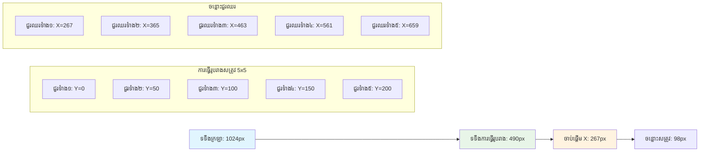
បន្ទាប់មក បង្កើតរង្វិលជំរៅ សម្រាប់គូសរៀបចំសត្រូវ៖

```javascript
for (let x = START_X; x < STOP_X; x += ENEMY_SPACING) {
  for (let y = 0; y < 50 * 5; y += 50) {
    ctx.drawImage(enemyImg, x, y);
  }
}
```
  
**រង្វិលជំរៅនេះធ្វើអ្វី៖**  
- រង្វិលខាងក្រៅ **ចាប់ផ្ដើម** ពីឆ្វេងទៅស្ដាំចំងាយរោងចក្រ  
- រង្វិលខាងក្នុង **ចូល** ពីលើទៅក្រោមដើម្បីបង្កើតជួរដែលអូរអង្វែង  
- យើង **គូស** រាល់អាស្រុយសត្រូវនៅតាមទីតាំង x,y ដែលបានគណនា  
- អ្វីៗគ្នា **គោរពចន្លោះសមស្រប** ដើម្បីឲ្យវាបង្ហាញជារូបកាយមានវិជ្ជាជីវៈ និងរៀបចំ

### 🔄 **ការត្រួតពិនិត្យបណ្ដុះបណ្ដាល**  
**ជំនាញគូសហ្គេម**៖ ពិនិត្យការយល់ដឹងរបស់អ្នកចំពោះប្រព័ន្ធគូសពេញលេញ៖  
- ✅ តើការផ្ទុករូបភាពអាស៊ីន ធ្វើដូចម្តេចដើម្បីកុំឱ្យ UI ត្រូវបានរារាំងពេលចាប់ផ្តើមហ្គេម?  
- ✅ ហេតុអ្វីយើងគណនាទីតាំងរោងចន្រសត្រូវដោយប្រើថេរដែលមិនមានការការបញ្ចូលតម្លៃម្នាក់មួយដូច្នេះ?  
- ✅ តើ context 2D មានតួនាទីអ្វីក្នុងប្រតិបត្តិការគូស?  
- ✅ រង្វិលរង្វល់យ៉ាងដូចម្តេចធ្វើអោយរោងចក្រ sprites រឹងរូស និងរៀបចំ?

**គោលការណ៍ការសម្របសម្រួល ការអនុវត្ត**: ហ្គេមរបស់អ្នកឥឡូវនេះបង្ហាញ៖  
- **ការផ្ទុកទ្រព្យសម្បត្តបានទាន់ពេលវេលា និងមានប្រសិទ្ធភាព**: ការគ្រប់គ្រងរូបភាពផ្អែកលើ Promise  
- **ការរៀបចំគូស**: ប្រតិបត្តិការគូសមានរបៀបរៀបចំ  
- **ការកំណត់ទីតាំងគណិតវិទ្យា**: កំណត់ទីតាំង sprites ដោយគណនា  
- **ការគ្រប់គ្រងកំហុស**: គ្រប់គ្រងបរាជ័យដោយរបៀបស្ដើង

**គំនិតកម្មវិធីវិស្វកម្មអាក់ទិប**: អ្នកបានរៀន៖
- **ប្រព័ន្ធសមាសធាតុ**: បកប្រែគណិតវិទ្យាទៅទីតាំងលើអេក្រង់  
- **ការគ្រប់គ្រងតួអក្សរ**: ដំណើរការនិងបង្ហាញក្រាហ្វិកនៅក្នុងហ្គេម  
- **អាល់ហ្គរីធម៍បង្កើតទ្រង់ទ្រាយ**: លំនាំគណិតសម្រាប់ការតម្រៀបដំណើរការ  
- **ប្រតិបត្តិការ Async**: JavaScript សម័យថ្មីសម្រាប់បទពិសោធន៍អ្នកប្រើរលូន  

## លទ្ធផល

លទ្ធផលចប់គួរតែដូចជា៖

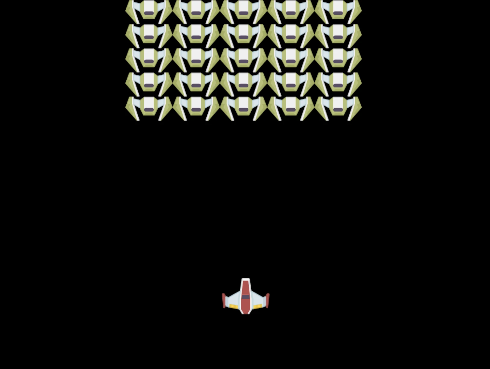

## ដំណោះស្រាយ

សូមព្យាយាមដោះស្រាយដោយខ្លួនឯងមុន ប៉ុន្តេទើបបើអ្នកមានបញ្ហា សូមមើល [ដំណោះស្រាយ](../../../../6-space-game/2-drawing-to-canvas/solution/app.js)

---

## ស្វល់ហ្វូកសម្រាប់ GitHub Copilot Agent 🚀

ប្រើរបៀប Agent ដើម្បីបញ្ចប់ហ្គេមបន្ទាប់៖

**បរិយាយ៖** ពង្រឹងបទសម្តែងហ្គេមលើកញ្ចក់ដោយបន្ថែមភាពតែមួយ និងធាតុមានអន្តរកម្មប្រើវិធីសាស្ត្ររបស់ Canvas API ដែលអ្នកបានសិក្សា។

**ការជម្រុញ៖** បង្កើតឯកសារថ្មី `enhanced-canvas.html` មានកញ្ចក់ដែលបង្ហាញផ្កាយមានចលនានៅផ្ទៃខាងក្រោយ ស្អិតសុខភាពជំរុញសម្រាប់ក្រុមហ៊ុនតួអង្គ ហើយកំណត់នាវាចចកដែលចល័តចុះយឺតៗ។ រួមបញ្ចូលកូដ JavaScript ដែលគំនូសផ្កាយបំភ្លឺដោយទីតាំង និងភាពអាំងតោបចៃដន្យ អនុវត្តស្រ្តីប៉ុលសុខភាពដែលប្ដូរពណ៌ស្របតាមកម្រិតសុខភាព (បៃតង > លឿង > ក្រហម) និងចលនានាវាចចកសត្រូវធ្វើចុះអេក្រង់ដោយល្បឿនខុសគ្នា។

ស្វែងយល់បន្ថែមអំពី [របៀប agent](https://code.visualstudio.com/blogs/2025/02/24/introducing-copilot-agent-mode) នៅទីនេះ។

## 🚀 ការប្រកួត

អ្នកបានសិក្សារបៀបគំនូសជាមួយ Canvas API ដែលផ្តោតលើ 2D សូមពិនិត្យមើល [WebGL API](https://developer.mozilla.org/docs/Web/API/WebGL_API) ហើយព្យាយាមគំនូសវត្ថុ 3D មួយ។

## សំណួរបន្ទាប់បន្ទាប់ពីមេរៀន

[សំណួរបន្ទាប់បន្ទាប់ពីមេរៀន](https://ff-quizzes.netlify.app/web/quiz/32)

## ពិនិត្យ & សិក្សាផ្ទាល់ខ្លួន

សូមស្វែងយល់បន្ថែមអំពី Canvas API ដោយ [អានអំពីវា](https://developer.mozilla.org/docs/Web/API/Canvas_API)។

### ⚡ **អ្វីដែលអ្នកអាចធ្វើបានក្នុង ៥ នាទីក្រោយនេះ**
- [ ] បើកកុងសូលរុក្ខជាតិ និងបង្កើតធាតុកញ្ចក់ដោយ `document.createElement('canvas')`
- [ ] ព្យាយាមគំនូសប្រអប់ដោយ `fillRect()` លើ context នៃកញ្ចក់
- [ ] សាកល្បងពណ៌ផ្សេងៗដោយ `fillStyle`  
- [ ] គំនូសរាងវង់សាមញ្ញដោយវិធី `arc()`

### 🎯 **អ្វីដែលអ្នកអាចសម្រេចបានក្នុងម៉ោងនេះ**
- [ ] បញ្ចប់សំណួរបន្ទាប់បន្ទាប់ពីមេរៀន និងយល់ពីមូលដ្ឋាននៅក្នុង canvas  
- [ ] បង្កើតកម្មវិធីគំនូសកញ្ចក់ជាមួយរាងនិងពណ៌ច្រើន  
- [ ] អនុវត្តទទួលរូបភាពនិងបង្ហាញតួអក្សរនៅក្នុងហ្គេម  
- [ ] បង្កើតកម្មវិធីចលនាសាមញ្ញដែលផ្លាស់ទីវត្ថុតាមកញ្ចក់  
- [ ] ហាត់ធ្វើបំលែងកញ្ចក់ដូចជា ការតម្រែតម្រង់ ការបង្វិល និងការប្រែទីតាំង  

### 📅 **ដំណើរការកញ្ចក់របស់អ្នកបន្ដទៀតមួយសប្តាហ៍**
- [ ] បញ្ចប់ហ្គេមលើទីតាំងមហាសមុទ្រជាមួយក្រាហ្វិកទាន់សម័យ និងចលនាតួអក្សរ  
- [ ] ជំនាញខ្លាំងកាន់តែខ្ពស់នៅក្នុងវិធីសាស្ត្រកញ្ចក់ដូចជាការរចនាចម្រូងចម្រាស់ ថ្នាក់ពណ៌ និងការបង្រួម  
- [ ] បង្កើតវិស្វកម្មមានអន្តរកម្មប្រើកញ្ចក់សម្រាប់តំណាងទិន្នន័យ  
- [ ] ស្វែងយល់អំពីបច្ចេកទេសបង្កើនប្រសិទ្ធភាពកញ្ចក់ដើម្បីមានការប្រតិបត្តិការស្ទើរបាត់បង់  
- [ ] បង្កើតកម្មវិធីគំនូសឬគំនូរស្ទាត់ជាមួយឧបករណ៍ជាច្រើន  
- [ ] ស្ទាត់ខ្លួនលើលំនាំសរសេរកូដច្នៃប្រឌិត និងសិល្បៈបង្កើតដោយកញ្ចក់  

### 🌟 **ចំណេះដឹងក្រាហ្វិករបស់អ្នកបន្ដរយៈខែ**
- [ ] បង្កើតកម្មវិធីវិស្វកម្មតាមប្រព័ន្ធកញ្ចក់ 2D និង WebGL  
- [ ] សិក្សាអំពីគន្លងប្រព័ន្ធក្រាហ្វិកនិងមូលដ្ឋាន shader  
- [ ] រួមចំណែកក្នុងបណ្ណាល័យក្រាហ្វិក Open Source និងឧបករណ៍ប្រើប្រាស់វិស្វកម្ម  
- [ ] ជំនាញមេនៅការបង្កើនប្រសិទ្ធភាពចំពោះកម្មវិធីក្រាហ្វិកដ៏ស្មុគស្មាញ  
- [ ] បង្កើតមាតិការអប់រំអំពីកម្មវិធីកញ្ចក់ និងក្រាហ្វិកកុំព្យូទ័រ  
- [ ] ក្លាយជាអ្នកជំនាញផ្នែកកម្មវិធីក្រាហ្វិកដែលជួយអ្នកដទៃបង្កើតបទពិសោធន៍វិស្វកម្ម  

## 🎯 កាលវិភាគជំនាញកញ្ចក់ក្រាហ្វិករបស់អ្នក

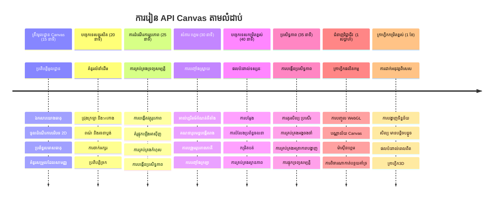
### 🛠️ សង្ខេបកញ្ចក់ក្រាហ្វិក Toolkit របស់អ្នក

បន្ទាប់ពីបញ្ចប់មេរៀននេះ អ្នកមាន៖  
- **ជំនាញ Canvas API**: យល់ដឹងពេញលេញអំពីកម្មវិធីក្រាហ្វិក 2D  
- **គណិតវិទ្យាដាក់ទីតាំង**: ការគណនាកំណត់ទីតាំង និងអាល់ហ្គរីធម៍បង្កើតទ្រង់ទ្រាយ  
- **គ្រប់គ្រងទ្រព្យសម្បត្តិ**: ដំណើរការផ្ទុករូបភាព និងដោះស្រាយកំហុសយ៉ាងជំនាញ  
- **បង្កើតរូបភាព**: វិធីសាស្ត្រតម្រៀបសត្វតួអក្សរ និងស្ថាបត្យកម្មសន្ទស្សន៍  
- **កម្មវិធី Async**: គំរូ JavaScript សម័យថ្មីសម្រាប់ប្រសិទ្ធភាពរលូន  
- **កម្មវិធីវិស្វកម្ម**: បកប្រែក្រឹត្យគណិតទៅក្រាហ្វិកលើអេក្រង់  

**កម្មវិធីប្រែប្រួលជាក់ស្តែង**: ជំនាញ Canvas របស់អ្នកអាចប្រើបានត្រង់ៈ  
- **បង្ហាញទិន្នន័យ**: តារាង ក្រាហ្វ និងបន្ទះផ្ទាំងអន្តរកម្ម  
- **បង្កើតហ្គេម**: ហ្គេម 2D, ហេតុការណ៍ក្លែងក្លាយ និងបទពិសោធន៍អន្តរកម្ម  
- **សិល្បៈឌីជីថល**: កូដដែលមានភាពច្នៃប្រឌិត និងសិល្បៈបង្កើត  
- **រចនាគណនី UI/UX**: ក្រាហ្វិចផ្ទាល់ខ្លួន និងធាតុអន្តរកម្ម  
- **កម្មវិធីអប់រំនិងសិក្សា**: ឧបករណ៍សិក្សាទស្សនាវដ្តី និងហ្គេម  
- **កម្មវិធីបណ្ដាញ**: ក្រាហ្វិចសំរាប់ការបង្ហាញតាមពេលវិញវិល  

**ជំនាញជំនាញជំនាញវិជ្ជាជីវៈ**: អ្នកឥឡូវនេះអាច  
- **បង្កើត** ដំណោះស្រាយក្រាហ្វិចផ្ទាល់ខ្លួនដោយគ្មានបណ្ណាល័យខាងក្រៅ  
- **បង្កើនប្រសិទ្ធភាព** ការបង្ហាញក្រាហ្វិកដើម្បីផ្តល់បទពិសោធន៍រលូន  
- **កំហុស** ពិសោធន៍ទន់ភ្លន់ដោយប្រើឧបករណ៍អ្នកអwickធានកកម្មវិធី  
- **រចនា** ប្រព័ន្ធក្រាហ្វិកធំទូលាយដោយគោលការផ្អែកលើគណិតវិទ្យា  
- **បញ្ចូល** ក្រាហ្វិក Canvas ជាមួយស៊ុមកម្មវិធីបណ្ដាញទំនើប  

**វិធីសាស្ត្រ Canvas API ដែលអ្នកជំនាញ**:  
- **គ្រប់គ្រងធាតុ**: getElementById, getContext  
- **ប្រតិបត្តិការ គំនូស**: fillRect, drawImage, fillStyle  
- **ការផ្ទុកទ្រព្យសម្បត្តិ**: វត្ថុរូបភាព, គំរូ Promise  
- **ការគណនា ទីតាំងគណិតវិទ្យា**: ការគណនា និងអាល់ហ្គរីធម៍បង្កើតទ្រង់ទ្រាយ  

**ជំហានបន្ទាប់**: អ្នករួចរាល់ក្នុងការបន្ថែមចលនា អន្តរកម្មអ្នកប្រើ បំភ្លឺបញ្ហាប៉ះទង្គិច ឬស្វែងរក WebGL សម្រាប់ក្រាហ្វិក 3D!

🌟 **ការាល់ជោគជ័យ**: អ្នកបានបង្កើតប្រព័ន្ធបង្ហាញហ្គេមពេញលេញដោយប្រើបច្ចេកវិទ្យា Canvas API មូលដ្ឋាន!

## បេសកកម្ម

[លេងជាមួយ Canvas API](assignment.md)

---

<!-- CO-OP TRANSLATOR DISCLAIMER START -->
**ការបដិសេធ**៖  
ឯកសារនេះត្រូវបានបកប្រែដោយប្រើសេវាកម្មបកប្រែ AI [Co-op Translator](https://github.com/Azure/co-op-translator)។ ខណៈដែលយើងខិតខំរកភាពត្រឹមត្រូវ សូមយល់ព្រមថាការបកប្រែដោយស្វ័យប្រវត្តិក្នុងខ្លះអាចមានកំហុសឬភាពមិនត្រឹមត្រូវ។ ឯកសារដើមនៅក្នុងភាសាមាតৃភាសាគួរត្រូវបានគិតជាមធ្យោបាយយុទ្ធសាស្ត្រមានអំណាច។ សម្រាប់ព័ត៌មានមានសារៈសំខាន់ ការបកប្រែដោយមនុស្សជំនាញគឺត្រូវបានផ្តល់អនុសាសន៍។ យើងមិនទទួលខុសត្រូវចំពោះការយល់ច្រឡំ ឬការពន្យល់ខុសចេញពីការប្រើប្រាស់ការបកប្រែមួយនេះឡើយ។
<!-- CO-OP TRANSLATOR DISCLAIMER END -->